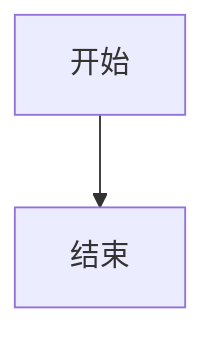

# Mermaid 设置总结

## 已完成的配置

### 1. 配置文件修改

**_config.yml**
- 添加了 Mermaid 配置section
- 增强了 Kramdown 处理配置
- 添加了包含文件设置

### 2. 创建的文件

**_includes/mermaid.html**
- Mermaid JavaScript 加载和初始化
- 自动处理 `.language-mermaid` 代码块
- 响应式CSS样式
- 按需加载（只在设置 `mermaid: true` 的页面加载）

**_posts/2025-01-20-mermaid-guide.md**
- 详细的使用指南
- 包含各种图表类型示例
- 配置和使用说明

### 3. 文件更新

**_posts/2025-06-06-embabel-agent-guide.md**
- 在 front matter 中添加了 `mermaid: true`
- 现在该文章中的 Mermaid 图表可以正常显示

## 使用方法

### 1. 在文章中启用 Mermaid
在文章的 front matter 中添加：
```yaml
---
title: "您的文章标题"
mermaid: true
---
```

### 2. 添加图表
使用标准的 Mermaid 代码块语法：
```

```

### 3. 支持的图表类型
- 流程图 (flowchart)
- 序列图 (sequence diagram)
- 甘特图 (gantt chart)
- 类图 (class diagram)
- 状态图 (state diagram)
- 等等...

## 主要特性

✅ **按需加载**：只在需要的页面加载脚本
✅ **响应式设计**：自动适配移动设备
✅ **主题配置**：可通过 _config.yml 自定义
✅ **版本控制**：支持指定 Mermaid 版本
✅ **优雅样式**：自动添加边框和居中显示

## 测试

您可以通过以下方式测试：

1. 访问新创建的指南文章：`/jekyll/教程/2025/01/20/mermaid-guide.html`
2. 查看原始的 Embabel Agent 指南：`/ai/agent-framework/spring-boot/2025/06/06/embabel-agent-guide.html`
3. 构建并本地预览：`bundle exec jekyll serve`

现在您的 Jekyll 博客已经完全支持 Mermaid 图表了！🎉 