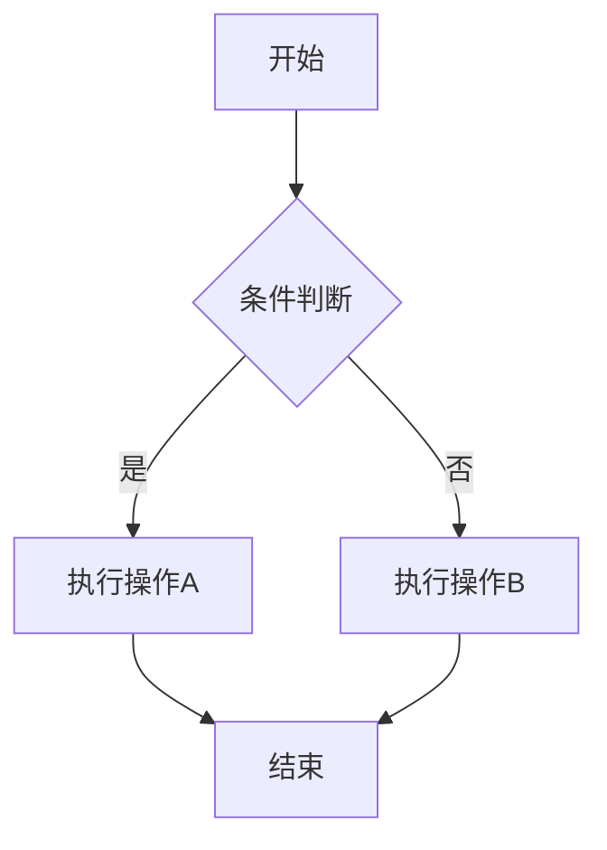
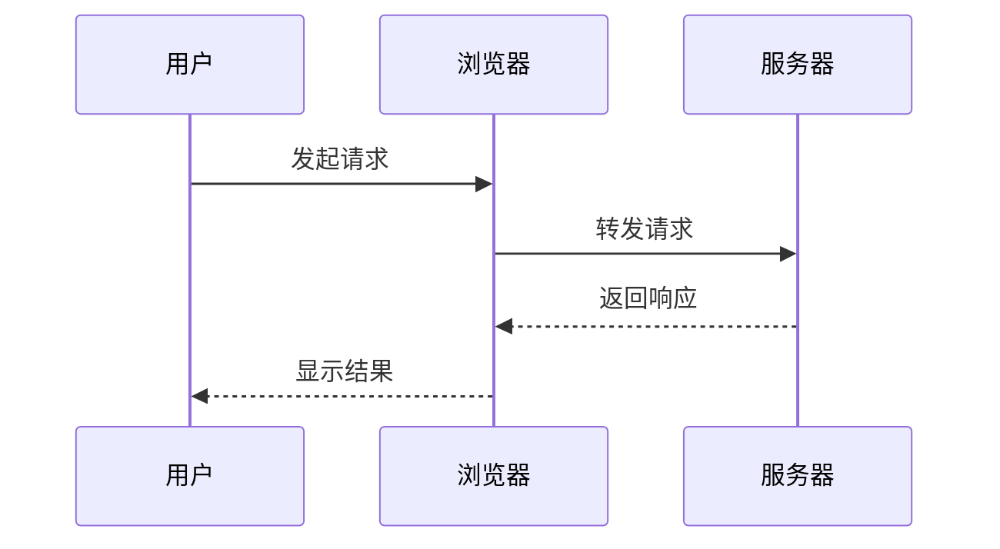
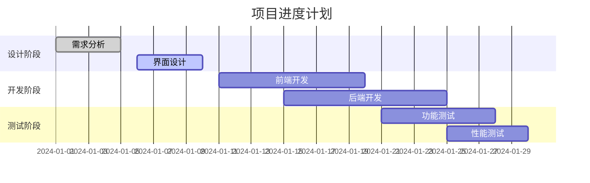
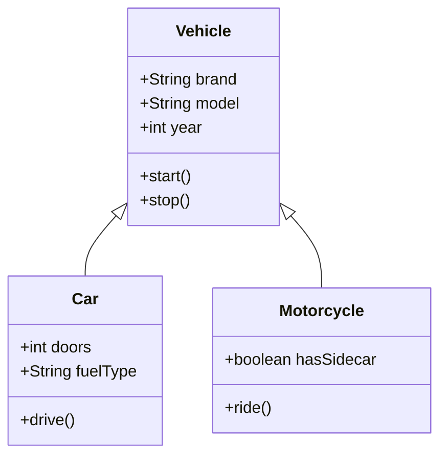

# Jekyll 博客中使用 Mermaid 图表指南

本文介绍如何在Jekyll博客中通过配置`_config.yml`来支持Mermaid图表。

## 配置方法

### 1. 在 `_config.yml` 中添加配置

```yaml
# Mermaid配置
mermaid:
  enabled: false  # 全局禁用，在需要的页面单独启用
  version: "10.6.1"  # CDN版本
  theme: "default"  # 主题
```

### 2. 在文章的 Front Matter 中启用

在需要使用Mermaid的文章开头添加：

```yaml
---
title: "您的文章标题"
mermaid: true
---
```

## 图表示例

### 流程图



### 序列图



### 甘特图



### 类图



## 主要特性

1. **按需加载**：只在设置了 `mermaid: true` 的页面加载相关脚本
2. **响应式设计**：图表自动适配不同屏幕尺寸
3. **主题配置**：可通过 `_config.yml` 自定义主题
4. **版本控制**：可指定特定的Mermaid版本

## 注意事项

1. 在文章的 Front Matter 中添加 `mermaid: true`
2. 使用 ````mermaid` 代码块语法
3. 确保 Mermaid 语法正确
4. 图表会自动居中显示并添加边框样式

现在您可以在Jekyll博客中轻松使用Mermaid图表了！ 