# Google Gemini LangGraph 全栈快速入门：构建智能研究代理的终极指南

## 项目概述

在人工智能快速发展的今天，单纯的问答系统已经无法满足复杂的研究需求。Google 最新开源的 **Gemini LangGraph 全栈快速入门项目** 展示了如何构建一个真正智能的研究代理，它不仅能理解用户查询，还能主动搜索、分析和综合信息，最终提供带有可靠引用的深度答案。

这个项目结合了 **React 前端**、**LangGraph 后端**和 **Google Gemini 2.5** 模型，实现了一个完整的端到端智能研究系统。它的工作方式就像一个经验丰富的研究助手，能够：

- 🔍 **动态查询生成**：根据用户问题智能生成搜索查询
- 🌐 **网络研究**：使用 Google Search API 获取实时信息
- 🤔 **反思推理**：分析搜索结果，识别知识差距
- 🔄 **迭代优化**：自动改进搜索策略直到获得满意答案
- 📋 **引用生成**：提供完整的信息来源和引用

## 技术架构解析

### 整体架构图

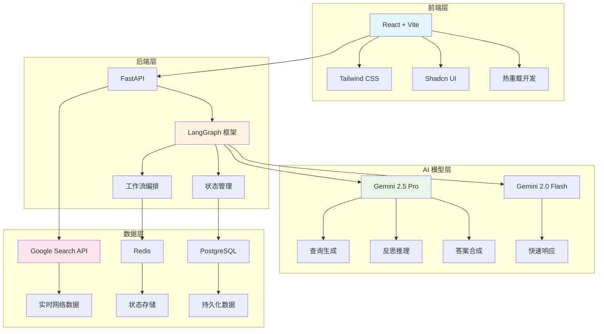

### 核心工作流程

研究代理的工作流程是一个复杂的多步骤过程，每个步骤都经过精心设计以确保高质量的研究结果：

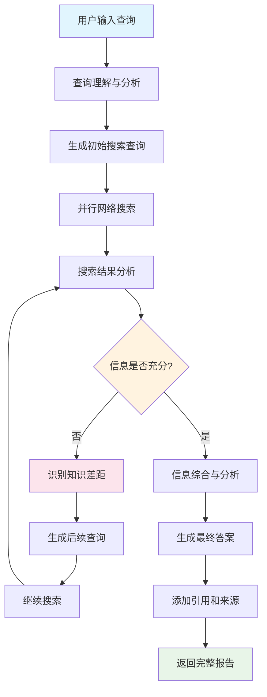

## LangGraph 核心概念深入解析

### 状态管理架构

LangGraph 的状态管理是整个系统的核心，它定义了信息如何在不同节点之间流动：

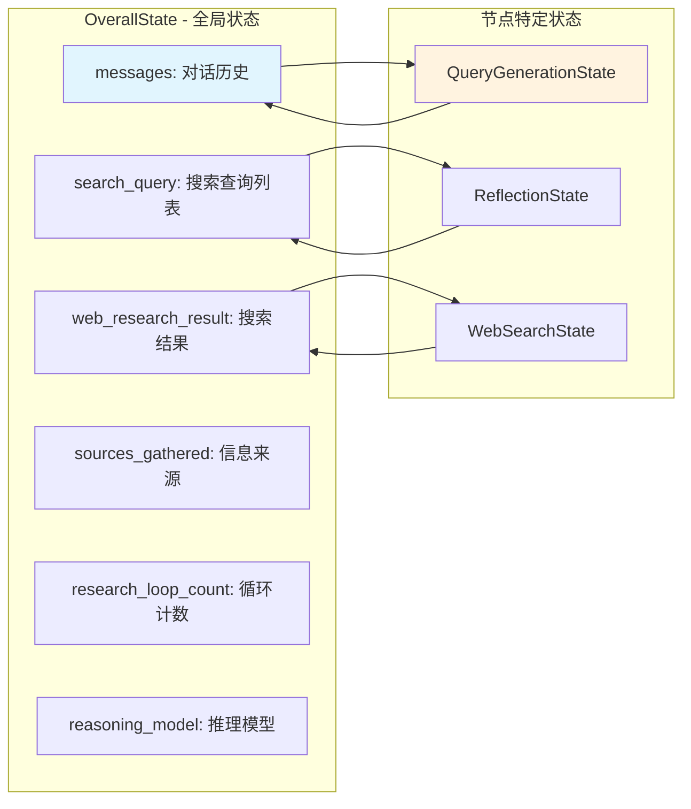

### 节点和边的设计模式

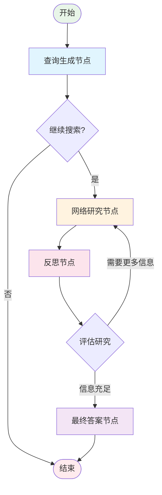

## 核心功能详解

### 1. 智能查询生成

系统使用 Gemini 2.5 Pro 模型分析用户输入，生成多个相关的搜索查询：

```python
def generate_query(state: OverallState, config: RunnableConfig) -> QueryGenerationState:
    """生成搜索查询的核心节点"""
    
    # 初始化 Gemini 模型
    llm = ChatGoogleGenerativeAI(
        model="gemini-2.5-pro",
        temperature=1.0,
        max_retries=2
    )
    
    # 使用结构化输出确保格式正确
    structured_llm = llm.with_structured_output(SearchQueryList)
    
    # 格式化提示词
    prompt = query_writer_instructions.format(
        research_topic=get_research_topic(state["messages"]),
        number_queries=state["initial_search_query_count"]
    )
    
    # 生成搜索查询
    result = structured_llm.invoke(prompt)
    return {"query_list": result.query}
```

### 2. 并行网络搜索

利用 LangGraph 的并行处理能力，同时执行多个搜索查询：

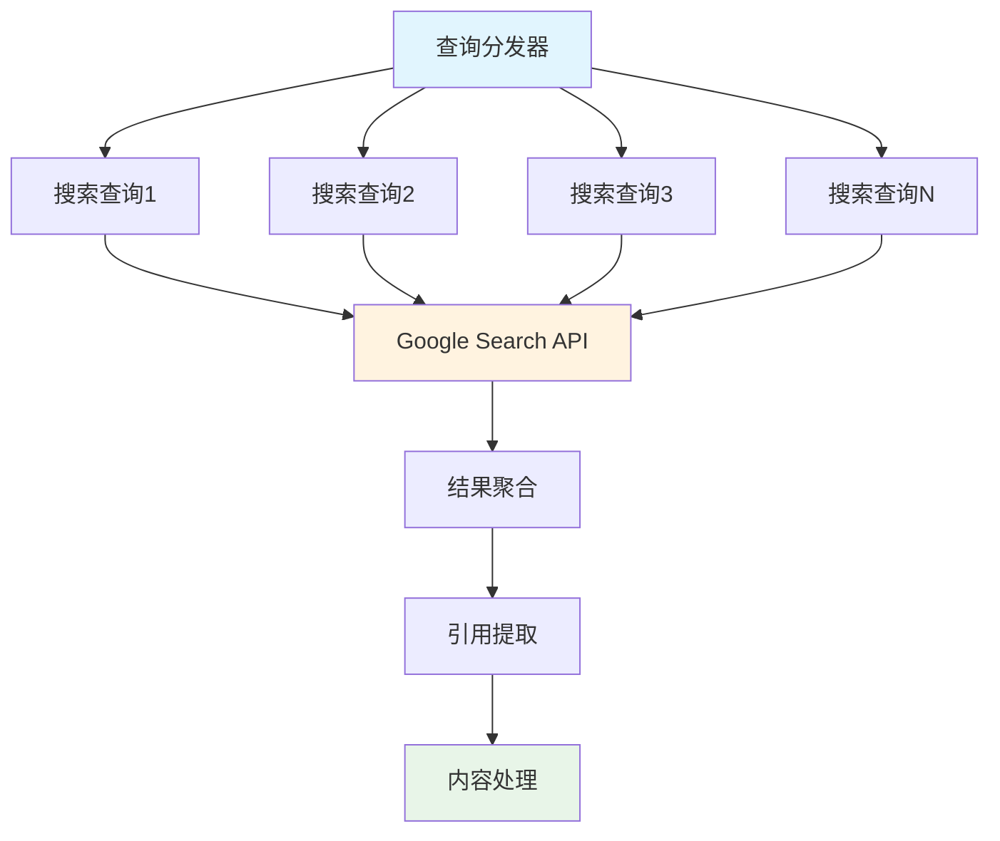

### 3. 反思推理机制

这是系统的核心创新点，通过反思机制评估搜索结果的质量：

```python
def reflection(state: OverallState, config: RunnableConfig) -> ReflectionState:
    """反思节点 - 评估搜索结果质量"""
    
    # 格式化反思提示
    prompt = reflection_instructions.format(
        research_topic=get_research_topic(state["messages"]),
        summaries="\n\n---\n\n".join(state["web_research_result"])
    )
    
    # 使用结构化输出获取反思结果
    result = llm.with_structured_output(Reflection).invoke(prompt)
    
    return {
        "is_sufficient": result.is_sufficient,
        "knowledge_gap": result.knowledge_gap,
        "follow_up_queries": result.follow_up_queries,
        "research_loop_count": state["research_loop_count"] + 1
    }
```

### 4. 迭代优化流程

系统通过条件路由实现智能的迭代优化：

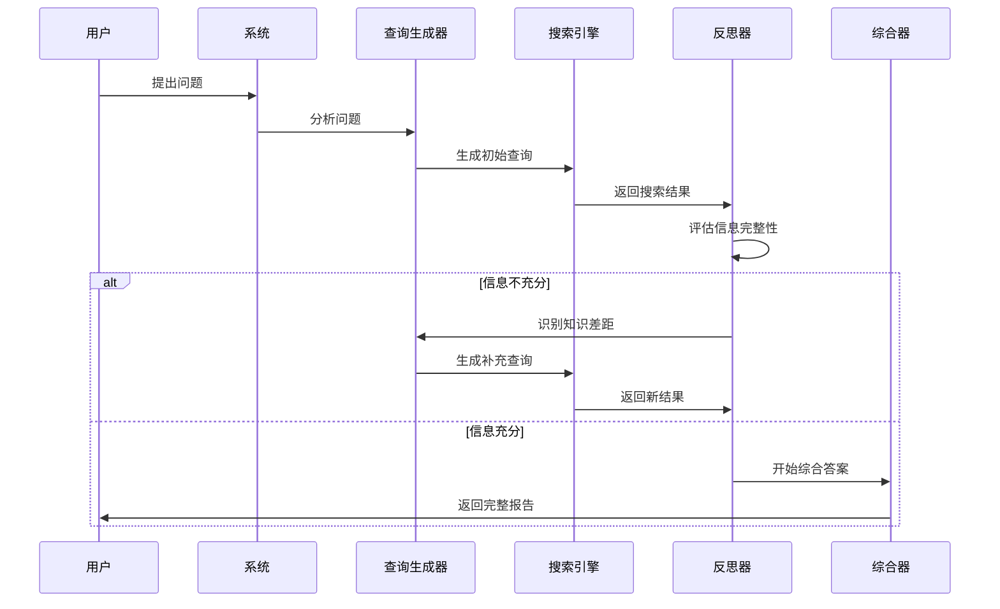

## 详细安装配置指南

### 环境要求

在开始安装之前，确保您的系统满足以下要求：

- **Node.js**: 18.0+ 和 npm 8.0+
- **Python**: 3.11+
- **Git**: 最新版本
- **Gemini API Key**: 从 [Google AI Studio](https://makersuite.google.com/app/apikey) 获取

### 快速安装步骤

#### 1. 克隆项目仓库

```bash
git clone https://github.com/google-gemini/gemini-fullstack-langgraph-quickstart.git
cd gemini-fullstack-langgraph-quickstart
```

#### 2. 后端环境设置

```bash
# 创建虚拟环境
python -m venv venv

# 激活虚拟环境
# Windows:
venv\Scripts\activate
# macOS/Linux:
source venv/bin/activate

# 进入后端目录
cd backend

# 复制环境配置文件
cp .env.example .env

# 安装依赖
pip install .
```

#### 3. 配置 API 密钥

编辑 `backend/.env` 文件，添加您的 Gemini API 密钥：

```env
GEMINI_API_KEY=your_actual_api_key_here
```

#### 4. 前端环境设置

```bash
# 进入前端目录
cd ../frontend

# 安装依赖
npm install

# 修复 Windows 兼容性问题（如果适用）
# 编辑 frontend/vite.config.ts
# 将 path.resolve(new URL(".", import.meta.url).pathname, "./src")
# 改为 path.resolve(__dirname, "./src")
```

#### 5. 启动开发服务器

```bash
# 回到项目根目录
cd ..

# 同时启动前端和后端
make dev

# 或者分别启动
# 终端1（后端）:
cd backend && langgraph dev

# 终端2（前端）:
cd frontend && npm run dev
```

### 访问应用

启动成功后，您可以通过以下地址访问：

- **主应用**: http://localhost:5173/app
- **LangGraph 调试器**: http://127.0.0.1:2024/studio
- **API 文档**: http://127.0.0.1:2024/docs

## 实际应用示例

### 示例1：复杂学术研究

**用户查询**: "分析量子计算对当前加密技术的威胁，并探讨后量子密码学的发展现状"

**系统执行流程**:

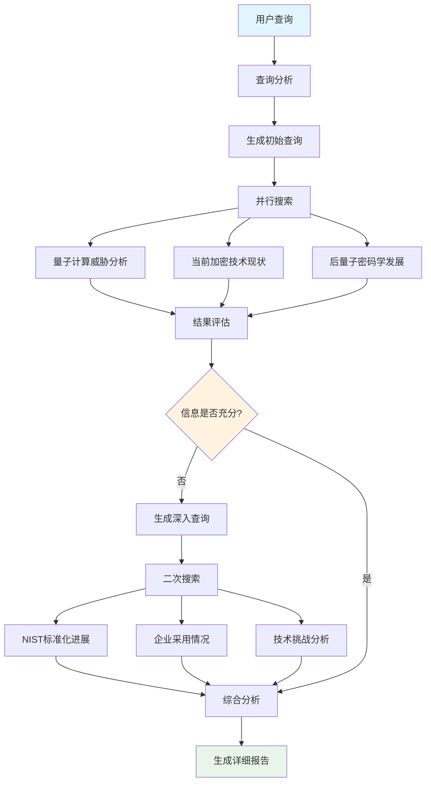

### 示例2：商业决策支持

**用户查询**: "评估电动汽车市场的投资机会，重点关注中国和美国市场的差异"

**系统输出示例**:

```
# 电动汽车市场投资机会分析报告

## 市场概况
根据最新研究数据显示，全球电动汽车市场预计在2025年达到1.7万亿美元规模[1]。

## 中美市场对比分析

### 中国市场特点
- 政策支持力度强，新能源汽车购置税减免延续至2027年[2]
- 供应链完整，占全球电池产能的75%[3]
- 消费者接受度高，2024年渗透率达到35%[4]

### 美国市场特点
- IRA法案提供7500美元税收抵免[5]
- 基础设施建设加速，充电桩数量增长60%[6]
- 传统车企转型积极，通用计划2035年全面电动化[7]

## 投资建议
基于综合分析，建议重点关注：
1. 电池技术创新企业
2. 充电基础设施建设
3. 智能驾驶技术公司

## 参考资料
[1] Global EV Market Analysis 2024 - McKinsey & Company
[2] China's NEV Policy Update - Ministry of Finance
[3] Battery Supply Chain Report - BloombergNEF
[4] China EV Sales Data - CAAM
[5] Inflation Reduction Act - US Department of Energy
[6] Charging Infrastructure Report - EIA
[7] GM Sustainability Report 2024
```

## 部署指南

### 生产环境部署

#### 1. Docker 部署

```bash
# 构建 Docker 镜像
docker build -t gemini-fullstack-langgraph -f Dockerfile .

# 使用 Docker Compose 部署
GEMINI_API_KEY=your_api_key \
LANGSMITH_API_KEY=your_langsmith_key \
docker-compose up -d
```

#### 2. Docker Compose 配置

```yaml
version: '3.8'

services:
  app:
    build: .
    ports:
      - "8123:8123"
    environment:
      - GEMINI_API_KEY=${GEMINI_API_KEY}
      - LANGSMITH_API_KEY=${LANGSMITH_API_KEY}
    depends_on:
      - redis
      - postgres

  redis:
    image: redis:7-alpine
    ports:
      - "6379:6379"

  postgres:
    image: postgres:15-alpine
    environment:
      - POSTGRES_DB=langgraph
      - POSTGRES_USER=langgraph
      - POSTGRES_PASSWORD=langgraph
    ports:
      - "5432:5432"
    volumes:
      - postgres_data:/var/lib/postgresql/data

volumes:
  postgres_data:
```

#### 3. 云平台部署

**Google Cloud Platform 部署**:

```bash
# 配置 gcloud
gcloud config set project YOUR_PROJECT_ID

# 部署到 Cloud Run
gcloud run deploy gemini-research-agent \
  --source . \
  --platform managed \
  --region us-central1 \
  --set-env-vars GEMINI_API_KEY=your_api_key
```

**Azure 部署**:

```bash
# 创建资源组
az group create --name gemini-research-rg --location eastus

# 部署到 Container Apps
az containerapp create \
  --name gemini-research-agent \
  --resource-group gemini-research-rg \
  --environment my-containerapp-env \
  --image your-registry/gemini-research-agent:latest \
  --env-vars GEMINI_API_KEY=your_api_key
```

### 性能监控

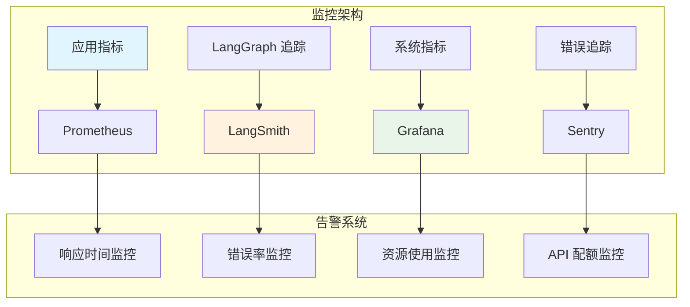

## 高级功能和最佳实践

### 1. 自定义配置管理

```python
class Configuration(BaseModel):
    """智能研究代理配置"""
    
    query_generator_model: str = "gemini-2.5-pro"
    reflection_model: str = "gemini-2.5-flash"
    answer_model: str = "gemini-2.5-pro"
    
    number_of_initial_queries: int = 3
    max_research_loops: int = 2
    max_concurrency: int = 5
    
    search_timeout: int = 30
    llm_timeout: int = 60
    
    @classmethod
    def from_env(cls) -> "Configuration":
        """从环境变量加载配置"""
        return cls(
            query_generator_model=os.getenv("QUERY_MODEL", cls.query_generator_model),
            max_research_loops=int(os.getenv("MAX_LOOPS", cls.max_research_loops))
        )
```

### 2. 错误处理和重试机制

```python
from tenacity import retry, stop_after_attempt, wait_exponential

@retry(
    stop=stop_after_attempt(3),
    wait=wait_exponential(multiplier=1, min=4, max=10)
)
def robust_web_search(query: str) -> Dict[str, Any]:
    """具有重试机制的网络搜索"""
    try:
        response = search_api.search(query)
        return response
    except Exception as e:
        logger.error(f"搜索失败: {e}")
        raise
```

### 3. 缓存策略

```python
import redis
from functools import wraps

redis_client = redis.Redis(host='localhost', port=6379, db=0)

def cache_search_results(expire_time=3600):
    """缓存搜索结果"""
    def decorator(func):
        @wraps(func)
        def wrapper(query: str, *args, **kwargs):
            cache_key = f"search:{hash(query)}"
            cached_result = redis_client.get(cache_key)
            
            if cached_result:
                return json.loads(cached_result)
            
            result = func(query, *args, **kwargs)
            redis_client.setex(cache_key, expire_time, json.dumps(result))
            return result
        return wrapper
    return decorator
```

### 4. 多模型策略

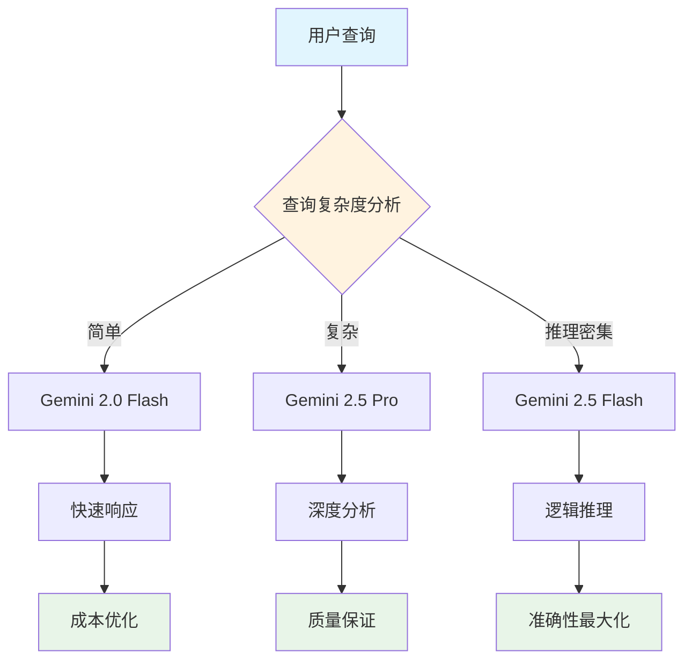

## 故障排除指南

### 常见问题和解决方案

#### 1. API 配额限制

**症状**: 收到 "API quota exceeded" 错误

**解决方案**:
```python
# 实现指数退避重试
import time
from typing import Optional

def handle_rate_limit(func):
    @wraps(func)
    def wrapper(*args, **kwargs):
        max_retries = 3
        base_delay = 1
        
        for attempt in range(max_retries):
            try:
                return func(*args, **kwargs)
            except Exception as e:
                if "quota" in str(e).lower() and attempt < max_retries - 1:
                    delay = base_delay * (2 ** attempt)
                    time.sleep(delay)
                    continue
                raise
        return wrapper
```

#### 2. 内存使用过高

**症状**: 系统内存占用持续增长

**解决方案**:
```python
# 实现状态清理机制
def cleanup_state(state: OverallState) -> OverallState:
    """清理不必要的状态数据"""
    # 只保留最近的对话历史
    if len(state["messages"]) > 20:
        state["messages"] = state["messages"][-20:]
    
    # 清理过大的搜索结果
    if len(state["web_research_result"]) > 10:
        state["web_research_result"] = state["web_research_result"][-10:]
    
    return state
```

#### 3. 搜索结果质量不佳

**症状**: 返回的信息不相关或过时

**解决方案**:
```python
# 增强查询质量控制
def enhance_query_quality(original_query: str, context: str) -> str:
    """提升查询质量"""
    enhancement_prompt = f"""
    原始查询: {original_query}
    上下文: {context}
    
    请优化这个搜索查询，使其更加具体和相关。
    添加时间限制词（如"2024"、"最新"）和领域专业词汇。
    """
    
    enhanced_query = llm.invoke(enhancement_prompt)
    return enhanced_query.content
```

## 性能优化建议

### 1. 并发控制

```python
import asyncio
from asyncio import Semaphore

class ConcurrencyManager:
    def __init__(self, max_concurrent: int = 5):
        self.semaphore = Semaphore(max_concurrent)
    
    async def execute_with_limit(self, coro):
        async with self.semaphore:
            return await coro
```

### 2. 批处理优化

```python
def batch_process_queries(queries: List[str], batch_size: int = 3) -> List[Dict]:
    """批量处理搜索查询"""
    results = []
    
    for i in range(0, len(queries), batch_size):
        batch = queries[i:i + batch_size]
        batch_results = process_batch(batch)
        results.extend(batch_results)
        
        # 避免 API 限制
        time.sleep(0.1)
    
    return results
```

### 3. 智能缓存策略

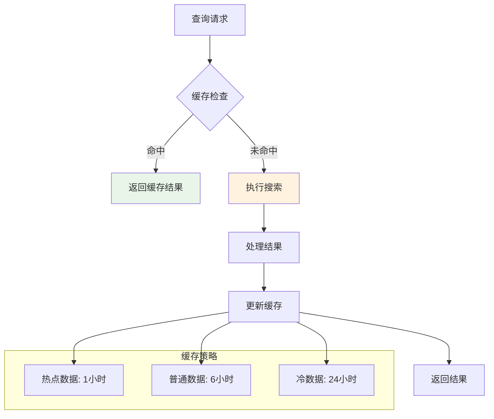

## 扩展开发指南

### 1. 自定义节点开发

```python
def custom_analysis_node(state: OverallState, config: RunnableConfig) -> Dict:
    """自定义分析节点"""
    
    # 提取研究主题
    research_topic = get_research_topic(state["messages"])
    
    # 执行专业分析
    analysis_result = perform_domain_analysis(research_topic)
    
    # 返回更新的状态
    return {
        "custom_analysis": analysis_result,
        "analysis_timestamp": datetime.now().isoformat()
    }

# 将节点添加到工作流
workflow.add_node("custom_analysis", custom_analysis_node)
workflow.add_edge("reflection", "custom_analysis")
```

### 2. 插件系统设计

```python
class PluginManager:
    def __init__(self):
        self.plugins = {}
    
    def register_plugin(self, name: str, plugin_class):
        """注册插件"""
        self.plugins[name] = plugin_class()
    
    def execute_plugin(self, name: str, *args, **kwargs):
        """执行插件"""
        if name in self.plugins:
            return self.plugins[name].execute(*args, **kwargs)
        raise ValueError(f"Plugin {name} not found")

# 使用示例
plugin_manager = PluginManager()
plugin_manager.register_plugin("sentiment_analysis", SentimentAnalysisPlugin)
```

## 社区贡献指南

### 提交代码

1. **Fork 项目仓库**
2. **创建功能分支**: `git checkout -b feature/amazing-feature`
3. **提交更改**: `git commit -m 'Add amazing feature'`
4. **推送到分支**: `git push origin feature/amazing-feature`
5. **创建 Pull Request**

### 报告问题

使用 [GitHub Issues](https://github.com/google-gemini/gemini-fullstack-langgraph-quickstart/issues) 报告 bug 或建议功能。

### 贡献类型

- 🐛 Bug 修复
- ✨ 新功能开发
- 📝 文档改进
- 🎨 UI/UX 优化
- ⚡ 性能提升
- 🔧 配置优化

## 未来发展展望

### 技术路线图

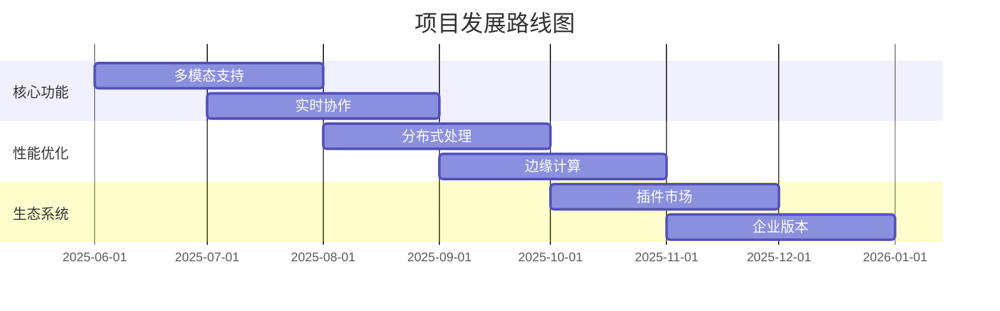

### 创新方向

1. **多模态研究**: 支持图像、视频、音频等多媒体内容分析
2. **个性化学习**: 根据用户偏好和历史记录优化搜索策略
3. **实时协作**: 支持团队协作研究和知识共享
4. **边缘计算**: 在边缘设备上运行轻量级版本
5. **联邦学习**: 在保护隐私的前提下改进模型性能

## 结语

Google Gemini LangGraph 全栈快速入门项目不仅是一个技术演示，更是对未来AI应用的一次深刻探索。它展示了如何将现代AI技术与传统软件工程实践相结合，构建出既强大又实用的智能系统。

通过本文的详细介绍，您不仅了解了项目的技术架构和实现原理，还掌握了部署、优化和扩展的实用技能。更重要的是，这个项目为我们展示了AI代理系统的巨大潜力：

- **智能化决策**: 系统能够自主分析问题并制定解决策略
- **动态适应**: 根据搜索结果质量动态调整搜索策略
- **透明可信**: 提供完整的信息来源和推理过程
- **持续学习**: 通过反馈机制不断优化性能

随着AI技术的不断发展，我们有理由相信，类似的智能研究代理将在学术研究、商业决策、内容创作等领域发挥越来越重要的作用。现在是时候开始构建您自己的智能研究助手了！

## 参考资源

- [项目 GitHub 仓库](https://github.com/google-gemini/gemini-fullstack-langgraph-quickstart)
- [LangGraph 官方文档](https://python.langchain.com/docs/langgraph)
- [Google Gemini API 文档](https://ai.google.dev/docs)
- [React 官方文档](https://reactjs.org/docs)
- [FastAPI 官方文档](https://fastapi.tiangolo.com/)
- [Docker 部署指南](https://docs.docker.com/)

---

*本文基于 Google 开源项目 `gemini-fullstack-langgraph-quickstart` 编写，版权归原作者所有。* 