# N8N 工作流自动化终极指南：精选模板集合让你的效率飞起来

## 项目概述

在数字化时代，工作流自动化已经成为提升效率的关键。[awesome-n8n-templates](https://github.com/enescingoz/awesome-n8n-templates) 是一个拥有 **6.1k+ stars** 的精选 n8n 模板集合，为各种业务场景提供了即开即用的自动化解决方案。

### 什么是 N8N？

**N8N** 是一个开源的工作流自动化工具，采用可视化节点编程方式，允许用户通过拖拽组件来创建复杂的自动化流程。它支持超过 350+ 个应用程序的集成，是 Zapier 的强大开源替代品。

### 项目亮点

- 🚀 **6100+ GitHub Stars**：社区高度认可的质量保证
- 📁 **15+ 分类目录**：覆盖从 AI 研究到社交媒体的各个领域
- 🤖 **AI 驱动模板**：集成 OpenAI、Perplexity 等先进 AI 服务
- 📧 **企业级集成**：Gmail、Slack、Notion、Google Drive 等主流应用
- 🎯 **即用模板**：复制粘贴即可运行，无需从零开始

## N8N 核心架构解析

### 系统架构图

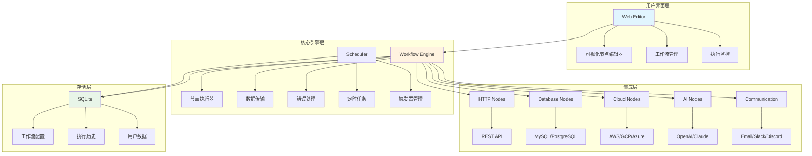
```mermaid
graph TB
    subgraph "用户界面层"
        A[Web Editor] --> B[可视化节点编辑器]
        A --> C[工作流管理]
        A --> D[执行监控]
    end
    
    subgraph "核心引擎层"
        E[Workflow Engine] --> F[节点执行器]
        E --> G[数据传输]
        E --> H[错误处理]
        I[Scheduler] --> J[定时任务]
        I --> K[触发器管理]
    end
    
    subgraph "集成层"
        L[HTTP Nodes] --> M[REST API]
        N[Database Nodes] --> O[MySQL/PostgreSQL]
        P[Cloud Nodes] --> Q[AWS/GCP/Azure]
        R[AI Nodes] --> S[OpenAI/Claude]
        T[Communication] --> U[Email/Slack/Discord]
    end
    
    subgraph "存储层"
        V[SQLite] --> W[工作流配置]
        V --> X[执行历史]
        V --> Y[用户数据]
    end
    
    A --> E
    E --> L
    E --> N
    E --> P
    E --> R
    E --> T
    E --> V
    I --> V
    
    style A fill:#e1f5fe
    style E fill:#fff3e0
    style V fill:#e8f5e8
```

### 工作流执行原理

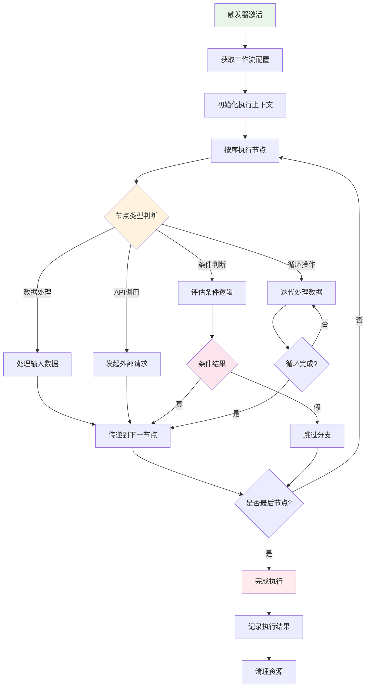
```mermaid
graph TD
    A[触发器激活] --> B[获取工作流配置]
    B --> C[初始化执行上下文]
    C --> D[按序执行节点]
    D --> E{节点类型判断}
    
    E -->|数据处理| F[处理输入数据]
    E -->|API调用| G[发起外部请求]
    E -->|条件判断| H[评估条件逻辑]
    E -->|循环操作| I[迭代处理数据]
    
    F --> J[传递到下一节点]
    G --> J
    H --> K{条件结果}
    K -->|真| J
    K -->|假| L[跳过分支]
    I --> M{循环完成?}
    M -->|否| I
    M -->|是| J
    
    J --> N{是否最后节点?}
    N -->|否| D
    N -->|是| O[完成执行]
    L --> N
    
    O --> P[记录执行结果]
    P --> Q[清理资源]
    
    style A fill:#e8f5e8
    style O fill:#ffebee
    style E fill:#fff3e0
    style K fill:#fce4ec
```

## 模板分类详解

根据项目结构，awesome-n8n-templates 包含以下主要分类：

### 1. AI 研究与数据分析

这个分类包含了最前沿的 AI 集成模板，是现代数据驱动业务的核心。

#### 核心模板展示

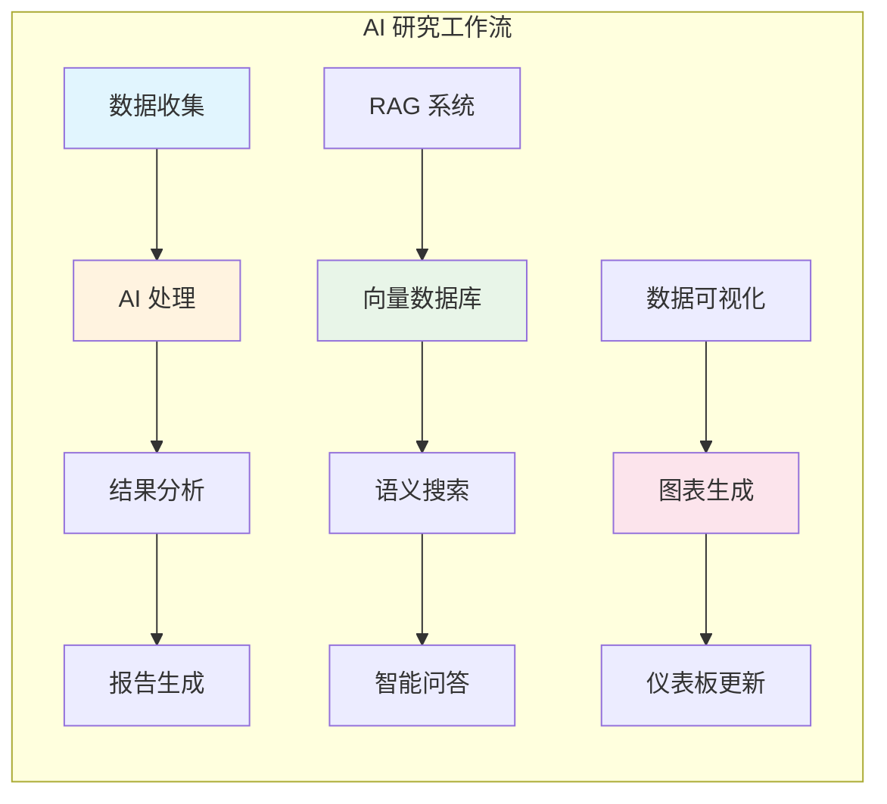
```mermaid
graph LR
    subgraph "AI 研究工作流"
        A[数据收集] --> B[AI 处理]
        B --> C[结果分析]
        C --> D[报告生成]
        
        E[RAG 系统] --> F[向量数据库]
        F --> G[语义搜索]
        G --> H[智能问答]
        
        I[数据可视化] --> J[图表生成]
        J --> K[仪表板更新]
    end
    
    style A fill:#e1f5fe
    style B fill:#fff3e0
    style F fill:#e8f5e8
    style J fill:#fce4ec
```

**热门模板**：
- **Perplexity Research to HTML**：将 AI 研究转换为 HTML 内容
- **Survey Insights with Qdrant**：使用向量数据库分析调研数据
- **Visual Regression Testing with AI**：AI 驱动的视觉回归测试
- **Vector Database Analysis Tools**：大数据分析的向量数据库应用

### 2. Gmail 与邮件自动化

邮件自动化是提升工作效率的基础，这个分类提供了全方位的邮件处理解决方案。

#### 邮件自动化流程

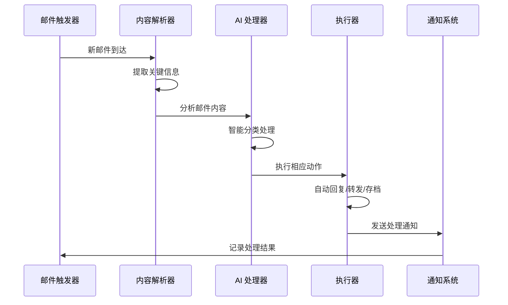
```mermaid
sequenceDiagram
    participant Trigger as 邮件触发器
    participant Parser as 内容解析器
    participant AI as AI 处理器
    participant Action as 执行器
    participant Notify as 通知系统
    
    Trigger->>Parser: 新邮件到达
    Parser->>Parser: 提取关键信息
    Parser->>AI: 分析邮件内容
    AI->>AI: 智能分类处理
    AI->>Action: 执行相应动作
    Action->>Action: 自动回复/转发/存档
    Action->>Notify: 发送处理通知
    Notify->>Trigger: 记录处理结果
```

**实用模板**：
- **智能邮件分类**：自动分类并路由不同类型邮件
- **客服邮件自动回复**：AI 生成个性化回复内容
- **邮件附件自动处理**：提取、分类和存储邮件附件
- **营销邮件效果追踪**：统计开信率、点击率等指标

### 3. Google Drive 与 Sheets 集成

Google Workspace 是现代办公的核心，这个分类提供了深度集成方案。

#### 文件管理自动化

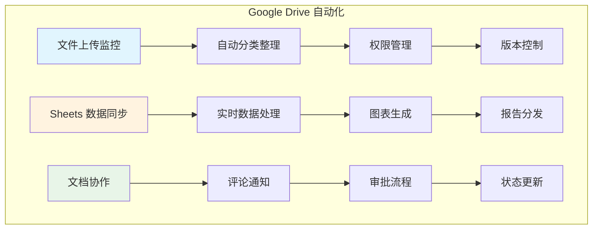
```mermaid
graph TB
    subgraph "Google Drive 自动化"
        A[文件上传监控] --> B[自动分类整理]
        B --> C[权限管理]
        C --> D[版本控制]
        
        E[Sheets 数据同步] --> F[实时数据处理]
        F --> G[图表生成]
        G --> H[报告分发]
        
        I[文档协作] --> J[评论通知]
        J --> K[审批流程]
        K --> L[状态更新]
    end
    
    style A fill:#e1f5fe
    style E fill:#fff3e0
    style I fill:#e8f5e8
```

### 4. 社交媒体管理

社交媒体营销的自动化管理，覆盖主流平台。

#### 社媒发布流程

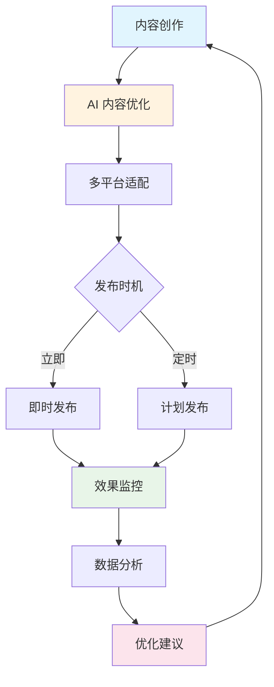
```mermaid
graph TD
    A[内容创作] --> B[AI 内容优化]
    B --> C[多平台适配]
    C --> D{发布时机}
    D -->|立即| E[即时发布]
    D -->|定时| F[计划发布]
    E --> G[效果监控]
    F --> G
    G --> H[数据分析]
    H --> I[优化建议]
    I --> A
    
    style A fill:#e1f5fe
    style B fill:#fff3e0
    style G fill:#e8f5e8
    style I fill:#fce4ec
```

### 5. 数据库与存储

企业级数据管理的自动化解决方案。

#### 数据同步架构

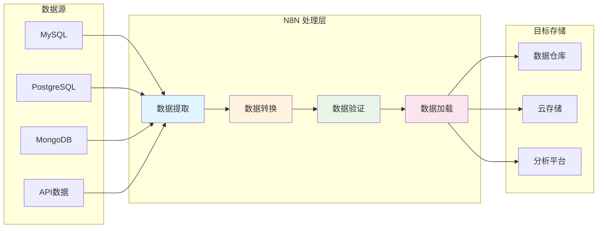
```mermaid
graph LR
    subgraph "数据源"
        A[MySQL]
        B[PostgreSQL]
        C[MongoDB]
        D[API数据]
    end
    
    subgraph "N8N 处理层"
        E[数据提取]
        F[数据转换]
        G[数据验证]
        H[数据加载]
    end
    
    subgraph "目标存储"
        I[数据仓库]
        J[云存储]
        K[分析平台]
    end
    
    A --> E
    B --> E
    C --> E
    D --> E
    E --> F
    F --> G
    G --> H
    H --> I
    H --> J
    H --> K
    
    style E fill:#e1f5fe
    style F fill:#fff3e0
    style G fill:#e8f5e8
    style H fill:#fce4ec
```

## 完整应用案例：智能客服系统

让我们通过一个完整的智能客服系统来展示 n8n 的强大功能。

### 系统架构设计

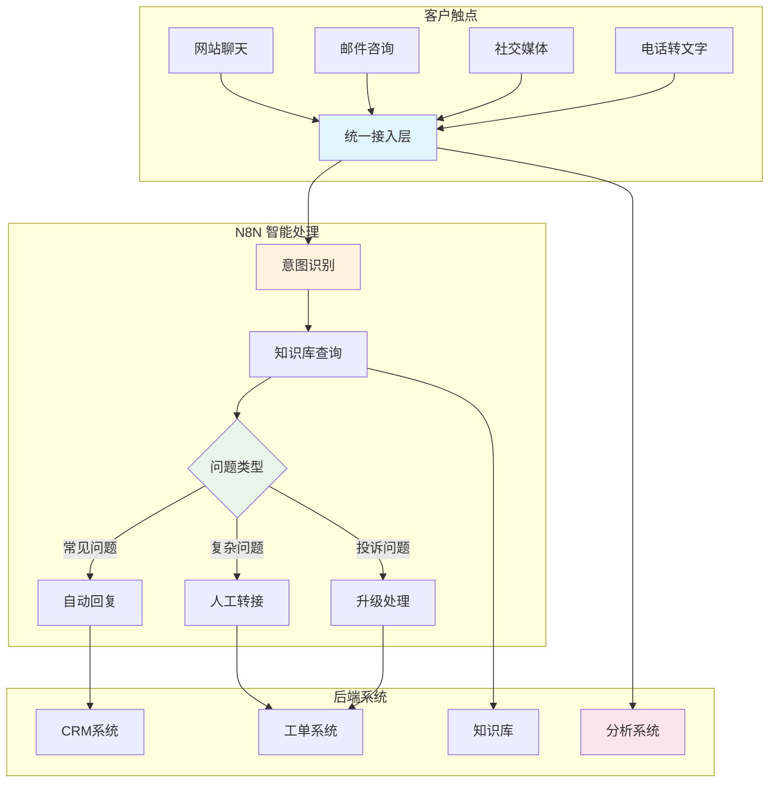
```mermaid
graph TB
    subgraph "客户触点"
        A[网站聊天] --> E[统一接入层]
        B[邮件咨询] --> E
        C[社交媒体] --> E
        D[电话转文字] --> E
    end
    
    subgraph "N8N 智能处理"
        E --> F[意图识别]
        F --> G[知识库查询]
        G --> H{问题类型}
        H -->|常见问题| I[自动回复]
        H -->|复杂问题| J[人工转接]
        H -->|投诉问题| K[升级处理]
    end
    
    subgraph "后端系统"
        L[CRM系统]
        M[工单系统]
        N[知识库]
        O[分析系统]
    end
    
    I --> L
    J --> M
    K --> M
    G --> N
    E --> O
    
    style E fill:#e1f5fe
    style F fill:#fff3e0
    style H fill:#e8f5e8
    style O fill:#fce4ec
```

### 工作流实现步骤

#### 1. 触发器配置

```json
{
  "nodes": [
    {
      "name": "Webhook",
      "type": "n8n-nodes-base.webhook",
      "position": [250, 300],
      "parameters": {
        "httpMethod": "POST",
        "path": "customer-inquiry",
        "responseMode": "responseNode"
      }
    }
  ]
}
```

#### 2. 意图识别节点

```json
{
  "name": "OpenAI Intent Recognition",
  "type": "n8n-nodes-base.openAi",
  "parameters": {
    "resource": "text",
    "operation": "complete",
    "prompt": "分析以下客户咨询的意图类型：{{$json.message}}\n返回类型：technical_support, billing_question, product_inquiry, complaint",
    "maxTokens": 100
  }
}
```

#### 3. 条件判断与路由

```json
{
  "name": "Route by Intent",
  "type": "n8n-nodes-base.switch",
  "parameters": {
    "conditions": {
      "string": [
        {
          "value1": "={{$json.intent}}",
          "operation": "equal",
          "value2": "technical_support"
        },
        {
          "value1": "={{$json.intent}}",
          "operation": "equal", 
          "value2": "billing_question"
        }
      ]
    }
  }
}
```

### 性能优化策略

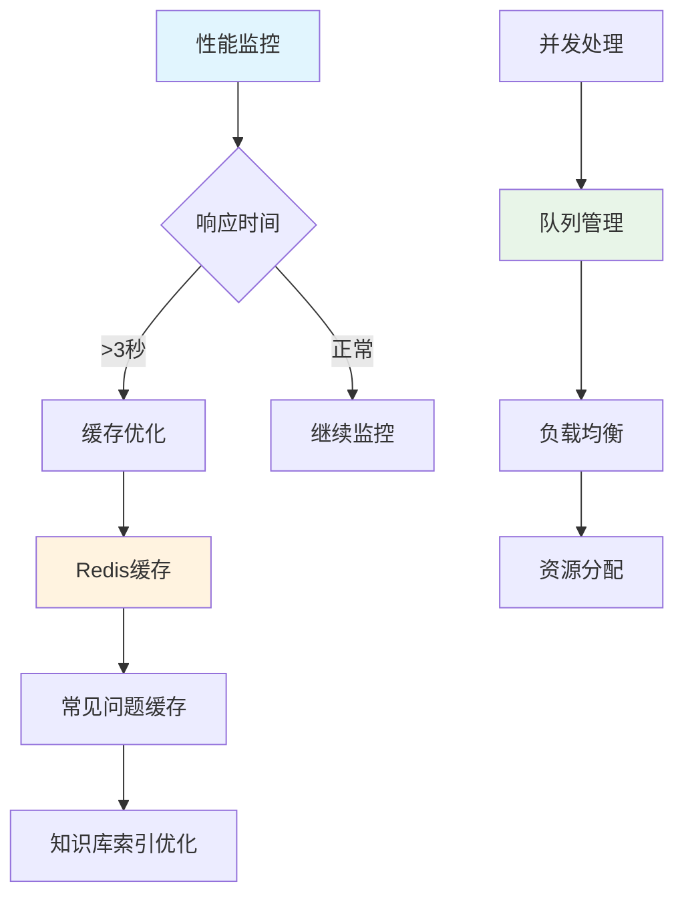
```mermaid
graph TD
    A[性能监控] --> B{响应时间}
    B -->|>3秒| C[缓存优化]
    B -->|正常| D[继续监控]
    
    C --> E[Redis缓存]
    E --> F[常见问题缓存]
    F --> G[知识库索引优化]
    
    H[并发处理] --> I[队列管理]
    I --> J[负载均衡]
    J --> K[资源分配]
    
    style A fill:#e1f5fe
    style E fill:#fff3e0
    style I fill:#e8f5e8
```

## 高级功能与最佳实践

### 1. 错误处理机制

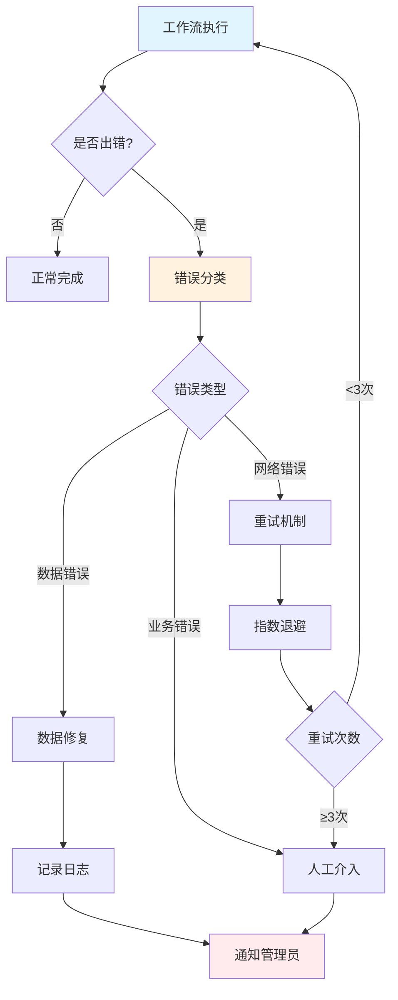
```mermaid
graph TD
    A[工作流执行] --> B{是否出错?}
    B -->|否| C[正常完成]
    B -->|是| D[错误分类]
    D --> E{错误类型}
    E -->|网络错误| F[重试机制]
    E -->|数据错误| G[数据修复]
    E -->|业务错误| H[人工介入]
    F --> I[指数退避]
    I --> J{重试次数}
    J -->|<3次| A
    J -->|≥3次| H
    G --> K[记录日志]
    K --> L[通知管理员]
    H --> L
    
    style A fill:#e1f5fe
    style D fill:#fff3e0
    style L fill:#ffebee
```

### 2. 安全性配置

**API 密钥管理**：
```javascript
// 环境变量配置
const credentials = {
  openai_key: process.env.OPENAI_API_KEY,
  gmail_oauth: process.env.GMAIL_OAUTH_TOKEN,
  slack_webhook: process.env.SLACK_WEBHOOK_URL
};

// 加密存储
const encrypted_credentials = encrypt(JSON.stringify(credentials));
```

**访问控制**：
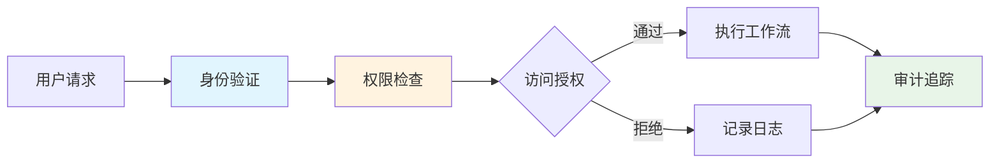
```mermaid
graph LR
    A[用户请求] --> B[身份验证]
    B --> C[权限检查]
    C --> D{访问授权}
    D -->|通过| E[执行工作流]
    D -->|拒绝| F[记录日志]
    E --> G[审计追踪]
    F --> G
    
    style B fill:#e1f5fe
    style C fill:#fff3e0
    style G fill:#e8f5e8
```

### 3. 监控与告警

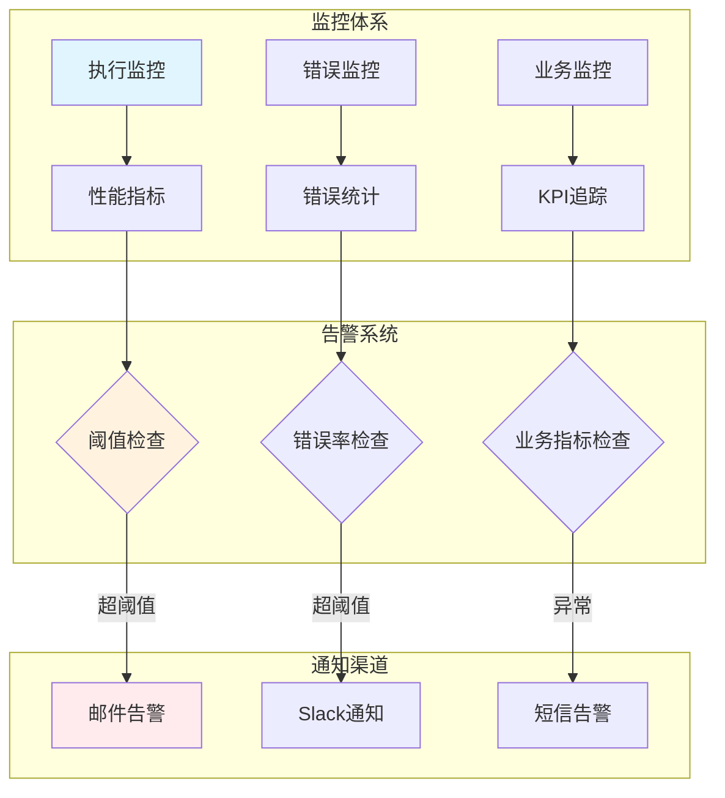
```mermaid
graph TB
    subgraph "监控体系"
        A[执行监控] --> D[性能指标]
        B[错误监控] --> E[错误统计]  
        C[业务监控] --> F[KPI追踪]
    end
    
    subgraph "告警系统"
        D --> G{阈值检查}
        E --> H{错误率检查}
        F --> I{业务指标检查}
    end
    
    subgraph "通知渠道"
        G -->|超阈值| J[邮件告警]
        H -->|超阈值| K[Slack通知]
        I -->|异常| L[短信告警]
    end
    
    style A fill:#e1f5fe
    style G fill:#fff3e0
    style J fill:#ffebee
```

## 部署与运维指南

### 1. 本地开发环境

```bash
# 使用 Docker 快速启动
docker run -it --rm \
  --name n8n \
  -p 5678:5678 \
  -v ~/.n8n:/home/node/.n8n \
  n8nio/n8n

# 或使用 npm 安装
npm install n8n -g
n8n start --tunnel
```

### 2. 生产环境部署

#### Docker Compose 配置

```yaml
version: '3.7'

services:
  n8n:
    image: n8nio/n8n:latest
    restart: always
    ports:
      - "5678:5678"
    environment:
      - N8N_BASIC_AUTH_ACTIVE=true
      - N8N_BASIC_AUTH_USER=admin
      - N8N_BASIC_AUTH_PASSWORD=your_password
      - N8N_HOST=your-domain.com
      - N8N_PORT=5678
      - N8N_PROTOCOL=https
      - NODE_ENV=production
      - WEBHOOK_URL=https://your-domain.com/
      - GENERIC_TIMEZONE=Asia/Shanghai
    volumes:
      - ~/.n8n:/home/node/.n8n
      - /var/run/docker.sock:/var/run/docker.sock
    depends_on:
      - postgres
      - redis

  postgres:
    image: postgres:13
    restart: always
    environment:
      POSTGRES_DB: n8n
      POSTGRES_USER: n8n
      POSTGRES_PASSWORD: n8n_password
    volumes:
      - postgres_data:/var/lib/postgresql/data

  redis:
    image: redis:6-alpine
    restart: always

volumes:
  postgres_data:
```

### 3. 云平台部署

#### AWS ECS 部署架构

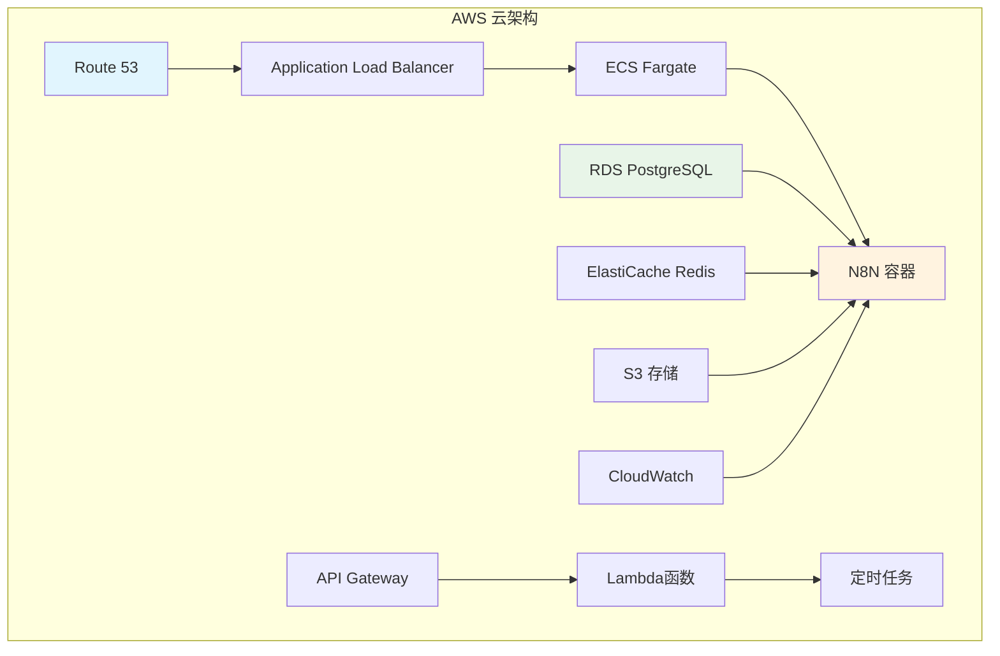
```mermaid
graph TB
    subgraph "AWS 云架构"
        A[Route 53] --> B[Application Load Balancer]
        B --> C[ECS Fargate]
        C --> D[N8N 容器]
        
        E[RDS PostgreSQL] --> D
        F[ElastiCache Redis] --> D
        G[S3 存储] --> D
        H[CloudWatch] --> D
        
        I[Lambda函数] --> J[定时任务]
        K[API Gateway] --> I
    end
    
    style A fill:#e1f5fe
    style D fill:#fff3e0
    style E fill:#e8f5e8
```

## 实战应用场景

### 1. 电商业务自动化

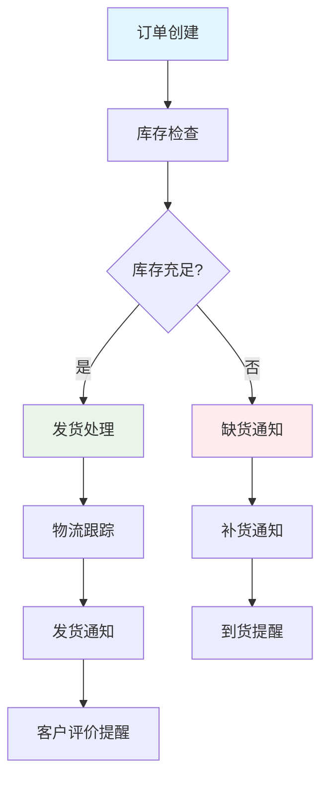
```mermaid
graph TD
    A[订单创建] --> B[库存检查]
    B --> C{库存充足?}
    C -->|是| D[发货处理]
    C -->|否| E[缺货通知]
    D --> F[物流跟踪]
    F --> G[发货通知]
    G --> H[客户评价提醒]
    E --> I[补货通知]
    I --> J[到货提醒]
    
    style A fill:#e1f5fe
    style D fill:#e8f5e8
    style E fill:#ffebee
```

**关键工作流模板**：
- 订单状态自动同步
- 库存预警与补货
- 客户服务自动化
- 营销活动触发

### 2. 内容营销自动化

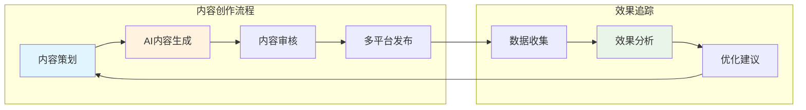
```mermaid
graph LR
    subgraph "内容创作流程"
        A[内容策划] --> B[AI内容生成]
        B --> C[内容审核]
        C --> D[多平台发布]
    end
    
    subgraph "效果追踪"
        E[数据收集] --> F[效果分析]
        F --> G[优化建议]
        G --> A
    end
    
    D --> E
    
    style A fill:#e1f5fe
    style B fill:#fff3e0
    style F fill:#e8f5e8
```

### 3. HR 招聘自动化

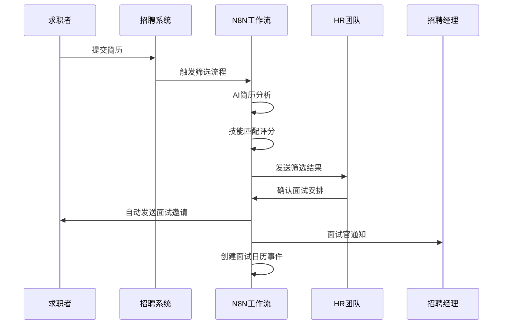
```mermaid
sequenceDiagram
    participant Candidate as 求职者
    participant ATS as 招聘系统
    participant N8N as N8N工作流
    participant HR as HR团队
    participant Manager as 招聘经理
    
    Candidate->>ATS: 提交简历
    ATS->>N8N: 触发筛选流程
    N8N->>N8N: AI简历分析
    N8N->>N8N: 技能匹配评分
    N8N->>HR: 发送筛选结果
    HR->>N8N: 确认面试安排
    N8N->>Candidate: 自动发送面试邀请
    N8N->>Manager: 面试官通知
    N8N->>N8N: 创建面试日历事件
```

## 模板使用指南

### 1. 模板导入流程

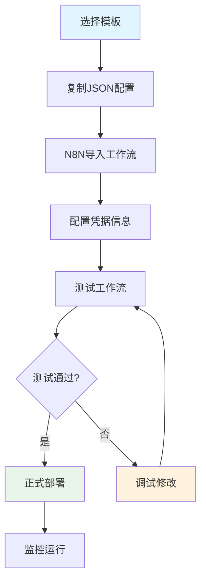
```mermaid
graph TD
    A[选择模板] --> B[复制JSON配置]
    B --> C[N8N导入工作流]
    C --> D[配置凭据信息]
    D --> E[测试工作流]
    E --> F{测试通过?}
    F -->|是| G[正式部署]
    F -->|否| H[调试修改]
    H --> E
    G --> I[监控运行]
    
    style A fill:#e1f5fe
    style G fill:#e8f5e8
    style H fill:#fff3e0
```

### 2. 自定义修改指南

**节点配置示例**：
```javascript
// Gmail 节点配置
{
  "name": "Gmail",
  "type": "n8n-nodes-base.gmail",
  "parameters": {
    "operation": "send",
    "email": "{{$json.recipient}}",
    "subject": "{{$json.subject}}",
    "message": "{{$json.content}}",
    "attachments": "data"
  },
  "credentials": {
    "gmailOAuth2": "gmail_account"
  }
}

// OpenAI 节点配置
{
  "name": "OpenAI",
  "type": "n8n-nodes-base.openAi", 
  "parameters": {
    "resource": "text",
    "operation": "complete",
    "prompt": "{{$json.user_input}}",
    "model": "gpt-3.5-turbo",
    "maxTokens": 1000,
    "temperature": 0.7
  }
}
```

### 3. 模板优化技巧

**性能优化**：
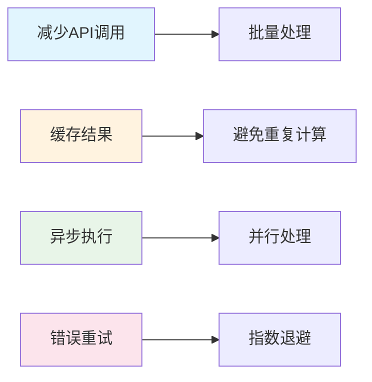
```mermaid
graph LR
    A[减少API调用] --> B[批量处理]
    C[缓存结果] --> D[避免重复计算]
    E[异步执行] --> F[并行处理]
    G[错误重试] --> H[指数退避]
    
    style A fill:#e1f5fe
    style C fill:#fff3e0
    style E fill:#e8f5e8
    style G fill:#fce4ec
```

## 高级集成案例

### 1. 全渠道营销自动化

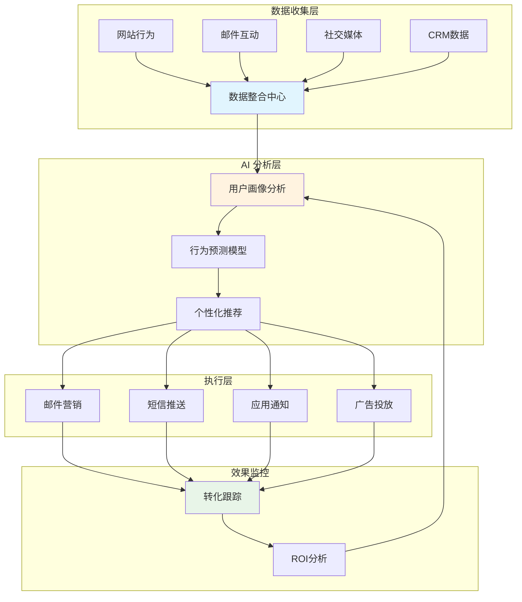
```mermaid
graph TB
    subgraph "数据收集层"
        A[网站行为] --> H[数据整合中心]
        B[邮件互动] --> H
        C[社交媒体] --> H
        D[CRM数据] --> H
    end
    
    subgraph "AI 分析层"
        H --> E[用户画像分析]
        E --> F[行为预测模型]
        F --> G[个性化推荐]
    end
    
    subgraph "执行层"
        G --> I[邮件营销]
        G --> J[短信推送]
        G --> K[应用通知]
        G --> L[广告投放]
    end
    
    subgraph "效果监控"
        I --> M[转化跟踪]
        J --> M
        K --> M
        L --> M
        M --> N[ROI分析]
        N --> E
    end
    
    style H fill:#e1f5fe
    style E fill:#fff3e0
    style M fill:#e8f5e8
```

### 2. 智能财务管理

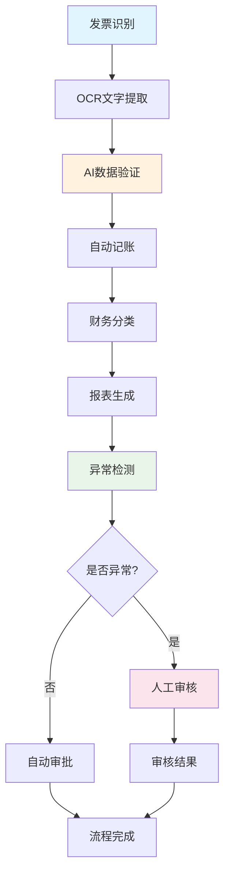
```mermaid
graph TD
    A[发票识别] --> B[OCR文字提取]
    B --> C[AI数据验证]
    C --> D[自动记账]
    D --> E[财务分类]
    E --> F[报表生成]
    F --> G[异常检测]
    G --> H{是否异常?}
    H -->|是| I[人工审核]
    H -->|否| J[自动审批]
    I --> K[审核结果]
    J --> L[流程完成]
    K --> L
    
    style A fill:#e1f5fe
    style C fill:#fff3e0
    style G fill:#e8f5e8
    style I fill:#fce4ec
```

## 社区资源与学习路径

### 1. 学习资源整理

```mermaid
mindmap
  root((N8N学习资源))
    官方文档
      快速入门指南
      API参考文档
      节点开发指南
    社区资源  
      GitHub模板库
      Discord社区
      Reddit讨论组
    视频教程
      YouTube频道
      在线课程
      直播分享
    实践项目
      awesome-n8n-templates
      社区贡献模板
      企业案例分享
```

### 2. 技能发展路径

```mermaid
graph TD
    A[基础入门] --> B[节点连接]
    B --> C[数据处理]
    C --> D[API集成]
    D --> E[高级功能]
    E --> F[企业部署]
    F --> G[开发贡献]
    
    A1[可视化编程] --> A
    B1[工作流设计] --> B
    C1[JavaScript编程] --> C
    D1[REST API理解] --> D
    E1[错误处理&监控] --> E
    F1[云平台部署] --> F
    G1[开源贡献] --> G
    
    style A fill:#e1f5fe
    style D fill:#fff3e0
    style F fill:#e8f5e8
```

## 贡献指南与社区参与

### 1. 模板贡献流程

```mermaid
graph LR
    A[创建模板] --> B[测试验证]
    B --> C[编写文档]
    C --> D[提交PR]
    D --> E[社区评审]
    E --> F{评审通过?}
    F -->|是| G[合并发布]
    F -->|否| H[修改完善]
    H --> D
    G --> I[更新文档]
    
    style A fill:#e1f5fe
    style E fill:#fff3e0
    style G fill:#e8f5e8
```

### 2. 质量标准

**模板质量要求**：
- ✅ 功能完整性测试
- ✅ 错误处理机制
- ✅ 详细的使用说明
- ✅ 参数配置示例
- ✅ 安全性检查
- ✅ 性能优化建议

### 3. 社区贡献方式

```mermaid
graph TB
    subgraph "代码贡献"
        A[新模板开发]
        B[Bug修复]
        C[功能增强]
    end
    
    subgraph "文档贡献"
        D[使用教程]
        E[最佳实践]
        F[翻译工作]
    end
    
    subgraph "社区建设"
        G[问题解答]
        H[经验分享]
        I[活动组织]
    end
    
    style A fill:#e1f5fe
    style D fill:#fff3e0
    style G fill:#e8f5e8
```

## 未来发展趋势

### 1. 技术发展方向

```mermaid
gantt
    title N8N 技术发展路线图
    dateFormat  YYYY-MM-DD
    section AI集成
    多模态AI支持    :2025-06-01, 2025-09-01
    本地AI模型集成  :2025-07-01, 2025-10-01
    section 性能优化
    分布式执行      :2025-08-01, 2025-11-01
    边缘计算支持    :2025-09-01, 2025-12-01
    section 企业功能
    高级安全特性    :2025-10-01, 2026-01-01
    企业级监控      :2025-11-01, 2026-02-01
```

### 2. 应用场景展望

```mermaid
graph TB
    subgraph "新兴场景"
        A[IoT设备管理] --> E[智能家居]
        B[区块链集成] --> F[DeFi自动化]
        C[AR/VR应用] --> G[元宇宙运营]
        D[量子计算] --> H[科学计算]
    end
    
    subgraph "传统场景进化"
        I[传统CRM] --> J[AI驱动CRM]
        K[简单报表] --> L[智能分析]
        M[人工客服] --> N[智能客服]
    end
    
    style A fill:#e1f5fe
    style B fill:#fff3e0
    style I fill:#e8f5e8
    style J fill:#fce4ec
```

## 结语

awesome-n8n-templates 项目展示了 n8n 在工作流自动化领域的巨大潜力。从简单的数据同步到复杂的 AI 驱动业务流程，这个精选的模板集合为各行各业提供了实用的自动化解决方案。

### 项目价值总结

- 🎯 **降低门槛**：即用模板让非技术人员也能快速上手
- 🚀 **提升效率**：自动化重复性工作，释放人力资源
- 💡 **激发创新**：丰富的案例启发新的自动化思路
- 🌐 **生态建设**：活跃的社区推动技术持续发展
- 📈 **商业价值**：直接转化为企业运营效率的提升

### 行动建议

1. **立即开始**：选择适合您业务的模板，快速体验自动化的威力
2. **深入学习**：掌握 n8n 核心概念，提升自定义开发能力
3. **积极参与**：加入社区，分享经验，贡献优质模板
4. **持续优化**：监控工作流性能，不断改进和优化
5. **扩展应用**：将成功的自动化经验推广到更多业务场景

n8n 和 awesome-n8n-templates 正在重新定义工作流自动化的边界，让我们一起拥抱这个自动化的美好未来！

## 参考资源

- [awesome-n8n-templates GitHub 仓库](https://github.com/enescingoz/awesome-n8n-templates)
- [N8N 官方文档](https://docs.n8n.io/)
- [N8N 社区论坛](https://community.n8n.io/)
- [N8N Discord 服务器](https://discord.gg/7KgDV8m)
- [N8N YouTube 频道](https://www.youtube.com/c/n8nio)

---

*基于 [awesome-n8n-templates](https://github.com/enescingoz/awesome-n8n-templates) 项目创作，感谢社区的无私贡献！* 