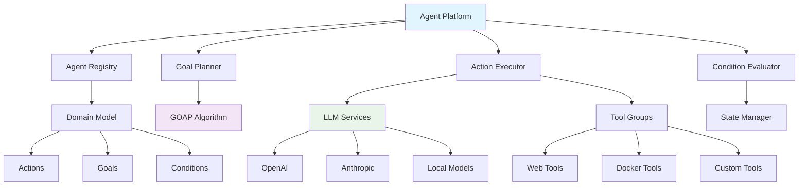
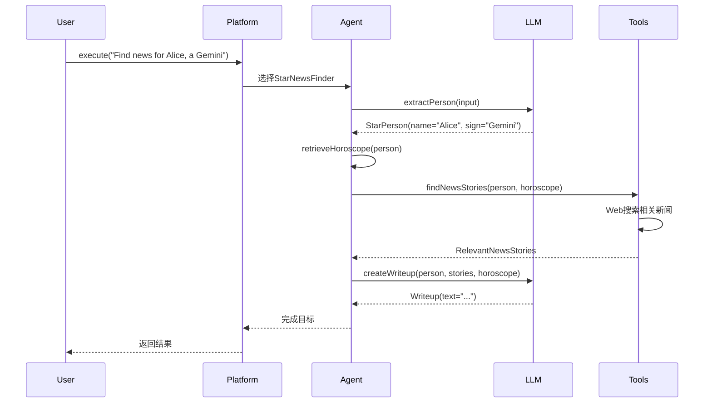

# Embabel Agent 框架详细使用指南

## 概述

Embabel (发音：Em-BAY-bel /ɛmˈbeɪbəl/) 是一个专为JVM平台设计的智能代理框架，由Spring框架创始人Rod Johnson开发。它提供了一套完整的解决方案，用于构建企业级AI代理应用程序。

### 核心特性

- **智能规划系统**：基于GOAP（目标导向行动规划）算法，支持动态路径查找
- **Spring生态集成**：深度集成Spring Boot，支持依赖注入和AOP
- **多语言支持**：原生支持Java和Kotlin，提供优雅的DSL
- **类型安全**：强类型系统，支持完整的重构和IDE支持
- **模型混用**：支持多LLM协作，成本和性能优化
- **MCP协议支持**：完整的Model Context Protocol实现

## 架构设计

### 核心组件架构



### 运行模式

Embabel支持三种运行模式：

1. **Focused模式**：用户代码请求特定功能
2. **Closed模式**：平台选择合适的代理
3. **Open模式**：平台使用所有资源实现目标

## 快速开始

### 环境要求

- **Java 21+**
- **Maven 3.9+** 或 **Gradle 7.0+**
- **API密钥**：OpenAI 或 Anthropic（至少一个）
- **Docker Desktop**（可选，用于MCP工具）

### 1. 项目创建

#### 使用模板工具
```bash
uvx --from git+https://github.com/embabel/project-creator.git project-creator
```

#### 使用GitHub模板
- [Java模板](https://github.com/embabel/java-agent-template)
- [Kotlin模板](https://github.com/embabel/kotlin-agent-template)

#### 手动配置

**Maven依赖**：
```xml
<dependency>
    <groupId>com.embabel.agent</groupId>
    <artifactId>embabel-agent-starter</artifactId>
    <version>${embabel-agent.version}</version>
</dependency>
```

**Gradle依赖**：
```kotlin
implementation("com.embabel.agent:embabel-agent-starter:${embabel-agent.version}")
```

### 2. 环境配置

设置API密钥：
```bash
export OPENAI_API_KEY="your_openai_key"
export ANTHROPIC_API_KEY="your_anthropic_key"
```

### 3. 应用程序配置

Embabel提供三种应用模式：

#### Shell模式
```kotlin
@SpringBootApplication
@EnableAgentShell
@EnableAgents(loggingTheme = LoggingThemes.STAR_WARS)
class AgentShellApplication

fun main(args: Array<String>) {
    runApplication<AgentShellApplication>(*args)
}
```

#### Shell + MCP客户端模式
```kotlin
@SpringBootApplication
@EnableAgentShell
@EnableAgents(
    loggingTheme = LoggingThemes.SEVERANCE,
    mcpServers = [McpServers.DOCKER_DESKTOP]
)
class AgentShellMcpClientApplication
```

#### MCP服务器模式
```kotlin
@SpringBootApplication
@EnableAgentMcpServer
@EnableAgents(mcpServers = [McpServers.DOCKER_DESKTOP])
class AgentMcpServerApplication
```

## 开发示例

### 1. 星座新闻查找器（初学者示例）

这是一个完整的Java示例，展示如何构建基础的Agent工作流：

```java
@Agent(description = "Find news based on a person's star sign")
public class StarNewsFinder {

    private final HoroscopeService horoscopeService;
    private final int storyCount;

    public StarNewsFinder(HoroscopeService horoscopeService, @Value("${story.count:5}") int storyCount) {
        this.horoscopeService = horoscopeService;
        this.storyCount = storyCount;
    }

    @Action
    public StarPerson extractPerson(UserInput userInput) {
        return new PromptRunner().createObject(
            "Create a person from this user input, extracting their name and star sign: " + userInput,
            StarPerson.class
        );
    }

    @Action
    public Horoscope retrieveHoroscope(StarPerson starPerson) {
        return new Horoscope(horoscopeService.dailyHoroscope(starPerson.getSign()));
    }

    @Action(toolGroups = {CoreToolGroups.WEB})
    public RelevantNewsStories findNewsStories(StarPerson person, Horoscope horoscope) {
        String prompt = String.format("""
            %s is an astrology believer with the sign %s.
            Their horoscope for today is: %s
            
            Given this, use web tools and generate search queries
            to find %d relevant news stories and summarize them.
            Include the URL for each story.
            """, person.getName(), person.getSign(), horoscope.getSummary(), storyCount);

        return new PromptRunner().createObject(prompt, RelevantNewsStories.class);
    }

    @AchievesGoal(description = "Create an amusing writeup for the target person")
    @Action
    public Writeup createWriteup(StarPerson person, RelevantNewsStories stories, Horoscope horoscope) {
        String prompt = String.format("""
            Take the following news stories and write up something amusing for %s.
            
            Begin by summarizing their horoscope in a concise, amusing way, then
            talk about the news. End with a surprising signoff.
            
            Horoscope: %s
            News Stories: %s
            
            Format it as Markdown with links.
            """, person.getName(), horoscope.getSummary(), 
            stories.getItems().stream()
                .map(story -> "- " + story.getUrl() + ": " + story.getSummary())
                .collect(Collectors.joining("\n")));

        return new PromptRunner().withTemperature(1.2).createObject(prompt, Writeup.class);
    }
}
```

**领域模型**：
```java
public record StarPerson(String name, String sign) {}

public record Horoscope(String summary) {}

public record NewsStory(String url, String summary) {}

public record RelevantNewsStories(List<NewsStory> items) {}

public record Writeup(String text) implements HasContent {}
```

### 2. Kotlin DSL事实检查器（高级示例）

展示函数式编程风格的Agent构建：

```kotlin
@ConfigurationProperties(prefix = "embabel.examples.factchecker")
data class FactCheckerProperties(
    val confidenceThreshold: Double = 0.7,
    val maxSources: Int = 3
)

fun factCheckerAgent(llms: List<LlmOptions>, properties: FactCheckerProperties) =
    agent(name = "FactChecker", description = "Check content for factual accuracy") {
        
        flow {
            aggregate<UserInput, FactualAssertions, RationalizedFactualAssertions>(
                transforms = llms.map { llm ->
                    { context ->
                        promptRunner(llm).createObject(
                            "Extract factual claims from: ${context.input}",
                            FactualAssertions::class.java
                        )
                    }
                },
                merge = { assertions, context ->
                    val allClaims = assertions.flatMap { it.claims }
                    val rationalized = promptRunner().createObject(
                        "Rationalize these overlapping claims: ${allClaims.joinToString()}",
                        RationalizedFactualAssertions::class.java
                    )
                    rationalized
                }
            )
        }

        transformation<RationalizedFactualAssertions, FactCheck> { assertions ->
            val checks = assertions.claims.parallelStream()
                .map { claim ->
                    val verification = webSearch(claim.claim)
                    val confidence = calculateConfidence(verification)
                    
                    AssertionCheck(
                        assertion = claim,
                        isFactual = confidence > properties.confidenceThreshold,
                        confidence = confidence,
                        sources = verification.sources.take(properties.maxSources)
                    )
                }
                .collect(Collectors.toList())
            
            FactCheck(checks = checks, overallScore = checks.map { it.confidence }.average())
        }
    }
```

**领域模型**：
```kotlin
data class FactualAssertion(
    val claim: String,
    val reasoning: String
)

data class AssertionCheck(
    val assertion: FactualAssertion,
    val isFactual: Boolean,
    val confidence: Double,
    val sources: List<String>
)

data class FactCheck(
    val checks: List<AssertionCheck>,
    val overallScore: Double
)
```

### 执行流程图



## 高级功能

### 1. 多模型协作

```kotlin
@Agent(description = "Research using multiple LLMs")
class MultiLLMResearcher {

    @ConfigurationProperties(prefix = "embabel.examples.researcher")
    data class ResearcherProperties(
        val maxWordCount: Int = 300,
        val claudeModelName: String = AnthropicModels.CLAUDE_35_HAIKU,
        val openAiModelName: String = OpenAiModels.GPT_41_MINI
    )

    @Action(outputBinding = "gpt4Report")
    fun researchWithGpt4(topic: String, properties: ResearcherProperties): SingleLlmReport {
        return promptRunner()
            .withModel(properties.openAiModelName)
            .withMaxTokens(properties.maxWordCount)
            .createObject("Research this topic: $topic", SingleLlmReport::class.java)
    }

    @Action(outputBinding = "claudeReport")
    fun researchWithClaude(topic: String, properties: ResearcherProperties): SingleLlmReport {
        return promptRunner()
            .withModel(properties.claudeModelName)
            .withMaxTokens(properties.maxWordCount)
            .createObject("Research this topic: $topic", SingleLlmReport::class.java)
    }

    @Action(outputBinding = "mergedReport")
    fun mergeReports(gpt4Report: SingleLlmReport, claudeReport: SingleLlmReport): ResearchReport {
        return promptRunner().createObject(
            "Merge these two research reports: ${gpt4Report.content} and ${claudeReport.content}",
            ResearchReport::class.java
        )
    }

    @Action
    fun critiqueReport(report: ResearchReport): Critique {
        return promptRunner().createObject(
            "Critique this research report for accuracy and completeness: ${report.content}",
            Critique::class.java
        )
    }

    @AchievesGoal(description = "Complete research with quality assurance")
    fun acceptReport(report: ResearchReport, critique: Critique): ResearchReport {
        return if (critique.isAcceptable) {
            report
        } else {
            throw AgentException("Research quality not acceptable: ${critique.issues}")
        }
    }
}
```

### 2. MCP协议集成

#### 服务端模式
```kotlin
@SpringBootApplication
@EnableAgentMcpServer
@EnableAgents
class AgentMcpServerApplication
```

您的Agent将作为MCP工具暴露：
- `find_horoscope_news` - 星座新闻查找
- `research_topic` - 主题研究
- `check_facts` - 事实核查

#### 客户端模式
```yaml
spring:
  ai:
    mcp:
      client:
        enabled: true
        name: embabel
        version: 1.0.0
        request-timeout: 30s
        type: SYNC
        stdio:
          connections:
            docker-mcp:
              command: docker
              args:
                - run
                - -i
                - --rm
                - alpine/socat
                - STDIO
                - TCP:host.docker.internal:8811
```

### 3. 工具组和自定义工具

```kotlin
@Component
class CustomToolGroup {
    
    @Tool("Search internal knowledge base")
    fun searchKnowledgeBase(query: String): List<KnowledgeItem> {
        // 实现内部知识库搜索
        return knowledgeRepository.findByQuery(query)
    }
    
    @Tool("Validate against company policies")
    fun validatePolicy(content: String): PolicyValidation {
        // 实现策略验证
        return policyService.validate(content)
    }
}

@Agent(description = "Enterprise content agent")
class EnterpriseContentAgent {
    
    @Action(toolGroups = ["CUSTOM", "WEB"])
    fun generateContent(requirements: ContentRequirements): Content {
        // 使用自定义工具组和Web工具
        return promptRunner()
            .withToolGroups("CUSTOM", "WEB")
            .createObject("Generate content: $requirements", Content::class.java)
    }
}
```

## 企业级特性

### 1. 配置管理

```kotlin
@ConfigurationProperties(prefix = "embabel.enterprise")
data class EnterpriseProperties(
    val security: SecurityConfig = SecurityConfig(),
    val monitoring: MonitoringConfig = MonitoringConfig(),
    val performance: PerformanceConfig = PerformanceConfig()
)

data class SecurityConfig(
    val enableAuditLog: Boolean = true,
    val maxTokensPerRequest: Int = 4000,
    val allowedToolGroups: List<String> = listOf("WEB", "CUSTOM")
)

data class MonitoringConfig(
    val enableMetrics: Boolean = true,
    val logLevel: String = "INFO",
    val alertThresholds: Map<String, Double> = mapOf(
        "errorRate" to 0.05,
        "responseTime" to 5000.0
    )
)

data class PerformanceConfig(
    val enableCaching: Boolean = true,
    val cacheTtlSeconds: Long = 3600,
    val maxConcurrentRequests: Int = 10
)
```

### 2. 缓存和性能优化

```kotlin
@Service
class CachedAgentService {
    
    @Cacheable(value = ["agentResults"], key = "#input.hashCode()")
    fun executeWithCache(input: UserInput): AgentResult {
        return agentPlatform.execute(input)
    }
    
    @Async
    fun executeAsync(input: UserInput): CompletableFuture<AgentResult> {
        return CompletableFuture.supplyAsync {
            agentPlatform.execute(input)
        }
    }
}
```

### 3. 错误处理和重试

```kotlin
@Component
class ResilientAgentExecutor {
    
    @Retryable(
        value = [AgentException::class],
        maxAttempts = 3,
        backoff = Backoff(delay = 1000, multiplier = 2.0)
    )
    fun executeWithRetry(input: UserInput): AgentResult {
        try {
            return agentPlatform.execute(input)
        } catch (e: RateLimitException) {
            logger.warn("Rate limit exceeded, backing off")
            throw e
        } catch (e: Exception) {
            logger.error("Agent execution failed", e)
            throw AgentException("Execution failed: ${e.message}", e)
        }
    }
    
    @Recover
    fun recover(ex: AgentException, input: UserInput): AgentResult {
        logger.error("Failed to execute agent after retries", ex)
        return AgentResult.failure("执行失败，请稍后重试")
    }
}
```

### 4. 测试策略

#### 单元测试
```kotlin
@ExtendWith(MockitoExtension::class)
class StarNewsFinderTest {
    
    @Mock
    private lateinit var horoscopeService: HoroscopeService
    
    @InjectMocks
    private lateinit var starNewsFinder: StarNewsFinder
    
    @Test
    fun `should extract person from input`() {
        // Given
        val userInput = UserInput("Alice is a Gemini")
        
        // When
        val result = starNewsFinder.extractPerson(userInput)
        
        // Then
        assertThat(result.name).isEqualTo("Alice")
        assertThat(result.sign).isEqualTo("Gemini")
    }
}
```

#### 集成测试
```kotlin
@SpringBootTest
@TestPropertySource(properties = [
    "embabel.test.mode=true",
    "embabel.llm.mock=true"
])
class StarNewsFinderIntegrationTest {
    
    @Autowired
    private lateinit var agentPlatform: AgentPlatform
    
    @Test
    fun `should complete star news workflow`() {
        // Given
        val input = UserInput("Find news for Alice who is a Gemini")
        
        // When
        val result = agentPlatform.execute(input)
        
        // Then
        assertThat(result.isSuccess).isTrue()
        assertThat(result.content).contains("Alice", "Gemini")
    }
}
```

#### 端到端测试
```kotlin
@SpringBootTest(webEnvironment = SpringBootTest.WebEnvironment.RANDOM_PORT)
@AutoConfigureTestDatabase(replace = AutoConfigureTestDatabase.Replace.NONE)
class AgentEndToEndTest {
    
    @Test
    fun `should handle complete user journey`() {
        // Given
        val request = AgentRequest(
            input = "Research renewable energy trends",
            options = AgentOptions(
                maxTokens = 1000,
                temperature = 0.7
            )
        )
        
        // When
        val response = restTemplate.postForEntity(
            "/api/agents/execute",
            request,
            AgentResponse::class.java
        )
        
        // Then
        assertThat(response.statusCode).isEqualTo(HttpStatus.OK)
        assertThat(response.body?.result).isNotNull()
    }
}
```

## 部署指南

### 1. Docker部署

```dockerfile
FROM openjdk:21-jdk-slim

WORKDIR /app

COPY target/embabel-agent-app.jar app.jar

EXPOSE 8080

ENV JAVA_OPTS="-Xmx2g -Xms1g"

ENTRYPOINT ["java", "-jar", "app.jar"]
```

### 2. Kubernetes部署

```yaml
apiVersion: apps/v1
kind: Deployment
metadata:
  name: embabel-agent
spec:
  replicas: 3
  selector:
    matchLabels:
      app: embabel-agent
  template:
    metadata:
      labels:
        app: embabel-agent
    spec:
      containers:
      - name: embabel-agent
        image: embabel-agent:latest
        ports:
        - containerPort: 8080
        env:
        - name: OPENAI_API_KEY
          valueFrom:
            secretKeyRef:
              name: api-keys
              key: openai-key
        - name: ANTHROPIC_API_KEY
          valueFrom:
            secretKeyRef:
              name: api-keys
              key: anthropic-key
        resources:
          requests:
            memory: "1Gi"
            cpu: "500m"
          limits:
            memory: "2Gi"
            cpu: "1000m"
---
apiVersion: v1
kind: Service
metadata:
  name: embabel-agent-service
spec:
  selector:
    app: embabel-agent
  ports:
  - port: 80
    targetPort: 8080
  type: LoadBalancer
```

## 监控和运维

### 1. 指标监控

```kotlin
@Component
class AgentMetrics {
    
    private val executionCounter = Counter.builder("embabel.agent.executions")
        .description("Total agent executions")
        .register(Metrics.globalRegistry)
    
    private val executionTimer = Timer.builder("embabel.agent.execution.time")
        .description("Agent execution time")
        .register(Metrics.globalRegistry)
    
    @EventListener
    fun handleAgentExecution(event: AgentExecutionEvent) {
        executionCounter.increment(
            Tags.of(
                "agent", event.agentName,
                "status", event.status.name
            )
        )
        
        executionTimer.record(event.duration, TimeUnit.MILLISECONDS)
    }
}
```

### 2. 健康检查

```kotlin
@Component
class AgentHealthIndicator : HealthIndicator {
    
    override fun health(): Health {
        return try {
            val isHealthy = checkLlmConnectivity() && checkToolsAvailability()
            
            if (isHealthy) {
                Health.up()
                    .withDetail("llm", "Connected")
                    .withDetail("tools", "Available")
                    .build()
            } else {
                Health.down()
                    .withDetail("error", "Service unavailable")
                    .build()
            }
        } catch (e: Exception) {
            Health.down(e).build()
        }
    }
    
    private fun checkLlmConnectivity(): Boolean {
        // 实现LLM连接检查
        return true
    }
    
    private fun checkToolsAvailability(): Boolean {
        // 实现工具可用性检查
        return true
    }
}
```

## 故障排除

### 常见问题

1. **API密钥问题**
   ```
   错误：No API keys found
   解决：设置 OPENAI_API_KEY 或 ANTHROPIC_API_KEY
   ```

2. **构建失败**
   ```
   错误：Build failures
   解决：运行 ./mvnw clean install
   ```

3. **MCP连接失败**
   ```
   错误：MCP client fails to connect
   解决：检查Docker Desktop状态和MCP扩展
   ```

### 调试技巧

1. **启用详细日志**
   ```properties
   logging.level.com.embabel=DEBUG
   embabel.agent.logging.prompts=true
   embabel.agent.logging.responses=true
   ```

2. **使用Shell命令调试**
   ```bash
   # 执行带调试的命令
   execute "your request" -p -r
   
   # 查看执行历史
   history
   
   # 重复上次命令
   !!
   ```

## 最佳实践

### 1. Agent设计原则

- **单一职责**：每个Agent专注于特定领域
- **可组合性**：设计可重用的Action和Goal
- **类型安全**：使用强类型领域模型
- **可测试性**：确保每个组件都可以单独测试

### 2. 性能优化

- **缓存策略**：合理使用缓存减少重复计算
- **并行执行**：利用多线程处理独立任务
- **模型选择**：根据任务复杂度选择合适的模型
- **批处理**：对相似任务进行批处理

### 3. 安全考虑

- **输入验证**：验证所有用户输入
- **权限控制**：限制Agent访问敏感资源
- **审计日志**：记录所有Agent执行活动
- **错误处理**：优雅处理异常情况

## 总结

Embabel Agent框架为JVM平台提供了一个强大而灵活的AI代理开发解决方案。通过其独特的GOAP规划算法、深度的Spring集成以及丰富的工具生态系统，开发者可以构建出既智能又可靠的企业级AI应用。

无论是简单的工作流自动化还是复杂的多模型协作系统，Embabel都提供了必要的工具和抽象，让开发者能够专注于业务逻辑而不是底层实现细节。

随着AI技术的不断发展，Embabel将继续演进，为开发者提供更多创新的功能和更好的开发体验。 