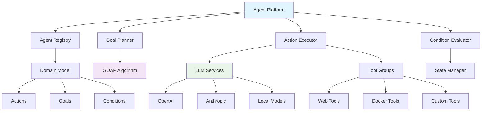
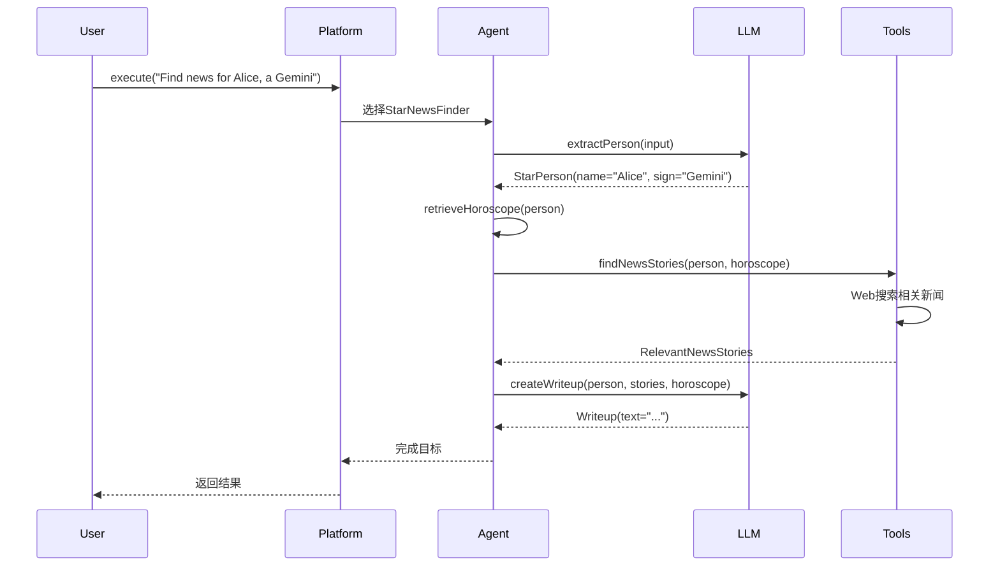

# Embabel Agent 框架详细使用指南

## 概述

Embabel (发音：Em-BAY-bel /ɛmˈbeɪbəl/) 是一个专为JVM平台设计的智能代理框架，由Spring框架创始人Rod Johnson开发。它提供了一套完整的解决方案，用于构建企业级AI代理应用程序。

### 核心特性

- **智能规划系统**：基于GOAP（目标导向行动规划）算法，支持动态路径查找
- **Spring生态集成**：深度集成Spring Boot，支持依赖注入和AOP
- **多语言支持**：原生支持Java和Kotlin，提供优雅的DSL
- **类型安全**：强类型系统，支持完整的重构和IDE支持
- **模型混用**：支持多LLM协作，成本和性能优化
- **MCP协议支持**：完整的Model Context Protocol实现

## 架构设计

### 核心组件架构



### 运行模式

Embabel支持三种运行模式：

1. **Focused模式**：用户代码请求特定功能
2. **Closed模式**：平台选择合适的代理
3. **Open模式**：平台使用所有资源实现目标

## 快速开始

### 环境要求

- **Java 21+**
- **Maven 3.9+** 或 **Gradle 7.0+**
- **API密钥**：OpenAI 或 Anthropic（至少一个）
- **Docker Desktop**（可选，用于MCP工具）

### 1. 项目创建

#### 使用模板工具
```bash
uvx --from git+https://github.com/embabel/project-creator.git project-creator
```

#### 使用GitHub模板
- [Java模板](https://github.com/embabel/java-agent-template)
- [Kotlin模板](https://github.com/embabel/kotlin-agent-template)

#### 手动配置

**Maven依赖**：
```xml
<dependency>
    <groupId>com.embabel.agent</groupId>
    <artifactId>embabel-agent-starter</artifactId>
    <version>${embabel-agent.version}</version>
</dependency>
```

**Gradle依赖**：
```kotlin
implementation("com.embabel.agent:embabel-agent-starter:${embabel-agent.version}")
```

### 2. 环境配置

设置API密钥：
```bash
export OPENAI_API_KEY="your_openai_key"
export ANTHROPIC_API_KEY="your_anthropic_key"
```

### 3. 应用程序配置

Embabel提供三种应用模式：

#### Shell模式
```kotlin
@SpringBootApplication
@EnableAgentShell
@EnableAgents(loggingTheme = LoggingThemes.STAR_WARS)
class AgentShellApplication

fun main(args: Array<String>) {
    runApplication<AgentShellApplication>(*args)
}
```

#### Shell + MCP客户端模式
```kotlin
@SpringBootApplication
@EnableAgentShell
@EnableAgents(
    loggingTheme = LoggingThemes.SEVERANCE,
    mcpServers = [McpServers.DOCKER_DESKTOP]
)
class AgentShellMcpClientApplication
```

#### MCP服务器模式
```kotlin
@SpringBootApplication
@EnableAgentMcpServer
@EnableAgents(mcpServers = [McpServers.DOCKER_DESKTOP])
class AgentMcpServerApplication
```

## 开发示例

### 1. 星座新闻查找器（初学者示例）

这是一个完整的Java示例，展示如何构建基础的Agent工作流：

```java
@Agent(description = "Find news based on a person's star sign")
public class StarNewsFinder {

    private final HoroscopeService horoscopeService;
    private final int storyCount;

    public StarNewsFinder(HoroscopeService horoscopeService, @Value("${story.count:5}") int storyCount) {
        this.horoscopeService = horoscopeService;
        this.storyCount = storyCount;
    }

    @Action
    public StarPerson extractPerson(UserInput userInput) {
        return new PromptRunner().createObject(
            "Create a person from this user input, extracting their name and star sign: " + userInput,
            StarPerson.class
        );
    }

    @Action
    public Horoscope retrieveHoroscope(StarPerson starPerson) {
        return new Horoscope(horoscopeService.dailyHoroscope(starPerson.getSign()));
    }

    @Action(toolGroups = {CoreToolGroups.WEB})
    public RelevantNewsStories findNewsStories(StarPerson person, Horoscope horoscope) {
        String prompt = String.format("""
            %s is an astrology believer with the sign %s.
            Their horoscope for today is: %s
            
            Given this, use web tools and generate search queries
            to find %d relevant news stories and summarize them.
            Include the URL for each story.
            """, person.getName(), person.getSign(), horoscope.getSummary(), storyCount);

        return new PromptRunner().createObject(prompt, RelevantNewsStories.class);
    }

    @AchievesGoal(description = "Create an amusing writeup for the target person")
    @Action
    public Writeup createWriteup(StarPerson person, RelevantNewsStories stories, Horoscope horoscope) {
        String prompt = String.format("""
            Take the following news stories and write up something amusing for %s.
            
            Begin by summarizing their horoscope in a concise, amusing way, then
            talk about the news. End with a surprising signoff.
            
            Horoscope: %s
            News Stories: %s
            
            Format it as Markdown with links.
            """, person.getName(), horoscope.getSummary(), 
            stories.getItems().stream()
                .map(story -> "- " + story.getUrl() + ": " + story.getSummary())
                .collect(Collectors.joining("\n")));

        return new PromptRunner().withTemperature(1.2).createObject(prompt, Writeup.class);
    }
}
```

**领域模型**：
```java
public record StarPerson(String name, String sign) {}

public record Horoscope(String summary) {}

public record NewsStory(String url, String summary) {}

public record RelevantNewsStories(List<NewsStory> items) {}

public record Writeup(String text) implements HasContent {}
```

### 2. Kotlin DSL事实检查器（高级示例）

展示函数式编程风格的Agent构建：

```kotlin
@ConfigurationProperties(prefix = "embabel.examples.factchecker")
data class FactCheckerProperties(
    val confidenceThreshold: Double = 0.7,
    val maxSources: Int = 3
)

fun factCheckerAgent(llms: List<LlmOptions>, properties: FactCheckerProperties) =
    agent(name = "FactChecker", description = "Check content for factual accuracy") {
        
        flow {
            aggregate<UserInput, FactualAssertions, RationalizedFactualAssertions>(
                transforms = llms.map { llm ->
                    { context ->
                        promptRunner(llm).createObject(
                            "Extract factual claims from: ${context.input}",
                            FactualAssertions::class.java
                        )
                    }
                },
                merge = { assertions, context ->
                    val allClaims = assertions.flatMap { it.claims }
                    val rationalized = promptRunner().createObject(
                        "Rationalize these overlapping claims: ${allClaims.joinToString()}",
                        RationalizedFactualAssertions::class.java
                    )
                    rationalized
                }
            )
        }

        transformation<RationalizedFactualAssertions, FactCheck> { assertions ->
            val checks = assertions.claims.parallelStream()
                .map { claim ->
                    val verification = webSearch(claim.claim)
                    val confidence = calculateConfidence(verification)
                    
                    AssertionCheck(
                        assertion = claim,
                        isFactual = confidence > properties.confidenceThreshold,
                        confidence = confidence,
                        sources = verification.sources.take(properties.maxSources)
                    )
                }
                .collect(Collectors.toList())
            
            FactCheck(checks = checks, overallScore = checks.map { it.confidence }.average())
        }
    }
```

**领域模型**：
```kotlin
data class FactualAssertion(
    val claim: String,
    val reasoning: String
)

data class AssertionCheck(
    val assertion: FactualAssertion,
    val isFactual: Boolean,
    val confidence: Double,
    val sources: List<String>
)

data class FactCheck(
    val checks: List<AssertionCheck>,
    val overallScore: Double
)
```

### 执行流程图



## 高级功能

### 1. 多模型协作

```kotlin
@Agent(description = "Research using multiple LLMs")
class MultiLLMResearcher {

    @ConfigurationProperties(prefix = "embabel.examples.researcher")
    data class ResearcherProperties(
        val maxWordCount: Int = 300,
        val claudeModelName: String = AnthropicModels.CLAUDE_35_HAIKU,
        val openAiModelName: String = OpenAiModels.GPT_41_MINI
    )

    @Action(outputBinding = "gpt4Report")
    fun researchWithGpt4(topic: String, properties: ResearcherProperties): SingleLlmReport {
        return promptRunner()
            .withModel(properties.openAiModelName)
            .withMaxTokens(properties.maxWordCount)
            .createObject("Research this topic: $topic", SingleLlmReport::class.java)
    }

    @Action(outputBinding = "claudeReport")
    fun researchWithClaude(topic: String, properties: ResearcherProperties): SingleLlmReport {
        return promptRunner()
            .withModel(properties.claudeModelName)
            .withMaxTokens(properties.maxWordCount)
            .createObject("Research this topic: $topic", SingleLlmReport::class.java)
    }

    @Action(outputBinding = "mergedReport")
    fun mergeReports(gpt4Report: SingleLlmReport, claudeReport: SingleLlmReport): ResearchReport {
        return promptRunner().createObject(
            "Merge these two research reports: ${gpt4Report.content} and ${claudeReport.content}",
            ResearchReport::class.java
        )
    }

    @Action
    fun critiqueReport(report: ResearchReport): Critique {
        return promptRunner().createObject(
            "Critique this research report for accuracy and completeness: ${report.content}",
            Critique::class.java
        )
    }

    @AchievesGoal(description = "Complete research with quality assurance")
    fun acceptReport(report: ResearchReport, critique: Critique): ResearchReport {
        return if (critique.isAcceptable) {
            report
        } else {
            throw AgentException("Research quality not acceptable: ${critique.issues}")
        }
    }
}
```

### 2. MCP协议集成

#### 服务端模式
```