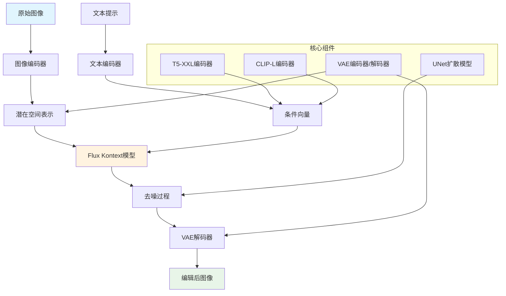
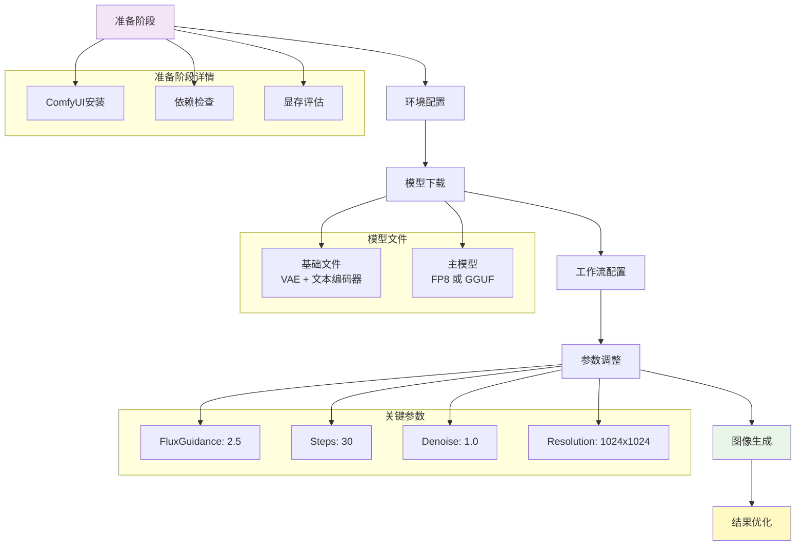
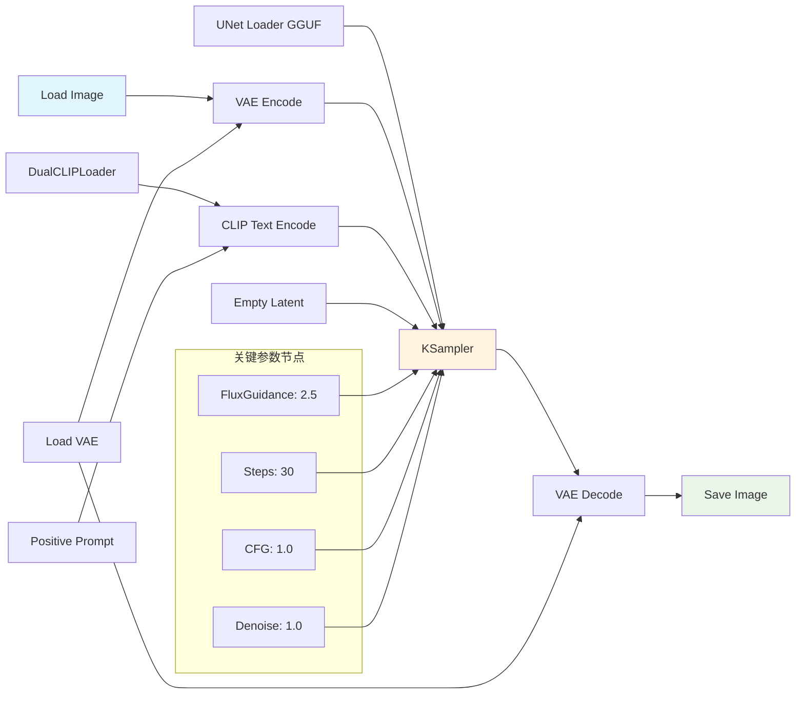
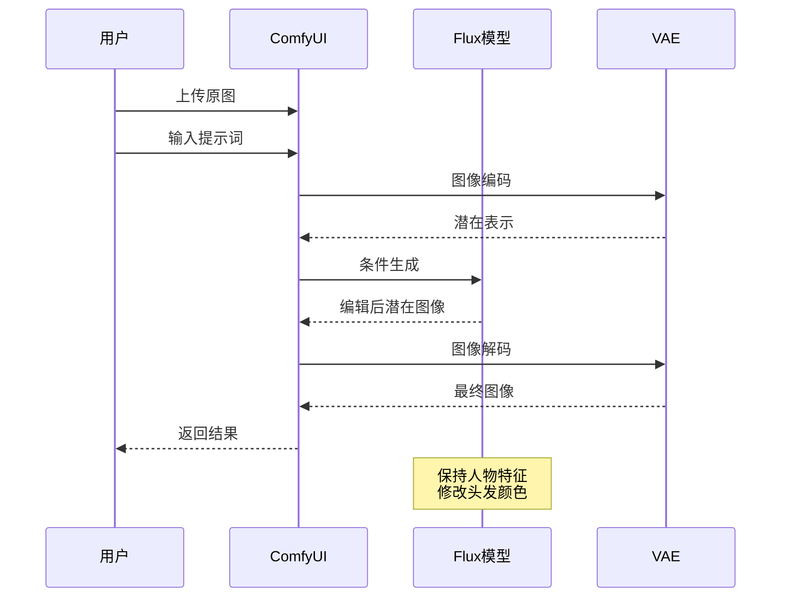
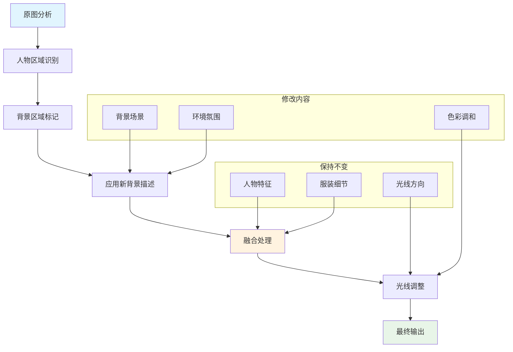
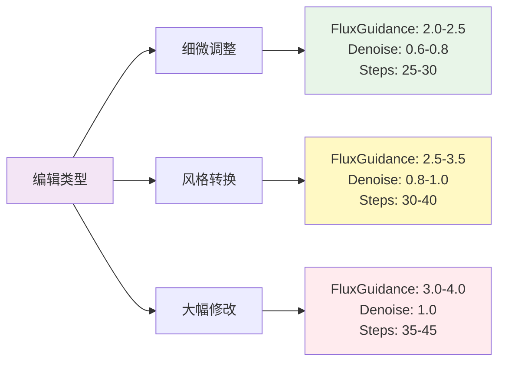
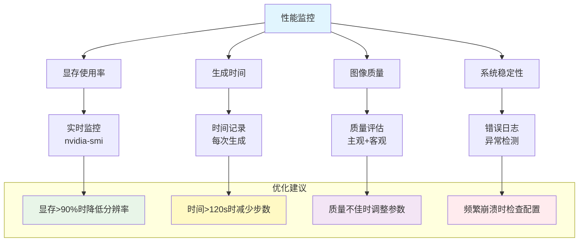
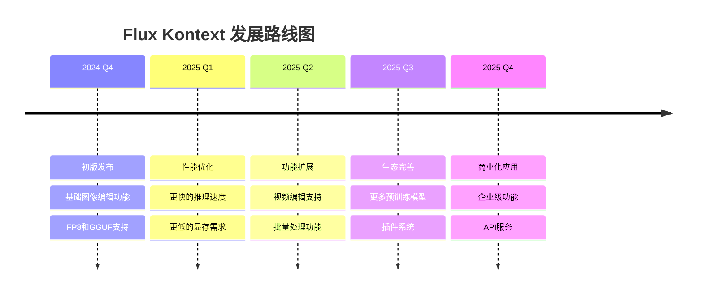

# Flux.1 Kontext Dev 完整指南：在ComfyUI中实现AI图像编辑的革命性突破

## 概述

Flux.1 Kontext Dev 是一个革命性的AI图像编辑模型，专为图像到图像（Image-to-Image）生成而设计。它能够在保持原图核心特征的同时，根据文本提示对图像进行精确的局部或全局修改。本文将详细介绍如何在ComfyUI中配置和使用这一强大的工具。

### 核心特性

- **精准编辑**：能够根据文本提示精确修改图像的特定部分
- **风格转换**：支持多种艺术风格之间的转换
- **字符一致性**：在编辑过程中保持人物特征的一致性
- **灵活配置**：提供FP8和GGUF两种模型版本，适应不同硬件配置
- **低显存支持**：GGUF版本支持12GB或更少显存的系统

## 系统架构

### 模型架构图



### 工作流程架构



## 环境要求与配置

### 硬件要求

| 组件 | 最低配置 | 推荐配置 |
|------|----------|----------|
| 显卡 | GTX 1080 (8GB) | RTX 4080 (16GB+) |
| 显存 | 8GB | 16GB+ |
| 内存 | 16GB | 32GB+ |
| 存储 | 50GB可用空间 | 100GB+ SSD |

### 软件要求

- **ComfyUI** 最新版本
- **Python** 3.8+
- **CUDA** 11.8+ (NVIDIA显卡)
- **Git** (用于更新)

## 详细安装步骤

### 第一步：基础文件下载

创建以下目录结构并下载必要文件：

```
ComfyUI/
├── models/
│   ├── clip/
│   │   ├── t5xxl_fp16.safetensors
│   │   └── clip_l.safetensors
│   ├── vae/
│   │   └── ae.safetensors
│   └── diffusion_models/
│       └── flux1-kontext-dev-Q3_K_S.gguf
```

#### 必需文件清单

| 文件名 | 大小 | 用途 | 下载地址 |
|--------|------|------|----------|
| `t5xxl_fp16.safetensors` | ~9GB | T5文本编码器 | [HuggingFace](https://huggingface.co/comfyanonymous/flux_text_encoders/blob/main/t5xxl_fp16.safetensors) |
| `clip_l.safetensors` | ~250MB | CLIP文本编码器 | [HuggingFace](https://huggingface.co/comfyanonymous/flux_text_encoders/tree/main) |
| `ae.safetensors` | ~320MB | VAE编码器 | [HuggingFace](https://huggingface.co/black-forest-labs/FLUX.1-dev/blob/main/ae.safetensors) |

### 第二步：选择合适的模型版本

#### FP8模型（推荐高端显卡）
- **优势**：更好的图像质量，更快的推理速度
- **要求**：16GB+ 显存
- **适用**：RTX 4080, RTX 4090, A100等

#### GGUF模型（推荐中低端显卡）
- **优势**：显存占用更低，兼容性更好
- **要求**：8GB+ 显存
- **适用**：GTX 1080, RTX 3060, RTX 3070等

### 第三步：ComfyUI更新

#### Windows用户
```bash
# 进入ComfyUI目录
cd ComfyUI_windows_portable/update/
# 运行更新脚本
update_comfyui.bat
```

#### Linux/macOS用户
```bash
# 激活虚拟环境
source ComfyUI/venv/bin/activate
# 更新依赖
pip install -r ComfyUI/requirements.txt
# 更新ComfyUI
cd ComfyUI && git pull
```

## 工作流配置详解

### 节点配置图



### 关键参数说明

#### FluxGuidance（引导强度）
- **范围**：1.0 - 5.0
- **推荐值**：2.5
- **作用**：控制提示词对最终结果的影响程度

```python
# 参数效果对比
FluxGuidance = 1.0  # 较为自然，可能偏离提示词
FluxGuidance = 2.5  # 平衡效果，推荐值
FluxGuidance = 5.0  # 强烈遵循提示词，可能过度
```

#### Steps（采样步数）
- **范围**：10 - 50
- **推荐值**：30
- **作用**：决定生成质量和时间

#### Denoise（去噪强度）
- **范围**：0.0 - 1.0
- **推荐值**：1.0（完全重新生成）
- **作用**：控制原图保留程度

## 实战应用示例

### 示例1：人物发色修改

#### 原始提示词
```
保持同一个女性，沙漠背景和服装不变，但将她的头发颜色改为红色
```

#### 配置参数
```yaml
FluxGuidance: 2.5
Steps: 30
Denoise: 1.0
Resolution: 1024x1024
Sampler: euler
Scheduler: beta
```

#### 编辑流程图



### 示例2：风格转换

#### 现实照片转动漫风格

```
将肖像转换为动漫风格艺术，保持她蓬松的栗色头发、烟熏妆、丝质吊带和感性表情。保持同样的亲密氛围
```

#### 高级配置
```yaml
# 风格转换专用参数
FluxGuidance: 3.0  # 略高，确保风格转换
Steps: 35          # 增加细节
Denoise: 0.8       # 保留更多原图信息
CFG: 1.2          # 适度增强
```

### 示例3：背景替换

#### 保持人物，更换场景

```
保持同一个女性、服装和光线不变，但将背景改为夜晚的屋顶酒吧
```

#### 背景编辑流程



## 高级技巧与最佳实践

### 提示词工程

#### 基础修改格式
```
保持 [不变元素]，但将 [修改目标] 改为 [期望结果]
```

#### 风格转换格式
```
转换为 [目标风格]，同时保持 [关键特征]
```

#### 复杂编辑格式
```
维持 [主要元素1]、[主要元素2] 和 [主要元素3]，
但将 [修改目标1] 改为 [结果1]，
并且将 [修改目标2] 调整为 [结果2]
```

### 参数调优策略

#### 根据编辑类型调整参数



### 常见问题解决

#### 显存不足
```python
# 解决方案1：使用GGUF模型
model_type = "GGUF"
quantization = "Q3_K_S"  # 最低显存要求

# 解决方案2：降低分辨率
resolution = (768, 768)  # 替代1024x1024

# 解决方案3：启用CPU卸载
cpu_offload = True
```

#### 生成质量不佳
```python
# 解决方案1：增加采样步数
steps = 40  # 从30增加到40

# 解决方案2：调整引导强度
flux_guidance = 3.0  # 从2.5增加到3.0

# 解决方案3：优化提示词
prompt = "详细描述 + 保持不变的元素 + 修改目标"
```

## 性能优化与监控

### 性能基准测试

| 配置 | 模型版本 | 显存占用 | 生成时间 | 图像质量 |
|------|----------|----------|----------|----------|
| RTX 4090 | FP8 | 14GB | 25秒 | 优秀 |
| RTX 4080 | FP8 | 12GB | 35秒 | 优秀 |
| RTX 3080 | GGUF Q4 | 8GB | 60秒 | 良好 |
| RTX 3060 | GGUF Q3 | 6GB | 90秒 | 良好 |

### 监控指标



## 实际案例分析

### 案例1：产品图片编辑

#### 场景描述
为电商网站编辑产品图片，需要更换背景颜色但保持产品细节。

#### 工作流程
1. **原图分析**：识别产品边界和背景区域
2. **提示词设计**：`保持产品的所有细节、材质和光线，但将背景改为纯白色`
3. **参数配置**：
   ```yaml
   FluxGuidance: 2.8
   Steps: 35
   Denoise: 0.7
   Resolution: 1024x1024
   ```

#### 结果评估
- ✅ 产品细节保持完整
- ✅ 背景完全替换
- ✅ 边缘处理自然
- ⚠️ 可能需要多次尝试以获得最佳效果

### 案例2：人像美化

#### 场景描述
对人像照片进行美化，保持人物特征但改善整体效果。

#### 提示词策略
```
保持同一个人的面部特征、发型和表情，但改善皮肤质感，
增加自然光线效果，并轻微调整色彩饱和度使照片更加生动
```

#### 技术细节
- **面部保护**：使用较低的Denoise值（0.6）
- **细节增强**：增加采样步数至40
- **色彩优化**：通过FluxGuidance精确控制

## 未来发展与展望

### 技术趋势



### 应用前景

1. **内容创作**：自媒体、设计师的高效工具
2. **电商应用**：产品图片快速编辑
3. **影视制作**：概念图和预可视化
4. **教育培训**：AI图像编辑教学
5. **个人娱乐**：照片美化和创意制作

## 总结

Flux.1 Kontext Dev 代表了AI图像编辑技术的重大进步，它不仅提供了强大的编辑能力，还保持了良好的易用性和可访问性。通过本指南，您应该能够：

1. ✅ 理解Flux.1 Kontext Dev的核心原理
2. ✅ 正确配置ComfyUI环境
3. ✅ 掌握基本的图像编辑技巧
4. ✅ 应用高级优化策略
5. ✅ 解决常见问题

### 关键要点回顾

- **模型选择**：根据显存容量选择FP8或GGUF版本
- **参数调优**：FluxGuidance 2.5，Steps 30是良好的起点
- **提示词工程**：明确指出保持不变和需要修改的元素
- **性能优化**：合理配置分辨率和采样参数
- **持续学习**：跟进技术更新和社区最佳实践

随着AI技术的不断发展，Flux.1 Kontext Dev必将在图像编辑领域发挥更大的作用。掌握这一工具，将为您的创作之路打开新的可能性。

---

*如果您在使用过程中遇到任何问题，欢迎在评论区交流讨论。让我们一起探索AI图像编辑的无限可能！*

## 参考资源

- [ComfyUI官方文档](https://docs.comfy.org/)
- [Flux.1模型仓库](https://huggingface.co/black-forest-labs/FLUX.1-dev)
- [社区讨论论坛](https://github.com/comfyanonymous/ComfyUI/discussions)
- [最佳实践集合](https://github.com/comfyanonymous/ComfyUI_examples) 