# WRK HTTP 基准测试工具完全指南：现代高性能 Web 服务器压力测试利器

## 项目概述

在现代 Web 应用开发中，性能测试是确保系统稳定性和可扩展性的关键环节。[wrk](https://github.com/wg/wrk) 是一个现代的 HTTP 基准测试工具，专为在现代多核 CPU 上产生大量负载而设计。它结合了多线程设计和可扩展的事件通知系统（如 epoll 和 kqueue），能够在单机上模拟数以万计的并发连接。

### 什么是 WRK？

**WRK** 是一个现代的 HTTP 基准测试工具，具有以下核心特性：

- 🚀 **高性能**：利用多线程和事件驱动 I/O 模型
- 📊 **详细报告**：提供延迟分布、请求/秒等关键指标
- 🔧 **可扩展性**：支持 Lua 脚本自定义测试逻辑
- 💡 **简单易用**：命令行界面简洁直观
- 🎯 **精确测试**：可精确控制并发数、持续时间等参数

### 项目特点

- **轻量级**：单个二进制文件，无复杂依赖
- **跨平台**：支持 Linux、macOS、Windows
- **高并发**：单机可模拟数十万并发连接
- **灵活配置**：支持自定义 HTTP 头、请求体等
- **实时统计**：提供实时的性能指标反馈

## WRK 架构原理解析

### 核心架构图

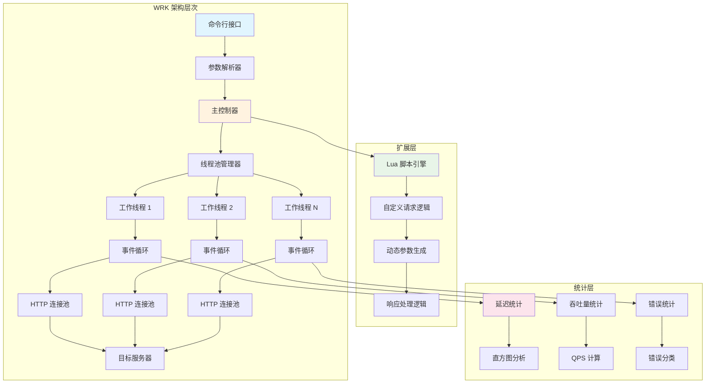

### 工作流程详解

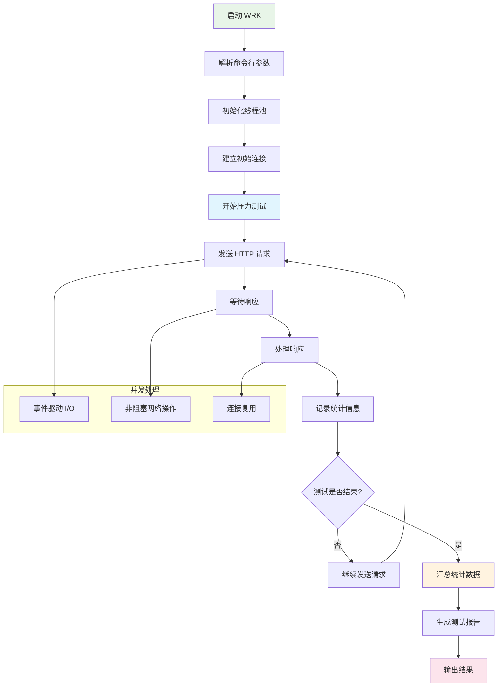

### 多线程模型

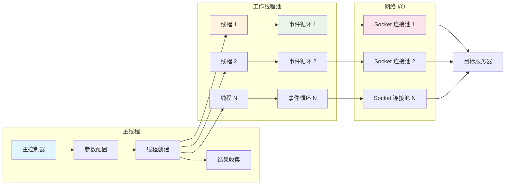

## 安装与基本使用

### 安装方法

#### 1. 从源码编译

```bash
# 克隆项目
git clone https://github.com/wg/wrk.git
cd wrk

# 编译（需要 make 和 gcc）
make

# 安装到系统路径
sudo cp wrk /usr/local/bin/
```

#### 2. 使用包管理器

```bash
# Ubuntu/Debian
sudo apt-get install wrk

# CentOS/RHEL
sudo yum install wrk

# macOS
brew install wrk

# Arch Linux
sudo pacman -S wrk
```

### 基本命令语法

```bash
wrk [选项] <URL>
```

### 核心参数详解

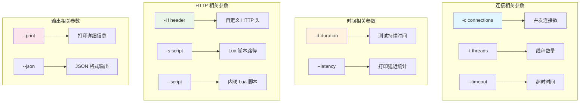

## 实际使用示例

### 1. 基础性能测试

```bash
# 基本测试：12 个线程，400 个连接，持续 30 秒
wrk -t12 -c400 -d30s http://127.0.0.1:8080/

# 输出示例
Running 30s test @ http://127.0.0.1:8080/
  12 threads and 400 connections
  Thread Stats   Avg      Stdev     Max   +/- Stdev
    Latency     2.73ms    1.12ms  16.71ms   92.02%
    Req/Sec    12.34k     1.89k   22.01k    89.12%
  4423549 requests in 30.00s, 542.45MB read
Requests/sec: 147451.63
Transfer/sec:  18.08MB
```

### 2. 带延迟分析的测试

```bash
# 详细延迟统计
wrk -t12 -c400 -d30s --latency http://127.0.0.1:8080/

# 输出示例
Running 30s test @ http://127.0.0.1:8080/
  12 threads and 400 connections
  Thread Stats   Avg      Stdev     Max   +/- Stdev
    Latency     2.73ms    1.12ms  16.71ms   92.02%
    Req/Sec    12.34k     1.89k   22.01k    89.12%
  Latency Distribution
     50%    2.43ms
     75%    3.28ms
     90%    4.17ms
     99%    8.45ms
  4423549 requests in 30.00s, 542.45MB read
Requests/sec: 147451.63
Transfer/sec:  18.08MB
```

### 3. 自定义 HTTP 头测试

```bash
# 添加自定义头
wrk -t12 -c400 -d30s \
    -H "Accept-Encoding: gzip" \
    -H "Connection: keep-alive" \
    -H "User-Agent: wrk-benchmark" \
    http://127.0.0.1:8080/api/users
```

### 4. POST 请求测试

```bash
# 使用 Lua 脚本发送 POST 请求
wrk -t12 -c400 -d30s -s post.lua http://127.0.0.1:8080/api/users
```

对应的 `post.lua` 脚本：

```lua
-- post.lua
wrk.method = "POST"
wrk.body   = '{"name": "John", "email": "john@example.com"}'
wrk.headers["Content-Type"] = "application/json"

function init(args)
    print("开始 POST 请求测试")
end

function request()
    return wrk.format(nil, nil, nil, wrk.body)
end

function response(status, headers, body)
    if status ~= 200 then
        print("错误响应: " .. status)
    end
end
```

## 高级功能与 Lua 脚本

### Lua 脚本架构

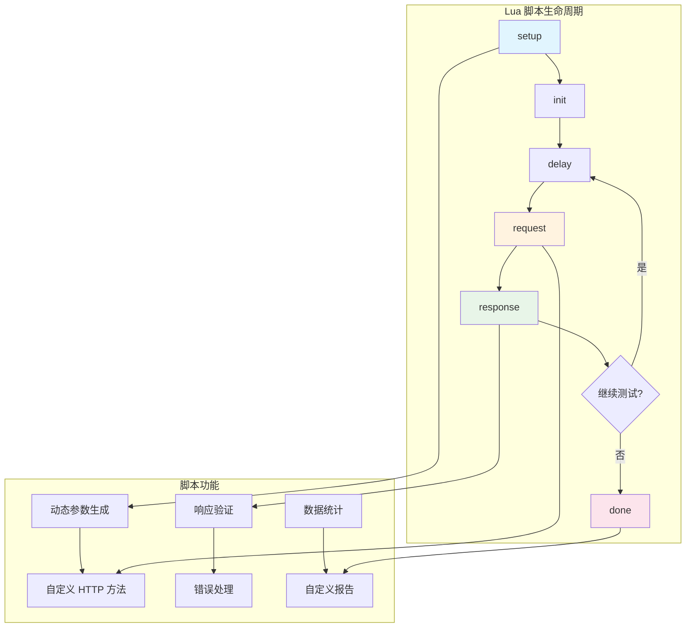

### 高级 Lua 脚本示例

#### 1. 动态参数生成

```lua
-- dynamic-params.lua
local counter = 0
local users = {"alice", "bob", "charlie", "diana"}

function init(args)
    print("初始化动态参数测试")
end

function request()
    counter = counter + 1
    local user = users[(counter % #users) + 1]
    local path = "/api/users/" .. user
    return wrk.format("GET", path)
end

function response(status, headers, body)
    if status ~= 200 then
        print("用户 " .. user .. " 请求失败: " .. status)
    end
end
```

#### 2. 复杂业务场景模拟

```lua
-- complex-scenario.lua
local json = require("json")

-- 模拟用户行为序列
local actions = {
    {method = "GET", path = "/api/products"},
    {method = "GET", path = "/api/categories"},
    {method = "POST", path = "/api/cart/add", body = '{"productId": 123, "quantity": 2}'},
    {method = "GET", path = "/api/cart"},
    {method = "POST", path = "/api/orders", body = '{"items": [{"productId": 123, "quantity": 2}]}'}
}

local current_action = 1

function init(args)
    print("开始复杂业务场景测试")
end

function request()
    local action = actions[current_action]
    current_action = (current_action % #actions) + 1
    
    if action.method == "POST" then
        wrk.headers["Content-Type"] = "application/json"
        return wrk.format(action.method, action.path, nil, action.body)
    else
        return wrk.format(action.method, action.path)
    end
end

function response(status, headers, body)
    if status >= 400 then
        print("业务操作失败: " .. status .. " " .. body)
    end
end
```

#### 3. 性能监控与分析

```lua
-- performance-monitor.lua
local requests = 0
local errors = 0
local total_latency = 0

function init(args)
    print("开始性能监控测试")
end

function request()
    requests = requests + 1
    return wrk.format("GET", "/api/health")
end

function response(status, headers, body)
    if status ~= 200 then
        errors = errors + 1
        print("错误响应: " .. status)
    end
end

function done(summary, latency, requests)
    local error_rate = (errors / requests) * 100
    print("总请求数: " .. requests)
    print("错误率: " .. string.format("%.2f%%", error_rate))
    print("平均延迟: " .. string.format("%.2f ms", summary.latency_mean / 1000))
    print("最大延迟: " .. string.format("%.2f ms", summary.latency_max / 1000))
end
```

## 性能测试最佳实践

### 1. 测试环境配置

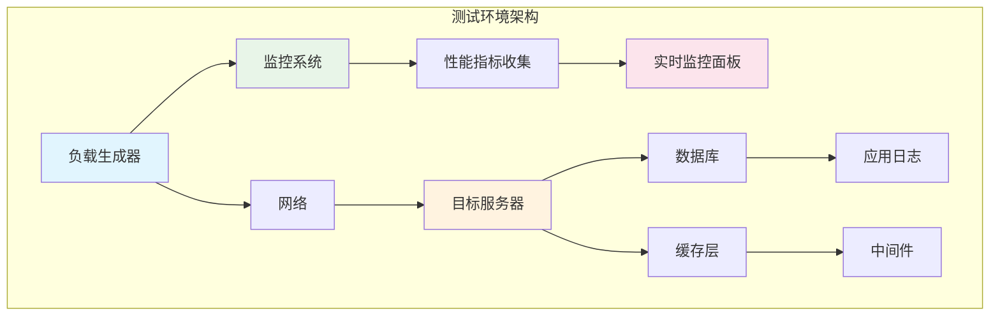

#### 系统调优建议

```bash
# 增加文件描述符限制
ulimit -n 100000

# 优化 TCP 参数
echo 'net.core.rmem_max = 16777216' >> /etc/sysctl.conf
echo 'net.core.wmem_max = 16777216' >> /etc/sysctl.conf
echo 'net.ipv4.tcp_rmem = 4096 87380 16777216' >> /etc/sysctl.conf
echo 'net.ipv4.tcp_wmem = 4096 65536 16777216' >> /etc/sysctl.conf

# 应用配置
sysctl -p
```

### 2. 测试策略规划

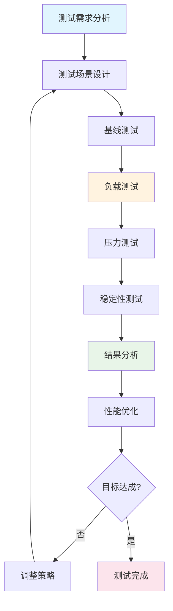

#### 测试阶段详解

**1. 基线测试**
```bash
# 单用户基线测试
wrk -t1 -c1 -d60s --latency http://your-app.com/

# 获取基础性能指标
wrk -t2 -c10 -d120s --latency http://your-app.com/
```

**2. 负载测试**
```bash
# 正常负载测试
wrk -t12 -c100 -d300s --latency http://your-app.com/

# 峰值负载测试
wrk -t12 -c500 -d300s --latency http://your-app.com/
```

**3. 压力测试**
```bash
# 超载测试
wrk -t12 -c1000 -d300s --latency http://your-app.com/

# 极限压力测试
wrk -t12 -c2000 -d300s --latency http://your-app.com/
```

### 3. 结果分析与解读

#### 关键指标解读

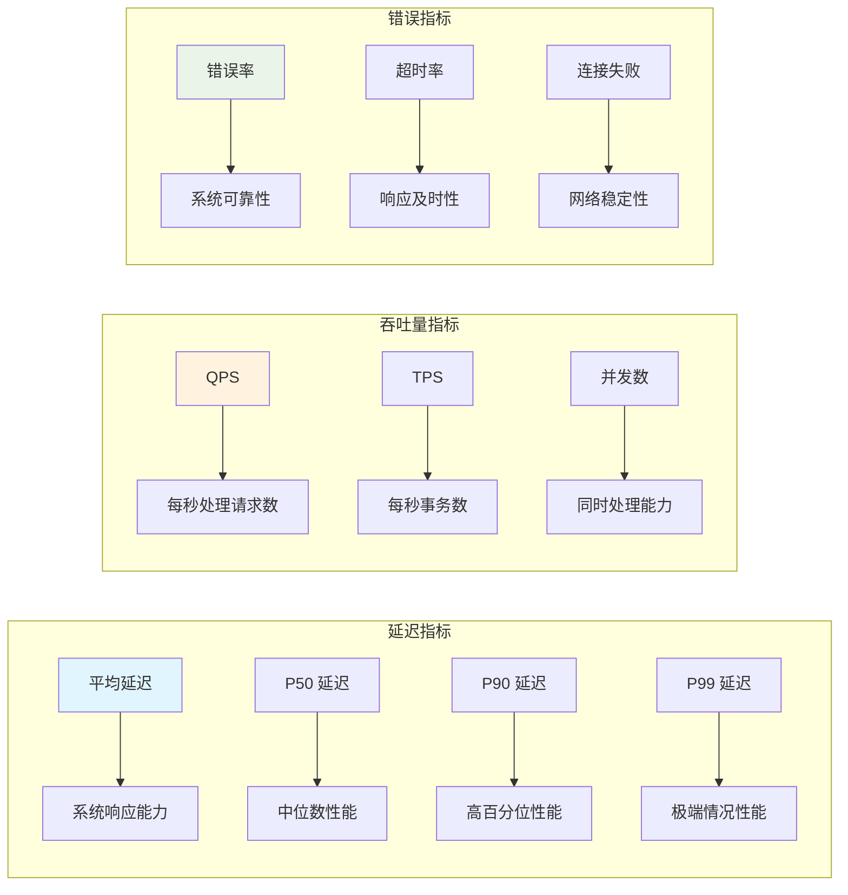

#### 性能基准对比

```bash
# 生成性能报告脚本
#!/bin/bash

echo "=== 性能基准测试报告 ==="
echo "测试时间: $(date)"
echo "目标URL: $1"
echo

echo "1. 基线测试 (1 线程, 1 连接)"
wrk -t1 -c1 -d60s --latency $1
echo

echo "2. 轻负载测试 (4 线程, 50 连接)"
wrk -t4 -c50 -d60s --latency $1
echo

echo "3. 中负载测试 (8 线程, 200 连接)"
wrk -t8 -c200 -d60s --latency $1
echo

echo "4. 高负载测试 (12 线程, 400 连接)"
wrk -t12 -c400 -d60s --latency $1
echo

echo "=== 测试完成 ==="
```

## 实战案例分析

### 1. Web API 性能测试

#### 测试场景设计

```mermaid
graph TB
    subgraph "API 测试场景"
        A[用户认证 API] --> B[获取用户信息]
        B --> C[查询商品列表]
        C --> D[商品详情查询]
        D --> E[添加购物车]
        E --> F[提交订单]
    end
    
    subgraph "测试覆盖"
        G[GET 请求] --> H[POST 请求]
        H --> I[PUT 请求]
        I --> J[DELETE 请求]
    end
    
    subgraph "性能要求"
        K[QPS > 1000] --> L[P99 < 100ms]
        L --> M[错误率 < 0.1%]
    end
    
    style A fill:#e1f5fe
    style G fill:#fff3e0
    style K fill:#e8f5e8
```

#### 完整测试脚本

```lua
-- api-performance-test.lua
local json = require("json")

-- API 端点配置
local endpoints = {
    {method = "GET", path = "/api/users/profile", weight = 30},
    {method = "GET", path = "/api/products", weight = 40},
    {method = "POST", path = "/api/cart/add", weight = 20, body = '{"productId": 123, "quantity": 1}'},
    {method = "GET", path = "/api/orders", weight = 10}
}

-- 统计变量
local stats = {
    requests = 0,
    errors = 0,
    by_endpoint = {}
}

-- 加权随机选择
function weighted_random(items)
    local total_weight = 0
    for _, item in ipairs(items) do
        total_weight = total_weight + item.weight
    end
    
    local random_num = math.random() * total_weight
    local current_weight = 0
    
    for _, item in ipairs(items) do
        current_weight = current_weight + item.weight
        if random_num <= current_weight then
            return item
        end
    end
    
    return items[1]  -- 默认返回第一个
end

function init(args)
    print("开始 API 性能测试")
    math.randomseed(os.time())
    
    -- 初始化统计
    for _, endpoint in ipairs(endpoints) do
        stats.by_endpoint[endpoint.path] = {requests = 0, errors = 0}
    end
end

function request()
    local endpoint = weighted_random(endpoints)
    stats.requests = stats.requests + 1
    stats.by_endpoint[endpoint.path].requests = stats.by_endpoint[endpoint.path].requests + 1
    
    -- 设置认证头
    wrk.headers["Authorization"] = "Bearer YOUR_TOKEN_HERE"
    
    if endpoint.method == "POST" then
        wrk.headers["Content-Type"] = "application/json"
        return wrk.format(endpoint.method, endpoint.path, nil, endpoint.body)
    else
        return wrk.format(endpoint.method, endpoint.path)
    end
end

function response(status, headers, body)
    if status >= 400 then
        stats.errors = stats.errors + 1
        print("API 错误: " .. status .. " " .. body)
    end
end

function done(summary, latency, requests)
    print("\n=== API 性能测试报告 ===")
    print("总请求数: " .. stats.requests)
    print("总错误数: " .. stats.errors)
    print("错误率: " .. string.format("%.2f%%", (stats.errors / stats.requests) * 100))
    print("\n各端点统计:")
    for path, stat in pairs(stats.by_endpoint) do
        print(string.format("  %s: %d 请求", path, stat.requests))
    end
    
    print("\n延迟统计:")
    print(string.format("  平均延迟: %.2f ms", summary.latency_mean / 1000))
    print(string.format("  最大延迟: %.2f ms", summary.latency_max / 1000))
    print(string.format("  P99 延迟: %.2f ms", latency:percentile(99) / 1000))
end
```

### 2. 电商网站压力测试

#### 业务流程模拟

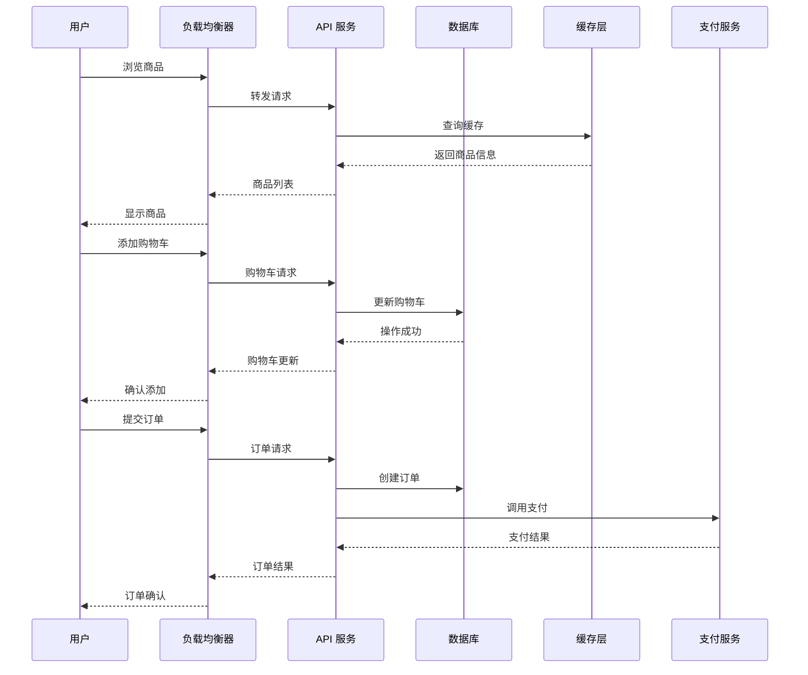

#### 电商测试脚本

```lua
-- ecommerce-test.lua
local json = require("json")

-- 模拟商品 ID
local product_ids = {1001, 1002, 1003, 1004, 1005}
local user_tokens = {}

-- 生成测试用户 token
function generate_user_token()
    return "user_" .. math.random(1000, 9999) .. "_token"
end

-- 购物流程状态
local shopping_flow = {
    "browse_products",
    "view_product_detail", 
    "add_to_cart",
    "view_cart",
    "checkout"
}

local current_step = 1

function init(args)
    print("开始电商网站压力测试")
    math.randomseed(os.time())
    
    -- 生成测试用户
    for i = 1, 100 do
        table.insert(user_tokens, generate_user_token())
    end
end

function request()
    local step = shopping_flow[current_step]
    local user_token = user_tokens[math.random(1, #user_tokens)]
    local product_id = product_ids[math.random(1, #product_ids)]
    
    -- 设置认证头
    wrk.headers["Authorization"] = "Bearer " .. user_token
    
    if step == "browse_products" then
        current_step = 2
        return wrk.format("GET", "/api/products?page=1&limit=20")
        
    elseif step == "view_product_detail" then
        current_step = 3
        return wrk.format("GET", "/api/products/" .. product_id)
        
    elseif step == "add_to_cart" then
        current_step = 4
        wrk.headers["Content-Type"] = "application/json"
        local body = json.encode({
            productId = product_id,
            quantity = math.random(1, 3)
        })
        return wrk.format("POST", "/api/cart/add", nil, body)
        
    elseif step == "view_cart" then
        current_step = 5
        return wrk.format("GET", "/api/cart")
        
    elseif step == "checkout" then
        current_step = 1  -- 重置流程
        wrk.headers["Content-Type"] = "application/json"
        local body = json.encode({
            paymentMethod = "credit_card",
            shippingAddress = {
                street = "123 Test St",
                city = "Test City",
                zipCode = "12345"
            }
        })
        return wrk.format("POST", "/api/orders", nil, body)
    end
end

function response(status, headers, body)
    if status >= 400 then
        print("电商操作失败: " .. status .. " " .. body)
    end
end
```

### 3. 微服务架构测试

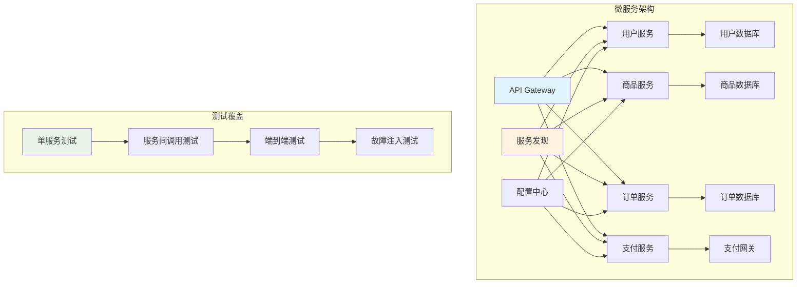

## 与其他测试工具对比

### 性能测试工具对比

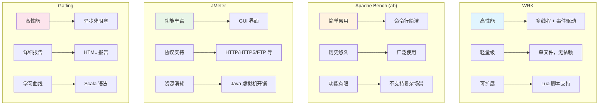

### 工具选择建议

| 场景 | 推荐工具 | 理由 |
|------|----------|------|
| 快速压力测试 | **WRK** | 高性能，使用简单 |
| 复杂业务场景 | **JMeter** | 功能丰富，支持 GUI |
| 持续集成测试 | **WRK + Lua** | 轻量级，易于自动化 |
| 详细性能分析 | **Gatling** | 报告详细，可视化好 |
| 简单基准测试 | **Apache Bench** | 历史悠久，使用广泛 |

## 故障排除与调优

### 常见问题与解决方案

#### 1. 连接数限制问题

```bash
# 问题：too many open files
# 解决方案：增加文件描述符限制

# 临时解决
ulimit -n 65536

# 永久解决
echo '* soft nofile 65536' >> /etc/security/limits.conf
echo '* hard nofile 65536' >> /etc/security/limits.conf
```

#### 2. 网络配置优化

```bash
# TCP 调优
echo 'net.ipv4.tcp_tw_reuse = 1' >> /etc/sysctl.conf
echo 'net.ipv4.tcp_tw_recycle = 1' >> /etc/sysctl.conf
echo 'net.ipv4.tcp_fin_timeout = 30' >> /etc/sysctl.conf
echo 'net.ipv4.tcp_keepalive_time = 1200' >> /etc/sysctl.conf
echo 'net.ipv4.ip_local_port_range = 10000 65000' >> /etc/sysctl.conf

# 应用设置
sysctl -p
```

#### 3. 性能监控脚本

```bash
#!/bin/bash
# performance-monitor.sh

echo "=== 系统性能监控 ==="
echo "时间: $(date)"
echo

echo "CPU 使用率:"
top -bn1 | grep "Cpu(s)" | sed "s/.*, *\([0-9.]*\)%* id.*/\1/" | awk '{print 100 - $1"%"}'

echo "内存使用:"
free -h

echo "网络连接:"
netstat -an | grep ESTABLISHED | wc -l

echo "文件描述符:"
lsof | wc -l

echo "TCP 连接状态:"
netstat -an | awk '/tcp/ {print $6}' | sort | uniq -c | sort -nr
```

### 测试结果分析

#### 异常情况识别

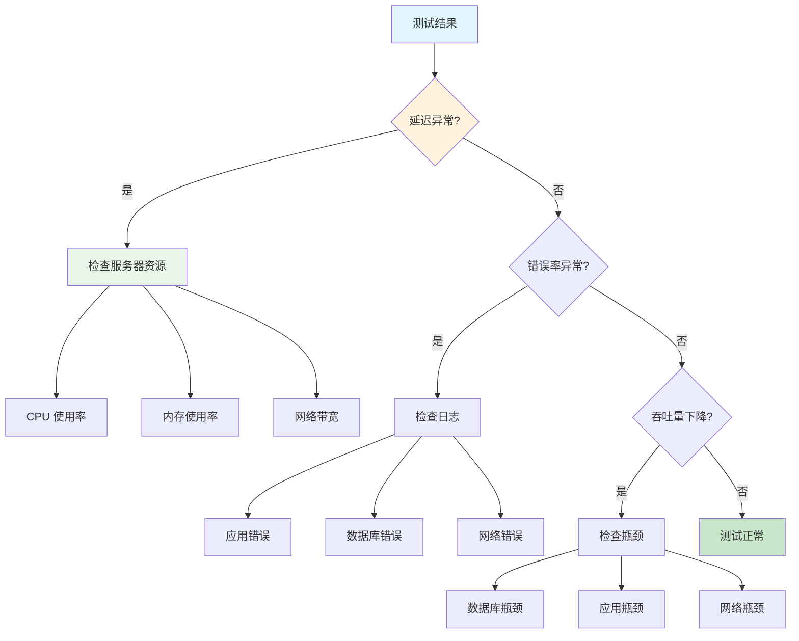

## 最佳实践总结

### 1. 测试设计原则

- **渐进式测试**：从小负载开始，逐步增加
- **多维度测试**：覆盖不同场景和用户行为
- **环境一致性**：测试环境与生产环境保持一致
- **数据隔离**：避免测试数据污染生产数据

### 2. 监控指标体系

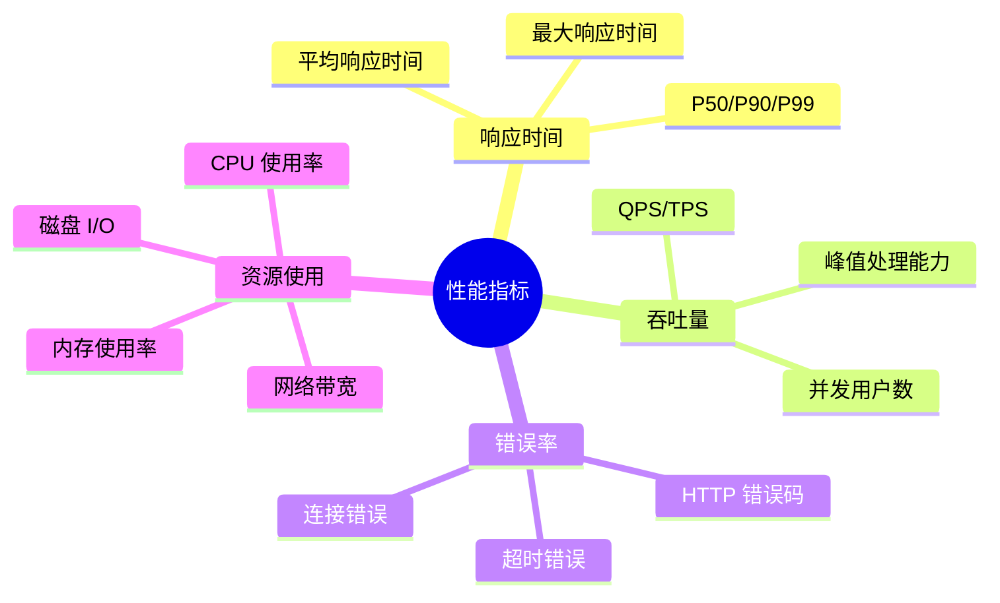

### 3. 持续改进流程

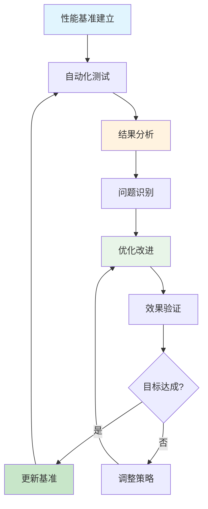

## 结语

WRK 作为现代 HTTP 基准测试工具，以其高性能、轻量级和可扩展性成为性能测试领域的重要工具。通过本文的详细介绍和实战案例，您可以：

### 核心收获

- 🎯 **深入理解** WRK 的架构原理和工作机制
- 🚀 **掌握使用** 从基础命令到高级 Lua 脚本的完整技能
- 📊 **学会分析** 性能测试结果和关键指标的含义
- 🔧 **获得实践** 真实业务场景的测试方案和最佳实践
- 📈 **建立体系** 持续性能优化和监控的工作流程

### 实践建议

1. **从简单开始**：先掌握基本命令，再逐步学习高级功能
2. **结合监控**：测试时同时监控系统资源和应用指标
3. **持续优化**：建立性能基准，持续跟踪和改进
4. **场景驱动**：根据实际业务场景设计测试用例
5. **自动化集成**：将性能测试集成到 CI/CD 流程中

### 未来展望

随着云原生和微服务架构的普及，性能测试工具也在不断演进。WRK 的简洁性和高性能特性使其在现代测试场景中仍有重要地位。结合容器化部署、服务网格和可观测性工具，WRK 可以为现代应用架构提供更完善的性能测试解决方案。

通过掌握 WRK 这一强大的性能测试工具，您将能够更好地保障应用系统的性能和稳定性，为用户提供优质的服务体验。

## 参考资源

- [WRK GitHub 仓库](https://github.com/wg/wrk)
- [WRK 官方文档](https://github.com/wg/wrk/blob/master/README.md)
- [Lua 脚本编程指南](https://www.lua.org/manual/5.1/)
- [HTTP 性能测试最佳实践](https://developer.mozilla.org/en-US/docs/Web/HTTP)
- [系统性能调优指南](https://www.kernel.org/doc/Documentation/sysctl/net.txt)

---

*基于 [WRK](https://github.com/wg/wrk) 项目创作，感谢开源社区的贡献！* 