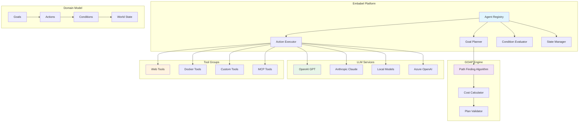
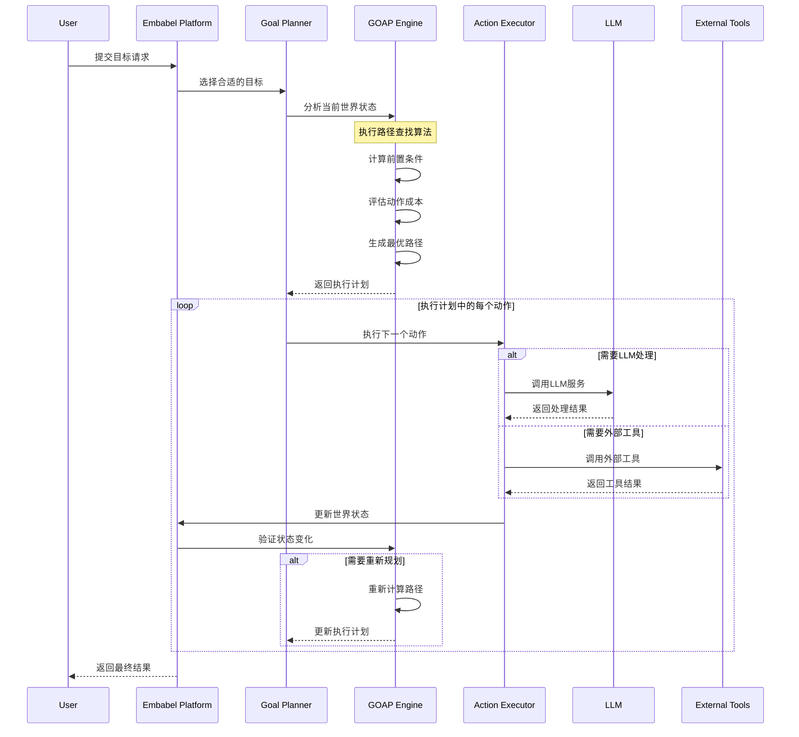
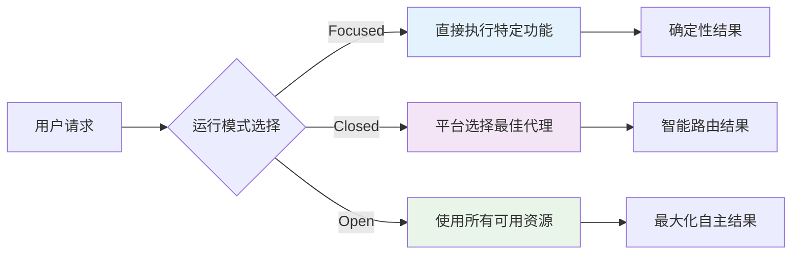
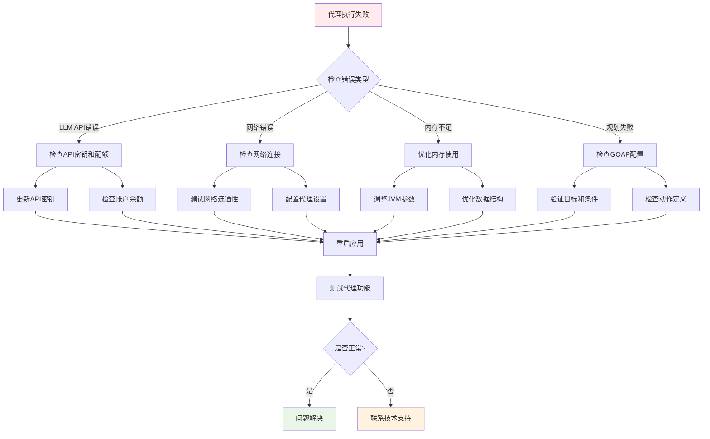

# Embabel Agent 智能代理框架完整指南

## 概述

Embabel（发音：Em-BAY-bel /ɛmˈbeɪbəl/）是由Spring框架创始人Rod Johnson开发的企业级智能代理框架，专为JVM平台设计。该框架结合了目标导向行动规划（GOAP）算法和现代Spring生态系统，为构建可扩展的AI代理应用程序提供了完整的解决方案。

### 核心特性

- **智能规划系统**：基于GOAP（Goal-Oriented Action Planning）算法的自主规划引擎
- **Spring生态集成**：深度集成Spring Boot、Spring Security和Spring Data
- **多语言支持**：原生支持Java和Kotlin，提供类型安全的DSL
- **模型混用架构**：支持多LLM协作，实现成本和性能优化
- **MCP协议支持**：完整的Model Context Protocol实现
- **可解释AI**：提供透明的决策过程和执行路径

### 为什么选择Embabel？

传统的LLM应用虽然强大但缺乏透明性，无法解释其决策过程。而简单的状态机方法虽然可预测但缺乏灵活性。Embabel采用了一种创新的中间路径：

> **使用AI进行规划，但确保规划过程是可解释和可验证的**

通过GOAP算法，Embabel能够：
- 找到从未被明确编程的执行路径
- 提供完整的决策解释
- 在执行过程中动态重新规划
- 保持确定性的执行结果

## 架构设计

### 系统架构概览



### GOAP规划流程详解



### 核心组件解析

#### 1. Goal Planner（目标规划器）
负责选择和管理目标，支持三种选择策略：
- **LLM驱动选择**：基于用户输入的相关性选择目标
- **规则驱动选择**：基于预定义规则选择目标
- **混合选择**：结合LLM和规则的智能选择

#### 2. GOAP Engine（GOAP引擎）
实现目标导向行动规划算法：
- **状态表示**：使用条件集合表示世界状态
- **路径查找**：A*算法寻找最优动作序列
- **成本计算**：考虑时间、资源和复杂度的综合成本
- **动态重规划**：根据执行结果调整计划

#### 3. Action Executor（动作执行器）
负责执行具体的动作：
- **LLM调用**：管理与多个LLM提供商的交互
- **工具集成**：通过MCP协议集成外部工具
- **结果验证**：验证动作执行结果是否符合预期

### 运行模式

Embabel支持三种不同的运行模式：



1. **Focused模式**：适合明确的业务需求，执行预定义的功能
2. **Closed模式**：平台智能选择最合适的代理处理请求
3. **Open模式**：充分利用所有可用资源，实现最大程度的自主性

## 环境要求与安装

### 系统要求

- **Java 21+**（推荐使用OpenJDK或Oracle JDK）
- **Maven 3.9+** 或 **Gradle 8.0+**
- **内存**：最少4GB RAM，推荐8GB+
- **API密钥**：OpenAI、Anthropic或Azure OpenAI（至少一个）
- **Docker Desktop**（可选，用于MCP工具和容器化部署）

### 快速安装

#### 1. 使用项目创建工具

```bash
# 安装项目创建工具
uvx --from git+https://github.com/embabel/project-creator.git project-creator

# 创建新项目
project-creator create my-agent-app --template java
```

#### 2. 使用GitHub模板

选择适合的模板：
- [Java Agent Template](https://github.com/embabel/java-agent-template)
- [Kotlin Agent Template](https://github.com/embabel/kotlin-agent-template)

#### 3. 手动配置依赖

**Maven配置（pom.xml）**：
```xml
<properties>
    <embabel.version>1.2.0</embabel.version>
    <spring.boot.version>3.2.0</spring.boot.version>
</properties>

<dependencies>
    <!-- Embabel核心依赖 -->
    <dependency>
        <groupId>com.embabel.agent</groupId>
        <artifactId>embabel-agent-starter</artifactId>
        <version>${embabel.version}</version>
    </dependency>
    
    <!-- Web支持 -->
    <dependency>
        <groupId>com.embabel.agent</groupId>
        <artifactId>embabel-agent-web</artifactId>
        <version>${embabel.version}</version>
    </dependency>
    
    <!-- MCP协议支持 -->
    <dependency>
        <groupId>com.embabel.agent</groupId>
        <artifactId>embabel-agent-mcp</artifactId>
        <version>${embabel.version}</version>
    </dependency>
    
    <!-- 工具集成 -->
    <dependency>
        <groupId>com.embabel.agent</groupId>
        <artifactId>embabel-agent-tools</artifactId>
        <version>${embabel.version}</version>
    </dependency>
</dependencies>
```

**Gradle配置（build.gradle.kts）**：
```kotlin
dependencies {
    implementation("com.embabel.agent:embabel-agent-starter:1.2.0")
    implementation("com.embabel.agent:embabel-agent-web:1.2.0")
    implementation("com.embabel.agent:embabel-agent-mcp:1.2.0")
    implementation("com.embabel.agent:embabel-agent-tools:1.2.0")
    
    // Spring Boot
    implementation("org.springframework.boot:spring-boot-starter-web")
    implementation("org.springframework.boot:spring-boot-starter-security")
    implementation("org.springframework.boot:spring-boot-starter-data-jpa")
    
    // 测试依赖
    testImplementation("com.embabel.agent:embabel-agent-test:1.2.0")
    testImplementation("org.springframework.boot:spring-boot-starter-test")
}
```

### 环境配置

创建 `application.yml` 配置文件：

```yaml
embabel:
  agent:
    enabled: true
    logging-theme: STAR_WARS
    mcp-servers:
      - DOCKER_DESKTOP
      - FILESYSTEM
      - WEB_BROWSER
    
    # LLM配置
    llm:
      default-provider: openai
      providers:
        openai:
          api-key: ${OPENAI_API_KEY}
          model: gpt-4-turbo
          temperature: 0.1
          max-tokens: 4000
        anthropic:
          api-key: ${ANTHROPIC_API_KEY}
          model: claude-3-5-sonnet-20241022
          temperature: 0.1
          max-tokens: 4000
        azure:
          endpoint: ${AZURE_OPENAI_ENDPOINT}
          api-key: ${AZURE_OPENAI_API_KEY}
          model: gpt-4-turbo
          api-version: "2024-02-15-preview"
    
    # GOAP配置
    goap:
      max-planning-depth: 10
      planning-timeout: 30s
      enable-replanning: true
      cost-threshold: 100.0
    
    # 安全配置
    security:
      enable-input-sanitization: true
      enable-output-filtering: true
      max-prompt-length: 10000
      blocked-patterns:
        - "(?i).*ignore.+previous.+instructions.*"
        - "(?i).*system.+prompt.*"
        - "(?i).*jailbreak.*"

spring:
  profiles:
    active: development
  
  # 数据库配置
  datasource:
    url: jdbc:h2:mem:embabel;DB_CLOSE_DELAY=-1;DB_CLOSE_ON_EXIT=FALSE
    driver-class-name: org.h2.Driver
    username: sa
    password: 
  
  jpa:
    hibernate:
      ddl-auto: create-drop
    show-sql: false
    properties:
      hibernate:
        dialect: org.hibernate.dialect.H2Dialect
  
  # 缓存配置
  cache:
    type: caffeine
    caffeine:
      spec: maximumSize=1000,expireAfterWrite=1h

# 监控配置
management:
  endpoints:
    web:
      exposure:
        include: health,info,metrics,prometheus
  endpoint:
    health:
      show-details: always
  metrics:
    export:
      prometheus:
        enabled: true

# 日志配置
logging:
  level:
    com.embabel.agent: DEBUG
    org.springframework.web: INFO
    org.springframework.security: WARN
  pattern:
    console: "%d{yyyy-MM-dd HH:mm:ss} [%thread] %-5level [%X{agentId}] %logger{36} - %msg%n"
```

设置环境变量：
```bash
# 创建 .env 文件
cat > .env << EOF
# OpenAI配置
OPENAI_API_KEY=your_openai_api_key_here

# Anthropic配置
ANTHROPIC_API_KEY=your_anthropic_api_key_here

# Azure OpenAI配置
AZURE_OPENAI_ENDPOINT=https://your-resource.openai.azure.com/
AZURE_OPENAI_API_KEY=your_azure_api_key_here

# 其他配置
SPRING_PROFILES_ACTIVE=development
EOF

# 加载环境变量
source .env
```

## 应用程序配置模式

### Shell模式（开发调试）

适合开发和调试阶段，提供交互式命令行界面：

```kotlin
@SpringBootApplication
@EnableAgentShell
@EnableAgents(
    loggingTheme = LoggingThemes.STAR_WARS,
    mcpServers = [McpServers.DOCKER_DESKTOP, McpServers.FILESYSTEM]
)
class AgentShellApplication {
    
    @Bean
    fun shellCommands(): ShellCommands {
        return ShellCommands.builder()
            .addCommand("execute", "执行代理任务")
            .addCommand("list-agents", "列出所有可用代理")
            .addCommand("describe", "描述代理功能")
            .addCommand("history", "查看执行历史")
            .build()
    }
}

fun main(args: Array<String>) {
    runApplication<AgentShellApplication>(*args)
}
```

### Web应用模式（生产环境）

适合生产环境，提供RESTful API和Web界面：

```kotlin
@SpringBootApplication
@EnableWebMvc
@EnableAgents(
    loggingTheme = LoggingThemes.MINIMAL,
    mcpServers = [McpServers.DOCKER_DESKTOP, McpServers.FILESYSTEM, McpServers.WEB_BROWSER]
)
class AgentWebApplication {
    
    @Bean
    fun corsConfigurer(): WebMvcConfigurer {
        return object : WebMvcConfigurer {
            override fun addCorsMappings(registry: CorsRegistry) {
                registry.addMapping("/api/**")
                    .allowedOrigins("*")
                    .allowedMethods("GET", "POST", "PUT", "DELETE")
                    .allowedHeaders("*")
            }
        }
    }
    
    @Bean
    fun agentController(): AgentController {
        return AgentController()
    }
    
    @Bean
    fun webSocketConfig(): WebSocketConfig {
        return WebSocketConfig.builder()
            .enableSockJS(true)
            .setAllowedOrigins("*")
            .build()
    }
}

fun main(args: Array<String>) {
    runApplication<AgentWebApplication>(*args)
}
```

### MCP服务器模式（服务集成）

作为MCP服务器为其他应用提供代理服务：

```kotlin
@SpringBootApplication
@EnableAgentMcpServer
@EnableAgents(
    mcpServers = [McpServers.DOCKER_DESKTOP, McpServers.FILESYSTEM]
)
class AgentMcpServerApplication {
    
    @Bean
    fun mcpServerConfig(): McpServerConfig {
        return McpServerConfig.builder()
            .port(8080)
            .enableSecurity(true)
            .corsAllowedOrigins("*")
            .maxConnections(100)
            .connectionTimeout(Duration.ofMinutes(5))
            .build()
    }
    
    @Bean
    fun mcpSecurityConfig(): McpSecurityConfig {
        return McpSecurityConfig.builder()
            .enableApiKeyAuth(true)
            .enableJwtAuth(true)
            .requireHttps(false) // 开发环境设为false
            .build()
    }
}

fun main(args: Array<String>) {
    runApplication<AgentMcpServerApplication>(*args)
}
```

## 核心概念详解

### Goals（目标）

目标定义了代理要达到的最终状态。每个目标都有明确的前置条件：

```kotlin
// 基础目标接口
interface Goal {
    fun preconditions(): Set<Condition>
    fun description(): String
    fun priority(): Int = 1
}

// 研究目标示例
data class ResearchGoal(
    val topic: String,
    val depth: ResearchDepth = ResearchDepth.COMPREHENSIVE,
    val maxSources: Int = 10,
    val timeLimit: Duration = Duration.ofMinutes(30)
) : Goal {
    
    override fun preconditions(): Set<Condition> {
        return setOf(
            HasInternetAccess(),
            HasSearchCapability(),
            TopicIsValid(topic),
            TimeIsAvailable(timeLimit)
        )
    }
    
    override fun description(): String {
        return "对主题'$topic'进行${depth.description}研究，使用最多$maxSources个信息源"
    }
    
    override fun priority(): Int = when (depth) {
        ResearchDepth.BASIC -> 1
        ResearchDepth.COMPREHENSIVE -> 2
        ResearchDepth.EXPERT -> 3
    }
}

enum class ResearchDepth(val description: String) {
    BASIC("基础"),
    COMPREHENSIVE("全面"),
    EXPERT("专家级")
}

// 文档生成目标
data class DocumentGenerationGoal(
    val title: String,
    val type: DocumentType,
    val audience: String,
    val sections: List<String> = emptyList()
) : Goal {
    
    override fun preconditions(): Set<Condition> {
        return setOf(
            HasWritingCapability(),
            TopicIsValid(title),
            AudienceIsDefined(audience)
        )
    }
    
    override fun description(): String {
        return "为${audience}生成${type.description}文档：$title"
    }
}

enum class DocumentType(val description: String) {
    TECHNICAL_GUIDE("技术指南"),
    USER_MANUAL("用户手册"),
    API_DOCUMENTATION("API文档"),
    TUTORIAL("教程"),
    SPECIFICATION("规范文档")
}
```

### Actions（动作）

动作是代理可以执行的原子操作，每个动作都有明确的前置和后置条件：

```kotlin
// 动作基础接口
interface Action<I, O> {
    fun preconditions(): Set<Condition>
    fun expectedPostconditions(): Set<Condition>
    fun execute(input: I): O
    fun cost(): Double = 1.0
    fun timeout(): Duration = Duration.ofMinutes(5)
}

// Web搜索动作
@Component
class WebSearchAction : Action<SearchQuery, SearchResults> {
    
    @Autowired
    private lateinit var searchEngine: SearchEngine
    
    override fun preconditions(): Set<Condition> {
        return setOf(
            HasInternetAccess(),
            HasSearchCapability(),
            QueryIsValid()
        )
    }
    
    override fun expectedPostconditions(): Set<Condition> {
        return setOf(
            HasSearchResults(),
            SearchResultsAreRelevant()
        )
    }
    
    override fun execute(input: SearchQuery): SearchResults {
        logger.info("执行搜索查询: ${input.query}")
        
        val startTime = System.currentTimeMillis()
        val results = searchEngine.search(
            query = input.query,
            maxResults = input.maxResults,
            language = input.language,
            region = input.region
        )
        val executionTime = System.currentTimeMillis() - startTime
        
        logger.info("搜索完成，找到${results.items.size}个结果，耗时${executionTime}ms")
        
        return results
    }
    
    override fun cost(): Double = 2.0 // 网络操作成本较高
    
    override fun timeout(): Duration = Duration.ofSeconds(30)
}

// 内容分析动作
@Component
class ContentAnalysisAction : Action<WebContent, ContentAnalysis> {
    
    @Autowired
    private lateinit var promptRunner: PromptRunner
    
    override fun preconditions(): Set<Condition> {
        return setOf(
            HasWebContent(),
            HasLLMAccess()
        )
    }
    
    override fun expectedPostconditions(): Set<Condition> {
        return setOf(
            HasContentAnalysis(),
            AnalysisIsAccurate()
        )
    }
    
    override fun execute(input: WebContent): ContentAnalysis {
        val analysisPrompt = """
            分析以下网页内容，提取关键信息：
            
            URL: ${input.url}
            标题: ${input.title}
            内容: ${input.content}
            
            请提供：
            1. 内容摘要（100-200字）
            2. 关键主题和概念
            3. 重要数据和统计信息
            4. 作者的主要观点
            5. 内容的可信度评估（1-10分）
            
            以JSON格式返回结果。
        """.trimIndent()
        
        return promptRunner
            .withModel("gpt-4-turbo")
            .withTemperature(0.2)
            .createObject(analysisPrompt, ContentAnalysis::class.java)
    }
    
    override fun cost(): Double = 3.0 // LLM调用成本
}

// 报告生成动作
@Component
class ReportGenerationAction : Action<ReportRequest, GeneratedReport> {
    
    @Autowired
    private lateinit var promptRunner: PromptRunner
    
    override fun preconditions(): Set<Condition> {
        return setOf(
            HasAnalyzedContent(),
            HasReportTemplate(),
            HasLLMAccess()
        )
    }
    
    override fun expectedPostconditions(): Set<Condition> {
        return setOf(
            HasGeneratedReport(),
            ReportMeetsQualityStandards()
        )
    }
    
    override fun execute(input: ReportRequest): GeneratedReport {
        val reportPrompt = """
            基于以下分析内容生成${input.type.description}：
            
            主题: ${input.topic}
            目标受众: ${input.audience}
            内容分析: ${input.analysisResults.joinToString("\n")}
            
            报告要求:
            1. 结构清晰，逻辑严谨
            2. 语言专业但易懂
            3. 包含数据支撑和引用来源
            4. 长度控制在${input.wordLimit}字以内
            5. 使用Markdown格式
            
            请生成完整的报告内容。
        """.trimIndent()
        
        val reportContent = promptRunner
            .withModel("gpt-4-turbo")
            .withTemperature(0.3)
            .withMaxTokens(input.wordLimit * 2) // 估算token数量
            .createText(reportPrompt)
        
        return GeneratedReport(
            title = input.topic,
            content = reportContent,
            type = input.type,
            generatedAt = Instant.now(),
            wordCount = reportContent.split("\\s+".toRegex()).size,
            sources = input.analysisResults.mapNotNull { it.source }
        )
    }
    
    override fun cost(): Double = 5.0 // 复杂的LLM操作
    
    override fun timeout(): Duration = Duration.ofMinutes(3)
}
```

### Conditions（条件）

条件表示世界状态的某个方面，用于GOAP规划：

```kotlin
// 条件基础接口
interface Condition {
    fun evaluate(worldState: WorldState): Boolean
    fun description(): String
    fun weight(): Double = 1.0
}

// 网络连接条件
class HasInternetAccess : Condition {
    
    @Autowired
    private lateinit var networkService: NetworkService
    
    override fun evaluate(worldState: WorldState): Boolean {
        return try {
            networkService.isConnected() && networkService.canReachExternalSites()
        } catch (e: Exception) {
            logger.warn("网络连接检查失败", e)
            false
        }
    }
    
    override fun description(): String = "具有互联网访问能力"
}

// 搜索能力条件
class HasSearchCapability : Condition {
    
    @Autowired
    private lateinit var searchEngine: SearchEngine
    
    override fun evaluate(worldState: WorldState): Boolean {
        return searchEngine.isAvailable() && searchEngine.hasValidApiKey()
    }
    
    override fun description(): String = "具有搜索引擎访问能力"
}

// 主题有效性条件
class TopicIsValid(private val topic: String) : Condition {
    
    override fun evaluate(worldState: WorldState): Boolean {
        return topic.isNotBlank() && 
               topic.length >= 3 && 
               topic.length <= 200 &&
               !containsInvalidCharacters(topic)
    }
    
    override fun description(): String = "主题'$topic'是有效的"
    
    private fun containsInvalidCharacters(text: String): Boolean {
        val invalidPatterns = listOf(
            "<script", "javascript:", "eval(", "exec("
        )
        return invalidPatterns.any { text.lowercase().contains(it) }
    }
}

// 搜索结果条件
class HasSearchResults : Condition {
    
    override fun evaluate(worldState: WorldState): Boolean {
        return worldState.contains("searchResults") && 
               worldState.get<SearchResults>("searchResults").items.isNotEmpty()
    }
    
    override fun description(): String = "已获得搜索结果"
}

// 内容分析条件
class HasContentAnalysis : Condition {
    
    override fun evaluate(worldState: WorldState): Boolean {
        return worldState.contains("contentAnalysis") &&
               worldState.get<List<ContentAnalysis>>("contentAnalysis").isNotEmpty()
    }
    
    override fun description(): String = "已完成内容分析"
}

// 质量标准条件
class ReportMeetsQualityStandards : Condition {
    
    override fun evaluate(worldState: WorldState): Boolean {
        val report = worldState.get<GeneratedReport>("generatedReport") ?: return false
        
        return report.wordCount >= 500 && // 最少500字
               report.sources.isNotEmpty() && // 必须有引用来源
               report.content.contains("##") && // 必须有章节结构
               calculateReadabilityScore(report.content) >= 0.7 // 可读性评分
    }
    
    override fun description(): String = "报告符合质量标准"
    
    private fun calculateReadabilityScore(content: String): Double {
        // 简化的可读性评分算法
        val sentences = content.split("[.!?]+".toRegex()).size
        val words = content.split("\\s+".toRegex()).size
        val avgWordsPerSentence = words.toDouble() / sentences
        
        return when {
            avgWordsPerSentence <= 15 -> 1.0
            avgWordsPerSentence <= 20 -> 0.8
            avgWordsPerSentence <= 25 -> 0.6
            else -> 0.4
        }
    }
}
```

## 完整实战示例

### 示例1：智能新闻聚合器

这个示例展示如何构建一个能够根据用户兴趣聚合新闻的智能代理：

```java
@Agent(description = "Intelligent news aggregator based on user interests and preferences")
public class NewsAggregatorAgent {

    private final NewsService newsService;
    private final UserPreferenceService userPreferenceService;
    private final SentimentAnalyzer sentimentAnalyzer;
    private final TranslationService translationService;

    public NewsAggregatorAgent(NewsService newsService, 
                              UserPreferenceService userPreferenceService,
                              SentimentAnalyzer sentimentAnalyzer,
                              TranslationService translationService) {
        this.newsService = newsService;
        this.userPreferenceService = userPreferenceService;
        this.sentimentAnalyzer = sentimentAnalyzer;
        this.translationService = translationService;
    }

    @Action(description = "Extract and analyze user preferences from input")
    public UserProfile extractUserPreferences(UserInput userInput) {
        String analysisPrompt = String.format("""
            分析用户输入，提取其新闻偏好和兴趣：
            
            用户输入：%s
            
            请识别并提取：
            1. 感兴趣的主题类别（科技、财经、体育、娱乐等）
            2. 偏好的新闻类型（快讯、深度分析、观点评论等）
            3. 关注的地理区域（本地、国内、国际）
            4. 偏好的新闻源（如果提及）
            5. 语言偏好
            6. 更新频率偏好（实时、每日、每周等）
            
            以JSON格式返回结构化的用户画像。
            """, userInput.getText());

        UserProfile profile = new PromptRunner()
            .withModel("gpt-4-turbo")
            .withTemperature(0.1)
            .createObject(analysisPrompt, UserProfile.class);

        // 保存用户偏好以便后续使用
        if (userInput.getUserId() != null) {
            userPreferenceService.saveUserProfile(userInput.getUserId(), profile);
        }

        return profile;
    }

    @Action(description = "Gather news from multiple sources based on user preferences", 
            toolGroups = {CoreToolGroups.WEB})
    public NewsCollection gatherNews(UserProfile userProfile) {
        String searchPrompt = String.format("""
            根据用户偏好收集最新、最相关的新闻：
            
            用户偏好：
            - 主题：%s
            - 地区：%s
            - 新闻类型：%s
            - 偏好来源：%s
            - 语言：%s
            
            任务要求：
            1. 使用网络工具搜索最新新闻（过去24小时内）
            2. 每个主题至少找到3-5篇高质量文章
            3. 优先选择权威新闻源
            4. 确保新闻的多样性和平衡性
            5. 每篇文章需包含：标题、摘要、来源、发布时间、URL、关键词
            
            请返回结构化的新闻集合。
            """, 
            String.join(", ", userProfile.getTopics()),
            userProfile.getRegion(),
            userProfile.getNewsType().getDescription(),
            String.join(", ", userProfile.getPreferredSources()),
            userProfile.getLanguage()
        );

        NewsCollection newsCollection = new PromptRunner()
            .withModel("gpt-4-turbo")
            .withToolGroups(CoreToolGroups.WEB)
            .withTimeout(Duration.ofMinutes(3))
            .createObject(searchPrompt, NewsCollection.class);

        // 过滤和验证新闻质量
        List<NewsItem> filteredNews = newsCollection.getItems().stream()
            .filter(this::isNewsItemValid)
            .filter(news -> isRelevantToUser(news, userProfile))
            .collect(Collectors.toList());

        return new NewsCollection(filteredNews);
    }

    @Action(description = "Analyze news content for sentiment, topics, and credibility")
    public NewsAnalysis analyzeNews(NewsCollection newsCollection, UserProfile userProfile) {
        List<NewsItem> analyzedNews = newsCollection.getItems().parallelStream()
            .map(news -> analyzeIndividualNews(news, userProfile))
            .collect(Collectors.toList());

        // 计算整体情感倾向
        SentimentScore overallSentiment = calculateOverallSentiment(analyzedNews);
        
        // 识别热门话题和趋势
        TrendAnalysis trends = identifyTrends(analyzedNews);
        
        // 评估新闻源的可信度
        Map<String, Double> sourceCredibility = assessSourceCredibility(analyzedNews);

        return new NewsAnalysis(
            analyzedNews, 
            overallSentiment, 
            trends,
            sourceCredibility
        );
    }

    @Action(description = "Generate personalized news recommendations")
    public NewsRecommendations generateRecommendations(NewsAnalysis analysis, UserProfile userProfile) {
        String recommendationPrompt = String.format("""
            基于新闻分析和用户偏好，生成个性化推荐：
            
            用户偏好：%s
            新闻分析：已分析%d篇文章
            整体情感：%s
            热门趋势：%s
            
            生成推荐要求：
            1. 推荐3-5篇最相关的必读文章
            2. 识别2-3个值得关注的新兴话题
            3. 推荐相关的深度阅读材料
            4. 提供个性化的阅读建议
            5. 考虑用户的时间限制和阅读习惯
            
            请提供详细的推荐理由。
            """, 
            userProfile.toString(),
            analysis.getAnalyzedNews().size(),
            analysis.getOverallSentiment().getDescription(),
            analysis.getTrends().getEmergingTopics().toString()
        );

        return new PromptRunner()
            .withModel("claude-3-5-sonnet")
            .withTemperature(0.4)
            .createObject(recommendationPrompt, NewsRecommendations.class);
    }

    @AchievesGoal(description = "Create comprehensive personalized news digest")
    @Action(description = "Generate final news digest with all components")
    public NewsDigest createDigest(UserProfile userProfile, 
                                  NewsAnalysis analysis, 
                                  NewsRecommendations recommendations) {
        String digestPrompt = String.format("""
            创建个性化新闻摘要，整合所有分析结果：
            
            用户信息：
            - 姓名/ID：%s
            - 兴趣主题：%s
            - 偏好类型：%s
            
            新闻数据：
            - 分析文章数：%d
            - 整体情感：%s
            - 推荐文章：%d篇
            
            生成内容要求：
            1. 执行摘要（今日新闻要点，3-5句话）
            2. 热点新闻（按重要性排序的top 5新闻）
            3. 分类新闻（按用户兴趣主题分类）
            4. 趋势分析（识别的重要趋势和其影响）
            5. 个性化推荐（基于用户偏好的精选内容）
            6. 深度阅读（推荐的深度分析文章）
            7. 明日预告（值得关注的即将发生的事件）
            
            格式要求：
            - 使用清晰的Markdown格式
            - 包含完整的链接和引用
            - 添加适当的emoji增强可读性
            - 控制总长度在2000-3000字
            
            风格要求：
            - 专业但不失亲和力
            - 信息密度高但易于阅读
            - 突出个性化元素
            """, 
            userProfile.getUserId() != null ? userProfile.getUserId() : "匿名用户",
            String.join(", ", userProfile.getTopics()),
            userProfile.getNewsType().getDescription(),
            analysis.getAnalyzedNews().size(),
            analysis.getOverallSentiment().getDescription(),
            recommendations.getMustReadArticles().size()
        );

        String digestContent = new PromptRunner()
            .withModel("gpt-4-turbo")
            .withTemperature(0.3)
            .withMaxTokens(4000)
            .createText(digestPrompt);

        return new NewsDigest(
            userProfile.getUserId(),
            digestContent,
            analysis.getAnalyzedNews().subList(0, Math.min(5, analysis.getAnalyzedNews().size())),
            categorizeNewsByTopic(analysis.getAnalyzedNews(), userProfile.getTopics()),
            analysis.getTrends(),
            recommendations.getMustReadArticles(),
            Instant.now()
        );
    }

    // 辅助方法
    private NewsItem analyzeIndividualNews(NewsItem news, UserProfile userProfile) {
        // 情感分析
        SentimentScore sentiment = sentimentAnalyzer.analyze(news.getContent());
        
        // 关键词提取
        List<String> keywords = extractKeywords(news.getContent());
        
        // 可信度评估
        Double credibilityScore = assessCredibility(news);
        
        // 相关性评分
        Double relevanceScore = calculateRelevance(news, userProfile);
        
        // 翻译（如果需要）
        String translatedContent = news.getContent();
        if (!userProfile.getLanguage().equals(detectLanguage(news.getContent()))) {
            translatedContent = translationService.translate(
                news.getContent(), 
                userProfile.getLanguage()
            );
        }

        return news.withAnalysis(
            sentiment, 
            keywords, 
            credibilityScore, 
            relevanceScore,
            translatedContent
        );
    }

    private boolean isNewsItemValid(NewsItem news) {
        return news.getTitle() != null && !news.getTitle().trim().isEmpty() &&
               news.getUrl() != null && isValidUrl(news.getUrl()) &&
               news.getPublishTime() != null && 
               news.getPublishTime().isAfter(LocalDateTime.now().minusDays(7)); // 一周内的新闻
    }

    private boolean isRelevantToUser(NewsItem news, UserProfile userProfile) {
        String content = (news.getTitle() + " " + news.getSummary()).toLowerCase();
        return userProfile.getTopics().stream()
            .anyMatch(topic -> content.contains(topic.toLowerCase()));
    }

    private SentimentScore calculateOverallSentiment(List<NewsItem> news) {
        double averageSentiment = news.stream()
            .mapToDouble(item -> item.getSentiment().getScore())
            .average()
            .orElse(0.0);
        
        return new SentimentScore(averageSentiment);
    }

    private TrendAnalysis identifyTrends(List<NewsItem> news) {
        // 分析关键词频率
        Map<String, Long> keywordFrequency = news.stream()
            .flatMap(item -> item.getKeywords().stream())
            .collect(Collectors.groupingBy(
                Function.identity(),
                Collectors.counting()
            ));

        List<String> emergingTopics = keywordFrequency.entrySet().stream()
            .filter(entry -> entry.getValue() >= 3) // 至少出现3次
            .sorted(Map.Entry.<String, Long>comparingByValue().reversed())
            .limit(5)
            .map(Map.Entry::getKey)
            .collect(Collectors.toList());

        return new TrendAnalysis(emergingTopics, keywordFrequency);
    }

    private Map<String, Double> assessSourceCredibility(List<NewsItem> news) {
        return news.stream()
            .collect(Collectors.groupingBy(
                NewsItem::getSource,
                Collectors.averagingDouble(NewsItem::getCredibilityScore)
            ));
    }

    private Map<String, List<NewsItem>> categorizeNewsByTopic(List<NewsItem> news, List<String> topics) {
        Map<String, List<NewsItem>> categorized = new HashMap<>();
        
        for (String topic : topics) {
            List<NewsItem> topicNews = news.stream()
                .filter(item -> isNewsRelatedToTopic(item, topic))
                .sorted((a, b) -> Double.compare(b.getRelevanceScore(), a.getRelevanceScore()))
                .limit(10)
                .collect(Collectors.toList());
            
            if (!topicNews.isEmpty()) {
                categorized.put(topic, topicNews);
            }
        }
        
        return categorized;
    }

    private boolean isNewsRelatedToTopic(NewsItem news, String topic) {
        String content = (news.getTitle() + " " + news.getSummary() + " " + 
                         String.join(" ", news.getKeywords())).toLowerCase();
        return content.contains(topic.toLowerCase());
    }

    private List<String> extractKeywords(String content) {
        // 简化的关键词提取算法
        return Arrays.stream(content.split("\\s+"))
            .filter(word -> word.length() > 4)
            .filter(word -> !isStopWord(word))
            .distinct()
            .limit(10)
            .collect(Collectors.toList());
    }

    private boolean isStopWord(String word) {
        Set<String> stopWords = Set.of("的", "了", "在", "是", "有", "和", "就", "不", "人", "都", "一", "一个");
        return stopWords.contains(word.toLowerCase());
    }

    private Double assessCredibility(NewsItem news) {
        // 基于来源、发布时间、内容质量等因素评估可信度
        double score = 0.5; // 基础分
        
        // 知名新闻源加分
        if (isReputableSource(news.getSource())) {
            score += 0.3;
        }
        
        // 最近发布的新闻加分
        if (news.getPublishTime().isAfter(LocalDateTime.now().minusHours(24))) {
            score += 0.1;
        }
        
        // 内容长度合理加分
        if (news.getContent().length() > 200 && news.getContent().length() < 5000) {
            score += 0.1;
        }
        
        return Math.min(1.0, score);
    }

    private boolean isReputableSource(String source) {
        Set<String> reputableSources = Set.of(
            "新华社", "人民日报", "央视新闻", "澎湃新闻", "财新网", 
            "BBC", "CNN", "Reuters", "AP News", "The Guardian"
        );
        return reputableSources.contains(source);
    }

    private Double calculateRelevance(NewsItem news, UserProfile userProfile) {
        double relevance = 0.0;
        String content = (news.getTitle() + " " + news.getSummary()).toLowerCase();
        
        for (String topic : userProfile.getTopics()) {
            if (content.contains(topic.toLowerCase())) {
                relevance += 0.2;
            }
        }
        
        return Math.min(1.0, relevance);
    }

    private String detectLanguage(String content) {
        // 简化的语言检测
        if (content.matches(".*[\\u4e00-\\u9fa5].*")) {
            return "zh-CN";
        } else {
            return "en-US";
        }
    }

    private boolean isValidUrl(String url) {
        try {
            new URL(url);
            return true;
        } catch (MalformedURLException e) {
            return false;
        }
    }
}
```

## MCP协议深度集成

Model Context Protocol（MCP）是Embabel的重要特性，支持与外部工具和服务的标准化集成：

### MCP服务器配置

```kotlin
@Configuration
@EnableMcpServer
class McpServerConfiguration {

    @Bean
    fun mcpServerRegistry(): McpServerRegistry {
        return McpServerRegistry.builder()
            .registerServer("docker", dockerMcpServer())
            .registerServer("filesystem", filesystemMcpServer())
            .registerServer("database", databaseMcpServer())
            .registerServer("web-scraper", webScrapingMcpServer())
            .build()
    }

    @Bean
    fun dockerMcpServer(): McpServer {
        return DockerMcpServer.builder()
            .enableContainerManagement(true)
            .enableImageOperations(true)
            .enableNetworkOperations(false) // 安全考虑
            .allowedRegistries(listOf("docker.io", "ghcr.io"))
            .resourceLimits(ResourceLimits.builder()
                .maxMemory("2GB")
                .maxCpu("1.0")
                .build())
            .build()
    }

    @Bean
    fun webScrapingMcpServer(): McpServer {
        return WebScrapingMcpServer.builder()
            .enableJavaScript(true)
            .userAgent("Embabel-Agent/1.0")
            .timeout(Duration.ofSeconds(30))
            .maxPageSize(10 * 1024 * 1024) // 10MB
            .respectRobotsTxt(true)
            .rateLimit(RateLimit.perSecond(2))
            .build()
    }
}
```

### 自定义MCP工具

```kotlin
@McpTool(
    name = "advanced_web_scraper",
    description = "AI-powered web scraping with intelligent content extraction"
)
class AdvancedWebScrapingTool {

    @McpFunction
    fun scrapeWebsiteWithAI(
        @McpParameter("url") url: String,
        @McpParameter("extractionGoal") goal: String
    ): IntelligentScrapingResult {
        
        val webDriver = createWebDriver()
        try {
            webDriver.get(url)
            waitForPageLoad(webDriver)
            
            val pageContent = webDriver.pageSource
            val extractedData = extractContentWithAI(pageContent, goal)
            
            return IntelligentScrapingResult(
                url = url,
                extractedData = extractedData,
                confidence = extractedData.confidence,
                metadata = ScrapingMetadata(
                    timestamp = Instant.now(),
                    pageTitle = webDriver.title,
                    contentLength = pageContent.length,
                    loadTime = measurePageLoadTime(webDriver)
                )
            )
        } finally {
            webDriver.quit()
        }
    }

    private fun extractContentWithAI(html: String, goal: String): ExtractedContent {
        val extractionPrompt = """
            从以下HTML内容中智能提取信息以满足目标：
            
            提取目标：$goal
            HTML内容：${html.take(8000)}...
            
            请根据目标智能识别和提取相关信息：
            1. 分析HTML结构和内容
            2. 识别与目标相关的数据
            3. 提取结构化信息
            4. 评估提取结果的置信度
            5. 提供数据质量评估
            
            返回JSON格式的结构化数据。
        """.trimIndent()

        return promptRunner()
            .withModel("gpt-4-turbo")
            .withTemperature(0.1)
            .createObject(extractionPrompt, ExtractedContent::class.java)
    }
}
```

## 性能优化与监控

### 性能监控配置

```kotlin
@Configuration
@EnableAgentMetrics
class AgentMonitoringConfiguration {

    @Bean
    fun agentMetricsCollector(): AgentMetricsCollector {
        return AgentMetricsCollector.builder()
            .enableExecutionTime(true)
            .enableMemoryUsage(true)
            .enableLLMUsage(true)
            .enableErrorTracking(true)
            .enableCostTracking(true)
            .exportInterval(Duration.ofSeconds(30))
            .build()
    }

    @Bean
    fun performanceOptimizer(): PerformanceOptimizer {
        return PerformanceOptimizer.builder()
            .enableCaching(true)
            .enableRequestBatching(true)
            .enableModelRouting(true)
            .cacheConfig(CacheConfig.builder()
                .maxSize(1000)
                .expireAfterWrite(Duration.ofHours(1))
                .recordStats(true)
                .build())
            .build()
    }
}
```

## 部署与运维

### Docker部署配置

```dockerfile
FROM openjdk:21-jdk-slim

LABEL maintainer="embabel-team@company.com"
LABEL description="Embabel Agent Application"

# 安装系统依赖
RUN apt-get update && apt-get install -y \
    curl wget gnupg ca-certificates \
    && rm -rf /var/lib/apt/lists/*

WORKDIR /app

# 复制应用文件
COPY target/embabel-agent-app.jar app.jar
COPY src/main/resources/application.yml application.yml

# JVM优化参数
ENV JAVA_OPTS="-Xmx2g -Xms1g -XX:+UseG1GC -XX:+UseContainerSupport"

# 健康检查
HEALTHCHECK --interval=30s --timeout=10s --start-period=60s --retries=3 \
    CMD curl -f http://localhost:8080/actuator/health || exit 1

EXPOSE 8080 8081

# 非root用户
RUN groupadd -r embabel && useradd -r -g embabel embabel
RUN chown -R embabel:embabel /app
USER embabel

ENTRYPOINT ["sh", "-c", "java $JAVA_OPTS -jar app.jar"]
```

### Kubernetes部署

```yaml
apiVersion: apps/v1
kind: Deployment
metadata:
  name: embabel-agent
  labels:
    app: embabel-agent
spec:
  replicas: 3
  selector:
    matchLabels:
      app: embabel-agent
  template:
    metadata:
      labels:
        app: embabel-agent
    spec:
      containers:
      - name: embabel-agent
        image: your-registry/embabel-agent:latest
        ports:
        - containerPort: 8080
        env:
        - name: SPRING_PROFILES_ACTIVE
          value: "production"
        - name: OPENAI_API_KEY
          valueFrom:
            secretKeyRef:
              name: llm-secrets
              key: openai-api-key
        resources:
          requests:
            memory: "1Gi"
            cpu: "500m"
          limits:
            memory: "2Gi"
            cpu: "1000m"
        livenessProbe:
          httpGet:
            path: /actuator/health
            port: 8080
          initialDelaySeconds: 60
          periodSeconds: 30
        readinessProbe:
          httpGet:
            path: /actuator/health
            port: 8080
          initialDelaySeconds: 30
          periodSeconds: 10
```

## 故障排除

### 常见问题解决流程



## 最佳实践

### 安全配置

```kotlin
@Configuration
@EnableWebSecurity
class AgentSecurityConfiguration {

    @Bean
    fun securityFilterChain(http: HttpSecurity): SecurityFilterChain {
        return http
            .csrf { it.disable() }
            .sessionManagement { 
                it.sessionCreationPolicy(SessionCreationPolicy.STATELESS) 
            }
            .authorizeHttpRequests { auth ->
                auth
                    .requestMatchers("/actuator/health").permitAll()
                    .requestMatchers("/api/v1/agents/**").hasRole("AGENT_USER")
                    .requestMatchers("/api/v1/admin/**").hasRole("ADMIN")
                    .anyRequest().authenticated()
            }
            .oauth2ResourceServer { oauth2 ->
                oauth2.jwt { jwt ->
                    jwt.decoder(jwtDecoder())
                }
            }
            .build()
    }

    @Bean
    fun agentSecurityAuditor(): AgentSecurityAuditor {
        return AgentSecurityAuditor.builder()
            .enableInputSanitization(true)
            .enableOutputFiltering(true)
            .enablePromptInjectionDetection(true)
            .maxPromptLength(10000)
            .blockedPatterns(listOf(
                "(?i).*ignore.+previous.+instructions.*",
                "(?i).*system.+prompt.*"
            ))
            .build()
    }
}
```

## 总结

Embabel Agent框架通过结合GOAP算法和Spring生态系统，为JVM平台提供了强大而灵活的智能代理解决方案。其独特的规划驱动架构使得AI代理既具有自主性，又保持了可解释性和可控性。

### 主要优势

1. **可解释的AI决策**：通过GOAP算法提供透明的规划过程
2. **企业级可靠性**：基于Spring框架的成熟生态系统
3. **灵活的模型集成**：支持多种LLM提供商和本地模型
4. **丰富的工具生态**：通过MCP协议支持广泛的外部工具
5. **类型安全的开发体验**：Java和Kotlin的强类型支持

### 适用场景

- **企业自动化**：业务流程自动化和智能决策支持
- **内容生成**：文档、报告和创意内容的自动化生成
- **数据分析**：复杂数据的智能分析和洞察提取
- **客户服务**：智能客服和个性化用户体验
- **研究辅助**：科学研究和市场调研的自动化支持

通过本指南的详细示例和最佳实践，开发者可以快速上手Embabel框架，构建出既强大又可靠的智能代理应用程序。
