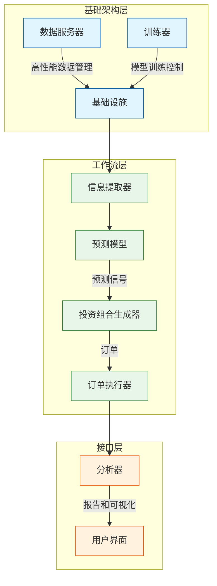
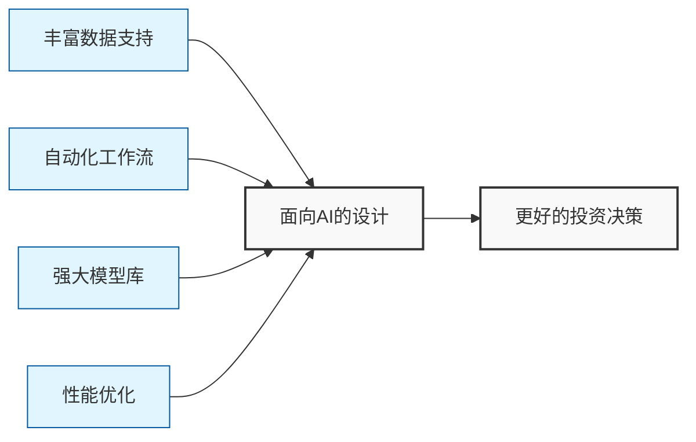
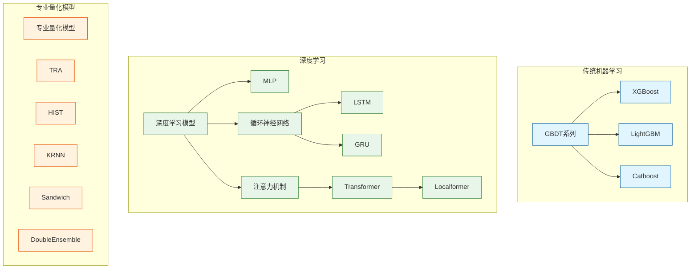
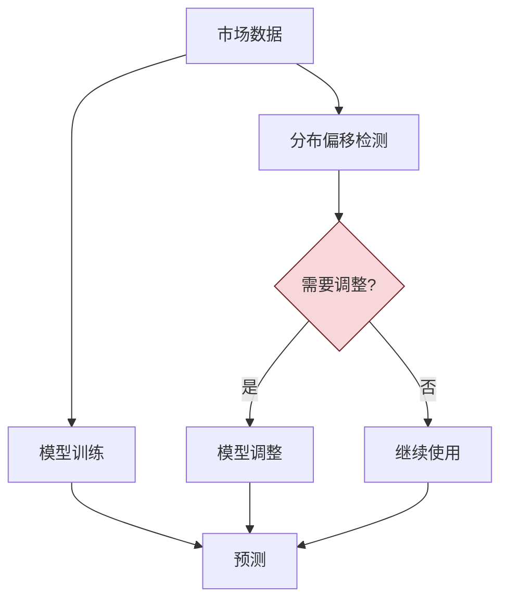
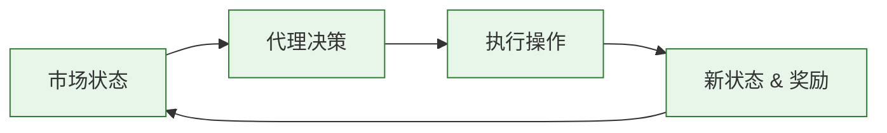
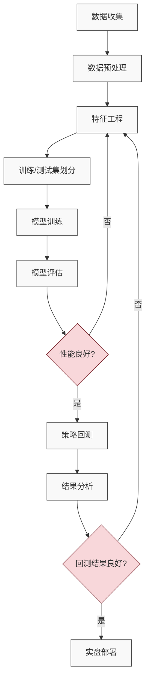

# Microsoft Qlib: AI驱动的量化投资平台完全指南

## 简介

Microsoft Qlib是一个面向AI的量化投资平台，旨在通过人工智能技术释放潜力、赋能研究，并在量化投资领域创造价值。它是一个开源项目，提供了从数据处理、模型训练到回测的完整机器学习流程，覆盖了量化投资的整个链条：alpha因子挖掘、风险建模、投资组合优化和订单执行。

<svg width="600" height="220" xmlns="http://www.w3.org/2000/svg">
  <style>
    .logo { font-family: Arial; font-size: 48px; font-weight: bold; fill: #0078D4; }
    .tagline { font-family: Arial; font-size: 18px; fill: #333; }
    .description { font-family: Arial; font-size: 14px; fill: #666; }
  </style>
  <rect width="600" height="220" fill="#f8f9fa" rx="10" ry="10"/>
  <text x="300" y="70" text-anchor="middle" class="logo">Microsoft Qlib</text>
  <text x="300" y="110" text-anchor="middle" class="tagline">AI驱动的量化投资开源平台</text>
  <text x="300" y="150" text-anchor="middle" class="description">数据处理 · 模型训练 · 回测 · 投资组合优化 · 订单执行</text>
  <text x="300" y="180" text-anchor="middle" class="description">支持多种机器学习模型范式：监督学习、市场动态建模和强化学习</text>
</svg>

Qlib支持多种机器学习建模范式，包括监督学习、市场动态建模和强化学习。许多最先进的量化研究成果和论文都在Qlib中实现，共同解决量化投资中的关键挑战，例如：

1. 利用监督学习从丰富多样的金融数据中挖掘市场的复杂非线性模式
2. 使用自适应概念漂移技术对金融市场的动态本质进行建模
3. 利用强化学习对连续投资决策进行建模，帮助投资者优化交易策略

## Qlib框架概述

Qlib采用模块化设计，各组件之间松耦合，每个组件都可以独立使用。整体框架如下图所示：



### 基础架构层
- **数据服务器**：提供高性能基础设施用于管理和检索原始数据
- **训练器**：提供灵活接口控制模型训练过程，使算法能够控制训练

### 工作流层
- **信息提取器**：为模型提取数据
- **预测模型**：专注于为其他模块生产各种预测信号（例如alpha、风险）
- **投资组合生成器**：根据这些信号生成目标投资组合并产生待执行订单
- **订单执行器**：执行订单

### 接口层
- **分析器**：为用户提供预测信号、投资组合和执行结果的详细分析报告

## 主要特性

### 面向AI的设计

Qlib专为AI技术在量化投资中的应用而设计，通过以下方式实现：



1. **丰富的数据处理能力**：处理异构、噪声和相关数据
2. **模块化设计**：灵活构建研究流程
3. **多种模型支持**：从传统机器学习到深度学习和强化学习
4. **高性能**：优化的数据服务器和缓存系统

### 完整的量化投资流程

Qlib覆盖量化投资的全流程：


## 快速开始

### 安装

Qlib支持Python 3.7以上版本，推荐使用conda环境：

```bash
# 安装依赖
pip install numpy
pip install --upgrade cython

# 从源码安装
git clone https://github.com/microsoft/qlib.git && cd qlib
pip install .
```

### 数据准备

Qlib提供了数据获取脚本，用于下载和准备中国市场数据：

```bash
# 获取日线数据
python -m qlib.run.get_data qlib_data --target_dir ~/.qlib/qlib_data/cn_data --region cn

# 获取1分钟数据
python -m qlib.run.get_data qlib_data --target_dir ~/.qlib/qlib_data/cn_data_1min --region cn --interval 1min
```

### 自动化量化研究流程

Qlib提供了名为`qrun`的工具来自动运行整个工作流（包括构建数据集、训练模型、回测和评估）：

```bash
cd examples  # 避免在包含qlib的目录下运行程序
qrun benchmarks/LightGBM/workflow_config_lightgbm_Alpha158.yaml
```

运行结果示例（超额收益分析）：

|                      | risk      |
|----------------------|-----------|
| mean                 | 0.000708  |
| std                  | 0.005626  |
| annualized_return    | 0.178316  |
| information_ratio    | 1.996555  |
| max_drawdown         | -0.081806 |

## Qlib模型库

Qlib提供了多种量化模型实现，包括：

### 传统机器学习模型
- 基于XGBoost的GBDT (Chen et al., KDD 2016)
- 基于LightGBM的GBDT (Ke et al., NIPS 2017)
- 基于Catboost的GBDT (Prokhorenkova et al., NIPS 2018)

### 深度学习模型
- 基于PyTorch的MLP
- 基于PyTorch的LSTM (Hochreiter et al., 1997)
- 基于PyTorch的GRU (Cho et al., 2014)
- 基于PyTorch的ALSTM (Qin et al., IJCAI 2017)
- 基于PyTorch的GATs (Velickovic et al., 2017)
- 基于PyTorch的Transformer (Vaswani et al., NeurIPS 2017)
- 基于PyTorch的Localformer (Jiang et al.)

### 专业量化模型
- 基于PyTorch的TRA (Dong et al., KDD 2021)
- 基于PyTorch的HIST (Xu et al., 2021)
- 基于PyTorch的KRNN
- 基于PyTorch的Sandwich
- 基于LightGBM的DoubleEnsemble (Zhang et al., ICDM 2020)



## 数据集

数据集在量化投资中扮演着重要角色。Qlib提供了多个预构建的数据集：

| 数据集    | 美国市场 | 中国市场 |
|-----------|:--------:|:--------:|
| Alpha360  |    ✓     |    ✓     |
| Alpha158  |    ✓     |    ✓     |

Qlib也支持用户创建自定义数据集，提供了详细的教程指导如何构建数据集。

## 主要挑战和解决方案

量化投资是一个具有许多独特挑战的领域，Qlib针对这些挑战提供了多种解决方案：

### 1. 预测：寻找有价值的信号/模式

精确预测股价趋势对构建盈利投资组合至关重要，但金融市场中存在大量不同格式的数据，使得构建预测模型具有挑战性。


### 2. 适应市场动态变化

由于金融市场环境的非静态特性，数据分布可能在不同时期发生变化，这导致在训练数据上构建的模型在未来测试数据中性能下降。因此，使预测模型/策略适应市场动态变化对于模型/策略的性能非常重要。



Qlib针对市场动态变化提供的解决方案：
- **滚动重训练**：定期使用最新数据更新模型
- **DDG-DA**：基于PyTorch的动态域生成领域适应方法 (Wendi et al., AAAI 2022)

### 3. 强化学习：建模连续决策

Qlib支持强化学习，该功能旨在对连续投资决策进行建模。这一功能通过从环境交互中学习来帮助投资者优化交易策略，以最大化某种累积回报。



Qlib中实现的强化学习解决方案：
- **订单执行策略**：
  - TWAP（时间加权平均价格）
  - PPO："基于近端策略优化的端到端最优交易执行框架"(IJCAL 2020)
  - OPDS："基于Oracle策略蒸馏的通用交易订单执行"(AAAI 2021)

## 离线模式和在线模式

Qlib的数据服务器可以部署为`离线`模式或`在线`模式。默认模式为离线模式。

- **离线模式**：数据将被部署在本地
- **在线模式**：数据将被部署为共享数据服务，数据及其缓存将被所有客户端共享

在线模式预期会因更高的缓存命中率而提高数据检索性能，同时消耗更少的磁盘空间。

## Qlib数据服务器性能

作为面向AI的平台，Qlib为数据存储和数据处理提供了解决方案。为了展示Qlib数据服务器的性能，我们将其与其他数据存储解决方案进行了比较：

| 存储方案 | HDF5 | MySQL | MongoDB | InfluxDB | Qlib -E -D | Qlib +E -D | Qlib +E +D |
|---------|------|-------|---------|----------|-----------|-----------|-----------|
| 总耗时(1CPU)(秒) | 184.4±3.7 | 365.3±7.5 | 253.6±6.7 | 368.2±3.6 | 147.0±8.8 | 47.6±1.0 | **7.4±0.3** |
| 总耗时(64CPU)(秒) | 8.8±0.6 | **4.2±0.2** | | | | | |

- `+(-)E` 表示有(无) `ExpressionCache`
- `+(-)D` 表示有(无) `DatasetCache`

## 实践项目

以下是使用Qlib构建量化投资策略的实践项目流程：



### 示例代码：构建自定义量化研究流程

以下示例展示了如何使用Qlib构建自定义量化研究工作流程：

```python
import qlib
from qlib.config import REG_CN
from qlib.utils import init_instance_by_config
from qlib.workflow import R
from qlib.workflow.record_temp import SignalRecord, PortAnaRecord
from qlib.utils import flatten_dict
from qlib.contrib.report import analysis_model, analysis_position

# 初始化qlib
qlib.init(provider_uri="~/.qlib/qlib_data/cn_data", region=REG_CN)

# 创建任务信息
task = {
    "model": {
        "class": "LGBModel",
        "module_path": "qlib.contrib.model.gbdt",
        "kwargs": {
            "loss": "mse",
            "colsample_bytree": 0.8879,
            "learning_rate": 0.0421,
            "subsample": 0.8789,
            "lambda_l1": 205.6999,
            "lambda_l2": 580.9768,
            "max_depth": 8,
            "num_leaves": 210,
            "num_threads": 20,
        },
    },
    "dataset": {
        "class": "DatasetH",
        "module_path": "qlib.data.dataset",
        "kwargs": {
            "handler": {
                "class": "Alpha158",
                "module_path": "qlib.contrib.data.handler",
                "kwargs": {
                    "start_time": "2008-01-01",
                    "end_time": "2020-08-01",
                    "fit_start_time": "2008-01-01",
                    "fit_end_time": "2014-12-31",
                    "instruments": "csi300",
                    "infer_processors": [
                        {"class": "RobustZScoreNorm", "kwargs": {"fields_group": "feature", "clip_outlier": True}},
                        {"class": "Fillna", "kwargs": {"fields_group": "feature"}}
                    ],
                    "learn_processors": [
                        {"class": "CSRankNorm", "kwargs": {"fields_group": "label"}}
                    ],
                    "label": ["Ref($close, -2) / Ref($close, -1) - 1"]
                },
            },
            "segments": {
                "train": ("2008-01-01", "2014-12-31"),
                "valid": ("2015-01-01", "2016-12-31"),
                "test": ("2017-01-01", "2020-08-01"),
            },
        },
    },
}

# 创建模型
model = init_instance_by_config(task["model"])
dataset = init_instance_by_config(task["dataset"])

# 训练模型
train_df = dataset.prepare("train", col_set=["feature", "label"])
valid_df = dataset.prepare("valid", col_set=["feature", "label"])
model.fit(train_df["feature"], train_df["label"], valid_df["feature"], valid_df["label"])

# 预测和回测
recorder = R.get_recorder()
sr = SignalRecord(model, dataset, recorder)
sr.generate()

# 分析结果
sar = analysis_model.SignalAnalysisRecord(recorder)
sar.generate()
par = analysis_position.PositionAnalysisRecord(recorder)
par.generate()
```

## 结论

Microsoft Qlib作为一个面向AI的开源量化投资平台，为研究人员和实践者提供了强大的工具，支持从数据处理、模型训练到投资组合优化的完整工作流程。其设计灵活、模块化，并支持多种机器学习范式，包括监督学习、市场动态建模和强化学习。

Qlib不仅提供了一系列预构建的模型和数据集，还允许用户轻松构建自己的解决方案，探索量化投资领域的创新方法。无论您是对量化投资有兴趣的初学者，还是寻求高级工具的专业研究人员，Qlib都能满足您的需求。

## 参考资源

- [Qlib官方GitHub仓库](https://github.com/microsoft/qlib)
- [Qlib官方文档](https://qlib.readthedocs.io/)
- [量化投资研究微软团队](https://www.microsoft.com/en-us/research/project/ai-for-finance/)

希望这篇指南能帮助您快速上手Microsoft Qlib，开启AI量化投资的探索之旅！ 