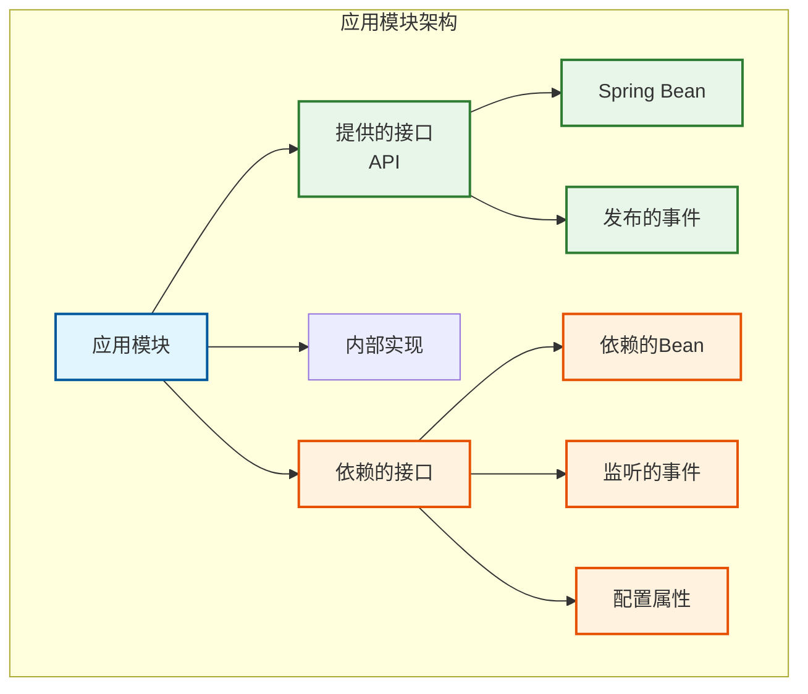
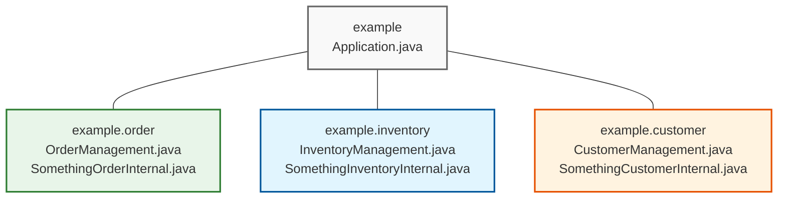
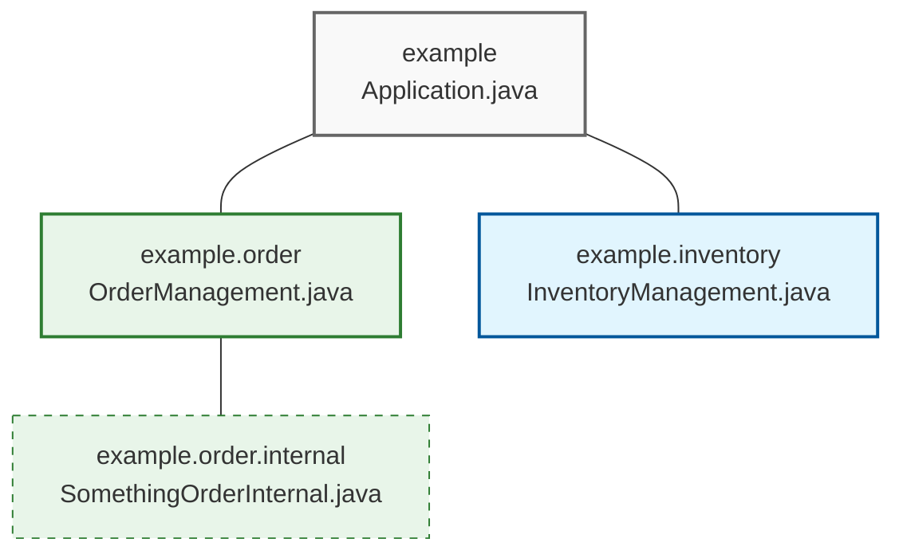
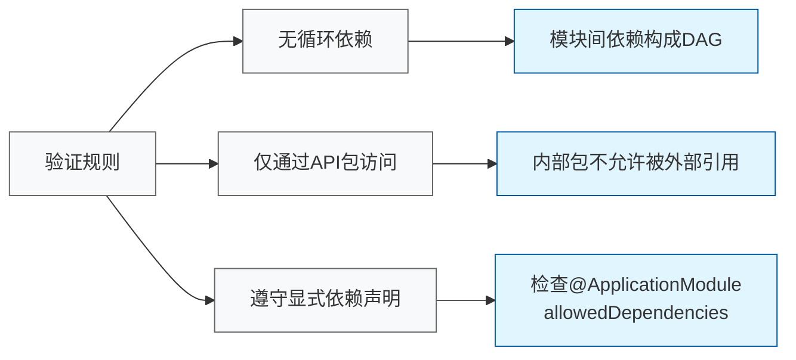
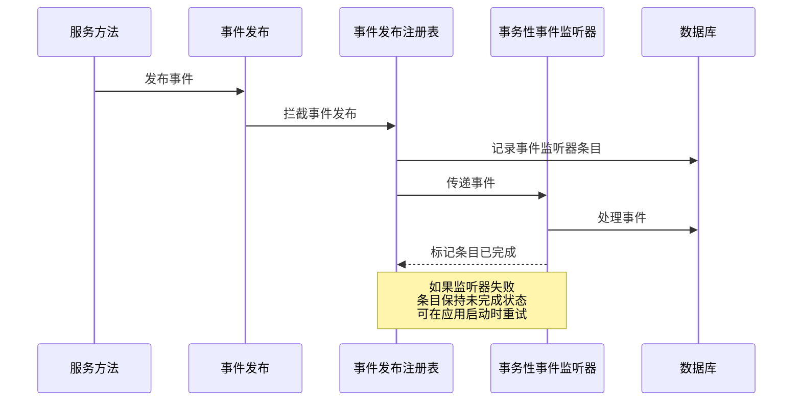
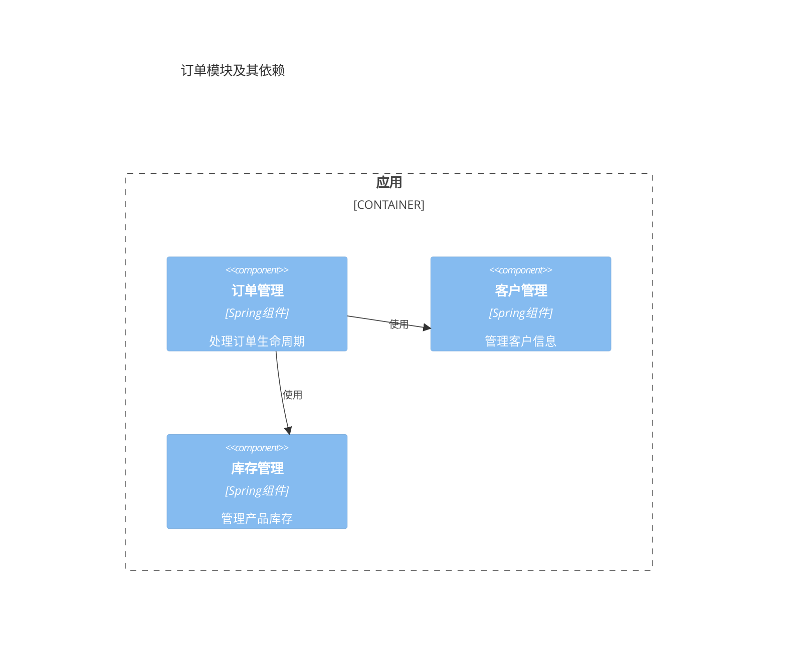

# Spring Modulith: 构建模块化Spring应用程序的完全指南

## 简介

Spring Modulith 是Spring项目的一个扩展，旨在帮助开发人员构建结构良好、模块化的Spring Boot应用程序。它支持开发者按照领域驱动设计的原则组织应用程序结构，允许他们验证模块化结构、为单个模块进行集成测试、观察应用程序行为以及创建文档。

<svg width="640" height="240" xmlns="http://www.w3.org/2000/svg">
  <style>
    .logo { font-family: Arial; font-size: 36px; font-weight: bold; fill: #6db33f; }
    .slogan { font-family: Arial; font-size: 18px; fill: #34302d; }
    .description { font-family: Arial; font-size: 14px; fill: #666; }
    .feature { font-family: Arial; font-size: 16px; fill: #34302d; }
  </style>
  <rect width="640" height="240" fill="#f1f8e9" rx="10" ry="10" stroke="#6db33f" stroke-width="2"/>
  <text x="320" y="60" text-anchor="middle" class="logo">Spring Modulith</text>
  <text x="320" y="100" text-anchor="middle" class="slogan">构建结构清晰的模块化单体应用</text>
  <text x="320" y="140" text-anchor="middle" class="description">在微服务和传统单体应用之间找到平衡点</text>
  
  <rect x="100" y="170" width="160" height="30" rx="5" fill="#6db33f" />
  <text x="180" y="190" text-anchor="middle" fill="white" class="feature">应用模块验证</text>
  
  <rect x="280" y="170" width="160" height="30" rx="5" fill="#6db33f" />
  <text x="360" y="190" text-anchor="middle" fill="white" class="feature">模块化集成测试</text>
  
  <rect x="460" y="170" width="160" height="30" rx="5" fill="#6db33f" />
  <text x="540" y="190" text-anchor="middle" fill="white" class="feature">架构自动化文档</text>
</svg>

Spring Modulith提供了一种介于微服务和传统单体应用之间的平衡方法，使您能够构建所谓的"模块化单体"应用程序。这种架构风格保留了单体应用程序的简单部署和操作优势，同时引入了微服务架构中常见的严格模块边界和自治原则。

## 核心概念

### 应用模块

在Spring Boot应用程序中，应用模块是功能单元，通常包含以下部分：

- **提供的接口**：通过Spring bean实例和应用事件向其他模块公开的API。
- **内部实现组件**：不应该被其他模块访问的实现细节。
- **依赖的接口**：引用其他模块API的Spring bean依赖、监听的应用事件和使用的配置属性。



### 简单应用模块

最简单的应用模块结构是以Spring Boot应用主类所在的包作为主包，该包的每个直接子包被视为一个**应用模块包**。

假设应用的主包为`example`，那么模块结构如下：



每个应用模块可以使用Java的包访问权限控制来隐藏模块内部的代码实现。模块的API由包中的所有公共类型构成。

### 高级应用模块

如果应用模块包含子包，则可能需要将子包中的类型设为公共的，以便于同一模块内的代码引用它们。但这样也可能导致其他模块能够访问这些内部类型，违反模块化原则。

例如，下面的结构中，`order.internal`包中的`SomethingOrderInternal`类型虽然被设为公共类型（因为`OrderManagement`依赖它），但不应该被其他模块如`inventory`模块访问：



在这种情况下，Spring Modulith可以帮助验证模块间的边界，确保其他模块不会依赖于`order.internal`包中的类型。

### 显式应用模块依赖

模块可以通过在`package-info.java`文件中使用`@ApplicationModule`注解来声明其允许的依赖关系：

```java
@org.springframework.modulith.ApplicationModule(
  allowedDependencies = "order"
)
package example.inventory;
```

在这种情况下，`inventory`模块只允许引用`order`模块中的代码（以及不属于任何模块的代码）。

### 命名接口

默认情况下，应用模块的基础包被视为API包，是唯一允许来自其他模块的传入依赖的包。如果您想向其他模块公开额外的包，需要使用**命名接口**。

例如，通过在`example.order.spi`包的`package-info.java`文件中添加`@NamedInterface`注解：

```java
@org.springframework.modulith.NamedInterface("spi")
package example.order.spi;
```

其他模块可以在显式依赖声明中引用这个命名接口：

```java
@org.springframework.modulith.ApplicationModule(
  allowedDependencies = "order::spi"
)
package example.inventory;
```

这样，`inventory`模块只能依赖于`order.spi`包中的接口，而不能依赖于`order`包中的其他代码。

## 快速开始

### 添加依赖

首先，在Maven项目的`pom.xml`文件中添加Spring Modulith BOM（Bill of Materials）：

```xml
<dependencyManagement>
  <dependencies>
    <dependency>
      <groupId>org.springframework.modulith</groupId>
      <artifactId>spring-modulith-bom</artifactId>
      <version>1.4.1</version>
      <scope>import</scope>
      <type>pom</type>
    </dependency>
  </dependencies>
</dependencyManagement>
```

然后，添加核心模块依赖：

```xml
<dependency>
  <groupId>org.springframework.modulith</groupId>
  <artifactId>spring-modulith-core</artifactId>
  <scope>test</scope>
</dependency>

<dependency>
  <groupId>org.springframework.modulith</groupId>
  <artifactId>spring-modulith-docs</artifactId>
  <scope>test</scope>
</dependency>

<dependency>
  <groupId>org.springframework.modulith</groupId>
  <artifactId>spring-modulith-test</artifactId>
  <scope>test</scope>
</dependency>
```

或者，使用提供的启动器POM:

```xml
<dependency>
  <groupId>org.springframework.modulith</groupId>
  <artifactId>spring-modulith-starter-test</artifactId>
  <scope>test</scope>
</dependency>
```

### 创建Java包结构

按照领域驱动设计的原则组织应用程序结构，将业务模块作为应用程序主包的直接子包：

```
□ Example
└─ □ src/main/java
   ├─ □ example           <1>
   │  └─ Application.java
   ├─ □ example.inventory <2>
   │  └─ …
   └─ □ example.order     <2>
      └─ …
```

1. 应用程序根包
2. 应用模块包

### 验证模块结构

创建测试类来验证应用模块结构：

```java
import org.junit.jupiter.api.Test;
import org.springframework.modulith.core.ApplicationModules;
import org.springframework.modulith.docs.Documenter;

class ModularityTests {

  ApplicationModules modules = ApplicationModules.of(Application.class).verify();
  
  @Test
  void verifyModularity() {
    modules.verify();
  }
  
  @Test
  void writeDocumentation() {
    new Documenter(modules)
      .writeModulesAsPlantUml()
      .writeIndividualModulesAsPlantUml()
      .writeModuleCanvases();
  }
}
```

运行这些测试将验证模块化结构并生成文档。

## 验证应用模块结构

Spring Modulith通过`ApplicationModules.verify()`方法验证以下规则：

1. **应用模块级别没有循环依赖**：模块间的依赖关系必须形成有向无环图。
2. **只通过API包访问其他模块**：拒绝所有引用其他应用模块内部包中类型的代码。
3. **仅明确允许的应用模块依赖**（可选）：如果通过`@ApplicationModule(allowedDependencies = …)`配置了依赖，则拒绝依赖其他应用模块。



## 应用模块集成测试

Spring Modulith允许为单个应用模块（隔离或与其他模块组合）运行集成测试。将JUnit测试类放在应用模块包或其任何子包中，并使用`@ApplicationModuleTest`注解：

```java
package example.order;

import org.springframework.modulith.test.ApplicationModuleTest;
import org.junit.jupiter.api.Test;

@ApplicationModuleTest
class OrderIntegrationTests {

  // 测试用例
}
```

这将运行集成测试，类似于使用`@SpringBootTest`，但引导程序仅限于测试所在的应用模块。

### 引导模式

应用模块测试可以以多种模式引导：

- `STANDALONE`（默认）：仅运行当前模块。
- `DIRECT_DEPENDENCIES`：运行当前模块和所有直接依赖的模块。
- `ALL_DEPENDENCIES`：运行当前模块和依赖的整个模块树。

```java
@ApplicationModuleTest(bootstrapMode = BootstrapMode.DIRECT_DEPENDENCIES)
class OrderIntegrationTests {
  // 测试用例
}
```

### 处理传出依赖

当应用模块被引导时，其中包含的Spring bean将被实例化。如果这些bean包含跨越模块边界的依赖，而这些依赖模块不包含在测试运行中，引导将失败。可以使用Spring的`@MockBean`来模拟这些依赖：

```java
@ApplicationModuleTest
class InventoryIntegrationTests {

  @MockBean OrderManagement orderManagement;
  
  @Test
  void someTestMethod() {
    // 测试逻辑
  }
}
```

## 使用应用事件

为了使应用模块之间尽可能松耦合，它们之间的主要交互方式应该是事件发布和消费。这避免了发起模块需要了解所有潜在的感兴趣方，这是实现应用模块集成测试的关键。

传统的模块间调用模式：

```java
@Service
@RequiredArgsConstructor
public class OrderManagement {

  private final InventoryManagement inventory;

  @Transactional
  public void complete(Order order) {
    // 订单聚合上的状态转换
    order.complete();
    
    // 调用相关功能
    inventory.updateStockFor(order);
  }
}
```

使用事件发布的模块间交互模式：

```java
@Service
@RequiredArgsConstructor
public class OrderManagement {

  private final ApplicationEventPublisher events;

  @Transactional
  public void complete(Order order) {
    // 订单聚合上的状态转换
    order.complete();
    
    // 发布领域事件
    events.publishEvent(new OrderCompleted(order.getId()));
  }
}
```

在另一个模块中监听事件：

```java
@Service
@RequiredArgsConstructor
public class InventoryManagement {

  @Async
  @TransactionalEventListener
  void on(OrderCompleted event) {
    // 处理库存更新逻辑
  }
}
```

### 事件发布注册表

Spring Modulith提供了事件发布注册表，可以钩入Spring Framework的核心事件发布机制。在事件发布时，它会找出将接收事件的事务性事件监听器，并在原始业务事务的一部分中为每个事件监听器写入一个事件发布日志条目。



每个事务性事件监听器都被包装在一个切面中，如果监听器的执行成功，该切面会将日志条目标记为已完成。如果监听器失败，日志条目保持不变，以便根据应用程序的需要部署重试机制。默认情况下，所有未完成的事件发布都会在应用程序启动时重新提交。

### 事件发布存储库

Spring Modulith提供了适用于JPA、JDBC和MongoDB等支持事务的流行持久化技术的实现。您可以通过在Spring Modulith应用程序中添加相应的JAR来选择要使用的持久化技术。

Spring Boot提供的事件注册启动器：

- `spring-modulith-starter-jpa` — 使用JPA作为持久化技术。
- `spring-modulith-starter-jdbc` — 使用JDBC作为持久化技术。
- `spring-modulith-starter-mongodb` — 使用MongoDB作为持久化技术。

## 记录应用模块

通过`ApplicationModules`创建的应用模块模型可用于创建文档片段，以包含在用Asciidoc编写的开发人员文档中。Spring Modulith的`Documenter`抽象可以生成两种不同类型的片段：

1. 描述各个应用模块之间关系的C4和UML组件图
2. 所谓的**应用模块画布**，这是关于模块及其中最相关元素（Spring bean、聚合根、发布和监听的事件以及配置属性）的表格概述

### 生成应用模块组件图

通过将`ApplicationModules`实例交给`Documenter`，可以生成文档片段：

```java
class DocumentationTests {

  ApplicationModules modules = ApplicationModules.of(Application.class);

  @Test
  void writeDocumentationSnippets() {
    new Documenter(modules)
      .writeModulesAsPlantUml()
      .writeIndividualModulesAsPlantUml();
  }
}
```

第一次调用`Documenter`将生成包含系统中所有模块的C4组件图：


第二次调用将创建额外的图表，这些图表只包括单个模块和画布上与之直接依赖的模块：



### 使用传统UML组件图

如果您更喜欢传统的UML样式组件图，可以通过`DiagramOptions`来使用该样式：

```java
DiagramOptions.defaults()
  .withStyle(DiagramStyle.UML);
```

### 生成应用模块画布

应用模块画布可以通过调用`Documenter.writeModuleCanvases()`生成：

```java
class DocumentationTests {

  ApplicationModules modules = ApplicationModules.of(Application.class);

  @Test
  void writeDocumentationSnippets() {
    new Documenter(modules)
      .writeModuleCanvases();
  }
}
```

画布包含以下部分：
- 应用模块的基础包
- 应用模块公开的Spring bean，按构造型分组
- 公开的聚合根
- 模块发布的应用事件
- 模块监听的应用事件
- 配置属性

## 观察应用模块

应用模块之间的交互可以被拦截以创建Micrometer span，最终以跟踪的形式出现，可以在Zipkin等工具中可视化。要激活仪表化，请将以下运行时依赖项添加到您的项目中：

```xml
<dependency>
  <groupId>org.springframework.modulith</groupId>
  <artifactId>spring-modulith</artifactId>
  <version>${spring-modulith.version}</version>
  <scope>runtime</scope>
</dependency>
```

这将导致作为应用模块API一部分的所有Spring组件都被装饰以拦截调用并为它们创建Micrometer span。

## 完整示例

### 项目结构

让我们创建一个基于Spring Modulith的电子商务应用示例，包含以下模块：

- `order`：处理订单工作流
- `customer`：管理客户数据
- `inventory`：管理库存和预订
- `payment`：处理支付流程
- `shipping`：管理发货流程

```
example
├── Application.java
├── order
│   ├── api
│   │   ├── OrderDto.java
│   │   └── OrderManagementApi.java
│   ├── domain
│   │   ├── Order.java
│   │   └── OrderRepository.java
│   ├── events
│   │   ├── OrderCancelled.java
│   │   └── OrderCompleted.java
│   └── internal
│       └── OrderManagementImpl.java
├── customer
│   ├── Customer.java
│   └── CustomerManagement.java
├── inventory
│   ├── InventoryManagement.java
│   ├── StockItem.java
│   └── internal
│       └── InventoryEventHandler.java
├── payment
│   ├── api
│   │   └── PaymentService.java
│   └── internal
│       ├── PaymentProcessor.java
│       └── PaymentEventPublisher.java
└── shipping
    ├── ShippingService.java
    └── internal
        └── ShippingEventHandler.java
```

### 订单模块

`Order.java`:

```java
package example.order.domain;

import org.springframework.data.annotation.Id;
import org.springframework.data.domain.AbstractAggregateRoot;

import jakarta.persistence.Entity;
import jakarta.persistence.EnumType;
import jakarta.persistence.Enumerated;
import jakarta.persistence.GeneratedValue;
import lombok.AccessLevel;
import lombok.Getter;
import lombok.NoArgsConstructor;
import lombok.Setter;

import example.order.events.OrderCompleted;

@Entity
@NoArgsConstructor(access = AccessLevel.PROTECTED)
public class Order extends AbstractAggregateRoot<Order> {

    @Id @GeneratedValue 
    @Getter private Long id;
    
    @Getter private String customerId;
    @Getter private Double totalAmount;
    
    @Enumerated(EnumType.STRING)
    @Getter private OrderStatus status = OrderStatus.CREATED;
    
    public Order(String customerId, Double totalAmount) {
        this.customerId = customerId;
        this.totalAmount = totalAmount;
    }
    
    public Order complete() {
        if (this.status != OrderStatus.PAYMENT_APPROVED) {
            throw new IllegalStateException("Cannot complete order that has not been paid");
        }
        
        this.status = OrderStatus.COMPLETED;
        
        // 注册一个要与save()一起发布的域事件
        registerEvent(new OrderCompleted(this.id, this.customerId));
        
        return this;
    }
    
    public enum OrderStatus {
        CREATED, PAYMENT_PENDING, PAYMENT_APPROVED, COMPLETED, CANCELLED
    }
}
```

`OrderManagementApi.java`:

```java
package example.order.api;

import example.order.domain.Order;

public interface OrderManagementApi {
    Order createOrder(String customerId, Double totalAmount);
    Order getOrder(Long orderId);
    Order completeOrder(Long orderId);
}
```

`OrderManagementImpl.java`:

```java
package example.order.internal;

import org.springframework.stereotype.Service;
import org.springframework.transaction.annotation.Transactional;

import lombok.RequiredArgsConstructor;

import example.order.api.OrderManagementApi;
import example.order.domain.Order;
import example.order.domain.OrderRepository;

@Service
@RequiredArgsConstructor
class OrderManagementImpl implements OrderManagementApi {

    private final OrderRepository orders;
    
    @Override
    @Transactional
    public Order createOrder(String customerId, Double totalAmount) {
        return orders.save(new Order(customerId, totalAmount));
    }
    
    @Override
    @Transactional(readOnly = true)
    public Order getOrder(Long orderId) {
        return orders.findById(orderId)
            .orElseThrow(() -> new IllegalArgumentException("Order not found: " + orderId));
    }
    
    @Override
    @Transactional
    public Order completeOrder(Long orderId) {
        Order order = getOrder(orderId);
        return orders.save(order.complete());
    }
}
```

### 库存模块

`InventoryEventHandler.java`:

```java
package example.inventory.internal;

import org.springframework.modulith.events.ApplicationModuleListener;
import org.springframework.stereotype.Component;
import org.springframework.transaction.annotation.Transactional;

import lombok.RequiredArgsConstructor;

import example.inventory.InventoryManagement;
import example.order.events.OrderCompleted;

@Component
@RequiredArgsConstructor
class InventoryEventHandler {

    private final InventoryManagement inventory;
    
    @Transactional
    @ApplicationModuleListener
    void on(OrderCompleted event) {
        // 根据订单ID更新库存
        inventory.updateStockForOrder(event.getOrderId());
    }
}
```

`InventoryManagement.java`:

```java
package example.inventory;

import org.springframework.stereotype.Service;
import org.springframework.transaction.annotation.Transactional;

import lombok.RequiredArgsConstructor;

@Service
@RequiredArgsConstructor
public class InventoryManagement {

    private final StockItemRepository stockItems;
    
    @Transactional
    public void updateStockForOrder(Long orderId) {
        // 实现库存更新逻辑
        System.out.println("Updating stock for order: " + orderId);
    }
}
```

### 测试模块集成

`OrderIntegrationTests.java`:

```java
package example.order;

import static org.assertj.core.api.Assertions.assertThat;

import org.junit.jupiter.api.Test;
import org.springframework.beans.factory.annotation.Autowired;
import org.springframework.modulith.events.core.PublishedEvents;
import org.springframework.modulith.test.ApplicationModuleTest;
import org.springframework.modulith.test.Scenario;

import example.order.api.OrderManagementApi;
import example.order.domain.Order;
import example.order.events.OrderCompleted;

@ApplicationModuleTest
class OrderIntegrationTests {

    @Autowired OrderManagementApi orders;
    
    @Test
    void completingOrderPublishesEvent() {
        // 使用Scenario API测试事件发布
        Scenario.run(scenario -> {
            // 创建并完成订单
            Order order = orders.createOrder("customer-1", 100.00);
            orders.completeOrder(order.getId());
            
            // 验证事件发布
            PublishedEvents events = scenario.getEvents();
            assertThat(events.ofType(OrderCompleted.class)).hasSize(1);
            assertThat(events.ofType(OrderCompleted.class).iterator().next().getOrderId())
                .isEqualTo(order.getId());
        });
    }
}
```

`InventoryIntegrationTests.java`:

```java
package example.inventory;

import static org.mockito.Mockito.*;

import org.junit.jupiter.api.Test;
import org.springframework.beans.factory.annotation.Autowired;
import org.springframework.boot.test.mock.mockito.MockBean;
import org.springframework.modulith.test.ApplicationModuleTest;

import example.order.events.OrderCompleted;

@ApplicationModuleTest
class InventoryIntegrationTests {

    @Autowired InventoryManagement inventory;
    @MockBean StockItemRepository stockItems;
    
    @Test
    void inventoryUpdatedOnOrderCompleted() {
        // 模拟OrderCompleted事件
        Long orderId = 42L;
        OrderCompleted event = new OrderCompleted(orderId, "customer-1");
        
        // 触发事件
        inventory.updateStockForOrder(orderId);
        
        // 验证库存被更新
        verify(stockItems, times(1)).updateStockForOrder(orderId);
    }
}
```

### 模块化测试

`ModularityTests.java`:

```java
package example;

import org.junit.jupiter.api.Test;
import org.springframework.modulith.core.ApplicationModules;
import org.springframework.modulith.docs.Documenter;

class ModularityTests {

    ApplicationModules modules = ApplicationModules.of(Application.class);
    
    @Test
    void verifyModularity() {
        modules.verify();
    }
    
    @Test
    void writeDocumentation() {
        new Documenter(modules)
            .writeModulesAsPlantUml()
            .writeIndividualModulesAsPlantUml()
            .writeModuleCanvases();
    }
}
```

## Spring Modulith运行时支持

### 事件发布注册表

为了在异步事件处理过程中避免数据丢失，Spring Modulith提供了事件发布注册表。添加以下依赖：

```xml
<dependency>
  <groupId>org.springframework.modulith</groupId>
  <artifactId>spring-modulith-starter-jdbc</artifactId>
</dependency>
```

这将自动配置一个事件发布注册表，用于跟踪和重试失败的事件处理。

### 生产就绪特性

Spring Modulith提供了一些生产就绪特性，如Spring Boot Actuator端点：

```xml
<dependency>
  <groupId>org.springframework.modulith</groupId>
  <artifactId>spring-modulith-actuator</artifactId>
</dependency>
```

配置`application.properties`：

```
management.endpoints.web.exposure.include=health,info,modulith
```

这将公开`/actuator/modulith`端点，提供应用模块的概览。

### 可观察性

Spring Modulith还提供了可观察性支持，能够通过Micrometer集成到您现有的可观察性栈中：

```xml
<dependency>
  <groupId>org.springframework.modulith</groupId>
  <artifactId>spring-modulith-observability</artifactId>
</dependency>

<dependency>
  <groupId>io.micrometer</groupId>
  <artifactId>micrometer-tracing-bridge-brave</artifactId>
</dependency>

<dependency>
  <groupId>io.zipkin.reporter2</groupId>
  <artifactId>zipkin-reporter-brave</artifactId>
</dependency>
```

## 总结

Spring Modulith为构建模块化Spring Boot应用程序提供了丰富的支持，包括：

1. **应用模块定义和验证**：确保模块边界被维护，防止循环依赖和不当访问。
2. **模块化集成测试**：允许在隔离或组合模式下测试单个应用模块。
3. **基于事件的模块集成**：通过事件发布和消费实现松耦合的模块交互。
4. **自动化文档生成**：生成组件图和应用模块画布，提供代码库的概览。
5. **运行时支持**：包括事件发布注册表、生产就绪特性和可观察性支持。

与传统的整体应用相比，Spring Modulith应用提供了更好的代码组织和更严格的模块边界；与微服务相比，它保留了单体应用的简单部署和操作优势，同时保持了模块的自治性。这使其成为许多应用场景的理想选择。

## 参考资源

- [Spring Modulith官方文档](https://docs.spring.io/spring-modulith/reference/)
- [Spring Modulith GitHub仓库](https://github.com/spring-projects/spring-modulith)
- [Spring.io项目页面](https://spring.io/projects/spring-modulith) 