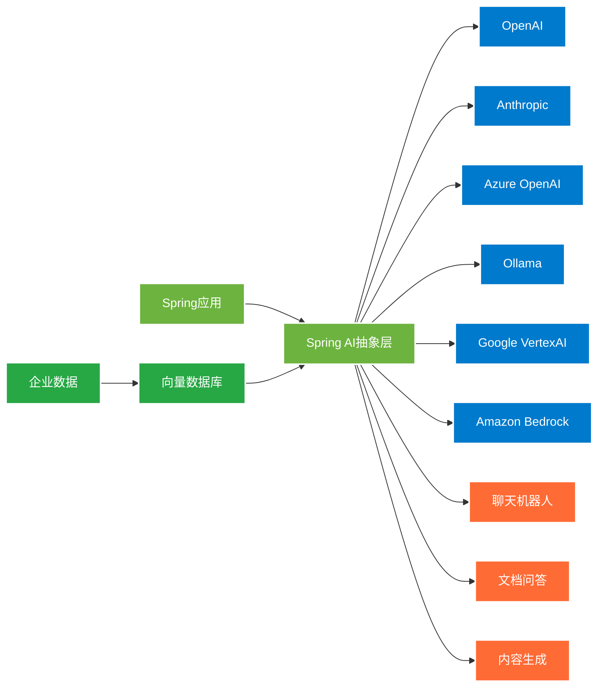
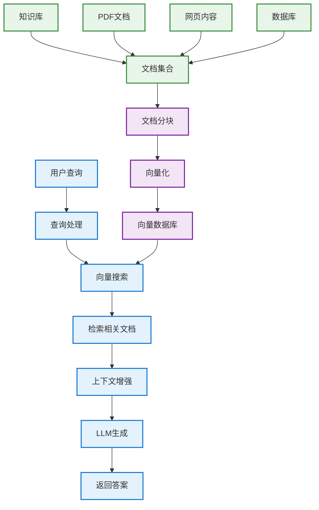

# Spring AI: 构建人工智能应用的完全指南

## 简介

Spring AI是Spring生态系统中专为简化人工智能应用开发而设计的项目。它为Java开发者提供了一个统一的编程模型来集成各种AI服务，包括聊天模型、图像生成、语音识别等功能。Spring AI的目标是让AI集成变得像使用其他Spring组件一样简单和直观。

<svg width="700" height="280" xmlns="http://www.w3.org/2000/svg">
  <style>
    .logo { font-family: Arial; font-size: 40px; font-weight: bold; fill: #6db33f; }
    .ai { font-family: Arial; font-size: 40px; font-weight: bold; fill: #ff6b35; }
    .tagline { font-family: Arial; font-size: 20px; fill: #34302d; }
    .description { font-family: Arial; font-size: 14px; fill: #666; }
    .feature-box { fill: #f8f9fa; stroke: #dee2e6; stroke-width: 1; }
    .feature-text { font-family: Arial; font-size: 12px; fill: #495057; text-anchor: middle; }
    .highlight { fill: #28a745; }
  </style>
  
  <!-- 背景 -->
  <rect width="700" height="280" fill="#ffffff" rx="15" ry="15" stroke="#6db33f" stroke-width="3"/>
  
  <!-- 标题 -->
  <text x="350" y="60" text-anchor="middle" class="logo">Spring</text>
  <text x="450" y="60" text-anchor="middle" class="ai">AI</text>
  <text x="350" y="90" text-anchor="middle" class="tagline">构建智能应用的Spring框架</text>
  <text x="350" y="120" text-anchor="middle" class="description">统一的API • 多模型支持 • 企业级集成 • RAG支持</text>
  
  <!-- 功能特性框 -->
  <g transform="translate(50, 150)">
    <rect width="120" height="60" class="feature-box" rx="8"/>
    <text x="60" y="25" class="feature-text">聊天完成</text>
    <text x="60" y="40" class="feature-text">Chat Models</text>
    <circle cx="60" cy="50" r="3" class="highlight"/>
  </g>
  
  <g transform="translate(190, 150)">
    <rect width="120" height="60" class="feature-box" rx="8"/>
    <text x="60" y="25" class="feature-text">向量嵌入</text>
    <text x="60" y="40" class="feature-text">Embeddings</text>
    <circle cx="60" cy="50" r="3" class="highlight"/>
  </g>
  
  <g transform="translate(330, 150)">
    <rect width="120" height="60" class="feature-box" rx="8"/>
    <text x="60" y="25" class="feature-text">图像生成</text>
    <text x="60" y="40" class="feature-text">Image Models</text>
    <circle cx="60" cy="50" r="3" class="highlight"/>
  </g>
  
  <g transform="translate(470, 150)">
    <rect width="120" height="60" class="feature-box" rx="8"/>
    <text x="60" y="25" class="feature-text">语音处理</text>
    <text x="60" y="40" class="feature-text">Audio Models</text>
    <circle cx="60" cy="50" r="3" class="highlight"/>
  </g>
  
  <g transform="translate(120, 220)">
    <rect width="120" height="60" class="feature-box" rx="8"/>
    <text x="60" y="25" class="feature-text">RAG支持</text>
    <text x="60" y="40" class="feature-text">Vector Stores</text>
    <circle cx="60" cy="50" r="3" class="highlight"/>
  </g>
  
  <g transform="translate(260, 220)">
    <rect width="120" height="60" class="feature-box" rx="8"/>
    <text x="60" y="25" class="feature-text">工具调用</text>
    <text x="60" y="40" class="feature-text">Function Calling</text>
    <circle cx="60" cy="50" r="3" class="highlight"/>
  </g>
  
  <g transform="translate(400, 220)">
    <rect width="120" height="60" class="feature-box" rx="8"/>
    <text x="60" y="25" class="feature-text">可观测性</text>
    <text x="60" y="40" class="feature-text">Observability</text>
    <circle cx="60" cy="50" r="3" class="highlight"/>
  </g>
</svg>

Spring AI受到Python生态系统中LangChain和LlamaIndex等知名项目的启发，但它不是这些项目的直接移植。相反，Spring AI从头开始设计，遵循Spring的设计哲学，为Java和Kotlin开发者提供原生的AI开发体验。

## Spring AI的核心价值

Spring AI解决了AI集成中的根本挑战：**连接您的企业数据和API与AI模型**。它提供了一个统一的抽象层，让开发者能够：

1. **无缝切换AI提供商**：通过标准化接口支持多个AI服务提供商
2. **简化复杂的AI工作流**：封装常见的AI使用模式和最佳实践  
3. **企业级集成**：与Spring生态系统完美集成
4. **生产就绪**：提供监控、测试和部署支持



## 支持的AI模型和服务

Spring AI提供对主要AI服务提供商的全面支持：

### 聊天模型
- **OpenAI**: GPT-3.5, GPT-4, GPT-4 Turbo
- **Anthropic**: Claude 3 Haiku, Claude 3 Sonnet, Claude 3 Opus
- **Azure OpenAI**: Azure托管的OpenAI模型
- **Google VertexAI**: Gemini Pro, PaLM 2
- **Amazon Bedrock**: Claude, Llama 2, Titan
- **Ollama**: 本地模型部署
- **Groq**: 高性能推理
- **Mistral AI**: Mistral 7B, Mixtral
- **Hugging Face**: 开源模型集成

### 嵌入模型
- **OpenAI Embeddings**: text-embedding-ada-002, text-embedding-3-small/large
- **Azure OpenAI Embeddings**: Azure托管的嵌入模型
- **Ollama Embeddings**: 本地嵌入模型
- **ONNX Transformers**: 本地ONNX模型
- **VertexAI Embeddings**: Google的嵌入服务

### 图像模型
- **OpenAI DALL-E**: 文本到图像生成
- **Azure OpenAI Images**: Azure托管的图像生成
- **Stability AI**: Stable Diffusion模型

### 音频模型
- **OpenAI Whisper**: 语音识别和转录
- **OpenAI TTS**: 文本转语音

### 向量数据库支持

Spring AI支持主要的向量数据库提供商：

```mermaid
graph TD
    A[Spring AI Vector Store] --> B[关系数据库]
    A --> C[专用向量数据库] 
    A --> D[搜索引擎]
    A --> E[云服务]
    A --> F[内存存储]
    
    B --> B1[PostgreSQL/PGVector]
    B --> B2[MariaDB]
    B --> B3[Oracle Database]
    
    C --> C1[Pinecone]
    C --> C2[Weaviate]
    C --> C3[Qdrant]
    C --> C4[Milvus]
    C --> C5[Chroma]
    
    D --> D1[Elasticsearch]
    D --> D2[OpenSearch]
    D --> D3[Typesense]
    
    E --> E1[Azure Cosmos DB]
    E --> E2[Azure Vector Search]
    E --> E3[MongoDB Atlas]
    E --> E4[Neo4j]
    
    F --> F1[SimpleVectorStore]
    F --> F2[Redis]
    
    classDef category fill:#e1f5fe,stroke:#01579b,stroke-width:2px
    classDef db fill:#e8f5e9,stroke:#2e7d32,stroke-width:1px
    
    class A category
    class B,C,D,E,F category
    class B1,B2,B3,C1,C2,C3,C4,C5,D1,D2,D3,E1,E2,E3,E4,F1,F2 db
```



## 快速开始

### 添加依赖

首先添加Spring AI的BOM到您的Maven项目：

```xml
<dependencyManagement>
    <dependencies>
        <dependency>
            <groupId>org.springframework.ai</groupId>
            <artifactId>spring-ai-bom</artifactId>
            <version>1.0.0</version>
            <type>pom</type>
            <scope>import</scope>
        </dependency>
    </dependencies>
</dependencyManagement>
```

然后添加所需的启动器依赖。例如，使用OpenAI：

```xml
<dependencies>
    <dependency>
        <groupId>org.springframework.ai</groupId>
        <artifactId>spring-ai-openai-spring-boot-starter</artifactId>
    </dependency>
    
    <dependency>
        <groupId>org.springframework.boot</groupId>
        <artifactId>spring-boot-starter-web</artifactId>
    </dependency>
</dependencies>
```

对于Gradle项目：

```groovy
dependencies {
    implementation platform('org.springframework.ai:spring-ai-bom:1.0.0')
    implementation 'org.springframework.ai:spring-ai-openai-spring-boot-starter'
    implementation 'org.springframework.boot:spring-boot-starter-web'
}
```

### 配置应用

在`application.properties`中配置API密钥：

```properties
# OpenAI配置
spring.ai.openai.api-key=${OPENAI_API_KEY}
spring.ai.openai.chat.options.model=gpt-4
spring.ai.openai.chat.options.temperature=0.7

# 或者配置其他提供商，如Ollama（本地部署）
# spring.ai.ollama.base-url=http://localhost:11434
# spring.ai.ollama.chat.options.model=llama2
```

### 基本聊天示例

```java
@RestController
public class ChatController {

    private final ChatClient chatClient;

    public ChatController(ChatClient.Builder chatClientBuilder) {
        this.chatClient = chatClientBuilder.build();
    }

    @GetMapping("/ai/generate")
    public String generate(@RequestParam String message) {
        return chatClient.prompt()
                .user(message)
                .call()
                .content();
    }
    
    @GetMapping("/ai/generateStream")
    public Flux<String> generateStream(@RequestParam String message) {
        return chatClient.prompt()
                .user(message)
                .stream()
                .content();
    }
}
```

## ChatClient API详解

ChatClient是Spring AI的核心API，提供了流畅的接口来与聊天模型交互：

### 基本用法

```java
@Service
public class ChatService {

    private final ChatClient chatClient;

    public ChatService(ChatClient.Builder chatClientBuilder) {
        this.chatClient = chatClientBuilder
                .defaultSystem("你是一个有用的AI助手，请用中文回答问题。")
                .build();
    }

    // 简单聊天
    public String simpleChat(String userMessage) {
        return chatClient.prompt()
                .user(userMessage)
                .call()
                .content();
    }

    // 带系统提示的聊天
    public String chatWithSystemPrompt(String userMessage) {
        return chatClient.prompt()
                .system("你是一个专业的技术顾问，专注于Spring框架")
                .user(userMessage)
                .call()
                .content();
    }

    // 流式响应
    public Flux<String> streamingChat(String userMessage) {
        return chatClient.prompt()
                .user(userMessage)
                .stream()
                .content();
    }

    // 结构化输出
    public BookRecommendation getBookRecommendation(String topic) {
        return chatClient.prompt()
                .user("推荐一本关于{topic}的好书")
                .user(User.text(topic))
                .call()
                .entity(BookRecommendation.class);
    }
}
```

### 结构化输出

Spring AI支持将LLM响应直接映射到Java对象：

```java
public record BookRecommendation(
    String title,
    String author,
    String isbn,
    String description,
    int rating
) {}

public record WeatherInfo(
    String location,
    double temperature,
    String condition,
    int humidity,
    String forecast
) {}

@Service
public class StructuredOutputService {

    private final ChatClient chatClient;

    public StructuredOutputService(ChatClient.Builder chatClientBuilder) {
        this.chatClient = chatClientBuilder.build();
    }

    public BookRecommendation recommendBook(String genre) {
        return chatClient.prompt()
                .user("请推荐一本{genre}类型的书籍，包含详细信息")
                .user(User.text(genre))
                .call()
                .entity(BookRecommendation.class);
    }

    public List<BookRecommendation> recommendBooks(String genre, int count) {
        return chatClient.prompt()
                .user("请推荐{count}本{genre}类型的书籍")
                .user(User.text(genre))
                .user(User.text(String.valueOf(count)))
                .call()
                .entity(new ParameterizedTypeReference<List<BookRecommendation>>() {});
    }
}
```

## 提示词工程

### 提示词模板

```java
@Service
public class PromptTemplateService {

    private final ChatClient chatClient;

    public PromptTemplateService(ChatClient.Builder chatClientBuilder) {
        this.chatClient = chatClientBuilder.build();
    }

    public String generateProduct(String category, String target) {
        PromptTemplate promptTemplate = new PromptTemplate("""
            请为{category}类别设计一个产品，目标用户是{target}。
            
            请包含以下信息：
            - 产品名称
            - 主要功能
            - 目标用户痛点
            - 解决方案
            - 商业价值
            
            使用专业但易懂的语言，格式要清晰。
            """);

        Prompt prompt = promptTemplate.create(
            Map.of("category", category, "target", target)
        );

        return chatClient.prompt(prompt)
                .call()
                .content();
    }

    public String translateText(String text, String fromLang, String toLang) {
        String template = """
            请将以下{fromLang}文本翻译成{toLang}：
            
            {text}
            
            要求：
            1. 保持原文的语气和风格
            2. 确保翻译准确自然
            3. 如有专业术语，请保持准确性
            """;

        return chatClient.prompt()
                .user(template)
                .user(User.text(Map.of(
                    "fromLang", fromLang,
                    "toLang", toLang,
                    "text", text
                )))
                .call()
                .content();
    }
}
```

### 多模态支持

Spring AI支持图像和文本的多模态输入：

```java
@Service
public class MultimodalService {

    private final ChatClient chatClient;

    public MultimodalService(ChatClient.Builder chatClientBuilder) {
        this.chatClient = chatClientBuilder.build();
    }

    public String analyzeImage(String imageUrl, String question) {
        return chatClient.prompt()
                .user(UserMessage.builder()
                    .text(question)
                    .media(MediaType.IMAGE_JPEG, imageUrl)
                    .build())
                .call()
                .content();
    }

    public String analyzeLocalImage(Resource imageResource) {
        return chatClient.prompt()
                .user(UserMessage.builder()
                    .text("请描述这张图片的内容，包括主要元素、颜色、场景等。")
                    .media(MediaType.IMAGE_JPEG, imageResource)
                    .build())
                .call()
                .content();
    }
}
```

## 向量嵌入和相似性搜索

### 嵌入模型使用

```java
@Service
public class EmbeddingService {

    private final EmbeddingModel embeddingModel;

    public EmbeddingService(EmbeddingModel embeddingModel) {
        this.embeddingModel = embeddingModel;
    }

    public List<Double> createEmbedding(String text) {
        EmbeddingResponse response = embeddingModel.embedForResponse(
            List.of(text)
        );
        return response.getResults().get(0).getOutput();
    }

    public double calculateSimilarity(String text1, String text2) {
        List<Double> embedding1 = createEmbedding(text1);
        List<Double> embedding2 = createEmbedding(text2);
        
        return cosineSimilarity(embedding1, embedding2);
    }

    private double cosineSimilarity(List<Double> vector1, List<Double> vector2) {
        double dotProduct = 0.0;
        double norm1 = 0.0;
        double norm2 = 0.0;
        
        for (int i = 0; i < vector1.size(); i++) {
            dotProduct += vector1.get(i) * vector2.get(i);
            norm1 += Math.pow(vector1.get(i), 2);
            norm2 += Math.pow(vector2.get(i), 2);
        }
        
        return dotProduct / (Math.sqrt(norm1) * Math.sqrt(norm2));
    }
}
```

## RAG (检索增强生成) 实现

RAG是Spring AI的核心功能之一，它将信息检索与生成式AI相结合：



### 完整的RAG实现示例

```java
@Configuration
public class RagConfiguration {

    @Bean
    public VectorStore vectorStore(EmbeddingModel embeddingModel) {
        return new SimpleVectorStore(embeddingModel);
    }

    @Bean
    public DocumentReader pdfReader() {
        return new PagePdfDocumentReader(
            new ClassPathResource("documents/knowledge-base.pdf")
        );
    }

    @Bean
    public TextSplitter textSplitter() {
        return new TokenTextSplitter();
    }
}

@Service
public class RAGService {

    private final ChatClient chatClient;
    private final VectorStore vectorStore;
    private final DocumentReader documentReader;
    private final TextSplitter textSplitter;

    public RAGService(
            ChatClient.Builder chatClientBuilder,
            VectorStore vectorStore,
            DocumentReader documentReader,
            TextSplitter textSplitter) {
        this.chatClient = chatClientBuilder.build();
        this.vectorStore = vectorStore;
        this.documentReader = documentReader;
        this.textSplitter = textSplitter;
    }

    @PostConstruct
    public void loadDocuments() {
        List<Document> documents = documentReader.get();
        List<Document> splitDocuments = textSplitter.apply(documents);
        vectorStore.add(splitDocuments);
    }

    public String askQuestion(String question) {
        List<Document> relevantDocs = vectorStore.similaritySearch(
            SearchRequest.builder()
                .query(question)
                .topK(5)
                .similarityThreshold(0.7)
                .build()
        );

        String context = relevantDocs.stream()
            .map(Document::getText)
            .collect(Collectors.joining("\n\n"));

        return chatClient.prompt()
            .system("""
                请基于以下上下文信息回答用户的问题。如果上下文中没有相关信息，
                请明确说明无法从提供的信息中找到答案。
                
                上下文信息：
                {context}
                """)
            .user(question)
            .user(User.text(Map.of("context", context)))
            .call()
            .content();
    }

    public String askQuestionWithAdvisor(String question) {
        return chatClient.prompt()
            .user(question)
            .advisors(new QuestionAnswerAdvisor(vectorStore, 
                SearchRequest.builder()
                    .topK(5)
                    .similarityThreshold(0.7)
                    .build()))
            .call()
            .content();
    }
}
```

### 高级RAG实现

```java
@Service
public class AdvancedRAGService {

    private final ChatClient chatClient;
    private final VectorStore vectorStore;

    public AdvancedRAGService(ChatClient.Builder chatClientBuilder, VectorStore vectorStore) {
        this.chatClient = chatClientBuilder.build();
        this.vectorStore = vectorStore;
    }

    public String advancedRAG(String question) {
        // 使用RetrievalAugmentationAdvisor实现高级RAG
        Advisor retrievalAdvisor = RetrievalAugmentationAdvisor.builder()
            .queryTransformers(
                RewriteQueryTransformer.builder()
                    .chatClientBuilder(chatClient.mutate())
                    .build()
            )
            .documentRetriever(
                VectorStoreDocumentRetriever.builder()
                    .vectorStore(vectorStore)
                    .similarityThreshold(0.7)
                    .topK(10)
                    .build()
            )
            .build();

        return chatClient.prompt()
            .user(question)
            .advisors(retrievalAdvisor)
            .call()
            .content();
    }

    public String ragWithFiltering(String question, String category) {
        return chatClient.prompt()
            .user(question)
            .advisors(new QuestionAnswerAdvisor(
                vectorStore,
                SearchRequest.builder()
                    .topK(5)
                    .similarityThreshold(0.7)
                    .filterExpression("category == '" + category + "'")
                    .build()
            ))
            .call()
            .content();
    }
}
```

## 工具和函数调用

Spring AI支持让LLM调用外部函数和工具：

### 定义工具函数

```java
@Component("weatherFunction")
@Description("获取指定城市的天气信息")
public class WeatherFunction implements Function<WeatherFunction.Request, WeatherFunction.Response> {

    public record Request(
        @JsonPropertyDescription("城市名称") String city,
        @JsonPropertyDescription("国家代码，例如CN") String country
    ) {}

    public record Response(
        String city,
        String temperature,
        String condition,
        String humidity
    ) {}

    @Override
    public Response apply(Request request) {
        // 模拟天气API调用
        return new Response(
            request.city(),
            "25°C",
            "晴朗",
            "60%"
        );
    }
}

@Component("calculatorFunction")
@Description("执行基本的数学计算")
public class CalculatorFunction implements Function<CalculatorFunction.Request, Double> {

    public record Request(
        @JsonPropertyDescription("第一个数字") double a,
        @JsonPropertyDescription("第二个数字") double b,
        @JsonPropertyDescription("运算符: +, -, *, /") String operation
    ) {}

    @Override
    public Double apply(Request request) {
        return switch (request.operation()) {
            case "+" -> request.a() + request.b();
            case "-" -> request.a() - request.b();
            case "*" -> request.a() * request.b();
            case "/" -> request.b() != 0 ? request.a() / request.b() 
                       : throw new IllegalArgumentException("除数不能为零");
            default -> throw new IllegalArgumentException("不支持的运算符: " + request.operation());
        };
    }
}
```

### 使用工具函数

```java
@Service
public class ToolCallingService {

    private final ChatClient chatClient;

    public ToolCallingService(
            ChatClient.Builder chatClientBuilder,
            WeatherFunction weatherFunction,
            CalculatorFunction calculatorFunction) {
        this.chatClient = chatClientBuilder
            .defaultFunctions("weatherFunction", "calculatorFunction")
            .build();
    }

    public String askWithTools(String question) {
        return chatClient.prompt()
            .user(question)
            .call()
            .content();
    }

    public String weatherQuery(String city) {
        return chatClient.prompt()
            .user("北京今天的天气怎么样？")
            .functions("weatherFunction")
            .call()
            .content();
    }

    public String calculate(String expression) {
        return chatClient.prompt()
            .user("计算 15 * 24 + 36")
            .functions("calculatorFunction")
            .call()
            .content();
    }
}
```

## 图像生成

```java
@Service
public class ImageGenerationService {

    private final ImageModel imageModel;

    public ImageGenerationService(ImageModel imageModel) {
        this.imageModel = imageModel;
    }

    public String generateImage(String prompt) {
        ImageResponse response = imageModel.call(
            new ImagePrompt(prompt,
                ImageOptions.builder()
                    .width(1024)
                    .height(1024)
                    .quality("HD")
                    .n(1)
                    .build())
        );
        
        return response.getResult().getOutput().getUrl();
    }

    public List<String> generateImages(String prompt, int count) {
        ImageResponse response = imageModel.call(
            new ImagePrompt(prompt,
                ImageOptions.builder()
                    .width(512)
                    .height(512)
                    .n(count)
                    .build())
        );

        return response.getResults().stream()
            .map(result -> result.getOutput().getUrl())
            .toList();
    }
}
```

## 语音处理

### 语音识别 (Speech-to-Text)

```java
@Service
public class AudioTranscriptionService {

    private final TranscriptionModel transcriptionModel;

    public AudioTranscriptionService(TranscriptionModel transcriptionModel) {
        this.transcriptionModel = transcriptionModel;
    }

    public String transcribe(Resource audioResource) {
        AudioTranscriptionResponse response = transcriptionModel.call(
            new AudioTranscriptionPrompt(audioResource)
        );
        return response.getResult().getOutput();
    }

    public String transcribeWithOptions(Resource audioResource) {
        AudioTranscriptionResponse response = transcriptionModel.call(
            new AudioTranscriptionPrompt(audioResource,
                TranscriptionOptions.builder()
                    .language("zh")
                    .temperature(0.0f)
                    .build())
        );
        return response.getResult().getOutput();
    }
}
```

### 文本转语音 (Text-to-Speech)

```java
@Service
public class SpeechSynthesisService {

    private final SpeechModel speechModel;

    public SpeechSynthesisService(SpeechModel speechModel) {
        this.speechModel = speechModel;
    }

    public byte[] generateSpeech(String text) {
        SpeechResponse response = speechModel.call(
            new SpeechPrompt(text)
        );
        return response.getResult().getOutput();
    }

    public byte[] generateSpeechWithVoice(String text, String voice) {
        SpeechResponse response = speechModel.call(
            new SpeechPrompt(text,
                SpeechOptions.builder()
                    .voice(voice)
                    .speed(1.0f)
                    .build())
        );
        return response.getResult().getOutput();
    }
}
```

## 聊天记忆和上下文管理

```java
@Service
public class ConversationService {

    private final ChatClient chatClient;
    private final ChatMemory chatMemory;

    public ConversationService(
            ChatClient.Builder chatClientBuilder,
            ChatMemory chatMemory) {
        this.chatMemory = chatMemory;
        this.chatClient = chatClientBuilder
            .defaultSystem("你是一个有用的AI助手，能记住之前的对话内容。")
            .build();
    }

    public String chat(String conversationId, String message) {
        return chatClient.prompt()
            .user(message)
            .advisors(new MessageChatMemoryAdvisor(chatMemory, conversationId, 10))
            .call()
            .content();
    }

    public void clearConversation(String conversationId) {
        chatMemory.clear(conversationId);
    }

    public List<Message> getConversationHistory(String conversationId) {
        return chatMemory.get(conversationId, 50);
    }
}
```

## 实际应用示例

### 智能客服系统

```java
@RestController
@RequestMapping("/api/customer-service")
public class CustomerServiceController {

    private final ChatClient chatClient;
    private final VectorStore knowledgeBase;
    private final ChatMemory chatMemory;

    public CustomerServiceController(
            ChatClient.Builder chatClientBuilder,
            VectorStore knowledgeBase,
            ChatMemory chatMemory) {
        this.knowledgeBase = knowledgeBase;
        this.chatMemory = chatMemory;
        this.chatClient = chatClientBuilder
            .defaultSystem("""
                你是一个专业的客服代表，请遵循以下规则：
                1. 使用友好、专业的语气
                2. 基于知识库信息回答问题
                3. 如果不确定答案，请说明并提供联系方式
                4. 记住对话历史以提供连续的服务
                """)
            .build();
    }

    @PostMapping("/chat")
    public ResponseEntity<CustomerServiceResponse> chat(
            @RequestBody CustomerServiceRequest request) {
        
        String response = chatClient.prompt()
            .user(request.message())
            .advisors(
                new QuestionAnswerAdvisor(knowledgeBase,
                    SearchRequest.builder()
                        .topK(3)
                        .similarityThreshold(0.8)
                        .build()),
                new MessageChatMemoryAdvisor(chatMemory, request.sessionId(), 10)
            )
            .call()
            .content();

        return ResponseEntity.ok(new CustomerServiceResponse(
            request.sessionId(),
            response,
            Instant.now()
        ));
    }

    public record CustomerServiceRequest(
        String sessionId,
        String message
    ) {}

    public record CustomerServiceResponse(
        String sessionId,
        String response,
        Instant timestamp
    ) {}
}
```

### 文档问答系统

```java
@Service
public class DocumentQAService {

    private final ChatClient chatClient;
    private final VectorStore vectorStore;
    private final DocumentReader pdfReader;
    private final TextSplitter textSplitter;

    public DocumentQAService(
            ChatClient.Builder chatClientBuilder,
            VectorStore vectorStore) {
        this.chatClient = chatClientBuilder.build();
        this.vectorStore = vectorStore;
        this.textSplitter = new TokenTextSplitter();
    }

    public String uploadAndProcessDocument(MultipartFile file) throws IOException {
        // 处理上传的文档
        Resource resource = new ByteArrayResource(file.getBytes()) {
            @Override
            public String getFilename() {
                return file.getOriginalFilename();
            }
        };

        DocumentReader reader = new PagePdfDocumentReader(resource);
        List<Document> documents = reader.get();
        
        // 添加元数据
        documents.forEach(doc -> {
            doc.getMetadata().put("filename", file.getOriginalFilename());
            doc.getMetadata().put("upload_time", Instant.now().toString());
        });

        List<Document> splitDocuments = textSplitter.apply(documents);
        vectorStore.add(splitDocuments);

        return "成功处理文档: " + file.getOriginalFilename() + 
               "，生成 " + splitDocuments.size() + " 个文档片段";
    }

    public DocumentQAResult askDocument(String question, String filename) {
        // 搜索特定文档的相关片段
        List<Document> relevantDocs = vectorStore.similaritySearch(
            SearchRequest.builder()
                .query(question)
                .topK(5)
                .similarityThreshold(0.7)
                .filterExpression(filename != null ? 
                    "filename == '" + filename + "'" : null)
                .build()
        );

        if (relevantDocs.isEmpty()) {
            return new DocumentQAResult(
                "未找到相关信息",
                Collections.emptyList(),
                0.0
            );
        }

        String context = relevantDocs.stream()
            .map(Document::getText)
            .collect(Collectors.joining("\n\n"));

        String answer = chatClient.prompt()
            .system("""
                请基于提供的文档内容回答问题。要求：
                1. 答案必须基于文档内容
                2. 如果文档中没有相关信息，请明确说明
                3. 引用具体的文档片段支持你的答案
                4. 保持客观和准确
                
                文档内容：
                {context}
                """)
            .user(question)
            .user(User.text(Map.of("context", context)))
            .call()
            .content();

        List<String> sources = relevantDocs.stream()
            .map(doc -> (String) doc.getMetadata().get("filename"))
            .distinct()
            .toList();

        double confidence = relevantDocs.stream()
            .mapToDouble(doc -> (Double) doc.getMetadata().get("distance"))
            .average()
            .orElse(0.0);

        return new DocumentQAResult(answer, sources, confidence);
    }

    public record DocumentQAResult(
        String answer,
        List<String> sources,
        double confidence
    ) {}
}
```

### 内容生成助手

```java
@Service
public class ContentGenerationService {

    private final ChatClient chatClient;

    public ContentGenerationService(ChatClient.Builder chatClientBuilder) {
        this.chatClient = chatClientBuilder.build();
    }

    public String generateBlogPost(String topic, String style, int words) {
        String template = """
            请为以下主题生成一篇博客文章：{topic}
            
            要求：
            - 写作风格：{style}
            - 字数：大约{words}字
            - 结构：标题、引言、正文（3-4个段落）、结论
            - 语言：中文
            - 内容要有价值，信息准确
            
            请确保文章有吸引力且实用。
            """;

        return chatClient.prompt()
            .user(template)
            .user(User.text(Map.of(
                "topic", topic,
                "style", style,
                "words", String.valueOf(words)
            )))
            .call()
            .content();
    }

    public List<String> generateSocialMediaPosts(String topic, int count) {
        String prompt = String.format(
            "为主题'%s'生成%d条社交媒体帖子，每条限制在280字符以内，要求有吸引力且有传播价值。",
            topic, count
        );

        String response = chatClient.prompt()
            .user(prompt)
            .call()
            .content();

        // 解析响应为单独的帖子
        return Arrays.stream(response.split("\n"))
            .filter(line -> line.trim().matches("^\\d+\\..*"))
            .map(line -> line.replaceFirst("^\\d+\\.", "").trim())
            .toList();
    }

    public String generateProductDescription(ProductInfo product) {
        return chatClient.prompt()
            .user("""
                请为以下产品生成一个吸引人的描述：
                
                产品名称：{name}
                类别：{category}
                主要功能：{features}
                目标用户：{targetAudience}
                价格：{price}
                
                要求：
                1. 突出产品的独特价值
                2. 使用说服性语言
                3. 包含关键功能点
                4. 适合电商平台使用
                5. 长度控制在200-300字
                """)
            .user(User.text(Map.of(
                "name", product.name(),
                "category", product.category(),
                "features", String.join(", ", product.features()),
                "targetAudience", product.targetAudience(),
                "price", product.price()
            )))
            .call()
            .content();
    }

    public record ProductInfo(
        String name,
        String category,
        List<String> features,
        String targetAudience,
        String price
    ) {}
}
```

## 可观测性和监控

Spring AI提供了全面的可观测性支持：

### Micrometer集成

```java
@Configuration
public class ObservabilityConfig {

    @Bean
    public ObservationRegistry observationRegistry() {
        return ObservationRegistry.create();
    }

    @Bean
    public TimedAspect timedAspect(MeterRegistry registry) {
        return new TimedAspect(registry);
    }
}

@Service
public class ObservableAIService {

    private final ChatClient chatClient;
    private final MeterRegistry meterRegistry;
    private final Timer aiRequestTimer;
    private final Counter successCounter;
    private final Counter errorCounter;

    public ObservableAIService(
            ChatClient.Builder chatClientBuilder,
            MeterRegistry meterRegistry) {
        this.chatClient = chatClientBuilder.build();
        this.meterRegistry = meterRegistry;
        this.aiRequestTimer = Timer.builder("ai.request.duration")
            .description("AI请求响应时间")
            .register(meterRegistry);
        this.successCounter = Counter.builder("ai.request.success")
            .description("AI请求成功次数")
            .register(meterRegistry);
        this.errorCounter = Counter.builder("ai.request.error")
            .description("AI请求错误次数")
            .register(meterRegistry);
    }

    @Timed(value = "ai.chat.duration", description = "聊天请求时间")
    public String chat(String message) {
        return Timer.Sample.start(meterRegistry)
            .stop(aiRequestTimer)
            .recordCallable(() -> {
                try {
                    String result = chatClient.prompt()
                        .user(message)
                        .call()
                        .content();
                    successCounter.increment();
                    return result;
                } catch (Exception e) {
                    errorCounter.increment();
                    throw e;
                }
            });
    }
}
```

## 测试支持

### 集成测试

```java
@SpringBootTest
@TestPropertySource(properties = {
    "spring.ai.openai.api-key=test-key",
    "spring.ai.openai.base-url=http://localhost:${wiremock.server.port}"
})
class ChatServiceIntegrationTest {

    @Autowired
    private ChatService chatService;

    @RegisterExtension
    static WireMockExtension wm = WireMockExtension.newInstance()
        .options(wireMockConfig().port(8089))
        .build();

    @Test
    void shouldGenerateResponse() {
        // 模拟OpenAI API响应
        wm.stubFor(post(urlEqualTo("/v1/chat/completions"))
            .willReturn(aResponse()
                .withStatus(200)
                .withHeader("Content-Type", "application/json")
                .withBody("""
                    {
                        "choices": [
                            {
                                "message": {
                                    "content": "测试响应"
                                }
                            }
                        ]
                    }
                    """)));

        String response = chatService.simpleChat("Hello");
        
        assertThat(response).isEqualTo("测试响应");
    }
}
```

### 单元测试

```java
@ExtendWith(MockitoExtension.class)
class RAGServiceTest {

    @Mock
    private VectorStore vectorStore;

    @Mock
    private ChatClient chatClient;

    @InjectMocks
    private RAGService ragService;

    @Test
    void shouldAnswerQuestionWithContext() {
        // Given
        String question = "什么是Spring AI？";
        List<Document> mockDocs = List.of(
            new Document("Spring AI是一个AI集成框架")
        );
        
        when(vectorStore.similaritySearch(any(SearchRequest.class)))
            .thenReturn(mockDocs);

        ChatClient.CallResponseSpec mockCall = mock(ChatClient.CallResponseSpec.class);
        when(mockCall.content()).thenReturn("Spring AI是一个用于集成AI服务的Spring框架");

        // When
        String answer = ragService.askQuestion(question);

        // Then
        assertThat(answer).contains("Spring AI");
        verify(vectorStore).similaritySearch(any(SearchRequest.class));
    }
}
```

## 最佳实践

### 1. API密钥管理

```yaml
# application-dev.yml
spring:
  ai:
    openai:
      api-key: ${OPENAI_API_KEY:demo-key}
      base-url: ${OPENAI_BASE_URL:https://api.openai.com}

# application-prod.yml
spring:
  ai:
    openai:
      api-key: ${OPENAI_API_KEY}
      chat:
        options:
          temperature: 0.7
          max-tokens: 2000
```

### 2. 错误处理

```java
@Service
public class RobustAIService {

    private final ChatClient chatClient;
    private final RetryTemplate retryTemplate;

    public RobustAIService(ChatClient.Builder chatClientBuilder) {
        this.chatClient = chatClientBuilder.build();
        this.retryTemplate = RetryTemplate.builder()
            .maxAttempts(3)
            .exponentialBackoff(1000, 2, 10000)
            .retryOn(ResourceAccessException.class)
            .build();
    }

    public String chatWithRetry(String message) {
        return retryTemplate.execute(context -> {
            try {
                return chatClient.prompt()
                    .user(message)
                    .call()
                    .content();
            } catch (Exception e) {
                log.warn("AI请求失败，尝试次数: {}", context.getRetryCount() + 1, e);
                throw e;
            }
        });
    }

    @Retryable(value = {Exception.class}, maxAttempts = 3)
    public String chatWithAnnotation(String message) {
        return chatClient.prompt()
            .user(message)
            .call()
            .content();
    }

    @Recover
    public String recover(Exception e, String message) {
        log.error("AI服务最终失败，返回默认响应", e);
        return "抱歉，AI服务暂时不可用，请稍后再试。";
    }
}
```

### 3. 性能优化

```java
@Configuration
public class AIPerformanceConfig {

    @Bean
    @ConditionalOnProperty(name = "spring.ai.cache.enabled", havingValue = "true")
    public CacheManager aiCacheManager() {
        return new ConcurrentMapCacheManager("ai-responses", "embeddings");
    }
}

@Service
public class CachedAIService {

    private final ChatClient chatClient;

    public CachedAIService(ChatClient.Builder chatClientBuilder) {
        this.chatClient = chatClientBuilder.build();
    }

    @Cacheable(value = "ai-responses", key = "#message.hashCode()")
    public String chat(String message) {
        return chatClient.prompt()
            .user(message)
            .call()
            .content();
    }

    @CacheEvict(value = "ai-responses", allEntries = true)
    public void clearCache() {
        // 清空缓存
    }
}
```

## 部署和运维

### Docker部署

```dockerfile
FROM openjdk:21-jre-slim

COPY target/spring-ai-app.jar app.jar

ENV OPENAI_API_KEY=""
ENV SPRING_PROFILES_ACTIVE=prod

EXPOSE 8080

ENTRYPOINT ["java", "-jar", "/app.jar"]
```

### Kubernetes配置

```yaml
apiVersion: apps/v1
kind: Deployment
metadata:
  name: spring-ai-app
spec:
  replicas: 3
  selector:
    matchLabels:
      app: spring-ai-app
  template:
    metadata:
      labels:
        app: spring-ai-app
    spec:
      containers:
      - name: spring-ai-app
        image: spring-ai-app:latest
        ports:
        - containerPort: 8080
        env:
        - name: OPENAI_API_KEY
          valueFrom:
            secretKeyRef:
              name: ai-secrets
              key: openai-api-key
        - name: SPRING_PROFILES_ACTIVE
          value: "prod"
        resources:
          requests:
            memory: "512Mi"
            cpu: "500m"
          limits:
            memory: "1Gi"
            cpu: "1000m"
---
apiVersion: v1
kind: Secret
metadata:
  name: ai-secrets
type: Opaque
stringData:
  openai-api-key: "your-api-key-here"
```

## 总结

Spring AI为Java开发者提供了一个强大而灵活的AI集成框架。它不仅简化了AI服务的集成，还提供了企业级的功能如可观测性、测试支持和生产部署能力。

### 主要优势

1. **统一抽象**：支持多个AI提供商的标准化接口
2. **Spring生态集成**：无缝集成Spring Boot、Spring Security等
3. **生产就绪**：包含监控、测试、部署的完整支持
4. **灵活配置**：支持多种配置方式和自定义扩展
5. **社区支持**：活跃的开源社区和定期更新

### 适用场景

- **企业聊天机器人**：客服、内部助手
- **文档问答系统**：知识库查询、文档分析  
- **内容生成**：博客、社交媒体、产品描述
- **多模态应用**：图像分析、语音处理
- **智能搜索**：语义搜索、推荐系统

Spring AI正在快速发展，随着AI技术的不断进步，它将为Java开发者带来更多可能性。无论您是AI初学者还是有经验的开发者，Spring AI都能帮助您快速构建强大的AI应用程序。

## 参考资源

- [Spring AI官方文档](https://docs.spring.io/spring-ai/reference/)
- [Spring AI GitHub仓库](https://github.com/spring-projects/spring-ai)
- [Spring AI示例项目](https://github.com/spring-projects/spring-ai-examples)
- [Spring Boot官方文档](https://docs.spring.io/spring-boot/docs/current/reference/htmlsingle/) 