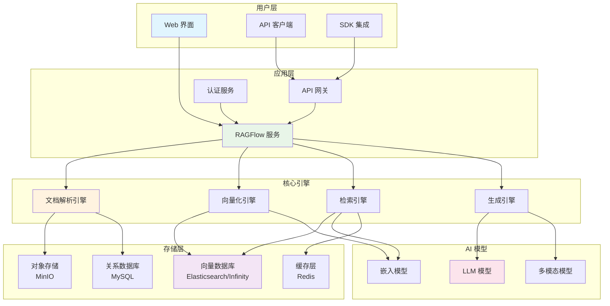
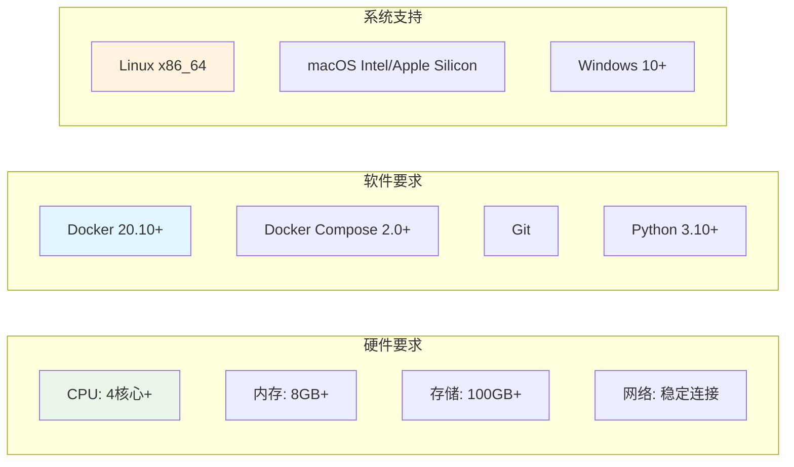
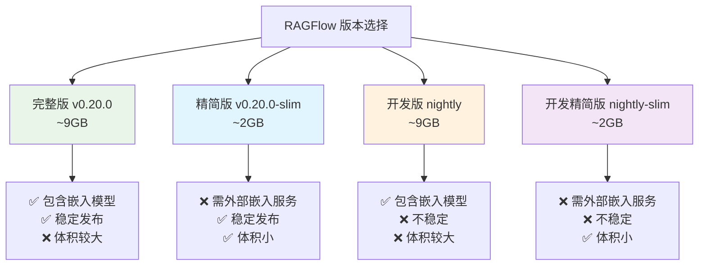
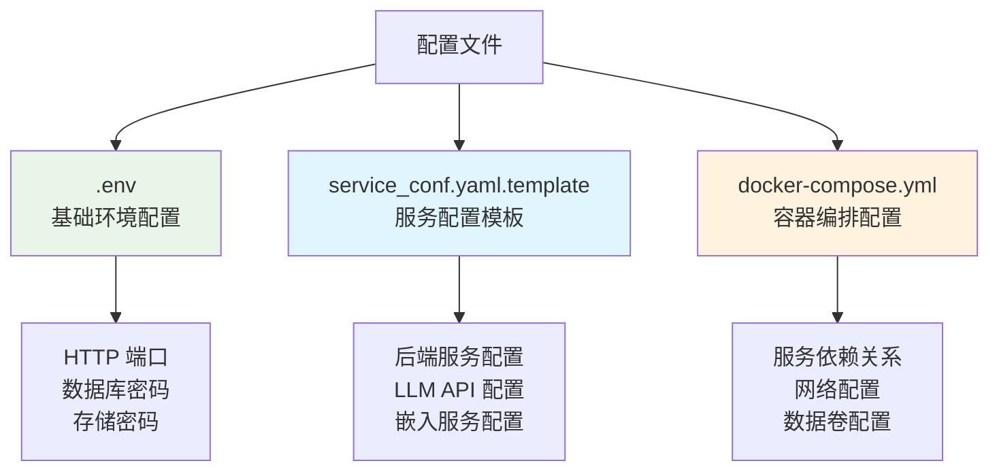
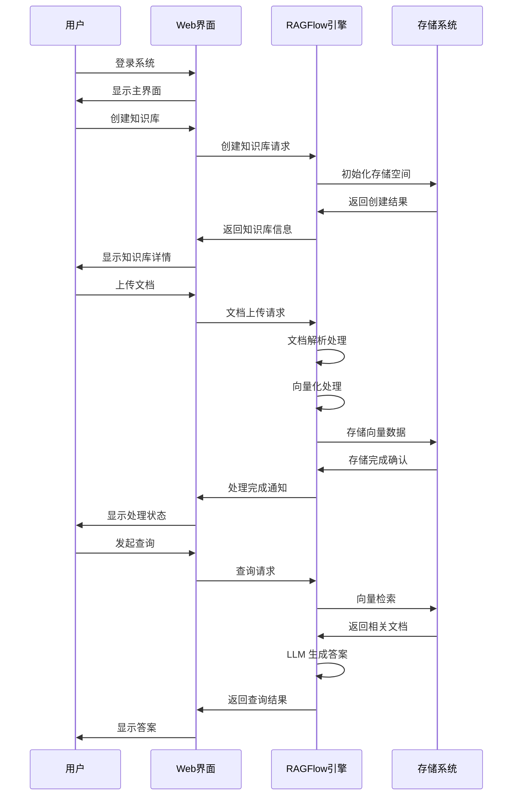
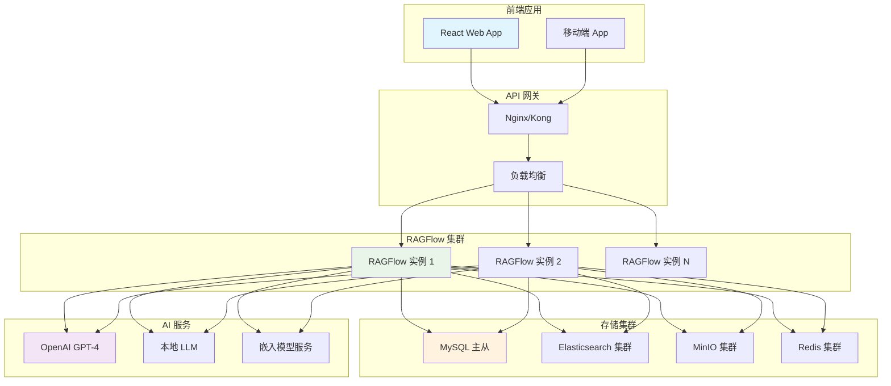
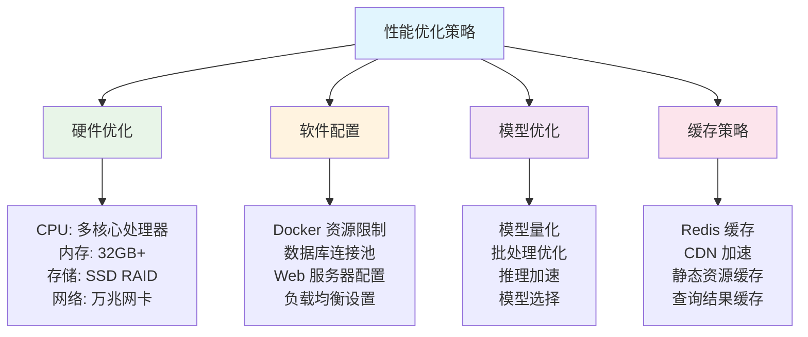
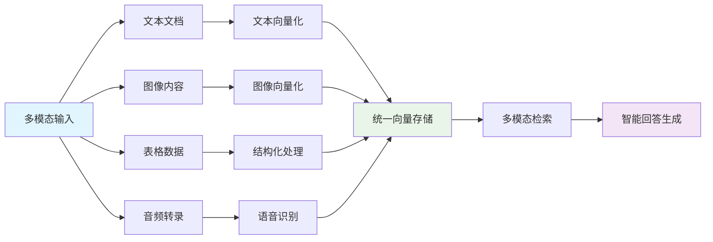

# RAGFlow 完整指南：基于深度文档理解的开源RAG引擎

## 项目概述

RAGFlow 是一个基于深度文档理解的开源 RAG（检索增强生成）引擎，由 InfiniFlow 团队开发。它提供了强大的文档解析、知识检索和生成能力，支持多种文档格式，并集成了先进的 AI 模型。

<div style="text-align: center; margin: 20px 0;">
  <svg width="600" height="300" xmlns="http://www.w3.org/2000/svg">
    <style>
      .title { font-family: Arial; font-size: 24px; font-weight: bold; fill: #2C3E50; text-anchor: middle; }
      .subtitle { font-family: Arial; font-size: 16px; fill: #7F8C8D; text-anchor: middle; }
      .logo { font-family: Arial; font-size: 36px; font-weight: bold; fill: #E74C3C; text-anchor: middle; }
      .highlight { fill: #3498DB; }
      .badge { font-family: Arial; font-size: 12px; fill: #FFFFFF; font-weight: bold; text-anchor: middle; }
      .feature { font-family: Arial; font-size: 14px; fill: #2C3E50; }
    </style>
    <rect width="600" height="300" fill="#ECF0F1" rx="12" ry="12" stroke="#BDC3C7" stroke-width="2"/>
    <text x="300" y="60" class="logo">RAG<tspan class="highlight">Flow</tspan></text>
    <text x="300" y="90" class="title">开源 RAG 引擎</text>
    <text x="300" y="115" class="subtitle">基于深度文档理解的检索增强生成</text>
    
    <!-- GitHub Stats -->
    <rect x="50" y="140" width="80" height="25" fill="#2ECC71" rx="12" ry="12"/>
    <text x="90" y="157" class="badge">61.5k ⭐</text>
    
    <rect x="150" y="140" width="80" height="25" fill="#3498DB" rx="12" ry="12"/>
    <text x="190" y="157" class="badge">6.2k Forks</text>
    
    <rect x="250" y="140" width="100" height="25" fill="#E74C3C" rx="12" ry="12"/>
    <text x="300" y="157" class="badge">Apache-2.0</text>
    
    <!-- Key Features -->
    <text x="50" y="200" class="feature">🤖 深度文档理解</text>
    <text x="200" y="200" class="feature">🔍 智能检索</text>
    <text x="350" y="200" class="feature">⚡ 高性能引擎</text>
    <text x="500" y="200" class="feature">🌐 API 支持</text>
    
    <text x="50" y="230" class="feature">📄 多格式支持</text>
    <text x="200" y="230" class="feature">🔧 易于部署</text>
    <text x="350" y="230" class="feature">🎯 精准答案</text>
    <text x="500" y="230" class="feature">🛠️ 可扩展</text>
    
    <text x="300" y="270" class="subtitle">官网: ragflow.io</text>
  </svg>
</div>

## 核心特性

RAGFlow 提供了全面的 RAG 解决方案，具有以下核心特性：

- **🧠 深度文档理解**：支持复杂文档结构的智能解析
- **📚 多格式支持**：PDF、Word、PPT、Excel、图像等多种格式
- **🔍 精准检索**：基于语义的智能文档检索
- **⚡ 高性能**：优化的向量检索和生成算法
- **🔌 API 集成**：完整的 RESTful API 支持
- **🌐 Web 界面**：直观的管理界面
- **🎯 多模态**：支持文本、图像等多模态内容

## 系统架构



## 安装部署

### 系统要求

在开始安装之前，请确保您的系统满足以下要求：



### Docker 快速部署

#### 1. 环境准备

首先确保 Docker 和 Docker Compose 已正确安装：

```bash
# 检查 Docker 版本
docker --version
docker-compose --version

# 设置 vm.max_map_count（Linux 系统）
echo "vm.max_map_count=262144" | sudo tee -a /etc/sysctl.conf
sudo sysctl -p
```

#### 2. 克隆项目

```bash
git clone https://github.com/infiniflow/ragflow.git
cd ragflow
```

#### 3. 选择部署版本

RAGFlow 提供多个版本选择：



#### 4. 启动服务

```bash
cd ragflow/docker

# 使用 CPU 进行嵌入和文档处理（默认）
docker compose -f docker-compose.yml up -d

# 使用 GPU 加速嵌入和文档处理
# docker compose -f docker-compose-gpu.yml up -d
```

#### 5. 验证部署

```bash
# 检查服务状态
docker logs -f ragflow-server

# 成功启动的标志
#      ____   ___    ______ ______ __  
#     / __ \ /   |  / ____// ____// /____  _      __  
#    / /_/ // /| | / / __ / /_   / // __ \| | /| / /  
#   / _, _// ___ |/ /_/ // __/  / // /_/ /| |/ |/ /  
#  /_/ |_|/_/  |_|\____//_/    /_/ \____/ |__/|__/  
# * Running on all addresses (0.0.0.0)
```

### 自定义构建

#### 构建精简版镜像

```bash
git clone https://github.com/infiniflow/ragflow.git
cd ragflow/
docker build --platform linux/amd64 --build-arg LIGHTEN=1 -f Dockerfile -t infiniflow/ragflow:nightly-slim .
```

#### 构建完整版镜像

```bash
git clone https://github.com/infiniflow/ragflow.git
cd ragflow/
docker build --platform linux/amd64 -f Dockerfile -t infiniflow/ragflow:nightly .
```

## 配置说明

### 核心配置文件

RAGFlow 的配置主要通过以下文件管理：



### 环境变量配置

关键环境变量说明：

```bash
# .env 文件示例
SVR_HTTP_PORT=80                    # HTTP 服务端口
MYSQL_PASSWORD=infiniflow123       # MySQL 数据库密码
MINIO_PASSWORD=infiniflow123       # MinIO 对象存储密码
DOC_ENGINE=elasticsearch           # 文档引擎选择
```

### LLM 配置

在 `service_conf.yaml.template` 中配置 LLM 服务：

```yaml
# LLM 配置示例
user_default_llm:
  "factory": "OpenAI"              # LLM 提供商
  "api_key": "YOUR_API_KEY"        # API 密钥
  "api_base": "https://api.openai.com/v1"  # API 基础URL
  "llm_name": "gpt-3.5-turbo"      # 模型名称
```

### 存储引擎切换

切换到 Infinity 向量引擎：

```bash
# 1. 停止所有容器
docker compose -f docker/docker-compose.yml down -v

# 2. 修改 docker/.env
DOC_ENGINE=infinity

# 3. 重新启动
docker compose -f docker-compose.yml up -d
```

## 使用指南

### Web 界面使用

#### 1. 访问系统

部署完成后，在浏览器中访问：

```
http://YOUR_SERVER_IP
```

#### 2. 知识库管理流程



#### 3. 文档管理操作

- **上传文档**：支持拖拽上传，多种格式
- **文档预处理**：自动解析和分块
- **向量化**：自动生成文档向量
- **索引管理**：查看和管理文档索引

### API 使用

#### 认证配置

```python
import requests

# API 基础配置
BASE_URL = "http://your-ragflow-server"
API_KEY = "your-api-key"

headers = {
    "Authorization": f"Bearer {API_KEY}",
    "Content-Type": "application/json"
}
```

#### 知识库操作

```python
# 创建知识库
def create_knowledge_base(name, description=""):
    url = f"{BASE_URL}/api/v1/knowledge-bases"
    data = {
        "name": name,
        "description": description
    }
    response = requests.post(url, json=data, headers=headers)
    return response.json()

# 获取知识库列表
def list_knowledge_bases():
    url = f"{BASE_URL}/api/v1/knowledge-bases"
    response = requests.get(url, headers=headers)
    return response.json()
```

#### 文档操作

```python
# 上传文档
def upload_document(kb_id, file_path):
    url = f"{BASE_URL}/api/v1/knowledge-bases/{kb_id}/documents"
    
    with open(file_path, 'rb') as f:
        files = {'file': f}
        response = requests.post(url, files=files, headers=headers)
    
    return response.json()

# 查询文档状态
def get_document_status(kb_id, doc_id):
    url = f"{BASE_URL}/api/v1/knowledge-bases/{kb_id}/documents/{doc_id}"
    response = requests.get(url, headers=headers)
    return response.json()
```

#### RAG 查询

```python
# 执行 RAG 查询
def rag_query(kb_id, question, top_k=5):
    url = f"{BASE_URL}/api/v1/knowledge-bases/{kb_id}/query"
    data = {
        "question": question,
        "top_k": top_k,
        "with_references": True
    }
    response = requests.post(url, json=data, headers=headers)
    return response.json()

# 流式查询
def stream_query(kb_id, question):
    url = f"{BASE_URL}/api/v1/knowledge-bases/{kb_id}/stream-query"
    data = {
        "question": question,
        "stream": True
    }
    
    with requests.post(url, json=data, headers=headers, stream=True) as response:
        for line in response.iter_lines():
            if line:
                yield line.decode('utf-8')
```

## 完整示例

### 企业知识问答系统

以下是一个完整的企业知识问答系统示例：

#### 1. 系统架构



#### 2. Python 集成示例

```python
import asyncio
import aiohttp
from typing import List, Dict, Optional

class RAGFlowClient:
    def __init__(self, base_url: str, api_key: str):
        self.base_url = base_url.rstrip('/')
        self.api_key = api_key
        self.session = None
    
    async def __aenter__(self):
        self.session = aiohttp.ClientSession(
            headers={"Authorization": f"Bearer {self.api_key}"}
        )
        return self
    
    async def __aexit__(self, exc_type, exc_val, exc_tb):
        if self.session:
            await self.session.close()
    
    async def create_knowledge_base(self, name: str, description: str = "") -> Dict:
        """创建知识库"""
        url = f"{self.base_url}/api/v1/knowledge-bases"
        data = {"name": name, "description": description}
        
        async with self.session.post(url, json=data) as response:
            return await response.json()
    
    async def upload_documents(self, kb_id: str, file_paths: List[str]) -> List[Dict]:
        """批量上传文档"""
        results = []
        
        for file_path in file_paths:
            url = f"{self.base_url}/api/v1/knowledge-bases/{kb_id}/documents"
            
            with open(file_path, 'rb') as f:
                data = aiohttp.FormData()
                data.add_field('file', f)
                
                async with self.session.post(url, data=data) as response:
                    result = await response.json()
                    results.append(result)
        
        return results
    
    async def wait_for_processing(self, kb_id: str, doc_id: str, timeout: int = 300):
        """等待文档处理完成"""
        import time
        start_time = time.time()
        
        while time.time() - start_time < timeout:
            url = f"{self.base_url}/api/v1/knowledge-bases/{kb_id}/documents/{doc_id}"
            
            async with self.session.get(url) as response:
                doc_info = await response.json()
                
                if doc_info.get('status') == 'completed':
                    return True
                elif doc_info.get('status') == 'failed':
                    raise Exception(f"Document processing failed: {doc_info.get('error')}")
            
            await asyncio.sleep(5)
        
        raise TimeoutError("Document processing timeout")
    
    async def query(self, kb_id: str, question: str, **kwargs) -> Dict:
        """执行查询"""
        url = f"{self.base_url}/api/v1/knowledge-bases/{kb_id}/query"
        data = {
            "question": question,
            "top_k": kwargs.get('top_k', 5),
            "with_references": kwargs.get('with_references', True),
            "temperature": kwargs.get('temperature', 0.7)
        }
        
        async with self.session.post(url, json=data) as response:
            return await response.json()

# 使用示例
async def main():
    async with RAGFlowClient("http://localhost", "your-api-key") as client:
        # 1. 创建知识库
        kb = await client.create_knowledge_base(
            name="企业政策库",
            description="公司内部政策和制度文档"
        )
        kb_id = kb['id']
        
        # 2. 上传文档
        documents = [
            "/path/to/employee_handbook.pdf",
            "/path/to/hr_policies.docx",
            "/path/to/it_guidelines.pdf"
        ]
        
        upload_results = await client.upload_documents(kb_id, documents)
        
        # 3. 等待文档处理完成
        for result in upload_results:
            doc_id = result['id']
            await client.wait_for_processing(kb_id, doc_id)
            print(f"Document {doc_id} processed successfully")
        
        # 4. 执行查询
        questions = [
            "员工休假政策是什么？",
            "如何申请设备采购？",
            "公司的工作时间安排是怎样的？"
        ]
        
        for question in questions:
            result = await client.query(kb_id, question)
            print(f"问题: {question}")
            print(f"答案: {result['answer']}")
            print(f"参考文档: {[ref['title'] for ref in result['references']]}")
            print("-" * 50)

if __name__ == "__main__":
    asyncio.run(main())
```

#### 3. 前端集成示例

```javascript
// React 组件示例
import React, { useState, useEffect } from 'react';
import axios from 'axios';

const RAGFlowChat = ({ knowledgeBaseId, apiKey }) => {
  const [messages, setMessages] = useState([]);
  const [inputValue, setInputValue] = useState('');
  const [loading, setLoading] = useState(false);

  const apiClient = axios.create({
    baseURL: 'http://localhost',
    headers: {
      'Authorization': `Bearer ${apiKey}`,
      'Content-Type': 'application/json'
    }
  });

  const sendMessage = async () => {
    if (!inputValue.trim()) return;

    const userMessage = { type: 'user', content: inputValue };
    setMessages(prev => [...prev, userMessage]);
    setInputValue('');
    setLoading(true);

    try {
      const response = await apiClient.post(
        `/api/v1/knowledge-bases/${knowledgeBaseId}/query`,
        {
          question: inputValue,
          top_k: 5,
          with_references: true
        }
      );

      const assistantMessage = {
        type: 'assistant',
        content: response.data.answer,
        references: response.data.references
      };

      setMessages(prev => [...prev, assistantMessage]);
    } catch (error) {
      console.error('Query failed:', error);
      const errorMessage = {
        type: 'error',
        content: '抱歉，查询失败了，请稍后重试。'
      };
      setMessages(prev => [...prev, errorMessage]);
    } finally {
      setLoading(false);
    }
  };

  return (
    <div className="ragflow-chat">
      <div className="messages">
        {messages.map((message, index) => (
          <div key={index} className={`message ${message.type}`}>
            <div className="content">{message.content}</div>
            {message.references && (
              <div className="references">
                <h4>参考文档：</h4>
                <ul>
                  {message.references.map((ref, refIndex) => (
                    <li key={refIndex}>
                      <strong>{ref.title}</strong> - 相似度: {ref.score.toFixed(2)}
                    </li>
                  ))}
                </ul>
              </div>
            )}
          </div>
        ))}
        {loading && <div className="loading">正在思考中...</div>}
      </div>
      
      <div className="input-area">
        <input
          type="text"
          value={inputValue}
          onChange={(e) => setInputValue(e.target.value)}
          onKeyPress={(e) => e.key === 'Enter' && sendMessage()}
          placeholder="请输入您的问题..."
          disabled={loading}
        />
        <button onClick={sendMessage} disabled={loading || !inputValue.trim()}>
          发送
        </button>
      </div>
    </div>
  );
};

export default RAGFlowChat;
```

## 性能优化

### 系统调优



### 监控与运维

#### 健康检查

```bash
# 检查服务状态
docker ps
docker logs ragflow-server

# 检查资源使用
docker stats

# 检查存储空间
df -h
docker system df
```

#### 性能监控

```python
# 监控脚本示例
import time
import psutil
import requests
from datetime import datetime

def monitor_ragflow():
    while True:
        # 系统资源监控
        cpu_percent = psutil.cpu_percent()
        memory_percent = psutil.virtual_memory().percent
        disk_percent = psutil.disk_usage('/').percent
        
        # 服务健康检查
        try:
            response = requests.get('http://localhost/health', timeout=5)
            service_status = 'healthy' if response.status_code == 200 else 'unhealthy'
        except:
            service_status = 'unreachable'
        
        # 记录监控数据
        timestamp = datetime.now().strftime('%Y-%m-%d %H:%M:%S')
        print(f"[{timestamp}] CPU: {cpu_percent}%, Memory: {memory_percent}%, "
              f"Disk: {disk_percent}%, Service: {service_status}")
        
        time.sleep(60)

if __name__ == "__main__":
    monitor_ragflow()
```

## 故障排除

### 常见问题

#### 1. 容器启动失败

```bash
# 检查端口占用
netstat -tulpn | grep :80

# 检查磁盘空间
df -h

# 检查内存
free -h

# 重置容器
docker compose down -v
docker compose up -d
```

#### 2. 文档处理失败

```bash
# 检查文档格式支持
# 查看处理日志
docker logs ragflow-server | grep ERROR

# 检查存储空间
docker exec -it ragflow-minio ls -la /data
```

#### 3. 查询响应慢

```bash
# 检查数据库性能
docker exec -it ragflow-mysql mysql -u root -p -e "SHOW PROCESSLIST;"

# 检查 Elasticsearch 状态
curl -X GET "localhost:9200/_cluster/health?pretty"

# 检查缓存命中率
docker exec -it ragflow-redis redis-cli info stats
```

### 日志分析

```bash
# 查看详细日志
docker logs -f --tail 100 ragflow-server

# 导出日志进行分析
docker logs ragflow-server > ragflow.log

# 实时监控错误日志
docker logs -f ragflow-server | grep -i error
```

## 高级特性

### 多模态支持

RAGFlow 支持处理多种模态的内容：



### 企业级功能

- **用户权限管理**：细粒度的访问控制
- **审计日志**：完整的操作记录
- **数据备份**：自动化备份和恢复
- **监控告警**：实时性能监控
- **负载均衡**：高可用部署方案

## 最佳实践

### 1. 文档准备

- **格式规范**：使用标准的文档格式
- **内容结构**：保持清晰的层次结构
- **文件大小**：单个文件建议不超过 100MB
- **批量处理**：合理安排文档上传时间

### 2. 系统部署

- **资源规划**：根据数据量合理配置资源
- **网络安全**：配置防火墙和 SSL 证书
- **数据备份**：建立定期备份机制
- **监控告警**：设置关键指标监控

### 3. 性能优化

- **索引管理**：定期优化向量索引
- **缓存策略**：合理使用缓存机制
- **查询优化**：优化查询参数设置
- **资源监控**：持续监控系统性能

## 总结

RAGFlow 是一个功能强大的开源 RAG 引擎，提供了完整的文档理解和知识问答解决方案。通过本指南，您可以：

1. **快速部署**：使用 Docker 快速搭建 RAGFlow 服务
2. **灵活配置**：根据需求调整系统配置
3. **API 集成**：将 RAGFlow 集成到现有系统中
4. **性能优化**：通过调优获得最佳性能
5. **故障排除**：快速解决常见问题

RAGFlow 的开源特性和强大功能使其成为构建企业级知识问答系统的理想选择。随着 AI 技术的不断发展，RAGFlow 将继续演进，为用户提供更加智能和高效的解决方案。

## 参考资源

- **[RAGFlow GitHub 仓库](https://github.com/infiniflow/ragflow)**
- **[官方网站](https://ragflow.io)**
- **[在线文档](https://ragflow.io/docs)**
- **[社区论坛](https://github.com/infiniflow/ragflow/discussions)**
- **[问题反馈](https://github.com/infiniflow/ragflow/issues)**