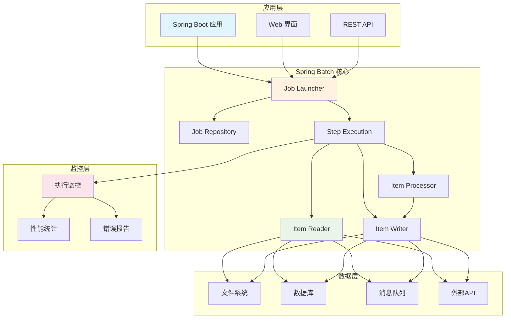

# Spring Batch 完整指南：企业级批处理框架

## 项目概述

[Spring Batch](https://github.com/spring-projects/spring-batch) 是Spring框架的一个扩展，专门用于构建企业级批处理应用程序。它提供了强大的批处理功能，包括任务调度、事务管理、错误处理、监控和可扩展性，是处理大量数据、ETL操作和自动化任务的理想选择。

<div style="text-align: center; margin: 20px 0;">
  <svg width="600" height="300" xmlns="http://www.w3.org/2000/svg">
    <style>
      .title { font-family: Arial; font-size: 24px; font-weight: bold; fill: #2C3E50; text-anchor: middle; }
      .subtitle { font-family: Arial; font-size: 16px; fill: #7F8C8D; text-anchor: middle; }
      .logo { font-family: Arial; font-size: 36px; font-weight: bold; fill: #6DB33F; text-anchor: middle; }
      .highlight { fill: #E74C3C; }
      .badge { font-family: Arial; font-size: 12px; fill: #FFFFFF; font-weight: bold; text-anchor: middle; }
      .feature { font-family: Arial; font-size: 14px; fill: #2C3E50; }
    </style>
    <rect width="600" height="300" fill="#ECF0F1" rx="12" ry="12" stroke="#BDC3C7" stroke-width="2"/>
    <text x="300" y="60" class="logo">Spring<tspan class="highlight">Batch</tspan></text>
    <text x="300" y="90" class="title">企业级批处理框架</text>
    <text x="300" y="115" class="subtitle">强大的数据处理和自动化解决方案</text>
    
    <!-- GitHub Stats -->
    <rect x="50" y="140" width="80" height="25" fill="#2ECC71" rx="12" ry="12"/>
    <text x="90" y="157" class="badge">2.1k ⭐</text>
    
    <rect x="150" y="140" width="80" height="25" fill="#3498DB" rx="12" ry="12"/>
    <text x="190" y="157" class="badge">1.8k Forks</text>
    
    <rect x="250" y="140" width="100" height="25" fill="#E74C3C" rx="12" ry="12"/>
    <text x="300" y="157" class="badge">Apache-2.0</text>
    
    <!-- Key Features -->
    <text x="50" y="200" class="feature">📊 数据处理</text>
    <text x="200" y="200" class="feature">⚡ 高性能</text>
    <text x="350" y="200" class="feature">🔧 事务管理</text>
    <text x="500" y="200" class="feature">📱 可扩展</text>
    
    <text x="50" y="230" class="feature">🔄 任务调度</text>
    <text x="200" y="230" class="feature">🎯 错误处理</text>
    <text x="350" y="230" class="feature">📈 监控统计</text>
    <text x="500" y="230" class="feature">🛠️ 企业级</text>
    
    <text x="300" y="270" class="subtitle">官网: spring.io/projects/spring-batch</text>
  </svg>
</div>

## 核心特性

Spring Batch 提供了全面的批处理解决方案，具有以下核心特性：

- **📊 数据处理**：支持文件、数据库、消息队列等多种数据源
- **⚡ 高性能**：并行处理、分片处理、异步执行
- **🔧 事务管理**：完整的事务支持和回滚机制
- **🔄 任务调度**：与Spring Scheduler、Quartz等集成
- **🎯 错误处理**：重试机制、跳过策略、异常处理
- **📈 监控统计**：详细的执行统计和监控
- **🛠️ 企业级**：高可用性、可扩展性、安全性
- **📱 可扩展**：插件化架构，易于扩展

## 系统架构



## 安装和配置

### Maven 依赖

```xml
<dependency>
    <groupId>org.springframework.boot</groupId>
    <artifactId>spring-boot-starter-batch</artifactId>
</dependency>

<dependency>
    <groupId>org.springframework.boot</groupId>
    <artifactId>spring-boot-starter-data-jpa</artifactId>
</dependency>

<dependency>
    <groupId>com.h2database</groupId>
    <artifactId>h2</artifactId>
    <scope>runtime</scope>
</dependency>
```

### Gradle 依赖

```gradle
implementation 'org.springframework.boot:spring-boot-starter-batch'
implementation 'org.springframework.boot:spring-boot-starter-data-jpa'
runtimeOnly 'com.h2database:h2'
```

### 基础配置

```yaml
# application.yml
spring:
  batch:
    job:
      enabled: false  # 禁用自动启动
    jdbc:
      initialize-schema: always
  datasource:
    url: jdbc:h2:mem:testdb
    driver-class-name: org.h2.Driver
    username: sa
    password: 
  h2:
    console:
      enabled: true
```

## 基础使用

### 简单的批处理作业

```java
@Configuration
@EnableBatchProcessing
public class SimpleBatchConfig {

    @Autowired
    private JobBuilderFactory jobBuilderFactory;

    @Autowired
    private StepBuilderFactory stepBuilderFactory;

    @Bean
    public Job simpleJob() {
        return jobBuilderFactory.get("simpleJob")
                .start(simpleStep())
                .build();
    }

    @Bean
    public Step simpleStep() {
        return stepBuilderFactory.get("simpleStep")
                .<String, String>chunk(10)
                .reader(reader())
                .processor(processor())
                .writer(writer())
                .build();
    }

    @Bean
    public ItemReader<String> reader() {
        return new ListItemReader<>(Arrays.asList("item1", "item2", "item3"));
    }

    @Bean
    public ItemProcessor<String, String> processor() {
        return item -> "processed_" + item;
    }

    @Bean
    public ItemWriter<String> writer() {
        return items -> {
            for (String item : items) {
                System.out.println("Writing: " + item);
            }
        };
    }
}
```

### 文件处理作业

```java
@Configuration
@EnableBatchProcessing
public class FileProcessingConfig {

    @Autowired
    private JobBuilderFactory jobBuilderFactory;

    @Autowired
    private StepBuilderFactory stepBuilderFactory;

    @Bean
    public Job fileProcessingJob() {
        return jobBuilderFactory.get("fileProcessingJob")
                .start(fileProcessingStep())
                .build();
    }

    @Bean
    public Step fileProcessingStep() {
        return stepBuilderFactory.get("fileProcessingStep")
                .<Person, Person>chunk(100)
                .reader(fileReader())
                .processor(personProcessor())
                .writer(fileWriter())
                .build();
    }

    @Bean
    public FlatFileItemReader<Person> fileReader() {
        return new FlatFileItemReaderBuilder<Person>()
                .name("personItemReader")
                .resource(new ClassPathResource("data/persons.csv"))
                .delimited()
                .names("firstName", "lastName", "email")
                .fieldSetMapper(new BeanWrapperFieldSetMapper<>() {{
                    setTargetType(Person.class);
                }})
                .build();
    }

    @Bean
    public ItemProcessor<Person, Person> personProcessor() {
        return person -> {
            person.setEmail(person.getEmail().toLowerCase());
            return person;
        };
    }

    @Bean
    public FlatFileItemWriter<Person> fileWriter() {
        return new FlatFileItemWriterBuilder<Person>()
                .name("personItemWriter")
                .resource(new FileSystemResource("output/processed-persons.csv"))
                .delimited()
                .names("firstName", "lastName", "email")
                .build();
    }
}
```

## 高级功能

### 数据库批处理

```java
@Configuration
@EnableBatchProcessing
public class DatabaseBatchConfig {

    @Autowired
    private JobBuilderFactory jobBuilderFactory;

    @Autowired
    private StepBuilderFactory stepBuilderFactory;

    @Autowired
    private DataSource dataSource;

    @Bean
    public Job databaseJob() {
        return jobBuilderFactory.get("databaseJob")
                .start(databaseStep())
                .build();
    }

    @Bean
    public Step databaseStep() {
        return stepBuilderFactory.get("databaseStep")
                .<User, User>chunk(50)
                .reader(databaseReader())
                .processor(userProcessor())
                .writer(databaseWriter())
                .build();
    }

    @Bean
    public JdbcCursorItemReader<User> databaseReader() {
        return new JdbcCursorItemReaderBuilder<User>()
                .name("userReader")
                .dataSource(dataSource)
                .sql("SELECT id, name, email FROM users WHERE status = 'ACTIVE'")
                .rowMapper(new BeanPropertyRowMapper<>(User.class))
                .build();
    }

    @Bean
    public ItemProcessor<User, User> userProcessor() {
        return user -> {
            user.setEmail(user.getEmail().toLowerCase());
            user.setProcessedDate(LocalDateTime.now());
            return user;
        };
    }

    @Bean
    public JdbcBatchItemWriter<User> databaseWriter() {
        return new JdbcBatchItemWriterBuilder<User>()
                .name("userWriter")
                .dataSource(dataSource)
                .sql("UPDATE users SET email = :email, processed_date = :processedDate WHERE id = :id")
                .itemSqlParameterSourceProvider(new BeanPropertyItemSqlParameterSourceProvider<>())
                .build();
    }
}
```

### 多步骤作业

```java
@Configuration
@EnableBatchProcessing
public class MultiStepJobConfig {

    @Autowired
    private JobBuilderFactory jobBuilderFactory;

    @Autowired
    private StepBuilderFactory stepBuilderFactory;

    @Bean
    public Job multiStepJob() {
        return jobBuilderFactory.get("multiStepJob")
                .start(step1())
                .next(step2())
                .next(step3())
                .build();
    }

    @Bean
    public Step step1() {
        return stepBuilderFactory.get("step1")
                .tasklet((contribution, chunkContext) -> {
                    System.out.println("执行步骤1");
                    return RepeatStatus.FINISHED;
                })
                .build();
    }

    @Bean
    public Step step2() {
        return stepBuilderFactory.get("step2")
                .<String, String>chunk(10)
                .reader(reader())
                .processor(processor())
                .writer(writer())
                .build();
    }

    @Bean
    public Step step3() {
        return stepBuilderFactory.get("step3")
                .tasklet((contribution, chunkContext) -> {
                    System.out.println("执行步骤3");
                    return RepeatStatus.FINISHED;
                })
                .build();
    }

    @Bean
    public ItemReader<String> reader() {
        return new ListItemReader<>(Arrays.asList("data1", "data2", "data3"));
    }

    @Bean
    public ItemProcessor<String, String> processor() {
        return item -> "processed_" + item;
    }

    @Bean
    public ItemWriter<String> writer() {
        return items -> {
            for (String item : items) {
                System.out.println("Writing: " + item);
            }
        };
    }
}
```

### 条件执行

```java
@Configuration
@EnableBatchProcessing
public class ConditionalJobConfig {

    @Autowired
    private JobBuilderFactory jobBuilderFactory;

    @Autowired
    private StepBuilderFactory stepBuilderFactory;

    @Bean
    public Job conditionalJob() {
        return jobBuilderFactory.get("conditionalJob")
                .start(step1())
                .on("COMPLETED")
                .to(step2())
                .on("FAILED")
                .to(errorStep())
                .from(step2())
                .on("*")
                .to(step3())
                .build();
    }

    @Bean
    public Step step1() {
        return stepBuilderFactory.get("step1")
                .tasklet((contribution, chunkContext) -> {
                    System.out.println("步骤1执行");
                    return RepeatStatus.FINISHED;
                })
                .build();
    }

    @Bean
    public Step step2() {
        return stepBuilderFactory.get("step2")
                .tasklet((contribution, chunkContext) -> {
                    // 模拟失败
                    throw new RuntimeException("步骤2失败");
                })
                .build();
    }

    @Bean
    public Step step3() {
        return stepBuilderFactory.get("step3")
                .tasklet((contribution, chunkContext) -> {
                    System.out.println("步骤3执行");
                    return RepeatStatus.FINISHED;
                })
                .build();
    }

    @Bean
    public Step errorStep() {
        return stepBuilderFactory.get("errorStep")
                .tasklet((contribution, chunkContext) -> {
                    System.out.println("错误处理步骤");
                    return RepeatStatus.FINISHED;
                })
                .build();
    }
}
```

## 错误处理和重试

### 重试机制

```java
@Configuration
@EnableBatchProcessing
public class RetryConfig {

    @Autowired
    private JobBuilderFactory jobBuilderFactory;

    @Autowired
    private StepBuilderFactory stepBuilderFactory;

    @Bean
    public Job retryJob() {
        return jobBuilderFactory.get("retryJob")
                .start(retryStep())
                .build();
    }

    @Bean
    public Step retryStep() {
        return stepBuilderFactory.get("retryStep")
                .<String, String>chunk(10)
                .reader(reader())
                .processor(retryProcessor())
                .writer(writer())
                .faultTolerant()
                .retry(RetryableException.class)
                .retryLimit(3)
                .backOffPolicy(new ExponentialBackOffPolicy())
                .build();
    }

    @Bean
    public ItemReader<String> reader() {
        return new ListItemReader<>(Arrays.asList("item1", "item2", "item3"));
    }

    @Bean
    public ItemProcessor<String, String> retryProcessor() {
        return item -> {
            if (Math.random() < 0.3) {
                throw new RetryableException("随机错误");
            }
            return "processed_" + item;
        };
    }

    @Bean
    public ItemWriter<String> writer() {
        return items -> {
            for (String item : items) {
                System.out.println("Writing: " + item);
            }
        };
    }
}
```

### 跳过策略

```java
@Configuration
@EnableBatchProcessing
public class SkipConfig {

    @Autowired
    private JobBuilderFactory jobBuilderFactory;

    @Autowired
    private StepBuilderFactory stepBuilderFactory;

    @Bean
    public Job skipJob() {
        return jobBuilderFactory.get("skipJob")
                .start(skipStep())
                .build();
    }

    @Bean
    public Step skipStep() {
        return stepBuilderFactory.get("skipStep")
                .<String, String>chunk(10)
                .reader(reader())
                .processor(skipProcessor())
                .writer(writer())
                .faultTolerant()
                .skip(SkipableException.class)
                .skipLimit(5)
                .build();
    }

    @Bean
    public ItemReader<String> reader() {
        return new ListItemReader<>(Arrays.asList("item1", "item2", "item3"));
    }

    @Bean
    public ItemProcessor<String, String> skipProcessor() {
        return item -> {
            if (item.equals("item2")) {
                throw new SkipableException("跳过item2");
            }
            return "processed_" + item;
        };
    }

    @Bean
    public ItemWriter<String> writer() {
        return items -> {
            for (String item : items) {
                System.out.println("Writing: " + item);
            }
        };
    }
}
```

## 监控和统计

### 作业执行监控

```java
@Component
public class JobExecutionListener implements JobExecutionListener {

    private static final Logger logger = LoggerFactory.getLogger(JobExecutionListener.class);

    @Override
    public void beforeJob(JobExecution jobExecution) {
        logger.info("作业开始执行: {}", jobExecution.getJobInstance().getJobName());
        logger.info("作业参数: {}", jobExecution.getJobParameters());
    }

    @Override
    public void afterJob(JobExecution jobExecution) {
        logger.info("作业执行完成: {}", jobExecution.getJobInstance().getJobName());
        logger.info("执行状态: {}", jobExecution.getStatus());
        logger.info("开始时间: {}", jobExecution.getStartTime());
        logger.info("结束时间: {}", jobExecution.getEndTime());
        logger.info("执行时间: {} ms", 
            jobExecution.getEndTime().getTime() - jobExecution.getStartTime().getTime());
    }
}
```

### 步骤执行监控

```java
@Component
public class StepExecutionListener implements StepExecutionListener {

    private static final Logger logger = LoggerFactory.getLogger(StepExecutionListener.class);

    @Override
    public void beforeStep(StepExecution stepExecution) {
        logger.info("步骤开始执行: {}", stepExecution.getStepName());
    }

    @Override
    public ExitStatus afterStep(StepExecution stepExecution) {
        logger.info("步骤执行完成: {}", stepExecution.getStepName());
        logger.info("读取数量: {}", stepExecution.getReadCount());
        logger.info("写入数量: {}", stepExecution.getWriteCount());
        logger.info("跳过数量: {}", stepExecution.getSkipCount());
        logger.info("提交数量: {}", stepExecution.getCommitCount());
        
        return stepExecution.getExitStatus();
    }
}
```

### 自定义监控指标

```java
@Component
public class CustomMetrics {

    private final MeterRegistry meterRegistry;

    public CustomMetrics(MeterRegistry meterRegistry) {
        this.meterRegistry = meterRegistry;
    }

    public void recordProcessedItems(String jobName, String stepName, int count) {
        Counter.builder("batch.items.processed")
                .tag("job", jobName)
                .tag("step", stepName)
                .register(meterRegistry)
                .increment(count);
    }

    public void recordProcessingTime(String jobName, String stepName, long timeMs) {
        Timer.builder("batch.processing.time")
                .tag("job", jobName)
                .tag("step", stepName)
                .register(meterRegistry)
                .record(timeMs, TimeUnit.MILLISECONDS);
    }

    public void recordError(String jobName, String stepName, String errorType) {
        Counter.builder("batch.errors")
                .tag("job", jobName)
                .tag("step", stepName)
                .tag("type", errorType)
                .register(meterRegistry)
                .increment();
    }
}
```

## 性能优化

### 并行处理

```java
@Configuration
@EnableBatchProcessing
public class ParallelJobConfig {

    @Autowired
    private JobBuilderFactory jobBuilderFactory;

    @Autowired
    private StepBuilderFactory stepBuilderFactory;

    @Bean
    public Job parallelJob() {
        return jobBuilderFactory.get("parallelJob")
                .start(step1())
                .split(taskExecutor())
                .add(step2(), step3())
                .next(step4())
                .build();
    }

    @Bean
    public TaskExecutor taskExecutor() {
        ThreadPoolTaskExecutor executor = new ThreadPoolTaskExecutor();
        executor.setCorePoolSize(4);
        executor.setMaxPoolSize(8);
        executor.setQueueCapacity(100);
        executor.setThreadNamePrefix("batch-");
        executor.initialize();
        return executor;
    }

    @Bean
    public Step step1() {
        return stepBuilderFactory.get("step1")
                .tasklet((contribution, chunkContext) -> {
                    System.out.println("步骤1执行");
                    return RepeatStatus.FINISHED;
                })
                .build();
    }

    @Bean
    public Step step2() {
        return stepBuilderFactory.get("step2")
                .tasklet((contribution, chunkContext) -> {
                    System.out.println("步骤2执行");
                    return RepeatStatus.FINISHED;
                })
                .build();
    }

    @Bean
    public Step step3() {
        return stepBuilderFactory.get("step3")
                .tasklet((contribution, chunkContext) -> {
                    System.out.println("步骤3执行");
                    return RepeatStatus.FINISHED;
                })
                .build();
    }

    @Bean
    public Step step4() {
        return stepBuilderFactory.get("step4")
                .tasklet((contribution, chunkContext) -> {
                    System.out.println("步骤4执行");
                    return RepeatStatus.FINISHED;
                })
                .build();
    }
}
```

### 分片处理

```java
@Configuration
@EnableBatchProcessing
public class PartitionJobConfig {

    @Autowired
    private JobBuilderFactory jobBuilderFactory;

    @Autowired
    private StepBuilderFactory stepBuilderFactory;

    @Bean
    public Job partitionJob() {
        return jobBuilderFactory.get("partitionJob")
                .start(masterStep())
                .build();
    }

    @Bean
    public Step masterStep() {
        return stepBuilderFactory.get("masterStep")
                .partitioner("slaveStep", partitioner())
                .step(slaveStep())
                .gridSize(4)
                .taskExecutor(taskExecutor())
                .build();
    }

    @Bean
    public Step slaveStep() {
        return stepBuilderFactory.get("slaveStep")
                .<String, String>chunk(10)
                .reader(reader())
                .processor(processor())
                .writer(writer())
                .build();
    }

    @Bean
    public Partitioner partitioner() {
        return new SimplePartitioner();
    }

    @Bean
    public TaskExecutor taskExecutor() {
        ThreadPoolTaskExecutor executor = new ThreadPoolTaskExecutor();
        executor.setCorePoolSize(4);
        executor.setMaxPoolSize(8);
        executor.setQueueCapacity(100);
        executor.setThreadNamePrefix("partition-");
        executor.initialize();
        return executor;
    }

    @Bean
    public ItemReader<String> reader() {
        return new ListItemReader<>(Arrays.asList("item1", "item2", "item3"));
    }

    @Bean
    public ItemProcessor<String, String> processor() {
        return item -> "processed_" + item;
    }

    @Bean
    public ItemWriter<String> writer() {
        return items -> {
            for (String item : items) {
                System.out.println("Writing: " + item);
            }
        };
    }
}
```

## 作业调度

### Spring Scheduler 集成

```java
@Configuration
@EnableScheduling
public class SchedulingConfig {

    @Autowired
    private JobLauncher jobLauncher;

    @Autowired
    private Job job;

    @Scheduled(fixedRate = 60000) // 每分钟执行一次
    public void runJob() throws JobExecutionException {
        JobParameters jobParameters = new JobParametersBuilder()
                .addLong("time", System.currentTimeMillis())
                .toJobParameters();
        
        jobLauncher.run(job, jobParameters);
    }

    @Scheduled(cron = "0 0 2 * * ?") // 每天凌晨2点执行
    public void runDailyJob() throws JobExecutionException {
        JobParameters jobParameters = new JobParametersBuilder()
                .addDate("date", new Date())
                .toJobParameters();
        
        jobLauncher.run(job, jobParameters);
    }
}
```

### Quartz 集成

```java
@Configuration
public class QuartzConfig {

    @Bean
    public JobDetail jobDetail() {
        return JobBuilder.newJob(BatchJob.class)
                .withIdentity("batchJob")
                .storeDurably()
                .build();
    }

    @Bean
    public Trigger trigger() {
        return TriggerBuilder.newTrigger()
                .forJob(jobDetail())
                .withIdentity("batchTrigger")
                .withSchedule(CronScheduleBuilder.cronSchedule("0 0 2 * * ?"))
                .build();
    }
}

@Component
public class BatchJob extends QuartzJobBean {

    @Autowired
    private JobLauncher jobLauncher;

    @Autowired
    private Job job;

    @Override
    protected void executeInternal(JobExecutionContext context) throws JobExecutionException {
        JobParameters jobParameters = new JobParametersBuilder()
                .addLong("time", System.currentTimeMillis())
                .toJobParameters();
        
        jobLauncher.run(job, jobParameters);
    }
}
```

## 数据验证

### 自定义验证器

```java
@Component
public class PersonValidator implements Validator<Person> {

    @Override
    public void validate(Person person) throws ValidationException {
        if (person.getFirstName() == null || person.getFirstName().trim().isEmpty()) {
            throw new ValidationException("名字不能为空");
        }
        
        if (person.getLastName() == null || person.getLastName().trim().isEmpty()) {
            throw new ValidationException("姓氏不能为空");
        }
        
        if (person.getEmail() == null || !isValidEmail(person.getEmail())) {
            throw new ValidationException("邮箱格式不正确");
        }
    }

    private boolean isValidEmail(String email) {
        return email.matches("^[A-Za-z0-9+_.-]+@(.+)$");
    }
}
```

### 验证配置

```java
@Configuration
@EnableBatchProcessing
public class ValidationConfig {

    @Autowired
    private JobBuilderFactory jobBuilderFactory;

    @Autowired
    private StepBuilderFactory stepBuilderFactory;

    @Bean
    public Job validationJob() {
        return jobBuilderFactory.get("validationJob")
                .start(validationStep())
                .build();
    }

    @Bean
    public Step validationStep() {
        return stepBuilderFactory.get("validationStep")
                .<Person, Person>chunk(10)
                .reader(reader())
                .processor(validationProcessor())
                .writer(writer())
                .faultTolerant()
                .skip(ValidationException.class)
                .skipLimit(10)
                .build();
    }

    @Bean
    public ItemReader<Person> reader() {
        return new ListItemReader<>(Arrays.asList(
            new Person("John", "Doe", "john@example.com"),
            new Person("", "Smith", "jane@example.com"),
            new Person("Bob", "", "bob@example.com")
        ));
    }

    @Bean
    public ItemProcessor<Person, Person> validationProcessor() {
        return person -> {
            PersonValidator validator = new PersonValidator();
            validator.validate(person);
            return person;
        };
    }

    @Bean
    public ItemWriter<Person> writer() {
        return items -> {
            for (Person person : items) {
                System.out.println("Valid person: " + person);
            }
        };
    }
}
```

## 总结

Spring Batch 是一个功能强大、灵活且高效的企业级批处理框架，适用于各种数据处理场景。通过本文档的学习，您应该能够：

1. **理解 Spring Batch 的核心特性**：数据处理、事务管理、错误处理等
2. **掌握安装和配置**：在不同环境中配置 Spring Batch
3. **熟练使用基本功能**：作业定义、步骤配置、读写器使用等
4. **应用高级功能**：并行处理、分片处理、条件执行等
5. **实现错误处理**：重试机制、跳过策略、异常处理等
6. **配置监控和统计**：执行监控、性能统计、自定义指标等
7. **优化性能**：并行处理、分片处理、资源优化等
8. **集成调度系统**：Spring Scheduler、Quartz 等
9. **实现数据验证**：自定义验证器、验证配置等

Spring Batch 的企业级特性和强大的功能使其成为批处理应用的首选框架，特别适合需要处理大量数据、ETL 操作和自动化任务的场景。

## 参考资源

- [Spring Batch 官方文档](https://spring.io/projects/spring-batch)
- [Spring Batch GitHub 仓库](https://github.com/spring-projects/spring-batch)
- [Spring Batch 参考文档](https://docs.spring.io/spring-batch/docs/current/reference/html/)
- [Spring Batch 示例项目](https://github.com/spring-projects/spring-batch/tree/main/spring-batch-samples)

---

*本文档基于 Spring Batch 5.0 版本编写，适用于 Spring Boot 3.x 版本。* 