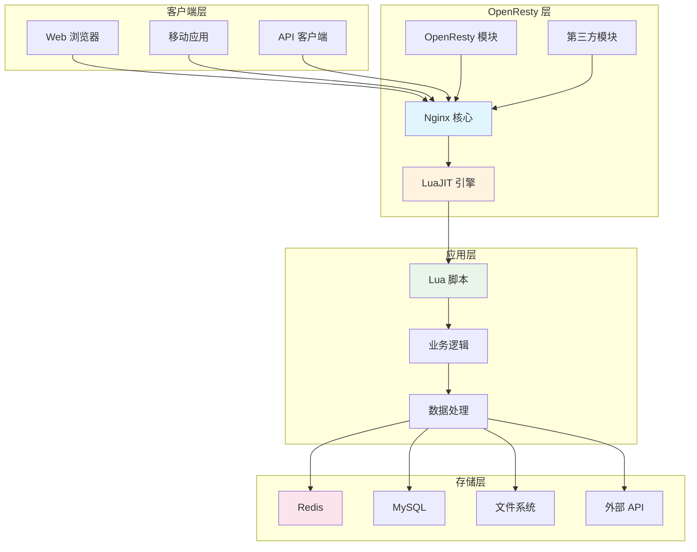
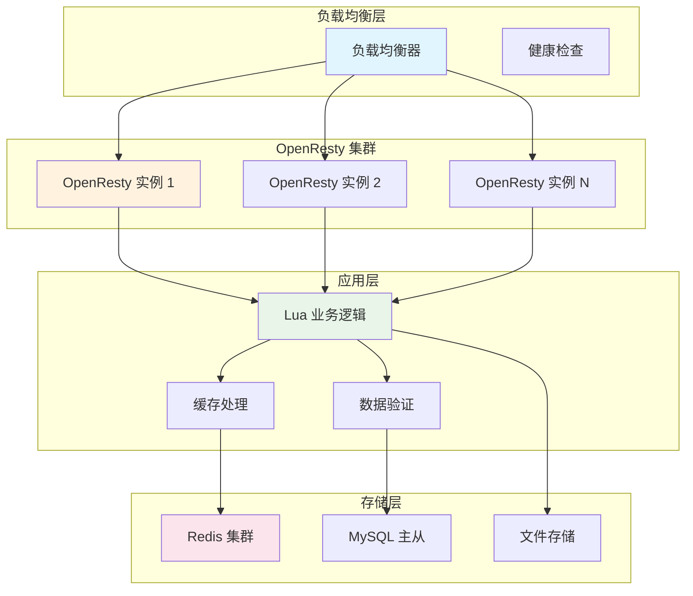

# OpenResty 完整指南：基于 Nginx 和 LuaJIT 的高性能 Web 平台

## 项目概述

[OpenResty](https://github.com/openresty/openresty) 是一个基于 Nginx 和 LuaJIT 的高性能 Web 平台，它将 Nginx 转变为一个功能完整的可编程 Web 平台。OpenResty 通过集成大量的第三方 Nginx 模块和 LuaJIT，为开发者提供了强大的脚本化能力，特别适合构建高并发、低延迟的 Web 应用。

<div style="text-align: center; margin: 20px 0;">
  <svg width="600" height="300" xmlns="http://www.w3.org/2000/svg">
    <style>
      .title { font-family: Arial; font-size: 24px; font-weight: bold; fill: #2C3E50; text-anchor: middle; }
      .subtitle { font-family: Arial; font-size: 16px; fill: #7F8C8D; text-anchor: middle; }
      .logo { font-family: Arial; font-size: 36px; font-weight: bold; fill: #E74C3C; text-anchor: middle; }
      .highlight { fill: #3498DB; }
      .badge { font-family: Arial; font-size: 12px; fill: #FFFFFF; font-weight: bold; text-anchor: middle; }
      .feature { font-family: Arial; font-size: 14px; fill: #2C3E50; }
    </style>
    <rect width="600" height="300" fill="#ECF0F1" rx="12" ry="12" stroke="#BDC3C7" stroke-width="2"/>
    <text x="300" y="60" class="logo">OpenResty</text>
    <text x="300" y="90" class="title">高性能 Web 平台</text>
    <text x="300" y="115" class="subtitle">基于 Nginx 和 LuaJIT 的可编程平台</text>
    
    <!-- GitHub Stats -->
    <rect x="50" y="140" width="80" height="25" fill="#2ECC71" rx="12" ry="12"/>
    <text x="90" y="157" class="badge">13.2k ⭐</text>
    
    <rect x="150" y="140" width="80" height="25" fill="#3498DB" rx="12" ry="12"/>
    <text x="190" y="157" class="badge">1.6k Forks</text>
    
    <rect x="250" y="140" width="100" height="25" fill="#E74C3C" rx="12" ry="12"/>
    <text x="300" y="157" class="badge">BSD-2-Clause</text>
    
    <!-- Key Features -->
    <text x="50" y="200" class="feature">⚡ 高性能</text>
    <text x="200" y="200" class="feature">🔧 可编程</text>
    <text x="350" y="200" class="feature">🌐 高并发</text>
    <text x="500" y="200" class="feature">📱 跨平台</text>
    
    <text x="50" y="230" class="feature">🛡️ 安全可靠</text>
    <text x="200" y="230" class="feature">🎯 低延迟</text>
    <text x="350" y="230" class="feature">🔌 模块化</text>
    <text x="500" y="230" class="feature">📊 可观测</text>
    
    <text x="300" y="270" class="subtitle">官网: openresty.org</text>
  </svg>
</div>

## 核心特性

OpenResty 提供了全面的高性能 Web 解决方案，具有以下核心特性：

- **⚡ 高性能**：基于 Nginx 的事件驱动架构，支持 C10K 并发
- **🔧 可编程**：集成 LuaJIT，支持动态脚本编程
- **🌐 高并发**：单机可处理数万并发连接
- **🎯 低延迟**：毫秒级响应时间
- **🛡️ 安全可靠**：内置安全模块和防护机制
- **📊 可观测**：丰富的监控和日志功能
- **🔌 模块化**：大量第三方模块支持
- **📱 跨平台**：支持 Linux、macOS、Windows

## 系统架构



## 安装指南

### Linux 安装

#### Ubuntu/Debian
```bash
# 安装依赖
sudo apt update
sudo apt install build-essential libpcre3-dev libssl-dev zlib1g-dev

# 下载 OpenResty
wget https://openresty.org/download/openresty-1.25.3.2.tar.gz
tar -xzf openresty-1.25.3.2.tar.gz
cd openresty-1.25.3.2

# 配置和编译
./configure --prefix=/usr/local/openresty \
    --with-http_ssl_module \
    --with-http_realip_module \
    --with-http_stub_status_module \
    --with-http_gzip_static_module \
    --with-http_secure_link_module \
    --with-http_sub_module \
    --with-http_dav_module \
    --with-http_flv_module \
    --with-http_mp4_module \
    --with-http_gunzip_module \
    --with-http_random_index_module \
    --with-http_secure_link_module \
    --with-http_stub_status_module \
    --with-http_auth_request_module \
    --with-http_addition_module \
    --with-http_dav_module \
    --with-http_geoip_module \
    --with-http_gunzip_module \
    --with-http_gzip_static_module \
    --with-http_image_filter_module \
    --with-http_realip_module \
    --with-http_ssl_module \
    --with-http_stub_status_module \
    --with-http_sub_module \
    --with-http_xslt_module \
    --with-ipv6 \
    --with-mail \
    --with-mail_ssl_module \
    --with-stream \
    --with-stream_ssl_module \
    --with-threads

# 编译和安装
make -j$(nproc)
sudo make install

# 创建软链接
sudo ln -s /usr/local/openresty/nginx/sbin/nginx /usr/local/bin/nginx
```

#### CentOS/RHEL
```bash
# 安装依赖
sudo yum groupinstall "Development Tools"
sudo yum install pcre-devel openssl-devel zlib-devel

# 下载和编译（同上）
wget https://openresty.org/download/openresty-1.25.3.2.tar.gz
tar -xzf openresty-1.25.3.2.tar.gz
cd openresty-1.25.3.2
./configure --prefix=/usr/local/openresty
make -j$(nproc)
sudo make install
```

### macOS 安装

```bash
# 使用 Homebrew 安装
brew install openresty

# 或者从源码编译
brew install pcre openssl zlib
# 然后按照 Linux 的编译步骤
```

### 验证安装

```bash
# 检查版本
nginx -v

# 检查配置
nginx -t

# 启动服务
sudo nginx

# 检查进程
ps aux | grep nginx
```

## 基础配置

### 主配置文件

```nginx
# /usr/local/openresty/nginx/conf/nginx.conf

user nginx;
worker_processes auto;
error_log /var/log/nginx/error.log;
pid /var/run/nginx.pid;

events {
    worker_connections 1024;
    use epoll;
    multi_accept on;
}

http {
    include /usr/local/openresty/nginx/conf/mime.types;
    default_type application/octet-stream;
    
    # 日志格式
    log_format main '$remote_addr - $remote_user [$time_local] "$request" '
                    '$status $body_bytes_sent "$http_referer" '
                    '"$http_user_agent" "$http_x_forwarded_for"';
    
    access_log /var/log/nginx/access.log main;
    
    # 基础设置
    sendfile on;
    tcp_nopush on;
    tcp_nodelay on;
    keepalive_timeout 65;
    types_hash_max_size 2048;
    
    # Gzip 压缩
    gzip on;
    gzip_vary on;
    gzip_min_length 1024;
    gzip_types text/plain text/css application/json application/javascript text/xml application/xml application/xml+rss text/javascript;
    
    # 包含其他配置文件
    include /usr/local/openresty/nginx/conf/conf.d/*.conf;
}
```

### 虚拟主机配置

```nginx
# /usr/local/openresty/nginx/conf/conf.d/default.conf

server {
    listen 80;
    server_name localhost;
    root /usr/local/openresty/nginx/html;
    index index.html index.htm;
    
    # 基础路由
    location / {
        try_files $uri $uri/ /index.html;
    }
    
    # 静态文件缓存
    location ~* \.(jpg|jpeg|png|gif|ico|css|js)$ {
        expires 1y;
        add_header Cache-Control "public, immutable";
    }
    
    # 错误页面
    error_page 500 502 503 504 /50x.html;
    location = /50x.html {
        root /usr/local/openresty/nginx/html;
    }
}
```

## Lua 脚本基础

### Hello World 示例

```nginx
# nginx.conf 中的 server 块
server {
    listen 80;
    server_name localhost;
    
    location /hello {
        content_by_lua_block {
            ngx.say("Hello, OpenResty!")
            ngx.say("Current time: " .. os.date())
        }
    }
}
```

### 变量和请求处理

```nginx
location /api/user {
    content_by_lua_block {
        -- 获取请求参数
        local args = ngx.req.get_uri_args()
        local user_id = args.user_id
        
        -- 获取请求头
        local headers = ngx.req.get_headers()
        local user_agent = headers["User-Agent"]
        
        -- 设置响应头
        ngx.header["Content-Type"] = "application/json"
        
        -- 返回 JSON 响应
        local response = {
            user_id = user_id,
            user_agent = user_agent,
            timestamp = os.time()
        }
        
        ngx.say(require("cjson").encode(response))
    }
}
```

## C10K 高并发应用场景

### 场景概述

C10K（Concurrent 10,000）是指同时处理 10,000 个并发连接的能力。OpenResty 通过以下特性实现 C10K：

1. **事件驱动架构**：基于 Nginx 的事件驱动模型
2. **非阻塞 I/O**：使用 epoll/kqueue 等高效 I/O 多路复用
3. **LuaJIT 优化**：高性能的 Lua 解释器
4. **连接池管理**：高效的连接复用机制

### 架构设计



### 完整示例：用户会话管理系统

#### 1. 系统架构

```nginx
# nginx.conf - 高并发配置
worker_processes auto;
worker_rlimit_nofile 65535;

events {
    worker_connections 65535;
    use epoll;
    multi_accept on;
}

http {
    # 基础优化
    sendfile on;
    tcp_nopush on;
    tcp_nodelay on;
    keepalive_timeout 65;
    keepalive_requests 1000;
    
    # 缓冲区优化
    client_body_buffer_size 128k;
    client_max_body_size 10m;
    client_header_buffer_size 1k;
    large_client_header_buffers 4 4k;
    
    # 包含应用配置
    include /usr/local/openresty/nginx/conf/conf.d/*.conf;
}
```

#### 2. 应用配置文件

```nginx
# conf.d/session-api.conf
upstream redis_backend {
    server 127.0.0.1:6379;
    keepalive 32;
}

upstream mysql_backend {
    server 127.0.0.1:3306;
    keepalive 32;
}

server {
    listen 80;
    server_name api.example.com;
    
    # 会话创建 API
    location /api/session/create {
        content_by_lua_file /usr/local/openresty/nginx/lua/session_create.lua;
    }
    
    # 会话验证 API
    location /api/session/validate {
        content_by_lua_file /usr/local/openresty/nginx/lua/session_validate.lua;
    }
    
    # 会话更新 API
    location /api/session/update {
        content_by_lua_file /usr/local/openresty/nginx/lua/session_update.lua;
    }
    
    # 会话删除 API
    location /api/session/delete {
        content_by_lua_file /usr/local/openresty/nginx/lua/session_delete.lua;
    }
    
    # 批量会话查询 API
    location /api/session/batch {
        content_by_lua_file /usr/local/openresty/nginx/lua/session_batch.lua;
    }
}
```

#### 3. Lua 业务逻辑

**会话创建模块** (`session_create.lua`):

```lua
-- 会话创建模块
local cjson = require("cjson")
local redis = require("resty.redis")

-- 创建 Redis 连接
local function get_redis_conn()
    local red = redis:new()
    red:set_timeout(1000)
    local ok, err = red:connect("127.0.0.1", 6379)
    if not ok then
        ngx.log(ngx.ERR, "Failed to connect to Redis: ", err)
        return nil
    end
    return red
end

-- 生成会话 ID
local function generate_session_id()
    local random = require("resty.random")
    local str = require("resty.string")
    
    local bytes = random.bytes(16)
    return str.to_hex(bytes)
end

-- 创建会话
local function create_session(user_id, user_data)
    local red = get_redis_conn()
    if not red then
        return nil, "Redis connection failed"
    end
    
    local session_id = generate_session_id()
    local session_data = {
        user_id = user_id,
        user_data = user_data,
        created_at = os.time(),
        last_accessed = os.time()
    }
    
    -- 存储到 Redis，设置过期时间
    local ok, err = red:hmset("session:" .. session_id, session_data)
    if not ok then
        red:close()
        return nil, "Failed to store session"
    end
    
    -- 设置过期时间（24小时）
    red:expire("session:" .. session_id, 86400)
    red:close()
    
    return session_id, session_data
end

-- 主处理逻辑
local function handle_request()
    -- 获取请求参数
    local args = ngx.req.get_uri_args()
    local user_id = args.user_id
    local user_data = args.user_data
    
    if not user_id then
        ngx.status = 400
        ngx.say(cjson.encode({error = "user_id is required"}))
        return
    end
    
    -- 创建会话
    local session_id, session_data = create_session(user_id, user_data)
    
    if not session_id then
        ngx.status = 500
        ngx.say(cjson.encode({error = session_data}))
        return
    end
    
    -- 返回成功响应
    ngx.header["Content-Type"] = "application/json"
    ngx.say(cjson.encode({
        success = true,
        session_id = session_id,
        session_data = session_data
    }))
end

-- 执行请求处理
handle_request()
```

**会话验证模块** (`session_validate.lua`):

```lua
-- 会话验证模块
local cjson = require("cjson")
local redis = require("resty.redis")

-- 获取 Redis 连接
local function get_redis_conn()
    local red = redis:new()
    red:set_timeout(1000)
    local ok, err = red:connect("127.0.0.1", 6379)
    if not ok then
        ngx.log(ngx.ERR, "Failed to connect to Redis: ", err)
        return nil
    end
    return red
end

-- 验证会话
local function validate_session(session_id)
    local red = get_redis_conn()
    if not red then
        return nil, "Redis connection failed"
    end
    
    -- 获取会话数据
    local session_data, err = red:hgetall("session:" .. session_id)
    if not session_data or #session_data == 0 then
        red:close()
        return nil, "Session not found"
    end
    
    -- 更新最后访问时间
    red:hset("session:" .. session_id, "last_accessed", os.time())
    red:close()
    
    -- 解析会话数据
    local session = {}
    for i = 1, #session_data, 2 do
        session[session_data[i]] = session_data[i + 1]
    end
    
    return session
end

-- 主处理逻辑
local function handle_request()
    local args = ngx.req.get_uri_args()
    local session_id = args.session_id
    
    if not session_id then
        ngx.status = 400
        ngx.say(cjson.encode({error = "session_id is required"}))
        return
    end
    
    -- 验证会话
    local session, err = validate_session(session_id)
    
    if not session then
        ngx.status = 401
        ngx.say(cjson.encode({error = err}))
        return
    end
    
    -- 返回会话信息
    ngx.header["Content-Type"] = "application/json"
    ngx.say(cjson.encode({
        success = true,
        session = session
    }))
end

-- 执行请求处理
handle_request()
```

**批量会话查询模块** (`session_batch.lua`):

```lua
-- 批量会话查询模块
local cjson = require("cjson")
local redis = require("resty.redis")

-- 获取 Redis 连接
local function get_redis_conn()
    local red = redis:new()
    red:set_timeout(1000)
    local ok, err = red:connect("127.0.0.1", 6379)
    if not ok then
        ngx.log(ngx.ERR, "Failed to connect to Redis: ", err)
        return nil
    end
    return red
end

-- 批量获取会话
local function batch_get_sessions(session_ids)
    local red = get_redis_conn()
    if not red then
        return nil, "Redis connection failed"
    end
    
    local results = {}
    local pipeline = red:init_pipeline()
    
    -- 构建批量查询
    for _, session_id in ipairs(session_ids) do
        red:hgetall("session:" .. session_id)
    end
    
    -- 执行批量查询
    local responses, err = red:commit_pipeline()
    if not responses then
        red:close()
        return nil, "Pipeline execution failed"
    end
    
    -- 处理结果
    for i, response in ipairs(responses) do
        local session_id = session_ids[i]
        if response and #response > 0 then
            local session = {}
            for j = 1, #response, 2 do
                session[response[j]] = response[j + 1]
            end
            results[session_id] = session
        else
            results[session_id] = nil
        end
    end
    
    red:close()
    return results
end

-- 主处理逻辑
local function handle_request()
    local args = ngx.req.get_uri_args()
    local session_ids_str = args.session_ids
    
    if not session_ids_str then
        ngx.status = 400
        ngx.say(cjson.encode({error = "session_ids is required"}))
        return
    end
    
    -- 解析会话 ID 列表
    local session_ids = {}
    for session_id in session_ids_str:gmatch("[^,]+") do
        table.insert(session_ids, session_id:match("^%s*(.-)%s*$"))
    end
    
    if #session_ids == 0 then
        ngx.status = 400
        ngx.say(cjson.encode({error = "No valid session IDs provided"}))
        return
    end
    
    -- 限制批量查询数量
    if #session_ids > 100 then
        ngx.status = 400
        ngx.say(cjson.encode({error = "Too many session IDs (max 100)"}))
        return
    end
    
    -- 批量获取会话
    local sessions, err = batch_get_sessions(session_ids)
    
    if not sessions then
        ngx.status = 500
        ngx.say(cjson.encode({error = err}))
        return
    end
    
    -- 返回结果
    ngx.header["Content-Type"] = "application/json"
    ngx.say(cjson.encode({
        success = true,
        sessions = sessions
    }))
end

-- 执行请求处理
handle_request()
```

#### 4. 性能测试脚本

```bash
#!/bin/bash
# performance_test.sh - OpenResty C10K 性能测试

# 测试配置
CONCURRENT_USERS=10000
RAMP_UP_TIME=60
TEST_DURATION=300
BASE_URL="http://localhost/api/session"

echo "=== OpenResty C10K 性能测试 ==="
echo "并发用户数: $CONCURRENT_USERS"
echo "爬升时间: ${RAMP_UP_TIME}s"
echo "测试持续时间: ${TEST_DURATION}s"
echo "================================"

# 创建测试数据
echo "创建测试数据..."
for i in $(seq 1 1000); do
    curl -s -X POST "$BASE_URL/create?user_id=user$i&user_data=test$i" > /dev/null &
done
wait

# 使用 wrk 进行性能测试
echo "开始性能测试..."
wrk -t12 -c$CONCURRENT_USERS -d${TEST_DURATION}s \
    --latency \
    --timeout 30s \
    --script session_test.lua \
    $BASE_URL/validate

echo "测试完成！"
```

**测试脚本** (`session_test.lua`):

```lua
-- wrk 测试脚本
local cjson = require("cjson")

-- 生成随机会话 ID
function random_session_id()
    local chars = "abcdefghijklmnopqrstuvwxyz0123456789"
    local session_id = ""
    for i = 1, 32 do
        local rand = math.random(1, #chars)
        session_id = session_id .. string.sub(chars, rand, rand)
    end
    return session_id
end

-- 请求函数
function request()
    local session_id = random_session_id()
    local url = "/api/session/validate?session_id=" .. session_id
    
    wrk.method = "GET"
    wrk.headers["Content-Type"] = "application/json"
    wrk.headers["User-Agent"] = "OpenResty-Performance-Test"
    
    return wrk.format(nil, url)
end
```

#### 5. 监控和日志

```nginx
# nginx.conf 中的日志配置
log_format detailed '$remote_addr - $remote_user [$time_local] '
                   '"$request" $status $body_bytes_sent '
                   '"$http_referer" "$http_user_agent" '
                   'rt=$request_time uct="$upstream_connect_time" '
                   'uht="$upstream_header_time" urt="$upstream_response_time"';

access_log /var/log/nginx/access.log detailed;
error_log /var/log/nginx/error.log;
```

**监控脚本** (`monitor.lua`):

```lua
-- 监控脚本
local function monitor_stats()
    local http = require("resty.http")
    
    -- 获取 Nginx 状态
    local httpc = http.new()
    local res, err = httpc:request_uri("http://127.0.0.1/nginx_status")
    
    if res then
        ngx.log(ngx.INFO, "Nginx Status: ", res.body)
    end
    
    -- 获取 Redis 状态
    local redis = require("resty.redis")
    local red = redis:new()
    local ok, err = red:connect("127.0.0.1", 6379)
    
    if ok then
        local info = red:info()
        ngx.log(ngx.INFO, "Redis Info: ", info)
        red:close()
    end
end

-- 定时执行监控
local ok, err = ngx.timer.every(60, monitor_stats)
if not ok then
    ngx.log(ngx.ERR, "Failed to create timer: ", err)
end
```

### 性能优化技巧

#### 1. 连接池优化

```lua
-- 连接池配置
local function get_redis_conn()
    local red = redis:new()
    red:set_timeout(1000)
    red:set_keepalive(10000, 100)  -- 连接池大小和超时
    local ok, err = red:connect("127.0.0.1", 6379)
    if not ok then
        return nil, err
    end
    return red
end
```

#### 2. 缓存策略

```lua
-- 本地缓存
local cache = ngx.shared.session_cache

local function get_cached_session(session_id)
    local session = cache:get(session_id)
    if session then
        return cjson.decode(session)
    end
    
    -- 从 Redis 获取并缓存
    local session_data = get_session_from_redis(session_id)
    if session_data then
        cache:set(session_id, cjson.encode(session_data), 300)  -- 5分钟缓存
        return session_data
    end
    
    return nil
end
```

#### 3. 异步处理

```lua
-- 异步日志记录
local function async_log_session_access(session_id, user_id)
    local ok, err = ngx.timer.at(0, function()
        local redis = require("resty.redis")
        local red = redis:new()
        red:connect("127.0.0.1", 6379)
        red:hset("session:" .. session_id, "last_accessed", os.time())
        red:close()
    end)
    
    if not ok then
        ngx.log(ngx.ERR, "Failed to create async timer: ", err)
    end
end
```

## 总结

OpenResty 是一个功能强大、性能卓越的 Web 平台，特别适合构建高并发、低延迟的 Web 应用。通过本文档的学习，您应该能够：

1. **理解 OpenResty 的核心特性**：基于 Nginx 和 LuaJIT 的高性能架构
2. **掌握安装和配置**：在不同平台上安装和配置 OpenResty
3. **熟练使用 Lua 脚本**：编写高效的业务逻辑
4. **实现 C10K 应用**：构建高并发、高性能的 Web 服务
5. **优化性能**：通过连接池、缓存、异步处理等技术优化性能
6. **监控和维护**：建立完善的监控和日志系统

OpenResty 的模块化设计和强大的脚本能力使其成为构建现代 Web 应用的理想选择，特别适合需要处理大量并发请求的场景。

## 参考资源

- [OpenResty 官方文档](https://openresty.org/)
- [OpenResty GitHub 仓库](https://github.com/openresty/openresty)
- [OpenResty 中文文档](https://openresty.org/cn/)
- [LuaJIT 文档](http://luajit.org/)
- [Nginx 官方文档](http://nginx.org/)

---

*本文档基于 OpenResty 1.25.3.2 版本编写，适用于大多数现代操作系统。*
``` 