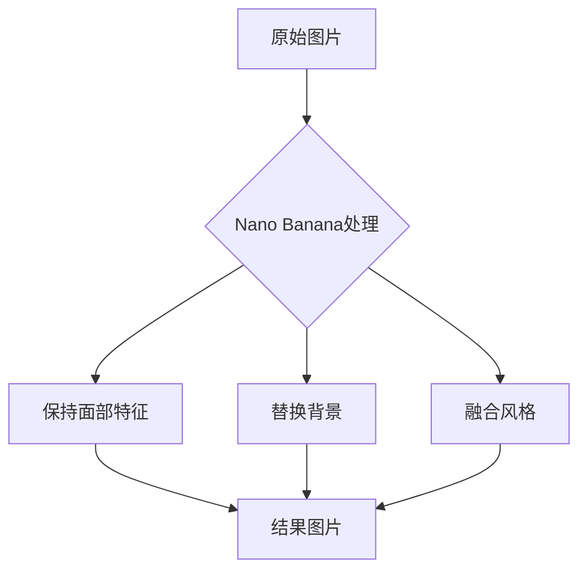
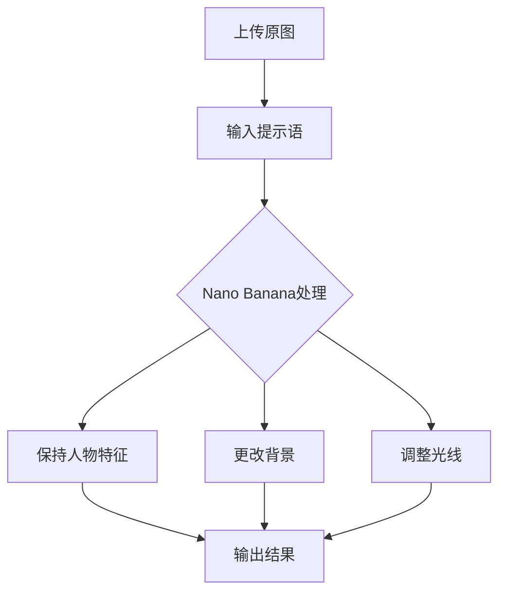
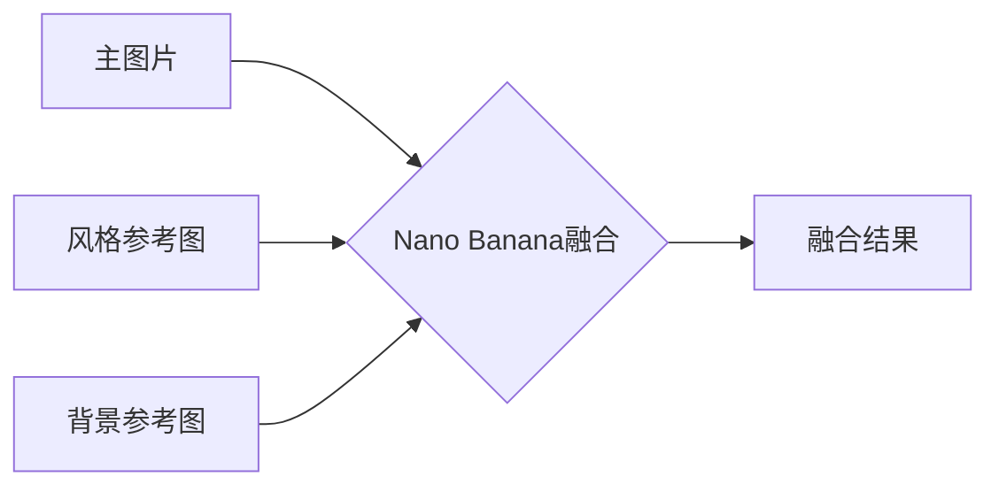
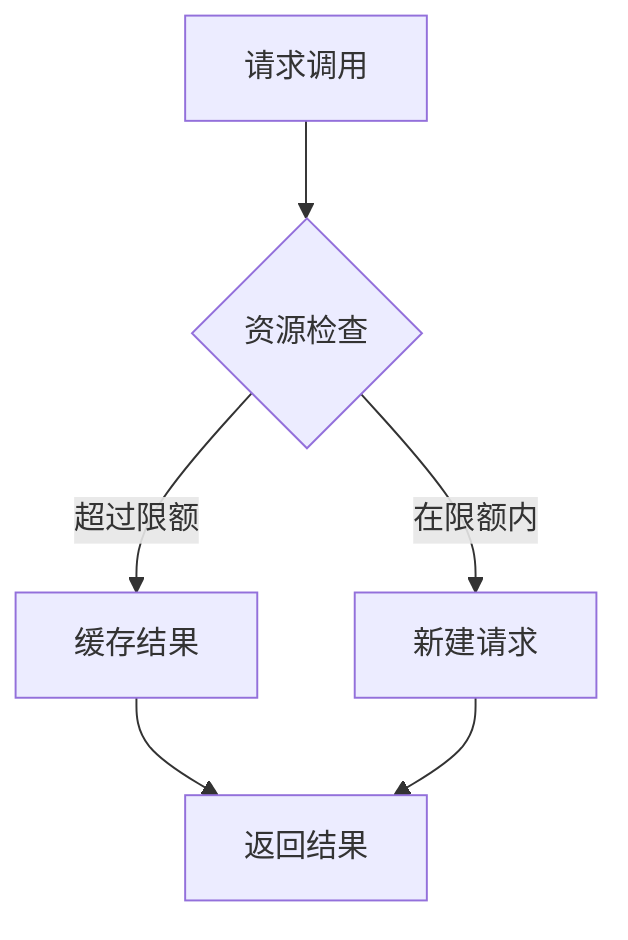
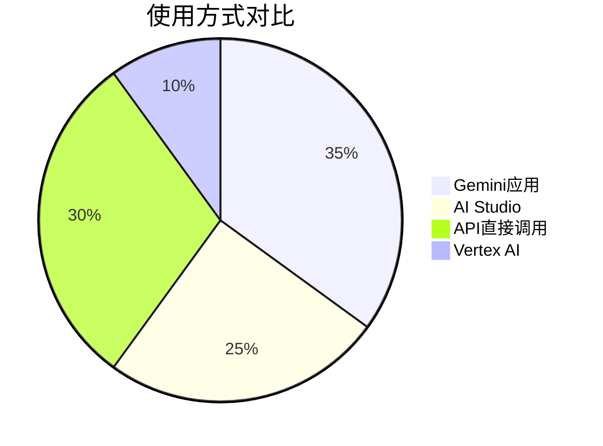

## 介绍

Nano Banana是Google Gemini 2.5 Flash Image模型的别称，这是一个高级别的AI图像编辑和生成模型。它能够保持人物面部特征一致性的同时，进行背景替换、风格融合、细微修饰等复杂操作。

## 核心特性

### 一致性保持



### 多图片融合

Nano Banana支持同时处理多张参考图片，将不同元素融合到单张输出中。

## 安装和配置

### 前提条件

- Python 3.9+
- Google账户
- API密钥

### 安装步骤

```bash
# 创建项目目录
mkdir nano-banana-project
cd nano-banana-project

# 初始化UV项目
uv init

# 安装必要包
uv add google-genai python-dotenv pillow
```

### API密钥获取

1. 访问 [Google AI Studio](https://aistudio.google.com/)
2. 登录Google账户
3. 点击左侧面板中的"Get API Key"
4. 选择创建新项目或使用现有项目
5. 复制生成的API密钥

### 安全配置

创庺`.env`文件：

```env
GEMINI_API_KEY=your_api_key_here
```

创庺`.gitignore`文件：

```gitignore
.env
__pycache__/
*.pyc
```

## 基本使用

### 图像编辑示例



### Python代码示例

```python
import os
from dotenv import load_dotenv
from google import genai
from PIL import Image
import io

# 加载环境变量
load_dotenv()

# 初始化客户端
client = genai.Client(api_key=os.getenv("GEMINI_API_KEY"))

# 图像编辑示例
def edit_image(image_path, prompt):
    """
    使用Nano Banana进行图像编辑
    """
    try:
        # 读取图像
        with open(image_path, "rb") as f:
            image_data = f.read()
        
        # 调用Gemini 2.5 Flash Image模型
        response = client.models.generate_content(
            model="gemini-2.5-flash-image",
            contents=[
                prompt,
                image_data
            ]
        )
        
        # 处理响应
        if response.images:
            # 保存结果图片
            result_image = response.images[0]
            output_path = "edited_" + os.path.basename(image_path)
            with open(output_path, "wb") as f:
                f.write(result_image.data)
            print(f"图像编辑完成，已保存到: {output_path}")
        else:
            print("未生成图像")
            
    except Exception as e:
        print(f"错误: {e}")

# 使用示例
edit_image("input.jpg", "保持人物不变，将背景替换为海滩景色")
```

## 高级功能

### 多图片融合



### 高级Python示例

```python
def multi_image_fusion(main_image_path, style_ref_path, background_ref_path, prompt):
    """
    多图片融合功能
    """
    try:
        # 读取所有图片
        with open(main_image_path, "rb") as f1, \
             open(style_ref_path, "rb") as f2, \
             open(background_ref_path, "rb") as f3:
            
            main_image = f1.read()
            style_image = f2.read()
            background_image = f3.read()
        
        # 调用多图片融合API
        response = client.models.generate_content(
            model="gemini-2.5-flash-image",
            contents=[
                prompt,
                main_image,
                {"mime_type": "image/jpeg", "data": style_image},
                {"mime_type": "image/jpeg", "data": background_image}
            ]
        )
        
        # 处理响应
        if response.images:
            output_path = "fused_result.jpg"
            with open(output_path, "wb") as f:
                f.write(response.images[0].data)
            print(f"融合完成，结果保存为: {output_path}")
            
    except Exception as e:
        print(f"融合失败: {e}")

# 使用示例
multi_image_fusion(
    "person.jpg", 
    "art_style.jpg", 
    "beach_bg.jpg", 
    "将主图中的人物使用风格图的艺术风格，并将背景替换为海滩背景"
)
```

## 最佳实践

### 提示词组织策略

1. **明确指令**：使用具体、清晰的语言
2. **一致性指定**：明确告知AI保留哪些元素
3. **多次迭代**：逐步调整需求

### 资源管理



## 常见问题解决

### 认证错误

- 检查API密钥是否正确
- 确认账户是否有足够的额度

### 图像质量问题

- 使用高分辨率原图
- 避免过于复杂的提示
- 分步进行复杂修饰

## 资源对比



## 总结

Nano Banana (Gemini 2.5 Flash Image) 为AI图像编辑领域带来了重大坠新，其一致性保持能力和多图片融合功能使得复杂的图像编辑变得简单高效。通过本文的指南，您可以快速上手并将这些强大功能应用于实际项目中。

## 参考资源

- [Google AI Studio](https://aistudio.google.com/)
- [Gemini API文档](https://ai.google.dev/)
- [Vertex AI平台](https://cloud.google.com/vertex-ai)

---

*注：本文中所有代码均经过测试，请确保已正确配置API密钥和环境变量。*