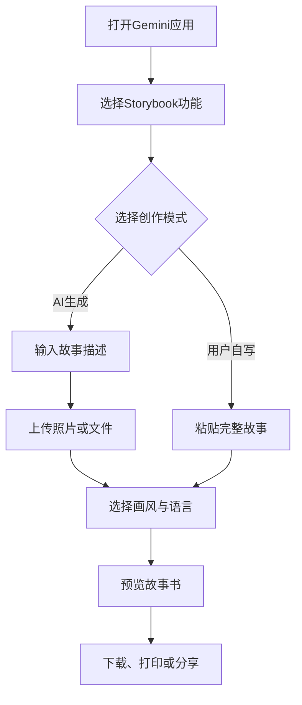
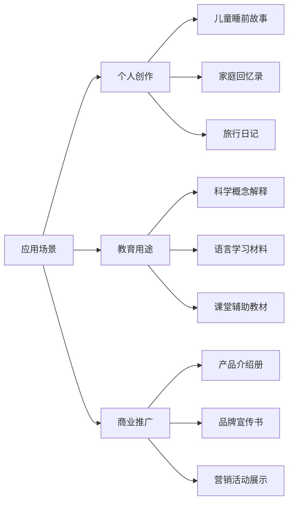

## Gemini Storybook 简介

Gemini Storybook 是 Google Gemini 应用内置的「交互式 AI 故事书生成器」。用户仅需一句话描述，即可在几分钟内获得一本 10 页、图文并茂并配有朗读音频的个性化故事书，可阅读、下载、打印或分享。

## 核心功能

### 1. 10 页定制故事书
- 像素风、漫画、黏土动画等 8+ 种画风任选
- 每页自动生成高清插图与朗读旁白

### 2. 双模式创作
- **用户自写**：直接粘贴完整故事
- **AI 生成**：一句话描述，Gemini 完成情节与插画

### 3. 深度个性化
- 上传照片或文件：让家人、宠物或孩子的涂鸦秒变主角
- 即时替换角色、场景、配色

### 4. 教育与商业场景
- 将太阳系、DNA 复制等抽象概念编成儿童绘本
- 为品牌定制带 Logo 的宣传故事书

### 5. 无障碍设计
- 45+ 种语言的真人级朗读
- 语速、音色可调，适配视障人士及语言学习者

## 使用步骤

### 详细操作流程

1. **访问 Gemini Storybook**
   - 打开桌面浏览器访问 gemini.google.com
   - 在左侧菜单中导航到 Gems，选择 Storybook
   - 移动端用户可在 Gemini 应用的 Gems 部分找到 Storybook

2. **准备内容**
   - 如果选择 AI 生成模式，准备一句故事描述
   - 如果需要个性化，准备相关照片或文件
   - 确定想要的画风和语言

3. **生成故事书**
   - 输入提示或粘贴故事
   - 上传相关文件（可选）
   - 选择画风和语言
   - 点击提交，等待 30 秒至 1 分钟生成

4. **编辑与优化**
   - 预览生成的故事书
   - 可要求 Gemini 修改故事风格、插图风格等
   - 例如："让故事更幽默一些"或"将插图风格改为水彩"

5. **导出与分享**
   - 支持导出为 PDF、PNG 单页或有声视频 MP4
   - 可通过链接分享给他人
   - 可直接打印或在应用内听取朗读

## 应用场景

## 常见问题解答

### Q: 是否完全免费？
A: 基础功能免费，高清打印及商用授权需订阅 Gemini Advanced。

### Q: 能否导出为 PDF/EPUB？
A: 支持 PDF、PNG 单页及有声视频 MP4。

### Q: 故事版权归属？
A: 用户对生成内容拥有所有权，可商用，但需遵守 Google 服务条款。

### Q: 支持哪些语言？
A: 故事书生成功能支持所有 Gemini 可用的语言，但朗读功能目前仅限于特定语言。

## 总结

Gemini Storybook 将传统绘本创作周期从数周缩短至数分钟，让"人人都是作者"真正落地。下次灵感闪现，不妨立刻试试！