## Gemini Storybook 概述

Gemini Storybook 是 Google 基于 Gemini AI 技术开发的智能故事书创作平台，专为内容创作者、教育工作者和品牌营销人员设计。它结合了先进的 AI 生成技术和直观的用户界面，让任何人都能快速创建专业级的故事书内容。

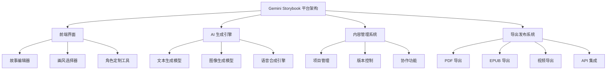
```mermaid
graph TB
    A[Gemini Storybook 平台架构] --> B[前端界面]
    A --> C[AI 生成引擎]
    A --> D[内容管理系统]
    A --> E[导出发布系统]
    
    B --> B1[故事编辑器]
    B --> B2[画风选择器]
    B --> B3[角色定制工具]
    
    C --> C1[文本生成模型]
    C --> C2[图像生成模型]
    C --> C3[语音合成引擎]
    
    D --> D1[项目管理]
    D --> D2[版本控制]
    D --> D3[协作功能]
    
    E --> E1[PDF 导出]
    E --> E2[EPUB 导出]
    E --> E3[视频导出]
    E --> E4[API 集成]
```

## 核心功能特性

### 1. 智能故事生成
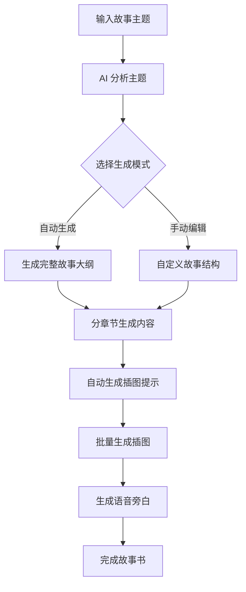
```mermaid
flowchart TD
    A[输入故事主题] --> B[AI 分析主题]
    B --> C{选择生成模式}
    C -->|自动生成| D[生成完整故事大纲]
    C -->|手动编辑| E[自定义故事结构]
    D --> F[分章节生成内容]
    E --> F
    F --> G[自动生成插图提示]
    G --> H[批量生成插图]
    H --> I[生成语音旁白]
    I --> J[完成故事书]
```

**详细功能：**
- **多模态输入支持**：支持文本、语音、图像多种输入方式
- **智能情节规划**：自动分析主题并生成合理的故事结构
- **角色自动创建**：根据故事主题智能生成角色设定
- **对话生成优化**：生成自然流畅的角色对话内容

### 2. 丰富的画风库
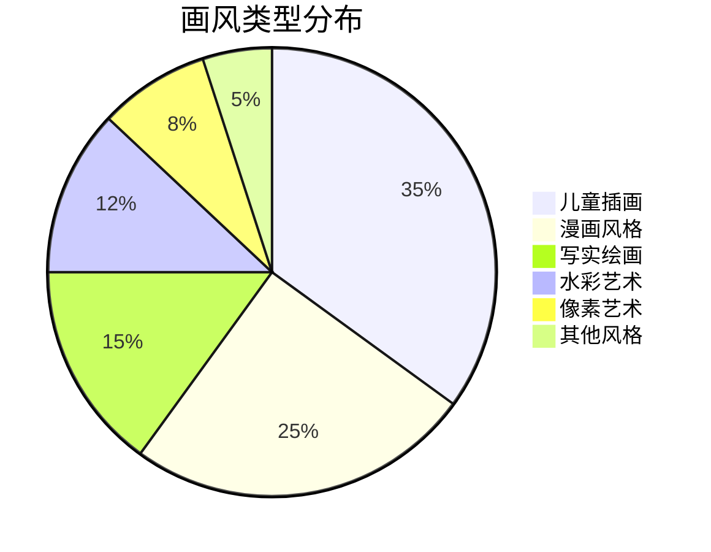
```mermaid
pie title 画风类型分布
    "儿童插画" : 35
    "漫画风格" : 25
    "写实绘画" : 15
    "水彩艺术" : 12
    "像素艺术" : 8
    "其他风格" : 5
```

**画风分类：**
- **儿童教育类**：卡通插画、水彩绘本、简笔画风格
- **文学艺术类**：油画风格、版画效果、素描风格
- **商业设计类**：扁平化设计、极简主义、现代插画
- **特殊效果类**：3D 渲染、像素艺术、复古风格

### 3. 高级编辑功能
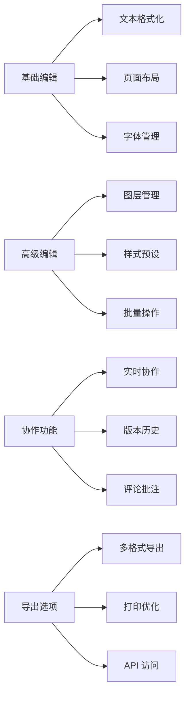
```mermaid
flowchart LR
    A[基础编辑] --> A1[文本格式化]
    A --> A2[页面布局]
    A --> A3[字体管理]
    
    B[高级编辑] --> B1[图层管理]
    B --> B2[样式预设]
    B --> B3[批量操作]
    
    C[协作功能] --> C1[实时协作]
    C --> C2[版本历史]
    C --> C3[评论批注]
    
    D[导出选项] --> D1[多格式导出]
    D --> D2[打印优化]
    D --> D3[API 访问]
```

## 完整使用指南

### 1. 注册与设置

**步骤 1：账户创建**
- 访问 geministorybook.com
- 使用 Google 账户或邮箱注册
- 完成基础信息设置

**步骤 2：工作区配置**
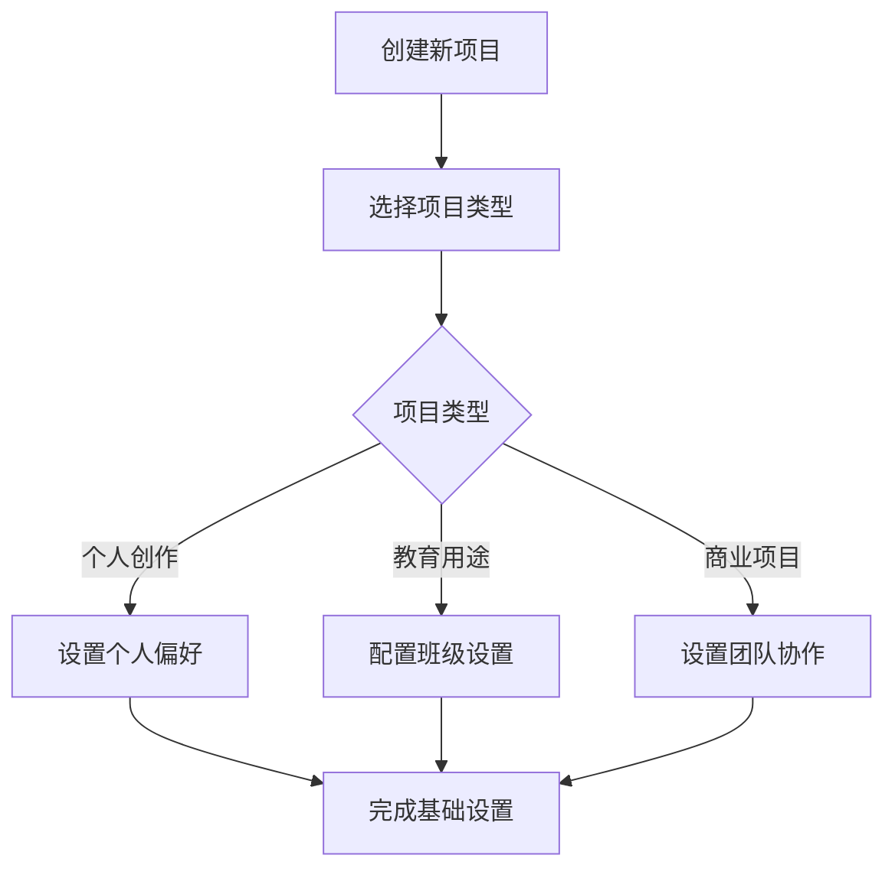
```mermaid
flowchart TD
    A[创建新项目] --> B[选择项目类型]
    B --> C{项目类型}
    C -->|个人创作| D[设置个人偏好]
    C -->|教育用途| E[配置班级设置]
    C -->|商业项目| F[设置团队协作]
    
    D --> G[完成基础设置]
    E --> G
    F --> G
```

### 2. 故事创作流程

#### 2.1 快速开始模式
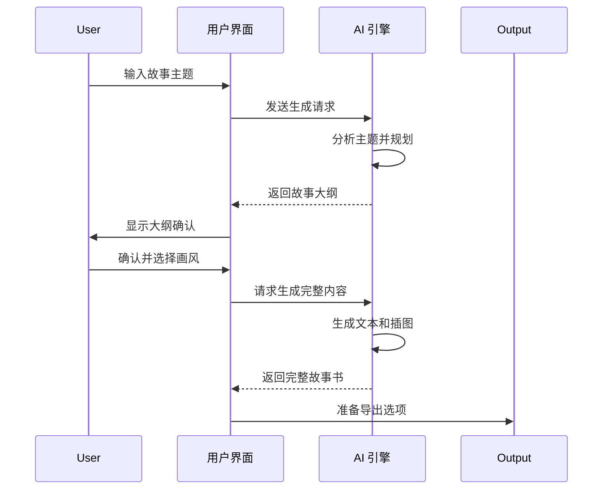
```mermaid
sequenceDiagram
    participant User
    participant UI as 用户界面
    participant AI as AI 引擎
    participant Output
    
    User->>UI: 输入故事主题
    UI->>AI: 发送生成请求
    AI->>AI: 分析主题并规划
    AI-->>UI: 返回故事大纲
    UI->>User: 显示大纲确认
    User->>UI: 确认并选择画风
    UI->>AI: 请求生成完整内容
    AI->>AI: 生成文本和插图
    AI-->>UI: 返回完整故事书
    UI->>Output: 准备导出选项
```

#### 2.2 高级创作模式
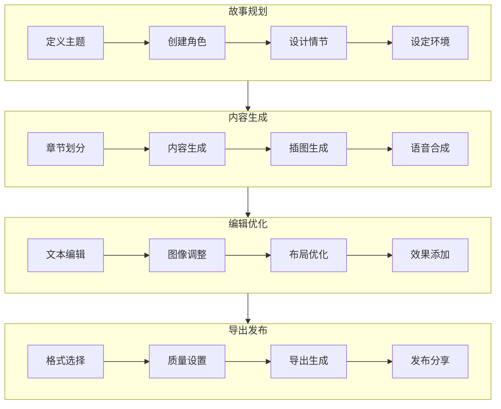
```mermaid
flowchart TB
    subgraph 故事规划
        A1[定义主题] --> A2[创建角色]
        A2 --> A3[设计情节]
        A3 --> A4[设定环境]
    end
    
    subgraph 内容生成
        B1[章节划分] --> B2[内容生成]
        B2 --> B3[插图生成]
        B3 --> B4[语音合成]
    end
    
    subgraph 编辑优化
        C1[文本编辑] --> C2[图像调整]
        C2 --> C3[布局优化]
        C3 --> C4[效果添加]
    end
    
    subgraph 导出发布
        D1[格式选择] --> D2[质量设置]
        D2 --> D3[导出生成]
        D3 --> D4[发布分享]
    end
    
    故事规划 --> 内容生成
    内容生成 --> 编辑优化
    编辑优化 --> 导出发布
```

### 3. 画风定制详解

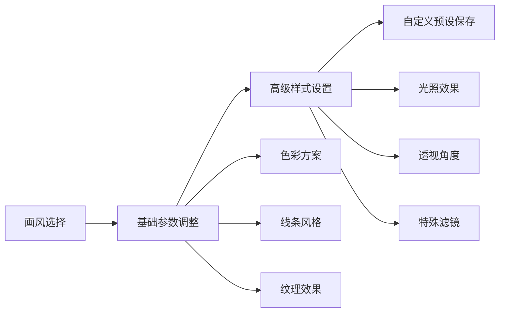
```mermaid
graph LR
    A[画风选择] --> B[基础参数调整]
    B --> C[高级样式设置]
    C --> D[自定义预设保存]
    
    B --> B1[色彩方案]
    B --> B2[线条风格]
    B --> B3[纹理效果]
    
    C --> C1[光照效果]
    C --> C2[透视角度]
    C --> C3[特殊滤镜]
```

**画风参数说明：**
- **色彩模式**：RGB/CMYK 色彩空间选择
- **分辨率设置**：72-300 DPI 可调节
- **风格强度**：控制 AI 风格化程度
- **细节级别**：调整生成的细节丰富度

### 4. 角色管理系统

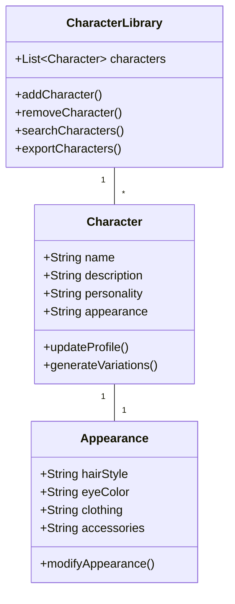
```mermaid
classDiagram
    class Character {
        +String name
        +String description
        +String personality
        +String appearance
        +updateProfile()
        +generateVariations()
    }
    
    class CharacterLibrary {
        +List~Character~ characters
        +addCharacter()
        +removeCharacter()
        +searchCharacters()
        +exportCharacters()
    }
    
    class Appearance {
        +String hairStyle
        +String eyeColor
        +String clothing
        +String accessories
        +modifyAppearance()
    }
    
    Character "1" -- "1" Appearance
    CharacterLibrary "1" -- "*" Character
```

### 5. 导出与发布选项

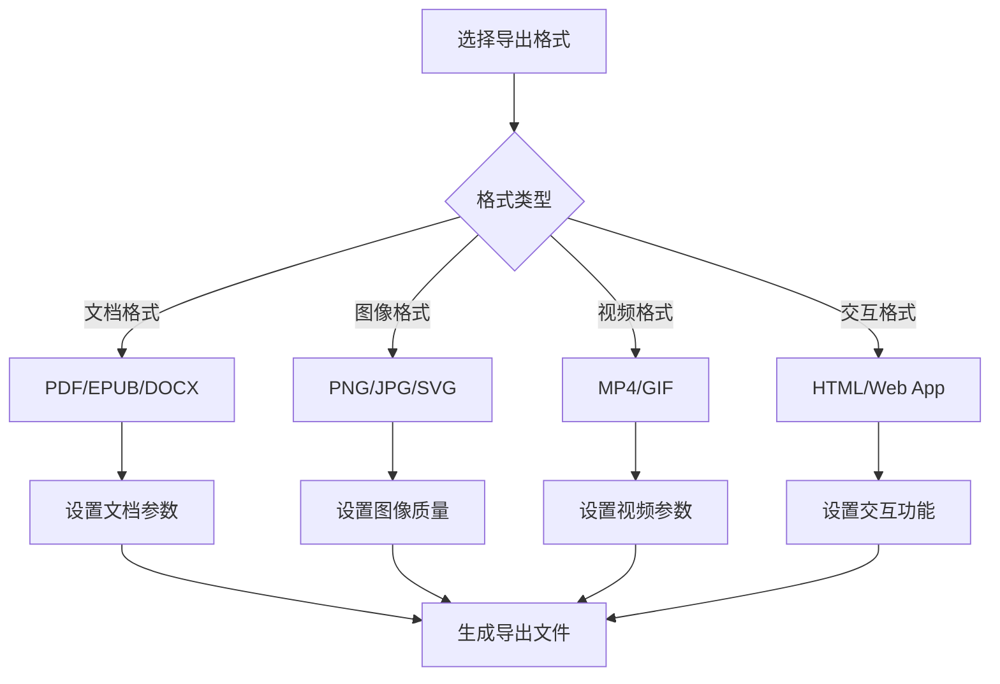
```mermaid
flowchart TD
    A[选择导出格式] --> B{格式类型}
    B -->|文档格式| C[PDF/EPUB/DOCX]
    B -->|图像格式| D[PNG/JPG/SVG]
    B -->|视频格式| E[MP4/GIF]
    B -->|交互格式| F[HTML/Web App]
    
    C --> G[设置文档参数]
    D --> H[设置图像质量]
    E --> I[设置视频参数]
    F --> J[设置交互功能]
    
    G --> K[生成导出文件]
    H --> K
    I --> K
    J --> K
```

**导出参数详解：**
- **PDF 导出**：页面大小、边距、压缩质量
- **图像导出**：分辨率、格式、色彩模式
- **视频导出**：帧率、分辨率、音频质量
- **打印设置**：出血线、裁剪标记、颜色配置

## 高级功能使用

### 1. API 集成开发

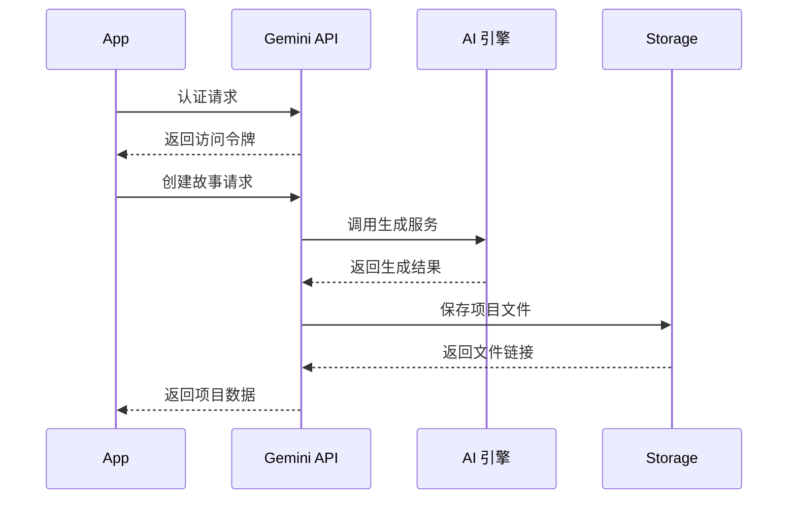
```mermaid
sequenceDiagram
    participant App
    participant API as Gemini API
    participant AI as AI 引擎
    participant Storage
    
    App->>API: 认证请求
    API-->>App: 返回访问令牌
    App->>API: 创建故事请求
    API->>AI: 调用生成服务
    AI-->>API: 返回生成结果
    API->>Storage: 保存项目文件
    Storage-->>API: 返回文件链接
    API-->>App: 返回项目数据
```

**API 功能列表：**
- 项目创建与管理
- 内容批量生成
- 画风模板调用
- 导出任务处理
- 使用统计获取

### 2. 团队协作功能

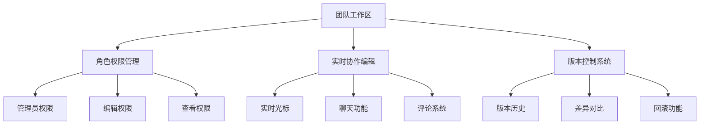
```mermaid
graph TB
    A[团队工作区] --> B[角色权限管理]
    A --> C[实时协作编辑]
    A --> D[版本控制系统]
    
    B --> B1[管理员权限]
    B --> B2[编辑权限]
    B --> B3[查看权限]
    
    C --> C1[实时光标]
    C --> C2[聊天功能]
    C --> C3[评论系统]
    
    D --> D1[版本历史]
    D --> D2[差异对比]
    D --> D3[回滚功能]
```

### 3. 教育版特殊功能

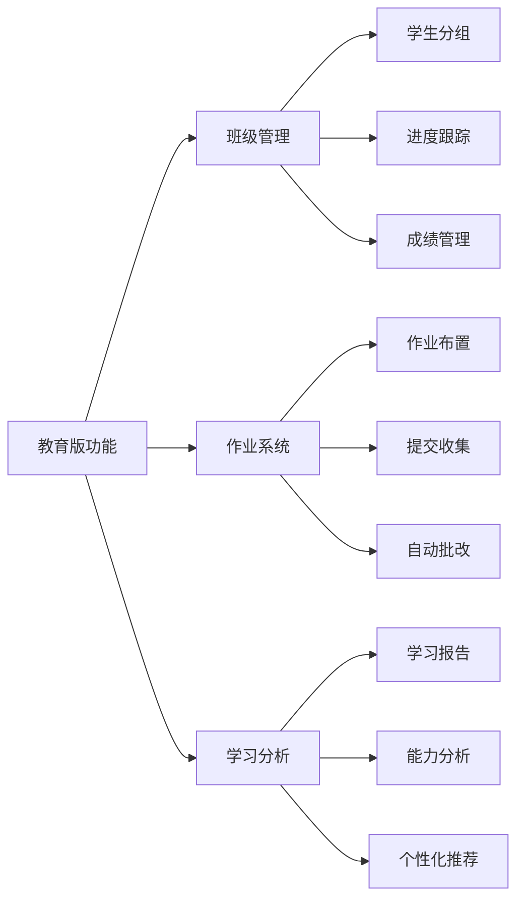
```mermaid
flowchart LR
    A[教育版功能] --> B[班级管理]
    A --> C[作业系统]
    A --> D[学习分析]
    
    B --> B1[学生分组]
    B --> B2[进度跟踪]
    B --> B3[成绩管理]
    
    C --> C1[作业布置]
    C --> C2[提交收集]
    C --> C3[自动批改]
    
    D --> D1[学习报告]
    D --> D2[能力分析]
    D --> D3[个性化推荐]
```

## 最佳实践指南

### 1. 故事创作技巧

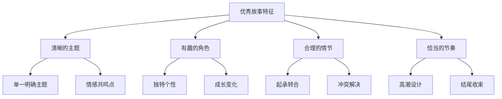
```mermaid
flowchart TD
    A[优秀故事特征] --> B[清晰的主题]
    A --> C[有趣的角色]
    A --> D[合理的情节]
    A --> E[恰当的节奏]
    
    B --> B1[单一明确主题]
    B --> B2[情感共鸣点]
    
    C --> C1[独特个性]
    C --> C2[成长变化]
    
    D --> D1[起承转合]
    D --> D2[冲突解决]
    
    E --> E1[高潮设计]
    E --> E2[结尾收束]
```

### 2. 视觉设计原则

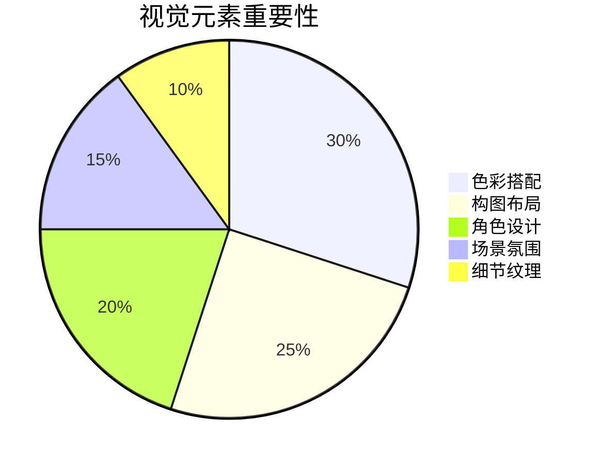
```mermaid
pie title 视觉元素重要性
    "色彩搭配" : 30
    "构图布局" : 25
    "角色设计" : 20
    "场景氛围" : 15
    "细节纹理" : 10
```

### 3. 性能优化建议

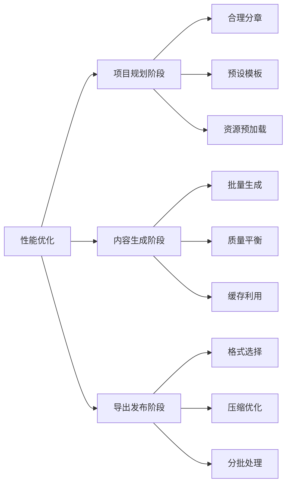
```mermaid
graph LR
    A[性能优化] --> B[项目规划阶段]
    A --> C[内容生成阶段]
    A --> D[导出发布阶段]
    
    B --> B1[合理分章]
    B --> B2[预设模板]
    B --> B3[资源预加载]
    
    C --> C1[批量生成]
    C --> C2[质量平衡]
    C --> C3[缓存利用]
    
    D --> D1[格式选择]
    D --> D2[压缩优化]
    D --> D3[分批处理]
```

## 常见问题解决方案

### 技术问题排查

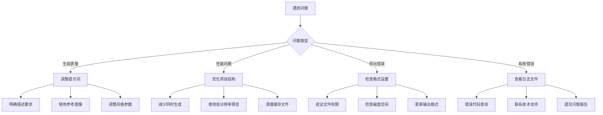
```mermaid
flowchart TD
    A[遇到问题] --> B{问题类型}
    B -->|生成质量| C[调整提示词]
    B -->|性能问题| D[优化项目结构]
    B -->|导出错误| E[检查格式设置]
    B -->|系统错误| F[查看日志文件]
    
    C --> C1[明确描述要求]
    C --> C2[使用参考图像]
    C --> C3[调整风格参数]
    
    D --> D1[减少同时生成]
    D --> D2[使用低分辨率预览]
    D --> D3[清理缓存文件]
    
    E --> E1[验证文件权限]
    E --> E2[检查磁盘空间]
    E --> E3[更新输出格式]
    
    F --> F1[错误代码查询]
    F --> F2[联系技术支持]
    F --> F3[提交问题报告]
```

### 内容质量提升

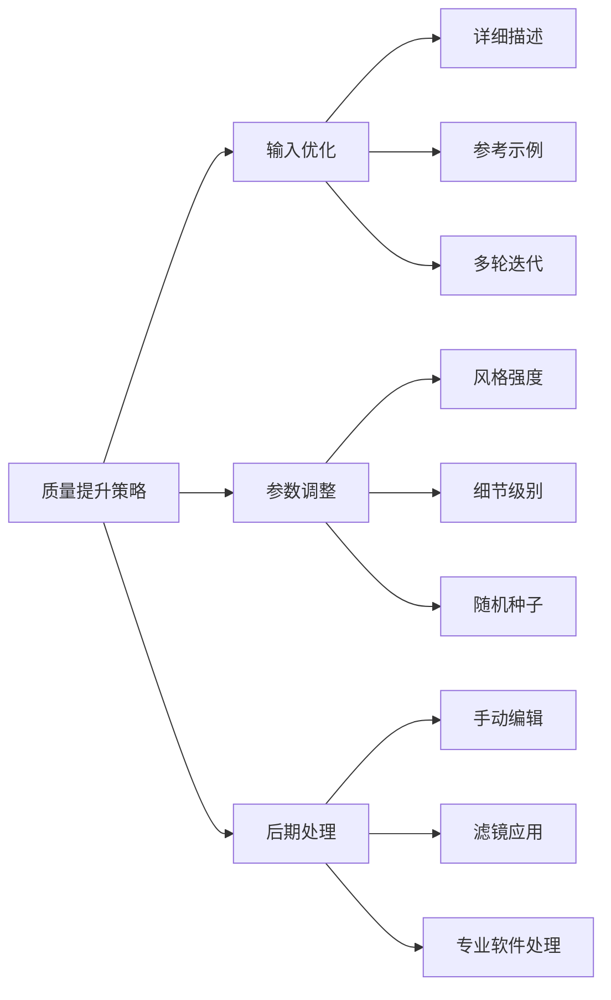
```mermaid
flowchart LR
    A[质量提升策略] --> B[输入优化]
    A --> C[参数调整]
    A --> D[后期处理]
    
    B --> B1[详细描述]
    B --> B2[参考示例]
    B --> B3[多轮迭代]
    
    C --> C1[风格强度]
    C --> C2[细节级别]
    C --> C3[随机种子]
    
    D --> D1[手动编辑]
    D --> D2[滤镜应用]
    D --> D3[专业软件处理]
```

## 资源与支持

### 学习资源推荐

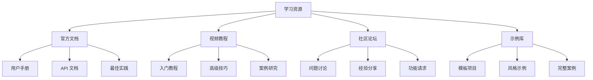
```mermaid
graph TB
    A[学习资源] --> B[官方文档]
    A --> C[视频教程]
    A --> D[社区论坛]
    A --> E[示例库]
    
    B --> B1[用户手册]
    B --> B2[API 文档]
    B --> B3[最佳实践]
    
    C --> C1[入门教程]
    C --> C2[高级技巧]
    C --> C3[案例研究]
    
    D --> D1[问题讨论]
    D --> D2[经验分享]
    D --> D3[功能请求]
    
    E --> E1[模板项目]
    E --> E2[风格示例]
    E --> E3[完整案例]
```

### 技术支持渠道

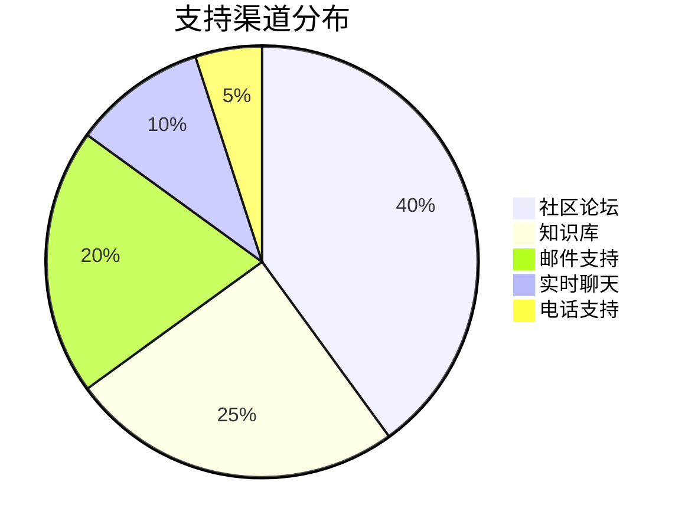
```mermaid
pie title 支持渠道分布
    "社区论坛" : 40
    "知识库" : 25
    "邮件支持" : 20
    "实时聊天" : 10
    "电话支持" : 5
```

## 版本更新与未来发展

### 近期更新内容

```mermaid
timeline
    title Gemini Storybook 版本历史
    section 2024 Q4
        新画风库发布
        API v2 上线
        团队协作功能
    section 2025 Q1
        教育版发布
        移动端优化
        性能提升
    section 2025 Q2
        AI 模型升级
        导出格式增加
        多语言支持
```

### 未来发展规划

```mermaid
timeline
    title 产品发展路线图
    section 短期规划
        更多画风选项
        实时协作增强
        API 功能扩展
    section 中期规划
        3D 故事书支持
        VR/AR 集成
        自动化工作流
    section 长期规划
        多模态交互
        智能推荐系统
        生态系统建设
```

## 总结

Gemini Storybook 作为一个全面的故事书创作平台，为不同需求的用户提供了强大的工具集。通过本指南，您应该能够：

1. 熟练掌握基础创作流程
2. 理解高级功能的使用方法
3. 运用最佳实践提升作品质量
4. 有效解决常见技术问题
5. 充分利用平台资源进行学习

无论是个人创作、教育教学还是商业应用，Gemini Storybook 都能为您提供专业级的支持。开始您的故事书创作之旅吧！

---

*最后更新日期：2025年8月22日*  
*本文档基于 Gemini Storybook 官方文档和社区经验整理*