## 引言

Claude Code 是 Anthropic 开发的一款革命性的智能编程（Agentic Coding）命令行工具，旨在为开发者提供更原生、更高效的编程体验。它采用低层级和非强制性的设计理念，几乎提供了对 Claude 模型的原始访问权限，不会强加特定的工作流程，从而创造出一个灵活、可定制、可脚本化且安全的强大工具。

本文将基于 Anthropic 官方工程博客的最佳实践，详细介绍如何高效使用 Claude Code，帮助开发者在各种代码库、编程语言和开发环境中最大化其效用。

## 核心设计理念

Claude Code 的设计遵循以下核心原则：

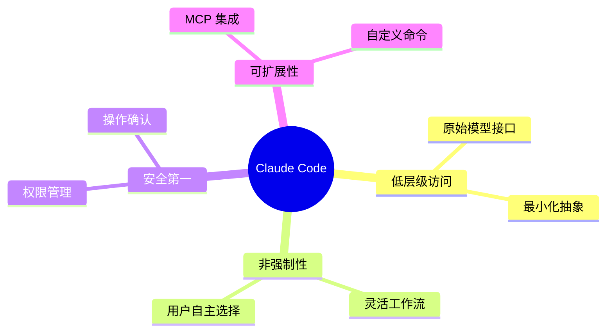

## 自定义设置详解

### 创建和优化 CLAUDE.md 文件

`CLAUDE.md` 是 Claude Code 的核心配置文件，会在每次会话开始时自动加载到上下文中。合理配置这个文件是提升效率的关键。

#### 推荐的 CLAUDE.md 结构

```markdown
# 项目概览
这是一个基于 React 和 TypeScript 的前端项目

# 常用命令
- `npm run dev`: 启动开发服务器
- `npm run build`: 构建生产版本
- `npm run test`: 运行测试套件
- `npm run lint`: 运行代码检查
- `npm run typecheck`: 运行类型检查

# 代码风格指南
- 使用 ES6+ 模块语法 (import/export)
- 优先使用函数式组件和 Hooks
- 使用 TypeScript 严格模式
- 遵循 ESLint 和 Prettier 配置
- 组件文件使用 PascalCase 命名

# 项目结构
- `/src/components`: 可复用组件
- `/src/pages`: 页面组件
- `/src/utils`: 工具函数
- `/src/types`: TypeScript 类型定义

# 测试策略
- 使用 Jest 和 React Testing Library
- 每个组件都应有对应的测试文件
- 优先编写单元测试，再考虑集成测试

# 开发环境
- Node.js 18+
- 使用 pnpm 作为包管理器
- 开发时使用 Vite 作为构建工具

# 特殊注意事项
- API 调用需要处理错误状态
- 所有用户输入都需要验证
- 图片资源放在 /public/images 目录下
```

#### CLAUDE.md 文件位置策略

Claude Code 会按以下优先级查找 CLAUDE.md 文件：

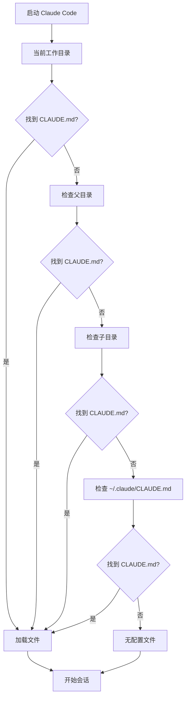

**文件命名建议：**
- `CLAUDE.md`: 团队共享配置，提交到版本控制
- `CLAUDE.local.md`: 个人配置，添加到 .gitignore
- `~/.claude/CLAUDE.md`: 全局配置，适用于所有项目

### 权限管理系统

Claude Code 采用保守的权限策略，默认会对所有可能修改系统的操作请求授权。

#### 权限管理方式

```mermaid
graph LR
    A[权限请求] --> B{管理方式}
    B --> C[会话中授权]
    B --> D[/permissions 命令]
    B --> E[编辑配置文件]
    B --> F[命令行参数]
    
    C --> G[Always Allow]
    D --> H[添加/移除工具]
    E --> I[.claude/settings.json]
    F --> J[--allowedTools]
```

#### 推荐的权限配置

```json
{
  "allowedTools": [
    "str_replace_editor",
    "bash",
    "computer",
    "mcp"
  ],
  "alwaysAllow": [
    "read_file",
    "list_files",
    "grep_search"
  ]
}
```

## 扩展 Claude 的能力

### 与 Bash 工具集成

Claude Code 继承您的完整 bash 环境，可以访问所有已安装的工具和命令。

#### 工具发现策略

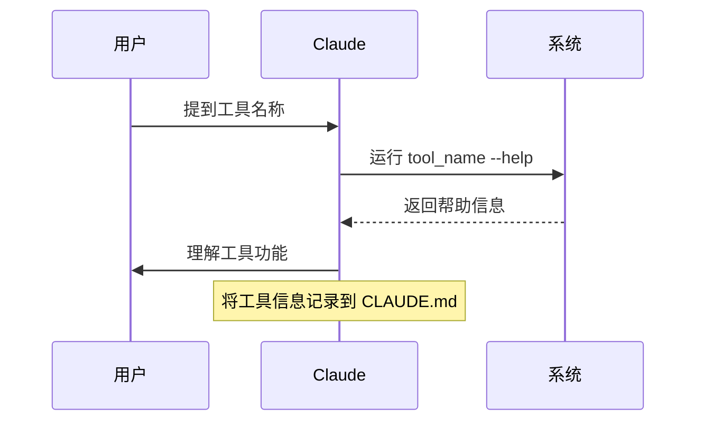

#### 常用工具集成示例

```markdown
# 开发工具集成

## Git 工具
- `gh`: GitHub CLI，用于 PR 管理
- `git-flow`: Git Flow 工作流支持

## 构建工具
- `docker`: 容器化部署
- `kubectl`: Kubernetes 集群管理

## 代码质量
- `sonar-scanner`: 代码质量分析
- `eslint`: JavaScript/TypeScript 代码检查

## 数据库工具
- `psql`: PostgreSQL 客户端
- `redis-cli`: Redis 命令行工具
```

### MCP (Model Context Protocol) 集成

Claude Code 支持通过 MCP 连接外部服务和工具，大大扩展其功能范围。

#### MCP 配置层次

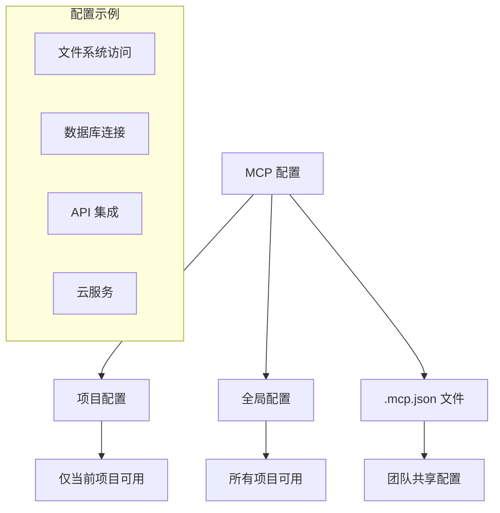

#### MCP 配置示例

```json
{
  "mcpServers": {
    "filesystem": {
      "command": "npx",
      "args": ["@modelcontextprotocol/server-filesystem", "/path/to/allowed/directory"],
      "env": {}
    },
    "postgres": {
      "command": "mcp-server-postgres",
      "args": ["--connection-string", "postgresql://localhost/mydb"],
      "env": {
        "POSTGRES_PASSWORD": "secret"
      }
    },
    "github": {
      "command": "mcp-server-github",
      "args": ["--token", "${GITHUB_TOKEN}"],
      "env": {}
    }
  }
}
```

### 自定义斜杠命令

为重复性工作流创建可复用的命令模板，提高开发效率。

#### 创建自定义命令

在 `.claude/commands/` 目录下创建 Markdown 文件：

```markdown
<!-- debug-loop.md -->
# 调试循环命令

请执行以下调试步骤：
1. 检查日志文件中的错误信息
2. 分析错误的根本原因
3. 提出修复建议
4. 实施修复方案
5. 验证修复结果

参数：$ARGUMENTS
```

#### 命令使用示例

```bash
# 调用自定义命令
/debug-loop "用户登录失败问题"
```

## 核心工作流程详解

### 探索-计划-编码-提交工作流

这是最通用的开发工作流程，适用于大多数编程任务。

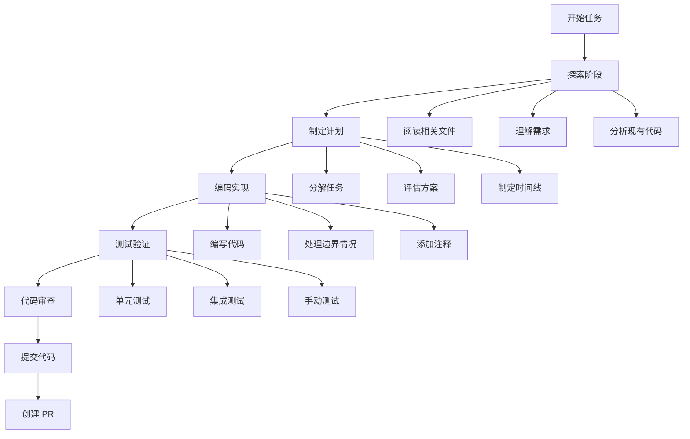

#### 实践示例

```markdown
# 探索阶段
请先阅读以下文件来理解当前的用户认证系统：
- src/auth/login.ts
- src/auth/middleware.ts
- tests/auth.test.ts

暂时不要编写任何代码，只需要理解现有实现。

# 计划阶段
基于你的理解，请制定一个详细的计划来实现双因素认证功能。
使用 "think" 关键词来触发深度思考模式，全面评估不同的实现方案。

# 编码阶段
现在请根据计划实现双因素认证功能。

# 提交阶段
请提交你的更改并创建一个 pull request，包含详细的描述和测试说明。
```

### 测试驱动开发 (TDD) 工作流

TDD 在智能编程中变得更加强大，能够确保代码质量和功能正确性。

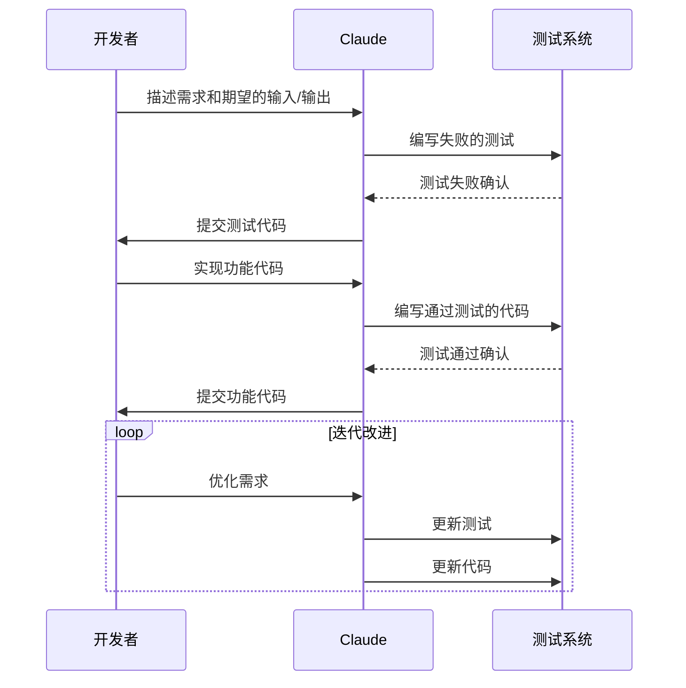

#### TDD 实践指南

```markdown
# 第一步：编写测试
我们正在进行测试驱动开发，请为用户注册功能编写测试。
期望的输入输出：
- 输入：{ email: "test@example.com", password: "securePassword123" }
- 输出：{ success: true, userId: "generated-id" }

请避免创建模拟实现，即使功能尚未存在。

# 第二步：确认测试失败
请运行测试并确认它们按预期失败。

# 第三步：实现功能
现在请编写通过所有测试的代码，不要修改测试文件。

# 第四步：迭代完善
请继续迭代直到所有测试通过。
```

### 视觉驱动开发工作流

适用于前端开发和 UI 组件创建，通过视觉反馈指导开发过程。

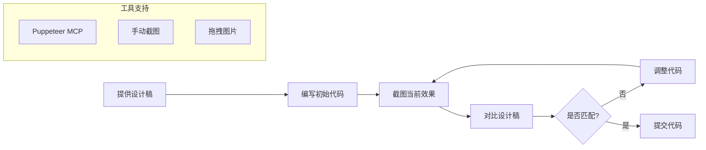

#### 视觉开发实践

```markdown
# 设置截图工具
请使用 Puppeteer MCP 服务器来自动截取浏览器截图。

# 提供设计目标
[拖拽设计稿图片到此处]

# 实现和迭代
请实现这个设计，截取结果截图，并持续迭代直到与设计稿匹配。

# 完成确认
当你满意结果时，请提交代码。
```

## 高级优化策略

### 上下文管理和性能优化

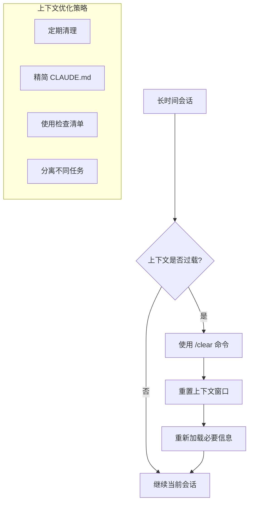

### 指令优化技巧

#### 明确性原则

```markdown
# 模糊指令（不推荐）
"修复这个 bug"

# 明确指令（推荐）
"修复用户登录时出现的 'Invalid token' 错误，
该错误发生在 src/auth/login.ts 第 45 行，
需要检查 JWT token 的验证逻辑"
```

#### 上下文提供

```markdown
# 缺乏上下文（不推荐）
"优化这个函数"

# 提供充分上下文（推荐）
"优化 getUserData 函数的性能，因为它在用户仪表板页面
被频繁调用，导致页面加载缓慢。请考虑添加缓存机制
或减少数据库查询次数。"
```

### 多 Claude 协作模式

利用多个 Claude 实例并行工作，提高开发效率。

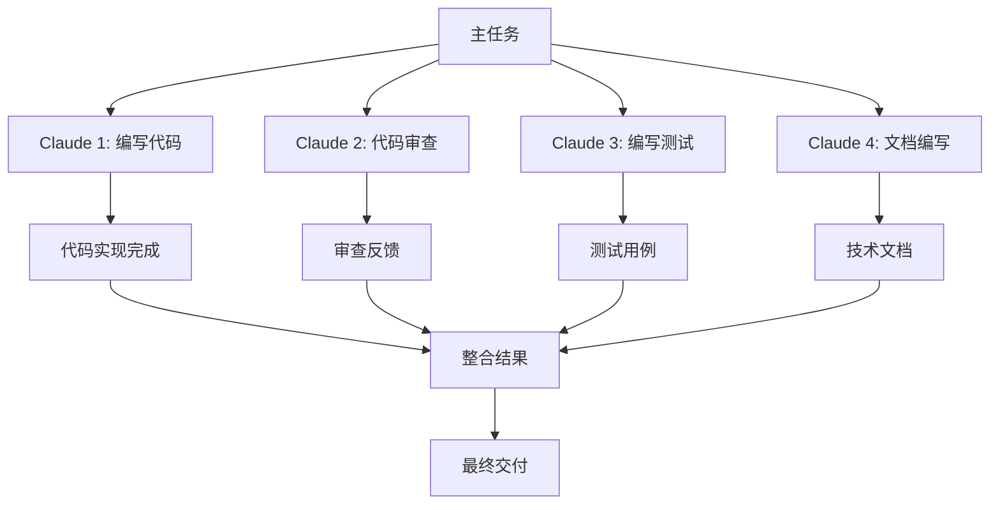

#### Git Worktree 工作流

```bash
# 创建多个工作树
git worktree add ../project-feature-a feature-a
git worktree add ../project-feature-b feature-b
git worktree add ../project-bugfix bugfix

# 在不同目录启动 Claude
cd ../project-feature-a && claude
cd ../project-feature-b && claude
cd ../project-bugfix && claude
```

## 常见问题和解决方案

### 权限和安全问题

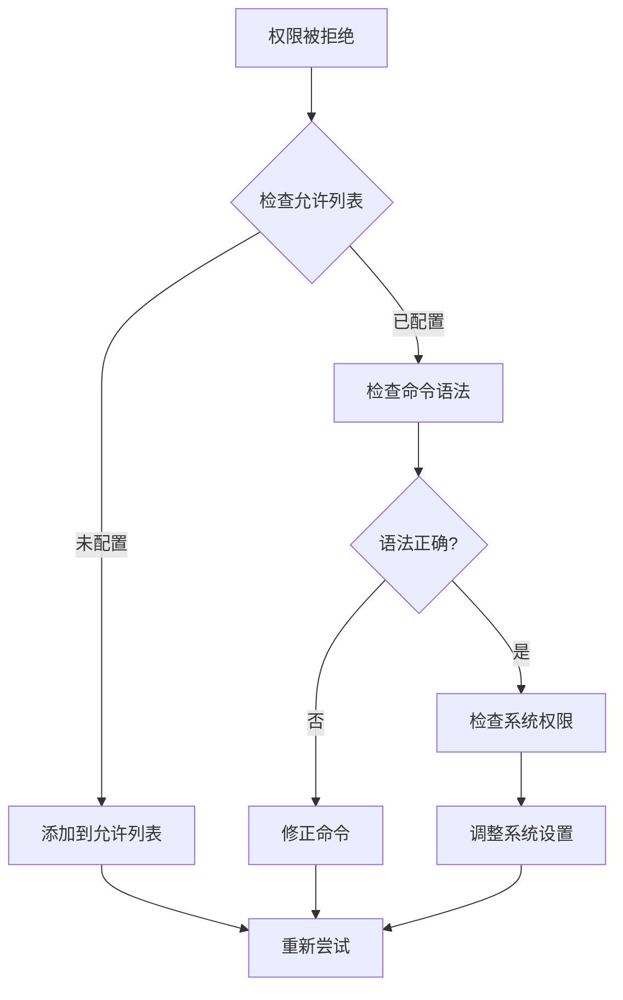

### 性能优化建议

```markdown
# 上下文管理
- 定期使用 /clear 清理上下文
- 保持 CLAUDE.md 文件精简
- 避免在单次会话中处理过多不相关任务

# 工具使用
- 优先使用并行工具调用
- 合理配置 MCP 服务器
- 定期更新工具权限列表

# 工作流程
- 将复杂任务分解为小步骤
- 使用检查清单跟踪进度
- 及时提交中间结果
```

## 完整工作流程图

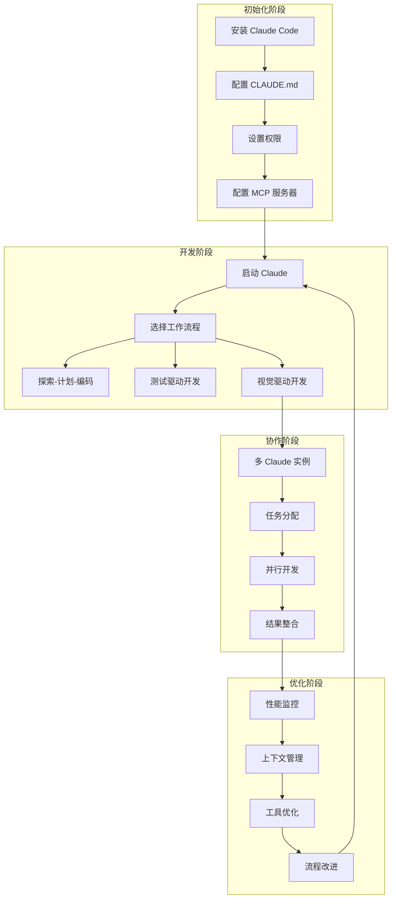

## 实际应用案例

### 案例1：全栈 Web 应用开发

```markdown
# 项目：电商平台开发

## 阶段1：项目初始化
- 使用 Claude 设置项目结构
- 配置开发环境和工具链
- 创建基础的 CLAUDE.md 配置

## 阶段2：后端 API 开发
- 使用 TDD 工作流开发 REST API
- 实现用户认证和授权
- 集成数据库和缓存系统

## 阶段3：前端界面开发
- 使用视觉驱动工作流创建 UI 组件
- 实现响应式设计
- 集成状态管理和路由

## 阶段4：测试和部署
- 编写端到端测试
- 配置 CI/CD 流水线
- 部署到生产环境
```

### 案例2：遗留系统重构

```markdown
# 项目：老旧 PHP 系统迁移到 Node.js

## 阶段1：代码分析
- 使用 Claude 分析现有 PHP 代码结构
- 识别核心业务逻辑和数据流
- 制定迁移策略和时间计划

## 阶段2：渐进式迁移
- 创建多个 git worktree 并行工作
- 逐模块重写为 Node.js
- 保持 API 兼容性

## 阶段3：数据迁移
- 设计数据迁移脚本
- 实现数据验证和一致性检查
- 执行灰度发布

## 阶段4：监控和优化
- 实施性能监控
- 优化数据库查询
- 调整系统配置
```

## 结论

Claude Code 作为一款革命性的智能编程工具，通过其灵活的设计和强大的扩展能力，为开发者提供了前所未有的编程体验。通过合理配置环境、选择适当的工作流程、优化使用策略，开发者可以显著提升编程效率和代码质量。

本指南涵盖了从基础配置到高级优化的完整使用方法，适用于个人开发者和团队协作场景。随着 AI 技术的不断发展，Claude Code 将继续演进，为智能编程领域带来更多创新可能。

建议开发者：
1. 从简单的配置开始，逐步探索高级功能
2. 根据项目特点选择合适的工作流程
3. 积极参与社区讨论，分享使用经验
4. 持续关注工具更新，及时采用新特性

通过持续实践和优化，每个开发者都能找到最适合自己的 Claude Code 使用方式，真正实现智能编程的价值最大化。