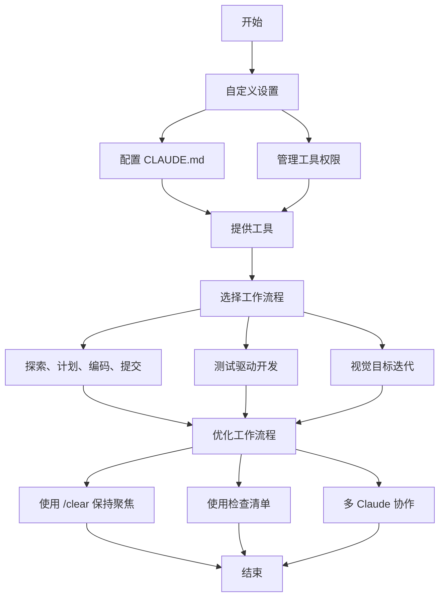

## 引言

Claude Code 是 Anthropic 开发的一款用于智能编码（Agentic Coding）的命令行工具。它为开发者提供了一种更原生的方式将 Claude 集成到编码工作流程中。Claude Code 保持低层级和无强制性，几乎提供了对模型的原始访问，而不强加特定的工作流。这种设计理念造就了一个灵活、可定制、可脚本化且安全的强大工具。

本文将详细介绍 Claude Code 的最佳实践，帮助开发者更好地利用这一工具提升编码效率。

## 自定义设置

### 创建 CLAUDE.md 文件

CLAUDE.md 是一个特殊文件，Claude 在开始对话时会自动将其拉入上下文。这使其成为记录以下内容的理想场所：

- 常用 bash 命令
- 核心文件和工具函数
- 代码风格指南
- 测试说明
- 仓库规范（如分支命名、合并 vs. rebase 等）
- 开发环境设置（如 pyenv 使用、可用编译器等）
- 项目中特有的异常行为或警告
- 其他信息你希望 Claude 记住

示例 CLAUDE.md 内容：

```markdown
# Bash commands
- npm run build: Build the project
- npm run typecheck: Run the typechecker

# Code style
- Use ES modules (import/export) syntax, not CommonJS (require)
- Destructure imports when possible (eg. import { foo } from 'bar')

# Workflow
- Be sure to typecheck when you're done making a series of code changes
- Prefer running single tests, and not the whole test suite, for performance
```

你可以将 CLAUDE.md 文件放在多个位置：

- 仓库根目录，或你运行 claude 的地方（最常见）。命名为 CLAUDE.md 并提交到 git，以便在会话间和团队成员间共享（推荐）；或命名为 CLAUDE.local.md 并加入 .gitignore
- 你运行 claude 目录的任意父级。这对 monorepo 特别有用
- 你运行 claude 目录的任意子级。这种情况下，Claude 会在你处理子目录文件时按需拉入 CLAUDE.md
- 你的 home 文件夹（~/.claude/CLAUDE.md），适用于所有 claude 会话

### 管理 Claude 的允许工具列表

默认情况下，Claude Code 对任何可能修改系统的操作（如文件写入、许多 bash 命令、MCP 工具等）都会请求权限。我们有意采用这种保守设计以优先保证安全。你可以自定义允许列表，添加你认为安全的工具，或允许易于撤销的潜在不安全工具（如文件编辑、git commit）。

管理允许工具有四种方式：

1. 在会话中被提示时选择"Always allow"
2. 启动 Claude Code 后使用 /permissions 命令添加或移除允许列表中的工具
3. 手动编辑 .claude/settings.json 或 ~/.claude.json 文件
4. 使用 --allowedTools 命令行参数设置会话特定权限

## 为 Claude 提供更多工具

### 使用 Claude 与 bash 工具结合

Claude Code 继承你的 bash 环境，使其能够访问你的所有工具。虽然 Claude 知道常见的实用程序如 unix 工具和 gh，但如果没有指示，它不会知道您的自定义 bash 工具：

1. 告诉 Claude 工具名称及使用示例
2. 让 Claude 运行 --help 查看工具文档
3. 在 CLAUDE.md 中记录常用工具

### 使用 Claude 与 MCP 结合

Claude Code 既可作为 MCP 服务器也可作为客户端。作为客户端时，它可以通过三种方式连接任意数量的 MCP 服务器以访问其工具：

- 在项目配置中（在该目录下运行 Claude Code 时可用）
- 在全局配置中（在所有项目中可用）
- 在已提交的 .mcp.json 文件中（对代码库中的任何人都可用）

### 使用自定义斜杠命令

对于重复的工作流程——调试循环、日志分析等——将提示模板存储在 .claude/commands 文件夹中的 Markdown 文件中。当您键入 / 时，这些命令会出现在斜杠命令菜单中。您可以将这些命令提交到 git 中，使其对团队其他成员可用。

自定义斜杠命令可以包含特殊关键字 $ARGUMENTS，用于从命令调用中传递参数。

## 常见工作流程

### 探索、计划、编码、提交

这个多功能的工作流程适用于许多问题：

1. 让 Claude 阅读相关文件、图像或 URL，可以提供一般性指引（"读取处理日志的文件"）或具体文件名（"读取 logging.py"），但要明确告诉它暂时不要编写任何代码。
2. 让 Claude 制定解决特定问题的计划。我们建议使用 "think" 这个词来触发扩展思考模式，这会给 Claude 更多的计算时间来更彻底地评估替代方案。
3. 让 Claude 用代码实现其解决方案。
4. 让 Claude 提交结果并创建一个 pull request。

### 编写测试、提交；编码、迭代、提交

这是 Anthropic 最喜欢的工作流程，适用于可以通过单元测试、集成测试或端到端测试轻松验证的更改。测试驱动开发（TDD）在智能编码中变得更加强大：

1. 让 Claude 根据预期的输入/输出对编写测试。明确说明您正在进行测试驱动开发，这样它可以避免创建模拟实现，即使对于代码库中尚不存在的功能也是如此。
2. 告诉 Claude 运行测试并确认它们是否失败。
3. 当您对测试满意时，让 Claude 提交测试。
4. 让 Claude 编写通过测试的代码，命令它不要修改测试。
5. 告诉 Claude 继续直到所有测试通过。
6. 让 Claude 提交代码，当您对更改满意时。

### 编写代码、截图结果、迭代

与测试工作流程类似，您可以为 Claude 提供视觉目标：

1. 为 Claude 提供一种截取浏览器截图的方法（例如使用 Puppeteer MCP 服务器或手动将截图复制/粘贴到 Claude 中）。
2. 通过复制/粘贴或拖放图像，或给 Claude 图像文件路径，为 Claude 提供一个视觉模拟。
3. 让 Claude 用代码实现设计，截取结果的截图，并迭代直到其结果与模拟匹配。
4. 当您满意时，让 Claude 提交。

## 优化工作流程

### 指令要具体明确

Claude Code 的成功率会随着指令的具体程度显著提高，特别是在首次尝试时。预先给出明确指示能减少后续修正的需要。

### 为 Claude 提供图像

Claude 通过以下几种方式能出色处理图像和图表：

- 直接粘贴截图
- 将图像直接拖拽至提示输入框
- 提供图像文件路径

### 明确指定需要 Claude 查看或处理的文件

使用 Tab 键自动补全功能快速引用代码库中的任意文件或文件夹，帮助 Claude 准确定位或更新目标资源。

### 为 Claude 提供 URL 链接

在提示词中粘贴特定 URL，Claude 将自动获取并阅读内容。

### 及时修正与频繁调整

虽然自动接受模式（通过 shift+tab 切换）能让 Claude 自主工作，但通过主动协作引导 Claude 通常能获得更好结果。最佳实践是在任务开始时向 Claude 完整说明需求，但您也可随时进行以下修正操作：

- 预先规划：要求 Claude 先制定计划，明确指示其未经确认不得开始编码
- 即时中断（按 Esc 键）：可在 Claude 思考、调用工具或编辑文件时暂停当前操作
- 历史回溯（双击 Esc 键）：回退至历史节点，修改先前提示以探索不同方案
- 撤销变更：常与第 2 项配合使用，要求 Claude 撤回更改并尝试新方案

### 使用 /clear 保持上下文聚焦

在长时间会话中，Claude 的上下文窗口可能积累无关对话、文件内容和命令，从而影响性能或导致分心。建议在不同任务间频繁使用 /clear 命令重置上下文窗口。

### 使用检查清单和草稿板处理复杂工作流

对于多步骤任务或需要详尽解决方案的场景（如代码迁移、修复大量 lint 错误、运行复杂构建脚本），可通过让 Claude 使用 Markdown 文件（甚至 GitHub issue！）作为检查清单和工作草稿板来提升效率。

## 多 Claude 协作提升效率

### 一个 Claude 写代码，另一个 Claude 审查

一个简单但有效的方法是让一个 Claude 编写代码，同时另一个审查或测试它。类似于与多个工程师合作，有时保持独立的上下文是有益的：

1. 使用 Claude 编写代码
2. 运行 /clear 或在另一个终端启动第二个 Claude
3. 让第二个 Claude 审查第一个 Claude 的工作
4. 启动另一个 Claude（或再次 /clear）来阅读代码和审查反馈
5. 让这个 Claude 根据反馈修改代码

### 创建仓库的多个检出

Anthropic 的许多工程师不是等待 Claude 完成每一步，而是这样做：

1. 在单独的文件夹中创建 3-4 个 git 检出
2. 在每个终端标签页中打开每个文件夹
3. 在每个文件夹中启动 Claude 执行不同的任务
4. 循环检查进度并批准/拒绝权限请求

### 使用 git worktree

这种方法适用于多个独立任务，提供了比多个检出更轻量级的替代方案。Git worktree 允许您将同一仓库的多个分支检出到单独的目录中。每个 worktree 都有自己的工作目录和隔离的文件，同时共享相同的 Git 历史和 reflog。

## Claude Code 工作流程图示

下面的流程图展示了 Claude Code 的典型工作流程：



## 结论

Claude Code 是一个功能强大的智能编码工具，通过合理配置和使用最佳实践，可以显著提升开发效率。本文介绍的各种技巧和方法，既适用于 Anthropic 内部团队，也适用于在各种代码库、语言和环境中使用 Claude Code 的外部工程师。建议开发者根据自己的实际需求，灵活运用这些方法，找到最适合自己的工作方式。