在AI技术飞速发展的今天，开发者们迫切需要一款能够真正理解代码、执行复杂任务的智能助手。**iFlow CLI**正是这样一款革命性的工具——它不仅仅是一个简单的命令行工具，更是一个功能强大的AI助手，能够直接在终端中为你提供从代码分析到项目管理的全方位支持。

## 🌟 什么是iFlow CLI？

iFlow CLI是一款直接在终端中运行的强大AI助手，它能够：

- **无缝分析代码仓库**：深入理解你的项目结构和代码逻辑
- **执行编程任务**：从简单的文件操作到复杂的开发工作流程
- **理解上下文需求**：通过自然语言交互，精准理解你的意图
- **自动化处理**：全面提升开发效率，让重复性工作成为历史

### 核心优势

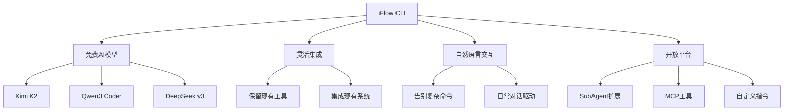

## 📊 功能对比分析

与其他AI编程工具相比，iFlow CLI在功能完整性和易用性方面具有显著优势：

| 功能特性 | iFlow CLI | Claude Code | Gemini CLI |
|---------|-----------|-------------|------------|
| 📋 Todo规划 | ✅ | ✅ | ❌ |
| 🤖 SubAgent | ✅ | ✅ | ❌ |
| ⚙️ 自定义Command | ✅ | ✅ | ✅ |
| 📈 Plan模式 | ✅ | ✅ | ❌ |
| 🛠️ Task工具 | ✅ | ✅ | ❌ |
| 💻 VS Code插件 | ✅ | ✅ | ✅ |
| 🔧 JetBrain插件 | ✅ | ✅ | ❌ |
| 💬 对话恢复 | ✅ | ✅ | ❌ |
| 🏪 内置开放市场 | ✅ | ❌ | ❌ |
| 🧠 Memory自动压缩 | ✅ | ✅ | ✅ |
| 🎨 多模态能力 | ✅ | ⚠️(国内限制) | ⚠️(国内限制) |
| 🔍 搜索功能 | ✅ | ❌ | ⚠️(需翻墙) |
| 💰 完全免费 | ✅ | ❌ | ⚠️(有限制) |

## 🛠️ 安装与配置

### 系统要求

在开始安装之前，请确保你的系统满足以下要求：

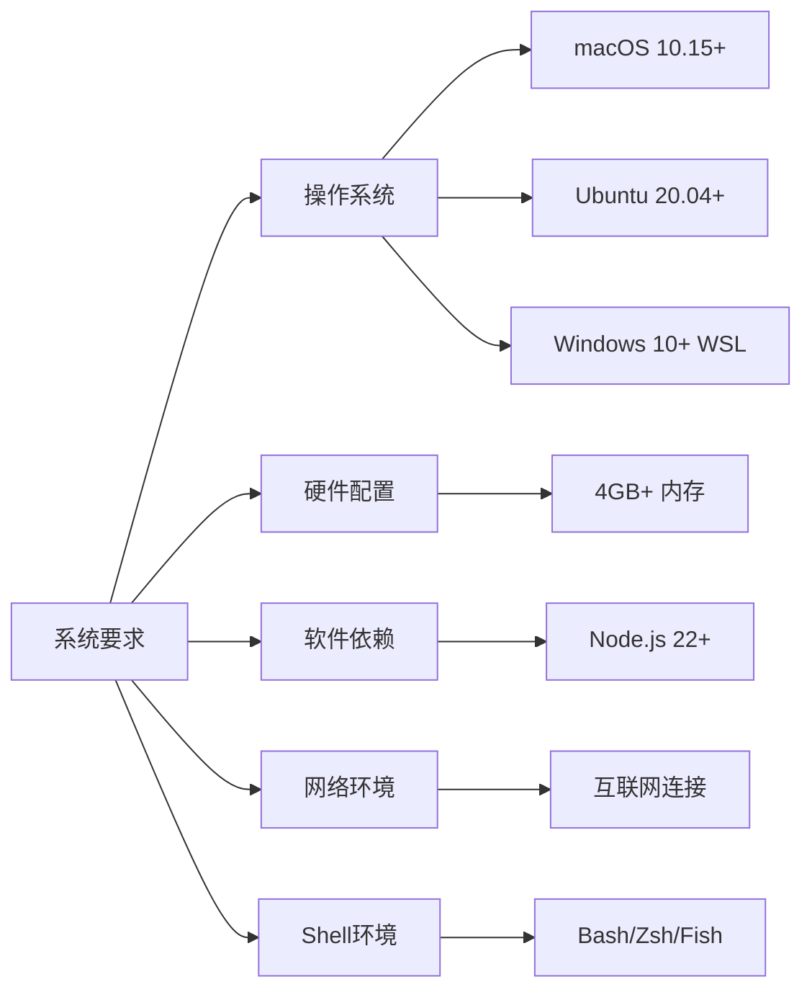

### 安装流程

根据你的操作系统选择合适的安装方式：

#### macOS/Linux/Ubuntu 用户

**方式一：一键安装（推荐）**

```bash
bash -c "$(curl -fsSL https://cloud.iflow.cn/iflow-cli/install.sh)"
```

**方式二：Node.js 安装**

```bash
npm i -g @iflow-ai/iflow-cli
```

#### Windows 用户

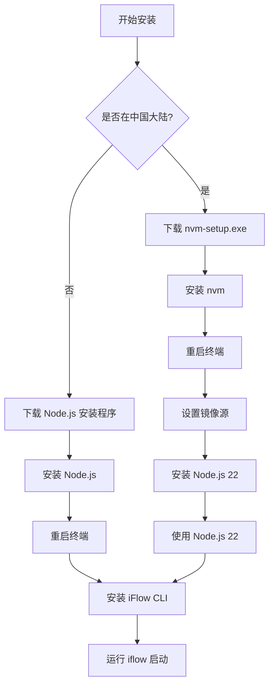

**国外用户：**

1. 访问 [Node.js官网](https://nodejs.org/zh-cn/download) 下载安装程序
2. 运行安装程序安装Node.js
3. 重启终端（CMD或PowerShell）
4. 运行 `npm install -g @iflow-ai/iflow-cli`
5. 运行 `iflow` 启动工具

**中国大陆用户：**

1. 下载 [nvm安装程序](https://cloud.iflow.cn/iflow-cli/nvm-setup.exe)
2. 运行安装程序安装nvm
3. **重启终端**（CMD或PowerShell）
4. 设置镜像源：
   ```bash
   nvm node_mirror https://npmmirror.com/mirrors/node/
   nvm npm_mirror https://npmmirror.com/mirrors/npm/
   ```
5. 安装Node.js：`nvm install 22`
6. 使用Node.js：`nvm use 22`
7. 安装iFlow CLI：`npm install -g @iflow-ai/iflow-cli`
8. 启动：`iflow`

## 🔑 身份验证设置

iFlow CLI提供两种身份验证方式，推荐使用原生身份验证以获得最佳体验：

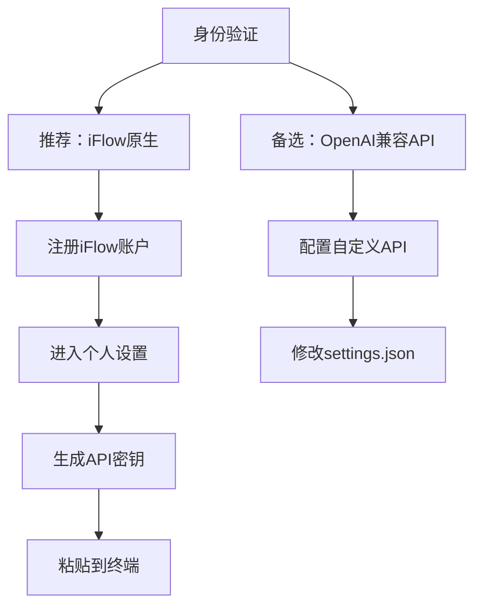

### 获取API Key步骤

1. **注册账户**：访问 [iFlow官网](https://iflow.cn) 注册账户
2. **进入设置**：登录后进入个人设置页面，或点击 [此直达链接](https://iflow.cn/?open=setting)
3. **生成密钥**：在弹出对话框中点击"重置"生成新的API密钥
4. **完成配置**：将生成的密钥粘贴到终端提示符中

> **提示**：在Windows的CMD或PowerShell中，请使用右键进行粘贴操作。

## 🚀 快速开始

### 启动iFlow CLI

在终端中导航到你的工作空间，然后输入：

```bash
iflow
```

### 新项目创建

对于全新项目，只需要用自然语言描述你的需求：

```bash
cd new-project/
iflow
> 使用 HTML 和 JavaScript 创建一个基于网页的俄罗斯方块游戏
```

### 现有项目处理

对于现有代码库，建议先使用 `/init` 命令让iFlow理解你的项目：

```bash
cd existing-project/
iflow
> /init
> 根据 requirement.md 文件中的PRD文档分析需求，输出技术文档，然后实现解决方案。
```

`/init` 命令会：
- 扫描代码库结构
- 学习项目架构
- 生成完整的IFLOW.md文档
- 为后续操作建立上下文

## 🎯 四种运行模式详解

iFlow CLI提供四种不同的运行模式，适应不同的使用场景和安全需求：

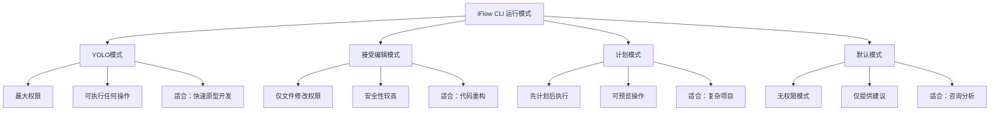

### 模式选择指南

- **YOLO模式**：适合快速原型开发和个人项目
- **接受编辑模式**：适合代码审查和安全重构
- **计划模式**：适合复杂项目和团队协作
- **默认模式**：适合代码咨询和学习

## 🤖 高级功能详解

### SubAgent功能

SubAgent将iFlow CLI从通用助手升级为专家团队，提供更专业的建议：

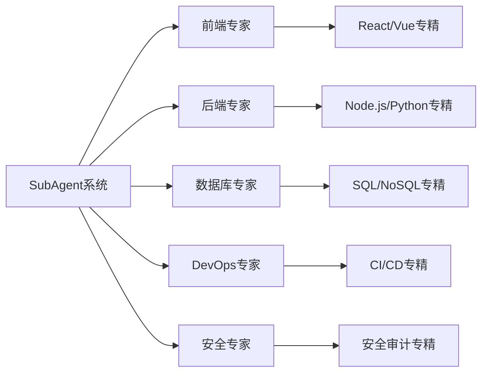

使用方式：
```bash
> /agent
```

### Task工具

Task工具有效压缩上下文长度，让CLI更彻底地完成任务：

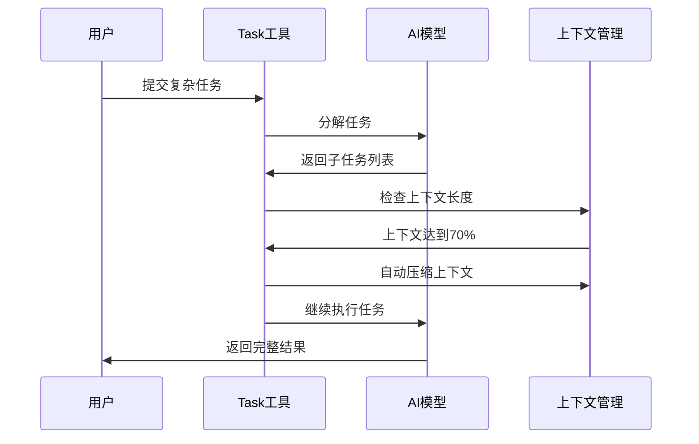

### MCP集成

通过心流开放市场快速扩展功能：

```bash
> /mcp
```

可安装的工具类型：
- **MCP工具**：扩展系统功能
- **SubAgents**：专业领域助手
- **自定义指令**：个性化命令

## 💡 实际应用场景

### 信息查询与规划

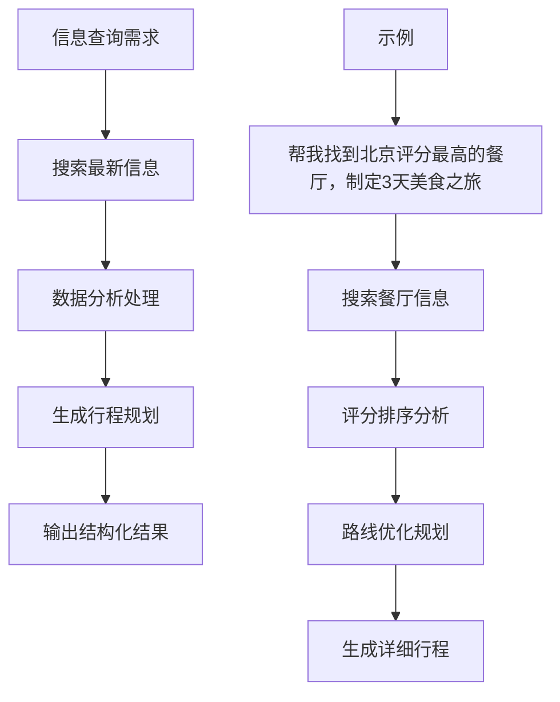

**示例命令：**
```bash
> 帮我找到北京评分最高的餐厅，制定一个3天的美食之旅行程。
> 搜索最新的 iPhone 价格对比，找到最具性价比的购买方案。
```

### 文件管理自动化

```bash
> 将我桌面上的文件按文件类型整理到不同的文件夹中。
> 批量下载这个网页上的所有图片，并按日期重命名。
```

### 数据分析处理

```bash
> 分析这个 Excel 表格中的销售数据，生成简单的图表。
> 从这些 CSV 文件中提取客户信息，合并成统一的表格。
```

### 开发支持

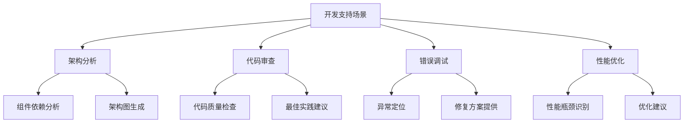

**示例命令：**
```bash
> 分析这个系统的主要架构组件和模块依赖关系。
> 我的请求后出现了空指针异常，请帮我找到问题原因。
```

### 工作流自动化

```bash
> 创建一个脚本，定期将我的重要文件备份到云存储。
> 编写一个程序，每天下载股票价格并发送邮件通知。
```

## ⚙️ 自定义配置

### 模型切换

iFlow CLI支持连接任何兼容OpenAI的API。编辑 `~/.iflow/settings.json` 文件来自定义配置：

```json
{
    "theme": "Default",
    "selectedAuthType": "iflow",
    "apiKey": "your iflow key",
    "baseUrl": "https://apis.iflow.cn/v1",
    "modelName": "Qwen3-Coder",
    "searchApiKey": "your iflow key"
}
```

### 配置参数说明

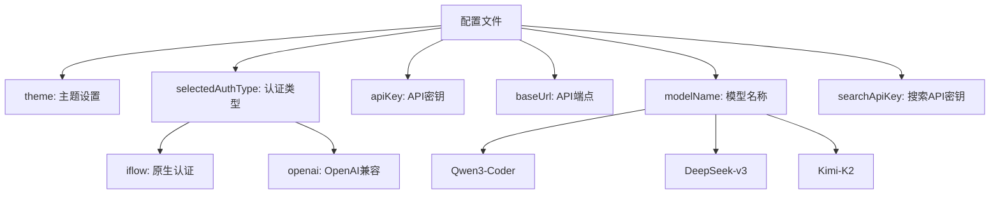

## 🔄 GitHub Actions集成

对于CI/CD工作流，可以使用社区维护的GitHub Action：

```yaml
name: iFlow CLI Automation
on: [push, pull_request]

jobs:
  analyze:
    runs-on: ubuntu-latest
    steps:
      - uses: actions/checkout@v3
      - uses: vibe-ideas/iflow-cli-action@v1
        with:
          api-key: ${{ secrets.IFLOW_API_KEY }}
          command: "分析代码质量并生成报告"
```

## 🎨 多模态功能

iFlow CLI支持多模态输入，包括图片分析：

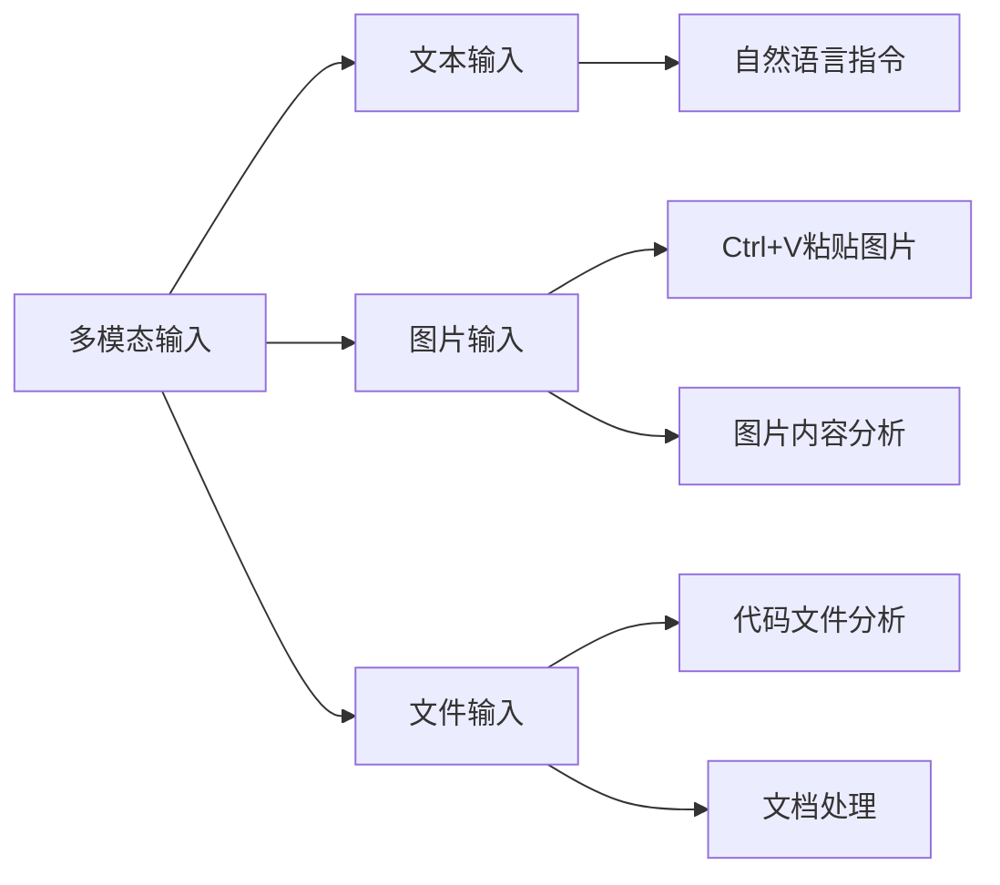

使用方式：
- 在对话中直接使用 `Ctrl+V` 粘贴图片
- AI会自动分析图片内容并结合文本指令执行任务

## 📱 IDE集成

### VS Code插件

iFlow CLI提供官方VS Code插件，实现无缝集成：

1. 在VS Code扩展商店搜索"iFlow"
2. 安装并配置API密钥
3. 享受编辑器内的AI助手功能

### JetBrains插件

支持IntelliJ IDEA、PyCharm等JetBrains系列IDE：

1. 在插件市场搜索"iFlow"
2. 安装并配置
3. 在IDE内直接使用AI功能

## 🗂️ 对话管理

### 对话历史

iFlow CLI支持对话历史保存和恢复：

```bash
# 恢复上次对话
iflow --resume

# 查看对话历史
> /chat
```

### 上下文管理

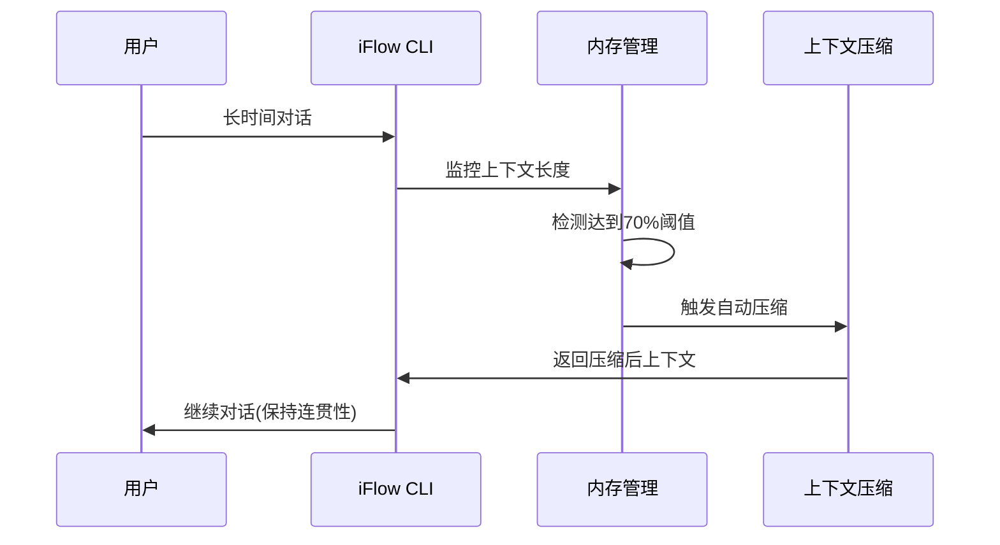

## 🛠️ 故障排除

### 常见问题

1. **安装失败**
   - 检查Node.js版本是否为22+
   - 确认网络连接正常
   - 尝试使用镜像源

2. **认证问题**
   - 验证API密钥是否正确
   - 检查网络连接
   - 重新生成API密钥

3. **功能异常**
   - 更新到最新版本
   - 清除缓存：删除 `~/.iflow` 目录
   - 重新安装

### 卸载

如需卸载iFlow CLI：

```bash
npm uninstall -g @iflow-ai/iflow-cli
```

## 🌐 社区与支持

### 获取帮助

- **GitHub Issues**：在 [项目页面](https://github.com/iflow-ai/iflow-cli) 提交问题
- **官方文档**：访问 [心流开放平台](https://platform.iflow.cn/) 获取更多教程
- **微信群**：扫描官方二维码加入社区讨论

### 贡献指南

iFlow CLI是开源项目，欢迎社区贡献：

1. Fork项目仓库
2. 创建功能分支
3. 提交代码更改
4. 发起Pull Request

## 🎯 总结

iFlow CLI作为一款革命性的AI终端助手，为开发者提供了前所未有的编程体验。通过其强大的功能和灵活的配置，它不仅能够提升开发效率，更能够成为你在编程路上的得力伙伴。

### 核心价值

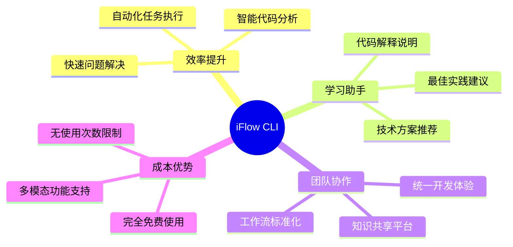

无论你是初学者还是资深开发者，无论是个人项目还是团队协作，iFlow CLI都能为你提供强大而贴心的AI支持。现在就开始你的AI编程之旅吧！

---

*更多使用技巧和高级功能，请关注我们的后续文章或访问官方文档。如果这篇文章对你有帮助，欢迎分享给更多的开发者朋友！*
