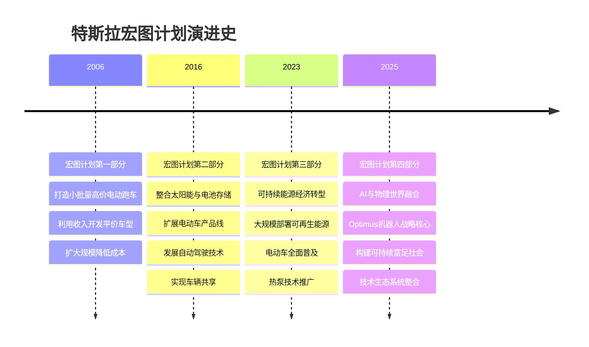
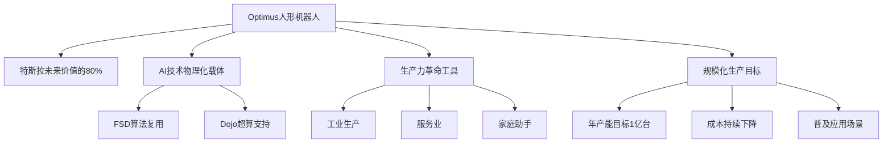
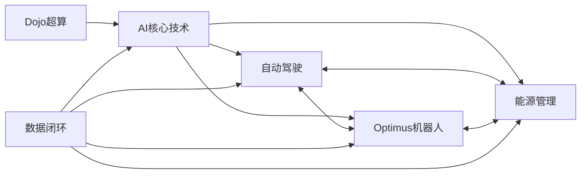
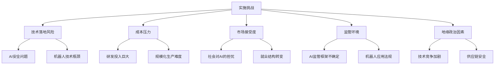

2025年9月2日，特斯拉发布了备受期待的"宏图计划第四篇章"（Master Plan Part IV），标志着这家电动汽车巨头正式将战略重心从电动汽车和能源领域转向人工智能（AI）与机器人技术的深度融合。这份宏图计划不仅展示了特斯拉对未来的宏伟构想，更揭示了埃隆·马斯克（Elon Musk）对人类社会发展的全新愿景：通过将AI引入物理世界，实现"可持续富足"的社会形态。

## 宏图计划的历史演进

在深入解读第四篇章之前，让我们回顾特斯拉宏图计划的历史演进：

特斯拉的宏图计划展现了公司战略重心的持续演进：从最初专注于电动汽车的商业化，到整合可再生能源生态系统，再到如今的AI与物理世界融合。每一步都建立在前一步的基础上，形成了一个连贯且不断扩展的战略愿景。

## 第四篇章的核心理念

宏图计划第四篇章以"将AI融入物理世界"为核心主题，提出了五大指导原则：

### 1. 增长是无限的

特斯拉挑战了传统经济学中资源有限的观念，提出科技进步能够持续拓展经济边界。在这一原则下，AI和自动化不是威胁，而是释放人类潜力的工具，能够推动整体社会进步。

### 2. 创新消除约束

通过技术创新，特斯拉认为人类可以突破资源稀缺的限制，实现可持续发展。这一理念与马斯克在其他公司（如SpaceX、Neuralink）的愿景一脉相承，都致力于通过技术突破现有边界。

### 3. 用技术解决现实问题

特斯拉强调技术应用必须专注于解决具体挑战，如提升电网清洁性、降低交通事故率、提高出行效率等，而非仅为技术而技术。

### 4. 自动化必须造福全人类

计划明确指出，确保自动化技术的应用惠及全人类，而非少数群体，是特斯拉的核心价值观之一。这反映了马斯克对技术发展社会责任的思考。

### 5. 更广泛的普及带来更大的增长

特斯拉相信，只有通过大规模应用技术，才能实现更广泛的社会进步。这也解释了为何特斯拉计划大规模生产Optimus机器人，而非将其作为小众产品。

## Optimus：战略核心

在宏图计划第四篇章中，特斯拉的人形机器人"擎天柱"（Optimus）被提升至前所未有的战略高度。马斯克公开表示，未来特斯拉约80%的价值将来自Optimus，这一惊人预测凸显了机器人业务在特斯拉未来发展中的核心地位。

### Optimus的技术路线

特斯拉计划通过技术复用最大化Optimus的发展速度：

1. **算法复用**：将全自动驾驶（FSD）的计算机视觉和决策算法应用于Optimus，使其能够理解并适应复杂环境
2. **硬件协同**：利用电动车生产线的经验，实现机器人的规模化生产
3. **AI训练加速**：依托Dojo超级计算机，为Optimus提供强大的训练能力

### 规模化生产与应用

特斯拉为Optimus设定了极其宏大的生产目标：年产能达到1亿台。这一数字甚至超过了全球汽车年产量，反映了特斯拉对机器人市场潜力的乐观预期。

应用场景将覆盖：
- 工业生产线
- 服务业前线
- 家庭助理
- 危险环境作业
- 医疗辅助

## 技术生态系统的整合

宏图计划第四篇章的一个关键亮点是特斯拉对技术生态系统的整体构想：

### AI与物理世界的闭环

特斯拉计划构建一个AI、机器人、能源和交通的闭环生态系统：

1. **技术复用**：各业务线共享核心AI技术，降低研发成本
2. **数据协同**：利用Dojo超级计算机整合来自汽车、机器人和能源系统的多源数据
3. **物理实现**：通过电动车和机器人，将AI能力具象化到物理世界

### 能源革命的延续

值得注意的是，特斯拉并未放弃能源业务，而是将其纳入更大的技术生态系统：

- 太阳能发电与储能系统为AI和机器人提供可持续能源基础
- AI优化能源系统效率，实现智能电网管理
- Optimus可协助太阳能面板安装和维护，降低可再生能源成本

## 可持续富足：终极愿景

宏图计划第四篇章的终极目标是构建"可持续富足"的社会形态。这一概念包含两个关键维度：

### 可持续性

特斯拉认为，只有通过技术创新，才能实现经济增长与环境保护的双赢：

- 清洁能源替代化石燃料
- 资源高效利用减少浪费
- 循环经济模式降低环境负担

### 富足

更具革命性的是特斯拉对"富足"的定义——通过AI和自动化，重构人类社会的资源分配方式：

- 机器人大幅提升生产力，降低商品和服务成本
- 自动化系统减少必要劳动时间，释放人类创造力
- 技术普惠确保增长成果广泛分享

## 挑战与风险

尽管宏图计划第四篇章描绘了宏伟蓝图，但特斯拉在实现过程中面临诸多挑战：

### 技术落地风险

- 通用人形机器人的技术难度远超自动驾驶
- AI安全问题需要严格把控
- 机器人操作精度与人类相比仍有差距

### 经济与市场挑战

- 研发投入巨大，可能影响短期盈利能力
- 消费者对机器人的接受度尚未验证
- 价格需要大幅下降才能实现大规模普及

### 社会与监管问题

- 自动化对就业市场的冲击需要社会适应
- AI和机器人的监管框架尚不完善
- 隐私和安全问题需要平衡

## 对产业的影响

宏图计划第四篇章若能成功实施，将对多个产业产生深远影响：

### 汽车产业

- 自动驾驶技术加速普及
- 车辆功能从交通工具向移动平台转变
- 传统汽车制造商面临更大转型压力

### 能源产业

- 可再生能源与AI深度融合
- 智能电网管理优化能源分配
- 分布式能源系统普及加速

### 制造业

- 生产线自动化程度大幅提升
- 人机协作模式重塑工厂运营
- 柔性制造能力显著增强

### 服务业

- 人形机器人承担重复性服务工作
- 服务业就业结构转向创意和情感劳动
- 服务可及性和质量提升

## 与竞争对手的比较

特斯拉的宏图计划第四篇章与其他科技巨头的AI战略有何不同？

| 公司 | AI战略重点 | 物理世界融合 | 生态系统构建 |
|------|------------|--------------|--------------|
| 特斯拉 | 通用AI + 机器人 | 高度融合 | 闭环生态系统 |
| 谷歌/DeepMind | 通用AI研究 | 部分融合 | 开放平台 |
| 微软/OpenAI | 大语言模型 | 有限融合 | 云服务整合 |
| 亚马逊 | 实用AI应用 | 仓储自动化 | 电商生态 |
| 苹果 | 设备端AI | 消费电子 | 硬件生态 |

特斯拉的独特之处在于将AI、机器人、能源和交通紧密整合，构建一个完整的技术生态系统，而非仅专注于某一领域的AI应用。

## 结论与展望

特斯拉的宏图计划第四篇章展示了一个雄心勃勃的未来愿景，将AI与物理世界深度融合，重构人类社会的生产和生活方式。这一战略若能成功实施，其影响深度和广度或将远超互联网革命，正如特斯拉在计划中所述："这一次，不是改变一个行业，而是重塑整个文明的底层逻辑。"

然而，从愿景到现实的道路充满挑战。特斯拉需要在技术突破、成本控制、市场教育和监管适应等多方面取得平衡。投资者、消费者和政策制定者都应密切关注特斯拉在实施这一宏伟计划过程中的进展。

无论最终结果如何，宏图计划第四篇章已经为我们提供了一个思考未来的全新框架：AI不仅仅是软件世界的革命，更将深刻改变我们与物理世界的互动方式，并可能为人类社会的可持续发展提供新的路径。

---

*注：本文基于特斯拉官方发布的"宏图计划第四篇章"及相关公开信息撰写，旨在提供客观分析，不构成投资建议。*
