## 什么是 eBPF？

eBPF（extended Berkeley Packet Filter）是一个革命性的内核技术，允许用户在内核空间安全地运行沙盒程序，而无需修改内核源码或加载内核模块。它提供了动态编程内核的能力，实现高效的网络、可观测性、追踪和安全性功能。

## eBPF 核心特性

### 性能优势

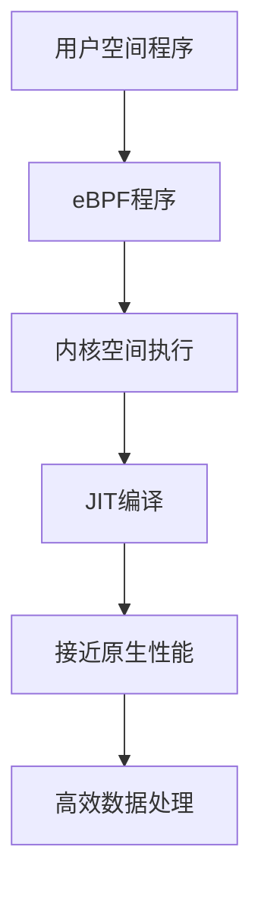

### 安全机制

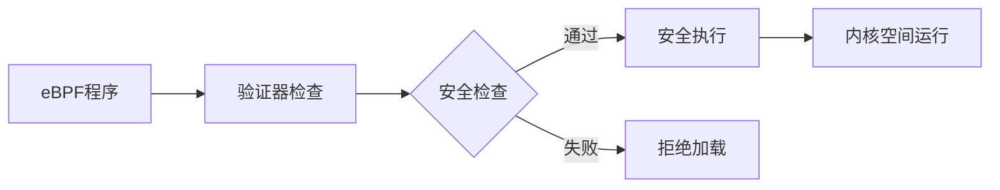

### 灵活性

- **动态加载**：无需重启系统即可加载新功能
- **热更新**：实时修改和更新程序
- **多钩子点**：支持多种内核事件钩子

## eBPF 架构详解

### 整体架构

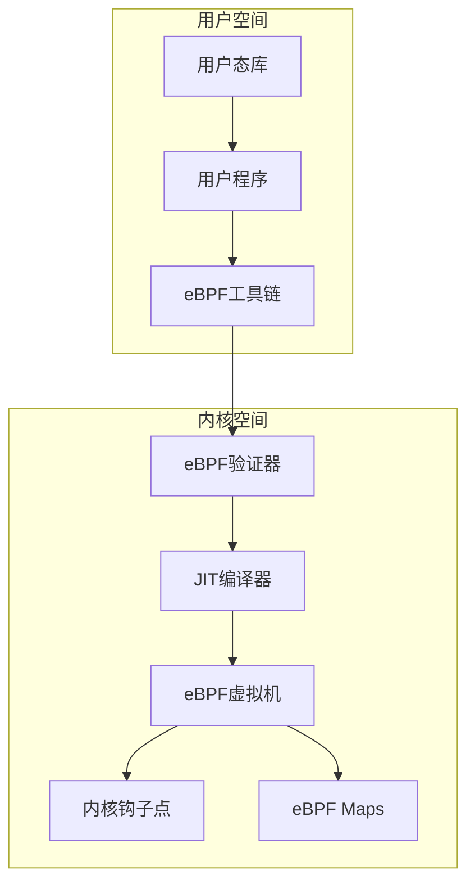

### 程序执行流程

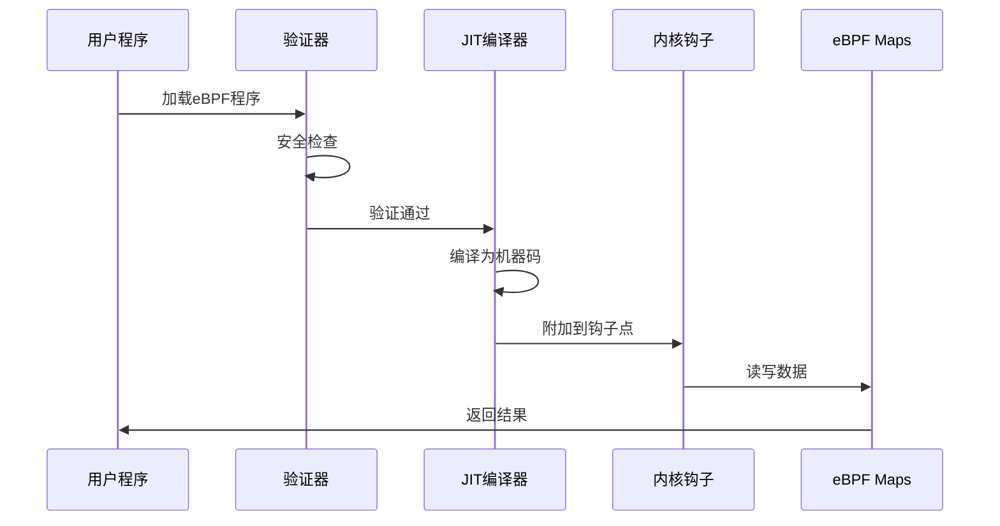

## 安装和配置

### 系统要求

- Linux 内核 4.4+（推荐 5.4+）
- 支持 eBPF 的架构（x86_64, ARM64）
- 足够的权限（通常需要 root）

### 检查内核支持

```bash
# 检查内核版本
uname -r

# 检查 eBPF 支持
ls /sys/fs/bpf/

# 检查 JIT 支持
cat /proc/sys/net/core/bpf_jit_enable
```

### 安装 eBPF 工具链

```bash
# Ubuntu/Debian
sudo apt update
sudo apt install -y \
    bpfcc-tools \
    linux-headers-$(uname -r) \
    clang \
    llvm \
    libbpf-dev

# CentOS/RHEL
sudo yum install -y \
    bcc-tools \
    kernel-devel \
    clang \
    llvm \
    libbpf-devel

# 安装 Go eBPF 库
go get github.com/cilium/ebpf
```

## Go eBPF 开发

### 基本项目结构

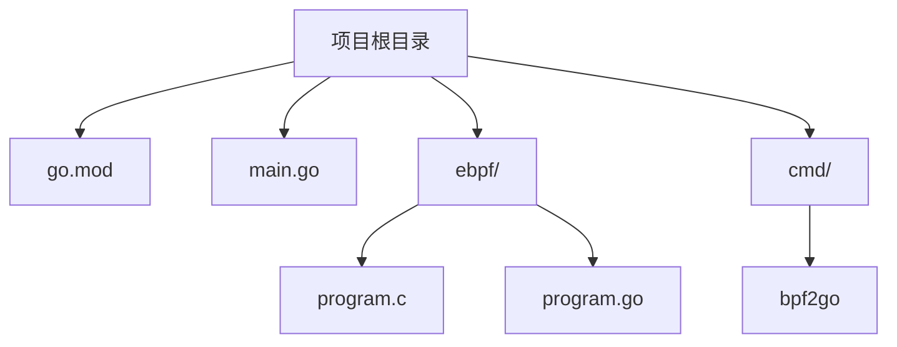

### 创建基本 eBPF 程序

#### 1. 初始化项目

```bash
mkdir ebpf-example
cd ebpf-example
go mod init ebpf-example
go get github.com/cilium/ebpf
```

#### 2. 编写 eBPF C 程序

```c
// ebpf/program.c
#include <linux/bpf.h>
#include <bpf/bpf_helpers.h>

struct {
    __uint(type, BPF_MAP_TYPE_ARRAY);
    __uint(max_entries, 1);
    __type(key, int);
    __type(value, long);
} counter_map SEC(".maps");

SEC("tracepoint/syscalls/sys_enter_execve")
int trace_execve(void *ctx)
{
    int key = 0;
    long *value = bpf_map_lookup_elem(&counter_map, &key);
    if (value) {
        __sync_fetch_and_add(value, 1);
    }
    return 0;
}

char _license[] SEC("license") = "GPL";
```

#### 3. 生成 Go 绑定代码

```bash
# 安装 bpf2go 工具
go install github.com/cilium/ebpf/cmd/bpf2go@latest

# 生成 Go 绑定
bpf2go -cc clang -cflags $BPF_CFLAGS Counter ebpf/program.c
```

#### 4. 编写 Go 主程序

```go
// main.go
package main

import (
    "fmt"
    "log"
    "os"
    "os/signal"
    "syscall"
    "time"

    "github.com/cilium/ebpf"
    "github.com/cilium/ebpf/link"
)

func main() {
    // 加载 eBPF 程序
    spec, err := LoadCounter()
    if err != nil {
        log.Fatalf("加载 eBPF 规范失败: %v", err)
    }

    coll, err := ebpf.NewCollection(spec)
    if err != nil {
        log.Fatalf("创建 eBPF 集合失败: %v", err)
    }
    defer coll.Close()

    // 附加到跟踪点
    tp, err := link.Tracepoint("syscalls", "sys_enter_execve", coll.Programs["trace_execve"])
    if err != nil {
        log.Fatalf("附加跟踪点失败: %v", err)
    }
    defer tp.Close()

    fmt.Println("eBPF 程序已启动，按 Ctrl+C 停止...")

    // 定期读取计数器
    ticker := time.NewTicker(1 * time.Second)
    defer ticker.Stop()

    sig := make(chan os.Signal, 1)
    signal.Notify(sig, os.Interrupt, syscall.SIGTERM)

    for {
        select {
        case <-ticker.C:
            var value uint64
            if err := coll.Maps["counter_map"].Lookup(uint32(0), &value); err != nil {
                log.Printf("读取计数器失败: %v", err)
                continue
            }
            fmt.Printf("execve 调用次数: %d\n", value)

        case <-sig:
            fmt.Println("\n正在停止...")
            return
        }
    }
}
```

## 高级功能

### eBPF Maps 使用

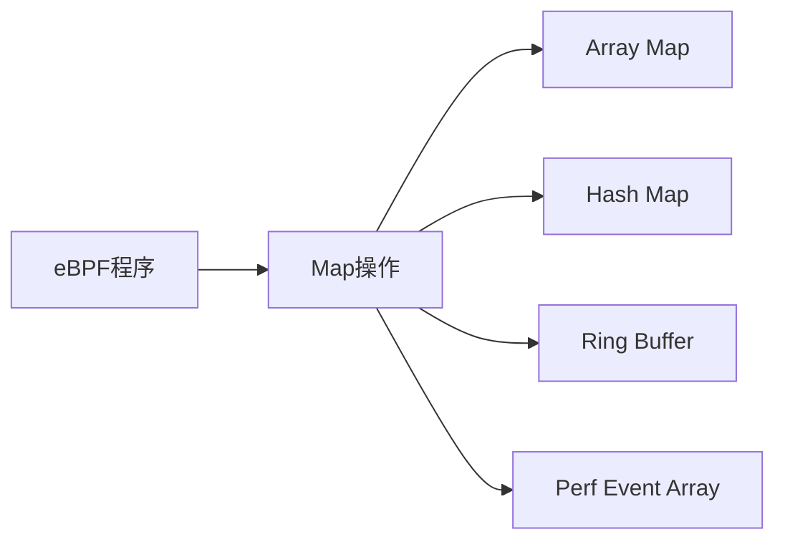

#### Map 类型对比

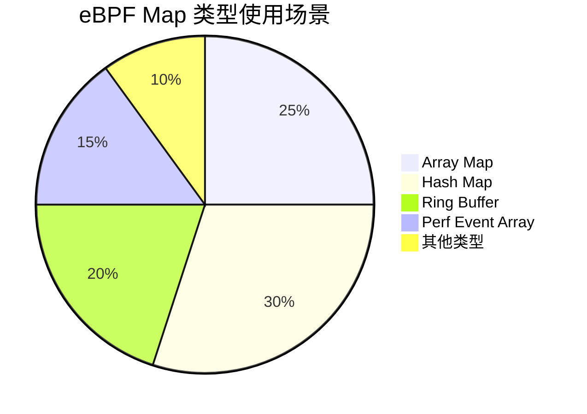

### 网络编程示例

```c
// ebpf/xdp_program.c
#include <linux/bpf.h>
#include <bpf/bpf_helpers.h>
#include <linux/if_ether.h>
#include <linux/ip.h>

SEC("xdp")
int xdp_drop_program(struct xdp_md *ctx)
{
    void *data_end = (void *)(long)ctx->data_end;
    void *data = (void *)(long)ctx->data;
    
    struct ethhdr *eth = data;
    if ((void *)eth + sizeof(*eth) > data_end)
        return XDP_ABORTED;
    
    // 丢弃所有非 IP 包
    if (eth->h_proto != __bpf_htons(ETH_P_IP))
        return XDP_DROP;
    
    return XDP_PASS;
}

char _license[] SEC("license") = "GPL";
```

### 用户空间网络程序

```go
// xdp_main.go
package main

import (
    "fmt"
    "log"
    "net"
    "os"
    "os/signal"
    "syscall"

    "github.com/cilium/ebpf"
    "github.com/cilium/ebpf/link"
)

func main() {
    if len(os.Args) < 2 {
        log.Fatal("请指定网络接口")
    }
    
    ifaceName := os.Args[1]
    iface, err := net.InterfaceByName(ifaceName)
    if err != nil {
        log.Fatalf("获取网络接口失败: %v", err)
    }

    // 加载 XDP 程序
    spec, err := LoadXdpDropProgram()
    if err != nil {
        log.Fatalf("加载 XDP 程序失败: %v", err)
    }

    coll, err := ebpf.NewCollection(spec)
    if err != nil {
        log.Fatalf("创建 eBPF 集合失败: %v", err)
    }
    defer coll.Close()

    // 附加 XDP 程序到网络接口
    opts := link.XDPOptions{
        Program:   coll.Programs["xdp_drop_program"],
        Interface: iface.Index,
        Flags:     link.XDPGenericMode,
    }

    l, err := link.AttachXDP(opts)
    if err != nil {
        log.Fatalf("附加 XDP 程序失败: %v", err)
    }
    defer l.Close()

    fmt.Printf("XDP 程序已附加到接口 %s\n", ifaceName)
    fmt.Println("按 Ctrl+C 停止...")

    sig := make(chan os.Signal, 1)
    signal.Notify(sig, os.Interrupt, syscall.SIGTERM)
    <-sig

    fmt.Println("正在停止 XDP 程序...")
}
```

## 生产环境实践

### 性能优化

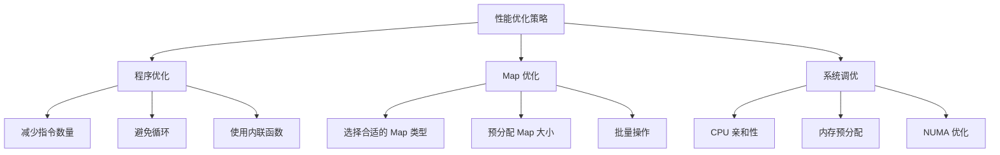

### 监控和调试

```go
// 监控程序示例
func monitorEBPFProgram(coll *ebpf.Collection) {
    ticker := time.NewTicker(5 * time.Second)
    defer ticker.Stop()

    for range ticker.C {
        // 读取程序统计信息
        var stats struct {
            ProcessedPackets uint64
            DroppedPackets   uint64
            Errors          uint64
        }

        if err := coll.Maps["stats_map"].Lookup(uint32(0), &stats); err != nil {
            log.Printf("读取统计信息失败: %v", err)
            continue
        }

        log.Printf("统计信息 - 处理: %d, 丢弃: %d, 错误: %d",
            stats.ProcessedPackets, stats.DroppedPackets, stats.Errors)
    }
}
```

### 错误处理最佳实践

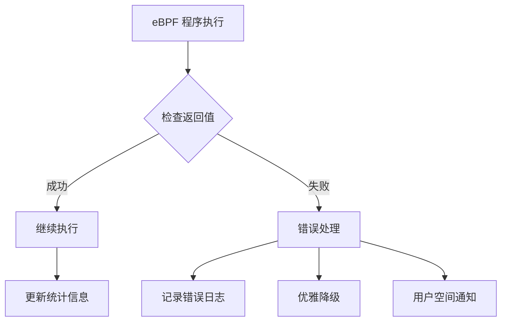

## 常见应用场景

### 1. 网络监控

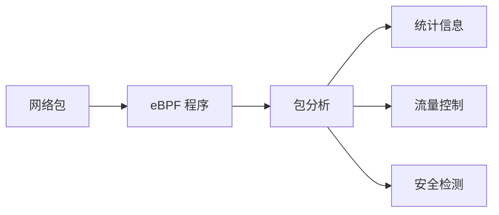

### 2. 系统追踪

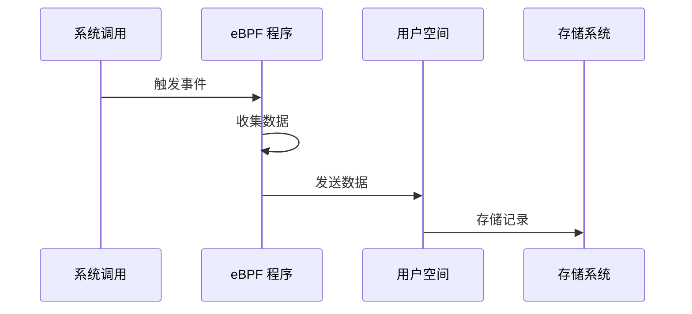

### 3. 安全监控

```c
// 安全监控示例
SEC("kprobe/do_execve")
int kprobe_execve(struct pt_regs *ctx)
{
    char comm[16];
    bpf_get_current_comm(&comm, sizeof(comm));
    
    // 检查可疑进程
    if (bpf_strncmp(comm, "suspicious", 10) == 0) {
        // 记录安全事件
        struct security_event event = {};
        bpf_get_current_comm(&event.comm, sizeof(event.comm));
        event.pid = bpf_get_current_pid_tgid() >> 32;
        event.timestamp = bpf_ktime_get_ns();
        
        bpf_ringbuf_output(&events, &event, sizeof(event), 0);
    }
    
    return 0;
}
```

## 调试和故障排除

### 常用调试工具

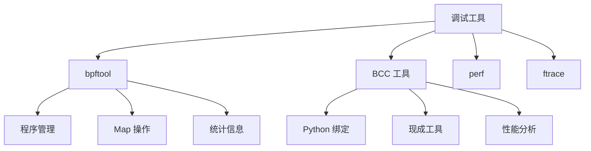

### 常见问题解决

#### 1. 程序加载失败

```bash
# 检查内核支持
cat /proc/sys/kernel/unprivileged_bpf_disabled

# 检查程序验证
bpftool prog load program.o /sys/fs/bpf/program

# 查看详细错误
dmesg | tail -20
```

#### 2. 性能问题

```bash
# 使用 perf 分析
perf record -e bpf-output:* -a sleep 10
perf script

# 检查 JIT 状态
cat /proc/sys/net/core/bpf_jit_enable
```

#### 3. Map 操作问题

```go
// Map 操作错误处理
func safeMapLookup(m *ebpf.Map, key interface{}, value interface{}) error {
    if err := m.Lookup(key, value); err != nil {
        if errors.Is(err, ebpf.ErrKeyNotExist) {
            return fmt.Errorf("键不存在: %v", key)
        }
        return fmt.Errorf("Map 查找失败: %v", err)
    }
    return nil
}
```

## 性能基准测试

### 测试环境配置

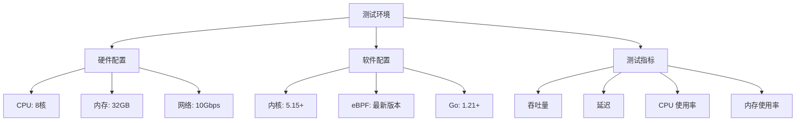

### 性能测试代码

```go
// 性能测试示例
func benchmarkEBPF(b *testing.B) {
    // 加载 eBPF 程序
    spec, err := LoadTestProgram()
    if err != nil {
        b.Fatalf("加载程序失败: %v", err)
    }

    coll, err := ebpf.NewCollection(spec)
    if err != nil {
        b.Fatalf("创建集合失败: %v", err)
    }
    defer coll.Close()

    b.ResetTimer()
    b.RunParallel(func(pb *testing.PB) {
        for pb.Next() {
            // 执行 eBPF 程序逻辑
            key := uint32(0)
            var value uint64
            coll.Maps["test_map"].Lookup(key, &value)
        }
    })
}
```

## 最佳实践总结

### 开发建议

1. **程序设计**
   - 保持程序简单和高效
   - 避免复杂的循环和递归
   - 合理使用 Map 和共享内存

2. **错误处理**
   - 实现完善的错误检查
   - 提供详细的日志记录
   - 设计优雅的降级机制

3. **性能优化**
   - 使用 JIT 编译
   - 优化 Map 访问模式
   - 避免不必要的系统调用

### 部署建议

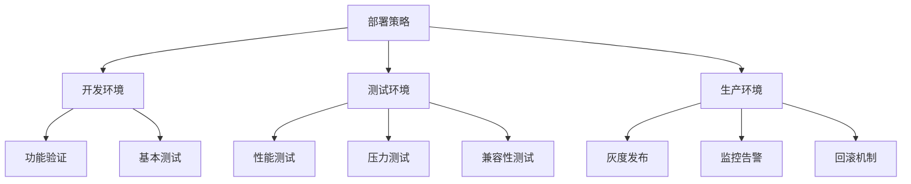

## 总结

eBPF 是一个强大的内核编程技术，为现代系统提供了前所未有的灵活性和性能。通过本文的指南，您可以：

- 理解 eBPF 的核心概念和架构
- 掌握 Go eBPF 开发的基本技能
- 学习生产环境的最佳实践
- 解决常见的开发和部署问题

eBPF 正在改变我们构建可观测性、网络和安全工具的方式，掌握这项技术将为您在系统编程领域带来巨大优势。

## 参考资源

- [eBPF 官方文档](https://ebpf.io/zh-hans/)
- [Cilium eBPF Go 库](https://github.com/cilium/ebpf)
- [eBPF 内核文档](https://www.kernel.org/doc/Documentation/networking/filter.txt)
- [BCC 工具集](https://github.com/iovisor/bcc)
- [eBPF 峰会](https://ebpf.io/events/)

---

*本文涵盖了 eBPF 的完整开发流程，从基础概念到生产实践，帮助您快速掌握这项革命性的内核技术。*
