## 什么是 Arthas？

Arthas 是阿里巴巴开源的 Java 应用诊断工具，它能够在不修改代码、不重启服务器的情况下，对运行中的 Java 应用进行实时诊断和问题排查。Arthas 采用非侵入式的 Agent 架构，通过 Java Instrumentation API 实现运行时的类增强和监控。

**官方网站**: [https://arthas.aliyun.com/](https://arthas.aliyun.com/)  
**GitHub 仓库**: [https://github.com/alibaba/arthas](https://github.com/alibaba/arthas)

## Arthas 核心特性

### 问题诊断能力

- **类加载问题诊断**：查看类的加载来源，解决 JAR 包冲突
- **运行时反编译**：验证代码是否按预期运行
- **方法调用监控**：实时监控方法参数、返回值、异常
- **性能分析**：追踪方法执行路径，识别性能瓶颈
- **线程分析**：分析线程状态和 CPU 使用情况
- **火焰图生成**：生成 CPU 火焰图进行性能分析
- **堆对象检索**：从 JVM 堆中检索对象实例

### 支持环境

- **JDK 版本**：JDK 8+ (Arthas 4.x)，JDK 6+ (Arthas 3.x)
- **操作系统**：Linux、macOS、Windows
- **集成方式**：独立使用、Spring Boot Starter、Docker、Kubernetes

## Arthas 架构详解

### 整体架构

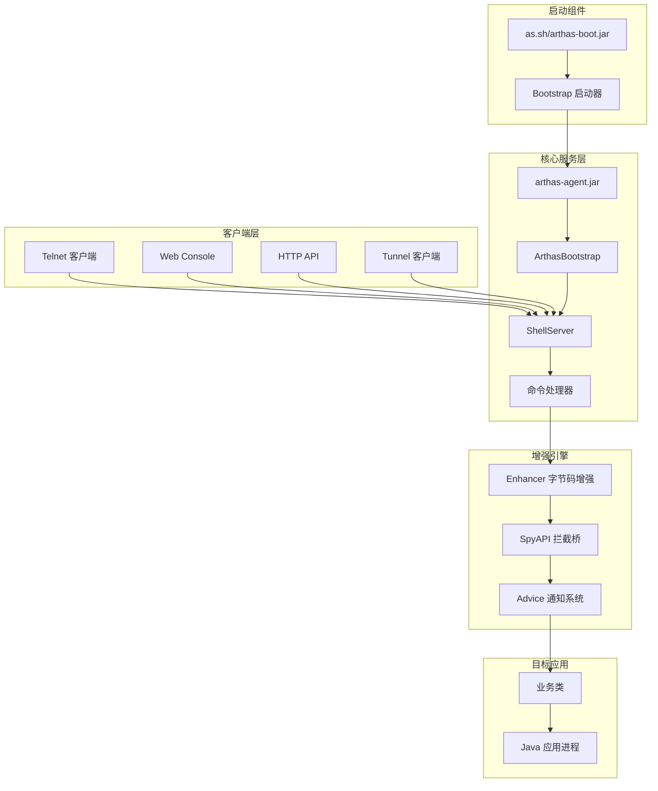

### 关键组件说明

#### 1. Bootstrap 组件

**arthas-boot.jar**
- 主要入口点，用于启动 Arthas
- 发现和选择目标 JVM 进程
- 处理命令行参数和配置
- 管理版本选择和下载

**as.sh/as.bat**
- 平台特定的启动脚本
- 管理本地 Arthas 安装
- 处理环境设置和 JVM 检测

#### 2. Core 核心组件

**arthas-agent.jar**
- JVM Agent，加载到目标进程
- 作为附加到 JVM 时的初始入口点
- 加载 arthas-core 并启动引导过程

**arthas-core.jar**
- Arthas 的主要实现
- `ArthasBootstrap`: 初始化和协调所有组件的中心类
- 管理 Shell 服务器、命令系统和类转换

**arthas-spy.jar**
- 加载到 Bootstrap ClassLoader 的轻量级库
- 提供拦截方法调用的 API
- 作为增强代码和 Arthas 核心之间的桥梁

#### 3. Client 客户端组件

**arthas-client.jar**
- 终端客户端，用于连接 Arthas
- 提供命令行界面
- 处理到 Arthas 服务器的 Telnet 连接

**Web Console**
- 基于浏览器的界面
- 提供与终端界面相同的命令
- 支持更友好的可视化交互

**Tunnel System**
- 启用远程连接
- 为远程诊断提供服务器和客户端
- 安全地隧道化到 Arthas 实例的连接

### 启动附加流程

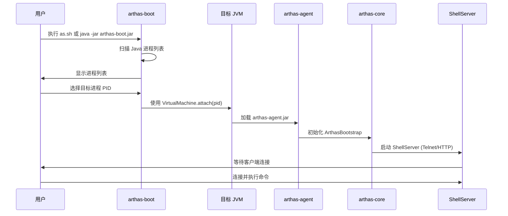

### 命令处理流程

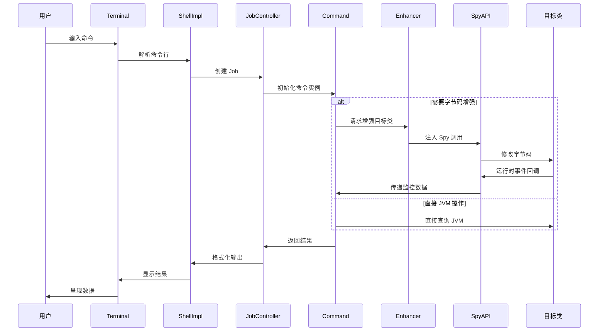

## Arthas 安装部署

### 快速安装

#### 方式 1: 使用 arthas-boot（推荐）

```bash
# 下载 arthas-boot.jar
curl -O https://arthas.aliyun.com/arthas-boot.jar

# 启动
java -jar arthas-boot.jar
```

#### 方式 2: 使用 as.sh 脚本

```bash
# 下载并执行
curl -L https://arthas.aliyun.com/install.sh | sh

# 启动
./as.sh
```

#### 方式 3: 手动下载完整包

```bash
# 下载完整包
wget https://github.com/alibaba/arthas/releases/download/arthas-all-4.1.3/arthas-bin.zip

# 解压
unzip arthas-bin.zip

# 启动
cd arthas-bin
./as.sh
```

### Spring Boot 集成

在 Spring Boot 项目中集成 Arthas：

```xml
<dependency>
    <groupId>com.taobao.arthas</groupId>
    <artifactId>arthas-spring-boot-starter</artifactId>
    <version>4.1.3</version>
</dependency>
```

配置文件 `application.properties`:

```properties
# Arthas 配置
arthas.telnetPort=3658
arthas.httpPort=8563
arthas.ip=127.0.0.1
arthas.agent-id=my-app-001
arthas.tunnel-server=ws://tunnel-server:7777/ws
```

### Docker 部署

```dockerfile
FROM openjdk:8-jdk-alpine

# 添加 Arthas
RUN wget https://arthas.aliyun.com/arthas-boot.jar -O /opt/arthas-boot.jar

# 暴露端口
EXPOSE 3658 8563

# 启动应用（在应用启动后可附加 Arthas）
CMD ["java", "-jar", "/app/application.jar"]
```

### 配置选项

| 配置项 | 说明 | 默认值 |
|--------|------|--------|
| `telnetPort` | Telnet 服务端口 | 3658 |
| `httpPort` | HTTP 服务端口 | 8563 |
| `ip` | 监听 IP | 127.0.0.1 |
| `sessionTimeout` | 会话超时时间（秒） | 1800 |
| `tunnelServer` | Tunnel 服务器地址 | 无 |
| `statUrl` | 统计 URL | 无 |

## 核心命令详解

### 1. JVM 基础信息命令

#### dashboard - 实时数据面板

```bash
# 显示实时数据面板
dashboard

# 每 5 秒刷新一次
dashboard -i 5000
```

**输出内容**：
- 线程信息（CPU 使用率、状态）
- 内存信息（堆、非堆）
- GC 信息
- 运行时信息

#### jvm - JVM 详细信息

```bash
# 查看 JVM 信息
jvm
```

**输出内容**：
- 运行时信息
- 类加载信息
- 编译信息
- GC 信息
- 内存信息
- 系统属性

#### thread - 线程分析

```bash
# 查看所有线程
thread

# 查看最繁忙的 3 个线程
thread -n 3

# 查看指定线程的堆栈
thread 1

# 查看处于 WAITING 状态的线程
thread -s WAITING

# 查找阻塞的线程
thread -b
```

### 2. 类和 ClassLoader 命令

#### sc - 搜索类

```bash
# 搜索类
sc com.example.*

# 显示类的详细信息
sc -d com.example.UserService

# 显示类的字段信息
sc -f com.example.UserService
```

#### sm - 搜索方法

```bash
# 搜索方法
sm com.example.UserService

# 搜索指定方法
sm com.example.UserService findUser*

# 显示方法详情
sm -d com.example.UserService findUserById
```

#### jad - 反编译

```bash
# 反编译类
jad com.example.UserService

# 反编译指定方法
jad com.example.UserService findUserById

# 只显示源码（不显示 ClassLoader 信息）
jad --source-only com.example.UserService
```

#### classloader - ClassLoader 分析

```bash
# 查看所有 ClassLoader
classloader

# 查看 ClassLoader 的继承树
classloader -t

# 查看 ClassLoader 加载的类
classloader -c 68b8f33c

# 查看类的 ClassLoader 层次
classloader -c 68b8f33c -r META-INF/MANIFEST.MF
```

### 3. 方法监控命令

#### watch - 方法监控

```bash
# 监控方法的入参和返回值
watch com.example.UserService findUserById "{params, returnObj}"

# 监控异常
watch com.example.UserService findUserById "{params, throwExp}" -e

# 监控方法执行前后
watch com.example.UserService findUserById "{params, returnObj}" -x 2 -b -s

# 条件监控
watch com.example.UserService findUserById "{params, returnObj}" "params[0] == 123"

# 只监控耗时超过 100ms 的调用
watch com.example.UserService findUserById "{params, returnObj, #cost}" '#cost > 100'
```

**参数说明**：
- `-b`: 方法调用前
- `-e`: 方法异常后
- `-s`: 方法返回后
- `-f`: 方法结束后（finally）
- `-x`: 展开对象层次，默认 1

#### trace - 方法调用路径追踪

```bash
# 追踪方法调用路径
trace com.example.UserService findUserById

# 追踪多个方法
trace com.example.UserService findUserById|updateUser

# 包含 JDK 方法
trace com.example.UserService findUserById --skipJDKMethod false

# 只显示耗时超过 100ms 的调用
trace com.example.UserService findUserById '#cost > 100'

# 显示调用次数
trace com.example.UserService findUserById -n 5
```

#### stack - 方法调用堆栈

```bash
# 查看方法被调用的堆栈
stack com.example.UserService findUserById

# 条件过滤
stack com.example.UserService findUserById 'params[0] == 123'

# 限制调用次数
stack com.example.UserService findUserById -n 5
```

#### monitor - 方法调用统计

```bash
# 每 5 秒统计一次方法调用
monitor -c 5 com.example.UserService findUserById

# 统计多个方法
monitor -c 5 com.example.UserService findUserById|updateUser
```

**输出内容**：
- `timestamp`: 时间戳
- `class`: 类名
- `method`: 方法名
- `total`: 调用次数
- `success`: 成功次数
- `fail`: 失败次数
- `rt`: 平均响应时间（ms）
- `fail-rate`: 失败率

#### tt - 时间隧道

```bash
# 记录方法调用
tt -t com.example.UserService findUserById

# 查看记录列表
tt -l

# 查看指定记录的详细信息
tt -i 1000

# 重放方法调用
tt -i 1000 -p

# 搜索调用记录
tt -s 'method.name=="findUserById"'

# 查看调用参数
tt -i 1000 -w 'params[0]'
```

### 4. 性能分析命令

#### profiler - 性能剖析

```bash
# 启动 CPU profiling
profiler start

# 获取样本数量
profiler getSamples

# 查看 profiler 状态
profiler status

# 停止并生成 HTML 火焰图
profiler stop

# 生成指定格式
profiler stop --format html

# 指定事件类型
profiler start --event alloc

# 指定采样间隔
profiler start --interval 10000000
```

**支持的事件类型**：
- `cpu`: CPU 时间
- `alloc`: 内存分配
- `lock`: 锁竞争
- `cache-misses`: 缓存未命中

### 5. 对象操作命令

#### vmtool - VM 工具

```bash
# 获取 Spring ApplicationContext
vmtool --action getInstances --className org.springframework.context.ApplicationContext

# 获取指定类的实例
vmtool --action getInstances --className com.example.UserService --limit 10

# 强制 GC
vmtool --action forceGc
```

#### ognl - OGNL 表达式

```bash
# 执行静态方法
ognl '@java.lang.System@getProperty("java.version")'

# 获取 Spring Bean
ognl '#springContext=@com.example.ApplicationContextHolder@getApplicationContext(), #springContext.getBean("userService")'

# 调用对象方法
ognl '@com.example.UserService@getInstance().findUserById(123)'

# 修改静态字段
ognl '@com.example.ConfigHolder@DEBUG = true'
```

### 6. 类修改命令

#### redefine - 热更新类

```bash
# 加载外部 .class 文件
redefine /tmp/UserService.class

# 加载多个类
redefine /tmp/*.class
```

#### retransform - 重新转换类

```bash
# 重新转换类
retransform com.example.UserService

# 删除重新转换
retransform -d 1

# 显示所有重新转换的类
retransform -l
```

#### mc - 内存编译

```bash
# 编译 Java 文件
mc /tmp/UserService.java

# 指定 ClassLoader
mc -c 68b8f33c /tmp/UserService.java

# 指定输出目录
mc -d /tmp/output /tmp/UserService.java
```

### 7. 系统命令

#### help - 帮助信息

```bash
# 查看所有命令
help

# 查看指定命令的帮助
help watch
```

#### quit/exit - 退出

```bash
# 退出当前会话（Arthas 继续运行）
quit

# 停止 Arthas
stop
```

#### reset - 重置增强

```bash
# 重置所有增强的类
reset

# 重置指定类
reset com.example.UserService
```

#### session - 会话管理

```bash
# 查看当前会话
session

# 查看所有会话
session -l
```

## 实战场景示例

### 场景 1: CPU 使用率过高排查

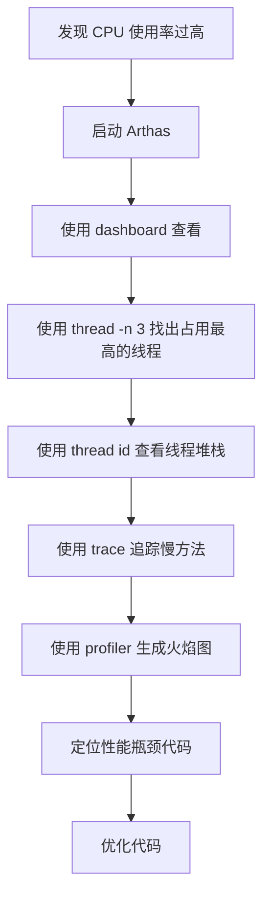

**操作步骤**：

```bash
# 1. 启动 Arthas
java -jar arthas-boot.jar

# 2. 查看实时面板
dashboard

# 3. 找出 CPU 占用最高的 3 个线程
thread -n 3

# 4. 查看指定线程的详细堆栈（假设线程 ID 为 42）
thread 42

# 5. 如果发现是业务方法，使用 trace 追踪
trace com.example.service.UserService processUser

# 6. 启动 profiler 采集 CPU 数据
profiler start

# 7. 运行一段时间后停止并生成火焰图
profiler stop --format html
```

**火焰图分析**：
- 宽度：方法占用 CPU 时间比例
- 颜色：不同方法调用
- 从下到上：方法调用栈

### 场景 2: 接口响应慢排查

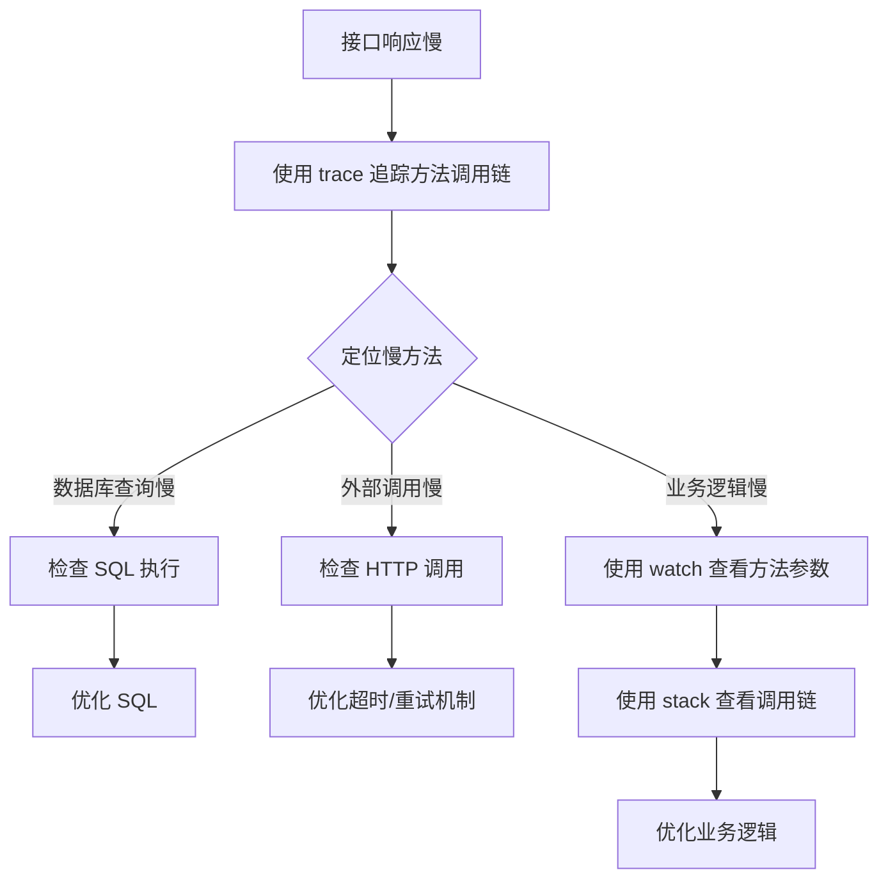

**操作步骤**：

```bash
# 1. 追踪接口方法
trace com.example.controller.UserController getUser '#cost > 100'

# 2. 发现具体慢方法后，监控其参数和返回值
watch com.example.service.UserService queryUserFromDB '{params, returnObj, #cost}' -x 3

# 3. 如果是数据库问题，追踪 JDBC 方法
trace javax.sql.DataSource getConnection

# 4. 查看方法被谁调用
stack com.example.service.UserService queryUserFromDB

# 5. 使用 tt 记录方法调用，便于后续分析
tt -t com.example.service.UserService queryUserFromDB
```

### 场景 3: 内存泄漏排查

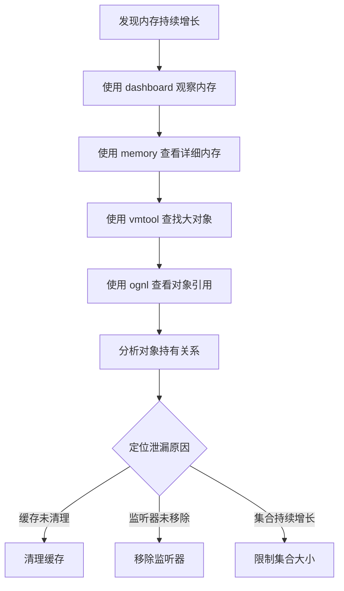

**操作步骤**：

```bash
# 1. 查看内存使用情况
dashboard

# 2. 查找可疑类的实例
vmtool --action getInstances --className com.example.Cache --limit 10

# 3. 查看对象内容
vmtool --action getInstances --className com.example.Cache --limit 1 | grep 'object'

# 4. 使用 ognl 查看 Spring Bean
ognl '@com.example.ApplicationContextHolder@getApplicationContext().getBean("cacheManager")'

# 5. 查看对象字段
ognl '@com.example.Cache@getInstance().size()'

# 6. 强制 GC 观察内存变化
vmtool --action forceGc
```

### 场景 4: 类加载冲突排查

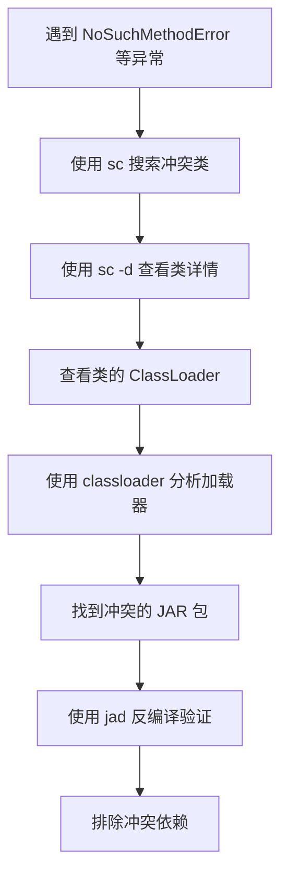

**操作步骤**：

```bash
# 1. 搜索冲突的类
sc -d com.example.ConflictClass

# 2. 查看类的 ClassLoader 信息
sc -d com.example.ConflictClass | grep classLoaderHash

# 3. 查看 ClassLoader 详情
classloader -c 3d4eac69

# 4. 查看 ClassLoader 加载的所有类
classloader -c 3d4eac69 -r com/example/*

# 5. 反编译类查看实际代码
jad com.example.ConflictClass

# 6. 查看类的来源 JAR 包
sc -d com.example.ConflictClass | grep codeSource
```

### 场景 5: 线程死锁排查

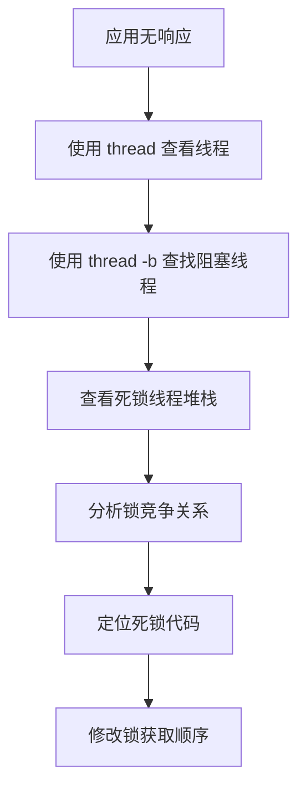

**操作步骤**：

```bash
# 1. 查看所有线程
thread

# 2. 查找阻塞的线程
thread -b

# 3. 查看线程状态为 BLOCKED 的线程
thread -s BLOCKED

# 4. 查看具体线程的堆栈
thread 42

# 5. 查看线程持有的锁
thread -i 1000
```

### 场景 6: 生产环境热修复

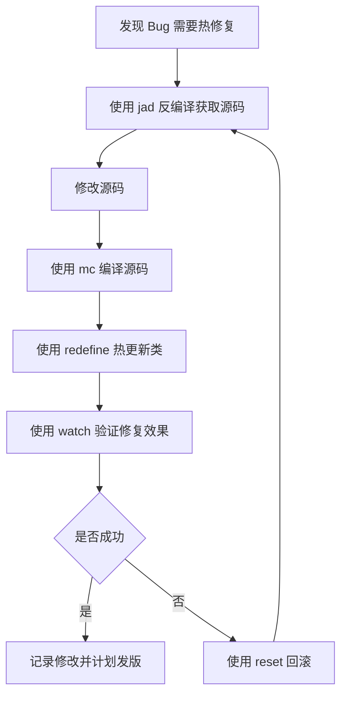

**操作步骤**：

```bash
# 1. 反编译有问题的类
jad --source-only com.example.service.UserService > /tmp/UserService.java

# 2. 修改 /tmp/UserService.java 文件（使用 vim 或其他编辑器）

# 3. 编译修改后的类
mc /tmp/UserService.java

# 4. 热更新类
redefine /tmp/com/example/service/UserService.class

# 5. 验证修复效果
watch com.example.service.UserService processUser '{params, returnObj}' -x 2

# 6. 如果有问题，重置类
reset com.example.service.UserService
```

### 场景 7: Spring Bean 调试

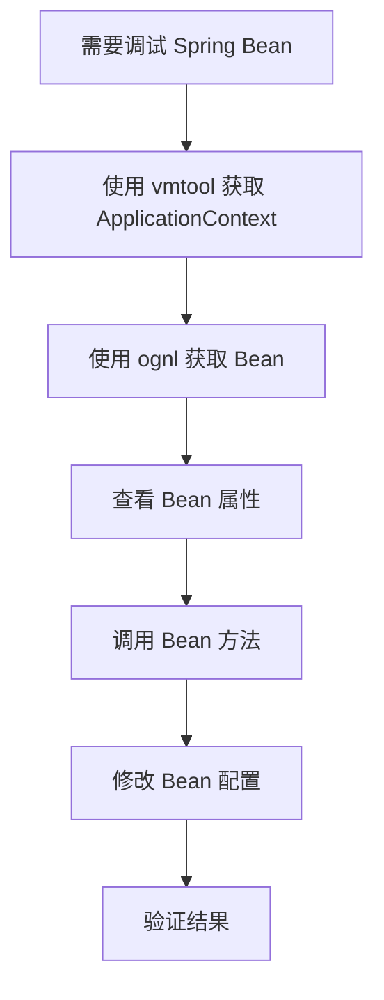

**操作步骤**：

```bash
# 1. 获取 Spring ApplicationContext
vmtool --action getInstances --className org.springframework.context.ApplicationContext --limit 1

# 2. 使用 ognl 获取 Bean（假设有 ApplicationContextHolder）
ognl '#context=@com.example.ApplicationContextHolder@getApplicationContext(), #context.getBean("userService")'

# 3. 查看 Bean 的属性
ognl '#context=@com.example.ApplicationContextHolder@getApplicationContext(), #bean=#context.getBean("userService"), #bean.timeout'

# 4. 调用 Bean 的方法
ognl '#context=@com.example.ApplicationContextHolder@getApplicationContext(), #bean=#context.getBean("userService"), #bean.findUserById(123)'

# 5. 修改 Bean 的属性（临时调试）
ognl '#context=@com.example.ApplicationContextHolder@getApplicationContext(), #bean=#context.getBean("userService"), #bean.timeout=5000'

# 6. 查看所有 Bean 名称
ognl '#context=@com.example.ApplicationContextHolder@getApplicationContext(), #context.getBeanDefinitionNames()'
```

### 场景 8: 动态开关功能

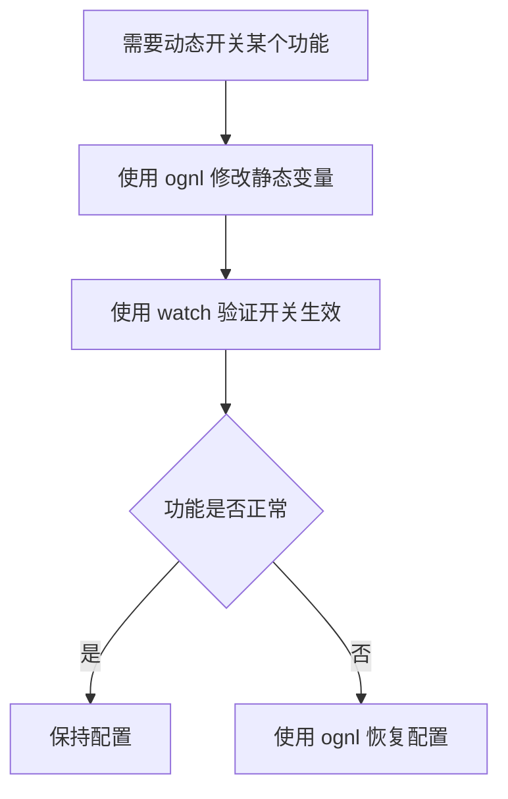

**操作步骤**：

```bash
# 1. 查看当前开关状态
ognl '@com.example.config.FeatureConfig@DEBUG_MODE'

# 2. 动态开启调试模式
ognl '@com.example.config.FeatureConfig@DEBUG_MODE = true'

# 3. 动态修改配置值
ognl '@com.example.config.FeatureConfig@MAX_RETRY_COUNT = 5'

# 4. 验证配置生效
watch com.example.service.RetryService retry '{@com.example.config.FeatureConfig@MAX_RETRY_COUNT}'

# 5. 如果需要恢复
ognl '@com.example.config.FeatureConfig@DEBUG_MODE = false'
```

## 高级特性

### Web Console

Arthas 提供了 Web Console 用于浏览器访问：

```bash
# 启动时指定 HTTP 端口
java -jar arthas-boot.jar --http-port 8563

# 访问 Web Console
http://localhost:8563
```

**Web Console 特性**：
- 命令自动补全
- 命令历史记录
- 多标签页支持
- 结果高亮显示
- 文件上传（用于 redefine）

### Tunnel Server

Tunnel Server 用于远程连接多个 Arthas 实例：

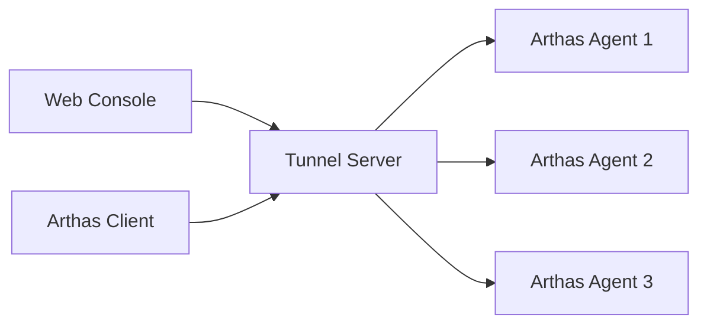

**部署 Tunnel Server**：

```bash
# 下载 Tunnel Server
wget https://github.com/alibaba/arthas/releases/download/arthas-all-4.1.3/arthas-tunnel-server-4.1.3-fatjar.jar

# 启动 Tunnel Server
java -jar arthas-tunnel-server-4.1.3-fatjar.jar
```

**Agent 连接 Tunnel Server**：

```bash
java -jar arthas-boot.jar --tunnel-server 'ws://tunnel-server:7777/ws' --agent-id my-app-001
```

### Arthas MCP Server

Arthas 4.x 引入了 MCP (Model Context Protocol) Server，允许 AI 助手通过标准化协议与 Arthas 交互：

```bash
# 启动 MCP Server
java -jar arthas-mcp-server.jar
```

**MCP Server 功能**：
- 标准化的 AI 交互接口
- 命令执行代理
- 结果格式化
- 安全访问控制

### 批量执行命令

使用 `-c` 参数批量执行命令：

```bash
# 执行单个命令后退出
java -jar arthas-boot.jar -c "dashboard" --target-ip 127.0.0.1

# 执行多个命令
java -jar arthas-boot.jar -c "thread; jvm; dashboard" --target-ip 127.0.0.1

# 从文件读取命令
java -jar arthas-boot.jar -f commands.txt
```

### 异步任务

某些命令支持异步执行：

```bash
# 后台异步执行 trace
trace com.example.UserService findUser &

# 查看后台任务
jobs

# 停止后台任务
kill job-id

# 将任务切换到前台
fg job-id
```

### 管道和重定向

Arthas 支持类似 Linux 的管道操作：

```bash
# 使用 grep 过滤
thread | grep "User"

# 使用 wc 统计
sc com.example.* | wc -l

# 重定向到文件
thread > /tmp/thread.txt

# 追加到文件
jvm >> /tmp/jvm.txt
```

## 性能和安全考虑

### 性能影响

#### 监控命令的性能影响

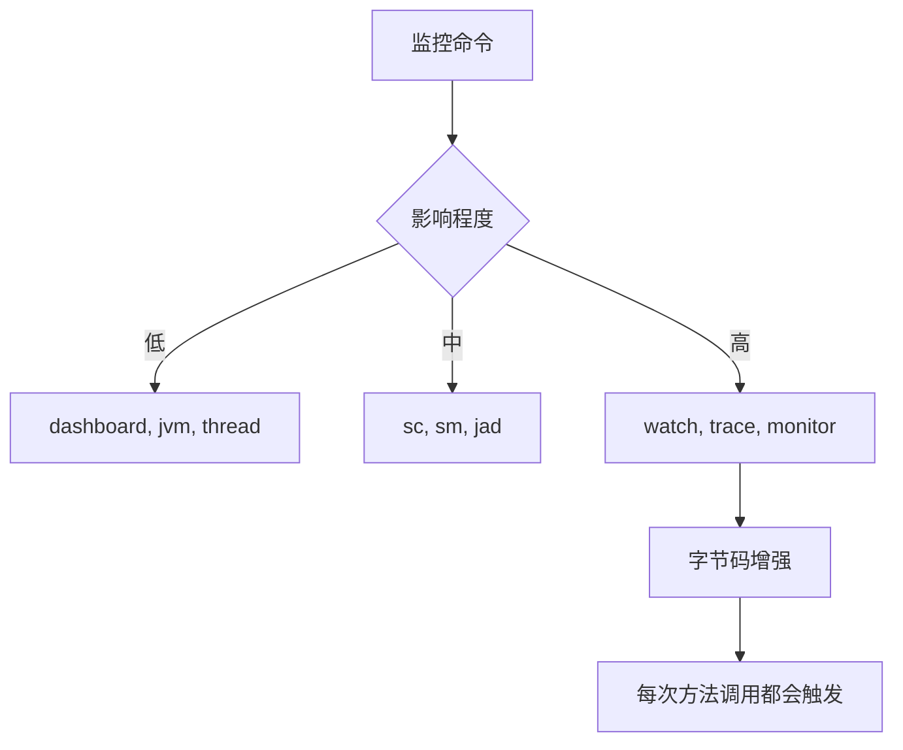

**性能建议**：

1. **避免在生产环境长时间使用 watch/trace**
   - 使用条件表达式过滤
   - 使用 `-n` 限制监控次数
   - 使用后及时 `reset`

2. **使用 profiler 要控制采样时间**
   ```bash
   # 采样 30 秒
   profiler start
   sleep 30
   profiler stop
   ```

3. **避免同时监控多个高频方法**

4. **使用 classloader 命令要注意数量**

### 安全配置

#### 认证配置

```properties
# 启用认证
arthas.enable.auth=true
arthas.username=admin
arthas.password=secret123

# 只允许本地访问
arthas.ip=127.0.0.1

# 使用 SSL
arthas.ssl.enabled=true
arthas.ssl.keystore=/path/to/keystore.jks
arthas.ssl.password=keystorePassword
```

#### 访问控制

```bash
# 限制可以使用的命令
java -jar arthas-boot.jar --disabled-commands "stop,reset,redefine"

# 只读模式（禁用所有修改命令）
java -jar arthas-boot.jar --disabled-commands "stop,reset,redefine,retransform,mc,jad"
```

#### 网络安全

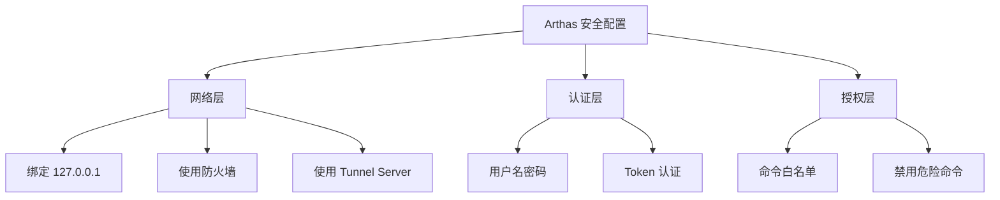

**最佳实践**：

1. **生产环境**：
   - 绑定 127.0.0.1
   - 启用认证
   - 使用 Tunnel Server
   - 禁用 stop、redefine 等命令

2. **测试环境**：
   - 可以放开网络限制
   - 建议启用认证
   - 记录操作日志

3. **开发环境**：
   - 可以使用默认配置
   - 注意清理监控规则

## 常见问题和解决方案

### 1. Arthas 无法附加到进程

**问题**：执行 `as.sh` 后无法看到目标进程或附加失败

**解决方案**：

```bash
# 检查 Java 进程是否存在
jps -l

# 检查是否有权限附加
ps aux | grep java

# 如果是容器环境，需要添加 capabilities
docker run --cap-add=SYS_PTRACE --pid=host ...

# 检查 /tmp 目录权限
ls -la /tmp

# 手动指定进程 ID
java -jar arthas-boot.jar <pid>
```

### 2. 命令执行没有输出

**问题**：执行 watch、trace 等命令没有任何输出

**解决方案**：

```bash
# 1. 检查类名和方法名是否正确
sc -d com.example.UserService

# 2. 检查方法是否被调用
monitor com.example.UserService findUser

# 3. 使用通配符
watch com.example.UserService * '{params, returnObj}'

# 4. 降低观察深度
watch com.example.UserService findUser '{params}' -x 1

# 5. 检查是否有条件表达式过滤
watch com.example.UserService findUser '{params, returnObj}'
```

### 3. redefine 失败

**问题**：使用 redefine 热更新类失败

**原因和解决方案**：

```bash
# 1. 检查类是否可以重定义（不能添加/删除字段和方法）
# 只能修改方法实现

# 2. 确保编译的类版本一致
javac -source 1.8 -target 1.8 UserService.java

# 3. 使用 mc 命令编译（推荐）
mc /tmp/UserService.java

# 4. 检查类路径
mc -c <classLoaderHash> /tmp/UserService.java

# 5. 如果提示 retransform 限制，先 reset
reset com.example.UserService
redefine /tmp/com/example/UserService.class
```

### 4. 内存占用增加

**问题**：使用 Arthas 后 JVM 内存占用增加

**解决方案**：

```bash
# 1. 停止所有监控
reset

# 2. 清理 tt 记录
tt -d

# 3. 退出不必要的会话
session -l
quit

# 4. 如果不再使用，完全停止 Arthas
stop

# 5. 控制 tt 记录数量
tt -t com.example.UserService findUser -n 100
```

### 5. Web Console 无法访问

**问题**：浏览器无法访问 Web Console

**解决方案**：

```bash
# 1. 检查端口是否启动
netstat -an | grep 8563

# 2. 检查绑定地址
java -jar arthas-boot.jar --http-port 8563 --target-ip 0.0.0.0

# 3. 检查防火墙
# Linux
sudo firewall-cmd --add-port=8563/tcp
# macOS
sudo pfctl -d

# 4. 使用 tunnel server
java -jar arthas-boot.jar --tunnel-server 'ws://tunnel-server:7777/ws'
```

### 6. ClassNotFoundException

**问题**：执行命令时提示找不到类

**解决方案**：

```bash
# 1. 使用模糊搜索
sc *UserService*

# 2. 检查类是否已加载
sc -d com.example.UserService

# 3. 指定 ClassLoader
classloader -l
sc -c <classLoaderHash> com.example.UserService

# 4. 检查包名是否正确
sc com.example.*
```

## 最佳实践

### 1. 日常监控

```bash
# 每天早上检查应用健康状态
dashboard
thread -n 5
jvm
```

### 2. 性能优化

```bash
# 定期生成性能基线
profiler start --duration 60 --file baseline_$(date +%Y%m%d).html

# 对比不同版本的性能
profiler start
# 运行压测
profiler stop --file version_1.0.html
```

### 3. 故障排查流程

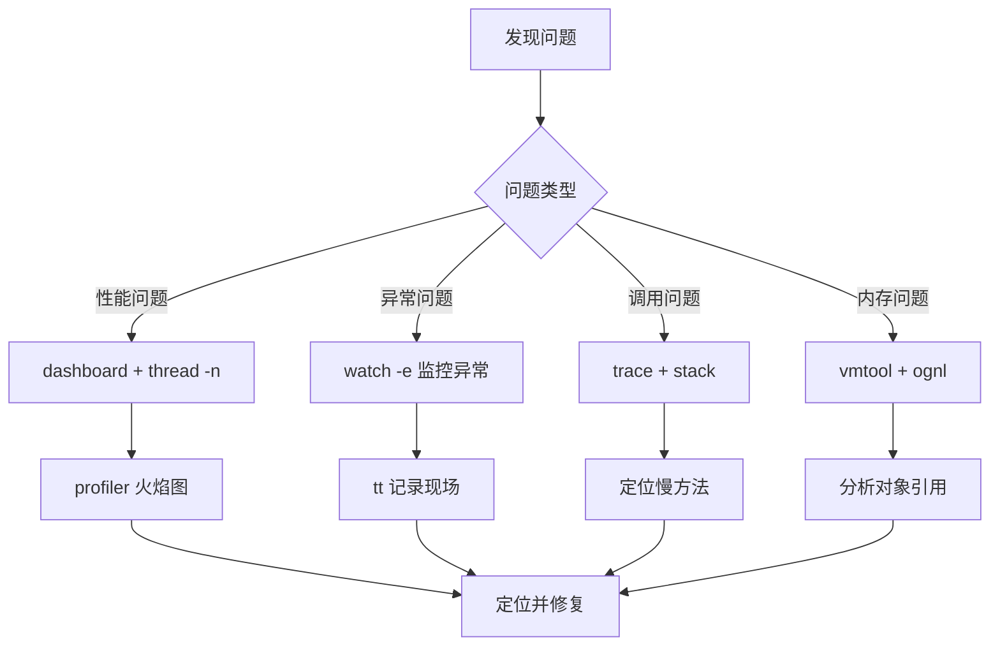

### 4. 团队协作

1. **建立命令手册**
   - 记录常用命令
   - 记录问题解决方案
   - 分享最佳实践

2. **使用 Tunnel Server**
   - 统一访问入口
   - 方便远程协助
   - 记录操作日志

3. **自动化脚本**
   ```bash
   #!/bin/bash
   # auto-diagnose.sh
   echo "=== 系统信息 ===" > report.txt
   java -jar arthas-boot.jar -c "jvm" >> report.txt
   echo "=== 线程信息 ===" >> report.txt
   java -jar arthas-boot.jar -c "thread -n 10" >> report.txt
   echo "=== 监控面板 ===" >> report.txt
   java -jar arthas-boot.jar -c "dashboard -n 1" >> report.txt
   ```

### 5. 生产环境使用建议

1. **谨慎使用字节码增强**
   - 使用条件表达式过滤
   - 限制监控次数
   - 及时清理规则

2. **记录操作日志**
   ```bash
   # 使用 script 命令记录
   script arthas_session_$(date +%Y%m%d_%H%M%S).log
   java -jar arthas-boot.jar
   ```

3. **制定使用规范**
   - 只在紧急情况使用 redefine
   - 所有 redefine 操作必须记录
   - 修复后必须正式发版
   - 定期 reset 清理规则

4. **监控 Arthas 自身**
   ```bash
   # 查看 Arthas 的资源占用
   thread | grep arthas
   ```

## 参考资源

### 官方资源

- **官方网站**: [https://arthas.aliyun.com/](https://arthas.aliyun.com/)
- **GitHub 仓库**: [https://github.com/alibaba/arthas](https://github.com/alibaba/arthas)
- **中文文档**: [https://arthas.aliyun.com/doc/](https://arthas.aliyun.com/doc/)
- **English Docs**: [https://arthas.aliyun.com/en/doc/](https://arthas.aliyun.com/en/doc/)
- **在线教程**: [https://arthas.aliyun.com/doc/arthas-tutorials.html](https://arthas.aliyun.com/doc/arthas-tutorials.html)

### 社区资源

- **用户案例**: [https://github.com/alibaba/arthas/issues/111](https://github.com/alibaba/arthas/issues/111)
- **问题反馈**: [https://github.com/alibaba/arthas/issues](https://github.com/alibaba/arthas/issues)
- **技术博客**: 搜索 "Arthas 实战"

### 相关项目

- **Greys**: Arthas 的前身
- **Bistoury**: 集成 Arthas 的项目
- **async-profiler**: Arthas profiler 命令的底层实现
- **bytekit**: Arthas 字节码增强库

### 版本说明

- **Arthas 3.x**: 支持 JDK 6+
- **Arthas 4.x**: 支持 JDK 8+，引入 MCP Server
- **最新版本**: 4.1.3 (截至 2025年12月)

## 总结

Arthas 是一个强大的 Java 应用诊断工具，它通过非侵入式的方式提供了丰富的诊断能力。无论是日常监控、性能优化还是故障排查，Arthas 都能提供有效的帮助。

**关键要点**：

1. **非侵入式**：无需修改代码或重启应用
2. **功能丰富**：涵盖类加载、方法监控、性能分析等多个方面
3. **易于使用**：简单的命令行界面和 Web Console
4. **安全可靠**：提供认证和访问控制机制
5. **生产可用**：经过大规模生产环境验证

**使用建议**：

- 在开发和测试环境充分练习
- 在生产环境谨慎使用字节码增强
- 建立团队知识库和最佳实践
- 定期更新到最新版本
- 关注性能和安全配置

通过合理使用 Arthas，可以大大提高 Java 应用的可观测性和问题诊断效率，是每个 Java 开发者和运维人员都应该掌握的重要工具。