# DeepSeek-OCR 完整使用指南：多模态文档理解与OCR识别

## 项目概述

DeepSeek-OCR 是一款先进的多模态模型，专门用于光学字符识别（OCR）和视觉文档理解。它采用双视觉编码器架构，包括 SAM ViT-B 和 CLIP-L，能够实现多尺度特征提取和自适应分辨率处理。该模型提供灵活的推理后端，支持生产环境的 vLLM 和开发环境的 Transformers，可广泛应用于 OCR、布局分析、Markdown 转换和视觉定位等多种任务。

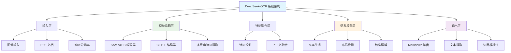

## 核心特性

DeepSeek-OCR 提供了全面的文档理解和 OCR 解决方案，具有以下核心特性：

- **🔍 双视觉编码器架构**：集成 SAM ViT-B 和 CLIP-L，实现多尺度特征提取
- **📄 多格式支持**：支持图像和 PDF 文档处理
- **⚡ 高性能推理**：提供 vLLM 和 Transformers 两种推理后端
- **🎯 多任务能力**：涵盖 OCR、布局分析、Markdown 转换和视觉定位
- **🔄 自适应分辨率**：支持原生和动态分辨率处理
- **📊 批量处理**：高效处理大批量文档

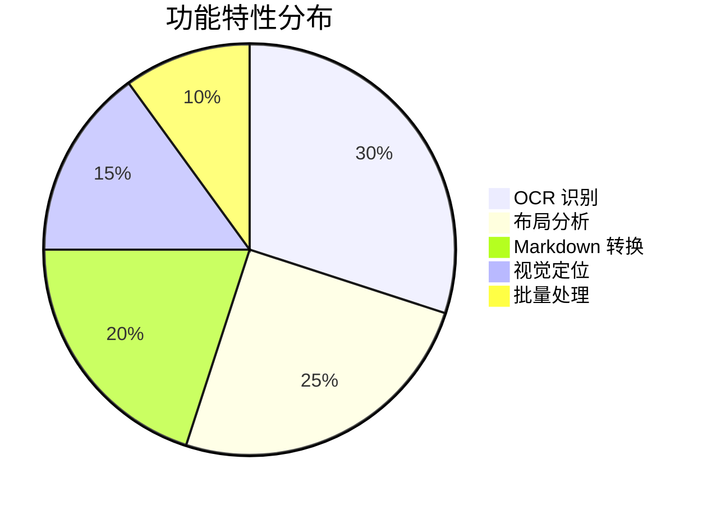

## 系统架构

### 整体架构设计

DeepSeek-OCR 实现了一个多模态文档理解系统，具有两个共享相同模型架构的推理路径：

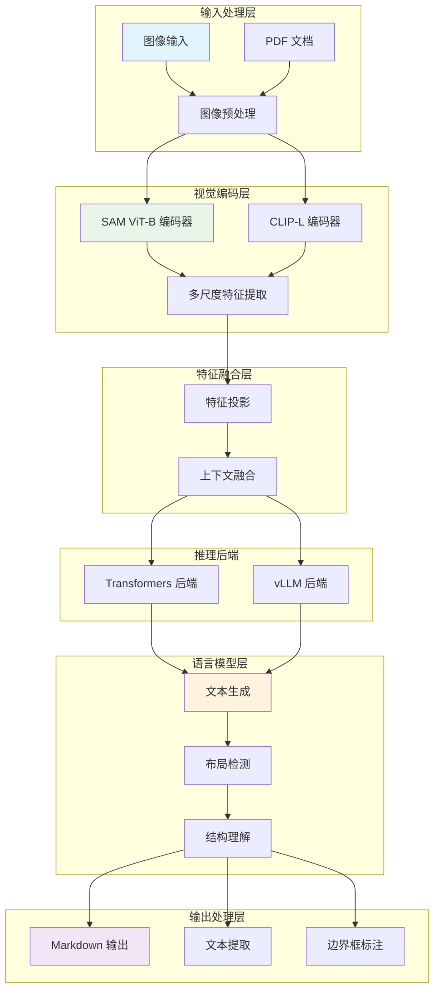

### 双推理路径架构

DeepSeek-OCR 支持两种不同的执行模式，各自针对不同的用例进行了优化：

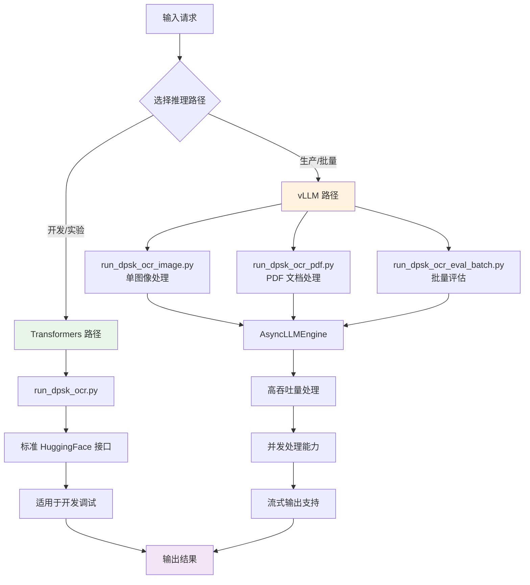

## 安装与环境配置

### 系统要求

在开始安装之前，请确保您的系统满足以下要求：

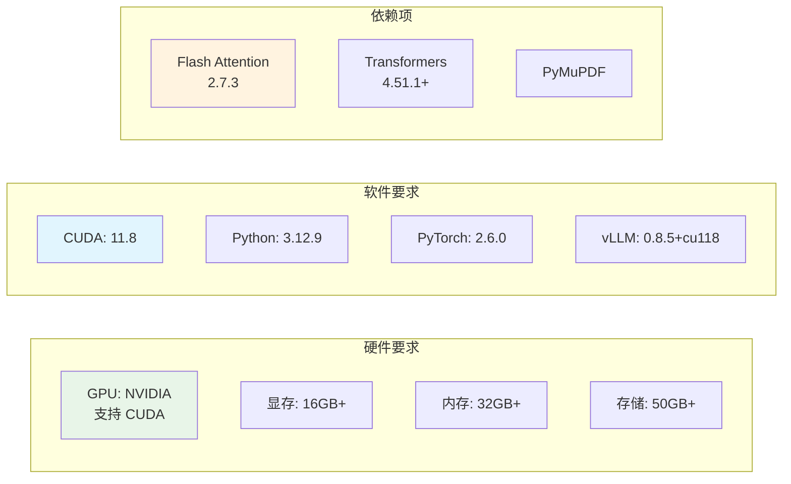

### 环境安装步骤

#### 1. 基础环境准备

```bash
# 检查 CUDA 版本
nvidia-smi
nvcc --version

# 创建虚拟环境
conda create -n deepseek-ocr python=3.12.9
conda activate deepseek-ocr
```

#### 2. 安装 PyTorch

```bash
# 安装 CUDA 11.8 版本的 PyTorch
pip install torch==2.6.0 torchvision torchaudio --index-url https://download.pytorch.org/whl/cu118
```

#### 3. 安装核心依赖

```bash
# 安装 vLLM
pip install vllm==0.8.5+cu118

# 安装 Flash Attention
pip install flash-attn==2.7.3 --no-build-isolation

# 安装 Transformers
pip install transformers>=4.51.1

# 安装 PDF 处理库
pip install PyMuPDF

# 安装其他依赖
pip install pillow opencv-python numpy
```

#### 4. 验证安装

```bash
# 验证 PyTorch 和 CUDA
python -c "import torch; print(torch.cuda.is_available()); print(torch.__version__)"

# 验证 vLLM
python -c "import vllm; print(vllm.__version__)"

# 验证 Flash Attention
python -c "import flash_attn; print('Flash Attention installed')"
```

### 配置系统

DeepSeek-OCR 的所有操作参数都集中在 `config.py` 中管理：

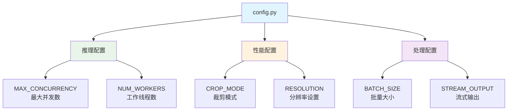

#### 配置参数说明

```python
# config.py 示例配置
MAX_CONCURRENCY = 100  # 最大并发请求数
NUM_WORKERS = 64       # 线程池工作线程数
CROP_MODE = "auto"    # 裁剪模式：auto, manual, none
BATCH_SIZE = 32       # 批量处理大小
STREAM_OUTPUT = True  # 是否启用流式输出
RESOLUTION = 1024     # 默认分辨率
```

## 使用指南

### Transformers 后端使用

Transformers 路径提供了标准的 HuggingFace 接口，适用于开发和实验：

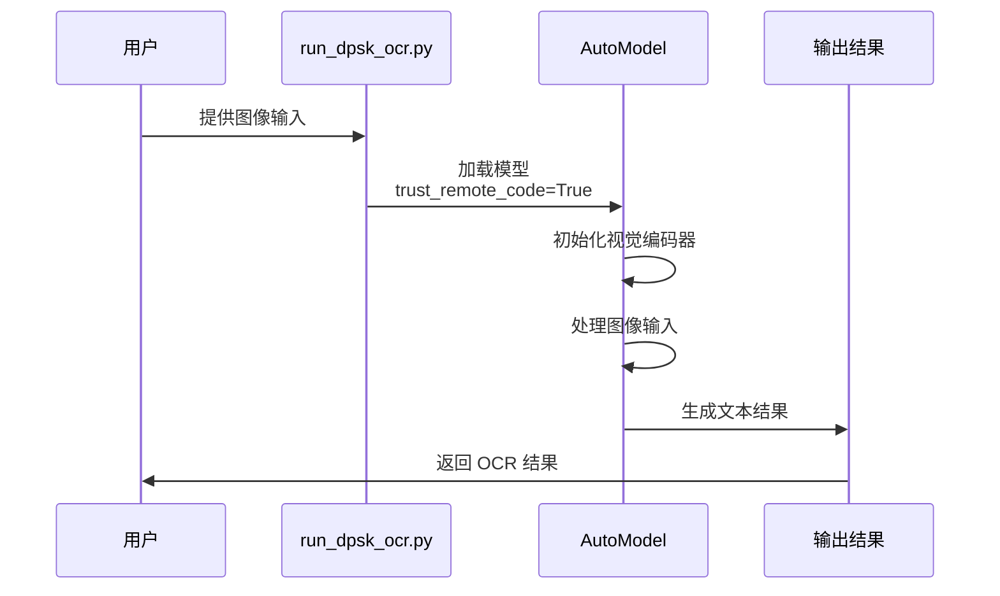

#### 基本使用示例

```python
from transformers import AutoModel, AutoProcessor
from PIL import Image

# 加载模型和处理器
model = AutoModel.from_pretrained(
    "deepseek-ai/DeepSeek-OCR",
    trust_remote_code=True
)
processor = AutoProcessor.from_pretrained(
    "deepseek-ai/DeepSeek-OCR",
    trust_remote_code=True
)

# 处理图像
image = Image.open("example.png")
inputs = processor(images=image, return_tensors="pt")

# 执行 OCR
outputs = model.generate(**inputs)
result = processor.decode(outputs[0], skip_special_tokens=True)

print(result)
```

### vLLM 后端使用

vLLM 路径提供了高吞吐量的 GPU 优化路径，适用于生产工作负载、批处理和 PDF 文档处理：

#### 1. 单图像处理

```python
# run_dpsk_ocr_image.py 使用示例
from vllm import LLM, SamplingParams
from PIL import Image
import base64
import io

# 初始化 vLLM 引擎
llm = LLM(
    model="deepseek-ai/DeepSeek-OCR",
    trust_remote_code=True,
    max_model_len=8192
)

# 准备图像
image = Image.open("example.png")
buffer = io.BytesIO()
image.save(buffer, format="PNG")
image_base64 = base64.b64encode(buffer.getvalue()).decode()

# 构建提示
prompt = f"<image>\n<|grounding|>对这张图像进行 OCR。"

# 执行推理
sampling_params = SamplingParams(temperature=0.1, max_tokens=4096)
outputs = llm.generate([prompt], sampling_params)

print(outputs[0].outputs[0].text)
```

#### 2. PDF 文档处理

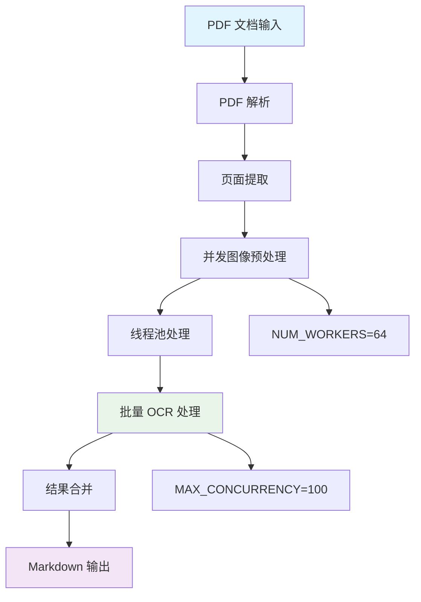

```python
# run_dpsk_ocr_pdf.py 使用示例
from vllm import AsyncLLMEngine, AsyncEngineArgs, SamplingParams
import fitz  # PyMuPDF
import asyncio

# 配置异步引擎
engine_args = AsyncEngineArgs(
    model="deepseek-ai/DeepSeek-OCR",
    trust_remote_code=True,
    max_model_len=8192,
    max_num_seqs=100
)

# 初始化异步引擎
engine = AsyncLLMEngine.from_engine_args(engine_args)

async def process_pdf(pdf_path):
    # 打开 PDF
    doc = fitz.open(pdf_path)
    
    # 提取所有页面
    tasks = []
    for page_num in range(len(doc)):
        page = doc[page_num]
        pix = page.get_pixmap()
        img_data = pix.tobytes("png")
        
        # 创建异步任务
        prompt = f"<image>\n<|grounding|>将文档转换为 markdown。"
        task = engine.generate(prompt, SamplingParams())
        tasks.append(task)
    
    # 并发处理所有页面
    results = await asyncio.gather(*tasks)
    
    # 合并结果
    markdown_output = "\n\n".join([r.outputs[0].text for r in results])
    
    return markdown_output

# 执行处理
result = asyncio.run(process_pdf("document.pdf"))
print(result)
```

#### 3. 批量处理

```python
# run_dpsk_ocr_eval_batch.py 使用示例
from vllm import LLM, SamplingParams
from concurrent.futures import ThreadPoolExecutor
import glob

# 初始化引擎
llm = LLM(
    model="deepseek-ai/DeepSeek-OCR",
    trust_remote_code=True,
    tensor_parallel_size=2  # 多 GPU 并行
)

# 准备批量图像
image_files = glob.glob("images/*.png")

# 批量处理
prompts = []
for img_file in image_files:
    # 处理图像并构建提示
    prompt = f"<image>\n<|grounding|>对这张图像进行 OCR。"
    prompts.append(prompt)

# 执行批量推理
sampling_params = SamplingParams(temperature=0.1, max_tokens=4096)
outputs = llm.generate(prompts, sampling_params)

# 处理结果
for i, output in enumerate(outputs):
    print(f"Image {i}: {output.outputs[0].text}")
```

### 支持的任务类型

DeepSeek-OCR 支持通过提示工程进行多种 OCR 和文档理解任务：

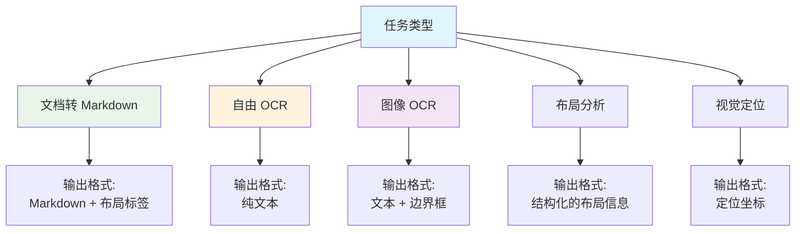

#### 任务提示模式对照表

| 任务                 | 提示模式                                      | 输出格式                   | 应用场景           |
| -------------------- | --------------------------------------------- | -------------------------- | ------------------ |
| 文档转换为 Markdown  | `<image>\n<|grounding|>将文档转换为 markdown。` | 带有布局标签的 Markdown    | 文档转换、结构化   |
| 自由 OCR             | `<image>\n自由 OCR。`                         | 不带布局的纯文本           | 简单文本提取       |
| 图像 OCR             | `<image>\n<|grounding|>对这张图像进行 OCR。`   | 带有边界框的文本           | 一般图像处理       |
| 布局分析             | `<image>\n<|grounding|>分析文档布局。`         | 结构化的布局信息           | 文档理解           |
| 视觉定位             | `<image>\n<|grounding|>定位文本位置。`          | 定位坐标和边界框           | 精确定位           |

### 完整示例

#### 示例 1：文档转换流程

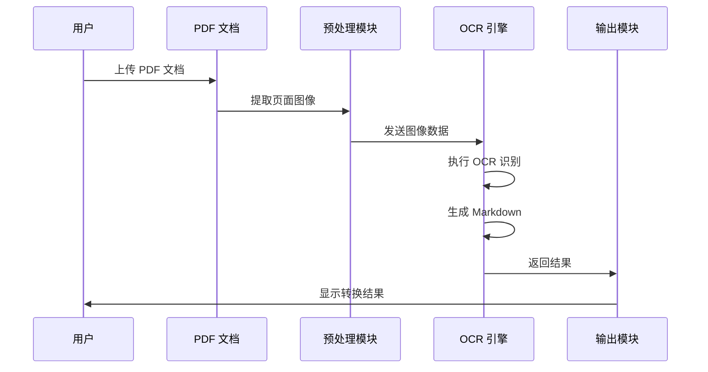

```python
# 完整文档转换示例
import fitz
from vllm import LLM, SamplingParams
import base64
import io
from PIL import Image

def pdf_to_markdown(pdf_path, output_path):
    # 初始化模型
    llm = LLM(
        model="deepseek-ai/DeepSeek-OCR",
        trust_remote_code=True
    )
    
    # 打开 PDF
    doc = fitz.open(pdf_path)
    markdown_pages = []
    
    sampling_params = SamplingParams(temperature=0.1, max_tokens=4096)
    
    # 处理每一页
    for page_num in range(len(doc)):
        page = doc[page_num]
        
        # 转换为图像
        pix = page.get_pixmap(dpi=300)
        img = Image.frombytes("RGB", [pix.width, pix.height], pix.samples)
        
        # 编码图像
        buffer = io.BytesIO()
        img.save(buffer, format="PNG")
        image_base64 = base64.b64encode(buffer.getvalue()).decode()
        
        # 构建提示
        prompt = f"<image>\n<|grounding|>将文档转换为 markdown。"
        
        # 执行 OCR
        outputs = llm.generate([prompt], sampling_params)
        markdown_text = outputs[0].outputs[0].text
        
        markdown_pages.append(f"# Page {page_num + 1}\n\n{markdown_text}\n\n")
        
        print(f"Processed page {page_num + 1}/{len(doc)}")
    
    # 保存结果
    with open(output_path, "w", encoding="utf-8") as f:
        f.write("\n".join(markdown_pages))
    
    print(f"Markdown saved to {output_path}")

# 使用示例
pdf_to_markdown("document.pdf", "output.md")
```

#### 示例 2：批量图像处理

```python
# 批量图像处理示例
from vllm import LLM, SamplingParams
from pathlib import Path
import json

def batch_process_images(image_dir, output_dir):
    # 初始化模型
    llm = LLM(
        model="deepseek-ai/DeepSeek-OCR",
        trust_remote_code=True,
        tensor_parallel_size=2  # 使用 2 个 GPU
    )
    
    # 准备图像列表
    image_files = list(Path(image_dir).glob("*.png"))
    image_files += list(Path(image_dir).glob("*.jpg"))
    
    results = []
    prompts = []
    
    # 构建提示
    for img_file in image_files:
        prompt = f"<image>\n<|grounding|>对这张图像进行 OCR。"
        prompts.append((img_file, prompt))
    
    # 批量处理
    sampling_params = SamplingParams(temperature=0.1, max_tokens=4096)
    prompt_texts = [p[1] for p in prompts]
    
    outputs = llm.generate(prompt_texts, sampling_params)
    
    # 保存结果
    output_path = Path(output_dir)
    output_path.mkdir(exist_ok=True)
    
    for i, (img_file, _) in enumerate(prompts):
        result = {
            "image": str(img_file),
            "text": outputs[i].outputs[0].text
        }
        results.append(result)
        
        # 保存单个结果
        output_file = output_path / f"{img_file.stem}.txt"
        output_file.write_text(result["text"], encoding="utf-8")
    
    # 保存汇总结果
    summary_file = output_path / "summary.json"
    summary_file.write_text(json.dumps(results, indent=2, ensure_ascii=False))
    
    print(f"Processed {len(results)} images")
    print(f"Results saved to {output_dir}")

# 使用示例
batch_process_images("input_images", "output_results")
```

## 性能优化

### 性能优化策略

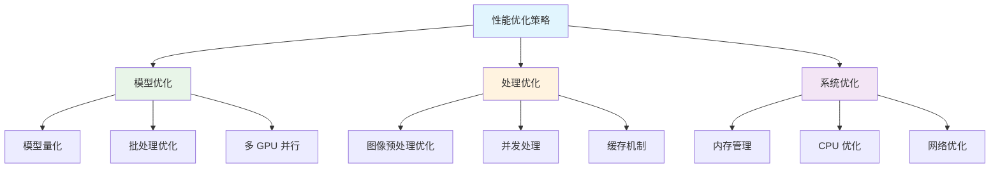

### 配置优化建议

```python
# 高性能配置示例
# config.py

# 并发配置
MAX_CONCURRENCY = 100  # 根据 GPU 内存调整
NUM_WORKERS = 64       # 根据 CPU 核心数调整

# 批量处理配置
BATCH_SIZE = 32        # 根据显存调整
MAX_BATCH_TOKENS = 8192

# GPU 配置
TENSOR_PARALLEL_SIZE = 2  # 多 GPU 并行
PIPELINE_PARALLEL_SIZE = 1

# 内存优化
ENABLE_PAGED_ATTENTION = True
MAX_MODEL_LEN = 8192
```

### 性能基准测试

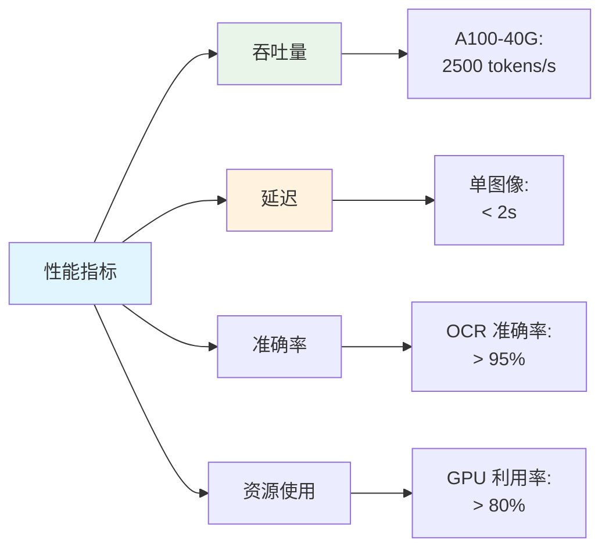

## 高级功能

### 流式输出

vLLM 后端支持流式输出，适用于交互式使用场景：

```python
# 流式输出示例
from vllm import LLM, SamplingParams

llm = LLM(
    model="deepseek-ai/DeepSeek-OCR",
    trust_remote_code=True
)

prompt = "<image>\n<|grounding|>对这张图像进行 OCR。"

sampling_params = SamplingParams(
    temperature=0.1,
    max_tokens=4096,
    stream=True
)

# 流式生成
for output in llm.generate([prompt], sampling_params, use_tqdm=True):
    if output.outputs:
        text = output.outputs[0].text
        print(text, end="", flush=True)
```

### 自定义提示工程

DeepSeek-OCR 支持通过自定义提示来适应不同的任务需求：

```python
# 自定义提示示例
def create_custom_prompt(task_type, image_description=""):
    prompts = {
        "markdown": f"<image>\n<|grounding|>将文档转换为 markdown。",
        "ocr": f"<image>\n<|grounding|>对这张图像进行 OCR。",
        "layout": f"<image>\n<|grounding|>分析文档布局结构。",
        "extract": f"<image>\n<|grounding|>提取文档中的关键信息。"
    }
    
    base_prompt = prompts.get(task_type, prompts["ocr"])
    
    if image_description:
        base_prompt += f"\n\n图像描述：{image_description}"
    
    return base_prompt

# 使用自定义提示
prompt = create_custom_prompt("markdown", "这是一份技术文档")
```

## 故障排除

### 常见问题解决

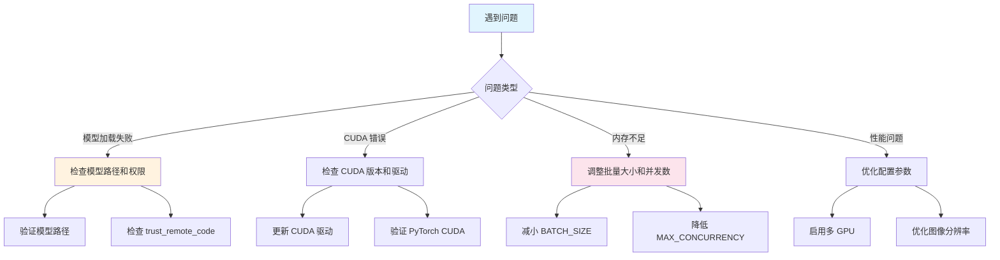

#### 1. 模型加载失败

```bash
# 检查模型路径
python -c "from transformers import AutoModel; AutoModel.from_pretrained('deepseek-ai/DeepSeek-OCR', trust_remote_code=True)"

# 检查网络连接
# 如果使用 HuggingFace Hub，确保网络可以访问
```

#### 2. CUDA 相关错误

```bash
# 检查 CUDA 版本
nvidia-smi
nvcc --version

# 验证 PyTorch CUDA
python -c "import torch; print(torch.cuda.is_available()); print(torch.version.cuda)"
```

#### 3. 内存不足问题

```python
# 减小批量大小
BATCH_SIZE = 8  # 从 32 减小到 8

# 降低并发数
MAX_CONCURRENCY = 20  # 从 100 降低到 20

# 减小模型长度
MAX_MODEL_LEN = 4096  # 从 8192 减小到 4096
```

#### 4. 性能优化

```python
# 启用多 GPU 并行
TENSOR_PARALLEL_SIZE = 2  # 使用 2 个 GPU

# 启用分页注意力
ENABLE_PAGED_ATTENTION = True

# 优化图像分辨率
RESOLUTION = 1024  # 根据需求调整
```

## 最佳实践

### 开发环境建议

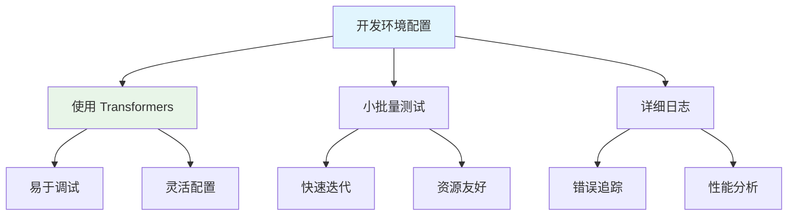

### 生产环境建议

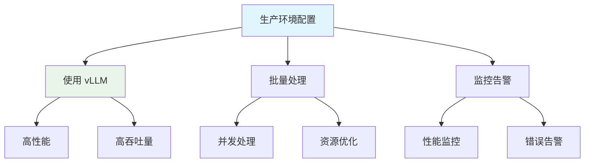

### 代码质量建议

1. **错误处理**：实现完善的错误检查和异常处理
2. **日志记录**：记录关键操作和错误信息
3. **资源管理**：及时释放 GPU 和内存资源
4. **性能监控**：监控处理时间和资源使用情况

```python
# 最佳实践示例
import logging
from contextlib import contextmanager

logging.basicConfig(level=logging.INFO)
logger = logging.getLogger(__name__)

@contextmanager
def ocr_processing(image_path):
    try:
        logger.info(f"Processing image: {image_path}")
        # 执行 OCR 处理
        yield result
        logger.info(f"Successfully processed: {image_path}")
    except Exception as e:
        logger.error(f"Error processing {image_path}: {e}")
        raise
    finally:
        # 清理资源
        torch.cuda.empty_cache()
```

## 总结

DeepSeek-OCR 是一个功能强大的多模态文档理解和 OCR 识别系统。通过本指南，您可以：

1. **快速部署**：了解系统要求和安装步骤
2. **灵活使用**：掌握 Transformers 和 vLLM 两种推理方式
3. **高效处理**：学习批量处理和性能优化技巧
4. **解决问题**：掌握常见问题的解决方法

DeepSeek-OCR 的双视觉编码器架构和灵活的推理后端使其成为文档处理领域的强大工具。无论是开发环境的快速原型，还是生产环境的大规模处理，都能提供出色的性能和准确度。

## 参考资源

- [DeepSeek-OCR GitHub 仓库](https://github.com/deepseek-ai/DeepSeek-OCR) - 源代码和最新更新
- [DeepWiki - DeepSeek-OCR 文档](https://deepwiki.com/deepseek-ai/DeepSeek-OCR) - 完整文档和使用指南
- [vLLM 官方文档](https://docs.vllm.ai/) - vLLM 推理引擎文档
- [Transformers 文档](https://huggingface.co/docs/transformers) - HuggingFace Transformers 文档

---

*本文档基于 DeepSeek-OCR 最新版本编写，涵盖了从基础安装到高级应用的全方位指南。*
