## 什么是 GitHub Spec Kit？

GitHub Spec Kit 是一个基于**规范驱动开发（Spec-Driven Development, SDD）**的方法论和工具包，旨在通过可执行的规范将自然语言需求转化为可工作的实现。它的核心理念是：**规范成为主要的开发产物，代码则作为这些规范的表达形式自动生成**。

### 核心特点

- 🎯 **规范优先**：规范是项目的核心产物，而非代码
- 🤖 **AI 驱动**：通过结构化模板引导 AI 代理实现功能
- 📋 **可追溯性**：从需求到实现全程可追溯
- 🔄 **多代理支持**：支持 11+ 种 AI 编码助手
- 🛠️ **跨平台**：支持 Bash 和 PowerShell 脚本

## Spec Kit 核心架构

### 系统架构层次

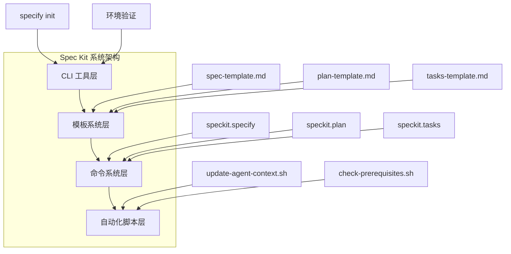

### 组件说明

| 组件层次 | 目的 | 关键构件 |
|---------|------|---------|
| **CLI 工具** | 项目初始化和环境验证 | `specify` 命令、环境检查 |
| **模板系统** | 通过结构化提示约束 AI 行为 | `.specify/templates/*.md` |
| **命令系统** | 在 AI 代理中编排 SDD 工作流 | `/speckit.*` 命令集 |
| **自动化脚本** | 上下文管理和验证 | `update-agent-context.sh/ps1` |

## SDD 工作流程

Spec Kit 遵循一个结构化的七阶段工作流程：

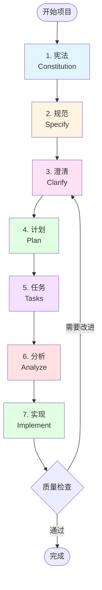

### 工作流程详解

#### 1. 宪法（Constitution）

定义项目的原则和约束，建立开发的基础规则。

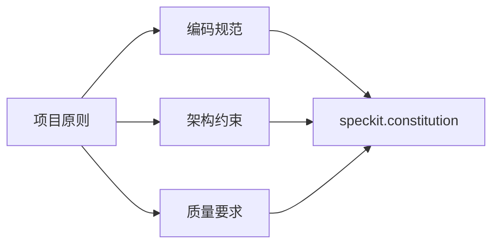

**使用命令**：`/speckit.constitution`

#### 2. 规范（Specify）

创建功能规范，明确需求和技术要求。

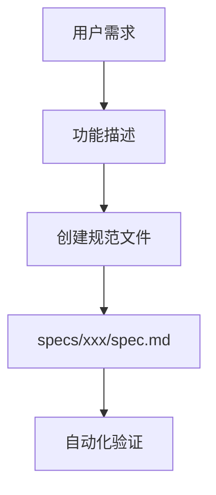

**使用命令**：`/speckit.specify`

#### 3. 澄清（Clarify）

解决不确定性，补充未知点。

#### 4. 计划（Plan）

制定技术实现计划，包括架构设计和数据模型。

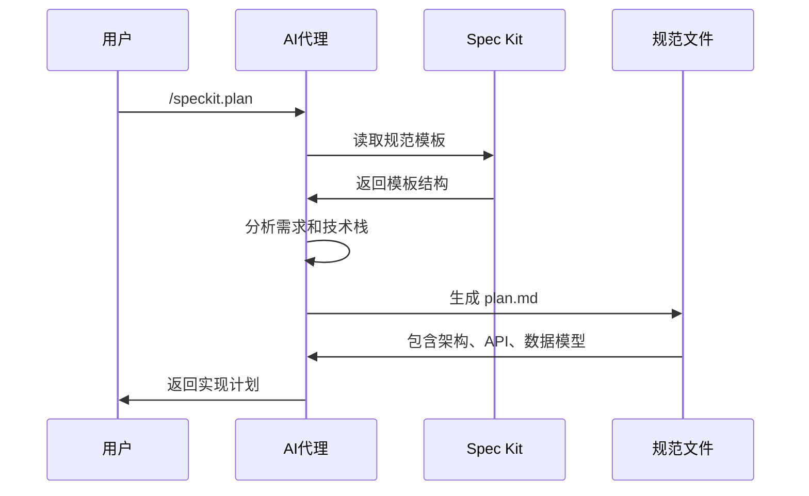

**使用命令**：`/speckit.plan`

#### 5. 任务（Tasks）

生成可执行的任务分解。

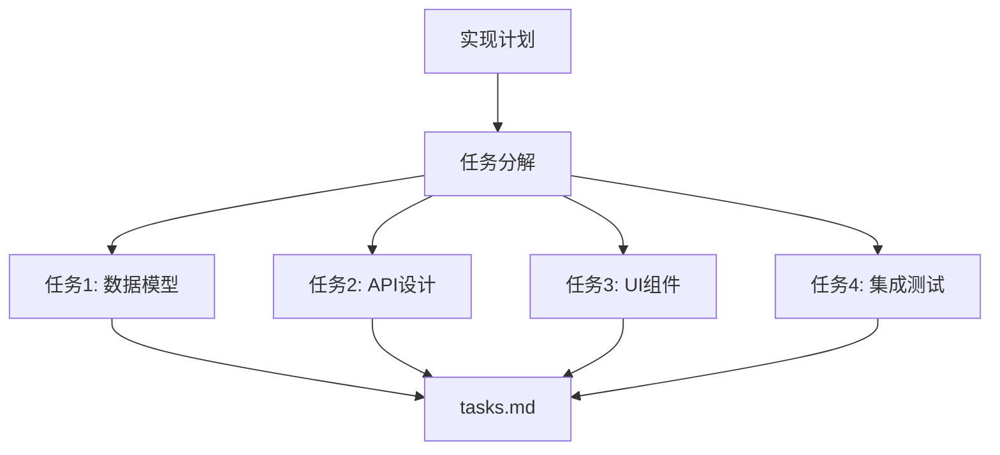

**使用命令**：`/speckit.tasks`

#### 6. 分析（Analyze）

评估覆盖范围和冲突。

**使用命令**：`/speckit.analyze`

#### 7. 实现（Implement）

执行自动化实现。

**使用命令**：`/speckit.implement`

## 安装与初始化

### 前置要求

在开始之前，确保您的环境满足以下要求：

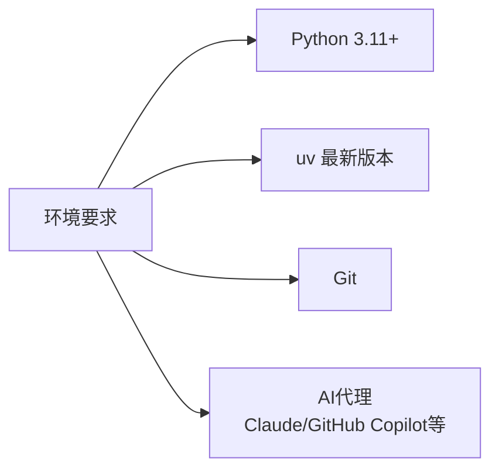

### 安装步骤

#### 1. 检查所需工具

首先验证环境中是否安装了必要的工具：

```bash
# 检查 Python 版本
python3 --version  # 需要 3.11+

# 检查 uv
uv --version

# 检查 Git
git --version
```

#### 2. 初始化项目

使用 `specify` CLI 工具初始化项目：

```bash
uvx --from git+https://github.com/github/spec-kit.git specify init <PROJECT_NAME>
```

**初始化过程**：

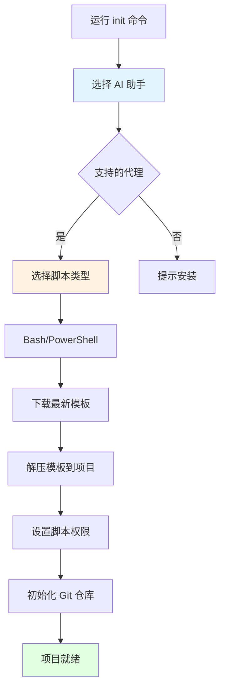

**初始化选项**：

- **选择 AI 助手**：Claude Code、GitHub Copilot、Cursor、Gemini CLI 等
- **选择脚本类型**：Bash（Linux/macOS）或 PowerShell（Windows）
- **获取最新发布版本**：自动下载最新的 Spec Kit 模板
- **初始化 Git**：可选，如需版本控制

## 核心命令详解

### `/speckit.constitution` - 建立项目原则

创建项目的宪法文件，定义开发原则和约束。

**使用场景**：
- 项目初始化时
- 需要重新定义项目原则时

**示例**：

```markdown
/speckit.constitution

项目原则：
- 代码质量优先
- 遵循 SOLID 原则
- 优先使用 TypeScript
- 必须包含单元测试
```

**生成文件**：`.specify/constitution.md`

### `/speckit.specify` - 创建功能规范

创建详细的功能规范文档。

**使用示例**：

```markdown
/speckit.specify Build an application that can help me organize my photos in separate photo albums. Albums are grouped by date and can be re-organized by dragging and dropping on the main page.
```

**工作流程**：

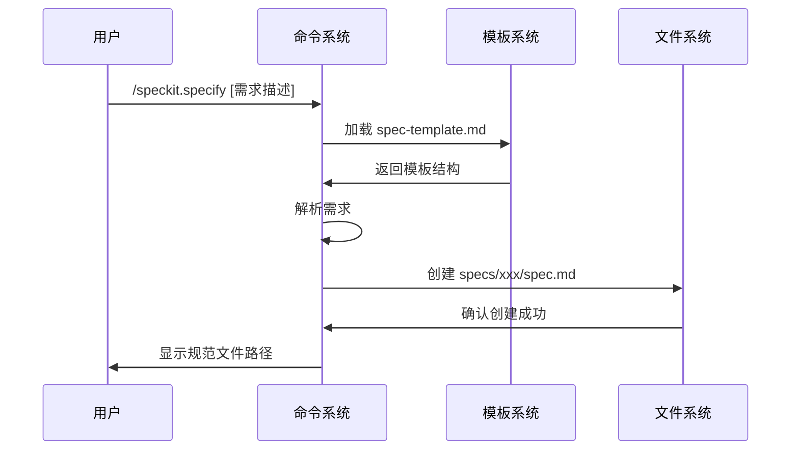

**生成文件结构**：

```
specs/
  └── 001-feature-name/
      ├── spec.md          # 功能规范
      └── README.md        # 规范概述
```

### `/speckit.plan` - 生成实现计划

基于规范生成技术实现计划。

**使用示例**：

```markdown
/speckit.plan The application uses Vite with minimal number of libraries. Use vanilla HTML, CSS, and JavaScript as much as possible. Images are not uploaded anywhere and metadata is stored in a local SQLite database.
```

**生成文档**：

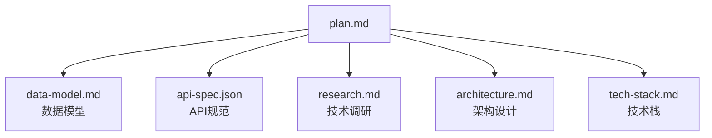

**计划文档包含**：
- **数据模型**：数据库表结构和关系
- **API 规范**：RESTful API 接口定义
- **技术调研**：技术选型分析
- **架构设计**：系统架构图和技术方案
- **技术栈**：使用的框架和库

### `/speckit.tasks` - 任务分解

将实现计划分解为可执行的任务列表。

**使用示例**：

```markdown
/speckit.tasks Create actionable development tasks for implementation
```

**任务结构**：

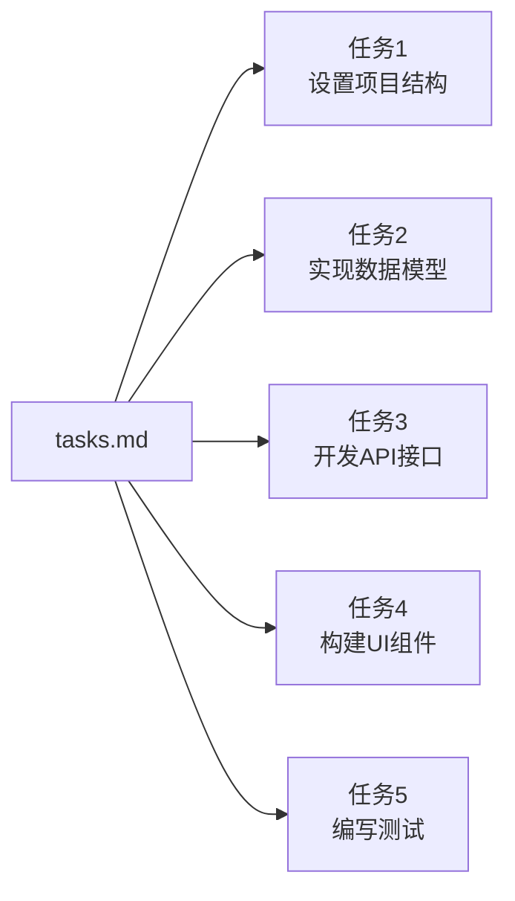

**任务格式**：
- 每个任务都有明确的描述
- 包含前置依赖关系
- 指定验收标准
- 估算工作量

### `/speckit.analyze` - 分析评估

评估规范覆盖范围和潜在冲突。

**分析维度**：

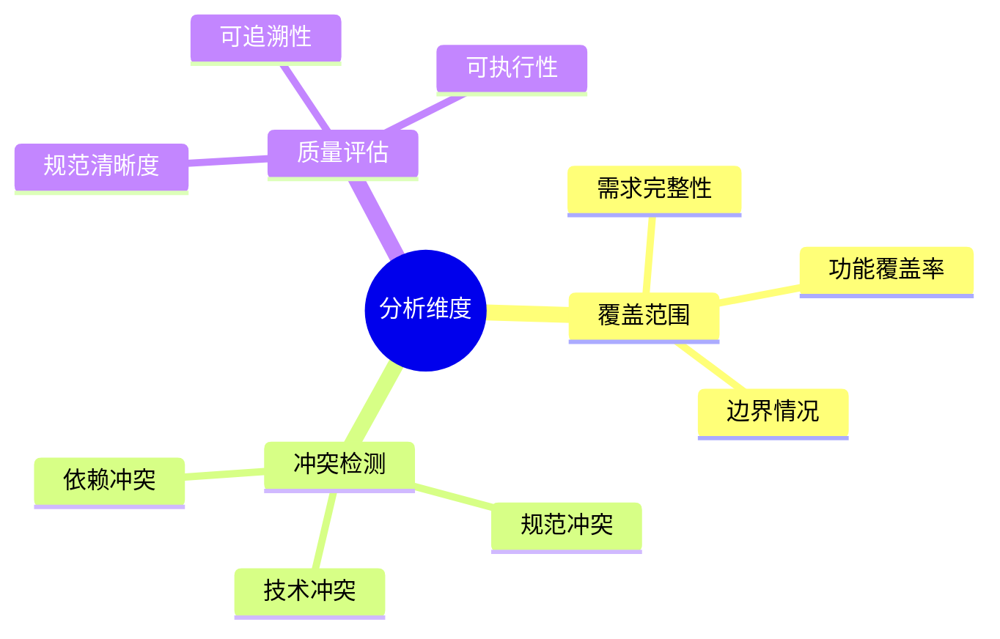

### `/speckit.implement` - 自动化实现

根据任务列表执行自动化实现。

**实现流程**：

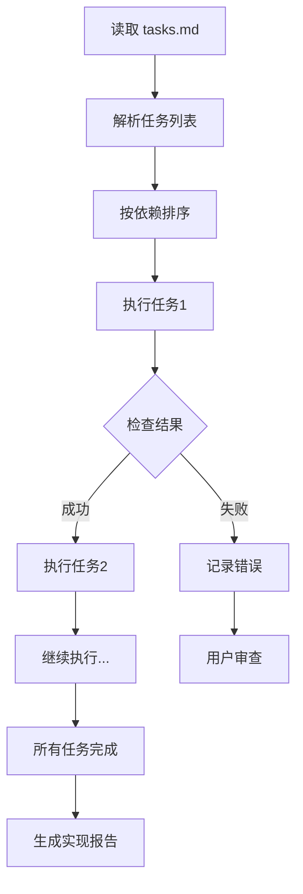

## 模板系统

### 模板结构

Spec Kit 使用结构化的 Markdown 模板来约束 AI 行为。

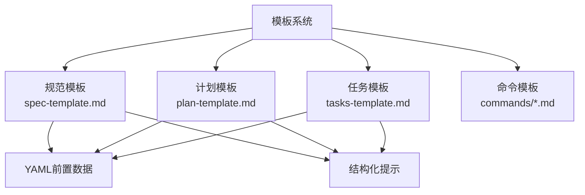

### 模板位置

模板文件通常位于：

```
.specify/
  ├── templates/
  │   ├── spec-template.md
  │   ├── plan-template.md
  │   ├── tasks-template.md
  │   └── commands/
  │       ├── specify.md
  │       ├── plan.md
  │       └── tasks.md
  └── scripts/
      ├── bash/
      └── powershell/
```

### 模板示例

**规范模板结构**：

```markdown
---
command: /speckit.specify
description: Create a functional specification
script: update-agent-context.sh
---

# 功能规范

## 需求描述
[AI 生成的需求描述]

## 功能特性
- [特性1]
- [特性2]

## 非功能需求
- 性能要求
- 安全要求
- 可用性要求
```

## 自动化脚本

### 脚本类型

Spec Kit 提供跨平台的自动化脚本：

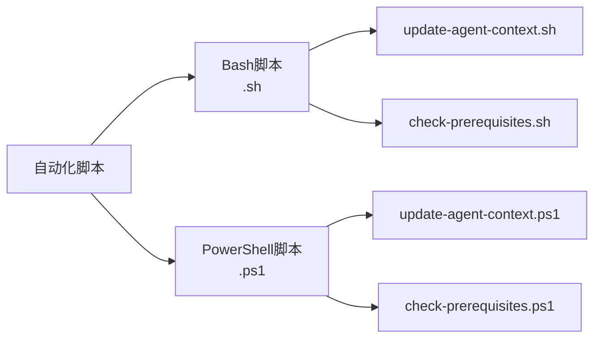

### 主要脚本功能

#### `update-agent-context.sh/ps1`

更新 AI 代理的上下文信息，确保代理能够访问最新的规范文件。

**工作流程**：

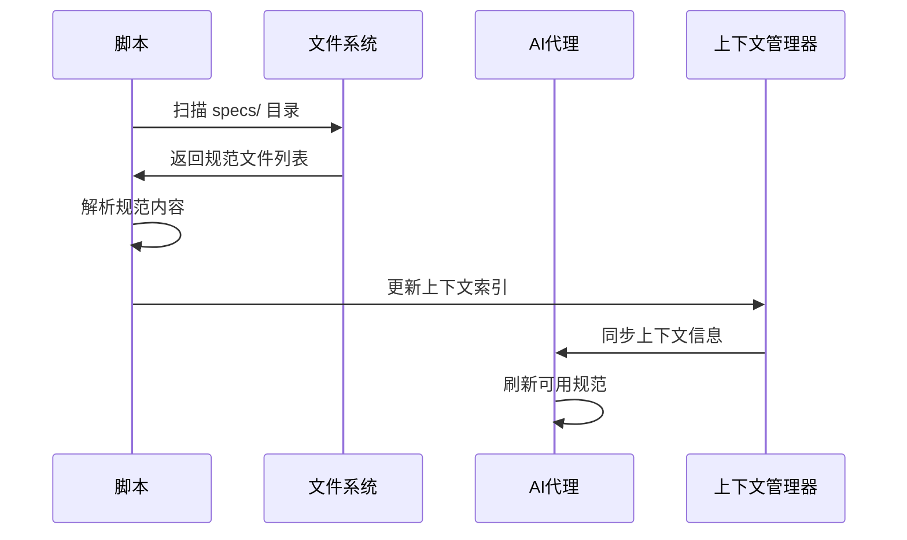

#### `check-prerequisites.sh/ps1`

检查项目前置条件，验证环境配置。

**检查项**：

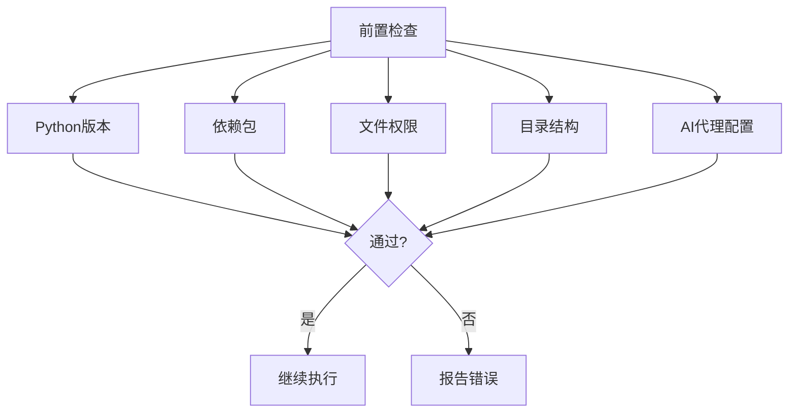

## 实际使用案例

### 案例：照片管理应用

让我们通过一个完整的例子来演示 Spec Kit 的使用流程。

#### 步骤 1：初始化项目

```bash
uvx --from git+https://github.com/github/spec-kit.git specify init photo-manager
```

#### 步骤 2：建立项目原则

```markdown
/speckit.constitution

项目原则：
- 使用现代 Web 技术栈
- 优先考虑用户体验
- 确保数据隐私和安全
- 代码必须通过测试
```

#### 步骤 3：创建功能规范

```markdown
/speckit.specify Build a photo management application with the following features:
- Organize photos into albums
- Albums grouped by date automatically
- Drag and drop to reorganize albums
- Search functionality
- Metadata editing
```

**生成的规范结构**：

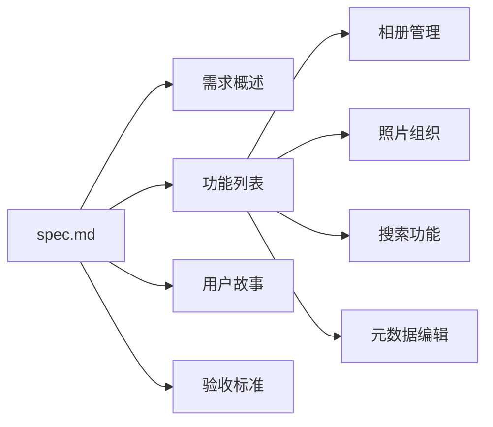

#### 步骤 4：生成实现计划

```markdown
/speckit.plan Use Vite as build tool. Minimize dependencies. 
Use vanilla HTML/CSS/JavaScript where possible. 
Store metadata in SQLite. No cloud upload.
```

**生成的计划文档**：

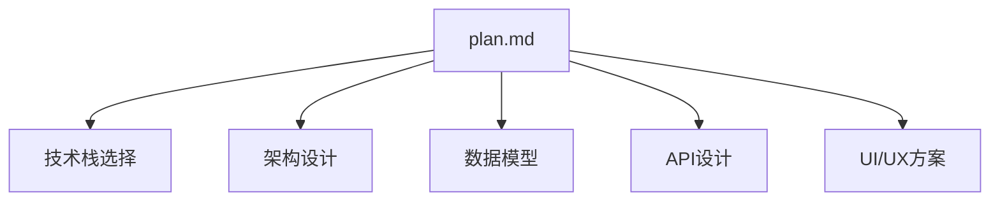

#### 步骤 5：任务分解

```markdown
/speckit.tasks Break down the implementation plan into actionable tasks
```

**任务列表示例**：

1. ✅ 设置 Vite 项目结构
2. ✅ 设计和创建 SQLite 数据库
3. ✅ 实现文件系统扫描功能
4. ✅ 构建相册管理 API
5. ✅ 开发拖拽排序功能
6. ✅ 实现搜索功能
7. ✅ 创建元数据编辑界面
8. ✅ 编写单元测试和集成测试

#### 步骤 6：分析评估

```markdown
/speckit.analyze Check coverage and conflicts
```

#### 步骤 7：自动化实现

```markdown
/speckit.implement Execute tasks from tasks.md
```

**实现过程**：

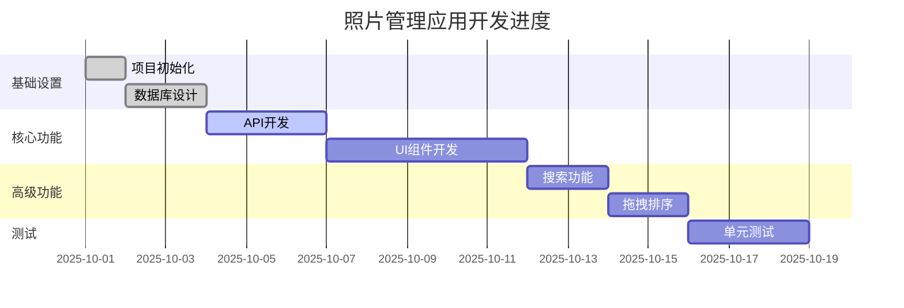

## 支持 AI 代理

Spec Kit 支持多种 AI 编码助手：

```mermaid
mindmap
  root((支持的AI代理))
    Claude
      Claude Code
      Claude Desktop
    GitHub
      GitHub Copilot
      GitHub Copilot Chat
    Cursor
      Cursor Editor
    Google
      Gemini CLI
      Bard Code
    其他
      Codeium
      Tabnine
      CodeWhisperer
```

### 代理特定配置

不同代理需要特定的配置转换：

```mermaid
graph LR
    A[Spec Kit模板] --> B{代理类型}
    B -->|Claude| C[Claude格式]
    B -->|Copilot| D[Copilot格式]
    B -->|Cursor| E[Cursor格式]
    B -->|Gemini| F[Gemini格式]
    
    C --> G[生成规范]
    D --> G
    E --> G
    F --> G
```

## 最佳实践

### 1. 规范编写最佳实践

```mermaid
graph TD
    A[编写规范] --> B[明确需求]
    B --> C[避免歧义]
    C --> D[包含验收标准]
    D --> E[考虑边界情况]
    E --> F[保持可追溯性]
```

**规范编写原则**：
- ✅ 使用清晰、明确的语言
- ✅ 包含具体的验收标准
- ✅ 描述边界情况和异常处理
- ✅ 保持规范的层次结构
- ❌ 避免技术实现细节
- ❌ 不要跳过澄清步骤

### 2. 计划制定最佳实践

- **技术栈选择**：明确指定使用的框架和库
- **架构设计**：包含清晰的架构图和说明
- **数据模型**：详细定义数据库结构
- **API 设计**：遵循 RESTful 规范

### 3. 任务分解最佳实践

```mermaid
graph LR
    A[任务分解] --> B[原子性]
    A --> C[可测试]
    A --> D[有依赖关系]
    A --> E[有验收标准]
    
    B --> F[良好任务]
    C --> F
    D --> F
    E --> F
```

**任务分解原则**：
- ✅ 每个任务应该是原子性的
- ✅ 任务应该有明确的验收标准
- ✅ 明确任务之间的依赖关系
- ✅ 合理估算工作量

### 4. 持续改进

```mermaid
flowchart LR
    A[实现] --> B[测试]
    B --> C[分析]
    C --> D[优化规范]
    D --> A
    
    style A fill:#e1f5ff
    style B fill:#fff4e1
    style C fill:#ffe1f5
    style D fill:#e1ffe1
```

## 常见问题

### Q1: 如何更新 Spec Kit 模板？

```bash
# 重新运行 init 命令会下载最新版本
uvx --from git+https://github.com/github/spec-kit.git specify init --update
```

### Q2: 支持哪些编程语言？

Spec Kit 是语言无关的，支持任何可以通过 AI 代理开发的编程语言。

### Q3: 如何集成到现有项目？

```bash
# 在现有项目根目录运行
uvx --from git+https://github.com/github/spec-kit.git specify init --existing
```

### Q4: 规范文件如何版本控制？

所有规范文件都应该提交到 Git，建议的 `.gitignore` 配置：

```gitignore
# Spec Kit
.specify/cache/
.specify/temp/
```

### Q5: 如何处理大型项目？

对于大型项目，建议：

```mermaid
graph TD
    A[大型项目] --> B[模块化规范]
    B --> C[多个 spec.md]
    C --> D[统一 plan.md]
    D --> E[分阶段 tasks.md]
    E --> F[增量实现]
```

- 按模块创建多个规范文件
- 统一的技术实现计划
- 分阶段的任务分解
- 增量式实现

## 总结

GitHub Spec Kit 提供了一个强大的框架，将规范驱动开发理念转化为可执行的实践：

### 核心价值

```mermaid
mindmap
  root((Spec Kit价值))
    提升质量
      规范优先
      可追溯性
      一致性检查
    提高效率
      AI自动化
      结构化工作流
      减少返工
    改善协作
      清晰文档
      共享理解
      知识传承
```

### 适用场景

- ✅ 新项目启动
- ✅ 功能增强和重构
- ✅ 技术债务管理
- ✅ 团队协作开发
- ✅ AI 辅助开发

### 下一步

1. **立即开始**：使用 `specify init` 初始化您的第一个项目
2. **深入学习**：访问 [GitHub Spec Kit 仓库](https://github.com/github/spec-kit)
3. **参考文档**：查看 [DeepWiki Spec Kit 文档](https://deepwiki.com/github/spec-kit)
4. **参与贡献**：加入社区，分享最佳实践

通过 Spec Kit，您可以：
- 🎯 提高需求质量
- 📋 增强实现追溯性
- ✅ 改善任务分解清晰度
- 🔄 保持设计一致性
- 🤖 充分利用 AI 能力

开始您的规范驱动开发之旅吧！

---

## 参考资源

- **GitHub 仓库**：https://github.com/github/spec-kit
- **DeepWiki 文档**：https://deepwiki.com/github/spec-kit
- **快速入门指南**：https://gist.github.com/daqi/48fe58260cd93647602c445d0559b87d
- **最佳实践**：参考仓库中的 `docs/` 目录

