## 什么是 Agent Skills？

Agent Skills 是 Anthropic 开发的一种革命性方法，用于扩展 Claude 的能力。Skills 是包含指令、脚本和资源的文件夹结构，Claude 可以在执行特定任务时动态加载这些内容。每个 Skill 都包含一个 `SKILL.md` 文件，其中定义了技能的名称、描述和具体指令。Claude 会根据任务需求，自动识别并加载相关的 Skills，从而在特定领域表现得更专业。

### 核心概念


### 核心特点

- 🎯 **可组合性**：Skills 可以组合使用，Claude 会自动识别需要哪些 Skills 并协调它们
- 🔄 **可移植性**：在所有平台上使用相同的格式，构建一次即可在 Claude 的各个应用程序、Claude Code 和 API 中使用
- ⚡ **高效性**：仅在需要时加载所需的内容，保持高效的性能
- 💪 **强大性**：Skills 可以包含可执行的代码，用于那些传统编程比生成式模型更可靠的任务

## Agent Skills 的工作原理

### 工作流程


### 智能加载机制

Claude 在处理任务时，会扫描可用的 Skills，寻找与当前任务相关的技能。当找到匹配的技能时，Claude 仅加载所需的最小信息和文件，以保持高效的性能，同时获取专业的知识。


## Agent Skills 的目录结构

### 标准目录结构

一个典型的 Skill 包含以下结构：


### 文件说明

| 文件/目录 | 用途 | 必需性 |
|---------|------|--------|
| **SKILL.md** | 包含技能的名称、描述和主要指令 | ✅ 必需 |
| **reference.md** | 额外的参考文件，提供更详细的说明 | ⚪ 可选 |
| **forms.md** | 特定任务的表单定义和指导 | ⚪ 可选 |
| **scripts/** | 包含可执行的脚本，Claude 可以在需要时运行 | ⚪ 可选 |

### SKILL.md 文件格式


**示例结构**：

```markdown
---
name: 技能名称
description: 技能描述
---

# 技能名称

## 描述
具体的技能描述和使用场景。

## 指令
使用该技能时的具体指令和指导。

## 示例
使用示例和最佳实践。
```

## 创建你的第一个 Agent Skill

### 准备工作

在开始创建 Skill 之前，确保您的环境满足以下要求：


### 创建步骤

#### 步骤 1：创建技能目录


创建技能目录：

```bash
mkdir -p my-skill-name
cd my-skill-name
```

#### 步骤 2：编写 SKILL.md 文件

创建 `SKILL.md` 文件，包含以下内容：

```yaml
---
name: 我的第一个技能
description: 这是一个示例技能，用于演示如何创建 Agent Skill
---

# 我的第一个技能

## 描述
这个技能展示了如何创建基本的 Agent Skill。

## 使用场景
- 场景 1：处理特定类型的任务
- 场景 2：执行特定的操作
- 场景 3：生成特定格式的输出

## 指令
当使用此技能时：
1. 首先分析任务需求
2. 然后执行相应的操作
3. 最后返回格式化的结果

## 示例
示例使用场景和预期输出。
```

#### 步骤 3：添加参考文件（可选）

如果需要，可以添加 `reference.md` 文件：

```markdown
# 参考文档

## 详细说明
更详细的技能说明和使用指南。

## API 参考
如果涉及 API 调用，提供 API 参考文档。

## 常见问题
列出常见问题和解决方案。
```

#### 步骤 4：添加脚本（可选）

创建 `scripts/` 目录并添加可执行脚本：


**示例 Python 脚本** (`scripts/process.py`):

```python
#!/usr/bin/env python3
"""
处理脚本示例
"""
import sys
import json

def process_data(input_data):
    """处理输入数据"""
    # 处理逻辑
    result = {"processed": True, "data": input_data}
    return result

if __name__ == "__main__":
    input_data = sys.stdin.read()
    result = process_data(input_data)
    print(json.dumps(result))
```

**设置执行权限**：

```bash
chmod +x scripts/*.py
chmod +x scripts/*.sh
```

#### 步骤 5：测试技能


## Skills 的组合使用

### 多技能协调

Skills 的强大之处在于可以组合使用。Claude 会自动识别需要哪些 Skills，并协调它们的使用。


### 技能依赖关系


Skills 可以相互依赖。当 Claude 加载一个 Skill 时，它会自动识别并加载该 Skill 的依赖项。

## 实际应用案例

### 案例 1：代码分析技能

创建一个用于分析代码质量的 Skill：


**SKILL.md 示例**：

```markdown
---
name: 代码分析
description: 分析代码质量、发现潜在问题并提供改进建议
---

# 代码分析技能

## 描述
这个技能用于分析代码质量，检查代码风格、潜在错误和性能问题。

## 使用场景
- 代码审查
- 代码质量评估
- 技术债务分析

## 指令
1. 读取代码文件
2. 执行静态分析
3. 检查代码规范
4. 生成分析报告
```

### 案例 2：文档生成技能

创建一个用于生成技术文档的 Skill：


### 案例 3：数据分析技能

创建一个用于数据分析和可视化的 Skill：


## Skills 的安全注意事项

### 安全最佳实践

由于 Skills 可以包含可执行的代码，因此在使用时需要注意安全性。


### 安全检查清单


**安全建议**：

- ✅ 仅从可信来源安装 Skills
- ✅ 在使用前审查所有代码
- ✅ 特别注意技能中包含的代码依赖项和外部资源
- ✅ 确保它们不会引入安全漏洞
- ✅ 定期更新和维护 Skills
- ❌ 不要盲目信任未经验证的 Skills
- ❌ 不要在关键系统上使用未经测试的 Skills

## Skills 的高级特性

### 动态加载机制


### 上下文感知

Claude 能够根据当前上下文智能选择和应用 Skills：


## 最佳实践

### 1. Skill 设计原则


**设计原则**：

- ✅ **单一职责**：每个 Skill 应该专注于一个特定的任务或领域
- ✅ **清晰命名**：使用描述性的名称，让其他用户易于理解
- ✅ **完整文档**：提供详细的文档和示例
- ✅ **可重用性**：设计可重用的 Skills，避免重复代码
- ✅ **模块化**：将复杂功能拆分为多个简单的 Skills

### 2. 文档编写最佳实践

```mermaid
mindmap
  root((文档最佳实践))
    清晰描述
      用途说明
      使用场景
      限制条件
    完整示例
      基本用法
      高级用法
      错误处理
    结构清晰
      层次分明
      易于导航
      快速查找
```



### 3. 脚本编写最佳实践

```mermaid
flowchart TD
    A[脚本编写] --> B[错误处理]
    A --> C[日志记录]
    A --> D[参数验证]
    A --> E[文档注释]
    
    B --> F[健壮脚本]
    C --> F
    D --> F
    E --> F
    
    style F fill:#e1ffe1
```

**脚本编写原则**：

- ✅ 添加错误处理和异常捕获
- ✅ 记录关键操作和结果
- ✅ 验证输入参数
- ✅ 添加详细的文档注释
- ✅ 遵循代码规范

### 4. 测试和验证

```mermaid
sequenceDiagram
    participant D as 开发者
    participant S as Skill
    participant T as 测试用例
    participant C as Claude
    
    D->>S: 创建 Skill
    D->>T: 编写测试用例
    T->>C: 加载 Skill
    C->>S: 执行测试
    S->>C: 返回结果
    C->>D: 验证结果
    D->>D: 修复问题
```

## 部署和分发

### Skills 的部署方式

```mermaid
graph TB
    A[Skills 部署] --> B[本地部署]
    A --> C[版本控制]
    A --> D[共享仓库]
    
    B --> E[本地文件夹]
    C --> F[Git 仓库]
    D --> G[Skills 市场]
    
    style B fill:#e1f5ff
    style D fill:#fff4e1
```

### 版本管理

```mermaid
graph LR
    A[Skill 版本] --> B[v1.0.0]
    A --> C[v1.1.0]
    A --> D[v2.0.0]
    
    B --> E[初始版本]
    C --> F[功能增强]
    D --> G[重大更新]
    
    style E fill:#e1f5ff
    style F fill:#fff4e1
    style G fill:#ffe1f5
```

## 未来展望

### Anthropic 的发展计划

Anthropic 正在努力改进 Skills 系统，未来的发展方向包括：

```mermaid
mindmap
  root((未来发展))
    简化创建
      图形化界面
      模板库
      自动化工具
    企业级功能
      团队协作
      权限管理
      审计日志
    AI 增强
      自动创建 Skills
      智能优化
      行为学习
    生态系统
      Skills 市场
      社区贡献
      最佳实践分享
```

### 预期功能

- 🔮 **简化创建流程**：提供更友好的工具和界面
- 🔮 **企业级部署**：支持组织级别的 Skills 管理和分发
- 🔮 **AI 辅助创建**：Claude 可能具备创建、编辑和评估 Skills 的能力
- 🔮 **行为模式转化**：将 Claude 的行为模式转化为可重复使用的 Skills

## 常见问题

### Q1: Skills 在哪里存储？

Skills 通常存储在本地文件系统中，或者在版本控制系统中管理。Claude 会自动扫描指定目录中的 Skills。

### Q2: 如何更新 Skills？

```mermaid
flowchart TD
    A[更新 Skill] --> B[修改文件]
    B --> C[更新版本号]
    C --> D[测试更改]
    D --> E{测试通过?}
    E -->|是| F[提交更新]
    E -->|否| B
    F --> G[重新加载]
    
    style F fill:#e1ffe1
```

### Q3: Skills 可以跨平台使用吗？

是的，Skills 使用标准格式，可以在所有 Claude 平台上使用，包括：
- Claude Desktop
- Claude Code
- Claude API

### Q4: 如何调试 Skills？

```mermaid
graph TD
    A[调试 Skills] --> B[检查日志]
    A --> C[验证文件结构]
    A --> D[测试脚本]
    A --> E[验证权限]
    
    B --> F[定位问题]
    C --> F
    D --> F
    E --> F
    F --> G[修复问题]
    
    style F fill:#e1f5ff
```

### Q5: Skills 的性能影响？

Skills 采用按需加载机制，仅在需要时加载相关文件和脚本，对性能的影响最小。

```mermaid
graph LR
    A[任务开始] --> B[分析需求]
    B --> C[加载必要文件]
    C --> D[执行任务]
    D --> E[释放资源]
    
    style C fill:#e1f5ff
```

## 总结

Agent Skills 为 Claude 提供了强大的扩展能力，使其能够在特定领域表现出专业性：

### 核心价值

```mermaid
mindmap
  root((Skills 价值))
    专业化
      领域专家
      深度知识
      精准执行
    效率提升
      自动化任务
      减少重复工作
      快速响应
    可扩展性
      易于创建
      灵活组合
      持续改进
    协作共享
      团队共享
      知识传承
      最佳实践
```

### 适用场景

- ✅ 特定领域的专业任务
- ✅ 需要执行代码的复杂操作
- ✅ 标准化的重复性工作
- ✅ 团队协作和知识共享
- ✅ 企业级自动化流程

### 下一步行动

1. **开始创建**：创建你的第一个 Agent Skill
2. **学习示例**：查看官方示例和社区贡献的 Skills
3. **加入社区**：参与讨论和分享最佳实践
4. **持续改进**：根据使用反馈不断优化 Skills

通过 Agent Skills，您可以：
- 🎯 将 Claude 定制为满足您特定需求的专家助手
- 📋 提高工作效率和任务完成质量
- 🔄 实现知识的可重用和团队协作
- 🚀 构建专业化的 AI 工作流

开始您的 Agent Skills 之旅，释放 Claude 的全部潜力！

---

## 参考资源

- **GitHub 仓库**：https://github.com/anthropics/skills
- **DeepWiki 文档**：https://deepwiki.com/anthropics/skills
- **官方介绍**：https://www.anthropic.com/news/skills
- **社区论坛**：参与讨论和分享经验

