# bpftop 完整指南：eBPF 程序性能监控工具

## 项目概述

[bpftop](https://github.com/Netflix/bpftop) 是 Netflix 开发的一个强大的实时 eBPF 程序性能监控工具。它提供了一个类似 `top` 命令的交互式界面，用于动态监控正在运行的 eBPF 程序的关键性能指标，包括平均执行时间、每秒事件数以及估计的 CPU 使用率。

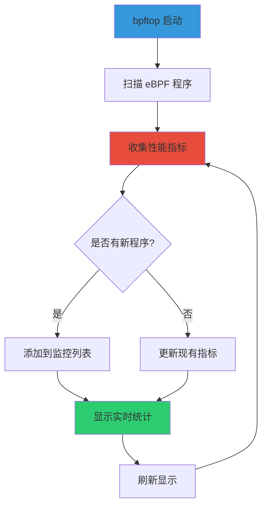

## 核心特性

bpftop 提供了以下核心功能：

- **实时监控**：动态显示所有正在运行的 eBPF 程序的性能指标
- **低开销**：使用 eBPF 自身进行监控，最小化性能影响
- **详细信息**：显示程序 ID、名称、平均执行时间、事件频率和 CPU 使用率
- **交互式界面**：支持排序、过滤和实时刷新
- **多程序支持**：同时监控多个 eBPF 程序

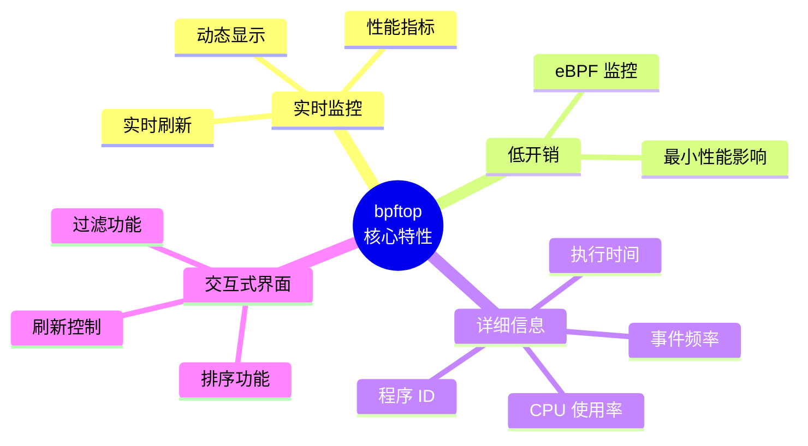

## 系统要求

在安装 bpftop 之前，请确保您的系统满足以下要求：

### 内核要求

- **Linux 内核版本**：4.18 或更高版本（支持 eBPF 功能）
- **BPF 支持**：需要启用以下内核配置：
  - `CONFIG_BPF=y`
  - `CONFIG_BPF_SYSCALL=y`
  - `CONFIG_BPF_JIT=y`
  - `CONFIG_HAVE_EBPF_JIT=y`

### 软件依赖

- **Rust 工具链**：Rust 1.70+ 和 Cargo
- **构建工具**：clang, llvm, libbpf
- **系统库**：libelf, zlib

### 权限要求

- 需要 **root 权限**或 **CAP_BPF** 和 **CAP_SYS_ADMIN** 能力来访问 eBPF 程序信息

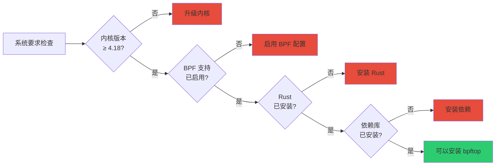

## 安装指南

### 方法一：使用 Cargo 安装（推荐）

这是最简单和最常用的安装方法：

```bash
# 确保 Rust 已安装
curl --proto '=https' --tlsv1.2 -sSf https://sh.rustup.rs | sh

# 使用 Cargo 安装 bpftop
cargo install bpftop

# 验证安装
bpftop --version
```

### 方法二：从源码编译安装

如果您需要最新功能或进行自定义构建：

```bash
# 克隆仓库
git clone https://github.com/Netflix/bpftop.git
cd bpftop

# 编译
cargo build --release

# 安装到系统
sudo cp target/release/bpftop /usr/local/bin/

# 验证安装
bpftop --version
```

### 方法三：使用预编译二进制文件

如果您的发行版提供了预编译包：

```bash
# Ubuntu/Debian (如果可用)
sudo apt-get install bpftop

# 或者从 GitHub Releases 下载
wget https://github.com/Netflix/bpftop/releases/latest/download/bpftop-x86_64-unknown-linux-gnu
chmod +x bpftop-x86_64-unknown-linux-gnu
sudo mv bpftop-x86_64-unknown-linux-gnu /usr/local/bin/bpftop
```

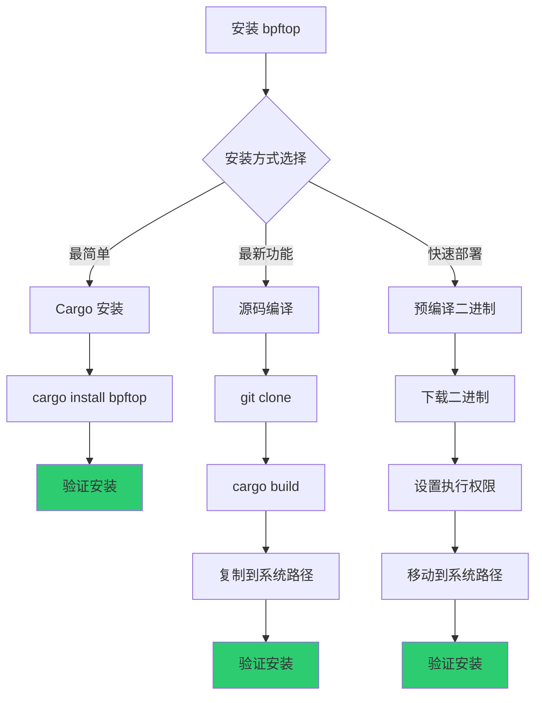

## 基本使用

### 启动 bpftop

启动 bpftop 非常简单，但需要适当的权限：

```bash
# 使用 root 权限运行
sudo bpftop

# 或者使用 sudo
sudo bpftop

# 查看帮助信息
bpftop --help
```

### 界面说明

bpftop 启动后会显示一个实时更新的监控界面，包含以下列：

| 列名 | 说明 |
|------|------|
| **PID** | 进程 ID（如果程序附加到进程） |
| **PROG ID** | eBPF 程序 ID |
| **PROG NAME** | 程序名称 |
| **AVG TIME (ns)** | 平均执行时间（纳秒） |
| **EVENTS/s** | 每秒触发的事件数 |
| **TOTAL CPU (%)** | 估计的总 CPU 使用率百分比 |

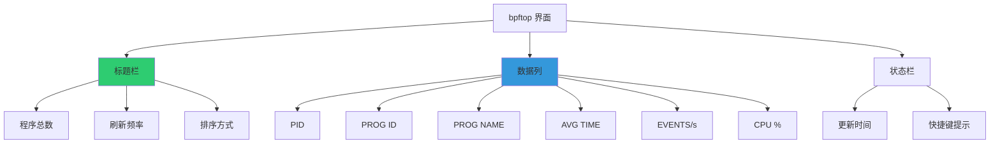

### 输出示例

典型的 bpftop 输出如下所示：

```
bpftop - eBPF Program Monitor
==========================================
PID      PROG ID    PROG NAME          AVG TIME (ns)    EVENTS/s    TOTAL CPU (%)
12345    56         xdp_prog           150              125000      18.75
67890    78         tracepoint_prog    200              50000       10.00
11111    89         kprobe_prog        180              75000       13.50
22222    90         uprobe_prog        250              30000       7.50
```

## 高级功能

### 交互式命令

bpftop 支持以下交互式命令：

| 快捷键 | 功能 |
|--------|------|
| `q` 或 `Ctrl+C` | 退出程序 |
| `s` | 切换排序方式（按 CPU、时间、事件数） |
| `r` | 手动刷新显示 |
| `f` | 过滤/搜索程序 |
| `↑/↓` | 滚动列表 |
| `h` | 显示帮助信息 |

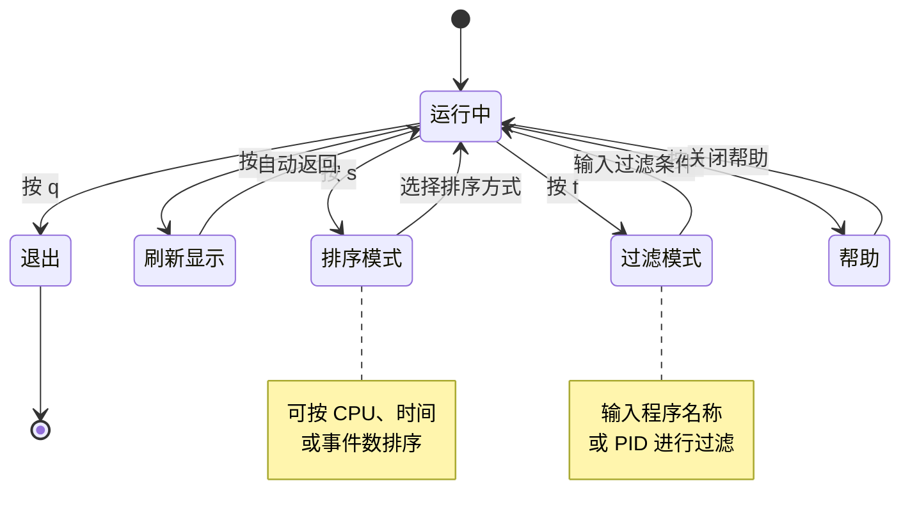

### 命令行选项

bpftop 支持以下命令行选项：

```bash
# 基本选项
bpftop [OPTIONS]

# 常用选项
--refresh-rate <SECONDS>    # 设置刷新间隔（默认：1秒）
--sort-by <FIELD>           # 设置默认排序字段（cpu, time, events）
--filter <PATTERN>          # 设置过滤模式
--pid <PID>                 # 仅显示指定 PID 的程序
--json                      # 以 JSON 格式输出
--no-header                 # 不显示标题栏
--version                   # 显示版本信息
--help                      # 显示帮助信息
```

### 使用示例

```bash
# 每 2 秒刷新一次
sudo bpftop --refresh-rate 2

# 按 CPU 使用率排序
sudo bpftop --sort-by cpu

# 仅显示特定 PID 的程序
sudo bpftop --pid 12345

# 过滤包含 "xdp" 的程序
sudo bpftop --filter xdp

# 以 JSON 格式输出（适用于脚本）
sudo bpftop --json

# 组合使用多个选项
sudo bpftop --refresh-rate 2 --sort-by events --filter tracepoint
```

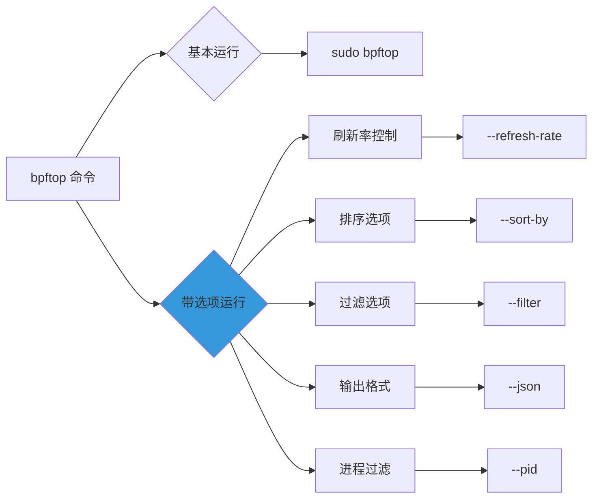

## 性能指标详解

### 平均执行时间（AVG TIME）

平均执行时间表示 eBPF 程序每次执行的平均耗时（以纳秒为单位）。这个指标对于识别性能瓶颈非常重要：

- **低值（< 100ns）**：程序执行效率高
- **中值（100-1000ns）**：正常执行时间
- **高值（> 1000ns）**：可能需要优化

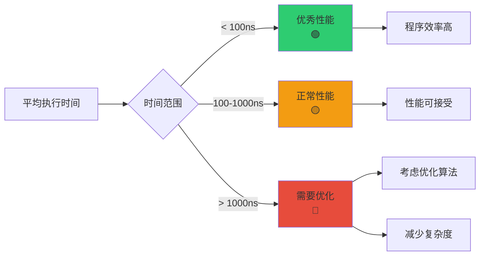

### 每秒事件数（EVENTS/s）

每秒事件数表示 eBPF 程序在一秒内被触发的次数。这个指标反映了程序的活跃程度：

- **高事件率**：程序被频繁调用，可能对系统性能有较大影响
- **低事件率**：程序相对不活跃

### CPU 使用率（TOTAL CPU %）

估计的总 CPU 使用率基于以下公式计算：

```
CPU % = (平均执行时间 × 每秒事件数) / CPU 频率 × 100
```

这个指标提供了程序对系统 CPU 资源消耗的整体评估。

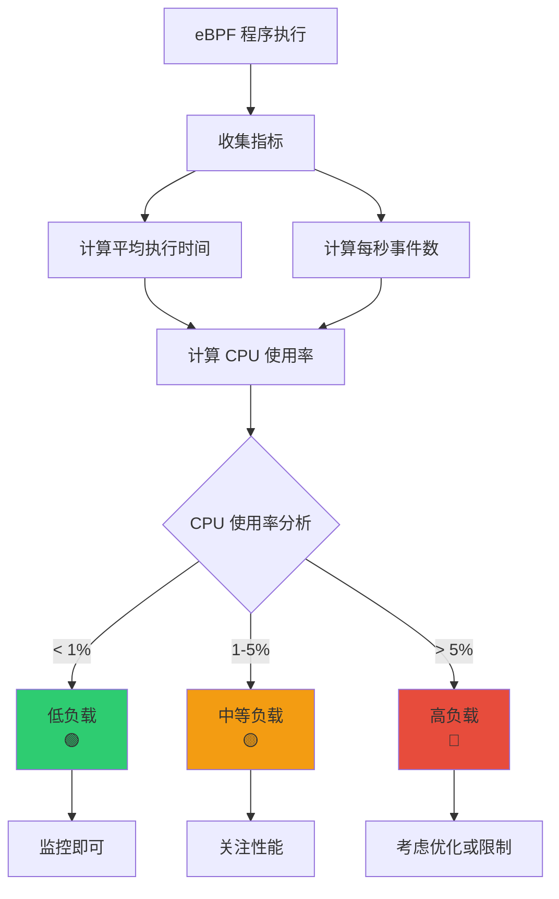

## 使用场景

### 场景一：监控 XDP 程序性能

XDP（eXpress Data Path）程序用于高性能网络数据包处理：

```bash
# 监控所有 XDP 程序
sudo bpftop --filter xdp

# 查看特定网络接口的 XDP 程序
sudo bpftop --sort-by events
```

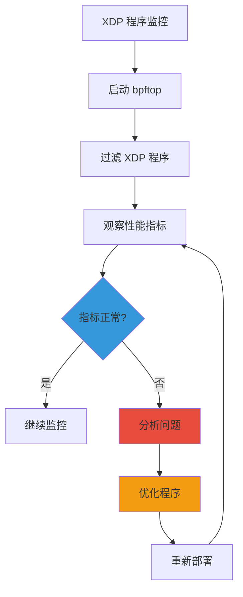

### 场景二：调试 tracepoint 程序

使用 bpftop 监控 tracepoint 和 kprobe 程序：

```bash
# 监控所有 tracepoint 程序
sudo bpftop --filter tracepoint

# 按执行时间排序，找出慢程序
sudo bpftop --sort-by time
```

### 场景三：性能优化

识别性能瓶颈并进行优化：

```bash
# 找出 CPU 使用率最高的程序
sudo bpftop --sort-by cpu

# 找出执行时间最长的程序
sudo bpftop --sort-by time

# 找出事件频率最高的程序
sudo bpftop --sort-by events
```

### 场景四：生产环境监控

在生产环境中持续监控 eBPF 程序：

```bash
# 使用 JSON 输出进行自动化监控
sudo bpftop --json --refresh-rate 5 > /var/log/bpftop.log

# 结合其他工具进行分析
sudo bpftop --json | jq '.[] | select(.cpu > 5)'
```

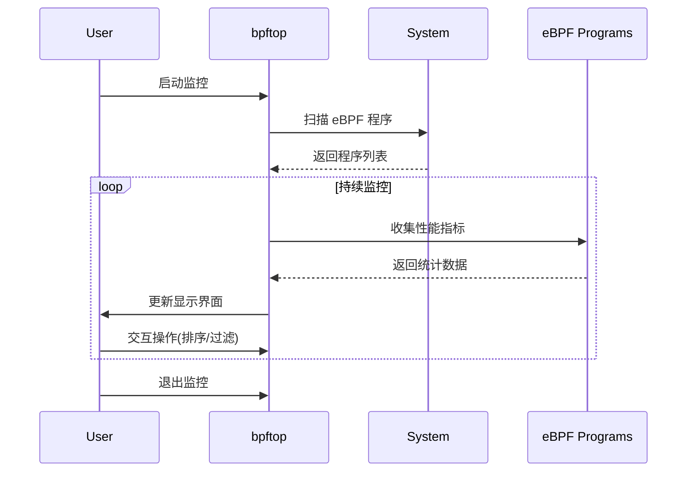

## 最佳实践

### 1. 定期监控

建议在生产环境中定期运行 bpftop，以了解 eBPF 程序的性能趋势：

```bash
# 创建监控脚本
#!/bin/bash
while true; do
    sudo bpftop --json --refresh-rate 5 >> /var/log/bpftop-$(date +%Y%m%d).log
    sleep 60
done
```

### 2. 设置告警阈值

根据应用需求设置合理的 CPU 使用率告警阈值：

- **警告阈值**：CPU 使用率 > 5%
- **严重阈值**：CPU 使用率 > 10%
- **执行时间阈值**：平均执行时间 > 1000ns

### 3. 优化建议

当发现性能问题时，考虑以下优化策略：

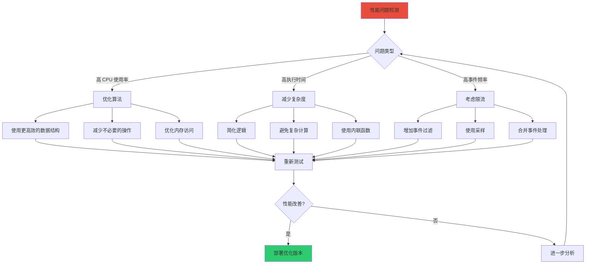

### 4. 日志记录

在生产环境中，建议将 bpftop 的输出保存到日志文件中，以便后续分析：

```bash
# 记录到文件并添加时间戳
sudo bpftop --json --refresh-rate 10 | \
    while read line; do
        echo "$(date '+%Y-%m-%d %H:%M:%S') $line" >> /var/log/bpftop.log
    done
```

### 5. 集成到监控系统

将 bpftop 的输出集成到现有的监控系统中：

```bash
# 使用 Prometheus 导出器
bpftop --json | prometheus-exporter

# 或使用自定义脚本转换为指标格式
bpftop --json | convert-to-prometheus-metrics.sh
```

## 故障排查

### 常见问题

#### 问题 1：无法启动 bpftop

**症状**：运行 `bpftop` 时提示权限不足或找不到程序。

**解决方案**：

```bash
# 检查权限
sudo bpftop

# 检查是否已安装
which bpftop

# 检查内核支持
uname -r  # 应 >= 4.18
ls /sys/fs/bpf  # 检查 BPF 文件系统
```

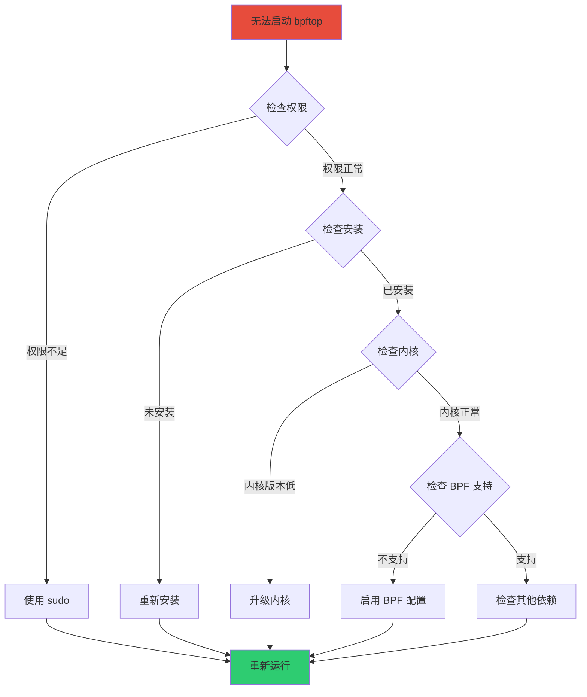

#### 问题 2：显示为空或不显示程序

**症状**：bpftop 启动后没有显示任何 eBPF 程序。

**可能原因**：
1. 系统中没有运行 eBPF 程序
2. 内核不支持 eBPF
3. BPF 文件系统未挂载

**解决方案**：

```bash
# 检查是否有 eBPF 程序运行
sudo bpftool prog list

# 检查 BPF 文件系统
mount | grep bpf

# 如果没有挂载，手动挂载
sudo mount -t bpf bpf /sys/fs/bpf
```

#### 问题 3：性能指标不准确

**症状**：显示的 CPU 使用率或执行时间看起来不准确。

**可能原因**：
1. 采样频率不够高
2. 系统负载过高
3. 多个程序竞争资源

**解决方案**：

```bash
# 增加刷新频率
sudo bpftop --refresh-rate 0.5

# 减少其他系统负载
# 监控更长时间以获取平均值
```

### 调试技巧

1. **使用详细模式**：检查是否有错误消息
2. **对比工具**：使用 `bpftool` 对比验证数据
3. **系统日志**：查看 `/var/log/syslog` 或 `journalctl` 获取更多信息

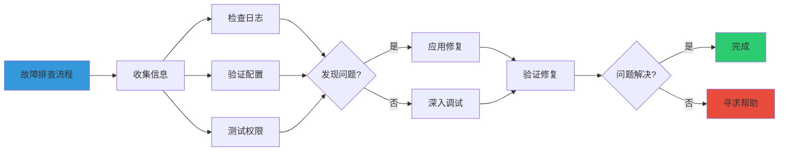

## 与其他工具集成

### bpftool

bpftool 是官方提供的 eBPF 程序管理工具，可以与 bpftop 配合使用：

```bash
# 使用 bpftool 查看程序详细信息
sudo bpftool prog show id <PROG_ID>

# 使用 bpftop 监控性能
sudo bpftop
```

### BCC 工具集

BCC（BPF Compiler Collection）提供了一系列 eBPF 工具：

```bash
# 使用 BCC 工具创建程序
sudo python3 bcc_script.py

# 使用 bpftop 监控其性能
sudo bpftop --filter <program_name>
```

### SystemTap

SystemTap 是另一种系统跟踪工具：

```bash
# 使用 SystemTap 进行分析
sudo stap script.stp

# 使用 bpftop 监控相关的 eBPF 程序
sudo bpftop
```

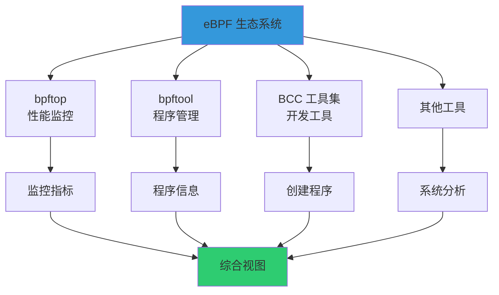

## 架构设计

### bpftop 工作原理

bpftop 使用 eBPF 技术本身来监控其他 eBPF 程序，实现了高效的低开销监控：

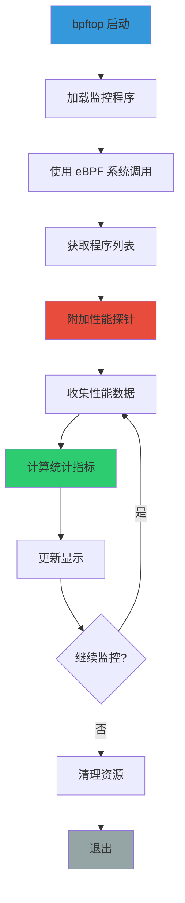

### 数据流

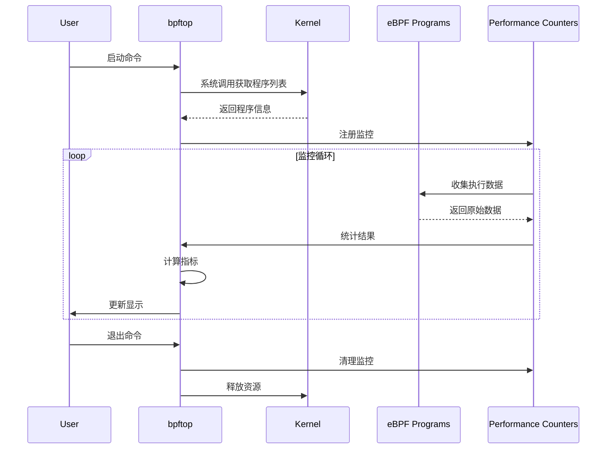

## 性能优化建议

### 对于 eBPF 程序开发者

如果您的 eBPF 程序在 bpftop 中显示高 CPU 使用率，考虑以下优化：

1. **减少循环复杂度**：简化循环逻辑
2. **优化数据结构**：使用更高效的数据结构
3. **减少系统调用**：最小化内核与用户空间的切换
4. **使用内联函数**：减少函数调用开销
5. **避免动态内存分配**：在 eBPF 程序中预分配内存

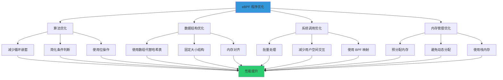

## 实际案例

### 案例一：监控网络数据包处理

在一个高性能网络应用中，使用 XDP 程序处理数据包：

```bash
# 启动 bpftop 监控
sudo bpftop --filter xdp --sort-by cpu

# 观察到的输出
# PID      PROG ID    PROG NAME    AVG TIME (ns)    EVENTS/s    TOTAL CPU (%)
# -        56         xdp_filter   120              500000      60.00
```

**分析**：
- 事件频率很高（500,000/s），说明网络流量大
- CPU 使用率达到 60%，需要优化

**优化措施**：
1. 简化过滤逻辑
2. 使用更高效的匹配算法
3. 考虑使用多核处理

### 案例二：监控系统调用跟踪

使用 tracepoint 程序监控系统调用：

```bash
# 监控所有 tracepoint 程序
sudo bpftop --filter tracepoint

# 发现某个程序执行时间过长
# PID      PROG ID    PROG NAME         AVG TIME (ns)    EVENTS/s    TOTAL CPU (%)
# 12345    78         syscall_trace     2500             10000       25.00
```

**分析**：
- 平均执行时间 2500ns，相对较长
- 可能是程序逻辑过于复杂

**优化措施**：
1. 减少跟踪的数据量
2. 使用采样而不是全量跟踪
3. 优化数据结构访问

## 参考资料

### 官方资源

- **GitHub 仓库**：[https://github.com/Netflix/bpftop](https://github.com/Netflix/bpftop)
- **DeepWiki 页面**：[https://deepwiki.com/Netflix/bpftop](https://deepwiki.com/Netflix/bpftop)
- **Netflix 技术博客**：Netflix 相关技术文章

### 相关文档

- **eBPF 官方文档**：了解 eBPF 基础概念
- **Linux 内核文档**：BPF 和 XDP 相关文档
- **BCC 工具文档**：eBPF 开发工具使用指南

### 社区资源

- **eBPF Slack 频道**：与其他开发者交流
- **Linux 内核邮件列表**：获取最新更新
- **Stack Overflow**：查找常见问题解答

## 总结

bpftop 是一个功能强大的 eBPF 程序性能监控工具，它提供了：

- ✅ **实时监控**：动态查看所有运行中的 eBPF 程序
- ✅ **低开销**：使用 eBPF 技术实现高效监控
- ✅ **详细信息**：提供全面的性能指标
- ✅ **易于使用**：简单的命令行界面
- ✅ **灵活配置**：支持多种过滤和排序选项

通过使用 bpftop，您可以：

1. **及时发现性能问题**：快速识别占用 CPU 资源过多的程序
2. **优化程序性能**：基于数据做出优化决策
3. **监控系统健康**：确保 eBPF 程序正常运行
4. **故障排查**：快速定位性能瓶颈

无论是开发新的 eBPF 程序还是维护现有的生产环境，bpftop 都是一个不可或缺的工具。建议将其纳入您的日常监控和开发流程中。

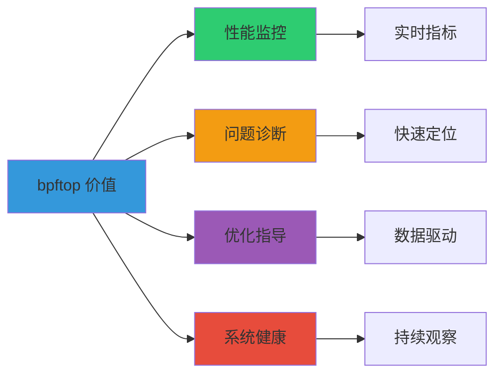

---

**最后更新**：2025-10-20

**文档版本**：1.0

**贡献者**：基于 Netflix bpftop 项目文档整理

