# Netflix Hollow 完全指南：高效内存数据集分发的实践手册

## 简介

Netflix Hollow 是 Netflix 开源的一个用于高效分发和消费大规模内存数据集的 Java 库。它通过去重、压缩等技术，显著减少内存占用，适用于需要高性能、低延迟数据访问的场景。Hollow 设计用于在微服务架构中分发大型只读数据集，使得消费者应用可以在本地内存中快速查询数据，而无需每次查询都访问数据库或远程服务。

### 核心特点

- 🚀 **高效内存使用**：通过去重和压缩技术，在内存中存储更大的数据集
- ⚡ **快速数据访问**：提供低延迟的数据读取，适用于高并发的读取操作
- 🔄 **增量更新**：支持数据的原子性增量更新，减少网络传输和内存占用
- 🔒 **数据一致性**：确保消费者始终读取到一致的数据视图
- 📦 **轻量级**：无需数据库，数据直接存储在 JVM 堆内存中
- 🌐 **分布式友好**：支持通过发布-订阅系统分发数据快照和增量更新

### 适用场景

- **配置数据分发**：将配置信息分发给多个服务实例
- **参考数据缓存**：缓存字典、映射表等参考数据
- **搜索结果索引**：存储和分发搜索索引数据
- **地理数据**：分发地理位置、区域信息等数据
- **业务规则数据**：分发业务规则、策略配置等

## Hollow 核心架构

### 系统架构概览

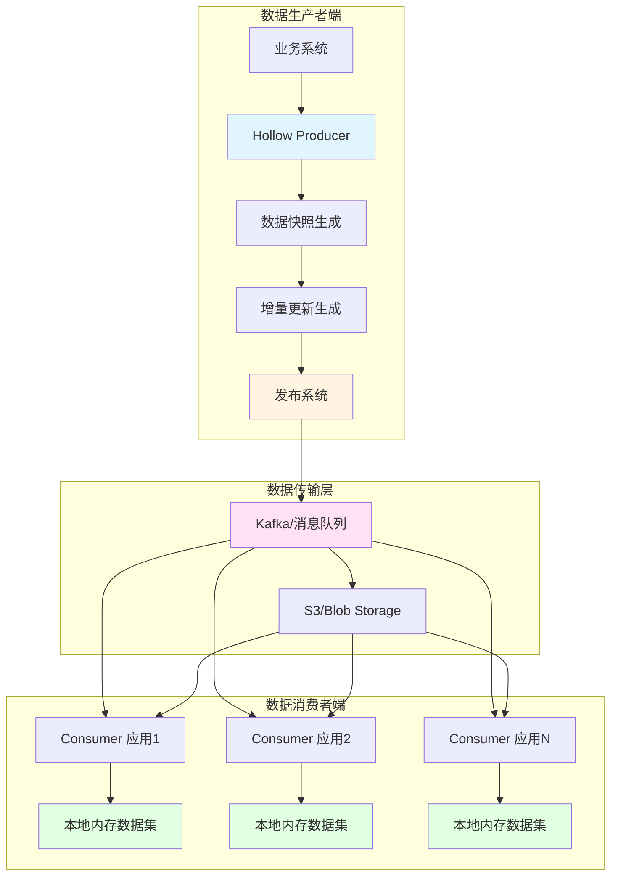
```mermaid
graph TB
    subgraph "数据生产者端"
        A[业务系统] --> B[Hollow Producer]
        B --> C[数据快照生成]
        C --> D[增量更新生成]
        D --> E[发布系统]
    end
    
    subgraph "数据传输层"
        E --> F[Kafka/消息队列]
        F --> G[S3/Blob Storage]
    end
    
    subgraph "数据消费者端"
        F --> H[Consumer 应用1]
        G --> H
        F --> I[Consumer 应用2]
        G --> I
        F --> J[Consumer 应用N]
        G --> J
        
        H --> K[本地内存数据集]
        I --> L[本地内存数据集]
        J --> M[本地内存数据集]
    end
    
    style B fill:#e1f5ff
    style E fill:#fff4e1
    style F fill:#ffe1f5
    style K fill:#e1ffe1
    style L fill:#e1ffe1
    style M fill:#e1ffe1
```

### 核心组件说明

| 组件 | 职责 | 关键特性 |
|------|------|---------|
| **Hollow Producer** | 生成数据快照和增量更新 | 数据去重、压缩、版本管理 |
| **发布系统** | 传输数据快照和增量 | Kafka、S3、文件系统等 |
| **Hollow Consumer** | 消费数据并构建本地视图 | 增量更新应用、内存管理 |
| **数据快照** | 完整的数据集状态 | 初始加载、恢复点 |
| **增量更新** | 数据集的变化 | 减少传输量、快速更新 |

## 快速入门

### 1. 添加依赖

#### Maven

```xml
<dependency>
    <groupId>com.netflix.hollow</groupId>
    <artifactId>hollow</artifactId>
    <version>4.14.0</version>
</dependency>
```

#### Gradle

```gradle
implementation 'com.netflix.hollow:hollow:4.14.0'
```

### 2. 定义数据模型

首先需要定义数据模型（POJOs），例如电影信息：

```java
public class Movie {
    private final int id;
    private final String title;
    private final int year;
    
    public Movie(int id, String title, int year) {
        this.id = id;
        this.title = title;
        this.year = year;
    }
    
    // Getters
    public int getId() { return id; }
    public String getTitle() { return title; }
    public int getYear() { return year; }
}
```

### 3. 创建数据生产者

```java
import com.netflix.hollow.api.producer.HollowProducer;
import com.netflix.hollow.api.producer.fs.HollowFilesystemAnnouncer;
import com.netflix.hollow.api.producer.fs.HollowFilesystemPublisher;

public class MovieProducer {
    public static void main(String[] args) {
        // 配置发布器和通告器
        HollowFilesystemPublisher publisher = 
            new HollowFilesystemPublisher("data");
        HollowFilesystemAnnouncer announcer = 
            new HollowFilesystemAnnouncer("data");
        
        // 创建生产者
        HollowProducer producer = HollowProducer
            .withPublisher(publisher)
            .withAnnouncer(announcer)
            .build();
        
        // 运行数据循环
        producer.runCycle(state -> {
            // 添加数据
            state.add(new Movie(1, "Inception", 2010));
            state.add(new Movie(2, "Interstellar", 2014));
            state.add(new Movie(3, "The Matrix", 1999));
        });
    }
}
```

### 4. 创建数据消费者

```java
import com.netflix.hollow.api.consumer.HollowConsumer;
import com.netflix.hollow.api.consumer.fs.HollowFilesystemBlobRetriever;

public class MovieConsumer {
    private HollowConsumer.BlobRetriever blobRetriever;
    private HollowConsumer consumer;
    
    public void initialize() {
        // 配置 Blob 检索器
        blobRetriever = new HollowFilesystemBlobRetriever("data");
        
        // 创建消费者
        consumer = HollowConsumer
            .withBlobRetriever(blobRetriever)
            .build();
        
        // 触发初始加载
        consumer.triggerRefresh();
    }
    
    public void queryData() {
        // 获取数据访问器（需要根据生成的数据模型）
        // MovieAPI api = consumer.getAPI();
        // List<Movie> movies = api.getAllMovies();
    }
}
```

## 核心概念详解

### 数据模型定义

Hollow 使用 POJO 定义数据模型，但需要满足一些约束：

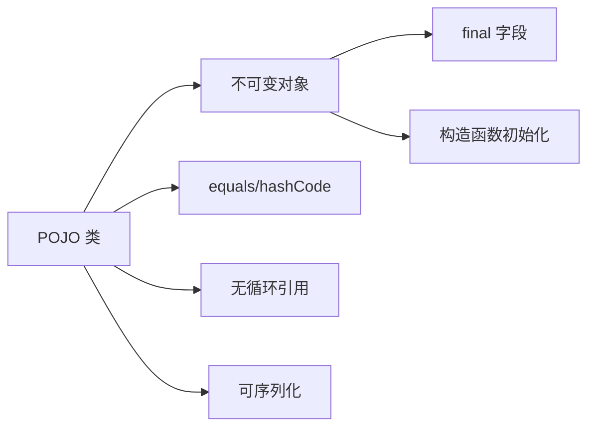
```mermaid
graph LR
    A[POJO 类] --> B[不可变对象]
    A --> C[equals/hashCode]
    A --> D[无循环引用]
    A --> E[可序列化]
    
    B --> F[final 字段]
    B --> G[构造函数初始化]
```

**POJO 约束：**

1. **不可变对象**：所有字段应该是 `final`，通过构造函数初始化
2. **实现 equals 和 hashCode**：用于去重
3. **避免循环引用**：Hollow 不支持循环引用
4. **可序列化**：对象需要能够序列化

### 生产者工作流程

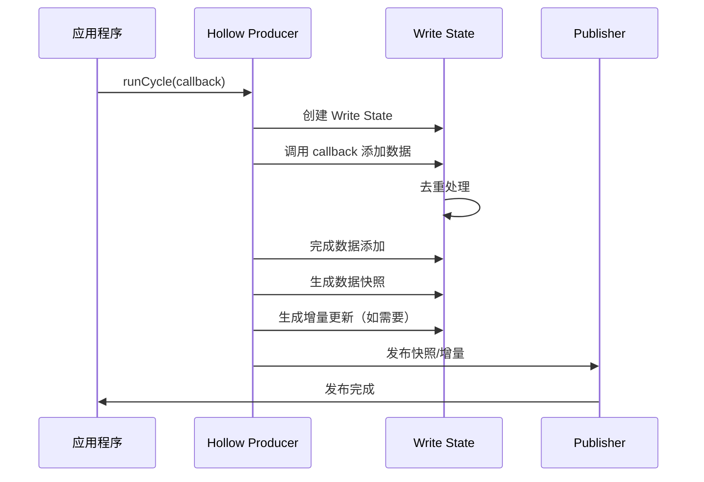
```mermaid
sequenceDiagram
    participant App as 应用程序
    participant Producer as Hollow Producer
    participant State as Write State
    participant Publisher as Publisher
    
    App->>Producer: runCycle(callback)
    Producer->>State: 创建 Write State
    Producer->>State: 调用 callback 添加数据
    State->>State: 去重处理
    Producer->>State: 完成数据添加
    Producer->>State: 生成数据快照
    Producer->>State: 生成增量更新（如需要）
    Producer->>Publisher: 发布快照/增量
    Publisher->>App: 发布完成
```

### 消费者工作流程

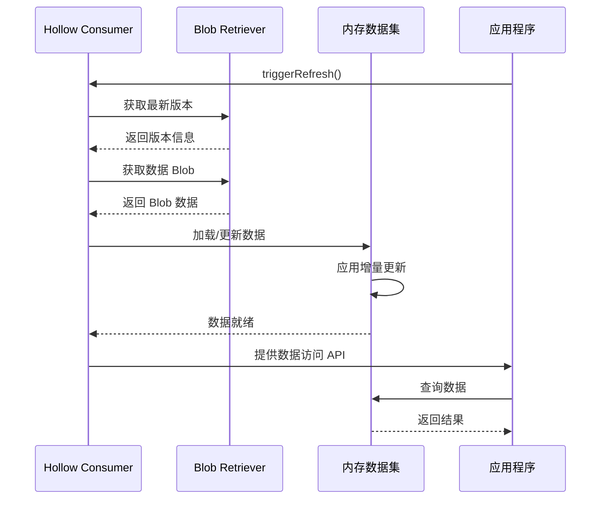
```mermaid
sequenceDiagram
    participant Consumer as Hollow Consumer
    participant BlobRetriever as Blob Retriever
    participant Memory as 内存数据集
    participant App as 应用程序
    
    App->>Consumer: triggerRefresh()
    Consumer->>BlobRetriever: 获取最新版本
    BlobRetriever-->>Consumer: 返回版本信息
    Consumer->>BlobRetriever: 获取数据 Blob
    BlobRetriever-->>Consumer: 返回 Blob 数据
    Consumer->>Memory: 加载/更新数据
    Memory->>Memory: 应用增量更新
    Memory-->>Consumer: 数据就绪
    Consumer->>App: 提供数据访问 API
    App->>Memory: 查询数据
    Memory-->>App: 返回结果
```

### 数据版本管理

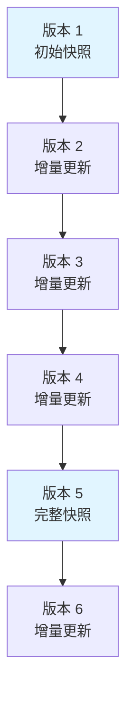
```mermaid
graph TB
    A[版本 1<br/>初始快照] --> B[版本 2<br/>增量更新]
    B --> C[版本 3<br/>增量更新]
    C --> D[版本 4<br/>增量更新]
    D --> E[版本 5<br/>完整快照]
    E --> F[版本 6<br/>增量更新]
    
    style A fill:#e1f5ff
    style E fill:#e1f5ff
```

**版本管理策略：**

- **初始快照**：首次发布完整数据集
- **增量更新**：后续版本只包含变化部分
- **定期快照**：每隔 N 个版本发布完整快照，便于恢复和优化

### 内存结构

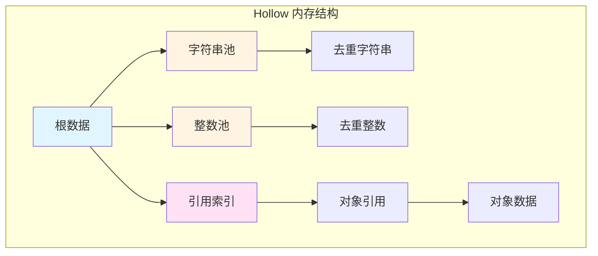
```mermaid
graph TB
    subgraph "Hollow 内存结构"
        A[根数据] --> B[字符串池]
        A --> C[整数池]
        A --> D[引用索引]
        
        B --> E[去重字符串]
        C --> F[去重整数]
        D --> G[对象引用]
        
        G --> H[对象数据]
    end
    
    style A fill:#e1f5ff
    style B fill:#fff4e1
    style C fill:#fff4e1
    style D fill:#ffe1f5
```

**内存优化技术：**

1. **字符串去重**：相同的字符串只存储一次
2. **整数池化**：小的整数值使用池化技术
3. **引用共享**：相同的对象引用共享存储
4. **压缩编码**：使用高效的编码方式存储数据

## 高级特性

### 1. 使用 Kafka 发布数据

```java
import com.netflix.hollow.api.producer.HollowProducer;
import com.netflix.hollow.api.producer.HollowProducer.Publisher;

public class KafkaHollowProducer {
    public static void main(String[] args) {
        // 自定义 Kafka Publisher
        Publisher publisher = new Publisher() {
            @Override
            public void publish(HollowProducer.Blob blob) {
                // 发布到 Kafka
                // kafkaProducer.send(topic, blob.getBytes());
            }
        };
        
        HollowProducer producer = HollowProducer
            .withPublisher(publisher)
            .build();
        
        producer.runCycle(state -> {
            // 添加数据
        });
    }
}
```

### 2. 自定义监听器

```java
import com.netflix.hollow.api.consumer.HollowConsumer;

public class MovieConsumerWithListener {
    public void initialize() {
        HollowConsumer consumer = HollowConsumer
            .withBlobRetriever(blobRetriever)
            .withRefreshListener(new HollowConsumer.RefreshListener() {
                @Override
                public void refreshStarted(long currentVersion, long requestedVersion) {
                    System.out.println("刷新开始: " + currentVersion + " -> " + requestedVersion);
                }
                
                @Override
                public void refreshCompleted(long currentVersion, long requestedVersion) {
                    System.out.println("刷新完成: " + currentVersion);
                }
                
                @Override
                public void refreshFailed(long currentVersion, long requestedVersion, 
                                         Throwable cause) {
                    System.err.println("刷新失败: " + cause.getMessage());
                }
            })
            .build();
    }
}
```

### 3. 数据查询 API

Hollow 会为你的 POJO 自动生成查询 API。对于 `Movie` 类，会生成 `MovieAPI`：

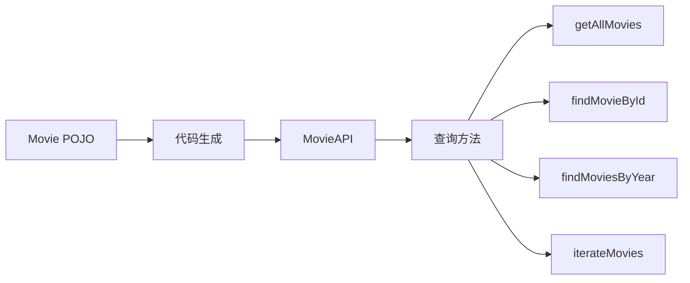
```mermaid
graph LR
    A[Movie POJO] --> B[代码生成]
    B --> C[MovieAPI]
    C --> D[查询方法]
    
    D --> E[getAllMovies]
    D --> F[findMovieById]
    D --> G[findMoviesByYear]
    D --> H[iterateMovies]
```

**生成的 API 示例：**

```java
// 假设生成的 API（实际使用需要代码生成）
MovieAPI api = consumer.getAPI();

// 获取所有电影
List<Movie> allMovies = api.getAllMovies();

// 根据 ID 查找
Movie movie = api.findMovieById(1);

// 遍历所有电影
for (Movie movie : api) {
    System.out.println(movie.getTitle());
}
```

### 4. 索引和过滤

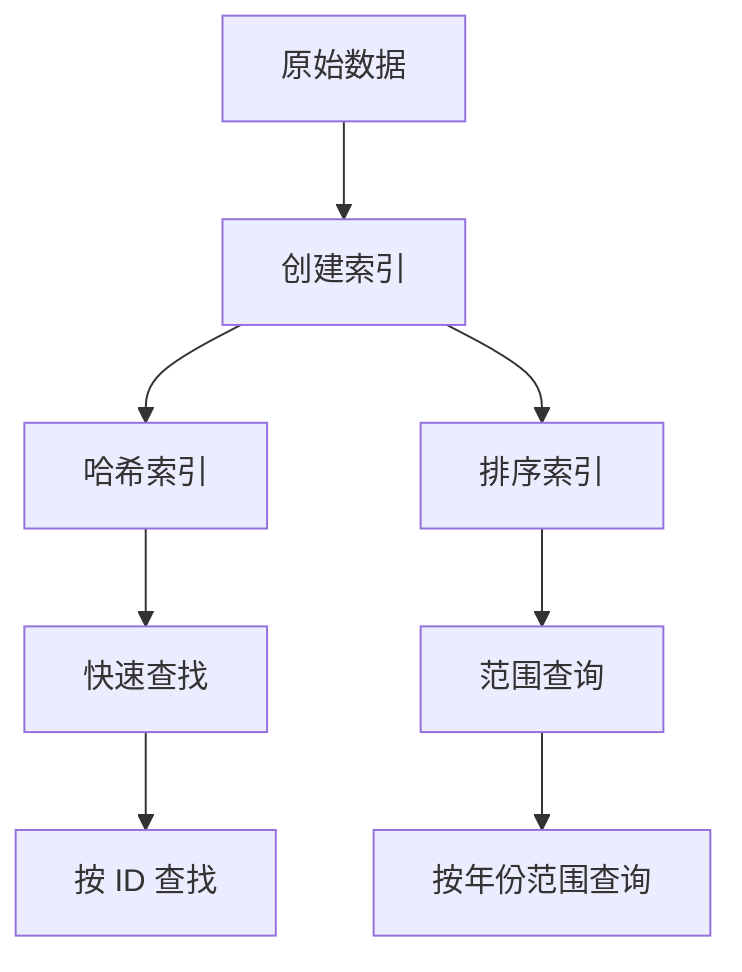
```mermaid
graph TB
    A[原始数据] --> B[创建索引]
    B --> C[哈希索引]
    B --> D[排序索引]
    
    C --> E[快速查找]
    D --> F[范围查询]
    
    E --> G[按 ID 查找]
    F --> H[按年份范围查询]
```

**索引使用示例：**

```java
// 为年份字段创建索引
HollowProducer producer = HollowProducer
    .withPublisher(publisher)
    .withIndexListener((api, removedTypes, addedTypes) -> {
        // 创建自定义索引
        // api.buildIndex("year", movie -> movie.getYear());
    })
    .build();
```

## 最佳实践

### 1. 数据模型设计

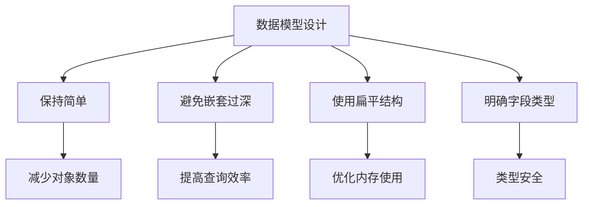
```mermaid
graph TB
    A[数据模型设计] --> B[保持简单]
    A --> C[避免嵌套过深]
    A --> D[使用扁平结构]
    A --> E[明确字段类型]
    
    B --> F[减少对象数量]
    C --> G[提高查询效率]
    D --> H[优化内存使用]
    E --> I[类型安全]
```

**设计建议：**

- ✅ **保持简单**：避免复杂的嵌套结构
- ✅ **扁平化**：尽量使用扁平的数据结构
- ✅ **类型明确**：使用明确的类型，避免泛型
- ❌ **避免循环引用**：Hollow 不支持循环引用
- ❌ **避免可变对象**：只使用不可变对象

### 2. 生产环境配置

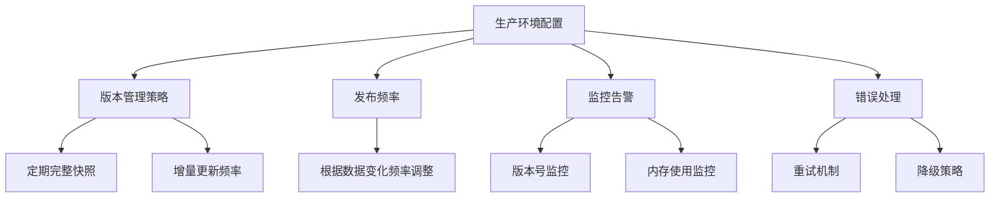
```mermaid
flowchart TD
    A[生产环境配置] --> B[版本管理策略]
    A --> C[发布频率]
    A --> D[监控告警]
    A --> E[错误处理]
    
    B --> F[定期完整快照]
    B --> G[增量更新频率]
    
    C --> H[根据数据变化频率调整]
    
    D --> I[版本号监控]
    D --> J[内存使用监控]
    
    E --> K[重试机制]
    E --> L[降级策略]
```

**配置要点：**

1. **版本管理**：
   - 每 10-20 个增量更新后发布一次完整快照
   - 保留最近 N 个版本用于回滚

2. **发布频率**：
   - 根据数据变化频率调整
   - 避免过于频繁的更新

3. **监控指标**：
   - 数据版本号
   - 内存使用情况
   - 更新成功/失败率
   - 消费者延迟

### 3. 性能优化

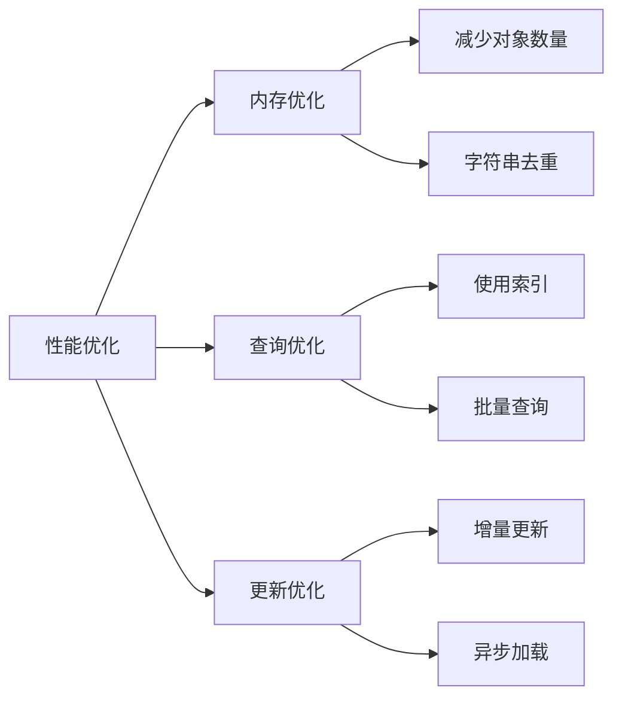
```mermaid
graph LR
    A[性能优化] --> B[内存优化]
    A --> C[查询优化]
    A --> D[更新优化]
    
    B --> E[减少对象数量]
    B --> F[字符串去重]
    
    C --> G[使用索引]
    C --> H[批量查询]
    
    D --> I[增量更新]
    D --> J[异步加载]
```

**优化技巧：**

1. **内存优化**：
   ```java
   // 使用原始类型而非包装类型
   private final int id;        // ✅ 推荐
   private final Integer id;    // ❌ 不推荐
   ```

2. **查询优化**：
   ```java
   // 批量查询而非循环查询
   List<Movie> movies = api.findMoviesByIds(idList);  // ✅
   for (int id : idList) {
       api.findMovieById(id);  // ❌ 性能差
   }
   ```

3. **更新优化**：
   - 使用增量更新而非完整快照
   - 异步加载数据，避免阻塞主线程

### 4. 错误处理和恢复

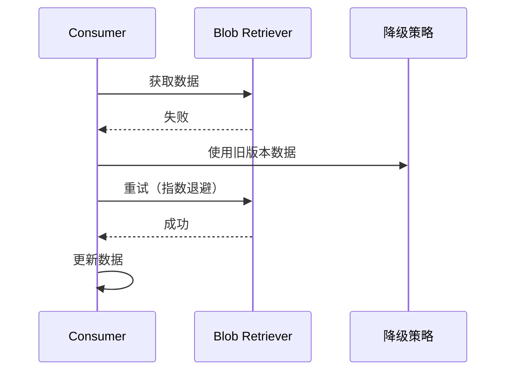
```mermaid
sequenceDiagram
    participant Consumer as Consumer
    participant Retriever as Blob Retriever
    participant Fallback as 降级策略
    
    Consumer->>Retriever: 获取数据
    Retriever-->>Consumer: 失败
    Consumer->>Fallback: 使用旧版本数据
    Consumer->>Retriever: 重试（指数退避）
    Retriever-->>Consumer: 成功
    Consumer->>Consumer: 更新数据
```

**错误处理策略：**

```java
HollowConsumer consumer = HollowConsumer
    .withBlobRetriever(blobRetriever)
    .withRefreshListener(new HollowConsumer.RefreshListener() {
        @Override
        public void refreshFailed(long currentVersion, long requestedVersion, 
                                 Throwable cause) {
            // 记录错误
            logger.error("数据刷新失败", cause);
            
            // 使用旧版本数据或降级策略
            // fallbackToStaleData();
            
            // 调度重试
            // scheduleRetry(requestedVersion);
        }
    })
    .build();
```

## 实际应用场景

### 场景 1：配置数据分发

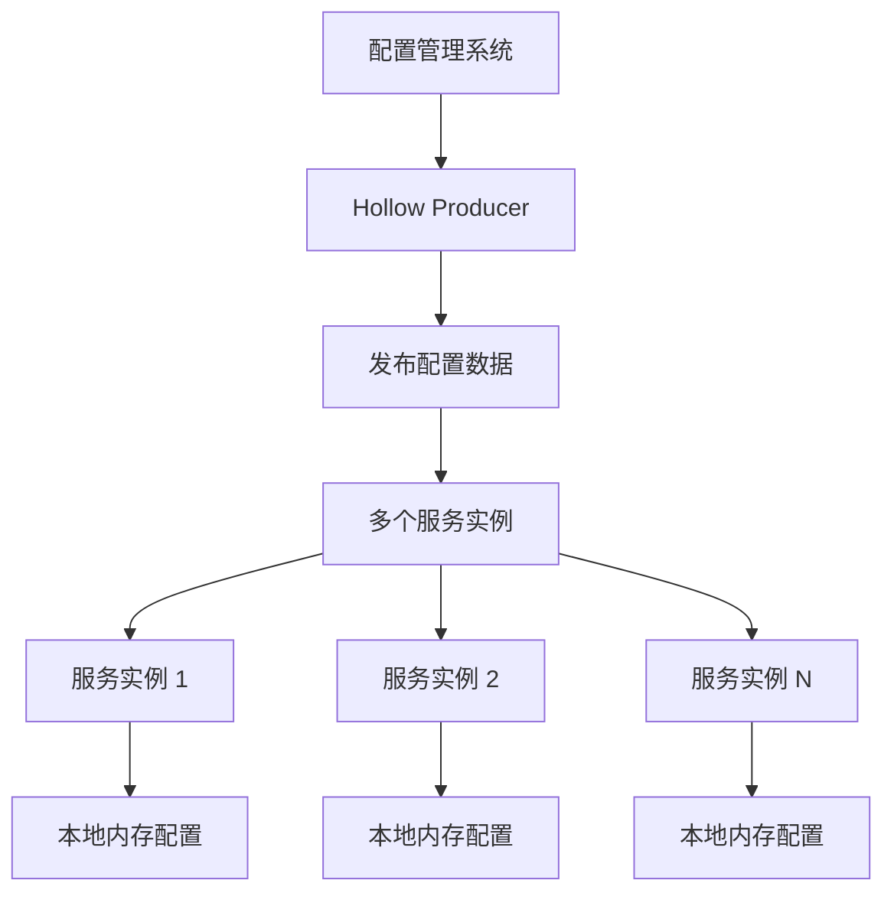
```mermaid
graph TB
    A[配置管理系统] --> B[Hollow Producer]
    B --> C[发布配置数据]
    C --> D[多个服务实例]
    
    D --> E[服务实例 1]
    D --> F[服务实例 2]
    D --> G[服务实例 N]
    
    E --> H[本地内存配置]
    F --> I[本地内存配置]
    G --> J[本地内存配置]
```

**实现示例：**

```java
// 配置数据模型
public class ServiceConfig {
    private final String serviceName;
    private final Map<String, String> properties;
    
    // ... 构造函数和 getters
}

// 生产者
producer.runCycle(state -> {
    List<ServiceConfig> configs = loadConfigsFromDatabase();
    configs.forEach(state::add);
});

// 消费者
ServiceConfigAPI api = consumer.getAPI();
ServiceConfig config = api.getConfigByServiceName("my-service");
```

### 场景 2：搜索结果索引


```mermaid
graph LR
    A[内容系统] --> B[构建索引]
    B --> C[Hollow Producer]
    C --> D[发布索引]
    D --> E[搜索服务]
    E --> F[本地索引查询]
    F --> G[快速返回结果]
```

### 场景 3：地理数据分发

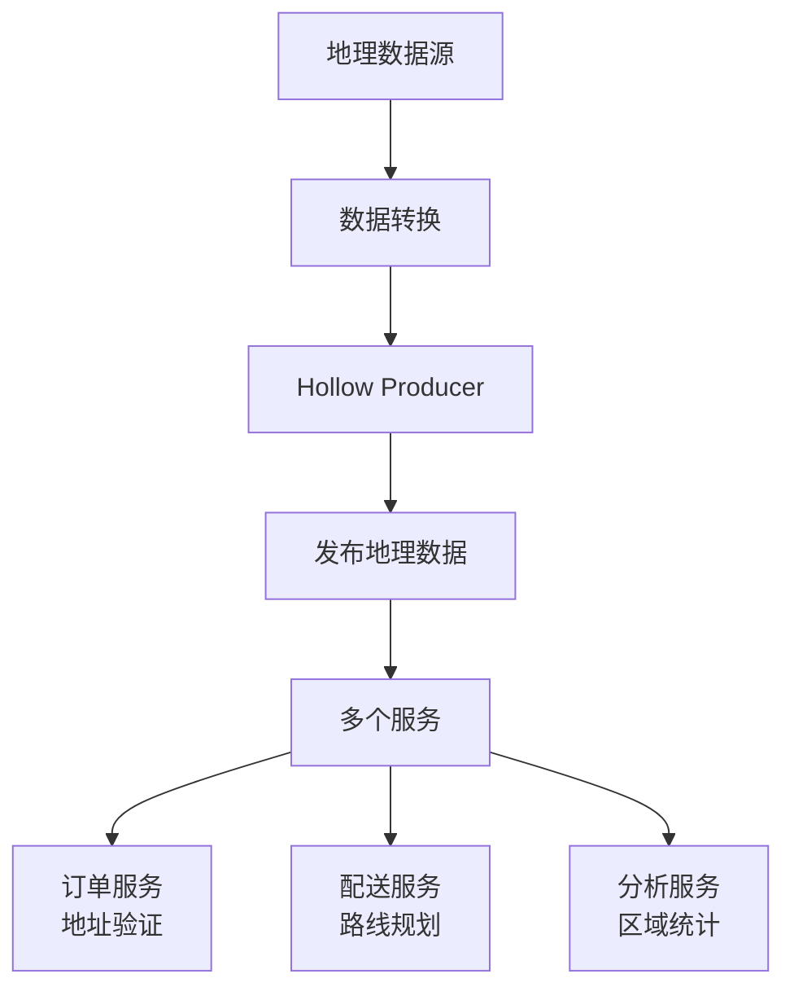
```mermaid
graph TB
    A[地理数据源] --> B[数据转换]
    B --> C[Hollow Producer]
    C --> D[发布地理数据]
    D --> E[多个服务]
    
    E --> F[订单服务<br/>地址验证]
    E --> G[配送服务<br/>路线规划]
    E --> H[分析服务<br/>区域统计]
```

## 与其他方案对比

### Hollow vs Redis

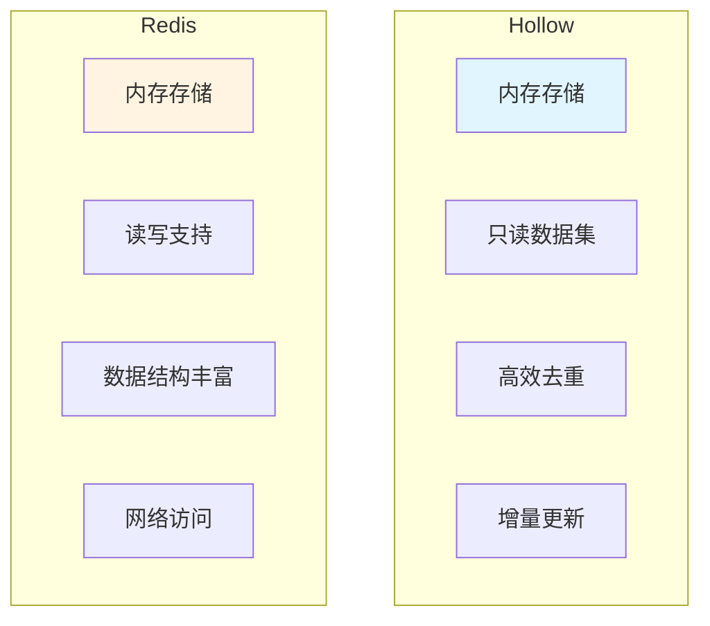
```mermaid
graph TB
    subgraph "Hollow"
        A1[内存存储]
        A2[只读数据集]
        A3[高效去重]
        A4[增量更新]
    end
    
    subgraph "Redis"
        B1[内存存储]
        B2[读写支持]
        B3[数据结构丰富]
        B4[网络访问]
    end
    
    style A1 fill:#e1f5ff
    style B1 fill:#fff4e1
```

| 特性 | Hollow | Redis |
|------|--------|-------|
| **访问方式** | 本地内存，零网络延迟 | 网络访问 |
| **数据大小** | 支持数GB数据集 | 受内存限制 |
| **更新方式** | 增量更新，高效 | 需要同步更新 |
| **读写能力** | 只读 | 读写 |
| **使用场景** | 大规模只读数据集 | 键值缓存、会话存储 |

### Hollow vs 数据库查询

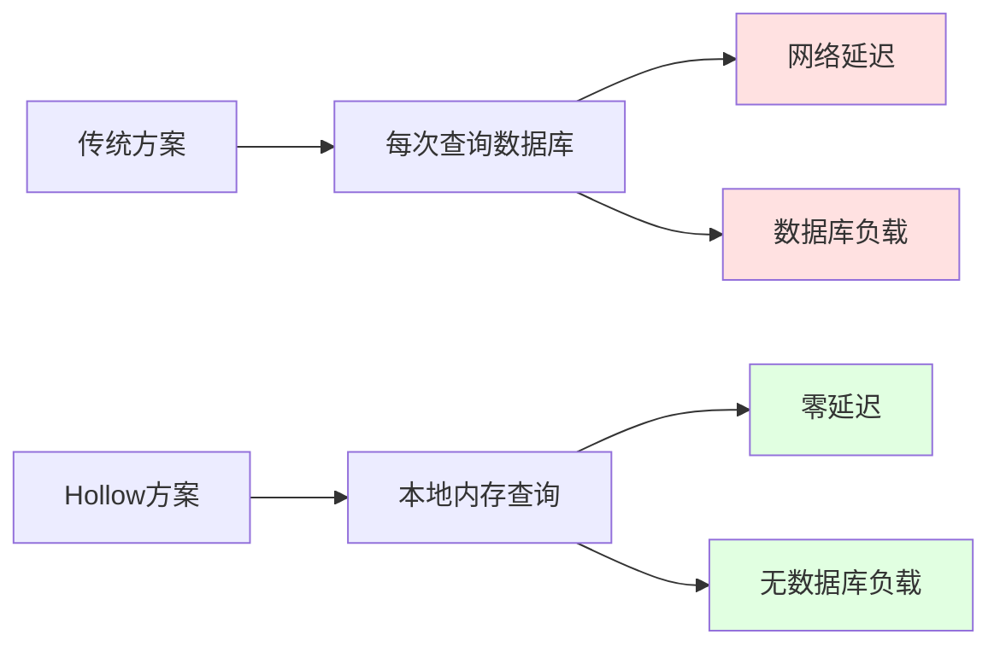
```mermaid
graph LR
    A[传统方案] --> B[每次查询数据库]
    B --> C[网络延迟]
    B --> D[数据库负载]
    
    E[Hollow方案] --> F[本地内存查询]
    F --> G[零延迟]
    F --> H[无数据库负载]
    
    style C fill:#ffe1e1
    style D fill:#ffe1e1
    style G fill:#e1ffe1
    style H fill:#e1ffe1
```

## 常见问题解答

### Q1: Hollow 适用于哪些数据类型？

**A:** Hollow 最适合：
- ✅ 参考数据（字典、映射表）
- ✅ 配置数据
- ✅ 搜索索引
- ✅ 只读数据集
- ❌ 不适合频繁更新的写密集型数据
- ❌ 不适合需要事务支持的数据

### Q2: 如何处理数据更新失败？

**A:** 建议实现以下机制：

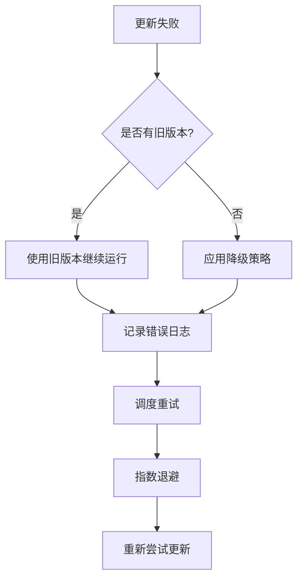
```mermaid
flowchart TD
    A[更新失败] --> B{是否有旧版本?}
    B -->|是| C[使用旧版本继续运行]
    B -->|否| D[应用降级策略]
    C --> E[记录错误日志]
    D --> E
    E --> F[调度重试]
    F --> G[指数退避]
    G --> H[重新尝试更新]
```

### Q3: Hollow 的内存占用如何？

**A:** Hollow 通过以下技术优化内存：

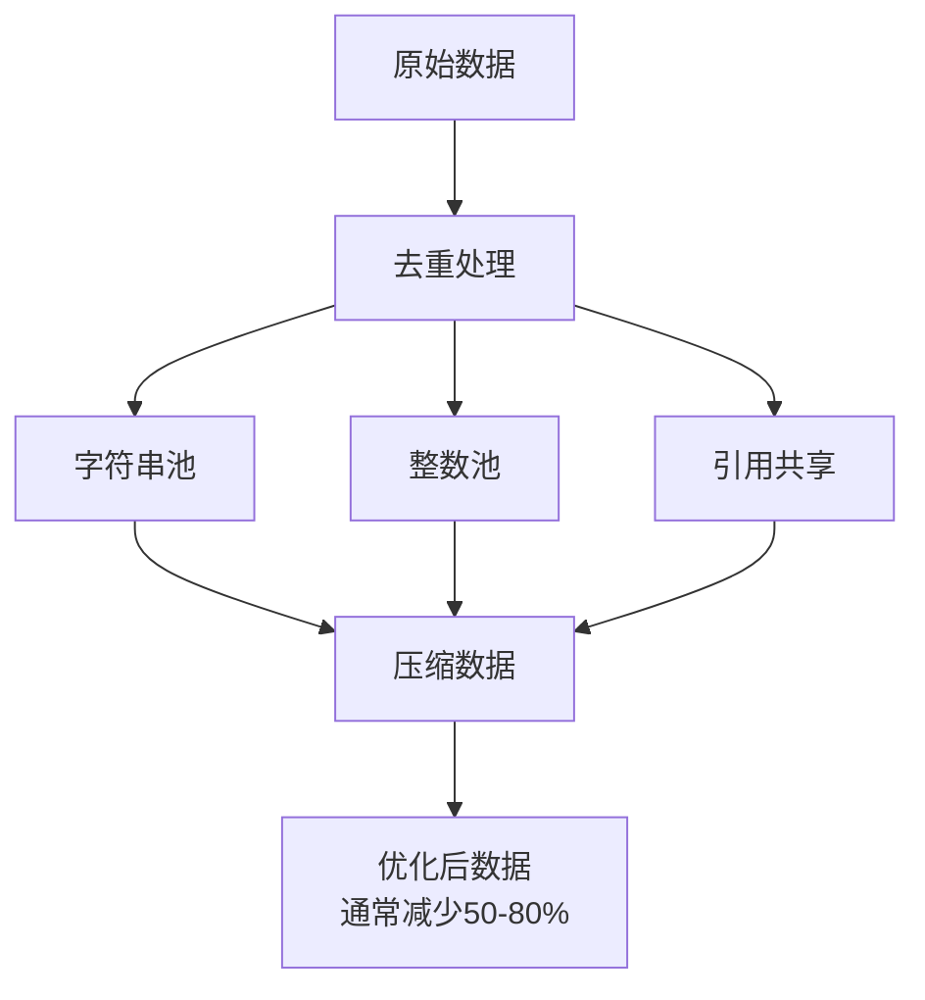
```mermaid
graph TB
    A[原始数据] --> B[去重处理]
    B --> C[字符串池]
    B --> D[整数池]
    B --> E[引用共享]
    C --> F[压缩数据]
    D --> F
    E --> F
    F --> G[优化后数据<br/>通常减少50-80%]
```

### Q4: 如何监控 Hollow 的使用情况？

**A:** 建议监控以下指标：

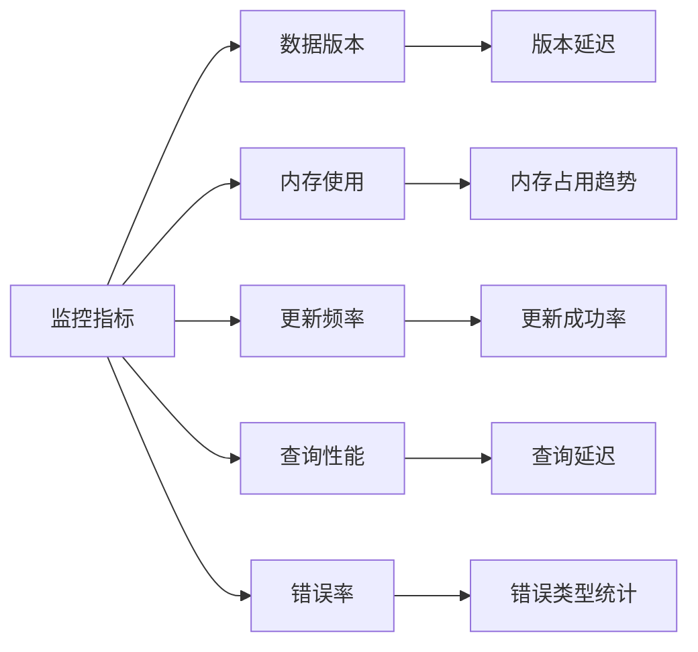
```mermaid
graph LR
    A[监控指标] --> B[数据版本]
    A --> C[内存使用]
    A --> D[更新频率]
    A --> E[查询性能]
    A --> F[错误率]
    
    B --> G[版本延迟]
    C --> H[内存占用趋势]
    D --> I[更新成功率]
    E --> J[查询延迟]
    F --> K[错误类型统计]
```

## 总结

Netflix Hollow 是一个强大的内存数据集分发工具，特别适用于需要高性能读取和大规模数据分发的场景。通过合理的设计和使用，可以显著提升应用的性能和可扩展性。

### 核心要点回顾

1. **架构设计**：生产者-消费者模式，支持分布式数据分发
2. **内存优化**：去重、压缩等技术大幅减少内存占用
3. **增量更新**：支持高效的增量更新机制
4. **易于使用**：简单的 API，易于集成到现有系统

### 下一步行动

- 📖 阅读 [Hollow 官方文档](https://hollow.how/)
- 💻 尝试 [Hollow 示例代码](https://github.com/Netflix/hollow)
- 🚀 在项目中集成 Hollow
- 📊 监控和优化 Hollow 使用效果

---

**参考资源：**

- [GitHub 仓库](https://github.com/Netflix/hollow)
- [官方文档](https://hollow.how/)
- [快速入门指南](https://hollow.how/quick-start/)
- [DeepWiki 页面](https://deepwiki.com/Netflix/hollow)

