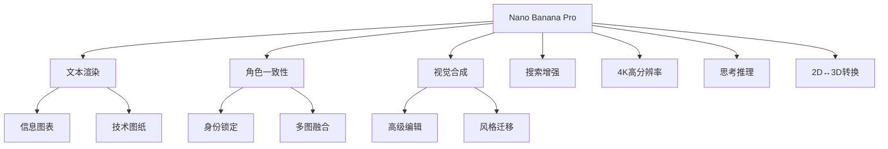

## 概述

Nano Banana Pro（Gemini 3 Pro Image）是 Google 推出的新一代 AI 图像生成模型,相比前代模型实现了从"有趣"到"功能性"专业资产制作的重大飞跃。它在文本渲染、角色一致性、视觉合成、世界知识（搜索）和高分辨率（4K）输出方面表现卓越。

### 核心能力



## 提示词黄金法则

Nano Banana Pro 是一个"思考型"模型,它不仅仅匹配关键词,而是理解意图、物理规律和构图。要获得最佳效果,请像创意总监一样与它交流。

### 1. 编辑而非重新生成

模型在理解对话式编辑方面表现出色。如果图像已经 80% 正确,不要从头开始生成新图像,而是直接要求特定的修改。

**示例:**
```
"很好,但请将光线改为日落效果,并将文字改为霓虹蓝色。"
```

### 2. 使用自然语言和完整句子

像向人类艺术家简报一样与模型对话。使用正确的语法和描述性形容词。

**❌ 错误示例:**
```
"酷车,霓虹,城市,夜晚,8k"
```

**✅ 正确示例:**
```
"一个电影般的宽镜头,展示一辆未来主义跑车在雨夜的东京街道上疾驰。霓虹灯标志反射在湿漉漉的路面和汽车金属车身上。"
```

### 3. 具体且描述性

模糊的提示产生通用的结果。定义主体、场景、光线和情绪。

**主体:** 不要说"一个女人",而是说"一位穿着复古香奈儿风格套装的优雅老年女士"

**材质:** 描述纹理。"哑光表面"、"拉丝钢"、"柔软天鹅绒"、"褶皱纸张"

### 4. 提供上下文

因为模型会"思考",给它上下文有助于它做出合理的艺术决策。

**示例:**
```
"为巴西高端美食烹饪书创建一张三明治图片。"
(模型会推断出专业摆盘、浅景深和完美光线)
```

## 文本渲染、信息图表和视觉合成

Nano Banana Pro 在渲染清晰、风格化的文本和将复杂信息合成为视觉格式方面具有 SOTA 能力。

### 最佳实践

- **压缩:** 要求模型将密集文本或 PDF "压缩"为视觉辅助工具
- **风格:** 指定是否想要"精致的编辑风格"、"技术图表"或"手绘白板"外观
- **引用:** 在引号中明确指定想要的文本

### 示例提示词

#### 财报信息图表（数据摄取）

```
[输入 Google 最新财报 PDF]

"生成一个干净、现代的信息图表,总结这份财报中的关键财务亮点。包括'收入增长'和'净收入'图表,并在风格化的引用框中突出显示 CEO 的关键引用。"
```

#### 复古信息图表

```
"制作一个关于美国餐厅历史的复古 1950 年代风格信息图表。包括'食物'、'点唱机'和'装饰'的独特部分。确保所有文本清晰可读并符合时代风格。"
```

#### 技术图纸

```
"创建一个正交蓝图,以平面图、立面图和剖面图描述这座建筑。用技术建筑字体清晰标记'北立面'和'主入口'。格式 16:9。"
```

#### 白板总结（教育）

```
"将'Transformer 神经网络架构'的概念总结为适合大学讲座的手绘白板图。对编码器和解码器块使用不同颜色的记号笔,并为'自注意力'和'前馈'包含清晰的标签。"
```

## 角色一致性和病毒式缩略图

Nano Banana Pro 支持最多 14 张参考图像（6 张高保真度）。这允许"身份锁定"——将特定人物或角色放入新场景而不会面部失真。

### 最佳实践

- **身份锁定:** 明确声明："保持人物的面部特征与图像 1 完全相同。"
- **表情/动作:** 描述情绪或姿势的变化,同时保持身份
- **病毒式构图:** 在单次生成中将主体与粗体图形和文本结合

### 示例提示词

#### "病毒式缩略图"（身份 + 文本 + 图形）

```
"使用图像 1 中的人物设计一个病毒式视频缩略图。

面部一致性: 保持人物的面部特征与图像 1 完全相同,但将表情改为兴奋和惊讶。

动作: 将人物放在左侧,手指指向画面右侧。

主体: 在右侧放置一张高质量的美味牛油果吐司图片。

图形: 添加一个粗体黄色箭头连接人物的手指和吐司。

文字: 在中间叠加巨大的流行风格文字:'3分钟搞定!'使用粗白色轮廓和投影。

背景: 模糊的明亮厨房背景。高饱和度和对比度。"
```

#### "毛绒朋友"场景（群组一致性）

```
[输入 3 张不同毛绒生物的图片]

"用这 3 个毛绒朋友创建一个有趣的 10 部分故事,讲述他们去热带度假的经历。故事全程惊险刺激,有情感高潮和低谷,最后以快乐时刻结束。保持所有 3 个角色的服装和身份一致,但他们的表情和角度应在所有 10 张图片中变化。确保每张图片中每个角色只出现一次。"
```

#### 品牌资产生成

```
[输入 1 张产品图片]

"创建 9 张令人惊叹的时尚照片,就像它们来自获奖时尚编辑一样。使用此参考作为品牌风格,但为系列添加细微差别和多样性,以传达专业设计感。请一次生成九张图片。"
```

## 基于 Google 搜索的增强

Nano Banana Pro 使用 Google 搜索基于实时数据、当前事件或事实验证生成图像,减少时效性主题的幻觉。

### 最佳实践

- 要求可视化动态数据（天气、股票、新闻）
- 模型会在生成图像之前"思考"（推理）搜索结果

### 示例提示词

#### 事件可视化

```
"根据当前旅游趋势,生成一个关于 2025 年访问美国国家公园最佳时间的信息图表。"
```

## 高级编辑、修复和上色

模型通过对话式提示在复杂编辑方面表现出色。这包括"修复"（移除/添加对象）、"恢复"（修复旧照片）、"上色"（漫画/黑白照片）和"风格交换"。

### 最佳实践

- **语义指令:** 不需要手动遮罩;只需自然地告诉模型要更改什么
- **物理理解:** 可以要求复杂的更改,如"用液体填充这个玻璃杯"来测试物理生成

### 示例提示词

#### 对象移除和修复

```
"从这张照片的背景中移除游客,并用与周围环境匹配的逻辑纹理（鹅卵石和店面）填充空间。"
```

#### 漫画/漫画上色

```
[输入黑白漫画面板]

"为这个漫画面板上色。使用充满活力的动漫风格调色板。确保能量束上的光效是发光的霓虹蓝色,角色的服装与他们的官方颜色一致。"
```

#### 本地化（文本翻译 + 文化适应）

```
[输入伦敦公交车站广告图片]

"将这个概念本地化到东京环境,包括将标语翻译成日语。将背景更改为夜晚繁忙的涩谷街道。"
```

#### 光线/季节控制

```
[输入夏季房屋图片]

"将这个场景变成冬天。保持房屋建筑完全相同,但在屋顶和院子里添加雪,并将光线改为寒冷、阴天的下午。"
```

## 维度转换（2D ↔ 3D）

一个强大的新功能是将 2D 示意图转换为 3D 可视化,反之亦然。这对室内设计师、建筑师和表情包创作者来说是理想的。

### 示例提示词

#### 2D 平面图到 3D 室内设计板

```
"基于上传的 2D 平面图,在单个图像中生成专业的室内设计展示板。

布局: 一个拼贴,顶部有一张大主图（客厅区域的广角透视图）,下面有三张较小的图片（主卧室、家庭办公室和 3D 俯视平面图）。

风格: 在所有图片中应用现代简约风格,配有温暖的橡木地板和米白色墙壁。

质量: 照片级渲染,柔和的自然光线。"
```

#### 2D 到 3D 表情包转换

```
"将'This is Fine'狗表情包转换为照片级 3D 渲染。保持构图相同,但让狗看起来像毛绒玩具,火焰看起来像真实的火焰。"
```

## 高分辨率和纹理

Nano Banana Pro 支持原生 1K 到 4K 图像生成。这对详细纹理或大幅面打印特别有用。

### 最佳实践

- 如果 API/界面允许,明确请求高分辨率（2K 或 4K）
- 描述高保真细节（瑕疵、表面纹理）

### 示例提示词

#### 4K 纹理生成

```
"利用原生高保真输出,打造一个令人惊叹的、氛围感十足的苔藓森林地面环境。控制复杂的光效和精致的纹理,确保每一根苔藓和每一束光线都以适合 4K 壁纸的像素完美分辨率渲染。"
```

#### 复杂逻辑（思考模式）

```
"创建一个超现实的美食汉堡信息图表,解构展示烤面包的纹理、肉饼的煎烤外壳和奶酪的闪亮融化。用其风味特征标记每一层。"
```

## 思考和推理

Nano Banana Pro 默认使用"思考"过程,在渲染最终输出之前生成中间思考图像（不收费）来完善构图。这允许数据分析和解决视觉问题。

### 示例提示词

#### 解方程

```
"在白板上求解 log_{x²+1}(x⁴-1)=2 在 C 中的解。清楚地显示步骤。"
```

#### 视觉推理

```
"分析这张房间图片,生成一张'之前'的图片,显示房间在施工期间可能的样子,展示框架和未完成的干墙。"
```

## 一次性故事板和概念艺术

可以在单个会话中生成连续艺术或故事板,而无需网格,确保连贯的叙事流程。这对"电影概念艺术"（例如,即将上映电影的假泄露）也很受欢迎。

### 示例提示词

```
"创建一个令人上瘾的有趣的 9 部分故事,包含 9 张图片,展示一位女士和一位男士在获奖的豪华行李箱商业广告中。故事应该有情感高潮和低谷,以女士与标志的优雅镜头结束。女士和男士的身份和服装必须始终保持一致,但可以而且应该从不同的角度和距离看到他们。请一次生成一张图片。确保每张图片都是 16:9 横向格式。"
```

## 结构控制和布局指导

输入图像不仅限于角色参考或要编辑的主体。可以使用它们来严格控制最终输出的构图和布局。这对需要将餐巾纸草图、线框或特定网格布局转换为精美资产的设计师来说是游戏规则改变者。

### 最佳实践

- **草图和草稿:** 上传手绘草图以准确定义文本和对象应该放置的位置
- **线框:** 使用现有布局或线框的截图生成高保真 UI 模型
- **网格:** 使用网格图像强制模型为基于瓷砖的游戏或 LED 显示器生成资产

### 示例提示词

#### 草图到最终广告

```
"根据这个草图为[产品]创建一个广告。"
```

#### 线框到 UI 模型

```
"根据这个线框为[产品]创建一个模型。"
```

#### 像素艺术和 LED 显示

```
"生成一个完美适合这个 64×64 网格图像的独角兽像素艺术精灵。使用高对比度颜色。"

提示: 开发人员随后可以通过编程提取每个单元格的中心颜色来驱动连接的 64×64 LED 矩阵显示器。
```

#### 精灵图

```
"一个女人在无人机上做后空翻的精灵图,3×3 网格,序列,逐帧动画,方形纵横比。完全按照附加参考图像的结构。"

提示: 然后可以提取每个单元格并制作 gif。
```

## 下一步是什么？

既然您已经掌握了提示词的基础知识,以下是如何开始构建的方法:

### 1. 在 UI 中实验

Google AI Studio 是测试提示词和参数的最快方式。

**访问链接:** [https://aistudio.google.com/](https://aistudio.google.com/)

### 2. 查看应用库

探索由 Nano Banana 驱动的精彩应用。

### 3. Vibe-code 您的梦想应用

在 AI Studio Build 中将您最好的提示词转换为可以轻松与朋友分享的应用。

### 4. 构建应用程序

准备好编码了吗？查看开发者指南或 [Gemini API Cookbook](https://colab.sandbox.google.com/github/google-gemini/cookbook/blob/main/quickstarts/Get_Started_Nano_Banana.ipynb) 获取指南和代码片段。

### 5. 技术深入研究

阅读完整的 [Gemini API 文档](https://ai.google.dev/gemini-api/docs) 了解速率限制、定价和集成的详细信息。

## API 使用示例

### Python 基础示例

```python
import os
from google import genai
from dotenv import load_dotenv

# 加载环境变量
load_dotenv()

# 初始化客户端
client = genai.Client(api_key=os.getenv("GEMINI_API_KEY"))

def generate_image(prompt):
    """
    使用 Nano Banana Pro 生成图像
    """
    try:
        response = client.models.generate_content(
            model="gemini-3-pro-image-preview",
            contents=[prompt]
        )
        
        if response.images:
            # 保存结果图片
            with open("output.jpg", "wb") as f:
                f.write(response.images[0].data)
            print("图像生成完成!")
        else:
            print("未生成图像")
            
    except Exception as e:
        print(f"错误: {e}")

# 使用示例
generate_image(
    "一个电影般的宽镜头,展示一辆未来主义跑车在雨夜的东京街道上疾驰。"
    "霓虹灯标志反射在湿漉漉的路面和汽车金属车身上。"
)
```

### 图像编辑示例

```python
def edit_image(image_path, prompt):
    """
    编辑现有图像
    """
    try:
        with open(image_path, "rb") as f:
            image_data = f.read()
        
        response = client.models.generate_content(
            model="gemini-3-pro-image-preview",
            contents=[
                prompt,
                image_data
            ]
        )
        
        if response.images:
            with open("edited_output.jpg", "wb") as f:
                f.write(response.images[0].data)
            print("图像编辑完成!")
            
    except Exception as e:
        print(f"错误: {e}")

# 使用示例
edit_image(
    "input.jpg",
    "将这个场景变成冬天。保持建筑完全相同,但添加雪并将光线改为寒冷的下午。"
)
```

### 多图像融合示例

```python
def multi_image_fusion(images, prompt):
    """
    多图像融合
    """
    try:
        contents = [prompt]
        
        for image_path in images:
            with open(image_path, "rb") as f:
                contents.append(f.read())
        
        response = client.models.generate_content(
            model="gemini-3-pro-image-preview",
            contents=contents
        )
        
        if response.images:
            with open("fused_output.jpg", "wb") as f:
                f.write(response.images[0].data)
            print("图像融合完成!")
            
    except Exception as e:
        print(f"错误: {e}")

# 使用示例
multi_image_fusion(
    ["person.jpg", "style_ref.jpg", "background.jpg"],
    "将主图中的人物使用风格图的艺术风格,并将背景替换为背景图。"
    "保持人物面部特征完全一致。"
)
```

## 最佳实践总结

### 提示词编写技巧

1. **使用完整句子** - 像与人类艺术家交流一样
2. **具体描述** - 定义主体、场景、光线、材质
3. **提供上下文** - 说明用途和目标受众
4. **迭代编辑** - 不要重新生成,而是基于现有结果修改
5. **明确身份** - 使用参考图像时明确要求保持一致性

### 技术优化

1. **分辨率控制** - 根据需求明确指定输出分辨率
2. **批量生成** - 对于系列图像,要求一次生成一张以保持一致性
3. **格式指定** - 明确纵横比（16:9、1:1 等）
4. **质量描述** - 使用"照片级"、"高保真"等术语

### 常见问题解决

#### 文本不清晰

- 在提示词中用引号明确指定文本内容
- 要求"清晰可读的文本"
- 指定字体风格（技术字体、手写体等）

#### 角色不一致

- 明确声明"保持面部特征与参考图像完全相同"
- 使用高质量参考图像
- 描述变化的部分（表情、角度）而不是整体

#### 构图不理想

- 使用草图或线框作为布局参考
- 明确描述各元素的位置关系
- 使用"左侧"、"右侧"、"前景"、"背景"等空间术语

## 定价和配额

### Google AI Studio（免费层）

- 每周配额
- 适合实验和原型开发
- 有速率限制

### Pro/Ultra 订阅

- 优先访问
- 更高的生成配额
- 更快的响应时间
- 适合生产环境

### API 定价

- 按生成次数计费
- 思考过程的中间图像不计费
- 详细定价请参考官方文档

## 资源链接

### 官方资源

- [Google AI Studio](https://aistudio.google.com/)
- [Gemini API 文档](https://ai.google.dev/gemini-api/docs)
- [Gemini API Cookbook](https://colab.sandbox.google.com/github/google-gemini/cookbook/blob/main/quickstarts/Get_Started_Nano_Banana.ipynb)
- [Google Antigravity IDE](https://antigravityide.org/)

### 社区资源

- [应用库](https://aistudio.google.com/app/gallery)
- [开发者指南](https://ai.google.dev/gemini-api/docs)

## 总结

Nano Banana Pro 代表了 AI 图像生成领域的重大进步,从娱乐性工具转变为专业资产制作平台。通过掌握本指南中的技巧和最佳实践,您可以充分发挥这个强大工具的潜力,创建高质量、专业级的视觉内容。

关键要点:

1. **像创意总监一样思考** - 使用自然语言和完整描述
2. **迭代而非重新开始** - 利用模型的编辑能力
3. **利用参考图像** - 实现角色一致性和布局控制
4. **探索高级功能** - 2D↔3D、搜索增强、思考推理
5. **优化工作流程** - 选择合适的工具和订阅计划

无论您是设计师、开发者还是内容创作者,Nano Banana Pro 都能为您的创意工作流程带来革命性的改变。立即开始探索,释放 AI 辅助视觉创作的无限可能！

---

*本文基于 Google Antigravity IDE 官方博客文章编写,内容已更新至 2025 年 12 月。*

