# PaddleOCR 3.0 完整指南：开源 OCR 领域的首选工具

## 项目概述

PaddleOCR 是由百度飞桨团队开发的开源 OCR（光学字符识别）工具库，自发布以来凭借学术前沿算法和产业落地实践，已成为开源 OCR 领域的首选工具。它被广泛应用于众多知名开源项目，如 Umi-OCR、OmniParser、MinerU、RAGFlow 等。

<div style="text-align: center; margin: 20px 0;">
  <svg width="650" height="320" xmlns="http://www.w3.org/2000/svg">
    <style>
      .title { font-family: Arial; font-size: 28px; font-weight: bold; fill: #0052D9; text-anchor: middle; }
      .subtitle { font-family: Arial; font-size: 16px; fill: #526ECC; text-anchor: middle; }
      .logo { font-family: Arial; font-size: 42px; font-weight: bold; fill: #0052D9; text-anchor: middle; }
      .version { font-family: Arial; font-size: 20px; fill: #FF6B00; text-anchor: middle; }
      .badge { font-family: Arial; font-size: 12px; fill: #FFFFFF; font-weight: bold; text-anchor: middle; }
      .feature { font-family: Arial; font-size: 14px; fill: #2C3E50; }
      .icon { font-size: 18px; }
    </style>
    <defs>
      <linearGradient id="bgGradient" x1="0%" y1="0%" x2="0%" y2="100%">
        <stop offset="0%" style="stop-color:#E6F0FF;stop-opacity:1" />
        <stop offset="100%" style="stop-color:#F5F9FF;stop-opacity:1" />
      </linearGradient>
    </defs>
    <rect width="650" height="320" fill="url(#bgGradient)" rx="15" ry="15" stroke="#0052D9" stroke-width="2"/>
    <text x="325" y="60" class="logo">Paddle<tspan class="version">OCR</tspan></text>
    <text x="325" y="95" class="title">开源 OCR 领域的首选工具</text>
    <text x="325" y="120" class="subtitle">学术前沿算法 + 产业落地实践</text>
    
    <!-- Version Badge -->
    <rect x="270" y="135" width="110" height="30" fill="#FF6B00" rx="15" ry="15"/>
    <text x="325" y="155" class="badge" style="font-size: 16px;">v3.0 Latest</text>
    
    <!-- Stats -->
    <rect x="50" y="180" width="100" height="28" fill="#0052D9" rx="14" ry="14"/>
    <text x="100" y="199" class="badge">50k+ ⭐</text>
    
    <rect x="170" y="180" width="110" height="28" fill="#526ECC" rx="14" ry="14"/>
    <text x="225" y="199" class="badge">109 语言</text>
    
    <rect x="300" y="180" width="120" height="28" fill="#00A870" rx="14" ry="14"/>
    <text x="360" y="199" class="badge">Apache-2.0</text>
    
    <rect x="440" y="180" width="110" height="28" fill="#FF6B00" rx="14" ry="14"/>
    <text x="495" y="199" class="badge">5种文字</text>
    
    <!-- Key Features -->
    <text x="80" y="240" class="feature icon">🚀</text>
    <text x="110" y="242" class="feature">高精度识别</text>
    
    <text x="240" y="240" class="feature icon">⚡</text>
    <text x="270" y="242" class="feature">低资源消耗</text>
    
    <text x="400" y="240" class="feature icon">🌍</text>
    <text x="430" y="242" class="feature">多语言支持</text>
    
    <text x="80" y="270" class="feature icon">📄</text>
    <text x="110" y="272" class="feature">复杂文档解析</text>
    
    <text x="240" y="270" class="feature icon">🤖</text>
    <text x="270" y="272" class="feature">智能信息抽取</text>
    
    <text x="400" y="270" class="feature icon">🔧</text>
    <text x="430" y="272" class="feature">易用工具链</text>
    
    <!-- Footer -->
    <text x="325" y="305" class="subtitle" style="font-size: 14px;">广泛应用于 Umi-OCR、MinerU、RAGFlow 等知名项目</text>
  </svg>
</div>

### 项目信息

- **官网**: [https://www.paddleocr.ai/](https://www.paddleocr.ai/)
- **GitHub**: [https://github.com/PaddlePaddle/PaddleOCR](https://github.com/PaddlePaddle/PaddleOCR)
- **最新版本**: v3.0
- **开源协议**: Apache-2.0
- **支持语言**: 109 种语言
- **社区**: AI Studio 技术研讨会、微信公众号

## 核心特性

### 1. PaddleOCR-VL：超紧凑视觉语言模型

**PaddleOCR-VL-0.9B** 是一个紧凑而强大的视觉语言模型（VLM），专为文档解析而设计。

#### 主要特点

- **超紧凑模型**: 仅 0.9B 参数，资源消耗极低
- **多语言支持**: 支持 109 种语言
- **高精度识别**: 在复杂元素（文本、表格、公式、图表）识别方面表现出色
- **SOTA 性能**: 在页级文档解析与元素级识别均达到 SOTA 表现
- **快速推理**: 推理速度显著优于现有方案
- **架构创新**: NaViT 风格的动态分辨率视觉编码器 + ERNIE-4.5-0.3B 语言模型

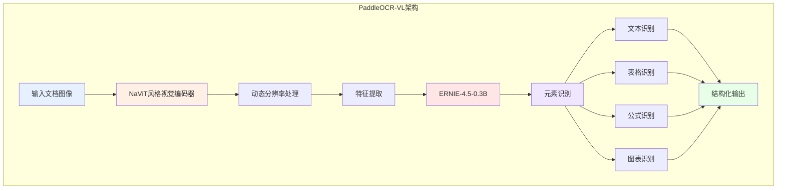

### 2. PP-OCRv5：全场景文字识别

PP-OCRv5 是最新一代文字识别模型，实现了单模型多文字类型支持的突破。

#### 核心能力

- **五种文字类型**: 简体中文、繁体中文、英文、日文、拼音
- **精度提升**: 相比上一代提升 13 个百分点
- **多语言混合**: 解决多语言混合文档的识别难题
- **手写体支持**: 新增手写体识别能力
- **场景广泛**: 适用于各类文档、表单、票据等场景

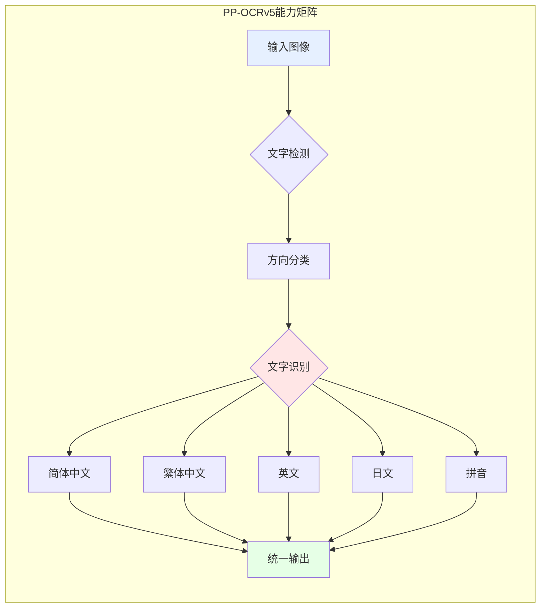

#### 性能对比

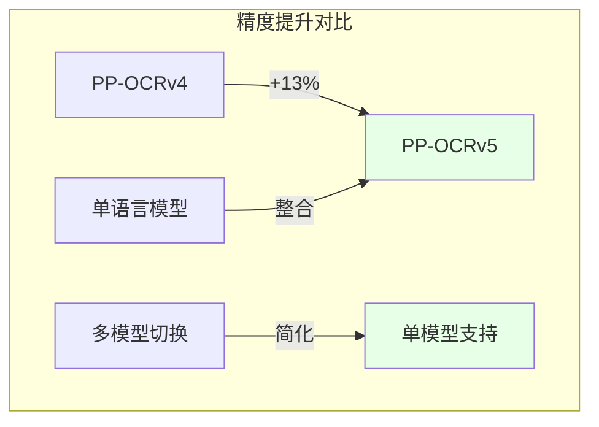

### 3. PP-StructureV3：复杂文档解析

PP-StructureV3 专注于将复杂 PDF 和文档图像智能转换为结构化格式。

#### 主要功能

- **格式转换**: PDF/图像 → Markdown/JSON
- **版式保持**: 完美保持文档版式和层次结构
- **元素识别**: 识别标题、段落、表格、图片、公式等
- **商业领先**: 在公开评测中领先众多商业方案
- **结构化输出**: 自动生成目录、章节、层级关系

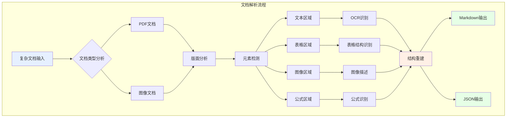

#### 应用场景

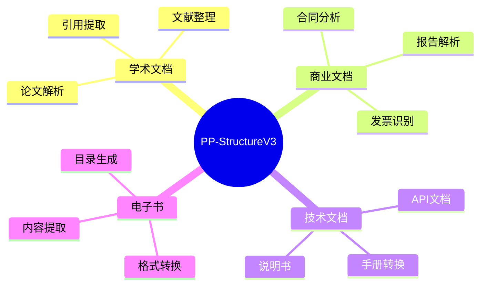

### 4. PP-ChatOCRv4：智能信息抽取

PP-ChatOCRv4 集成文心大模型 4.5，实现智能化的信息提取和问答。

#### 核心优势

- **大模型集成**: 原生集成 ERNIE 4.5
- **精度提升**: 相比上一代提升 15 个百分点
- **智能问答**: 文档"听懂"问题并给出准确答案
- **关键信息**: 从海量文档中精准提取关键信息
- **自然交互**: 支持自然语言查询

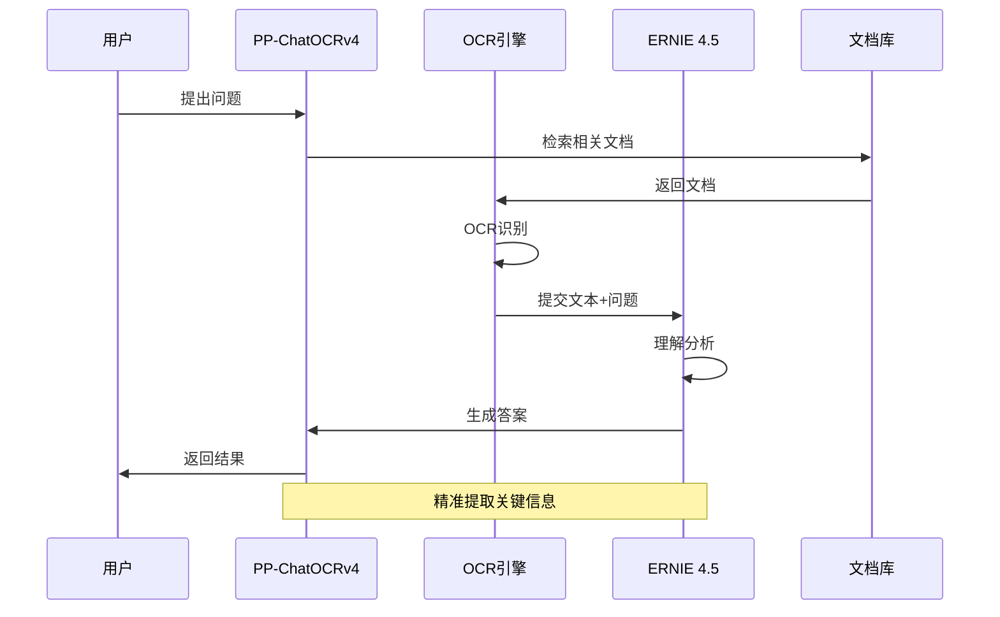

## 系统架构

PaddleOCR 3.0 提供完整的工具链，覆盖从数据处理到模型部署的全流程。

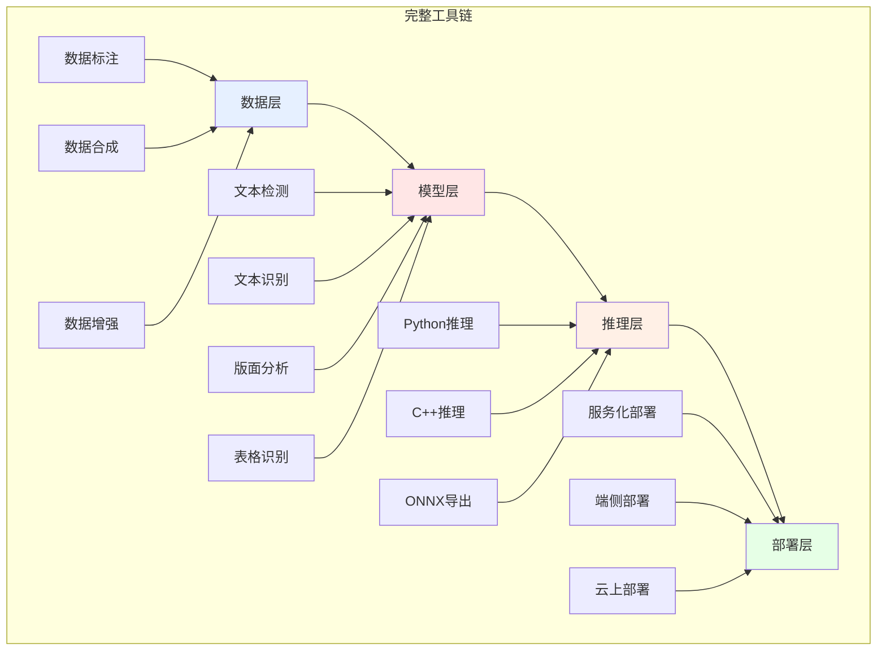

### 多硬件支持

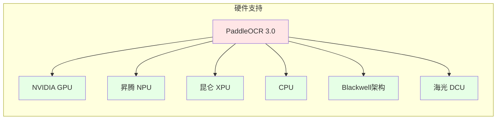

## 安装指南

### 环境要求

- Python 3.8+
- PaddlePaddle 3.0+
- 操作系统：Linux / Windows / macOS

### 快速安装

```bash
# 安装 PaddlePaddle
pip install paddlepaddle-gpu  # GPU 版本
# 或
pip install paddlepaddle      # CPU 版本

# 安装 PaddleOCR
pip install paddleocr>=3.0.0

# 安装依赖
pip install layoutparser opencv-python pillow
```

### 从源码安装

```bash
# 克隆仓库
git clone https://github.com/PaddlePaddle/PaddleOCR.git
cd PaddleOCR

# 安装依赖
pip install -r requirements.txt

# 安装 PaddleOCR
python setup.py install
```

### 国产硬件支持

#### 昇腾 NPU

```bash
# 安装昇腾版 PaddlePaddle
pip install paddlepaddle-npu

# 配置环境变量
export ASCEND_HOME=/usr/local/Ascend
export LD_LIBRARY_PATH=$ASCEND_HOME/lib64:$LD_LIBRARY_PATH
```

#### 昆仑 XPU

```bash
# 安装昆仑版 PaddlePaddle
pip install paddlepaddle-xpu

# 设置设备
export FLAGS_selected_xpus=0
```

## 快速开始

### 1. PP-OCRv5 文字识别

```python
from paddleocr import PaddleOCR

# 初始化 PP-OCRv5
ocr = PaddleOCR(
    use_angle_cls=True,      # 使用方向分类
    lang='ch',                # 支持中文
    version='PP-OCRv5',      # 使用 v5 版本
    show_log=False
)

# 识别图片
result = ocr.ocr('document.jpg', cls=True)

# 打印结果
for idx, line in enumerate(result[0]):
    print(f"文本 {idx}: {line[1][0]}, 置信度: {line[1][1]:.2f}")
```

#### 多语言识别

```python
# 混合语言文档识别
ocr_multi = PaddleOCR(
    lang='chinese_cht',      # 繁体中文
    use_angle_cls=True
)

# 支持的语言
languages = [
    'ch',           # 简体中文
    'chinese_cht',  # 繁体中文
    'en',           # 英文
    'japan',        # 日文
    'korean',       # 韩文
    'fr',           # 法文
    # ... 共 109 种语言
]
```

### 2. PP-StructureV3 文档解析

```python
from paddleocr import PPStructure

# 初始化文档解析器
table_engine = PPStructure(
    recovery=True,           # 启用版式恢复
    use_pdf2docx_api=False,  # 不使用外部 API
    lang='ch'
)

# 解析 PDF
result = table_engine('document.pdf', img_idx=0)

# 保存为 Markdown
with open('output.md', 'w', encoding='utf-8') as f:
    for item in result:
        if item['type'] == 'text':
            f.write(item['res'] + '\n\n')
        elif item['type'] == 'table':
            f.write(item['res']['html'] + '\n\n')
```

#### 批量文档处理

```python
import os
from pathlib import Path

def batch_parse_documents(input_dir, output_dir):
    """批量解析文档"""
    table_engine = PPStructure(recovery=True)
    
    for pdf_file in Path(input_dir).glob('*.pdf'):
        print(f"处理: {pdf_file.name}")
        
        # 解析文档
        result = table_engine(str(pdf_file))
        
        # 保存结果
        output_path = Path(output_dir) / f"{pdf_file.stem}.md"
        with open(output_path, 'w', encoding='utf-8') as f:
            for item in result:
                if item['type'] == 'text':
                    f.write(item['res'] + '\n\n')

# 使用示例
batch_parse_documents('input_pdfs/', 'output_markdown/')
```

### 3. PaddleOCR-VL 视觉语言模型

```python
from paddleocr import PaddleOCRVL

# 初始化 VL 模型
vl_model = PaddleOCRVL(
    model_name='PaddleOCR-VL-0.9B',
    device='gpu'
)

# 文档理解
result = vl_model.understand('complex_document.pdf')

# 获取结构化信息
print(f"标题: {result['title']}")
print(f"摘要: {result['summary']}")
print(f"关键信息: {result['key_info']}")

# 元素识别
elements = vl_model.detect_elements('document.jpg')
for elem in elements:
    print(f"{elem['type']}: {elem['bbox']}, 内容: {elem['text']}")
```

### 4. PP-ChatOCRv4 智能问答

```python
from paddleocr import PPChatOCR

# 初始化智能问答系统
chat_ocr = PPChatOCR(
    model='ernie-4.5',
    lang='ch'
)

# 加载文档
chat_ocr.load_document('contract.pdf')

# 提问
questions = [
    "合同的甲方是谁？",
    "合同金额是多少？",
    "合同有效期到什么时候？"
]

for question in questions:
    answer = chat_ocr.ask(question)
    print(f"Q: {question}")
    print(f"A: {answer}\n")
```

## 模块详解

### 文本检测模块

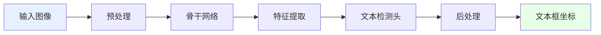

支持的检测算法：
- **DB / DB++**: 基于分割的文本检测
- **EAST**: 快速场景文本检测
- **SAST**: 任意形状文本检测
- **PSENet**: 渐进式扩展网络

### 文本识别模块

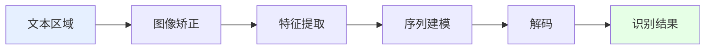

支持的识别算法：
- **CRNN**: 经典序列识别
- **SVTR**: 视觉Transformer
- **ABINet**: 自主学习双向网络
- **ViTSTR**: 视觉Transformer字符识别

### 版面分析模块

```python
from paddleocr import PPStructure

# 使用版面分析
layout_engine = PPStructure(
    layout=True,
    table=True,
    ocr=True
)

# 分析版面
result = layout_engine('document.jpg')

# 查看版面元素
for item in result:
    print(f"类型: {item['type']}")
    print(f"位置: {item['bbox']}")
    print(f"置信度: {item['score']}")
```

支持的版面元素：
- 文本块（Text）
- 标题（Title）
- 表格（Table）
- 图片（Figure）
- 公式（Equation）
- 列表（List）

### 表格识别模块

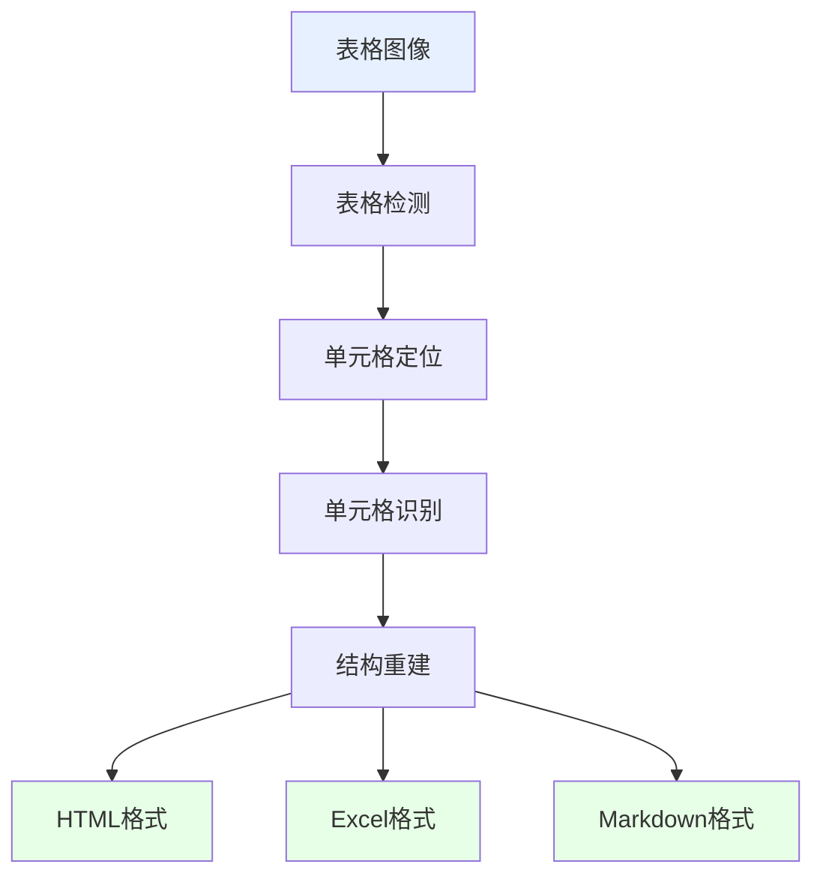

```python
from paddleocr import PPStructure

# 专门的表格识别
table_engine = PPStructure(
    table=True,
    ocr=True,
    show_log=False
)

# 识别表格
result = table_engine('table.jpg')

# 获取 HTML 表格
for item in result:
    if item['type'] == 'table':
        html_table = item['res']['html']
        print(html_table)
```

## 部署方案

### 推理部署架构

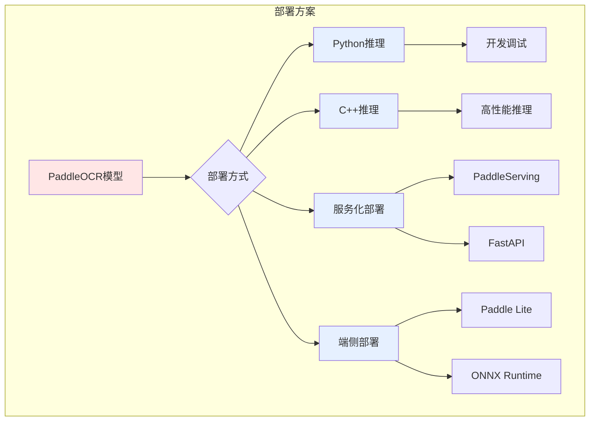

### 1. Python 服务化部署

```python
from fastapi import FastAPI, File, UploadFile
from paddleocr import PaddleOCR
import uvicorn

app = FastAPI()
ocr = PaddleOCR(use_angle_cls=True, lang='ch')

@app.post("/ocr")
async def ocr_api(file: UploadFile = File(...)):
    """OCR API 接口"""
    # 保存上传的文件
    contents = await file.read()
    with open(f"temp_{file.filename}", "wb") as f:
        f.write(contents)
    
    # 执行 OCR
    result = ocr.ocr(f"temp_{file.filename}", cls=True)
    
    # 格式化结果
    texts = [line[1][0] for line in result[0]]
    
    return {
        "status": "success",
        "result": texts
    }

if __name__ == "__main__":
    uvicorn.run(app, host="0.0.0.0", port=8000)
```

### 2. C++ 高性能部署

适用于对性能要求极高的场景：

```bash
# 编译 C++ 推理库
cd PaddleOCR/deploy/cpp_infer
mkdir build && cd build
cmake .. \
    -DPADDLE_LIB=/path/to/paddle_inference \
    -DWITH_GPU=ON \
    -DWITH_MKL=ON
make -j

# 运行推理
./ocr_system \
    --image_dir=/path/to/images \
    --det_model_dir=/path/to/det_model \
    --rec_model_dir=/path/to/rec_model
```

### 3. Docker 容器化部署

```dockerfile
FROM paddlepaddle/paddle:3.0.0-gpu-cuda12.0-cudnn8.9-trt8.6

# 安装 PaddleOCR
RUN pip install paddleocr>=3.0.0

# 下载模型
RUN mkdir -p /models && \
    cd /models && \
    wget https://paddleocr.bj.bcebos.com/PP-OCRv5/chinese/ch_PP-OCRv5_det_infer.tar && \
    wget https://paddleocr.bj.bcebos.com/PP-OCRv5/chinese/ch_PP-OCRv5_rec_infer.tar && \
    tar -xf ch_PP-OCRv5_det_infer.tar && \
    tar -xf ch_PP-OCRv5_rec_infer.tar

# 复制应用代码
COPY app.py /app/
WORKDIR /app

# 启动服务
CMD ["python", "app.py"]
```

```bash
# 构建镜像
docker build -t paddleocr-service .

# 运行容器
docker run -d -p 8000:8000 --gpus all paddleocr-service
```

### 4. Paddle Serving 部署

```bash
# 安装 Paddle Serving
pip install paddle-serving-server-gpu
pip install paddle-serving-client
pip install paddle-serving-app

# 转换模型
python -m paddle_serving_client.convert \
    --dirname ./ch_PP-OCRv5_det_infer/ \
    --model_filename inference.pdmodel \
    --params_filename inference.pdiparams \
    --serving_server ./serving_server \
    --serving_client ./serving_client

# 启动服务
python -m paddle_serving_server.serve \
    --model serving_server \
    --port 9292 \
    --gpu_ids 0
```

### 5. 端侧部署（移动端）

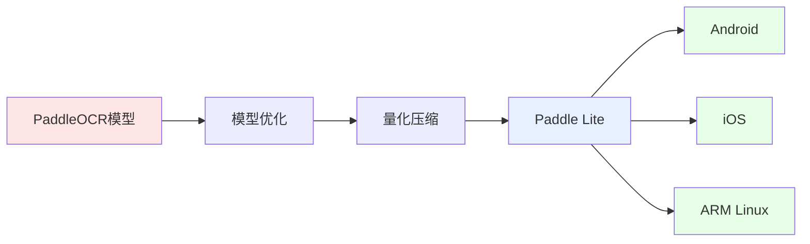

```python
# 模型量化和压缩
from paddleslim import Compressor

# 量化配置
config = {
    'quantize': {
        'activation_bits': 8,
        'weight_bits': 8
    }
}

# 执行压缩
compressor = Compressor(
    model_dir='./ch_PP-OCRv5_det_infer',
    config=config
)
compressor.compress()
```

### 6. ONNX 导出与部署

```python
from paddle2onnx import convert

# 导出为 ONNX
onnx_model = convert.dygraph2onnx(
    model_file='./ch_PP-OCRv5_det_infer/inference.pdmodel',
    params_file='./ch_PP-OCRv5_det_infer/inference.pdiparams',
    save_file='ocr_model.onnx',
    opset_version=13
)

# 使用 ONNX Runtime 推理
import onnxruntime as ort

session = ort.InferenceSession('ocr_model.onnx')
result = session.run(None, {'input': image_data})
```

### 7. MCP 服务器部署

PaddleOCR 3.0 新增 MCP（Model Context Protocol）服务器支持：

```python
from paddleocr import MCPServer

# 创建 MCP 服务器
mcp = MCPServer(
    host='0.0.0.0',
    port=8080,
    model_type='PP-OCRv5'
)

# 启动服务
mcp.start()
```

## 应用场景

### 场景分类

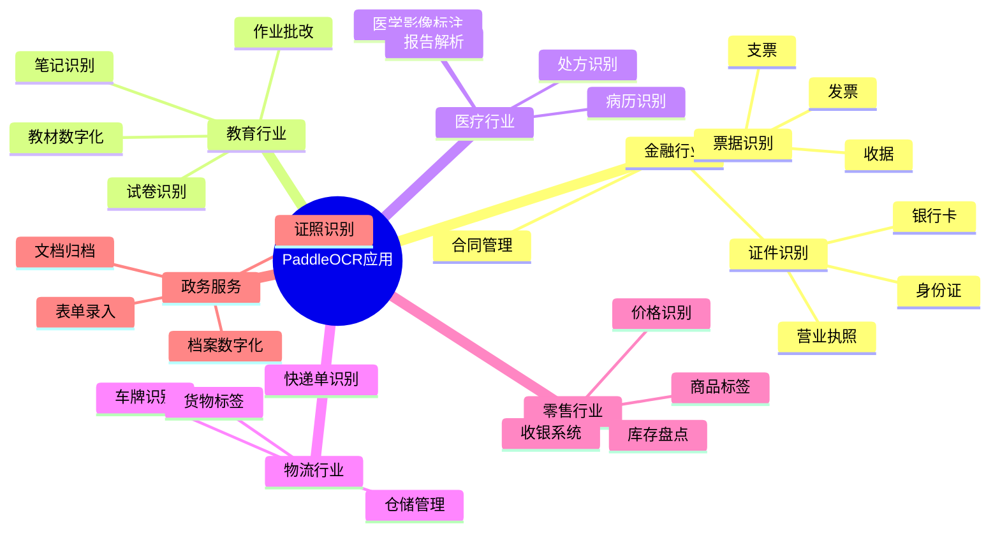

### 典型应用案例

#### 1. 智能文档管理系统

```python
class DocumentManagementSystem:
    """智能文档管理系统"""
    
    def __init__(self):
        self.ocr = PaddleOCR(use_angle_cls=True, lang='ch')
        self.structure = PPStructure(recovery=True)
        
    def process_document(self, file_path):
        """处理文档"""
        # 文档解析
        result = self.structure(file_path)
        
        # 提取元数据
        metadata = self.extract_metadata(result)
        
        # 全文索引
        full_text = self.extract_full_text(result)
        
        # 保存到数据库
        self.save_to_database(metadata, full_text)
        
        return {
            'metadata': metadata,
            'text': full_text
        }
    
    def extract_metadata(self, result):
        """提取文档元数据"""
        metadata = {
            'title': '',
            'author': '',
            'date': '',
            'keywords': []
        }
        
        # 从结果中提取元数据
        for item in result:
            if item['type'] == 'title':
                metadata['title'] = item['res']
        
        return metadata
```

#### 2. 发票识别系统

```python
class InvoiceRecognition:
    """发票识别系统"""
    
    def __init__(self):
        self.ocr = PaddleOCR(lang='ch')
        
    def recognize_invoice(self, image_path):
        """识别发票"""
        result = self.ocr.ocr(image_path, cls=True)
        
        # 提取关键信息
        invoice_info = {
            'invoice_number': self.extract_invoice_number(result),
            'date': self.extract_date(result),
            'amount': self.extract_amount(result),
            'seller': self.extract_seller(result),
            'buyer': self.extract_buyer(result)
        }
        
        return invoice_info
    
    def extract_invoice_number(self, result):
        """提取发票号码"""
        import re
        for line in result[0]:
            text = line[1][0]
            # 发票号码通常是8位数字
            match = re.search(r'\d{8}', text)
            if match:
                return match.group()
        return None
```

#### 3. 证件识别系统

```python
class IDCardRecognition:
    """身份证识别系统"""
    
    def __init__(self):
        self.ocr = PaddleOCR(lang='ch')
        
    def recognize_id_card(self, image_path, side='front'):
        """识别身份证"""
        result = self.ocr.ocr(image_path, cls=True)
        
        if side == 'front':
            return self.extract_front_info(result)
        else:
            return self.extract_back_info(result)
    
    def extract_front_info(self, result):
        """提取正面信息"""
        info = {
            'name': '',
            'gender': '',
            'nation': '',
            'birth': '',
            'address': '',
            'id_number': ''
        }
        
        # 使用正则表达式提取信息
        import re
        full_text = ' '.join([line[1][0] for line in result[0]])
        
        # 提取身份证号
        id_match = re.search(r'\d{17}[\dXx]', full_text)
        if id_match:
            info['id_number'] = id_match.group()
        
        return info
```

#### 4. 表格数据提取

```python
class TableExtractor:
    """表格数据提取器"""
    
    def __init__(self):
        self.table_engine = PPStructure(
            table=True,
            ocr=True,
            show_log=False
        )
        
    def extract_table(self, image_path):
        """提取表格数据"""
        result = self.table_engine(image_path)
        
        tables = []
        for item in result:
            if item['type'] == 'table':
                # 将 HTML 表格转换为结构化数据
                table_data = self.html_to_dataframe(item['res']['html'])
                tables.append(table_data)
        
        return tables
    
    def html_to_dataframe(self, html):
        """HTML转DataFrame"""
        import pandas as pd
        from io import StringIO
        
        df = pd.read_html(StringIO(html))[0]
        return df
```

## 模型训练

### 训练流程

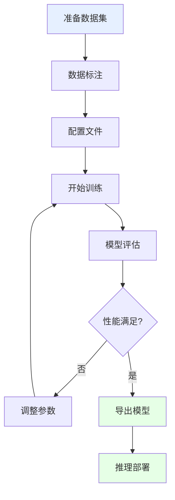

### 1. 数据准备

```python
# 数据集目录结构
"""
dataset/
├── train/
│   ├── images/
│   └── labels/
├── val/
│   ├── images/
│   └── labels/
└── test/
    ├── images/
    └── labels/
"""

# 标注格式（文本检测）
"""
image_name.jpg
[
    {
        "transcription": "文字内容",
        "points": [[x1, y1], [x2, y2], [x3, y3], [x4, y4]]
    }
]
"""
```

### 2. 配置训练参数

```yaml
# config/det_config.yml
Global:
  use_gpu: true
  epoch_num: 500
  log_smooth_window: 20
  print_batch_step: 10
  save_model_dir: ./output/det_model
  save_epoch_step: 100
  eval_batch_step: 2000
  
Architecture:
  model_type: det
  algorithm: DB
  Transform:
  Backbone:
    name: MobileNetV3
    scale: 0.5
  Neck:
    name: DBFPN
  Head:
    name: DBHead
    
Train:
  dataset:
    name: SimpleDataSet
    data_dir: ./train_data/
    label_file_list:
      - ./train_data/train_list.txt
  loader:
    shuffle: True
    batch_size_per_card: 8
    num_workers: 4
```

### 3. 开始训练

```bash
# 文本检测模型训练
python tools/train.py \
    -c configs/det/det_mv3_db.yml \
    -o Global.pretrained_model=./pretrain_models/MobileNetV3_large_x0_5_pretrained

# 文本识别模型训练
python tools/train.py \
    -c configs/rec/rec_chinese_lite_train_v2.0.yml \
    -o Global.pretrained_model=./pretrain_models/rec_mv3_none_bilstm_ctc_v2.0_train
```

### 4. 模型评估

```bash
# 评估检测模型
python tools/eval.py \
    -c configs/det/det_mv3_db.yml \
    -o Global.checkpoints=./output/det_model/best_accuracy

# 评估识别模型
python tools/eval.py \
    -c configs/rec/rec_chinese_lite_train_v2.0.yml \
    -o Global.checkpoints=./output/rec_model/best_accuracy
```

### 5. 模型导出

```bash
# 导出推理模型
python tools/export_model.py \
    -c configs/det/det_mv3_db.yml \
    -o Global.pretrained_model=./output/det_model/best_accuracy \
       Global.save_inference_dir=./inference/det_model
```

## 数据标注与增强

### 数据标注工具

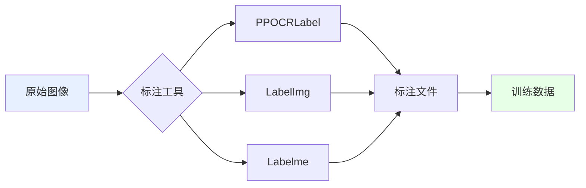

#### PPOCRLabel 使用

```bash
# 安装 PPOCRLabel
pip install PPOCRLabel

# 启动标注工具
PPOCRLabel --lang ch

# 快捷键
# A: 选择上一张
# D: 选择下一张
# W: 创建矩形框
# Ctrl+E: 编辑标签
# Ctrl+S: 保存
```

### 数据合成

```python
from paddleocr import TextRenderer

class DataSynthesis:
    """数据合成器"""
    
    def __init__(self):
        self.renderer = TextRenderer()
        
    def generate_samples(self, texts, backgrounds, count=1000):
        """生成合成样本"""
        samples = []
        
        for i in range(count):
            # 随机选择文本和背景
            text = random.choice(texts)
            bg = random.choice(backgrounds)
            
            # 渲染图像
            image = self.renderer.render(
                text=text,
                background=bg,
                font_size=random.randint(20, 40),
                angle=random.randint(-10, 10)
            )
            
            samples.append({
                'image': image,
                'label': text
            })
        
        return samples
```

### 数据增强

```python
import albumentations as A

# 数据增强管道
transform = A.Compose([
    A.RandomRotate90(p=0.5),
    A.Flip(p=0.5),
    A.OneOf([
        A.MotionBlur(p=0.2),
        A.MedianBlur(blur_limit=3, p=0.1),
        A.Blur(blur_limit=3, p=0.1),
    ], p=0.2),
    A.ShiftScaleRotate(
        shift_limit=0.0625,
        scale_limit=0.2,
        rotate_limit=15,
        p=0.5
    ),
    A.OneOf([
        A.OpticalDistortion(p=0.3),
        A.GridDistortion(p=0.1),
    ], p=0.2),
    A.OneOf([
        A.CLAHE(clip_limit=2),
        A.RandomBrightnessContrast(),
    ], p=0.3),
])
```

## 性能优化

### 优化策略

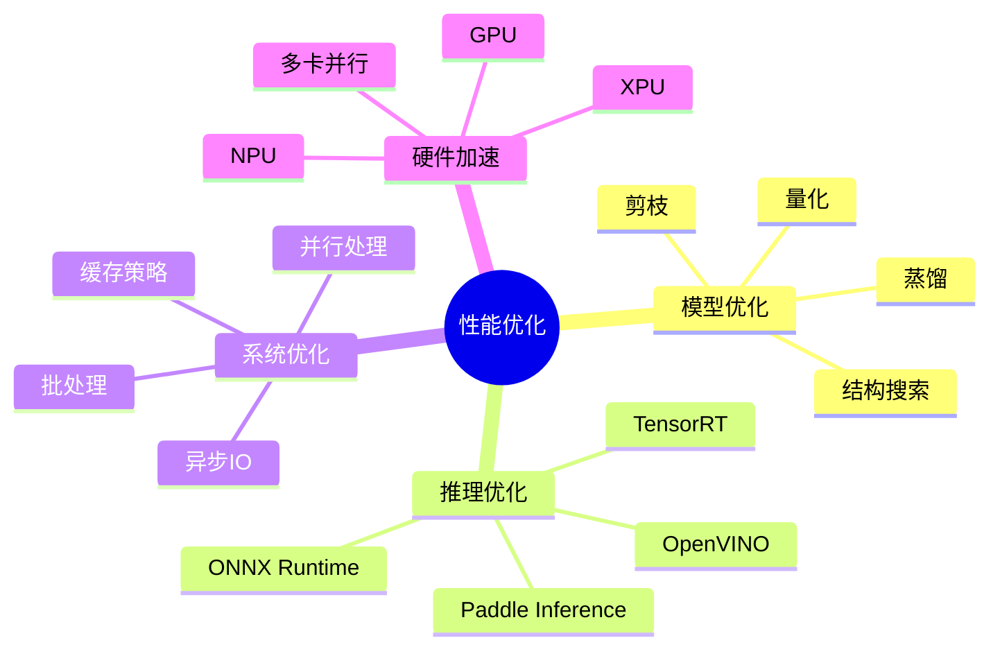

### 1. 模型量化

```python
from paddleslim.quant import quant_aware, convert

# 量化感知训练
quant_config = {
    'weight_quantize_type': 'channel_wise_abs_max',
    'activation_quantize_type': 'moving_average_abs_max',
    'weight_bits': 8,
    'activation_bits': 8,
}

# 应用量化
quantized_model = quant_aware(
    model,
    quant_config=quant_config,
    for_test=False
)

# 训练量化模型
# ... 训练代码 ...

# 转换为推理模型
inference_model = convert(quantized_model, for_test=True)
```

### 2. 批处理推理

```python
class BatchOCR:
    """批处理OCR"""
    
    def __init__(self, batch_size=8):
        self.ocr = PaddleOCR(use_angle_cls=True, lang='ch')
        self.batch_size = batch_size
        
    def process_batch(self, image_paths):
        """批量处理图像"""
        results = []
        
        for i in range(0, len(image_paths), self.batch_size):
            batch = image_paths[i:i + self.batch_size]
            
            # 并行处理
            with ThreadPoolExecutor(max_workers=self.batch_size) as executor:
                batch_results = list(executor.map(self.process_single, batch))
            
            results.extend(batch_results)
        
        return results
    
    def process_single(self, image_path):
        """处理单张图像"""
        return self.ocr.ocr(image_path, cls=True)
```

### 3. GPU 加速

```python
# 多GPU推理
import paddle

# 设置多卡
paddle.set_device('gpu:0,1,2,3')

# 数据并行
from paddle.DataParallel import DataParallel

model = DataParallel(model)

# 混合精度训练
from paddle.amp import auto_cast, GradScaler

scaler = GradScaler(init_loss_scaling=1024)

with auto_cast():
    output = model(input)
    loss = criterion(output, label)

scaled = scaler.scale(loss)
scaled.backward()
scaler.step(optimizer)
scaler.update()
```

### 4. TensorRT 加速

```bash
# 转换为 TensorRT
python tools/export_model.py \
    -c configs/det/det_mv3_db.yml \
    -o Global.pretrained_model=./output/det_model/best_accuracy \
       Global.save_inference_dir=./inference/det_trt \
       Global.use_tensorrt=True

# 使用 TensorRT 推理
python tools/infer/predict_system.py \
    --image_dir="./doc/imgs/" \
    --det_model_dir="./inference/det_trt" \
    --use_tensorrt=True
```

## 常见问题与解决方案

### 问题诊断流程

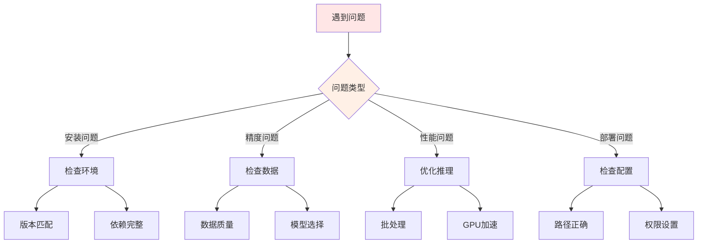

### FAQ

#### 1. 安装相关

**Q: ImportError: libGL.so.1: cannot open shared object file**

```bash
# Ubuntu/Debian
sudo apt-get install libgl1-mesa-glx

# CentOS/RHEL
sudo yum install mesa-libGL
```

**Q: PaddlePaddle 与 PaddleOCR 版本不匹配**

```bash
# 卸载旧版本
pip uninstall paddlepaddle paddleocr

# 安装匹配版本
pip install paddlepaddle-gpu==3.0.0
pip install paddleocr==3.0.0
```

#### 2. 识别精度问题

**Q: 识别准确率低**

```python
# 解决方案：
# 1. 使用更大的模型
ocr = PaddleOCR(
    det_model_dir='./ch_PP-OCRv5_det_server',  # 服务器版模型
    rec_model_dir='./ch_PP-OCRv5_rec_server',
    use_angle_cls=True
)

# 2. 调整检测阈值
ocr = PaddleOCR(
    det_db_thresh=0.3,       # 降低检测阈值
    det_db_box_thresh=0.5,   # 调整文本框阈值
    use_angle_cls=True
)

# 3. 预处理图像
import cv2

def preprocess_image(image_path):
    img = cv2.imread(image_path)
    # 去噪
    img = cv2.fastNlMeansDenoisingColored(img, None, 10, 10, 7, 21)
    # 二值化
    gray = cv2.cvtColor(img, cv2.COLOR_BGR2GRAY)
    _, binary = cv2.threshold(gray, 0, 255, cv2.THRESH_BINARY + cv2.THRESH_OTSU)
    return binary
```

**Q: 倾斜文本识别效果差**

```python
# 启用方向分类器
ocr = PaddleOCR(
    use_angle_cls=True,      # 启用方向分类
    cls_thresh=0.9           # 方向分类阈值
)

# 或手动矫正图像
def correct_skew(image):
    coords = np.column_stack(np.where(image > 0))
    angle = cv2.minAreaRect(coords)[-1]
    
    if angle < -45:
        angle = -(90 + angle)
    else:
        angle = -angle
        
    (h, w) = image.shape[:2]
    center = (w // 2, h // 2)
    M = cv2.getRotationMatrix2D(center, angle, 1.0)
    rotated = cv2.warpAffine(
        image, M, (w, h),
        flags=cv2.INTER_CUBIC,
        borderMode=cv2.BORDER_REPLICATE
    )
    
    return rotated
```

#### 3. 性能优化

**Q: 推理速度慢**

```python
# 解决方案：
# 1. 使用轻量级模型
ocr = PaddleOCR(
    det_model_dir='./ch_PP-OCRv5_det_mobile',
    rec_model_dir='./ch_PP-OCRv5_rec_mobile',
    use_angle_cls=False,     # 关闭方向分类
    use_gpu=True,            # 使用GPU
    enable_mkldnn=True       # 启用MKLDNN加速
)

# 2. 批处理
def batch_ocr(image_paths, batch_size=8):
    results = []
    for i in range(0, len(image_paths), batch_size):
        batch = image_paths[i:i + batch_size]
        batch_results = [ocr.ocr(img) for img in batch]
        results.extend(batch_results)
    return results

# 3. 多进程处理
from multiprocessing import Pool

def process_image(image_path):
    ocr = PaddleOCR(use_angle_cls=True, lang='ch')
    return ocr.ocr(image_path)

with Pool(processes=4) as pool:
    results = pool.map(process_image, image_paths)
```

#### 4. 内存问题

**Q: 处理大图像时内存溢出**

```python
# 解决方案：
# 1. 图像预处理
def resize_image(image_path, max_size=1920):
    img = cv2.imread(image_path)
    h, w = img.shape[:2]
    
    if max(h, w) > max_size:
        scale = max_size / max(h, w)
        new_w = int(w * scale)
        new_h = int(h * scale)
        img = cv2.resize(img, (new_w, new_h))
    
    return img

# 2. 分块处理
def process_large_image(image_path, block_size=1000):
    img = cv2.imread(image_path)
    h, w = img.shape[:2]
    
    results = []
    for y in range(0, h, block_size):
        for x in range(0, w, block_size):
            block = img[y:y+block_size, x:x+block_size]
            result = ocr.ocr(block)
            results.append(result)
    
    return results
```

## 社区与资源

### 学习资源

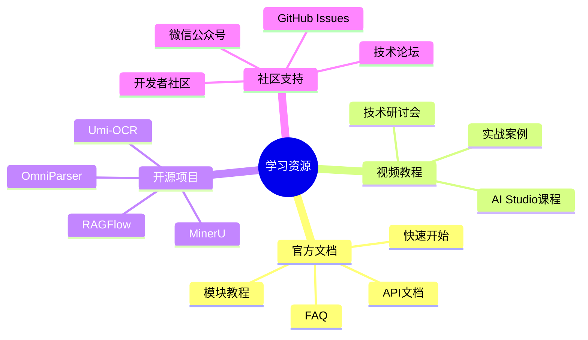

### 相关项目

1. **Umi-OCR**: 免费开源的离线OCR软件
   - 基于 PaddleOCR
   - 提供图形界面
   - 支持批量处理
   - 截图识别

2. **MinerU**: PDF文档解析工具
   - 高质量文档提取
   - 支持复杂版面
   - 保留文档结构

3. **RAGFlow**: 基于文档理解的RAG引擎
   - 集成 PaddleOCR
   - 智能检索
   - 生成增强

4. **OmniParser**: 通用文档解析器
   - 多格式支持
   - 统一接口
   - 易于集成

### 贡献指南

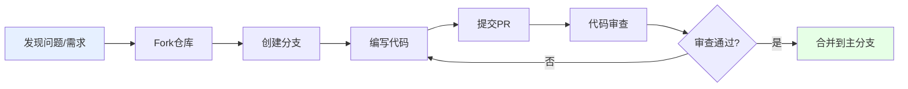

参与贡献：

1. Fork 仓库到个人账号
2. 创建特性分支：`git checkout -b feature/your-feature`
3. 提交更改：`git commit -am 'Add some feature'`
4. 推送分支：`git push origin feature/your-feature`
5. 创建 Pull Request

### 社区活动

- **场景项目征集**: 2025年8月5日 - 10月30日
- **黑客马拉松**: 展示才能，赢取奖励
- **技术研讨会**: 学习前沿技术
- **开发者社区**: 全球开发者交流

## 版本更新

### PaddleOCR 3.0 主要更新

```mermaid
timeline
    title PaddleOCR 版本演进
    
    2020 : PaddleOCR 1.0
         : 基础OCR功能
    
    2021 : PaddleOCR 2.0
         : PP-OCR系列
         : 轻量级模型
    
    2023 : PaddleOCR 2.7
         : PP-OCRv4
         : 精度大幅提升
    
    2025.05 : PaddleOCR 3.0
            : 适配飞桨3.0
            : PP-OCRv5发布
    
    2025.10 : PaddleOCR 3.x
            : PaddleOCR-VL
            : 多硬件支持
```

### 3.0 版本亮点

1. **框架升级**
   - 全面适配飞桨框架 3.0
   - API 接口优化
   - 性能提升

2. **模型增强**
   - PP-OCRv5：单模型五种文字类型
   - PP-StructureV3：复杂文档解析
   - PP-ChatOCRv4：智能信息抽取
   - PaddleOCR-VL：视觉语言模型

3. **硬件支持**
   - 昆仑芯 XPU
   - 昇腾 NPU
   - 海光 DCU
   - NVIDIA Blackwell

4. **工具优化**
   - MCP 服务器
   - 产线并行推理
   - 低代码开发
   - 在线体验平台

### 升级指南

从 2.x 升级到 3.x：

```python
# PaddleOCR 2.x (旧代码)
from paddleocr import PaddleOCR, draw_ocr

ocr = PaddleOCR(use_angle_cls=True, lang='ch')
result = ocr.ocr('test.jpg', cls=True)

# PaddleOCR 3.x (新代码)
from paddleocr import PaddleOCR

ocr = PaddleOCR(
    use_angle_cls=True,
    lang='ch',
    version='PP-OCRv5',  # 新增版本参数
    show_log=False
)
result = ocr.ocr('test.jpg', cls=True)
```

主要变更：
- API 接口调整
- 模型路径变化
- 配置参数更新
- 依赖版本要求

详细升级说明请参考：[PaddleOCR 3.x 升级说明](https://www.paddleocr.ai/latest/)

## 最佳实践

### 1. 生产环境部署清单

```python
# production_config.py
PRODUCTION_CONFIG = {
    # 模型配置
    'model': {
        'det_model_dir': './models/det',
        'rec_model_dir': './models/rec',
        'cls_model_dir': './models/cls',
        'use_angle_cls': True,
        'lang': 'ch'
    },
    
    # 性能配置
    'performance': {
        'use_gpu': True,
        'gpu_mem': 8000,
        'enable_mkldnn': True,
        'cpu_threads': 10,
        'use_tensorrt': True
    },
    
    # 业务配置
    'business': {
        'max_batch_size': 16,
        'timeout': 30,
        'retry_times': 3,
        'enable_cache': True
    },
    
    # 监控配置
    'monitoring': {
        'enable_metrics': True,
        'log_level': 'INFO',
        'slow_query_threshold': 5.0
    }
}
```

### 2. 错误处理

```python
import logging
from functools import wraps

def ocr_error_handler(func):
    """OCR错误处理装饰器"""
    @wraps(func)
    def wrapper(*args, **kwargs):
        try:
            return func(*args, **kwargs)
        except Exception as e:
            logging.error(f"OCR处理失败: {str(e)}")
            return {
                'status': 'error',
                'message': str(e),
                'result': None
            }
    return wrapper

@ocr_error_handler
def safe_ocr(image_path):
    """安全的OCR处理"""
    ocr = PaddleOCR(use_angle_cls=True, lang='ch')
    result = ocr.ocr(image_path, cls=True)
    return {
        'status': 'success',
        'result': result
    }
```

### 3. 性能监控

```python
import time
from collections import defaultdict

class OCRMonitor:
    """OCR性能监控"""
    
    def __init__(self):
        self.metrics = defaultdict(list)
        
    def record(self, metric_name, value):
        """记录指标"""
        self.metrics[metric_name].append({
            'value': value,
            'timestamp': time.time()
        })
        
    def get_stats(self, metric_name):
        """获取统计信息"""
        values = [m['value'] for m in self.metrics[metric_name]]
        return {
            'count': len(values),
            'avg': sum(values) / len(values) if values else 0,
            'min': min(values) if values else 0,
            'max': max(values) if values else 0
        }

# 使用示例
monitor = OCRMonitor()

start = time.time()
result = ocr.ocr('test.jpg')
duration = time.time() - start

monitor.record('inference_time', duration)
print(monitor.get_stats('inference_time'))
```

## 总结

PaddleOCR 3.0 是开源 OCR 领域的标杆工具，具有以下核心优势：

### 核心优势总结

```mermaid
mindmap
    root((PaddleOCR 3.0))
        技术领先
            SOTA性能
            创新架构
            多模型支持
            持续迭代
        易用性强
            简单API
            丰富文档
            完整工具链
            低代码开发
        生态完善
            活跃社区
            丰富资源
            成功案例
            技术支持
        应用广泛
            多行业覆盖
            多场景适配
            灵活部署
            高可扩展
```

### 选择 PaddleOCR 的理由

1. **精度高**: 在多个公开数据集上达到 SOTA 性能
2. **速度快**: 优化的推理引擎，支持多种加速方案
3. **易集成**: 简洁的 API，完善的文档
4. **多语言**: 支持 109 种语言识别
5. **灵活部署**: 支持云端、边缘、移动端多种部署方式
6. **开源免费**: Apache-2.0 协议，商用友好
7. **社区活跃**: 持续更新，问题响应快
8. **产业验证**: 被众多知名项目采用

### 未来展望

PaddleOCR 将继续在以下方向发展：

- 更高精度的识别模型
- 更快的推理速度
- 更多语言和场景支持
- 更强的文档理解能力
- 更好的大模型集成
- 更广的硬件支持

---

## 参考资源

- 官网: [https://www.paddleocr.ai/](https://www.paddleocr.ai/)
- GitHub: [https://github.com/PaddlePaddle/PaddleOCR](https://github.com/PaddlePaddle/PaddleOCR)
- 文档: [https://www.paddleocr.ai/latest/](https://www.paddleocr.ai/latest/)
- AI Studio: [https://aistudio.baidu.com/](https://aistudio.baidu.com/)
- 飞桨官网: [https://www.paddlepaddle.org.cn/](https://www.paddlepaddle.org.cn/)

**开始使用 PaddleOCR，让 OCR 变得更简单！**

