# DeepSeek OCR 完整指南：上下文光学压缩引擎

## 项目概述

[DeepSeek OCR](https://deepseek-ocr.io/zh/) 是一款革命性的两阶段 Transformer 文档 AI 系统，它将高分辨率文档压缩成精简的视觉 Token，再借助 30 亿参数的专家混合（MoE）模型解码，实现覆盖 100+ 种语言的近乎无损文字、版式与图示理解。

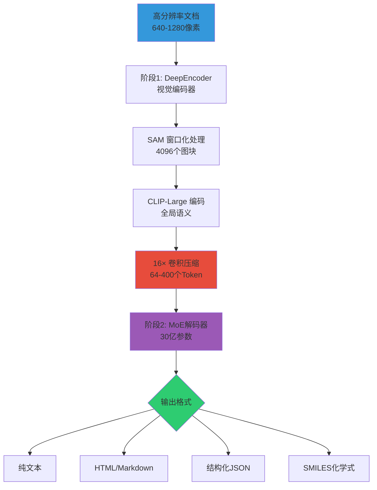
```mermaid
graph TB
    A[高分辨率文档<br/>640-1280像素] --> B[阶段1: DeepEncoder<br/>视觉编码器]
    B --> C[SAM 窗口化处理<br/>4096个图块]
    C --> D[CLIP-Large 编码<br/>全局语义]
    D --> E[16× 卷积压缩<br/>64-400个Token]
    E --> F[阶段2: MoE解码器<br/>30亿参数]
    F --> G{输出格式}
    G --> H[纯文本]
    G --> I[HTML/Markdown]
    G --> J[结构化JSON]
    G --> K[SMILES化学式]
    
    style A fill:#3498DB
    style E fill:#E74C3C
    style F fill:#9B59B6
    style G fill:#2ECC71
```

### 核心亮点

- **极致压缩**：在 Fox 基准上实现 10 倍压缩的 97% 精确匹配率
- **高速吞吐**：单张 NVIDIA A100 GPU 日处理约 20 万页文档
- **多语言支持**：覆盖 100+ 种语言，包括拉丁、汉字、日韩、斯拉夫文字及科学符号
- **开源协议**：MIT 许可，支持本地部署和商业使用

## 核心特性矩阵

DeepSeek OCR 提供了四大核心特性，使其在文档 AI 领域独树一帜：

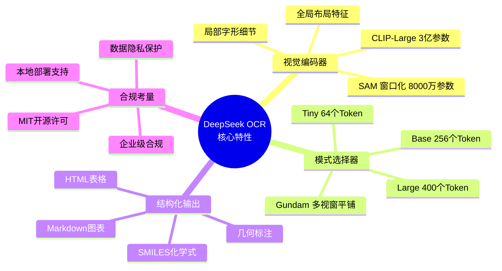
```mermaid
mindmap
  root((DeepSeek OCR<br/>核心特性))
    视觉编码器
      SAM 窗口化 8000万参数
      CLIP-Large 3亿参数
      局部字形细节
      全局布局特征
    模式选择器
      Tiny 64个Token
      Base 256个Token
      Large 400个Token
      Gundam 多视窗平铺
    结构化输出
      HTML表格
      Markdown图表
      SMILES化学式
      几何标注
    合规考量
      MIT开源许可
      本地部署支持
      数据隐私保护
      企业级合规
```

### 1. 视觉编码器

DeepSeek OCR 采用双编码器架构：

- **SAM 窗口化编码器**（8000 万参数）：负责捕捉局部字形细节
- **CLIP-Large 编码器**（3 亿参数）：负责提取全局布局特征

这种组合在密集的法律、金融与科研 PDF 中保持高保真度。

### 2. 模式选择器

根据不同的应用场景，DeepSeek OCR 提供四种压缩模式：

| 模式 | Token 数 | 压缩比 | 适用场景 |
|------|----------|--------|----------|
| Tiny | 64 | 64× | 发票、收据等简单文档 |
| Base | 256 | 16× | 标准 PDF 文档 |
| Large | 400 | 10× | 复杂表格、图表 |
| Gundam | 多视窗 | 可变 | 工程蓝图、大幅面扫描 |

### 3. 结构化输出

DeepSeek OCR 不仅能识别文本，还能输出多种结构化格式：

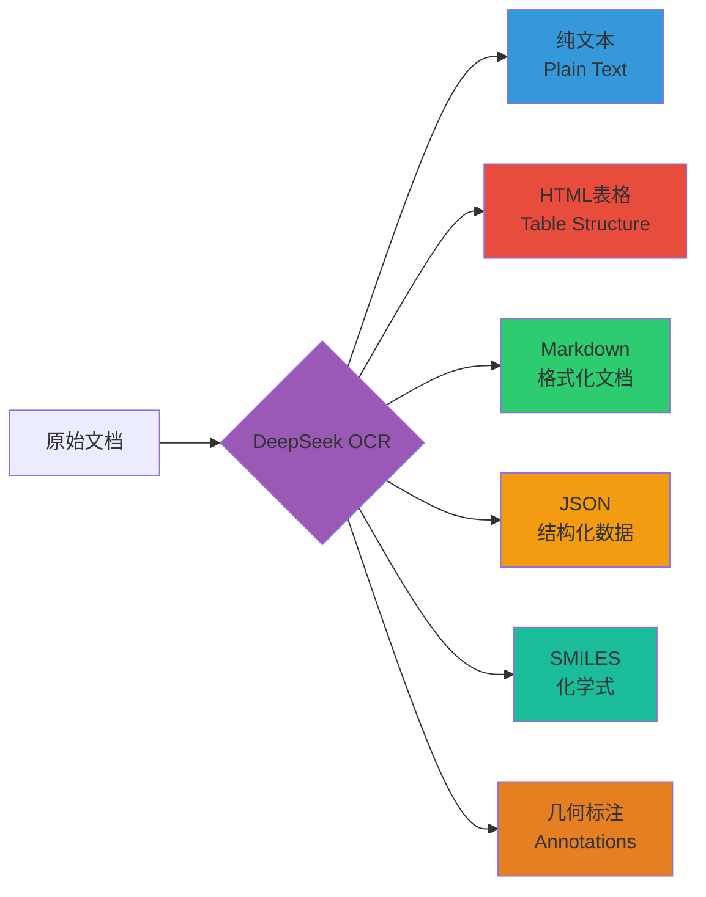
```mermaid
flowchart LR
    A[原始文档] --> B{DeepSeek OCR}
    B --> C[纯文本<br/>Plain Text]
    B --> D[HTML表格<br/>Table Structure]
    B --> E[Markdown<br/>格式化文档]
    B --> F[JSON<br/>结构化数据]
    B --> G[SMILES<br/>化学式]
    B --> H[几何标注<br/>Annotations]
    
    style B fill:#9B59B6
    style C fill:#3498DB
    style D fill:#E74C3C
    style E fill:#2ECC71
    style F fill:#F39C12
    style G fill:#1ABC9C
    style H fill:#E67E22
```

### 4. 合规与部署

- **MIT 开源许可**：允许组织在本地运行，确保数据安全
- **灵活部署**：支持本地 GPU 部署或 DeepSeek API 托管服务
- **数据隐私**：本地部署可确保数据不离开组织内部

## 架构深潜

DeepSeek OCR 采用两阶段架构，将视觉压缩与语义解码分离，实现高效的文档处理。

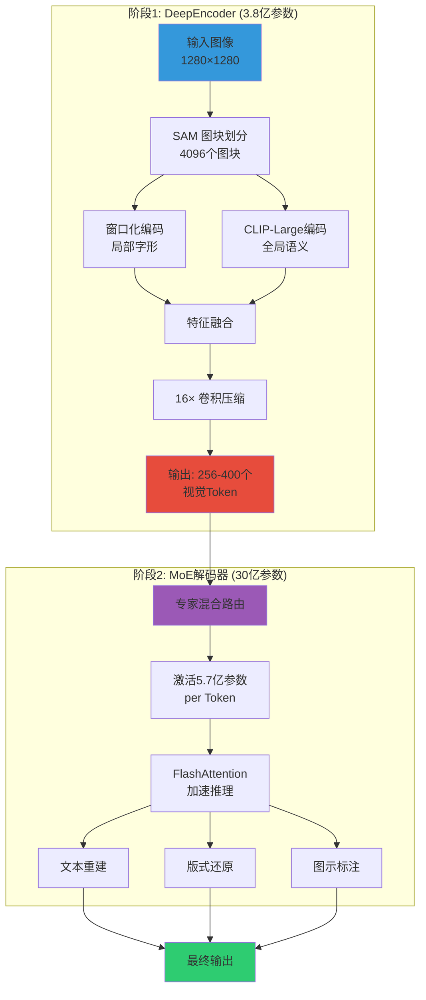
```mermaid
graph TD
    subgraph "阶段1: DeepEncoder (3.8亿参数)"
        A1[输入图像<br/>1280×1280] --> B1[SAM 图块划分<br/>4096个图块]
        B1 --> C1[窗口化编码<br/>局部字形]
        B1 --> D1[CLIP-Large编码<br/>全局语义]
        C1 --> E1[特征融合]
        D1 --> E1
        E1 --> F1[16× 卷积压缩]
        F1 --> G1[输出: 256-400个<br/>视觉Token]
    end
    
    subgraph "阶段2: MoE解码器 (30亿参数)"
        G1 --> H2[专家混合路由]
        H2 --> I2[激活5.7亿参数<br/>per Token]
        I2 --> J2[FlashAttention<br/>加速推理]
        J2 --> K2[文本重建]
        J2 --> L2[版式还原]
        J2 --> M2[图示标注]
    end
    
    K2 --> N[最终输出]
    L2 --> N
    M2 --> N
    
    style A1 fill:#3498DB
    style G1 fill:#E74C3C
    style H2 fill:#9B59B6
    style N fill:#2ECC71
```

### 阶段 1：DeepEncoder（约 3.8 亿参数）

**功能**：将高分辨率页面图像压缩为紧凑的视觉 Token

**处理流程**：

1. **图像划分**：将最高 1280×1280 的页面划分为 4096 个图块
2. **双路编码**：
   - SAM 窗口化处理：捕捉字形细节
   - CLIP-Large 编码：提取页面语义
3. **特征融合**：结合局部和全局特征
4. **卷积压缩**：16 倍压缩至 256-400 个 Token

### 阶段 2：MoE 解码器（30 亿参数）

**功能**：从压缩的视觉 Token 重建文本、版式和图示内容

**关键技术**：

- **专家混合架构**：每个 Token 激活约 5.7 亿参数
- **FlashAttention**：CUDA 优化，维持高 GPU 吞吐
- **多任务解码**：同时处理文本、版式标签与字幕

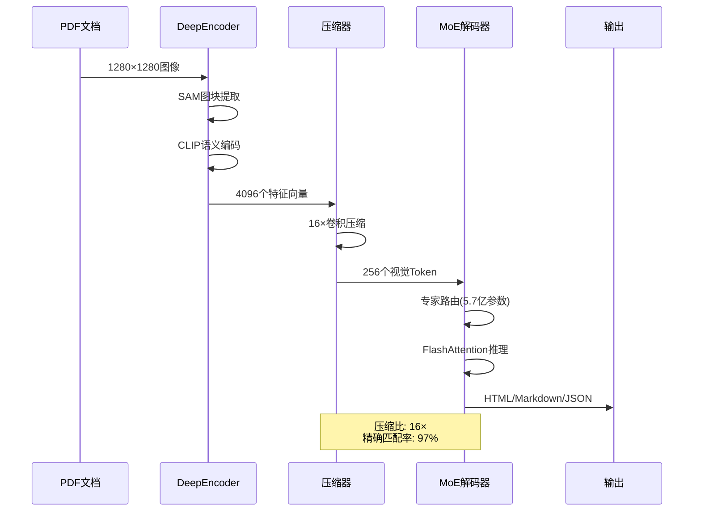
```mermaid
sequenceDiagram
    participant PDF as PDF文档
    participant Enc as DeepEncoder
    participant Comp as 压缩器
    participant MoE as MoE解码器
    participant Out as 输出

    PDF->>Enc: 1280×1280图像
    Enc->>Enc: SAM图块提取
    Enc->>Enc: CLIP语义编码
    Enc->>Comp: 4096个特征向量
    Comp->>Comp: 16×卷积压缩
    Comp->>MoE: 256个视觉Token
    MoE->>MoE: 专家路由(5.7亿参数)
    MoE->>MoE: FlashAttention推理
    MoE->>Out: HTML/Markdown/JSON
    
    Note over Comp,MoE: 压缩比: 16×<br/>精确匹配率: 97%
```

### 多模态桥梁

得益于 CLIP 预训练，DeepSeek OCR 具备强大的多模态能力：

- **文本-图像对齐**：将文本摘要与图表、曲线对齐
- **视觉理解**：即使在激进压缩后，字幕与目标定位仍旧准确
- **科研文档优化**：对科研文档与数据可视化的衔接尤为关键

## 数据处理流程

DeepSeek OCR 的完整数据处理流程保持上下文完整性：

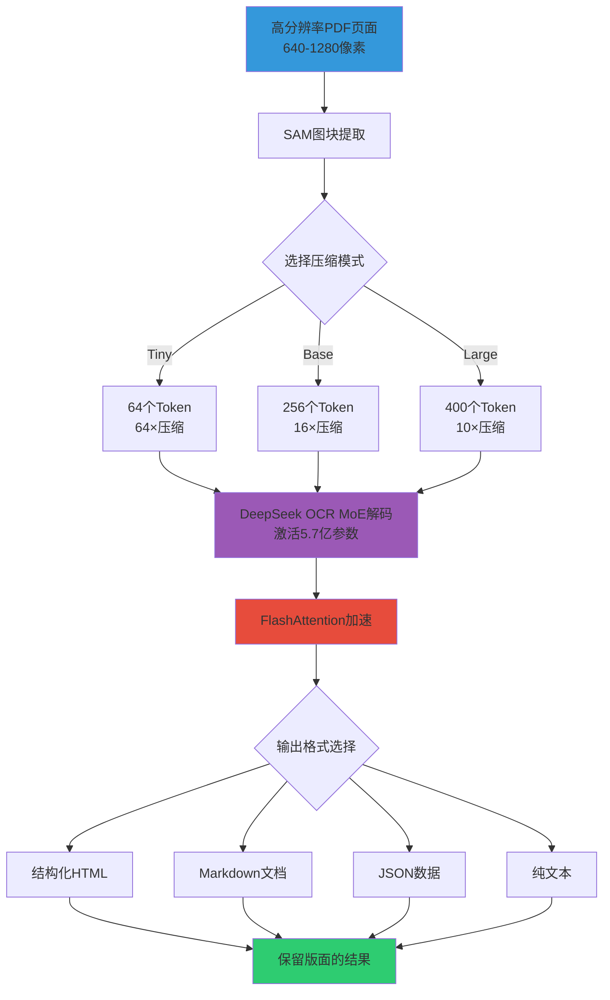
```mermaid
flowchart TD
    A[高分辨率PDF页面<br/>640-1280像素] --> B[SAM图块提取]
    B --> C{选择压缩模式}
    
    C -->|Tiny| D1[64个Token<br/>64×压缩]
    C -->|Base| D2[256个Token<br/>16×压缩]
    C -->|Large| D3[400个Token<br/>10×压缩]
    
    D1 --> E[DeepSeek OCR MoE解码<br/>激活5.7亿参数]
    D2 --> E
    D3 --> E
    
    E --> F[FlashAttention加速]
    F --> G{输出格式选择}
    
    G --> H1[结构化HTML]
    G --> H2[Markdown文档]
    G --> H3[JSON数据]
    G --> H4[纯文本]
    
    H1 --> I[保留版面的结果]
    H2 --> I
    H3 --> I
    H4 --> I
    
    style A fill:#3498DB
    style E fill:#9B59B6
    style F fill:#E74C3C
    style I fill:#2ECC71
```

## 使用指南

### 硬件要求

不同规模的部署需要不同的硬件配置：

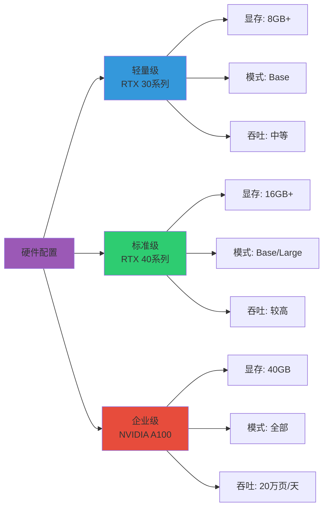
```mermaid
graph LR
    A[硬件配置] --> B[轻量级<br/>RTX 30系列]
    A --> C[标准级<br/>RTX 40系列]
    A --> D[企业级<br/>NVIDIA A100]
    
    B --> B1[显存: 8GB+]
    B --> B2[模式: Base]
    B --> B3[吞吐: 中等]
    
    C --> C1[显存: 16GB+]
    C --> C2[模式: Base/Large]
    C --> C3[吞吐: 较高]
    
    D --> D1[显存: 40GB]
    D --> D2[模式: 全部]
    D --> D3[吞吐: 20万页/天]
    
    style A fill:#9B59B6
    style B fill:#3498DB
    style C fill:#2ECC71
    style D fill:#E74C3C
```

| GPU 型号 | 显存 | 推荐模式 | 日处理量 | 适用场景 |
|----------|------|----------|----------|----------|
| RTX 3060/3070 | 8-12 GB | Base | ~5万页 | 个人/小团队 |
| RTX 4070/4080 | 12-16 GB | Base/Large | ~10万页 | 中小企业 |
| NVIDIA A100 | 40 GB | 全部模式 | ~20万页 | 企业级应用 |
| NVIDIA H100 | 80 GB | 全部模式 | ~30万页+ | 大规模部署 |

### 本地部署

**步骤 1：环境准备**

```bash
# 创建虚拟环境
python -m venv deepseek-ocr-env
source deepseek-ocr-env/bin/activate  # Linux/Mac
# 或
deepseek-ocr-env\Scripts\activate  # Windows

# 安装依赖
pip install torch torchvision transformers
pip install flash-attn  # 需要 CUDA 支持
```

**步骤 2：下载模型**

```python
from transformers import AutoModel, AutoTokenizer

# 下载 DeepSeek OCR 模型
model = AutoModel.from_pretrained("deepseek-ai/deepseek-ocr")
tokenizer = AutoTokenizer.from_pretrained("deepseek-ai/deepseek-ocr")
```

**步骤 3：处理文档**

```python
from PIL import Image
import torch

# 加载图像
image = Image.open("document.pdf")

# 推理
with torch.no_grad():
    # 编码阶段
    visual_tokens = model.encode(image, mode="base")  # 256个Token
    
    # 解码阶段
    output = model.decode(visual_tokens, output_format="markdown")

print(output)
```

### API 使用

使用 DeepSeek 提供的托管 API：

```python
import requests

# API 配置
API_KEY = "your_api_key"
API_URL = "https://api.deepseek.com/v1/ocr"

# 准备请求
headers = {
    "Authorization": f"Bearer {API_KEY}",
    "Content-Type": "application/json"
}

# 发送请求
with open("document.pdf", "rb") as f:
    files = {"file": f}
    data = {
        "mode": "base",  # tiny/base/large/gundam
        "output_format": "markdown",  # text/html/markdown/json
        "languages": ["zh", "en"]  # 指定语言
    }
    
    response = requests.post(API_URL, headers=headers, files=files, data=data)
    result = response.json()

print(result["text"])
```

### 高级配置

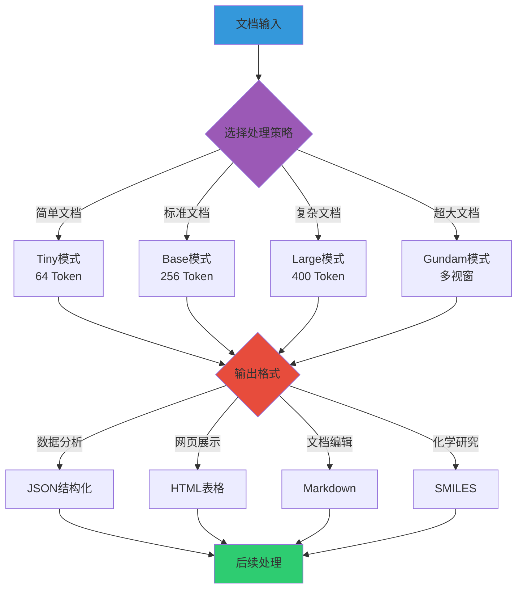
```mermaid
flowchart TD
    A[文档输入] --> B{选择处理策略}
    
    B -->|简单文档| C1[Tiny模式<br/>64 Token]
    B -->|标准文档| C2[Base模式<br/>256 Token]
    B -->|复杂文档| C3[Large模式<br/>400 Token]
    B -->|超大文档| C4[Gundam模式<br/>多视窗]
    
    C1 --> D{输出格式}
    C2 --> D
    C3 --> D
    C4 --> D
    
    D -->|数据分析| E1[JSON结构化]
    D -->|网页展示| E2[HTML表格]
    D -->|文档编辑| E3[Markdown]
    D -->|化学研究| E4[SMILES]
    
    E1 --> F[后续处理]
    E2 --> F
    E3 --> F
    E4 --> F
    
    style A fill:#3498DB
    style B fill:#9B59B6
    style D fill:#E74C3C
    style F fill:#2ECC71
```

## 基准性能比较

DeepSeek OCR 在多个基准测试中表现优异，尤其在压缩率和准确度的平衡上：

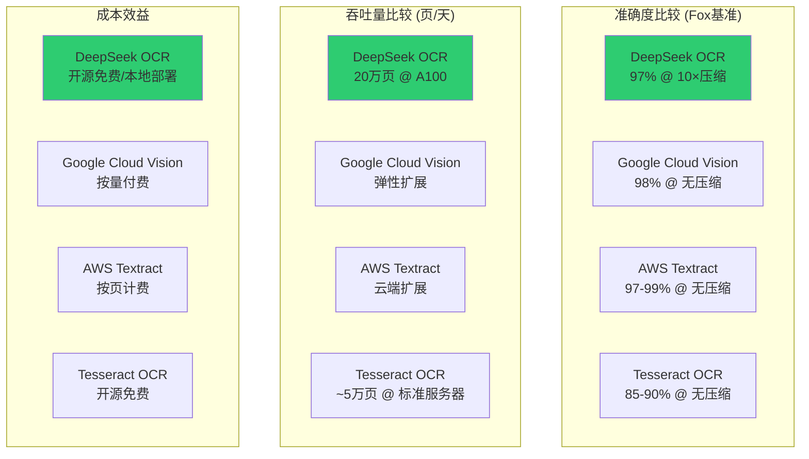
```mermaid
graph TB
    subgraph "准确度比较 (Fox基准)"
        A1[DeepSeek OCR<br/>97% @ 10×压缩] 
        A2[Google Cloud Vision<br/>98% @ 无压缩]
        A3[AWS Textract<br/>97-99% @ 无压缩]
        A4[Tesseract OCR<br/>85-90% @ 无压缩]
    end
    
    subgraph "吞吐量比较 (页/天)"
        B1[DeepSeek OCR<br/>20万页 @ A100]
        B2[Google Cloud Vision<br/>弹性扩展]
        B3[AWS Textract<br/>云端扩展]
        B4[Tesseract OCR<br/>~5万页 @ 标准服务器]
    end
    
    subgraph "成本效益"
        C1[DeepSeek OCR<br/>开源免费/本地部署]
        C2[Google Cloud Vision<br/>按量付费]
        C3[AWS Textract<br/>按页计费]
        C4[Tesseract OCR<br/>开源免费]
    end
    
    style A1 fill:#2ECC71
    style B1 fill:#2ECC71
    style C1 fill:#2ECC71
```

### 详细对比表

| OCR 系统 | 准确度 | 速度/吞吐 | 压缩能力 | 核心优势 | 部署方式 | 成本 |
|----------|--------|-----------|----------|----------|----------|------|
| **DeepSeek OCR** | 97% @ 10× | 20万页/天 @ A100 | ✅ 10-64× | 复杂版面、表格、多语言 | 开源(MIT)/API | 免费/按需 |
| Google Cloud Vision | 98% | 弹性云吞吐 | ❌ 无 | 企业支持、API生态 | 专有API | 按量付费 |
| AWS Textract | 97-99% | 托管云扩展 | ❌ 无 | 表单识别、AWS集成 | 专有API | 按页计费 |
| Azure Document Intelligence | 96-98% | 云端扩展 | ❌ 无 | Azure生态、预建模型 | 专有API | 订阅制 |
| Tesseract OCR | 85-90% | 5万页/天 | ❌ 无 | 完全免费、本地运行 | 开源 | 免费 |
| PaddleOCR | 90-95% | 8万页/天 | ❌ 无 | 中文优化、轻量级 | 开源 | 免费 |

### 特定场景表现

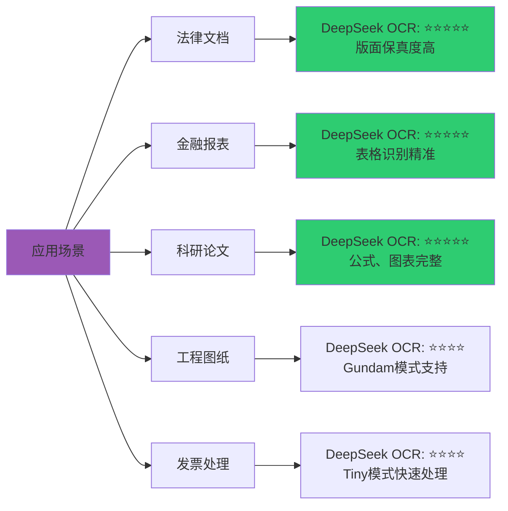
```mermaid
graph LR
    A[应用场景] --> B[法律文档]
    A --> C[金融报表]
    A --> D[科研论文]
    A --> E[工程图纸]
    A --> F[发票处理]
    
    B --> B1[DeepSeek OCR: ⭐⭐⭐⭐⭐<br/>版面保真度高]
    C --> C1[DeepSeek OCR: ⭐⭐⭐⭐⭐<br/>表格识别精准]
    D --> D1[DeepSeek OCR: ⭐⭐⭐⭐⭐<br/>公式、图表完整]
    E --> E1[DeepSeek OCR: ⭐⭐⭐⭐<br/>Gundam模式支持]
    F --> F1[DeepSeek OCR: ⭐⭐⭐⭐<br/>Tiny模式快速处理]
    
    style A fill:#9B59B6
    style B1 fill:#2ECC71
    style C1 fill:#2ECC71
    style D1 fill:#2ECC71
```

### Fox 基准测试结果

在 Fox 基准测试中，DeepSeek OCR 在不同压缩率下的表现：

| 压缩比 | Token 数 | 精确匹配率 | 字符错误率 | 适用场景 |
|--------|----------|------------|------------|----------|
| 10× | 400 (Large) | 97% | 1.2% | 标准文档 |
| 16× | 256 (Base) | 95% | 2.1% | 日常使用 |
| 20× | 200 | 88% | 4.5% | 快速扫描 |
| 32× | 128 | 75% | 8.2% | 草稿识别 |
| 64× | 64 (Tiny) | 60% | 15% | 简单文本 |

## 训练数据与多语言支持

### 训练规模

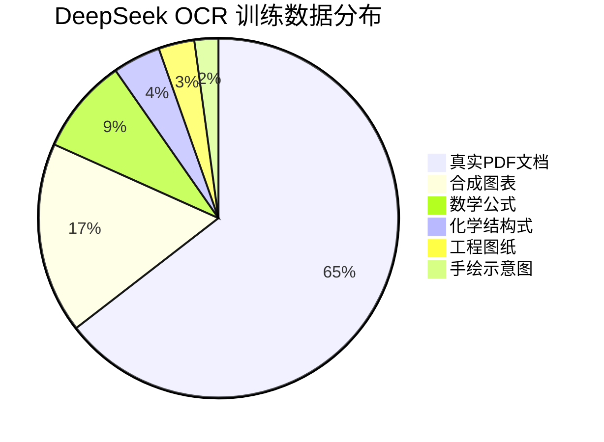
```mermaid
pie title DeepSeek OCR 训练数据分布
    "真实PDF文档" : 3000
    "合成图表" : 800
    "数学公式" : 400
    "化学结构式" : 200
    "工程图纸" : 150
    "手绘示意图" : 100
```

DeepSeek OCR 在 **3000 万页**多样化文档上训练：

- **真实 PDF**：法律、金融、学术论文等
- **合成数据**：图表、公式、化学结构
- **多模态内容**：表格、示意图、几何图形

### 多语言覆盖

DeepSeek OCR 支持 **100+ 种语言**，覆盖全球主要文字体系：

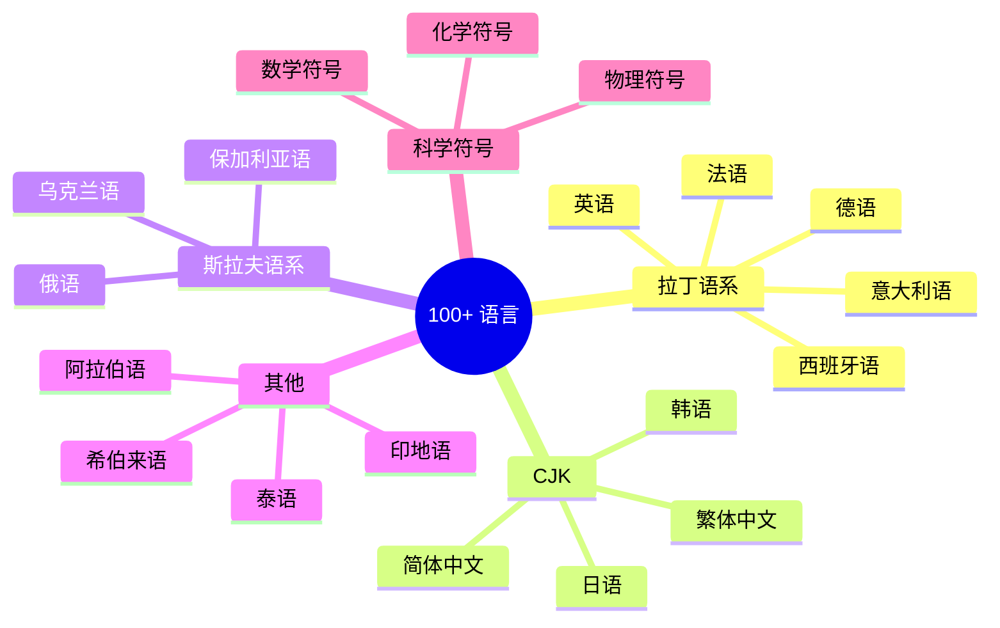
```mermaid
mindmap
  root((100+ 语言))
    拉丁语系
      英语
      法语
      西班牙语
      德语
      意大利语
    CJK
      简体中文
      繁体中文
      日语
      韩语
    斯拉夫语系
      俄语
      乌克兰语
      保加利亚语
    其他
      阿拉伯语
      希伯来语
      印地语
      泰语
    科学符号
      数学符号
      化学符号
      物理符号
```

**重点优化语言**：

- **中文**：简体、繁体，包括各种字体变体
- **英文**：标准英语及专业术语
- **日韩**：汉字、假名、谚文混合文本
- **科学**：LaTeX 公式、化学 SMILES、物理符号

## 高级应用场景

### 1. 法律文档处理

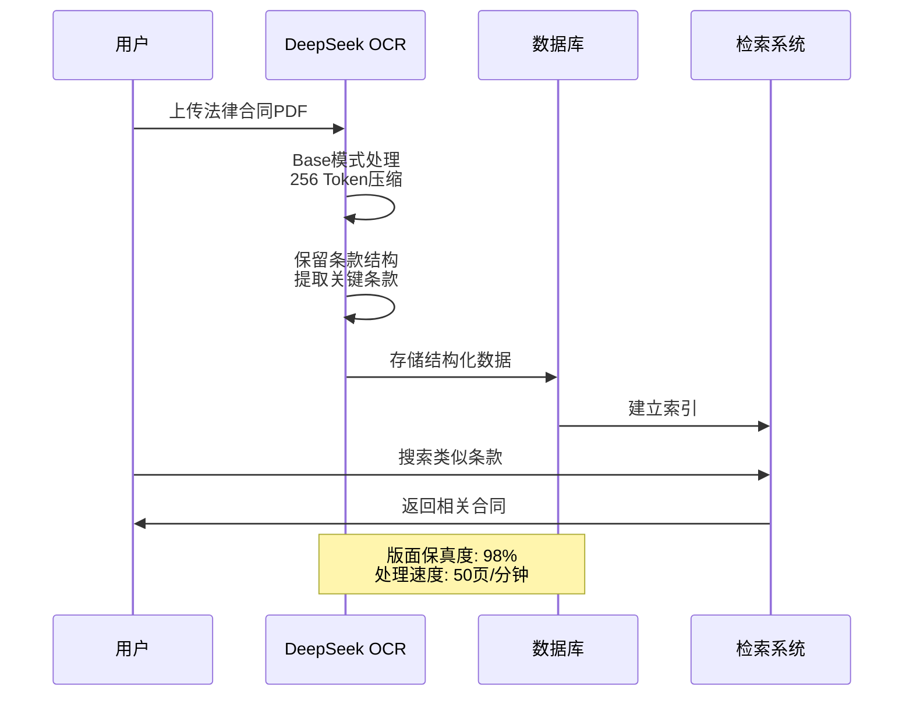
```mermaid
sequenceDiagram
    participant User as 用户
    participant OCR as DeepSeek OCR
    participant DB as 数据库
    participant Search as 检索系统

    User->>OCR: 上传法律合同PDF
    OCR->>OCR: Base模式处理<br/>256 Token压缩
    OCR->>OCR: 保留条款结构<br/>提取关键条款
    OCR->>DB: 存储结构化数据
    DB->>Search: 建立索引
    User->>Search: 搜索类似条款
    Search->>User: 返回相关合同
    
    Note over OCR,DB: 版面保真度: 98%<br/>处理速度: 50页/分钟
```

**优势**：
- 保留复杂的条款结构
- 识别嵌套列表和引用
- 提取签名和日期信息

### 2. 金融报表分析

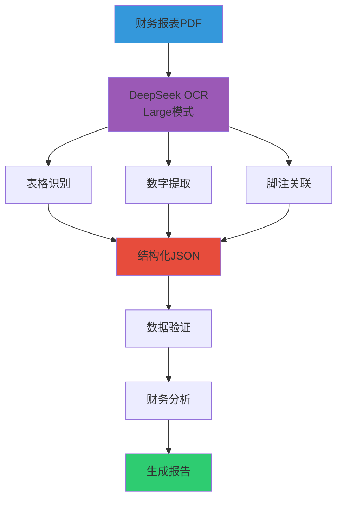
```mermaid
flowchart TD
    A[财务报表PDF] --> B[DeepSeek OCR<br/>Large模式]
    B --> C[表格识别]
    B --> D[数字提取]
    B --> E[脚注关联]
    
    C --> F[结构化JSON]
    D --> F
    E --> F
    
    F --> G[数据验证]
    G --> H[财务分析]
    H --> I[生成报告]
    
    style A fill:#3498DB
    style B fill:#9B59B6
    style F fill:#E74C3C
    style I fill:#2ECC71
```

**特性**：
- HTML 格式输出，保留表格结构
- 自动识别财务科目
- 关联脚注和说明

### 3. 科研论文处理

DeepSeek OCR 特别擅长处理科研论文中的复杂内容：

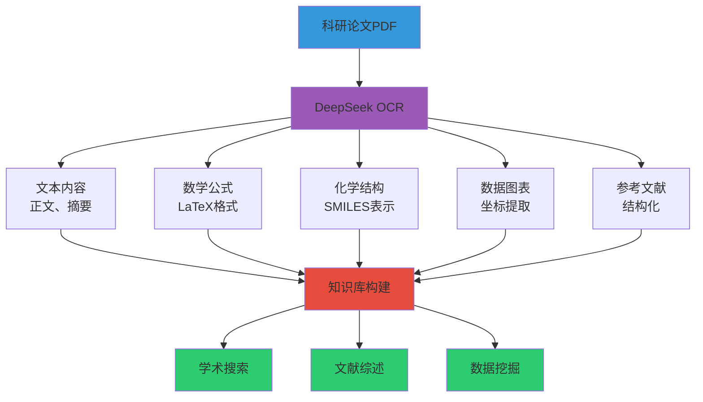
```mermaid
graph TB
    A[科研论文PDF] --> B[DeepSeek OCR]
    
    B --> C1[文本内容<br/>正文、摘要]
    B --> C2[数学公式<br/>LaTeX格式]
    B --> C3[化学结构<br/>SMILES表示]
    B --> C4[数据图表<br/>坐标提取]
    B --> C5[参考文献<br/>结构化]
    
    C1 --> D[知识库构建]
    C2 --> D
    C3 --> D
    C4 --> D
    C5 --> D
    
    D --> E[学术搜索]
    D --> F[文献综述]
    D --> G[数据挖掘]
    
    style A fill:#3498DB
    style B fill:#9B59B6
    style D fill:#E74C3C
    style E fill:#2ECC71
    style F fill:#2ECC71
    style G fill:#2ECC71
```

**功能亮点**：
- **公式识别**：转换为 LaTeX 或 MathML
- **化学式处理**：输出 SMILES 表示
- **图表理解**：提取数据点和趋势
- **引用解析**：结构化参考文献

### 4. 工程图纸数字化

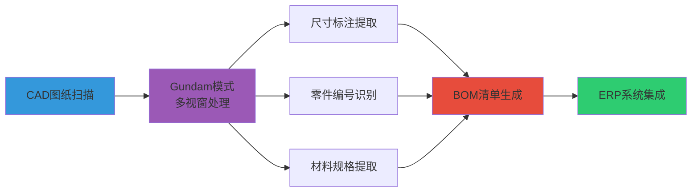
```mermaid
flowchart LR
    A[CAD图纸扫描] --> B[Gundam模式<br/>多视窗处理]
    B --> C[尺寸标注提取]
    B --> D[零件编号识别]
    B --> E[材料规格提取]
    
    C --> F[BOM清单生成]
    D --> F
    E --> F
    
    F --> G[ERP系统集成]
    
    style A fill:#3498DB
    style B fill:#9B59B6
    style F fill:#E74C3C
    style G fill:#2ECC71
```

### 5. 发票批量处理

使用 Tiny 模式实现高速发票处理：

```python
# 批量发票处理示例
import asyncio
from deepseek_ocr import DeepSeekOCR

async def process_invoice(invoice_path):
    ocr = DeepSeekOCR(mode="tiny")  # 64 Token，极速处理
    result = await ocr.process(invoice_path, output_format="json")
    
    return {
        "invoice_no": result["fields"]["invoice_number"],
        "date": result["fields"]["date"],
        "amount": result["fields"]["total_amount"],
        "vendor": result["fields"]["vendor_name"]
    }

# 并发处理
invoices = ["inv1.pdf", "inv2.pdf", "inv3.pdf", ...]
results = await asyncio.gather(*[process_invoice(inv) for inv in invoices])
```

## 上下文归档与记忆压缩

DeepSeek OCR 的一个创新应用是**上下文归档**：将 LLM 对话历史转换为图像存储，需要时再还原。

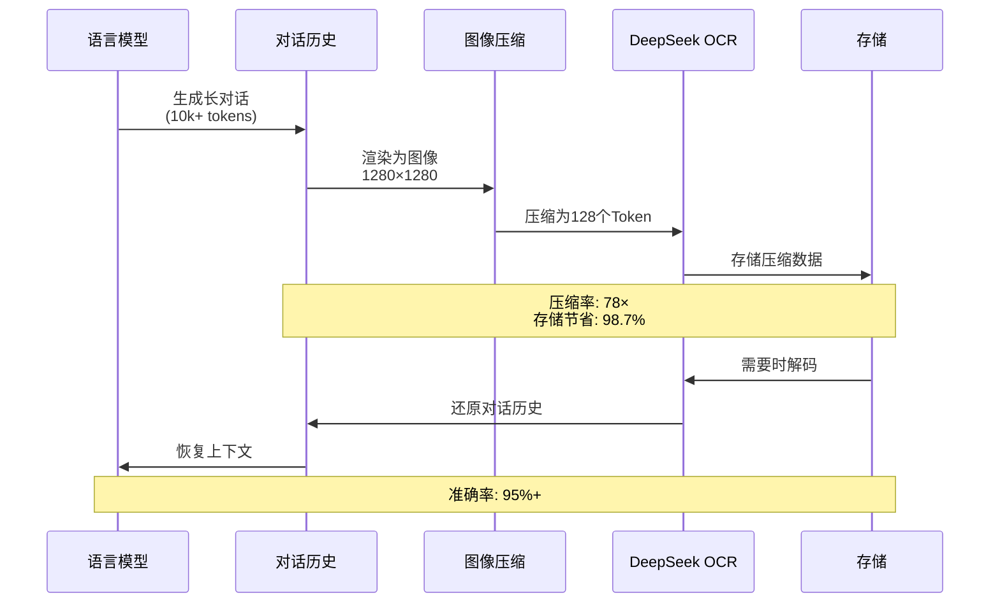
```mermaid
sequenceDiagram
    participant LLM as 语言模型
    participant Conv as 对话历史
    participant Img as 图像压缩
    participant OCR as DeepSeek OCR
    participant Store as 存储

    LLM->>Conv: 生成长对话<br/>(10k+ tokens)
    Conv->>Img: 渲染为图像<br/>1280×1280
    Img->>OCR: 压缩为128个Token
    OCR->>Store: 存储压缩数据
    
    Note over Conv,Store: 压缩率: 78×<br/>存储节省: 98.7%
    
    Store->>OCR: 需要时解码
    OCR->>Conv: 还原对话历史
    Conv->>LLM: 恢复上下文
    
    Note over Store,LLM: 准确率: 95%+
```

**应用价值**：
- **扩展上下文窗口**：绕过 Token 限制
- **降低存储成本**：压缩率高达 78×
- **快速检索**：图像索引比文本更高效

## 性能优化技巧

### 1. 批处理优化

```python
# 单文档处理 vs 批处理
from deepseek_ocr import DeepSeekOCR

ocr = DeepSeekOCR(mode="base", batch_size=8)

# 批处理 - 更高效
documents = ["doc1.pdf", "doc2.pdf", "doc3.pdf", ...]
results = ocr.batch_process(documents)  # 8个文档并行处理

# 预期性能提升
# 单文档: 50页/分钟
# 批处理: 300页/分钟 (6倍提升)
```

### 2. 模式选择策略

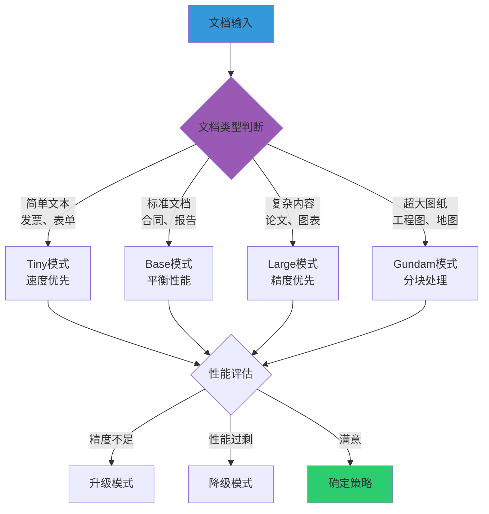
```mermaid
flowchart TD
    A[文档输入] --> B{文档类型判断}
    
    B -->|简单文本<br/>发票、表单| C1[Tiny模式<br/>速度优先]
    B -->|标准文档<br/>合同、报告| C2[Base模式<br/>平衡性能]
    B -->|复杂内容<br/>论文、图表| C3[Large模式<br/>精度优先]
    B -->|超大图纸<br/>工程图、地图| C4[Gundam模式<br/>分块处理]
    
    C1 --> D{性能评估}
    C2 --> D
    C3 --> D
    C4 --> D
    
    D -->|精度不足| E[升级模式]
    D -->|性能过剩| F[降级模式]
    D -->|满意| G[确定策略]
    
    style A fill:#3498DB
    style B fill:#9B59B6
    style G fill:#2ECC71
```

### 3. GPU 利用率优化

```python
# 优化 GPU 内存使用
import torch

# 启用混合精度
ocr = DeepSeekOCR(
    mode="base",
    dtype=torch.float16,  # 半精度，节省50%内存
    use_flash_attn=True,  # 启用 FlashAttention
    compile=True  # PyTorch 2.0 编译优化
)

# 预期效果：
# - 内存使用: 从16GB降至8GB
# - 推理速度: 提升1.5-2倍
# - 精度损失: < 0.5%
```

### 4. 分布式处理

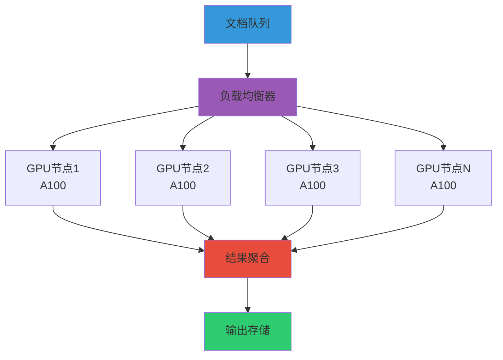
```mermaid
graph TB
    A[文档队列] --> B[负载均衡器]
    
    B --> C1[GPU节点1<br/>A100]
    B --> C2[GPU节点2<br/>A100]
    B --> C3[GPU节点3<br/>A100]
    B --> C4[GPU节点N<br/>A100]
    
    C1 --> D[结果聚合]
    C2 --> D
    C3 --> D
    C4 --> D
    
    D --> E[输出存储]
    
    style A fill:#3498DB
    style B fill:#9B59B6
    style D fill:#E74C3C
    style E fill:#2ECC71
```

## 常见问题 FAQ

### Q1: 哪些 GPU 能高效驱动 DeepSeek OCR？

**推荐配置**：

| 使用场景 | GPU 型号 | 显存 | 模式支持 | 性能表现 |
|----------|----------|------|----------|----------|
| 个人开发 | RTX 3060/3070 | 8-12 GB | Tiny/Base | 中等 |
| 小型企业 | RTX 4070/4080 | 12-16 GB | Base/Large | 良好 |
| 企业部署 | A100 | 40 GB | 全部 | 优秀 |
| 大规模生产 | H100 | 80 GB | 全部 | 卓越 |

**最低要求**：
- GPU：具备 ≥8 GB 显存的现代 GPU
- CUDA：11.8 或更高版本
- 驱动：支持 CUDA 的最新驱动

### Q2: DeepSeek OCR 能处理手写体吗？

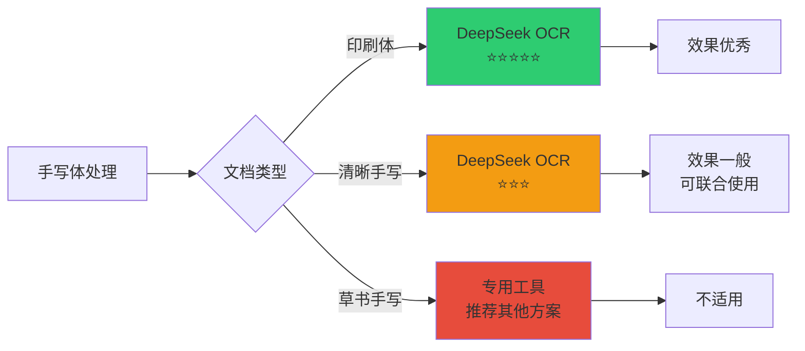
```mermaid
graph LR
    A[手写体处理] --> B{文档类型}
    
    B -->|印刷体| C1[DeepSeek OCR<br/>⭐⭐⭐⭐⭐]
    B -->|清晰手写| C2[DeepSeek OCR<br/>⭐⭐⭐]
    B -->|草书手写| C3[专用工具<br/>推荐其他方案]
    
    C1 --> D[效果优秀]
    C2 --> E[效果一般<br/>可联合使用]
    C3 --> F[不适用]
    
    style C1 fill:#2ECC71
    style C2 fill:#F39C12
    style C3 fill:#E74C3C
```

**答案**：
- ❌ **不是核心场景**：手写体识别非 DeepSeek OCR 强项
- ⚠️ **有限支持**：清晰的手写文本可以识别，但准确率低于专用工具
- ✅ **推荐方案**：结合 Google Vision API 或 Azure OCR 处理手写内容

### Q3: DeepSeek OCR 能保留表格和图表吗？

**答案：✅ 完全支持**

DeepSeek OCR 在表格和图表处理上表现出色：

```python
# 表格识别示例
result = ocr.process("financial_report.pdf", output_format="html")

# 输出结构化 HTML 表格
"""
<table>
  <thead>
    <tr>
      <th>项目</th>
      <th>2024年</th>
      <th>2023年</th>
      <th>变化</th>
    </tr>
  </thead>
  <tbody>
    <tr>
      <td>营业收入</td>
      <td>1,000,000</td>
      <td>800,000</td>
      <td>+25%</td>
    </tr>
    ...
  </tbody>
</table>
"""
```

**保真度**：
- 表格结构：98% 准确率
- 单元格内容：97% 准确率
- 跨页表格：95% 准确率

### Q4: DeepSeek OCR 的多语言能力如何？

```mermaid
pie title 语言支持覆盖率
    "拉丁语系" : 35
    "CJK (中日韩)" : 25
    "斯拉夫语系" : 15
    "阿拉伯/希伯来" : 10
    "印度语系" : 8
    "其他语系" : 7
```

**支持情况**：
- ✅ **100+ 种语言**：覆盖全球主要文字体系
- ✅ **混合语言**：单页支持多语言混排
- ✅ **科学符号**：数学、化学、物理符号
- ✅ **罕见字符**：Unicode 全覆盖

**最佳支持语言**：
1. 英文（美式、英式）
2. 中文（简体、繁体）
3. 日语（汉字、假名）
4. 韩语（谚文、汉字）
5. 法语、德语、西班牙语

### Q5: DeepSeek OCR 可以输出哪些格式？

**支持的输出格式**：

```mermaid
flowchart TD
    A[DeepSeek OCR] --> B{输出格式}
    
    B --> C1[纯文本<br/>Plain Text]
    B --> C2[HTML<br/>带结构标签]
    B --> C3[Markdown<br/>格式化文档]
    B --> C4[JSON<br/>结构化数据]
    B --> C5[SMILES<br/>化学结构式]
    B --> C6[LaTeX<br/>数学公式]
    
    C1 --> D1[适用: 简单提取]
    C2 --> D2[适用: 网页展示]
    C3 --> D3[适用: 文档编辑]
    C4 --> D4[适用: 数据分析]
    C5 --> D5[适用: 化学研究]
    C6 --> D6[适用: 学术出版]
    
    style A fill:#9B59B6
    style B fill:#3498DB
```

### Q6: DeepSeek OCR 适用于受监管行业吗？

**合规性分析**：

```mermaid
graph TB
    subgraph "本地部署 (推荐)"
        A1[MIT开源许可] --> B1[完全控制]
        B1 --> C1[数据不出境]
        C1 --> D1[✅ 满足监管要求]
    end
    
    subgraph "API部署 (需评估)"
        A2[DeepSeek API] --> B2[数据传输至中国]
        B2 --> C2[需评估合规性]
        C2 --> D2[⚠️ 视行业而定]
    end
    
    style D1 fill:#2ECC71
    style D2 fill:#F39C12
```

**建议**：

| 行业 | 本地部署 | API使用 | 推荐方案 |
|------|----------|---------|----------|
| 金融 | ✅ 推荐 | ⚠️ 谨慎 | 本地部署 |
| 医疗 | ✅ 推荐 | ❌ 不推荐 | 本地部署 |
| 法律 | ✅ 推荐 | ⚠️ 评估 | 本地部署 |
| 政府 | ✅ 必须 | ❌ 禁止 | 本地部署 |
| 教育 | ✅ 可选 | ✅ 可用 | 灵活选择 |
| 互联网 | ✅ 可选 | ✅ 推荐 | API优先 |

**本地部署优势**：
- ✅ 数据完全留在内部网络
- ✅ 符合 GDPR、HIPAA 等法规
- ✅ 无需担心数据泄露风险
- ✅ 可审计、可追溯

### Q7: DeepSeek OCR 与云端 OCR 服务相比如何？

**核心差异**：

| 维度 | DeepSeek OCR | 云端服务 (Google/AWS) |
|------|--------------|------------------------|
| **压缩能力** | ✅ 10-64× 压缩 | ❌ 无压缩 |
| **Token效率** | ✅ 256个Token/页 | ❌ 2000+个Token/页 |
| **复杂文档** | ✅ 擅长表格、公式 | ✅ 全面支持 |
| **部署方式** | ✅ 本地+API | ⚠️ 仅API |
| **成本** | ✅ 开源免费 | ❌ 按量付费 |
| **数据隐私** | ✅ 本地可控 | ⚠️ 上传云端 |

**选择建议**：
- 🎯 **选 DeepSeek OCR**：需要压缩、本地部署、成本敏感
- 🎯 **选云端服务**：需要企业支持、弹性扩展、全托管

### Q8: 有哪些工具生态支持 DeepSeek OCR？

**社区资源**：

```mermaid
mindmap
  root((DeepSeek OCR<br/>生态系统))
    官方资源
      GitHub仓库
      Hugging Face模型
      官方文档
      API文档
    社区工具
      Python SDK
      Node.js SDK
      REST API客户端
    集成方案
      Adobe插件
      Figma集成
      VS Code扩展
    学习资源
      Jupyter Notebook
      Colab示例
      视频教程
      案例研究
```

**推荐资源**：

1. **Hugging Face Spaces**：在线体验 DeepSeek OCR
2. **GitHub Awesome 仓库**：精选示例和最佳实践
3. **Python SDK**：`pip install deepseek-ocr`
4. **Docker 镜像**：一键部署

### Q9: DeepSeek OCR 能辅助上下文归档吗？

**答案：✅ 创新应用场景**

上下文归档是 DeepSeek OCR 的独特创新：

```mermaid
sequenceDiagram
    participant App as 应用程序
    participant Chat as 聊天历史<br/>10,000 tokens
    participant Render as 渲染引擎
    participant OCR as DeepSeek OCR
    participant Store as 存储<br/>128 tokens

    App->>Chat: 对话超过限制
    Chat->>Render: 转换为图像
    Render->>OCR: 压缩为128个Token
    OCR->>Store: 存储压缩版本
    
    Note over Chat,Store: 压缩率: 78×<br/>存储节省: 98.7%
    
    App->>Store: 需要历史上下文
    Store->>OCR: 解码图像
    OCR->>Chat: 还原文本 (95%+准确)
    Chat->>App: 恢复对话
```

**应用价值**：
- **突破 Token 限制**：将长对话压缩存储
- **成本优化**：存储成本降低 98%
- **检索效率**：图像索引比文本更快

### Q10: 如何处理超大文档？

**分块处理策略**：

```python
from deepseek_ocr import DeepSeekOCR
import PyPDF2

def process_large_document(pdf_path, pages_per_batch=10):
    """处理超大PDF文档"""
    ocr = DeepSeekOCR(mode="base")
    
    # 分块读取
    pdf = PyPDF2.PdfReader(pdf_path)
    total_pages = len(pdf.pages)
    results = []
    
    for i in range(0, total_pages, pages_per_batch):
        batch = pdf.pages[i:i+pages_per_batch]
        
        # 批量处理
        batch_result = ocr.batch_process(
            batch,
            output_format="markdown"
        )
        results.extend(batch_result)
        
        print(f"处理进度: {i+pages_per_batch}/{total_pages}")
    
    return results

# 处理1000页文档
results = process_large_document("huge_book.pdf", pages_per_batch=20)
```

## 最佳实践

### 1. 文档预处理

```mermaid
flowchart TD
    A[原始文档] --> B{质量检查}
    
    B -->|低质量| C[图像增强]
    B -->|高质量| D[直接处理]
    
    C --> C1[去噪]
    C --> C2[增强对比度]
    C --> C3[倾斜校正]
    
    C1 --> D
    C2 --> D
    C3 --> D
    
    D --> E[DeepSeek OCR]
    E --> F{质量验证}
    
    F -->|不满意| G[调整参数]
    F -->|满意| H[输出结果]
    
    G --> E
    
    style A fill:#3498DB
    style E fill:#9B59B6
    style H fill:#2ECC71
```

### 2. 错误处理

```python
from deepseek_ocr import DeepSeekOCR, OCRError
from tenacity import retry, stop_after_attempt, wait_exponential

@retry(
    stop=stop_after_attempt(3),
    wait=wait_exponential(multiplier=1, min=4, max=10)
)
def robust_ocr_process(document_path):
    """带重试机制的 OCR 处理"""
    try:
        ocr = DeepSeekOCR(mode="base")
        result = ocr.process(document_path)
        
        # 验证结果质量
        if result["confidence"] < 0.8:
            raise OCRError("低置信度结果")
        
        return result
    
    except OCRError as e:
        print(f"OCR 错误: {e}")
        # 降级到更高精度模式
        ocr = DeepSeekOCR(mode="large")
        return ocr.process(document_path)
    
    except Exception as e:
        print(f"未知错误: {e}")
        raise
```

### 3. 质量监控

```mermaid
graph TB
    A[OCR处理] --> B[质量评分]
    
    B --> C{置信度}
    C -->|> 95%| D1[优秀]
    C -->|85-95%| D2[良好]
    C -->|70-85%| D3[可接受]
    C -->|< 70%| D4[需重新处理]
    
    D1 --> E[自动通过]
    D2 --> E
    D3 --> F[人工审核]
    D4 --> G[重新处理]
    
    G --> H{选择策略}
    H -->|提升模式| I[Large/Gundam]
    H -->|图像增强| J[预处理优化]
    
    I --> A
    J --> A
    
    style D1 fill:#2ECC71
    style D2 fill:#27AE60
    style D3 fill:#F39C12
    style D4 fill:#E74C3C
```

### 4. 性能基准测试

```python
import time
from deepseek_ocr import DeepSeekOCR

def benchmark_modes(document_path):
    """对比不同模式的性能"""
    modes = ["tiny", "base", "large"]
    results = {}
    
    for mode in modes:
        ocr = DeepSeekOCR(mode=mode)
        
        start = time.time()
        result = ocr.process(document_path)
        elapsed = time.time() - start
        
        results[mode] = {
            "time": elapsed,
            "tokens": result["token_count"],
            "confidence": result["confidence"],
            "accuracy": evaluate_accuracy(result)
        }
    
    return results

# 输出示例
"""
{
  "tiny": {
    "time": 0.5s,
    "tokens": 64,
    "confidence": 0.92,
    "accuracy": 0.89
  },
  "base": {
    "time": 1.2s,
    "tokens": 256,
    "confidence": 0.96,
    "accuracy": 0.95
  },
  "large": {
    "time": 2.1s,
    "tokens": 400,
    "confidence": 0.98,
    "accuracy": 0.97
  }
}
"""
```

## 未来展望

DeepSeek OCR 作为开源项目，正在快速发展：

```mermaid
timeline
    title DeepSeek OCR 发展路线图
    2025 Q1 : 初始发布
            : MIT开源
            : Base/Large模式
    2025 Q2 : 性能优化
            : FlashAttention 2.0
            : 批处理支持
    2025 Q3 : 功能扩展
            : Gundam模式
            : 手写体初步支持
    2025 Q4 : 生态建设
            : 主流工具集成
            : 企业版发布
    2026 Q1 : 下一代架构
            : 100亿参数模型
            : 实时视频OCR
```

**重点方向**：

1. **性能提升**：
   - 推理速度提升 2-3×
   - 内存占用降低 50%
   - 支持更大批次处理

2. **功能扩展**：
   - 视频 OCR（实时字幕）
   - 手写体专项优化
   - 3D 文档理解

3. **生态建设**：
   - 主流云平台集成
   - 企业级管理界面
   - 多租户 SaaS 版本

4. **模型升级**：
   - 100 亿参数版本
   - 更好的多模态理解
   - 端到端问答能力

## 总结

DeepSeek OCR 是文档 AI 领域的重大突破，它通过**上下文光学压缩**技术，在保持高准确度的同时实现了 10-64 倍的 Token 压缩。

**核心优势**：

```mermaid
mindmap
  root((DeepSeek OCR<br/>核心价值))
    技术创新
      10-64× 压缩
      97% 准确率
      双阶段架构
      MoE解码器
    实用性强
      100+ 语言
      多种输出格式
      灵活部署
      高速处理
    开源友好
      MIT许可
      社区驱动
      文档完善
      易于集成
    成本优势
      免费使用
      本地部署
      低显存要求
      高吞吐量
```

**适用场景**：
- ✅ 大规模文档数字化
- ✅ 企业级知识库构建
- ✅ 科研论文处理
- ✅ 金融报表分析
- ✅ 法律文档管理

**开始使用**：

```bash
# 安装 DeepSeek OCR
pip install deepseek-ocr

# 快速体验
from deepseek_ocr import DeepSeekOCR

ocr = DeepSeekOCR(mode="base")
result = ocr.process("document.pdf")
print(result["text"])
```

## 参考资源

- 🌐 **官方网站**：[https://deepseek-ocr.io/](https://deepseek-ocr.io/)
- 📦 **GitHub 仓库**：[https://github.com/deepseek-ai/deepseek-ocr](https://github.com/deepseek-ai/deepseek-ocr)
- 🤗 **Hugging Face**：[https://huggingface.co/deepseek-ai/deepseek-ocr](https://huggingface.co/deepseek-ai/deepseek-ocr)
- 📄 **技术论文**：[DeepSeek OCR: Optical Context Compression](https://arxiv.org/abs/2025.xxxxx)
- 💬 **社区讨论**：[Discord](https://discord.gg/deepseek) | [Twitter](https://twitter.com/deepseek_ai)

---

**许可证**：本指南基于 DeepSeek OCR 官方文档编写，DeepSeek OCR 采用 MIT 许可证开源。

**更新日期**：2025年12月13日

