## 什么是智能体设计模式？

智能体设计模式(Agentic Design Patterns)是构建高效、可靠AI Agent系统的一系列经过验证的架构模式和最佳实践。这些模式帮助开发者创建能够自主决策、使用工具、规划任务并与其他智能体协作的AI系统。

### 核心价值

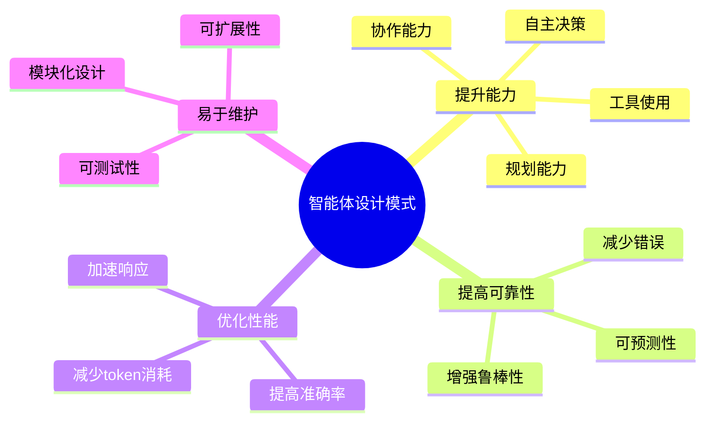
```mermaid
mindmap
  root((智能体设计模式))
    提升能力
      自主决策
      工具使用
      规划能力
      协作能力
    提高可靠性
      减少错误
      增强鲁棒性
      可预测性
    优化性能
      减少token消耗
      提高准确率
      加速响应
    易于维护
      模块化设计
      可测试性
      可扩展性
```

### 四大核心模式

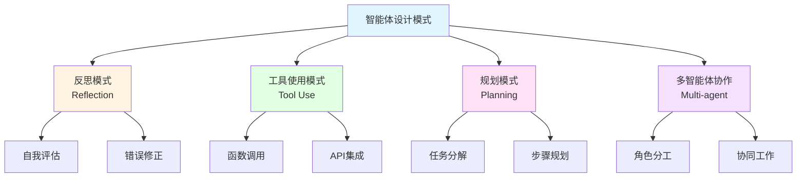
```mermaid
graph TB
    A[智能体设计模式] --> B[反思模式<br/>Reflection]
    A --> C[工具使用模式<br/>Tool Use]
    A --> D[规划模式<br/>Planning]
    A --> E[多智能体协作<br/>Multi-agent]
    
    B --> B1[自我评估]
    B --> B2[错误修正]
    
    C --> C1[函数调用]
    C --> C2[API集成]
    
    D --> D1[任务分解]
    D --> D2[步骤规划]
    
    E --> E1[角色分工]
    E --> E2[协同工作]
    
    style A fill:#e1f5ff
    style B fill:#fff4e1
    style C fill:#e1ffe1
    style D fill:#ffe1f5
    style E fill:#f5e1ff
```

## 模式一：反思模式 (Reflection Pattern)

### 模式概述

反思模式允许AI Agent评估自己的输出质量,发现错误并进行自我改进。这是提高Agent输出质量的关键模式。

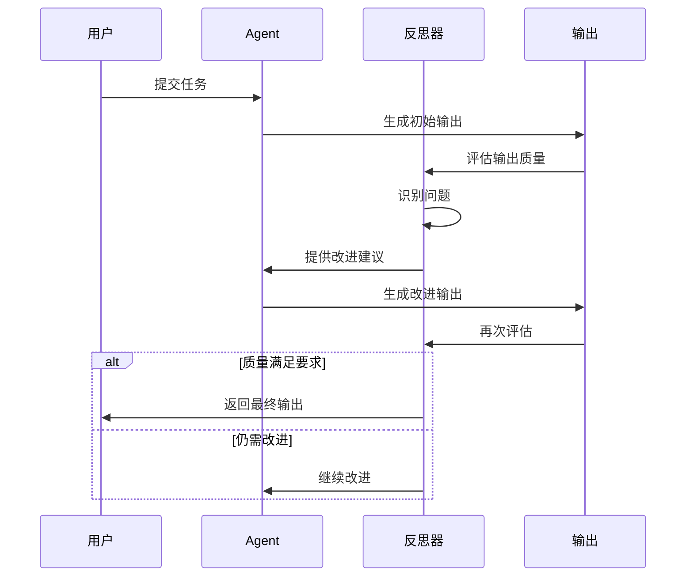
```mermaid
sequenceDiagram
    participant U as 用户
    participant A as Agent
    participant R as 反思器
    participant O as 输出
    
    U->>A: 提交任务
    A->>O: 生成初始输出
    O->>R: 评估输出质量
    R->>R: 识别问题
    R->>A: 提供改进建议
    A->>O: 生成改进输出
    O->>R: 再次评估
    alt 质量满足要求
        R->>U: 返回最终输出
    else 仍需改进
        R->>A: 继续改进
    end
```

### 工作原理

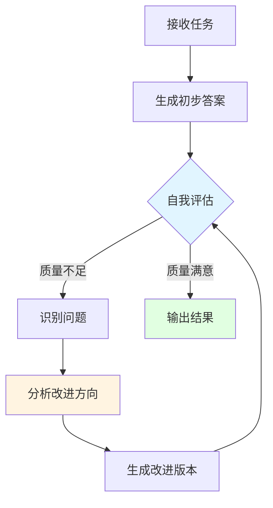
```mermaid
flowchart TD
    A[接收任务] --> B[生成初步答案]
    B --> C{自我评估}
    C -->|质量不足| D[识别问题]
    C -->|质量满意| E[输出结果]
    D --> F[分析改进方向]
    F --> G[生成改进版本]
    G --> C
    
    style C fill:#e1f5ff
    style F fill:#fff4e1
    style E fill:#e1ffe1
```

### 实现示例

**Python实现**：

```python
class ReflectionAgent:
    """反思模式Agent实现"""
    
    def __init__(self, llm):
        self.llm = llm
        self.max_iterations = 3
    
    def generate(self, task):
        """生成初始输出"""
        prompt = f"请完成以下任务：{task}"
        return self.llm.generate(prompt)
    
    def reflect(self, output, task):
        """反思输出质量"""
        reflection_prompt = f"""
        任务：{task}
        当前输出：{output}
        
        请评估这个输出的质量,指出存在的问题和改进方向。
        从以下维度评估：
        1. 准确性：信息是否准确？
        2. 完整性：是否遗漏重要内容？
        3. 清晰性：表达是否清晰？
        4. 相关性：是否切题？
        
        返回格式：
        {{
            "quality_score": 0-10,
            "issues": ["问题1", "问题2"],
            "suggestions": ["建议1", "建议2"]
        }}
        """
        return self.llm.generate(reflection_prompt)
    
    def improve(self, output, reflection, task):
        """基于反思改进输出"""
        improve_prompt = f"""
        原任务：{task}
        当前输出：{output}
        反思意见：{reflection}
        
        请根据反思意见改进输出,解决发现的问题。
        """
        return self.llm.generate(improve_prompt)
    
    def run(self, task):
        """执行完整的反思循环"""
        output = self.generate(task)
        
        for iteration in range(self.max_iterations):
            reflection = self.reflect(output, task)
            
            # 解析质量评分
            quality = self._parse_quality(reflection)
            
            if quality >= 8:
                print(f"质量满足要求(得分: {quality})")
                break
            
            print(f"迭代 {iteration + 1}: 质量得分 {quality}, 继续改进...")
            output = self.improve(output, reflection, task)
        
        return output
    
    def _parse_quality(self, reflection):
        """解析质量评分"""
        # 简化实现,实际应解析JSON
        import json
        try:
            data = json.loads(reflection)
            return data.get('quality_score', 0)
        except:
            return 0

# 使用示例
agent = ReflectionAgent(llm)
result = agent.run("写一篇关于气候变化的文章")
```

### 应用场景

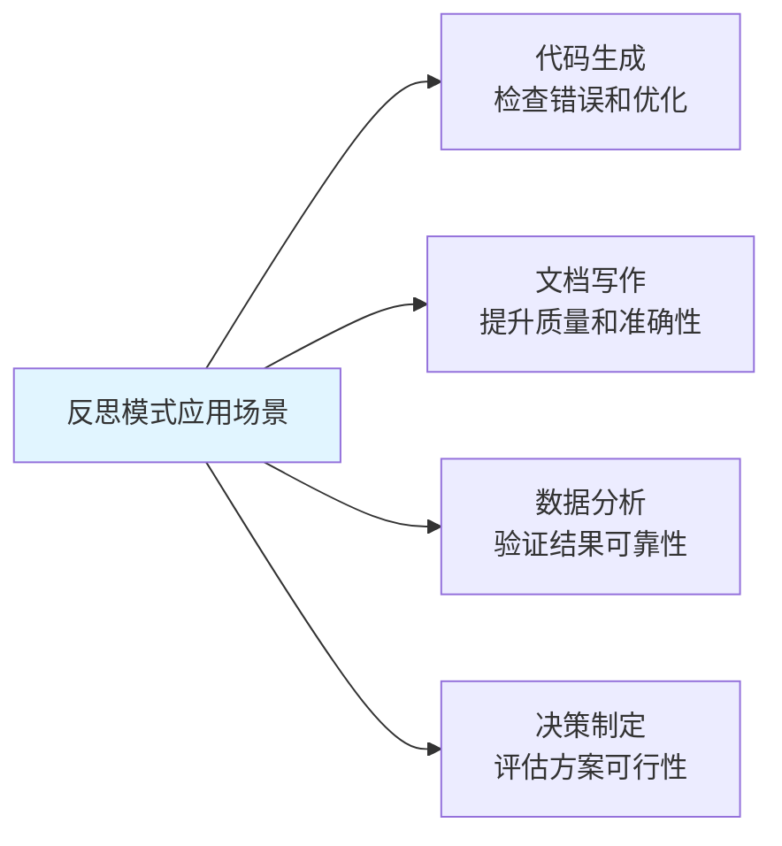
```mermaid
graph LR
    A[反思模式应用场景] --> B[代码生成<br/>检查错误和优化]
    A --> C[文档写作<br/>提升质量和准确性]
    A --> D[数据分析<br/>验证结果可靠性]
    A --> E[决策制定<br/>评估方案可行性]
    
    style A fill:#e1f5ff
```

### 优势与挑战

| 维度 | 优势 | 挑战 |
|------|------|------|
| **质量** | ✅ 显著提升输出质量 | ⚠️ 需要多次LLM调用 |
| **可靠性** | ✅ 能发现并修正错误 | ⚠️ 可能陷入循环 |
| **成本** | ❌ Token消耗较大 | ⚠️ 需要优化迭代次数 |
| **适用性** | ✅ 适合高质量要求任务 | ⚠️ 不适合实时性要求高的场景 |

## 模式二：工具使用模式 (Tool Use Pattern)

### 模式概述

工具使用模式让AI Agent能够调用外部工具和API,极大扩展了Agent的能力边界。通过工具,Agent可以访问实时数据、执行计算、操作文件等。

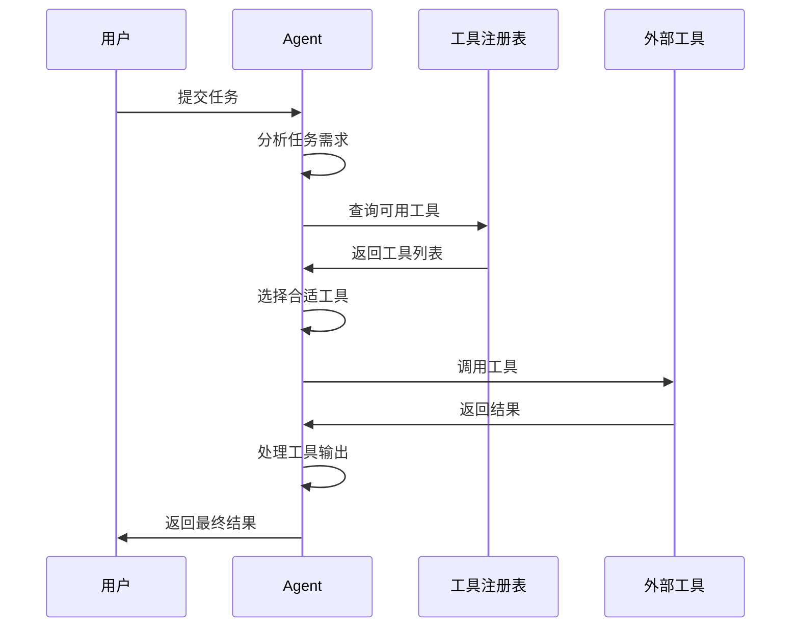
```mermaid
sequenceDiagram
    participant U as 用户
    participant A as Agent
    participant T as 工具注册表
    participant E as 外部工具
    
    U->>A: 提交任务
    A->>A: 分析任务需求
    A->>T: 查询可用工具
    T->>A: 返回工具列表
    A->>A: 选择合适工具
    A->>E: 调用工具
    E->>A: 返回结果
    A->>A: 处理工具输出
    A->>U: 返回最终结果
```

### 工具调用流程

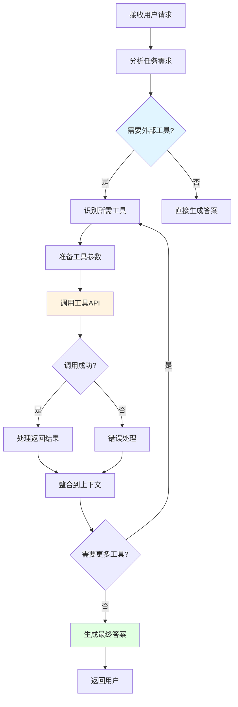
```mermaid
flowchart TD
    A[接收用户请求] --> B[分析任务需求]
    B --> C{需要外部工具?}
    C -->|是| D[识别所需工具]
    C -->|否| E[直接生成答案]
    D --> F[准备工具参数]
    F --> G[调用工具API]
    G --> H{调用成功?}
    H -->|是| I[处理返回结果]
    H -->|否| J[错误处理]
    I --> K[整合到上下文]
    J --> K
    K --> L{需要更多工具?}
    L -->|是| D
    L -->|否| M[生成最终答案]
    M --> N[返回用户]
    
    style C fill:#e1f5ff
    style G fill:#fff4e1
    style M fill:#e1ffe1
```

### 实现示例

**Python实现**：

```python
from typing import List, Dict, Callable, Any
import json

class Tool:
    """工具基类"""
    
    def __init__(self, name: str, description: str, func: Callable):
        self.name = name
        self.description = description
        self.func = func
    
    def call(self, **kwargs) -> Any:
        """调用工具"""
        return self.func(**kwargs)

class ToolUseAgent:
    """工具使用模式Agent"""
    
    def __init__(self, llm):
        self.llm = llm
        self.tools: Dict[str, Tool] = {}
    
    def register_tool(self, tool: Tool):
        """注册工具"""
        self.tools[tool.name] = tool
        print(f"已注册工具: {tool.name}")
    
    def get_tools_description(self) -> str:
        """获取所有工具的描述"""
        descriptions = []
        for tool in self.tools.values():
            descriptions.append(f"- {tool.name}: {tool.description}")
        return "\n".join(descriptions)
    
    def run(self, task: str) -> str:
        """执行任务"""
        context = []
        max_turns = 10
        
        for turn in range(max_turns):
            # 构建提示词
            prompt = self._build_prompt(task, context)
            
            # 生成响应
            response = self.llm.generate(prompt)
            
            # 解析响应
            action = self._parse_response(response)
            
            if action['type'] == 'answer':
                # 返回最终答案
                return action['content']
            elif action['type'] == 'tool_call':
                # 调用工具
                tool_name = action['tool']
                tool_params = action['params']
                
                if tool_name in self.tools:
                    result = self.tools[tool_name].call(**tool_params)
                    context.append({
                        'type': 'tool_call',
                        'tool': tool_name,
                        'params': tool_params,
                        'result': result
                    })
                else:
                    context.append({
                        'type': 'error',
                        'message': f'工具 {tool_name} 不存在'
                    })
        
        return "达到最大迭代次数"
    
    def _build_prompt(self, task: str, context: List[Dict]) -> str:
        """构建提示词"""
        tools_desc = self.get_tools_description()
        
        prompt = f"""你是一个能够使用工具的AI助手。

可用工具：
{tools_desc}

任务：{task}

之前的操作：
"""
        for item in context:
            if item['type'] == 'tool_call':
                prompt += f"\n调用工具: {item['tool']}"
                prompt += f"\n参数: {json.dumps(item['params'], ensure_ascii=False)}"
                prompt += f"\n结果: {item['result']}\n"
        
        prompt += """
请决定下一步行动：
1. 如果需要调用工具,返回JSON: {"type": "tool_call", "tool": "工具名", "params": {参数}}
2. 如果可以回答,返回JSON: {"type": "answer", "content": "答案内容"}
"""
        return prompt
    
    def _parse_response(self, response: str) -> Dict:
        """解析响应"""
        try:
            return json.loads(response)
        except:
            return {'type': 'answer', 'content': response}


# 定义示例工具
def search_web(query: str) -> str:
    """模拟网络搜索"""
    return f"搜索结果: 关于'{query}'的信息..."

def calculate(expression: str) -> float:
    """计算数学表达式"""
    try:
        return eval(expression)
    except:
        return "计算错误"

def get_weather(city: str) -> str:
    """获取天气信息"""
    return f"{city}的天气: 晴天, 25°C"


# 使用示例
agent = ToolUseAgent(llm)

# 注册工具
agent.register_tool(Tool(
    name="search",
    description="搜索网络信息",
    func=search_web
))

agent.register_tool(Tool(
    name="calculator",
    description="计算数学表达式",
    func=calculate
))

agent.register_tool(Tool(
    name="weather",
    description="查询城市天气",
    func=get_weather
))

# 执行任务
result = agent.run("北京今天的天气如何?")
print(result)
```

### 工具类型分类

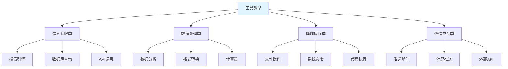
```mermaid
graph TB
    A[工具类型] --> B[信息获取类]
    A --> C[数据处理类]
    A --> D[操作执行类]
    A --> E[通信交互类]
    
    B --> B1[搜索引擎]
    B --> B2[数据库查询]
    B --> B3[API调用]
    
    C --> C1[数据分析]
    C --> C2[格式转换]
    C --> C3[计算器]
    
    D --> D1[文件操作]
    D --> D2[系统命令]
    D --> D3[代码执行]
    
    E --> E1[发送邮件]
    E --> E2[消息推送]
    E --> E3[外部API]
    
    style A fill:#e1f5ff
```

### 工具设计最佳实践

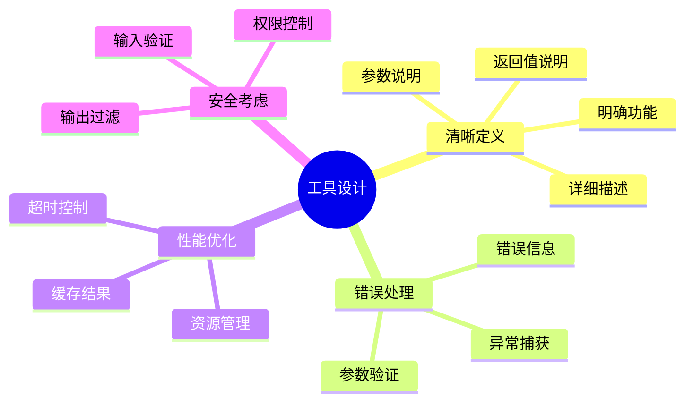
```mermaid
mindmap
  root((工具设计))
    清晰定义
      明确功能
      详细描述
      参数说明
      返回值说明
    错误处理
      参数验证
      异常捕获
      错误信息
    性能优化
      缓存结果
      超时控制
      资源管理
    安全考虑
      权限控制
      输入验证
      输出过滤
```

## 模式三：规划模式 (Planning Pattern)

### 模式概述

规划模式让Agent能够将复杂任务分解为多个子任务,并制定执行计划。这对处理复杂、多步骤的任务至关重要。

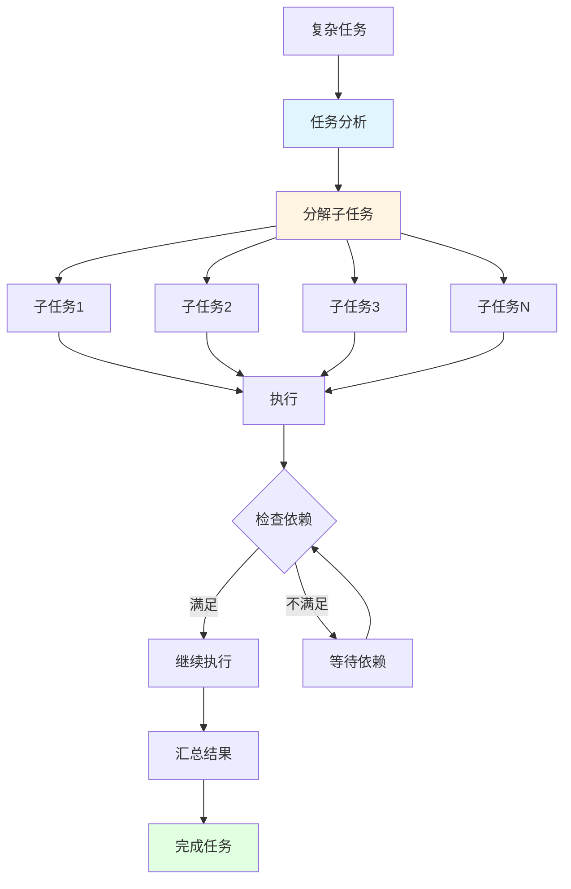
```mermaid
graph TB
    A[复杂任务] --> B[任务分析]
    B --> C[分解子任务]
    C --> D[子任务1]
    C --> E[子任务2]
    C --> F[子任务3]
    C --> G[子任务N]
    
    D --> H[执行]
    E --> H
    F --> H
    G --> H
    
    H --> I{检查依赖}
    I -->|满足| J[继续执行]
    I -->|不满足| K[等待依赖]
    K --> I
    
    J --> L[汇总结果]
    L --> M[完成任务]
    
    style B fill:#e1f5ff
    style C fill:#fff4e1
    style M fill:#e1ffe1
```

### 规划策略

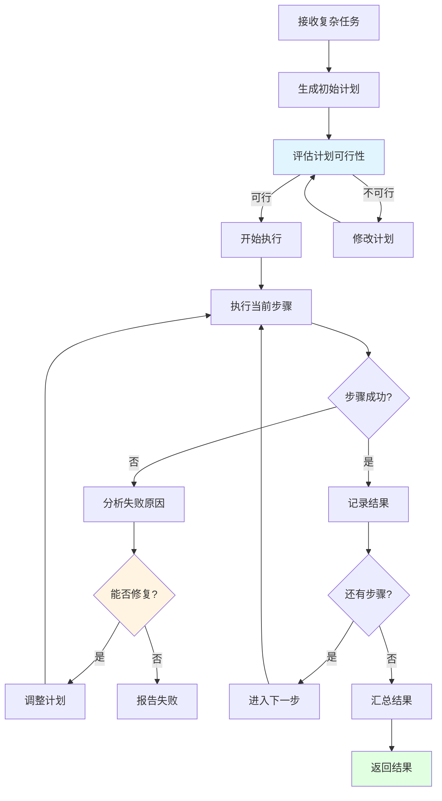
```mermaid
flowchart TD
    A[接收复杂任务] --> B[生成初始计划]
    B --> C[评估计划可行性]
    C -->|可行| D[开始执行]
    C -->|不可行| E[修改计划]
    E --> C
    
    D --> F[执行当前步骤]
    F --> G{步骤成功?}
    G -->|是| H[记录结果]
    G -->|否| I[分析失败原因]
    
    I --> J{能否修复?}
    J -->|是| K[调整计划]
    J -->|否| L[报告失败]
    
    K --> F
    H --> M{还有步骤?}
    M -->|是| N[进入下一步]
    M -->|否| O[汇总结果]
    N --> F
    O --> P[返回结果]
    
    style C fill:#e1f5ff
    style J fill:#fff4e1
    style P fill:#e1ffe1
```

### 实现示例

**Python实现**：

```python
from dataclasses import dataclass
from typing import List, Optional
from enum import Enum

class TaskStatus(Enum):
    """任务状态"""
    PENDING = "pending"
    IN_PROGRESS = "in_progress"
    COMPLETED = "completed"
    FAILED = "failed"

@dataclass
class SubTask:
    """子任务"""
    id: str
    description: str
    dependencies: List[str]
    status: TaskStatus = TaskStatus.PENDING
    result: Optional[str] = None

class PlanningAgent:
    """规划模式Agent"""
    
    def __init__(self, llm):
        self.llm = llm
    
    def create_plan(self, task: str) -> List[SubTask]:
        """创建任务计划"""
        prompt = f"""
        请将以下复杂任务分解为多个子任务：
        
        任务：{task}
        
        要求：
        1. 每个子任务应该清晰、可执行
        2. 标识子任务之间的依赖关系
        3. 按照合理的顺序排列
        
        返回JSON格式：
        {{
            "subtasks": [
                {{
                    "id": "task_1",
                    "description": "子任务描述",
                    "dependencies": []
                }},
                ...
            ]
        }}
        """
        
        response = self.llm.generate(prompt)
        plan_data = json.loads(response)
        
        subtasks = []
        for task_data in plan_data['subtasks']:
            subtasks.append(SubTask(
                id=task_data['id'],
                description=task_data['description'],
                dependencies=task_data.get('dependencies', [])
            ))
        
        return subtasks
    
    def execute_plan(self, subtasks: List[SubTask]) -> Dict:
        """执行计划"""
        results = {}
        
        while not self._all_completed(subtasks):
            for subtask in subtasks:
                if subtask.status != TaskStatus.PENDING:
                    continue
                
                # 检查依赖是否满足
                if not self._dependencies_met(subtask, results):
                    continue
                
                # 执行子任务
                print(f"执行: {subtask.description}")
                subtask.status = TaskStatus.IN_PROGRESS
                
                try:
                    result = self._execute_subtask(subtask, results)
                    subtask.result = result
                    subtask.status = TaskStatus.COMPLETED
                    results[subtask.id] = result
                    print(f"完成: {subtask.description}")
                except Exception as e:
                    subtask.status = TaskStatus.FAILED
                    print(f"失败: {subtask.description}, 错误: {e}")
        
        return results
    
    def run(self, task: str) -> str:
        """运行完整规划流程"""
        # 创建计划
        print("创建任务计划...")
        subtasks = self.create_plan(task)
        
        print(f"\n计划包含 {len(subtasks)} 个子任务:")
        for st in subtasks:
            print(f"- {st.id}: {st.description}")
            if st.dependencies:
                print(f"  依赖: {', '.join(st.dependencies)}")
        
        # 执行计划
        print("\n开始执行计划...")
        results = self.execute_plan(subtasks)
        
        # 汇总结果
        print("\n汇总结果...")
        summary = self._summarize_results(task, subtasks, results)
        
        return summary
    
    def _all_completed(self, subtasks: List[SubTask]) -> bool:
        """检查是否全部完成"""
        return all(
            st.status in [TaskStatus.COMPLETED, TaskStatus.FAILED]
            for st in subtasks
        )
    
    def _dependencies_met(self, subtask: SubTask, results: Dict) -> bool:
        """检查依赖是否满足"""
        return all(dep in results for dep in subtask.dependencies)
    
    def _execute_subtask(self, subtask: SubTask, context: Dict) -> str:
        """执行子任务"""
        # 构建上下文信息
        context_str = "\n".join([
            f"{k}: {v}" for k, v in context.items()
        ])
        
        prompt = f"""
        执行以下子任务：
        
        任务描述：{subtask.description}
        
        可用的上下文信息：
        {context_str}
        
        请执行该任务并返回结果。
        """
        
        return self.llm.generate(prompt)
    
    def _summarize_results(self, task: str, subtasks: List[SubTask], 
                          results: Dict) -> str:
        """汇总结果"""
        results_str = "\n".join([
            f"- {st.description}: {st.result}"
            for st in subtasks if st.result
        ])
        
        prompt = f"""
        原始任务：{task}
        
        子任务执行结果：
        {results_str}
        
        请汇总以上结果,给出完整的答案。
        """
        
        return self.llm.generate(prompt)


# 使用示例
agent = PlanningAgent(llm)
result = agent.run("研究并撰写一份关于量子计算的报告")
```

### 规划模式类型

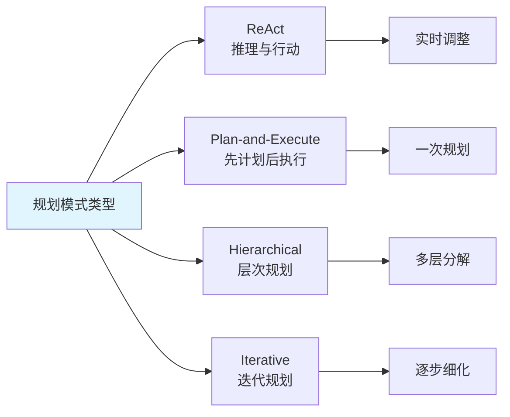
```mermaid
graph LR
    A[规划模式类型] --> B[ReAct<br/>推理与行动]
    A --> C[Plan-and-Execute<br/>先计划后执行]
    A --> D[Hierarchical<br/>层次规划]
    A --> E[Iterative<br/>迭代规划]
    
    B --> B1[实时调整]
    C --> C1[一次规划]
    D --> D1[多层分解]
    E --> E1[逐步细化]
    
    style A fill:#e1f5ff
```

### ReAct模式详解

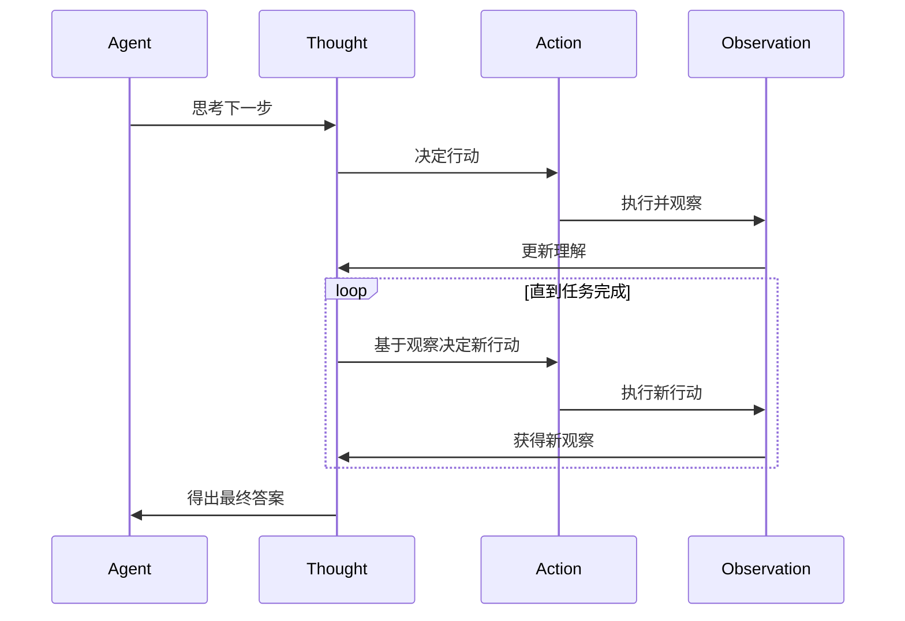
```mermaid
sequenceDiagram
    participant A as Agent
    participant T as Thought
    participant Ac as Action
    participant O as Observation
    
    A->>T: 思考下一步
    T->>Ac: 决定行动
    Ac->>O: 执行并观察
    O->>T: 更新理解
    
    loop 直到任务完成
        T->>Ac: 基于观察决定新行动
        Ac->>O: 执行新行动
        O->>T: 获得新观察
    end
    
    T->>A: 得出最终答案
```

**ReAct实现示例**：

```python
class ReActAgent:
    """ReAct模式Agent"""
    
    def __init__(self, llm, tools):
        self.llm = llm
        self.tools = tools
    
    def run(self, task: str) -> str:
        """执行ReAct循环"""
        thoughts = []
        observations = []
        max_steps = 10
        
        for step in range(max_steps):
            # Thought: 思考
            thought = self._think(task, thoughts, observations)
            thoughts.append(thought)
            print(f"\n思考: {thought}")
            
            # 检查是否完成
            if self._is_final_answer(thought):
                return self._extract_answer(thought)
            
            # Action: 行动
            action = self._decide_action(thought)
            print(f"行动: {action}")
            
            # Observation: 观察
            observation = self._execute_action(action)
            observations.append(observation)
            print(f"观察: {observation}")
        
        return "未能在规定步骤内完成任务"
    
    def _think(self, task: str, thoughts: List[str], 
               observations: List[str]) -> str:
        """思考下一步"""
        context = self._build_context(thoughts, observations)
        
        prompt = f"""
        任务: {task}
        
        {context}
        
        请思考:
        1. 目前已经知道了什么?
        2. 还需要知道什么?
        3. 下一步应该做什么?
        4. 或者现在可以给出最终答案吗?
        
        返回你的思考过程。如果可以给出答案,以"最终答案:"开头。
        """
        
        return self.llm.generate(prompt)
    
    def _is_final_answer(self, thought: str) -> bool:
        """判断是否为最终答案"""
        return "最终答案" in thought
    
    def _extract_answer(self, thought: str) -> str:
        """提取最终答案"""
        return thought.split("最终答案:")[-1].strip()
    
    def _decide_action(self, thought: str) -> Dict:
        """决定行动"""
        prompt = f"""
        基于思考: {thought}
        
        可用工具: {self._get_tools_desc()}
        
        决定使用哪个工具和参数。
        返回JSON: {{"tool": "工具名", "params": {{参数}}}}
        """
        
        response = self.llm.generate(prompt)
        return json.loads(response)
    
    def _execute_action(self, action: Dict) -> str:
        """执行行动"""
        tool_name = action['tool']
        params = action['params']
        
        if tool_name in self.tools:
            return self.tools[tool_name].call(**params)
        return "工具不存在"
    
    def _build_context(self, thoughts: List[str], 
                      observations: List[str]) -> str:
        """构建上下文"""
        context = "历史记录:\n"
        for i, (t, o) in enumerate(zip(thoughts, observations)):
            context += f"\n步骤 {i+1}:\n"
            context += f"思考: {t}\n"
            context += f"观察: {o}\n"
        return context
    
    def _get_tools_desc(self) -> str:
        """获取工具描述"""
        return "\n".join([
            f"- {name}: {tool.description}"
            for name, tool in self.tools.items()
        ])


# 使用示例
agent = ReActAgent(llm, tools={
    'search': Tool("search", "搜索信息", search_web),
    'calculator': Tool("calculator", "计算", calculate),
})

result = agent.run("OpenAI的GPT-4发布于哪一年?那一年距离现在多少年?")
```

## 模式四：多智能体协作模式 (Multi-agent Collaboration)

### 模式概述

多智能体协作模式通过多个专门化的Agent协同工作,每个Agent负责特定领域或任务,通过协作完成复杂任务。

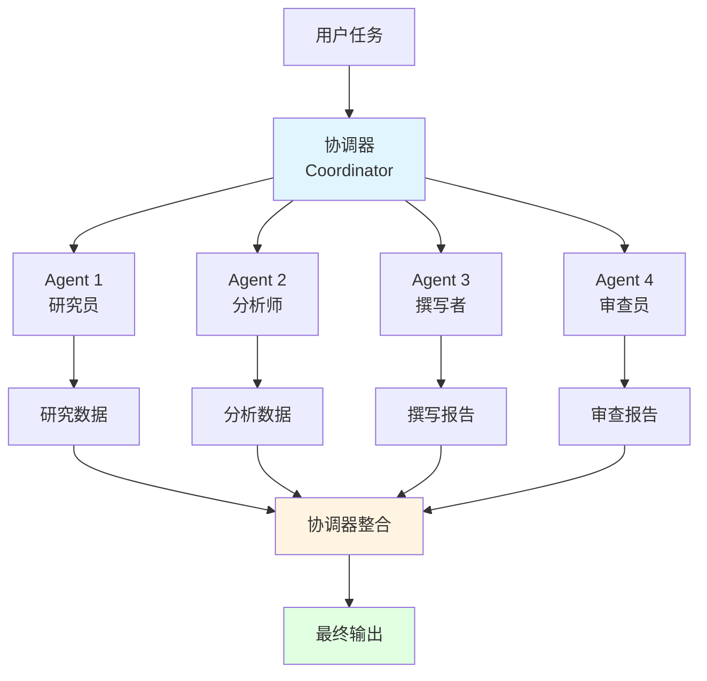
```mermaid
graph TB
    A[用户任务] --> B[协调器<br/>Coordinator]
    
    B --> C[Agent 1<br/>研究员]
    B --> D[Agent 2<br/>分析师]
    B --> E[Agent 3<br/>撰写者]
    B --> F[Agent 4<br/>审查员]
    
    C --> G[研究数据]
    D --> H[分析数据]
    E --> I[撰写报告]
    F --> J[审查报告]
    
    G --> K[协调器整合]
    H --> K
    I --> K
    J --> K
    
    K --> L[最终输出]
    
    style B fill:#e1f5ff
    style K fill:#fff4e1
    style L fill:#e1ffe1
```

### 协作模式类型

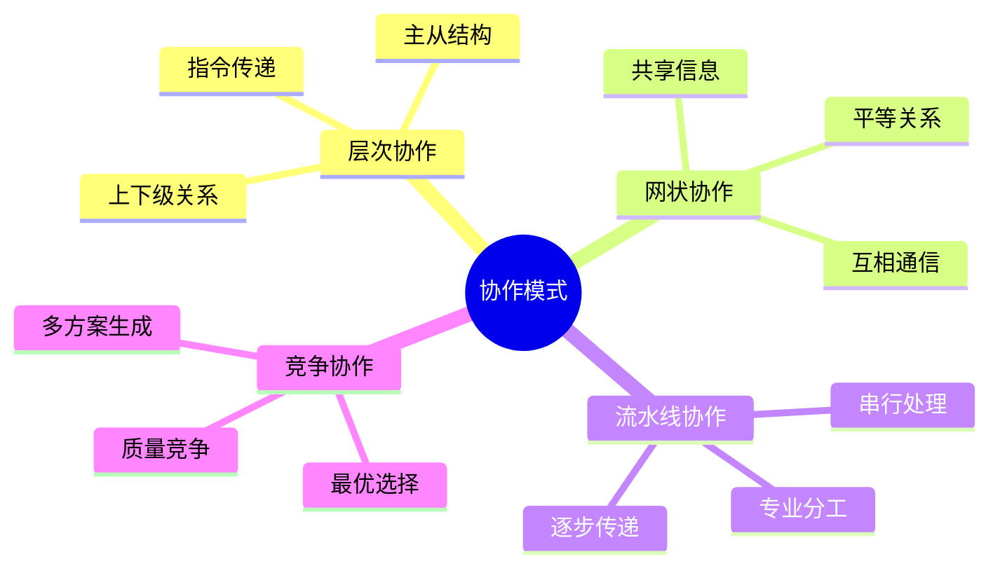
```mermaid
mindmap
  root((协作模式))
    层次协作
      主从结构
      上下级关系
      指令传递
    网状协作
      平等关系
      互相通信
      共享信息
    流水线协作
      串行处理
      逐步传递
      专业分工
    竞争协作
      多方案生成
      质量竞争
      最优选择
```

### 实现示例

**Python实现**：

```python
from abc import ABC, abstractmethod
from typing import List, Dict

class BaseAgent(ABC):
    """Agent基类"""
    
    def __init__(self, name: str, role: str, llm):
        self.name = name
        self.role = role
        self.llm = llm
    
    @abstractmethod
    def process(self, input_data: Dict) -> Dict:
        """处理输入数据"""
        pass
    
    def generate_response(self, prompt: str) -> str:
        """生成响应"""
        full_prompt = f"""
        你是一个{self.role}。
        
        {prompt}
        
        请以你的专业角色完成任务。
        """
        return self.llm.generate(full_prompt)


class ResearcherAgent(BaseAgent):
    """研究员Agent"""
    
    def __init__(self, llm):
        super().__init__("研究员", "专业研究人员", llm)
    
    def process(self, input_data: Dict) -> Dict:
        """研究任务"""
        topic = input_data['topic']
        
        prompt = f"""
        研究主题: {topic}
        
        请进行深入研究,收集相关信息和数据。
        包括:
        1. 背景信息
        2. 关键数据
        3. 重要发现
        4. 相关研究
        """
        
        research_result = self.generate_response(prompt)
        
        return {
            'agent': self.name,
            'type': 'research',
            'content': research_result
        }


class AnalystAgent(BaseAgent):
    """分析师Agent"""
    
    def __init__(self, llm):
        super().__init__("分析师", "数据分析专家", llm)
    
    def process(self, input_data: Dict) -> Dict:
        """分析数据"""
        research_data = input_data.get('research_data', '')
        
        prompt = f"""
        研究数据:
        {research_data}
        
        请分析以上数据,提供:
        1. 数据洞察
        2. 趋势分析
        3. 关键发现
        4. 结论建议
        """
        
        analysis_result = self.generate_response(prompt)
        
        return {
            'agent': self.name,
            'type': 'analysis',
            'content': analysis_result
        }


class WriterAgent(BaseAgent):
    """撰写者Agent"""
    
    def __init__(self, llm):
        super().__init__("撰写者", "专业内容创作者", llm)
    
    def process(self, input_data: Dict) -> Dict:
        """撰写内容"""
        research = input_data.get('research_data', '')
        analysis = input_data.get('analysis_data', '')
        
        prompt = f"""
        研究内容:
        {research}
        
        分析结果:
        {analysis}
        
        请基于以上内容,撰写一份结构清晰、内容详实的报告。
        包括:
        1. 引言
        2. 主要内容
        3. 数据分析
        4. 结论建议
        """
        
        report = self.generate_response(prompt)
        
        return {
            'agent': self.name,
            'type': 'report',
            'content': report
        }


class ReviewerAgent(BaseAgent):
    """审查员Agent"""
    
    def __init__(self, llm):
        super().__init__("审查员", "质量审查专家", llm)
    
    def process(self, input_data: Dict) -> Dict:
        """审查内容"""
        report = input_data.get('report', '')
        
        prompt = f"""
        报告内容:
        {report}
        
        请审查报告质量,提供:
        1. 质量评分(0-10)
        2. 优点
        3. 需要改进的地方
        4. 修改建议
        
        返回JSON格式。
        """
        
        review_result = self.generate_response(prompt)
        
        return {
            'agent': self.name,
            'type': 'review',
            'content': review_result
        }


class MultiAgentSystem:
    """多智能体协作系统"""
    
    def __init__(self, llm):
        self.llm = llm
        self.agents = {
            'researcher': ResearcherAgent(llm),
            'analyst': AnalystAgent(llm),
            'writer': WriterAgent(llm),
            'reviewer': ReviewerAgent(llm)
        }
    
    def run(self, task: str) -> str:
        """执行任务"""
        print(f"任务: {task}\n")
        
        # 步骤1: 研究
        print("=" * 50)
        print("阶段1: 研究")
        print("=" * 50)
        research_result = self.agents['researcher'].process({
            'topic': task
        })
        print(f"{research_result['agent']} 完成")
        
        # 步骤2: 分析
        print("\n" + "=" * 50)
        print("阶段2: 分析")
        print("=" * 50)
        analysis_result = self.agents['analyst'].process({
            'research_data': research_result['content']
        })
        print(f"{analysis_result['agent']} 完成")
        
        # 步骤3: 撰写
        print("\n" + "=" * 50)
        print("阶段3: 撰写")
        print("=" * 50)
        report_result = self.agents['writer'].process({
            'research_data': research_result['content'],
            'analysis_data': analysis_result['content']
        })
        print(f"{report_result['agent']} 完成")
        
        # 步骤4: 审查
        print("\n" + "=" * 50)
        print("阶段4: 审查")
        print("=" * 50)
        review_result = self.agents['reviewer'].process({
            'report': report_result['content']
        })
        print(f"{review_result['agent']} 完成")
        
        # 返回最终报告
        return report_result['content']


# 使用示例
system = MultiAgentSystem(llm)
final_report = system.run("人工智能在医疗领域的应用")
```

### 通信机制

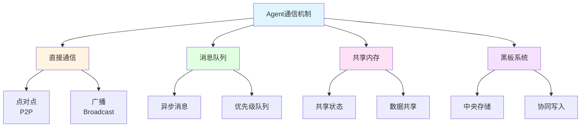
```mermaid
flowchart TD
    A[Agent通信机制] --> B[直接通信]
    A --> C[消息队列]
    A --> D[共享内存]
    A --> E[黑板系统]
    
    B --> B1[点对点<br/>P2P]
    B --> B2[广播<br/>Broadcast]
    
    C --> C1[异步消息]
    C --> C2[优先级队列]
    
    D --> D1[共享状态]
    D --> D2[数据共享]
    
    E --> E1[中央存储]
    E --> E2[协同写入]
    
    style A fill:#e1f5ff
    style B fill:#fff4e1
    style C fill:#e1ffe1
    style D fill:#ffe1f5
    style E fill:#f5e1ff
```

## 混合模式：组合使用

### 模式组合策略

实际应用中,通常需要组合多种模式以获得最佳效果。

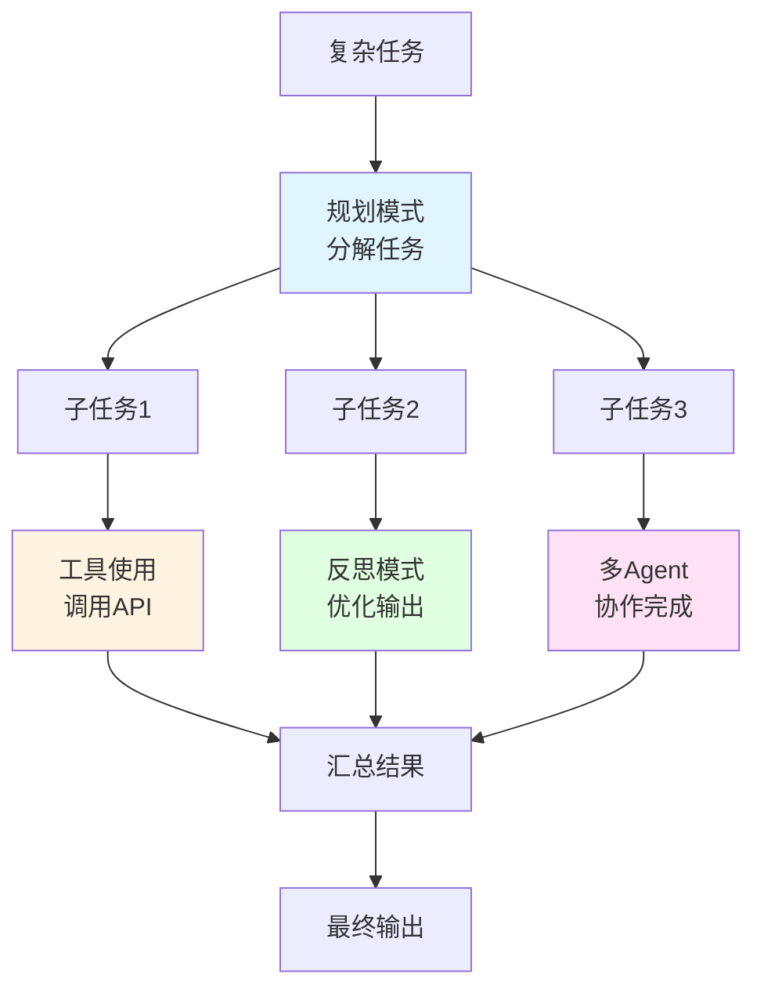
```mermaid
graph TB
    A[复杂任务] --> B[规划模式<br/>分解任务]
    B --> C[子任务1]
    B --> D[子任务2]
    B --> E[子任务3]
    
    C --> F[工具使用<br/>调用API]
    D --> G[反思模式<br/>优化输出]
    E --> H[多Agent<br/>协作完成]
    
    F --> I[汇总结果]
    G --> I
    H --> I
    
    I --> J[最终输出]
    
    style B fill:#e1f5ff
    style F fill:#fff4e1
    style G fill:#e1ffe1
    style H fill:#ffe1f5
```

### 组合实现示例

```python
class HybridAgent:
    """混合模式Agent"""
    
    def __init__(self, llm):
        self.llm = llm
        self.planner = PlanningAgent(llm)
        self.reflector = ReflectionAgent(llm)
        self.tool_user = ToolUseAgent(llm)
    
    def run(self, task: str) -> str:
        """执行任务"""
        # 1. 规划阶段
        print("阶段1: 规划任务")
        plan = self.planner.create_plan(task)
        
        # 2. 执行阶段 (使用工具)
        print("\n阶段2: 执行任务")
        results = []
        for subtask in plan:
            print(f"执行: {subtask.description}")
            result = self.tool_user.run(subtask.description)
            results.append(result)
        
        # 3. 整合结果
        print("\n阶段3: 整合结果")
        combined = self._combine_results(task, results)
        
        # 4. 反思改进
        print("\n阶段4: 反思改进")
        final_output = self.reflector.run(combined)
        
        return final_output
    
    def _combine_results(self, task: str, results: List[str]) -> str:
        """整合结果"""
        results_text = "\n\n".join([
            f"结果 {i+1}:\n{r}"
            for i, r in enumerate(results)
        ])
        
        prompt = f"""
        原始任务: {task}
        
        子任务结果:
        {results_text}
        
        请整合以上结果,生成完整的答案。
        """
        
        return self.llm.generate(prompt)


# 使用示例
hybrid_agent = HybridAgent(llm)
result = hybrid_agent.run("分析2023年全球AI发展趋势并预测2024年")
```

## 实际应用案例

### 案例1: 智能客服系统

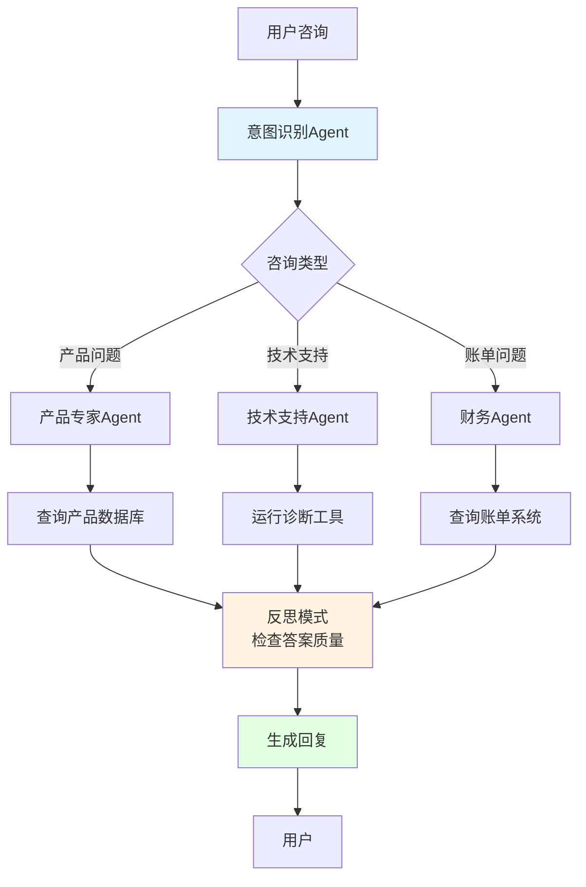
```mermaid
graph TB
    A[用户咨询] --> B[意图识别Agent]
    B --> C{咨询类型}
    
    C -->|产品问题| D[产品专家Agent]
    C -->|技术支持| E[技术支持Agent]
    C -->|账单问题| F[财务Agent]
    
    D --> G[查询产品数据库]
    E --> H[运行诊断工具]
    F --> I[查询账单系统]
    
    G --> J[反思模式<br/>检查答案质量]
    H --> J
    I --> J
    
    J --> K[生成回复]
    K --> L[用户]
    
    style B fill:#e1f5ff
    style J fill:#fff4e1
    style K fill:#e1ffe1
```

**实现要点**：

- **工具使用**: 访问数据库、API、诊断工具
- **反思模式**: 确保答案准确、有帮助
- **多Agent**: 不同专家处理不同类型问题
- **规划**: 复杂问题分步解决

### 案例2: 代码开发助手

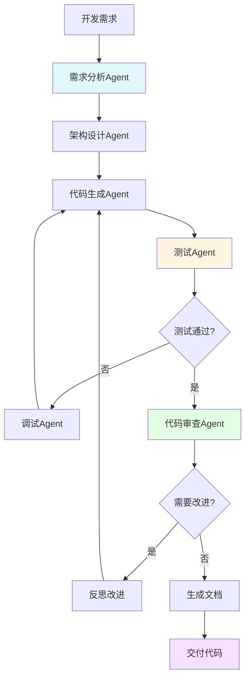
```mermaid
flowchart TD
    A[开发需求] --> B[需求分析Agent]
    B --> C[架构设计Agent]
    C --> D[代码生成Agent]
    D --> E[测试Agent]
    E --> F{测试通过?}
    
    F -->|否| G[调试Agent]
    G --> D
    
    F -->|是| H[代码审查Agent]
    H --> I{需要改进?}
    
    I -->|是| J[反思改进]
    I -->|否| K[生成文档]
    
    J --> D
    K --> L[交付代码]
    
    style B fill:#e1f5ff
    style E fill:#fff4e1
    style H fill:#e1ffe1
    style L fill:#f5e1ff
```

### 案例3: 内容创作系统

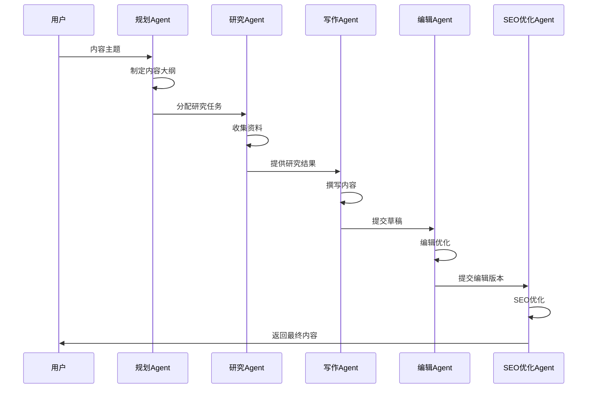
```mermaid
sequenceDiagram
    participant U as 用户
    participant P as 规划Agent
    participant R as 研究Agent
    participant W as 写作Agent
    participant E as 编辑Agent
    participant S as SEO优化Agent
    
    U->>P: 内容主题
    P->>P: 制定内容大纲
    P->>R: 分配研究任务
    R->>R: 收集资料
    R->>W: 提供研究结果
    W->>W: 撰写内容
    W->>E: 提交草稿
    E->>E: 编辑优化
    E->>S: 提交编辑版本
    S->>S: SEO优化
    S->>U: 返回最终内容
```

## 设计模式选择指南

### 决策树

```mermaid
flowchart TD
    A[开始] --> B{任务复杂度}
    
    B -->|简单| C{需要工具?}
    B -->|复杂| D{需要分解?}
    
    C -->|是| E[工具使用模式]
    C -->|否| F[基础LLM]
    
    D -->|是| G[规划模式]
    D -->|否| H{需要协作?}
    
    H -->|是| I[多Agent模式]
    H -->|否| J{需要高质量?}
    
    J -->|是| K[反思模式]
    J -->|否| F
    
    G --> L{需要工具?}
    L -->|是| M[规划+工具]
    L -->|否| N{需要反思?}
    
    N -->|是| O[规划+反思]
    N -->|否| G
    
    style A fill:#e1f5ff
    style G fill:#fff4e1
    style K fill:#e1ffe1
```

### 模式对比

| 模式 | 适用场景 | Token消耗 | 实现复杂度 | 输出质量 |
|------|---------|-----------|-----------|----------|
| **反思模式** | 高质量输出需求 | 🔴 高 | 🟡 中 | 🟢 高 |
| **工具使用** | 需要外部数据/能力 | 🟡 中 | 🟡 中 | 🟢 高 |
| **规划模式** | 复杂多步骤任务 | 🟡 中 | 🔴 高 | 🟢 高 |
| **多Agent** | 需要多领域专家 | 🔴 高 | 🔴 高 | 🟢 高 |
| **基础LLM** | 简单问答 | 🟢 低 | 🟢 低 | 🟡 中 |

## 实现框架推荐

### 主流框架对比

```mermaid
graph TB
    A[Agent框架] --> B[LangChain]
    A --> C[LangGraph]
    A --> D[AutoGPT]
    A --> E[AgentGPT]
    A --> F[CrewAI]
    
    B --> B1[丰富工具生态]
    B --> B2[易于集成]
    
    C --> C1[图状工作流]
    C --> C2[状态管理]
    
    D --> D1[自主Agent]
    D --> D2[长期任务]
    
    E --> E1[Web界面]
    E --> E2[可视化]
    
    F --> F1[角色系统]
    F --> F2[团队协作]
    
    style A fill:#e1f5ff
```

### LangChain实现示例

```python
from langchain.agents import AgentExecutor, create_react_agent
from langchain.tools import Tool
from langchain_openai import ChatOpenAI
from langchain.prompts import PromptTemplate

# 初始化LLM
llm = ChatOpenAI(model="gpt-4", temperature=0)

# 定义工具
tools = [
    Tool(
        name="Search",
        func=search_web,
        description="搜索网络信息"
    ),
    Tool(
        name="Calculator",
        func=calculate,
        description="执行数学计算"
    ),
]

# 创建Agent
prompt = PromptTemplate.from_template("""
你是一个能够使用工具的智能助手。

可用工具:
{tools}

工具名称: {tool_names}

用户问题: {input}

{agent_scratchpad}
""")

agent = create_react_agent(llm, tools, prompt)
agent_executor = AgentExecutor(
    agent=agent,
    tools=tools,
    verbose=True,
    max_iterations=10
)

# 执行任务
result = agent_executor.invoke({
    "input": "2024年的平方根是多少?"
})

print(result['output'])
```

### LangGraph实现示例

```python
from langgraph.graph import Graph, END
from typing import TypedDict

class AgentState(TypedDict):
    """Agent状态"""
    task: str
    plan: List[str]
    current_step: int
    results: List[str]
    final_answer: str

def create_plan(state: AgentState) -> AgentState:
    """创建计划"""
    task = state['task']
    # 调用LLM创建计划
    plan = llm.generate(f"为任务创建计划: {task}")
    state['plan'] = plan.split('\n')
    state['current_step'] = 0
    return state

def execute_step(state: AgentState) -> AgentState:
    """执行当前步骤"""
    current = state['plan'][state['current_step']]
    # 执行步骤
    result = llm.generate(f"执行: {current}")
    state['results'].append(result)
    state['current_step'] += 1
    return state

def should_continue(state: AgentState) -> str:
    """判断是否继续"""
    if state['current_step'] < len(state['plan']):
        return "continue"
    return "end"

def summarize(state: AgentState) -> AgentState:
    """汇总结果"""
    results_text = "\n".join(state['results'])
    summary = llm.generate(f"汇总结果:\n{results_text}")
    state['final_answer'] = summary
    return state

# 构建图
workflow = Graph()

workflow.add_node("planner", create_plan)
workflow.add_node("executor", execute_step)
workflow.add_node("summarizer", summarize)

workflow.set_entry_point("planner")
workflow.add_edge("planner", "executor")
workflow.add_conditional_edges(
    "executor",
    should_continue,
    {
        "continue": "executor",
        "end": "summarizer"
    }
)
workflow.add_edge("summarizer", END)

# 编译并运行
app = workflow.compile()
result = app.invoke({"task": "研究量子计算", "results": []})
print(result['final_answer'])
```

## 性能优化策略

### Token优化

```mermaid
mindmap
  root((Token优化))
    提示词优化
      精简指令
      移除冗余
      使用示例
    上下文管理
      滑动窗口
      摘要压缩
      关键信息保留
    缓存策略
      结果缓存
      工具输出缓存
      中间状态缓存
    并行处理
      独立任务并行
      批量API调用
      异步执行
```

### 响应速度优化

```mermaid
flowchart LR
    A[速度优化] --> B[流式输出<br/>Streaming]
    A --> C[缓存机制<br/>Caching]
    A --> D[并行执行<br/>Parallel]
    A --> E[懒加载<br/>Lazy Loading]
    
    B --> B1[实时反馈]
    C --> C1[减少重复调用]
    D --> D1[加速执行]
    E --> E1[按需加载]
    
    style A fill:#e1f5ff
```

### 成本控制

```python
class CostOptimizedAgent:
    """成本优化Agent"""
    
    def __init__(self, llm, cache_enabled=True):
        self.llm = llm
        self.cache = {} if cache_enabled else None
        self.token_count = 0
    
    def run_with_cache(self, task: str) -> str:
        """带缓存的执行"""
        # 检查缓存
        if self.cache is not None and task in self.cache:
            print(f"从缓存返回结果 (节省Token)")
            return self.cache[task]
        
        # 执行任务
        result = self._execute(task)
        
        # 存入缓存
        if self.cache is not None:
            self.cache[task] = result
        
        return result
    
    def _execute(self, task: str) -> str:
        """执行任务并统计Token"""
        prompt = self._optimize_prompt(task)
        response = self.llm.generate(prompt)
        
        # 统计Token (示例)
        self.token_count += len(prompt.split()) + len(response.split())
        
        return response
    
    def _optimize_prompt(self, task: str) -> str:
        """优化提示词"""
        # 移除冗余,保留关键信息
        return task.strip()
    
    def get_token_usage(self) -> int:
        """获取Token使用量"""
        return self.token_count
```

## 评估与监控

### 性能指标

```mermaid
graph TB
    A[Agent性能指标] --> B[准确率<br/>Accuracy]
    A --> C[响应时间<br/>Latency]
    A --> D[成本效益<br/>Cost]
    A --> E[可靠性<br/>Reliability]
    
    B --> B1[任务成功率]
    B --> B2[输出质量评分]
    
    C --> C1[平均响应时间]
    C --> C2[P95延迟]
    
    D --> D1[Token消耗]
    D --> D2[API调用次数]
    
    E --> E1[错误率]
    E --> E2[重试次数]
    
    style A fill:#e1f5ff
```

### 监控系统

```python
from dataclasses import dataclass
from datetime import datetime
from typing import List

@dataclass
class AgentMetrics:
    """Agent性能指标"""
    task_id: str
    task_type: str
    start_time: datetime
    end_time: datetime
    token_used: int
    tool_calls: int
    success: bool
    error_message: str = ""
    
    @property
    def duration(self) -> float:
        """执行时长(秒)"""
        return (self.end_time - self.start_time).total_seconds()

class AgentMonitor:
    """Agent监控系统"""
    
    def __init__(self):
        self.metrics: List[AgentMetrics] = []
    
    def record(self, metrics: AgentMetrics):
        """记录指标"""
        self.metrics.append(metrics)
    
    def get_statistics(self) -> Dict:
        """获取统计信息"""
        if not self.metrics:
            return {}
        
        total = len(self.metrics)
        successful = sum(1 for m in self.metrics if m.success)
        total_tokens = sum(m.token_used for m in self.metrics)
        avg_duration = sum(m.duration for m in self.metrics) / total
        
        return {
            'total_tasks': total,
            'success_rate': successful / total * 100,
            'avg_tokens_per_task': total_tokens / total,
            'avg_duration_seconds': avg_duration,
            'total_tokens': total_tokens
        }
    
    def generate_report(self) -> str:
        """生成报告"""
        stats = self.get_statistics()
        
        report = f"""
        Agent性能报告
        ================
        
        总任务数: {stats['total_tasks']}
        成功率: {stats['success_rate']:.2f}%
        平均Token消耗: {stats['avg_tokens_per_task']:.0f}
        平均响应时间: {stats['avg_duration_seconds']:.2f}秒
        总Token消耗: {stats['total_tokens']}
        """
        
        return report


# 使用示例
monitor = AgentMonitor()

# 记录任务执行
start = datetime.now()
# ... 执行任务 ...
end = datetime.now()

monitor.record(AgentMetrics(
    task_id="task_001",
    task_type="code_generation",
    start_time=start,
    end_time=end,
    token_used=1500,
    tool_calls=3,
    success=True
))

# 查看统计
print(monitor.generate_report())
```

## 安全与伦理考虑

### 安全框架

```mermaid
graph TB
    A[Agent安全] --> B[输入验证]
    A --> C[输出过滤]
    A --> D[权限控制]
    A --> E[审计日志]
    
    B --> B1[注入攻击防护]
    B --> B2[恶意输入检测]
    
    C --> C1[敏感信息过滤]
    C --> C2[有害内容检测]
    
    D --> D1[工具访问控制]
    D --> D2[资源限制]
    
    E --> E1[操作记录]
    E --> E2[异常追踪]
    
    style A fill:#e1f5ff
    style B fill:#fff4e1
    style C fill:#ffe1e1
```

### 安全实践

```python
class SecureAgent:
    """安全Agent实现"""
    
    def __init__(self, llm):
        self.llm = llm
        self.allowed_tools = set()
        self.audit_log = []
    
    def validate_input(self, user_input: str) -> bool:
        """验证输入安全性"""
        # 检测注入攻击
        dangerous_patterns = [
            'import os',
            'eval(',
            'exec(',
            '__import__',
            'subprocess'
        ]
        
        for pattern in dangerous_patterns:
            if pattern in user_input.lower():
                self.log_security_event(
                    'dangerous_input',
                    f'检测到危险模式: {pattern}'
                )
                return False
        
        return True
    
    def filter_output(self, output: str) -> str:
        """过滤输出内容"""
        # 移除敏感信息
        sensitive_patterns = {
            r'\b\d{11}\b': '[手机号]',  # 手机号
            r'\b\d{18}\b': '[身份证]',  # 身份证
            r'password.*?[:=]\s*\S+': 'password: [已隐藏]'  # 密码
        }
        
        import re
        filtered = output
        for pattern, replacement in sensitive_patterns.items():
            filtered = re.sub(pattern, replacement, filtered, flags=re.IGNORECASE)
        
        return filtered
    
    def authorize_tool(self, tool_name: str) -> bool:
        """工具权限检查"""
        if tool_name not in self.allowed_tools:
            self.log_security_event(
                'unauthorized_tool',
                f'尝试访问未授权工具: {tool_name}'
            )
            return False
        return True
    
    def log_security_event(self, event_type: str, details: str):
        """记录安全事件"""
        self.audit_log.append({
            'timestamp': datetime.now(),
            'type': event_type,
            'details': details
        })
        print(f"[安全警告] {event_type}: {details}")
    
    def run(self, user_input: str) -> str:
        """安全执行"""
        # 验证输入
        if not self.validate_input(user_input):
            return "输入包含不安全内容,已被拒绝"
        
        # 执行任务
        output = self._execute(user_input)
        
        # 过滤输出
        safe_output = self.filter_output(output)
        
        return safe_output
```

### 伦理准则

```mermaid
mindmap
  root((Agent伦理))
    透明度
      行为可解释
      决策过程公开
      能力边界声明
    公平性
      无偏见
      平等对待
      多样性考虑
    隐私保护
      数据加密
      最小化收集
      用户控制
    责任性
      错误处理
      损害预防
      人类监督
```

## 最佳实践总结

### 设计原则

```mermaid
graph LR
    A[设计原则] --> B[模块化<br/>Modularity]
    A --> C[可测试性<br/>Testability]
    A --> D[可观测性<br/>Observability]
    A --> E[可扩展性<br/>Scalability]
    
    B --> B1[松耦合]
    B --> B2[高内聚]
    
    C --> C1[单元测试]
    C --> C2[集成测试]
    
    D --> D1[日志记录]
    D --> D2[性能监控]
    
    E --> E1[水平扩展]
    E --> E2[功能扩展]
    
    style A fill:#e1f5ff
```

### 开发清单

**规划阶段**：
- ✅ 明确任务目标和成功标准
- ✅ 选择合适的设计模式
- ✅ 评估资源需求(Token、API调用等)
- ✅ 设计错误处理策略

**实现阶段**：
- ✅ 模块化代码结构
- ✅ 实现完善的日志记录
- ✅ 添加性能监控
- ✅ 编写单元测试

**测试阶段**：
- ✅ 功能测试
- ✅ 性能测试
- ✅ 安全测试
- ✅ 边界情况测试

**部署阶段**：
- ✅ 配置监控告警
- ✅ 准备回滚方案
- ✅ 文档完善
- ✅ 用户培训

### 常见陷阱

```mermaid
flowchart TD
    A[常见陷阱] --> B[过度规划<br/>Over-planning]
    A --> C[工具滥用<br/>Tool Abuse]
    A --> D[无限循环<br/>Infinite Loop]
    A --> E[上下文爆炸<br/>Context Explosion]
    
    B --> B1[解决: 平衡规划粒度]
    C --> C1[解决: 限制工具调用]
    D --> D1[解决: 设置最大迭代]
    E --> E1[解决: 上下文管理]
    
    style A fill:#ffe1e1
    style B fill:#fff4e1
    style C fill:#fff4e1
    style D fill:#fff4e1
    style E fill:#fff4e1
```

## 未来展望

### 发展趋势

```mermaid
timeline
    title 智能体技术发展路线图
    2023 : 基础Agent框架
         : 简单工具使用
    2024 : 多Agent协作
         : 高级规划能力
         : 自主学习
    2025 : 通用人工智能
         : 跨模态Agent
         : 自我进化
    2026+ : AGI级别Agent
          : 完全自主系统
          : 人机深度协作
```

### 研究方向

```mermaid
mindmap
  root((研究前沿))
    能力提升
      更强推理
      更好规划
      多模态理解
    效率优化
      减少Token
      加速推理
      智能缓存
    安全可控
      可解释性
      对齐研究
      安全约束
    应用拓展
      垂直领域
      企业应用
      消费级产品
```

## 参考资源

### 学习资源

- **论文**：
  - "ReAct: Synergizing Reasoning and Acting in Language Models"
  - "Reflexion: Language Agents with Verbal Reinforcement Learning"
  - "Generative Agents: Interactive Simulacra of Human Behavior"

- **框架文档**：
  - LangChain: https://python.langchain.com/
  - LangGraph: https://langchain-ai.github.io/langgraph/
  - AutoGPT: https://github.com/Significant-Gravitas/AutoGPT

- **开源项目**：
  - GPT-Engineer: https://github.com/AntonOsika/gpt-engineer
  - MetaGPT: https://github.com/geekan/MetaGPT
  - CrewAI: https://github.com/joaomdmoura/crewAI

### 社区资源

```mermaid
graph LR
    A[学习资源] --> B[官方文档]
    A --> C[开源项目]
    A --> D[技术博客]
    A --> E[社区论坛]
    
    B --> B1[框架文档]
    B --> B2[API参考]
    
    C --> C1[GitHub]
    C --> C2[示例代码]
    
    D --> D1[Medium]
    D --> D2[个人博客]
    
    E --> E1[Discord]
    E --> E2[Reddit]
    
    style A fill:#e1f5ff
```

## 总结

智能体设计模式为构建高效、可靠的AI Agent系统提供了经过验证的方法论。通过合理运用四大核心模式：

```mermaid
graph TD
    A[智能体设计模式] --> B[反思模式]
    A --> C[工具使用]
    A --> D[规划模式]
    A --> E[多Agent协作]
    
    B --> F[提升质量]
    C --> F
    D --> F
    E --> F
    
    F --> G[构建强大Agent系统]
    
    style A fill:#e1f5ff
    style F fill:#fff4e1
    style G fill:#e1ffe1
```

### 核心要点

| 方面 | 关键点 |
|------|--------|
| **模式选择** | 根据任务特点选择合适模式 |
| **组合使用** | 多种模式组合发挥协同效应 |
| **性能优化** | 平衡质量、速度与成本 |
| **安全第一** | 始终考虑安全与伦理问题 |
| **持续改进** | 监控评估,迭代优化 |

### 下一步行动

1. **实践练习**: 选择一个简单场景,实现基础Agent
2. **逐步进阶**: 尝试组合多种模式
3. **性能优化**: 关注Token使用和响应速度
4. **生产部署**: 添加监控、日志、错误处理
5. **持续学习**: 关注最新研究和框架更新

通过智能体设计模式,您可以：
- 🎯 构建更强大的AI Agent系统
- 📈 提升任务完成质量和效率
- 💰 优化资源使用和成本
- 🔒 确保系统安全可靠
- 🚀 为AGI时代做好准备

开始您的智能体开发之旅,构建下一代AI应用！

---

## 附录：完整示例项目

### 项目结构

```
agent_system/
├── agents/
│   ├── base_agent.py
│   ├── reflection_agent.py
│   ├── tool_use_agent.py
│   ├── planning_agent.py
│   └── multi_agent.py
├── tools/
│   ├── search_tool.py
│   ├── calculator_tool.py
│   └── weather_tool.py
├── utils/
│   ├── prompt_builder.py
│   ├── parser.py
│   └── cache.py
├── monitoring/
│   ├── metrics.py
│   └── logger.py
└── main.py
```

### 完整示例代码

访问以下优质开源项目学习Agent设计模式实现：
- **LangChain Agent示例**: [LangChain官方示例](https://github.com/langchain-ai/langchain/tree/master/cookbook)
- **LangGraph教程**: [LangGraph Tutorials](https://github.com/langchain-ai/langgraph/tree/main/examples)
- **Agent最佳实践**: [Anthropic Cookbook](https://github.com/anthropics/anthropic-cookbook)
- **开源Agent项目**: [AutoGPT](https://github.com/Significant-Gravitas/AutoGPT) | [MetaGPT](https://github.com/geekan/MetaGPT) | [CrewAI](https://github.com/joaomdmoura/crewAI)

---

**参考文献**：
1. Yao, S., et al. (2023). "ReAct: Synergizing Reasoning and Acting in Language Models"
2. Shinn, N., et al. (2023). "Reflexion: Language Agents with Verbal Reinforcement Learning"
3. Park, J. S., et al. (2023). "Generative Agents: Interactive Simulacra of Human Behavior"
4. LangChain Documentation: https://python.langchain.com/docs/
5. Anthropic Claude Documentation: https://docs.anthropic.com/
