## Claude Agent最佳实践指南

基于 Anthropic 官方 [Claude Cookbooks](https://github.com/anthropics/claude-cookbooks) 仓库，本文总结了构建生产级 Claude Agent 的最佳实践。这些实践来自于实际的代码示例和经过验证的设计模式，帮助开发者高效地构建可靠、可扩展的 AI 智能代理系统。

### 什么是 Claude Agent？

Claude Agent 是基于 Claude API 构建的智能代理系统，能够：
- 自主使用工具和 API
- 处理多模态输入（文本、图像、文档）
- 执行复杂的多步骤任务
- 与外部系统集成
- 提供结构化的输出

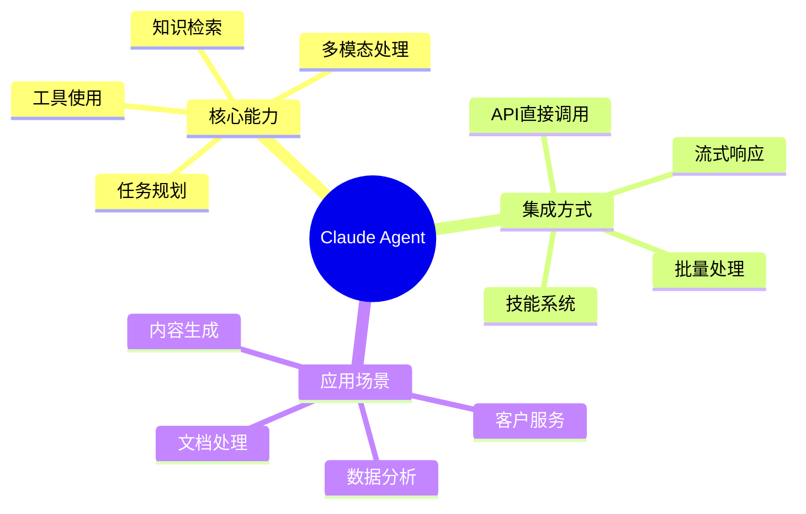

## 一、核心架构模式

### 1.1 Claude API 集成模式

Claude API 提供了四种主要的集成模式，每种模式适用于不同的应用场景：

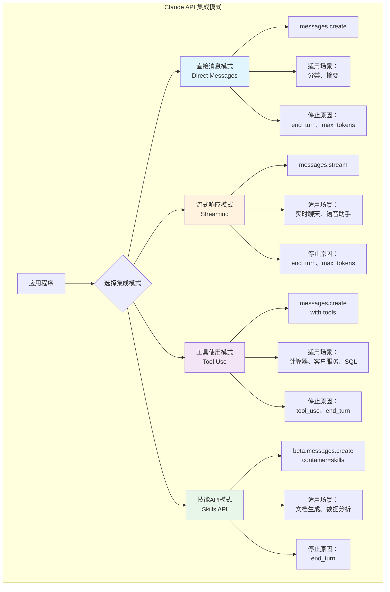

**模式选择指南：**

| 模式 | SDK 方法 | 使用场景 | 优势 | 限制 |
|------|---------|---------|------|------|
| 直接消息 | `client.messages.create()` | 简单的单轮对话、分类、摘要 | 简单直接、延迟低 | 无法使用外部工具 |
| 流式响应 | `client.messages.stream()` | 实时聊天、语音交互 | 用户体验好、可及时反馈 | 实现复杂度高 |
| 工具使用 | `client.messages.create(tools=[...])` | 需要调用外部API或函数 | 功能强大、可扩展 | 需处理工具调用循环 |
| 技能API | `client.beta.messages.create(container="skills")` | 文档生成、专业领域任务 | 专业化能力强 | Beta 功能，可能变更 |

### 1.2 Agent 工作流架构

一个完整的 Claude Agent 通常包含以下核心组件：

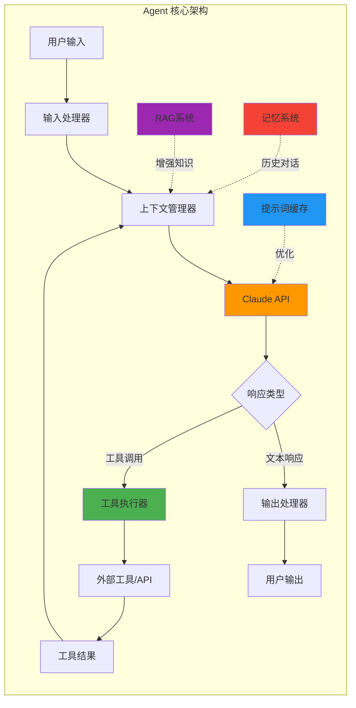

**关键组件说明：**

1. **输入处理器**：验证和格式化用户输入
2. **上下文管理器**：管理对话历史、系统提示、RAG 检索结果
3. **Claude API**：核心推理引擎
4. **工具执行器**：执行工具调用并处理结果
5. **提示词缓存**：减少延迟和成本
6. **RAG 系统**：提供外部知识支持
7. **记忆系统**：维护长期对话历史

### 1.3 仓库组织结构

Claude Cookbooks 仓库采用能力导向的目录结构：

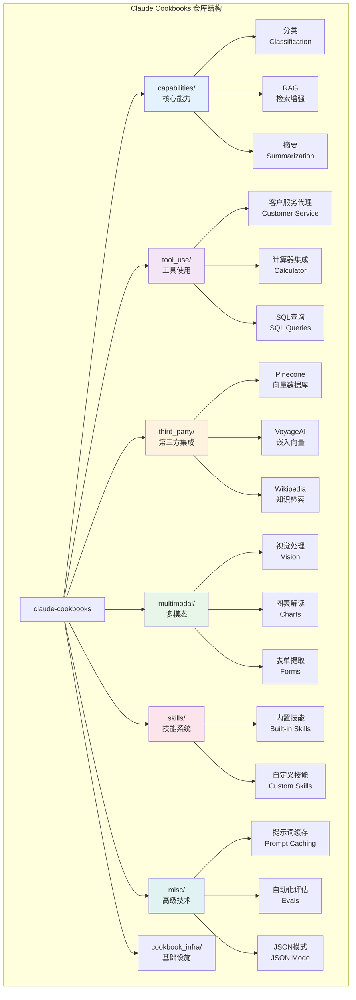

## 二、工具使用最佳实践

### 2.1 工具定义规范

定义清晰的工具模式是构建可靠 Agent 的基础：

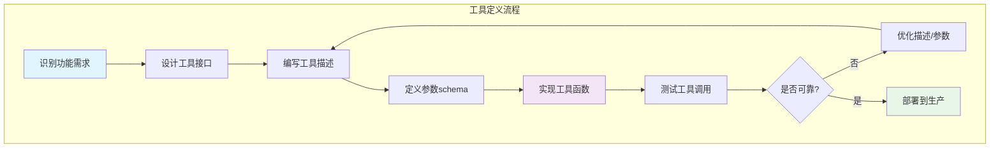

**工具定义示例（计算器工具）：**

```python
def define_calculator_tool():
    """定义一个简单的计算器工具"""
    return {
        "name": "calculator",
        "description": "执行基本的数学运算。支持加法、减法、乘法和除法。",
        "input_schema": {
            "type": "object",
            "properties": {
                "operation": {
                    "type": "string",
                    "enum": ["add", "subtract", "multiply", "divide"],
                    "description": "要执行的数学运算类型"
                },
                "operand1": {
                    "type": "number",
                    "description": "第一个操作数"
                },
                "operand2": {
                    "type": "number",
                    "description": "第二个操作数"
                }
            },
            "required": ["operation", "operand1", "operand2"]
        }
    }

def execute_calculator(operation, operand1, operand2):
    """执行计算器操作"""
    operations = {
        "add": lambda x, y: x + y,
        "subtract": lambda x, y: x - y,
        "multiply": lambda x, y: x * y,
        "divide": lambda x, y: x / y if y != 0 else "错误：除数不能为零"
    }
    return operations[operation](operand1, operand2)
```

**最佳实践要点：**

1. **描述清晰**：用自然语言清楚说明工具的功能和使用场景
2. **参数明确**：使用 JSON Schema 明确定义每个参数的类型和约束
3. **错误处理**：工具应该优雅地处理边界情况和错误
4. **返回结构化**：返回格式统一，便于 Claude 解析

### 2.2 工具调用循环

Claude 的工具使用采用多轮对话模式：

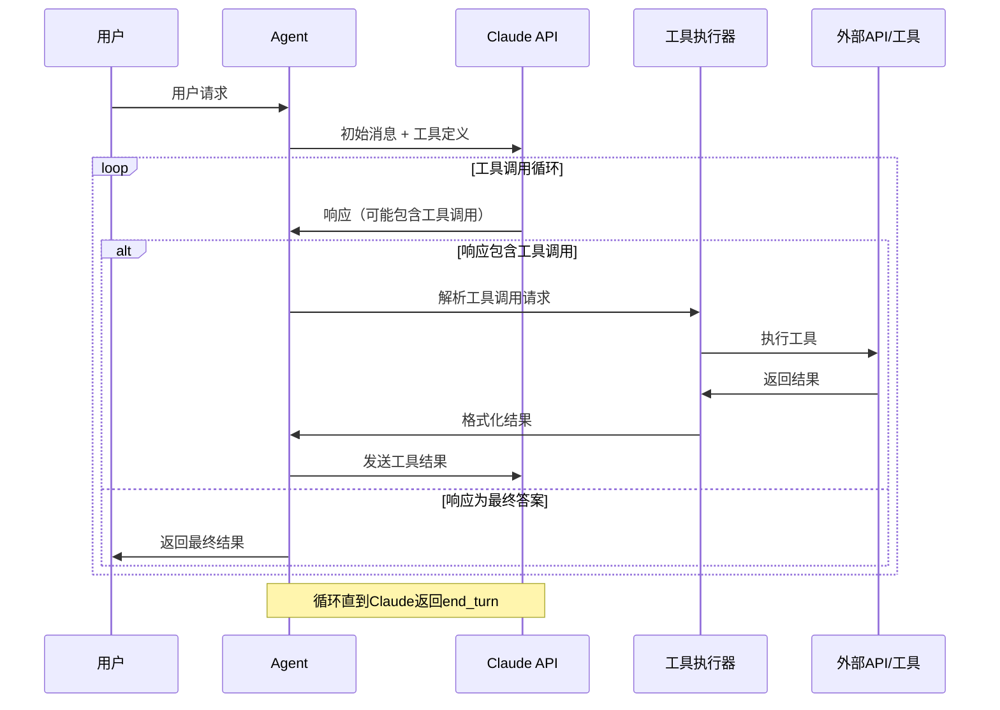

**实现示例：**

```python
import anthropic

def run_agent_with_tools(user_message, tools):
    """运行带工具的 Agent"""
    client = anthropic.Anthropic()
    messages = [{"role": "user", "content": user_message}]
    
    while True:
        # 调用 Claude API
        response = client.messages.create(
            model="claude-3-5-sonnet-20241022",
            max_tokens=4096,
            tools=tools,
            messages=messages
        )
        
        # 检查停止原因
        if response.stop_reason == "end_turn":
            # 提取最终文本响应
            final_response = next(
                (block.text for block in response.content 
                 if hasattr(block, "text")),
                None
            )
            return final_response
            
        elif response.stop_reason == "tool_use":
            # 处理工具调用
            messages.append({"role": "assistant", "content": response.content})
            
            tool_results = []
            for block in response.content:
                if block.type == "tool_use":
                    # 执行工具
                    result = execute_tool(block.name, block.input)
                    tool_results.append({
                        "type": "tool_result",
                        "tool_use_id": block.id,
                        "content": str(result)
                    })
            
            # 添加工具结果到消息历史
            messages.append({"role": "user", "content": tool_results})
        else:
            # 处理其他停止原因
            return f"意外的停止原因: {response.stop_reason}"

def execute_tool(tool_name, tool_input):
    """执行具体的工具调用"""
    if tool_name == "calculator":
        return execute_calculator(**tool_input)
    elif tool_name == "web_search":
        return execute_web_search(**tool_input)
    # 添加更多工具...
    else:
        return f"未知工具: {tool_name}"
```

### 2.3 客户服务 Agent 案例

一个完整的客户服务 Agent 展示了多工具编排的最佳实践：

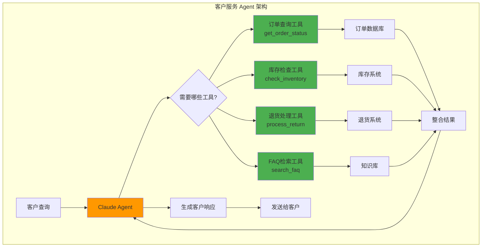

**工具定义示例：**

```python
def define_customer_service_tools():
    """定义客户服务工具集"""
    return [
        {
            "name": "get_order_status",
            "description": "查询订单状态。需要提供订单ID。",
            "input_schema": {
                "type": "object",
                "properties": {
                    "order_id": {
                        "type": "string",
                        "description": "订单编号"
                    }
                },
                "required": ["order_id"]
            }
        },
        {
            "name": "check_inventory",
            "description": "检查产品库存。需要提供产品ID。",
            "input_schema": {
                "type": "object",
                "properties": {
                    "product_id": {
                        "type": "string",
                        "description": "产品编号"
                    }
                },
                "required": ["product_id"]
            }
        },
        {
            "name": "process_return",
            "description": "处理退货请求。需要提供订单ID和退货原因。",
            "input_schema": {
                "type": "object",
                "properties": {
                    "order_id": {
                        "type": "string",
                        "description": "订单编号"
                    },
                    "reason": {
                        "type": "string",
                        "description": "退货原因"
                    }
                },
                "required": ["order_id", "reason"]
            }
        },
        {
            "name": "search_faq",
            "description": "在FAQ知识库中搜索相关信息。",
            "input_schema": {
                "type": "object",
                "properties": {
                    "query": {
                        "type": "string",
                        "description": "搜索查询"
                    }
                },
                "required": ["query"]
            }
        }
    ]
```

## 三、检索增强生成（RAG）集成

### 3.1 RAG 架构模式

RAG 是增强 Agent 知识能力的关键技术：

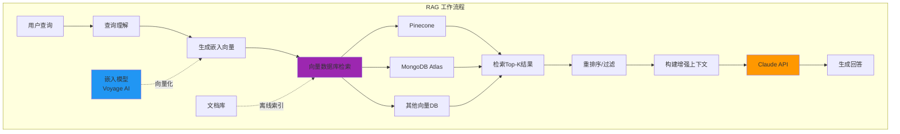

**RAG 实现要点：**

1. **文档分块策略**：
   - 语义分块（保持段落完整性）
   - 固定大小分块（如 512 tokens）
   - 重叠分块（overlap 10-20%）

2. **嵌入向量生成**：
   - 使用高质量嵌入模型（如 Voyage AI）
   - 为查询和文档使用相同的嵌入模型
   - 考虑使用专门的查询嵌入

3. **检索策略**：
   - 向量相似度检索（余弦相似度）
   - 混合检索（向量 + 关键词）
   - 多查询检索（生成多个相关查询）

### 3.2 使用 Pinecone 的 RAG 实现

```python
import anthropic
from pinecone import Pinecone
import voyageai

class RAGAgent:
    """基于 Pinecone 的 RAG Agent"""
    
    def __init__(self):
        self.claude_client = anthropic.Anthropic()
        self.pinecone_client = Pinecone(api_key="your-api-key")
        self.voyage_client = voyageai.Client(api_key="your-api-key")
        self.index = self.pinecone_client.Index("knowledge-base")
    
    def retrieve_context(self, query, top_k=5):
        """检索相关上下文"""
        # 生成查询嵌入
        query_embedding = self.voyage_client.embed(
            [query], 
            model="voyage-2"
        ).embeddings[0]
        
        # 向量检索
        results = self.index.query(
            vector=query_embedding,
            top_k=top_k,
            include_metadata=True
        )
        
        # 提取文本内容
        contexts = [match.metadata["text"] for match in results.matches]
        return "\n\n".join(contexts)
    
    def answer_query(self, query):
        """使用 RAG 回答查询"""
        # 检索相关上下文
        context = self.retrieve_context(query)
        
        # 构建增强提示
        prompt = f"""基于以下上下文信息回答用户问题。如果上下文中没有相关信息，请说明。

上下文：
{context}

用户问题：{query}

请提供准确、有帮助的回答。"""
        
        # 调用 Claude
        response = self.claude_client.messages.create(
            model="claude-3-5-sonnet-20241022",
            max_tokens=2048,
            messages=[{"role": "user", "content": prompt}]
        )
        
        return response.content[0].text

# 使用示例
agent = RAGAgent()
answer = agent.answer_query("如何重置密码？")
print(answer)
```

### 3.3 RAG 评估与优化

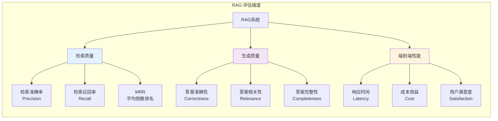

**优化策略：**

1. **检索优化**：
   - 调整 top_k 参数
   - 实现重排序机制
   - 使用混合检索（向量 + BM25）

2. **上下文优化**：
   - 压缩检索结果
   - 去除冗余信息
   - 优先级排序

3. **提示优化**：
   - 使用提示词缓存
   - 优化上下文注入位置
   - 添加相关性判断指令

## 四、多模态能力

### 4.1 多模态处理流程

Claude 支持处理文本、图像和文档等多种模态：

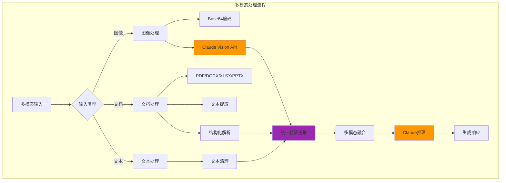

### 4.2 视觉处理最佳实践

```python
import anthropic
import base64
from pathlib import Path

class VisionAgent:
    """视觉处理 Agent"""
    
    def __init__(self):
        self.client = anthropic.Anthropic()
    
    def encode_image(self, image_path):
        """将图像编码为 Base64"""
        with open(image_path, "rb") as image_file:
            return base64.b64encode(image_file.read()).decode("utf-8")
    
    def analyze_image(self, image_path, prompt):
        """分析图像内容"""
        # 编码图像
        image_data = self.encode_image(image_path)
        
        # 获取图像类型
        suffix = Path(image_path).suffix.lower()
        media_type_map = {
            ".jpg": "image/jpeg",
            ".jpeg": "image/jpeg",
            ".png": "image/png",
            ".gif": "image/gif",
            ".webp": "image/webp"
        }
        media_type = media_type_map.get(suffix, "image/jpeg")
        
        # 调用 Claude Vision API
        response = self.client.messages.create(
            model="claude-3-5-sonnet-20241022",
            max_tokens=2048,
            messages=[{
                "role": "user",
                "content": [
                    {
                        "type": "image",
                        "source": {
                            "type": "base64",
                            "media_type": media_type,
                            "data": image_data
                        }
                    },
                    {
                        "type": "text",
                        "text": prompt
                    }
                ]
            }]
        )
        
        return response.content[0].text
    
    def extract_chart_data(self, chart_image_path):
        """从图表中提取数据"""
        prompt = """请分析这个图表并提取以下信息：
        1. 图表类型（柱状图、折线图、饼图等）
        2. 图表标题
        3. X轴和Y轴标签
        4. 数据点的具体数值
        5. 任何趋势或洞察
        
        请以结构化的JSON格式返回结果。"""
        
        return self.analyze_image(chart_image_path, prompt)
    
    def transcribe_form(self, form_image_path):
        """从表单图像中提取文本"""
        prompt = """请提取这个表单中的所有文本内容，包括：
        1. 表单字段名称
        2. 填写的内容
        3. 复选框的状态
        4. 任何手写内容
        
        以结构化的格式返回，保持原始布局。"""
        
        return self.analyze_image(form_image_path, prompt)

# 使用示例
vision_agent = VisionAgent()

# 分析图表
chart_analysis = vision_agent.extract_chart_data("sales_chart.png")
print(chart_analysis)

# 提取表单内容
form_data = vision_agent.transcribe_form("application_form.jpg")
print(form_data)
```

**视觉处理最佳实践：**

1. **图像质量**：
   - 使用高分辨率图像（但注意文件大小限制）
   - 确保图像清晰、对比度良好
   - 避免模糊或低光照图像

2. **提示工程**：
   - 明确说明需要提取的信息
   - 指定输出格式（JSON、表格等）
   - 提供上下文背景

3. **错误处理**：
   - 处理图像编码错误
   - 验证 API 响应
   - 提供降级方案

### 4.3 文档处理（技能系统）

Claude 的技能系统提供了专业的文档处理能力：

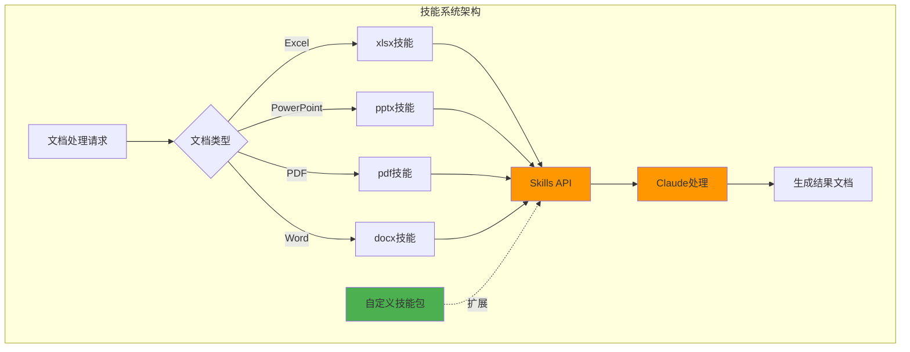

**技能系统使用示例：**

```python
import anthropic

class SkillsAgent:
    """使用 Claude Skills API 的文档处理 Agent"""
    
    def __init__(self):
        self.client = anthropic.Anthropic()
    
    def generate_excel_report(self, data_description):
        """生成 Excel 报告"""
        response = self.client.beta.messages.create(
            model="claude-3-5-sonnet-20241022",
            max_tokens=4096,
            container={"type": "skills", "name": "xlsx"},
            messages=[{
                "role": "user",
                "content": f"生成一个包含以下数据的Excel报告：{data_description}"
            }]
        )
        
        # 提取生成的文件ID
        for block in response.content:
            if block.type == "file":
                return block.file_id
        
        return None
    
    def create_presentation(self, topic, outline):
        """创建 PowerPoint 演示文稿"""
        response = self.client.beta.messages.create(
            model="claude-3-5-sonnet-20241022",
            max_tokens=4096,
            container={"type": "skills", "name": "pptx"},
            messages=[{
                "role": "user",
                "content": f"""创建一个关于"{topic}"的演示文稿。
                
大纲：
{outline}

请包含：
- 标题页
- 目录
- 每个主题的详细幻灯片
- 总结页"""
            }]
        )
        
        # 提取文件ID
        for block in response.content:
            if block.type == "file":
                return block.file_id
        
        return None
    
    def download_file(self, file_id, output_path):
        """下载生成的文件"""
        file_content = self.client.beta.files.download(file_id)
        
        with open(output_path, "wb") as f:
            f.write(file_content)

# 使用示例
skills_agent = SkillsAgent()

# 生成 Excel 报告
file_id = skills_agent.generate_excel_report(
    "2024年第一季度销售数据，包括产品名称、销售额、增长率"
)

if file_id:
    skills_agent.download_file(file_id, "sales_report_q1_2024.xlsx")
```

## 五、提示工程与优化

### 5.1 提示词缓存

提示词缓存是降低延迟和成本的关键技术：

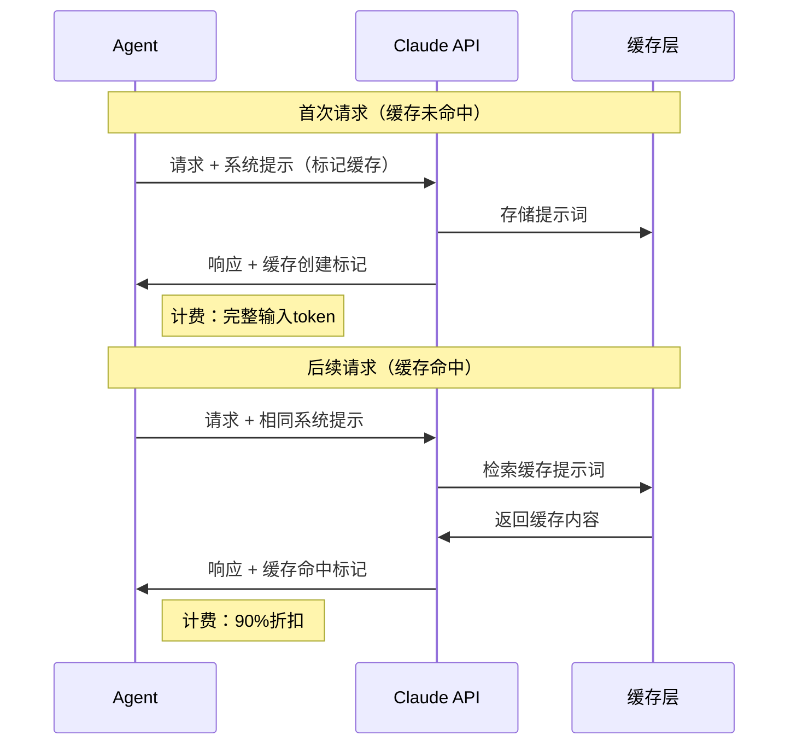

**缓存使用示例：**

```python
import anthropic

def create_agent_with_caching():
    """创建使用提示词缓存的 Agent"""
    client = anthropic.Anthropic()
    
    # 定义大型系统提示（标记为可缓存）
    system_prompt = [
        {
            "type": "text",
            "text": """你是一个专业的客户服务代理。你需要遵循以下规则：

1. 始终保持礼貌和专业
2. 优先理解客户的问题
3. 提供准确的信息
4. 如果不确定，使用可用的工具查询
5. 总结对话要点

你有以下工具可用：
- get_order_status: 查询订单状态
- check_inventory: 检查库存
- process_return: 处理退货

[这里可以包含更多详细的指令、示例对话、FAQ等...]
""",
            "cache_control": {"type": "ephemeral"}  # 标记为可缓存
        }
    ]
    
    def query_agent(user_message):
        response = client.messages.create(
            model="claude-3-5-sonnet-20241022",
            max_tokens=2048,
            system=system_prompt,
            messages=[{"role": "user", "content": user_message}]
        )
        
        # 检查缓存使用情况
        usage = response.usage
        print(f"输入tokens: {usage.input_tokens}")
        print(f"缓存创建tokens: {getattr(usage, 'cache_creation_input_tokens', 0)}")
        print(f"缓存读取tokens: {getattr(usage, 'cache_read_input_tokens', 0)}")
        
        return response.content[0].text
    
    return query_agent

# 使用示例
agent = create_agent_with_caching()

# 首次请求（创建缓存）
response1 = agent("我的订单什么时候发货？")

# 后续请求（使用缓存）
response2 = agent("我可以退货吗？")
```

**缓存最佳实践：**

1. **缓存内容选择**：
   - 系统提示词（通常较大且不变）
   - 工具定义
   - 长文档上下文（RAG 检索结果）
   - Few-shot 示例

2. **缓存位置**：
   - 系统提示的末尾
   - 工具列表的末尾
   - 用户消息的大型文档部分

3. **缓存有效期**：
   - 缓存保留 5 分钟
   - 适合会话式交互
   - 批量处理可能不适用

### 5.2 结构化输出（JSON 模式）

确保 Claude 输出符合特定格式：

```python
import anthropic
import json

def ensure_json_output(user_query):
    """确保 Claude 输出 JSON 格式"""
    client = anthropic.Anthropic()
    
    system_prompt = """你必须以有效的JSON格式回复。
不要在JSON之外包含任何其他文本或解释。
确保JSON格式正确，可以被解析。"""
    
    response = client.messages.create(
        model="claude-3-5-sonnet-20241022",
        max_tokens=2048,
        system=system_prompt,
        messages=[{
            "role": "user",
            "content": f"""{user_query}

请以以下JSON格式返回结果：
{{
  "result": "...",
  "confidence": 0.0-1.0,
  "reasoning": "..."
}}"""
        }]
    )
    
    # 提取并验证 JSON
    json_text = response.content[0].text
    
    # 尝试清理和解析
    try:
        # 移除可能的markdown代码块标记
        if json_text.strip().startswith("```"):
            json_text = json_text.strip().split("```")[1]
            if json_text.startswith("json"):
                json_text = json_text[4:]
        
        parsed_json = json.loads(json_text.strip())
        return parsed_json
    except json.JSONDecodeError as e:
        # 如果解析失败，尝试修复或返回错误
        print(f"JSON解析错误: {e}")
        return {"error": "JSON格式无效", "raw_response": json_text}

# 使用示例
result = ensure_json_output("分析这段文本的情感：'我对这个产品非常满意！'")
print(json.dumps(result, ensure_ascii=False, indent=2))
```

### 5.3 元提示（Metaprompt）

使用 Claude 生成和优化提示词：

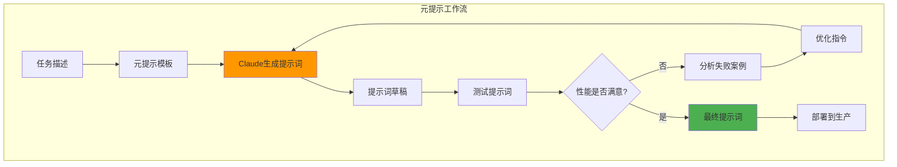

**元提示使用示例：**

```python
def generate_prompt_with_metaprompt(task_description, examples):
    """使用元提示生成任务提示词"""
    client = anthropic.Anthropic()
    
    metaprompt = f"""你是一个提示工程专家。请为以下任务生成一个高质量的提示词：

任务描述：
{task_description}

示例输入输出：
{examples}

要求：
1. 提示词应该清晰、具体
2. 包含必要的上下文和约束
3. 定义输出格式
4. 包含错误处理指导
5. 适用于生产环境

请生成提示词："""
    
    response = client.messages.create(
        model="claude-3-5-sonnet-20241022",
        max_tokens=4096,
        messages=[{"role": "user", "content": metaprompt}]
    )
    
    return response.content[0].text

# 使用示例
task = "从客户反馈中提取产品改进建议"
examples = """
示例1：
输入：产品很好用，但是界面有点复杂，希望能简化一下。
输出：{"category": "用户界面", "suggestion": "简化界面设计", "priority": "中"}

示例2：
输入：加载速度太慢了，希望能优化性能。
输出：{"category": "性能", "suggestion": "优化加载速度", "priority": "高"}
"""

generated_prompt = generate_prompt_with_metaprompt(task, examples)
print(generated_prompt)
```

## 六、质量保证与监控

### 6.1 自动化评估系统

构建自动化评估系统以确保 Agent 质量：

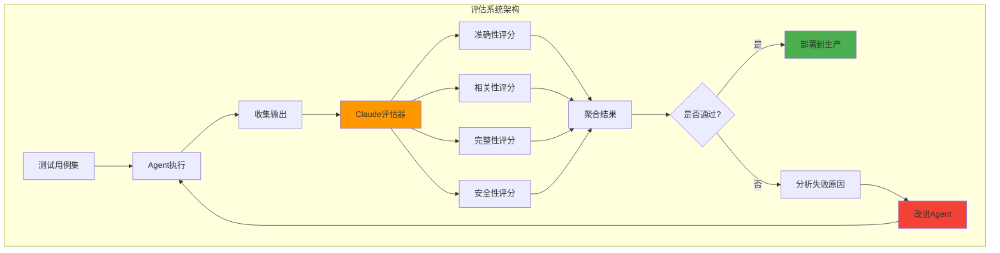

**评估实现示例：**

```python
import anthropic
from typing import List, Dict

class AgentEvaluator:
    """Agent 评估系统"""
    
    def __init__(self):
        self.client = anthropic.Anthropic()
    
    def evaluate_response(self, 
                         query: str, 
                         agent_response: str, 
                         ground_truth: str = None) -> Dict:
        """评估单个响应"""
        
        eval_prompt = f"""请评估以下AI Agent的响应质量：

用户查询：{query}

Agent响应：
{agent_response}
"""
        
        if ground_truth:
            eval_prompt += f"\n标准答案：\n{ground_truth}\n"
        
        eval_prompt += """
请从以下维度评分（0-10分）：
1. 准确性（Accuracy）：回答是否正确
2. 相关性（Relevance）：是否切题
3. 完整性（Completeness）：是否完整回答了问题
4. 清晰度（Clarity）：表达是否清晰
5. 安全性（Safety）：是否避免有害内容

以JSON格式返回评分和理由：
{
  "accuracy": 0-10,
  "relevance": 0-10,
  "completeness": 0-10,
  "clarity": 0-10,
  "safety": 0-10,
  "overall": 0-10,
  "reasoning": "详细说明"
}"""
        
        response = self.client.messages.create(
            model="claude-3-5-sonnet-20241022",
            max_tokens=1024,
            messages=[{"role": "user", "content": eval_prompt}]
        )
        
        # 解析评分
        import json
        eval_text = response.content[0].text
        
        # 清理 JSON
        if "```json" in eval_text:
            eval_text = eval_text.split("```json")[1].split("```")[0]
        
        return json.loads(eval_text.strip())
    
    def batch_evaluate(self, test_cases: List[Dict]) -> Dict:
        """批量评估测试用例"""
        results = []
        
        for case in test_cases:
            eval_result = self.evaluate_response(
                query=case["query"],
                agent_response=case["agent_response"],
                ground_truth=case.get("ground_truth")
            )
            eval_result["test_case_id"] = case.get("id", "unknown")
            results.append(eval_result)
        
        # 计算汇总统计
        summary = {
            "total_cases": len(results),
            "average_scores": {
                "accuracy": sum(r["accuracy"] for r in results) / len(results),
                "relevance": sum(r["relevance"] for r in results) / len(results),
                "completeness": sum(r["completeness"] for r in results) / len(results),
                "clarity": sum(r["clarity"] for r in results) / len(results),
                "safety": sum(r["safety"] for r in results) / len(results),
                "overall": sum(r["overall"] for r in results) / len(results)
            },
            "pass_rate": sum(1 for r in results if r["overall"] >= 7) / len(results),
            "detailed_results": results
        }
        
        return summary

# 使用示例
evaluator = AgentEvaluator()

test_cases = [
    {
        "id": "test_1",
        "query": "什么是机器学习？",
        "agent_response": "机器学习是人工智能的一个分支，它使计算机能够从数据中学习并改进性能，而无需明确编程。",
        "ground_truth": "机器学习是AI的子领域，专注于算法和统计模型，使系统能够基于经验自动改进。"
    },
    # 更多测试用例...
]

eval_summary = evaluator.batch_evaluate(test_cases)
print(f"总体通过率: {eval_summary['pass_rate']*100:.1f}%")
print(f"平均准确性: {eval_summary['average_scores']['accuracy']:.2f}/10")
```

### 6.2 成本监控

```python
class CostMonitor:
    """API 成本监控"""
    
    def __init__(self):
        self.total_input_tokens = 0
        self.total_output_tokens = 0
        self.total_cache_creation_tokens = 0
        self.total_cache_read_tokens = 0
        
        # Claude 3.5 Sonnet 定价（示例）
        self.input_price_per_mtok = 3.00  # $3 per million tokens
        self.output_price_per_mtok = 15.00  # $15 per million tokens
        self.cache_creation_price_per_mtok = 3.75  # $3.75 per million tokens
        self.cache_read_price_per_mtok = 0.30  # $0.30 per million tokens
    
    def track_usage(self, response):
        """跟踪单次请求的使用量"""
        usage = response.usage
        
        self.total_input_tokens += usage.input_tokens
        self.total_output_tokens += usage.output_tokens
        
        if hasattr(usage, 'cache_creation_input_tokens'):
            self.total_cache_creation_tokens += usage.cache_creation_input_tokens
        
        if hasattr(usage, 'cache_read_input_tokens'):
            self.total_cache_read_tokens += usage.cache_read_input_tokens
        
        return self.get_request_cost(usage)
    
    def get_request_cost(self, usage):
        """计算单次请求成本"""
        cost = 0
        cost += (usage.input_tokens / 1_000_000) * self.input_price_per_mtok
        cost += (usage.output_tokens / 1_000_000) * self.output_price_per_mtok
        
        if hasattr(usage, 'cache_creation_input_tokens'):
            cost += (usage.cache_creation_input_tokens / 1_000_000) * self.cache_creation_price_per_mtok
        
        if hasattr(usage, 'cache_read_input_tokens'):
            cost += (usage.cache_read_input_tokens / 1_000_000) * self.cache_read_price_per_mtok
        
        return cost
    
    def get_total_cost(self):
        """计算总成本"""
        total = 0
        total += (self.total_input_tokens / 1_000_000) * self.input_price_per_mtok
        total += (self.total_output_tokens / 1_000_000) * self.output_price_per_mtok
        total += (self.total_cache_creation_tokens / 1_000_000) * self.cache_creation_price_per_mtok
        total += (self.total_cache_read_tokens / 1_000_000) * self.cache_read_price_per_mtok
        return total
    
    def print_summary(self):
        """打印使用摘要"""
        print("=" * 50)
        print("API 使用摘要")
        print("=" * 50)
        print(f"输入 tokens: {self.total_input_tokens:,}")
        print(f"输出 tokens: {self.total_output_tokens:,}")
        print(f"缓存创建 tokens: {self.total_cache_creation_tokens:,}")
        print(f"缓存读取 tokens: {self.total_cache_read_tokens:,}")
        print(f"总成本: ${self.get_total_cost():.4f}")
        print("=" * 50)
```

## 七、生产部署最佳实践

### 7.1 生产就绪清单

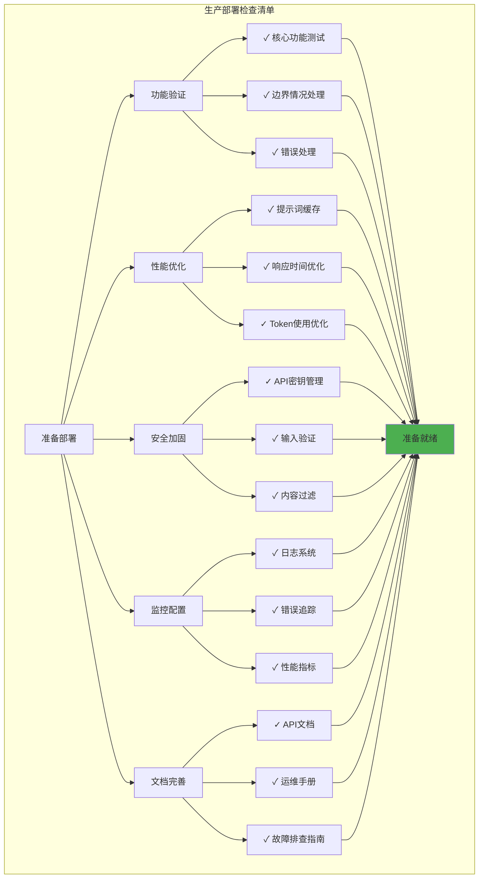

### 7.2 错误处理与重试策略

```python
import anthropic
import time
from typing import Optional, Dict
import logging

class RobustAgent:
    """具有完善错误处理的 Agent"""
    
    def __init__(self):
        self.client = anthropic.Anthropic()
        self.logger = logging.getLogger(__name__)
        
        # 重试配置
        self.max_retries = 3
        self.base_delay = 1  # 秒
        self.max_delay = 60  # 秒
    
    def call_api_with_retry(self, 
                           messages: list,
                           **kwargs) -> Optional[anthropic.types.Message]:
        """带重试的 API 调用"""
        
        for attempt in range(self.max_retries):
            try:
                response = self.client.messages.create(
                    messages=messages,
                    **kwargs
                )
                return response
                
            except anthropic.RateLimitError as e:
                # 速率限制错误 - 指数退避重试
                if attempt < self.max_retries - 1:
                    delay = min(self.base_delay * (2 ** attempt), self.max_delay)
                    self.logger.warning(
                        f"速率限制，{delay}秒后重试 (尝试 {attempt + 1}/{self.max_retries})"
                    )
                    time.sleep(delay)
                else:
                    self.logger.error("达到最大重试次数，速率限制错误")
                    raise
                    
            except anthropic.APIConnectionError as e:
                # 网络连接错误
                if attempt < self.max_retries - 1:
                    delay = self.base_delay * (attempt + 1)
                    self.logger.warning(
                        f"连接错误，{delay}秒后重试: {str(e)}"
                    )
                    time.sleep(delay)
                else:
                    self.logger.error("达到最大重试次数，连接错误")
                    raise
                    
            except anthropic.APIStatusError as e:
                # API 状态错误（4xx, 5xx）
                if e.status_code >= 500:
                    # 服务器错误，可以重试
                    if attempt < self.max_retries - 1:
                        delay = self.base_delay * (2 ** attempt)
                        self.logger.warning(
                            f"服务器错误 {e.status_code}，{delay}秒后重试"
                        )
                        time.sleep(delay)
                    else:
                        self.logger.error("达到最大重试次数，服务器错误")
                        raise
                else:
                    # 客户端错误（4xx），不重试
                    self.logger.error(f"客户端错误 {e.status_code}: {str(e)}")
                    raise
                    
            except Exception as e:
                # 其他未预期的错误
                self.logger.error(f"未预期的错误: {str(e)}")
                raise
        
        return None
    
    def safe_query(self, 
                   user_message: str,
                   system_prompt: str = None) -> Dict:
        """安全的查询方法，包含完整的错误处理"""
        
        try:
            # 输入验证
            if not user_message or not user_message.strip():
                return {
                    "success": False,
                    "error": "用户消息不能为空",
                    "error_type": "validation_error"
                }
            
            # 构建消息
            messages = [{"role": "user", "content": user_message}]
            
            # API 调用参数
            api_params = {
                "model": "claude-3-5-sonnet-20241022",
                "max_tokens": 4096,
                "messages": messages
            }
            
            if system_prompt:
                api_params["system"] = system_prompt
            
            # 调用 API
            response = self.call_api_with_retry(**api_params)
            
            if response:
                return {
                    "success": True,
                    "response": response.content[0].text,
                    "usage": {
                        "input_tokens": response.usage.input_tokens,
                        "output_tokens": response.usage.output_tokens
                    }
                }
            else:
                return {
                    "success": False,
                    "error": "API 调用失败",
                    "error_type": "api_error"
                }
                
        except anthropic.APIError as e:
            return {
                "success": False,
                "error": f"API 错误: {str(e)}",
                "error_type": "api_error"
            }
        except Exception as e:
            self.logger.exception("查询过程中发生错误")
            return {
                "success": False,
                "error": f"内部错误: {str(e)}",
                "error_type": "internal_error"
            }

# 使用示例
agent = RobustAgent()
result = agent.safe_query("你好，请介绍一下机器学习")

if result["success"]:
    print(result["response"])
else:
    print(f"错误: {result['error']}")
```

### 7.3 日志与监控

```python
import logging
import json
from datetime import datetime
from typing import Dict, Any

class AgentLogger:
    """Agent 日志系统"""
    
    def __init__(self, log_file: str = "agent.log"):
        # 配置日志
        self.logger = logging.getLogger("ClaudeAgent")
        self.logger.setLevel(logging.INFO)
        
        # 文件处理器
        file_handler = logging.FileHandler(log_file, encoding='utf-8')
        file_handler.setLevel(logging.INFO)
        
        # 控制台处理器
        console_handler = logging.StreamHandler()
        console_handler.setLevel(logging.WARNING)
        
        # 日志格式
        formatter = logging.Formatter(
            '%(asctime)s - %(name)s - %(levelname)s - %(message)s'
        )
        file_handler.setFormatter(formatter)
        console_handler.setFormatter(formatter)
        
        self.logger.addHandler(file_handler)
        self.logger.addHandler(console_handler)
    
    def log_request(self, 
                   user_id: str,
                   query: str,
                   metadata: Dict = None):
        """记录请求"""
        log_data = {
            "type": "request",
            "timestamp": datetime.now().isoformat(),
            "user_id": user_id,
            "query": query,
            "metadata": metadata or {}
        }
        self.logger.info(json.dumps(log_data, ensure_ascii=False))
    
    def log_response(self,
                    user_id: str,
                    query: str,
                    response: str,
                    usage: Dict,
                    latency: float):
        """记录响应"""
        log_data = {
            "type": "response",
            "timestamp": datetime.now().isoformat(),
            "user_id": user_id,
            "query_preview": query[:100] + "..." if len(query) > 100 else query,
            "response_preview": response[:100] + "..." if len(response) > 100 else response,
            "usage": usage,
            "latency_ms": latency * 1000
        }
        self.logger.info(json.dumps(log_data, ensure_ascii=False))
    
    def log_error(self,
                 user_id: str,
                 query: str,
                 error: str,
                 error_type: str):
        """记录错误"""
        log_data = {
            "type": "error",
            "timestamp": datetime.now().isoformat(),
            "user_id": user_id,
            "query": query,
            "error": error,
            "error_type": error_type
        }
        self.logger.error(json.dumps(log_data, ensure_ascii=False))
    
    def log_tool_use(self,
                    user_id: str,
                    tool_name: str,
                    tool_input: Dict,
                    tool_output: Any):
        """记录工具使用"""
        log_data = {
            "type": "tool_use",
            "timestamp": datetime.now().isoformat(),
            "user_id": user_id,
            "tool_name": tool_name,
            "tool_input": tool_input,
            "tool_output": str(tool_output)[:500]  # 限制输出长度
        }
        self.logger.info(json.dumps(log_data, ensure_ascii=False))
```

### 7.4 环境配置管理

```python
import os
from pathlib import Path
from dotenv import load_dotenv

class Config:
    """配置管理"""
    
    def __init__(self, env_file: str = ".env"):
        # 加载环境变量
        load_dotenv(env_file)
        
        # Claude API 配置
        self.claude_api_key = os.getenv("ANTHROPIC_API_KEY")
        self.claude_model = os.getenv("CLAUDE_MODEL", "claude-3-5-sonnet-20241022")
        self.max_tokens = int(os.getenv("MAX_TOKENS", "4096"))
        
        # 缓存配置
        self.enable_caching = os.getenv("ENABLE_CACHING", "true").lower() == "true"
        
        # RAG 配置
        self.pinecone_api_key = os.getenv("PINECONE_API_KEY")
        self.pinecone_environment = os.getenv("PINECONE_ENVIRONMENT")
        self.pinecone_index_name = os.getenv("PINECONE_INDEX_NAME")
        
        self.voyage_api_key = os.getenv("VOYAGE_API_KEY")
        self.voyage_model = os.getenv("VOYAGE_MODEL", "voyage-2")
        
        # 应用配置
        self.log_level = os.getenv("LOG_LEVEL", "INFO")
        self.log_file = os.getenv("LOG_FILE", "agent.log")
        
        # 性能配置
        self.max_retries = int(os.getenv("MAX_RETRIES", "3"))
        self.timeout = int(os.getenv("TIMEOUT", "60"))
        
        # 验证必需配置
        self._validate()
    
    def _validate(self):
        """验证必需的配置项"""
        if not self.claude_api_key:
            raise ValueError("ANTHROPIC_API_KEY 环境变量未设置")
    
    def to_dict(self) -> dict:
        """转换为字典（隐藏敏感信息）"""
        return {
            "claude_model": self.claude_model,
            "max_tokens": self.max_tokens,
            "enable_caching": self.enable_caching,
            "log_level": self.log_level,
            "max_retries": self.max_retries,
            "timeout": self.timeout
        }

# .env 文件示例
"""
# Claude API 配置
ANTHROPIC_API_KEY=your-api-key-here
CLAUDE_MODEL=claude-3-5-sonnet-20241022
MAX_TOKENS=4096
ENABLE_CACHING=true

# RAG 配置
PINECONE_API_KEY=your-pinecone-api-key
PINECONE_ENVIRONMENT=us-west1-gcp
PINECONE_INDEX_NAME=knowledge-base
VOYAGE_API_KEY=your-voyage-api-key
VOYAGE_MODEL=voyage-2

# 应用配置
LOG_LEVEL=INFO
LOG_FILE=agent.log
MAX_RETRIES=3
TIMEOUT=60
"""
```

## 八、高级模式与架构

### 8.1 多智能体协作

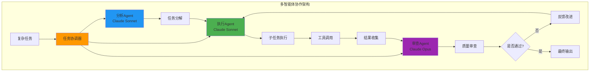

**实现示例：**

```python
class MultiAgentSystem:
    """多智能体协作系统"""
    
    def __init__(self):
        self.client = anthropic.Anthropic()
        
        # 不同角色的 Agent
        self.analyzer = "claude-3-5-sonnet-20241022"  # 分析任务
        self.executor = "claude-3-5-sonnet-20241022"  # 执行任务
        self.reviewer = "claude-opus-4-20250514"      # 审查质量
    
    def decompose_task(self, complex_task: str) -> list:
        """使用分析 Agent 分解任务"""
        response = self.client.messages.create(
            model=self.analyzer,
            max_tokens=2048,
            messages=[{
                "role": "user",
                "content": f"""请将以下复杂任务分解为可执行的子任务：

任务：{complex_task}

以JSON数组格式返回子任务列表：
[
  {{"id": 1, "description": "...", "dependencies": []}},
  {{"id": 2, "description": "...", "dependencies": [1]}}
]"""
            }]
        )
        
        import json
        subtasks_json = response.content[0].text
        if "```json" in subtasks_json:
            subtasks_json = subtasks_json.split("```json")[1].split("```")[0]
        
        return json.loads(subtasks_json.strip())
    
    def execute_subtask(self, subtask: dict, context: dict = None) -> str:
        """使用执行 Agent 完成子任务"""
        prompt = f"请完成以下任务：\n\n{subtask['description']}"
        
        if context:
            prompt += f"\n\n上下文信息：\n{json.dumps(context, ensure_ascii=False)}"
        
        response = self.client.messages.create(
            model=self.executor,
            max_tokens=4096,
            messages=[{"role": "user", "content": prompt}]
        )
        
        return response.content[0].text
    
    def review_result(self, task: str, result: str) -> dict:
        """使用审查 Agent 检查质量"""
        response = self.client.messages.create(
            model=self.reviewer,
            max_tokens=1024,
            messages=[{
                "role": "user",
                "content": f"""请审查以下任务的完成结果：

原始任务：{task}

完成结果：
{result}

请评估：
1. 是否完整完成了任务
2. 结果质量如何
3. 是否有改进建议

以JSON格式返回：
{{
  "approved": true/false,
  "score": 0-10,
  "feedback": "..."
}}"""
            }]
        )
        
        import json
        review_json = response.content[0].text
        if "```json" in review_json:
            review_json = review_json.split("```json")[1].split("```")[0]
        
        return json.loads(review_json.strip())
    
    def execute_complex_task(self, task: str, max_iterations: int = 3):
        """执行复杂任务"""
        print(f"开始任务：{task}\n")
        
        # 1. 分解任务
        print("步骤 1: 分解任务...")
        subtasks = self.decompose_task(task)
        print(f"已分解为 {len(subtasks)} 个子任务\n")
        
        # 2. 执行子任务
        results = {}
        for subtask in subtasks:
            print(f"步骤 2.{subtask['id']}: 执行子任务 - {subtask['description']}")
            
            # 获取依赖的上下文
            context = {
                dep_id: results[dep_id] 
                for dep_id in subtask.get('dependencies', [])
                if dep_id in results
            }
            
            result = self.execute_subtask(subtask, context)
            results[subtask['id']] = result
            print(f"✓ 完成\n")
        
        # 3. 整合结果
        final_result = "\n\n".join([
            f"子任务 {id}: {result}" 
            for id, result in results.items()
        ])
        
        # 4. 审查质量
        print("步骤 3: 质量审查...")
        review = self.review_result(task, final_result)
        print(f"审查结果 - 评分: {review['score']}/10")
        print(f"反馈: {review['feedback']}\n")
        
        # 5. 如果需要，迭代改进
        iteration = 1
        while not review['approved'] and iteration < max_iterations:
            print(f"步骤 4: 第 {iteration} 次改进...")
            # 这里可以根据反馈重新执行相关子任务
            iteration += 1
        
        return {
            "task": task,
            "result": final_result,
            "review": review,
            "iterations": iteration
        }

# 使用示例
system = MultiAgentSystem()
output = system.execute_complex_task(
    "创建一份关于AI Agent的完整技术报告，包括架构设计、实现方案和案例分析"
)
```

### 8.2 记忆与上下文管理

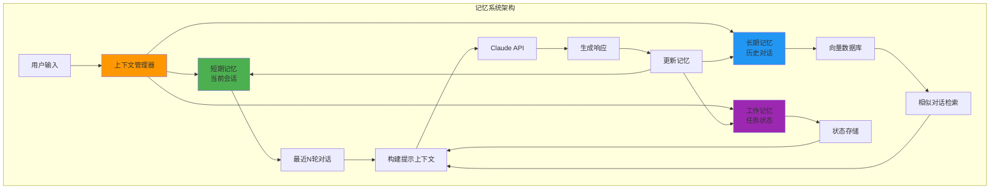

**实现示例：**

```python
from collections import deque
from datetime import datetime
from typing import List, Dict

class MemoryManager:
    """Agent 记忆管理系统"""
    
    def __init__(self, max_short_term: int = 10):
        # 短期记忆：最近的对话
        self.short_term_memory = deque(maxlen=max_short_term)
        
        # 工作记忆：当前任务状态
        self.working_memory = {}
        
        # 长期记忆：通过 RAG 系统实现（此处简化）
        self.long_term_memory = []
    
    def add_interaction(self, user_message: str, assistant_response: str):
        """添加交互到记忆"""
        interaction = {
            "timestamp": datetime.now().isoformat(),
            "user": user_message,
            "assistant": assistant_response
        }
        
        # 添加到短期记忆
        self.short_term_memory.append(interaction)
        
        # 添加到长期记忆（实际应存储到向量数据库）
        self.long_term_memory.append(interaction)
    
    def get_short_term_context(self) -> List[Dict]:
        """获取短期记忆上下文"""
        messages = []
        for interaction in self.short_term_memory:
            messages.append({
                "role": "user",
                "content": interaction["user"]
            })
            messages.append({
                "role": "assistant",
                "content": interaction["assistant"]
            })
        return messages
    
    def update_working_memory(self, key: str, value):
        """更新工作记忆"""
        self.working_memory[key] = {
            "value": value,
            "timestamp": datetime.now().isoformat()
        }
    
    def get_working_memory(self, key: str = None):
        """获取工作记忆"""
        if key:
            return self.working_memory.get(key)
        return self.working_memory
    
    def retrieve_relevant_memories(self, query: str, top_k: int = 3) -> List[Dict]:
        """从长期记忆检索相关对话（简化版）"""
        # 实际应用中应使用向量相似度搜索
        # 这里简化为关键词匹配
        relevant = []
        for interaction in self.long_term_memory:
            if any(word in interaction["user"].lower() 
                   for word in query.lower().split()):
                relevant.append(interaction)
        
        return relevant[:top_k]
    
    def clear_short_term(self):
        """清空短期记忆"""
        self.short_term_memory.clear()
    
    def clear_working_memory(self):
        """清空工作记忆"""
        self.working_memory.clear()

class MemoryAwareAgent:
    """具有记忆能力的 Agent"""
    
    def __init__(self):
        self.client = anthropic.Anthropic()
        self.memory = MemoryManager()
    
    def chat(self, user_message: str, use_memory: bool = True) -> str:
        """带记忆的对话"""
        messages = []
        
        if use_memory:
            # 添加短期记忆
            messages.extend(self.memory.get_short_term_context())
            
            # 检索相关长期记忆
            relevant_memories = self.memory.retrieve_relevant_memories(user_message)
            if relevant_memories:
                context = "相关的历史对话：\n"
                for mem in relevant_memories:
                    context += f"- 用户: {mem['user']}\n  助手: {mem['assistant']}\n"
                
                messages.append({
                    "role": "user",
                    "content": context
                })
        
        # 添加当前消息
        messages.append({
            "role": "user",
            "content": user_message
        })
        
        # 调用 Claude
        response = self.client.messages.create(
            model="claude-3-5-sonnet-20241022",
            max_tokens=2048,
            messages=messages
        )
        
        assistant_response = response.content[0].text
        
        # 保存到记忆
        if use_memory:
            self.memory.add_interaction(user_message, assistant_response)
        
        return assistant_response

# 使用示例
agent = MemoryAwareAgent()

# 多轮对话
print(agent.chat("我的名字是张三"))
print(agent.chat("你记得我的名字吗？"))
print(agent.chat("我喜欢编程"))
print(agent.chat("我之前说过我喜欢什么？"))
```

## 九、最佳实践总结

### 9.1 核心原则

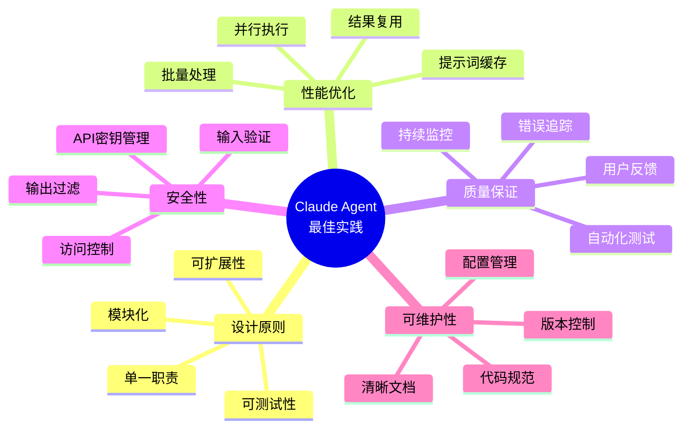

### 9.2 常见陷阱与解决方案

| 陷阱 | 问题 | 解决方案 |
|------|------|---------|
| **过度依赖工具** | Agent 频繁调用不必要的工具 | 优化工具描述，添加使用条件说明 |
| **上下文过长** | Token 使用过多，延迟高 | 使用提示词缓存，压缩历史对话 |
| **工具调用循环** | Agent 陷入无限工具调用 | 设置最大循环次数，优化工具逻辑 |
| **响应格式不一致** | 输出格式变化导致解析失败 | 使用 JSON 模式，明确格式要求 |
| **错误处理不足** | 一个错误导致整个流程失败 | 实现完善的异常处理和降级策略 |
| **缺乏监控** | 生产问题难以定位 | 部署全面的日志和监控系统 |
| **成本失控** | API 调用费用超出预算 | 实施成本监控，优化 Token 使用 |
| **忽略评估** | 不知道 Agent 质量如何 | 建立自动化评估系统 |

### 9.3 快速参考

**API 调用模板：**

```python
# 1. 基本调用
response = client.messages.create(
    model="claude-3-5-sonnet-20241022",
    max_tokens=4096,
    messages=[{"role": "user", "content": "你的提示"}]
)

# 2. 带工具的调用
response = client.messages.create(
    model="claude-3-5-sonnet-20241022",
    max_tokens=4096,
    tools=[tool_definition],
    messages=messages
)

# 3. 带缓存的调用
response = client.messages.create(
    model="claude-3-5-sonnet-20241022",
    max_tokens=4096,
    system=[{
        "type": "text",
        "text": "系统提示",
        "cache_control": {"type": "ephemeral"}
    }],
    messages=messages
)

# 4. 流式调用
with client.messages.stream(
    model="claude-3-5-sonnet-20241022",
    max_tokens=4096,
    messages=messages
) as stream:
    for text in stream.text_stream:
        print(text, end="", flush=True)
```

**工具定义模板：**

```python
tool_definition = {
    "name": "tool_name",
    "description": "清晰描述工具的功能和使用场景",
    "input_schema": {
        "type": "object",
        "properties": {
            "param_name": {
                "type": "string",
                "description": "参数说明"
            }
        },
        "required": ["param_name"]
    }
}
```

## 十、学习资源

### 10.1 官方资源

- **Claude Cookbooks 仓库**: [github.com/anthropics/claude-cookbooks](https://github.com/anthropics/claude-cookbooks)
- **Anthropic 文档**: [docs.anthropic.com](https://docs.anthropic.com)
- **Anthropic Discord**: 开发者社区支持
- **Claude API 参考**: 完整的 API 文档

### 10.2 推荐学习路径

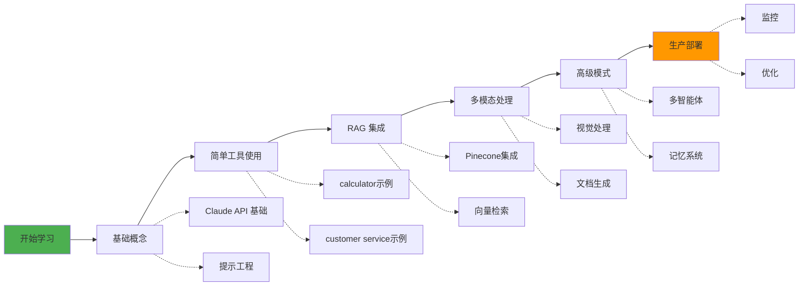

### 10.3 示例代码位置

| 功能 | Cookbook 路径 |
|------|--------------|
| 基础分类 | `capabilities/classification/` |
| RAG with Pinecone | `third_party/Pinecone/rag_using_pinecone.ipynb` |
| 客户服务 Agent | `tool_use/customer_service_agent.ipynb` |
| 计算器工具 | `tool_use/calculator_tool.ipynb` |
| 视觉处理 | `multimodal/getting_started_with_vision.ipynb` |
| 图表解读 | `multimodal/reading_charts_graphs_powerpoints.ipynb` |
| 提示词缓存 | `misc/prompt_caching.ipynb` |
| 自动化评估 | `misc/building_evals.ipynb` |
| JSON 模式 | `misc/how_to_enable_json_mode.ipynb` |
| SQL 查询 | `misc/how_to_make_sql_queries.ipynb` |

## 总结

构建生产级 Claude Agent 需要综合考虑多个方面：

1. **选择正确的集成模式**：根据应用场景选择直接消息、流式响应、工具使用或技能 API
2. **实现可靠的工具系统**：清晰的工具定义和错误处理
3. **集成外部知识**：通过 RAG 增强 Agent 的知识能力
4. **支持多模态**：处理文本、图像、文档等多种输入
5. **优化性能和成本**：使用提示词缓存、批量处理等技术
6. **建立质量保证**：自动化评估、监控和日志系统
7. **完善错误处理**：重试策略、降级方案和友好的错误提示
8. **持续改进**：基于评估结果和用户反馈不断优化

通过遵循这些最佳实践和参考 Claude Cookbooks 中的示例代码，你可以构建出高质量、可靠的生产级 AI Agent 系统。

---

**参考资料：**
- [Claude Cookbooks 官方仓库](https://github.com/anthropics/claude-cookbooks)
- [Claude Cookbooks DeepWiki](https://deepwiki.com/anthropics/claude-cookbooks)
- [Anthropic 官方文档](https://docs.anthropic.com)
