# NotebookLM 完整指南：Google 的 AI 驱动研究助手

## 项目概述

[NotebookLM](https://notebooklm.google/) 是 Google 推出的革命性 AI 驱动笔记和研究助手，利用 Google 的大语言模型 Gemini 1.5 Pro，能够理解、分析和总结用户上传的各种文档内容。它不仅是一个笔记工具，更是一个智能研究伙伴，能够帮助用户从海量信息中提取洞察、生成创意，甚至将文档转换成播客式的音频对话。

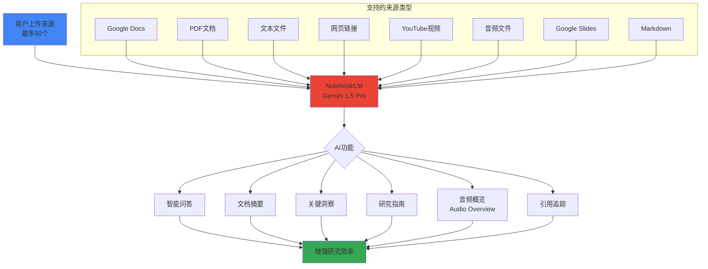
```mermaid
graph TB
    A[用户上传来源<br/>最多50个] --> B[NotebookLM<br/>Gemini 1.5 Pro]
    
    subgraph "支持的来源类型"
        C1[Google Docs]
        C2[PDF文档]
        C3[文本文件]
        C4[网页链接]
        C5[YouTube视频]
        C6[音频文件]
        C7[Google Slides]
        C8[Markdown]
    end
    
    C1 --> B
    C2 --> B
    C3 --> B
    C4 --> B
    C5 --> B
    C6 --> B
    C7 --> B
    C8 --> B
    
    B --> D{AI功能}
    
    D --> E1[智能问答]
    D --> E2[文档摘要]
    D --> E3[关键洞察]
    D --> E4[研究指南]
    D --> E5[音频概览<br/>Audio Overview]
    D --> E6[引用追踪]
    
    E1 --> F[增强研究效率]
    E2 --> F
    E3 --> F
    E4 --> F
    E5 --> F
    E6 --> F
    
    style A fill:#4285F4
    style B fill:#EA4335
    style F fill:#34A853
```

### 核心亮点

- **🤖 AI 驱动**：基于 Gemini 1.5 Pro，拥有 200 万 token 的超大上下文窗口
- **📚 多源整合**：支持 PDF、Google Docs、网页、YouTube 视频等 8 种来源类型
- **🎙️ Audio Overview**：将文档转换为自然流畅的播客式对话（革命性功能）
- **🔍 精准引用**：所有 AI 回答都附带原文引用，确保信息可追溯
- **🆓 完全免费**：无需付费订阅，拥有 Google 账号即可使用
- **🔒 隐私优先**：用户数据不用于训练 AI 模型，保护隐私安全

## 核心特性详解

### 1. 多源笔记本（Multi-Source Notebooks）

NotebookLM 允许在单个笔记本中整合多达 **50 个不同来源**，形成一个统一的知识库。

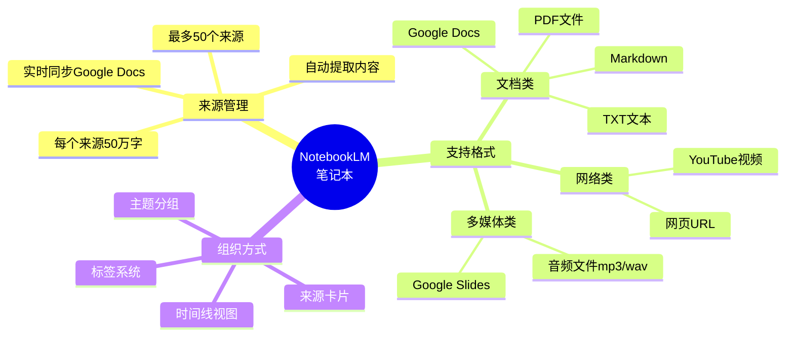
```mermaid
mindmap
  root((NotebookLM<br/>笔记本))
    来源管理
      最多50个来源
      每个来源50万字
      实时同步Google Docs
      自动提取内容
    支持格式
      文档类
        Google Docs
        PDF文件
        TXT文本
        Markdown
      网络类
        网页URL
        YouTube视频
      多媒体类
        音频文件mp3/wav
        Google Slides
    组织方式
      主题分组
      标签系统
      时间线视图
      来源卡片
```

**支持的来源类型**：

| 来源类型 | 格式/平台 | 单个大小限制 | 特殊说明 |
|---------|----------|------------|---------|
| **文档** | Google Docs | 50万字 | 支持实时同步 |
| **PDF** | .pdf | 50万字 | 支持扫描件（OCR）|
| **文本** | .txt | 50万字 | 纯文本 |
| **网页** | URL | - | 自动抓取内容 |
| **视频** | YouTube | - | 提取字幕和内容 |
| **音频** | .mp3/.wav | - | 自动转录文字 |
| **演示** | Google Slides | - | 提取文本和注释 |
| **Markdown** | .md | 50万字 | 保留格式 |

### 2. 智能问答系统

基于上传的来源，NotebookLM 可以回答各种问题，并提供精确的引用。

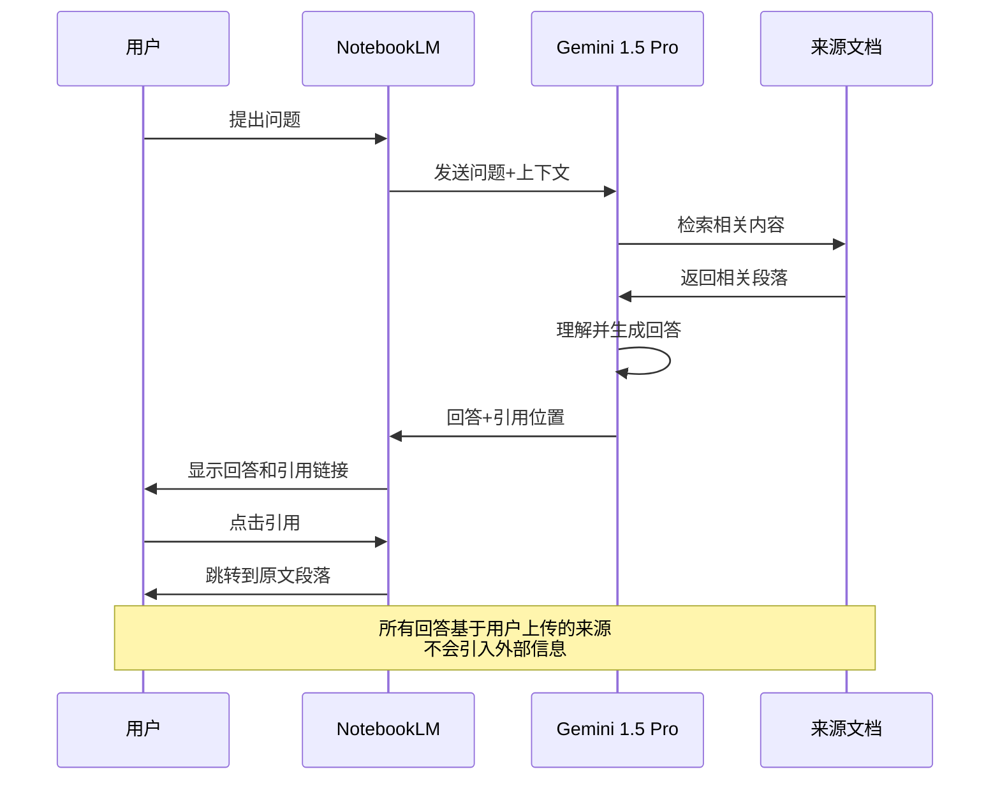
```mermaid
sequenceDiagram
    participant User as 用户
    participant NLM as NotebookLM
    participant Gemini as Gemini 1.5 Pro
    participant Sources as 来源文档
    
    User->>NLM: 提出问题
    NLM->>Gemini: 发送问题+上下文
    Gemini->>Sources: 检索相关内容
    Sources->>Gemini: 返回相关段落
    Gemini->>Gemini: 理解并生成回答
    Gemini->>NLM: 回答+引用位置
    NLM->>User: 显示回答和引用链接
    
    User->>NLM: 点击引用
    NLM->>User: 跳转到原文段落
    
    Note over User,Sources: 所有回答基于用户上传的来源<br/>不会引入外部信息
```

**问答特点**：

- ✅ **基于来源**：只回答基于上传内容的问题，不会臆造信息
- ✅ **精准引用**：每个回答都附带来源引用，可一键跳转查看原文
- ✅ **多轮对话**：支持连续追问，保持上下文理解
- ✅ **批判性思考**：能指出来源中的矛盾或不一致之处

### 3. Audio Overview（音频概览）

这是 NotebookLM 最具创新性的功能，能将枯燥的文档转换为生动的播客式对话。

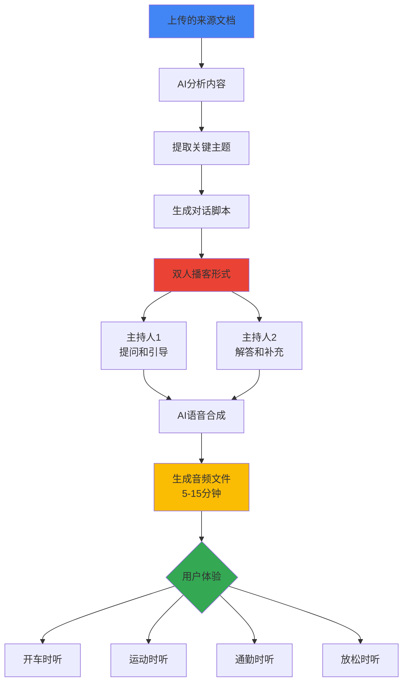
```mermaid
flowchart TD
    A[上传的来源文档] --> B[AI分析内容]
    B --> C[提取关键主题]
    C --> D[生成对话脚本]
    D --> E[双人播客形式]
    
    E --> F1[主持人1<br/>提问和引导]
    E --> F2[主持人2<br/>解答和补充]
    
    F1 --> G[AI语音合成]
    F2 --> G
    
    G --> H[生成音频文件<br/>5-15分钟]
    
    H --> I{用户体验}
    I --> J1[开车时听]
    I --> J2[运动时听]
    I --> J3[通勤时听]
    I --> J4[放松时听]
    
    style A fill:#4285F4
    style E fill:#EA4335
    style H fill:#FBBC04
    style I fill:#34A853
```

**Audio Overview 特性**：

- 🎭 **双主持人对话**：模拟真实播客，一人提问一人解答
- 🗣️ **自然语音**：使用先进的 TTS 技术，语调自然流畅
- ⏱️ **时长适中**：通常 5-15 分钟，适合碎片时间收听
- 🎯 **重点突出**：自动识别核心观点和关键信息
- 📱 **随时收听**：支持下载，可在任何设备上播放

**音频生成流程**：

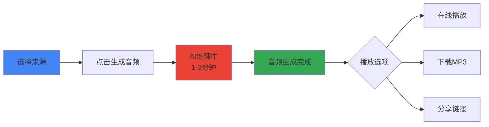
```mermaid
graph LR
    A[选择来源] --> B[点击生成音频]
    B --> C[AI处理中<br/>1-3分钟]
    C --> D[音频生成完成]
    D --> E{播放选项}
    
    E --> F1[在线播放]
    E --> F2[下载MP3]
    E --> F3[分享链接]
    
    style A fill:#4285F4
    style C fill:#EA4335
    style D fill:#34A853
```

### 4. 自动生成功能

NotebookLM 提供多种自动生成的内容，帮助快速理解文档。

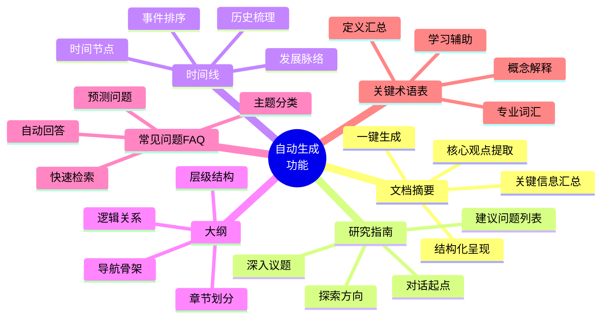
```mermaid
mindmap
  root((自动生成<br/>功能))
    文档摘要
      核心观点提取
      关键信息汇总
      结构化呈现
      一键生成
    研究指南
      建议问题列表
      探索方向
      深入议题
      对话起点
    时间线
      事件排序
      时间节点
      发展脉络
      历史梳理
    大纲
      层级结构
      章节划分
      逻辑关系
      导航骨架
    常见问题FAQ
      预测问题
      自动回答
      主题分类
      快速检索
    关键术语表
      专业词汇
      概念解释
      定义汇总
      学习辅助
```

**生成内容类型**：

| 功能 | 说明 | 使用场景 | 生成时间 |
|-----|------|---------|---------|
| **文档摘要** | 提炼核心观点 | 快速了解文档主旨 | 即时 |
| **研究指南** | 建议探索的问题 | 开始研究的起点 | 即时 |
| **时间线** | 提取时间相关事件 | 历史文档、项目进展 | 5-10秒 |
| **大纲** | 生成结构化大纲 | 长文档导航 | 5-10秒 |
| **FAQ** | 预测常见问题并回答 | 教育材料、产品文档 | 10-20秒 |
| **术语表** | 提取关键术语和定义 | 学术论文、技术文档 | 10-20秒 |

### 5. 笔记与引用管理

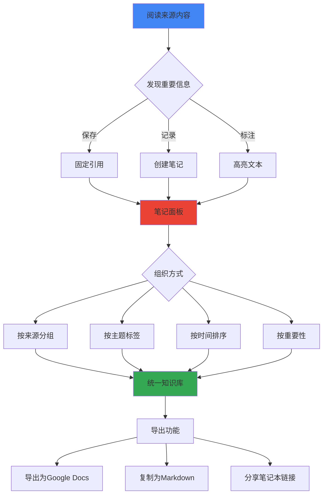
```mermaid
flowchart TD
    A[阅读来源内容] --> B{发现重要信息}
    
    B -->|保存| C1[固定引用]
    B -->|记录| C2[创建笔记]
    B -->|标注| C3[高亮文本]
    
    C1 --> D[笔记面板]
    C2 --> D
    C3 --> D
    
    D --> E{组织方式}
    
    E --> F1[按来源分组]
    E --> F2[按主题标签]
    E --> F3[按时间排序]
    E --> F4[按重要性]
    
    F1 --> G[统一知识库]
    F2 --> G
    F3 --> G
    F4 --> G
    
    G --> H[导出功能]
    H --> I1[导出为Google Docs]
    H --> I2[复制为Markdown]
    H --> I3[分享笔记本链接]
    
    style A fill:#4285F4
    style D fill:#EA4335
    style G fill:#34A853
```

**笔记功能**：

- 📌 **固定引用**：保存重要段落，随时回顾
- ✍️ **自由笔记**：添加个人想法和评论
- 🔗 **自动关联**：笔记自动链接到原文位置
- 🏷️ **标签系统**：使用标签组织笔记（计划中功能）
- 📤 **导出选项**：导出为 Google Docs 或其他格式

### 6. 引用追踪与可信度

NotebookLM 的一大优势是其对引用的严格管理。

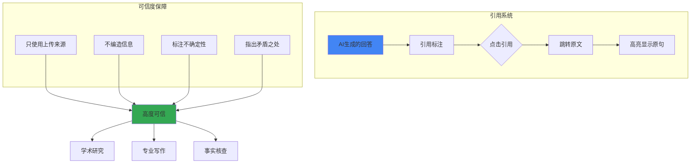
```mermaid
graph TB
    subgraph "引用系统"
        A[AI生成的回答] --> B[引用标注]
        B --> C{点击引用}
        C --> D[跳转原文]
        D --> E[高亮显示原句]
    end
    
    subgraph "可信度保障"
        F[只使用上传来源]
        G[不编造信息]
        H[标注不确定性]
        I[指出矛盾之处]
    end
    
    F --> J[高度可信]
    G --> J
    H --> J
    I --> J
    
    J --> K[学术研究]
    J --> L[专业写作]
    J --> M[事实核查]
    
    style A fill:#4285F4
    style J fill:#34A853
```

**引用特点**：

- ✅ **精确定位**：每个引用都链接到具体段落
- ✅ **多源支持**：可从多个来源综合信息
- ✅ **可验证性**：用户可以验证 AI 的每个陈述
- ✅ **透明度**：清楚显示信息来自哪里

## 使用指南

### 快速开始

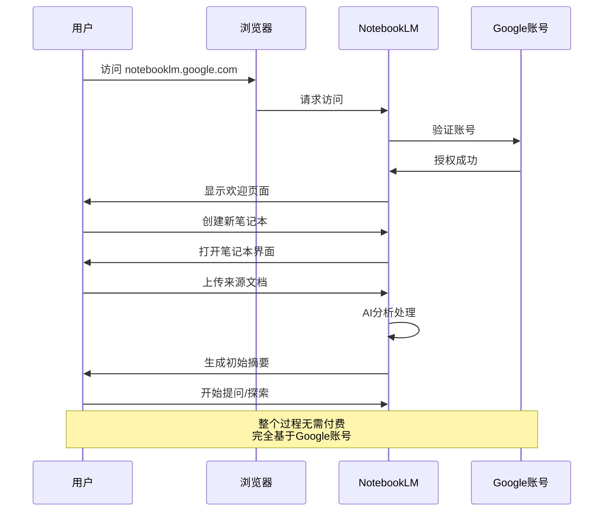
```mermaid
sequenceDiagram
    participant User as 用户
    participant Browser as 浏览器
    participant NLM as NotebookLM
    participant Google as Google账号
    
    User->>Browser: 访问 notebooklm.google.com
    Browser->>NLM: 请求访问
    NLM->>Google: 验证账号
    Google->>NLM: 授权成功
    
    NLM->>User: 显示欢迎页面
    User->>NLM: 创建新笔记本
    NLM->>User: 打开笔记本界面
    
    User->>NLM: 上传来源文档
    NLM->>NLM: AI分析处理
    NLM->>User: 生成初始摘要
    
    User->>NLM: 开始提问/探索
    
    Note over User,Google: 整个过程无需付费<br/>完全基于Google账号
```

### 第一步：创建笔记本

1. **访问 NotebookLM**
   - 打开浏览器，访问 [https://notebooklm.google.com](https://notebooklm.google.com)
   - 使用 Google 账号登录

2. **创建新笔记本**
   - 点击「新建笔记本」按钮
   - 为笔记本命名（例如："研究项目"、"读书笔记"等）

3. **设置笔记本**
   - 选择笔记本图标（可选）
   - 添加描述说明（可选）

### 第二步：添加来源

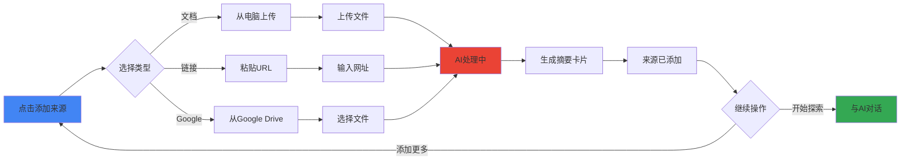
```mermaid
flowchart LR
    A[点击添加来源] --> B{选择类型}
    
    B -->|文档| C1[从电脑上传]
    B -->|链接| C2[粘贴URL]
    B -->|Google| C3[从Google Drive]
    
    C1 --> D[上传文件]
    C2 --> E[输入网址]
    C3 --> F[选择文件]
    
    D --> G[AI处理中]
    E --> G
    F --> G
    
    G --> H[生成摘要卡片]
    H --> I[来源已添加]
    
    I --> J{继续操作}
    J -->|添加更多| A
    J -->|开始探索| K[与AI对话]
    
    style A fill:#4285F4
    style G fill:#EA4335
    style K fill:#34A853
```

**添加来源的方法**：

1. **上传本地文件**
   - 点击「上传」按钮
   - 选择 PDF、文本文件、音频等
   - 等待 AI 处理（通常 10-30 秒）

2. **从 Google Drive 导入**
   - 点击「Google Docs」或「Google Slides」
   - 从 Drive 中选择文件
   - 自动同步最新内容

3. **添加网页链接**
   - 点击「网站」
   - 粘贴网页 URL
   - AI 自动抓取内容

4. **添加 YouTube 视频**
   - 点击「YouTube」
   - 粘贴视频链接
   - 自动提取字幕和内容

### 第三步：与 AI 互动

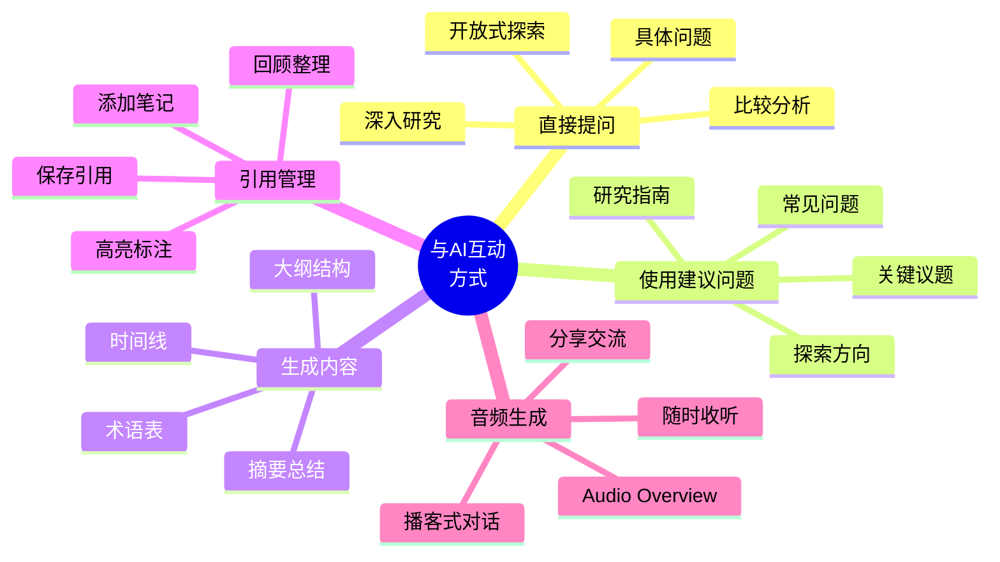
```mermaid
mindmap
  root((与AI互动<br/>方式))
    直接提问
      具体问题
      开放式探索
      比较分析
      深入研究
    使用建议问题
      研究指南
      常见问题
      关键议题
      探索方向
    生成内容
      摘要总结
      大纲结构
      时间线
      术语表
    引用管理
      保存引用
      添加笔记
      高亮标注
      回顾整理
    音频生成
      Audio Overview
      播客式对话
      随时收听
      分享交流
```

**提问技巧**：

- 💡 **具体明确**："这篇论文的主要结论是什么？"
- 💡 **比较分析**："比较文档A和文档B对X问题的观点"
- 💡 **深入探索**："展开解释[某个概念]在文中的应用"
- 💡 **批判思考**："这些来源中有哪些观点存在矛盾？"

### 第四步：生成 Audio Overview

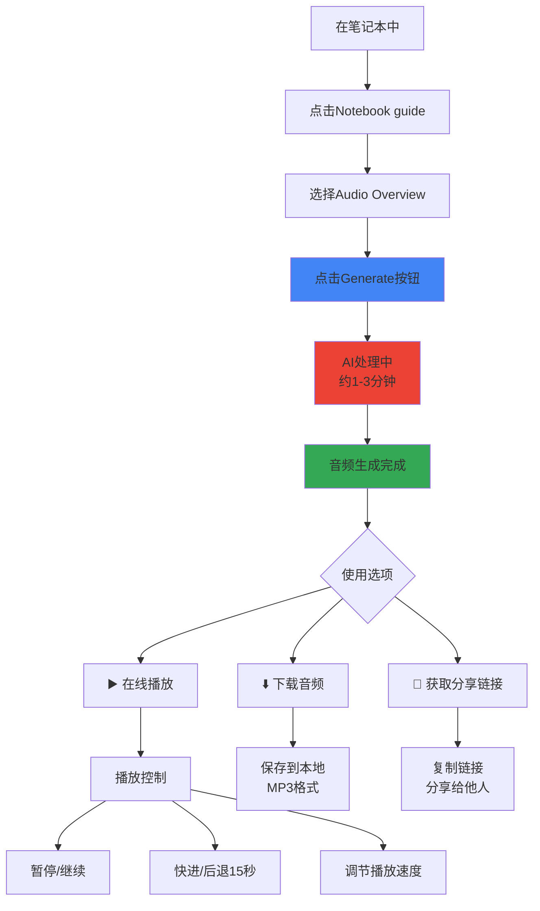
```mermaid
flowchart TD
    A[在笔记本中] --> B[点击Notebook guide]
    B --> C[选择Audio Overview]
    C --> D[点击Generate按钮]
    
    D --> E[AI处理中<br/>约1-3分钟]
    
    E --> F[音频生成完成]
    
    F --> G{使用选项}
    
    G --> H1[▶️ 在线播放]
    G --> H2[⬇️ 下载音频]
    G --> H3[🔗 获取分享链接]
    
    H1 --> I[播放控制]
    I --> I1[暂停/继续]
    I --> I2[快进/后退15秒]
    I --> I3[调节播放速度]
    
    H2 --> J[保存到本地<br/>MP3格式]
    
    H3 --> K[复制链接<br/>分享给他人]
    
    style D fill:#4285F4
    style E fill:#EA4335
    style F fill:#34A853
```

### 第五步：组织和导出

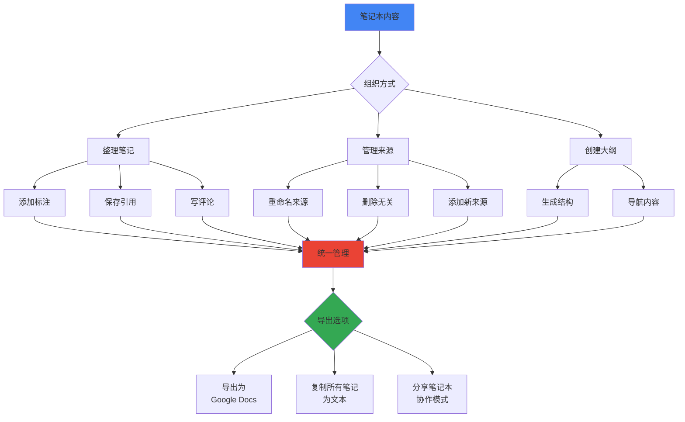
```mermaid
graph TB
    A[笔记本内容] --> B{组织方式}
    
    B --> C1[整理笔记]
    B --> C2[管理来源]
    B --> C3[创建大纲]
    
    C1 --> D1[添加标注]
    C1 --> D2[保存引用]
    C1 --> D3[写评论]
    
    C2 --> E1[重命名来源]
    C2 --> E2[删除无关]
    C2 --> E3[添加新来源]
    
    C3 --> F1[生成结构]
    C3 --> F2[导航内容]
    
    D1 --> G[统一管理]
    D2 --> G
    D3 --> G
    E1 --> G
    E2 --> G
    E3 --> G
    F1 --> G
    F2 --> G
    
    G --> H{导出选项}
    
    H --> I1[导出为<br/>Google Docs]
    H --> I2[复制所有笔记<br/>为文本]
    H --> I3[分享笔记本<br/>协作模式]
    
    style A fill:#4285F4
    style G fill:#EA4335
    style H fill:#34A853
```

## 应用场景

### 1. 学术研究

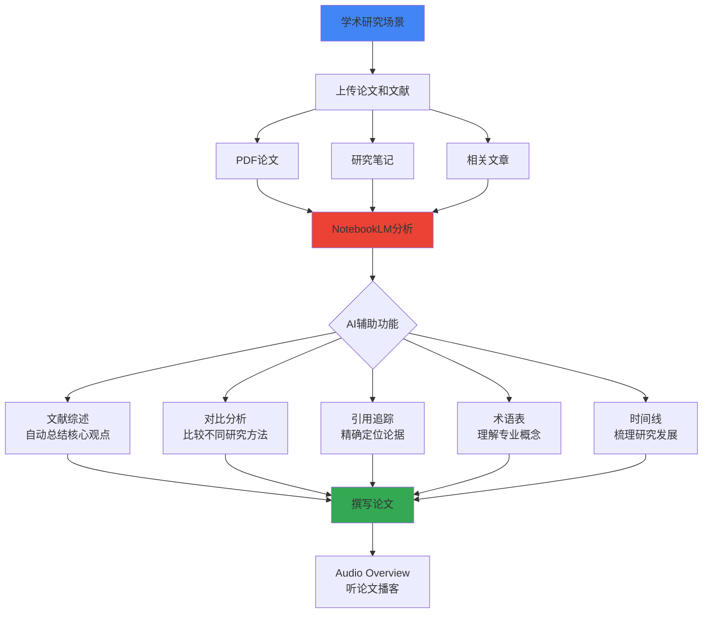
```mermaid
flowchart TD
    A[学术研究场景] --> B[上传论文和文献]
    
    B --> C1[PDF论文]
    B --> C2[研究笔记]
    B --> C3[相关文章]
    
    C1 --> D[NotebookLM分析]
    C2 --> D
    C3 --> D
    
    D --> E{AI辅助功能}
    
    E --> F1[文献综述<br/>自动总结核心观点]
    E --> F2[对比分析<br/>比较不同研究方法]
    E --> F3[引用追踪<br/>精确定位论据]
    E --> F4[术语表<br/>理解专业概念]
    E --> F5[时间线<br/>梳理研究发展]
    
    F1 --> G[撰写论文]
    F2 --> G
    F3 --> G
    F4 --> G
    F5 --> G
    
    G --> H[Audio Overview<br/>听论文播客]
    
    style A fill:#4285F4
    style D fill:#EA4335
    style G fill:#34A853
```

**研究员的使用案例**：

- 📚 **文献综述**：上传 20-30 篇论文，让 AI 总结研究现状
- 🔍 **方法比较**：比较不同研究的实验设计和结论
- 📝 **论文写作**：提取关键论据和引用，辅助写作
- 🎓 **论文理解**：将复杂论文转为音频，通勤时收听

### 2. 内容创作

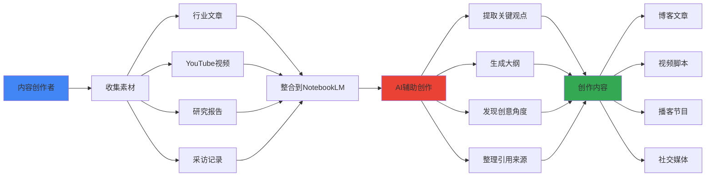
```mermaid
graph LR
    A[内容创作者] --> B[收集素材]
    
    B --> C1[行业文章]
    B --> C2[YouTube视频]
    B --> C3[研究报告]
    B --> C4[采访记录]
    
    C1 --> D[整合到NotebookLM]
    C2 --> D
    C3 --> D
    C4 --> D
    
    D --> E[AI辅助创作]
    
    E --> F1[提取关键观点]
    E --> F2[生成大纲]
    E --> F3[发现创意角度]
    E --> F4[整理引用来源]
    
    F1 --> G[创作内容]
    F2 --> G
    F3 --> G
    F4 --> G
    
    G --> H1[博客文章]
    G --> H2[视频脚本]
    G --> H3[播客节目]
    G --> H4[社交媒体]
    
    style A fill:#4285F4
    style E fill:#EA4335
    style G fill:#34A853
```

**创作流程示例**：

1. **素材收集阶段**
   - 上传行业相关的文章、报告
   - 添加 YouTube 视频链接（提取字幕）
   - 导入个人笔记和想法

2. **内容策划阶段**
   - 询问 AI："基于这些素材，有哪些有趣的角度？"
   - 生成内容大纲
   - 识别独特观点和论据

3. **写作阶段**
   - 提取关键引用
   - 验证事实和数据
   - 保持引用的准确性

4. **音频内容**
   - 生成 Audio Overview
   - 用作播客素材或灵感来源

### 3. 商业决策

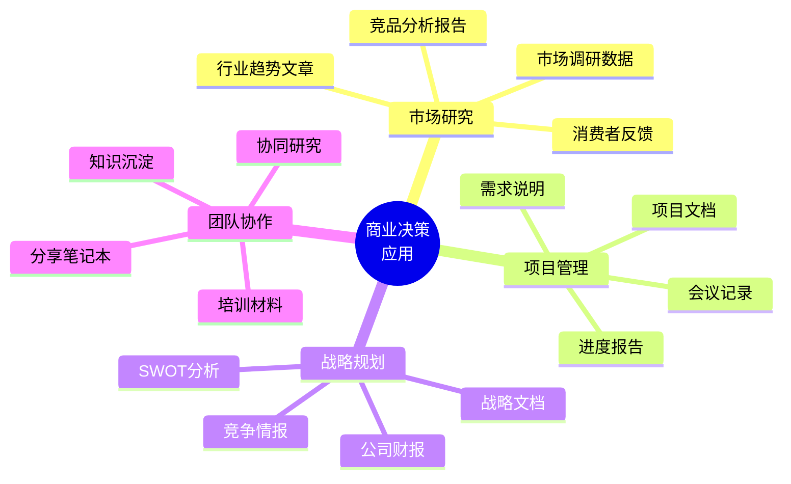
```mermaid
mindmap
  root((商业决策<br/>应用))
    市场研究
      竞品分析报告
      行业趋势文章
      市场调研数据
      消费者反馈
    项目管理
      会议记录
      项目文档
      需求说明
      进度报告
    战略规划
      公司财报
      战略文档
      SWOT分析
      竞争情报
    团队协作
      分享笔记本
      协同研究
      知识沉淀
      培训材料
```

**企业应用场景**：

| 部门 | 使用场景 | 具体应用 | 价值 |
|-----|---------|---------|------|
| **产品** | 竞品分析 | 整合竞品资料，AI 总结差异化优势 | 快速洞察市场 |
| **营销** | 内容策划 | 分析行业趋势，生成内容创意 | 提升内容质量 |
| **销售** | 客户研究 | 整理客户信息，AI 生成见解 | 个性化销售 |
| **HR** | 培训材料 | 转换文档为音频，便于学习 | 提高培训效率 |
| **战略** | 决策支持 | 分析多份报告，提取关键信息 | 数据驱动决策 |

### 4. 个人学习

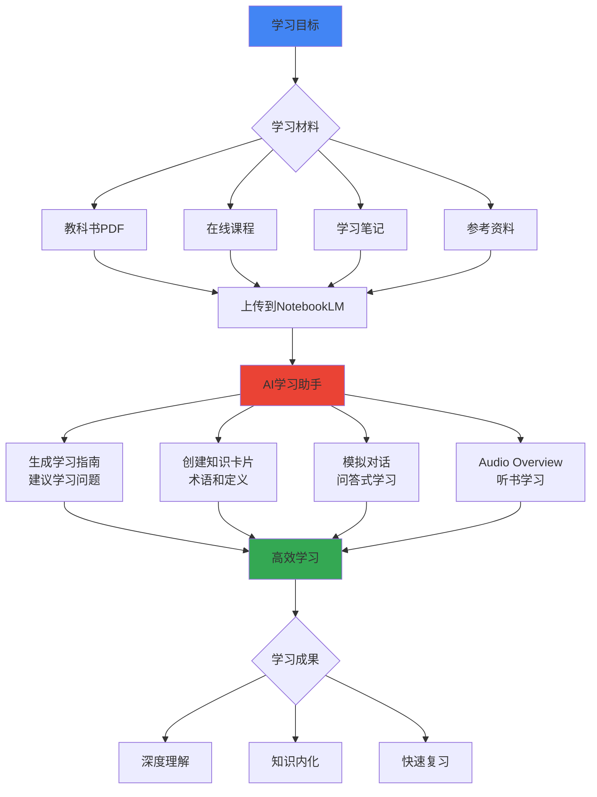
```mermaid
flowchart TD
    A[学习目标] --> B{学习材料}
    
    B --> C1[教科书PDF]
    B --> C2[在线课程]
    B --> C3[学习笔记]
    B --> C4[参考资料]
    
    C1 --> D[上传到NotebookLM]
    C2 --> D
    C3 --> D
    C4 --> D
    
    D --> E[AI学习助手]
    
    E --> F1[生成学习指南<br/>建议学习问题]
    E --> F2[创建知识卡片<br/>术语和定义]
    E --> F3[模拟对话<br/>问答式学习]
    E --> F4[Audio Overview<br/>听书学习]
    
    F1 --> G[高效学习]
    F2 --> G
    F3 --> G
    F4 --> G
    
    G --> H{学习成果}
    H --> I1[深度理解]
    H --> I2[知识内化]
    H --> I3[快速复习]
    
    style A fill:#4285F4
    style E fill:#EA4335
    style G fill:#34A853
```

**学习策略**：

- 📖 **预习**：上传下周要学的材料，生成学习指南
- 🎧 **通勤学习**：将教材转为音频，在路上收听
- 💭 **深度理解**：向 AI 提问，测试自己的理解
- 📝 **考试复习**：整理笔记和重点，快速回顾

### 5. 写作辅助

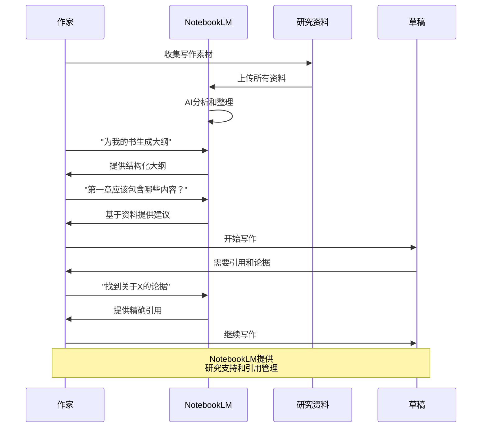
```mermaid
sequenceDiagram
    participant Writer as 作家
    participant NLM as NotebookLM
    participant Sources as 研究资料
    participant Draft as 草稿
    
    Writer->>Sources: 收集写作素材
    Sources->>NLM: 上传所有资料
    NLM->>NLM: AI分析和整理
    
    Writer->>NLM: "为我的书生成大纲"
    NLM->>Writer: 提供结构化大纲
    
    Writer->>NLM: "第一章应该包含哪些内容？"
    NLM->>Writer: 基于资料提供建议
    
    Writer->>Draft: 开始写作
    Draft->>Writer: 需要引用和论据
    
    Writer->>NLM: "找到关于X的论据"
    NLM->>Writer: 提供精确引用
    
    Writer->>Draft: 继续写作
    
    Note over Writer,Draft: NotebookLM提供<br/>研究支持和引用管理
```

**写作流程**：

1. **前期研究**：收集所有相关资料
2. **结构规划**：让 AI 帮助生成大纲
3. **内容填充**：提取关键论据和引用
4. **事实核查**：验证信息的准确性
5. **灵感激发**：发现新的写作角度

## 高级技巧

### 1. 最大化 Audio Overview 的价值

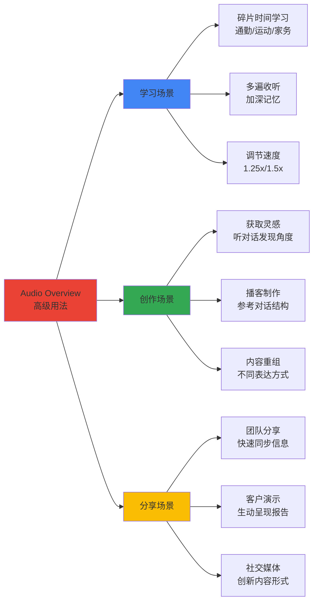
```mermaid
flowchart LR
    A[Audio Overview<br/>高级用法] --> B[学习场景]
    A --> C[创作场景]
    A --> D[分享场景]
    
    B --> B1[碎片时间学习<br/>通勤/运动/家务]
    B --> B2[多遍收听<br/>加深记忆]
    B --> B3[调节速度<br/>1.25x/1.5x]
    
    C --> C1[获取灵感<br/>听对话发现角度]
    C --> C2[播客制作<br/>参考对话结构]
    C --> C3[内容重组<br/>不同表达方式]
    
    D --> D1[团队分享<br/>快速同步信息]
    D --> D2[客户演示<br/>生动呈现报告]
    D --> D3[社交媒体<br/>创新内容形式]
    
    style A fill:#EA4335
    style B fill:#4285F4
    style C fill:#34A853
    style D fill:#FBBC04
```

**Audio Overview 使用建议**：

- 🎧 **多场景收听**：开车、跑步、做饭时充分利用时间
- 🔄 **重复收听**：第一遍了解大意，第二遍注意细节
- ⚡ **调节速度**：熟悉的内容可以用 1.5x 速度
- 📱 **下载保存**：离线收听，不消耗流量
- 👥 **分享他人**：让同事/朋友也能快速了解内容

### 2. 构建个人知识库

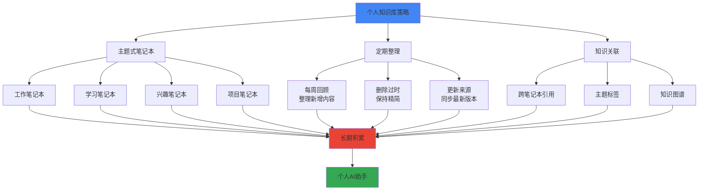
```mermaid
graph TB
    A[个人知识库策略] --> B[主题式笔记本]
    A --> C[定期整理]
    A --> D[知识关联]
    
    B --> B1[工作笔记本]
    B --> B2[学习笔记本]
    B --> B3[兴趣笔记本]
    B --> B4[项目笔记本]
    
    C --> C1[每周回顾<br/>整理新增内容]
    C --> C2[删除过时<br/>保持精简]
    C --> C3[更新来源<br/>同步最新版本]
    
    D --> D1[跨笔记本引用]
    D --> D2[主题标签]
    D --> D3[知识图谱]
    
    B1 --> E[长期积累]
    B2 --> E
    B3 --> E
    B4 --> E
    C1 --> E
    C2 --> E
    C3 --> E
    D1 --> E
    D2 --> E
    D3 --> E
    
    E --> F[个人AI助手]
    
    style A fill:#4285F4
    style E fill:#EA4335
    style F fill:#34A853
```

**知识库最佳实践**：

1. **分类管理**
   - 按主题创建独立笔记本
   - 避免单个笔记本过于庞大
   - 定期归档完成的项目

2. **来源控制**
   - 精选高质量来源（每个笔记本 10-20 个核心来源）
   - 避免信息过载（不超过 50 个来源）
   - 及时删除不再需要的来源

3. **持续维护**
   - 每周回顾和更新
   - 保存重要的 AI 回答
   - 定期导出备份

### 3. 团队协作技巧

```mermaid
sequenceDiagram
    participant Owner as 笔记本所有者
    participant NLM as NotebookLM
    participant Team as 团队成员
    participant Collab as 协作空间
    
    Owner->>NLM: 创建项目笔记本
    Owner->>NLM: 上传项目相关文档
    NLM->>NLM: AI处理和分析
    
    Owner->>NLM: 点击分享按钮
    NLM->>Owner: 生成分享链接
    
    Owner->>Team: 发送链接
    Team->>NLM: 访问笔记本
    
    Team->>NLM: 查看来源和摘要
    Team->>NLM: 提出问题
    NLM->>Team: AI回答
    
    Team->>Collab: 添加评论/笔记
    Owner->>Collab: 查看团队贡献
    
    Note over Owner,Collab: 所有人都能提问<br/>知识共享和协作
```

**协作最佳实践**：

- 👥 **明确分工**：谁负责添加来源，谁负责整理笔记
- 📋 **统一标准**：约定命名规范和标签体系
- 💬 **充分沟通**：利用笔记功能进行异步协作
- 🔄 **定期同步**：团队会议时回顾笔记本内容

### 4. 高效提问技巧

```mermaid
mindmap
  root((提问技巧))
    基础问题
      事实性提问
        "文档中提到哪些数据？"
        "作者的主要观点是？"
        "关键结论是什么？"
    深入分析
      对比分析
        "比较A和B的观点"
        "找出矛盾之处"
        "哪个论据更强？"
    结构化请求
      总结归纳
        "总结前三章内容"
        "提取核心论点"
        "列出行动建议"
    创意探索
      开放式问题
        "有哪些有趣的角度？"
        "可以深入哪些议题？"
        "如何应用到实践？"
    引用管理
      精确定位
        "找到关于X的所有提及"
        "哪里讨论了Y问题？"
        "引用具体数据"
```

**示例对话**：

❌ **不够好的提问**：
- "这个文档讲什么？"（太宽泛）
- "告诉我所有内容"（不具体）

✅ **更好的提问**：
- "这篇论文的核心研究方法是什么？"
- "比较文档A和文档B对气候变化的观点差异"
- "提取所有提到'机器学习'的段落"
- "作者对未来趋势有哪些预测？"

### 5. 整合到工作流程

```mermaid
flowchart TD
    A[日常工作流] --> B{信息来源}
    
    B --> C1[邮件附件<br/>PDF报告]
    B --> C2[会议记录<br/>Google Docs]
    B --> C3[行业文章<br/>网页链接]
    B --> C4[团队分享<br/>文档]
    
    C1 --> D[统一导入<br/>NotebookLM]
    C2 --> D
    C3 --> D
    C4 --> D
    
    D --> E[AI自动处理]
    
    E --> F{工作场景}
    
    F --> G1[准备会议<br/>快速了解议题]
    F --> G2[写报告<br/>提取关键数据]
    F --> G3[做决策<br/>分析多方信息]
    F --> G4[学习新知<br/>理解专业内容]
    
    G1 --> H[提高效率]
    G2 --> H
    G3 --> H
    G4 --> H
    
    H --> I[Audio Overview<br/>碎片时间利用]
    
    style A fill:#4285F4
    style E fill:#EA4335
    style H fill:#34A853
```

**工作流集成建议**：

1. **晨间流程**
   - 将昨天收到的重要文档导入 NotebookLM
   - 生成 Audio Overview，早餐时收听

2. **会议准备**
   - 上传会议相关材料
   - 让 AI 生成讨论要点

3. **信息整理**
   - 每天结束时，整理当天的笔记
   - 固定重要引用，添加个人想法

4. **周报撰写**
   - 从笔记本中提取本周关键工作
   - 使用 AI 辅助组织内容

## 限制与注意事项

### 当前限制

```mermaid
graph TB
    A[NotebookLM限制] --> B[技术限制]
    A --> C[功能限制]
    A --> D[使用限制]
    
    B --> B1[来源数量<br/>最多50个]
    B --> B2[文件大小<br/>每个50万字]
    B --> B3[处理速度<br/>大文件需等待]
    
    C --> C1[无实时协作<br/>编辑功能]
    C --> C2[有限的导出<br/>选项]
    C --> C3[标签系统<br/>尚未推出]
    C --> C4[无移动App]
    
    D --> D1[仅限网页版<br/>需要浏览器]
    D --> D2[需要Google<br/>账号]
    D --> D3[英语体验<br/>最佳]
    
    style A fill:#EA4335
    style B fill:#FBBC04
    style C fill:#4285F4
    style D fill:#34A853
```

**主要限制**：

| 限制类型 | 具体限制 | 影响 | 解决方案 |
|---------|---------|------|---------|
| **来源数量** | 最多 50 个 | 超大项目受限 | 创建多个笔记本分类管理 |
| **文件大小** | 单个 50 万字 | 超长文档需拆分 | 分章节上传 |
| **语言支持** | 英语最佳 | 中文等其他语言体验略差 | 使用英文材料或等待改进 |
| **移动端** | 无专用 App | 移动使用体验一般 | 使用移动浏览器访问 |
| **离线使用** | 必须联网 | 无网络时无法使用 | 提前下载 Audio Overview |
| **导出功能** | 选项有限 | 数据迁移不便 | 定期手动备份重要内容 |

### 隐私和安全

```mermaid
flowchart TD
    A[隐私与安全] --> B{数据使用政策}
    
    B --> C1[✅ 不用于训练AI]
    B --> C2[✅ 不与广告关联]
    B --> C3[✅ 用户完全控制]
    
    C1 --> D[隐私保护]
    C2 --> D
    C3 --> D
    
    A --> E{安全建议}
    
    E --> F1[⚠️ 敏感信息谨慎上传]
    E --> F2[⚠️ 定期检查分享链接]
    E --> F3[⚠️ 不存储机密文档]
    
    F1 --> G[安全使用]
    F2 --> G
    F3 --> G
    
    D --> H[适合使用场景]
    G --> I[不适合场景]
    
    H --> H1[学术研究]
    H --> H2[公开内容]
    H --> H3[个人学习]
    
    I --> I1[商业机密]
    I --> I2[个人隐私]
    I --> I3[敏感数据]
    
    style D fill:#34A853
    style G fill:#FBBC04
```

**隐私承诺**（根据 Google 官方说明）：

- ✅ **不训练模型**：你的数据不会被用于训练 AI 模型
- ✅ **不用于广告**：你的笔记本内容不会用于广告定向
- ✅ **用户控制**：你可以随时删除笔记本和来源
- ✅ **Google 账号保护**：与你的 Google 账号安全等级相同

**安全建议**：

- ⚠️ 避免上传商业机密、个人身份信息等敏感内容
- ⚠️ 分享笔记本时注意链接权限设置
- ⚠️ 企业使用建议等待 Workspace 版本推出

### 与其他工具对比

```mermaid
graph TB
    A[NotebookLM] --> B{对比维度}
    
    B --> C1[vs Notion AI]
    B --> C2[vs ChatGPT]
    B --> C3[vs Obsidian]
    B --> C4[vs Evernote]
    
    C1 --> D1[NotebookLM优势:<br/>专注来源基础回答<br/>音频生成功能]
    C1 --> E1[Notion优势:<br/>团队协作<br/>数据库功能]
    
    C2 --> D2[NotebookLM优势:<br/>基于文档<br/>精确引用]
    C2 --> E2[ChatGPT优势:<br/>通用对话<br/>更广泛知识]
    
    C3 --> D3[NotebookLM优势:<br/>AI理解<br/>无需手动链接]
    C3 --> E3[Obsidian优势:<br/>本地存储<br/>完全控制]
    
    C4 --> D4[NotebookLM优势:<br/>AI助手<br/>智能分析]
    C4 --> E4[Evernote优势:<br/>成熟生态<br/>移动端完善]
    
    style A fill:#EA4335
    style D1 fill:#34A853
    style D2 fill:#34A853
    style D3 fill:#34A853
    style D4 fill:#34A853
```

**对比总结**：

| 工具 | 核心优势 | 适用场景 | 与 NotebookLM 的关系 |
|-----|---------|---------|---------------------|
| **Notion AI** | 团队协作、数据库 | 项目管理、知识库 | 可互补使用 |
| **ChatGPT** | 通用对话、创作 | 写作、编程、创意 | 不同定位 |
| **Obsidian** | 本地存储、双链笔记 | 个人知识管理 | 可导出后使用 |
| **Evernote** | 笔记捕获、整理 | 日常笔记 | 可作为来源 |
| **Perplexity** | 实时搜索、引用 | 研究和事实查询 | 互补使用 |

## 最佳实践总结

### 1. 高效使用原则

```mermaid
mindmap
  root((NotebookLM<br/>最佳实践))
    来源管理
      质量优先
        精选高质量来源
        避免信息噪音
        定期清理过时
      结构化组织
        主题明确
        分类清晰
        数量适中10-20
    互动策略
      提问技巧
        具体明确
        逐步深入
        对比分析
      利用建议
        研究指南
        常见问题
        自动生成
    内容整理
      笔记习惯
        及时记录
        固定引用
        添加想法
      定期回顾
        每周整理
        导出备份
        知识沉淀
    工具整合
      工作流程
        日常导入
        场景应用
        效率提升
      生态协作
        其他工具
        团队分享
        知识传播
```

### 2. 避免常见错误

❌ **错误做法**：

1. **信息过载**
   - 一次性上传 50 个来源
   - 结果：AI 回答质量下降，重点不突出

2. **模糊提问**
   - "告诉我这个文档的内容"
   - 结果：得到泛泛的总结，缺乏深度

3. **忽略引用**
   - 不点击查看引用来源
   - 结果：无法验证信息准确性

4. **孤立使用**
   - 不整合到工作流程中
   - 结果：使用频率低，无法发挥价值

✅ **正确做法**：

1. **精选来源**
   - 每个笔记本 10-20 个核心来源
   - 聚焦特定主题

2. **具体提问**
   - "比较文档 A 和 B 对 X 问题的观点"
   - "提取所有关于 Y 的数据"

3. **验证引用**
   - 点击查看每个引用
   - 确保理解正确

4. **流程整合**
   - 成为日常工作的一部分
   - 持续积累知识

### 3. 推荐工作流

```mermaid
flowchart TD
    A[每日工作流] --> B[早晨 8:00-9:00]
    B --> B1[导入昨日新文档]
    B --> B2[生成Audio Overview]
    B --> B3[通勤时收听]
    
    B3 --> C[上午 9:00-12:00]
    C --> C1[处理重点工作]
    C --> C2[需要时向AI提问]
    C --> C3[保存重要引用]
    
    C3 --> D[下午 14:00-18:00]
    D --> D1[继续项目工作]
    D --> D2[添加新来源]
    D --> D3[写笔记和想法]
    
    D3 --> E[晚上 18:00-19:00]
    E --> E1[回顾今日笔记]
    E --> E2[整理和分类]
    E --> E3[导出重要内容]
    
    E3 --> F[周末复盘]
    F --> F1[删除无用来源]
    F --> F2[归档完成项目]
    F --> F3[规划下周主题]
    
    style A fill:#4285F4
    style F fill:#34A853
```

## 未来展望

### 即将推出的功能

```mermaid
timeline
    title NotebookLM 功能路线图（预测）
    2024 Q4 : Audio Overview 推出
            : 多语言改进
            : 引用系统优化
    2025 Q1 : 移动应用
            : 协作功能增强
            : 标签系统
    2025 Q2 : Workspace 集成
            : 更多导出选项
            : API 接口
    2025 Q3 : 实时协作编辑
            : 高级分析功能
            : 自定义 AI 模型
    2025 Q4 : 知识图谱可视化
            : 多模态理解增强
            : 企业级功能
```

**期待的功能**：

1. **移动应用**
   - 原生 iOS 和 Android App
   - 更好的移动体验
   - 离线访问功能

2. **协作增强**
   - 实时协作编辑
   - 团队权限管理
   - 评论和讨论功能

3. **高级功能**
   - 知识图谱可视化
   - 自定义 AI 提示词
   - 更多导出格式

4. **企业版**
   - Google Workspace 集成
   - 企业级安全
   - 管理控制台

### 发展趋势

```mermaid
graph LR
    A[NotebookLM<br/>发展方向] --> B[功能扩展]
    A --> C[生态整合]
    A --> D[场景深化]
    
    B --> B1[更强AI能力]
    B --> B2[多模态理解]
    B --> B3[个性化定制]
    
    C --> C1[Google Workspace]
    C --> C2[第三方工具]
    C --> C3[API开放]
    
    D --> D1[教育领域]
    D --> D2[企业应用]
    D --> D3[内容创作]
    
    style A fill:#EA4335
    style B fill:#4285F4
    style C fill:#34A853
    style D fill:#FBBC04
```

**行业影响**：

- 📚 **教育变革**：改变学习和研究方式
- 💼 **工作效率**：大幅提升知识工作者生产力
- 🎨 **内容创作**：降低高质量内容创作门槛
- 🔬 **科研加速**：加快文献综述和研究过程

## 常见问题 FAQ

### Q1: NotebookLM 是免费的吗？

**答案：✅ 完全免费**

NotebookLM 目前对所有拥有 Google 账号的用户完全免费，包括：
- ✅ 无限制创建笔记本
- ✅ 所有 AI 功能（问答、摘要、Audio Overview 等）
- ✅ 没有使用次数限制
- ✅ 无需信用卡或付费订阅

未来可能推出企业版（Google Workspace 集成），但个人版预计将持续免费。

### Q2: Audio Overview 支持中文吗？

**答案：⚠️ 目前主要支持英语**

- 📄 **文档语言**：可以上传中文文档，AI 能理解
- 🎙️ **音频语言**：生成的播客目前主要是英语
- 🔮 **未来计划**：Google 正在开发多语言音频支持

**当前解决方案**：
- 上传中文文档后，用英语提问，AI 会用英语回答
- 或者等待官方推出中文音频功能

### Q3: 可以在手机上使用吗？

**答案：✅ 可以，但体验有限**

- 📱 **移动浏览器**：可以通过手机浏览器访问 notebooklm.google.com
- ⚠️ **体验限制**：移动网页版功能完整，但界面不够优化
- 🔜 **原生 App**：Google 预计将推出 iOS 和 Android 应用

**当前建议**：
- 主要在电脑上使用
- 手机上主要用于查看和收听 Audio Overview

### Q4: 我的数据安全吗？

**答案：✅ 是的，Google 承诺保护隐私**

根据 Google 官方说明：
- ✅ 你的笔记本内容**不会用于训练 AI 模型**
- ✅ 你的数据**不会用于广告定向**
- ✅ 你**完全控制**你的数据，可以随时删除
- ✅ 与 Google 账号的安全级别相同

**但仍需注意**：
- ⚠️ 避免上传极度敏感的机密信息
- ⚠️ 企业使用建议等待 Workspace 版本

### Q5: 可以导出笔记本吗？

**答案：✅ 可以，但选项有限**

目前支持的导出方式：
- ✅ **导出为 Google Docs**：将笔记和引用导出为文档
- ✅ **复制文本**：复制 AI 回答和笔记为纯文本
- ✅ **下载音频**：下载 Audio Overview 为 MP3 文件

**不支持**：
- ❌ 导出完整笔记本为单个文件
- ❌ 导出为其他格式（如 PDF、Markdown 等）

**解决方案**：定期手动备份重要内容

### Q6: 可以团队协作吗？

**答案：✅ 可以，但功能基础**

- ✅ **分享笔记本**：可以生成链接分享给他人
- ✅ **查看和提问**：所有人都能查看来源和与 AI 对话
- ⚠️ **无实时协作**：无法多人同时编辑笔记
- ⚠️ **权限管理**：权限控制选项有限

**适合场景**：
- 知识分享和传播
- 异步协作研究
- 团队学习和培训

**不适合**：
- 需要复杂权限管理的场景
- 实时协作编辑需求

### Q7: 与 ChatGPT 有什么区别？

**核心区别**：

| 维度 | NotebookLM | ChatGPT |
|-----|-----------|---------|
| **定位** | 基于文档的研究助手 | 通用AI对话助手 |
| **知识来源** | ✅ 只用你上传的文档 | ❌ 使用训练数据（可能过时）|
| **引用** | ✅ 精确引用每个来源 | ⚠️ 无法提供精确引用 |
| **音频功能** | ✅ Audio Overview（播客）| ❌ 无音频生成 |
| **付费** | ✅ 完全免费 | ⚠️ GPT-4 需付费 |
| **适用场景** | 研究、学习、分析文档 | 写作、编程、创意、对话 |

**使用建议**：
- 📚 **研究和学习**：用 NotebookLM
- ✍️ **写作和创作**：用 ChatGPT
- 🔄 **结合使用**：在 NotebookLM 中研究，用 ChatGPT 创作

### Q8: 最多可以上传多少个文档？

**答案：最多 50 个来源**

- 📊 **数量限制**：每个笔记本最多 50 个来源
- 📄 **大小限制**：每个来源最多约 50 万字
- 💡 **建议**：保持 10-20 个核心来源，质量优于数量

**超出限制怎么办**：
- 创建多个笔记本，按主题分类
- 删除不再需要的旧来源
- 合并相关文档后再上传

### Q9: Audio Overview 能定制吗？

**答案：❌ 目前不能自定义**

当前 Audio Overview 是完全自动生成的：
- ❌ 不能选择主持人风格
- ❌ 不能指定讨论的主题
- ❌ 不能调整时长

**但可以**：
- ✅ 调节播放速度（0.5x - 2x）
- ✅ 下载 MP3 文件
- ✅ 重新生成（会得到不同版本）

**未来期待**：
- 自定义讨论主题
- 选择音频风格
- 控制时长

### Q10: 适合哪些人使用？

**强烈推荐给**：

```mermaid
graph TB
    A[NotebookLM<br/>目标用户] --> B[学生和研究者]
    A --> C[内容创作者]
    A --> D[知识工作者]
    A --> E[终身学习者]
    
    B --> B1[文献综述]
    B --> B2[论文写作]
    B --> B3[考试复习]
    
    C --> C1[博客作者]
    C --> C2[播客制作人]
    C --> C3[自媒体运营]
    
    D --> D1[产品经理]
    D --> D2[咨询顾问]
    D --> D3[分析师]
    
    E --> E1[阅读爱好者]
    E --> E2[在线课程学习]
    E --> E3[专业发展]
    
    style A fill:#EA4335
    style B fill:#4285F4
    style C fill:#34A853
    style D fill:#FBBC04
    style E fill:#8E44AD
```

**特别适合**：
- 🎓 **学生**：写论文、准备考试、理解课程材料
- 🔬 **研究员**：文献综述、整理研究资料
- ✍️ **作家**：资料收集、结构规划、引用管理
- 📊 **分析师**：整合报告、提取洞察
- 🎙️ **创作者**：内容策划、音频制作

**可能不适合**：
- 需要实时信息的场景（NotebookLM 不联网搜索）
- 需要 AI 生成创意内容（ChatGPT 更合适）
- 需要复杂团队协作的项目（Notion 等更合适）

## 实战案例

### 案例 1：撰写学术论文

**场景**：研究生需要写一篇关于"AI 在医疗诊断中的应用"的综述论文。

```mermaid
flowchart TD
    A[论文写作任务] --> B[第1周: 资料收集]
    
    B --> C[上传到NotebookLM]
    C --> C1[20篇相关论文PDF]
    C --> C2[3篇综述文章]
    C --> C3[行业报告]
    
    C1 --> D[第2周: 分析整理]
    C2 --> D
    C3 --> D
    
    D --> D1[询问: 主要研究方法]
    D --> D2[生成: 时间线]
    D --> D3[提取: 关键技术]
    
    D1 --> E[第3周: 撰写初稿]
    D2 --> E
    D3 --> E
    
    E --> E1[AI提供结构建议]
    E --> E2[精确引用来源]
    E --> E3[验证数据准确性]
    
    E1 --> F[第4周: 完善润色]
    E2 --> F
    E3 --> F
    
    F --> G[完成高质量论文]
    
    style A fill:#4285F4
    style D fill:#EA4335
    style G fill:#34A853
```

**成果**：
- ⏱️ 节省 60% 文献整理时间
- 📚 引用 30+ 来源，全部可追溯
- ✅ 论文获得导师高度评价

### 案例 2：播客内容制作

**场景**：播客主持人需要快速了解嘉宾的研究领域。

```mermaid
sequenceDiagram
    participant Host as 主持人
    participant NLM as NotebookLM
    participant Content as 内容素材
    participant Podcast as 播客节目
    
    Host->>Content: 收集嘉宾资料
    Content->>NLM: 上传5篇嘉宾论文<br/>10篇相关文章<br/>3个YouTube视频
    
    NLM->>NLM: AI分析处理
    NLM->>Host: 生成研究指南<br/>建议提问
    
    Host->>NLM: "嘉宾的核心观点是什么？"
    NLM->>Host: 详细回答+引用
    
    Host->>NLM: 生成Audio Overview
    NLM->>Host: 15分钟播客式总结
    
    Host->>Host: 收听并做笔记
    Host->>NLM: 继续深入提问
    
    Host->>Podcast: 录制高质量访谈
    
    Note over Host,Podcast: 准备时间从2天<br/>缩短到4小时
```

**成果**：
- 🎤 深入了解嘉宾研究
- 💡 发现独特访谈角度
- ⭐ 听众反馈访谈质量提升

### 案例 3：企业竞品分析

**场景**：产品经理需要分析竞争对手的产品策略。

**步骤**：

1. **资料收集**（第 1 天）
   - 上传竞品的产品文档
   - 添加行业分析报告
   - 导入用户评论和反馈

2. **AI 分析**（第 2 天）
   - 询问："各竞品的核心差异化优势是什么？"
   - 生成对比表格
   - 提取定价策略和目标用户

3. **策略制定**（第 3 天）
   - 基于 AI 洞察，制定产品路线图
   - 识别市场机会点
   - 准备竞品分析报告

**成果**：
- 📊 全面的竞品分析报告
- 💡 发现 3 个差异化机会
- ⚡ 分析时间从 2 周缩短到 3 天

## 总结

NotebookLM 是 Google 推出的革命性 AI 研究助手，它将大语言模型的强大能力与基于来源的可靠性完美结合。无论你是学生、研究员、创作者还是知识工作者，NotebookLM 都能显著提升你的研究效率和内容质量。

```mermaid
mindmap
  root((NotebookLM<br/>核心价值))
    AI驱动
      Gemini 1.5 Pro
      200万token上下文
      深度理解能力
      多模态支持
    可靠性
      基于来源回答
      精确引用追踪
      不编造信息
      可验证性强
    创新功能
      Audio Overview
      播客式对话
      碎片时间学习
      知识传播新形式
    易用性
      完全免费
      简单上手
      Google生态
      无需配置
    应用广泛
      学术研究
      内容创作
      商业分析
      个人学习
```

**立即开始使用**：

1. 访问 [https://notebooklm.google.com](https://notebooklm.google.com)
2. 使用 Google 账号登录
3. 创建第一个笔记本
4. 上传你的文档，开始探索

**记住关键原则**：

- 🎯 **精选来源**：质量优于数量
- 💬 **具体提问**：明确你想了解什么
- 🔍 **验证引用**：点击查看原文
- 🎧 **利用音频**：充分利用碎片时间
- 🔄 **持续积累**：构建个人知识库

NotebookLM 不仅是一个工具，更是一个智能研究伙伴，帮助你更快地学习、更深入地思考、更高效地创作。现在就开始你的 AI 增强研究之旅吧！

## 参考资源

- 🌐 **官方网站**：[https://notebooklm.google.com](https://notebooklm.google.com)
- 📺 **官方介绍视频**：[YouTube - Google NotebookLM](https://www.youtube.com/google)
- 📝 **官方博客**：[Google Blog - NotebookLM Updates](https://blog.google/technology/ai/notebooklm-audio-overviews/)
- 💬 **社区讨论**：[Reddit - r/NotebookLM](https://www.reddit.com/r/NotebookLM/)
- 📚 **使用教程**：[Google Help Center](https://support.google.com/notebooklm)

---

**更新日期**：2025年12月14日

**许可说明**：本指南基于 NotebookLM 公开信息编写，供学习和参考使用。

