## Open-AutoGLM 完全指南

Open-AutoGLM 是一个基于多模态 AI 的移动设备自动化框架，通过自然语言指令实现 Android 和 HarmonyOS 设备的智能操作。本文将详细介绍其架构、使用方法，并通过实际案例帮助你快速掌握这一强大工具。

### 项目概览

**项目地址**: [github.com/zai-org/Open-AutoGLM](https://github.com/zai-org/Open-AutoGLM)  
**文档地址**: [deepwiki.com/zai-org/Open-AutoGLM](https://deepwiki.com/zai-org/Open-AutoGLM/)

**核心特性**：
- 🤖 **多模态 AI 感知**：使用 AutoGLM-Phone-9B 模型理解屏幕内容
- 📱 **双平台支持**：同时支持 Android（ADB）和 HarmonyOS（HDC）
- 🚀 **自然语言控制**：通过中文指令完成复杂操作
- 🛠️ **180+ 应用支持**：预配置微信、淘宝、抖音、美团等热门应用
- 🔄 **自主规划执行**：AI 自动分解任务并执行多步骤操作
- 🔐 **人机协同**：支付等敏感操作可人工确认
- 📡 **远程调试**：支持 WiFi 和网络远程设备控制

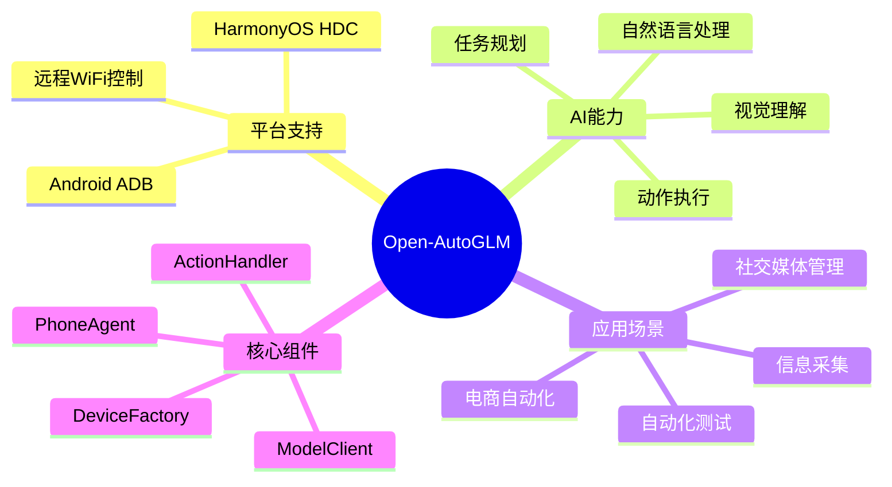

## 一、系统架构

### 1.1 整体架构

Open-AutoGLM 采用三层架构设计，清晰分离感知、推理和执行：

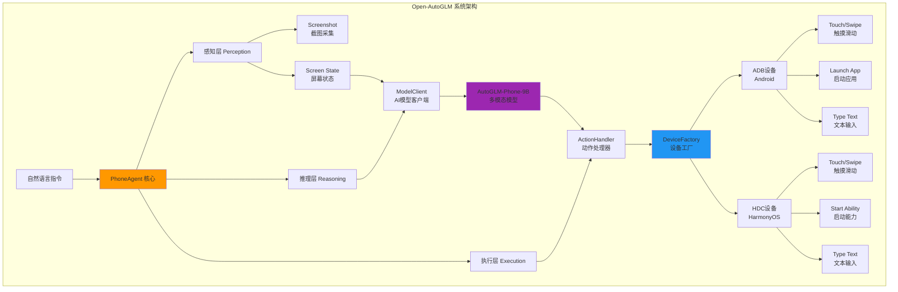

**架构说明**：

1. **感知层（Perception）**：负责捕获屏幕截图并转换为 base64 编码
2. **推理层（Reasoning）**：AI 模型分析屏幕内容，规划动作序列
3. **执行层（Execution）**：将 AI 决策转换为具体的设备操作命令

### 1.2 核心工作流程

Open-AutoGLM 通过**感知-思考-行动**（Perceive-Think-Act）循环实现自主操作：

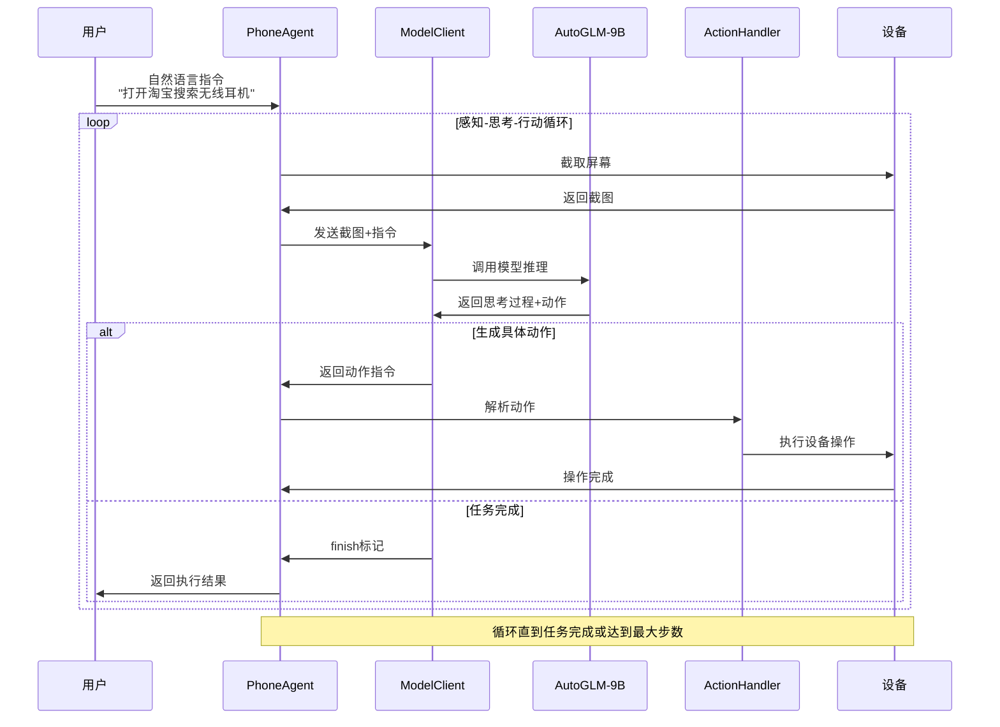

**执行流程详解**：

1. **Step 1 - 感知（Perceive）**：截取当前屏幕，获取设备状态
2. **Step 2 - 思考（Think）**：AI 模型分析屏幕内容，理解当前状态，规划下一步动作
3. **Step 3 - 行动（Act）**：执行 AI 规划的动作（点击、滑动、输入等）
4. **重复循环**：返回 Step 1，直到任务完成或达到最大步数（默认 100 步）

### 1.3 设备抽象层

统一的设备抽象层使得 Open-AutoGLM 可以无缝支持多个平台：

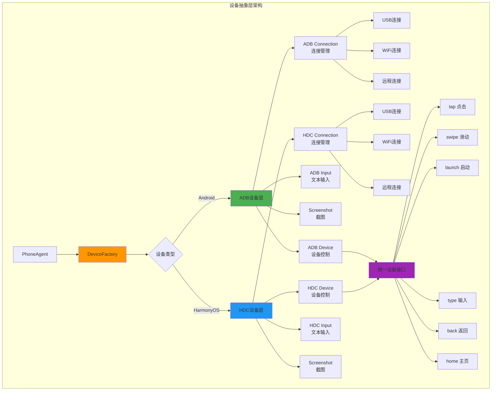

**平台差异处理**：

| 功能 | Android (ADB) | HarmonyOS (HDC) |
|------|---------------|-----------------|
| **启动应用** | `launch_app(package_name)` | `start_ability(bundle_name, ability_name)` |
| **文本输入** | ADB Keyboard（需安装） | 原生 IME（无需额外配置） |
| **命令前缀** | `adb` | `hdc` |
| **连接协议** | Android Debug Bridge | HarmonyOS Debug Console |

## 二、环境配置

### 2.1 系统要求

**Python 环境**：
- Python 3.8+
- pip 包管理器

**AI 模型服务**：
- vLLM / SGLang / OpenAI 兼容推理服务
- AutoGLM-Phone-9B 模型（或兼容的多模态模型）

**设备要求**：

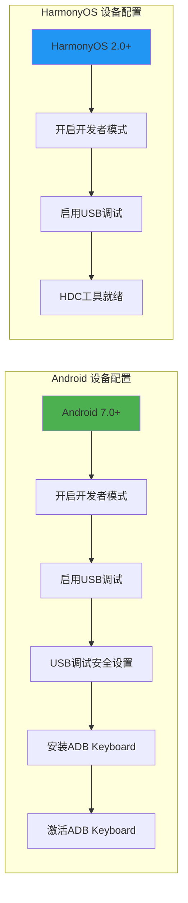

### 2.2 安装步骤

**Step 1: 克隆项目**

```bash
git clone https://github.com/zai-org/Open-AutoGLM.git
cd Open-AutoGLM
```

**Step 2: 安装依赖**

```bash
pip install -r requirements.txt
```

主要依赖包：
- `anthropic` 或其他 AI SDK（取决于模型服务）
- `Pillow`：图像处理
- `requests`：HTTP 客户端
- 平台工具：`adb`（Android）或 `hdc`（HarmonyOS）

**Step 3: 配置 Android 设备（以 Android 为例）**

1. **启用开发者选项**：
   - 设置 → 关于手机 → 连续点击"版本号"7次
   
2. **开启 USB 调试**：
   - 设置 → 开发者选项 → USB 调试（开启）
   - 设置 → 开发者选项 → USB 调试（安全设置）（部分设备需要）

3. **连接设备并验证**：

```bash
# 连接设备到电脑
# 验证设备连接
adb devices

# 输出示例：
# List of devices attached
# 1234567890ABCDEF    device
```

4. **安装 ADB Keyboard**：

```bash
# 安装 APK（项目通常会提供）
adb install ADBKeyboard.apk

# 设置 → 系统 → 语言和输入法 → 虚拟键盘 → 管理键盘
# 启用 "ADB Keyboard"
```

**Step 4: 部署 AI 模型服务**

使用 vLLM 部署 AutoGLM-Phone-9B 模型：

```bash
# 安装 vLLM
pip install vllm

# 启动模型服务
python -m vllm.entrypoints.openai.api_server \
    --model THUDM/AutoGLM-Phone-9B \
    --served-model-name AutoGLM-Phone-9B \
    --host 0.0.0.0 \
    --port 8000 \
    --max-model-len 4096
```

或使用 SGLang：

```bash
# 安装 SGLang
pip install sglang[all]

# 启动模型服务
python -m sglang.launch_server \
    --model-path THUDM/AutoGLM-Phone-9B \
    --port 8000 \
    --host 0.0.0.0
```

**Step 5: 验证安装**

```bash
# 测试设备连接
python -c "from phone_agent.adb import list_devices; print(list_devices())"

# 测试模型服务
curl http://localhost:8000/v1/models
```

### 2.3 HarmonyOS 配置

HarmonyOS 设备的配置类似，但使用 HDC 工具：

```bash
# 安装 HDC 工具（HarmonyOS SDK 自带）
# 下载地址：https://developer.harmonyos.com

# 验证 HDC 连接
hdc list targets

# 输出示例：
# 192.168.1.100:5555
```

## 三、快速开始

### 3.1 第一个自动化任务

让我们通过一个简单示例快速上手：

**任务**：打开淘宝应用并搜索"无线耳机"

```python
from phone_agent import PhoneAgent
from phone_agent.config import AgentConfig

# 配置 Agent
config = AgentConfig(
    base_url="http://localhost:8000/v1",  # 模型服务地址
    model_name="AutoGLM-Phone-9B",        # 模型名称
    max_steps=50,                          # 最大执行步数
    device_id=None,                        # 自动选择设备
    verbose=True                           # 详细输出
)

# 创建 Agent
agent = PhoneAgent(config)

# 执行任务
result = agent.run("打开淘宝搜索无线耳机")

print(f"任务完成！结果: {result}")
```

**执行过程可视化**：


### 3.2 命令行使用

Open-AutoGLM 提供了便捷的命令行接口：

```bash
# 基本用法
python main.py --base-url http://localhost:8000/v1 \
               --model AutoGLM-Phone-9B \
               "打开微信给张三发消息说明天见"

# 指定设备
python main.py --device-id 1234567890ABCDEF \
               "打开抖音关注人工智能相关账号"

# 详细模式（显示思考过程）
python main.py --verbose \
               "打开美团点外卖"

# 静默模式（仅输出结果）
python main.py --quiet \
               "打开支付宝查看余额"
```

**命令行参数**：

| 参数 | 说明 | 默认值 |
|------|------|--------|
| `--base-url` | AI 模型服务地址 | 必需 |
| `--model` | 模型名称 | `AutoGLM-Phone-9B` |
| `--max-steps` | 最大执行步数 | `100` |
| `--device-id` | 目标设备 ID | 自动选择 |
| `--verbose` | 详细输出模式 | `False` |
| `--quiet` | 静默模式 | `False` |

### 3.3 Python API 详解

**基础 API**：

```python
from phone_agent import PhoneAgent
from phone_agent.config import AgentConfig

# 创建配置
config = AgentConfig(
    base_url="http://localhost:8000/v1",
    model_name="AutoGLM-Phone-9B",
    max_steps=100,
    device_id=None,
    verbose=False
)

# 初始化 Agent
agent = PhoneAgent(config)

# 方法 1: 自动执行完整任务
result = agent.run("打开淘宝搜索无线耳机")

# 方法 2: 单步执行（用于调试）
agent.reset()  # 重置状态
while True:
    step_result = agent.step()
    if step_result.finished:
        print(f"任务完成: {step_result.message}")
        break
    print(f"步骤 {step_result.step}: {step_result.action}")
```

**自定义回调**：

```python
def confirmation_callback(action_name, action_params):
    """敏感操作确认回调"""
    print(f"即将执行敏感操作: {action_name}")
    print(f"参数: {action_params}")
    
    response = input("是否继续？(y/n): ")
    return response.lower() == 'y'

def takeover_callback(screen_base64):
    """人工接管回调"""
    print("AI 请求人工介入（例如：验证码、登录）")
    print("请手动完成操作...")
    
    input("完成后按回车继续...")
    return True

# 使用回调创建 Agent
agent = PhoneAgent(
    config,
    confirmation_callback=confirmation_callback,
    takeover_callback=takeover_callback
)

# 执行涉及敏感操作的任务
result = agent.run("打开支付宝给张三转账100元")
```

## 四、实战案例

### 4.1 案例一：电商自动下单

**需求**：在淘宝搜索"无线鼠标"，筛选价格 50-100 元，加购第一个商品。

```python
from phone_agent import PhoneAgent
from phone_agent.config import AgentConfig

# 配置
config = AgentConfig(
    base_url="http://localhost:8000/v1",
    model_name="AutoGLM-Phone-9B",
    max_steps=100,
    verbose=True  # 开启详细输出查看过程
)

agent = PhoneAgent(config)

# 执行任务
instruction = """
请执行以下任务：
1. 打开淘宝应用
2. 搜索"无线鼠标"
3. 设置价格筛选为50到100元
4. 选择第一个商品
5. 点击加入购物车
"""

result = agent.run(instruction)
print(f"任务结果: {result}")
```

**执行流程图**：

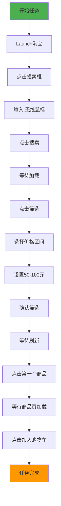

**预期输出**：

```
步骤 1: Launch 淘宝 (com.taobao.taobao)
步骤 2: 等待应用启动...
步骤 3: Tap 搜索框 [0.5, 0.1]
步骤 4: Type "无线鼠标"
步骤 5: Tap 搜索按钮 [0.9, 0.1]
步骤 6: 等待搜索结果...
步骤 7: Tap 筛选按钮 [0.8, 0.15]
步骤 8: Tap 价格筛选 [0.3, 0.5]
步骤 9: Type 最低价 "50"
步骤 10: Type 最高价 "100"
步骤 11: Tap 确定 [0.5, 0.9]
步骤 12: 等待筛选结果...
步骤 13: Tap 第一个商品 [0.5, 0.3]
步骤 14: 等待商品详情...
步骤 15: Tap 加入购物车 [0.5, 0.9]
任务完成！
```

### 4.2 案例二：社交媒体自动发布

**需求**：在抖音发布一条带话题的视频。

```python
from phone_agent import PhoneAgent
from phone_agent.config import AgentConfig
import os

# 配置
config = AgentConfig(
    base_url="http://localhost:8000/v1",
    model_name="AutoGLM-Phone-9B",
    max_steps=150,
    verbose=True
)

agent = PhoneAgent(config)

# 任务描述
instruction = """
请执行以下操作：
1. 打开抖音应用
2. 点击底部中间的"+"按钮进入拍摄页面
3. 点击"上传"，选择相册中的第一个视频
4. 进入编辑页面，添加描述："今天天气真好 #日常vlog #美好生活"
5. 点击发布
"""

result = agent.run(instruction)
print(f"发布结果: {result}")
```

**工作流程**：

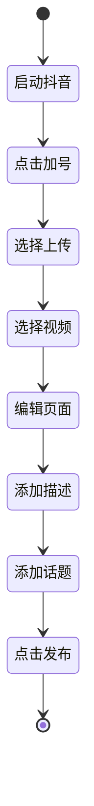

### 4.3 案例三：信息采集自动化

**需求**：从微信读取未读消息并记录。

```python
from phone_agent import PhoneAgent
from phone_agent.config import AgentConfig
import json

config = AgentConfig(
    base_url="http://localhost:8000/v1",
    model_name="AutoGLM-Phone-9B",
    max_steps=80,
    verbose=False
)

agent = PhoneAgent(config)

# 任务：提取微信未读消息
instruction = """
执行以下任务：
1. 打开微信
2. 查看聊天列表，识别有红点标记的未读消息
3. 依次打开未读对话，记录发送人和最新一条消息
4. 完成后返回聊天列表
"""

# 执行
result = agent.run(instruction)

# 解析结果（实际应用中可能需要结构化输出）
print("未读消息摘要:")
print(result)
```

**数据流向**：

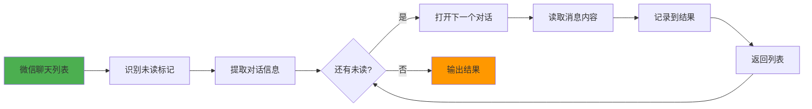

### 4.4 案例四：多任务批量执行

**需求**：批量检查多个应用的通知。

```python
from phone_agent import PhoneAgent
from phone_agent.config import AgentConfig

config = AgentConfig(
    base_url="http://localhost:8000/v1",
    model_name="AutoGLM-Phone-9B",
    max_steps=200,
    verbose=False
)

agent = PhoneAgent(config)

# 定义任务列表
apps_to_check = [
    "微信",
    "QQ",
    "钉钉",
    "邮件"
]

results = {}

for app_name in apps_to_check:
    print(f"\n正在检查 {app_name}...")
    
    instruction = f"""
    执行以下操作：
    1. 打开{app_name}
    2. 检查是否有未读消息或通知
    3. 如果有，统计数量
    4. 返回主页
    """
    
    result = agent.run(instruction)
    results[app_name] = result
    
    # 重置 Agent 状态，准备下一个任务
    agent.reset()
    
    print(f"{app_name} 检查完成")

# 输出汇总
print("\n=== 通知检查汇总 ===")
for app, result in results.items():
    print(f"{app}: {result}")
```

**批量执行流程**：

```mermaid
graph TB
    subgraph "批量任务执行"
        A[任务队列] --> B[取出任务1]
        B --> C1[执行: 检查微信]
        C1 --> D1[记录结果]
        D1 --> E1[重置Agent]
        
        E1 --> F[取出任务2]
        F --> C2[执行: 检查QQ]
        C2 --> D2[记录结果]
        D2 --> E2[重置Agent]
        
        E2 --> G[取出任务3]
        G --> C3[执行: 检查钉钉]
        C3 --> D3[记录结果]
        D3 --> E3[重置Agent]
        
        E3 --> H[取出任务4]
        H --> C4[执行: 检查邮件]
        C4 --> D4[记录结果]
        D4 --> I[汇总输出]
    end
    
    style A fill:#4caf50
    style I fill:#ff9800
```

## 五、高级功能

### 5.1 远程设备控制

Open-AutoGLM 支持通过 WiFi 控制远程设备：

**Android 设备配置**：

```bash
# 1. 确保设备和电脑在同一网络
# 2. 通过 USB 连接设备
adb devices

# 3. 启用 TCP/IP 模式
adb tcpip 5555

# 4. 查看设备 IP 地址
adb shell ip addr show wlan0 | grep "inet "

# 5. 通过 WiFi 连接（假设设备 IP 为 192.168.1.100）
adb connect 192.168.1.100:5555

# 6. 断开 USB，验证 WiFi 连接
adb devices
# 输出: 192.168.1.100:5555    device
```

**HarmonyOS 设备配置**：

```bash
# 1. 启用网络调试
hdc tmode port 5555

# 2. 连接设备
hdc tconn 192.168.1.100:5555

# 3. 验证连接
hdc list targets
```

**Python 代码使用**：

```python
from phone_agent.adb import ADBConnection, ConnectionType

# 创建远程连接
connection = ADBConnection(
    connection_type=ConnectionType.REMOTE,
    remote_address="192.168.1.100:5555"
)

# 连接设备
connection.connect()

# 使用 Agent（会自动使用该连接）
from phone_agent import PhoneAgent
agent = PhoneAgent(config, device_id="192.168.1.100:5555")
result = agent.run("打开设置查看WiFi连接")
```

### 5.2 自定义应用支持

添加未预配置的应用：

```python
from phone_agent.config import APP_PACKAGES

# 添加 Android 应用
APP_PACKAGES["我的应用"] = "com.example.myapp"

# 对于 HarmonyOS
from phone_agent.config import HARMONYOS_APPS

HARMONYOS_APPS["我的应用"] = {
    "bundle": "com.example.myapp",
    "ability": "EntryAbility"
}

# 现在可以使用自然语言启动
agent.run("打开我的应用")
```

### 5.3 调试模式

开启详细模式查看 AI 的思考过程：

```python
config = AgentConfig(
    base_url="http://localhost:8000/v1",
    model_name="AutoGLM-Phone-9B",
    max_steps=100,
    verbose=True  # 开启详细输出
)

agent = PhoneAgent(config)
result = agent.run("打开淘宝搜索手机")
```

**详细输出示例**：

```
=== Step 1 ===
[屏幕状态] 主屏幕，显示多个应用图标
[AI 思考] 用户要求打开淘宝，我需要找到淘宝应用图标并点击
[决策动作] Launch("淘宝")
[执行结果] 成功启动应用 com.taobao.taobao

=== Step 2 ===
[屏幕状态] 淘宝首页，顶部有搜索框
[AI 思考] 淘宝已打开，现在需要进入搜索功能
[决策动作] Tap([0.5, 0.08])  # 点击搜索框
[执行结果] 成功点击，搜索页面已打开

=== Step 3 ===
[屏幕状态] 搜索输入页面，键盘弹出
[AI 思考] 搜索框已聚焦，可以输入文本
[决策动作] Type("手机")
[执行结果] 成功输入文本

...
```

### 5.4 动作系统详解

Open-AutoGLM 支持以下动作类型：

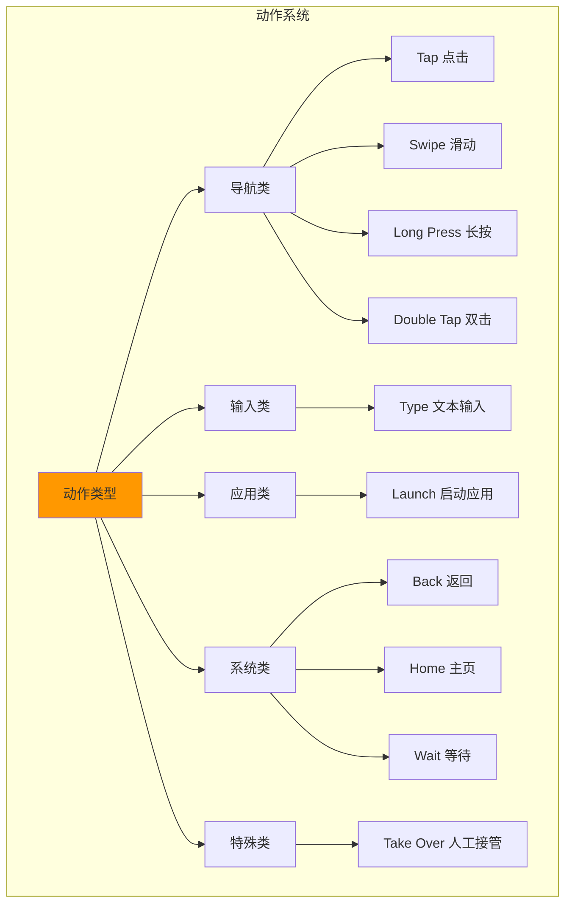

**动作详细说明**：

| 动作 | 参数 | 说明 | 示例 |
|------|------|------|------|
| **Tap** | `[x, y]` | 点击屏幕坐标（归一化 0-1） | `Tap([0.5, 0.3])` |
| **Swipe** | `[x1,y1,x2,y2]` | 从起点滑动到终点 | `Swipe([0.5,0.8,0.5,0.2])` |
| **Long Press** | `[x, y]` | 长按坐标点 | `Long_Press([0.5, 0.5])` |
| **Double Tap** | `[x, y]` | 双击坐标点 | `Double_Tap([0.5, 0.5])` |
| **Type** | `"文本"` | 输入文本内容 | `Type("无线耳机")` |
| **Launch** | `"应用名"` | 启动指定应用 | `Launch("微信")` |
| **Back** | - | 返回上一页 | `Back()` |
| **Home** | - | 返回主屏幕 | `Home()` |
| **Wait** | `秒数` | 等待指定时间 | `Wait(2)` |
| **Take_over** | - | 请求人工介入 | `Take_over()` |

## 六、最佳实践

### 6.1 任务设计原则

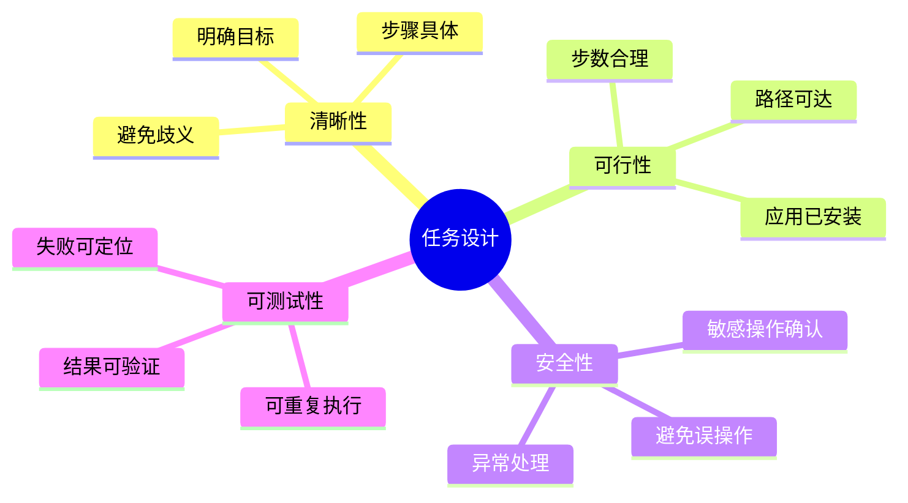

**良好的任务描述示例**：

```python
# ✅ 好的任务描述
good_instruction = """
1. 打开淘宝应用
2. 点击搜索框
3. 输入"无线鼠标"
4. 点击搜索按钮
5. 等待结果加载
6. 点击第一个商品
"""

# ❌ 不好的任务描述
bad_instruction = "帮我买个好用的鼠标"  # 太模糊，AI 无法执行
```

### 6.2 错误处理策略

```python
from phone_agent import PhoneAgent
from phone_agent.config import AgentConfig
import logging

# 配置日志
logging.basicConfig(level=logging.INFO)
logger = logging.getLogger(__name__)

def robust_execute(instruction, max_retries=3):
    """带重试机制的任务执行"""
    config = AgentConfig(
        base_url="http://localhost:8000/v1",
        model_name="AutoGLM-Phone-9B",
        max_steps=100
    )
    
    for attempt in range(max_retries):
        try:
            logger.info(f"尝试 {attempt + 1}/{max_retries}")
            
            agent = PhoneAgent(config)
            result = agent.run(instruction)
            
            logger.info(f"任务成功: {result}")
            return result
            
        except Exception as e:
            logger.error(f"任务失败: {str(e)}")
            
            if attempt < max_retries - 1:
                logger.info("准备重试...")
                # 可选：重置设备状态
                agent.device.home()  # 返回主屏幕
            else:
                logger.error("达到最大重试次数，任务失败")
                raise
    
    return None

# 使用
result = robust_execute("打开微信查看未读消息")
```

### 6.3 性能优化

**1. 合理设置最大步数**：

```python
# 简单任务：减少最大步数
config_simple = AgentConfig(
    base_url="http://localhost:8000/v1",
    model_name="AutoGLM-Phone-9B",
    max_steps=30  # 简单任务用更少步数
)

# 复杂任务：增加最大步数
config_complex = AgentConfig(
    base_url="http://localhost:8000/v1",
    model_name="AutoGLM-Phone-9B",
    max_steps=150  # 复杂任务允许更多步数
)
```

**2. 使用批量处理**：

```python
# 批量任务示例
tasks = [
    "打开微信查看未读",
    "打开支付宝查看余额",
    "打开淘宝查看订单"
]

agent = PhoneAgent(config)

for i, task in enumerate(tasks):
    print(f"执行任务 {i+1}/{len(tasks)}: {task}")
    result = agent.run(task)
    agent.reset()  # 重置状态
    print(f"完成: {result}\n")
```

**3. 优化模型推理**：

- 使用 vLLM 的张量并行提升推理速度
- 启用 KV-cache 减少重复计算
- 调整 `max_model_len` 平衡速度和能力

### 6.4 安全建议

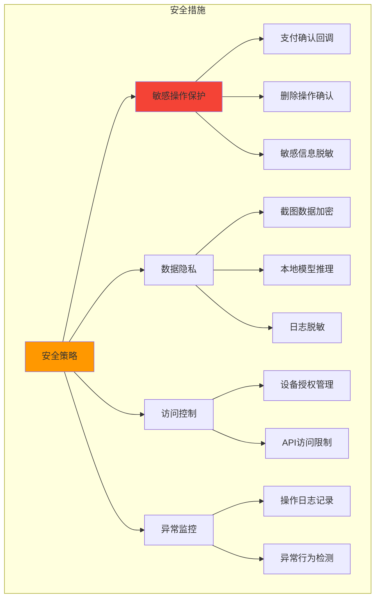

**敏感操作确认示例**：

```python
def payment_confirmation(action_name, action_params):
    """支付操作确认"""
    if action_name == "Tap" and "支付" in str(action_params):
        print("⚠️  检测到支付操作！")
        print(f"参数: {action_params}")
        
        # 人工确认
        response = input("确认执行支付操作？(yes/no): ")
        return response.lower() == "yes"
    
    return True  # 非敏感操作直接通过

agent = PhoneAgent(
    config,
    confirmation_callback=payment_confirmation
)
```

## 七、故障排查

### 7.1 常见问题

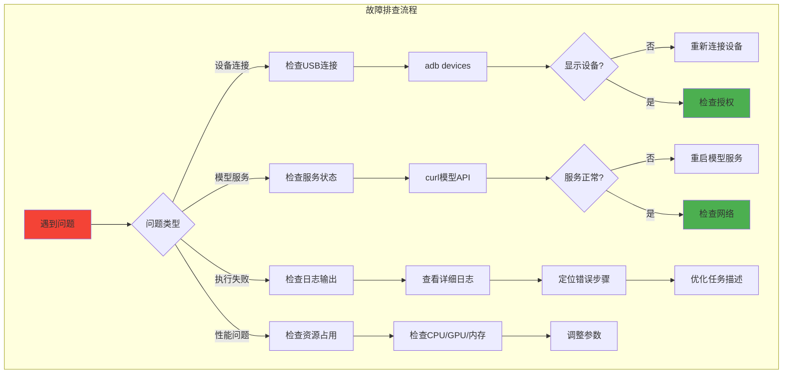

**问题 1: 设备连接失败**

```bash
# 检查设备连接
adb devices

# 如果显示 "unauthorized"
# 解决：在手机上确认 USB 调试授权

# 如果显示 "offline"
# 解决：
adb kill-server
adb start-server
adb devices
```

**问题 2: ADB Keyboard 无法输入**

```bash
# 检查 ADB Keyboard 状态
adb shell ime list -s

# 设置 ADB Keyboard 为当前输入法
adb shell ime set com.android.adbkeyboard/.AdbIME

# 测试输入
adb shell am broadcast -a ADB_INPUT_TEXT --es msg "test"
```

**问题 3: 模型服务无响应**

```bash
# 检查服务状态
curl http://localhost:8000/v1/models

# 检查服务日志
# 查看 vLLM 或 SGLang 的输出

# 重启服务
# Ctrl+C 停止服务，然后重新启动
```

**问题 4: 任务执行超时**

```python
# 增加最大步数
config = AgentConfig(
    base_url="http://localhost:8000/v1",
    model_name="AutoGLM-Phone-9B",
    max_steps=200,  # 增加到 200
    verbose=True
)

# 或者分解任务
# 将复杂任务拆分为多个简单任务
task1 = "打开淘宝"
task2 = "搜索无线鼠标"
task3 = "设置价格筛选50-100元"

for task in [task1, task2, task3]:
    agent.run(task)
```

### 7.2 日志分析

启用详细日志：

```python
import logging

# 配置日志级别
logging.basicConfig(
    level=logging.DEBUG,
    format='%(asctime)s - %(name)s - %(levelname)s - %(message)s',
    handlers=[
        logging.FileHandler('agent.log'),  # 保存到文件
        logging.StreamHandler()             # 同时输出到控制台
    ]
)

# 使用 verbose 模式
config = AgentConfig(
    base_url="http://localhost:8000/v1",
    model_name="AutoGLM-Phone-9B",
    max_steps=100,
    verbose=True
)

agent = PhoneAgent(config)
result = agent.run("打开微信")
```

## 八、扩展开发

### 8.1 自定义动作

扩展 ActionHandler 添加新动作：

```python
from phone_agent.actions import ActionHandler

class CustomActionHandler(ActionHandler):
    """自定义动作处理器"""
    
    def execute_screenshot(self, params):
        """新动作：保存截图"""
        filename = params.get("filename", "screenshot.png")
        screenshot = self.device.get_screenshot()
        
        # 保存截图
        with open(filename, "wb") as f:
            import base64
            f.write(base64.b64decode(screenshot.data))
        
        return f"截图已保存到 {filename}"
    
    def execute_rotate(self, params):
        """新动作：旋转屏幕"""
        orientation = params.get("orientation", "portrait")
        
        if orientation == "landscape":
            # 横屏
            self.device.execute_command("settings put system user_rotation 1")
        else:
            # 竖屏
            self.device.execute_command("settings put system user_rotation 0")
        
        return f"屏幕已旋转到 {orientation}"

# 使用自定义处理器
# 需要修改 PhoneAgent 初始化逻辑
```

### 8.2 集成到其他系统

**Web API 封装**：

```python
from flask import Flask, request, jsonify
from phone_agent import PhoneAgent
from phone_agent.config import AgentConfig

app = Flask(__name__)

# 初始化 Agent
config = AgentConfig(
    base_url="http://localhost:8000/v1",
    model_name="AutoGLM-Phone-9B",
    max_steps=100
)

agent = PhoneAgent(config)

@app.route('/api/execute', methods=['POST'])
def execute_task():
    """执行自动化任务 API"""
    data = request.json
    instruction = data.get('instruction')
    device_id = data.get('device_id')
    
    if not instruction:
        return jsonify({"error": "缺少 instruction 参数"}), 400
    
    try:
        # 如果指定了设备ID，重新初始化
        if device_id:
            config.device_id = device_id
            agent = PhoneAgent(config)
        
        result = agent.run(instruction)
        
        return jsonify({
            "success": True,
            "result": result
        })
        
    except Exception as e:
        return jsonify({
            "success": False,
            "error": str(e)
        }), 500

@app.route('/api/devices', methods=['GET'])
def list_devices():
    """列出可用设备"""
    from phone_agent.adb import list_devices
    devices = list_devices()
    
    return jsonify({
        "devices": devices
    })

if __name__ == '__main__':
    app.run(host='0.0.0.0', port=5000)
```

**使用示例**：

```bash
# 启动 Web API
python api_server.py

# 调用 API
curl -X POST http://localhost:5000/api/execute \
  -H "Content-Type: application/json" \
  -d '{"instruction": "打开微信查看未读消息"}'

# 列出设备
curl http://localhost:5000/api/devices
```

### 8.3 与自动化测试集成

```python
import unittest
from phone_agent import PhoneAgent
from phone_agent.config import AgentConfig

class AppAutomationTest(unittest.TestCase):
    """应用自动化测试"""
    
    @classmethod
    def setUpClass(cls):
        """初始化测试环境"""
        config = AgentConfig(
            base_url="http://localhost:8000/v1",
            model_name="AutoGLM-Phone-9B",
            max_steps=100
        )
        cls.agent = PhoneAgent(config)
    
    def setUp(self):
        """每个测试前重置状态"""
        self.agent.reset()
        self.agent.device.home()  # 返回主屏幕
    
    def test_wechat_launch(self):
        """测试：启动微信"""
        result = self.agent.run("打开微信")
        self.assertIn("微信", result)
    
    def test_taobao_search(self):
        """测试：淘宝搜索"""
        result = self.agent.run("打开淘宝搜索无线鼠标")
        self.assertIn("搜索", result)
    
    def test_douyin_browse(self):
        """测试：浏览抖音"""
        result = self.agent.run("打开抖音向上滑动3次")
        self.assertIn("完成", result)
    
    def tearDown(self):
        """每个测试后清理"""
        self.agent.device.home()

if __name__ == '__main__':
    unittest.main()
```

运行测试：

```bash
python -m unittest test_automation.py -v
```

## 九、性能调优

### 9.1 模型推理优化

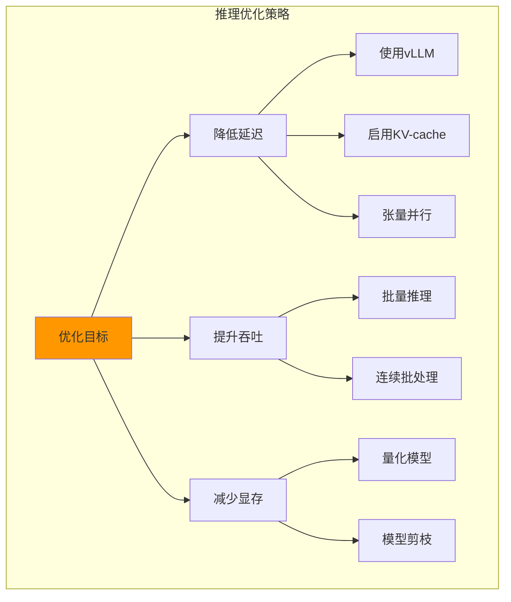

**vLLM 优化配置**：

```bash
# 使用张量并行（多 GPU）
python -m vllm.entrypoints.openai.api_server \
    --model THUDM/AutoGLM-Phone-9B \
    --tensor-parallel-size 2 \  # 使用 2 个 GPU
    --served-model-name AutoGLM-Phone-9B \
    --host 0.0.0.0 \
    --port 8000 \
    --max-model-len 4096 \
    --gpu-memory-utilization 0.9  # 使用 90% GPU 显存
```

**模型量化**：

```bash
# 使用 4-bit 量化减少显存占用
python -m vllm.entrypoints.openai.api_server \
    --model THUDM/AutoGLM-Phone-9B \
    --quantization awq \  # 或 gptq
    --dtype half \
    --max-model-len 4096
```

### 9.2 截图优化

```python
from phone_agent.adb import Screenshot
from PIL import Image
import io

class OptimizedScreenshot:
    """优化的截图处理"""
    
    @staticmethod
    def compress_screenshot(screenshot: Screenshot, 
                          quality=85, 
                          max_size=(1080, 1920)):
        """压缩截图减少传输大小"""
        import base64
        
        # 解码 base64
        img_data = base64.b64decode(screenshot.data)
        img = Image.open(io.BytesIO(img_data))
        
        # 调整大小
        img.thumbnail(max_size, Image.LANCZOS)
        
        # 压缩保存
        buffer = io.BytesIO()
        img.save(buffer, format="JPEG", quality=quality, optimize=True)
        
        # 重新编码
        compressed_data = base64.b64encode(buffer.getvalue()).decode()
        
        return Screenshot(
            data=compressed_data,
            format="jpeg",
            size=img.size
        )
```

### 9.3 并发执行

多设备并发控制：

```python
from concurrent.futures import ThreadPoolExecutor
from phone_agent import PhoneAgent
from phone_agent.config import AgentConfig

def execute_on_device(device_id, instruction):
    """在指定设备上执行任务"""
    config = AgentConfig(
        base_url="http://localhost:8000/v1",
        model_name="AutoGLM-Phone-9B",
        max_steps=100,
        device_id=device_id
    )
    
    agent = PhoneAgent(config)
    result = agent.run(instruction)
    
    return {
        "device_id": device_id,
        "result": result
    }

# 多设备任务
devices = [
    "192.168.1.100:5555",
    "192.168.1.101:5555",
    "192.168.1.102:5555"
]

instruction = "打开微信查看未读消息"

# 并发执行
with ThreadPoolExecutor(max_workers=3) as executor:
    futures = [
        executor.submit(execute_on_device, device, instruction)
        for device in devices
    ]
    
    results = [future.result() for future in futures]

# 输出结果
for result in results:
    print(f"设备 {result['device_id']}: {result['result']}")
```

## 十、社区与资源

### 10.1 官方资源

- **GitHub 仓库**: [github.com/zai-org/Open-AutoGLM](https://github.com/zai-org/Open-AutoGLM)
- **文档中心**: [deepwiki.com/zai-org/Open-AutoGLM](https://deepwiki.com/zai-org/Open-AutoGLM/)
- **模型下载**: [Hugging Face - THUDM/AutoGLM-Phone-9B](https://huggingface.co/THUDM/AutoGLM-Phone-9B)

### 10.2 学习路径


**推荐学习顺序**：

1. **第一周**：环境配置、设备连接、简单任务执行
2. **第二周**：掌握各种动作类型、自定义回调
3. **第三周**：实战案例练习、错误处理
4. **第四周**：高级功能、性能优化、系统集成

### 10.3 相关项目

| 项目 | 说明 | 链接 |
|------|------|------|
| **AutoGLM** | 官方 AI 模型系列 | [github.com/THUDM/AutoGLM](https://github.com/THUDM/AutoGLM) |
| **vLLM** | 高性能推理引擎 | [github.com/vllm-project/vllm](https://github.com/vllm-project/vllm) |
| **SGLang** | 结构化生成引擎 | [github.com/sgl-project/sglang](https://github.com/sgl-project/sglang) |
| **Appium** | 传统移动自动化框架 | [appium.io](https://appium.io) |

## 总结

Open-AutoGLM 通过结合多模态 AI 和设备调试协议，实现了强大的移动设备自动化能力。相比传统基于元素定位的自动化框架，Open-AutoGLM 的优势在于：

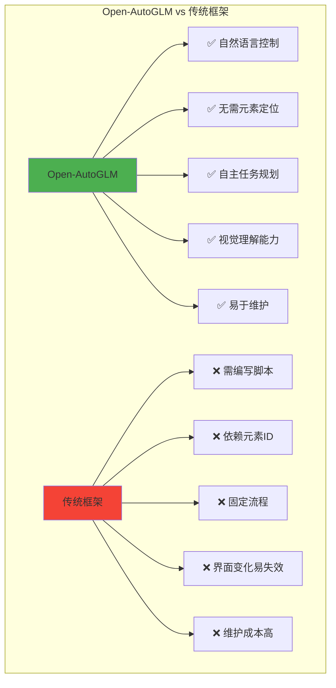

**核心优势**：
1. **零代码操作**：通过自然语言描述任务即可执行
2. **智能适应**：AI 自动适应界面变化，无需手动更新脚本
3. **快速上手**：几分钟即可完成配置，立即开始使用
4. **灵活扩展**：支持自定义动作、回调和集成

**适用场景**：
- 🛒 **电商自动化**：商品搜索、价格监控、订单处理
- 💬 **社交媒体管理**：消息回复、内容发布、数据采集
- 🧪 **应用测试**：功能验证、回归测试、压力测试
- 📊 **数据采集**：信息提取、内容抓取、监控报告

通过本指南的学习，你已经掌握了 Open-AutoGLM 从基础到高级的全部内容。现在就开始你的移动自动化之旅吧！

---

**参考资料**：
- [Open-AutoGLM GitHub 仓库](https://github.com/zai-org/Open-AutoGLM)
- [Open-AutoGLM DeepWiki 文档](https://deepwiki.com/zai-org/Open-AutoGLM/)
- [AutoGLM-Phone-9B 模型](https://huggingface.co/THUDM/AutoGLM-Phone-9B)
- [vLLM 文档](https://docs.vllm.ai/)
- [Android Debug Bridge 文档](https://developer.android.com/studio/command-line/adb)
- [HarmonyOS HDC 文档](https://developer.harmonyos.com/)
