## 什么是 JupyterLab？

JupyterLab 是 Jupyter 项目的下一代用户界面，是一个基于 Web 的交互式开发环境，用于处理笔记本、代码和数据。它基于 Python-JavaScript 混合架构构建，提供了灵活且可扩展的插件系统，将经典 Jupyter Notebook 的所有功能整合到一个现代化的界面中。

## JupyterLab 核心特性

### 统一的工作环境

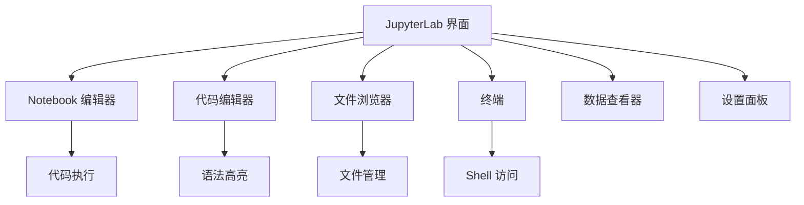

### 插件化架构

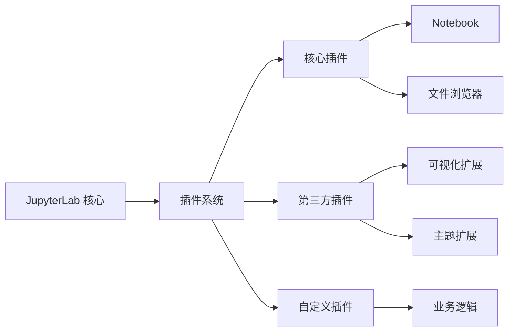

### 多文档支持

- **灵活布局**：支持多标签页、分割视图
- **拖放操作**：轻松重新排列工作区
- **状态持久化**：自动保存工作区布局
- **协作编辑**：支持实时协作（通过扩展）

## JupyterLab 架构详解

### 整体架构

JupyterLab 采用 Python-JavaScript 混合架构：

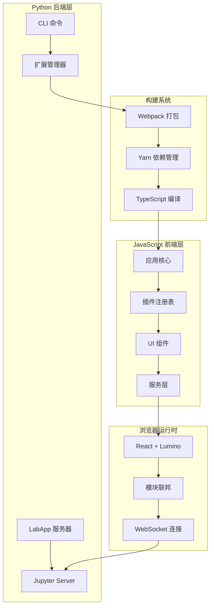

### 插件系统架构

JupyterLab 使用基于 Lumino 的依赖注入插件系统：

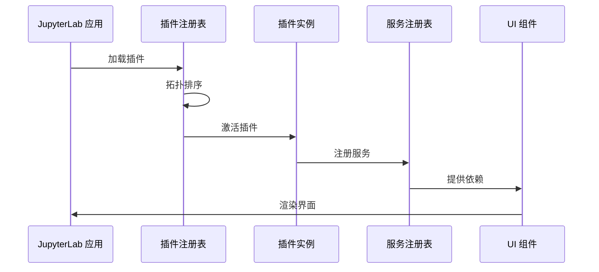

### 文档管理系统

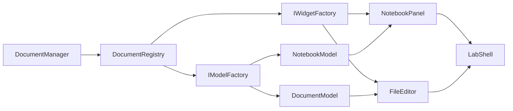

## 安装和配置

### 安装方法

#### 使用 conda

```bash
conda install -c conda-forge jupyterlab
```

#### 使用 mamba

```bash
mamba install -c conda-forge jupyterlab
```

#### 使用 pip

```bash
pip install jupyterlab
```

如果使用 `pip install --user`，需要将用户级别的 `bin` 目录添加到 `PATH`：

```bash
export PATH="$HOME/.local/bin:$PATH"
```

### 启动 JupyterLab

```bash
jupyter lab
```

JupyterLab 会自动在浏览器中打开。默认地址为 `http://localhost:8888`。

### 开发模式

```bash
jupyter lab --dev-mode
```

开发模式允许实时查看代码更改，无需重新构建。

### 支持的浏览器

- Firefox（最新版本）
- Chrome（最新版本）
- Safari（最新版本）
- Edge（最新版本）

## 核心功能使用

### 1. Notebook 操作

#### 创建和编辑 Notebook

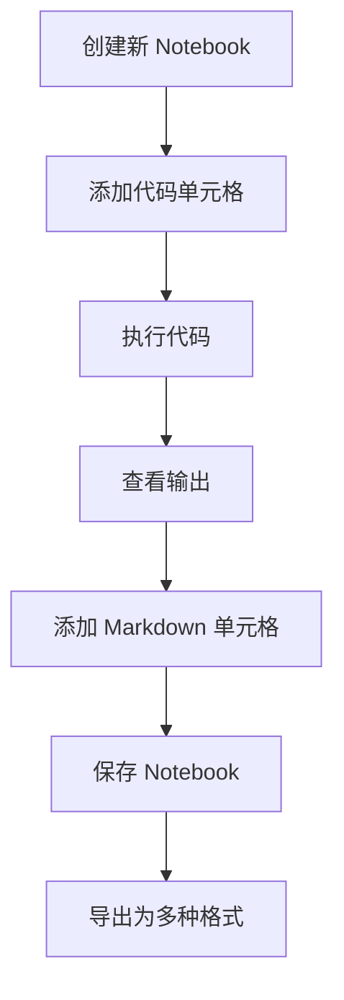

#### 单元格操作

- **执行单元格**：`Shift + Enter`
- **插入单元格**：`A`（上方）或 `B`（下方）
- **删除单元格**：`D, D`（按两次 D）
- **切换单元格类型**：`Y`（代码）或 `M`（Markdown）
- **合并单元格**：`Shift + M`

### 2. 文件管理

#### 文件浏览器功能

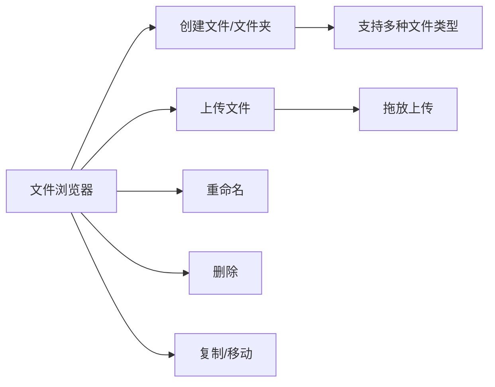

#### 常用操作

- **新建文件**：右键菜单 → New → File
- **上传文件**：拖放文件到文件浏览器
- **重命名**：右键 → Rename 或 `F2`
- **删除**：右键 → Delete 或 `Delete` 键

### 3. 代码编辑器

JupyterLab 内置了基于 CodeMirror 的代码编辑器：

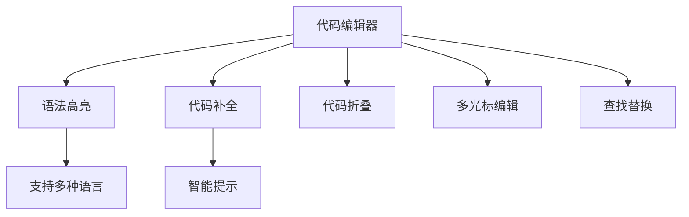

### 4. 终端集成

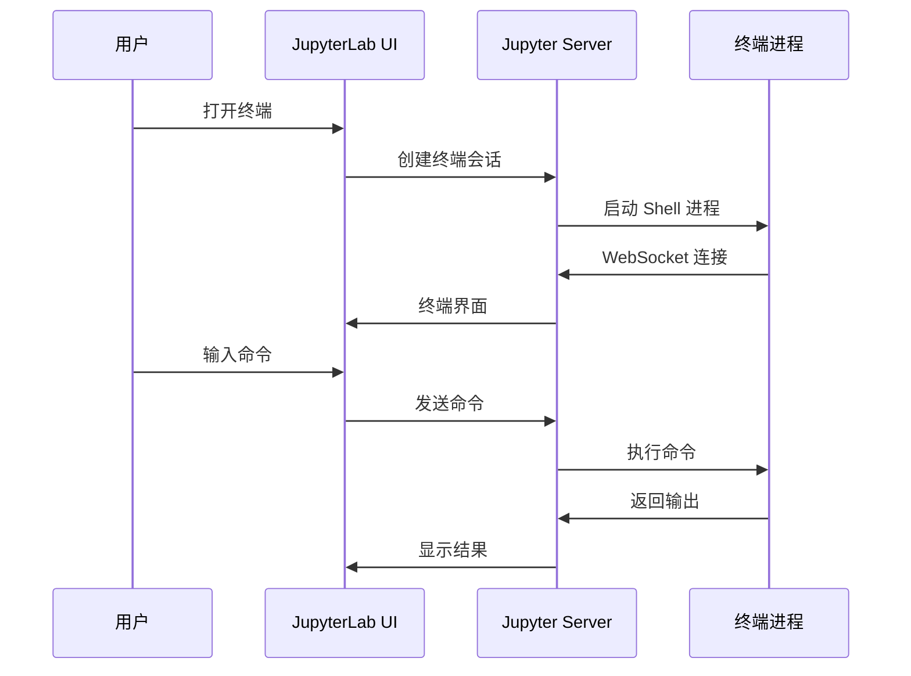

### 5. 数据查看器

JupyterLab 支持多种数据格式的可视化查看：

- **CSV 文件**：表格视图
- **JSON 文件**：树形视图
- **图片文件**：图片预览
- **PDF 文件**：PDF 查看器

## 扩展系统

### 扩展类型

JupyterLab 支持三种类型的扩展：

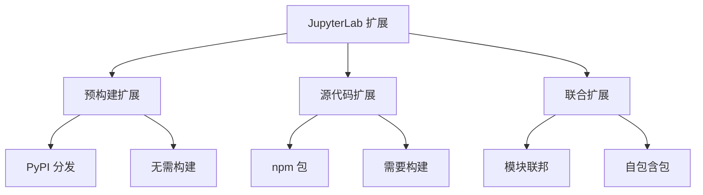

### 安装扩展

#### 预构建扩展（推荐）

```bash
pip install jupyterlab-extension-name
jupyter lab build
```

#### 源代码扩展

```bash
jupyter labextension install extension-name
jupyter lab build
```

#### 列出已安装扩展

```bash
jupyter labextension list
```

### 常用扩展推荐

#### 1. JupyterLab Git

版本控制集成：

```bash
pip install jupyterlab-git
jupyter lab build
```

功能：
- Git 状态显示
- 提交和推送
- 分支管理
- 差异查看

#### 2. JupyterLab Variable Inspector

变量查看器：

```bash
pip install lckr-jupyterlab-variableinspector
jupyter lab build
```

功能：
- 实时变量监控
- 变量值查看
- 内存使用情况

#### 3. JupyterLab Drawio

流程图绘制：

```bash
pip install jupyterlab-drawio
jupyter lab build
```

功能：
- Draw.io 集成
- 流程图创建
- 图表导出

## 场景示例

### 场景 1：数据科学工作流

#### 工作流程

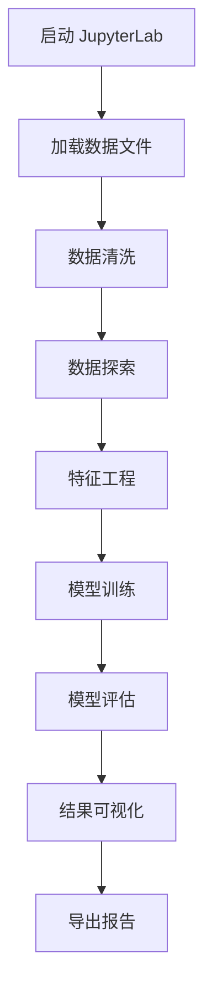

#### 实际操作步骤

1. **数据加载**
   ```python
   import pandas as pd
   import numpy as np
   
   # 在文件浏览器中上传数据文件
   df = pd.read_csv('data.csv')
   df.head()
   ```

2. **数据探索**
   ```python
   # 使用变量查看器监控数据
   df.info()
   df.describe()
   ```

3. **可视化分析**
   ```python
   import matplotlib.pyplot as plt
   import seaborn as sns
   
   plt.figure(figsize=(10, 6))
   sns.histplot(data=df, x='column_name')
   plt.show()
   ```

4. **模型训练**
   ```python
   from sklearn.model_selection import train_test_split
   from sklearn.ensemble import RandomForestClassifier
   
   X_train, X_test, y_train, y_test = train_test_split(
       X, y, test_size=0.2, random_state=42
   )
   
   model = RandomForestClassifier()
   model.fit(X_train, y_train)
   ```

### 场景 2：机器学习实验管理

#### 实验跟踪流程

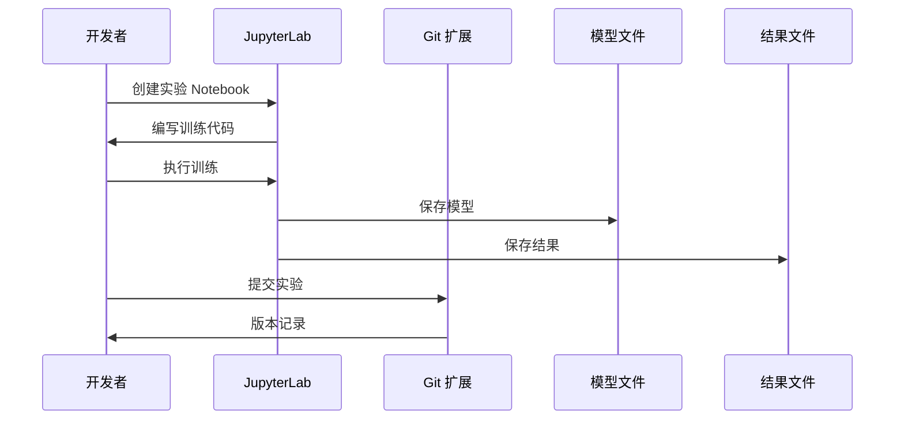

#### 最佳实践

1. **组织项目结构**
   ```
   project/
   ├── data/
   │   ├── raw/
   │   └── processed/
   ├── notebooks/
   │   ├── 01_exploration.ipynb
   │   ├── 02_preprocessing.ipynb
   │   └── 03_modeling.ipynb
   ├── src/
   │   └── utils.py
   └── models/
   ```

2. **使用 Git 扩展管理版本**
   - 定期提交 Notebook
   - 使用有意义的提交信息
   - 创建分支进行实验

3. **参数化实验**
   ```python
   # 在 Notebook 顶部定义参数
   EXPERIMENT_CONFIG = {
       'learning_rate': 0.001,
       'batch_size': 32,
       'epochs': 100
   }
   ```

### 场景 3：协作开发

#### 协作架构

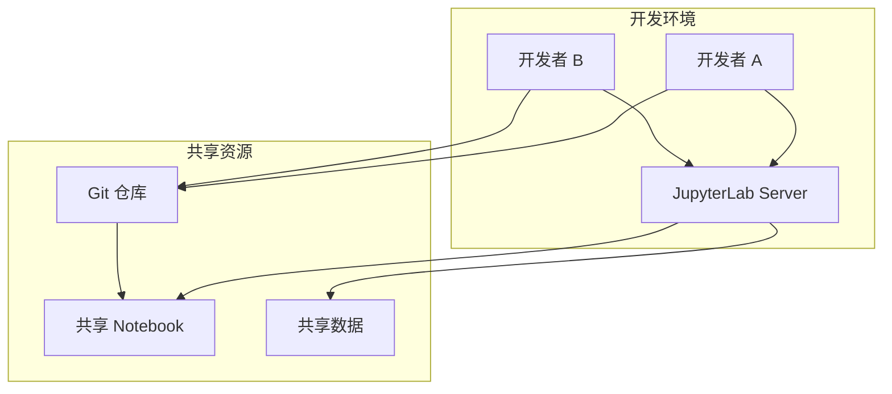

#### 协作流程

1. **设置共享服务器**
   ```bash
   # 启动 JupyterLab 服务器
   jupyter lab --ip=0.0.0.0 --port=8888 --no-browser
   ```

2. **配置访问控制**
   ```python
   # jupyter_lab_config.py
   c.ServerApp.token = 'your-secret-token'
   c.ServerApp.password = 'your-password'
   ```

3. **使用 Git 同步**
   - 定期拉取最新更改
   - 解决冲突
   - 推送更改

### 场景 4：自定义扩展开发

#### 扩展开发流程


#### 创建简单扩展

1. **初始化项目**
   ```bash
   # 使用 cookiecutter 模板
   cookiecutter https://github.com/jupyterlab/extension-cookiecutter-ts
   ```

2. **定义插件**
   ```typescript
   // src/index.ts
   import {
     JupyterFrontEnd,
     JupyterFrontEndPlugin
   } from '@jupyterlab/application';

   const plugin: JupyterFrontEndPlugin<void> = {
     id: 'my-extension:plugin',
     autoStart: true,
     activate: (app: JupyterFrontEnd) => {
       console.log('My extension is activated!');
     }
   };

   export default plugin;
   ```

3. **构建和安装**
   ```bash
   # 安装依赖
   jlpm install
   
   # 构建扩展
   jlpm build
   
   # 安装到 JupyterLab
   jupyter labextension install .
   jupyter lab build
   ```

#### 扩展架构示例

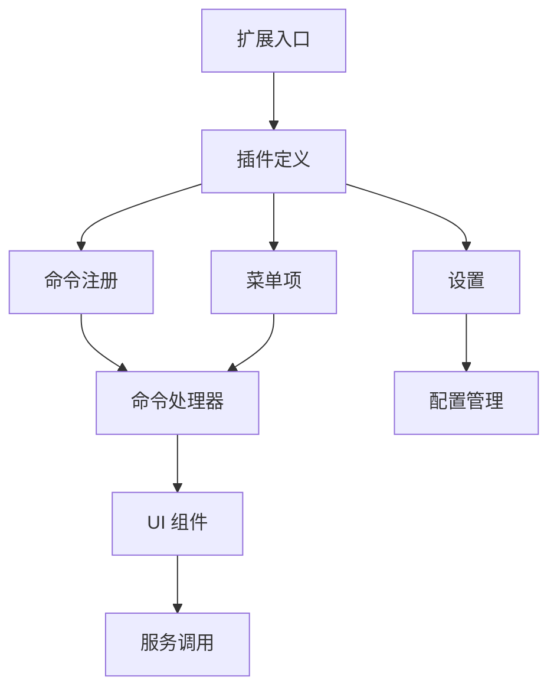

## 高级配置

### 配置文件位置

JupyterLab 配置文件位于：

- **Linux/macOS**: `~/.jupyter/jupyter_lab_config.py`
- **Windows**: `C:\Users\<username>\.jupyter\jupyter_lab_config.py`

### 常用配置选项

```python
# jupyter_lab_config.py

# 服务器配置
c.ServerApp.ip = '0.0.0.0'
c.ServerApp.port = 8888
c.ServerApp.open_browser = False

# 工作目录
c.ServerApp.root_dir = '/path/to/workspace'

# 扩展配置
c.LabApp.extensions = [
    'jupyterlab-git',
    'jupyterlab-drawio'
]

# 主题配置
c.LabApp.theme = 'JupyterLab Dark'

# 工作区配置
c.LabApp.workspaces_dir = '~/.jupyter/lab/workspaces'
```

### 主题定制

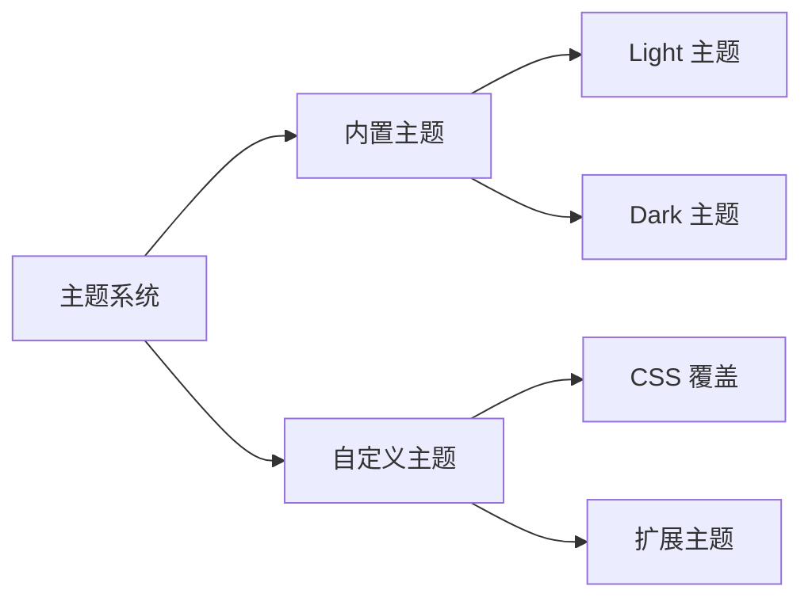

## 性能优化

### 优化策略

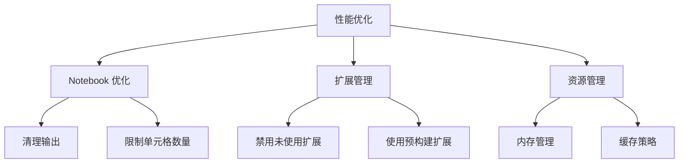

### 最佳实践

1. **Notebook 优化**
   - 定期清理输出
   - 限制大型数据集的显示
   - 使用分块处理大数据

2. **扩展管理**
   - 只安装必要的扩展
   - 定期更新扩展
   - 使用预构建扩展而非源代码扩展

3. **资源管理**
   ```python
   # 限制内存使用
   import gc
   gc.collect()
   
   # 使用生成器处理大数据
   def process_large_file(file_path):
       with open(file_path) as f:
           for line in f:
               yield process_line(line)
   ```

## 故障排查

### 常见问题

#### 1. 扩展无法加载

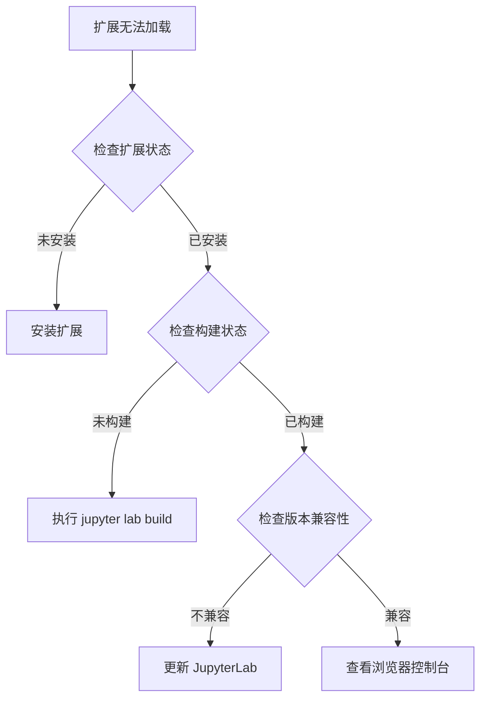

**解决方案**：
```bash
# 检查扩展列表
jupyter labextension list

# 重新构建
jupyter lab clean
jupyter lab build

# 检查日志
jupyter lab --debug
```

#### 2. 内核连接失败

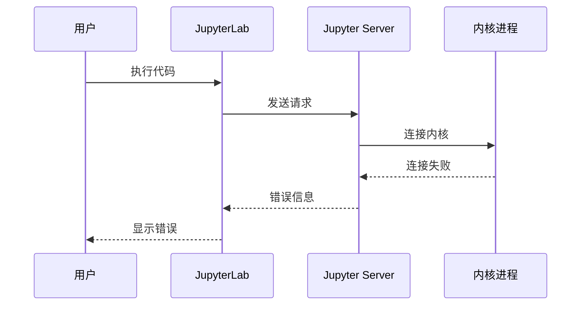

**解决方案**：
```bash
# 检查内核列表
jupyter kernelspec list

# 重启内核
# 在 Notebook 中：Kernel → Restart

# 检查内核日志
jupyter kernelspec list --json
```

#### 3. 文件无法保存

**可能原因**：
- 文件权限问题
- 磁盘空间不足
- 文件被锁定

**解决方案**：
```bash
# 检查文件权限
ls -la /path/to/file

# 检查磁盘空间
df -h

# 检查文件锁定
lsof /path/to/file
```

## 安全考虑

### 安全最佳实践

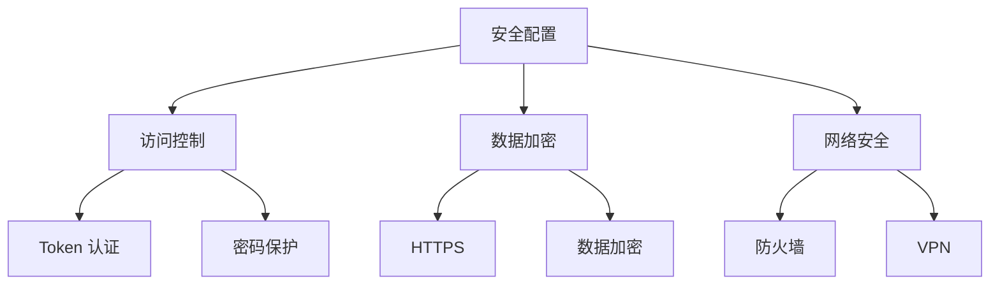

### 安全配置示例

```python
# jupyter_lab_config.py

# 使用 Token 认证
c.ServerApp.token = 'your-secret-token'

# 或使用密码
from jupyter_server.auth import passwd
c.ServerApp.password = passwd('your-password')

# 限制访问 IP
c.ServerApp.ip = '127.0.0.1'  # 仅本地访问

# 禁用 root 用户
c.ServerApp.allow_root = False

# 设置文件权限
c.ServerApp.file_to_run = ''
c.ServerApp.root_dir = '/safe/path'
```

## 与 Jupyter Notebook 的对比

### 功能对比

```mermaid
graph LR
    A[功能对比] --> B[Jupyter Notebook]
    A --> C[JupyterLab]
    B --> D[单一 Notebook]
    B --> E[基础文件管理]
    C --> F[多文档界面]
    C --> G[完整 IDE 功能]
    C --> H[扩展系统]
    C --> I[插件架构]
```

### 迁移指南

从 Jupyter Notebook 迁移到 JupyterLab：

1. **文件兼容性**：JupyterLab 完全兼容 `.ipynb` 文件
2. **快捷键**：大部分快捷键保持一致
3. **扩展**：需要安装对应的 JupyterLab 扩展
4. **配置**：配置文件位置和格式略有不同

## 社区和资源

### 获取帮助

- **官方文档**：https://jupyterlab.readthedocs.io/
- **GitHub 仓库**：https://github.com/jupyterlab/jupyterlab
- **Discourse 论坛**：https://discourse.jupyter.org/c/jupyterlab
- **Zulip 聊天**：https://jupyter.zulipchat.com/

### 贡献指南

JupyterLab 欢迎社区贡献：

1. **代码贡献**：提交 Pull Request
2. **扩展开发**：开发并发布扩展
3. **文档改进**：完善文档
4. **Bug 报告**：在 GitHub Issues 报告问题
5. **功能建议**：使用 Feature Request 模板

### 开发会议

- **时间**：每周三上午 9:00（太平洋时间）
- **地点**：Zoom（详见 README）
- **内容**：开发讨论和社区更新

## 总结

JupyterLab 是一个功能强大、可扩展的交互式开发环境，为数据科学、机器学习和科学计算提供了完整的解决方案。通过其插件系统，用户可以定制和扩展功能，满足各种专业需求。

### 核心优势

- ✅ **统一界面**：整合所有 Jupyter 工具
- ✅ **灵活布局**：多文档、可拖放的工作区
- ✅ **扩展系统**：丰富的插件生态
- ✅ **现代化架构**：基于 TypeScript 和 React
- ✅ **活跃社区**：持续更新和改进

### 适用场景

- 📊 数据科学和分析
- 🤖 机器学习实验
- 📝 科学计算和可视化
- 🔬 研究和教育
- 💼 企业级数据分析

### 下一步行动

1. 安装 JupyterLab
2. 探索核心功能
3. 安装常用扩展
4. 开始你的第一个项目
5. 考虑开发自定义扩展

---

**参考资源**：
- [JupyterLab GitHub](https://github.com/jupyterlab/jupyterlab)
- [JupyterLab 文档](https://jupyterlab.readthedocs.io/)
- [DeepWiki JupyterLab](https://deepwiki.com/jupyterlab/jupyterlab)

