## DJL 简介

Deep Java Library (DJL) 是一个开源的、高级别的、引擎无关的 Java 深度学习框架。DJL 专为 Java 开发者设计，提供原生的 Java 开发体验，让您无需成为机器学习专家就能轻松上手。

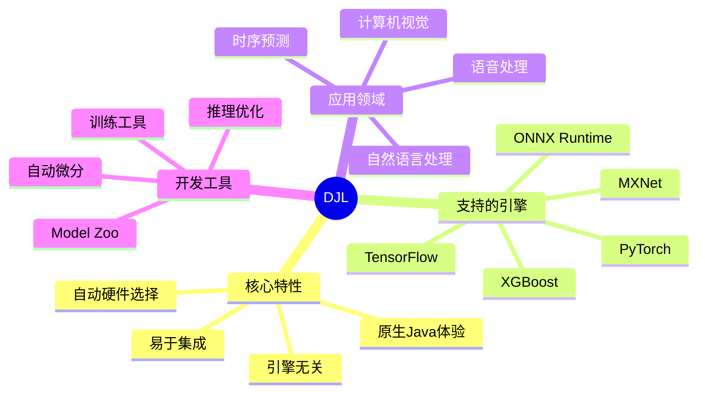

### 为什么选择 DJL？

DJL 为 Java 开发者带来了前所未有的深度学习开发体验：

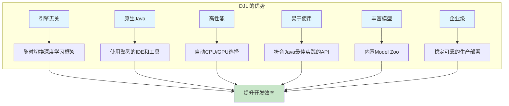

## 核心架构

### 整体架构设计

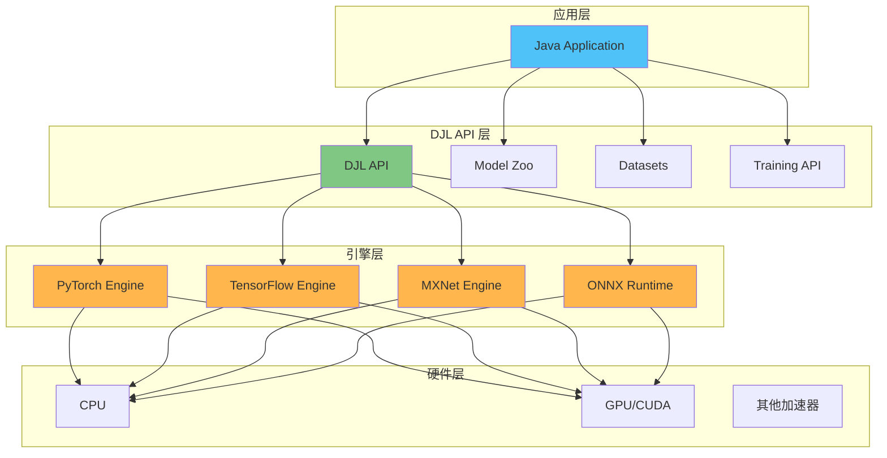

### 核心概念

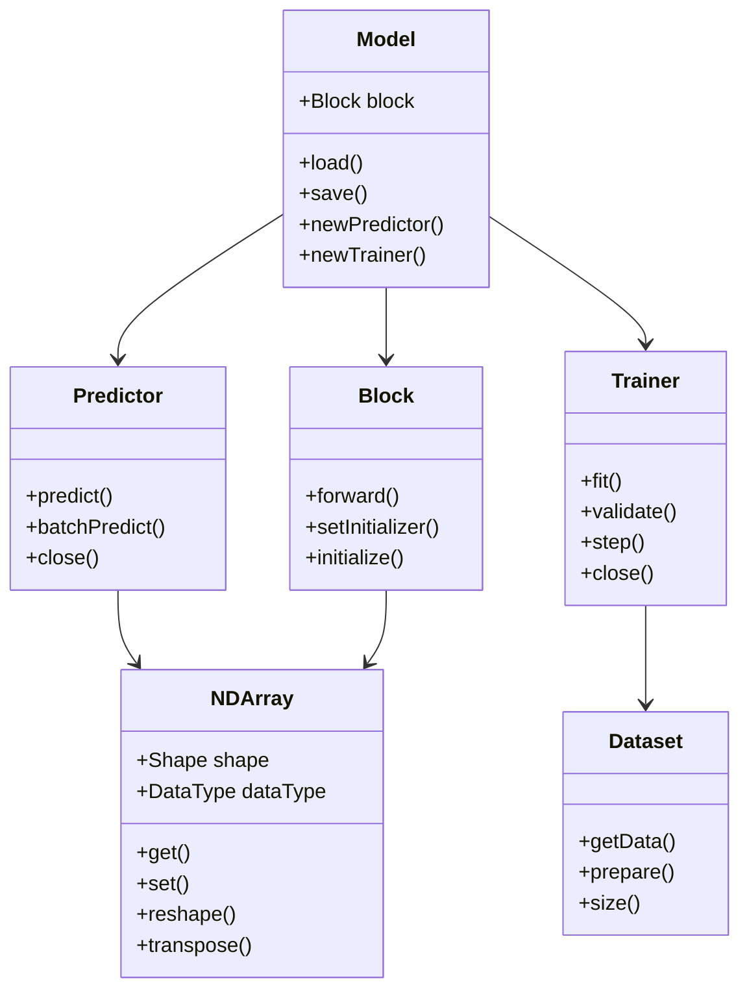

## 快速开始

### 环境要求

- **Java 版本**：JDK 8 或更高版本（推荐 JDK 11+）
- **构建工具**：Maven 或 Gradle
- **操作系统**：Windows、Linux、macOS

### Maven 依赖配置

```xml
<dependencies>
    <!-- DJL API -->
    <dependency>
        <groupId>ai.djl</groupId>
        <artifactId>api</artifactId>
        <version>0.36.0</version>
    </dependency>
    
    <!-- DJL Model Zoo -->
    <dependency>
        <groupId>ai.djl</groupId>
        <artifactId>model-zoo</artifactId>
        <version>0.36.0</version>
    </dependency>
    
    <!-- PyTorch 引擎 (选择一个引擎) -->
    <dependency>
        <groupId>ai.djl.pytorch</groupId>
        <artifactId>pytorch-engine</artifactId>
        <version>0.36.0</version>
        <scope>runtime</scope>
    </dependency>
    
    <!-- PyTorch 原生库 - 自动选择平台 -->
    <dependency>
        <groupId>ai.djl.pytorch</groupId>
        <artifactId>pytorch-native-auto</artifactId>
        <version>2.1.1</version>
        <scope>runtime</scope>
    </dependency>
    
    <!-- 日志 -->
    <dependency>
        <groupId>org.slf4j</groupId>
        <artifactId>slf4j-simple</artifactId>
        <version>1.7.36</version>
    </dependency>
</dependencies>
```

### Gradle 依赖配置

```groovy
dependencies {
    implementation "ai.djl:api:0.36.0"
    implementation "ai.djl:model-zoo:0.36.0"
    
    // 选择 PyTorch 引擎
    runtimeOnly "ai.djl.pytorch:pytorch-engine:0.36.0"
    runtimeOnly "ai.djl.pytorch:pytorch-native-auto:2.1.1"
    
    // 日志
    implementation "org.slf4j:slf4j-simple:1.7.36"
}
```

## 推理示例

### 图像分类推理

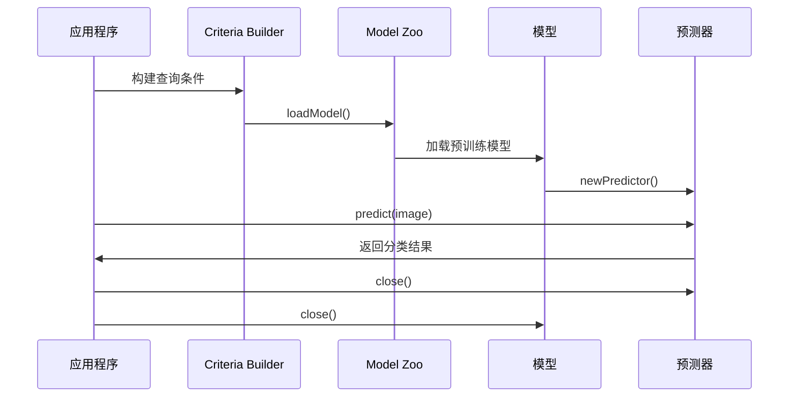

#### 完整代码示例

```java
import ai.djl.Application;
import ai.djl.ModelException;
import ai.djl.inference.Predictor;
import ai.djl.modality.Classifications;
import ai.djl.modality.cv.Image;
import ai.djl.modality.cv.ImageFactory;
import ai.djl.repository.zoo.Criteria;
import ai.djl.repository.zoo.ZooModel;
import ai.djl.translate.TranslateException;

import java.io.IOException;
import java.nio.file.Path;
import java.nio.file.Paths;

public class ImageClassificationExample {
    
    public static void main(String[] args) throws IOException, ModelException, TranslateException {
        // 1. 准备输入图像
        String imageUrl = "https://djl-ai.s3.amazonaws.com/resources/images/kitten.jpg";
        Image img = ImageFactory.getInstance().fromUrl(imageUrl);
        
        // 2. 定义模型查询条件
        Criteria<Image, Classifications> criteria = Criteria.builder()
                .optApplication(Application.CV.IMAGE_CLASSIFICATION)
                .setTypes(Image.class, Classifications.class)
                .optFilter("dataset", "imagenet")
                .optFilter("backbone", "resnet")
                .optProgress(new ProgressBar())
                .build();
        
        // 3. 加载模型并进行推理
        try (ZooModel<Image, Classifications> model = criteria.loadModel();
             Predictor<Image, Classifications> predictor = model.newPredictor()) {
            
            // 执行推理
            Classifications result = predictor.predict(img);
            
            // 输出结果
            System.out.println("分类结果：");
            result.topK(5).forEach(classification -> 
                System.out.printf("%s: %.2f%%\n", 
                    classification.getClassName(), 
                    classification.getProbability() * 100)
            );
        }
    }
}
```

### 目标检测推理

```java
import ai.djl.Application;
import ai.djl.ModelException;
import ai.djl.inference.Predictor;
import ai.djl.modality.cv.Image;
import ai.djl.modality.cv.ImageFactory;
import ai.djl.modality.cv.output.DetectedObjects;
import ai.djl.modality.cv.output.Rectangle;
import ai.djl.repository.zoo.Criteria;
import ai.djl.repository.zoo.ZooModel;
import ai.djl.translate.TranslateException;

import java.io.IOException;
import java.nio.file.Files;
import java.nio.file.Path;
import java.nio.file.Paths;

public class ObjectDetectionExample {
    
    public static void main(String[] args) throws IOException, ModelException, TranslateException {
        // 1. 加载图像
        String imageUrl = "https://djl-ai.s3.amazonaws.com/resources/images/dog_bike_car.jpg";
        Image img = ImageFactory.getInstance().fromUrl(imageUrl);
        
        // 2. 配置目标检测模型
        Criteria<Image, DetectedObjects> criteria = Criteria.builder()
                .optApplication(Application.CV.OBJECT_DETECTION)
                .setTypes(Image.class, DetectedObjects.class)
                .optFilter("backbone", "resnet50")
                .optFilter("dataset", "coco")
                .optProgress(new ProgressBar())
                .build();
        
        // 3. 执行检测
        try (ZooModel<Image, DetectedObjects> model = criteria.loadModel();
             Predictor<Image, DetectedObjects> predictor = model.newPredictor()) {
            
            DetectedObjects detection = predictor.predict(img);
            
            // 输出检测结果
            System.out.println("检测到的对象：");
            detection.items().forEach(item -> {
                System.out.printf("类别: %s, 置信度: %.2f%%, 位置: %s\n",
                    item.getClassName(),
                    item.getProbability() * 100,
                    item.getBoundingBox().getBounds()
                );
            });
            
            // 保存标注后的图像
            Path outputPath = Paths.get("output_detection.png");
            img.drawBoundingBoxes(detection);
            img.save(Files.newOutputStream(outputPath), "png");
            System.out.println("结果已保存到: " + outputPath);
        }
    }
}
```

### 自然语言处理推理

```java
import ai.djl.Application;
import ai.djl.ModelException;
import ai.djl.inference.Predictor;
import ai.djl.modality.Classifications;
import ai.djl.repository.zoo.Criteria;
import ai.djl.repository.zoo.ZooModel;
import ai.djl.translate.TranslateException;

import java.io.IOException;

public class SentimentAnalysisExample {
    
    public static void main(String[] args) throws IOException, ModelException, TranslateException {
        // 待分析的文本
        String text = "I really enjoyed this movie. It was fantastic!";
        
        // 配置情感分析模型
        Criteria<String, Classifications> criteria = Criteria.builder()
                .optApplication(Application.NLP.SENTIMENT_ANALYSIS)
                .setTypes(String.class, Classifications.class)
                .optProgress(new ProgressBar())
                .build();
        
        // 执行情感分析
        try (ZooModel<String, Classifications> model = criteria.loadModel();
             Predictor<String, Classifications> predictor = model.newPredictor()) {
            
            Classifications result = predictor.predict(text);
            
            System.out.println("情感分析结果：");
            System.out.printf("文本: %s\n", text);
            System.out.printf("情感: %s (%.2f%%)\n",
                result.best().getClassName(),
                result.best().getProbability() * 100
            );
        }
    }
}
```

## 训练示例

### 训练流程

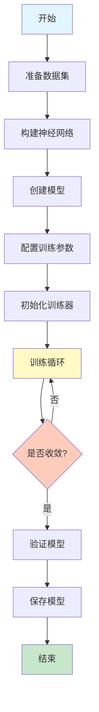

### 手写数字识别训练

```java
import ai.djl.Model;
import ai.djl.basicdataset.cv.classification.Mnist;
import ai.djl.ndarray.types.Shape;
import ai.djl.nn.Activation;
import ai.djl.nn.Blocks;
import ai.djl.nn.SequentialBlock;
import ai.djl.nn.core.Linear;
import ai.djl.training.DefaultTrainingConfig;
import ai.djl.training.EasyTrain;
import ai.djl.training.Trainer;
import ai.djl.training.dataset.Dataset;
import ai.djl.training.evaluator.Accuracy;
import ai.djl.training.listener.TrainingListener;
import ai.djl.training.loss.Loss;
import ai.djl.training.optimizer.Optimizer;
import ai.djl.training.tracker.Tracker;

import java.io.IOException;
import java.nio.file.Paths;

public class MnistTrainingExample {
    
    public static void main(String[] args) throws IOException {
        // 1. 准备数据集
        int batchSize = 32;
        Mnist trainDataset = Mnist.builder()
                .optUsage(Dataset.Usage.TRAIN)
                .setSampling(batchSize, true)
                .build();
        
        Mnist validateDataset = Mnist.builder()
                .optUsage(Dataset.Usage.TEST)
                .setSampling(batchSize, false)
                .build();
        
        trainDataset.prepare();
        validateDataset.prepare();
        
        // 2. 构建神经网络（多层感知机）
        SequentialBlock block = new SequentialBlock();
        block.add(Blocks.batchFlattenBlock(28 * 28));
        block.add(Linear.builder().setUnits(128).build());
        block.add(Activation::relu);
        block.add(Linear.builder().setUnits(64).build());
        block.add(Activation::relu);
        block.add(Linear.builder().setUnits(10).build());
        
        // 3. 创建模型
        try (Model model = Model.newInstance("mnist-mlp")) {
            model.setBlock(block);
            
            // 4. 配置训练参数
            DefaultTrainingConfig config = new DefaultTrainingConfig(Loss.softmaxCrossEntropyLoss())
                    .addEvaluator(new Accuracy())
                    .optOptimizer(
                        Optimizer.adam()
                            .optLearningRateTracker(Tracker.fixed(0.001f))
                            .build()
                    )
                    .addTrainingListeners(TrainingListener.Defaults.logging());
            
            // 5. 创建训练器并初始化
            try (Trainer trainer = model.newTrainer(config)) {
                trainer.initialize(new Shape(1, 28 * 28));
                
                // 6. 训练模型
                int numEpochs = 10;
                EasyTrain.fit(trainer, numEpochs, trainDataset, validateDataset);
                
                // 7. 保存模型
                model.save(Paths.get("models"), "mnist-mlp");
                System.out.println("模型已保存");
            }
        }
    }
}
```

### 自定义训练循环

```java
import ai.djl.Model;
import ai.djl.metric.Metrics;
import ai.djl.ndarray.NDArray;
import ai.djl.ndarray.NDList;
import ai.djl.training.Trainer;
import ai.djl.training.dataset.Batch;
import ai.djl.training.dataset.Dataset;
import ai.djl.training.loss.Loss;

public class CustomTrainingLoop {
    
    public static void train(Trainer trainer, int numEpochs, Dataset trainDataset, Dataset validateDataset) {
        Loss loss = trainer.getLoss();
        
        for (int epoch = 0; epoch < numEpochs; epoch++) {
            System.out.printf("Epoch %d/%d\n", epoch + 1, numEpochs);
            
            // 训练阶段
            for (Batch batch : trainer.iterateDataset(trainDataset)) {
                // 前向传播
                NDList data = batch.getData();
                NDList labels = batch.getLabels();
                
                try (GradientCollector gc = trainer.newGradientCollector()) {
                    NDList predictions = trainer.forward(data);
                    NDArray lossValue = loss.evaluate(labels, predictions);
                    
                    // 反向传播
                    gc.backward(lossValue);
                    
                    // 更新参数
                    trainer.step();
                }
                
                batch.close();
            }
            
            // 验证阶段
            float validationAccuracy = 0;
            int totalSamples = 0;
            
            for (Batch batch : trainer.iterateDataset(validateDataset)) {
                NDList data = batch.getData();
                NDList labels = batch.getLabels();
                
                NDList predictions = trainer.evaluate(data);
                
                // 计算准确率
                validationAccuracy += accuracy(predictions, labels) * batch.getSize();
                totalSamples += batch.getSize();
                
                batch.close();
            }
            
            System.out.printf("Validation Accuracy: %.2f%%\n", 
                validationAccuracy / totalSamples * 100);
        }
    }
    
    private static float accuracy(NDList predictions, NDList labels) {
        NDArray pred = predictions.singletonOrThrow();
        NDArray label = labels.singletonOrThrow();
        
        return pred.argMax(1).eq(label).sum().getFloat() / label.size();
    }
}
```

## NDArray 操作

### NDArray 基础

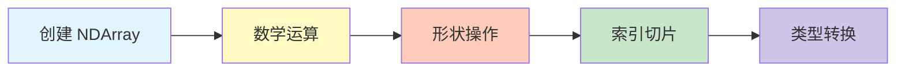

```java
import ai.djl.ndarray.NDArray;
import ai.djl.ndarray.NDManager;
import ai.djl.ndarray.types.DataType;
import ai.djl.ndarray.types.Shape;

public class NDArrayExample {
    
    public static void main(String[] args) {
        try (NDManager manager = NDManager.newBaseManager()) {
            // 创建 NDArray
            NDArray zeros = manager.zeros(new Shape(2, 3));
            NDArray ones = manager.ones(new Shape(3, 4));
            NDArray random = manager.randomUniform(0, 1, new Shape(2, 3));
            NDArray fromArray = manager.create(new float[]{1, 2, 3, 4, 5, 6});
            
            System.out.println("Zeros:\n" + zeros.toDebugString());
            System.out.println("Random:\n" + random.toDebugString());
            
            // 数学运算
            NDArray a = manager.create(new float[]{1, 2, 3, 4}).reshape(2, 2);
            NDArray b = manager.create(new float[]{5, 6, 7, 8}).reshape(2, 2);
            
            NDArray sum = a.add(b);
            NDArray product = a.mul(b);
            NDArray matmul = a.matMul(b);
            
            System.out.println("矩阵加法:\n" + sum.toDebugString());
            System.out.println("矩阵乘法:\n" + matmul.toDebugString());
            
            // 形状操作
            NDArray reshaped = fromArray.reshape(2, 3);
            NDArray transposed = reshaped.transpose();
            NDArray flattened = reshaped.flatten();
            
            System.out.println("原始形状: " + fromArray.getShape());
            System.out.println("重塑后: " + reshaped.getShape());
            System.out.println("转置后: " + transposed.getShape());
            
            // 索引和切片
            NDArray data = manager.arange(12f).reshape(3, 4);
            NDArray row = data.get(0);              // 第一行
            NDArray col = data.get(":, 0");         // 第一列
            NDArray slice = data.get("1:3, 1:3");   // 子矩阵
            
            System.out.println("第一行:\n" + row.toDebugString());
            System.out.println("切片:\n" + slice.toDebugString());
            
            // 聚合操作
            NDArray tensor = manager.randomUniform(0, 1, new Shape(3, 4));
            float sum_all = tensor.sum().getFloat();
            NDArray sum_axis0 = tensor.sum(new int[]{0});
            float mean = tensor.mean().getFloat();
            float max = tensor.max().getFloat();
            
            System.out.println("总和: " + sum_all);
            System.out.println("均值: " + mean);
            System.out.println("最大值: " + max);
        }
    }
}
```

## 自定义神经网络

### 构建卷积神经网络

```mermaid
graph LR
    A[输入图像<br/>28x28] --> B[卷积层1<br/>32@24x24]
    B --> C[池化层1<br/>32@12x12]
    C --> D[卷积层2<br/>64@8x8]
    D --> E[池化层2<br/>64@4x4]
    E --> F[展平<br/>1024]
    F --> G[全连接层<br/>128]
    G --> H[输出层<br/>10]
    
    style A fill:#e1f5ff
    style H fill:#c8e6c9
```

```java
import ai.djl.ndarray.types.Shape;
import ai.djl.nn.Activation;
import ai.djl.nn.Block;
import ai.djl.nn.SequentialBlock;
import ai.djl.nn.convolutional.Conv2d;
import ai.djl.nn.core.Linear;
import ai.djl.nn.norm.Dropout;
import ai.djl.nn.pooling.Pool;

public class CNNBuilder {
    
    public static Block buildCNN() {
        return new SequentialBlock()
            // 第一个卷积块
            .add(Conv2d.builder()
                .setKernelShape(new Shape(5, 5))
                .optPadding(new Shape(2, 2))
                .setFilters(32)
                .build())
            .add(Activation::relu)
            .add(Pool.maxPool2dBlock(new Shape(2, 2), new Shape(2, 2)))
            
            // 第二个卷积块
            .add(Conv2d.builder()
                .setKernelShape(new Shape(5, 5))
                .optPadding(new Shape(2, 2))
                .setFilters(64)
                .build())
            .add(Activation::relu)
            .add(Pool.maxPool2dBlock(new Shape(2, 2), new Shape(2, 2)))
            
            // 全连接层
            .add(Blocks.batchFlattenBlock())
            .add(Linear.builder().setUnits(1024).build())
            .add(Activation::relu)
            .add(Dropout.builder().optRate(0.5f).build())
            .add(Linear.builder().setUnits(10).build());
    }
}
```

### 自定义 Block

```java
import ai.djl.ndarray.NDArray;
import ai.djl.ndarray.NDList;
import ai.djl.ndarray.types.Shape;
import ai.djl.nn.AbstractBlock;
import ai.djl.nn.Parameter;
import ai.djl.training.ParameterStore;
import ai.djl.util.PairList;

public class CustomLinearBlock extends AbstractBlock {
    
    private Parameter weight;
    private Parameter bias;
    private int units;
    
    public CustomLinearBlock(int units) {
        super(VERSION);
        this.units = units;
        
        // 定义参数
        weight = addParameter(
            Parameter.builder()
                .setName("weight")
                .setType(Parameter.Type.WEIGHT)
                .build()
        );
        
        bias = addParameter(
            Parameter.builder()
                .setName("bias")
                .setType(Parameter.Type.BIAS)
                .build()
        );
    }
    
    @Override
    protected NDList forwardInternal(
            ParameterStore parameterStore,
            NDList inputs,
            boolean training,
            PairList<String, Object> params) {
        
        NDArray input = inputs.singletonOrThrow();
        NDArray w = parameterStore.getValue(weight, input.getDevice(), training);
        NDArray b = parameterStore.getValue(bias, input.getDevice(), training);
        
        // 前向传播: y = xW + b
        NDArray output = input.matMul(w).add(b);
        
        return new NDList(output);
    }
    
    @Override
    public Shape[] getOutputShapes(Shape[] inputShapes) {
        return new Shape[]{new Shape(inputShapes[0].get(0), units)};
    }
    
    @Override
    protected void initializeChildBlocks(
            NDManager manager, DataType dataType, Shape... inputShapes) {
        
        long inputSize = inputShapes[0].tail(1).get(0);
        
        // 初始化权重
        weight.initialize(manager, dataType, new Shape(inputSize, units));
        
        // 初始化偏置
        bias.initialize(manager, dataType, new Shape(units));
    }
}
```

## Model Zoo 使用

### 预训练模型加载

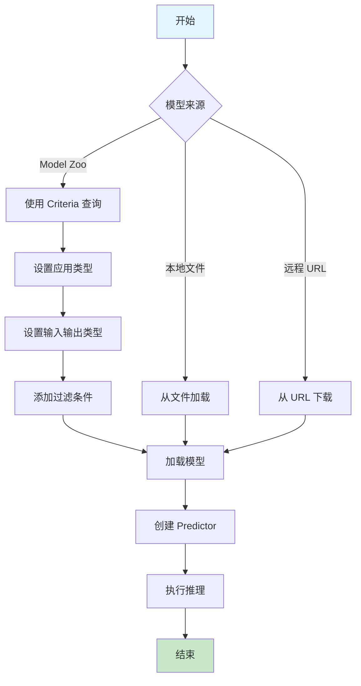

```java
import ai.djl.Application;
import ai.djl.MalformedModelException;
import ai.djl.Model;
import ai.djl.ModelException;
import ai.djl.inference.Predictor;
import ai.djl.modality.cv.Image;
import ai.djl.modality.cv.ImageFactory;
import ai.djl.modality.cv.output.DetectedObjects;
import ai.djl.repository.zoo.Criteria;
import ai.djl.repository.zoo.ModelNotFoundException;
import ai.djl.repository.zoo.ModelZoo;
import ai.djl.repository.zoo.ZooModel;
import ai.djl.translate.TranslateException;

import java.io.IOException;
import java.nio.file.Path;
import java.nio.file.Paths;

public class ModelZooExample {
    
    // 方法1: 使用 Criteria 从 Model Zoo 加载
    public static void loadFromModelZoo() 
            throws ModelException, IOException, TranslateException {
        
        Criteria<Image, DetectedObjects> criteria = Criteria.builder()
                .optApplication(Application.CV.OBJECT_DETECTION)
                .setTypes(Image.class, DetectedObjects.class)
                .optFilter("backbone", "resnet50")
                .optFilter("flavor", "v1")
                .optFilter("dataset", "coco")
                .optEngine("PyTorch")
                .optProgress(new ProgressBar())
                .build();
        
        try (ZooModel<Image, DetectedObjects> model = criteria.loadModel()) {
            System.out.println("模型加载成功: " + model.getName());
        }
    }
    
    // 方法2: 从本地文件加载
    public static void loadFromLocalFile() 
            throws MalformedModelException, IOException {
        
        Path modelPath = Paths.get("models/my-model");
        
        try (Model model = Model.newInstance("my-model")) {
            model.load(modelPath);
            System.out.println("本地模型加载成功");
        }
    }
    
    // 方法3: 从 URL 加载
    public static void loadFromURL() 
            throws MalformedModelException, IOException {
        
        String modelUrl = "https://resources.djl.ai/models/pytorch/resnet18.zip";
        
        Criteria<Image, DetectedObjects> criteria = Criteria.builder()
                .setTypes(Image.class, DetectedObjects.class)
                .optModelUrls(modelUrl)
                .build();
        
        try (ZooModel<Image, DetectedObjects> model = criteria.loadModel()) {
            System.out.println("远程模型加载成功");
        } catch (ModelNotFoundException | MalformedModelException e) {
            e.printStackTrace();
        }
    }
    
    // 列出所有可用模型
    public static void listAvailableModels() {
        System.out.println("可用的预训练模型:");
        
        ModelZoo.listModels().forEach(artifacts -> {
            System.out.println("\n应用: " + artifacts.getApplication());
            artifacts.forEach(artifact -> {
                System.out.printf("  - %s (%s)\n", 
                    artifact.getName(), 
                    artifact.getProperties().get("backbone")
                );
            });
        });
    }
}
```

## 数据处理

### 自定义数据集

```java
import ai.djl.ndarray.NDArray;
import ai.djl.ndarray.NDList;
import ai.djl.ndarray.NDManager;
import ai.djl.training.dataset.RandomAccessDataset;
import ai.djl.training.dataset.Record;
import ai.djl.util.Progress;

import java.io.IOException;
import java.util.ArrayList;
import java.util.List;

public class CustomDataset extends RandomAccessDataset {
    
    private List<String> imagePaths;
    private List<Integer> labels;
    private int imageSize;
    
    public CustomDataset(Builder builder) {
        super(builder);
        this.imagePaths = builder.imagePaths;
        this.labels = builder.labels;
        this.imageSize = builder.imageSize;
    }
    
    @Override
    public Record get(NDManager manager, long index) throws IOException {
        // 加载图像
        String imagePath = imagePaths.get((int) index);
        Image img = ImageFactory.getInstance().fromFile(Paths.get(imagePath));
        
        // 图像预处理
        NDArray imageArray = img.toNDArray(manager);
        imageArray = imageArray.div(255.0f); // 归一化
        imageArray = imageArray.transpose(2, 0, 1); // HWC -> CHW
        
        // 加载标签
        int label = labels.get((int) index);
        NDArray labelArray = manager.create(label);
        
        return new Record(new NDList(imageArray), new NDList(labelArray));
    }
    
    @Override
    protected long availableSize() {
        return imagePaths.size();
    }
    
    public static Builder builder() {
        return new Builder();
    }
    
    public static final class Builder extends BaseBuilder<Builder> {
        private List<String> imagePaths = new ArrayList<>();
        private List<Integer> labels = new ArrayList<>();
        private int imageSize = 224;
        
        public Builder setImagePaths(List<String> imagePaths) {
            this.imagePaths = imagePaths;
            return this;
        }
        
        public Builder setLabels(List<Integer> labels) {
            this.labels = labels;
            return this;
        }
        
        public Builder setImageSize(int imageSize) {
            this.imageSize = imageSize;
            return this;
        }
        
        @Override
        public CustomDataset build() {
            return new CustomDataset(this);
        }
        
        @Override
        protected Builder self() {
            return this;
        }
    }
}
```

### 数据增强

```java
import ai.djl.modality.cv.transform.*;
import ai.djl.translate.Pipeline;

public class DataAugmentation {
    
    public static Pipeline getTrainingPipeline() {
        return new Pipeline()
            .add(new Resize(256))
            .add(new RandomResizedCrop(224, 224, 0.8, 1.0))
            .add(new RandomFlipLeftRight())
            .add(new RandomBrightness(0.2f))
            .add(new RandomHue(0.1f))
            .add(new ToTensor())
            .add(new Normalize(
                new float[]{0.485f, 0.456f, 0.406f},
                new float[]{0.229f, 0.224f, 0.225f}
            ));
    }
    
    public static Pipeline getValidationPipeline() {
        return new Pipeline()
            .add(new Resize(256))
            .add(new CenterCrop(224, 224))
            .add(new ToTensor())
            .add(new Normalize(
                new float[]{0.485f, 0.456f, 0.406f},
                new float[]{0.229f, 0.224f, 0.225f}
            ));
    }
}
```

## 迁移学习

### 迁移学习流程

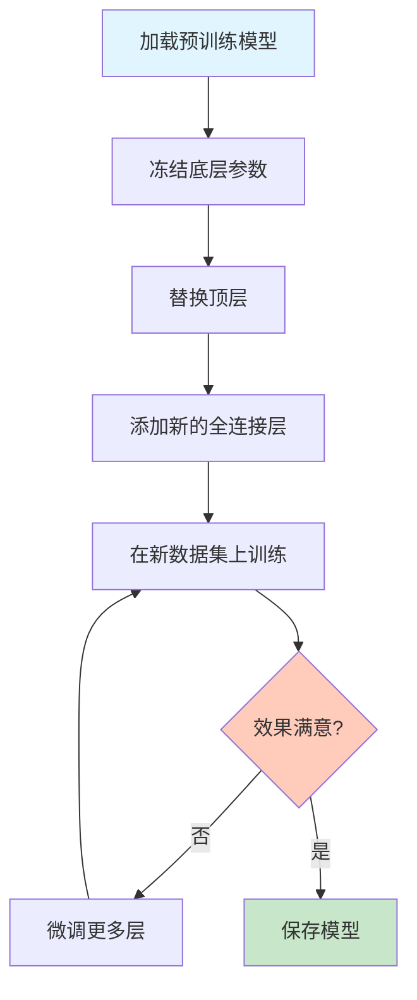

```java
import ai.djl.Model;
import ai.djl.ModelException;
import ai.djl.basicdataset.cv.classification.ImageFolder;
import ai.djl.modality.cv.transform.*;
import ai.djl.ndarray.types.Shape;
import ai.djl.nn.Block;
import ai.djl.nn.SequentialBlock;
import ai.djl.nn.core.Linear;
import ai.djl.repository.zoo.Criteria;
import ai.djl.repository.zoo.ZooModel;
import ai.djl.training.DefaultTrainingConfig;
import ai.djl.training.Trainer;
import ai.djl.training.dataset.Dataset;
import ai.djl.training.evaluator.Accuracy;
import ai.djl.training.listener.TrainingListener;
import ai.djl.training.loss.Loss;
import ai.djl.training.optimizer.Optimizer;
import ai.djl.training.tracker.Tracker;
import ai.djl.translate.Pipeline;

import java.io.IOException;
import java.nio.file.Paths;

public class TransferLearningExample {
    
    public static void main(String[] args) throws IOException, ModelException {
        int numClasses = 5; // 新任务的类别数
        int batchSize = 32;
        int numEpochs = 10;
        
        // 1. 加载预训练模型
        Criteria<Image, Classifications> criteria = Criteria.builder()
                .optApplication(Application.CV.IMAGE_CLASSIFICATION)
                .setTypes(Image.class, Classifications.class)
                .optFilter("backbone", "resnet50")
                .optFilter("dataset", "imagenet")
                .build();
        
        try (ZooModel<Image, Classifications> pretrained = criteria.loadModel()) {
            
            // 2. 获取预训练模型的特征提取部分
            Block featureExtractor = pretrained.getBlock();
            
            // 3. 构建新的模型（添加自定义分类层）
            SequentialBlock newBlock = new SequentialBlock();
            
            // 添加预训练的特征提取器
            for (Pair<String, Block> namedBlock : featureExtractor.getChildren()) {
                String name = namedBlock.getKey();
                Block block = namedBlock.getValue();
                
                // 移除原始的分类层
                if (!name.equals("fc")) {
                    newBlock.add(block);
                    
                    // 冻结预训练层的参数
                    block.freezeParameters(true);
                }
            }
            
            // 添加新的分类层
            newBlock.add(Blocks.batchFlattenBlock());
            newBlock.add(Linear.builder().setUnits(512).build());
            newBlock.add(Activation::relu);
            newBlock.add(Dropout.builder().optRate(0.5f).build());
            newBlock.add(Linear.builder().setUnits(numClasses).build());
            
            // 4. 创建新模型
            try (Model model = Model.newInstance("transfer-learning")) {
                model.setBlock(newBlock);
                
                // 5. 准备自定义数据集
                Pipeline pipeline = new Pipeline()
                    .add(new Resize(256))
                    .add(new CenterCrop(224, 224))
                    .add(new ToTensor())
                    .add(new Normalize(
                        new float[]{0.485f, 0.456f, 0.406f},
                        new float[]{0.229f, 0.224f, 0.225f}
                    ));
                
                ImageFolder dataset = ImageFolder.builder()
                    .setRepository(new SimpleRepository(Paths.get("data/train")))
                    .optPipeline(pipeline)
                    .setSampling(batchSize, true)
                    .build();
                
                dataset.prepare();
                
                // 6. 配置训练
                DefaultTrainingConfig config = new DefaultTrainingConfig(
                        Loss.softmaxCrossEntropyLoss())
                    .addEvaluator(new Accuracy())
                    .optOptimizer(
                        Optimizer.adam()
                            .optLearningRateTracker(Tracker.fixed(0.001f))
                            .build()
                    )
                    .addTrainingListeners(TrainingListener.Defaults.logging());
                
                // 7. 训练模型
                try (Trainer trainer = model.newTrainer(config)) {
                    trainer.initialize(new Shape(1, 3, 224, 224));
                    EasyTrain.fit(trainer, numEpochs, dataset, null);
                    
                    // 8. 保存微调后的模型
                    model.save(Paths.get("models"), "finetuned-model");
                    System.out.println("迁移学习完成，模型已保存");
                }
            }
        }
    }
}
```

## 多引擎支持

### 引擎选择

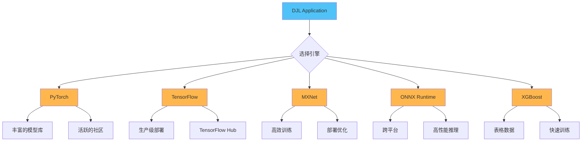

### 引擎配置示例

```java
// PyTorch 引擎
Criteria<Image, Classifications> pytorchCriteria = Criteria.builder()
    .setTypes(Image.class, Classifications.class)
    .optApplication(Application.CV.IMAGE_CLASSIFICATION)
    .optEngine("PyTorch")
    .optProgress(new ProgressBar())
    .build();

// TensorFlow 引擎
Criteria<Image, Classifications> tfCriteria = Criteria.builder()
    .setTypes(Image.class, Classifications.class)
    .optApplication(Application.CV.IMAGE_CLASSIFICATION)
    .optEngine("TensorFlow")
    .optProgress(new ProgressBar())
    .build();

// ONNX Runtime 引擎
Criteria<Image, Classifications> onnxCriteria = Criteria.builder()
    .setTypes(Image.class, Classifications.class)
    .optApplication(Application.CV.IMAGE_CLASSIFICATION)
    .optEngine("OnnxRuntime")
    .optProgress(new ProgressBar())
    .build();

// MXNet 引擎
Criteria<Image, Classifications> mxnetCriteria = Criteria.builder()
    .setTypes(Image.class, Classifications.class)
    .optApplication(Application.CV.IMAGE_CLASSIFICATION)
    .optEngine("MXNet")
    .optProgress(new ProgressBar())
    .build();
```

### 引擎依赖配置

```xml
<!-- PyTorch -->
<dependency>
    <groupId>ai.djl.pytorch</groupId>
    <artifactId>pytorch-engine</artifactId>
    <version>0.36.0</version>
    <scope>runtime</scope>
</dependency>
<dependency>
    <groupId>ai.djl.pytorch</groupId>
    <artifactId>pytorch-native-auto</artifactId>
    <version>2.1.1</version>
    <scope>runtime</scope>
</dependency>

<!-- TensorFlow -->
<dependency>
    <groupId>ai.djl.tensorflow</groupId>
    <artifactId>tensorflow-engine</artifactId>
    <version>0.36.0</version>
    <scope>runtime</scope>
</dependency>
<dependency>
    <groupId>ai.djl.tensorflow</groupId>
    <artifactId>tensorflow-native-auto</artifactId>
    <version>2.10.1</version>
    <scope>runtime</scope>
</dependency>

<!-- ONNX Runtime -->
<dependency>
    <groupId>ai.djl.onnxruntime</groupId>
    <artifactId>onnxruntime-engine</artifactId>
    <version>0.36.0</version>
    <scope>runtime</scope>
</dependency>
```

## 性能优化

### 优化策略

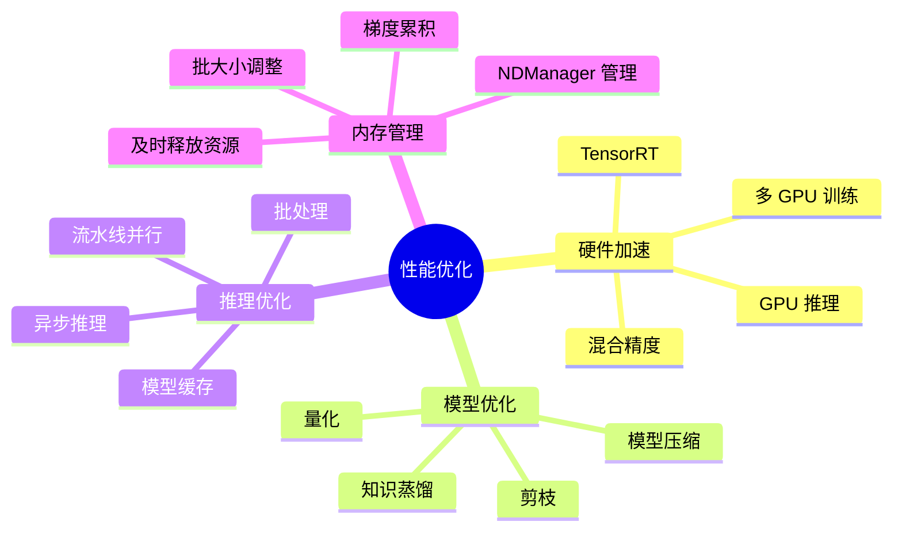

### GPU 推理

```java
import ai.djl.Device;
import ai.djl.engine.Engine;
import ai.djl.inference.Predictor;
import ai.djl.ndarray.NDManager;
import ai.djl.repository.zoo.Criteria;
import ai.djl.repository.zoo.ZooModel;

public class GPUInferenceExample {
    
    public static void main(String[] args) throws Exception {
        // 检查 GPU 可用性
        if (Engine.getInstance().getGpuCount() > 0) {
            System.out.println("GPU 可用，数量: " + Engine.getInstance().getGpuCount());
        } else {
            System.out.println("GPU 不可用，使用 CPU");
        }
        
        // 指定使用 GPU
        Device device = Device.gpu();
        
        Criteria<Image, Classifications> criteria = Criteria.builder()
                .setTypes(Image.class, Classifications.class)
                .optApplication(Application.CV.IMAGE_CLASSIFICATION)
                .optDevice(device) // 指定设备
                .build();
        
        try (ZooModel<Image, Classifications> model = criteria.loadModel();
             Predictor<Image, Classifications> predictor = model.newPredictor()) {
            
            // 使用 GPU 进行推理
            Image img = ImageFactory.getInstance().fromUrl("...");
            Classifications result = predictor.predict(img);
            
            System.out.println("推理结果: " + result);
        }
    }
}
```

### 批量推理

```java
import ai.djl.inference.Predictor;
import ai.djl.modality.Classifications;
import ai.djl.modality.cv.Image;
import ai.djl.ndarray.NDList;

import java.util.ArrayList;
import java.util.List;

public class BatchInferenceExample {
    
    public static void batchPredict(
            Predictor<Image, Classifications> predictor,
            List<Image> images) throws TranslateException {
        
        int batchSize = 32;
        List<Classifications> allResults = new ArrayList<>();
        
        // 分批处理
        for (int i = 0; i < images.size(); i += batchSize) {
            int endIdx = Math.min(i + batchSize, images.size());
            List<Image> batch = images.subList(i, endIdx);
            
            // 批量推理
            List<Classifications> batchResults = predictor.batchPredict(batch);
            allResults.addAll(batchResults);
            
            System.out.printf("已处理 %d/%d 张图像\n", endIdx, images.size());
        }
        
        // 处理结果
        for (int i = 0; i < allResults.size(); i++) {
            System.out.printf("图像 %d: %s\n", i, allResults.get(i).best());
        }
    }
}
```

### 混合精度训练

```java
import ai.djl.ndarray.types.DataType;
import ai.djl.training.DefaultTrainingConfig;
import ai.djl.training.GradientCollector;
import ai.djl.training.Trainer;
import ai.djl.training.loss.Loss;

public class MixedPrecisionTraining {
    
    public static DefaultTrainingConfig getMixedPrecisionConfig() {
        return new DefaultTrainingConfig(Loss.softmaxCrossEntropyLoss())
                .optDevices(new Device[]{Device.gpu()})
                .addEvaluator(new Accuracy())
                // 启用混合精度训练
                .optInitializer(new XavierInitializer(), "")
                .addTrainingListeners(TrainingListener.Defaults.logging());
    }
    
    public static void trainWithMixedPrecision(Trainer trainer, Dataset dataset) {
        for (Batch batch : trainer.iterateDataset(dataset)) {
            NDList data = batch.getData();
            NDList labels = batch.getLabels();
            
            // 自动混合精度训练
            try (GradientCollector gc = trainer.newGradientCollector()) {
                // 前向传播（自动使用 FP16）
                NDList predictions = trainer.forward(data);
                
                // 计算损失（使用 FP32）
                NDArray loss = trainer.getLoss().evaluate(labels, predictions);
                
                // 反向传播（梯度缩放）
                gc.backward(loss);
            }
            
            trainer.step();
            batch.close();
        }
    }
}
```

## 生产部署

### 部署架构

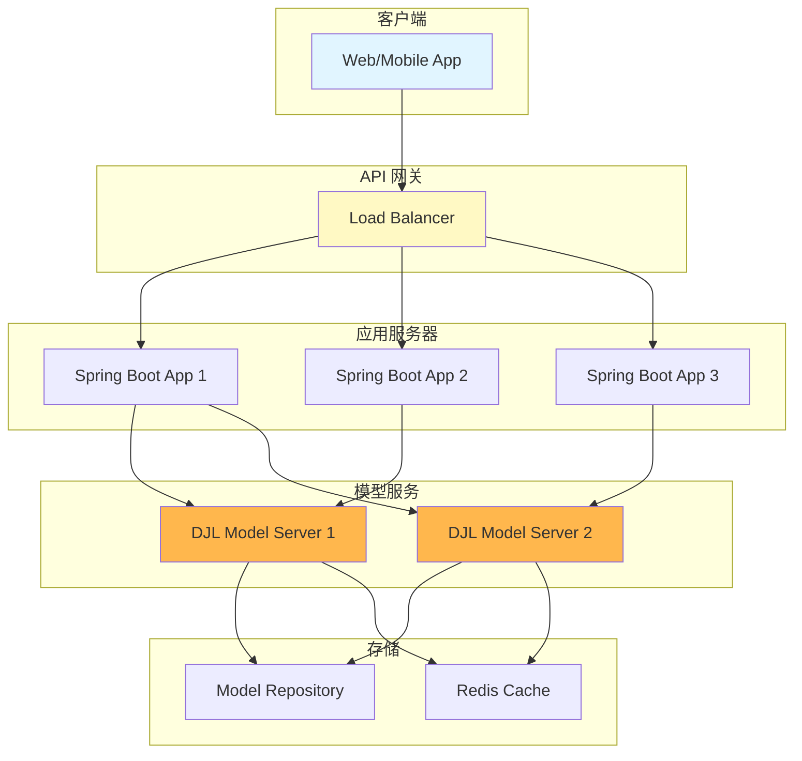

### Spring Boot 集成

```java
import ai.djl.ModelException;
import ai.djl.inference.Predictor;
import ai.djl.modality.Classifications;
import ai.djl.modality.cv.Image;
import ai.djl.repository.zoo.Criteria;
import ai.djl.repository.zoo.ZooModel;
import ai.djl.translate.TranslateException;
import org.springframework.stereotype.Service;
import org.springframework.web.multipart.MultipartFile;

import javax.annotation.PostConstruct;
import javax.annotation.PreDestroy;
import java.io.IOException;

@Service
public class ImageClassificationService {
    
    private ZooModel<Image, Classifications> model;
    private Predictor<Image, Classifications> predictor;
    
    @PostConstruct
    public void initialize() throws ModelException, IOException {
        // 应用启动时加载模型
        Criteria<Image, Classifications> criteria = Criteria.builder()
                .optApplication(Application.CV.IMAGE_CLASSIFICATION)
                .setTypes(Image.class, Classifications.class)
                .optFilter("backbone", "resnet50")
                .optProgress(new ProgressBar())
                .build();
        
        model = criteria.loadModel();
        predictor = model.newPredictor();
        
        System.out.println("模型加载完成");
    }
    
    public Classifications classify(MultipartFile file) 
            throws IOException, TranslateException {
        
        // 加载图像
        Image img = ImageFactory.getInstance()
                .fromInputStream(file.getInputStream());
        
        // 执行推理
        return predictor.predict(img);
    }
    
    @PreDestroy
    public void cleanup() {
        // 应用关闭时释放资源
        if (predictor != null) {
            predictor.close();
        }
        if (model != null) {
            model.close();
        }
        System.out.println("资源已释放");
    }
}
```

### REST API 控制器

```java
import org.springframework.beans.factory.annotation.Autowired;
import org.springframework.http.ResponseEntity;
import org.springframework.web.bind.annotation.*;
import org.springframework.web.multipart.MultipartFile;

import java.util.HashMap;
import java.util.Map;

@RestController
@RequestMapping("/api/v1")
public class ImageClassificationController {
    
    @Autowired
    private ImageClassificationService classificationService;
    
    @PostMapping("/classify")
    public ResponseEntity<Map<String, Object>> classifyImage(
            @RequestParam("image") MultipartFile file) {
        
        try {
            Classifications result = classificationService.classify(file);
            
            Map<String, Object> response = new HashMap<>();
            response.put("success", true);
            response.put("predictions", result.topK(5));
            
            return ResponseEntity.ok(response);
            
        } catch (Exception e) {
            Map<String, Object> error = new HashMap<>();
            error.put("success", false);
            error.put("error", e.getMessage());
            
            return ResponseEntity.internalServerError().body(error);
        }
    }
    
    @GetMapping("/health")
    public ResponseEntity<String> healthCheck() {
        return ResponseEntity.ok("Service is healthy");
    }
}
```

### Docker 部署

```dockerfile
# Dockerfile
FROM openjdk:11-jre-slim

WORKDIR /app

# 复制应用 JAR
COPY target/djl-app.jar app.jar

# 复制模型文件（可选）
COPY models/ /app/models/

# 设置环境变量
ENV JAVA_OPTS="-Xmx4g -Xms2g"
ENV DJL_DEFAULT_ENGINE="PyTorch"

# 暴露端口
EXPOSE 8080

# 启动应用
ENTRYPOINT ["sh", "-c", "java $JAVA_OPTS -jar app.jar"]
```

```yaml
# docker-compose.yml
version: '3.8'

services:
  djl-app:
    build: .
    ports:
      - "8080:8080"
    environment:
      - SPRING_PROFILES_ACTIVE=production
      - DJL_DEFAULT_ENGINE=PyTorch
    volumes:
      - ./models:/app/models
      - ./logs:/app/logs
    deploy:
      resources:
        limits:
          cpus: '4'
          memory: 8G
        reservations:
          devices:
            - driver: nvidia
              count: 1
              capabilities: [gpu]
```

## 最佳实践

### 资源管理

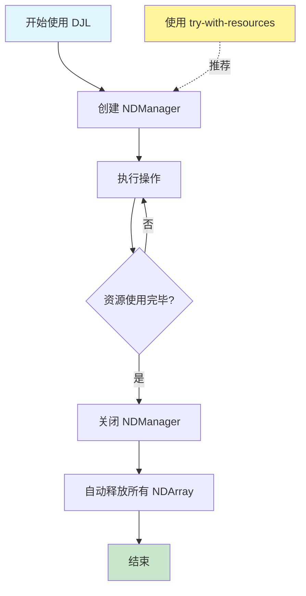

```java
// ✅ 推荐：使用 try-with-resources
public void goodPractice() {
    try (NDManager manager = NDManager.newBaseManager()) {
        NDArray array1 = manager.create(new float[]{1, 2, 3});
        NDArray array2 = manager.ones(new Shape(3, 3));
        
        NDArray result = array1.add(array2);
        
        // NDManager 会自动关闭并释放所有资源
    }
}

// ❌ 不推荐：手动管理资源
public void badPractice() {
    NDManager manager = NDManager.newBaseManager();
    NDArray array1 = manager.create(new float[]{1, 2, 3});
    NDArray array2 = manager.ones(new Shape(3, 3));
    
    NDArray result = array1.add(array2);
    
    // 容易忘记释放资源，导致内存泄漏
    manager.close();
}

// ✅ 子 Manager 用于局部作用域
public void subManagerExample() {
    try (NDManager parentManager = NDManager.newBaseManager()) {
        NDArray data = parentManager.create(new float[]{1, 2, 3});
        
        try (NDManager subManager = parentManager.newSubManager()) {
            NDArray temp = subManager.ones(new Shape(3));
            // temp 会在 subManager 关闭时释放
        }
        
        // data 仍然可用
        System.out.println(data);
    }
}
```

### 模型版本管理

```java
import ai.djl.Application;
import ai.djl.repository.zoo.Criteria;

public class ModelVersioning {
    
    // 使用特定版本的模型
    public static Criteria<Image, Classifications> getModelCriteria(String version) {
        return Criteria.builder()
                .optApplication(Application.CV.IMAGE_CLASSIFICATION)
                .setTypes(Image.class, Classifications.class)
                .optGroupId("ai.djl.zoo")
                .optArtifactId("resnet")
                .optFilter("layers", "50")
                .optFilter("flavor", version) // v1, v2, etc.
                .build();
    }
    
    // 从指定路径加载模型
    public static Criteria<Image, Classifications> loadModelFromPath(String modelPath) {
        return Criteria.builder()
                .setTypes(Image.class, Classifications.class)
                .optModelPath(Paths.get(modelPath))
                .build();
    }
    
    // 模型热更新
    private volatile ZooModel<Image, Classifications> currentModel;
    
    public synchronized void updateModel(Criteria<Image, Classifications> newCriteria) 
            throws ModelException, IOException {
        
        ZooModel<Image, Classifications> newModel = newCriteria.loadModel();
        ZooModel<Image, Classifications> oldModel = currentModel;
        
        // 原子性切换模型
        currentModel = newModel;
        
        // 延迟关闭旧模型（等待正在进行的推理完成）
        if (oldModel != null) {
            new Thread(() -> {
                try {
                    Thread.sleep(5000); // 等待5秒
                    oldModel.close();
                } catch (InterruptedException e) {
                    e.printStackTrace();
                }
            }).start();
        }
    }
}
```

### 错误处理

```java
import ai.djl.ModelException;
import ai.djl.translate.TranslateException;

import java.io.IOException;

public class ErrorHandling {
    
    public Classifications robustPredict(Predictor<Image, Classifications> predictor, String imagePath) {
        try {
            Image img = ImageFactory.getInstance().fromFile(Paths.get(imagePath));
            return predictor.predict(img);
            
        } catch (IOException e) {
            // 文件读取错误
            System.err.println("无法读取图像文件: " + e.getMessage());
            throw new RuntimeException("图像加载失败", e);
            
        } catch (TranslateException e) {
            // 推理错误
            System.err.println("模型推理失败: " + e.getMessage());
            throw new RuntimeException("推理失败", e);
            
        } catch (Exception e) {
            // 其他未预期的错误
            System.err.println("未知错误: " + e.getMessage());
            throw new RuntimeException("系统错误", e);
        }
    }
    
    // 带重试机制的推理
    public Classifications predictWithRetry(
            Predictor<Image, Classifications> predictor,
            Image image,
            int maxRetries) throws TranslateException {
        
        int retries = 0;
        Exception lastException = null;
        
        while (retries < maxRetries) {
            try {
                return predictor.predict(image);
                
            } catch (TranslateException e) {
                lastException = e;
                retries++;
                
                System.err.printf("推理失败 (尝试 %d/%d): %s\n", 
                    retries, maxRetries, e.getMessage());
                
                if (retries < maxRetries) {
                    try {
                        Thread.sleep(1000 * retries); // 指数退避
                    } catch (InterruptedException ie) {
                        Thread.currentThread().interrupt();
                        throw new TranslateException("推理被中断", ie);
                    }
                }
            }
        }
        
        throw new TranslateException("推理失败，已重试 " + maxRetries + " 次", lastException);
    }
}
```

### 性能监控

```java
import ai.djl.metric.Metrics;
import ai.djl.training.listener.TrainingListener;

public class PerformanceMonitoring {
    
    // 训练时的性能监控
    public static class CustomTrainingListener implements TrainingListener {
        
        @Override
        public void onEpoch(Trainer trainer) {
            Metrics metrics = trainer.getMetrics();
            
            System.out.printf("Epoch %d - Loss: %.4f, Accuracy: %.2f%%\n",
                trainer.getEpoch(),
                metrics.latestMetric("train_loss").getValue().floatValue(),
                metrics.latestMetric("train_accuracy").getValue().floatValue() * 100
            );
        }
        
        @Override
        public void onTrainingBatch(Trainer trainer, BatchData batchData) {
            long timestamp = System.currentTimeMillis();
            // 记录批次训练时间
        }
    }
    
    // 推理性能监控
    public static class InferenceMonitor {
        private long totalInferences = 0;
        private long totalTime = 0;
        
        public synchronized Classifications predictAndMonitor(
                Predictor<Image, Classifications> predictor,
                Image image) throws TranslateException {
            
            long startTime = System.nanoTime();
            
            try {
                Classifications result = predictor.predict(image);
                return result;
                
            } finally {
                long endTime = System.nanoTime();
                long duration = (endTime - startTime) / 1_000_000; // 转换为毫秒
                
                totalInferences++;
                totalTime += duration;
                
                if (totalInferences % 100 == 0) {
                    System.out.printf("平均推理时间: %.2f ms (总共 %d 次)\n",
                        (double) totalTime / totalInferences,
                        totalInferences
                    );
                }
            }
        }
    }
}
```

## 常见问题

### 内存问题

**问题**：`OutOfMemoryError` 或内存泄漏

**解决方案**：

```java
// 1. 确保使用 try-with-resources
try (NDManager manager = NDManager.newBaseManager()) {
    // 你的代码
}

// 2. 及时释放不需要的 NDArray
NDArray temp = data.mul(2);
// 使用 temp...
temp.close();

// 3. 使用子 Manager 管理临时变量
try (NDManager subManager = manager.newSubManager()) {
    NDArray temp = subManager.create(...);
    // temp 会自动释放
}

// 4. 减少批大小
int batchSize = 16; // 从 32 减少到 16

// 5. 使用梯度累积
for (int i = 0; i < accumulationSteps; i++) {
    // 前向和反向传播
}
trainer.step(); // 累积多个批次后才更新
```

### 模型加载失败

**问题**：`ModelNotFoundException` 或加载错误

**解决方案**：

```java
// 1. 检查网络连接和代理设置
System.setProperty("https.proxyHost", "proxy.example.com");
System.setProperty("https.proxyPort", "8080");

// 2. 使用本地模型
Criteria<Image, Classifications> criteria = Criteria.builder()
    .setTypes(Image.class, Classifications.class)
    .optModelPath(Paths.get("/path/to/local/model"))
    .build();

// 3. 指定模型 URL
Criteria<Image, Classifications> criteria = Criteria.builder()
    .setTypes(Image.class, Classifications.class)
    .optModelUrls("https://your-model-url.com/model.zip")
    .build();

// 4. 列出可用模型
ModelZoo.listModels().forEach(System.out::println);
```

### GPU 使用问题

**问题**：GPU 不可用或性能不佳

**解决方案**：

```java
// 1. 检查 GPU 可用性
System.out.println("GPU 数量: " + Engine.getInstance().getGpuCount());

// 2. 确认 CUDA 版本匹配
// 查看依赖的原生库版本，确保与系统 CUDA 版本兼容

// 3. 指定 GPU 设备
Device device = Device.gpu(0); // 使用第一个 GPU

// 4. 监控 GPU 使用率
// 使用 nvidia-smi 命令行工具

// 5. 优化批大小
int batchSize = 64; // 增大批大小以充分利用 GPU
```

## 学习资源

### 官方资源

- **官方网站**: [https://djl.ai](https://djl.ai)
- **GitHub**: [https://github.com/deepjavalibrary/djl](https://github.com/deepjavalibrary/djl)
- **API 文档**: [https://javadoc.io/doc/ai.djl/api/latest/index.html](https://javadoc.io/doc/ai.djl/api/latest/index.html)
- **示例代码**: [https://github.com/deepjavalibrary/djl/tree/master/examples](https://github.com/deepjavalibrary/djl/tree/master/examples)

### 社区资源

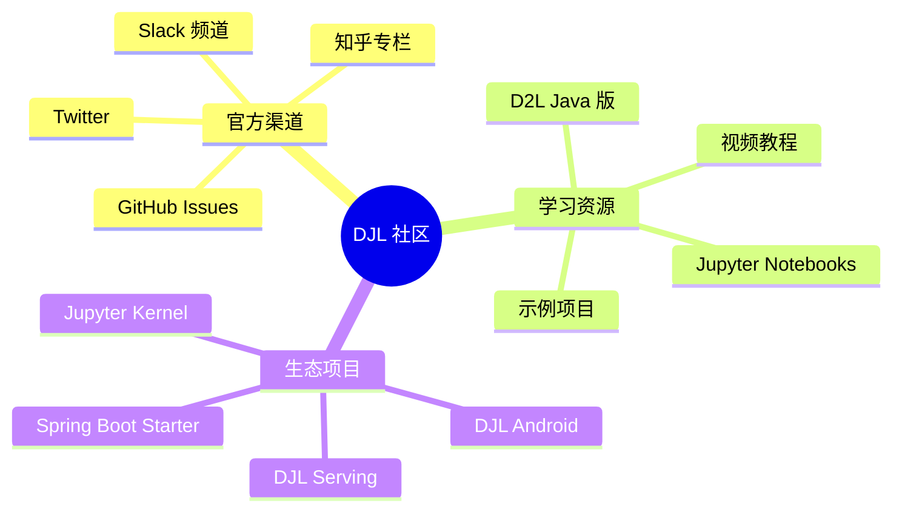

### 进阶学习路径

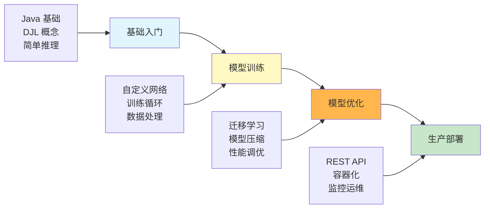

## 总结

DJL 为 Java 开发者提供了一个强大、灵活且易用的深度学习框架。通过本指南，你可以：

1. **快速上手**：使用 Model Zoo 进行推理
2. **自定义训练**：构建和训练自己的模型
3. **生产部署**：将模型集成到 Spring Boot 应用
4. **性能优化**：利用 GPU 和批处理提升性能
5. **最佳实践**：遵循资源管理和错误处理规范

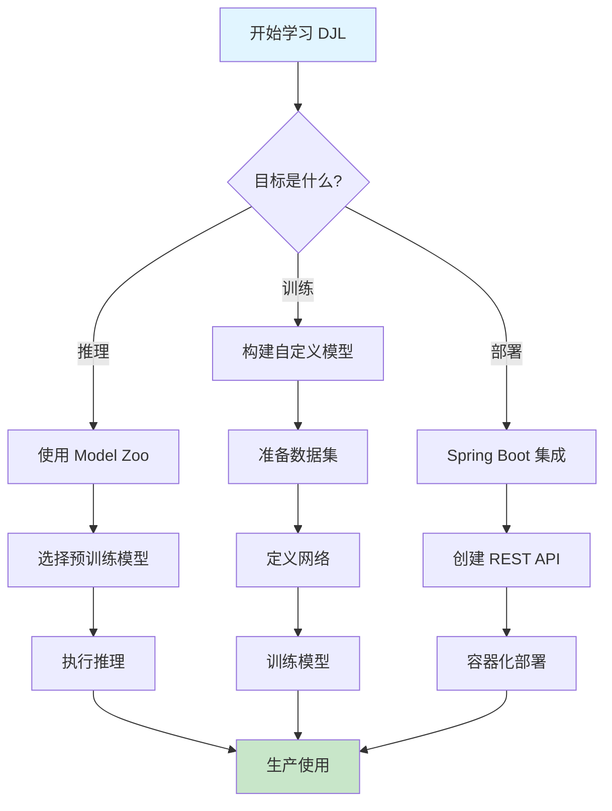

立即开始你的 DJL 深度学习之旅吧！

## 参考资源

- [DJL 官方网站](https://djl.ai)
- [DJL GitHub 仓库](https://github.com/deepjavalibrary/djl)
- [DeepWiki DJL 文档](https://deepwiki.com/deepjavalibrary/djl)
- [D2L - Dive into Deep Learning (Java 版)](https://d2l.djl.ai/)
- [DJL Slack 社区](https://join.slack.com/t/deepjavalibrary/shared_invite/...)

