## Jlama 简介

Jlama 是一个专为 Java 生态打造的现代化大语言模型(LLM)推理引擎。它利用 Java 21 的最新特性（如向量 API）实现了高性能的模型推理，让 Java 开发者能够轻松地在自己的应用中集成大语言模型能力。

```mermaid
mindmap
  root((Jlama))
    核心特性
      纯Java实现
      量化支持
      高性能推理
      分布式能力
    技术亮点
      Java 21向量API
      SIMD优化
      内存高效
      Native加速
    应用场景
      企业应用集成
      边缘设备部署
      私有化部署
      微服务架构
    生态支持
      Langchain4j集成
      OpenAI兼容API
      HuggingFace模型
      Docker部署
```

### 为什么选择 Jlama？

在 Python 主导的 AI 领域，Jlama 为 Java 开发者提供了一个强大的本地化解决方案：

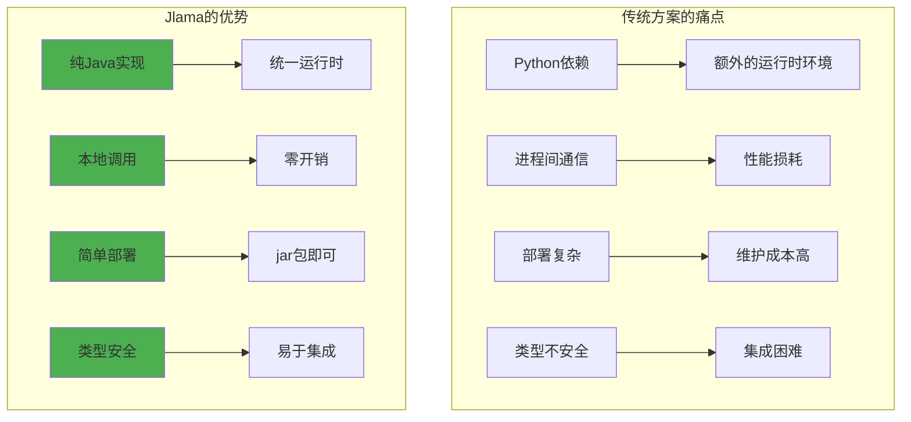

## 核心架构

### 整体架构设计

Jlama 采用模块化设计，各组件职责清晰：

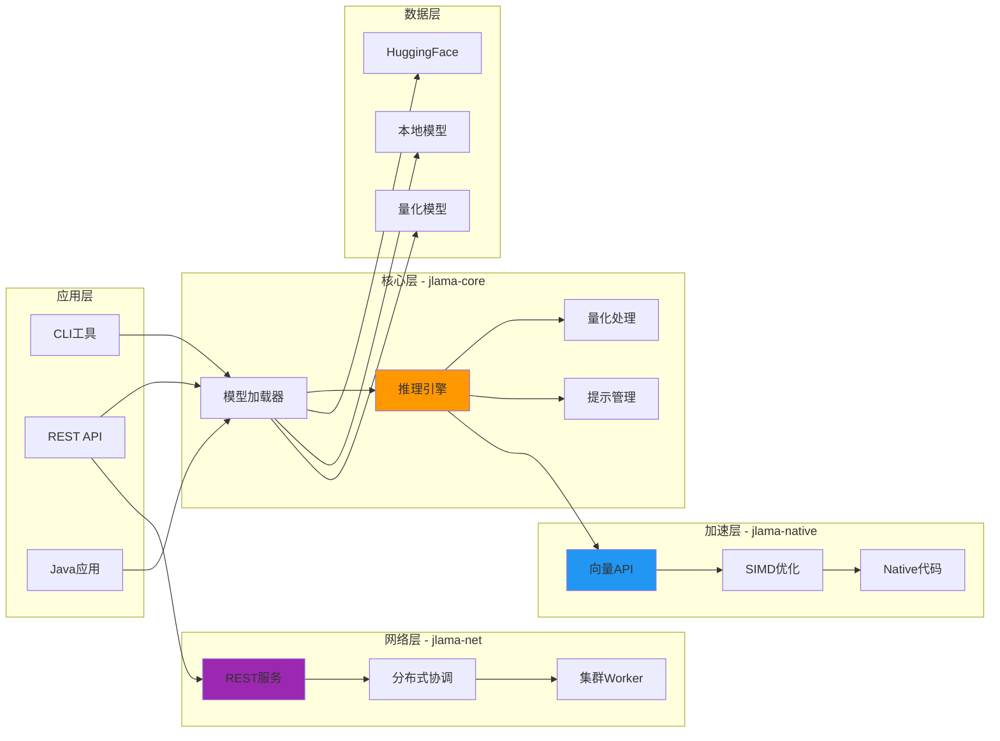

### 模块说明

| 模块 | 功能描述 | 主要特性 |
|------|---------|---------|
| **jlama-core** | 核心推理引擎 | 模型加载、推理执行、量化处理 |
| **jlama-native** | 本地加速库 | SIMD优化、向量API、Native代码 |
| **jlama-net** | 网络服务 | REST API、分布式推理、集群管理 |
| **jlama-cli** | 命令行工具 | 模型下载、聊天、量化、API服务 |
| **jlama-tests** | 测试套件 | 单元测试、集成测试、性能测试 |

## 快速开始

### 环境要求

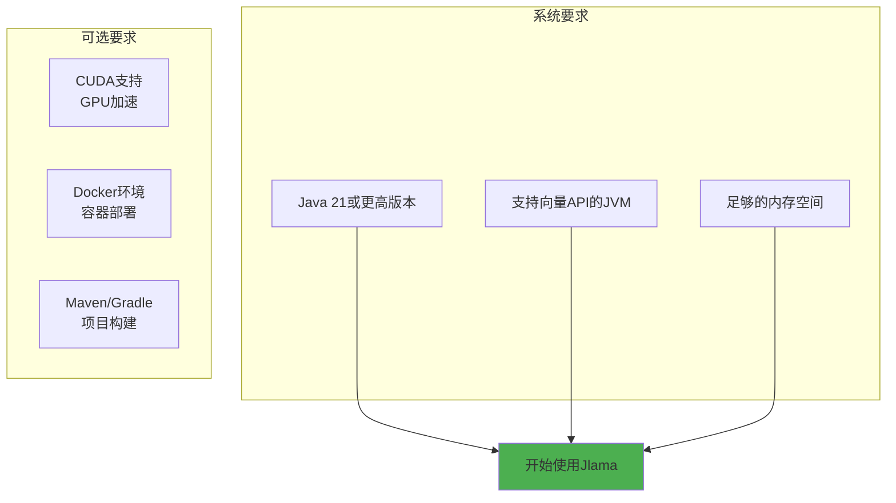

### 安装 Jlama CLI

**方式一：使用预编译版本**

```bash
# 下载最新版本
curl -L https://github.com/tjake/Jlama/releases/latest/download/jlama-cli.jar -o jlama-cli.jar

# 设置环境变量启用预览特性
export JDK_JAVA_OPTIONS="--add-modules jdk.incubator.vector --enable-preview"

# 运行 Jlama
java -jar jlama-cli.jar
```

**方式二：从源码构建**

```bash
# 克隆仓库
git clone https://github.com/tjake/Jlama.git
cd Jlama

# 使用 Maven 构建
./mvnw clean install

# 运行 CLI
java -jar jlama-cli/target/jlama-cli.jar
```

**方式三：使用 Docker**

```bash
# 拉取镜像
docker pull tjake/jlama:latest

# 运行容器
docker run -p 8080:8080 tjake/jlama:latest restapi llama-3.2-1b-instruct
```

### 命令行工具概览

Jlama CLI 提供了丰富的命令：

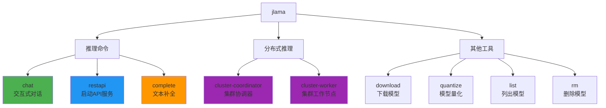

## 核心功能详解

### 1. 模型下载和管理

Jlama 支持从 HuggingFace 直接下载和管理模型：

```bash
# 下载模型（使用 owner/name 格式）
jlama download tjake/Llama-3.2-1B-Instruct-JQ4

# 列出本地模型
jlama list

# 删除模型
jlama rm tjake/Llama-3.2-1B-Instruct-JQ4
```

**Jlama 维护的量化模型仓库**

所有官方量化模型都托管在 https://huggingface.co/tjake

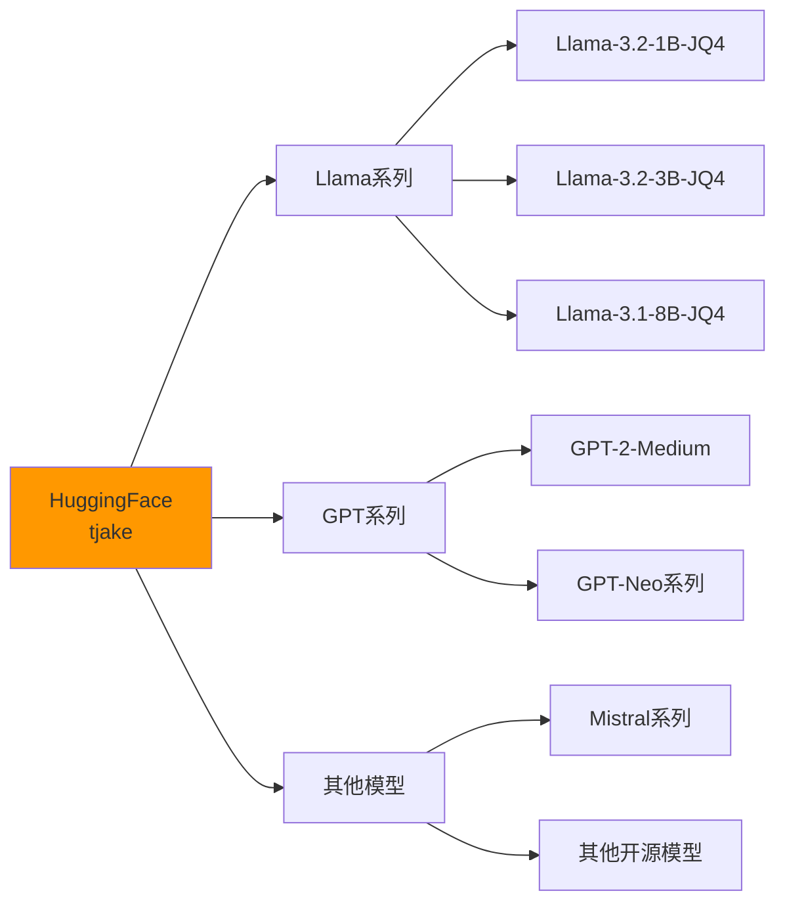

### 2. 交互式聊天

启动命令行聊天界面：

```bash
# 基本聊天
jlama chat tjake/Llama-3.2-1B-Instruct-JQ4

# 指定工作目录
jlama chat --model-directory ./models tjake/Llama-3.2-1B-Instruct-JQ4

# 设置生成参数
jlama chat --temperature 0.7 --max-tokens 512 tjake/Llama-3.2-1B-Instruct-JQ4
```

**聊天流程**

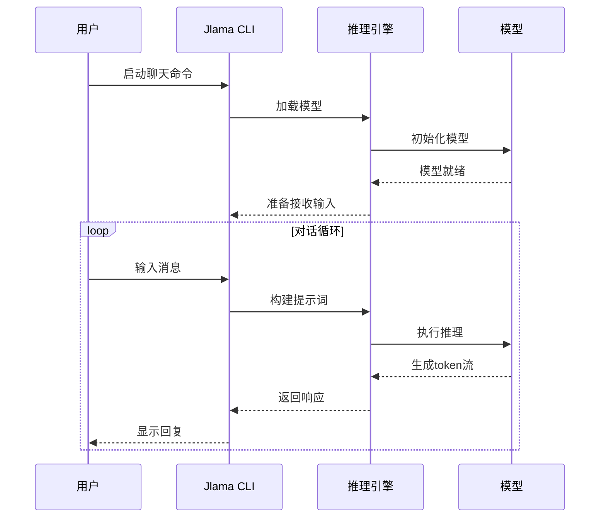

### 3. REST API 服务

Jlama 提供 OpenAI 兼容的 REST API：

```bash
# 启动 API 服务
jlama restapi tjake/Llama-3.2-1B-Instruct-JQ4

# 指定端口
jlama restapi --port 8080 tjake/Llama-3.2-1B-Instruct-JQ4

# 指定数据类型
jlama restapi --model-type F32 --model-quantization I8 tjake/Llama-3.2-1B-Instruct-JQ4
```

**API 架构**

```mermaid
graph TB
    subgraph "客户端"
        A[HTTP客户端]
        B[OpenAI SDK]
        C[Langchain4j]
    end
    
    subgraph "Jlama REST API"
        D[/v1/chat/completions]
        E[/v1/completions]
        F[/v1/models]
    end
    
    subgraph "推理引擎"
        G[模型管理器]
        H[推理执行器]
        I[响应生成器]
    end
    
    A --> D
    B --> D
    C --> D
    
    A --> E
    B --> E
    
    A --> F
    
    D --> G
    E --> G
    F --> G
    
    G --> H
    H --> I
    
    style D fill:#4caf50
    style E fill:#2196f3
    style F fill:#ff9800
```

**调用示例**

```bash
# 使用 curl 调用 API
curl -X POST http://localhost:8080/v1/chat/completions \
  -H "Content-Type: application/json" \
  -d '{
    "model": "tjake/Llama-3.2-1B-Instruct-JQ4",
    "messages": [
      {"role": "system", "content": "You are a helpful assistant."},
      {"role": "user", "content": "What is the capital of France?"}
    ],
    "temperature": 0.7,
    "max_tokens": 256
  }'
```

### 4. 文本补全

执行简单的文本补全任务：

```bash
# 基本补全
jlama complete --prompt "Once upon a time" tjake/Llama-3.2-1B-Instruct-JQ4

# 设置生成参数
jlama complete \
  --prompt "The best way to learn programming is" \
  --temperature 0.0 \
  --max-tokens 256 \
  tjake/Llama-3.2-1B-Instruct-JQ4
```

### 5. 模型量化

Jlama 支持对模型进行量化以减少内存占用：

```bash
# 量化模型
jlama quantize --quantization Q4 --output ./quantized llama-3.2-1b-instruct

# 支持的量化类型
# Q4: 4-bit 量化
# Q8: 8-bit 量化
# I8: INT8 量化
```

**量化效果对比**

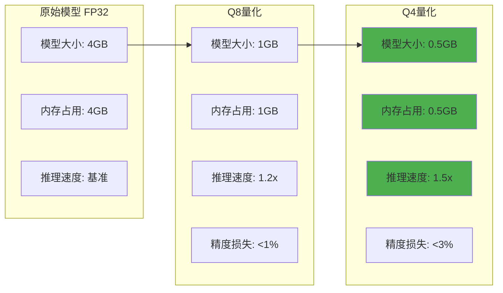

## 分布式推理

Jlama 支持分布式推理，可以在多台机器上协同处理大模型：

### 架构设计

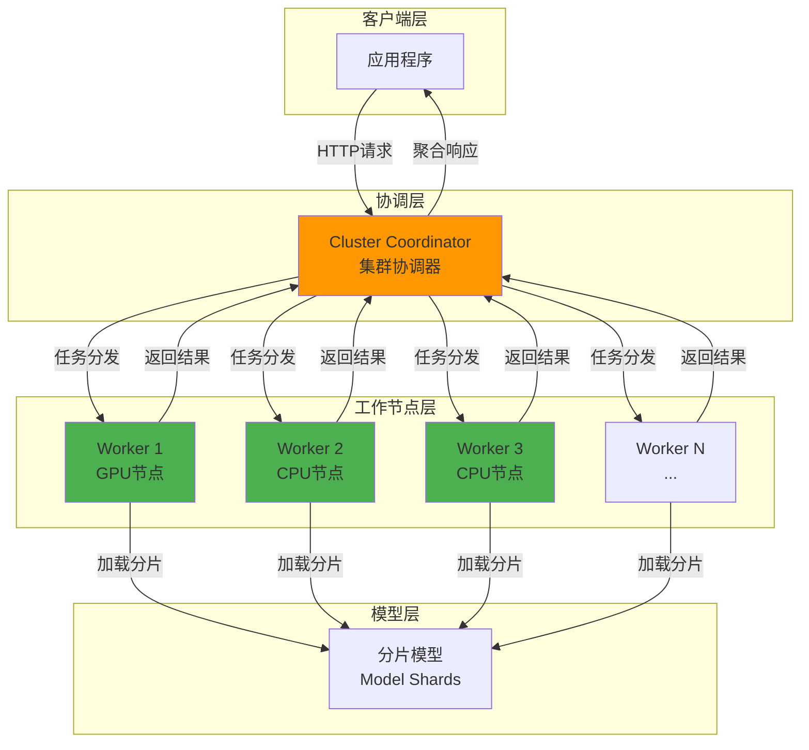

### 启动分布式集群

**步骤 1：启动协调器**

```bash
# 在主节点启动协调器
jlama cluster-coordinator \
  --host 0.0.0.0 \
  --port 8080 \
  --model-directory ./models \
  tjake/Llama-3.1-8B-Instruct-JQ4
```

**步骤 2：启动工作节点**

```bash
# 在工作节点1启动
jlama cluster-worker \
  --coordinator-host master.example.com \
  --coordinator-port 8080 \
  --worker-id worker-1

# 在工作节点2启动
jlama cluster-worker \
  --coordinator-host master.example.com \
  --coordinator-port 8080 \
  --worker-id worker-2

# 更多工作节点...
```

**步骤 3：使用集群 API**

```bash
# 调用集群 API（与单机API兼容）
curl -X POST http://master.example.com:8080/v1/chat/completions \
  -H "Content-Type: application/json" \
  -d '{
    "model": "tjake/Llama-3.1-8B-Instruct-JQ4",
    "messages": [
      {"role": "user", "content": "Explain quantum computing"}
    ]
  }'
```

### 分布式推理流程

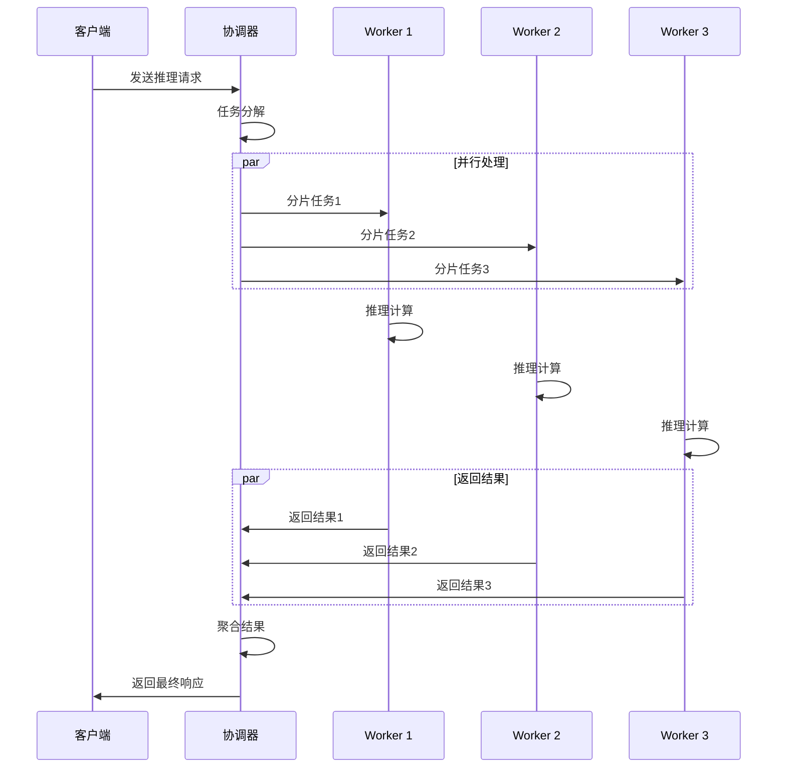

## Java 应用集成

### Maven 依赖配置

在你的 `pom.xml` 中添加依赖：

```xml
<properties>
    <jlama.version>0.8.4</jlama.version>
</properties>

<dependencies>
    <!-- Jlama 核心库 -->
    <dependency>
        <groupId>com.github.tjake</groupId>
        <artifactId>jlama-core</artifactId>
        <version>${jlama.version}</version>
    </dependency>
    
    <!-- Jlama Native 加速（可选） -->
    <dependency>
        <groupId>com.github.tjake</groupId>
        <artifactId>jlama-native</artifactId>
        <version>${jlama.version}</version>
        <!-- 使用 os-maven-plugin 自动检测系统 -->
        <classifier>${os.detected.name}-${os.detected.arch}</classifier>
    </dependency>
</dependencies>

<build>
    <extensions>
        <!-- 用于检测操作系统和架构 -->
        <extension>
            <groupId>kr.motd.maven</groupId>
            <artifactId>os-maven-plugin</artifactId>
            <version>1.7.1</version>
        </extension>
    </extensions>
    
    <plugins>
        <plugin>
            <groupId>org.apache.maven.plugins</groupId>
            <artifactId>maven-compiler-plugin</artifactId>
            <version>3.11.0</version>
            <configuration>
                <release>21</release>
                <compilerArgs>
                    <arg>--enable-preview</arg>
                    <arg>--add-modules</arg>
                    <arg>jdk.incubator.vector</arg>
                </compilerArgs>
            </configuration>
        </plugin>
    </plugins>
</build>
```

### Gradle 配置

```gradle
plugins {
    id 'java'
}

java {
    toolchain {
        languageVersion = JavaLanguageVersion.of(21)
    }
}

dependencies {
    implementation 'com.github.tjake:jlama-core:0.8.4'
    implementation "com.github.tjake:jlama-native:0.8.4:${osdetector.os}-${osdetector.arch}"
}

tasks.withType(JavaCompile) {
    options.compilerArgs += ['--enable-preview', '--add-modules', 'jdk.incubator.vector']
}

tasks.withType(Test) {
    jvmArgs += ['--enable-preview', '--add-modules', 'jdk.incubator.vector']
}
```

### 基础使用示例

```java
import com.github.tjake.jlama.model.AbstractModel;
import com.github.tjake.jlama.model.ModelSupport;
import com.github.tjake.jlama.safetensors.DType;
import com.github.tjake.jlama.safetensors.prompt.PromptContext;
import com.github.tjake.jlama.util.Downloader;

import java.io.File;
import java.io.IOException;
import java.util.UUID;

public class BasicExample {
    public void basicInference() throws IOException {
        String model = "tjake/Llama-3.2-1B-Instruct-JQ4";
        String workingDirectory = "./models";
        String prompt = "What is the best season to plant avocados?";
        
        // 1. 下载模型（如果本地不存在）
        File localModelPath = new Downloader(workingDirectory, model)
            .huggingFaceModel();
        
        // 2. 加载模型
        // 参数说明：
        // - localModelPath: 模型路径
        // - DType.F32: 工作精度（FP32）
        // - DType.I8: 内存精度（INT8量化）
        AbstractModel m = ModelSupport.loadModel(
            localModelPath, 
            DType.F32, 
            DType.I8
        );
        
        // 3. 构建提示词上下文
        PromptContext ctx;
        if (m.promptSupport().isPresent()) {
            // 如果模型支持聊天提示，使用结构化提示
            ctx = m.promptSupport()
                .get()
                .builder()
                .addSystemMessage("You are a helpful chatbot who writes short responses.")
                .addUserMessage(prompt)
                .build();
        } else {
            // 否则使用纯文本提示
            ctx = PromptContext.of(prompt);
        }
        
        System.out.println("Prompt: " + ctx.getPrompt() + "\n");
        
        // 4. 执行推理
        // 参数说明：
        // - UUID.randomUUID(): 会话ID
        // - ctx: 提示词上下文
        // - 0.0f: temperature（0表示确定性输出）
        // - 256: 最大生成token数
        // - (s, f) -> {}: token回调（可用于流式输出）
        var response = m.generate(
            UUID.randomUUID(), 
            ctx, 
            0.0f, 
            256, 
            (token, probability) -> {}
        );
        
        System.out.println(response.responseText);
    }
}
```

### Builder API 示例

Jlama 提供了更优雅的 Builder API：

```java
public class BuilderExample {
    public void builderInference() throws IOException {
        String model = "tjake/Llama-3.2-1B-Instruct-JQ4";
        String workingDirectory = "./models";
        
        // 下载并加载模型
        File localModelPath = new Downloader(workingDirectory, model)
            .huggingFaceModel();
        AbstractModel m = ModelSupport.loadModel(
            localModelPath, 
            DType.F32, 
            DType.I8
        );
        
        // 使用 Builder API 执行推理
        var response = m.generateBuilder()
            .session(UUID.randomUUID())  // 会话ID（可选，默认随机生成）
            .prompt("Explain quantum computing in simple terms")  // 直接提供文本
            .ntokens(512)  // 最大token数（默认256）
            .temperature(0.7f)  // 温度参数（默认0.0）
            .onTokenWithTimings((token, timing) -> {
                // 流式输出回调
                System.out.print(token);
            })
            .generate();
        
        System.out.println("\n\nFinal response: " + response.responseText);
    }
}
```

### 简化的提示词构建

```java
public class SimplifiedPromptExample {
    public void simplifiedPrompt() throws IOException {
        String model = "tjake/Llama-3.2-1B-Instruct-JQ4";
        
        File localModelPath = new Downloader("./models", model)
            .huggingFaceModel();
        AbstractModel m = ModelSupport.loadModel(
            localModelPath, 
            DType.F32, 
            DType.I8
        );
        
        // 使用简化的 prompt() 方法
        var ctx = m.prompt()
            .addSystemMessage("You are a helpful coding assistant.")
            .addUserMessage("Write a Java function to reverse a string")
            .build();  // 自动处理是否支持结构化提示
        
        var response = m.generateBuilder()
            .promptContext(ctx)
            .temperature(0.3f)
            .ntokens(512)
            .generate();
        
        System.out.println(response.responseText);
    }
}
```

### 多轮对话示例

```java
import java.util.ArrayList;
import java.util.List;
import java.util.Scanner;

public class MultiTurnChatExample {
    public void interactiveChat() throws IOException {
        String model = "tjake/Llama-3.2-1B-Instruct-JQ4";
        
        // 加载模型
        File localModelPath = new Downloader("./models", model)
            .huggingFaceModel();
        AbstractModel m = ModelSupport.loadModel(
            localModelPath, 
            DType.F32, 
            DType.I8
        );
        
        // 会话历史
        List<Message> history = new ArrayList<>();
        Scanner scanner = new Scanner(System.in);
        UUID sessionId = UUID.randomUUID();
        
        System.out.println("Chat started. Type 'exit' to quit.\n");
        
        while (true) {
            System.out.print("You: ");
            String userInput = scanner.nextLine();
            
            if ("exit".equalsIgnoreCase(userInput)) {
                break;
            }
            
            // 构建包含历史的提示词
            var promptBuilder = m.prompt()
                .addSystemMessage("You are a helpful assistant.");
            
            // 添加历史对话
            for (Message msg : history) {
                if (msg.role.equals("user")) {
                    promptBuilder.addUserMessage(msg.content);
                } else {
                    promptBuilder.addAssistantMessage(msg.content);
                }
            }
            
            // 添加当前用户输入
            promptBuilder.addUserMessage(userInput);
            var ctx = promptBuilder.build();
            
            // 生成回复
            System.out.print("Assistant: ");
            var response = m.generateBuilder()
                .session(sessionId)
                .promptContext(ctx)
                .temperature(0.7f)
                .ntokens(256)
                .onTokenWithTimings((token, timing) -> {
                    System.out.print(token);
                })
                .generate();
            System.out.println("\n");
            
            // 更新历史
            history.add(new Message("user", userInput));
            history.add(new Message("assistant", response.responseText));
        }
        
        scanner.close();
    }
    
    static class Message {
        String role;
        String content;
        
        Message(String role, String content) {
            this.role = role;
            this.content = content;
        }
    }
}
```

## Langchain4j 集成

Jlama 提供了 Langchain4j 的官方集成，让你可以在 Langchain4j 应用中无缝使用 Jlama：

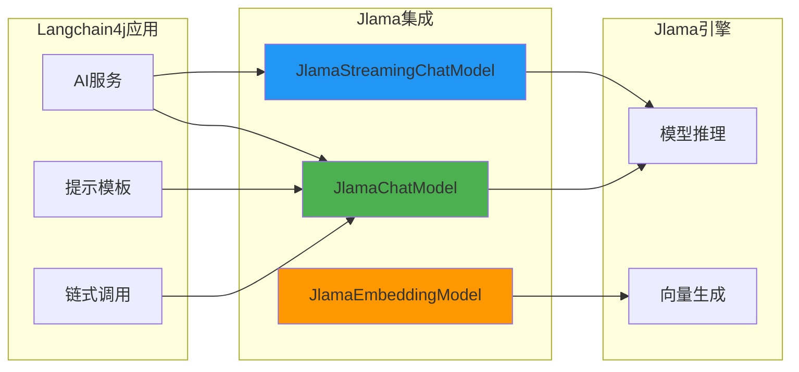

### 基础集成示例

```java
import dev.langchain4j.model.chat.ChatLanguageModel;
import dev.langchain4j.model.jlama.JlamaChatModel;
import dev.langchain4j.service.AiServices;

public class Langchain4jExample {
    
    interface Assistant {
        String chat(String message);
    }
    
    public void basicLangchain4j() {
        // 创建 Jlama 聊天模型
        ChatLanguageModel model = JlamaChatModel.builder()
            .modelName("tjake/Llama-3.2-1B-Instruct-JQ4")
            .modelDirectory("./models")
            .temperature(0.7)
            .maxTokens(256)
            .build();
        
        // 创建 AI 服务
        Assistant assistant = AiServices.create(Assistant.class, model);
        
        // 使用助手
        String response = assistant.chat("What is machine learning?");
        System.out.println(response);
    }
}
```

### 流式响应示例

```java
import dev.langchain4j.model.chat.StreamingChatLanguageModel;
import dev.langchain4j.model.jlama.JlamaStreamingChatModel;

public class StreamingExample {
    public void streamingChat() {
        StreamingChatLanguageModel model = JlamaStreamingChatModel.builder()
            .modelName("tjake/Llama-3.2-1B-Instruct-JQ4")
            .modelDirectory("./models")
            .temperature(0.7)
            .build();
        
        model.generate("Tell me a story about a robot", 
            new StreamingResponseHandler<AiMessage>() {
                @Override
                public void onNext(String token) {
                    System.out.print(token);
                }
                
                @Override
                public void onComplete(Response<AiMessage> response) {
                    System.out.println("\n\nGeneration complete!");
                }
                
                @Override
                public void onError(Throwable error) {
                    error.printStackTrace();
                }
            });
    }
}
```

## 高级特性

### 1. 自定义数据类型

Jlama 支持多种数据类型组合以优化性能和内存：

```java
public class DataTypeExample {
    public void differentDataTypes() throws IOException {
        File modelPath = new Downloader("./models", "tjake/Llama-3.2-1B-Instruct-JQ4")
            .huggingFaceModel();
        
        // 配置1：FP32 工作精度 + FP32 内存
        // - 最高精度，最大内存占用
        AbstractModel m1 = ModelSupport.loadModel(
            modelPath, 
            DType.F32,  // 工作精度
            DType.F32   // 内存精度
        );
        
        // 配置2：FP32 工作精度 + INT8 内存量化
        // - 平衡精度和内存（推荐）
        AbstractModel m2 = ModelSupport.loadModel(
            modelPath, 
            DType.F32, 
            DType.I8
        );
        
        // 配置3：BF16 工作精度 + INT8 内存量化
        // - 更快的推理速度
        AbstractModel m3 = ModelSupport.loadModel(
            modelPath, 
            DType.BF16, 
            DType.I8
        );
    }
}
```

**数据类型对比**

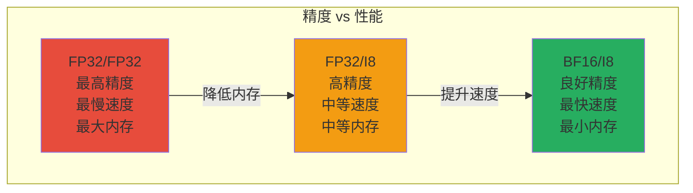

### 2. 提示词模板

```java
public class PromptTemplateExample {
    public void templateExample() throws IOException {
        File modelPath = new Downloader("./models", "tjake/Llama-3.2-1B-Instruct-JQ4")
            .huggingFaceModel();
        AbstractModel model = ModelSupport.loadModel(modelPath, DType.F32, DType.I8);
        
        // 定义提示词模板
        String systemTemplate = """
            You are an expert %s programmer.
            Write clean, efficient, and well-documented code.
            Follow %s best practices.
            """;
        
        String userTemplate = """
            Task: %s
            
            Requirements:
            %s
            """;
        
        // 填充模板
        String language = "Java";
        String bestPractices = "SOLID principles and clean code";
        String task = "Create a REST API for user management";
        String requirements = """
            - CRUD operations for users
            - Input validation
            - Exception handling
            - Unit tests
            """;
        
        var ctx = model.prompt()
            .addSystemMessage(String.format(systemTemplate, language, bestPractices))
            .addUserMessage(String.format(userTemplate, task, requirements))
            .build();
        
        var response = model.generateBuilder()
            .promptContext(ctx)
            .temperature(0.3f)
            .ntokens(1024)
            .generate();
        
        System.out.println(response.responseText);
    }
}
```

### 3. 批量推理

```java
import java.util.List;
import java.util.concurrent.CompletableFuture;
import java.util.stream.Collectors;

public class BatchInferenceExample {
    public void batchInference() throws IOException {
        File modelPath = new Downloader("./models", "tjake/Llama-3.2-1B-Instruct-JQ4")
            .huggingFaceModel();
        AbstractModel model = ModelSupport.loadModel(modelPath, DType.F32, DType.I8);
        
        // 准备批量提示
        List<String> prompts = List.of(
            "What is Java?",
            "Explain object-oriented programming",
            "What are design patterns?",
            "Describe the Spring Framework"
        );
        
        // 并行处理
        List<CompletableFuture<String>> futures = prompts.stream()
            .map(prompt -> CompletableFuture.supplyAsync(() -> {
                try {
                    var ctx = model.prompt()
                        .addUserMessage(prompt)
                        .build();
                    
                    var response = model.generateBuilder()
                        .session(UUID.randomUUID())
                        .promptContext(ctx)
                        .temperature(0.0f)
                        .ntokens(128)
                        .generate();
                    
                    return response.responseText;
                } catch (Exception e) {
                    return "Error: " + e.getMessage();
                }
            }))
            .collect(Collectors.toList());
        
        // 等待所有任务完成
        List<String> results = futures.stream()
            .map(CompletableFuture::join)
            .collect(Collectors.toList());
        
        // 输出结果
        for (int i = 0; i < prompts.size(); i++) {
            System.out.println("Prompt: " + prompts.get(i));
            System.out.println("Response: " + results.get(i));
            System.out.println("---");
        }
    }
}
```

### 4. 性能监控

```java
public class PerformanceMonitoringExample {
    public void monitorPerformance() throws IOException {
        File modelPath = new Downloader("./models", "tjake/Llama-3.2-1B-Instruct-JQ4")
            .huggingFaceModel();
        AbstractModel model = ModelSupport.loadModel(modelPath, DType.F32, DType.I8);
        
        String prompt = "Explain machine learning";
        var ctx = model.prompt().addUserMessage(prompt).build();
        
        // 记录开始时间
        long startTime = System.currentTimeMillis();
        long startMemory = Runtime.getRuntime().totalMemory() - Runtime.getRuntime().freeMemory();
        
        // Token 计数器
        int[] tokenCount = {0};
        
        var response = model.generateBuilder()
            .promptContext(ctx)
            .temperature(0.7f)
            .ntokens(256)
            .onTokenWithTimings((token, timing) -> {
                tokenCount[0]++;
                // timing 包含每个 token 的生成时间
            })
            .generate();
        
        // 计算性能指标
        long endTime = System.currentTimeMillis();
        long endMemory = Runtime.getRuntime().totalMemory() - Runtime.getRuntime().freeMemory();
        
        long totalTime = endTime - startTime;
        long memoryUsed = (endMemory - startMemory) / (1024 * 1024); // MB
        double tokensPerSecond = (tokenCount[0] * 1000.0) / totalTime;
        
        System.out.println("=== Performance Metrics ===");
        System.out.println("Total time: " + totalTime + " ms");
        System.out.println("Tokens generated: " + tokenCount[0]);
        System.out.println("Tokens/second: " + String.format("%.2f", tokensPerSecond));
        System.out.println("Memory used: " + memoryUsed + " MB");
        System.out.println("Response: " + response.responseText);
    }
}
```

## 生产环境部署

### Docker 部署

**Dockerfile 示例**

```dockerfile
FROM eclipse-temurin:21-jdk-alpine

# 安装必要的工具
RUN apk add --no-cache curl

# 设置工作目录
WORKDIR /app

# 复制 Jlama jar 文件
COPY jlama-cli.jar /app/jlama-cli.jar

# 创建模型目录
RUN mkdir -p /app/models

# 设置 Java 选项
ENV JDK_JAVA_OPTIONS="--add-modules jdk.incubator.vector --enable-preview"

# 暴露端口
EXPOSE 8080

# 健康检查
HEALTHCHECK --interval=30s --timeout=10s --start-period=60s --retries=3 \
  CMD curl -f http://localhost:8080/v1/models || exit 1

# 启动命令（通过环境变量配置）
ENTRYPOINT ["java", "-jar", "/app/jlama-cli.jar"]
CMD ["restapi", "--port", "8080", "--model-directory", "/app/models"]
```

**docker-compose.yml**

```yaml
version: '3.8'

services:
  jlama:
    image: jlama:latest
    build: .
    ports:
      - "8080:8080"
    environment:
      - JDK_JAVA_OPTIONS=--add-modules jdk.incubator.vector --enable-preview
      - MODEL_NAME=tjake/Llama-3.2-1B-Instruct-JQ4
    volumes:
      - ./models:/app/models
      - ./config:/app/config
    command: ["restapi", "--port", "8080", "${MODEL_NAME}"]
    restart: unless-stopped
    healthcheck:
      test: ["CMD", "curl", "-f", "http://localhost:8080/v1/models"]
      interval: 30s
      timeout: 10s
      retries: 3
      start_period: 60s
```

### Kubernetes 部署

```yaml
apiVersion: apps/v1
kind: Deployment
metadata:
  name: jlama-deployment
  labels:
    app: jlama
spec:
  replicas: 3
  selector:
    matchLabels:
      app: jlama
  template:
    metadata:
      labels:
        app: jlama
    spec:
      containers:
      - name: jlama
        image: jlama:latest
        ports:
        - containerPort: 8080
        env:
        - name: JDK_JAVA_OPTIONS
          value: "--add-modules jdk.incubator.vector --enable-preview"
        - name: MODEL_NAME
          value: "tjake/Llama-3.2-1B-Instruct-JQ4"
        volumeMounts:
        - name: models
          mountPath: /app/models
        resources:
          requests:
            memory: "4Gi"
            cpu: "2000m"
          limits:
            memory: "8Gi"
            cpu: "4000m"
        livenessProbe:
          httpGet:
            path: /v1/models
            port: 8080
          initialDelaySeconds: 60
          periodSeconds: 30
        readinessProbe:
          httpGet:
            path: /v1/models
            port: 8080
          initialDelaySeconds: 30
          periodSeconds: 10
      volumes:
      - name: models
        persistentVolumeClaim:
          claimName: jlama-models-pvc
---
apiVersion: v1
kind: Service
metadata:
  name: jlama-service
spec:
  selector:
    app: jlama
  ports:
  - protocol: TCP
    port: 80
    targetPort: 8080
  type: LoadBalancer
---
apiVersion: v1
kind: PersistentVolumeClaim
metadata:
  name: jlama-models-pvc
spec:
  accessModes:
  - ReadWriteMany
  resources:
    requests:
      storage: 50Gi
```

### 性能调优

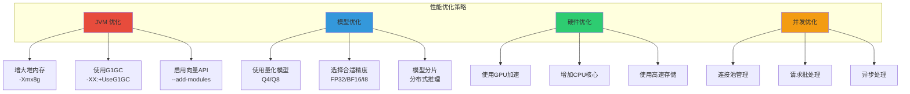

**JVM 优化参数**

```bash
# 启动 Jlama 时的 JVM 优化参数
java \
  -Xmx8g \
  -Xms8g \
  -XX:+UseG1GC \
  -XX:MaxGCPauseMillis=200 \
  -XX:+UseStringDeduplication \
  --add-modules jdk.incubator.vector \
  --enable-preview \
  -jar jlama-cli.jar restapi tjake/Llama-3.2-1B-Instruct-JQ4
```

## 最佳实践

### 1. 模型选择指南

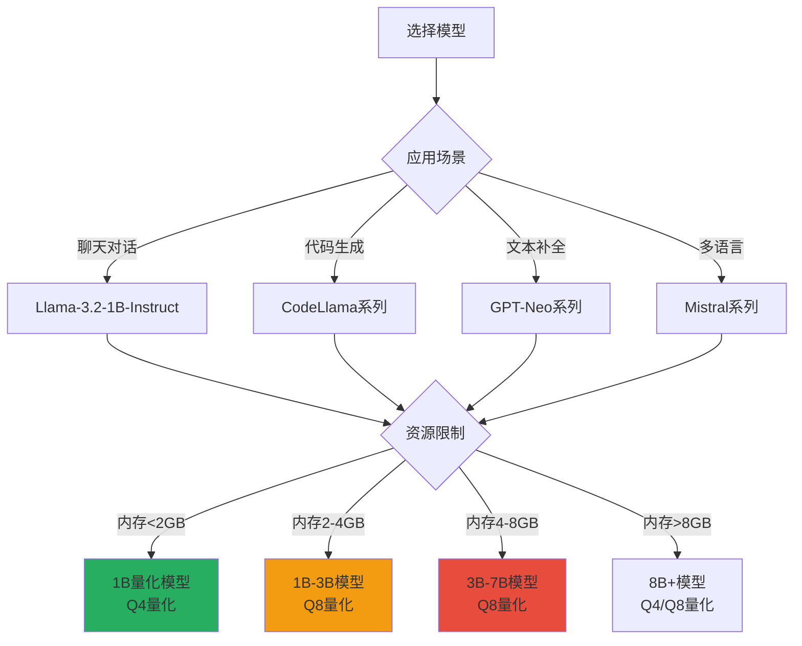

### 2. 错误处理

```java
public class ErrorHandlingExample {
    public void robustInference() {
        try {
            // 模型加载
            File modelPath = new Downloader("./models", "tjake/Llama-3.2-1B-Instruct-JQ4")
                .huggingFaceModel();
            
            AbstractModel model = ModelSupport.loadModel(modelPath, DType.F32, DType.I8);
            
            // 推理执行
            var ctx = model.prompt()
                .addUserMessage("Your question here")
                .build();
            
            var response = model.generateBuilder()
                .promptContext(ctx)
                .temperature(0.7f)
                .ntokens(256)
                .onTokenWithTimings((token, timing) -> {
                    // 可以在这里添加超时检测
                    if (timing > 5000) { // 5秒超时
                        throw new RuntimeException("Token generation timeout");
                    }
                })
                .generate();
            
            System.out.println(response.responseText);
            
        } catch (IOException e) {
            System.err.println("Model loading failed: " + e.getMessage());
            // 处理模型加载失败
            e.printStackTrace();
            
        } catch (OutOfMemoryError e) {
            System.err.println("Out of memory. Consider:");
            System.err.println("1. Using a smaller model");
            System.err.println("2. Increasing JVM heap size (-Xmx)");
            System.err.println("3. Using more aggressive quantization (Q4)");
            
        } catch (RuntimeException e) {
            System.err.println("Inference error: " + e.getMessage());
            // 处理推理错误
            e.printStackTrace();
            
        } catch (Exception e) {
            System.err.println("Unexpected error: " + e.getMessage());
            e.printStackTrace();
        }
    }
}
```

### 3. 资源管理

```java
public class ResourceManagementExample {
    private static final int MAX_CONCURRENT_REQUESTS = 10;
    private static final Semaphore semaphore = new Semaphore(MAX_CONCURRENT_REQUESTS);
    
    public void managedInference(String prompt) throws IOException, InterruptedException {
        // 获取许可（限制并发）
        semaphore.acquire();
        
        try {
            File modelPath = new Downloader("./models", "tjake/Llama-3.2-1B-Instruct-JQ4")
                .huggingFaceModel();
            
            // 使用 try-with-resources 管理资源
            AbstractModel model = ModelSupport.loadModel(modelPath, DType.F32, DType.I8);
            
            var ctx = model.prompt()
                .addUserMessage(prompt)
                .build();
            
            var response = model.generateBuilder()
                .promptContext(ctx)
                .temperature(0.7f)
                .ntokens(256)
                .generate();
            
            System.out.println(response.responseText);
            
        } finally {
            // 释放许可
            semaphore.release();
            
            // 建议进行垃圾回收（如果内存紧张）
            System.gc();
        }
    }
}
```

### 4. 日志和监控

```java
import org.slf4j.Logger;
import org.slf4j.LoggerFactory;

public class LoggingExample {
    private static final Logger logger = LoggerFactory.getLogger(LoggingExample.class);
    
    public void loggedInference() throws IOException {
        String modelName = "tjake/Llama-3.2-1B-Instruct-JQ4";
        logger.info("Starting inference with model: {}", modelName);
        
        try {
            long startTime = System.currentTimeMillis();
            
            File modelPath = new Downloader("./models", modelName)
                .huggingFaceModel();
            logger.debug("Model path: {}", modelPath.getAbsolutePath());
            
            AbstractModel model = ModelSupport.loadModel(modelPath, DType.F32, DType.I8);
            logger.info("Model loaded successfully");
            
            var ctx = model.prompt()
                .addUserMessage("Test prompt")
                .build();
            
            int[] tokenCount = {0};
            var response = model.generateBuilder()
                .promptContext(ctx)
                .temperature(0.7f)
                .ntokens(256)
                .onTokenWithTimings((token, timing) -> {
                    tokenCount[0]++;
                    if (tokenCount[0] % 10 == 0) {
                        logger.debug("Generated {} tokens", tokenCount[0]);
                    }
                })
                .generate();
            
            long endTime = System.currentTimeMillis();
            long duration = endTime - startTime;
            
            logger.info("Inference completed in {} ms", duration);
            logger.info("Generated {} tokens", tokenCount[0]);
            logger.info("Tokens/second: {}", (tokenCount[0] * 1000.0) / duration);
            logger.debug("Response: {}", response.responseText);
            
        } catch (Exception e) {
            logger.error("Inference failed", e);
            throw e;
        }
    }
}
```

## 常见问题

### Q1: 如何选择合适的量化级别？

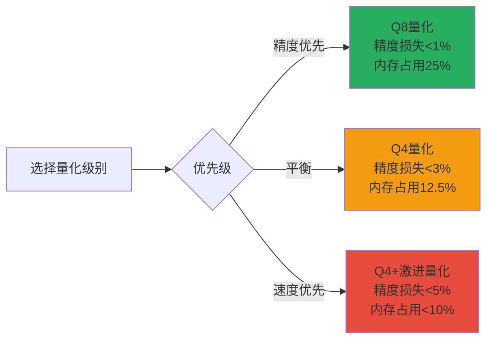

### Q2: OutOfMemoryError 如何解决？

1. **增加 JVM 堆内存**
```bash
java -Xmx8g -jar jlama-cli.jar restapi model-name
```

2. **使用更小的模型或更激进的量化**
```bash
# 使用 Q4 量化而不是 Q8
jlama download tjake/Llama-3.2-1B-Instruct-JQ4
```

3. **减少并发请求数**
```java
// 限制同时处理的请求数量
Semaphore semaphore = new Semaphore(5); // 最多5个并发请求
```

### Q3: 如何提升推理速度？

1. **使用 Native 加速库**
```xml
<dependency>
    <groupId>com.github.tjake</groupId>
    <artifactId>jlama-native</artifactId>
    <classifier>${os.detected.name}-${os.detected.arch}</classifier>
</dependency>
```

2. **使用 BF16 精度**
```java
AbstractModel model = ModelSupport.loadModel(
    modelPath, 
    DType.BF16,  // 使用 BF16 而不是 FP32
    DType.I8
);
```

3. **启用分布式推理**
```bash
# 使用多台机器协同推理大模型
jlama cluster-coordinator model-name
```

### Q4: 如何处理长上下文？

```java
public void longContextInference() throws IOException {
    File modelPath = new Downloader("./models", "tjake/Llama-3.2-1B-Instruct-JQ4")
        .huggingFaceModel();
    AbstractModel model = ModelSupport.loadModel(modelPath, DType.F32, DType.I8);
    
    // 对于长上下文，分段处理
    String longContext = "...very long text...";
    int chunkSize = 2000; // 每次处理 2000 字符
    
    List<String> chunks = splitIntoChunks(longContext, chunkSize);
    List<String> summaries = new ArrayList<>();
    
    // 对每个分段进行总结
    for (String chunk : chunks) {
        var ctx = model.prompt()
            .addSystemMessage("Summarize the following text concisely:")
            .addUserMessage(chunk)
            .build();
        
        var response = model.generateBuilder()
            .promptContext(ctx)
            .temperature(0.3f)
            .ntokens(128)
            .generate();
        
        summaries.add(response.responseText);
    }
    
    // 对所有总结进行最终汇总
    String finalSummary = String.join("\n", summaries);
    // ...
}

private List<String> splitIntoChunks(String text, int chunkSize) {
    List<String> chunks = new ArrayList<>();
    for (int i = 0; i < text.length(); i += chunkSize) {
        chunks.add(text.substring(i, Math.min(text.length(), i + chunkSize)));
    }
    return chunks;
}
```

## 开发指南

### 贡献代码

如果你想为 Jlama 贡献代码，请参考官方的开发指南：

1. **Fork 仓库**
```bash
git clone https://github.com/YOUR_USERNAME/Jlama.git
cd Jlama
```

2. **构建项目**
```bash
./mvnw clean install
```

3. **运行测试**
```bash
./mvnw test
```

4. **提交 Pull Request**

### 项目结构

```
Jlama/
├── jlama-core/          # 核心推理引擎
│   ├── src/main/java/
│   │   ├── model/       # 模型定义
│   │   ├── tensor/      # 张量操作
│   │   └── math/        # 数学运算
│   └── pom.xml
├── jlama-native/        # Native 加速
│   ├── src/main/c/      # C/C++ 代码
│   └── pom.xml
├── jlama-net/           # 网络服务
│   ├── src/main/java/
│   │   ├── api/         # REST API
│   │   └── cluster/     # 分布式协调
│   └── pom.xml
├── jlama-cli/           # 命令行工具
│   └── pom.xml
├── jlama-tests/         # 测试套件
│   └── pom.xml
└── pom.xml              # 父 POM
```

## 路线图

Jlama 的未来发展方向：

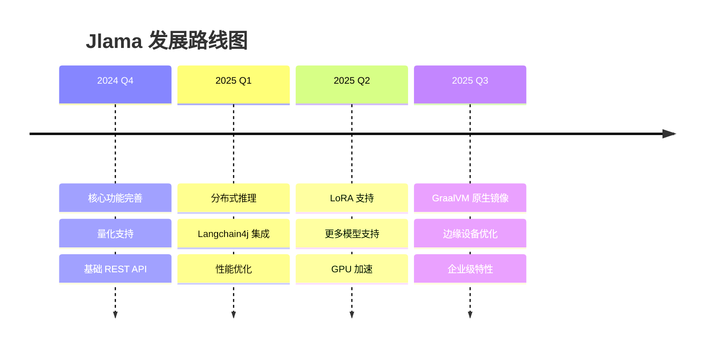

### 计划中的功能

- ✅ 支持更多模型架构
- ✅ 纯 Java tokenizer
- ✅ 量化支持（Q4, Q8）
- ⏳ LoRA 微调支持
- ⏳ GraalVM Native Image 支持
- ⏳ 分布式推理优化
- 📋 GPU 加速（CUDA）
- 📋 更多量化算法
- 📋 模型压缩技术

## 社区和支持

### 获取帮助

- **GitHub Issues**: [https://github.com/tjake/Jlama/issues](https://github.com/tjake/Jlama/issues)
- **讨论区**: [https://github.com/tjake/Jlama/discussions](https://github.com/tjake/Jlama/discussions)
- **Star 项目**: ⭐ [给项目加星](https://github.com/tjake/Jlama)

### 相关资源

- **官方仓库**: [https://github.com/tjake/Jlama](https://github.com/tjake/Jlama)
- **模型仓库**: [https://huggingface.co/tjake](https://huggingface.co/tjake)
- **Langchain4j**: [https://github.com/langchain4j/langchain4j](https://github.com/langchain4j/langchain4j)
- **开发指南**: [DEVELOPER_GUIDE.md](https://github.com/tjake/Jlama/blob/main/DEVELOPER_GUIDE.md)

## 总结

Jlama 为 Java 生态带来了强大的本地 LLM 推理能力：

### 核心优势

1. **纯 Java 实现** - 无需额外的 Python 运行时
2. **高性能** - 利用 Java 21 向量 API 和 SIMD 优化
3. **易于集成** - 与现有 Java 应用无缝集成
4. **生产就绪** - 支持 REST API、分布式推理、容器化部署
5. **生态友好** - Langchain4j 集成、OpenAI 兼容 API

### 适用场景

- **企业应用** - 在 Java 企业应用中集成 AI 能力
- **微服务架构** - 作为独立的推理服务部署
- **边缘计算** - 在资源受限设备上运行
- **私有化部署** - 本地部署，保护数据隐私
- **AI 应用开发** - 快速原型和产品开发

### 开始使用

```bash
# 1. 下载 Jlama
curl -L https://github.com/tjake/Jlama/releases/latest/download/jlama-cli.jar -o jlama-cli.jar

# 2. 启用 Java 预览特性
export JDK_JAVA_OPTIONS="--add-modules jdk.incubator.vector --enable-preview"

# 3. 启动 REST API 服务
java -jar jlama-cli.jar restapi tjake/Llama-3.2-1B-Instruct-JQ4

# 4. 开始使用！
curl -X POST http://localhost:8080/v1/chat/completions \
  -H "Content-Type: application/json" \
  -d '{"model":"tjake/Llama-3.2-1B-Instruct-JQ4","messages":[{"role":"user","content":"Hello!"}]}'
```

通过 Jlama，Java 开发者可以轻松地在自己熟悉的技术栈中构建强大的 AI 应用，无需学习新的语言或框架。立即开始你的 Java AI 之旅吧！

---

**引用和参考**

如果你在研究或项目中使用了 Jlama，请引用：

```bibtex
@misc{jlama2024,
    title = {Jlama: A modern Java inference engine for large language models},
    url = {https://github.com/tjake/jlama},
    author = {T Jake Luciani},
    month = {January},
    year = {2024}
}
```

## License

Jlama 采用 Apache License 2.0 开源协议。
