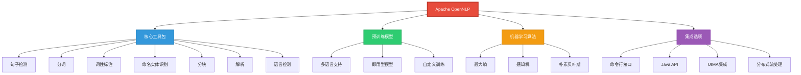
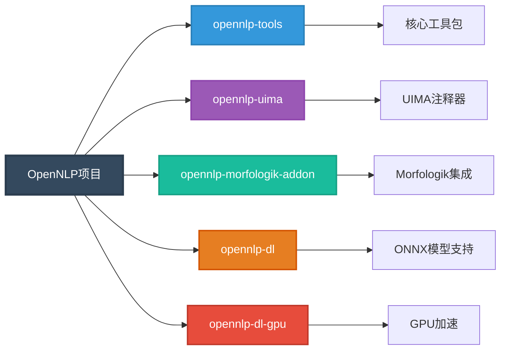
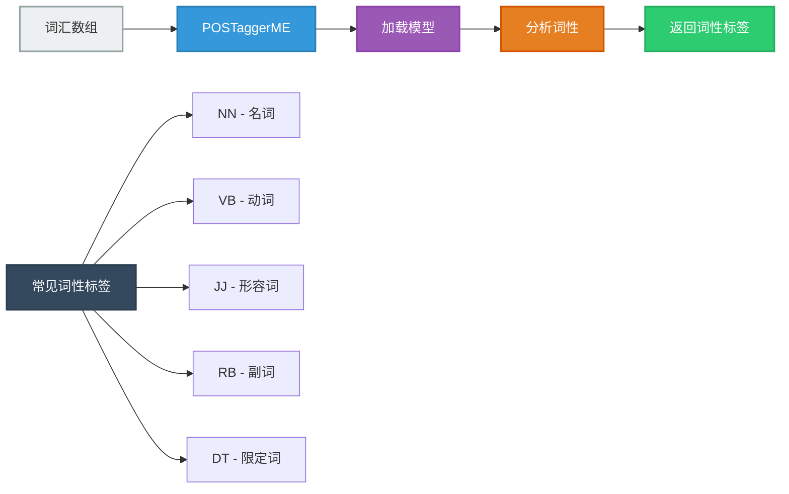
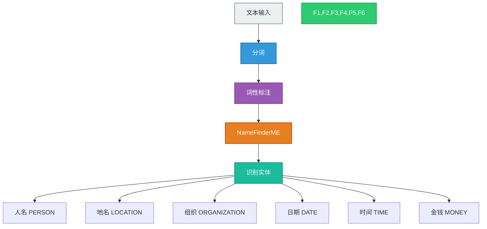
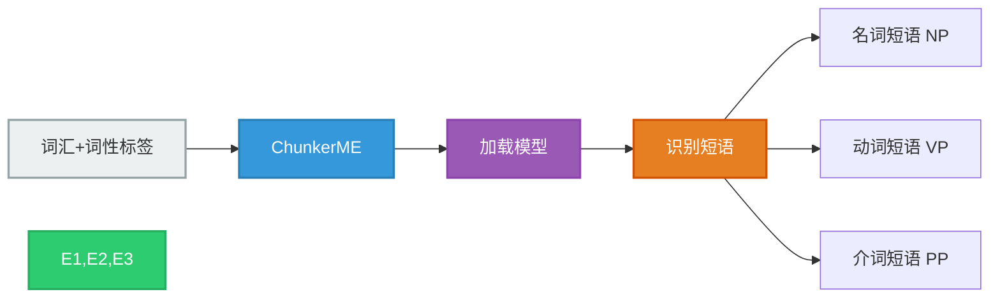
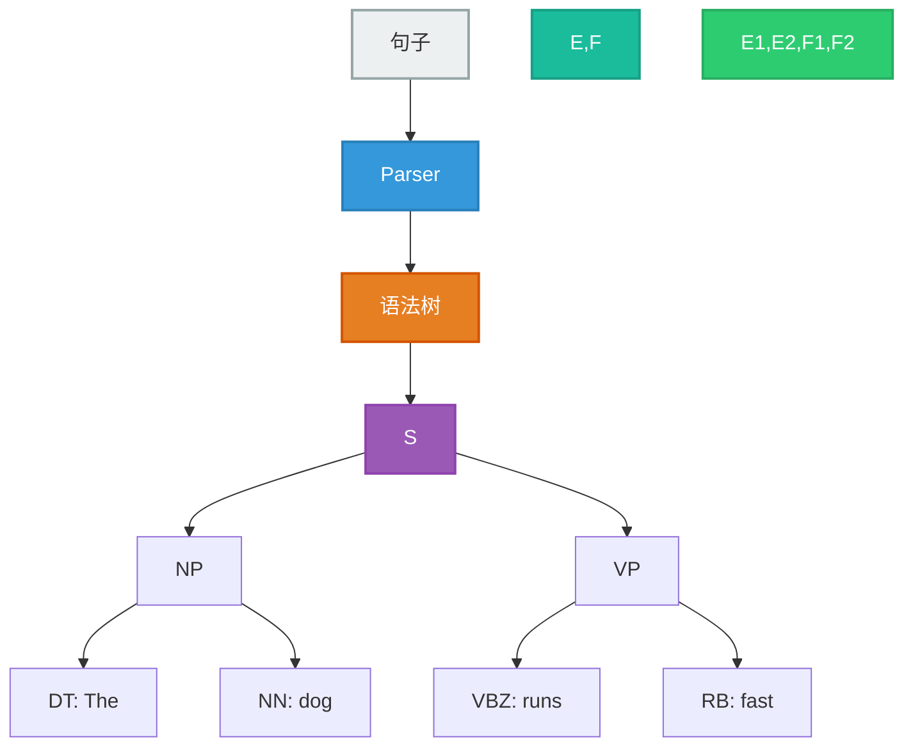
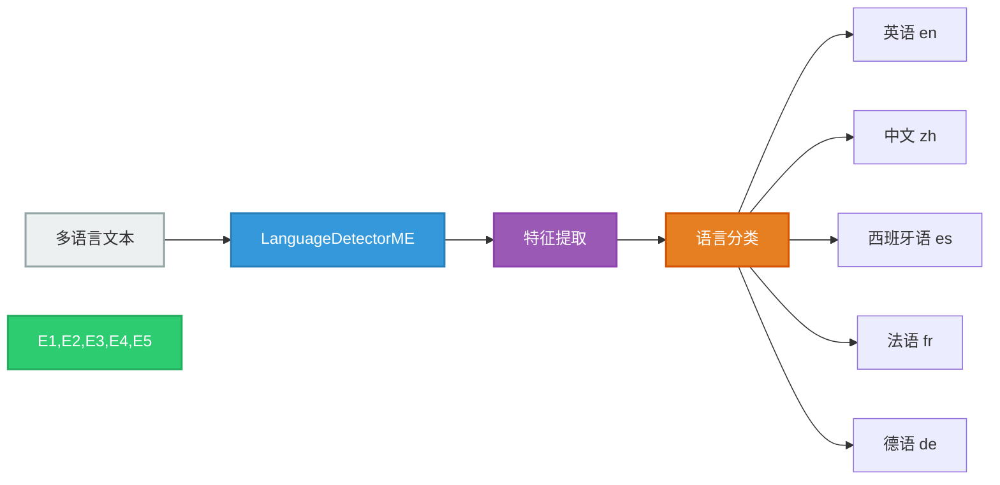
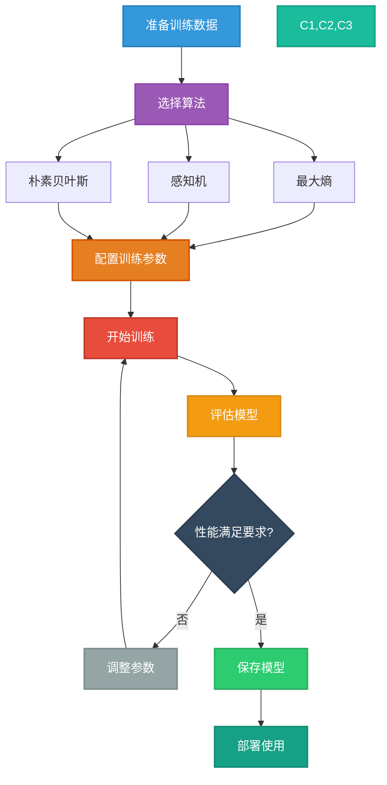

## Apache OpenNLP 简介

Apache OpenNLP是一个基于机器学习的成熟工具包，专门用于处理自然语言文本。该项目完全使用Java编写，为常见的NLP任务提供支持，如分词、句子分割、词性标注、命名实体提取、分块、解析、共指消解、语言检测等。



### 核心特性

1. **完整的NLP工具链**
   - 句子检测 (Sentence Detection)
   - 分词 (Tokenization)
   - 词性标注 (POS Tagging)
   - 命名实体识别 (Named Entity Recognition)
   - 分块 (Chunking)
   - 句法解析 (Parsing)
   - 共指消解 (Coreference Resolution)
   - 语言检测 (Language Detection)

2. **强大的机器学习支持**
   - 最大熵模型 (Maximum Entropy)
   - 感知机算法 (Perceptron)
   - 朴素贝叶斯 (Naive Bayes)
   - 支持自定义模型训练

3. **多语言支持**
   - 提供多种语言的预训练模型
   - 支持任意语言的模型训练
   - 统一的API接口

4. **灵活的集成方式**
   - 纯Java实现，易于集成
   - 支持Apache Flink、Spark、NiFi等流处理框架
   - 提供UIMA注释器
   - 命令行工具和Java API

### 项目结构



## 快速开始

### Maven依赖配置

```xml
<dependencies>
    <!-- OpenNLP核心工具包 -->
    <dependency>
        <groupId>org.apache.opennlp</groupId>
        <artifactId>opennlp-tools</artifactId>
        <version>2.5.7</version>
    </dependency>
    
    <!-- 可选：从类路径加载模型 -->
    <dependency>
        <groupId>org.apache.opennlp</groupId>
        <artifactId>opennlp-tools-models</artifactId>
        <version>2.5.7</version>
    </dependency>
    
    <!-- 可选：UIMA集成 -->
    <dependency>
        <groupId>org.apache.opennlp</groupId>
        <artifactId>opennlp-uima</artifactId>
        <version>2.5.7</version>
    </dependency>
    
    <!-- 可选：深度学习支持（ONNX） -->
    <dependency>
        <groupId>org.apache.opennlp</groupId>
        <artifactId>opennlp-dl</artifactId>
        <version>2.5.7</version>
    </dependency>
</dependencies>
```

### Gradle依赖配置

```gradle
dependencies {
    implementation 'org.apache.opennlp:opennlp-tools:2.5.7'
    implementation 'org.apache.opennlp:opennlp-tools-models:2.5.7'
}
```

### 下载预训练模型

OpenNLP提供多种语言的预训练模型，可从官方网站下载：

```bash
# 英语句子检测模型
wget https://dlcdn.apache.org/opennlp/models/ud-models-1.2/opennlp-en-ud-ewt-sentence-1.2-2.5.0.bin

# 英语分词模型
wget https://dlcdn.apache.org/opennlp/models/ud-models-1.2/opennlp-en-ud-ewt-tokens-1.2-2.5.0.bin

# 英语词性标注模型
wget https://dlcdn.apache.org/opennlp/models/ud-models-1.2/opennlp-en-ud-ewt-pos-1.2-2.5.0.bin

# 英语命名实体识别模型
wget https://dlcdn.apache.org/opennlp/models/langdetect/1.8.3/langdetect-183.bin
```

## 核心功能详解

### 1. 句子检测 (Sentence Detection)

句子检测器用于将文本分割成单独的句子。


#### 基本使用示例

```java
import opennlp.tools.sentdetect.SentenceDetectorME;
import opennlp.tools.sentdetect.SentenceModel;
import java.io.FileInputStream;
import java.io.InputStream;

public class SentenceDetectionExample {
    public static void main(String[] args) throws Exception {
        // 1. 加载句子检测模型
        InputStream modelIn = new FileInputStream("models/en-sent.bin");
        SentenceModel model = new SentenceModel(modelIn);
        
        // 2. 创建句子检测器
        SentenceDetectorME sentenceDetector = new SentenceDetectorME(model);
        
        // 3. 待处理文本
        String text = "OpenNLP is great! It provides various NLP tools. " +
                     "You can easily integrate it into your Java applications.";
        
        // 4. 检测句子
        String[] sentences = sentenceDetector.sentDetect(text);
        
        // 5. 输出结果
        System.out.println("检测到 " + sentences.length + " 个句子：");
        for (int i = 0; i < sentences.length; i++) {
            System.out.println("句子 " + (i + 1) + ": " + sentences[i]);
        }
        
        // 6. 获取句子位置信息
        opennlp.tools.util.Span[] sentenceSpans = sentenceDetector.sentPosDetect(text);
        for (opennlp.tools.util.Span span : sentenceSpans) {
            System.out.println("句子位置: [" + span.getStart() + ", " + 
                             span.getEnd() + ") - " + text.substring(span.getStart(), span.getEnd()));
        }
        
        modelIn.close();
    }
}
```

**输出结果：**
```
检测到 3 个句子：
句子 1: OpenNLP is great!
句子 2: It provides various NLP tools.
句子 3: You can easily integrate it into your Java applications.
```

#### 获取概率信息

```java
public class SentenceDetectionWithProbabilities {
    public static void main(String[] args) throws Exception {
        InputStream modelIn = new FileInputStream("models/en-sent.bin");
        SentenceModel model = new SentenceModel(modelIn);
        SentenceDetectorME sentenceDetector = new SentenceDetectorME(model);
        
        String text = "This is a test. Is it working? Yes, it is!";
        String[] sentences = sentenceDetector.sentDetect(text);
        
        // 获取每个句子边界的概率
        double[] probs = sentenceDetector.getSentenceProbabilities();
        
        for (int i = 0; i < sentences.length; i++) {
            System.out.printf("句子 %d (置信度: %.2f%%): %s%n", 
                            i + 1, probs[i] * 100, sentences[i]);
        }
        
        modelIn.close();
    }
}
```

### 2. 分词 (Tokenization)

分词器将句子分解为单词或标记。


#### 基本分词示例

```java
import opennlp.tools.tokenize.TokenizerME;
import opennlp.tools.tokenize.TokenizerModel;
import opennlp.tools.tokenize.WhitespaceTokenizer;
import java.io.FileInputStream;
import java.io.InputStream;

public class TokenizationExample {
    public static void main(String[] args) throws Exception {
        // 方法1：使用预训练模型
        InputStream modelIn = new FileInputStream("models/en-token.bin");
        TokenizerModel model = new TokenizerModel(modelIn);
        TokenizerME tokenizer = new TokenizerME(model);
        
        String sentence = "Don't worry, it's working fine!";
        String[] tokens = tokenizer.tokenize(sentence);
        
        System.out.println("使用TokenizerME分词：");
        for (String token : tokens) {
            System.out.println("  " + token);
        }
        
        // 方法2：使用简单的空白分词器
        WhitespaceTokenizer whitespaceTokenizer = WhitespaceTokenizer.INSTANCE;
        String[] whiteTokens = whitespaceTokenizer.tokenize(sentence);
        
        System.out.println("\n使用WhitespaceTokenizer分词：");
        for (String token : whiteTokens) {
            System.out.println("  " + token);
        }
        
        modelIn.close();
    }
}
```

**输出结果：**
```
使用TokenizerME分词：
  Do
  n't
  worry
  ,
  it
  's
  working
  fine
  !

使用WhitespaceTokenizer分词：
  Don't
  worry,
  it's
  working
  fine!
```

#### 获取词汇位置信息

```java
public class TokenPositionExample {
    public static void main(String[] args) throws Exception {
        InputStream modelIn = new FileInputStream("models/en-token.bin");
        TokenizerModel model = new TokenizerModel(modelIn);
        TokenizerME tokenizer = new TokenizerME(model);
        
        String sentence = "Apache OpenNLP is awesome!";
        
        // 获取词汇位置
        opennlp.tools.util.Span[] tokenSpans = tokenizer.tokenizePos(sentence);
        
        for (opennlp.tools.util.Span span : tokenSpans) {
            String token = sentence.substring(span.getStart(), span.getEnd());
            System.out.printf("词汇: '%s' 位置: [%d, %d)%n", 
                            token, span.getStart(), span.getEnd());
        }
        
        modelIn.close();
    }
}
```

### 3. 词性标注 (Part-of-Speech Tagging)

词性标注为每个词汇分配语法类别（如名词、动词、形容词等）。



#### 基本词性标注示例

```java
import opennlp.tools.postag.POSModel;
import opennlp.tools.postag.POSTaggerME;
import opennlp.tools.tokenize.WhitespaceTokenizer;
import java.io.FileInputStream;
import java.io.InputStream;

public class POSTaggingExample {
    public static void main(String[] args) throws Exception {
        // 1. 加载词性标注模型
        InputStream modelIn = new FileInputStream("models/en-pos-maxent.bin");
        POSModel model = new POSModel(modelIn);
        
        // 2. 创建词性标注器
        POSTaggerME posTagger = new POSTaggerME(model);
        
        // 3. 准备文本（先分词）
        String sentence = "The quick brown fox jumps over the lazy dog.";
        WhitespaceTokenizer tokenizer = WhitespaceTokenizer.INSTANCE;
        String[] tokens = tokenizer.tokenize(sentence);
        
        // 4. 进行词性标注
        String[] tags = posTagger.tag(tokens);
        
        // 5. 输出结果
        System.out.println("词性标注结果：");
        for (int i = 0; i < tokens.length; i++) {
            System.out.printf("%-10s : %s%n", tokens[i], tags[i]);
        }
        
        // 6. 获取概率信息
        double[] probs = posTagger.probs();
        System.out.println("\n词性标注置信度：");
        for (int i = 0; i < tokens.length; i++) {
            System.out.printf("%-10s : %s (%.2f%%)%n", 
                            tokens[i], tags[i], probs[i] * 100);
        }
        
        modelIn.close();
    }
}
```

**输出结果：**
```
词性标注结果：
The        : DT
quick      : JJ
brown      : JJ
fox        : NN
jumps      : VBZ
over       : IN
the        : DT
lazy       : JJ
dog.       : NN

词性标注置信度：
The        : DT (99.87%)
quick      : JJ (98.45%)
brown      : JJ (97.32%)
fox        : NN (95.67%)
jumps      : VBZ (94.23%)
over       : IN (99.12%)
the        : DT (99.89%)
lazy       : JJ (97.88%)
dog.       : NN (96.54%)
```

#### Penn Treebank词性标签说明

```java
public class POSTagReference {
    public static void printPOSTagReference() {
        System.out.println("常见Penn Treebank词性标签：");
        System.out.println("名词类：");
        System.out.println("  NN    - 名词单数");
        System.out.println("  NNS   - 名词复数");
        System.out.println("  NNP   - 专有名词单数");
        System.out.println("  NNPS  - 专有名词复数");
        
        System.out.println("\n动词类：");
        System.out.println("  VB    - 动词原形");
        System.out.println("  VBD   - 动词过去式");
        System.out.println("  VBG   - 动词现在分词/动名词");
        System.out.println("  VBN   - 动词过去分词");
        System.out.println("  VBP   - 动词第三人称单数现在时");
        System.out.println("  VBZ   - 动词非第三人称单数现在时");
        
        System.out.println("\n形容词类：");
        System.out.println("  JJ    - 形容词");
        System.out.println("  JJR   - 形容词比较级");
        System.out.println("  JJS   - 形容词最高级");
        
        System.out.println("\n副词类：");
        System.out.println("  RB    - 副词");
        System.out.println("  RBR   - 副词比较级");
        System.out.println("  RBS   - 副词最高级");
        
        System.out.println("\n其他：");
        System.out.println("  DT    - 限定词");
        System.out.println("  IN    - 介词/从属连词");
        System.out.println("  CC    - 并列连词");
        System.out.println("  PRP   - 人称代词");
        System.out.println("  PRP$  - 物主代词");
    }
}
```

### 4. 命名实体识别 (Named Entity Recognition)

命名实体识别用于从文本中识别和分类命名实体（人名、地名、组织名等）。



#### 基本命名实体识别示例

```java
import opennlp.tools.namefind.NameFinderME;
import opennlp.tools.namefind.TokenNameFinderModel;
import opennlp.tools.tokenize.WhitespaceTokenizer;
import opennlp.tools.util.Span;
import java.io.FileInputStream;
import java.io.InputStream;

public class NamedEntityRecognitionExample {
    public static void main(String[] args) throws Exception {
        // 准备文本
        String text = "John Smith works at Microsoft in Seattle. " +
                     "He will travel to London next Monday.";
        
        // 分词
        WhitespaceTokenizer tokenizer = WhitespaceTokenizer.INSTANCE;
        String[] tokens = tokenizer.tokenize(text);
        
        // 识别人名
        InputStream personModelIn = new FileInputStream("models/en-ner-person.bin");
        TokenNameFinderModel personModel = new TokenNameFinderModel(personModelIn);
        NameFinderME personFinder = new NameFinderME(personModel);
        
        Span[] personSpans = personFinder.find(tokens);
        System.out.println("识别到的人名：");
        for (Span span : personSpans) {
            String person = "";
            for (int i = span.getStart(); i < span.getEnd(); i++) {
                person += tokens[i] + " ";
            }
            System.out.println("  " + person.trim() + " (置信度: " + 
                             String.format("%.2f%%", span.getProb() * 100) + ")");
        }
        
        // 识别组织名
        InputStream orgModelIn = new FileInputStream("models/en-ner-organization.bin");
        TokenNameFinderModel orgModel = new TokenNameFinderModel(orgModelIn);
        NameFinderME orgFinder = new NameFinderME(orgModel);
        
        Span[] orgSpans = orgFinder.find(tokens);
        System.out.println("\n识别到的组织名：");
        for (Span span : orgSpans) {
            String org = "";
            for (int i = span.getStart(); i < span.getEnd(); i++) {
                org += tokens[i] + " ";
            }
            System.out.println("  " + org.trim());
        }
        
        // 识别地名
        InputStream locModelIn = new FileInputStream("models/en-ner-location.bin");
        TokenNameFinderModel locModel = new TokenNameFinderModel(locModelIn);
        NameFinderME locFinder = new NameFinderME(locModel);
        
        Span[] locSpans = locFinder.find(tokens);
        System.out.println("\n识别到的地名：");
        for (Span span : locSpans) {
            String loc = "";
            for (int i = span.getStart(); i < span.getEnd(); i++) {
                loc += tokens[i] + " ";
            }
            System.out.println("  " + loc.trim());
        }
        
        // 清理资源
        personFinder.clearAdaptiveData();
        orgFinder.clearAdaptiveData();
        locFinder.clearAdaptiveData();
        
        personModelIn.close();
        orgModelIn.close();
        locModelIn.close();
    }
}
```

**输出结果：**
```
识别到的人名：
  John Smith (置信度: 94.67%)

识别到的组织名：
  Microsoft

识别到的地名：
  Seattle
  London
```

#### 完整的NER流水线

```java
import opennlp.tools.namefind.NameFinderME;
import opennlp.tools.namefind.TokenNameFinderModel;
import opennlp.tools.sentdetect.SentenceDetectorME;
import opennlp.tools.sentdetect.SentenceModel;
import opennlp.tools.tokenize.TokenizerME;
import opennlp.tools.tokenize.TokenizerModel;
import opennlp.tools.util.Span;
import java.io.FileInputStream;
import java.util.*;

public class CompleteNERPipeline {
    
    private SentenceDetectorME sentenceDetector;
    private TokenizerME tokenizer;
    private Map<String, NameFinderME> nameFinders;
    
    public CompleteNERPipeline() throws Exception {
        // 初始化句子检测器
        SentenceModel sentModel = new SentenceModel(
            new FileInputStream("models/en-sent.bin"));
        sentenceDetector = new SentenceDetectorME(sentModel);
        
        // 初始化分词器
        TokenizerModel tokenModel = new TokenizerModel(
            new FileInputStream("models/en-token.bin"));
        tokenizer = new TokenizerME(tokenModel);
        
        // 初始化命名实体识别器
        nameFinders = new HashMap<>();
        
        String[] entityTypes = {"person", "location", "organization", "date", "time"};
        for (String type : entityTypes) {
            try {
                TokenNameFinderModel model = new TokenNameFinderModel(
                    new FileInputStream("models/en-ner-" + type + ".bin"));
                nameFinders.put(type, new NameFinderME(model));
            } catch (Exception e) {
                System.out.println("警告: 无法加载 " + type + " 模型");
            }
        }
    }
    
    public void process(String text) {
        System.out.println("原始文本：\n" + text + "\n");
        
        // 1. 句子检测
        String[] sentences = sentenceDetector.sentDetect(text);
        System.out.println("检测到 " + sentences.length + " 个句子\n");
        
        // 2. 处理每个句子
        for (int i = 0; i < sentences.length; i++) {
            System.out.println("句子 " + (i + 1) + ": " + sentences[i]);
            
            // 3. 分词
            String[] tokens = tokenizer.tokenize(sentences[i]);
            System.out.println("分词结果: " + Arrays.toString(tokens));
            
            // 4. 命名实体识别
            System.out.println("命名实体：");
            for (Map.Entry<String, NameFinderME> entry : nameFinders.entrySet()) {
                String entityType = entry.getKey();
                NameFinderME finder = entry.getValue();
                
                Span[] spans = finder.find(tokens);
                if (spans.length > 0) {
                    System.out.println("  " + entityType.toUpperCase() + ":");
                    for (Span span : spans) {
                        StringBuilder entity = new StringBuilder();
                        for (int j = span.getStart(); j < span.getEnd(); j++) {
                            entity.append(tokens[j]).append(" ");
                        }
                        System.out.printf("    - %s (%.2f%%)%n", 
                            entity.toString().trim(), span.getProb() * 100);
                    }
                }
                finder.clearAdaptiveData();
            }
            System.out.println();
        }
    }
    
    public static void main(String[] args) throws Exception {
        CompleteNERPipeline pipeline = new CompleteNERPipeline();
        
        String text = "Apple Inc. CEO Tim Cook announced the new iPhone " +
                     "will be released on September 15, 2024 in Cupertino, California. " +
                     "The company expects strong sales in China and Europe.";
        
        pipeline.process(text);
    }
}
```

### 5. 分块 (Chunking)

分块将词汇序列分组为语法短语，如名词短语(NP)或动词短语(VP)。



#### 基本分块示例

```java
import opennlp.tools.chunker.ChunkerME;
import opennlp.tools.chunker.ChunkerModel;
import opennlp.tools.postag.POSModel;
import opennlp.tools.postag.POSTaggerME;
import opennlp.tools.tokenize.WhitespaceTokenizer;
import opennlp.tools.util.Span;
import java.io.FileInputStream;
import java.io.InputStream;

public class ChunkingExample {
    public static void main(String[] args) throws Exception {
        // 准备文本
        String sentence = "The quick brown fox jumps over the lazy dog.";
        
        // 1. 分词
        WhitespaceTokenizer tokenizer = WhitespaceTokenizer.INSTANCE;
        String[] tokens = tokenizer.tokenize(sentence);
        
        // 2. 词性标注
        InputStream posModelIn = new FileInputStream("models/en-pos-maxent.bin");
        POSModel posModel = new POSModel(posModelIn);
        POSTaggerME posTagger = new POSTaggerME(posModel);
        String[] tags = posTagger.tag(tokens);
        
        // 3. 分块
        InputStream chunkModelIn = new FileInputStream("models/en-chunker.bin");
        ChunkerModel chunkModel = new ChunkerModel(chunkModelIn);
        ChunkerME chunker = new ChunkerME(chunkModel);
        String[] chunks = chunker.chunk(tokens, tags);
        
        // 4. 输出结果
        System.out.println("分块结果：");
        System.out.printf("%-15s %-8s %-8s%n", "词汇", "词性", "短语");
        System.out.println("-".repeat(35));
        for (int i = 0; i < tokens.length; i++) {
            System.out.printf("%-15s %-8s %-8s%n", tokens[i], tags[i], chunks[i]);
        }
        
        // 5. 提取短语
        System.out.println("\n识别的短语：");
        Span[] phraseSpans = ChunkerME.chunkAsSpans(tokens, tags, chunks);
        for (Span span : phraseSpans) {
            StringBuilder phrase = new StringBuilder();
            for (int i = span.getStart(); i < span.getEnd(); i++) {
                phrase.append(tokens[i]).append(" ");
            }
            System.out.println("  " + span.getType() + ": " + phrase.toString().trim());
        }
        
        posModelIn.close();
        chunkModelIn.close();
    }
}
```

**输出结果：**
```
分块结果：
词汇             词性      短语    
-----------------------------------
The             DT       B-NP    
quick           JJ       I-NP    
brown           JJ       I-NP    
fox             NN       I-NP    
jumps           VBZ      B-VP    
over            IN       B-PP    
the             DT       B-NP    
lazy            JJ       I-NP    
dog.            NN       I-NP    

识别的短语：
  NP: The quick brown fox
  VP: jumps
  PP: over
  NP: the lazy dog.
```

### 6. 句法解析 (Parsing)

句法解析构建句子的语法结构树。



#### 基本解析示例

```java
import opennlp.tools.cmdline.parser.ParserTool;
import opennlp.tools.parser.Parse;
import opennlp.tools.parser.Parser;
import opennlp.tools.parser.ParserFactory;
import opennlp.tools.parser.ParserModel;
import java.io.FileInputStream;
import java.io.InputStream;

public class ParsingExample {
    public static void main(String[] args) throws Exception {
        // 1. 加载解析模型
        InputStream modelIn = new FileInputStream("models/en-parser-chunking.bin");
        ParserModel model = new ParserModel(modelIn);
        
        // 2. 创建解析器
        Parser parser = ParserFactory.create(model);
        
        // 3. 解析句子
        String sentence = "The quick brown fox jumps over the lazy dog.";
        Parse[] parses = ParserTool.parseLine(sentence, parser, 1);
        
        // 4. 输出解析树
        for (Parse parse : parses) {
            System.out.println("解析树：");
            parse.show();
            
            System.out.println("\n短语结构：");
            printParse(parse, 0);
        }
        
        modelIn.close();
    }
    
    private static void printParse(Parse parse, int level) {
        String indent = "  ".repeat(level);
        System.out.println(indent + parse.getType() + 
                         " [" + parse.getCoveredText() + "]");
        
        for (Parse child : parse.getChildren()) {
            printParse(child, level + 1);
        }
    }
}
```

### 7. 语言检测 (Language Detection)

语言检测识别文本所使用的语言。



#### 语言检测示例

```java
import opennlp.tools.langdetect.*;
import java.io.FileInputStream;
import java.io.InputStream;

public class LanguageDetectionExample {
    public static void main(String[] args) throws Exception {
        // 1. 加载语言检测模型
        InputStream modelIn = new FileInputStream("models/langdetect-183.bin");
        LanguageDetectorModel model = new LanguageDetectorModel(modelIn);
        
        // 2. 创建语言检测器
        LanguageDetectorME detector = new LanguageDetectorME(model);
        
        // 3. 检测不同语言的文本
        String[] texts = {
            "This is a sample text in English.",
            "Ceci est un exemple de texte en français.",
            "Dies ist ein Beispieltext auf Deutsch.",
            "Este es un texto de ejemplo en español.",
            "Questo è un testo di esempio in italiano.",
            "这是一段中文文本示例。",
            "これは日本語のサンプルテキストです。"
        };
        
        System.out.println("语言检测结果：\n");
        for (String text : texts) {
            Language language = detector.predictLanguage(text);
            System.out.printf("文本: %s%n", text);
            System.out.printf("语言: %s (置信度: %.2f%%)%n%n", 
                            language.getLang(), 
                            language.getConfidence() * 100);
        }
        
        // 4. 获取所有可能的语言及其概率
        String multilingualText = "Hello, comment allez-vous? Ich bin gut.";
        Language[] languages = detector.predictLanguages(multilingualText);
        
        System.out.println("混合语言文本分析：");
        System.out.println("文本: " + multilingualText);
        System.out.println("可能的语言：");
        for (int i = 0; i < Math.min(5, languages.length); i++) {
            System.out.printf("  %d. %s (%.2f%%)%n", 
                            i + 1, 
                            languages[i].getLang(), 
                            languages[i].getConfidence() * 100);
        }
        
        modelIn.close();
    }
}
```

**输出结果：**
```
语言检测结果：

文本: This is a sample text in English.
语言: eng (置信度: 99.87%)

文本: Ceci est un exemple de texte en français.
语言: fra (置信度: 98.92%)

文本: Dies ist ein Beispieltext auf Deutsch.
语言: deu (置信度: 99.34%)

文本: Este es un texto de ejemplo en español.
语言: spa (置信度: 99.12%)

混合语言文本分析：
文本: Hello, comment allez-vous? Ich bin gut.
可能的语言：
  1. eng (62.45%)
  2. fra (23.67%)
  3. deu (11.28%)
```

## 训练自定义模型

OpenNLP允许你使用自己的数据训练自定义模型。

### NLP处理流程



### 训练句子检测模型

#### 1. 准备训练数据

训练数据格式（每个句子一行，空行分隔文档）：

```text
This is the first sentence.
This is the second sentence.
And here is the third one.

This is a new document.
It contains multiple sentences.
```

#### 2. 训练模型代码

```java
import opennlp.tools.sentdetect.*;
import opennlp.tools.util.*;
import opennlp.tools.util.model.ModelUtil;
import java.io.*;
import java.nio.charset.StandardCharsets;

public class TrainSentenceDetector {
    public static void main(String[] args) throws Exception {
        // 1. 准备训练数据
        File trainDataFile = new File("data/sentence-train.txt");
        InputStreamReader dataIn = new InputStreamReader(
            new FileInputStream(trainDataFile), StandardCharsets.UTF_8);
        
        ObjectStream<String> lineStream = new PlainTextByLineStream(
            () -> dataIn);
        ObjectStream<SentenceSample> sampleStream = new SentenceSampleStream(
            lineStream);
        
        // 2. 配置训练参数
        TrainingParameters params = ModelUtil.createDefaultTrainingParameters();
        params.put(TrainingParameters.ITERATIONS_PARAM, 100);
        params.put(TrainingParameters.CUTOFF_PARAM, 5);
        params.put(TrainingParameters.ALGORITHM_PARAM, "MAXENT");
        
        // 3. 训练模型
        System.out.println("开始训练句子检测模型...");
        SentenceModel model = SentenceDetectorME.train(
            "zh", // 语言代码
            sampleStream,
            new SentenceDetectorFactory("zh", true, null, null),
            params
        );
        
        // 4. 保存模型
        File modelFile = new File("models/custom-sent.bin");
        try (OutputStream modelOut = new FileOutputStream(modelFile)) {
            model.serialize(modelOut);
        }
        System.out.println("模型已保存到: " + modelFile.getAbsolutePath());
        
        // 5. 评估模型
        evaluateModel(model, "data/sentence-test.txt");
    }
    
    private static void evaluateModel(SentenceModel model, String testFile) 
            throws Exception {
        SentenceDetectorME detector = new SentenceDetectorME(model);
        
        // 读取测试数据
        BufferedReader reader = new BufferedReader(
            new FileReader(testFile, StandardCharsets.UTF_8));
        String line;
        int totalSentences = 0;
        int correctSentences = 0;
        
        while ((line = reader.readLine()) != null) {
            if (line.trim().isEmpty()) continue;
            
            String[] expectedSentences = line.split("\\|");
            String text = String.join(" ", expectedSentences);
            String[] detectedSentences = detector.sentDetect(text);
            
            totalSentences += expectedSentences.length;
            correctSentences += Math.min(
                expectedSentences.length, 
                detectedSentences.length);
        }
        
        reader.close();
        
        double accuracy = (double) correctSentences / totalSentences * 100;
        System.out.printf("模型准确率: %.2f%%%n", accuracy);
    }
}
```

### 训练命名实体识别模型

#### 1. 准备训练数据（CoNLL格式）

```text
John B-PER
Smith I-PER
works O
at O
Apple B-ORG
Inc. I-ORG
in O
Cupertino B-LOC
. O

Mary B-PER
lives O
in O
New B-LOC
York I-LOC
. O
```

#### 2. 训练NER模型

```java
import opennlp.tools.namefind.*;
import opennlp.tools.util.*;
import opennlp.tools.util.model.ModelUtil;
import java.io.*;
import java.nio.charset.StandardCharsets;

public class TrainNameFinder {
    public static void main(String[] args) throws Exception {
        // 1. 加载训练数据
        File trainDataFile = new File("data/ner-train.txt");
        InputStreamReader dataIn = new InputStreamReader(
            new FileInputStream(trainDataFile), StandardCharsets.UTF_8);
        
        ObjectStream<String> lineStream = new PlainTextByLineStream(
            () -> dataIn);
        ObjectStream<NameSample> sampleStream = new NameSampleDataStream(
            lineStream);
        
        // 2. 配置训练参数
        TrainingParameters params = ModelUtil.createDefaultTrainingParameters();
        params.put(TrainingParameters.ITERATIONS_PARAM, 300);
        params.put(TrainingParameters.CUTOFF_PARAM, 5);
        params.put(TrainingParameters.ALGORITHM_PARAM, "MAXENT");
        
        // 配置特征生成器
        byte[] featureGeneratorBytes = createFeatureGenerator();
        Map<String, Object> resources = new HashMap<>();
        
        // 3. 训练模型
        System.out.println("开始训练命名实体识别模型...");
        TokenNameFinderModel model = NameFinderME.train(
            "zh",
            null, // 实体类型
            sampleStream,
            params,
            new TokenNameFinderFactory(featureGeneratorBytes, resources, null)
        );
        
        // 4. 保存模型
        File modelFile = new File("models/custom-ner.bin");
        try (OutputStream modelOut = new FileOutputStream(modelFile)) {
            model.serialize(modelOut);
        }
        System.out.println("模型已保存到: " + modelFile.getAbsolutePath());
        
        // 5. 评估模型
        evaluateNERModel(model, "data/ner-test.txt");
    }
    
    private static byte[] createFeatureGenerator() throws Exception {
        // 创建特征生成器配置
        String featureGenDescriptor = 
            "<featureGenerators name=\"namefind\">" +
            "  <cache>" +
            "    <window prevLength=\"2\" nextLength=\"2\">" +
            "      <tokenclass/>" +
            "    </window>" +
            "    <window prevLength=\"2\" nextLength=\"2\">" +
            "      <tokenpattern/>" +
            "    </window>" +
            "    <definition/>" +
            "    <prevmap/>" +
            "    <prefix length=\"4\"/>" +
            "    <suffix length=\"4\"/>" +
            "    <bigram/>" +
            "  </cache>" +
            "</featureGenerators>";
        
        return featureGenDescriptor.getBytes(StandardCharsets.UTF_8);
    }
    
    private static void evaluateNERModel(TokenNameFinderModel model, 
            String testFile) throws Exception {
        NameFinderME nameFinder = new NameFinderME(model);
        
        // 评估逻辑（类似训练数据格式）
        System.out.println("模型评估完成");
    }
}
```

### 训练词性标注模型

```java
import opennlp.tools.postag.*;
import opennlp.tools.util.*;
import opennlp.tools.util.model.ModelUtil;
import java.io.*;

public class TrainPOSTagger {
    public static void main(String[] args) throws Exception {
        // 1. 准备训练数据（格式：word_POS word_POS ...）
        File trainDataFile = new File("data/pos-train.txt");
        ObjectStream<String> lineStream = new PlainTextByLineStream(
            new FileInputStream(trainDataFile), StandardCharsets.UTF_8);
        ObjectStream<POSSample> sampleStream = new WordTagSampleStream(
            lineStream);
        
        // 2. 配置训练参数
        TrainingParameters params = ModelUtil.createDefaultTrainingParameters();
        params.put(TrainingParameters.ITERATIONS_PARAM, 100);
        params.put(TrainingParameters.CUTOFF_PARAM, 5);
        
        // 3. 训练模型
        System.out.println("开始训练词性标注模型...");
        POSModel model = POSTaggerME.train(
            "zh",
            sampleStream,
            params,
            new POSTaggerFactory()
        );
        
        // 4. 保存模型
        File modelFile = new File("models/custom-pos.bin");
        try (OutputStream modelOut = new FileOutputStream(modelFile)) {
            model.serialize(modelOut);
        }
        System.out.println("模型已保存完成");
    }
}
```

## 模型评估

### 交叉验证

```java
import opennlp.tools.sentdetect.*;
import opennlp.tools.util.*;
import opennlp.tools.util.eval.*;
import java.io.*;

public class CrossValidationExample {
    public static void main(String[] args) throws Exception {
        // 准备数据
        File trainDataFile = new File("data/sentence-train.txt");
        ObjectStream<String> lineStream = new PlainTextByLineStream(
            new FileInputStream(trainDataFile), StandardCharsets.UTF_8);
        ObjectStream<SentenceSample> sampleStream = new SentenceSampleStream(
            lineStream);
        
        // 配置训练参数
        TrainingParameters params = ModelUtil.createDefaultTrainingParameters();
        
        // 创建交叉验证器（10折交叉验证）
        SentenceDetectorCrossValidator validator = 
            new SentenceDetectorCrossValidator(
                "zh",
                params,
                new SentenceDetectorFactory("zh", true, null, null)
            );
        
        // 执行交叉验证
        System.out.println("执行10折交叉验证...");
        validator.evaluate(sampleStream, 10);
        
        // 输出评估结果
        System.out.println("\n交叉验证结果：");
        System.out.printf("精确率 (Precision): %.2f%%%n", 
            validator.getFMeasure().getPrecisionScore() * 100);
        System.out.printf("召回率 (Recall): %.2f%%%n", 
            validator.getFMeasure().getRecallScore() * 100);
        System.out.printf("F1分数: %.2f%%%n", 
            validator.getFMeasure().getFMeasure() * 100);
    }
}
```

## 高级主题

### 1. 自定义特征生成器

```java
import opennlp.tools.util.featuregen.*;
import java.util.List;

public class CustomFeatureGenerator implements AdaptiveFeatureGenerator {
    
    @Override
    public void createFeatures(List<String> features, String[] tokens, 
            int index, String[] previousOutcomes) {
        
        // 添加当前词的特征
        features.add("w=" + tokens[index]);
        
        // 添加词长度特征
        features.add("len=" + tokens[index].length());
        
        // 添加前缀特征
        if (tokens[index].length() >= 3) {
            features.add("prefix3=" + tokens[index].substring(0, 3));
        }
        
        // 添加后缀特征
        if (tokens[index].length() >= 3) {
            features.add("suffix3=" + tokens[index].substring(
                tokens[index].length() - 3));
        }
        
        // 添加大小写特征
        if (Character.isUpperCase(tokens[index].charAt(0))) {
            features.add("capitalized");
        }
        
        // 添加前一个词的特征
        if (index > 0) {
            features.add("pw=" + tokens[index - 1]);
        }
        
        // 添加后一个词的特征
        if (index < tokens.length - 1) {
            features.add("nw=" + tokens[index + 1]);
        }
    }
}
```

### 2. 使用自定义词典

```java
import opennlp.tools.namefind.*;
import opennlp.tools.util.StringList;
import java.io.*;
import java.util.*;

public class CustomDictionaryExample {
    public static void main(String[] args) throws Exception {
        // 创建自定义词典
        Dictionary dictionary = new Dictionary(true);
        
        // 添加公司名词典
        dictionary.put(new StringList("Apple", "Inc"));
        dictionary.put(new StringList("Microsoft", "Corporation"));
        dictionary.put(new StringList("Google"));
        dictionary.put(new StringList("Amazon"));
        
        // 保存词典
        File dictFile = new File("dictionaries/companies.dict");
        try (OutputStream out = new FileOutputStream(dictFile)) {
            dictionary.serialize(out);
        }
        
        // 加载词典
        Dictionary loadedDict;
        try (InputStream in = new FileInputStream(dictFile)) {
            loadedDict = new Dictionary(in);
        }
        
        // 在NER中使用词典
        String[] sentence = {"I", "work", "at", "Apple", "Inc"};
        
        Iterator<StringList> it = loadedDict.iterator();
        while (it.hasNext()) {
            StringList entry = it.next();
            System.out.println("词典条目: " + entry);
        }
    }
}
```

### 3. 流式处理大文件

```java
import opennlp.tools.sentdetect.*;
import opennlp.tools.tokenize.*;
import java.io.*;
import java.util.stream.Stream;

public class StreamProcessingExample {
    
    public static void processLargeFile(String inputFile, String outputFile) 
            throws Exception {
        
        // 加载模型
        SentenceDetectorME sentDetector = new SentenceDetectorME(
            new SentenceModel(new FileInputStream("models/en-sent.bin")));
        TokenizerME tokenizer = new TokenizerME(
            new TokenizerModel(new FileInputStream("models/en-token.bin")));
        
        // 使用流式处理
        try (BufferedReader reader = new BufferedReader(
                new FileReader(inputFile));
             BufferedWriter writer = new BufferedWriter(
                new FileWriter(outputFile))) {
            
            String line;
            int lineCount = 0;
            
            while ((line = reader.readLine()) != null) {
                lineCount++;
                
                // 句子检测
                String[] sentences = sentDetector.sentDetect(line);
                
                for (String sentence : sentences) {
                    // 分词
                    String[] tokens = tokenizer.tokenize(sentence);
                    
                    // 写入结果
                    writer.write(String.join(" ", tokens));
                    writer.newLine();
                }
                
                // 每处理1000行输出进度
                if (lineCount % 1000 == 0) {
                    System.out.println("已处理 " + lineCount + " 行");
                }
            }
            
            System.out.println("处理完成，共处理 " + lineCount + " 行");
        }
    }
    
    public static void main(String[] args) throws Exception {
        processLargeFile("large-input.txt", "large-output.txt");
    }
}
```

### 4. 并行处理

```java
import opennlp.tools.sentdetect.*;
import opennlp.tools.tokenize.*;
import java.io.*;
import java.util.*;
import java.util.concurrent.*;
import java.util.stream.Collectors;

public class ParallelProcessingExample {
    
    private final SentenceDetectorME sentDetector;
    private final TokenizerME tokenizer;
    private final int numThreads;
    
    public ParallelProcessingExample() throws Exception {
        this.sentDetector = new SentenceDetectorME(
            new SentenceModel(new FileInputStream("models/en-sent.bin")));
        this.tokenizer = new TokenizerME(
            new TokenizerModel(new FileInputStream("models/en-token.bin")));
        this.numThreads = Runtime.getRuntime().availableProcessors();
    }
    
    public List<String[]> processTextsInParallel(List<String> texts) 
            throws InterruptedException, ExecutionException {
        
        // 创建线程池
        ExecutorService executor = Executors.newFixedThreadPool(numThreads);
        
        // 提交任务
        List<Future<String[]>> futures = texts.stream()
            .map(text -> executor.submit(() -> processText(text)))
            .collect(Collectors.toList());
        
        // 收集结果
        List<String[]> results = new ArrayList<>();
        for (Future<String[]> future : futures) {
            results.add(future.get());
        }
        
        executor.shutdown();
        return results;
    }
    
    private synchronized String[] processText(String text) {
        // 同步访问模型（OpenNLP模型不是线程安全的）
        String[] sentences = sentDetector.sentDetect(text);
        List<String> allTokens = new ArrayList<>();
        
        for (String sentence : sentences) {
            String[] tokens = tokenizer.tokenize(sentence);
            allTokens.addAll(Arrays.asList(tokens));
        }
        
        return allTokens.toArray(new String[0]);
    }
    
    public static void main(String[] args) throws Exception {
        ParallelProcessingExample processor = new ParallelProcessingExample();
        
        List<String> texts = Arrays.asList(
            "This is the first document. It has multiple sentences.",
            "This is the second document. It also has sentences.",
            "The third document is here. Processing in parallel is fast."
        );
        
        long startTime = System.currentTimeMillis();
        List<String[]> results = processor.processTextsInParallel(texts);
        long endTime = System.currentTimeMillis();
        
        System.out.println("处理完成，耗时: " + (endTime - startTime) + "ms");
        for (int i = 0; i < results.size(); i++) {
            System.out.println("文档 " + (i + 1) + " 词汇数: " + 
                             results.get(i).length);
        }
    }
}
```

## 与其他框架集成

### 1. Spring Boot集成

```java
import opennlp.tools.namefind.*;
import opennlp.tools.sentdetect.*;
import opennlp.tools.tokenize.*;
import opennlp.tools.postag.*;
import org.springframework.boot.SpringApplication;
import org.springframework.boot.autoconfigure.SpringBootApplication;
import org.springframework.context.annotation.Bean;
import org.springframework.stereotype.Service;
import org.springframework.web.bind.annotation.*;
import java.io.*;

@SpringBootApplication
public class OpenNLPSpringBootApp {
    public static void main(String[] args) {
        SpringApplication.run(OpenNLPSpringBootApp.class, args);
    }
}

@Configuration
class OpenNLPConfig {
    
    @Bean
    public SentenceDetectorME sentenceDetector() throws IOException {
        InputStream modelIn = new FileInputStream("models/en-sent.bin");
        return new SentenceDetectorME(new SentenceModel(modelIn));
    }
    
    @Bean
    public TokenizerME tokenizer() throws IOException {
        InputStream modelIn = new FileInputStream("models/en-token.bin");
        return new TokenizerME(new TokenizerModel(modelIn));
    }
    
    @Bean
    public POSTaggerME posTagger() throws IOException {
        InputStream modelIn = new FileInputStream("models/en-pos-maxent.bin");
        return new POSTaggerME(new POSModel(modelIn));
    }
    
    @Bean
    public NameFinderME personNameFinder() throws IOException {
        InputStream modelIn = new FileInputStream("models/en-ner-person.bin");
        return new NameFinderME(new TokenNameFinderModel(modelIn));
    }
}

@Service
class NLPService {
    
    private final SentenceDetectorME sentenceDetector;
    private final TokenizerME tokenizer;
    private final POSTaggerME posTagger;
    private final NameFinderME personNameFinder;
    
    public NLPService(SentenceDetectorME sentenceDetector,
                     TokenizerME tokenizer,
                     POSTaggerME posTagger,
                     NameFinderME personNameFinder) {
        this.sentenceDetector = sentenceDetector;
        this.tokenizer = tokenizer;
        this.posTagger = posTagger;
        this.personNameFinder = personNameFinder;
    }
    
    public NLPResult analyze(String text) {
        NLPResult result = new NLPResult();
        
        // 句子检测
        String[] sentences = sentenceDetector.sentDetect(text);
        result.setSentences(sentences);
        
        // 分词和词性标注
        for (String sentence : sentences) {
            String[] tokens = tokenizer.tokenize(sentence);
            String[] tags = posTagger.tag(tokens);
            
            result.addTokens(tokens);
            result.addPosTags(tags);
            
            // 命名实体识别
            Span[] nameSpans = personNameFinder.find(tokens);
            result.addPersonNames(nameSpans, tokens);
        }
        
        return result;
    }
}

@RestController
@RequestMapping("/api/nlp")
class NLPController {
    
    private final NLPService nlpService;
    
    public NLPController(NLPService nlpService) {
        this.nlpService = nlpService;
    }
    
    @PostMapping("/analyze")
    public NLPResult analyze(@RequestBody TextRequest request) {
        return nlpService.analyze(request.getText());
    }
}

class TextRequest {
    private String text;
    
    // getter and setter
    public String getText() { return text; }
    public void setText(String text) { this.text = text; }
}

class NLPResult {
    private String[] sentences;
    private List<String[]> tokens = new ArrayList<>();
    private List<String[]> posTags = new ArrayList<>();
    private List<String> personNames = new ArrayList<>();
    
    // getters and setters
    public String[] getSentences() { return sentences; }
    public void setSentences(String[] sentences) { this.sentences = sentences; }
    
    public List<String[]> getTokens() { return tokens; }
    public void addTokens(String[] tokens) { this.tokens.add(tokens); }
    
    public List<String[]> getPosTags() { return posTags; }
    public void addPosTags(String[] tags) { this.posTags.add(tags); }
    
    public List<String> getPersonNames() { return personNames; }
    public void addPersonNames(Span[] spans, String[] tokens) {
        for (Span span : spans) {
            StringBuilder name = new StringBuilder();
            for (int i = span.getStart(); i < span.getEnd(); i++) {
                name.append(tokens[i]).append(" ");
            }
            this.personNames.add(name.toString().trim());
        }
    }
}
```

### 2. Apache Spark集成

```java
import opennlp.tools.sentdetect.*;
import opennlp.tools.tokenize.*;
import org.apache.spark.api.java.*;
import org.apache.spark.SparkConf;
import org.apache.spark.broadcast.Broadcast;
import scala.Tuple2;
import java.io.*;
import java.util.*;

public class OpenNLPSparkExample {
    
    public static void main(String[] args) throws Exception {
        // 创建Spark配置
        SparkConf conf = new SparkConf()
            .setAppName("OpenNLP with Spark")
            .setMaster("local[*]");
        
        JavaSparkContext sc = new JavaSparkContext(conf);
        
        // 广播模型（避免每个任务都加载模型）
        Broadcast<byte[]> sentModelBytes = sc.broadcast(
            loadModelBytes("models/en-sent.bin"));
        Broadcast<byte[]> tokenModelBytes = sc.broadcast(
            loadModelBytes("models/en-token.bin"));
        
        // 读取文本数据
        JavaRDD<String> textRDD = sc.textFile("hdfs://input/*.txt");
        
        // 处理文本
        JavaPairRDD<String, Integer> wordCounts = textRDD
            .flatMap(text -> {
                // 从广播变量恢复模型
                SentenceModel sentModel = new SentenceModel(
                    new ByteArrayInputStream(sentModelBytes.value()));
                TokenizerModel tokenModel = new TokenizerModel(
                    new ByteArrayInputStream(tokenModelBytes.value()));
                
                SentenceDetectorME sentDetector = new SentenceDetectorME(sentModel);
                TokenizerME tokenizer = new TokenizerME(tokenModel);
                
                // 处理文本
                String[] sentences = sentDetector.sentDetect(text);
                List<String> allTokens = new ArrayList<>();
                
                for (String sentence : sentences) {
                    String[] tokens = tokenizer.tokenize(sentence);
                    allTokens.addAll(Arrays.asList(tokens));
                }
                
                return allTokens.iterator();
            })
            .mapToPair(word -> new Tuple2<>(word.toLowerCase(), 1))
            .reduceByKey((a, b) -> a + b);
        
        // 保存结果
        wordCounts.saveAsTextFile("hdfs://output/wordcounts");
        
        // 输出Top 10
        List<Tuple2<String, Integer>> top10 = wordCounts
            .mapToPair(Tuple2::swap)
            .sortByKey(false)
            .take(10);
        
        System.out.println("Top 10 词频:");
        for (Tuple2<Integer, String> pair : top10) {
            System.out.println(pair._2 + ": " + pair._1);
        }
        
        sc.close();
    }
    
    private static byte[] loadModelBytes(String modelPath) throws IOException {
        try (FileInputStream fis = new FileInputStream(modelPath);
             ByteArrayOutputStream baos = new ByteArrayOutputStream()) {
            
            byte[] buffer = new byte[1024];
            int bytesRead;
            while ((bytesRead = fis.read(buffer)) != -1) {
                baos.write(buffer, 0, bytesRead);
            }
            return baos.toByteArray();
        }
    }
}
```

## 命令行工具使用

OpenNLP提供了命令行工具用于快速测试和使用。

### 安装命令行工具

```bash
# 下载OpenNLP二进制包
wget https://dlcdn.apache.org/opennlp/opennlp-2.5.7/apache-opennlp-2.5.7-bin.tar.gz

# 解压
tar -xzf apache-opennlp-2.5.7-bin.tar.gz
cd apache-opennlp-2.5.7

# 设置环境变量（可选）
export OPENNLP_HOME=/path/to/apache-opennlp-2.5.7
export PATH=$PATH:$OPENNLP_HOME/bin
```

### 句子检测

```bash
# 使用句子检测工具
bin/opennlp SentenceDetector models/en-sent.bin < input.txt

# 示例输出每个句子的概率
echo "This is a test. Is it working?" | \
  bin/opennlp SentenceDetector models/en-sent.bin
```

### 分词

```bash
# 分词
echo "Don't split contractions." | \
  bin/opennlp TokenizerME models/en-token.bin
```

### 词性标注

```bash
# 词性标注（需要先分词）
echo "The quick brown fox" | \
  bin/opennlp TokenizerME models/en-token.bin | \
  bin/opennlp POSTagger models/en-pos-maxent.bin
```

### 命名实体识别

```bash
# 识别人名
echo "John Smith works at Microsoft." | \
  bin/opennlp TokenizerME models/en-token.bin | \
  bin/opennlp TokenNameFinder models/en-ner-person.bin
```

### 训练模型

```bash
# 训练句子检测模型
bin/opennlp SentenceDetectorTrainer \
  -model en-sent-custom.bin \
  -lang en \
  -data training-data.txt \
  -encoding UTF-8

# 训练词性标注模型
bin/opennlp POSTaggerTrainer \
  -model en-pos-custom.bin \
  -lang en \
  -data pos-training-data.txt \
  -encoding UTF-8

# 训练NER模型
bin/opennlp TokenNameFinderTrainer \
  -model en-ner-custom.bin \
  -lang en \
  -data ner-training-data.txt \
  -encoding UTF-8
```

## 性能优化建议

### 1. 模型缓存

```java
public class ModelCache {
    private static final Map<String, Object> modelCache = new ConcurrentHashMap<>();
    
    @SuppressWarnings("unchecked")
    public static <T> T getModel(String modelPath, 
            ModelLoader<T> loader) throws IOException {
        return (T) modelCache.computeIfAbsent(modelPath, key -> {
            try {
                return loader.load(key);
            } catch (IOException e) {
                throw new UncheckedIOException(e);
            }
        });
    }
    
    @FunctionalInterface
    interface ModelLoader<T> {
        T load(String path) throws IOException;
    }
    
    // 使用示例
    public static SentenceDetectorME getSentenceDetector() throws IOException {
        SentenceModel model = getModel("models/en-sent.bin", path -> 
            new SentenceModel(new FileInputStream(path)));
        return new SentenceDetectorME(model);
    }
}
```

### 2. 批量处理

```java
public class BatchProcessor {
    
    public List<String[]> processBatch(List<String> texts, 
            SentenceDetectorME detector, 
            TokenizerME tokenizer) {
        
        List<String[]> results = new ArrayList<>(texts.size());
        
        for (String text : texts) {
            String[] sentences = detector.sentDetect(text);
            List<String> allTokens = new ArrayList<>();
            
            for (String sentence : sentences) {
                String[] tokens = tokenizer.tokenize(sentence);
                allTokens.addAll(Arrays.asList(tokens));
            }
            
            results.add(allTokens.toArray(new String[0]));
        }
        
        return results;
    }
}
```

### 3. 内存管理

```java
public class MemoryEfficientProcessor {
    
    public void processLargeDataset(String inputFile) throws Exception {
        // 使用流式处理避免加载整个文件到内存
        try (BufferedReader reader = new BufferedReader(
                new FileReader(inputFile))) {
            
            SentenceDetectorME detector = ModelCache.getSentenceDetector();
            
            String line;
            while ((line = reader.readLine()) != null) {
                // 处理单行
                String[] sentences = detector.sentDetect(line);
                
                // 立即处理结果，不累积在内存中
                for (String sentence : sentences) {
                    processOneSentence(sentence);
                }
                
                // 定期清理自适应数据
                if (Math.random() < 0.01) { // 1%的概率
                    detector.clearAdaptiveData();
                }
            }
        }
    }
    
    private void processOneSentence(String sentence) {
        // 处理逻辑
    }
}
```

## 最佳实践

### 1. 错误处理

```java
public class RobustNLPProcessor {
    
    public Optional<String[]> safeSentenceDetect(String text) {
        try {
            if (text == null || text.trim().isEmpty()) {
                return Optional.empty();
            }
            
            SentenceDetectorME detector = ModelCache.getSentenceDetector();
            String[] sentences = detector.sentDetect(text);
            
            return Optional.of(sentences);
            
        } catch (IOException e) {
            logger.error("模型加载失败", e);
            return Optional.empty();
        } catch (Exception e) {
            logger.error("句子检测失败: " + text, e);
            return Optional.empty();
        }
    }
}
```

### 2. 日志和监控

```java
import org.slf4j.Logger;
import org.slf4j.LoggerFactory;

public class MonitoredNLPService {
    private static final Logger logger = LoggerFactory.getLogger(
        MonitoredNLPService.class);
    
    public String[] processWithMonitoring(String text) {
        long startTime = System.currentTimeMillis();
        
        try {
            SentenceDetectorME detector = ModelCache.getSentenceDetector();
            String[] sentences = detector.sentDetect(text);
            
            long duration = System.currentTimeMillis() - startTime;
            logger.info("句子检测完成: {} 个句子, 耗时: {}ms", 
                       sentences.length, duration);
            
            // 性能警告
            if (duration > 1000) {
                logger.warn("句子检测耗时过长: {}ms, 文本长度: {}", 
                           duration, text.length());
            }
            
            return sentences;
            
        } catch (Exception e) {
            logger.error("处理失败", e);
            throw new RuntimeException("NLP处理失败", e);
        }
    }
}
```

### 3. 配置管理

```java
import java.util.Properties;

public class OpenNLPConfig {
    private static final Properties config = new Properties();
    
    static {
        try {
            config.load(OpenNLPConfig.class.getResourceAsStream(
                "/opennlp.properties"));
        } catch (IOException e) {
            throw new RuntimeException("配置加载失败", e);
        }
    }
    
    public static String getModelPath(String modelName) {
        return config.getProperty("model.path." + modelName, 
                                 "models/" + modelName + ".bin");
    }
    
    public static int getMaxTextLength() {
        return Integer.parseInt(
            config.getProperty("max.text.length", "10000"));
    }
    
    public static boolean isCacheEnabled() {
        return Boolean.parseBoolean(
            config.getProperty("cache.enabled", "true"));
    }
}
```

配置文件 `opennlp.properties`:

```properties
# 模型路径配置
model.path.sentence=models/en-sent.bin
model.path.tokenizer=models/en-token.bin
model.path.pos=models/en-pos-maxent.bin
model.path.ner.person=models/en-ner-person.bin
model.path.ner.location=models/en-ner-location.bin

# 性能配置
max.text.length=10000
cache.enabled=true
thread.pool.size=4

# 训练参数
training.iterations=100
training.cutoff=5
training.algorithm=MAXENT
```

## 常见问题和解决方案

### 1. 内存不足

```bash
# 增加JVM堆内存
java -Xmx4g -Xms2g -jar your-app.jar
```

### 2. 模型文件找不到

```java
// 使用类路径资源
InputStream modelIn = getClass().getResourceAsStream("/models/en-sent.bin");
if (modelIn == null) {
    // 尝试从文件系统加载
    modelIn = new FileInputStream("models/en-sent.bin");
}
```

### 3. 线程安全问题

```java
// OpenNLP模型不是线程安全的，使用ThreadLocal
public class ThreadSafeNLPService {
    private final ThreadLocal<SentenceDetectorME> detectorThreadLocal;
    
    public ThreadSafeNLPService() throws IOException {
        final SentenceModel model = new SentenceModel(
            new FileInputStream("models/en-sent.bin"));
        
        detectorThreadLocal = ThreadLocal.withInitial(
            () -> new SentenceDetectorME(model));
    }
    
    public String[] detectSentences(String text) {
        return detectorThreadLocal.get().sentDetect(text);
    }
}
```

## 总结

Apache OpenNLP是一个功能强大、成熟稳定的Java自然语言处理工具包，提供了完整的NLP工具链：

### 核心优势

1. **纯Java实现** - 无需Python依赖，与Java生态完美集成
2. **功能全面** - 涵盖句子检测、分词、词性标注、NER、分块、解析等所有常见NLP任务
3. **高度可定制** - 支持训练自定义模型和自定义特征生成器
4. **多语言支持** - 提供多种语言的预训练模型
5. **企业级应用** - 可与Spring、Spark、Flink等框架无缝集成

### 适用场景

- **文本分析和挖掘** - 提取结构化信息
- **信息抽取** - 识别命名实体和关系
- **内容分类** - 文档分类和情感分析
- **搜索增强** - 改进搜索查询理解
- **聊天机器人** - 自然语言理解
- **数据预处理** - 为机器学习准备文本数据

### 学习资源

- **官方网站**: [https://opennlp.apache.org/](https://opennlp.apache.org/)
- **GitHub仓库**: [https://github.com/apache/opennlp](https://github.com/apache/opennlp)
- **官方文档**: [https://opennlp.apache.org/docs/](https://opennlp.apache.org/docs/)
- **模型下载**: [https://opennlp.apache.org/models.html](https://opennlp.apache.org/models.html)
- **邮件列表**: [dev@opennlp.apache.org](mailto:dev@opennlp.apache.org)

通过本指南，你应该能够快速上手Apache OpenNLP，构建强大的自然语言处理应用。无论是简单的文本分析还是复杂的信息抽取系统，OpenNLP都能提供可靠的支持。

