## 引言

Claude Cowork 是 Anthropic 推出的一项革命性功能，它将 Claude Code 的强大执行能力扩展到知识工作领域。如果说 Claude Code 展示了 Claude 在代码开发中的潜力，那么 Cowork 则将这种能力带到了更广阔的知识工作场景——从文件管理、数据处理到研究报告生成，Cowork 让 Claude 成为您桌面环境中真正的智能助手。

本文将全面介绍 Claude Cowork 的核心概念、使用方法和实践技巧，帮助您充分发挥这一创新工具的潜力。

## 什么是 Claude Cowork

### 核心特性

Claude Cowork 是 Claude Desktop 的一个功能预览版本，专为 Max 计划用户设计，它将 Claude 的智能能力直接带到您的本地文件系统中。

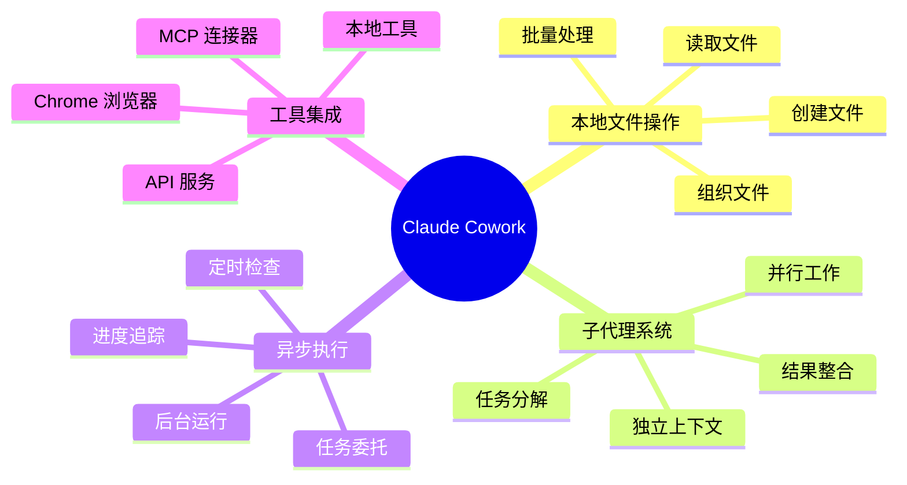
```mermaid
mindmap
  root((Claude Cowork))
    本地文件操作
      读取文件
      创建文件
      组织文件
      批量处理
    子代理系统
      并行工作
      独立上下文
      任务分解
      结果整合
    异步执行
      后台运行
      进度追踪
      任务委托
      定时检查
    工具集成
      MCP 连接器
      Chrome 浏览器
      本地工具
      API 服务
```

### Cowork 与 Claude Code 的关系

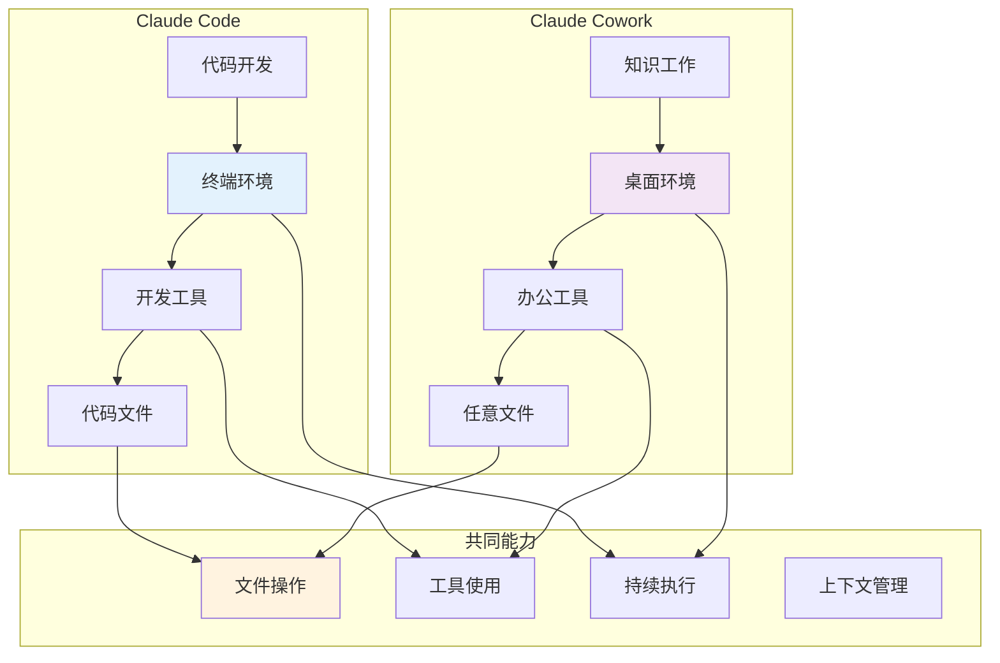
```mermaid
graph TB
    subgraph "Claude Code"
        A1[代码开发] --> A2[终端环境]
        A2 --> A3[开发工具]
        A3 --> A4[代码文件]
    end
    
    subgraph "Claude Cowork"
        B1[知识工作] --> B2[桌面环境]
        B2 --> B3[办公工具]
        B3 --> B4[任意文件]
    end
    
    subgraph "共同能力"
        C1[文件操作]
        C2[工具使用]
        C3[持续执行]
        C4[上下文管理]
    end
    
    A4 --> C1
    B4 --> C1
    A3 --> C2
    B3 --> C2
    A2 --> C3
    B2 --> C3
    
    style A2 fill:#e3f2fd
    style B2 fill:#f3e5f5
    style C1 fill:#fff3e0
```

## Cowork 与常规 Chat 的区别

### 功能对比

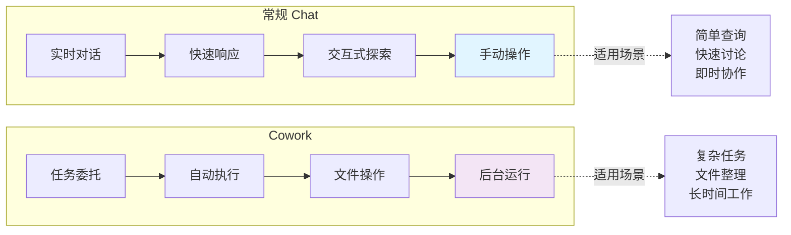
```mermaid
graph LR
    subgraph "常规 Chat"
        A1[实时对话] --> A2[快速响应]
        A2 --> A3[交互式探索]
        A3 --> A4[手动操作]
    end
    
    subgraph "Cowork"
        B1[任务委托] --> B2[自动执行]
        B2 --> B3[文件操作]
        B3 --> B4[后台运行]
    end
    
    A4 -.->|适用场景| C1[简单查询<br/>快速讨论<br/>即时协作]
    B4 -.->|适用场景| C2[复杂任务<br/>文件整理<br/>长时间工作]
    
    style A4 fill:#e1f5ff
    style B4 fill:#f3e5f5
```

### 使用场景对比

| 特性 | 常规 Chat | Cowork |
|------|----------|---------|
| **交互方式** | 实时来回对话 | 委托后可离开 |
| **工作环境** | 云端对话框 | 本地文件系统 |
| **任务规模** | 单一、快速的任务 | 复杂、多步骤的任务 |
| **文件处理** | 上传单个文件讨论 | 直接操作本地文件夹 |
| **并行处理** | 单线程对话 | 多子代理并行 |
| **适用场景** | 头脑风暴、快速咨询 | 文件整理、研究分析 |

## Cowork 的核心功能

### 1. 本地文件系统操作

Cowork 可以直接在您的文件系统中工作，不需要上传下载。

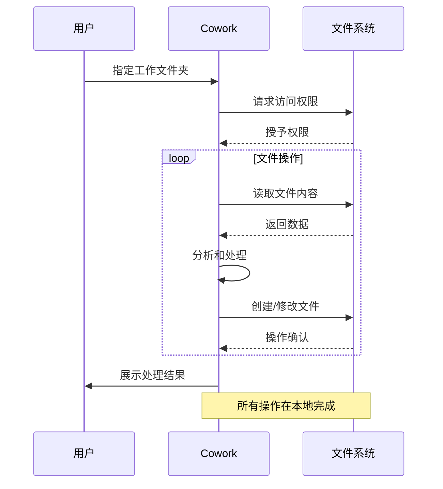
```mermaid
sequenceDiagram
    participant U as 用户
    participant C as Cowork
    participant F as 文件系统
    
    U->>C: 指定工作文件夹
    C->>F: 请求访问权限
    F-->>C: 授予权限
    
    loop 文件操作
        C->>F: 读取文件内容
        F-->>C: 返回数据
        C->>C: 分析和处理
        C->>F: 创建/修改文件
        F-->>C: 操作确认
    end
    
    C->>U: 展示处理结果
    
    Note over C,F: 所有操作在本地完成
```

**实际应用示例：**

```markdown
# 示例 1: 整理下载文件夹

"整理我的 Downloads 文件夹，按照以下规则分类：
- 图片放到 Images 文件夹
- 文档放到 Documents 文件夹  
- 压缩包放到 Archives 文件夹
- 删除重复的文件
- 创建一个整理报告"
```

```markdown
# 示例 2: 批量重命名照片

"将 /Photos/Vacation2024 文件夹中的照片按照拍摄日期重命名，
格式为：2024-08-15_001.jpg, 2024-08-15_002.jpg
并创建一个按日期分组的子文件夹结构"
```

### 2. 子代理（Sub-agents）系统

Cowork 可以启动多个独立的子代理来并行处理复杂任务。

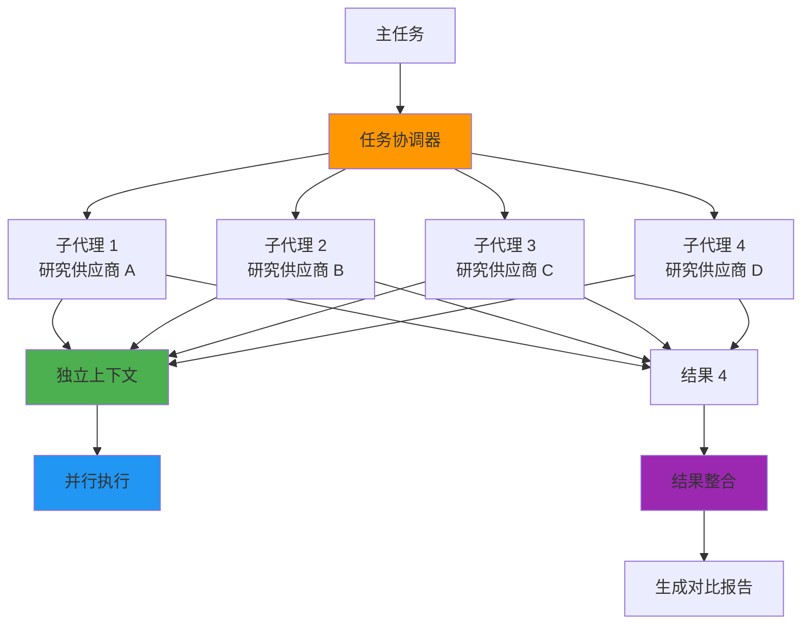
```mermaid
graph TB
    A[主任务] --> B[任务协调器]
    
    B --> C[子代理 1<br/>研究供应商 A]
    B --> D[子代理 2<br/>研究供应商 B]
    B --> E[子代理 3<br/>研究供应商 C]
    B --> F[子代理 4<br/>研究供应商 D]
    
    C --> G[独立上下文]
    D --> G
    E --> G
    F --> G
    
    G --> H[并行执行]
    
    C --> I[结果 1]
    D --> I[结果 2]
    E --> I[结果 3]
    F --> I[结果 4]
    
    I --> J[结果整合]
    J --> K[生成对比报告]
    
    style B fill:#ff9800
    style G fill:#4caf50
    style H fill:#2196f3
    style J fill:#9c27b0
```

**子代理优势：**

1. **并行处理**：多个任务同时进行，大幅缩短总体时间
2. **独立上下文**：每个子代理有新鲜的上下文，不受其他任务影响
3. **规模扩展**：可以处理需要大量信息拉取的复杂任务
4. **专注执行**：每个子代理专注于自己的子任务

**实际应用示例：**

```markdown
# 示例 3: 多角度决策分析

"我需要评估是否采购新的客户管理系统。
请启动四个子代理分别从以下角度分析：
1. 财务影响（成本、ROI、预算影响）
2. 客户体验（功能改进、用户满意度）
3. 运营风险（实施难度、团队适应性）
4. 技术兼容性（系统集成、数据迁移）

最后整合所有分析，提供综合建议。"
```

```markdown
# 示例 4: 竞品研究

"研究四个主要竞争对手：CompanyA, CompanyB, CompanyC, CompanyD。
为每家公司启动一个子代理，分别研究：
- 产品定价策略
- 客户支持质量（搜索 Zendesk 和在线评价）
- 技术特性（搜索官方文档）
- 市场定位

创建一个详细的对比矩阵。"
```

### 3. 异步工作模式

Cowork 最强大的特性之一是能够在后台持续工作，您可以随时离开。

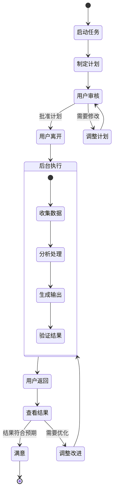
```mermaid
stateDiagram-v2
    [*] --> 启动任务
    启动任务 --> 制定计划
    制定计划 --> 用户审核
    
    用户审核 --> 用户离开: 批准计划
    用户审核 --> 调整计划: 需要修改
    调整计划 --> 用户审核
    
    用户离开 --> 后台执行
    
    state 后台执行 {
        [*] --> 收集数据
        收集数据 --> 分析处理
        分析处理 --> 生成输出
        生成输出 --> 验证结果
    }
    
    后台执行 --> 用户返回
    用户返回 --> 查看结果
    查看结果 --> 满意: 结果符合预期
    查看结果 --> 调整改进: 需要优化
    调整改进 --> 后台执行
    满意 --> [*]
```

**实际应用示例：**

```markdown
# 示例 5: 出差行程规划

"我下周要去里斯本待一周。请：
1. 搜索我的邮箱和日历，找到所有相关的行程信息
2. 搜索网络了解天气、推荐街区、餐厅和景点
3. 创建一份详细的日程安排文档
4. 包含每天的会议、用餐和观光建议

完成后保存为 Lisbon_Itinerary.docx"
```

```markdown
# 示例 6: 客户反馈分析

"我在 Teams 和 Zendesk 中有 50 多条客户反馈。请：
1. 收集所有反馈信息
2. 分类并统计主要问题
3. 搜索 SharePoint 中我写过的相关文档
4. 为每类问题起草回复模板

我去开个会，一小时后回来查看结果。"
```

### 4. 工具和服务集成

Cowork 通过 MCP（Model Context Protocol）连接器可以访问各种工具和服务。

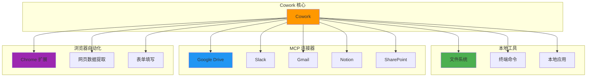
```mermaid
graph TB
    subgraph "Cowork 核心"
        A[Cowork]
    end
    
    subgraph "本地工具"
        B1[文件系统]
        B2[终端命令]
        B3[本地应用]
    end
    
    subgraph "MCP 连接器"
        C1[Google Drive]
        C2[Slack]
        C3[Gmail]
        C4[Notion]
        C5[SharePoint]
    end
    
    subgraph "浏览器自动化"
        D1[Chrome 扩展]
        D2[网页数据提取]
        D3[表单填写]
    end
    
    A --> B1
    A --> B2
    A --> B3
    A --> C1
    A --> C2
    A --> C3
    A --> C4
    A --> C5
    A --> D1
    A --> D2
    A --> D3
    
    style A fill:#ff9800
    style B1 fill:#4caf50
    style C1 fill:#2196f3
    style D1 fill:#9c27b0
```

## Cowork 使用场景

### 场景 1: 文件和数据管理

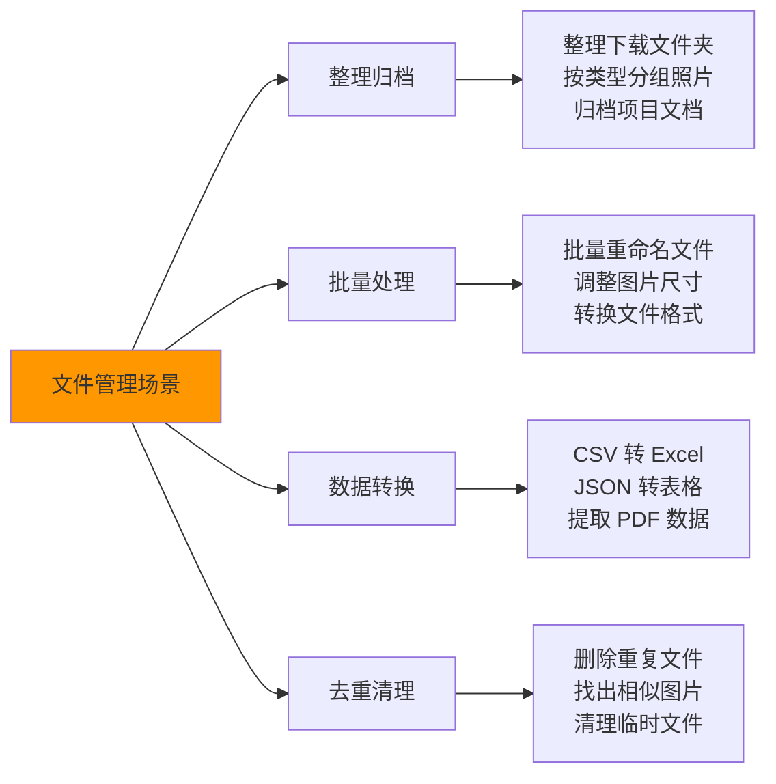
```mermaid
graph LR
    A[文件管理场景] --> B[整理归档]
    A --> C[批量处理]
    A --> D[数据转换]
    A --> E[去重清理]
    
    B --> B1["整理下载文件夹<br/>按类型分组照片<br/>归档项目文档"]
    C --> C1["批量重命名文件<br/>调整图片尺寸<br/>转换文件格式"]
    D --> D1["CSV 转 Excel<br/>JSON 转表格<br/>提取 PDF 数据"]
    E --> E1["删除重复文件<br/>找出相似图片<br/>清理临时文件"]
    
    style A fill:#ff9800
```

**实践示例：**

```markdown
# 文件整理任务

"组织我的桌面文件。请创建以下文件夹结构：
- Work（工作相关）
  - Projects（按项目名称分组）
  - Reports（报告文档）
  - Meetings（会议记录）
- Personal（个人）
  - Finance（财务文档）
  - Health（健康记录）
  - Learning（学习资料）
- Archive（需要归档的旧文件）

将现有文件分类移动到对应文件夹，
对于无法确定的文件，放到 Uncategorized 文件夹并生成清单。"
```

### 场景 2: 研究和信息收集

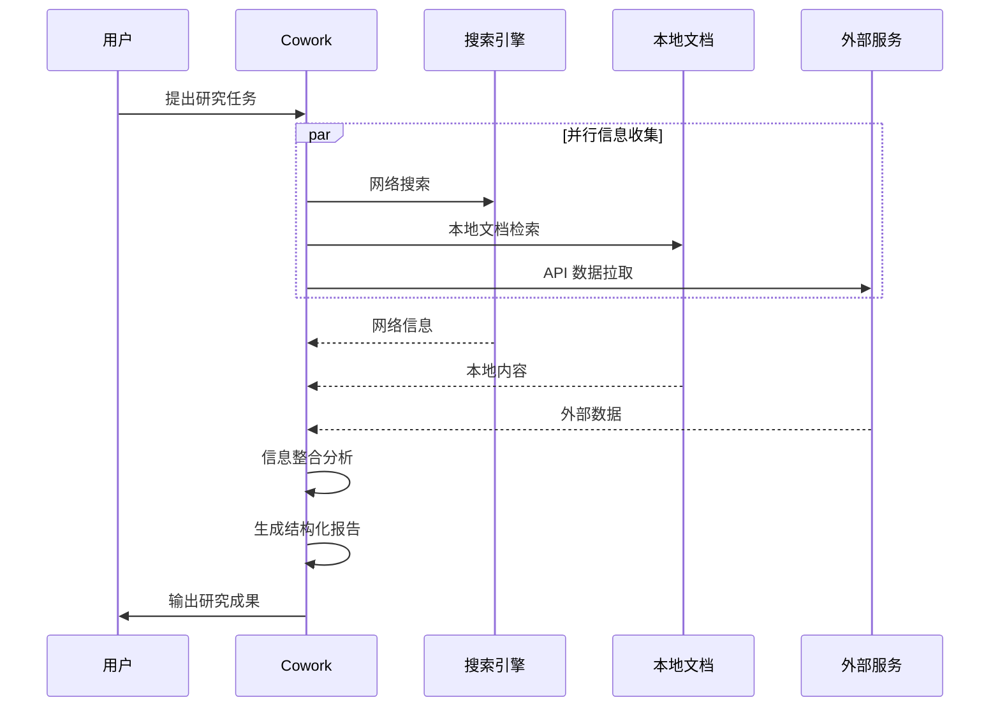
```mermaid
sequenceDiagram
    participant U as 用户
    participant C as Cowork
    participant S as 搜索引擎
    participant D as 本地文档
    participant E as 外部服务
    
    U->>C: 提出研究任务
    
    par 并行信息收集
        C->>S: 网络搜索
        C->>D: 本地文档检索
        C->>E: API 数据拉取
    end
    
    S-->>C: 网络信息
    D-->>C: 本地内容
    E-->>C: 外部数据
    
    C->>C: 信息整合分析
    C->>C: 生成结构化报告
    
    C->>U: 输出研究成果
```

**实践示例：**

```markdown
# 市场研究任务

"帮我做一份关于'AI 代码辅助工具'市场的研究报告：

1. 识别主要竞争对手（至少 5 家）
2. 对比他们的：
   - 定价模型
   - 核心功能
   - 目标用户群
   - 市场定位
3. 分析市场趋势和增长机会
4. 创建一份 PPT 演示文稿

请使用子代理并行研究每个竞品，
可以搜索网络、查看我的 Google Drive 中已有的研究文档。
完成后保存为 AI_Code_Tools_Market_Research.pptx"
```

### 场景 3: 内容创作和文档生成

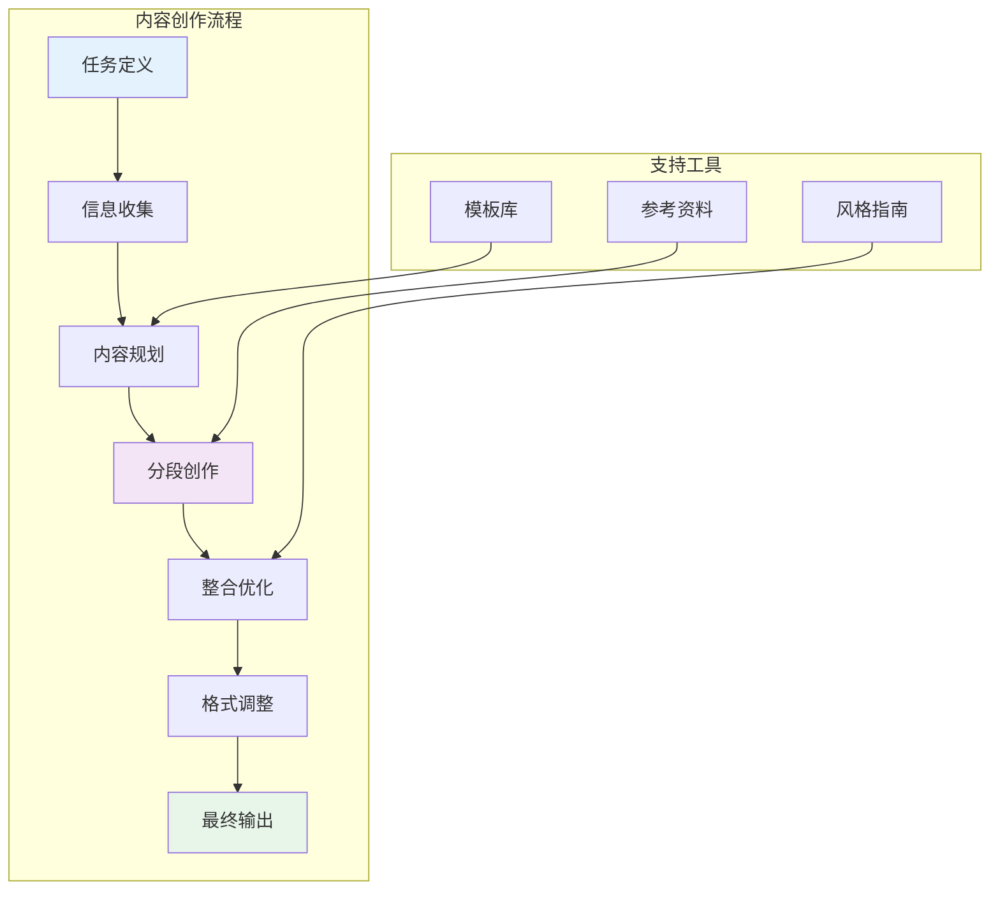
```mermaid
graph TB
    subgraph "内容创作流程"
        A[任务定义] --> B[信息收集]
        B --> C[内容规划]
        C --> D[分段创作]
        D --> E[整合优化]
        E --> F[格式调整]
        F --> G[最终输出]
    end
    
    subgraph "支持工具"
        H[模板库]
        I[参考资料]
        J[风格指南]
    end
    
    H --> C
    I --> D
    J --> E
    
    style A fill:#e3f2fd
    style D fill:#f3e5f5
    style G fill:#e8f5e9
```

**实践示例：**

```markdown
# 报告生成任务

"我需要准备周五的绩效评估会议。请：

1. 查看我的 Slack 消息和团队频道（过去三个月）
2. 检查 Google Drive 中的会议记录
3. 查看 Asana 中我完成的任务和项目
4. 整理：
   - 完成的关键项目
   - 收到的团队反馈
   - 协作贡献
   - 个人成长亮点

生成一份结构化的会议准备文档，
包含具体的成就案例和数据支持。
保存为 Performance_Review_Prep.docx"
```

### 场景 4: 数据处理和分析

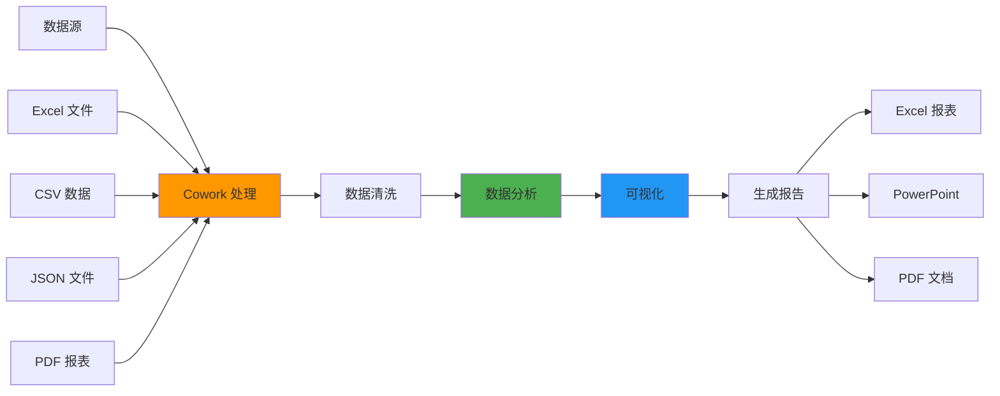
```mermaid
graph LR
    A[数据源] --> B[Cowork 处理]
    
    A1[Excel 文件] --> B
    A2[CSV 数据] --> B
    A3[JSON 文件] --> B
    A4[PDF 报表] --> B
    
    B --> C[数据清洗]
    C --> D[数据分析]
    D --> E[可视化]
    E --> F[生成报告]
    
    F --> G1[Excel 报表]
    F --> G2[PowerPoint]
    F --> G3[PDF 文档]
    
    style B fill:#ff9800
    style D fill:#4caf50
    style E fill:#2196f3
```

**实践示例：**

```markdown
# 数据分析任务

"分析 /Data/Sales 文件夹中的销售数据（Q1-Q4）：

1. 合并所有季度的 CSV 文件
2. 清洗数据（去除重复、处理缺失值）
3. 分析：
   - 每月销售趋势
   - 产品类别表现
   - 地区分布
   - 增长率计算
4. 创建一份 Excel 报告，包含：
   - 原始数据表
   - 分析结果表
   - 图表可视化（折线图、柱状图、饼图）
   - 洞察和建议

保存为 2024_Sales_Analysis.xlsx"
```

### 场景 5: 工作流自动化

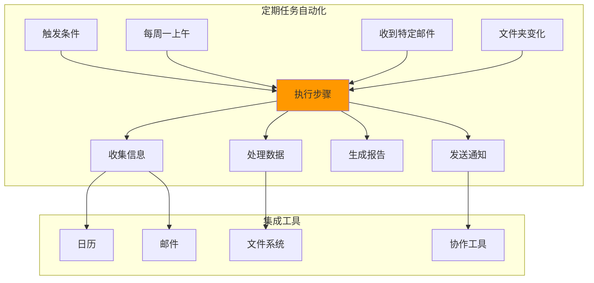
```mermaid
graph TB
    subgraph "定期任务自动化"
        A[触发条件] --> B[执行步骤]
        
        A1[每周一上午] --> B
        A2[收到特定邮件] --> B
        A3[文件夹变化] --> B
        
        B --> C1[收集信息]
        B --> C2[处理数据]
        B --> C3[生成报告]
        B --> C4[发送通知]
    end
    
    subgraph "集成工具"
        D1[日历]
        D2[邮件]
        D3[文件系统]
        D4[协作工具]
    end
    
    C1 --> D1
    C1 --> D2
    C2 --> D3
    C4 --> D4
    
    style B fill:#ff9800
```

**实践示例：**

```markdown
# 周报自动化

"帮我准备每周的团队周报：

1. 查看我的：
   - Google Calendar（本周的会议和活动）
   - Asana（完成的任务和进行中的项目）
   - Slack（重要的团队讨论）
   - Gmail（关键邮件往来）

2. 按以下结构组织：
   - 本周完成的工作
   - 进行中的项目状态
   - 下周计划
   - 需要支持的事项
   - 团队亮点

3. 生成一份 Markdown 格式的周报
4. 保存到 /Reports/Weekly/ 文件夹
   命名为：Weekly_Report_2024_W48.md

每周五下午 4 点提醒我执行这个任务。"
```

## 开始使用 Cowork

### 访问和设置

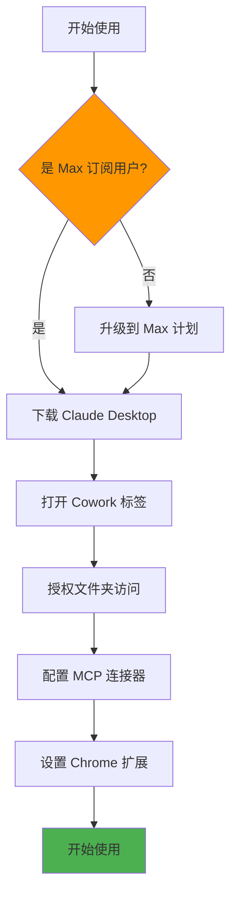
```mermaid
graph TB
    A[开始使用] --> B{是 Max 订阅用户?}
    B -->|是| C[下载 Claude Desktop]
    B -->|否| D[升级到 Max 计划]
    
    C --> E[打开 Cowork 标签]
    D --> C
    
    E --> F[授权文件夹访问]
    F --> G[配置 MCP 连接器]
    G --> H[设置 Chrome 扩展]
    H --> I[开始使用]
    
    style B fill:#ff9800
    style I fill:#4caf50
```

### 文件夹访问权限

Cowork 在写入文件之前会请求权限，确保安全性。

```markdown
# 授权步骤

1. 点击"Work in a folder"按钮
2. 选择要授权的文件夹
3. Cowork 会列出计划进行的操作
4. 审核后点击"Allow"授予权限
5. Cowork 开始在该文件夹工作
```

### 连接外部工具

```markdown
# MCP 连接器配置示例

## Google Drive 连接
1. 在 Cowork 设置中添加 Google Drive MCP
2. 完成 OAuth 授权
3. 选择要访问的文件夹

## Slack 连接
1. 安装 Slack MCP 连接器
2. 添加到 Cowork 工作区
3. 授权访问频道和消息

## Chrome 浏览器集成
1. 安装 Claude in Chrome 扩展
2. 登录同一账号
3. Cowork 可以自动使用浏览器功能
```

## 使用技巧和最佳实践

### 1. 有效的任务描述

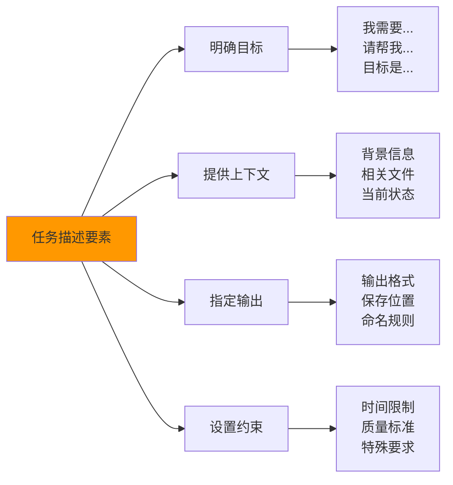
```mermaid
graph LR
    A[任务描述要素] --> B[明确目标]
    A --> C[提供上下文]
    A --> D[指定输出]
    A --> E[设置约束]
    
    B --> B1["我需要...<br/>请帮我...<br/>目标是..."]
    C --> C1["背景信息<br/>相关文件<br/>当前状态"]
    D --> D1["输出格式<br/>保存位置<br/>命名规则"]
    E --> E1["时间限制<br/>质量标准<br/>特殊要求"]
    
    style A fill:#ff9800
```

**好的任务描述示例：**

```markdown
# 好的示例 ✅

"整理我的 Downloads 文件夹（/Users/john/Downloads）：
1. 按文件类型分类（文档、图片、视频、压缩包、其他）
2. 在 Downloads 下创建对应的子文件夹
3. 移动文件到对应文件夹
4. 对于同名文件，在文件名后添加数字后缀
5. 删除超过 6 个月且大于 100MB 的临时文件
6. 生成整理报告（包含移动的文件数量、删除的文件列表）
7. 将报告保存为 Downloads_Cleanup_Report.txt

请在执行删除操作前，让我确认要删除的文件列表。"
```

**不好的任务描述示例：**

```markdown
# 不好的示例 ❌

"帮我整理一下文件"

# 问题：
- 没有指定文件夹位置
- 没有说明如何整理
- 没有明确输出要求
- 缺少约束条件
```

### 2. 使用 Prompt Builders

Cowork 提供了预设的提示构建器，帮助您快速开始。

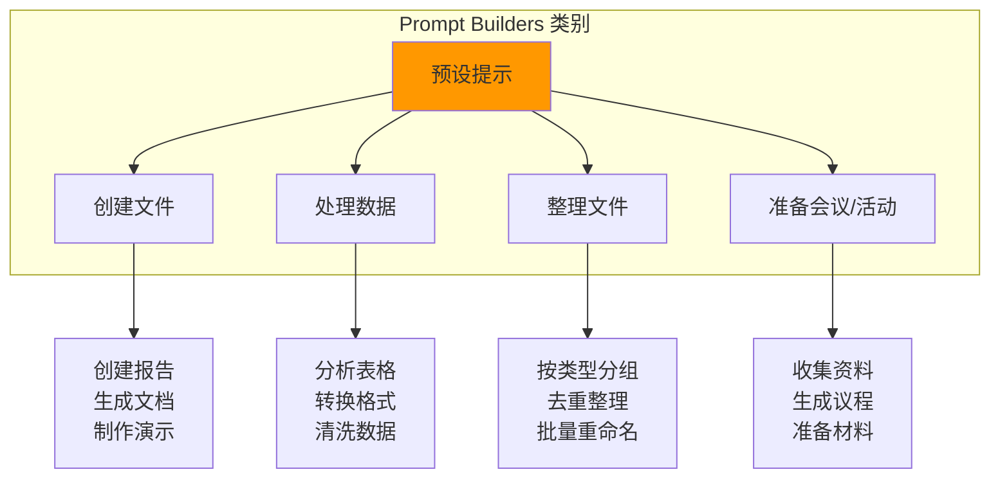
```mermaid
graph TB
    subgraph "Prompt Builders 类别"
        A[预设提示] --> B[创建文件]
        A --> C[处理数据]
        A --> D[整理文件]
        A --> E[准备会议/活动]
    end
    
    B --> B1["创建报告<br/>生成文档<br/>制作演示"]
    C --> C1["分析表格<br/>转换格式<br/>清洗数据"]
    D --> D1["按类型分组<br/>去重整理<br/>批量重命名"]
    E --> E1["收集资料<br/>生成议程<br/>准备材料"]
    
    style A fill:#ff9800
```

### 3. 优化子代理使用

```markdown
# 何时使用子代理

✅ 适合使用：
- 需要研究多个独立主题
- 要从多个角度分析同一问题
- 并行处理可以节省时间
- 每个子任务需要大量上下文

❌ 不适合使用：
- 简单的单一任务
- 子任务之间高度依赖
- 需要实时交互反馈
- 任务规模很小
```

**子代理示例：**

```markdown
# 多供应商评估（适合子代理）

"评估四个云服务供应商（AWS, Azure, GCP, Alibaba Cloud）。
为每个供应商启动一个子代理，分别评估：
- 服务覆盖范围
- 定价模型
- 性能基准测试结果（搜索第三方评测）
- 合规认证
- 客户评价

最后生成一个对比矩阵和推荐建议。"
```

### 4. 工作流模板

```markdown
# 模板 1: 研究报告生成

标题：[主题]研究报告

步骤：
1. 定义研究范围和关键问题
2. 收集信息来源：
   - 搜索网络获取最新信息
   - 查看我的 [指定文件夹] 中的已有资料
   - 访问 [指定服务] 获取数据
3. 使用子代理并行研究不同方面
4. 整合所有发现
5. 生成结构化报告（包含：摘要、详细分析、结论、参考资料）
6. 保存为 [文件名].docx

---

# 模板 2: 文件批量处理

标题：批量处理 [文件类型]

步骤：
1. 扫描 [文件夹路径]
2. 筛选符合条件的文件：[筛选规则]
3. 对每个文件执行：[处理操作]
4. 保存结果到：[输出路径]
5. 生成处理日志：[日志文件名]

---

# 模板 3: 定期任务自动化

标题：[任务名称] 自动化

触发条件：[时间或事件]

执行步骤：
1. 从 [数据源] 收集信息
2. 处理和分析数据
3. 按 [模板] 生成报告
4. 保存到 [位置]
5. （可选）发送通知到 [渠道]
```

### 5. 进度监控

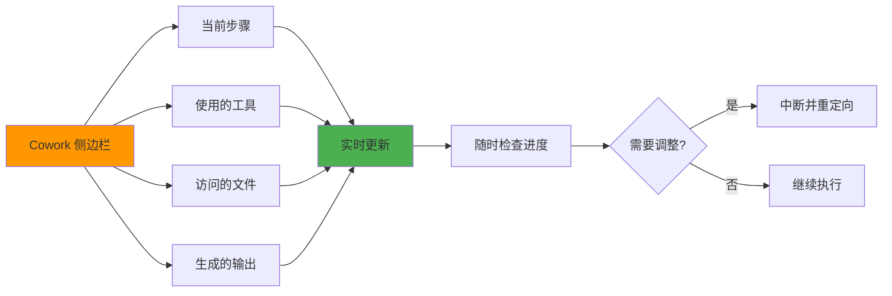
```mermaid
graph LR
    A[Cowork 侧边栏] --> B[当前步骤]
    A --> C[使用的工具]
    A --> D[访问的文件]
    A --> E[生成的输出]
    
    B --> F[实时更新]
    C --> F
    D --> F
    E --> F
    
    F --> G[随时检查进度]
    G --> H{需要调整?}
    H -->|是| I[中断并重定向]
    H -->|否| J[继续执行]
    
    style A fill:#ff9800
    style F fill:#4caf50
```

## 实战案例

### 案例 1: 旅行规划助手

```markdown
# 任务描述

"我下周要去东京出差 5 天。请帮我准备完整的行程：

## 信息收集
1. 查看我的 Gmail，找到所有与这次出差相关的邮件
   - 航班信息
   - 酒店预订
   - 会议安排
2. 查看 Google Calendar 的日程
3. 搜索网络了解：
   - 东京下周天气预报
   - 推荐的商务餐厅（靠近我的酒店）
   - 工作日晚上可以去的景点
   - 交通卡使用指南

## 行程规划
创建一份日程表，包含：
- 每天的时间线（6:00-23:00）
- 商务会议（从日历）
- 用餐建议（早中晚）
- 晚间活动建议
- 交通方式和预计时间

## 实用信息
- 紧急联系人列表
- 当地常用短语
- 酒店到会议地点的路线
- 推荐的咖啡厅（适合临时工作）

## 输出
生成一份 PDF 文档：Tokyo_Business_Trip_Itinerary.pdf
包含所有信息，并且便于打印携带。"
```

**执行流程：**

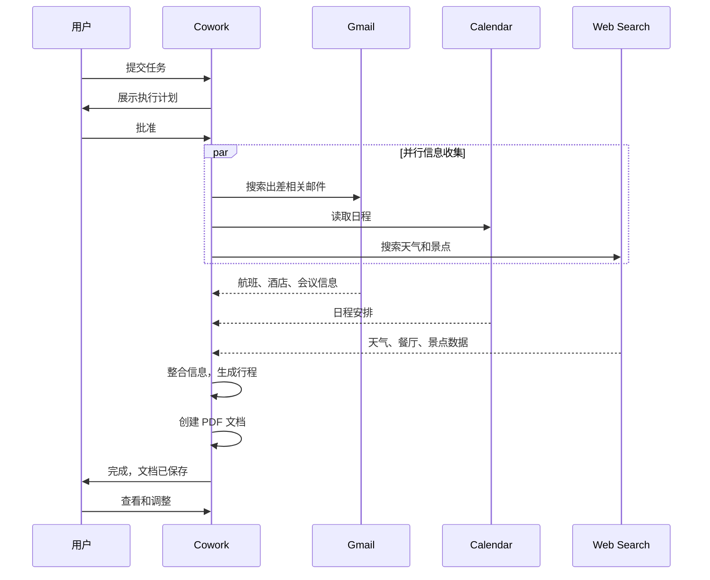
```mermaid
sequenceDiagram
    participant U as 用户
    participant C as Cowork
    participant G as Gmail
    participant Cal as Calendar
    participant W as Web Search
    
    U->>C: 提交任务
    C->>U: 展示执行计划
    U->>C: 批准
    
    par 并行信息收集
        C->>G: 搜索出差相关邮件
        C->>Cal: 读取日程
        C->>W: 搜索天气和景点
    end
    
    G-->>C: 航班、酒店、会议信息
    Cal-->>C: 日程安排
    W-->>C: 天气、餐厅、景点数据
    
    C->>C: 整合信息，生成行程
    C->>C: 创建 PDF 文档
    
    C->>U: 完成，文档已保存
    U->>C: 查看和调整
```

### 案例 2: 客户反馈分析系统

```markdown
# 任务描述

"分析我们的客户反馈并生成行动方案：

## 数据收集
1. Zendesk：收集过去 3 个月的所有客户工单（标签：feature-request, bug-report, complaint）
2. Slack #customer-feedback 频道：提取所有反馈消息
3. Google Forms：导出客户满意度调查结果
4. 我的 Documents/Customer_Interviews 文件夹：分析访谈记录

## 分析任务
启动 4 个子代理：
- 子代理 1：分类所有反馈（功能请求、Bug、使用问题、抱怨）
- 子代理 2：识别高频问题（出现 5 次以上）
- 子代理 3：情感分析（积极、中性、消极）
- 子代理 4：竞品对比（客户提到的竞争对手及其优势）

## 生成输出
1. Excel 报告：Customer_Feedback_Analysis.xlsx
   - 原始数据表
   - 分类统计表
   - 高频问题排名
   - 情感分布图表
   - 竞品对比表

2. PowerPoint：Customer_Feedback_Presentation.pptx
   - 执行摘要
   - 关键发现
   - 问题严重程度矩阵
   - 行动建议

3. Word 文档：Action_Plan.docx
   - 优先级排序的问题清单
   - 每个问题的建议解决方案
   - 实施时间表
   - 负责团队建议

保存到 /Reports/Customer_Feedback/ 文件夹。"
```

### 案例 3: 知识库整理

```markdown
# 任务描述

"整理和优化我们的技术文档知识库：

## 当前状态
- 文档分散在 /Docs、/Wiki、/Tutorials 三个文件夹
- 包含 Markdown、Word、PDF 多种格式
- 缺少统一的目录结构
- 有重复和过时的内容

## 整理任务
1. 扫描所有文件夹，建立完整的文档清单
2. 按主题分类：
   - Getting Started（新手入门）
   - User Guides（用户指南）
   - API Reference（API 参考）
   - Tutorials（教程）
   - Troubleshooting（故障排查）
   - Best Practices（最佳实践）

3. 识别和处理：
   - 重复的文档（保留最新版本）
   - 过时的内容（超过 2 年未更新的，标记 [Outdated]）
   - 孤立文件（没有被其他文档引用的）

4. 创建新的文件夹结构：
   ```
   /Knowledge_Base
     /Getting_Started
     /User_Guides
     /API_Reference
     /Tutorials
     /Troubleshooting
     /Best_Practices
     /Archive（存放过时文档）
   ```

5. 生成：
   - README.md：知识库导航
   - INDEX.md：所有文档的索引（按类别）
   - CHANGELOG.md：记录整理过程
   - orphaned_files.txt：列出未分类的文件

6. 转换所有 Word 文档为 Markdown，保持格式

## 验证
- 确保所有文档链接有效
- 检查图片引用是否正确
- 生成文档统计报告（总数、各类别数量、文件大小）

这是一个大任务，请在后台执行，完成后通知我。"
```

### 案例 4: 会议准备自动化

```markdown
# 任务描述

"帮我准备明天的季度业务回顾会议：

## 会议信息
- 时间：明天下午 2:00-4:00
- 主题：Q4 业务回顾和 Q1 规划
- 参与者：管理团队（10 人）

## 准备内容
1. 业绩数据收集
   - 从 /Reports/Q4 文件夹提取关键指标
   - 对比 Q3 数据（在 /Reports/Q3）
   - 计算增长率和完成率

2. 项目进展总结
   - 查看 Asana 的所有 Q4 项目
   - 提取：已完成、进行中、延期的项目
   - 生成项目状态仪表板

3. 团队反馈整合
   - 搜索 Slack #team-updates 频道（Q4 期间）
   - 提取团队提出的挑战和建议
   - 分类整理

4. 竞品动态
   - 搜索网络：主要竞争对手 Q4 的重大动作
   - 整理为简明的 bullet points

## 生成材料
1. PowerPoint 演示：Q4_Business_Review.pptx
   - 封面（包含会议信息）
   - 议程
   - Q4 业绩总结（图表）
   - 项目进展（时间线）
   - 团队反馈（分类展示）
   - 市场动态
   - Q1 规划框架（模板页面）
   - Q&A 页面

2. Excel 数据手册：Q4_Data_Reference.xlsx
   - 详细的数据表格
   - 供会议中查询

3. Word 会议笔记模板：Meeting_Notes_Template.docx
   - 包含议程
   - 预留讨论记录空间
   - 行动项表格

保存到 /Meetings/Q4_Business_Review/ 文件夹
并在我的桌面创建快捷方式。"
```

## 常见问题和解决方案

### 问题 1: Cowork 无法访问某个文件夹

```markdown
# 解决方案

1. 检查文件夹权限
   - macOS：系统偏好设置 → 隐私与安全性 → 文件和文件夹
   - 确保 Claude Desktop 有访问权限

2. 使用"Work in a folder"功能
   - 明确指定要访问的文件夹
   - Cowork 会请求权限

3. 检查路径是否正确
   - 使用绝对路径
   - 检查拼写和大小写
```

### 问题 2: 子代理没有按预期工作

```markdown
# 解决方案

1. 确保任务适合并行处理
   - 子任务之间相对独立
   - 每个子任务目标明确

2. 给每个子代理清晰的指令
   不好：启动子代理研究竞品
   好的：为 CompanyA、CompanyB、CompanyC 各启动一个子代理，
        每个子代理研究该公司的定价策略、客户评价和技术特性

3. 等待所有子代理完成
   - Cowork 会自动等待并整合结果
   - 不要在中途打断
```

### 问题 3: 输出格式不符合预期

```markdown
# 解决方案

1. 明确指定输出格式
   例如：
   "生成一份 Excel 文件，包含三个工作表：
    - Sheet1: 原始数据
    - Sheet2: 汇总统计
    - Sheet3: 图表"

2. 提供示例或模板
   "按照我在 /Templates/Report_Template.docx 的格式生成报告"

3. 使用具体的格式要求
   "生成 Markdown 文件，使用以下结构：
    # 标题1
    ## 子标题
    - 列表项
    ```代码块```"
```

### 问题 4: 任务执行时间过长

```markdown
# 解决方案

1. 缩小范围
   - 限制时间范围（最近 3 个月而不是全部）
   - 限制数据量（前 100 条记录）
   - 优先处理关键部分

2. 使用子代理加速
   - 将大任务分解为可并行的小任务

3. 分阶段执行
   - 先完成核心部分
   - 再扩展补充内容

4. 检查是否有不必要的步骤
   - 精简任务流程
   - 去除冗余操作
```

## 进阶技巧

### 1. 创建可复用的工作流

```markdown
# 将常用任务保存为模板

在 ~/Claude_Templates/ 创建任务模板：

## template_weekly_report.md
```
Weekly Report Generation

Data Sources:
- Google Calendar (this week)
- Asana (completed tasks)
- Slack (important discussions)
- Email (key communications)

Structure:
1. Accomplishments
2. Ongoing Projects
3. Next Week Plans
4. Support Needed

Output: /Reports/Weekly/Weekly_Report_{date}.md
```

使用时：
"请按照 ~/Claude_Templates/template_weekly_report.md 的模板，
生成本周的周报"
```

### 2. 与其他 AI 工具配合

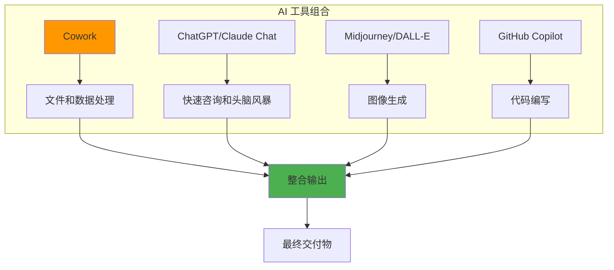
```mermaid
graph TB
    subgraph "AI 工具组合"
        A[Cowork] --> B[文件和数据处理]
        C[ChatGPT/Claude Chat] --> D[快速咨询和头脑风暴]
        E[Midjourney/DALL-E] --> F[图像生成]
        G[GitHub Copilot] --> H[代码编写]
    end
    
    B --> I[整合输出]
    D --> I
    F --> I
    H --> I
    
    I --> J[最终交付物]
    
    style A fill:#ff9800
    style I fill:#4caf50
```

**配合策略：**

```markdown
1. 使用 Claude Chat 进行快速讨论和方案设计
2. 使用 Cowork 执行具体的文件操作和数据处理
3. 使用 Midjourney 生成所需的图像资产
4. 使用 Cowork 将所有内容整合到最终文档

示例：
"我在 ChatGPT 中讨论了报告大纲，保存在 outline.txt。
请基于这个大纲，从我的项目文件夹收集数据，
并生成完整的报告。报告中需要的图表，我会用 Midjourney 生成，
你负责将图片和文本整合到 PowerPoint 中。"
```

### 3. 定制化工作环境

```markdown
# 创建专属的工作配置

## 项目特定的配置
在项目根目录创建 .cowork_config.json：

{
  "default_folders": {
    "input": "./data/input",
    "output": "./data/output",
    "temp": "./data/temp"
  },
  "file_naming": {
    "pattern": "{date}_{type}_{version}",
    "date_format": "YYYY-MM-DD"
  },
  "integrations": {
    "google_drive": "project_drive_id",
    "slack_channel": "#project-updates"
  },
  "templates": "./templates"
}

## 使用配置
"请使用项目配置文件中定义的设置来处理数据"
```

### 4. 批量任务处理模式

```markdown
# 批量处理多个相似任务

示例：批量生成客户报告

"我需要为 20 个客户生成季度报告。

客户列表在：/Data/clients.csv
数据文件在：/Data/Q4/{client_id}_data.xlsx
报告模板：/Templates/quarterly_report_template.pptx

对每个客户：
1. 读取 {client_id}_data.xlsx
2. 基于模板生成报告
3. 填充客户名称、数据和图表
4. 保存为 /Reports/Q4/{client_name}_Q4_Report.pptx

使用子代理并行处理（每次 5 个客户），
完成后生成处理日志。"
```

## 安全和隐私注意事项

### 数据安全

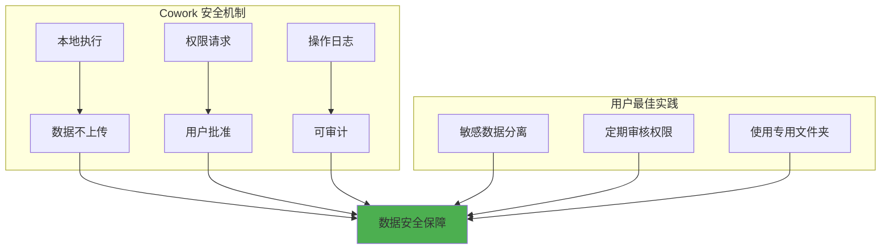
```mermaid
graph TB
    subgraph "Cowork 安全机制"
        A[本地执行] --> B[数据不上传]
        C[权限请求] --> D[用户批准]
        E[操作日志] --> F[可审计]
    end
    
    subgraph "用户最佳实践"
        G[敏感数据分离]
        H[定期审核权限]
        I[使用专用文件夹]
    end
    
    B --> J[数据安全保障]
    D --> J
    F --> J
    G --> J
    H --> J
    I --> J
    
    style J fill:#4caf50
```

**安全建议：**

```markdown
1. 文件夹隔离
   - 为 Cowork 创建专用的工作文件夹
   - 不授权访问包含极度敏感信息的文件夹
   - 使用符号链接而不是授权整个主目录

2. 敏感信息处理
   - 对于包含密码、API 密钥的文件，手动处理
   - 使用环境变量而不是硬编码敏感信息
   - 在任务描述中不要包含敏感信息

3. 权限管理
   - 定期审核 Cowork 的文件夹访问权限
   - 任务完成后可以撤销某些权限
   - 使用最小权限原则

4. 数据备份
   - 在 Cowork 执行大规模文件操作前先备份
   - 使用版本控制（Git）保护重要文件
   - 定期备份工作成果
```

## 总结和展望

### Cowork 的核心价值

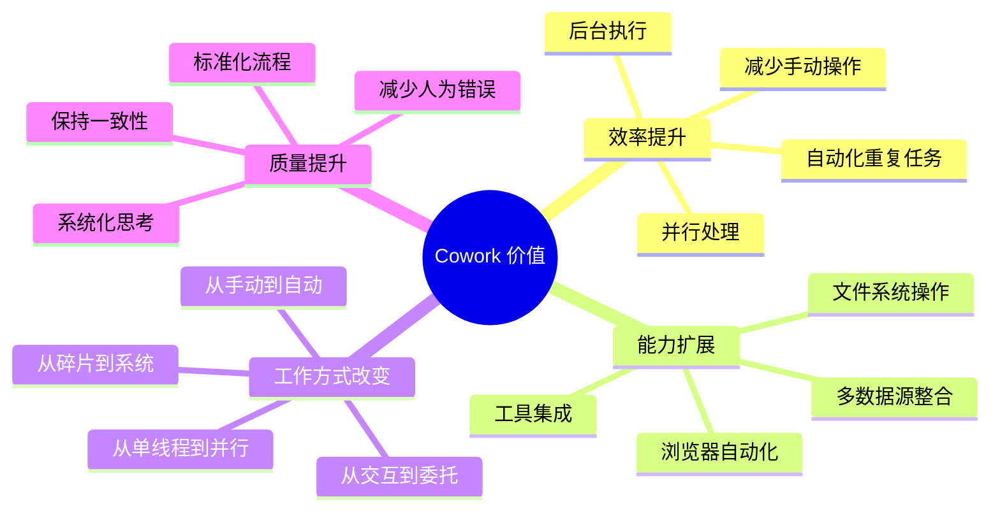
```mermaid
mindmap
  root((Cowork 价值))
    效率提升
      自动化重复任务
      并行处理
      后台执行
      减少手动操作
    能力扩展
      文件系统操作
      工具集成
      浏览器自动化
      多数据源整合
    工作方式改变
      从交互到委托
      从手动到自动
      从单线程到并行
      从碎片到系统
    质量提升
      标准化流程
      减少人为错误
      保持一致性
      系统化思考
```

### 适用人群

| 角色 | 典型应用场景 | 价值 |
|------|------------|------|
| **知识工作者** | 文档整理、研究报告、数据分析 | 节省 60-80% 的文件管理时间 |
| **项目经理** | 进度追踪、报告生成、资源整合 | 自动化状态更新和报告生成 |
| **研究人员** | 文献综述、数据收集、分析整合 | 并行研究多个主题，提升效率 |
| **内容创作者** | 素材收集、内容整合、格式转换 | 专注创作，自动化辅助任务 |
| **数据分析师** | 数据清洗、报表生成、可视化 | 自动化数据处理流水线 |

### 未来展望

Claude Cowork 作为 AI 智能协作的先驱探索，展示了人机协作的新范式：

```mermaid
timeline
    title Cowork 发展路线图
    现在 : 文件系统操作
         : 子代理并行
         : MCP 集成
    近期 : 更多集成工具
         : 增强自动化
         : 移动端支持
    未来 : 跨应用协作
         : 主动任务建议
         : 团队协同能力
         : AI 工作流编排
```

### 开始您的 Cowork 之旅

```markdown
# 第一周：基础探索
- 尝试简单的文件整理任务
- 熟悉 Cowork 界面和基本操作
- 配置常用的 MCP 连接器

# 第二周：深度使用
- 执行复杂的多步骤任务
- 尝试使用子代理
- 建立自己的任务模板库

# 第三周：工作流优化
- 识别可以自动化的重复任务
- 创建专属的工作流
- 与团队分享最佳实践

# 持续改进
- 定期回顾和优化工作流
- 探索新的集成工具
- 参与社区讨论和分享
```

---

**参考资料：**
- [Claude Cowork 官方教程](https://claude.com/resources/tutorials/claude-cowork-a-research-preview)
- [Claude Desktop 下载](https://claude.com/download)
- [MCP 协议文档](https://modelcontextprotocol.io)

**更新日志：**
- 2026-01-13: 初版发布，涵盖 Cowork 核心功能和使用指南

