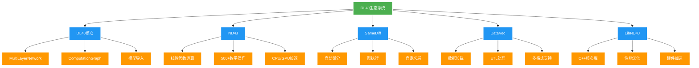
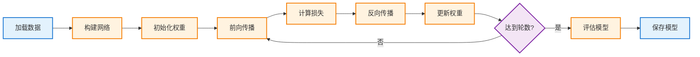
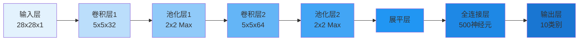
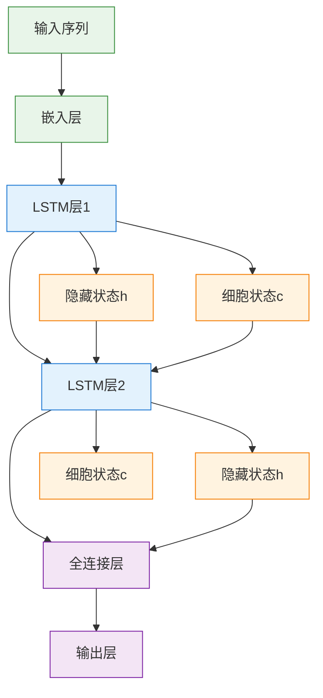
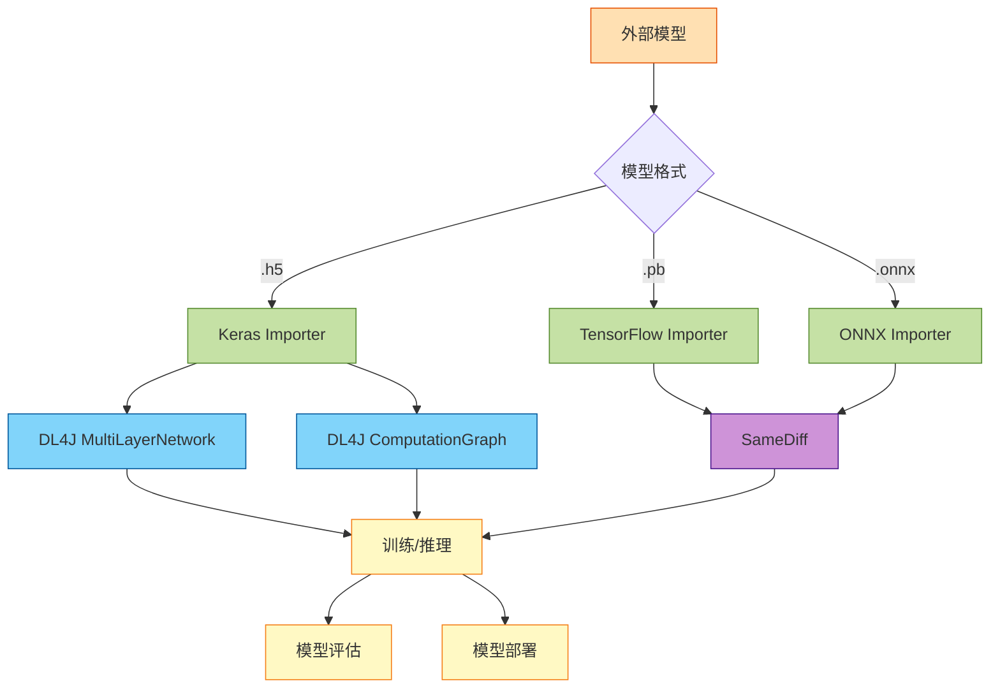
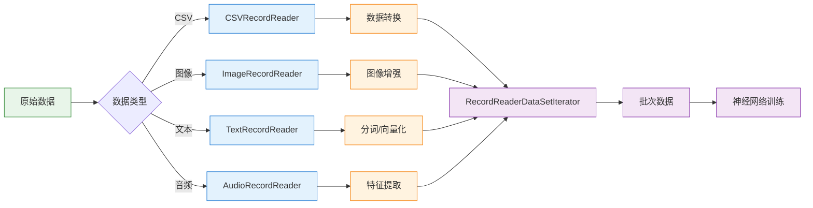
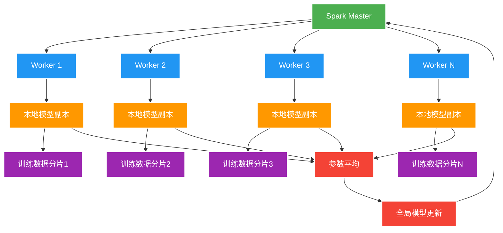
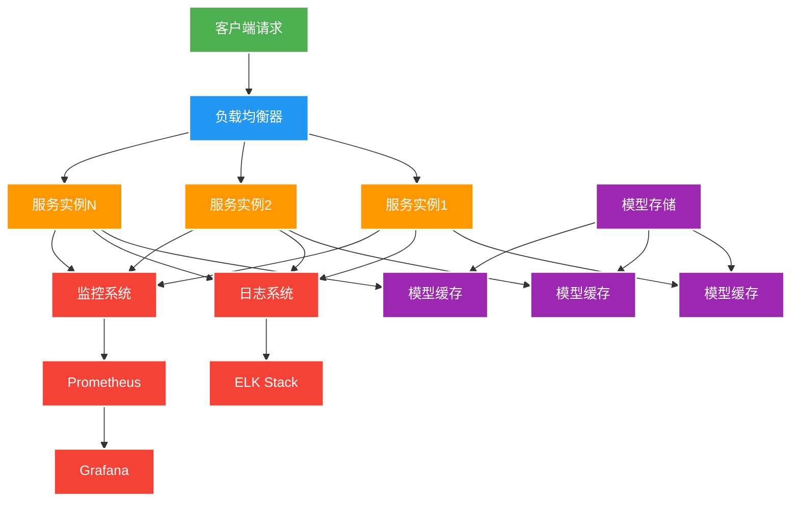

# Deeplearning4J: JVM深度学习完全指南

## 简介

Eclipse Deeplearning4J (DL4J) 是一套专为JVM设计的深度学习工具集，支持从原始数据加载、预处理到构建和调优各种简单或复杂的深度学习网络的全流程开发。DL4J运行在JVM上，因此可以与Java、Scala、Kotlin、Clojure等多种JVM语言配合使用。

### 核心价值

DL4J生态系统解决了Java开发者在深度学习领域的根本挑战：**在企业级Java应用中无缝集成深度学习能力**。它提供了：

1. **原生JVM支持**：无需Python依赖，纯Java实现
2. **企业级集成**：与Spring、Hadoop、Spark完美集成
3. **高性能计算**：支持CPU（AVX2/512）和GPU（CUDA）加速
4. **跨平台支持**：Windows、Linux、macOS全平台支持
5. **模型导入**：支持Keras、TensorFlow、ONNX模型导入



## DL4J生态系统组件

### 1. DL4J (核心深度学习库)

DL4J提供了构建和训练深度学习网络的高级API，支持多种网络架构和层类型。

**主要特性：**
- 多层神经网络（MultiLayerNetwork）
- 计算图网络（ComputationGraph）
- 支持导入Keras模型（包括tf.keras）
- Apache Spark分布式训练支持
- 自定义层和损失函数

### 2. ND4J (N维数组库)

ND4J是DL4J的科学计算基础，提供了超过500个数学、线性代数和深度学习操作。

**主要特性：**
- 类似NumPy的API设计
- CPU和GPU支持
- 使用OpenBLAS、OneDNN、cuBLAS等库加速
- 自动内存管理

### 3. SameDiff (自动微分框架)

SameDiff是DL4J的自动微分引擎，提供了类似TensorFlow和PyTorch的图执行模式。

**主要特性：**
- 自动求导
- 图优化
- 支持导入TensorFlow Frozen Models (.pb)
- 自定义操作支持

### 4. DataVec (数据处理库)

DataVec为机器学习提供ETL功能，支持多种数据格式和来源。

**主要特性：**
- 支持HDFS、Spark、图像、视频、音频
- CSV、Excel等表格数据处理
- 数据转换和标准化
- 图像增强

### 5. LibND4J (C++核心库)

LibND4J是底层C++库，为所有组件提供高性能计算支持。

**硬件支持：**
- CUDA GPU（10.0、10.1、10.2，macOS除外）
- x86 CPU（x86_64、avx2、avx512）
- ARM CPU（arm、arm64、armhf）
- PowerPC（ppc64le）

## 快速开始

### Maven依赖配置

在`pom.xml`中添加以下依赖：

```xml
<dependencies>
    <!-- DL4J核心库 -->
    <dependency>
        <groupId>org.eclipse.deeplearning4j</groupId>
        <artifactId>deeplearning4j-core</artifactId>
        <version>1.0.0-M2.1</version>
    </dependency>
    
    <!-- ND4J后端 - CPU版本 -->
    <dependency>
        <groupId>org.nd4j</groupId>
        <artifactId>nd4j-native-platform</artifactId>
        <version>1.0.0-M2.1</version>
    </dependency>
    
    <!-- ND4J后端 - GPU版本（可选） -->
    <!-- 
    <dependency>
        <groupId>org.nd4j</groupId>
        <artifactId>nd4j-cuda-11.6-platform</artifactId>
        <version>1.0.0-M2.1</version>
    </dependency>
    -->
    
    <!-- DataVec数据处理 -->
    <dependency>
        <groupId>org.datavec</groupId>
        <artifactId>datavec-api</artifactId>
        <version>1.0.0-M2.1</version>
    </dependency>
    
    <!-- 日志依赖 -->
    <dependency>
        <groupId>ch.qos.logback</groupId>
        <artifactId>logback-classic</artifactId>
        <version>1.2.11</version>
    </dependency>
</dependencies>
```

### Gradle依赖配置

```groovy
dependencies {
    // DL4J核心库
    implementation 'org.eclipse.deeplearning4j:deeplearning4j-core:1.0.0-M2.1'
    
    // ND4J后端 - CPU版本
    implementation 'org.nd4j:nd4j-native-platform:1.0.0-M2.1'
    
    // ND4J后端 - GPU版本（可选）
    // implementation 'org.nd4j:nd4j-cuda-11.6-platform:1.0.0-M2.1'
    
    // DataVec数据处理
    implementation 'org.datavec:datavec-api:1.0.0-M2.1'
    
    // 日志依赖
    implementation 'ch.qos.logback:logback-classic:1.2.11'
}
```

## 第一个神经网络：手写数字识别

### 数据准备

```java
import org.deeplearning4j.datasets.iterator.impl.MnistDataSetIterator;
import org.nd4j.linalg.dataset.api.iterator.DataSetIterator;

public class MnistDataLoader {
    
    public static DataSetIterator getTrainingData(int batchSize) throws Exception {
        // 加载MNIST训练数据
        // 参数：批次大小，是否训练集
        return new MnistDataSetIterator(batchSize, true, 12345);
    }
    
    public static DataSetIterator getTestData(int batchSize) throws Exception {
        // 加载MNIST测试数据
        return new MnistDataSetIterator(batchSize, false, 12345);
    }
}
```

### 构建神经网络

```java
import org.deeplearning4j.nn.conf.MultiLayerConfiguration;
import org.deeplearning4j.nn.conf.NeuralNetConfiguration;
import org.deeplearning4j.nn.conf.layers.DenseLayer;
import org.deeplearning4j.nn.conf.layers.OutputLayer;
import org.deeplearning4j.nn.multilayer.MultiLayerNetwork;
import org.deeplearning4j.nn.weights.WeightInit;
import org.nd4j.linalg.activations.Activation;
import org.nd4j.linalg.learning.config.Adam;
import org.nd4j.linalg.lossfunctions.LossFunctions;

public class MnistClassifier {
    
    public static MultiLayerNetwork buildNetwork() {
        int numInputs = 28 * 28;  // MNIST图像大小
        int numHidden = 500;       // 隐藏层神经元数量
        int numOutputs = 10;       // 输出类别数（0-9）
        double learningRate = 0.001;
        
        MultiLayerConfiguration config = new NeuralNetConfiguration.Builder()
            .seed(12345)
            .updater(new Adam(learningRate))
            .weightInit(WeightInit.XAVIER)
            .list()
            .layer(new DenseLayer.Builder()
                .nIn(numInputs)
                .nOut(numHidden)
                .activation(Activation.RELU)
                .build())
            .layer(new DenseLayer.Builder()
                .nIn(numHidden)
                .nOut(numHidden)
                .activation(Activation.RELU)
                .build())
            .layer(new OutputLayer.Builder(
                    LossFunctions.LossFunction.NEGATIVELOGLIKELIHOOD)
                .nIn(numHidden)
                .nOut(numOutputs)
                .activation(Activation.SOFTMAX)
                .build())
            .build();
        
        MultiLayerNetwork model = new MultiLayerNetwork(config);
        model.init();
        
        return model;
    }
}
```

### 训练模型

```java
import org.deeplearning4j.nn.multilayer.MultiLayerNetwork;
import org.deeplearning4j.optimize.listeners.ScoreIterationListener;
import org.nd4j.evaluation.classification.Evaluation;
import org.nd4j.linalg.dataset.api.iterator.DataSetIterator;
import org.slf4j.Logger;
import org.slf4j.LoggerFactory;

public class MnistTrainer {
    
    private static final Logger log = LoggerFactory.getLogger(MnistTrainer.class);
    
    public static void main(String[] args) throws Exception {
        int batchSize = 128;
        int numEpochs = 10;
        
        // 加载数据
        DataSetIterator trainData = MnistDataLoader.getTrainingData(batchSize);
        DataSetIterator testData = MnistDataLoader.getTestData(batchSize);
        
        // 构建模型
        MultiLayerNetwork model = MnistClassifier.buildNetwork();
        
        // 设置监听器，每10次迭代输出一次分数
        model.setListeners(new ScoreIterationListener(10));
        
        // 训练模型
        log.info("开始训练模型...");
        for (int i = 0; i < numEpochs; i++) {
            log.info("Epoch {} / {}", i + 1, numEpochs);
            model.fit(trainData);
        }
        
        // 评估模型
        log.info("评估模型性能...");
        Evaluation eval = model.evaluate(testData);
        log.info(eval.stats());
        
        // 保存模型
        File modelFile = new File("mnist-model.zip");
        ModelSerializer.writeModel(model, modelFile, true);
        log.info("模型已保存到: {}", modelFile.getAbsolutePath());
    }
}
```

### 训练流程图



## 卷积神经网络（CNN）

### LeNet-5 架构实现

```java
import org.deeplearning4j.nn.conf.MultiLayerConfiguration;
import org.deeplearning4j.nn.conf.NeuralNetConfiguration;
import org.deeplearning4j.nn.conf.inputs.InputType;
import org.deeplearning4j.nn.conf.layers.*;
import org.deeplearning4j.nn.weights.WeightInit;
import org.nd4j.linalg.activations.Activation;
import org.nd4j.linalg.learning.config.Adam;
import org.nd4j.linalg.lossfunctions.LossFunctions;

public class LeNet5Builder {
    
    public static MultiLayerNetwork buildLeNet5(int height, int width, 
                                                int channels, int numClasses) {
        
        MultiLayerConfiguration config = new NeuralNetConfiguration.Builder()
            .seed(12345)
            .updater(new Adam(0.001))
            .weightInit(WeightInit.XAVIER)
            .list()
            // 第一个卷积层：32个5x5卷积核
            .layer(new ConvolutionLayer.Builder(5, 5)
                .nIn(channels)
                .nOut(32)
                .stride(1, 1)
                .activation(Activation.RELU)
                .build())
            // 第一个池化层：2x2最大池化
            .layer(new SubsamplingLayer.Builder(
                    SubsamplingLayer.PoolingType.MAX)
                .kernelSize(2, 2)
                .stride(2, 2)
                .build())
            // 第二个卷积层：64个5x5卷积核
            .layer(new ConvolutionLayer.Builder(5, 5)
                .nOut(64)
                .stride(1, 1)
                .activation(Activation.RELU)
                .build())
            // 第二个池化层
            .layer(new SubsamplingLayer.Builder(
                    SubsamplingLayer.PoolingType.MAX)
                .kernelSize(2, 2)
                .stride(2, 2)
                .build())
            // 全连接层
            .layer(new DenseLayer.Builder()
                .nOut(500)
                .activation(Activation.RELU)
                .build())
            // 输出层
            .layer(new OutputLayer.Builder(
                    LossFunctions.LossFunction.NEGATIVELOGLIKELIHOOD)
                .nOut(numClasses)
                .activation(Activation.SOFTMAX)
                .build())
            .setInputType(InputType.convolutionalFlat(height, width, channels))
            .build();
        
        MultiLayerNetwork model = new MultiLayerNetwork(config);
        model.init();
        
        return model;
    }
}
```

### CNN架构可视化



## 循环神经网络（RNN）与LSTM

### LSTM文本分类

```java
import org.deeplearning4j.nn.conf.ComputationGraphConfiguration;
import org.deeplearning4j.nn.conf.NeuralNetConfiguration;
import org.deeplearning4j.nn.conf.layers.LSTM;
import org.deeplearning4j.nn.conf.layers.RnnOutputLayer;
import org.deeplearning4j.nn.conf.preprocessor.FeedForwardToRnnPreProcessor;
import org.deeplearning4j.nn.conf.preprocessor.RnnToFeedForwardPreProcessor;
import org.deeplearning4j.nn.graph.ComputationGraph;
import org.nd4j.linalg.activations.Activation;
import org.nd4j.linalg.learning.config.Adam;
import org.nd4j.linalg.lossfunctions.LossFunctions;

public class LSTMTextClassifier {
    
    public static ComputationGraph buildLSTM(int vocabularySize, 
                                             int embeddingSize,
                                             int lstmSize, 
                                             int numClasses) {
        
        ComputationGraphConfiguration config = 
            new NeuralNetConfiguration.Builder()
                .seed(12345)
                .updater(new Adam(0.001))
                .list()
                // 嵌入层
                .layer("embedding", new EmbeddingLayer.Builder()
                    .nIn(vocabularySize)
                    .nOut(embeddingSize)
                    .build(), "input")
                // LSTM层
                .layer("lstm", new LSTM.Builder()
                    .nIn(embeddingSize)
                    .nOut(lstmSize)
                    .activation(Activation.TANH)
                    .build(), "embedding")
                // 输出层
                .layer("output", new RnnOutputLayer.Builder()
                    .nIn(lstmSize)
                    .nOut(numClasses)
                    .activation(Activation.SOFTMAX)
                    .lossFunction(LossFunctions.LossFunction.MCXENT)
                    .build(), "lstm")
                .setOutputs("output")
                .build();
        
        ComputationGraph model = new ComputationGraph(config);
        model.init();
        
        return model;
    }
}
```

### 时间序列预测

```java
import org.deeplearning4j.nn.conf.MultiLayerConfiguration;
import org.deeplearning4j.nn.conf.NeuralNetConfiguration;
import org.deeplearning4j.nn.conf.layers.LSTM;
import org.deeplearning4j.nn.conf.layers.RnnOutputLayer;
import org.deeplearning4j.nn.multilayer.MultiLayerNetwork;
import org.nd4j.linalg.activations.Activation;
import org.nd4j.linalg.learning.config.Adam;
import org.nd4j.linalg.lossfunctions.LossFunctions;

public class TimeSeriesPredictor {
    
    public static MultiLayerNetwork buildModel(int numFeatures, 
                                               int lstmLayerSize) {
        
        MultiLayerConfiguration config = new NeuralNetConfiguration.Builder()
            .seed(12345)
            .updater(new Adam(0.001))
            .list()
            .layer(new LSTM.Builder()
                .nIn(numFeatures)
                .nOut(lstmLayerSize)
                .activation(Activation.TANH)
                .build())
            .layer(new LSTM.Builder()
                .nIn(lstmLayerSize)
                .nOut(lstmLayerSize)
                .activation(Activation.TANH)
                .build())
            .layer(new RnnOutputLayer.Builder(
                    LossFunctions.LossFunction.MSE)
                .nIn(lstmLayerSize)
                .nOut(numFeatures)
                .activation(Activation.IDENTITY)
                .build())
            .build();
        
        MultiLayerNetwork model = new MultiLayerNetwork(config);
        model.init();
        
        return model;
    }
    
    public static void train(MultiLayerNetwork model, 
                            DataSetIterator trainData, 
                            int numEpochs) {
        for (int i = 0; i < numEpochs; i++) {
            model.fit(trainData);
            trainData.reset();
        }
    }
}
```

### RNN架构流程



## 模型导入

### 导入Keras模型

```java
import org.deeplearning4j.nn.modelimport.keras.KerasModelImport;
import org.deeplearning4j.nn.multilayer.MultiLayerNetwork;
import org.deeplearning4j.nn.graph.ComputationGraph;

public class KerasModelImporter {
    
    /**
     * 导入Keras Sequential模型
     */
    public static MultiLayerNetwork importKerasSequential(String modelPath) 
            throws Exception {
        // 导入Keras模型（.h5文件）
        MultiLayerNetwork model = KerasModelImport.importKerasSequentialModelAndWeights(
            modelPath
        );
        
        return model;
    }
    
    /**
     * 导入Keras Model（支持复杂架构）
     */
    public static ComputationGraph importKerasModel(String modelPath) 
            throws Exception {
        // 导入Keras Model（.h5文件）
        ComputationGraph model = KerasModelImport.importKerasModelAndWeights(
            modelPath
        );
        
        return model;
    }
    
    /**
     * 导入TensorFlow Keras模型
     */
    public static ComputationGraph importTfKerasModel(String configPath, 
                                                      String weightsPath) 
            throws Exception {
        // 分别导入配置和权重
        ComputationGraph model = KerasModelImport.importKerasModelAndWeights(
            configPath,
            weightsPath,
            false  // enforceTrainingConfig
        );
        
        return model;
    }
}
```

### 导入TensorFlow模型

```java
import org.nd4j.autodiff.samediff.SameDiff;
import org.nd4j.linalg.api.ndarray.INDArray;
import java.util.Map;

public class TensorFlowModelImporter {
    
    /**
     * 导入TensorFlow Frozen Model (.pb)
     */
    public static SameDiff importFrozenModel(String modelPath) throws Exception {
        // 导入TensorFlow frozen model
        SameDiff sd = SameDiff.importFrozenTF(new File(modelPath));
        
        return sd;
    }
    
    /**
     * 使用导入的模型进行预测
     */
    public static INDArray predict(SameDiff model, 
                                   String inputName,
                                   INDArray inputData,
                                   String outputName) {
        // 设置输入
        Map<String, INDArray> placeholders = new HashMap<>();
        placeholders.put(inputName, inputData);
        
        // 执行推理
        Map<String, INDArray> output = model.output(placeholders, outputName);
        
        return output.get(outputName);
    }
}
```

### 导入ONNX模型

```java
import org.nd4j.samediff.frameworkimport.onnx.importer.OnnxFrameworkImporter;
import org.nd4j.autodiff.samediff.SameDiff;

public class ONNXModelImporter {
    
    /**
     * 导入ONNX模型
     */
    public static SameDiff importOnnxModel(String modelPath) throws Exception {
        // 创建ONNX导入器
        OnnxFrameworkImporter importer = new OnnxFrameworkImporter();
        
        // 导入模型
        SameDiff sd = importer.runImport(modelPath, null);
        
        return sd;
    }
}
```

### 模型互操作性



## ND4J：科学计算基础

### 基本数组操作

```java
import org.nd4j.linalg.api.ndarray.INDArray;
import org.nd4j.linalg.factory.Nd4j;

public class ND4JBasics {
    
    public static void main(String[] args) {
        // 创建数组
        INDArray zeros = Nd4j.zeros(3, 4);
        INDArray ones = Nd4j.ones(2, 3);
        INDArray random = Nd4j.rand(3, 3);
        
        // 从Java数组创建
        double[][] data = {{1, 2, 3}, {4, 5, 6}};
        INDArray array = Nd4j.create(data);
        
        // 数组运算
        INDArray a = Nd4j.create(new double[]{1, 2, 3, 4});
        INDArray b = Nd4j.create(new double[]{5, 6, 7, 8});
        
        INDArray sum = a.add(b);           // 加法
        INDArray product = a.mul(b);       // 乘法
        INDArray diff = a.sub(b);          // 减法
        INDArray quotient = a.div(b);      // 除法
        
        // 统计操作
        double mean = a.meanNumber().doubleValue();
        double std = a.stdNumber().doubleValue();
        double max = a.maxNumber().doubleValue();
        double min = a.minNumber().doubleValue();
        
        // 矩阵运算
        INDArray matrix1 = Nd4j.rand(3, 4);
        INDArray matrix2 = Nd4j.rand(4, 5);
        INDArray result = matrix1.mmul(matrix2);  // 矩阵乘法
        
        // 转置
        INDArray transposed = matrix1.transpose();
        
        System.out.println("Sum: " + sum);
        System.out.println("Mean: " + mean);
        System.out.println("Matrix multiplication result shape: " 
                         + result.shape()[0] + "x" + result.shape()[1]);
    }
}
```

### 高级操作

```java
import org.nd4j.linalg.api.ndarray.INDArray;
import org.nd4j.linalg.factory.Nd4j;
import org.nd4j.linalg.ops.transforms.Transforms;

public class ND4JAdvanced {
    
    public static void demonstrateAdvancedOps() {
        // 广播操作
        INDArray matrix = Nd4j.rand(3, 4);
        INDArray vector = Nd4j.create(new double[]{1, 2, 3, 4});
        INDArray broadcasted = matrix.addRowVector(vector);
        
        // 数学函数
        INDArray x = Nd4j.linspace(0, 10, 100);
        INDArray sin = Transforms.sin(x);
        INDArray cos = Transforms.cos(x);
        INDArray exp = Transforms.exp(x);
        INDArray log = Transforms.log(x.add(1));  // log(x+1)避免log(0)
        
        // 归一化
        INDArray data = Nd4j.rand(100, 10);
        
        // Z-score标准化
        INDArray mean = data.mean(0);
        INDArray std = data.std(0);
        INDArray normalized = data.subRowVector(mean).divRowVector(std);
        
        // Min-Max归一化
        INDArray min = data.min(0);
        INDArray max = data.max(0);
        INDArray minMaxNorm = data.subRowVector(min)
                                  .divRowVector(max.sub(min));
        
        // 索引和切片
        INDArray original = Nd4j.rand(5, 6);
        INDArray row = original.getRow(0);
        INDArray col = original.getColumn(1);
        INDArray subArray = original.get(
            Nd4j.interval(1, 3),  // 行1-2
            Nd4j.interval(2, 5)   // 列2-4
        );
        
        // reshape操作
        INDArray reshaped = original.reshape(2, 15);
        INDArray flattened = original.reshape(1, -1);  // 展平
        
        System.out.println("Broadcasted shape: " + broadcasted.shapeInfoToString());
        System.out.println("Normalized mean: " + normalized.mean(0));
    }
}
```

## DataVec：数据处理

### CSV数据处理

```java
import org.datavec.api.records.reader.RecordReader;
import org.datavec.api.records.reader.impl.csv.CSVRecordReader;
import org.datavec.api.split.FileSplit;
import org.deeplearning4j.datasets.datavec.RecordReaderDataSetIterator;
import org.nd4j.linalg.dataset.api.iterator.DataSetIterator;

public class CSVDataProcessor {
    
    public static DataSetIterator loadCSVData(String filePath, 
                                             int batchSize,
                                             int labelIndex,
                                             int numClasses) throws Exception {
        
        // 创建CSV读取器
        RecordReader recordReader = new CSVRecordReader(1, ',');  // 跳过1行表头
        recordReader.initialize(new FileSplit(new File(filePath)));
        
        // 创建数据集迭代器
        DataSetIterator iterator = new RecordReaderDataSetIterator(
            recordReader,
            batchSize,
            labelIndex,
            numClasses
        );
        
        return iterator;
    }
}
```

### 图像数据处理

```java
import org.datavec.api.io.filters.BalancedPathFilter;
import org.datavec.api.io.labels.ParentPathLabelGenerator;
import org.datavec.api.split.FileSplit;
import org.datavec.api.split.InputSplit;
import org.datavec.image.loader.NativeImageLoader;
import org.datavec.image.recordreader.ImageRecordReader;
import org.deeplearning4j.datasets.datavec.RecordReaderDataSetIterator;
import org.nd4j.linalg.dataset.api.iterator.DataSetIterator;

import java.io.File;
import java.util.Random;

public class ImageDataProcessor {
    
    public static DataSetIterator loadImageData(String dataPath,
                                               int height, int width,
                                               int channels,
                                               int batchSize,
                                               int numClasses) throws Exception {
        
        File parentDir = new File(dataPath);
        FileSplit fileSplit = new FileSplit(parentDir, 
                                           NativeImageLoader.ALLOWED_FORMATS,
                                           new Random(12345));
        
        // 使用父目录名作为标签
        ParentPathLabelGenerator labelGenerator = new ParentPathLabelGenerator();
        
        // 平衡数据集
        BalancedPathFilter pathFilter = new BalancedPathFilter(
            new Random(12345),
            NativeImageLoader.ALLOWED_FORMATS,
            labelGenerator
        );
        
        // 分割训练集和测试集
        InputSplit[] inputSplit = fileSplit.sample(pathFilter, 0.8, 0.2);
        InputSplit trainData = inputSplit[0];
        InputSplit testData = inputSplit[1];
        
        // 创建图像记录读取器
        ImageRecordReader recordReader = new ImageRecordReader(
            height, width, channels, labelGenerator
        );
        recordReader.initialize(trainData);
        
        // 创建数据集迭代器
        DataSetIterator iterator = new RecordReaderDataSetIterator(
            recordReader,
            batchSize,
            1,
            numClasses
        );
        
        return iterator;
    }
}
```

### 数据增强

```java
import org.datavec.image.transform.*;
import org.datavec.api.transform.TransformProcess;
import java.util.Arrays;
import java.util.List;

public class DataAugmentation {
    
    public static ImageTransform getImageTransform(int height, int width) {
        // 创建数据增强管道
        List<Pair<ImageTransform, Double>> pipeline = Arrays.asList(
            new Pair<>(new FlipImageTransform(1), 0.5),           // 水平翻转
            new Pair<>(new RotateImageTransform(15), 0.3),        // 旋转15度
            new Pair<>(new ScaleImageTransform(10), 0.3),         // 缩放
            new Pair<>(new WarpImageTransform(10), 0.2)           // 扭曲
        );
        
        // 创建随机管道
        ImageTransform transform = new PipelineImageTransform(pipeline);
        
        return transform;
    }
}
```

### 数据处理流程



## 迁移学习

### 使用预训练模型

```java
import org.deeplearning4j.nn.graph.ComputationGraph;
import org.deeplearning4j.nn.transferlearning.FineTuneConfiguration;
import org.deeplearning4j.nn.transferlearning.TransferLearning;
import org.deeplearning4j.zoo.model.VGG16;
import org.nd4j.linalg.learning.config.Adam;

public class TransferLearningExample {
    
    public static ComputationGraph buildTransferLearningModel(int numClasses) 
            throws Exception {
        
        // 加载预训练的VGG16模型
        ComputationGraph vgg16 = (ComputationGraph) VGG16.builder().build()
                                                         .initPretrained();
        
        // 配置微调参数
        FineTuneConfiguration fineTuneConfig = new FineTuneConfiguration.Builder()
            .updater(new Adam(1e-4))
            .seed(12345)
            .build();
        
        // 冻结前面的层，只训练最后几层
        ComputationGraph model = new TransferLearning.GraphBuilder(vgg16)
            .fineTuneConfiguration(fineTuneConfig)
            .setFeatureExtractor("fc2")  // 冻结到fc2层
            .removeVertexKeepConnections("predictions")
            .addLayer("predictions",
                new org.deeplearning4j.nn.conf.layers.OutputLayer.Builder()
                    .nIn(4096)
                    .nOut(numClasses)
                    .activation(org.nd4j.linalg.activations.Activation.SOFTMAX)
                    .lossFunction(org.nd4j.linalg.lossfunctions.LossFunctions
                                      .LossFunction.NEGATIVELOGLIKELIHOOD)
                    .build(),
                "fc2")
            .build();
        
        return model;
    }
    
    public static void trainWithTransferLearning(ComputationGraph model,
                                                DataSetIterator trainData,
                                                int numEpochs) {
        // 训练模型
        for (int i = 0; i < numEpochs; i++) {
            model.fit(trainData);
            trainData.reset();
        }
    }
}
```

### 特征提取

```java
import org.deeplearning4j.nn.graph.ComputationGraph;
import org.nd4j.linalg.api.ndarray.INDArray;
import org.nd4j.linalg.dataset.DataSet;

public class FeatureExtractor {
    
    /**
     * 使用预训练模型提取特征
     */
    public static INDArray extractFeatures(ComputationGraph pretrainedModel,
                                          INDArray inputData,
                                          String layerName) {
        // 在指定层提取特征
        Map<String, INDArray> activations = pretrainedModel.feedForward(
            inputData, 
            false  // 不训练模式
        );
        
        return activations.get(layerName);
    }
    
    /**
     * 批量提取特征
     */
    public static List<DataSet> extractFeaturesFromIterator(
            ComputationGraph model,
            DataSetIterator iterator,
            String featureLayer) {
        
        List<DataSet> featureDatasets = new ArrayList<>();
        
        while (iterator.hasNext()) {
            DataSet ds = iterator.next();
            INDArray features = extractFeatures(
                model, 
                ds.getFeatures(), 
                featureLayer
            );
            featureDatasets.add(new DataSet(features, ds.getLabels()));
        }
        
        return featureDatasets;
    }
}
```

## 分布式训练（Spark集成）

### Spark配置

```java
import org.apache.spark.SparkConf;
import org.apache.spark.api.java.JavaSparkContext;
import org.deeplearning4j.spark.api.TrainingMaster;
import org.deeplearning4j.spark.impl.multilayer.SparkDl4jMultiLayer;
import org.deeplearning4j.spark.impl.paramavg.ParameterAveragingTrainingMaster;

public class SparkTrainingSetup {
    
    public static SparkDl4jMultiLayer setupSparkTraining(
            MultiLayerConfiguration config,
            int batchSize) {
        
        // Spark配置
        SparkConf sparkConf = new SparkConf()
            .setAppName("DL4J Spark Training")
            .setMaster("local[*]");  // 本地模式，生产环境改为集群地址
        
        JavaSparkContext sc = new JavaSparkContext(sparkConf);
        
        // 训练配置
        TrainingMaster trainingMaster = new ParameterAveragingTrainingMaster.Builder(batchSize)
            .averagingFrequency(5)
            .workerPrefetchNumBatches(2)
            .batchSizePerWorker(batchSize)
            .build();
        
        // 创建Spark网络
        SparkDl4jMultiLayer sparkNetwork = new SparkDl4jMultiLayer(
            sc,
            config,
            trainingMaster
        );
        
        return sparkNetwork;
    }
    
    public static void trainOnSpark(SparkDl4jMultiLayer sparkNetwork,
                                   JavaRDD<DataSet> trainingData,
                                   int numEpochs) {
        // 在Spark上训练
        for (int i = 0; i < numEpochs; i++) {
            sparkNetwork.fit(trainingData);
        }
    }
}
```

### 分布式训练架构



## 模型优化与调优

### 超参数调优

```java
import org.deeplearning4j.nn.api.OptimizationAlgorithm;
import org.deeplearning4j.nn.conf.MultiLayerConfiguration;
import org.deeplearning4j.nn.conf.NeuralNetConfiguration;
import org.nd4j.evaluation.classification.Evaluation;
import org.nd4j.linalg.learning.config.*;

public class HyperparameterTuning {
    
    public static class HyperParams {
        double learningRate;
        int hiddenSize;
        double dropout;
        
        public HyperParams(double learningRate, int hiddenSize, double dropout) {
            this.learningRate = learningRate;
            this.hiddenSize = hiddenSize;
            this.dropout = dropout;
        }
    }
    
    public static HyperParams gridSearch(DataSetIterator trainData,
                                        DataSetIterator valData) {
        
        double[] learningRates = {0.0001, 0.001, 0.01};
        int[] hiddenSizes = {128, 256, 512};
        double[] dropoutRates = {0.2, 0.3, 0.5};
        
        double bestAccuracy = 0;
        HyperParams bestParams = null;
        
        for (double lr : learningRates) {
            for (int hidden : hiddenSizes) {
                for (double dropout : dropoutRates) {
                    // 构建并训练模型
                    MultiLayerNetwork model = buildModel(lr, hidden, dropout);
                    model.fit(trainData);
                    
                    // 评估
                    Evaluation eval = model.evaluate(valData);
                    double accuracy = eval.accuracy();
                    
                    if (accuracy > bestAccuracy) {
                        bestAccuracy = accuracy;
                        bestParams = new HyperParams(lr, hidden, dropout);
                    }
                    
                    trainData.reset();
                    valData.reset();
                }
            }
        }
        
        System.out.println("Best Accuracy: " + bestAccuracy);
        System.out.println("Best Params: LR=" + bestParams.learningRate + 
                         ", Hidden=" + bestParams.hiddenSize + 
                         ", Dropout=" + bestParams.dropout);
        
        return bestParams;
    }
    
    private static MultiLayerNetwork buildModel(double lr, 
                                               int hidden, 
                                               double dropout) {
        // 使用指定参数构建模型
        MultiLayerConfiguration config = new NeuralNetConfiguration.Builder()
            .updater(new Adam(lr))
            .list()
            .layer(new DenseLayer.Builder()
                .nIn(784)
                .nOut(hidden)
                .activation(Activation.RELU)
                .dropOut(dropout)
                .build())
            .layer(new OutputLayer.Builder()
                .nIn(hidden)
                .nOut(10)
                .activation(Activation.SOFTMAX)
                .build())
            .build();
        
        MultiLayerNetwork model = new MultiLayerNetwork(config);
        model.init();
        return model;
    }
}
```

### 学习率调度

```java
import org.deeplearning4j.nn.multilayer.MultiLayerNetwork;
import org.nd4j.linalg.learning.config.IUpdater;
import org.nd4j.linalg.learning.config.Adam;
import org.nd4j.linalg.schedule.*;

public class LearningRateScheduler {
    
    /**
     * 指数衰减学习率
     */
    public static IUpdater exponentialDecay(double initialLr, 
                                           double decayRate) {
        ISchedule schedule = new ExponentialSchedule(
            ScheduleType.ITERATION,
            initialLr,
            decayRate
        );
        return new Adam(schedule);
    }
    
    /**
     * 步进式衰减学习率
     */
    public static IUpdater stepDecay(double initialLr, 
                                    double decayRate,
                                    int stepSize) {
        ISchedule schedule = new StepSchedule(
            ScheduleType.EPOCH,
            initialLr,
            decayRate,
            stepSize
        );
        return new Adam(schedule);
    }
    
    /**
     * 循环学习率
     */
    public static IUpdater cyclicLearningRate(double minLr, 
                                             double maxLr,
                                             int stepSize) {
        ISchedule schedule = new CycleSchedule(
            ScheduleType.ITERATION,
            minLr,
            maxLr,
            stepSize
        );
        return new Adam(schedule);
    }
}
```

### 早停机制

```java
import org.deeplearning4j.earlystopping.EarlyStoppingConfiguration;
import org.deeplearning4j.earlystopping.EarlyStoppingResult;
import org.deeplearning4j.earlystopping.saver.LocalFileModelSaver;
import org.deeplearning4j.earlystopping.scorecalc.DataSetLossCalculator;
import org.deeplearning4j.earlystopping.termination.MaxEpochsTerminationCondition;
import org.deeplearning4j.earlystopping.termination.ScoreImprovementEpochTerminationCondition;
import org.deeplearning4j.earlystopping.trainer.EarlyStoppingTrainer;

public class EarlyStoppingExample {
    
    public static MultiLayerNetwork trainWithEarlyStopping(
            MultiLayerConfiguration config,
            DataSetIterator trainData,
            DataSetIterator valData,
            String savePath) {
        
        // 早停配置
        EarlyStoppingConfiguration<MultiLayerNetwork> esConfig = 
            new EarlyStoppingConfiguration.Builder<MultiLayerNetwork>()
                // 最多训练50个epoch
                .epochTerminationConditions(
                    new MaxEpochsTerminationCondition(50))
                // 如果验证损失在5个epoch内没有改善，停止训练
                .epochTerminationConditions(
                    new ScoreImprovementEpochTerminationCondition(5))
                // 评估间隔
                .evaluateEveryNEpochs(1)
                // 损失计算器
                .scoreCalculator(new DataSetLossCalculator(valData, true))
                // 模型保存位置
                .modelSaver(new LocalFileModelSaver(savePath))
                .build();
        
        // 创建早停训练器
        EarlyStoppingTrainer trainer = new EarlyStoppingTrainer(
            esConfig,
            config,
            trainData
        );
        
        // 训练
        EarlyStoppingResult<MultiLayerNetwork> result = trainer.fit();
        
        System.out.println("终止原因: " + result.getTerminationReason());
        System.out.println("终止轮次: " + result.getTotalEpochs());
        System.out.println("最佳轮次: " + result.getBestModelEpoch());
        System.out.println("最佳分数: " + result.getBestModelScore());
        
        return result.getBestModel();
    }
}
```

## 模型评估与监控

### 评估指标

```java
import org.nd4j.evaluation.classification.Evaluation;
import org.nd4j.evaluation.classification.ROC;
import org.nd4j.evaluation.classification.ROCMultiClass;
import org.nd4j.evaluation.regression.RegressionEvaluation;

public class ModelEvaluation {
    
    /**
     * 分类模型评估
     */
    public static void evaluateClassificationModel(MultiLayerNetwork model,
                                                   DataSetIterator testData) {
        // 基本评估指标
        Evaluation eval = model.evaluate(testData);
        
        System.out.println("=== 分类模型评估 ===");
        System.out.println("准确率: " + eval.accuracy());
        System.out.println("精确率: " + eval.precision());
        System.out.println("召回率: " + eval.recall());
        System.out.println("F1分数: " + eval.f1());
        
        // 混淆矩阵
        System.out.println("\n混淆矩阵:");
        System.out.println(eval.confusionMatrix());
        
        // 详细统计
        System.out.println("\n详细统计:");
        System.out.println(eval.stats());
    }
    
    /**
     * ROC曲线分析
     */
    public static void evaluateROC(MultiLayerNetwork model,
                                  DataSetIterator testData,
                                  int numClasses) {
        // 多分类ROC
        ROCMultiClass roc = new ROCMultiClass();
        
        while (testData.hasNext()) {
            DataSet ds = testData.next();
            INDArray output = model.output(ds.getFeatures());
            roc.eval(ds.getLabels(), output);
        }
        
        // 计算AUC
        for (int i = 0; i < numClasses; i++) {
            double auc = roc.calculateAUC(i);
            System.out.println("类别 " + i + " AUC: " + auc);
        }
        
        // 平均AUC
        System.out.println("平均AUC: " + roc.calculateAverageAUC());
    }
    
    /**
     * 回归模型评估
     */
    public static void evaluateRegressionModel(MultiLayerNetwork model,
                                              DataSetIterator testData) {
        RegressionEvaluation eval = new RegressionEvaluation();
        
        while (testData.hasNext()) {
            DataSet ds = testData.next();
            INDArray output = model.output(ds.getFeatures());
            eval.eval(ds.getLabels(), output);
        }
        
        System.out.println("=== 回归模型评估 ===");
        System.out.println("MSE: " + eval.meanSquaredError(0));
        System.out.println("RMSE: " + eval.rootMeanSquaredError(0));
        System.out.println("MAE: " + eval.meanAbsoluteError(0));
        System.out.println("R²: " + eval.rSquared(0));
        System.out.println("相关系数: " + eval.correlationR2(0));
    }
}
```

### UI监控

```java
import org.deeplearning4j.ui.api.UIServer;
import org.deeplearning4j.ui.model.stats.StatsListener;
import org.deeplearning4j.ui.model.storage.InMemoryStatsStorage;

public class TrainingMonitor {
    
    public static void setupUIMonitoring(MultiLayerNetwork model) {
        // 初始化UI服务器
        UIServer uiServer = UIServer.getInstance();
        
        // 配置存储
        InMemoryStatsStorage statsStorage = new InMemoryStatsStorage();
        
        // 附加监听器
        model.setListeners(new StatsListener(statsStorage));
        
        // 附加到UI服务器
        uiServer.attach(statsStorage);
        
        System.out.println("训练监控界面已启动: http://localhost:9000");
    }
}
```

## 生产部署

### 模型保存与加载

```java
import org.deeplearning4j.util.ModelSerializer;
import org.deeplearning4j.nn.multilayer.MultiLayerNetwork;
import org.deeplearning4j.nn.graph.ComputationGraph;

import java.io.File;

public class ModelPersistence {
    
    /**
     * 保存MultiLayerNetwork模型
     */
    public static void saveModel(MultiLayerNetwork model, String path) 
            throws Exception {
        File locationToSave = new File(path);
        // 保存模型和更新器
        ModelSerializer.writeModel(model, locationToSave, true);
        System.out.println("模型已保存到: " + path);
    }
    
    /**
     * 加载MultiLayerNetwork模型
     */
    public static MultiLayerNetwork loadModel(String path) throws Exception {
        File locationToLoad = new File(path);
        MultiLayerNetwork model = ModelSerializer.restoreMultiLayerNetwork(
            locationToLoad
        );
        System.out.println("模型已从以下位置加载: " + path);
        return model;
    }
    
    /**
     * 保存ComputationGraph模型
     */
    public static void saveComputationGraph(ComputationGraph model, String path) 
            throws Exception {
        File locationToSave = new File(path);
        ModelSerializer.writeModel(model, locationToSave, true);
    }
    
    /**
     * 加载ComputationGraph模型
     */
    public static ComputationGraph loadComputationGraph(String path) 
            throws Exception {
        File locationToLoad = new File(path);
        return ModelSerializer.restoreComputationGraph(locationToLoad);
    }
    
    /**
     * 仅保存模型参数（不包含配置）
     */
    public static void saveModelParameters(MultiLayerNetwork model, String path) 
            throws Exception {
        try (DataOutputStream dos = new DataOutputStream(
                new FileOutputStream(path))) {
            Nd4j.write(model.params(), dos);
        }
    }
}
```

### REST API服务

```java
import org.springframework.boot.SpringApplication;
import org.springframework.boot.autoconfigure.SpringBootApplication;
import org.springframework.web.bind.annotation.*;
import org.nd4j.linalg.api.ndarray.INDArray;
import org.nd4j.linalg.factory.Nd4j;

@SpringBootApplication
@RestController
@RequestMapping("/api/model")
public class ModelServingAPI {
    
    private static MultiLayerNetwork model;
    
    static {
        try {
            // 启动时加载模型
            model = ModelSerializer.restoreMultiLayerNetwork(
                new File("models/trained-model.zip")
            );
        } catch (Exception e) {
            throw new RuntimeException("模型加载失败", e);
        }
    }
    
    @PostMapping("/predict")
    public PredictionResponse predict(@RequestBody PredictionRequest request) {
        try {
            // 转换输入数据
            INDArray input = Nd4j.create(request.getData());
            
            // 执行预测
            INDArray output = model.output(input);
            
            // 获取预测结果
            int predictedClass = output.argMax(1).getInt(0);
            double confidence = output.getDouble(predictedClass);
            
            return new PredictionResponse(
                predictedClass,
                confidence,
                output.toDoubleVector()
            );
            
        } catch (Exception e) {
            throw new RuntimeException("预测失败", e);
        }
    }
    
    @GetMapping("/health")
    public String health() {
        return "模型服务运行正常";
    }
    
    public static void main(String[] args) {
        SpringApplication.run(ModelServingAPI.class, args);
    }
    
    // DTO类
    static class PredictionRequest {
        private double[][] data;
        
        public double[][] getData() {
            return data;
        }
        
        public void setData(double[][] data) {
            this.data = data;
        }
    }
    
    static class PredictionResponse {
        private int predictedClass;
        private double confidence;
        private double[] probabilities;
        
        public PredictionResponse(int predictedClass, 
                                 double confidence, 
                                 double[] probabilities) {
            this.predictedClass = predictedClass;
            this.confidence = confidence;
            this.probabilities = probabilities;
        }
        
        // Getters
        public int getPredictedClass() { return predictedClass; }
        public double getConfidence() { return confidence; }
        public double[] getProbabilities() { return probabilities; }
    }
}
```

### Docker部署

```dockerfile
FROM openjdk:11-jre-slim

# 设置工作目录
WORKDIR /app

# 复制模型文件
COPY models/ /app/models/

# 复制应用JAR
COPY target/dl4j-serving-1.0.0.jar /app/app.jar

# 设置环境变量
ENV JAVA_OPTS="-Xmx4g -Xms2g"
ENV MODEL_PATH="/app/models/trained-model.zip"

# 暴露端口
EXPOSE 8080

# 启动命令
ENTRYPOINT ["sh", "-c", "java $JAVA_OPTS -jar /app/app.jar"]
```

### 生产部署架构



## 最佳实践

### 1. 内存管理

```java
import org.nd4j.linalg.api.memory.MemoryWorkspace;
import org.nd4j.linalg.factory.Nd4j;

public class MemoryOptimization {
    
    public static void useWorkspaces() {
        // 使用工作空间减少内存分配
        try (MemoryWorkspace ws = Nd4j.getWorkspaceManager()
                .getAndActivateWorkspace("myWorkspace")) {
            
            INDArray array1 = Nd4j.create(1000, 1000);
            INDArray array2 = Nd4j.create(1000, 1000);
            INDArray result = array1.add(array2);
            
            // 所有数组在工作空间内分配，退出时自动清理
        }
    }
    
    public static void configureMemory() {
        // 配置ND4J内存
        Nd4j.getMemoryManager().setAutoGcWindow(5000);  // 自动GC间隔
        Nd4j.getMemoryManager().togglePeriodicGc(true);  // 启用周期性GC
    }
}
```

### 2. 批处理优化

```java
public class BatchProcessing {
    
    public static List<INDArray> batchPredict(MultiLayerNetwork model,
                                             List<INDArray> inputs,
                                             int batchSize) {
        List<INDArray> predictions = new ArrayList<>();
        
        for (int i = 0; i < inputs.size(); i += batchSize) {
            int end = Math.min(i + batchSize, inputs.size());
            List<INDArray> batch = inputs.subList(i, end);
            
            // 合并为单个批次
            INDArray batchInput = Nd4j.vstack(batch);
            
            // 批量预测
            INDArray batchOutput = model.output(batchInput);
            
            // 分离结果
            for (int j = 0; j < batch.size(); j++) {
                predictions.add(batchOutput.getRow(j));
            }
        }
        
        return predictions;
    }
}
```

### 3. 多线程推理

```java
import java.util.concurrent.*;

public class ParallelInference {
    
    private final ExecutorService executor;
    private final MultiLayerNetwork model;
    
    public ParallelInference(MultiLayerNetwork model, int numThreads) {
        this.model = model;
        this.executor = Executors.newFixedThreadPool(numThreads);
    }
    
    public List<Future<INDArray>> predictAsync(List<INDArray> inputs) {
        List<Future<INDArray>> futures = new ArrayList<>();
        
        for (INDArray input : inputs) {
            Future<INDArray> future = executor.submit(() -> {
                return model.output(input);
            });
            futures.add(future);
        }
        
        return futures;
    }
    
    public void shutdown() {
        executor.shutdown();
    }
}
```

## 常见应用场景

### 1. 图像分类

```java
public class ImageClassificationApp {
    
    private MultiLayerNetwork model;
    private DataNormalization scaler;
    
    public void loadModel(String modelPath) throws Exception {
        this.model = ModelSerializer.restoreMultiLayerNetwork(
            new File(modelPath)
        );
    }
    
    public String classifyImage(File imageFile) throws Exception {
        // 加载和预处理图像
        NativeImageLoader loader = new NativeImageLoader(224, 224, 3);
        INDArray image = loader.asMatrix(imageFile);
        
        // 标准化
        DataNormalization scaler = new ImagePreProcessingScaler(0, 1);
        scaler.transform(image);
        
        // 预测
        INDArray output = model.output(image);
        int prediction = output.argMax(1).getInt(0);
        
        // 返回类别标签
        return getClassLabel(prediction);
    }
    
    private String getClassLabel(int classIndex) {
        String[] labels = {"猫", "狗", "鸟", "鱼"};
        return labels[classIndex];
    }
}
```

### 2. 文本情感分析

```java
public class SentimentAnalysis {
    
    private ComputationGraph model;
    private WordVectors wordVectors;
    
    public void loadResources(String modelPath, String vectorsPath) 
            throws Exception {
        // 加载模型
        this.model = ModelSerializer.restoreComputationGraph(
            new File(modelPath)
        );
        
        // 加载词向量
        this.wordVectors = WordVectorSerializer.readWord2VecModel(
            new File(vectorsPath)
        );
    }
    
    public String analyzeSentiment(String text) {
        // 文本预处理
        String[] words = text.toLowerCase().split("\\s+");
        
        // 转换为词向量
        List<INDArray> vectors = new ArrayList<>();
        for (String word : words) {
            if (wordVectors.hasWord(word)) {
                vectors.add(wordVectors.getWordVectorMatrix(word));
            }
        }
        
        if (vectors.isEmpty()) {
            return "中性";
        }
        
        // 创建输入序列
        INDArray input = Nd4j.vstack(vectors);
        
        // 预测
        INDArray output = model.outputSingle(input);
        int sentiment = output.argMax(1).getInt(0);
        
        String[] labels = {"负面", "中性", "正面"};
        return labels[sentiment];
    }
}
```

### 3. 时间序列预测

```java
public class StockPricePredictor {
    
    private MultiLayerNetwork model;
    
    public void trainModel(double[][] historicalData, int lookback) {
        // 准备数据
        DataSetIterator iterator = createTimeSeriesIterator(
            historicalData, 
            lookback
        );
        
        // 构建LSTM模型
        this.model = TimeSeriesPredictor.buildModel(1, 50);
        
        // 训练
        for (int i = 0; i < 100; i++) {
            model.fit(iterator);
            iterator.reset();
        }
    }
    
    public double[] predictNextDays(double[] recentData, int daysAhead) {
        double[] predictions = new double[daysAhead];
        double[] current = recentData.clone();
        
        for (int i = 0; i < daysAhead; i++) {
            INDArray input = Nd4j.create(current).reshape(1, 1, current.length);
            INDArray output = model.rnnTimeStep(input);
            
            double prediction = output.getDouble(0);
            predictions[i] = prediction;
            
            // 滑动窗口
            current = shiftAndAppend(current, prediction);
        }
        
        return predictions;
    }
    
    private double[] shiftAndAppend(double[] array, double newValue) {
        double[] result = new double[array.length];
        System.arraycopy(array, 1, result, 0, array.length - 1);
        result[array.length - 1] = newValue;
        return result;
    }
}
```

## 总结

Deeplearning4J为Java开发者提供了一个完整的深度学习解决方案，从数据处理到模型训练、部署的全流程支持。

### 主要优势

1. **JVM原生支持**：无需Python依赖，完美集成Java生态
2. **企业级特性**：分布式训练、生产部署、监控支持
3. **高性能计算**：CPU和GPU加速，优化的C++核心
4. **跨平台兼容**：支持Windows、Linux、macOS和多种硬件
5. **模型互操作**：导入Keras、TensorFlow、ONNX模型
6. **活跃社区**：持续更新和完善的文档

### 适用场景

- **企业AI应用**：与现有Java系统无缝集成
- **图像识别**：计算机视觉、图像分类、目标检测
- **自然语言处理**：文本分类、情感分析、机器翻译
- **时间序列分析**：股票预测、传感器数据分析
- **推荐系统**：协同过滤、深度学习推荐
- **异常检测**：欺诈检测、系统监控

### 学习资源

- [DL4J官方网站](https://deeplearning4j.konduit.ai/)
- [GitHub仓库](https://github.com/deeplearning4j/deeplearning4j)
- [示例代码](https://github.com/eclipse/deeplearning4j-examples)
- [社区论坛](https://community.konduit.ai/)
- [Java文档](https://deeplearning4j.konduit.ai/v/en-1.0.0-beta7/api/javadoc/)

DL4J让Java开发者能够利用深度学习的强大能力，在熟悉的JVM环境中构建智能应用。无论是初学者还是经验丰富的ML工程师，DL4J都提供了所需的工具和灵活性。

## 参考文献

1. Eclipse Deeplearning4J Documentation - <https://deeplearning4j.konduit.ai/>
2. ND4J Scientific Computing for the JVM - <https://github.com/deeplearning4j/nd4j>
3. DataVec Data Preprocessing Library - <https://github.com/deeplearning4j/DataVec>
4. Deep Learning by Ian Goodfellow, Yoshua Bengio, Aaron Courville
5. Hands-On Deep Learning with Java - Various Authors

