## 引言

Superpowers 是一个为 AI 编程助手（如 Claude Code）设计的完整软件开发工作流系统，它建立在一套可组合的"技能"（skills）之上。与传统的 AI 编程助手不同，Superpowers 不会让 AI 直接跳入编码，而是引导它遵循一套系统化的开发流程：从需求分析、设计规划、测试驱动开发，到代码审查和分支管理。

这套系统的核心理念是：**将最佳开发实践固化为可执行的工作流**，让 AI 助手像经验丰富的工程师一样工作，而不是一个急于编码但缺乏章法的新手。

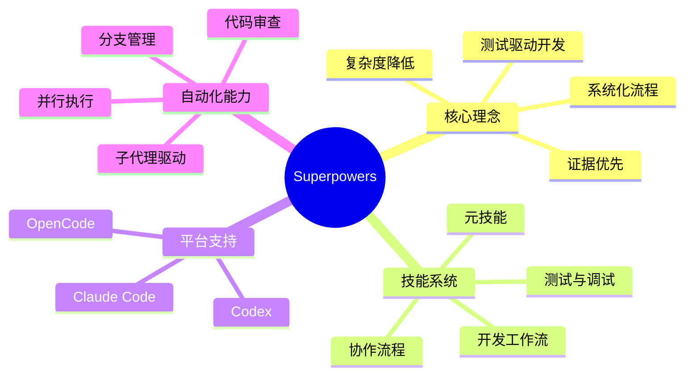

## Superpowers 的核心价值

### 为什么需要 Superpowers

传统的 AI 编程助手常常存在以下问题：

1. **缺乏规划**：直接开始写代码，没有整体设计
2. **测试后置**：先写代码后补测试，或者根本不写测试
3. **缺乏审查**：AI 生成的代码缺少系统性审查机制
4. **工作流混乱**：没有标准的开发流程

Superpowers 通过强制执行最佳实践来解决这些问题：

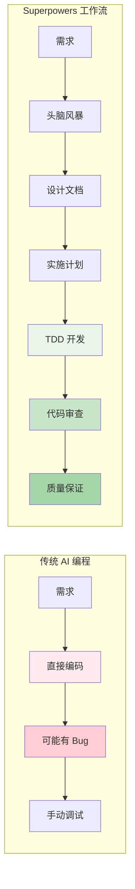

### 四大核心原则

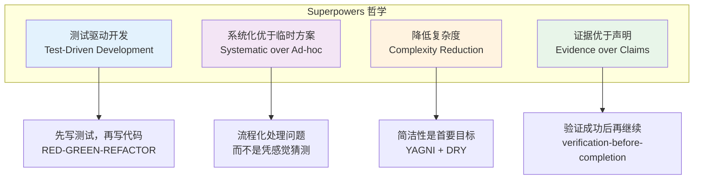

## 系统架构

### 双仓库设计

Superpowers 采用双仓库架构：

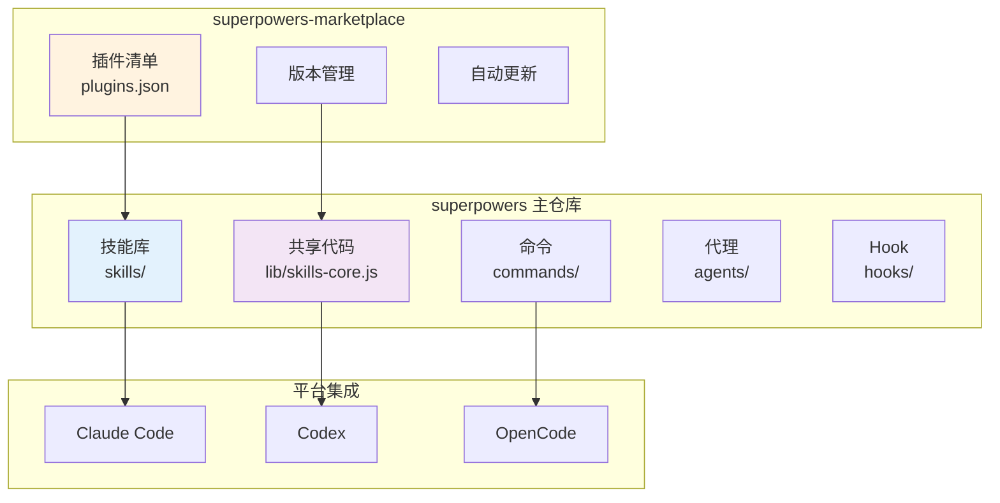

### 技能系统层次结构

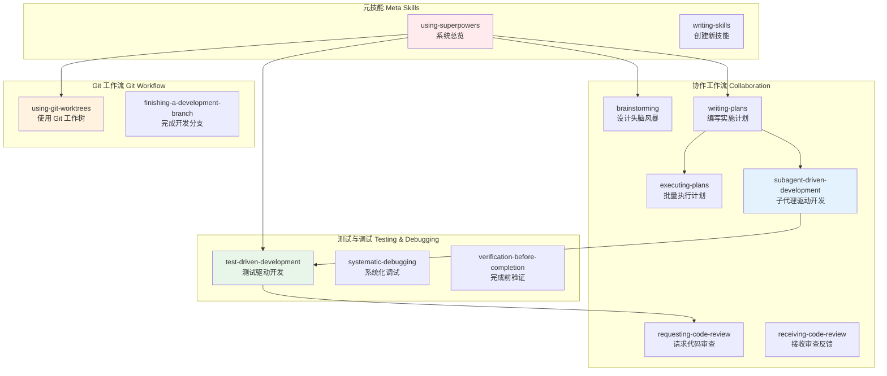

## 安装配置

### Claude Code 安装（推荐）

Claude Code 通过内置的插件市场安装最为便捷：

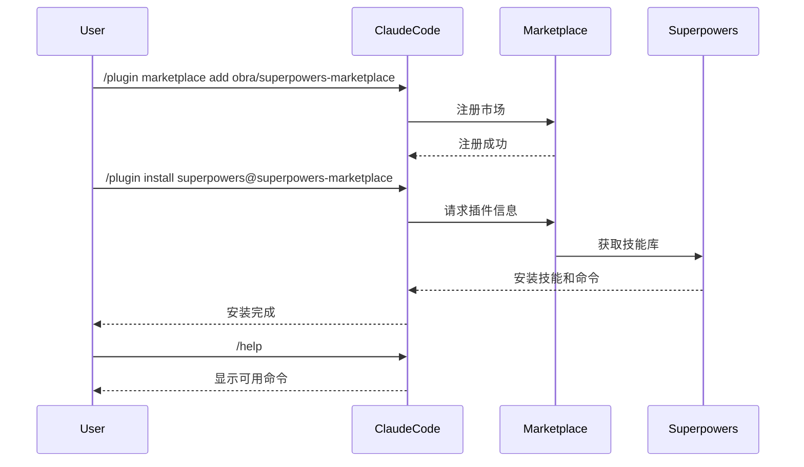

**安装步骤：**

1. 在 Claude Code 中执行：
```bash
/plugin marketplace add obra/superpowers-marketplace
```

2. 安装 Superpowers 插件：
```bash
/plugin install superpowers@superpowers-marketplace
```

3. 验证安装：
```bash
/help
```

你应该看到以下命令：
- `/superpowers:brainstorm` - 交互式设计改进
- `/superpowers:write-plan` - 创建实施计划
- `/superpowers:execute-plan` - 批量执行计划

### Codex 安装

对于 Codex 用户：

```bash
# 告诉 Codex 获取并遵循安装指令
Fetch and follow instructions from https://raw.githubusercontent.com/obra/superpowers/refs/heads/main/.codex/INSTALL.md
```

### OpenCode 安装

对于 OpenCode 用户：

```bash
# 告诉 OpenCode 获取并遵循安装指令
Fetch and follow instructions from https://raw.githubusercontent.com/obra/superpowers/refs/heads/main/.opencode/INSTALL.md
```

## 完整开发工作流

### 阶段 1：头脑风暴与设计

使用 `brainstorming` 技能，AI 会通过苏格拉底式提问来帮你梳理需求：

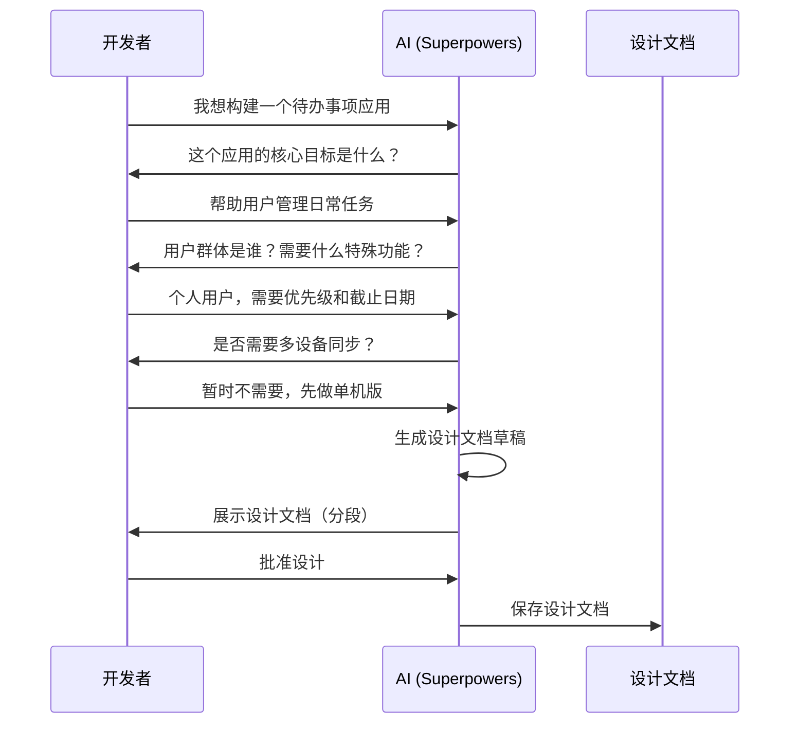

**实际使用示例：**

```
开发者: 我想给我的博客添加评论系统

AI: 在开始之前，让我先了解一些细节：

1. 这个评论系统的主要目标是什么？
   - 增加读者互动？
   - 收集反馈？
   - 构建社区？

2. 你希望评论系统支持哪些功能？
   - 嵌套回复？
   - Markdown 支持？
   - 用户身份验证？
   - 垃圾评论过滤？

3. 技术栈限制？
   - 后端语言和框架？
   - 数据库选择？
   - 是否需要实时更新？
```

### 阶段 2：Git 工作树设置

使用 `using-git-worktrees` 技能创建隔离的开发环境：

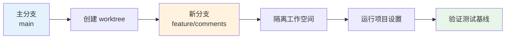

**执行的操作：**

```bash
# AI 自动执行
git worktree add ../myproject-feature-comments feature/comments
cd ../myproject-feature-comments
npm install  # 或其他项目设置命令
npm test     # 验证测试基线
```

### 阶段 3：编写实施计划

使用 `writing-plans` 技能将设计分解为可执行任务：

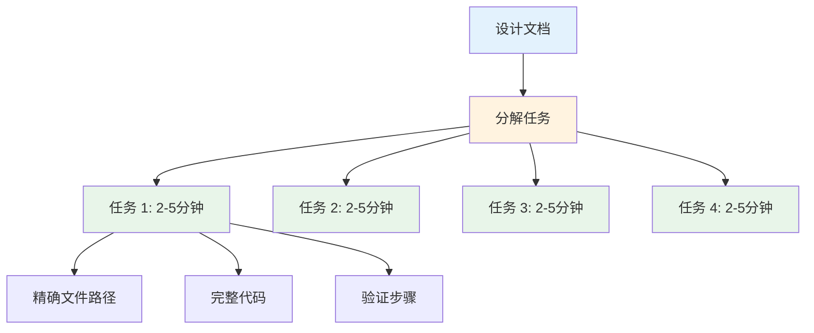

**计划示例：**

```markdown
## 实施计划：评论系统

### 任务 1：创建评论数据模型（预计 3 分钟）
**文件:** `src/models/Comment.js`
**操作:**
- 定义 Comment schema (id, author, content, timestamp, parentId)
- 添加索引
- 实现验证逻辑

**验证步骤:**
- 运行 `npm test models/Comment.test.js`
- 确保所有模型测试通过

### 任务 2：实现评论 API 端点（预计 4 分钟）
**文件:** `src/routes/comments.js`
**操作:**
- POST /comments - 创建评论
- GET /comments/:postId - 获取评论列表
- DELETE /comments/:id - 删除评论

**验证步骤:**
- 运行 `npm test routes/comments.test.js`
- 使用 curl 测试端点

### 任务 3：添加前端评论组件（预计 5 分钟）
...
```

### 阶段 4：子代理驱动开发

使用 `subagent-driven-development` 技能进行快速迭代：

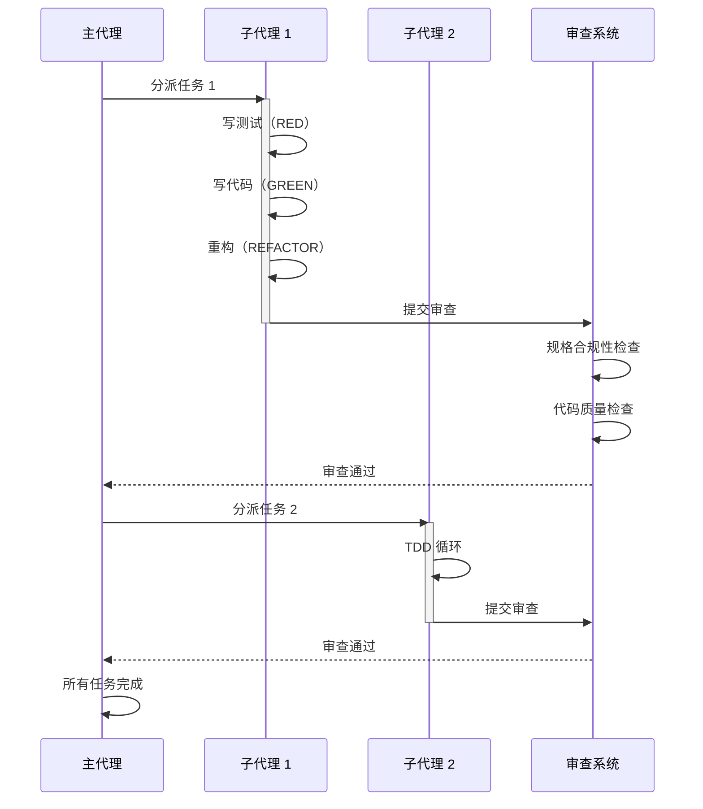

**两阶段审查流程：**

1. **规格合规性审查**：确保实现符合计划
2. **代码质量审查**：检查代码质量、测试覆盖率、最佳实践

### 阶段 5：测试驱动开发（TDD）

Superpowers 强制执行 RED-GREEN-REFACTOR 循环：

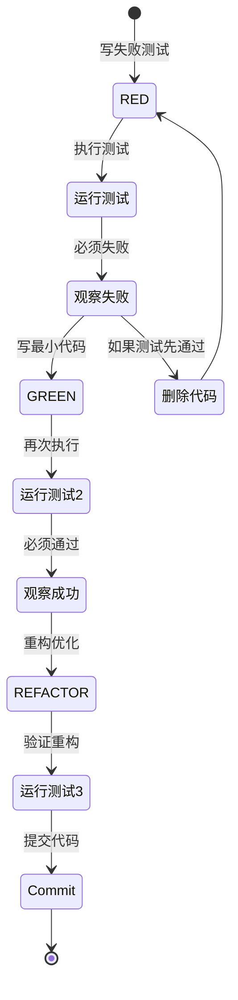

**TDD 反模式检测：**

Superpowers 会自动检测并阻止以下反模式：

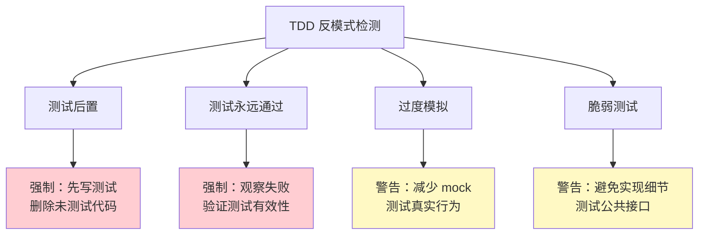

### 阶段 6：代码审查

使用 `requesting-code-review` 技能进行系统化审查：

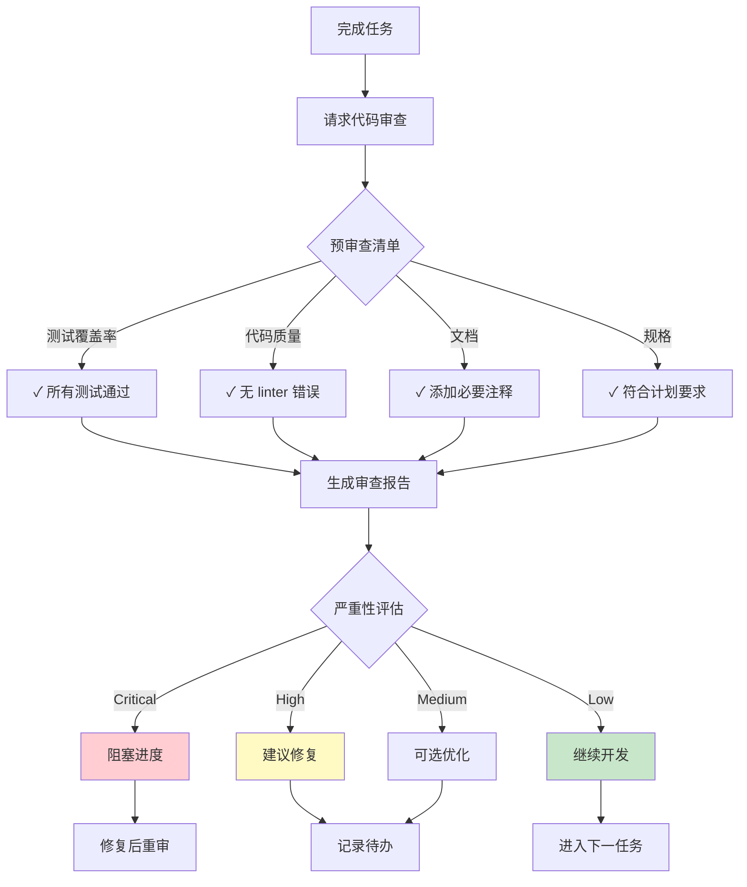

### 阶段 7：完成开发分支

使用 `finishing-a-development-branch` 技能收尾：

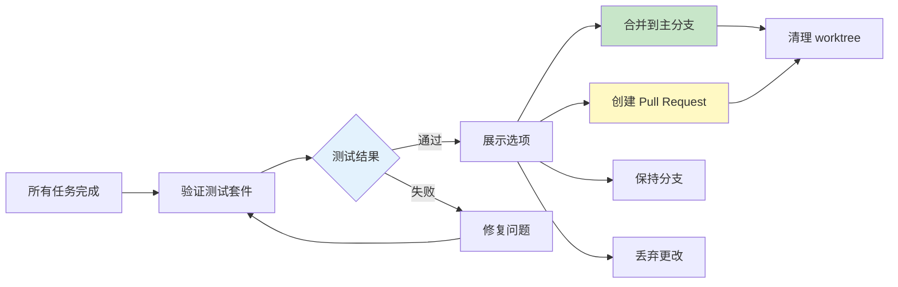

## 核心技能详解

### test-driven-development（测试驱动开发）

**强制执行的流程：**

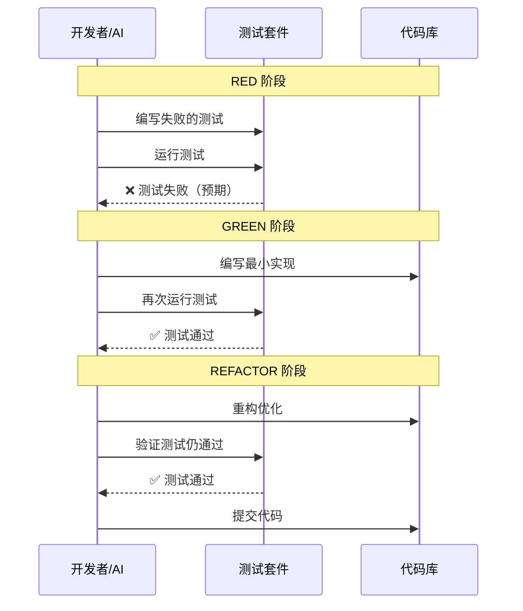

**代码示例：**

```javascript
// RED: 先写测试
describe('CommentService', () => {
  it('should create a new comment', async () => {
    const comment = await commentService.create({
      author: 'Alice',
      content: 'Great post!',
      postId: '123'
    });
    
    expect(comment.id).toBeDefined();
    expect(comment.author).toBe('Alice');
    expect(comment.timestamp).toBeInstanceOf(Date);
  });
});

// 运行测试 -> 失败（因为 commentService 还不存在）

// GREEN: 写最小实现
class CommentService {
  async create(data) {
    return {
      id: generateId(),
      author: data.author,
      content: data.content,
      postId: data.postId,
      timestamp: new Date()
    };
  }
}

// 运行测试 -> 通过

// REFACTOR: 优化代码
class CommentService {
  constructor(database) {
    this.db = database;
  }
  
  async create(data) {
    this.validateInput(data);
    const comment = await this.db.comments.insert({
      ...data,
      id: generateId(),
      timestamp: new Date(),
      status: 'active'
    });
    return comment;
  }
  
  validateInput(data) {
    if (!data.author || !data.content) {
      throw new Error('Missing required fields');
    }
  }
}

// 运行测试 -> 仍然通过
```

### systematic-debugging（系统化调试）

**四阶段根因分析流程：**

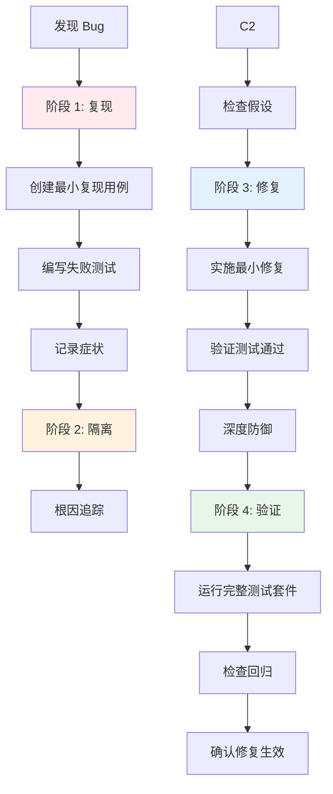

**调试示例：**

```javascript
// 问题：评论无法保存

// 阶段 1: 复现
test('should save comment to database', async () => {
  const comment = await commentService.create({
    author: 'Bob',
    content: 'Test comment'
  });
  
  const saved = await db.comments.findById(comment.id);
  expect(saved).toBeDefined(); // 失败！
});

// 阶段 2: 隔离 - 根因追踪
async create(data) {
  console.log('Input:', data); // ✓ 数据正确
  const comment = {
    id: generateId(),
    ...data,
    timestamp: new Date()
  };
  console.log('Before save:', comment); // ✓ 对象正确
  
  await this.db.comments.insert(comment);
  console.log('After save'); // ✗ 这里没有执行到
  
  return comment;
}

// 发现：insert 方法抛出异常但被吞没了

// 阶段 3: 修复
async create(data) {
  try {
    const comment = {
      id: generateId(),
      ...data,
      timestamp: new Date()
    };
    
    await this.db.comments.insert(comment);
    return comment;
  } catch (error) {
    logger.error('Failed to create comment:', error);
    throw new Error(`Comment creation failed: ${error.message}`);
  }
}

// 深度防御：添加输入验证
validateInput(data) {
  if (!data.author || typeof data.author !== 'string') {
    throw new ValidationError('Invalid author');
  }
  if (!data.content || data.content.length > 10000) {
    throw new ValidationError('Invalid content');
  }
}

// 阶段 4: 验证
test('should handle database errors gracefully', async () => {
  db.comments.insert = jest.fn().mockRejectedValue(new Error('DB Error'));
  
  await expect(commentService.create({
    author: 'Bob',
    content: 'Test'
  })).rejects.toThrow('Comment creation failed');
});
```

### brainstorming（头脑风暴）

**苏格拉底式提问流程：**

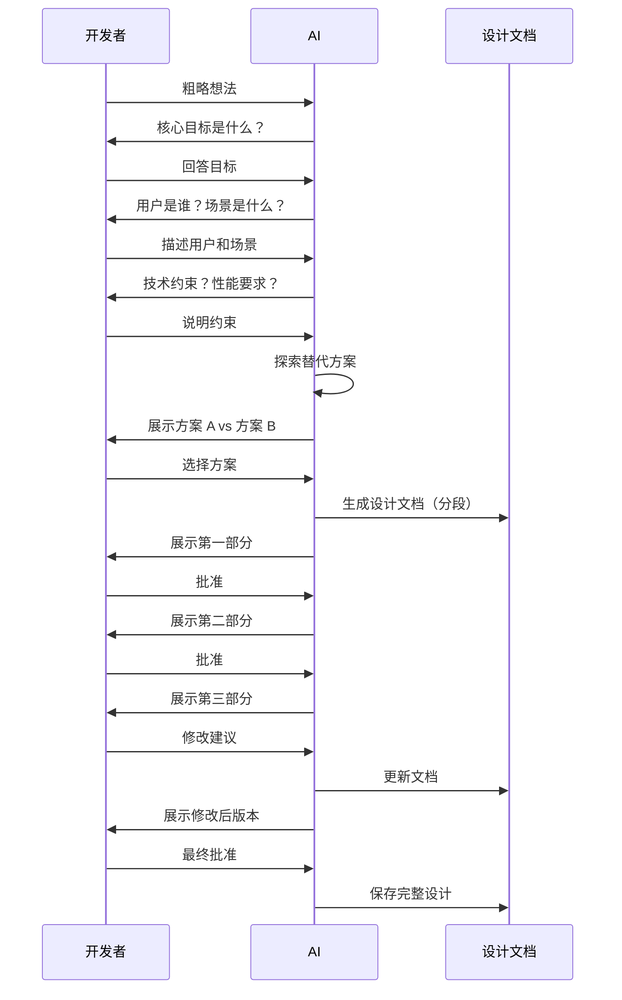

### subagent-driven-development（子代理驱动开发）

**并行开发架构：**

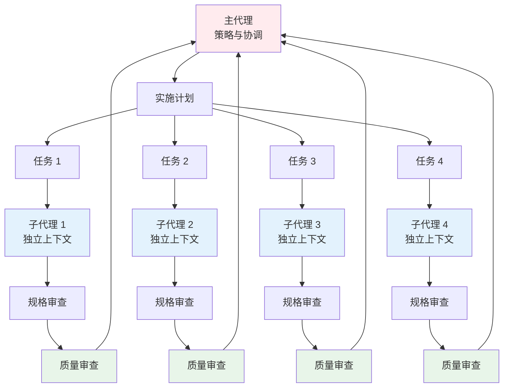

## 实战示例

### 示例 1：构建 RESTful API

**场景：**为博客系统添加评论 API

**完整流程：**

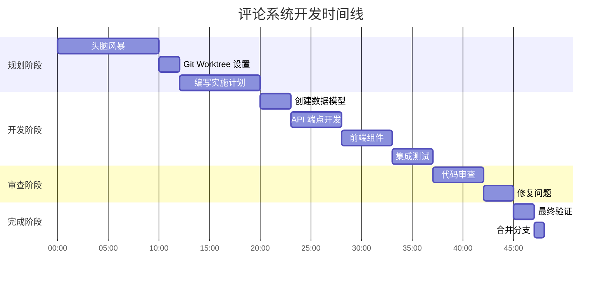

**第 1 步：头脑风暴**

```
开发者: 我想给博客添加评论功能

AI: 让我帮你梳理需求：

1. 评论功能的核心目标？
   - 增加互动性
   - 收集反馈
   - 构建社区

2. 需要支持的功能？
   [  ] 匿名评论
   [✓] 注册用户评论
   [✓] 嵌套回复
   [  ] Markdown 支持
   [✓] 点赞/点踩
   [✓] 举报功能

3. 技术栈？
   - 后端: Node.js + Express
   - 数据库: MongoDB
   - 认证: JWT

AI: 基于你的需求，我建议以下架构...
```

**第 2 步：实施计划**

```markdown
## 评论系统实施计划

### Phase 1: 数据层 (15 分钟)
- Task 1.1: Comment 模型 (3 min)
- Task 1.2: 数据库索引 (2 min)
- Task 1.3: 数据验证器 (2 min)

### Phase 2: API 层 (20 分钟)
- Task 2.1: POST /api/comments (4 min)
- Task 2.2: GET /api/comments/:postId (3 min)
- Task 2.3: POST /api/comments/:id/reply (4 min)
- Task 2.4: DELETE /api/comments/:id (3 min)

### Phase 3: 前端 (15 分钟)
- Task 3.1: CommentList 组件 (5 min)
- Task 3.2: CommentForm 组件 (4 min)
- Task 3.3: 集成到博客页面 (3 min)
```

**第 3 步：TDD 开发（以 Task 1.1 为例）**

```javascript
// Step 1: 写测试（RED）
describe('Comment Model', () => {
  it('should create a comment with required fields', () => {
    const comment = new Comment({
      author: 'user123',
      content: 'Great post!',
      postId: 'post456'
    });
    
    expect(comment.author).toBe('user123');
    expect(comment.content).toBe('Great post!');
    expect(comment.postId).toBe('post456');
    expect(comment.createdAt).toBeInstanceOf(Date);
  });
  
  it('should fail without required fields', () => {
    expect(() => new Comment({})).toThrow();
  });
  
  it('should support nested replies', () => {
    const parent = new Comment({
      author: 'user1',
      content: 'Parent',
      postId: 'post1'
    });
    
    const reply = new Comment({
      author: 'user2',
      content: 'Reply',
      postId: 'post1',
      parentId: parent.id
    });
    
    expect(reply.parentId).toBe(parent.id);
  });
});

// 运行测试 -> 失败 ✗

// Step 2: 写实现（GREEN）
const mongoose = require('mongoose');

const commentSchema = new mongoose.Schema({
  author: {
    type: String,
    required: true
  },
  content: {
    type: String,
    required: true,
    maxlength: 10000
  },
  postId: {
    type: String,
    required: true,
    index: true
  },
  parentId: {
    type: String,
    default: null
  },
  likes: {
    type: Number,
    default: 0
  },
  createdAt: {
    type: Date,
    default: Date.now
  },
  status: {
    type: String,
    enum: ['active', 'deleted', 'flagged'],
    default: 'active'
  }
});

module.exports = mongoose.model('Comment', commentSchema);

// 运行测试 -> 通过 ✓

// Step 3: 重构（REFACTOR）
commentSchema.methods.isReply = function() {
  return this.parentId !== null;
};

commentSchema.statics.findByPost = function(postId) {
  return this.find({ postId, status: 'active' })
    .sort({ createdAt: -1 });
};

// 运行测试 -> 仍然通过 ✓
```

### 示例 2：修复性能问题

**场景：**评论列表加载缓慢

**系统化调试流程：**

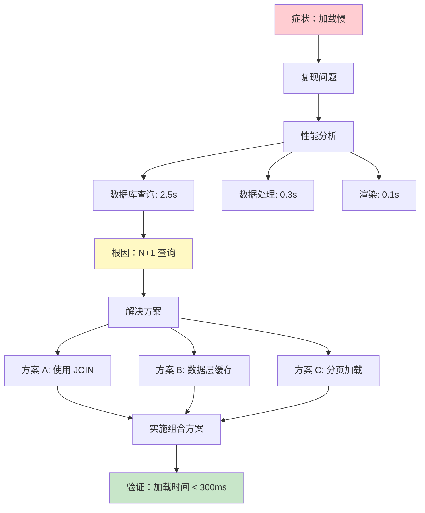

**修复代码：**

```javascript
// 问题代码（N+1 查询）
async getComments(postId) {
  const comments = await Comment.find({ postId });
  
  // 为每个评论单独查询作者信息
  for (let comment of comments) {
    comment.author = await User.findById(comment.authorId); // N+1 !
  }
  
  return comments;
}

// 性能：2500ms（1000条评论）

// 修复方案 1: 使用聚合查询
async getComments(postId) {
  const comments = await Comment.aggregate([
    { $match: { postId, status: 'active' } },
    {
      $lookup: {
        from: 'users',
        localField: 'authorId',
        foreignField: '_id',
        as: 'author'
      }
    },
    { $unwind: '$author' },
    { $sort: { createdAt: -1 } }
  ]);
  
  return comments;
}

// 性能：450ms -> 改善 82%

// 修复方案 2: 添加分页
async getComments(postId, page = 1, limit = 20) {
  const skip = (page - 1) * limit;
  
  const [comments, total] = await Promise.all([
    Comment.aggregate([
      { $match: { postId, status: 'active' } },
      { $lookup: { /* ... */ } },
      { $sort: { createdAt: -1 } },
      { $skip: skip },
      { $limit: limit }
    ]),
    Comment.countDocuments({ postId, status: 'active' })
  ]);
  
  return {
    comments,
    pagination: {
      page,
      limit,
      total,
      pages: Math.ceil(total / limit)
    }
  };
}

// 性能：180ms -> 改善 93%

// 修复方案 3: 添加缓存层
const cache = new Redis();

async getComments(postId, page = 1) {
  const cacheKey = `comments:${postId}:${page}`;
  
  // 尝试从缓存获取
  const cached = await cache.get(cacheKey);
  if (cached) {
    return JSON.parse(cached);
  }
  
  // 缓存未命中，查询数据库
  const result = await this.getCommentsFromDB(postId, page);
  
  // 缓存 5 分钟
  await cache.setex(cacheKey, 300, JSON.stringify(result));
  
  return result;
}

// 性能（缓存命中）：5ms -> 改善 99.8%
```

**验证修复：**

```javascript
describe('Comment Performance', () => {
  it('should load 1000 comments in < 500ms', async () => {
    const start = Date.now();
    const comments = await commentService.getComments('test-post');
    const duration = Date.now() - start;
    
    expect(comments.length).toBe(1000);
    expect(duration).toBeLessThan(500);
  });
  
  it('should handle cache correctly', async () => {
    // 第一次查询（未缓存）
    const start1 = Date.now();
    await commentService.getComments('test-post');
    const duration1 = Date.now() - start1;
    
    // 第二次查询（已缓存）
    const start2 = Date.now();
    await commentService.getComments('test-post');
    const duration2 = Date.now() - start2;
    
    expect(duration2).toBeLessThan(duration1 / 10);
  });
});
```

### 示例 3：重构遗留代码

**场景：**清理混乱的评论管理代码

**重构工作流：**

```mermaid
graph LR
    A[遗留代码] --> B[添加测试]
    B --> C[验证行为]
    C --> D{测试通过?}
    D -->|否| B
    D -->|是| E[小步重构]
    E --> F[运行测试]
    F --> G{测试通过?}
    G -->|否| H[回滚]
    G -->|是| I[提交]
    H --> E
    I --> J{完成?}
    J -->|否| E
    J -->|是| K[清理代码]
    
    style A fill:#ffcdd2
    style E fill:#fff3e0
    style K fill:#c8e6c9
```

**重构示例：**

```javascript
// 遗留代码（坏味道：长函数、重复逻辑、缺少错误处理）
app.post('/api/comments', async (req, res) => {
  const author = req.body.author;
  const content = req.body.content;
  const postId = req.body.postId;
  
  if (!author || author.length < 2) {
    res.status(400).send('Invalid author');
    return;
  }
  if (!content || content.length < 1 || content.length > 10000) {
    res.status(400).send('Invalid content');
    return;
  }
  if (!postId) {
    res.status(400).send('Invalid postId');
    return;
  }
  
  const comment = {
    id: Math.random().toString(36),
    author: author,
    content: content,
    postId: postId,
    timestamp: new Date(),
    likes: 0
  };
  
  try {
    await db.collection('comments').insertOne(comment);
    res.json(comment);
  } catch (e) {
    res.status(500).send('Error');
  }
});

// Step 1: 添加测试以保护现有行为
describe('POST /api/comments', () => {
  it('should create a comment with valid data', async () => {
    const response = await request(app)
      .post('/api/comments')
      .send({
        author: 'Alice',
        content: 'Great post!',
        postId: 'post123'
      });
    
    expect(response.status).toBe(200);
    expect(response.body.author).toBe('Alice');
  });
  
  it('should reject invalid author', async () => {
    const response = await request(app)
      .post('/api/comments')
      .send({
        author: 'A',
        content: 'Great post!',
        postId: 'post123'
      });
    
    expect(response.status).toBe(400);
  });
});

// Step 2: 提取验证逻辑
class CommentValidator {
  static validate(data) {
    const errors = [];
    
    if (!data.author || data.author.length < 2) {
      errors.push('Author must be at least 2 characters');
    }
    
    if (!data.content || data.content.length < 1 || data.content.length > 10000) {
      errors.push('Content must be between 1 and 10000 characters');
    }
    
    if (!data.postId) {
      errors.push('Post ID is required');
    }
    
    return {
      isValid: errors.length === 0,
      errors
    };
  }
}

// 运行测试 -> 仍然通过 ✓

// Step 3: 提取业务逻辑到服务层
class CommentService {
  constructor(database) {
    this.db = database;
  }
  
  async create(data) {
    const validation = CommentValidator.validate(data);
    if (!validation.isValid) {
      throw new ValidationError(validation.errors);
    }
    
    const comment = {
      id: generateId(),
      author: data.author,
      content: data.content,
      postId: data.postId,
      timestamp: new Date(),
      likes: 0,
      status: 'active'
    };
    
    await this.db.collection('comments').insertOne(comment);
    return comment;
  }
}

// 运行测试 -> 仍然通过 ✓

// Step 4: 简化路由处理器
app.post('/api/comments', async (req, res, next) => {
  try {
    const comment = await commentService.create(req.body);
    res.json(comment);
  } catch (error) {
    next(error);
  }
});

// 运行测试 -> 仍然通过 ✓

// Step 5: 添加统一错误处理
app.use((error, req, res, next) => {
  if (error instanceof ValidationError) {
    return res.status(400).json({
      error: 'Validation failed',
      details: error.errors
    });
  }
  
  logger.error('Unexpected error:', error);
  res.status(500).json({
    error: 'Internal server error'
  });
});

// 最终结果：
// - 职责分离
// - 易于测试
// - 统一错误处理
// - 可维护性提升
```

## 高级技巧

### 1. 并行任务执行

使用 `dispatching-parallel-agents` 技能加速开发：

```mermaid
graph TB
    Main[主代理] --> Split[任务分解]
    
    Split --> Group1[独立模块 A]
    Split --> Group2[独立模块 B]
    Split --> Group3[独立模块 C]
    
    Group1 --> Agent1[代理 1]
    Group1 --> Agent2[代理 2]
    
    Group2 --> Agent3[代理 3]
    Group2 --> Agent4[代理 4]
    
    Group3 --> Agent5[代理 5]
    Group3 --> Agent6[代理 6]
    
    Agent1 & Agent2 --> Merge1[集成 A]
    Agent3 & Agent4 --> Merge2[集成 B]
    Agent5 & Agent6 --> Merge3[集成 C]
    
    Merge1 & Merge2 & Merge3 --> Final[最终集成]
    
    style Main fill:#ffebee
    style Agent1 fill:#e3f2fd
    style Agent2 fill:#e3f2fd
    style Agent3 fill:#e3f2fd
    style Agent4 fill:#e3f2fd
    style Agent5 fill:#e3f2fd
    style Agent6 fill:#e3f2fd
    style Final fill:#e8f5e9
```

### 2. 创建自定义技能

使用 `writing-skills` 技能创建团队特定的工作流：

```markdown
# 技能名称: api-documentation

## 何时激活
当完成 API 端点实现后

## 执行步骤

1. 扫描路由定义
2. 为每个端点生成 OpenAPI 规范
3. 添加请求/响应示例
4. 生成 Postman 集合
5. 更新 README.md

## 输出
- openapi.yaml
- postman_collection.json
- API_DOCS.md

## 验证
- OpenAPI 规范有效
- 所有端点已文档化
- 示例可执行
```

### 3. 持续集成整合

将 Superpowers 流程集成到 CI/CD：

```yaml
# .github/workflows/superpowers-ci.yml
name: Superpowers CI

on:
  pull_request:
    branches: [main]

jobs:
  superpowers-review:
    runs-on: ubuntu-latest
    steps:
      - uses: actions/checkout@v3
      
      - name: Run TDD Verification
        run: |
          # 验证所有代码都有对应测试
          npm run test:coverage
          if [ $(coverage-percentage) -lt 80 ]; then
            echo "❌ Test coverage below 80%"
            exit 1
          fi
      
      - name: Run Code Quality Check
        run: |
          npm run lint
          npm run test
      
      - name: Verify Plan Compliance
        run: |
          # 检查是否遵循实施计划
          node scripts/verify-plan.js
```

## 最佳实践

### 1. 保持任务粒度小

```mermaid
graph LR
    Bad[大任务<br/>30分钟] --> B1[❌ 难以审查]
    Bad --> B2[❌ 容易偏离]
    Bad --> B3[❌ 回滚代价高]
    
    Good[小任务<br/>2-5分钟] --> G1[✓ 易于审查]
    Good --> G2[✓ 专注单一目标]
    Good --> G3[✓ 快速迭代]
    
    style Bad fill:#ffcdd2
    style Good fill:#c8e6c9
```

### 2. 始终编写测试

```javascript
// ❌ 不好：没有测试
function calculateTotal(items) {
  return items.reduce((sum, item) => sum + item.price, 0);
}

// ✓ 好：测试先行
describe('calculateTotal', () => {
  it('should sum item prices', () => {
    const items = [
      { price: 10 },
      { price: 20 },
      { price: 30 }
    ];
    expect(calculateTotal(items)).toBe(60);
  });
  
  it('should handle empty array', () => {
    expect(calculateTotal([])).toBe(0);
  });
  
  it('should handle items with discount', () => {
    const items = [
      { price: 100, discount: 0.1 }
    ];
    expect(calculateTotal(items)).toBe(90);
  });
});
```

### 3. 遵循 YAGNI 原则

```javascript
// ❌ 不好：过度设计
class CommentService {
  async create(data) {
    // 未来可能需要的功能（但现在不需要）
    await this.notifySubscribers(data);
    await this.updateSearchIndex(data);
    await this.generateSummary(data);
    await this.checkSentiment(data);
    
    return await this.db.comments.insert(data);
  }
}

// ✓ 好：只实现当前需要的
class CommentService {
  async create(data) {
    return await this.db.comments.insert(data);
  }
}

// 需要时再添加功能
class CommentService {
  async create(data) {
    const comment = await this.db.comments.insert(data);
    
    // 现在确实需要通知了
    await this.notifySubscribers(comment);
    
    return comment;
  }
}
```

### 4. 代码审查清单

```mermaid
graph TD
    Start[开始审查] --> Q1{是否有测试?}
    Q1 -->|否| Fail1[❌ 拒绝]
    Q1 -->|是| Q2{测试是否通过?}
    
    Q2 -->|否| Fail2[❌ 拒绝]
    Q2 -->|是| Q3{符合计划?}
    
    Q3 -->|否| Fail3[❌ 拒绝]
    Q3 -->|是| Q4{代码质量?}
    
    Q4 -->|差| Review[要求改进]
    Q4 -->|好| Q5{文档完整?}
    
    Q5 -->|否| Review
    Q5 -->|是| Pass[✓ 批准]
    
    style Fail1 fill:#ffcdd2
    style Fail2 fill:#ffcdd2
    style Fail3 fill:#ffcdd2
    style Pass fill:#c8e6c9
```

## 故障排除

### 常见问题

**1. 子代理偏离计划**

```mermaid
graph LR
    Problem[子代理偏离计划] --> Check1{计划是否清晰?}
    Check1 -->|否| Fix1[重写计划<br/>添加更多细节]
    Check1 -->|是| Check2{任务是否太大?}
    Check2 -->|是| Fix2[分解任务<br/>减小粒度]
    Check2 -->|否| Check3{验证步骤是否明确?}
    Check3 -->|否| Fix3[添加具体验证标准]
    
    style Problem fill:#ffcdd2
    style Fix1 fill:#fff9c4
    style Fix2 fill:#fff9c4
    style Fix3 fill:#fff9c4
```

**2. 测试覆盖率不足**

```javascript
// 问题：只测试了快乐路径
test('should create comment', async () => {
  const comment = await commentService.create({
    author: 'Alice',
    content: 'Great!'
  });
  expect(comment.id).toBeDefined();
});

// 解决：添加边界情况和错误场景
describe('CommentService.create', () => {
  // 快乐路径
  it('should create comment with valid data', async () => {
    const comment = await commentService.create({
      author: 'Alice',
      content: 'Great!'
    });
    expect(comment.id).toBeDefined();
  });
  
  // 边界情况
  it('should handle minimum length content', async () => {
    const comment = await commentService.create({
      author: 'Bob',
      content: 'a'
    });
    expect(comment.content).toBe('a');
  });
  
  it('should handle maximum length content', async () => {
    const longContent = 'a'.repeat(10000);
    const comment = await commentService.create({
      author: 'Bob',
      content: longContent
    });
    expect(comment.content.length).toBe(10000);
  });
  
  // 错误场景
  it('should reject empty author', async () => {
    await expect(commentService.create({
      author: '',
      content: 'Test'
    })).rejects.toThrow('Invalid author');
  });
  
  it('should reject too long content', async () => {
    await expect(commentService.create({
      author: 'Alice',
      content: 'a'.repeat(10001)
    })).rejects.toThrow('Content too long');
  });
  
  it('should handle database errors', async () => {
    db.comments.insert = jest.fn().mockRejectedValue(new Error('DB Error'));
    await expect(commentService.create({
      author: 'Alice',
      content: 'Test'
    })).rejects.toThrow();
  });
});
```

**3. Git Worktree 冲突**

```bash
# 问题：worktree 已存在
Error: worktree 'feature/comments' already exists

# 解决：清理旧 worktree
git worktree list
git worktree remove feature/comments --force
git worktree add ../myproject-feature-comments feature/comments
```

## 性能优化

### 减少子代理调用

```mermaid
graph TB
    Before[优化前] --> B1[20个小任务]
    B1 --> B2[20次子代理调用]
    B2 --> B3[总耗时: 60分钟]
    
    After[优化后] --> A1[5个中等任务]
    A1 --> A2[5次子代理调用]
    A2 --> A3[总耗时: 25分钟]
    
    style B3 fill:#ffcdd2
    style A3 fill:#c8e6c9
```

**优化策略：**

```markdown
# 优化前：任务过细
- Task 1: 创建 Comment 模型（2分钟）
- Task 2: 添加数据库索引（2分钟）
- Task 3: 实现验证方法（2分钟）
- Task 4: 编写模型测试（3分钟）

# 优化后：合理聚合
- Task 1: 实现完整的 Comment 模型（包含schema、索引、验证、测试）（8分钟）
```

### 批量执行计划

使用 `/superpowers:execute-plan` 而不是逐个任务执行：

```bash
# 慢：逐个任务
/superpowers:execute-plan --task 1
# 等待完成
/superpowers:execute-plan --task 2
# 等待完成
...

# 快：批量执行
/superpowers:execute-plan --batch 1-5
# 在检查点暂停供人工审查
```

## 与其他工具集成

### 1. 与 GitHub Copilot 配合

```mermaid
sequenceDiagram
    participant Dev as 开发者
    participant SP as Superpowers
    participant Copilot as GitHub Copilot
    
    Dev->>SP: 生成实施计划
    SP-->>Dev: 详细任务列表
    
    Dev->>SP: 执行任务（TDD）
    SP->>Dev: 编写测试框架
    
    Dev->>Copilot: 提示测试用例
    Copilot-->>Dev: 生成具体测试
    
    Dev->>Copilot: 提示实现代码
    Copilot-->>Dev: 生成实现
    
    Dev->>SP: 运行审查
    SP-->>Dev: 质量报告
```

### 2. 与 CI/CD 集成

```yaml
# .gitlab-ci.yml
stages:
  - test
  - review
  - deploy

superpowers-verify:
  stage: test
  script:
    - npm run test:coverage
    - npm run lint
    - node scripts/verify-tdd-compliance.js
  
code-review:
  stage: review
  script:
    - node scripts/automated-review.js
  artifacts:
    reports:
      codequality: review-report.json
```

### 3. 与项目管理工具集成

```javascript
// scripts/sync-to-jira.js
const plan = require('./implementation-plan.json');

plan.tasks.forEach(task => {
  jira.createIssue({
    project: 'PROJ',
    summary: task.description,
    description: task.details,
    timeEstimate: task.estimatedMinutes,
    labels: ['superpowers', 'automated']
  });
});
```

## 总结

Superpowers 通过以下方式重新定义了 AI 辅助编程：

```mermaid
mindmap
  root((Superpowers 价值))
    强制最佳实践
      测试驱动开发
      系统化调试
      代码审查
    提升开发效率
      并行子代理
      自动化审查
      快速迭代
    保证代码质量
      完整测试覆盖
      规范化流程
      持续验证
    降低维护成本
      清晰的设计文档
      详细的实施计划
      可追溯的开发历史
```

### 核心要点

1. **不要跳过规划阶段** - 头脑风暴和设计文档是后续工作的基础
2. **严格遵循 TDD** - 先写测试，再写代码，没有例外
3. **保持任务粒度小** - 2-5分钟的任务最容易管理和审查
4. **信任但验证** - 让子代理工作，但要审查他们的输出
5. **使用 Git Worktrees** - 保持工作空间隔离，便于并行开发

### 下一步

1. **安装 Superpowers**：根据你的平台选择安装方法
2. **尝试小项目**：从简单任务开始熟悉工作流
3. **创建自定义技能**：根据团队需要扩展系统
4. **集成到 CI/CD**：自动化质量保证流程
5. **分享经验**：为社区贡献新技能和最佳实践

## 参考资源

- **GitHub 仓库**: [https://github.com/obra/superpowers](https://github.com/obra/superpowers)
- **市场仓库**: [https://github.com/obra/superpowers-marketplace](https://github.com/obra/superpowers-marketplace)
- **DeepWiki 文档**: [https://deepwiki.com/obra/superpowers](https://deepwiki.com/obra/superpowers)
- **Issues**: [https://github.com/obra/superpowers/issues](https://github.com/obra/superpowers/issues)

---

**许可证**: MIT License

**贡献**: 欢迎提交 Pull Request 贡献新技能和改进

**赞助**: 如果 Superpowers 对你有帮助，考虑[赞助作者](https://github.com/sponsors/obra)

---

*最后更新: 2026-01-17*

