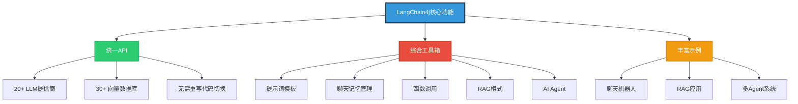
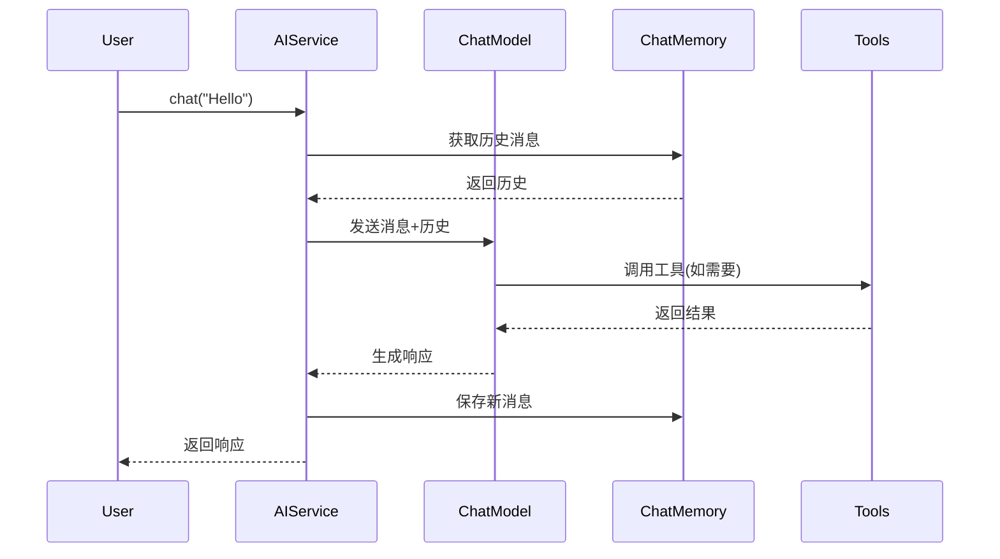
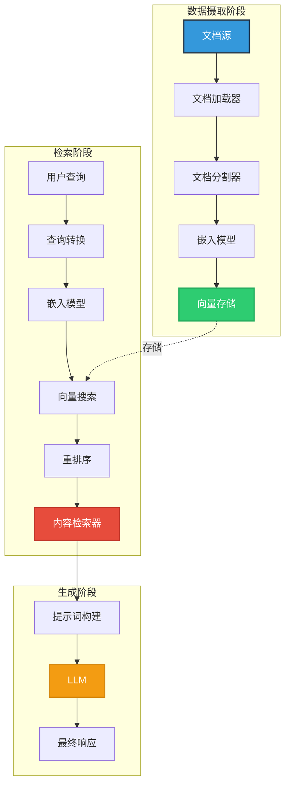
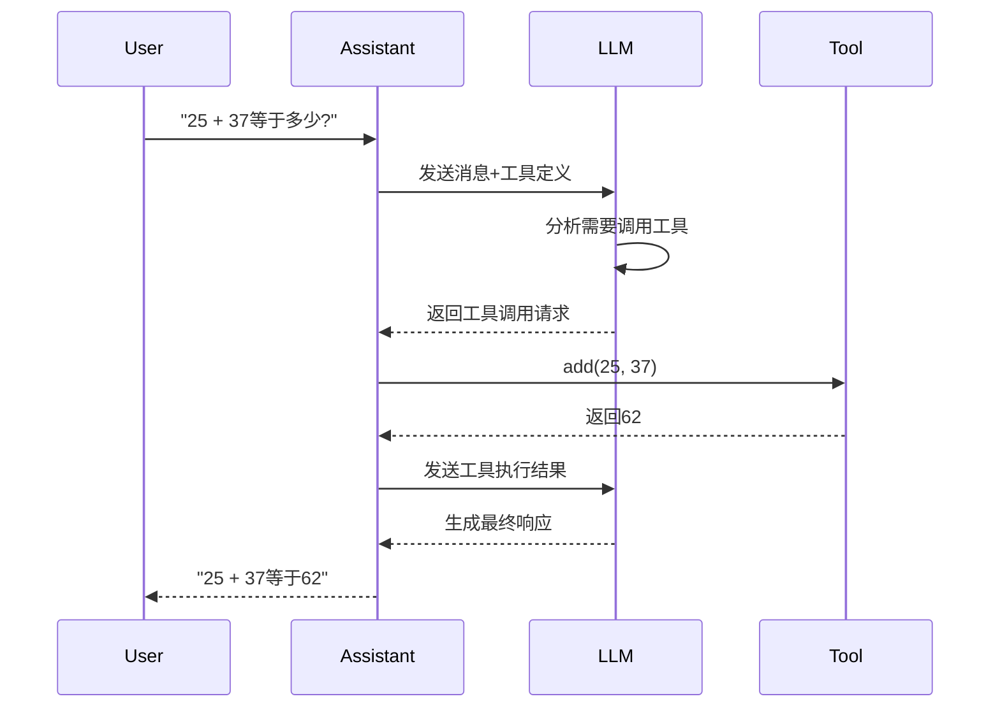
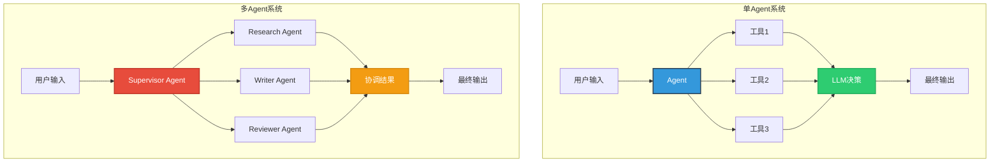
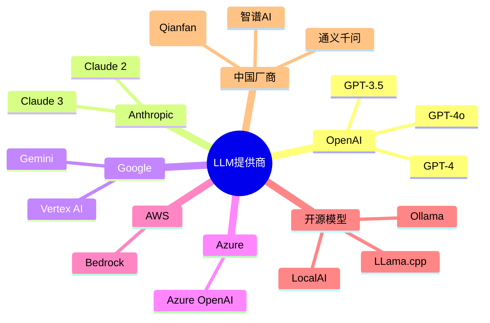
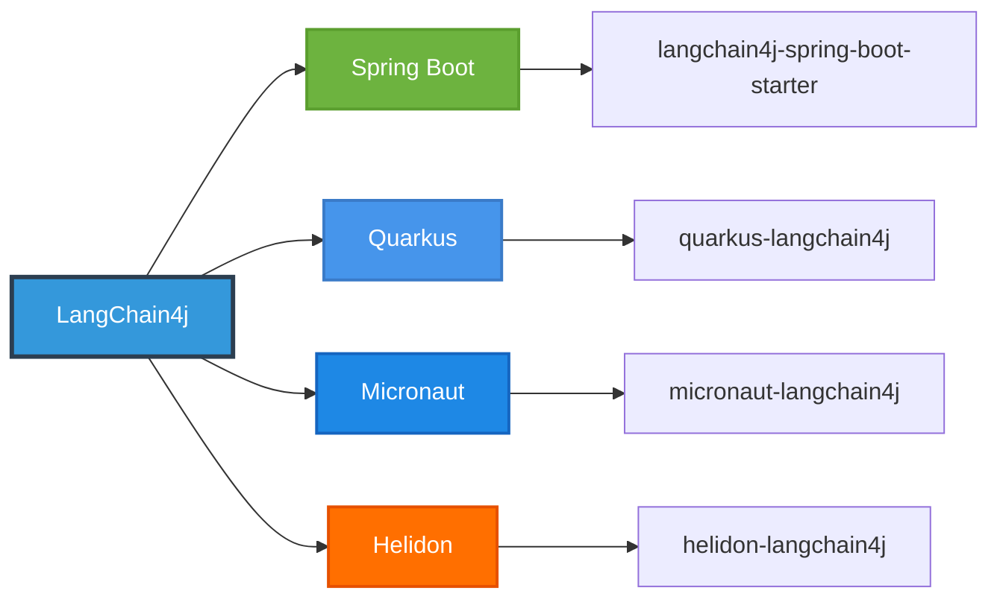
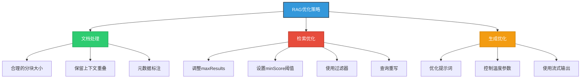

## LangChain4j 简介

LangChain4j是一个开源Java库,旨在简化将大型语言模型(LLM)集成到Java应用程序中的过程。该项目于2023年初在ChatGPT热潮中开始开发,填补了Java生态系统中LLM库的空白。



### 核心特性

1. **统一API接口**
   - 支持20+主流LLM提供商(OpenAI、Anthropic、Google Vertex AI、Azure OpenAI等)
   - 支持30+向量数据库(Pinecone、Chroma、Weaviate、Qdrant等)
   - 无需学习各厂商专有API,统一接口轻松切换

2. **全面的工具箱**
   - 低级功能:提示词模板、聊天记忆、函数调用
   - 高级模式:AI Services、RAG、Agent
   - 每个抽象都提供接口和多种实现

3. **模块化设计**
   - `langchain4j-core`: 核心抽象定义
   - `langchain4j`: 主模块,包含文档加载器、聊天记忆等
   - `langchain4j-{integration}`: 各种集成模块

## 快速开始

### Maven依赖配置

```xml
<dependencies>
    <!-- 核心库 -->
    <dependency>
        <groupId>dev.langchain4j</groupId>
        <artifactId>langchain4j</artifactId>
        <version>1.10.0</version>
    </dependency>
    
    <!-- OpenAI集成 -->
    <dependency>
        <groupId>dev.langchain4j</groupId>
        <artifactId>langchain4j-open-ai</artifactId>
        <version>1.10.0</version>
    </dependency>
    
    <!-- 内存向量存储 -->
    <dependency>
        <groupId>dev.langchain4j</groupId>
        <artifactId>langchain4j-embeddings-all-minilm-l6-v2</artifactId>
        <version>1.10.0</version>
    </dependency>
</dependencies>
```

### 使用SNAPSHOT版本

如果需要测试最新的预发布特性:

```xml
<repositories>
  <repository>
    <name>Central Portal Snapshots</name>
    <id>central-portal-snapshots</id>
    <url>https://central.sonatype.com/repository/maven-snapshots/</url>
    <releases>
      <enabled>false</enabled>
    </releases>
    <snapshots>
      <enabled>true</enabled>
    </snapshots>
  </repository>
</repositories>

<dependencies>
    <dependency>
        <groupId>dev.langchain4j</groupId>
        <artifactId>langchain4j</artifactId>
        <version>1.9.1-SNAPSHOT</version>
    </dependency>
</dependencies>
```

## AI Services - 高级API

AI Services是LangChain4j与ChatModel交互的高级API。您只需定义Java接口,LangChain4j会自动提供实现,隐藏所有复杂性。



### 基础示例

```java
import dev.langchain4j.model.openai.OpenAiChatModel;
import dev.langchain4j.service.AiServices;

interface Assistant {
    String chat(String message);
}

public class BasicExample {
    public static void main(String[] args) {
        // 创建ChatModel
        ChatModel model = OpenAiChatModel.builder()
            .apiKey(System.getenv("OPENAI_API_KEY"))
            .modelName("gpt-4")
            .temperature(0.7)
            .build();
        
        // 创建AI Service
        Assistant assistant = AiServices.create(Assistant.class, model);
        
        // 使用
        String response = assistant.chat("你好,请介绍一下Java");
        System.out.println(response);
    }
}
```

### 使用注解增强功能

```java
import dev.langchain4j.service.SystemMessage;
import dev.langchain4j.service.UserMessage;
import dev.langchain4j.service.V;

interface ChatBot {
    @SystemMessage("你是一家名为Miles of Smiles的公司的礼貌聊天机器人。")
    String reply(String userMessage);
}

interface GreetingExpert {
    @UserMessage("以下文本是问候语吗? 文本: {{it}}")
    boolean isGreeting(String text);
}

interface Translator {
    @UserMessage("将以下文本翻译成{{language}}: {{text}}")
    String translate(@V("language") String language, @V("text") String text);
}
```

## 聊天记忆管理

聊天记忆用于维护对话上下文,使AI能够记住之前的交互。

```mermaid
graph LR
    A[聊天记忆类型] --> B[MessageWindowChatMemory]
    A --> C[TokenWindowChatMemory]
    A --> D[自定义ChatMemory]
    
    B --> B1[保留最近N条消息]
    C --> C1[保留最近N个Token]
    D --> D1[实现ChatMemory接口]
    
    E[多用户场景] --> F[ChatMemoryProvider]
    F --> F1[为每个用户提供独立记忆]
    F --> F2[使用@MemoryId标识用户]
    
    style A fill:#3498db,stroke:#2c3e50,stroke-width:2px,color:#fff
    style E fill:#e74c3c,stroke:#c0392b,stroke-width:2px,color:#fff
```

### 单用户聊天记忆

```java
import dev.langchain4j.memory.chat.MessageWindowChatMemory;
import dev.langchain4j.service.AiServices;

interface Assistant {
    String chat(String message);
}

Assistant assistant = AiServices.builder(Assistant.class)
    .chatModel(model)
    .chatMemory(MessageWindowChatMemory.withMaxMessages(10))
    .build();

// 对话会记住上下文
String response1 = assistant.chat("我叫张三");
String response2 = assistant.chat("我叫什么名字?"); // AI会回答"张三"
```

### 多用户聊天记忆

```java
import dev.langchain4j.service.MemoryId;
import dev.langchain4j.service.UserMessage;
import dev.langchain4j.memory.ChatMemoryAccess;

interface Assistant extends ChatMemoryAccess {
    String chat(@MemoryId int memoryId, @UserMessage String message);
}

Assistant assistant = AiServices.builder(Assistant.class)
    .chatModel(model)
    .chatMemoryProvider(memoryId -> MessageWindowChatMemory.withMaxMessages(10))
    .build();

// 不同用户的对话互不干扰
String answerToKlaus = assistant.chat(1, "你好,我叫Klaus");
String answerToFrancine = assistant.chat(2, "你好,我叫Francine");

// 访问和清理记忆
List<ChatMessage> messagesWithKlaus = assistant.getChatMemory(1).messages();
boolean evicted = assistant.evictChatMemory(2);
```

### 链式AI Services

```java
interface GreetingExpert {
    @UserMessage("以下文本是问候语吗? 文本: {{it}}")
    boolean isGreeting(String text);
}

interface ChatBot {
    @SystemMessage("你是一家名为Miles of Smiles的公司的礼貌聊天机器人。")
    String reply(String userMessage);
}

class MilesOfSmiles {
    private final GreetingExpert greetingExpert;
    private final ChatBot chatBot;
    
    public MilesOfSmiles(GreetingExpert greetingExpert, ChatBot chatBot) {
        this.greetingExpert = greetingExpert;
        this.chatBot = chatBot;
    }
    
    public String handle(String userMessage) {
        if (greetingExpert.isGreeting(userMessage)) {
            return "来自Miles of Smiles的问候!我能为您做些什么?";
        } else {
            return chatBot.reply(userMessage);
        }
    }
}

// 使用
GreetingExpert greetingExpert = AiServices.create(GreetingExpert.class, llama2);
ChatBot chatBot = AiServices.builder(ChatBot.class)
    .chatModel(gpt4)
    .contentRetriever(milesOfSmilesContentRetriever)
    .build();

MilesOfSmiles milesOfSmiles = new MilesOfSmiles(greetingExpert, chatBot);
String greeting = milesOfSmiles.handle("你好");
String answer = milesOfSmiles.handle("你们提供哪些服务?");
```

## RAG - 检索增强生成

RAG通过从外部知识库检索相关信息来增强LLM的响应能力,解决了LLM知识过时和幻觉问题。



### 基础RAG实现

```java
import dev.langchain4j.data.document.Document;
import dev.langchain4j.data.document.loader.FileSystemDocumentLoader;
import dev.langchain4j.data.segment.TextSegment;
import dev.langchain4j.model.embedding.EmbeddingModel;
import dev.langchain4j.model.embedding.onnx.allminilml6v2.AllMiniLmL6V2EmbeddingModel;
import dev.langchain4j.store.embedding.EmbeddingStore;
import dev.langchain4j.store.embedding.inmemory.InMemoryEmbeddingStore;
import dev.langchain4j.data.embedding.Embedding;
import dev.langchain4j.store.embedding.EmbeddingStoreIngestor;

public class BasicRAGExample {
    public static void main(String[] args) {
        // 1. 加载文档
        List<Document> documents = FileSystemDocumentLoader
            .loadDocuments("/path/to/documents");
        
        // 2. 创建嵌入模型
        EmbeddingModel embeddingModel = new AllMiniLmL6V2EmbeddingModel();
        
        // 3. 创建向量存储
        EmbeddingStore<TextSegment> embeddingStore = new InMemoryEmbeddingStore<>();
        
        // 4. 摄取文档
        EmbeddingStoreIngestor.ingest(documents, embeddingStore);
        
        // 5. 创建内容检索器
        ContentRetriever contentRetriever = EmbeddingStoreContentRetriever.builder()
            .embeddingStore(embeddingStore)
            .embeddingModel(embeddingModel)
            .maxResults(5)
            .minScore(0.75)
            .build();
        
        // 6. 创建AI Service
        interface Assistant {
            String chat(String message);
        }
        
        Assistant assistant = AiServices.builder(Assistant.class)
            .chatModel(model)
            .contentRetriever(contentRetriever)
            .build();
        
        // 7. 使用
        String answer = assistant.chat("文档中关于Java的内容是什么?");
        System.out.println(answer);
    }
}
```

### 高级RAG配置

```java
import dev.langchain4j.rag.content.retriever.EmbeddingStoreContentRetriever;
import dev.langchain4j.rag.query.Query;
import dev.langchain4j.service.InvocationParameters;
import static dev.langchain4j.store.embedding.filter.MetadataFilterBuilder.metadataKey;

// 动态配置的内容检索器
ContentRetriever contentRetriever = EmbeddingStoreContentRetriever.builder()
    .embeddingStore(embeddingStore)
    .embeddingModel(embeddingModel)
    .maxResults(3)
    // 动态设置最大结果数
    .dynamicMaxResults(query -> 3)
    .minScore(0.75)
    // 动态设置最小分数
    .dynamicMinScore(query -> 0.75)
    // 静态过滤器
    .filter(metadataKey("userId").isEqualTo("12345"))
    // 动态过滤器
    .dynamicFilter(query -> {
        String userId = query.metadata().invocationParameters().get("userId");
        return metadataKey("userId").isEqualTo(userId);
    })
    .build();

// 使用动态参数
interface Assistant {
    String chat(@UserMessage String userMessage, InvocationParameters parameters);
}

InvocationParameters parameters = InvocationParameters.from(Map.of("userId", "12345"));
String response = assistant.chat("你好", parameters);
```

### 完整RAG示例(使用Qianfan)

```java
import dev.langchain4j.model.qianfan.QianfanChatModel;
import dev.langchain4j.memory.chat.MessageWindowChatMemory;
import dev.langchain4j.rag.content.retriever.EmbeddingStoreContentRetriever;

public class CompleteRAGExample {
    public static void main(String[] args) {
        // 1. 初始化聊天模型
        QianfanChatModel chatModel = QianfanChatModel.builder()
            .apiKey(API_KEY)
            .secretKey(SECRET_KEY)
            .modelName("Yi-34B-Chat")
            .build();
        
        // 2. 加载文档
        List<Document> documents = FileSystemDocumentLoader
            .loadDocuments("/home/langchain4j/documentation");
        
        // 3. 创建嵌入存储并摄取
        InMemoryEmbeddingStore<TextSegment> embeddingStore = new InMemoryEmbeddingStore<>();
        EmbeddingStoreIngestor.ingest(documents, embeddingStore);
        
        // 4. 构建AI Service
        interface IAiService {
            String chat(String question);
        }
        
        IAiService assistant = AiServices.builder(IAiService.class)
            .chatModel(chatModel)
            .chatMemory(MessageWindowChatMemory.withMaxMessages(10))
            .contentRetriever(EmbeddingStoreContentRetriever.from(embeddingStore))
            .build();
        
        // 5. 提问
        String answer = assistant.chat("LangChain4j是什么?");
        System.out.println(answer);
    }
}
```

## 工具调用(Function Calling)

工具调用允许LLM调用Java方法来执行特定任务,如获取实时数据、执行计算等。



### 定义工具

```java
import dev.langchain4j.agent.tool.Tool;
import dev.langchain4j.agent.tool.P;
import java.time.LocalDateTime;

// 计算器工具
class Calculator {
    @Tool("两个数相加")
    int add(@P("第一个数") int a, @P("第二个数") int b) {
        System.out.println("工具调用: add(" + a + ", " + b + ")");
        return a + b;
    }
    
    @Tool("两个数相乘")
    int multiply(@P("第一个数") int a, @P("第二个数") int b) {
        System.out.println("工具调用: multiply(" + a + ", " + b + ")");
        return a * b;
    }
}

// 天气服务工具
class WeatherService {
    @Tool("获取指定城市的当前天气")
    String getWeather(@P("城市名称") String city) {
        System.out.println("工具调用: getWeather(" + city + ")");
        // 实际应用中应调用真实的天气API
        return city + "的天气: 22°C, 晴天";
    }
}

// 时间服务工具
class TimeService {
    @Tool("获取当前日期和时间")
    String getCurrentTime() {
        System.out.println("工具调用: getCurrentTime()");
        return LocalDateTime.now().toString();
    }
}
```

### 使用工具

```java
import dev.langchain4j.model.openai.OpenAiChatModel;
import dev.langchain4j.service.AiServices;
import dev.langchain4j.memory.chat.MessageWindowChatMemory;

public class ToolCallingExample {
    public static void main(String[] args) {
        // 创建聊天模型
        ChatModel model = OpenAiChatModel.builder()
            .apiKey(System.getenv("OPENAI_API_KEY"))
            .modelName("gpt-4o-mini")
            .temperature(0.0)
            .build();
        
        // 定义助手接口
        interface Assistant {
            String chat(String userMessage);
        }
        
        // 创建AI Service并注册工具
        Assistant assistant = AiServices.builder(Assistant.class)
            .chatModel(model)
            .chatMemory(MessageWindowChatMemory.withMaxMessages(10))
            .tools(new Calculator(), new WeatherService(), new TimeService())
            .build();
        
        // LLM会自动调用所需工具
        String result1 = assistant.chat("25 + 37等于多少?");
        System.out.println(result1); // "25 + 37等于62"
        
        String result2 = assistant.chat("巴黎的天气怎么样?");
        System.out.println(result2); // 使用getWeather工具
        
        String result3 = assistant.chat("计算(5 + 3) * 4");
        System.out.println(result3); // 同时使用add和multiply工具: "结果是32"
    }
}
```

### Azure OpenAI工具调用示例

```java
class StockPriceService {
    @Tool("获取指定公司的当前股票价格")
    double getStockPrice(@P("股票代码") String ticker) {
        // 实际应用中应调用真实的股票API
        if ("MSFT".equals(ticker)) {
            return 455.32;
        }
        return 0.0;
    }
}

interface Assistant {
    String chat(String userMessage);
}

public class AzureToolExample {
    public String functionCalling(Model model) {
        String question = "微软当前股价是否高于$450?";
        StockPriceService stockPriceService = new StockPriceService();
        
        Assistant assistant = AiServices.builder(Assistant.class)
            .chatModel(model)
            .tools(stockPriceService)
            .build();
        
        String answer = assistant.chat(question);
        return answer;
    }
}
```

## AI Agent - 多代理系统

AI Agent是能够自主决策和执行任务的智能体,可以组合多个Agent构建复杂的多代理系统。



### 定义Agent接口

```java
import dev.langchain4j.agentic.AgenticServices;

// 研究Agent
interface ResearchAgent {
    String research(String topic);
}

// 写作Agent
interface WriterAgent {
    String write(String research);
}

// 创建Agent实现
ChatModel model = OpenAiChatModel.builder()
    .apiKey(System.getenv("OPENAI_API_KEY"))
    .modelName("gpt-4o-mini")
    .build();

ResearchAgent researcher = AgenticServices.agentBuilder(ResearchAgent.class)
    .chatModel(model)
    .systemPrompt("你是一个研究助手。收集全面的信息。")
    .build();

WriterAgent writer = AgenticServices.agentBuilder(WriterAgent.class)
    .chatModel(model)
    .systemPrompt("你是一个作家。从研究中创作引人入胜的内容。")
    .build();
```

### 顺序工作流

```java
// 创建文章创建器的顺序工作流
interface ArticleCreator {
    String createArticle(String topic);
}

ArticleCreator articleCreator = AgenticServices.sequenceBuilder(ArticleCreator.class)
    .subAgent(researcher, (scope, result) -> {
        scope.put("research", result);
        return scope.get("topic");
    })
    .subAgent(writer, (scope, result) -> scope.get("research"))
    .build();

// 执行顺序工作流
String article = articleCreator.createArticle("人工智能");
System.out.println(article);
```

### Supervisor Agent

```java
import dev.langchain4j.agentic.supervisor.SupervisorAgentService;
import dev.langchain4j.agentic.UntypedAgent;

// 创建Supervisor Agent来协调多个Agent
SupervisorAgentService<UntypedAgent> supervisor = AgenticServices.supervisorBuilder()
    .chatModel(model)
    .subAgents(researcher, writer)
    .maxAgentsInvocations(10)
    .build();

// 使用Supervisor Agent执行
String supervisorResult = supervisor.execute("创作一篇关于AI的综合性文章");
System.out.println(supervisorResult);
```

### 完整多Agent系统示例

```java
import dev.langchain4j.agentic.AgenticServices;
import dev.langchain4j.model.openai.OpenAiChatModel;

public class MultiAgentSystemExample {
    public static void main(String[] args) {
        // 初始化ChatModel
        ChatModel model = OpenAiChatModel.builder()
            .apiKey(System.getenv("OPENAI_API_KEY"))
            .modelName("gpt-4o-mini")
            .build();
        
        // 定义各个Agent
        interface DataAnalyst {
            String analyze(String data);
        }
        
        interface ReportWriter {
            String writeReport(String analysis);
        }
        
        interface QualityChecker {
            String review(String report);
        }
        
        // 创建Agent实例
        DataAnalyst analyst = AgenticServices.agentBuilder(DataAnalyst.class)
            .chatModel(model)
            .systemPrompt("你是数据分析专家,擅长从数据中提取洞察。")
            .build();
        
        ReportWriter writer = AgenticServices.agentBuilder(ReportWriter.class)
            .chatModel(model)
            .systemPrompt("你是报告撰写专家,擅长将分析结果转化为清晰的报告。")
            .build();
        
        QualityChecker checker = AgenticServices.agentBuilder(QualityChecker.class)
            .chatModel(model)
            .systemPrompt("你是质量检查专家,确保报告准确且专业。")
            .build();
        
        // 创建工作流
        interface ReportGenerator {
            String generateReport(String rawData);
        }
        
        ReportGenerator generator = AgenticServices.sequenceBuilder(ReportGenerator.class)
            .subAgent(analyst, (scope, result) -> {
                scope.put("analysis", result);
                return scope.get("rawData");
            })
            .subAgent(writer, (scope, result) -> {
                scope.put("report", result);
                return scope.get("analysis");
            })
            .subAgent(checker, (scope, result) -> scope.get("report"))
            .build();
        
        // 执行
        String finalReport = generator.generateReport("销售数据: Q1: 100万, Q2: 150万, Q3: 180万");
        System.out.println(finalReport);
    }
}
```

## 支持的集成

### LLM提供商(20+)



### 向量数据库(30+)

- **云服务**: Pinecone, Weaviate, Qdrant Cloud, Milvus Cloud
- **开源方案**: Chroma, Elasticsearch, OpenSearch, Redis
- **数据库扩展**: PostgreSQL (pgvector), MongoDB Atlas
- **内存存储**: InMemoryEmbeddingStore (用于测试和原型)

### 框架集成



## 实战示例

### 示例1: 智能客服机器人

```java
import dev.langchain4j.model.openai.OpenAiChatModel;
import dev.langchain4j.service.AiServices;
import dev.langchain4j.service.SystemMessage;
import dev.langchain4j.service.UserMessage;
import dev.langchain4j.memory.chat.MessageWindowChatMemory;
import dev.langchain4j.agent.tool.Tool;

// 定义订单查询工具
class OrderService {
    @Tool("根据订单号查询订单状态")
    String getOrderStatus(@P("订单号") String orderId) {
        // 实际应用中应查询数据库
        return "订单" + orderId + "已发货,预计明天送达";
    }
    
    @Tool("取消指定订单")
    String cancelOrder(@P("订单号") String orderId) {
        // 实际应用中应更新数据库
        return "订单" + orderId + "已成功取消";
    }
}

// 定义客服接口
interface CustomerService {
    @SystemMessage("""
        你是一个专业的客服代表。
        - 始终保持礼貌和友好
        - 使用工具查询订单信息
        - 如果无法解决问题,建议用户联系人工客服
        """)
    String chat(String userMessage);
}

public class CustomerServiceBot {
    public static void main(String[] args) {
        ChatModel model = OpenAiChatModel.builder()
            .apiKey(System.getenv("OPENAI_API_KEY"))
            .modelName("gpt-4")
            .build();
        
        CustomerService service = AiServices.builder(CustomerService.class)
            .chatModel(model)
            .chatMemory(MessageWindowChatMemory.withMaxMessages(20))
            .tools(new OrderService())
            .build();
        
        // 模拟对话
        System.out.println(service.chat("你好,我想查询订单"));
        System.out.println(service.chat("订单号是12345"));
        System.out.println(service.chat("我想取消这个订单"));
    }
}
```

### 示例2: 文档问答系统

```java
import dev.langchain4j.data.document.Document;
import dev.langchain4j.data.document.loader.FileSystemDocumentLoader;
import dev.langchain4j.data.document.parser.TextDocumentParser;
import dev.langchain4j.data.document.splitter.DocumentSplitters;
import dev.langchain4j.data.segment.TextSegment;
import dev.langchain4j.model.embedding.EmbeddingModel;
import dev.langchain4j.model.embedding.onnx.allminilml6v2.AllMiniLmL6V2EmbeddingModel;
import dev.langchain4j.store.embedding.EmbeddingStore;
import dev.langchain4j.store.embedding.inmemory.InMemoryEmbeddingStore;
import dev.langchain4j.rag.content.retriever.EmbeddingStoreContentRetriever;

public class DocumentQASystem {
    public static void main(String[] args) {
        // 1. 加载和分割文档
        List<Document> documents = FileSystemDocumentLoader.loadDocuments(
            "/path/to/documents",
            new TextDocumentParser()
        );
        
        DocumentSplitter splitter = DocumentSplitters.recursive(
            300,  // 每个片段最大字符数
            50    // 重叠字符数
        );
        
        List<TextSegment> segments = splitter.splitAll(documents);
        
        // 2. 创建嵌入模型和存储
        EmbeddingModel embeddingModel = new AllMiniLmL6V2EmbeddingModel();
        EmbeddingStore<TextSegment> embeddingStore = new InMemoryEmbeddingStore<>();
        
        // 3. 嵌入并存储
        for (TextSegment segment : segments) {
            Embedding embedding = embeddingModel.embed(segment).content();
            embeddingStore.add(embedding, segment);
        }
        
        // 4. 创建检索器
        ContentRetriever retriever = EmbeddingStoreContentRetriever.builder()
            .embeddingStore(embeddingStore)
            .embeddingModel(embeddingModel)
            .maxResults(3)
            .minScore(0.7)
            .build();
        
        // 5. 创建问答接口
        interface DocumentAssistant {
            @SystemMessage("根据提供的上下文回答问题。如果上下文中没有相关信息,请说'我不知道'。")
            String answer(String question);
        }
        
        ChatModel model = OpenAiChatModel.builder()
            .apiKey(System.getenv("OPENAI_API_KEY"))
            .modelName("gpt-4")
            .build();
        
        DocumentAssistant assistant = AiServices.builder(DocumentAssistant.class)
            .chatModel(model)
            .contentRetriever(retriever)
            .build();
        
        // 6. 提问
        String answer = assistant.answer("文档中提到的主要观点是什么?");
        System.out.println(answer);
    }
}
```

### 示例3: 代码生成助手

```java
import dev.langchain4j.model.openai.OpenAiChatModel;
import dev.langchain4j.service.AiServices;
import dev.langchain4j.service.SystemMessage;
import dev.langchain4j.service.UserMessage;
import dev.langchain4j.service.V;

interface CodeGenerator {
    @SystemMessage("""
        你是一个专业的{{language}}程序员。
        - 生成清晰、可读的代码
        - 添加适当的注释
        - 遵循最佳实践
        - 包含错误处理
        """)
    @UserMessage("生成{{language}}代码来实现: {{task}}")
    String generateCode(@V("language") String language, @V("task") String task);
}

interface CodeReviewer {
    @SystemMessage("你是一个代码审查专家。提供建设性的反馈和改进建议。")
    @UserMessage("审查以下代码:\n```\n{{code}}\n```")
    String reviewCode(@V("code") String code);
}

public class CodeAssistant {
    public static void main(String[] args) {
        ChatModel model = OpenAiChatModel.builder()
            .apiKey(System.getenv("OPENAI_API_KEY"))
            .modelName("gpt-4")
            .temperature(0.2)  // 较低温度以获得更确定的输出
            .build();
        
        CodeGenerator generator = AiServices.create(CodeGenerator.class, model);
        CodeReviewer reviewer = AiServices.create(CodeReviewer.class, model);
        
        // 生成代码
        String code = generator.generateCode(
            "Java",
            "实现一个线程安全的单例模式"
        );
        System.out.println("生成的代码:\n" + code);
        
        // 审查代码
        String review = reviewer.reviewCode(code);
        System.out.println("\n代码审查:\n" + review);
    }
}
```

## 最佳实践

### 1. 选择合适的ChatMemory

```java
// 对于短对话,使用MessageWindowChatMemory
MessageWindowChatMemory.withMaxMessages(10)

// 对于长对话,使用TokenWindowChatMemory
TokenWindowChatMemory.withMaxTokens(1000, tokenizer)

// 对于需要持久化的场景,实现自定义ChatMemory
class PersistentChatMemory implements ChatMemory {
    // 实现保存到数据库的逻辑
}
```

### 2. 优化RAG性能



```java
// 优化的RAG配置
ContentRetriever retriever = EmbeddingStoreContentRetriever.builder()
    .embeddingStore(embeddingStore)
    .embeddingModel(embeddingModel)
    .maxResults(5)           // 根据实际需求调整
    .minScore(0.75)          // 过滤低相关度结果
    .dynamicFilter(query -> {
        // 根据查询动态添加过滤条件
        return metadataKey("category").isEqualTo(query.metadata().category());
    })
    .build();
```

### 3. 工具调用注意事项

```java
// ✅ 好的实践: 清晰的工具描述
@Tool("根据城市名称获取当前天气信息,包括温度、湿度和天气状况")
String getWeather(@P("城市名称,例如: 北京、上海") String city) {
    // 实现
}

// ❌ 避免: 模糊的描述
@Tool("获取天气")
String getWeather(String city) {
    // 实现
}

// ✅ 好的实践: 工具应该是幂等的
@Tool("查询账户余额")
double getBalance(@P("账户ID") String accountId) {
    return database.queryBalance(accountId);
}

// ❌ 避免: 工具有副作用但描述不清
@Tool("处理订单")
void processOrder(String orderId) {
    // 这个工具会修改数据,应该明确说明
}
```

### 4. 错误处理

```java
import dev.langchain4j.exception.LangChain4jException;

try {
    String response = assistant.chat("你好");
} catch (LangChain4jException e) {
    // 处理LangChain4j特定异常
    logger.error("LLM调用失败", e);
} catch (Exception e) {
    // 处理其他异常
    logger.error("未知错误", e);
}

// 使用重试机制
ChatModel model = OpenAiChatModel.builder()
    .apiKey(apiKey)
    .maxRetries(3)
    .timeout(Duration.ofSeconds(30))
    .build();
```

### 5. 性能优化

```java
// 使用流式响应提升用户体验
StreamingChatModel streamingModel = OpenAiStreamingChatModel.builder()
    .apiKey(apiKey)
    .modelName("gpt-4")
    .build();

streamingModel.generate("讲一个长故事", new StreamingResponseHandler<AiMessage>() {
    @Override
    public void onNext(String token) {
        System.out.print(token);  // 实时输出
    }
    
    @Override
    public void onComplete(Response<AiMessage> response) {
        System.out.println("\n完成!");
    }
    
    @Override
    public void onError(Throwable error) {
        System.err.println("错误: " + error.getMessage());
    }
});

// 批量处理嵌入以提高效率
List<TextSegment> segments = ...; // 大量文本片段
List<Embedding> embeddings = embeddingModel.embedAll(segments).content();
```

## 常见问题

### Q1: 如何选择合适的LLM提供商?

**考虑因素:**
- **成本**: OpenAI较贵,开源模型免费但需要自己部署
- **性能**: GPT-4性能最好,但速度较慢
- **隐私**: 敏感数据考虑使用本地部署的开源模型
- **功能**: 某些提供商支持更多功能(如函数调用、视觉)

```java
// 开发环境: 使用OpenAI
ChatModel devModel = OpenAiChatModel.builder()
    .apiKey(apiKey)
    .modelName("gpt-3.5-turbo")
    .build();

// 生产环境: 使用Azure OpenAI(更稳定)
ChatModel prodModel = AzureOpenAiChatModel.builder()
    .endpoint(endpoint)
    .apiKey(apiKey)
    .deploymentName(deploymentName)
    .build();

// 本地开发: 使用Ollama
ChatModel localModel = OllamaChatModel.builder()
    .baseUrl("http://localhost:11434")
    .modelName("llama2")
    .build();
```

### Q2: RAG检索结果不准确怎么办?

**解决方案:**

1. **优化文档分割**
```java
// 调整分块大小和重叠
DocumentSplitter splitter = DocumentSplitters.recursive(
    500,   // 增加分块大小
    100    // 增加重叠以保留更多上下文
);
```

2. **调整检索参数**
```java
ContentRetriever retriever = EmbeddingStoreContentRetriever.builder()
    .maxResults(10)      // 增加检索结果数量
    .minScore(0.6)       // 降低阈值以获取更多候选
    .build();
```

3. **使用更好的嵌入模型**
```java
// 使用更强大的嵌入模型
EmbeddingModel embeddingModel = OpenAiEmbeddingModel.builder()
    .apiKey(apiKey)
    .modelName("text-embedding-3-large")
    .build();
```

4. **添加重排序**
```java
// 使用重排序模型提高相关性
ContentRetriever retriever = EmbeddingStoreContentRetriever.builder()
    .embeddingStore(embeddingStore)
    .embeddingModel(embeddingModel)
    .maxResults(20)
    .reRanker(new CohereReRanker(apiKey))  // 添加重排序
    .build();
```

### Q3: 如何处理多用户并发?

```java
// 使用ChatMemoryProvider为每个用户提供独立记忆
interface MultiUserAssistant {
    String chat(@MemoryId String userId, String message);
}

// 使用线程安全的EmbeddingStore
EmbeddingStore<TextSegment> store = new InMemoryEmbeddingStore<>();
// 或使用支持并发的数据库存储
EmbeddingStore<TextSegment> store = PineconeEmbeddingStore.builder()
    .apiKey(apiKey)
    .index(indexName)
    .build();

// 注意: 不要对同一个@MemoryId并发调用
// 如果需要并发,确保每个请求有唯一的memoryId
```

### Q4: 工具调用失败怎么办?

```java
// 添加详细的错误信息
@Tool("获取天气信息")
String getWeather(@P("城市名称") String city) {
    try {
        return weatherApi.getWeather(city);
    } catch (Exception e) {
        // 返回友好的错误信息给LLM
        return "抱歉,无法获取" + city + "的天气信息: " + e.getMessage();
    }
}

// 添加工具执行日志
Assistant assistant = AiServices.builder(Assistant.class)
    .chatModel(model)
    .tools(new WeatherService())
    .toolExecutionListener(new ToolExecutionListener() {
        @Override
        public void onToolExecuted(ToolExecutionEvent event) {
            logger.info("工具执行: {} -> {}", 
                event.toolName(), event.result());
        }
    })
    .build();
```

## 资源链接

### 官方资源
- **官方网站**: [https://docs.langchain4j.dev](https://docs.langchain4j.dev)
- **GitHub仓库**: [https://github.com/langchain4j/langchain4j](https://github.com/langchain4j/langchain4j)
- **示例代码**: [https://github.com/langchain4j/langchain4j-examples](https://github.com/langchain4j/langchain4j-examples)
- **Discord社区**: [加入Discord](https://discord.gg/langchain4j)

### 学习资源
- **DeepWiki文档**: [https://deepwiki.com/langchain4j/langchain4j](https://deepwiki.com/langchain4j/langchain4j)
- **Quarkus集成**: [https://quarkiverse.io/quarkus-langchain4j](https://quarkiverse.io/quarkus-langchain4j)
- **Spring Boot集成**: 查看官方文档的Spring Boot章节

### 相关项目
- **LangGraph4j**: [https://github.com/langgraph4j/langgraph4j](https://github.com/langgraph4j/langgraph4j) - 构建有状态的多Agent应用
- **LangChain**: [https://github.com/langchain-ai/langchain](https://github.com/langchain-ai/langchain) - Python版本
- **LangChain.js**: [https://github.com/langchain-ai/langchainjs](https://github.com/langchain-ai/langchainjs) - JavaScript版本

## 总结

LangChain4j为Java开发者提供了一个强大而灵活的框架来构建LLM驱动的应用程序。通过其统一的API、丰富的工具箱和模块化设计,您可以快速开发从简单聊天机器人到复杂多Agent系统的各种AI应用。

**关键要点:**
1. ✅ 使用AI Services简化LLM交互
2. ✅ 通过RAG增强LLM的知识能力
3. ✅ 利用工具调用扩展LLM的功能
4. ✅ 构建多Agent系统处理复杂任务
5. ✅ 选择合适的集成和配置优化性能

开始您的LangChain4j之旅,构建下一代智能Java应用!

---

*本文档基于LangChain4j 1.10.0版本编写,最后更新于2026年1月3日。*

