## 项目简介

**Moltbot**（原名Clawdbot）是一个开源的个人AI助手编排平台，由Peter Steinberger创建，GitHub上已获得90k+ stars。它让你能够通过WhatsApp、Telegram、Discord、iMessage等13+个消息平台与AI助手进行交互，同时保持安全性、会话隔离和工具执行控制。

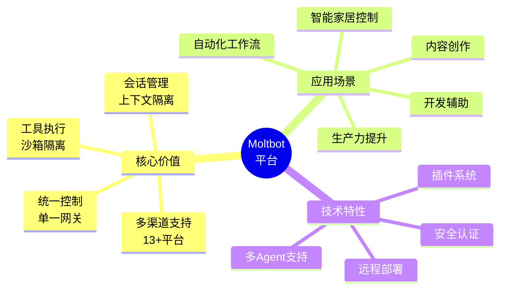

### 核心价值

- **🌐 多渠道统一**：通过一个网关连接WhatsApp、Telegram、Discord、Slack、iMessage等13+个平台
- **🔧 开箱即用**：交互式向导引导完成安装和配置
- **🛡️ 安全可控**：工具执行审批、沙箱隔离、访问控制
- **🚀 高度可扩展**：插件系统、技能市场、自定义工具
- **💻 灵活部署**：本地开发、VPS远程、混合节点等多种部署模式

## 系统架构

### 整体架构

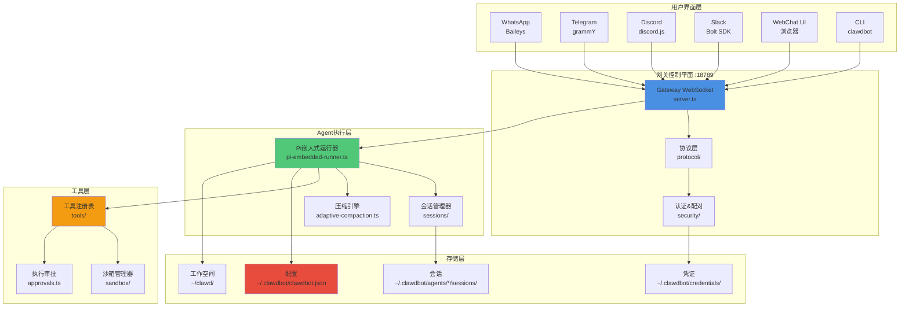

### 核心组件

| 组件 | 功能 | 默认端口 |
|------|------|---------|
| **Gateway** | WebSocket/HTTP控制平面，管理所有连接 | 18789 |
| **Agent Runtime** | Pi Agent执行器，处理AI交互 | - |
| **Channels** | 消息平台集成（13+支持） | - |
| **Tools** | 沙箱化工具执行环境 | - |
| **Nodes** | 设备本地能力的伴侣应用 | - |

### 消息流程

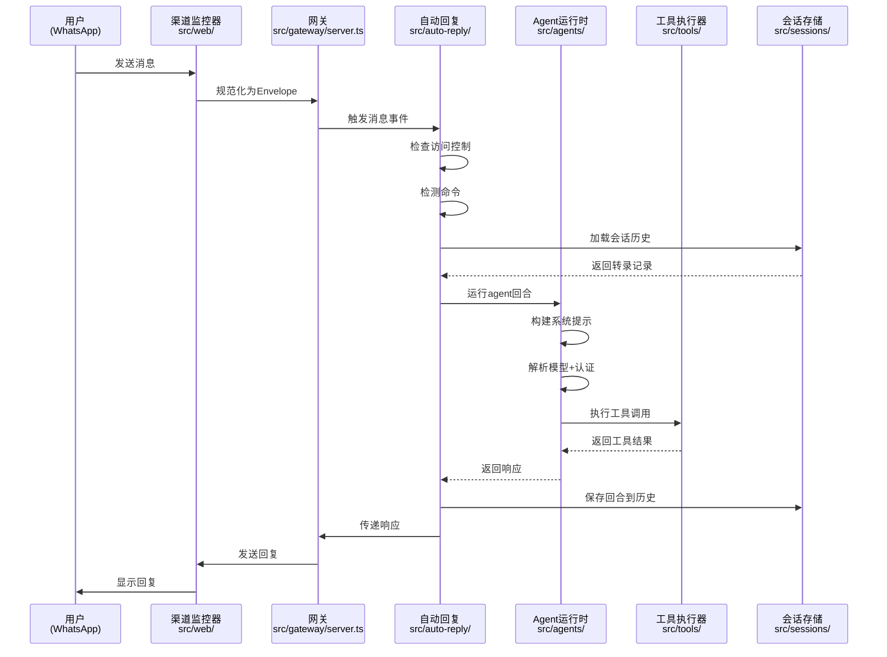

## 快速开始

### 系统要求

- **操作系统**：macOS、Linux、Windows (WSL2)
- **Node.js**：v18+ 或 v20+
- **包管理器**：pnpm（推荐）或 npm
- **可选**：Docker（用于工具沙箱）

### 安装步骤

#### 1. 安装Moltbot

```bash
# 使用npm全局安装
npm install -g clawdbot

# 或使用pnpm
pnpm add -g clawdbot

# 验证安装
clawdbot --version
```

#### 2. 运行向导

```bash
# 启动交互式配置向导
clawdbot onboard

# 或者带守护进程安装
clawdbot onboard --install-daemon
```

向导会引导你完成：
- ✅ 创建配置文件 `~/.clawdbot/clawdbot.json`
- ✅ 设置工作空间 `~/clawd/`
- ✅ 配置AI模型（Anthropic Claude、OpenAI等）
- ✅ 选择消息渠道（WhatsApp、Telegram等）
- ✅ 安装系统服务（可选）

#### 3. 启动网关

```bash
# 前台运行（开发模式）
clawdbot gateway

# 或作为守护进程
clawdbot gateway install  # 安装服务
clawdbot gateway start    # 启动服务
clawdbot gateway status   # 查看状态
```

#### 4. 连接渠道

```bash
# WhatsApp（扫码配对）
clawdbot channels login whatsapp

# Telegram（需要Bot Token）
clawdbot config set channels.telegram.botToken "YOUR_BOT_TOKEN"

# Discord（需要Bot Token）
clawdbot config set channels.discord.token "YOUR_DISCORD_TOKEN"
```

### 配置文件结构

```json
{
  "agents": {
    "defaults": {
      "model": "anthropic/claude-opus-4-5",
      "workspace": "~/clawd",
      "tools": { 
        "allow": ["*"], 
        "deny": [] 
      },
      "sandbox": { 
        "mode": "non-main" 
      }
    }
  },
  "gateway": {
    "mode": "local",
    "port": 18789,
    "bind": "loopback",
    "auth": { 
      "mode": "token", 
      "token": "..." 
    }
  },
  "channels": {
    "whatsapp": { 
      "allowFrom": ["+15555550123"] 
    },
    "telegram": { 
      "botToken": "123456:ABCDEF" 
    }
  }
}
```

## 支持的消息渠道

### 核心渠道（内置）

| 渠道 | 协议 | 配置键 | 特性 |
|------|------|--------|------|
| **WhatsApp** | Baileys (WhatsApp Web) | `channels.whatsapp` | 扫码登录、群组支持 |
| **Telegram** | Bot API (grammY) | `channels.telegram` | Bot Token、主题支持 |
| **Discord** | Discord Gateway | `channels.discord` | 服务器、频道、线程 |
| **Slack** | Bolt SDK (WebSocket) | `channels.slack` | 工作区、频道、DM |
| **Signal** | signal-cli (守护进程) | `channels.signal` | 端到端加密 |
| **iMessage** | imsg CLI (macOS) | `channels.imessage` | 仅macOS |

### 插件渠道

| 渠道 | 位置 | 协议 |
|------|------|------|
| **BlueBubbles** | `extensions/bluebubbles/` | BlueBubbles API |
| **MS Teams** | `extensions/msteams/` | Bot Framework |
| **Matrix** | `extensions/matrix/` | matrix-bot-sdk |
| **Zalo** | `extensions/zalo/` | Zalo Bot API |
| **LINE** | `extensions/line/` | LINE Messaging API |
| **Nostr** | `extensions/nostr/` | Nostr NIP-04 |
| **Tlon** | `extensions/tlon/` | Urbit HTTP API |

### 渠道配置示例

```bash
# WhatsApp - 允许列表模式
clawdbot config set channels.whatsapp.allowFrom '["+1234567890"]'

# Telegram - Bot Token + 群组支持
clawdbot config set channels.telegram.botToken "123456:ABCDEF"
clawdbot config set channels.telegram.groups '{"*": {"requireMention": true}}'

# Discord - 原生命令支持
clawdbot config set channels.discord.token "YOUR_TOKEN"
clawdbot config set commands.native true

# Slack - App Token + Bot Token
clawdbot config set channels.slack.appToken "xapp-..."
clawdbot config set channels.slack.botToken "xoxb-..."
```

## 核心概念

### 会话（Sessions）

会话按渠道、对等方和上下文隔离对话历史。

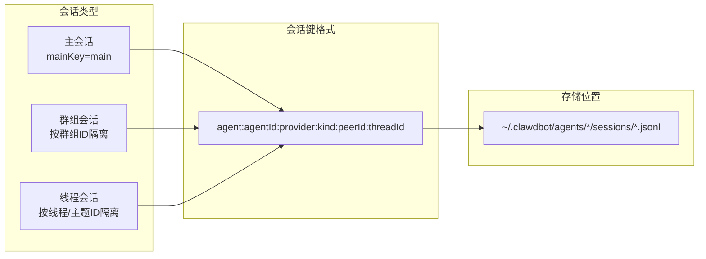

**会话键示例**：
- DM会话：`agent:main:provider:whatsapp:+1234567890`
- 群组会话：`agent:main:provider:telegram:group123456`
- 线程会话：`agent:main:provider:discord:channel123:thread456`

### Agent（智能体）

Agent是具有独立工作空间、认证和工具策略的隔离执行上下文。

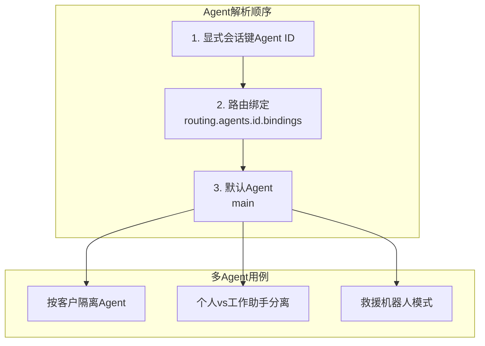

**多Agent配置示例**：

```json
{
  "agents": {
    "list": [
      {
        "id": "personal",
        "workspace": "~/clawd-personal",
        "model": "anthropic/claude-opus-4-5"
      },
      {
        "id": "work",
        "workspace": "~/clawd-work",
        "model": "openai/gpt-4o"
      }
    ]
  },
  "routing": {
    "agents": {
      "personal": {
        "bindings": [
          {"channel": "whatsapp", "peerId": "+1234567890"}
        ]
      },
      "work": {
        "bindings": [
          {"channel": "slack", "groupId": "workspace123"}
        ]
      }
    }
  }
}
```

### 工具（Tools）

工具扩展Agent的能力，超越文本生成。

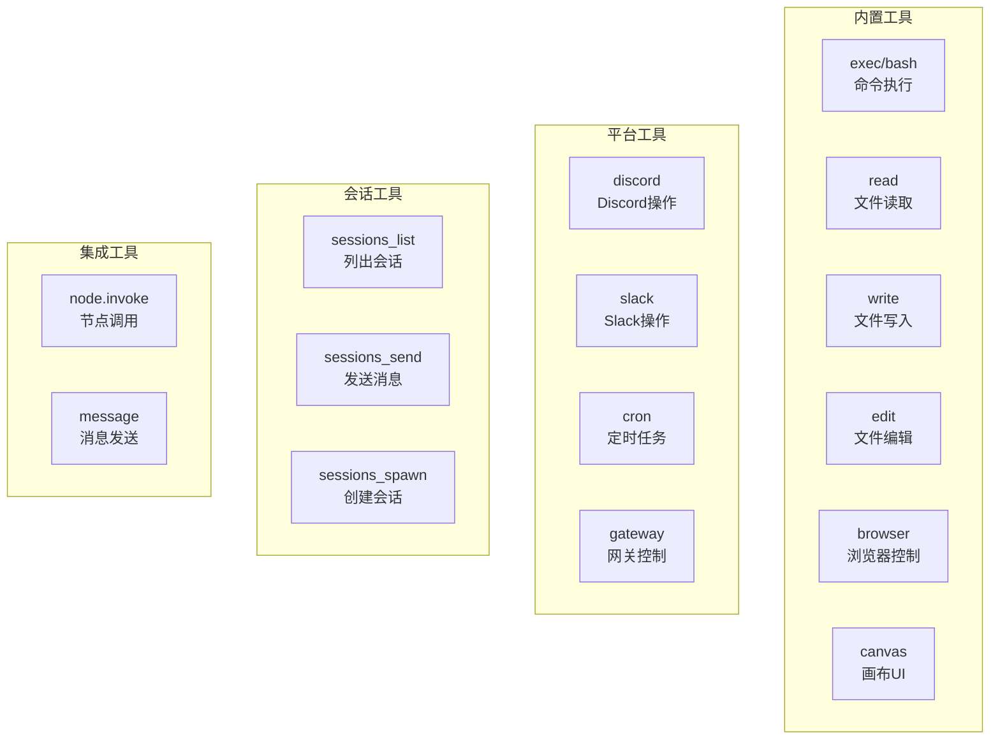

**工具策略解析**（6层优先级）：

1. **发送者特定**：`tools.policies.bySender[senderId]`
2. **群组特定**：`tools.policies.byGroup[groupId]`
3. **渠道特定**：`channels.<channel>.tools`
4. **提供商特定**：`agents.defaults.models.toolsByProvider[providerId]`
5. **Agent级别**：`agents.defaults.tools`
6. **全局默认**：内置允许列表

**沙箱模式**：

| 模式 | 行为 | 用例 |
|------|------|------|
| `off` | 所有工具在主机运行 | 受信任的单用户设置 |
| `non-main` | 沙箱化非主会话（群组/渠道） | 主会话受信任，其他沙箱化 |
| `all` | 全部沙箱化 | 最大隔离 |

### 工作空间（Workspace）

工作空间包含Agent的操作指令、个性化配置和技能。

```
~/clawd/
├── AGENTS.md          # 操作指令
├── SOUL.md            # Agent个性/上下文
├── TOOLS.md           # 工具描述
├── IDENTITY.md        # Agent身份元数据
├── USER.md            # 用户上下文/偏好
├── MEMORY.md          # 长期记忆（向量搜索）
├── skills/            # 技能二进制和定义
│   └── <skill-name>/
│       └── SKILL.md
└── canvas/            # Canvas UI资源
```

## 实战场景用例

### 场景1：生产力提升

#### 自动化邮件管理

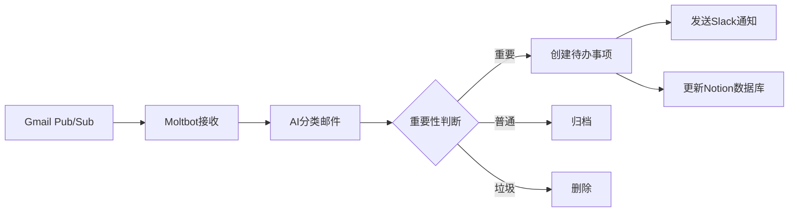

**实现步骤**：

```bash
# 1. 安装Gmail技能
clawdhub install gmail

# 2. 配置Gmail Pub/Sub触发器
# 参考：docs.molt.bot/gmail-pubsub

# 3. 创建自动化技能
cat > ~/clawd/skills/email-manager/SKILL.md << 'EOF'
# Email Manager Skill

## Trigger
- Gmail Pub/Sub webhook

## Actions
1. Fetch unread emails
2. Classify by importance (AI)
3. Create tasks for important emails
4. Send Slack notification
5. Update Notion database

## Configuration
- Gmail API credentials
- Slack webhook URL
- Notion API token
EOF

# 4. 设置定时任务
clawdbot cron add "0 9 * * *" "Check and process emails"
```

**真实用例**（来自社区）：

> @dreetje: "检查我的收件邮件，移除垃圾邮件；检查我的消息（通过Beeper）；为我订购东西；发送提醒到Tana；在GitHub上创建问题。"

#### 日历智能管理

```bash
# 安装Google Calendar技能
clawdhub install google-calendar

# 配置Agent处理日历
cat > ~/clawd/AGENTS.md << 'EOF'
# Calendar Management

You have access to my Google Calendar. When I mention scheduling:
- Check for conflicts automatically
- Suggest optimal time slots
- Send meeting invites
- Set reminders 15 minutes before

Priority rules:
1. Family events > work meetings
2. No meetings before 9am or after 6pm
3. Block lunch time (12-1pm)
EOF
```

**真实用例**：

> @danpeguine: "根据重要性在日历中时间块任务；基于算法评分任务的重要性和紧急性；通过会议转录和笔记引导我完成每周回顾。"

### 场景2：开发辅助

#### 代码审查自动化

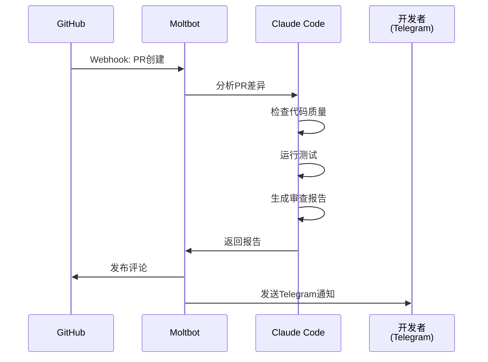

**实现步骤**：

```bash
# 1. 配置GitHub webhook
# 在GitHub仓库设置中添加webhook: https://your-gateway.com:18789/webhook/github

# 2. 创建代码审查技能
cat > ~/clawd/skills/code-reviewer/SKILL.md << 'EOF'
# Code Reviewer Skill

## Trigger
- GitHub PR webhook

## Actions
1. Fetch PR diff
2. Run linters (eslint, prettier)
3. Check test coverage
4. Analyze code complexity
5. Generate review comments
6. Post to GitHub
7. Notify via Telegram

## Configuration
- GitHub token: $GITHUB_TOKEN
- Telegram chat ID: $TELEGRAM_CHAT_ID
EOF

# 3. 安装依赖工具
clawdhub install github-cli
clawdhub install eslint-runner
```

**真实用例**：

> @jdrhyne: "从代码审查中重构PR；编排Codex agents进行编码；修复Rabbit PR评论。"

#### 项目管理助手

```bash
# 安装Linear/Jira技能
clawdhub install linear
# 或
clawdhub install jira

# 配置项目管理规则
cat > ~/clawd/AGENTS.md << 'EOF'
# Project Management

When I mention tasks or issues:
- Create Linear/Jira tickets automatically
- Link related issues
- Update status based on commits
- Generate sprint reports
- Track time estimates vs actual

Workflow:
1. Parse natural language task descriptions
2. Extract metadata (priority, assignee, labels)
3. Create structured tickets
4. Send confirmation to Slack
EOF
```

**真实用例**：

> @jdrhyne: "连接到JIRA并构建技能；清理Linear问题；创建发票并精美地总结工作。"

### 场景3：智能家居控制

#### Home Assistant集成

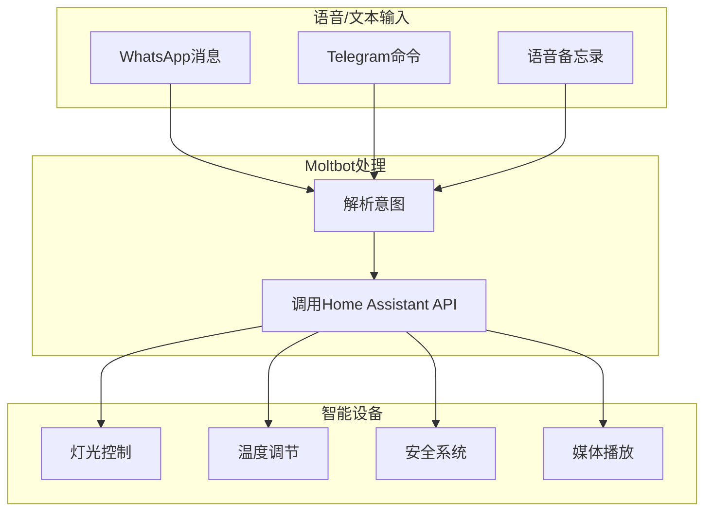

**实现步骤**：

```bash
# 1. 安装Home Assistant技能
clawdhub install home-assistant

# 2. 配置Home Assistant连接
clawdbot config set skills.homeAssistant.url "http://homeassistant.local:8123"
clawdbot config set skills.homeAssistant.token "YOUR_LONG_LIVED_TOKEN"

# 3. 创建自动化场景
cat > ~/clawd/skills/smart-home/SKILL.md << 'EOF'
# Smart Home Automation

## Voice Commands
- "Turn on living room lights"
- "Set temperature to 22°C"
- "Arm security system"
- "Play music in bedroom"

## Automation Rules
- Morning routine (7am): Open blinds, turn on lights
- Night routine (10pm): Lock doors, turn off lights
- Away mode: Arm security, adjust thermostat

## Configuration
- Home Assistant URL: $HA_URL
- Access token: $HA_TOKEN
EOF
```

**真实用例**：

> @iannuttall: "我给@moltbot买了他的第一个家🏠"（配图显示Raspberry Pi设置）

> @acevail_: "完全上瘾了。集成了邮件、Home Assistant、通过SSH的homelab、待办事项、Apple Notes、购物清单。全部通过单个Telegram聊天。"

#### Alexa设备控制

```bash
# 安装Alexa CLI技能
clawdhub install alexa-cli

# 配置自然语言命令
cat > ~/clawd/AGENTS.md << 'EOF'
# Alexa Control

You can control Alexa devices using natural language:
- "Tell Alexa to play jazz music"
- "Ask Alexa what's the weather"
- "Set a timer for 10 minutes on kitchen Echo"

Supported devices:
- Living Room Echo
- Kitchen Echo Dot
- Bedroom Echo Show
EOF
```

**真实用例**：

> @buddyhadry: "刚构建了一个Alexa CLI来控制你的Alexa设备（包括所有启用Alexa的智能家居设备）。支持自然语言文本命令，可以模拟你对Echo说的任何话。"

### 场景4：内容创作与研究

#### 自动化内容管道


**实现步骤**：

```bash
# 1. 创建内容创作技能
cat > ~/clawd/skills/content-creator/SKILL.md << 'EOF'
# Content Creator Skill

## Workflow
1. Research topic (web search + scraping)
2. Collect relevant articles
3. Summarize key points
4. Generate draft post
5. Create social media snippets
6. Schedule publication

## Platforms
- Blog: WordPress/Ghost API
- Twitter/X: API v2
- LinkedIn: API
- Medium: API

## Configuration
- Research depth: 5-10 sources
- Draft length: 800-1200 words
- Tone: Professional, engaging
EOF

# 2. 安装必要工具
clawdhub install browser-use
clawdhub install twitter-api
clawdhub install wordpress-cli
```

**真实用例**：

> @jdrhyne: "读取我的X书签并与我讨论；起草LinkedIn/X帖子，使用我的语气。"

> @LLMJunky: "如果你在@moltbot中使用gog处理Gmail和Calendar，我创建了一个简单的技能，在早上为你提供汇总，这样你就可以概览任何日历事件或过夜收到的邮件。"

#### 研究助手

```bash
# 配置研究工作流
cat > ~/clawd/AGENTS.md << 'EOF'
# Research Assistant

When I ask you to research a topic:
1. Search multiple sources (Google Scholar, arXiv, news)
2. Extract key findings
3. Organize in Notion database
4. Generate summary report
5. Create mind map (Excalidraw)
6. Send to Obsidian vault

Research quality standards:
- Cite all sources
- Cross-verify facts
- Highlight conflicting information
- Suggest follow-up questions
EOF

# 安装研究工具
clawdhub install notion-api
clawdhub install obsidian-sync
clawdhub install excalidraw-generator
```

**真实用例**：

> @swiftlysingh: "Excalidraw文件只是JSON，所以我构建了一种让agents以编程方式创建它们的方法。在使用@moltbot时一直希望能说'画这个流程'并得到图表。现在我可以了。"

### 场景5：个人健康与健身

#### 健康数据追踪

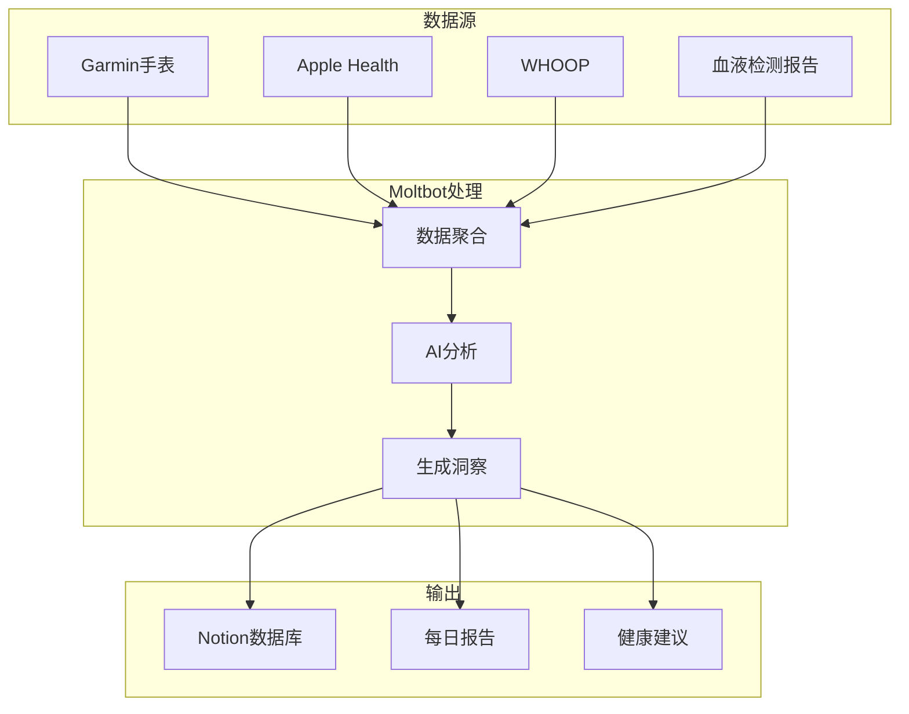

**实现步骤**：

```bash
# 1. 安装健康追踪技能
clawdhub install garmin-connect
clawdhub install whoop-api

# 2. 配置自动化
cat > ~/clawd/skills/health-tracker/SKILL.md << 'EOF'
# Health Tracker Skill

## Data Sources
- Garmin: Sleep, exercise, heart rate
- WHOOP: Recovery, strain, sleep quality
- Blood tests: Lab results (manual upload)

## Daily Report (8am)
- Sleep quality score
- Recovery status
- Exercise recommendations
- Nutrition suggestions

## Alerts
- Poor sleep detected: Suggest early bedtime
- High strain: Recommend rest day
- Abnormal heart rate: Alert user

## Storage
- Notion database: All metrics
- Obsidian: Daily notes with insights
EOF

# 3. 设置定时报告
clawdbot cron add "0 8 * * *" "Generate daily health report"
```

**真实用例**：

> @AlbertMoral: "在我的Raspberry Pi上设置了@moltbot，感觉很神奇✨。几分钟内从手机构建了一个网站，并连接了WHOOP快速检查我的指标和日常习惯🔥"

> @danpeguine: "今天我让@moltbot将我所有的血液检测实验室结果整理到一个整洁的Notion数据库中。"

#### 健身教练

```bash
# 配置健身助手
cat > ~/clawd/AGENTS.md << 'EOF'
# Fitness Coach

You are my personal fitness coach. Based on my health data:

1. Create weekly workout plans
2. Suggest exercises based on recovery status
3. Track progress towards goals
4. Provide form tips (video analysis)
5. Adjust plans based on performance

Goals:
- Build strength: 3x/week
- Cardio: 2x/week
- Flexibility: Daily stretching

Constraints:
- No workouts if recovery < 50%
- Rest day after high strain (>15)
EOF
```

**真实用例**：

> @Diego_F_Aguirre: "我真的在健身过程中用Moltbot调试我的健身应用。在组间：'这是bug' → 它修补 → 我继续。绝对疯狂🤯"

### 场景6：财务管理

#### 费用追踪与分析

```bash
# 安装财务工具
clawdhub install receipt-scanner
clawdhub install supabase-client

# 创建费用追踪技能
cat > ~/clawd/skills/expense-tracker/SKILL.md << 'EOF'
# Expense Tracker Skill

## Input Methods
1. Forward receipt emails
2. Upload receipt photos
3. Manual entry via chat

## Processing
1. OCR extract data (amount, merchant, date)
2. Categorize expense (AI)
3. Store in Supabase
4. Update budget tracking

## Reports
- Weekly spending summary
- Category breakdown
- Budget alerts
- Tax-deductible expenses

## Configuration
- Supabase URL: $SUPABASE_URL
- API Key: $SUPABASE_KEY
- Budget limits: Set per category
EOF
```

**真实用例**：

> @stevengonsalvez: "追踪我的支出，预订和追踪我孩子的午餐，充当Scrum Master并带来一些动力。"

> @stevecaldwell: "Crawdad🦞（我的AI助手）今晚为我们在Notion中构建了一个完整的每周膳食计划系统。我和我的妻子轮流做饭，所以我们让Crawdad设置了：主膳食计划模板（2026年365天）；按商店和过道排序的购物清单（Kroger/Costco/Lowes）；天气预报在膳食计划列表上自动更新；我们按厨师分类的常用食谱；如果我需要计划晚餐或购买杂货，它会在早晚摘要中提醒我。"

### 场景7：旅行与物流

#### 旅行助手


**实现步骤**：

```bash
# 创建旅行助手技能
cat > ~/clawd/skills/travel-assistant/SKILL.md << 'EOF'
# Travel Assistant Skill

## Email Monitoring
- Watch for booking confirmations
- Extract flight, hotel, car rental details
- Parse dates, locations, confirmation numbers

## Automation
1. Create itinerary in Notion
2. Add events to calendar
3. Set reminders (24h, 3h before)
4. Auto check-in for flights
5. Find best seat (window preferred)
6. Send boarding pass to phone

## Trip Planning
- Research destinations
- Suggest activities
- Book restaurants
- Track expenses
- Split costs with travel companions

## Configuration
- Email: Monitor inbox for keywords
- Airlines: United, Delta, Southwest
- Preferences: Window seat, early check-in
EOF
```

**真实用例**：

> @armanddp: "在我的邮件中找到我的下一个航班，完成值机，为我找一个靠窗的座位。当我在开车的时候。"

> @tonylongname: "现在是我家的项目经理。妻子和我随时提出话题，Clawd研究，周日早上9点发送汇总。"

### 场景8：电商与购物

#### 自动化购物助手

```bash
# 配置购物助手
cat > ~/clawd/AGENTS.md << 'EOF'
# Shopping Assistant

You help me with online shopping:

## Capabilities
1. Price comparison across sites
2. Track price drops (set alerts)
3. Find coupons/promo codes
4. Read reviews and summarize
5. Place orders (with approval)
6. Track shipments

## Stores
- Amazon
- eBay
- Local supermarket (Albert Heijn)

## Preferences
- Always check reviews (>4 stars)
- Compare at least 3 sellers
- Prefer free shipping
- Alert if price drops >10%

## Authentication
- Use 1Password for credentials
- Handle 2FA via SMS (Beeper bridge)
EOF
```

**真实用例**：

> @dreetje: "我的@moltbot成功地在@albertheijn（我们的超市）为自己订购东西，当我们的清洁女工给我发消息时。它使用我@1Password中的共享凭据登录，然后等待旧式短信MFA（通过@beeper iMessage桥使用MCP读取）。并将物品放入我的购物篮！太有帮助了。"

#### 汽车购买谈判

**真实用例**：

> @astuyve: "也许不是AGI，但Moltbot通过浏览器、电子邮件和iMessage自动与多个经销商谈判我的下一辆车，这太棒了。"

> @astuyve: "Moltbot刚刚为我在一辆车上节省了4200美元。"

### 场景9：团队协作

#### 多Agent协作

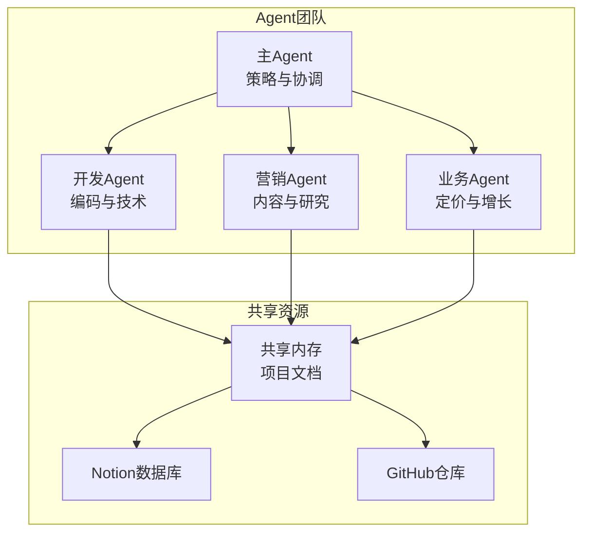

**实现步骤**：

```bash
# 1. 配置多Agent
cat > ~/.clawdbot/clawdbot.json << 'EOF'
{
  "agents": {
    "list": [
      {
        "id": "main",
        "workspace": "~/clawd-main",
        "model": "anthropic/claude-opus-4-5",
        "personality": "Strategic coordinator"
      },
      {
        "id": "dev",
        "workspace": "~/clawd-dev",
        "model": "anthropic/claude-codex-5-2",
        "personality": "Technical expert"
      },
      {
        "id": "marketing",
        "workspace": "~/clawd-marketing",
        "model": "google/gemini-2.0-flash-thinking",
        "personality": "Creative marketer"
      },
      {
        "id": "business",
        "workspace": "~/clawd-business",
        "model": "openai/gpt-4o",
        "personality": "Business analyst"
      }
    ]
  }
}
EOF

# 2. 安装共享内存技能
clawdhub install shared-memory

# 3. 创建团队协作规则
cat > ~/clawd-main/AGENTS.md << 'EOF'
# Team Coordination

You are the main coordinator. Delegate tasks to specialized agents:

## Dev Agent
- Coding tasks
- Technical architecture
- Code reviews
- Bug fixes

## Marketing Agent
- Content creation
- Competitor research
- Social media strategy
- SEO optimization

## Business Agent
- Pricing analysis
- Metrics tracking
- Growth strategy
- Financial planning

## Coordination Rules
1. Break down complex tasks
2. Assign to appropriate agent
3. Monitor progress
4. Synthesize results
5. Report to user
EOF
```

**真实用例**：

> @iamtrebuh: "我作为独立创始人的AI设置。用@moltbot构建，工作原理：4个agents，各有自己的工作：主要的：策略、规划、大局。协调其他人；开发agent：编码、技术问题、架构决策；营销agent：研究、内容创意、竞争对手分析；业务agent：定价、指标、增长策略。"

> @danpeguine & @assafdagan: "两个不同的@moltbot可以协作！！！我们把我们的机器人放在同一个WhatsApp群组中，它们正在协作！！！"

### 场景10：创意与娱乐

#### 媒体工作室

```bash
# 安装媒体工具
clawdhub install sora-api
clawdhub install kyutai-tts
clawdhub install whisper-transcribe

# 配置媒体创作
cat > ~/clawd/skills/media-studio/SKILL.md << 'EOF'
# Media Studio Skill

## Video Creation
1. Generate video with Sora
2. Remove watermarks
3. Add voiceover (Kyutai TTS)
4. Edit and composite

## Audio Processing
1. Transcribe audio (Whisper)
2. Generate speech (TTS)
3. Extract music/GIFs from videos
4. Create chord sheets (PDF)

## Workflow
- Input: Text prompt or audio
- Output: Polished video/audio
- Delivery: Send to Telegram/WhatsApp

## Configuration
- Sora API key: $SORA_KEY
- TTS voice: Natural, engaging
- Video quality: 1080p
EOF
```

**真实用例**：

> @xMikeMickelson: "昨天@moltbot学会了自己去除Sora 2水印。今天我告诉它也制作视频。它从头开始生成了一个完整的UGC影响者：凌乱的头发、AirPods、灰色连帽衫、狂热的能量。我没有给它参考图像。这里发生了什么？！"

> @dnouri: "这合法吗？感觉不合法……和@moltbot玩得太开心了：看看经过一些黑客攻击后，我如何让它给我发送这首歌的音轨作为音频，提取一些酷炫的GIF，最后给我发送一个带和弦的PDF？思维：炸裂！"

#### 游戏与互动

```bash
# 创建互动游戏
cat > ~/clawd/skills/madlibs-game/SKILL.md << 'EOF'
# MadLibs Game Skill

## Features
- Dynamic story generation
- Image generation for scenes
- History tracking
- Multiplayer support (family)

## Workflow
1. Present story template
2. Ask for word inputs (noun, verb, adjective)
3. Generate completed story
4. Create illustration (DALL-E)
5. Save to history
6. Share with family

## Configuration
- Story templates: 50+ built-in
- Image style: Cartoon, colorful
- Difficulty: Adjust for age
EOF
```

**真实用例**：

> @scottw: "10岁的孩子一直在享受MadLibs。当我们外出一天并且大部分时间断开连接时（感谢Verizon），我们的@moltbot为我们构建了一个带有图像、历史等的动态版本。"

## 部署模式

### 本地开发模式

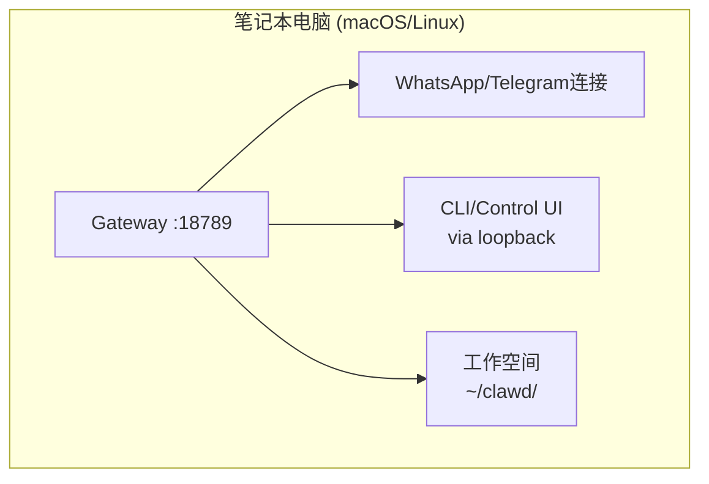

**适用场景**：
- 个人开发测试
- 单用户使用
- 快速原型验证

**设置命令**：
```bash
clawdbot onboard --install-daemon
clawdbot gateway start
```

### VPS远程模式

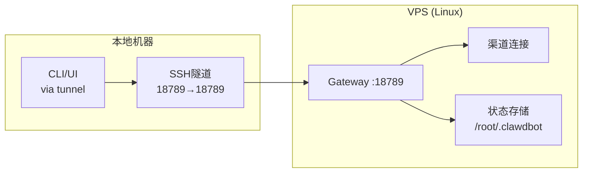

**适用场景**：
- 24/7运行
- 多设备访问
- 团队共享

**设置步骤**：

```bash
# VPS端
ssh user@vps
clawdbot onboard --install-daemon
clawdbot gateway start

# 本地端
ssh -N -L 18789:127.0.0.1:18789 user@vps
# 浏览器访问：http://127.0.0.1:18789/
```

### 混合节点模式

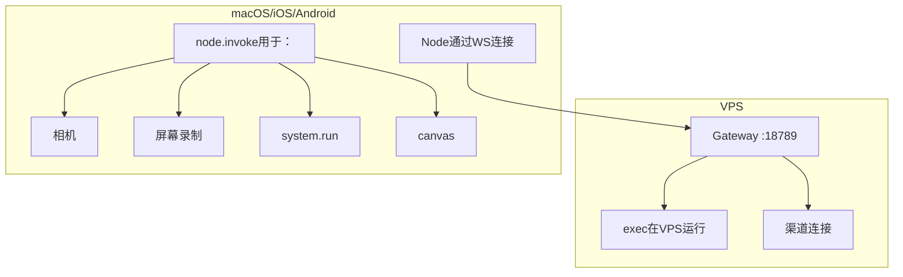

**适用场景**：
- 需要设备本地能力（相机、屏幕录制）
- 混合云端+本地执行
- 多设备协同

**设置步骤**：

```bash
# 1. VPS上运行Gateway（如上）

# 2. 节点配对
clawdbot nodes approve <device-name>

# 3. 工具路由配置
cat > ~/.clawdbot/clawdbot.json << 'EOF'
{
  "tools": {
    "routing": {
      "camera": {"host": "node"},
      "screen_record": {"host": "node"},
      "canvas": {"host": "node"}
    }
  }
}
EOF
```

## 高级配置

### 工具审批工作流

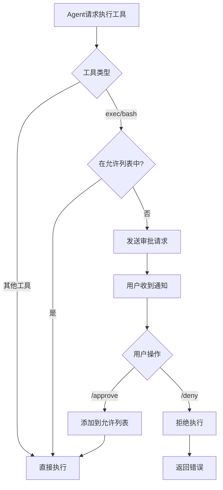

**配置审批策略**：

```bash
# 查看待审批列表
clawdbot approvals list

# 手动添加到允许列表
clawdbot approvals allowlist add main /usr/bin/git
clawdbot approvals allowlist add main /usr/local/bin/npm

# 自动允许技能二进制
clawdbot config set tools.exec.approvals.skillBinsAutoAllow true

# 在聊天中审批
# Agent: "I need to run: npm install"
# You: /approve
```

### 沙箱配置

```bash
# 配置沙箱模式
clawdbot config set agents.defaults.sandbox.mode "non-main"

# Docker沙箱环境变量
clawdbot config set agents.defaults.sandbox.docker.env '{"NODE_ENV": "production"}'

# 重建沙箱容器
clawdbot sandbox recreate --all

# 查看沙箱状态
clawdbot sandbox status
```

### 多模型配置

```json
{
  "agents": {
    "defaults": {
      "models": {
        "primary": {
          "model": "anthropic/claude-opus-4-5",
          "authProfile": "anthropic-main"
        },
        "fallbacks": [
          {
            "model": "openai/gpt-4o",
            "authProfile": "openai-backup"
          },
          {
            "model": "google/gemini-2.0-flash-thinking",
            "authProfile": "google-fallback"
          }
        ],
        "toolsByProvider": {
          "anthropic": {
            "allow": ["*"],
            "deny": []
          },
          "openai": {
            "allow": ["read", "write", "browser"],
            "deny": ["exec"]
          }
        }
      }
    }
  }
}
```

### 访问控制

```bash
# WhatsApp - 配对模式（默认）
clawdbot config set channels.whatsapp.dmPolicy "pairing"

# Telegram - 允许列表模式
clawdbot config set channels.telegram.dmPolicy "allowlist"
clawdbot config set channels.telegram.allowFrom '["@username1", "@username2"]'

# Discord - 开放模式（谨慎使用）
clawdbot config set channels.discord.dmPolicy "open"

# 群组访问控制
clawdbot config set channels.telegram.groups '{"group123": {"requireMention": true}}'
```

## 技能市场（ClawdHub）

### 安装技能

```bash
# 搜索技能
clawdhub search calendar

# 安装技能
clawdhub install google-calendar
clawdhub install notion-api
clawdhub install github-cli

# 列出已安装技能
clawdhub list

# 更新技能
clawdhub update google-calendar

# 卸载技能
clawdhub uninstall google-calendar
```

### 创建自定义技能

```bash
# 1. 创建技能目录
mkdir -p ~/clawd/skills/my-skill

# 2. 编写技能定义
cat > ~/clawd/skills/my-skill/SKILL.md << 'EOF'
# My Custom Skill

## Description
Brief description of what this skill does.

## Usage
How to invoke this skill.

## Configuration
Required environment variables or config.

## Examples
Example commands and expected outputs.
EOF

# 3. 创建可执行文件（可选）
cat > ~/clawd/skills/my-skill/my-skill << 'EOF'
#!/usr/bin/env node
// Your skill implementation
console.log("Hello from my skill!");
EOF
chmod +x ~/clawd/skills/my-skill/my-skill

# 4. 测试技能
clawdbot agent run "Use my-skill to do something"
```

### 发布技能到ClawdHub

```bash
# 1. 登录ClawdHub
clawdhub login

# 2. 发布技能
clawdhub publish ~/clawd/skills/my-skill

# 3. 更新技能
clawdhub publish ~/clawd/skills/my-skill --version 1.1.0
```

## 故障排除

### 常见问题

#### 1. Gateway无法启动

```bash
# 检查端口占用
lsof -i :18789

# 查看日志
clawdbot logs --follow

# 重置配置
clawdbot config reset

# 重新运行向导
clawdbot onboard
```

#### 2. 渠道连接失败

```bash
# WhatsApp - 重新配对
clawdbot channels logout whatsapp
clawdbot channels login whatsapp

# Telegram - 验证Bot Token
clawdbot config get channels.telegram.botToken
# 在Telegram中测试：https://t.me/YOUR_BOT_USERNAME

# Discord - 检查权限
# 确保Bot有MESSAGE_CONTENT intent
```

#### 3. Agent响应缓慢

```bash
# 检查会话大小
clawdbot sessions list

# 压缩大会话
clawdbot sessions compact <session-key>

# 清理旧会话
clawdbot sessions prune --older-than 30d

# 检查模型配额
clawdbot status
```

#### 4. 工具执行失败

```bash
# 检查沙箱状态
clawdbot sandbox status

# 重建沙箱
clawdbot sandbox recreate --all

# 查看工具策略
clawdbot config get agents.defaults.tools

# 检查审批列表
clawdbot approvals list
```

### 调试技巧

```bash
# 启用详细日志
clawdbot config set logging.level "debug"

# 查看实时日志
tail -f ~/.clawdbot/logs/clawdbot-*.log

# 测试单个Agent回合
clawdbot agent run --session test "Hello, test message"

# 检查系统状态
clawdbot status --verbose

# 验证配置
clawdbot config validate
```

## 安全最佳实践

### 1. 网关安全

```bash
# 使用强认证令牌
clawdbot config set gateway.auth.token "$(openssl rand -base64 32)"

# 绑定到本地回环（默认）
clawdbot config set gateway.bind "loopback"

# 如需远程访问，使用SSH隧道或Tailscale
# 不要直接暴露到公网！
```

### 2. 渠道访问控制

```bash
# 使用配对模式（最安全）
clawdbot config set channels.whatsapp.dmPolicy "pairing"

# 或使用允许列表
clawdbot config set channels.telegram.allowFrom '["@trusted_user"]'

# 群组需要@提及
clawdbot config set channels.telegram.groups '{"*": {"requireMention": true}}'
```

### 3. 工具执行限制

```bash
# 启用沙箱
clawdbot config set agents.defaults.sandbox.mode "non-main"

# 限制工具访问
clawdbot config set agents.defaults.tools.allow '["read", "write", "browser"]'
clawdbot config set agents.defaults.tools.deny '["exec"]'

# 启用审批工作流
clawdbot config set tools.exec.approvals.enabled true
```

### 4. 凭证管理

```bash
# 使用1Password集成（推荐）
clawdhub install 1password-cli

# 或使用环境变量
export ANTHROPIC_API_KEY="sk-ant-..."
export OPENAI_API_KEY="sk-..."

# 不要在配置文件中硬编码API密钥
```

### 5. 定期审计

```bash
# 检查活跃会话
clawdbot sessions list

# 审查工具使用
clawdbot logs --filter "tool_use"

# 检查审批历史
clawdbot approvals history

# 更新依赖
npm update -g clawdbot
```

## 性能优化

### 1. 会话管理

```bash
# 定期压缩会话
clawdbot cron add "0 2 * * *" "clawdbot sessions compact --all"

# 清理旧会话
clawdbot sessions prune --older-than 90d

# 配置自动压缩
clawdbot config set agents.defaults.compaction.enabled true
clawdbot config set agents.defaults.compaction.threshold 50000
```

### 2. 模型选择

```json
{
  "agents": {
    "defaults": {
      "models": {
        "primary": {
          "model": "anthropic/claude-opus-4-5",
          "authProfile": "anthropic-main"
        },
        "fallbacks": [
          {
            "model": "anthropic/claude-sonnet-4-5",
            "authProfile": "anthropic-main",
            "condition": "cost_optimization"
          }
        ]
      }
    }
  }
}
```

### 3. 缓存策略

```bash
# 启用响应缓存（如果模型支持）
clawdbot config set agents.defaults.caching.enabled true

# 配置缓存TTL
clawdbot config set agents.defaults.caching.ttl 3600
```

### 4. 并发控制

```bash
# 限制并发Agent执行
clawdbot config set agents.defaults.concurrency.max 3

# 配置队列
clawdbot config set agents.defaults.queue.enabled true
clawdbot config set agents.defaults.queue.maxSize 100
```

## 社区资源

### 官方资源

- **官网**：[molt.bot](https://molt.bot)
- **GitHub**：[github.com/moltbot/moltbot](https://github.com/moltbot/moltbot)
- **文档**：[docs.molt.bot](https://docs.molt.bot)
- **技能市场**：[clawdhub.com](https://clawdhub.com)

### 社区渠道

- **Discord**：活跃的开发者社区，数千名成员
- **Twitter/X**：[@moltbot](https://twitter.com/moltbot)
- **创建者**：[@steipete](https://twitter.com/steipete)

### 学习资源

- **Showcase**：[molt.bot/showcase](https://molt.bot/showcase) - 真实用例展示
- **DeepWiki**：[deepwiki.com/moltbot/moltbot](https://deepwiki.com/moltbot/moltbot) - 深度技术文档
- **GitHub Discussions**：问题讨论和功能请求

## 贡献指南

Moltbot是开源项目，欢迎社区贡献！

### 贡献方式

1. **报告Bug**：在GitHub Issues中提交详细的bug报告
2. **功能请求**：在Discussions中讨论新功能想法
3. **提交PR**：修复bug或添加新功能
4. **创建技能**：开发并分享自定义技能到ClawdHub
5. **改进文档**：帮助完善文档和教程

### 开发设置

```bash
# 克隆仓库
git clone https://github.com/moltbot/moltbot.git
cd moltbot

# 安装依赖
pnpm install

# 构建项目
pnpm build

# 运行测试
pnpm test

# 本地开发
pnpm dev
```

## 总结

Moltbot是一个强大而灵活的AI助手编排平台，通过统一的网关将AI能力带到你日常使用的各种消息平台。无论是自动化工作流、智能家居控制、开发辅助还是个人生产力提升，Moltbot都能提供强大的支持。

### 关键优势

- ✅ **多渠道统一**：一个平台，13+个消息渠道
- ✅ **安全可控**：细粒度的访问控制和工具审批
- ✅ **高度可扩展**：丰富的插件系统和技能市场
- ✅ **灵活部署**：本地、VPS、混合等多种模式
- ✅ **活跃社区**：90k+ GitHub stars，数千名活跃用户

### 下一步行动

1. **立即开始**：运行 `clawdbot onboard` 开始你的Moltbot之旅
2. **探索用例**：浏览 [molt.bot/showcase](https://molt.bot/showcase) 获取灵感
3. **加入社区**：在Discord中与其他用户交流经验
4. **分享创造**：将你的技能和用例分享给社区

**开始构建你的个人AI助手平台，让AI真正为你工作！🦞**

