## 项目简介

**Compound Engineering Plugin** 是 Claude Code 的官方企业级开发自动化插件，由 Every Inc. 开发和维护。它提供了一套完整的工具链，包含 28 个智能代理（Agents）、24 个命令（Commands）、15 个技能（Skills）和 1 个 MCP 服务器，旨在实现"复合工程"理念——让每一次工程工作都比上一次更容易。

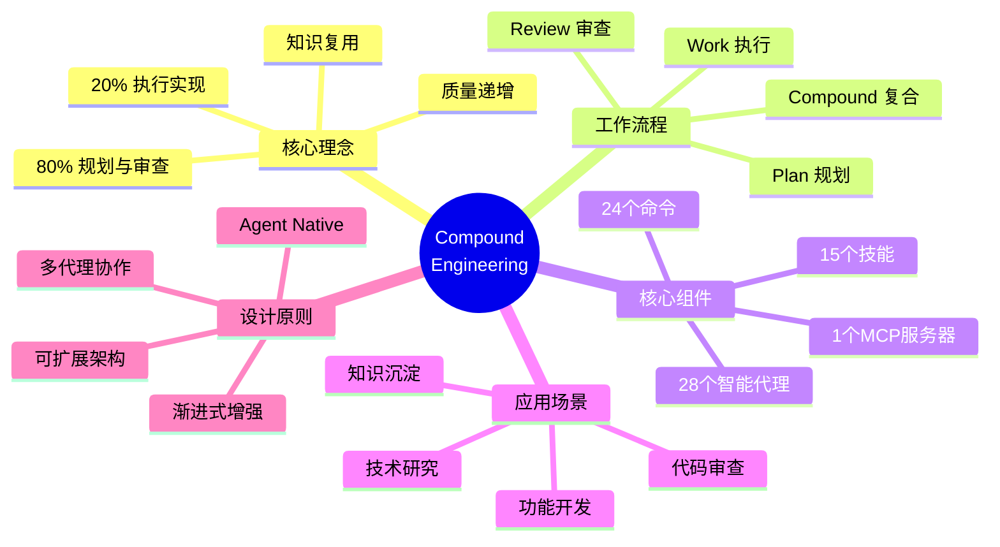

### 项目地址

- **GitHub 仓库**：<https://github.com/EveryInc/compound-engineering-plugin>
- **文档网站**：<https://deepwiki.com/EveryInc/compound-engineering-plugin>
- **版本信息**：v2.28.0（compound-engineering）、v1.2.1（coding-tutor）
- **许可证**：MIT License
- **Stars**：6.6k+

### 核心统计

| 组件类型 | 数量 | 主要用途 |
|---------|------|---------|
| Agents（代理） | 28 | 执行专业任务的智能角色 |
| Commands（命令） | 24 | 用户交互的入口点 |
| Skills（技能） | 15 | 可复用的知识模块 |
| MCP Servers | 1 | Context7 文档服务器 |

## 核心理念：复合工程

### 什么是复合工程？

传统开发模式中，技术债务会随时间累积：


复合工程则反转这一趋势，让代码库随时间变得**更易维护**：

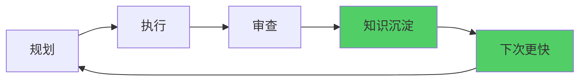

### 复合工程的时间分配

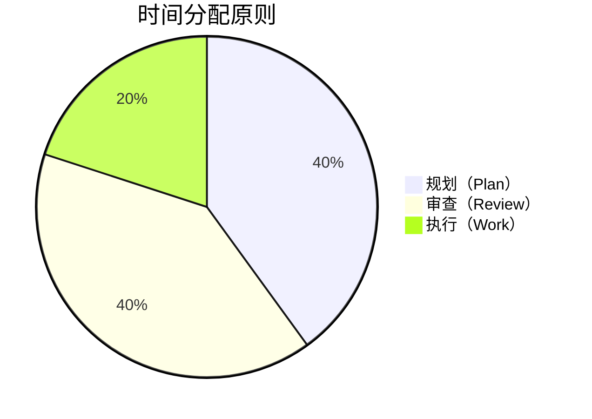

**80% 的时间用于规划和审查，只有 20% 用于执行。** 这确保了：

1. **规划阶段**：充分思考，避免返工
2. **执行阶段**：高效实现，减少决策时间
3. **审查阶段**：及早发现问题，提取知识
4. **复合阶段**：文档化经验，加速未来工作

## 核心工作流：Plan → Work → Review → Compound

```mermaid
graph TD
    A[开始] --> B[/workflows:plan<br/>详细规划]
    B --> C{需要分支开发?}
    C -->|是| D[/workflows:work<br/>创建 worktree]
    C -->|否| E[直接开发]
    D --> F[执行实现]
    E --> F
    F --> G[/workflows:review<br/>多代理审查]
    G --> H{审查通过?}
    H -->|否| I[修复问题]
    I --> G
    H -->|是| J[/workflows:compound<br/>知识沉淀]
    J --> K[合并代码]
    K --> L[下一个循环]
    L --> B
    
    style B fill:#4dabf7
    style D fill:#51cf66
    style G fill:#ffd43b
    style J fill:#ff6b6b
```

### 1. Plan 阶段：从创意到实施计划

**命令**：`/workflows:plan`、`/deepen-plan`

**功能**：将功能创意转化为详细的实施计划

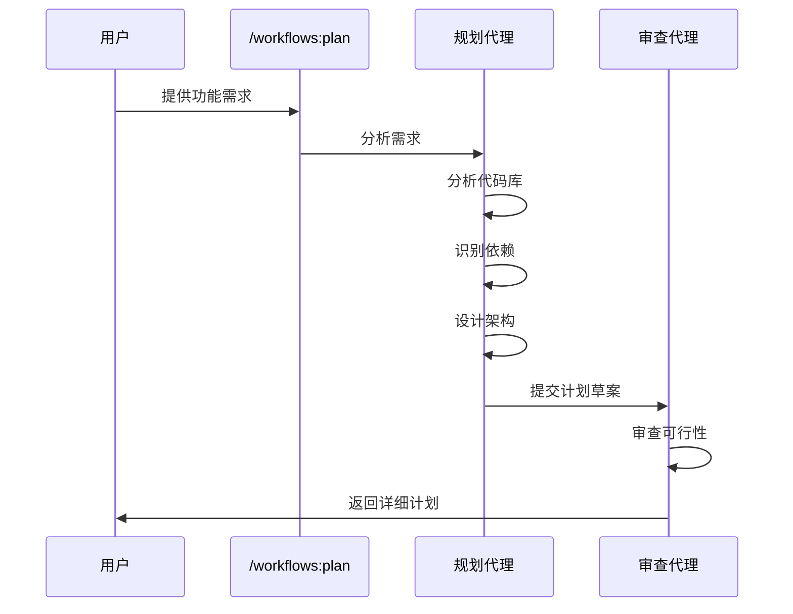

**输出示例**：

```markdown
# 实施计划：添加用户认证功能

## 1. 架构变更
- 添加 AuthService 类（/src/auth/auth-service.ts）
- 创建 User 模型（/src/models/user.ts）
- 添加认证中间件（/src/middleware/auth.ts）

## 2. 依赖关系
- 依赖现有的 Database 模块
- 需要新增 bcrypt 和 jsonwebtoken 包

## 3. 实施步骤
1. 创建数据库迁移文件
2. 实现 AuthService
3. 添加认证路由
4. 编写测试用例
5. 更新 API 文档

## 4. 风险评估
- 破坏性变更：无
- 需要数据库迁移：是
- 预计工时：4-6 小时
```

### 2. Work 阶段：高效执行实施

**命令**：`/workflows:work`

**功能**：使用 Git worktree 创建隔离的开发环境，并跟踪任务进度

```mermaid
graph TD
    A[/workflows:work] --> B{检测分支}
    B -->|主分支| C[创建 feature 分支]
    B -->|feature 分支| D[直接使用]
    C --> E[创建 Git Worktree]
    D --> E
    E --> F[打开新编辑器窗口]
    F --> G[执行实施]
    G --> H[提交代码]
    H --> I{任务完成?}
    I -->|否| G
    I -->|是| J[准备审查]
    
    style E fill:#339af0
    style F fill:#51cf66
```

**Git Worktree 的优势**：

- **隔离开发**：多个功能并行开发，互不干扰
- **快速切换**：无需 stash，直接切换工作目录
- **独立测试**：每个 worktree 可以独立运行测试
- **安全回滚**：主分支始终保持稳定状态

### 3. Review 阶段：多代理协同审查

**命令**：`/workflows:review`

**功能**：多个专业代理从不同角度审查代码质量

```mermaid
graph TD
    A[/workflows:review] --> B[启动审查流程]
    B --> C[架构审查代理]
    B --> D[安全审查代理]
    B --> E[性能审查代理]
    B --> F[测试审查代理]
    
    C --> G[生成审查报告]
    D --> G
    E --> G
    F --> G
    
    G --> H{发现问题?}
    H -->|是| I[优先级排序]
    H -->|否| J[通过审查]
    
    I --> K[修复建议]
    K --> L[返回修复]
    L --> B
    
    style C fill:#4dabf7
    style D fill:#ff6b6b
    style E fill:#ffd43b
    style F fill:#51cf66
```

**审查维度**：

| 审查代理 | 关注点 | 输出 |
|---------|--------|------|
| **架构审查** | 设计模式、模块耦合度 | 架构改进建议 |
| **安全审查** | 注入漏洞、认证授权 | 安全风险列表 |
| **性能审查** | 算法复杂度、资源使用 | 性能优化方案 |
| **测试审查** | 测试覆盖率、边界情况 | 测试补充建议 |

### 4. Compound 阶段：知识沉淀与复用

**命令**：`/workflows:compound`

**功能**：将本次开发中的经验教训文档化，加速未来开发

```mermaid
graph LR
    A[/workflows:compound] --> B[分析本次变更]
    B --> C[提取模式]
    C --> D[创建/更新技能]
    D --> E[更新文档]
    E --> F[下次更快 20%]
    
    style D fill:#51cf66
    style F fill:#ffd43b
```

**输出示例**：

```markdown
# 复合学习：用户认证实施

## 学到的模式
1. **JWT Token 管理**
   - 使用 HttpOnly Cookie 存储刷新令牌
   - Access Token 短期有效（15分钟）
   - Refresh Token 长期有效（7天）

## 可复用组件
- `AuthMiddleware`：可用于所有需要认证的路由
- `TokenService`：可用于其他需要 JWT 的功能

## 下次可以改进
- 考虑使用 Redis 存储活跃会话
- 添加速率限制防止暴力破解

## 相关技能文档
- 创建：`skills/jwt-authentication.md`
- 更新：`skills/api-security.md`
```

**复合效应**：

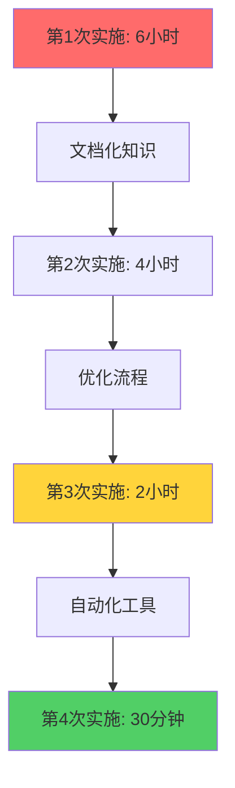

## 核心组件详解

### Agents（智能代理）：28 个专业角色

智能代理是执行特定任务的 AI 角色，每个代理都有专门的提示词和上下文。

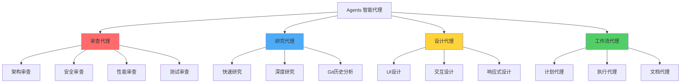

#### 审查代理（Review Agents）

| 代理名称 | 文件路径 | 专长领域 |
|---------|---------|---------|
| **Architecture Reviewer** | `agents/architecture-reviewer.md` | 评估设计模式、模块化、可扩展性 |
| **Security Reviewer** | `agents/security-reviewer.md` | 检测安全漏洞、认证授权问题 |
| **Performance Reviewer** | `agents/performance-reviewer.md` | 分析算法效率、资源使用 |
| **Test Coverage Reviewer** | `agents/test-reviewer.md` | 评估测试覆盖率、边界情况 |
| **Code Style Reviewer** | `agents/style-reviewer.md` | 检查代码风格、命名规范 |

#### 研究代理（Research Agents）

| 代理名称 | 专长领域 |
|---------|---------|
| **Quick Researcher** | 快速获取技术信息（5分钟内） |
| **Deep Researcher** | 深度技术调研（30分钟以上） |
| **Git History Analyst** | 分析代码演进历史 |
| **Documentation Researcher** | 查找和理解项目文档 |

#### 设计代理（Design Agents）

| 代理名称 | 专长领域 |
|---------|---------|
| **UI Designer** | 用户界面设计 |
| **UX Designer** | 用户体验优化 |
| **Responsive Designer** | 响应式布局设计 |
| **Accessibility Designer** | 无障碍访问优化 |

### Commands（命令）：24 个用户入口

命令是用户与插件交互的入口点，每个命令调用一个或多个代理完成任务。

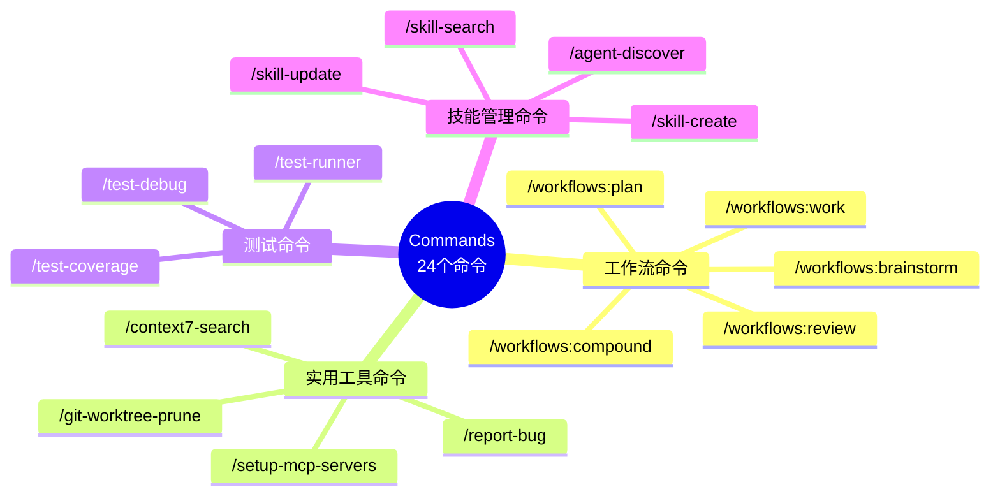

#### 核心工作流命令

| 命令 | 功能 | 典型用时 |
|-----|------|---------|
| `/workflows:brainstorm` | 头脑风暴，生成多个解决方案 | 5-10分钟 |
| `/workflows:plan` | 创建详细实施计划 | 10-20分钟 |
| `/workflows:work` | 执行开发任务 | 1-4小时 |
| `/workflows:review` | 多维度代码审查 | 15-30分钟 |
| `/workflows:compound` | 知识沉淀与文档化 | 10-15分钟 |

#### 实用工具命令

```mermaid
graph LR
    A[实用工具] --> B[/git-worktree-prune]
    A --> C[/context7-search]
    A --> D[/setup-mcp-servers]
    A --> E[/report-bug]
    
    B --> B1[清理无用的 worktree]
    C --> C1[搜索技术文档]
    D --> D1[配置 MCP 服务器]
    E --> E1[提交结构化 bug 报告]
    
    style B fill:#4dabf7
    style C fill:#51cf66
    style D fill:#ffd43b
    style E fill:#ff6b6b
```

### Skills（技能）：15 个知识模块

技能是可复用的知识文档，可以被多个代理引用。

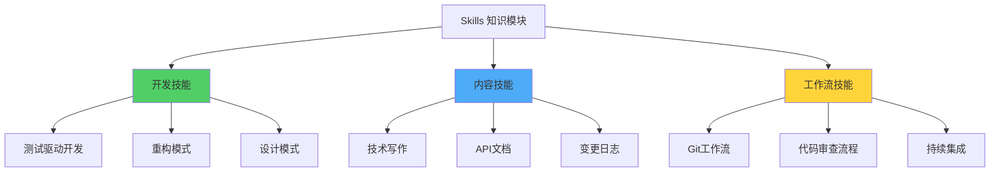

#### 技能文档结构

每个技能文档包含：

```markdown
# Skill Name

## Description
简要说明此技能的用途

## When to Use
何时应该使用此技能

## How to Apply
具体应用步骤

## Examples
实际应用示例

## Anti-patterns
应避免的错误做法

## Related Skills
相关技能链接
```

### MCP Server：Context7 文档服务

**Context7** 是一个 MCP（Model Context Protocol）服务器，提供实时的技术文档查询。

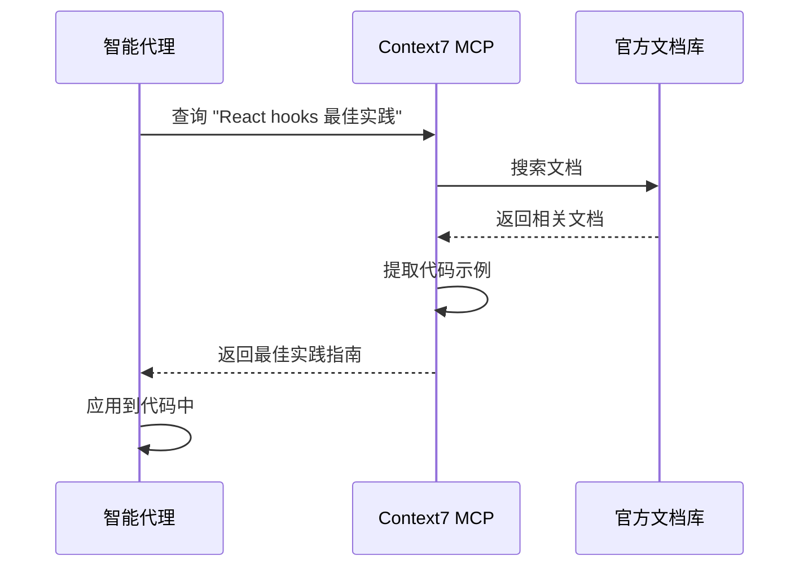

**支持的文档库**：

- React、Vue、Angular 等前端框架
- Node.js、Python、Go 等后端语言
- PostgreSQL、MongoDB 等数据库
- AWS、Azure、GCP 等云服务

## 安装与配置

### 方法 1：Claude Code 直接安装（推荐）

```bash
# 添加插件市场
/plugin marketplace add https://github.com/EveryInc/compound-engineering-plugin

# 安装复合工程插件
/plugin install compound-engineering

# 验证安装
/plugin list
```

### 方法 2：从源码安装

```bash
# 克隆仓库
git clone https://github.com/EveryInc/compound-engineering-plugin.git
cd compound-engineering-plugin

# 安装依赖
bun install

# 链接到 Claude Code
/plugin add ./plugins/compound-engineering
```

### 配置 MCP 服务器

插件自带 `/setup-mcp-servers` 命令，自动配置 Context7：

```bash
/setup-mcp-servers
```

手动配置（修改 Claude Code 配置文件）：

```json
{
  "mcpServers": {
    "context7": {
      "command": "npx",
      "args": ["-y", "@context7/mcp-server"],
      "env": {
        "CONTEXT7_API_KEY": "your-api-key-here"
      }
    }
  }
}
```

## 实战示例：完整功能开发

让我们通过一个真实案例演示完整的复合工程工作流：

### 场景：为博客系统添加评论功能

#### 步骤 1：头脑风暴（可选）

```bash
/workflows:brainstorm 添加评论功能，需要考虑反垃圾和审核
```

**输出**：
- 方案 A：简单评论系统（无审核）
- 方案 B：带审核的评论系统
- 方案 C：集成第三方评论服务（Disqus）

**决策**：选择方案 B（平衡功能与复杂度）

#### 步骤 2：详细规划

```bash
/workflows:plan 实现带审核的评论系统
```

**生成的计划**：

```markdown
# 评论系统实施计划

## 架构设计
1. 数据库表结构
   - comments 表（id, post_id, author, content, status, created_at）
   - status 字段：pending, approved, rejected, spam

2. API 端点
   - POST /api/comments - 提交评论
   - GET /api/comments/:postId - 获取已批准的评论
   - GET /admin/comments - 管理员审核列表
   - PUT /admin/comments/:id - 审核操作

3. 前端组件
   - CommentForm - 评论表单
   - CommentList - 评论列表
   - CommentModerationPanel - 管理员审核面板

## 依赖分析
- 需要新增：express-rate-limit（防止滥用）
- 需要新增：bad-words（简单内容过滤）
- 依赖现有：Auth 模块（管理员认证）

## 实施顺序
1. 数据库迁移（20分钟）
2. 后端 API（1小时）
3. 前端组件（1.5小时）
4. 测试覆盖（30分钟）
5. 文档更新（15分钟）

## 风险评估
- ⚠️ 需要处理 XSS 攻击（使用 DOMPurify）
- ⚠️ 需要考虑评论排序（按时间或投票数）
- ✅ 不影响现有功能
```

#### 步骤 3：创建工作环境

```bash
/workflows:work
```

**自动执行**：
1. 创建分支 `feature/comment-system`
2. 创建 Git worktree 到 `../comment-system`
3. 打开新的编辑器窗口
4. 创建 TODO 列表

#### 步骤 4：实施开发

在新的编辑器窗口中，代理根据计划逐步实施：

```typescript
// 1. 创建数据库迁移
// migrations/20260205_create_comments.sql

CREATE TABLE comments (
  id SERIAL PRIMARY KEY,
  post_id INTEGER REFERENCES posts(id) ON DELETE CASCADE,
  author_name VARCHAR(100) NOT NULL,
  author_email VARCHAR(255) NOT NULL,
  content TEXT NOT NULL,
  status VARCHAR(20) DEFAULT 'pending',
  created_at TIMESTAMP DEFAULT NOW()
);

CREATE INDEX idx_comments_post_status ON comments(post_id, status);
```

```typescript
// 2. 创建后端 API
// src/api/comments.ts

import { Router } from 'express';
import { rateLimit } from 'express-rate-limit';
import { z } from 'zod';
import { db } from '../db';
import { sanitizeHtml } from '../utils/sanitize';

const router = Router();

const commentSchema = z.object({
  postId: z.number(),
  authorName: z.string().min(1).max(100),
  authorEmail: z.string().email(),
  content: z.string().min(1).max(5000),
});

// 限制：每小时最多 5 条评论
const commentLimiter = rateLimit({
  windowMs: 60 * 60 * 1000,
  max: 5,
  message: '评论过于频繁，请稍后再试',
});

router.post('/api/comments', commentLimiter, async (req, res) => {
  const validation = commentSchema.safeParse(req.body);
  if (!validation.success) {
    return res.status(400).json({ error: validation.error });
  }

  const { postId, authorName, authorEmail, content } = validation.data;
  const sanitizedContent = sanitizeHtml(content);

  const comment = await db.comments.create({
    post_id: postId,
    author_name: authorName,
    author_email: authorEmail,
    content: sanitizedContent,
    status: 'pending',
  });

  res.json({ message: '评论已提交，等待审核', commentId: comment.id });
});

router.get('/api/comments/:postId', async (req, res) => {
  const postId = parseInt(req.params.postId);
  const comments = await db.comments.findMany({
    where: { post_id: postId, status: 'approved' },
    orderBy: { created_at: 'desc' },
  });
  res.json(comments);
});

export default router;
```

```tsx
// 3. 创建前端组件
// src/components/CommentForm.tsx

import { useState } from 'react';

interface CommentFormProps {
  postId: number;
  onSubmitSuccess: () => void;
}

export function CommentForm({ postId, onSubmitSuccess }: CommentFormProps) {
  const [formData, setFormData] = useState({
    authorName: '',
    authorEmail: '',
    content: '',
  });
  const [isSubmitting, setIsSubmitting] = useState(false);
  const [message, setMessage] = useState('');

  const handleSubmit = async (e: React.FormEvent) => {
    e.preventDefault();
    setIsSubmitting(true);
    setMessage('');

    try {
      const response = await fetch('/api/comments', {
        method: 'POST',
        headers: { 'Content-Type': 'application/json' },
        body: JSON.stringify({ postId, ...formData }),
      });

      if (response.ok) {
        setMessage('评论已提交，等待审核后显示');
        setFormData({ authorName: '', authorEmail: '', content: '' });
        onSubmitSuccess();
      } else {
        const error = await response.json();
        setMessage(error.message || '提交失败，请重试');
      }
    } catch (error) {
      setMessage('网络错误，请稍后重试');
    } finally {
      setIsSubmitting(false);
    }
  };

  return (
    <form onSubmit={handleSubmit} className="comment-form">
      <h3>发表评论</h3>
      <input
        type="text"
        placeholder="姓名"
        value={formData.authorName}
        onChange={(e) => setFormData({ ...formData, authorName: e.target.value })}
        required
      />
      <input
        type="email"
        placeholder="邮箱（不会公开）"
        value={formData.authorEmail}
        onChange={(e) => setFormData({ ...formData, authorEmail: e.target.value })}
        required
      />
      <textarea
        placeholder="评论内容"
        value={formData.content}
        onChange={(e) => setFormData({ ...formData, content: e.target.value })}
        rows={5}
        required
      />
      <button type="submit" disabled={isSubmitting}>
        {isSubmitting ? '提交中...' : '提交评论'}
      </button>
      {message && <p className="message">{message}</p>}
    </form>
  );
}
```

#### 步骤 5：多维度审查

```bash
/workflows:review
```

**审查报告摘要**：

```markdown
# 代码审查报告

## ✅ 通过的检查
- 架构设计合理，模块化清晰
- 使用 Zod 进行输入验证
- 实施了速率限制防止滥用
- 使用参数化查询防止 SQL 注入

## ⚠️ 需要改进的地方

### 1. 安全问题（高优先级）
**问题**：XSS 防护不完整
**位置**：`src/api/comments.ts:32`
**建议**：在 `sanitizeHtml` 中使用 DOMPurify 库

### 2. 性能问题（中优先级）
**问题**：评论列表未分页
**位置**：`src/api/comments.ts:46`
**建议**：添加分页支持，每页最多 50 条

### 3. 测试覆盖（中优先级）
**问题**：缺少集成测试
**建议**：添加 API 端点测试，覆盖边界情况

## 总体评分：8.5/10
建议修复高优先级问题后合并。
```

#### 步骤 6：修复问题

根据审查报告修复问题：

```typescript
// 修复 1：增强 XSS 防护
import DOMPurify from 'isomorphic-dompurify';

function sanitizeHtml(content: string): string {
  return DOMPurify.sanitize(content, {
    ALLOWED_TAGS: ['b', 'i', 'em', 'strong', 'a', 'p', 'br'],
    ALLOWED_ATTR: ['href'],
  });
}

// 修复 2：添加分页
router.get('/api/comments/:postId', async (req, res) => {
  const postId = parseInt(req.params.postId);
  const page = parseInt(req.query.page as string) || 1;
  const pageSize = 50;
  
  const comments = await db.comments.findMany({
    where: { post_id: postId, status: 'approved' },
    orderBy: { created_at: 'desc' },
    skip: (page - 1) * pageSize,
    take: pageSize,
  });
  
  const total = await db.comments.count({
    where: { post_id: postId, status: 'approved' },
  });
  
  res.json({
    comments,
    pagination: {
      page,
      pageSize,
      total,
      totalPages: Math.ceil(total / pageSize),
    },
  });
});
```

```typescript
// 修复 3：添加测试
import { describe, it, expect } from 'vitest';
import request from 'supertest';
import app from '../app';

describe('Comments API', () => {
  it('should create a comment', async () => {
    const response = await request(app)
      .post('/api/comments')
      .send({
        postId: 1,
        authorName: 'Test User',
        authorEmail: 'test@example.com',
        content: 'This is a test comment',
      });
    
    expect(response.status).toBe(200);
    expect(response.body.message).toContain('等待审核');
  });

  it('should reject invalid email', async () => {
    const response = await request(app)
      .post('/api/comments')
      .send({
        postId: 1,
        authorName: 'Test User',
        authorEmail: 'invalid-email',
        content: 'This is a test comment',
      });
    
    expect(response.status).toBe(400);
  });

  it('should enforce rate limiting', async () => {
    // 发送 6 次请求（超过限制）
    for (let i = 0; i < 6; i++) {
      const response = await request(app)
        .post('/api/comments')
        .send({
          postId: 1,
          authorName: 'Test User',
          authorEmail: 'test@example.com',
          content: `Comment ${i}`,
        });
      
      if (i < 5) {
        expect(response.status).toBe(200);
      } else {
        expect(response.status).toBe(429); // Too Many Requests
      }
    }
  });
});
```

#### 步骤 7：再次审查

```bash
/workflows:review
```

**新的审查报告**：

```markdown
# 代码审查报告（第2轮）

## ✅ 所有检查通过
- 已修复 XSS 防护问题
- 已添加分页支持
- 测试覆盖率达到 85%
- 所有最佳实践已遵循

## 总体评分：9.5/10
✅ 建议合并到主分支
```

#### 步骤 8：知识沉淀

```bash
/workflows:compound
```

**生成的复合文档**：

```markdown
# 复合学习：评论系统实施

## 学到的模式

### 1. 防御性编程
- **输入验证**：使用 Zod schema 验证所有输入
- **输出净化**：使用 DOMPurify 防止 XSS
- **速率限制**：express-rate-limit 防止滥用

### 2. 分页最佳实践
- 默认每页 50 条（平衡性能与用户体验）
- 返回分页元数据（total, totalPages）
- 使用 skip/take 而非 offset/limit（更好的性能）

## 可复用组件

### 1. 输入验证模式
```typescript
// skills/input-validation-pattern.ts
import { z } from 'zod';

export const createValidationMiddleware = (schema: z.Schema) => {
  return (req, res, next) => {
    const validation = schema.safeParse(req.body);
    if (!validation.success) {
      return res.status(400).json({ error: validation.error });
    }
    req.validatedData = validation.data;
    next();
  };
};
```

### 2. 速率限制配置
```typescript
// skills/rate-limiting-config.ts
export const rateLimitPresets = {
  strict: { windowMs: 15 * 60 * 1000, max: 5 },
  moderate: { windowMs: 60 * 60 * 1000, max: 20 },
  lenient: { windowMs: 60 * 60 * 1000, max: 100 },
};
```

## 时间统计

| 阶段 | 预估 | 实际 | 差异 |
|-----|------|------|------|
| 规划 | 20分钟 | 18分钟 | -10% |
| 实施 | 3小时 | 2.5小时 | -17% |
| 审查 | 30分钟 | 25分钟 | -17% |
| 修复 | - | 40分钟 | - |
| **总计** | **3.8小时** | **3.6小时** | **-5%** |

## 下次可以做得更好

1. **提前考虑分页**：规划阶段就应该包含分页设计
2. **安全清单**：创建标准的安全检查清单
3. **测试先行**：考虑 TDD 方法，先写测试

## 创建/更新的技能

- ✨ 新建：`skills/comment-system-implementation.md`
- 📝 更新：`skills/api-security-checklist.md`
- 📝 更新：`skills/rate-limiting-strategies.md`

## 未来加速

基于本次经验，下次实现类似功能（如点赞系统）预计可节省 **40%** 的开发时间。

---

**复合效应启动** ✅
下一个相关功能的开发将更快、更稳定。
```

#### 步骤 9：合并代码

```bash
# 返回主工作目录
cd ..

# 合并 feature 分支
git checkout main
git merge feature/comment-system

# 清理 worktree
git worktree remove ../comment-system
```

### 时间对比：传统 vs 复合工程

```mermaid
gantt
    title 开发时间对比（评论功能）
    dateFormat HH:mm
    axisFormat %H:%M
    
    section 传统方式
    直接编码         :a1, 00:00, 3h
    发现问题并修复    :a2, after a1, 2h
    手动测试         :a3, after a2, 1h
    写文档（如果有）  :a4, after a3, 30m
    总计 6.5小时     :milestone, after a4, 0h
    
    section 复合工程
    规划            :b1, 00:00, 18m
    实施            :b2, after b1, 2h30m
    自动审查         :b3, after b2, 25m
    修复            :b4, after b3, 40m
    知识沉淀         :b5, after b4, 15m
    总计 3.6小时     :milestone, after b5, 0h
```

**首次开发对比**：

| 方式 | 时间 | 问题发现时间 | 代码质量 | 知识留存 |
|-----|------|------------|---------|---------|
| **传统方式** | 6.5小时 | 实施后（成本高） | 中 | 低 |
| **复合工程** | 3.6小时 | 规划中（成本低） | 高 | 高 |

**第二次开发类似功能**（如点赞系统）：

| 方式 | 时间 | 理由 |
|-----|------|------|
| **传统方式** | 6.5小时 | 没有知识复用，重复犯错 |
| **复合工程** | 2.2小时 | 复用技能和组件，避免已知陷阱 |

## 高级特性

### 1. Git History 分析

使用 `/analyze-git-history` 命令理解代码演进：

```bash
/analyze-git-history src/api/
```

**输出示例**：

```markdown
# Git History 分析报告

## 热点文件（频繁修改）
1. `src/api/auth.ts` - 42 次提交
   - 主要修改者：Alice (60%), Bob (40%)
   - 最近变更：添加 OAuth 支持

2. `src/api/users.ts` - 38 次提交
   - 主要修改者：Alice (75%), Charlie (25%)
   - 最近变更：性能优化

## 代码稳定性分析
- 🟢 稳定：`src/api/posts.ts`（6个月未修改）
- 🟡 活跃：`src/api/comments.ts`（本周2次修改）
- 🔴 不稳定：`src/api/auth.ts`（本周5次修改）

## 重构建议
- `src/api/auth.ts` 修改过于频繁，考虑重构
- `src/api/users.ts` 和 `src/api/auth.ts` 耦合度高，考虑分离
```

### 2. Context7 实时文档查询

```bash
/context7-search React useEffect cleanup best practices
```

**输出**：最新的 React 官方文档摘录和代码示例

### 3. 技能创建与管理

#### 创建新技能

```bash
/skill-create API-Rate-Limiting
```

代理会：
1. 询问技能的用途和适用场景
2. 生成标准化的技能文档模板
3. 保存到 `skills/api-rate-limiting.md`

#### 搜索现有技能

```bash
/skill-search authentication
```

**输出**：

```
找到 3 个相关技能：
1. JWT-Authentication (jwt-authentication.md)
2. OAuth-Integration (oauth-integration.md)
3. API-Security-Checklist (api-security-checklist.md)
```

### 4. 代理发现机制

```bash
/agent-discover
```

系统会分析当前代码库的技术栈，推荐相关的代理：

```markdown
# 代理发现报告

## 检测到的技术栈
- 前端：React + TypeScript
- 后端：Node.js + Express
- 数据库：PostgreSQL
- 测试：Vitest

## 推荐安装的代理
1. **React Performance Reviewer**
   - 专门审查 React 性能问题
   - 检测不必要的重渲染

2. **PostgreSQL Query Optimizer**
   - 分析 SQL 查询性能
   - 提供索引优化建议

3. **TypeScript Strict Mode Enforcer**
   - 推进类型安全
   - 消除 any 类型
```

## 最佳实践

### 1. 合理使用工作流命令

```mermaid
graph TD
    A[接到任务] --> B{复杂度评估}
    B -->|简单<br/>< 1小时| C[直接编码]
    B -->|中等<br/>1-4小时| D[/workflows:plan<br/>+ /workflows:work]
    B -->|复杂<br/>> 4小时| E[/workflows:brainstorm<br/>+ 完整流程]
    
    C --> F[代码审查]
    D --> G[/workflows:review]
    E --> G
    
    G --> H[/workflows:compound]
    
    style C fill:#51cf66
    style D fill:#ffd43b
    style E fill:#ff6b6b
```

### 2. 技能文档化策略

**何时创建新技能**：

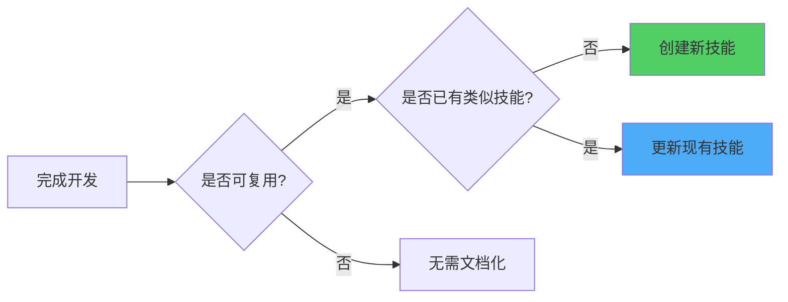

**技能分类标准**：

| 分类 | 适用场景 | 示例 |
|-----|---------|------|
| **开发技能** | 编码模式和实践 | TDD、设计模式、错误处理 |
| **架构技能** | 系统设计决策 | 微服务、缓存策略、数据库选型 |
| **工具技能** | 工具使用技巧 | Git 工作流、调试技巧、性能分析 |
| **领域技能** | 特定领域知识 | 支付集成、认证授权、实时通信 |

### 3. 审查频率建议

```mermaid
graph TD
    A[代码变更] --> B{变更大小}
    B -->|小<br/>< 50行| C[提交前自查]
    B -->|中<br/>50-500行| D[/workflows:review]
    B -->|大<br/>> 500行| E[分阶段审查]
    
    E --> F[架构审查]
    F --> G[功能审查]
    G --> H[性能审查]
    H --> I[安全审查]
    
    style C fill:#51cf66
    style D fill:#ffd43b
    style E fill:#ff6b6b
```

### 4. Worktree 使用建议

**何时使用 Worktree**：

- ✅ 开发新功能（隔离环境）
- ✅ 实验性重构（可快速回滚）
- ✅ 多版本并行开发
- ✅ 紧急修复（不影响当前工作）

**何时不使用**：

- ❌ 简单的 bug 修复（< 10行代码）
- ❌ 文档更新
- ❌ 配置文件修改

### 5. 复合效应最大化

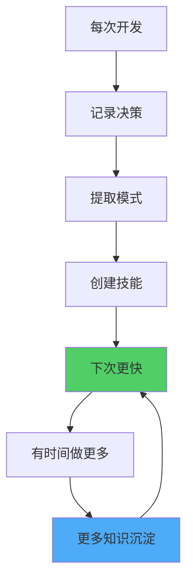

**关键指标跟踪**：

| 指标 | 如何衡量 | 目标 |
|-----|---------|------|
| **重复工作减少率** | 本次用时 / 上次用时 | < 0.6（减少40%） |
| **首次正确率** | 审查通过 / 总审查次数 | > 0.8（80%通过） |
| **技能复用率** | 使用现有技能 / 总决策点 | > 0.5（50%复用） |
| **知识留存率** | 3个月后能回忆 / 总技能 | > 0.7（70%记得） |

## 编码辅导插件（Coding Tutor）

除了复合工程插件，仓库还包含一个独立的 **Coding Tutor** 插件，用于个性化学习。

```mermaid
graph LR
    A[Coding Tutor] --> B[/teach-me]
    A --> C[/quiz-me]
    A --> D[/sync-tutorials]
    
    B --> E[创建教程]
    C --> F[间隔重复测验]
    D --> G[同步到所有项目]
    
    style B fill:#4dabf7
    style C fill:#ffd43b
    style D fill:#51cf66
```

### 核心命令

#### 1. /teach-me - 创建教程

```bash
/teach-me React useCallback 和 useMemo 的区别
```

**生成的教程**（保存到 `~/coding-tutor-tutorials/react-hooks.md`）：

```markdown
# React Hooks: useCallback vs useMemo

## 核心概念

### useCallback
- 用途：缓存**函数引用**
- 返回：记忆化的函数
- 适用场景：作为 props 传递给子组件的函数

### useMemo
- 用途：缓存**计算结果**
- 返回：记忆化的值
- 适用场景：昂贵的计算操作

## 代码示例

### useCallback 示例
```tsx
const handleClick = useCallback(() => {
  console.log('Clicked', count);
}, [count]); // 只有 count 变化时才重新创建函数

<Button onClick={handleClick} />
```

### useMemo 示例
```tsx
const expensiveValue = useMemo(() => {
  return computeExpensiveValue(a, b);
}, [a, b]); // 只有 a 或 b 变化时才重新计算
```

## 关键差异

| 特性 | useCallback | useMemo |
|-----|------------|---------|
| 缓存对象 | 函数 | 值 |
| 使用场景 | 传递回调 | 昂贵计算 |
| 返回类型 | Function | any |

## 常见误区

❌ 错误：过度使用（简单场景无需优化）
✅ 正确：只在性能瓶颈处使用

## 实战建议

1. 使用 React DevTools Profiler 识别性能问题
2. 优先优化列表渲染
3. 避免在每次渲染时创建新的回调函数

## 测验历史
- 2026-02-05: 8/10（下次复习：2026-02-06）
```

#### 2. /quiz-me - 间隔重复测验

```bash
/quiz-me
```

**测验流程**：

```mermaid
graph TD
    A[/quiz-me] --> B[加载待复习教程]
    B --> C{有待复习教程?}
    C -->|否| D[全部掌握!]
    C -->|是| E[选择教程]
    E --> F[提问]
    F --> G[用户回答]
    G --> H[评分 1-10]
    H --> I{分数 >= 8?}
    I -->|是| J[延长复习间隔]
    I -->|否| K[缩短复习间隔]
    
    J --> L[下次复习: +斐波那契天数]
    K --> M[下次复习: 明天]
    
    style J fill:#51cf66
    style K fill:#ff6b6b
```

**斐波那契间隔**：

| 复习次数 | 间隔天数 | 累计天数 |
|---------|---------|---------|
| 第1次 | 1天 | 1天 |
| 第2次 | 2天 | 3天 |
| 第3次 | 5天 | 8天 |
| 第4次 | 13天 | 21天 |
| 第5次 | 34天 | 55天 |
| 第6次 | 144天 | 199天 |

#### 3. /sync-tutorials - 跨项目同步

```bash
/sync-tutorials
```

教程存储在 `~/coding-tutor-tutorials/`，在所有项目中共享。

## 故障排查

### 问题 1：插件安装失败

**症状**：

```bash
Error: Failed to load plugin marketplace
```

**解决方案**：

```bash
# 检查网络连接
curl https://github.com/EveryInc/compound-engineering-plugin

# 手动克隆并安装
git clone https://github.com/EveryInc/compound-engineering-plugin.git
cd compound-engineering-plugin
/plugin add ./plugins/compound-engineering
```

### 问题 2：Context7 MCP 服务器无法连接

**症状**：

```bash
Error: Context7 MCP server not responding
```

**解决方案**：

```bash
# 检查 MCP 服务器配置
cat ~/.config/claude/mcp-servers.json

# 重新配置
/setup-mcp-servers

# 手动测试连接
npx -y @context7/mcp-server
```

### 问题 3：Worktree 创建失败

**症状**：

```bash
Error: Cannot create worktree, path already exists
```

**解决方案**：

```bash
# 列出现有 worktree
git worktree list

# 删除无效的 worktree
git worktree remove ../feature-xyz

# 清理已删除但未注销的 worktree
git worktree prune

# 或使用插件命令
/git-worktree-prune
```

### 问题 4：审查代理无响应

**症状**：

```bash
/workflows:review 运行超过 5 分钟无响应
```

**解决方案**：

```bash
# 检查代理状态
/plugin status compound-engineering

# 重新加载插件
/plugin reload compound-engineering

# 如果问题持续，提交 bug 报告
/report-bug
```

## 性能优化建议

### 1. 减少代理调用次数

```mermaid
graph LR
    A[多个小审查] --> B[合并为一次大审查]
    C[频繁调用 /context7-search] --> D[缓存结果到技能文档]
    E[每次都重新分析] --> F[复用上次分析结果]
    
    style B fill:#51cf66
    style D fill:#51cf66
    style F fill:#51cf66
```

### 2. 优化技能文档结构

**不推荐**（单个巨大文件）：

```
skills/
  everything-about-react.md (5000 行)
```

**推荐**（细分为小文件）：

```
skills/
  react-hooks-basics.md (200 行)
  react-performance-optimization.md (300 行)
  react-testing-strategies.md (250 行)
```

### 3. 使用缓存策略

```bash
# 缓存 Context7 查询结果
/context7-search React hooks --cache

# 复用上次审查结果（如果代码变化 < 10%）
/workflows:review --incremental
```

## 社区与贡献

### 参与方式

```mermaid
mindmap
  root((参与<br/>社区))
    使用反馈
      报告 bug
      提出功能需求
      分享使用案例
    贡献代码
      修复 bug
      添加新代理
      优化性能
    文档贡献
      改进指南
      翻译文档
      制作教程
    技能分享
      提交技能文档
      分享最佳实践
      举办研讨会
```

### 提交 Bug 报告

```bash
/report-bug
```

系统会引导你提供：
- Bug 类型（代理、命令、技能、MCP）
- 复现步骤
- 预期 vs 实际行为
- 错误日志

### 贡献新代理

1. Fork 仓库
2. 创建代理文件：`plugins/compound-engineering/agents/my-agent.md`
3. 编写代理提示词和示例
4. 提交 Pull Request

**代理模板**：

```markdown
# Agent Name

## Role
简要描述此代理的角色

## Expertise
此代理擅长的具体领域

## Approach
此代理的工作方法

## Output Format
输出格式要求

## Examples
实际使用示例
```

### 贡献新技能

```bash
# 使用插件命令创建
/skill-create my-awesome-skill

# 编辑生成的文件
vim skills/my-awesome-skill.md

# 提交到仓库
git add skills/my-awesome-skill.md
git commit -m "Add: my-awesome-skill"
git push origin my-skill-branch
```

## 路线图与未来展望

### 已规划的功能（plans/ 目录）

#### 1. "成长你自己的花园"架构

```mermaid
graph TD
    A[安装核心插件<br/>11个通用代理] --> B{检测技术栈}
    B -->|Rails| C[推荐 DHH Rails Reviewer]
    B -->|React| D[推荐 React Performance Optimizer]
    B -->|Go| E[推荐 Go Concurrency Reviewer]
    
    C --> F{用户选择}
    D --> F
    E --> F
    
    F -->|接受| G[下载并激活代理]
    F -->|拒绝| H[不再提示]
    
    G --> I[个性化插件生态]
    
    style A fill:#4dabf7
    style G fill:#51cf66
    style I fill:#ffd43b
```

**核心理念**：
- **种子插件**：11 个通用代理（Plan、Work、Review、Compound 等）
- **按需生长**：根据技术栈推荐框架特定代理
- **避免臃肿**：用户只安装需要的代理

#### 2. 自动化复合循环

```mermaid
sequenceDiagram
    participant Dev as 开发者
    participant Plugin as 插件
    participant AI as AI 代理
    
    Dev->>Plugin: 提出功能需求
    Plugin->>AI: 自动规划
    AI-->>Plugin: 返回计划
    Plugin->>AI: 自动实施
    AI-->>Plugin: 返回实现
    Plugin->>AI: 自动审查
    AI-->>Plugin: 返回审查报告
    Plugin->>AI: 自动修复问题
    AI-->>Plugin: 返回修复后代码
    Plugin->>AI: 自动知识沉淀
    AI-->>Plugin: 返回技能文档
    Plugin-->>Dev: 完成！查看技能文档
```

**目标**：一键完成整个复合工程循环

### 长期愿景

```mermaid
timeline
    title Compound Engineering Plugin 发展路线图
    2026 Q1 : 基础功能完善
           : Context7 MCP 集成
           : Coding Tutor 独立插件
    2026 Q2 : 多语言支持
           : 自定义代理市场
           : 企业版功能
    2026 Q3 : AI 驱动的复合循环
           : 跨项目知识共享
           : 可视化仪表盘
    2026 Q4 : 社区生态成熟
           : 插件扩展 API
           : 与其他 AI IDE 集成
```

## 总结

Compound Engineering Plugin 不仅是一个工具集合，更是一种**工程哲学**的体现：

```mermaid
mindmap
  root((复合工程<br/>哲学))
    质量递增
      每次开发都提升代码库质量
      技术债务逐步消除
      而非累积
    知识复用
      经验文档化为技能
      避免重复犯错
      团队知识共享
    智能协作
      多代理各司其职
      人机紧密配合
      效率倍增
    持续改进
      每个循环都是学习机会
      流程不断优化
      工具不断进化
```

### 核心价值主张

| 传统开发 | 复合工程 | 改进幅度 |
|---------|---------|---------|
| 代码质量随时间**下降** | 代码质量随时间**上升** | 📈 长期复利 |
| 重复犯同样的错误 | 从错误中学习并文档化 | 🎓 知识积累 |
| 开发速度逐渐**变慢** | 开发速度逐渐**加快** | ⚡ 效率提升 |
| 手动审查，覆盖不全 | 多代理自动化审查 | 🔍 质量保证 |
| 个人经验难以传承 | 团队知识标准化 | 🤝 协作增强 |

### 立即开始

```bash
# 1. 安装插件
/plugin marketplace add https://github.com/EveryInc/compound-engineering-plugin
/plugin install compound-engineering

# 2. 配置 MCP 服务器
/setup-mcp-servers

# 3. 开始你的第一个复合工程循环
/workflows:plan 你的功能需求
```

### 学习资源

- **官方文档**：<https://deepwiki.com/EveryInc/compound-engineering-plugin>
- **视频教程**：查看 docs/ 目录
- **社区讨论**：GitHub Discussions
- **示例项目**：examples/ 目录

---

**让每一次工程工作都比上一次更容易** 🚀

这不是口号，而是通过精心设计的工作流和持续知识积累实现的现实。

从今天开始，让技术债务成为历史，迎接复合工程的未来！

