## 项目简介

**Ralph** 是一个为 Claude Code CLI 打造的自主开发循环工具，它能让 AI 在最少人工干预的情况下自主完成整个项目的开发工作。Ralph 得名于 Geoffrey Huntley 创造的 "Ralph 技术"，这是一种让 AI 代理持续工作直到任务完成的方法论。

```mermaid
mindmap
  root((Ralph<br/>Claude Code))
    核心功能
      自主循环
      智能退出
      速率限制
      会话管理
    监控系统
      tmux集成
      实时仪表盘
      日志追踪
      状态检查
    安全机制
      断路器模式
      API限制
      超时控制
      错误恢复
    项目管理
      快速设置
      模板系统
      PRD导入
      配置文件
```

### 核心价值

- **🤖 完全自主**：AI 自动循环开发，无需持续监督
- **🎯 智能退出**：双条件检测机制，确保任务真正完成
- **⚡ 速率保护**：内置速率限制和断路器，保护 API 配额
- **📊 实时监控**：tmux 集成的可视化仪表盘，实时掌握进度
- **🔧 易于使用**：一键安装，开箱即用的项目模板
- **🧪 充分测试**：440 个综合测试，100% 通过率保证质量

### GitHub 信息

- **仓库**：[frankbria/ralph-claude-code](https://github.com/frankbria/ralph-claude-code)
- **License**：MIT
- **Stars**：5.9k+ ⭐
- **当前版本**：v0.11.2
- **开发状态**：活跃开发中，目标 v1.0.0

## 工作原理

Ralph 通过一个智能循环系统与 Claude Code 交互，实现完全自主的开发流程。

```mermaid
graph TB
    Start([开始 Ralph 循环]) --> LoadPrompt[加载 PROMPT.md]
    LoadPrompt --> CheckSession{检查会话<br/>状态}
    CheckSession -->|会话有效| RunClaude[执行 Claude Code]
    CheckSession -->|会话过期/无效| ResetSession[重置会话]
    ResetSession --> RunClaude
    
    RunClaude --> Timeout{执行<br/>超时?}
    Timeout -->|是| HandleTimeout[处理超时<br/>记录日志]
    Timeout -->|否| CaptureResponse[捕获响应]
    HandleTimeout --> CaptureResponse
    
    CaptureResponse --> Analyze[分析响应内容]
    Analyze --> CheckExit{检查退出<br/>条件}
    
    CheckExit -->|双条件满足| Exit([退出循环])
    CheckExit -->|继续| CheckCircuit{检查<br/>断路器}
    
    CheckCircuit -->|熔断| Wait[等待恢复]
    Wait --> CheckCircuit
    CheckCircuit -->|正常| CheckRate{检查<br/>速率限制}
    
    CheckRate -->|超限| RateWait[等待计数器重置]
    RateWait --> CheckRate
    CheckRate -->|正常| UpdateLog[更新日志和状态]
    
    UpdateLog --> CheckAPILimit{API限制<br/>检查}
    CheckAPILimit -->|5小时限制| UserPrompt[提示用户决策]
    CheckAPILimit -->|正常| IncrementLoop[循环计数+1]
    UserPrompt --> IncrementLoop
    
    IncrementLoop --> RunClaude
    
    style Start fill:#e1f5e1
    style Exit fill:#ffe1e1
    style RunClaude fill:#e1e5ff
    style Analyze fill:#fff4e1
    style CheckExit fill:#f0e1ff
```

### 智能退出检测

Ralph 使用**双条件退出门**来判断任务是否真正完成：

```mermaid
graph LR
    Response[Claude 响应] --> Condition1{条件1:<br/>完成指示器}
    Response --> Condition2{条件2:<br/>EXIT_SIGNAL}
    
    Condition1 -->|检测到| C1Pass[✓]
    Condition1 -->|未检测到| C1Fail[✗]
    
    Condition2 -->|true| C2Pass[✓]
    Condition2 -->|false/未设置| C2Fail[✗]
    
    C1Pass --> Gate{双条件<br/>都满足?}
    C2Pass --> Gate
    C1Fail --> Gate
    C2Fail --> Gate
    
    Gate -->|是| Exit([退出循环])
    Gate -->|否| Continue([继续循环])
    
    style Exit fill:#90EE90
    style Continue fill:#FFB6C1
    style Gate fill:#FFD700
```

**退出指示器包括：**
- "任务完成"、"所有完成"、"完全完成"
- "没有更多工作"、"没有剩余任务"
- "项目完成"、"实现完成"
- EXIT_SIGNAL 明确设置为 true

## 快速开始

### 系统要求

```mermaid
graph LR
    subgraph 必需依赖
        A[Claude Code CLI] --> B[有效的 Anthropic API 密钥]
        C[Bash 4.0+] --> D[tmux]
    end
    
    subgraph macOS 额外依赖
        E[GNU coreutils<br/>提供 timeout 命令]
    end
    
    subgraph 开发依赖
        F[Node.js 18+] --> G[npm 或 yarn]
        H[Bats<br/>Bash 测试框架]
    end
    
    style A fill:#e1f5e1
    style D fill:#e1f5e1
    style E fill:#fff4e1
```

### 安装步骤

#### 1. 安装 Claude Code

```bash
# 使用 npm
npm install -g @anthropic-ai/claude-code

# 或使用 yarn
yarn global add @anthropic-ai/claude-code

# 设置 API 密钥
export ANTHROPIC_API_KEY="your-api-key-here"

# 验证安装
claude-code --version
```

#### 2. 安装依赖工具

**Ubuntu/Debian:**
```bash
sudo apt-get update
sudo apt-get install tmux
```

**macOS:**
```bash
# 安装 tmux
brew install tmux

# 安装 GNU coreutils（提供 timeout 命令）
brew install coreutils

# 验证安装
gtimeout --version
```

**CentOS/RHEL:**
```bash
sudo yum install tmux
```

#### 3. 安装 Ralph

```bash
# 克隆仓库
git clone https://github.com/frankbria/ralph-claude-code.git
cd ralph-claude-code

# 运行安装脚本（全局安装）
./install.sh

# 验证安装
ralph --help
```

### 创建第一个项目

```mermaid
graph TD
    Start([创建新项目]) --> Setup[ralph-setup project-name]
    Setup --> Structure[生成项目结构]
    Structure --> Files{项目文件}
    
    Files -->|配置| Config[.ralphrc<br/>配置文件]
    Files -->|提示词| Prompt[PROMPT.md<br/>任务描述]
    Files -->|计划| Plan[fix_plan.md<br/>执行计划]
    Files -->|日志| Logs[.ralph/logs/<br/>日志目录]
    
    Config --> Edit[编辑 PROMPT.md<br/>定义开发任务]
    Prompt --> Edit
    Plan --> Edit
    Logs --> Edit
    
    Edit --> Run[ralph --monitor<br/>启动开发循环]
    Run --> Monitor[实时监控进度]
    
    style Start fill:#e1f5e1
    style Run fill:#e1e5ff
    style Monitor fill:#fff4e1
```

**实际操作：**

```bash
# 1. 创建新项目
ralph-setup my-awesome-app

# 2. 进入项目目录
cd my-awesome-app

# 3. 编辑 PROMPT.md，描述你的项目需求
cat > PROMPT.md << 'EOF'
# 项目目标
创建一个简单的 Todo 应用

## 技术栈
- 前端：React + TypeScript
- 后端：Node.js + Express
- 数据库：PostgreSQL

## 功能需求
1. 用户可以添加、编辑、删除待办事项
2. 待办事项可以标记为完成/未完成
3. 支持按状态筛选
4. 响应式设计

## 完成标准
- 所有功能正常工作
- 代码有适当的注释
- 包含基本的错误处理
- 通过基本测试

EXIT_SIGNAL: true
EOF

# 4. 启动 Ralph（带监控）
ralph --monitor
```

## 核心命令详解

### 项目管理命令

```mermaid
graph TB
    subgraph 项目初始化
        A[ralph-setup project-name<br/>创建新项目] 
        B[ralph-enable<br/>在现有项目启用<br/>交互式]
        C[ralph-enable-ci<br/>在现有项目启用<br/>非交互式]
        D[ralph-import prd.md project<br/>从PRD转换为项目]
    end
    
    subgraph 项目迁移
        E[ralph-migrate<br/>迁移到.ralph/结构]
    end
    
    subgraph 会话管理
        F[ralph --reset-session<br/>重置会话状态]
    end
    
    style A fill:#e1f5e1
    style B fill:#e1f5e1
    style E fill:#fff4e1
    style F fill:#ffe1e1
```

### Ralph 循环选项

**基础用法：**
```bash
ralph [OPTIONS]
```

**常用选项：**

| 选项 | 简写 | 说明 | 默认值 |
|------|------|------|--------|
| `--help` | `-h` | 显示帮助信息 | - |
| `--calls NUM` | `-c` | 每小时最大调用次数 | 100 |
| `--prompt FILE` | `-p` | 指定提示词文件 | PROMPT.md |
| `--status` | `-s` | 显示当前状态并退出 | - |
| `--monitor` | `-m` | 启动 tmux 会话和实时监控 | - |
| `--verbose` | `-v` | 显示详细进度更新 | - |
| `--timeout MIN` | `-t` | Claude Code 执行超时（分钟） | 15 |
| `--output-format` | - | 输出格式：json 或 text | json |
| `--no-continue` | - | 禁用会话连续性 | - |
| `--reset-circuit` | - | 重置断路器 | - |
| `--circuit-status` | - | 显示断路器状态 | - |
| `--reset-session` | - | 手动重置会话状态 | - |

**示例用法：**

```bash
# 启动带监控的开发循环
ralph --monitor

# 限制每小时50次API调用
ralph --calls 50

# 设置30分钟超时
ralph --timeout 30

# 使用自定义提示词文件
ralph --prompt custom-task.md

# 详细模式运行
ralph --verbose

# 查看当前状态（JSON格式）
ralph --status

# 查看当前状态（文本格式）
ralph --status --output-format text

# 重置会话并开始新循环
ralph --reset-session --monitor
```

### 监控命令

```mermaid
graph LR
    A[监控方式] --> B[ralph --monitor<br/>集成监控<br/>推荐]
    A --> C[ralph-monitor<br/>独立监控<br/>需手动启动]
    A --> D[ralph --status<br/>状态查询<br/>一次性]
    
    B --> E[tmux 分屏显示]
    C --> E
    
    E --> F[左侧：Ralph运行]
    E --> G[右侧：实时仪表盘]
    
    style B fill:#90EE90
    style E fill:#e1e5ff
```

**tmux 快捷键：**

| 快捷键 | 功能 |
|--------|------|
| `Ctrl+B` 然后 `D` | 分离会话（保持运行） |
| `Ctrl+B` 然后 `←/→` | 切换面板 |
| `tmux list-sessions` | 查看所有会话 |
| `tmux attach -t <name>` | 重新连接会话 |

## 配置文件详解

### .ralphrc 配置

Ralph 支持项目级配置文件 `.ralphrc`，支持 JSON 或 Bash 格式：

**JSON 格式：**
```json
{
  "MAX_CALLS_PER_HOUR": 100,
  "EXECUTION_TIMEOUT_MINUTES": 15,
  "PROMPT_FILE": "PROMPT.md",
  "OUTPUT_FORMAT": "json",
  "ALLOWED_TOOLS": "Write,Read,Edit,Bash(git *),Bash(npm *),Bash(pytest)",
  "SESSION_CONTINUITY": true,
  "VERBOSE": false
}
```

**Bash 格式：**
```bash
MAX_CALLS_PER_HOUR=100
EXECUTION_TIMEOUT_MINUTES=15
PROMPT_FILE="PROMPT.md"
OUTPUT_FORMAT="json"
ALLOWED_TOOLS="Write,Read,Edit,Bash(git *),Bash(npm *),Bash(pytest)"
SESSION_CONTINUITY=true
VERBOSE=false
```

### PROMPT.md 提示词结构

```markdown
# 项目目标
[清晰描述项目的总体目标]

## 技术要求
[列出使用的技术栈和工具]

## 功能需求
[详细的功能列表，使用编号或项目符号]

## 完成标准
[定义任务何时算完成]

## 约束条件
[任何限制或特殊要求]

EXIT_SIGNAL: [true/false]
```

**最佳实践：**

```mermaid
graph TD
    A[编写优秀的 PROMPT.md] --> B[明确目标]
    A --> C[分解任务]
    A --> D[定义标准]
    A --> E[设置 EXIT_SIGNAL]
    
    B --> B1[使用清晰的语言]
    B --> B2[避免模糊表述]
    
    C --> C1[按优先级排序]
    C --> C2[包含验收标准]
    
    D --> D1[可测量的指标]
    D --> D2[明确的完成条件]
    
    E --> E1[任务完成时设为 true]
    E --> E2[允许 Claude 自主判断]
    
    style A fill:#FFD700
    style E1 fill:#90EE90
```

### fix_plan.md 计划文件

Ralph 会自动维护 `fix_plan.md`，记录：
- 当前任务进度
- 已完成的步骤
- 待处理的工作
- 遇到的问题

**不要手动编辑此文件**，让 Claude 自动更新。

## 监控和调试

### 实时仪表盘

```mermaid
graph TB
    subgraph Ralph 监控仪表盘
        A[实时状态] --> A1[循环计数]
        A --> A2[API调用统计]
        A --> A3[速率限制状态]
        
        B[日志信息] --> B1[最近10条日志]
        B --> B2[错误和警告]
        B --> B3[时间戳]
        
        C[会话信息] --> C1[会话年龄]
        C --> C2[会话ID]
        C --> C3[重置触发器]
        
        D[断路器状态] --> D1[当前状态]
        D --> D2[失败计数]
        D --> D3[恢复时间]
    end
    
    style A fill:#e1f5e1
    style B fill:#fff4e1
    style C fill:#e1e5ff
    style D fill:#ffe1e1
```

### 日志系统

```bash
# 实时查看日志
tail -f .ralph/logs/ralph.log

# 查看最近50行
tail -n 50 .ralph/logs/ralph.log

# 搜索特定内容
grep "ERROR" .ralph/logs/ralph.log

# 查看状态文件
cat .ralph/logs/status.json
```

**日志级别：**
- `INFO` - 一般信息
- `WARNING` - 警告信息
- `ERROR` - 错误信息
- `CIRCUIT` - 断路器事件
- `RATE_LIMIT` - 速率限制事件

### 状态检查

```bash
# JSON 格式状态输出
ralph --status

# 文本格式状态输出
ralph --status --output-format text

# 检查断路器状态
ralph --circuit-status
```

**状态输出示例：**
```json
{
  "status": "running",
  "loop_count": 15,
  "api_calls_this_hour": 42,
  "max_calls_per_hour": 100,
  "remaining_calls": 58,
  "last_execution": "2026-01-30T14:23:45+08:00",
  "session_age_hours": 2.5,
  "circuit_breaker": "closed"
}
```

## 高级功能

### 断路器模式

```mermaid
stateDiagram-v2
    [*] --> Closed: 正常运行
    Closed --> Open: 连续失败<br/>达到阈值
    Open --> HalfOpen: 超时后<br/>尝试恢复
    HalfOpen --> Closed: 成功执行
    HalfOpen --> Open: 再次失败
    
    Closed: 闭合状态<br/>正常执行命令
    Open: 打开状态<br/>拒绝执行<br/>等待恢复
    HalfOpen: 半开状态<br/>试探性执行
```

**断路器配置：**
- **失败阈值**：连续5次失败触发熔断
- **恢复时间**：300秒（5分钟）
- **半开测试**：单次成功即恢复

**手动控制：**
```bash
# 查看断路器状态
ralph --circuit-status

# 手动重置断路器
ralph --reset-circuit
```

### 速率限制

```mermaid
graph TB
    Request[API 请求] --> Counter{当前计数}
    Counter -->|< 限制| Allow[允许执行]
    Counter -->|>= 限制| Block[阻止执行]
    
    Allow --> Execute[执行 Claude Code]
    Execute --> Increment[计数器+1]
    Increment --> Check{到达1小时?}
    
    Block --> Wait[等待计数器重置]
    Wait --> Display[显示倒计时]
    Display --> Reset[重置计数器]
    Reset --> Request
    
    Check -->|是| Reset
    Check -->|否| Request
    
    style Allow fill:#90EE90
    style Block fill:#FFB6C1
```

**速率限制特性：**
- 默认：100次调用/小时
- 自动倒计时显示
- 滑动窗口计数
- 5小时API限制检测

### 会话管理

```mermaid
graph TB
    Start[启动 Ralph] --> LoadSession{会话<br/>存在?}
    
    LoadSession -->|否| CreateNew[创建新会话]
    LoadSession -->|是| CheckAge{检查<br/>年龄}
    
    CheckAge -->|< 24h| CheckValidity{会话<br/>有效?}
    CheckAge -->|>= 24h| Expired[会话过期]
    
    CheckValidity -->|是| Continue[继续使用]
    CheckValidity -->|否| Invalid[会话无效]
    
    Expired --> AutoReset[自动重置]
    Invalid --> AutoReset
    CreateNew --> Execute[执行循环]
    AutoReset --> Execute
    Continue --> Execute
    
    Execute --> Monitor[监控触发器]
    Monitor --> Trigger{重置<br/>触发?}
    
    Trigger -->|是| ManualReset[重置会话]
    Trigger -->|否| Execute
    ManualReset --> Execute
    
    style Continue fill:#90EE90
    style Expired fill:#FFB6C1
    style AutoReset fill:#FFD700
```

**会话重置触发器：**
- 会话超过24小时
- 会话状态无效
- 手动执行 `--reset-session`
- Claude 明确指示需要新上下文

### 允许的工具配置

Ralph 可以精确控制 Claude 可以使用哪些工具：

```bash
# 默认允许的工具
ralph --allowed-tools "Write,Read,Edit,Bash(git *),Bash(npm *),Bash(pytest)"

# 只允许读写，禁止命令执行
ralph --allowed-tools "Write,Read,Edit"

# 允许更多命令
ralph --allowed-tools "Write,Read,Edit,Bash(*)"
```

**工具类型：**
- `Write` - 创建/覆盖文件
- `Read` - 读取文件
- `Edit` - 编辑文件
- `Bash(pattern)` - 执行匹配模式的命令

## 常见问题解决

### 问题诊断流程

```mermaid
graph TD
    Problem[遇到问题] --> Type{问题类型}
    
    Type -->|速率限制| R1[检查 API 调用计数]
    R1 --> R2[降低 --calls 参数]
    R2 --> R3[等待计数器重置]
    
    Type -->|循环卡住| L1[检查 fix_plan.md]
    L1 --> L2[查看是否有冲突任务]
    L2 --> L3[编辑 PROMPT.md 澄清]
    
    Type -->|提前退出| E1[检查退出阈值]
    E1 --> E2[查看 EXIT_SIGNAL]
    E2 --> E3[调整完成条件]
    
    Type -->|执行超时| T1[检查任务复杂度]
    T1 --> T2[增加 --timeout 值]
    T2 --> T3[分解为更小任务]
    
    Type -->|会话问题| S1[检查会话年龄]
    S1 --> S2[运行 --reset-session]
    S2 --> S3[清理 .ralph 目录]
    
    Type -->|断路器熔断| C1[查看 --circuit-status]
    C1 --> C2[运行 --reset-circuit]
    C2 --> C3[修复根本原因]
    
    style Problem fill:#FFB6C1
    style R2 fill:#90EE90
    style L3 fill:#90EE90
    style E3 fill:#90EE90
    style T2 fill:#90EE90
    style S2 fill:#90EE90
    style C2 fill:#90EE90
```

### 常见问题 Q&A

**Q1: Ralph 一直说遇到速率限制怎么办？**

```bash
# 降低每小时调用次数
ralph --calls 50

# 检查当前状态
ralph --status

# 等待计数器自动重置（每小时）
```

**Q2: 循环在同一个地方反复执行怎么办？**

检查 `fix_plan.md` 中是否有不清晰或冲突的任务描述：

```bash
# 查看计划文件
cat fix_plan.md

# 更新 PROMPT.md，提供更清晰的指导
nano PROMPT.md

# 重置会话重新开始
ralph --reset-session
```

**Q3: Claude 明明完成了任务但没有退出？**

确保在 `PROMPT.md` 中设置了 EXIT_SIGNAL：

```markdown
## 完成标准
- 所有功能正常工作
- 测试通过
- 代码有文档

EXIT_SIGNAL: true
```

**Q4: macOS 上提示 "timeout: command not found"？**

```bash
# 安装 GNU coreutils
brew install coreutils

# 验证安装
gtimeout --version

# Ralph 会自动使用 gtimeout
```

**Q5: tmux 会话丢失了怎么办？**

```bash
# 列出所有会话
tmux list-sessions

# 重新连接
tmux attach -t ralph-my-project

# 如果会话真的丢失，重新启动
ralph --monitor
```

**Q6: 5小时 API 限制触发后怎么办？**

Ralph 会检测到并提示你：

```
已达到5小时API限制。选项：
1. 等待限制重置
2. 退出并稍后恢复
请输入选择 (1/2):
```

建议：
- 选择等待（Ralph 会自动倒计时）
- 或者分离 tmux 会话稍后回来
- 检查任务是否过于复杂，考虑分解

**Q7: 执行经常超时怎么办？**

```bash
# 增加超时时间（单位：分钟）
ralph --timeout 30

# 对于特别复杂的任务
ralph --timeout 60

# 检查任务是否太大，考虑分解为多个小任务
```

## 最佳实践

### 1. 编写高质量提示词

```mermaid
graph LR
    A[好的 PROMPT.md] --> B[清晰目标]
    A --> C[分解任务]
    A --> D[可验证标准]
    A --> E[合理范围]
    
    B --> B1[具体而非模糊]
    C --> C1[优先级排序]
    D --> D1[可测量的指标]
    E --> E1[适合一次完成]
    
    style A fill:#FFD700
    style B1 fill:#90EE90
    style C1 fill:#90EE90
    style D1 fill:#90EE90
    style E1 fill:#90EE90
```

**示例对比：**

❌ **不好的提示词：**
```markdown
# 目标
做一个网站
```

✅ **好的提示词：**
```markdown
# 项目目标
创建一个简单的博客系统

## 技术栈
- 前端：React 18 + TypeScript
- 路由：React Router v6
- 样式：Tailwind CSS
- 构建：Vite

## 核心功能
1. 文章列表页（分页，每页10篇）
2. 文章详情页（Markdown渲染）
3. 标签筛选功能
4. 响应式设计（移动端优先）

## 完成标准
- 所有功能正常工作
- 代码有 TypeScript 类型定义
- 包含基本的错误处理
- 遵循 React 最佳实践
- 通过 ESLint 检查

EXIT_SIGNAL: true
```

### 2. 任务范围控制

```mermaid
graph TB
    Task[开发任务] --> Size{任务大小}
    
    Size -->|小| Small[< 100 API calls<br/>直接执行]
    Size -->|中| Medium[100-300 calls<br/>监控执行]
    Size -->|大| Large[> 300 calls<br/>需要分解]
    
    Small --> Direct[ralph --monitor]
    
    Medium --> Monitor[ralph --monitor<br/>--calls 100]
    
    Large --> Split[分解为子任务]
    Split --> Sub1[子任务1]
    Split --> Sub2[子任务2]
    Split --> Sub3[子任务3]
    
    Sub1 --> Sequential[顺序执行]
    Sub2 --> Sequential
    Sub3 --> Sequential
    
    style Small fill:#90EE90
    style Medium fill:#FFD700
    style Large fill:#FFB6C1
```

**建议：**
- **小任务（< 2小时）**：直接运行
- **中等任务（2-5小时）**：使用监控，设置合理的调用限制
- **大任务（> 5小时）**：分解为多个独立的子项目

### 3. 监控策略

```bash
# 短期任务：快速检查
ralph --status

# 中期任务：启用监控
ralph --monitor

# 长期任务：分离会话
ralph --monitor
# 按 Ctrl+B 然后 D 分离
# 稍后 tmux attach 重新连接
```

### 4. 安全实践

```mermaid
graph TD
    A[安全实践] --> B[版本控制]
    A --> C[备份重要文件]
    A --> D[限制工具权限]
    A --> E[监控 API 使用]
    
    B --> B1[使用 git]
    B --> B2[定期提交]
    
    C --> C1[备份配置]
    C --> C2[保存关键数据]
    
    D --> D1[限制 Bash 命令]
    D --> D2[使用 --allowed-tools]
    
    E --> E1[设置合理的 --calls]
    E --> E2[检查成本]
    
    style A fill:#FFD700
```

**推荐配置：**

```bash
# 初始化 git（如果还没有）
git init
echo ".ralph/logs/" >> .gitignore
git add .
git commit -m "Initial commit before Ralph run"

# 使用安全的工具限制
ralph --monitor \
  --calls 80 \
  --timeout 20 \
  --allowed-tools "Write,Read,Edit,Bash(git *),Bash(npm test),Bash(pytest)"
```

### 5. 成本优化

```mermaid
graph LR
    A[降低成本] --> B[减少调用次数]
    A --> C[优化提示词]
    A --> D[使用缓存]
    A --> E[分阶段开发]
    
    B --> B1[--calls 50]
    C --> C1[更精确的描述]
    D --> D1[会话连续性]
    E --> E1[MVP 优先]
    
    style A fill:#FFD700
    style B1 fill:#90EE90
    style C1 fill:#90EE90
    style D1 fill:#90EE90
    style E1 fill:#90EE90
```

## 开发路线图

### 当前版本：v0.11.2

```mermaid
gantt
    title Ralph 开发路线图
    dateFormat YYYY-MM-DD
    section 已完成 v0.11.2
    核心循环功能           :done, 2025-12-01, 2025-12-15
    智能退出检测           :done, 2025-12-15, 2025-12-20
    速率限制和断路器       :done, 2025-12-20, 2025-12-25
    tmux 集成             :done, 2025-12-25, 2026-01-01
    会话管理              :done, 2026-01-01, 2026-01-05
    440 个测试            :done, 2026-01-05, 2026-01-15
    
    section 进行中 v0.12.x
    增强测试覆盖           :active, 2026-01-20, 2026-02-05
    日志轮转功能           :active, 2026-01-25, 2026-02-10
    
    section 计划中 v1.0.0
    干运行模式             :2026-02-10, 2026-02-20
    指标和分析             :2026-02-15, 2026-02-25
    桌面通知              :2026-02-20, 2026-03-01
    Git 备份和回滚         :2026-02-25, 2026-03-05
    最终文档和发布         :2026-03-05, 2026-03-15
```

### 即将到来的功能

**v0.12.x（约2周）**
- ✅ 安装和设置工作流测试
- ✅ tmux 集成测试
- ✅ 监控仪表盘测试
- 🔄 日志轮转功能
- 🔄 干运行模式

**v1.0.0（约4周）**
- 📋 指标和分析跟踪
- 📋 桌面通知支持
- 📋 Git 备份和回滚系统
- 📋 端到端测试
- 📋 完整文档和发布准备

### 如何贡献

Ralph 正在积极寻找贡献者！查看 [CONTRIBUTING.md](https://github.com/frankbria/ralph-claude-code/blob/main/CONTRIBUTING.md) 了解详情。

**优先贡献领域：**

```mermaid
mindmap
  root((贡献机会))
    测试实现
      扩展测试覆盖
      边缘案例测试
      性能测试
    功能开发
      日志轮转
      干运行模式
      指标系统
    文档
      教程编写
      故障排除指南
      使用示例
    实战反馈
      Bug 报告
      功能建议
      用户体验改进
```

## 实战案例

### 案例1：创建全栈应用

```bash
# 1. 创建项目
ralph-setup fullstack-todo-app
cd fullstack-todo-app

# 2. 编写 PROMPT.md
cat > PROMPT.md << 'EOF'
# 全栈 Todo 应用

## 技术栈
- 前端：React 18 + TypeScript + Vite
- 后端：Node.js + Express + TypeScript
- 数据库：SQLite（开发）+ Prisma ORM
- 样式：Tailwind CSS

## 项目结构
```
/client - React 前端
/server - Express 后端
/shared - 共享类型定义
```

## 功能需求
### 后端 API
1. POST /api/todos - 创建待办事项
2. GET /api/todos - 获取所有待办事项
3. PATCH /api/todos/:id - 更新待办事项
4. DELETE /api/todos/:id - 删除待办事项

### 前端功能
1. 待办列表显示
2. 添加新待办
3. 切换完成状态
4. 删除待办
5. 按状态筛选（全部/进行中/已完成）
6. 响应式设计

## 开发步骤
1. 初始化项目结构
2. 设置 Prisma 和数据库
3. 实现后端 API
4. 创建前端组件
5. 连接前后端
6. 添加样式
7. 测试所有功能

## 完成标准
- 所有 API 端点正常工作
- 前端所有功能可用
- 没有 TypeScript 错误
- 没有 ESLint 警告
- 代码有适当注释
- README 包含运行说明

EXIT_SIGNAL: true
EOF

# 3. 启动 Ralph
ralph --monitor --calls 80 --timeout 25
```

### 案例2：重构现有项目

```bash
# 1. 在现有项目中启用 Ralph
cd my-existing-project
ralph-enable

# 2. 创建重构任务
cat > REFACTOR_TASK.md << 'EOF'
# 代码重构任务

## 目标
将现有的 JavaScript 代码库迁移到 TypeScript

## 当前状态
- 项目使用 JavaScript + JSDoc
- 约30个源文件
- React 组件库

## 重构步骤
1. 安装 TypeScript 依赖
2. 创建 tsconfig.json
3. 将 .js 文件重命名为 .tsx/.ts
4. 添加类型定义
5. 修复类型错误
6. 更新构建配置
7. 更新文档

## 质量要求
- 无 TypeScript 错误
- 保持现有功能不变
- 添加适当的类型注解
- 更新测试（如果有）

EXIT_SIGNAL: true
EOF

# 3. 运行重构任务
ralph --prompt REFACTOR_TASK.md --monitor --timeout 30
```

### 案例3：从 PRD 创建项目

```bash
# 1. 准备 PRD 文档
cat > product_requirements.md << 'EOF'
# 产品需求文档：天气预报应用

## 产品概述
一个简洁的天气预报 Web 应用，显示当前天气和未来5天预报。

## 功能需求

### 核心功能
1. 城市搜索
   - 用户可以搜索任意城市
   - 支持自动完成
   - 保存最近搜索历史

2. 天气显示
   - 当前温度和天气状况
   - 湿度、风速、气压
   - 未来5天预报
   - 天气图标

3. 用户体验
   - 响应式设计
   - 暗黑模式切换
   - 位置权限（可选）

## 技术要求
- 使用免费天气 API（OpenWeatherMap）
- 前端框架：React
- 状态管理：Context API
- 样式：CSS Modules

## 非功能性需求
- 加载时间 < 2秒
- 移动端友好
- 离线缓存最后查询
EOF

# 2. 从 PRD 导入项目
ralph-import product_requirements.md weather-app

# 3. 启动开发
cd weather-app
ralph --monitor
```

## 性能和限制

### API 使用估算

```mermaid
graph TB
    subgraph 任务复杂度与 API 调用
        A[简单任务<br/>单文件修改] --> A1[10-30 calls<br/>~10分钟]
        B[中等任务<br/>多文件功能] --> B1[50-150 calls<br/>~1小时]
        C[复杂任务<br/>全栈应用] --> C1[200-500 calls<br/>~3-5小时]
        D[大型项目<br/>企业应用] --> D1[500+ calls<br/>需要分解]
    end
    
    style A1 fill:#90EE90
    style B1 fill:#FFD700
    style C1 fill:#FFA500
    style D1 fill:#FFB6C1
```

### 资源消耗

| 资源 | 使用情况 | 建议 |
|------|----------|------|
| API 配额 | 取决于任务复杂度 | 使用 `--calls` 限制 |
| 磁盘空间 | 日志文件增长 | 定期清理 `.ralph/logs` |
| 内存 | tmux + Claude | 最小 4GB RAM |
| CPU | 主要是 Claude 调用 | 较低 |

### 性能优化建议

```bash
# 1. 限制并发调用
ralph --calls 50 --monitor

# 2. 增加超时以减少重试
ralph --timeout 20 --monitor

# 3. 使用会话连续性（默认启用）
ralph --monitor  # 自动保持上下文

# 4. 定期清理日志
rm -rf .ralph/logs/*.log.old

# 5. 对于大项目，使用分阶段方法
# 创建多个 PROMPT 文件，逐个执行
ralph --prompt phase1.md --monitor
ralph --prompt phase2.md --monitor
```

## 安全考虑

### 1. API 密钥保护

```bash
# 使用环境变量
export ANTHROPIC_API_KEY="sk-ant-..."

# 不要在代码中硬编码
# 不要提交到 git

# 添加到 .gitignore
echo ".env" >> .gitignore
echo ".ralph/logs/" >> .gitignore
```

### 2. 命令执行限制

```bash
# 限制允许的命令
ralph --allowed-tools "Write,Read,Edit,Bash(git status),Bash(git add),Bash(git commit)"

# 对于生产环境，更严格的限制
ralph --allowed-tools "Write,Read,Edit"
```

### 3. 代码审查

```mermaid
graph LR
    A[Ralph 完成] --> B[代码审查]
    B --> C{通过?}
    C -->|是| D[提交代码]
    C -->|否| E[修复问题]
    E --> F[更新 PROMPT.md]
    F --> G[重新运行 Ralph]
    G --> B
    
    style B fill:#FFD700
    style D fill:#90EE90
```

**建议：**
- 始终审查 Ralph 生成的代码
- 运行测试套件验证功能
- 检查安全漏洞
- 确认符合代码规范

## 故障排除清单

```mermaid
graph TD
    A[Ralph 遇到问题] --> B{问题检查清单}
    
    B --> C1[✓ Claude Code CLI 已安装?]
    B --> C2[✓ ANTHROPIC_API_KEY 已设置?]
    B --> C3[✓ tmux 已安装?]
    B --> C4[✓ PROMPT.md 文件存在?]
    B --> C5[✓ 项目结构正确?]
    B --> C6[✓ 磁盘空间足够?]
    B --> C7[✓ 网络连接正常?]
    B --> C8[✓ API 配额未超限?]
    
    C1 --> D{全部<br/>通过?}
    C2 --> D
    C3 --> D
    C4 --> D
    C5 --> D
    C6 --> D
    C7 --> D
    C8 --> D
    
    D -->|是| E[查看详细日志]
    D -->|否| F[修复问题]
    
    E --> G[tail -f .ralph/logs/ralph.log]
    F --> H[重新运行 Ralph]
    
    style D fill:#FFD700
    style E fill:#90EE90
    style F fill:#FFB6C1
```

### 完整故障排除命令

```bash
#!/bin/bash
# Ralph 健康检查脚本

echo "=== Ralph 健康检查 ==="

# 1. 检查 Claude Code
echo -n "Claude Code CLI: "
if command -v claude-code &> /dev/null; then
    echo "✓ 已安装 ($(claude-code --version))"
else
    echo "✗ 未安装"
fi

# 2. 检查 API 密钥
echo -n "ANTHROPIC_API_KEY: "
if [ -n "$ANTHROPIC_API_KEY" ]; then
    echo "✓ 已设置"
else
    echo "✗ 未设置"
fi

# 3. 检查 tmux
echo -n "tmux: "
if command -v tmux &> /dev/null; then
    echo "✓ 已安装 ($(tmux -V))"
else
    echo "✗ 未安装"
fi

# 4. 检查 timeout/gtimeout
echo -n "timeout 命令: "
if command -v timeout &> /dev/null; then
    echo "✓ timeout 可用"
elif command -v gtimeout &> /dev/null; then
    echo "✓ gtimeout 可用"
else
    echo "✗ 未找到"
fi

# 5. 检查项目结构
echo -n "PROMPT.md: "
if [ -f "PROMPT.md" ]; then
    echo "✓ 存在"
else
    echo "✗ 不存在"
fi

# 6. 检查 Ralph 状态
echo -n "Ralph 状态: "
if command -v ralph &> /dev/null; then
    ralph --status --output-format text 2>/dev/null || echo "未运行"
else
    echo "✗ Ralph 未安装"
fi

# 7. 检查断路器
echo -n "断路器: "
ralph --circuit-status 2>/dev/null || echo "N/A"

# 8. 检查磁盘空间
echo -n "磁盘空间: "
df -h . | awk 'NR==2 {print $4 " 可用"}'

echo "=== 检查完成 ==="
```

## 总结

Ralph 是一个强大的工具，能够让 Claude Code 自主完成复杂的开发任务。通过合理使用它的功能，你可以：

```mermaid
graph LR
    A[使用 Ralph] --> B[提升开发效率]
    A --> C[降低人工成本]
    A --> D[保证代码质量]
    A --> E[加速迭代周期]
    
    B --> F[专注于架构]
    C --> F
    D --> F
    E --> F
    
    F --> G[更快交付产品]
    
    style A fill:#FFD700
    style G fill:#90EE90
```

### 关键要点

1. **明确的提示词**是成功的关键
2. **监控和调试**工具帮助掌控进度
3. **安全实践**保护代码和资源
4. **合理分解任务**提高成功率
5. **定期审查**确保代码质量

### 下一步

- ⭐ 在 [GitHub](https://github.com/frankbria/ralph-claude-code) 上给项目加星
- 📖 阅读 [完整文档](https://github.com/frankbria/ralph-claude-code/blob/main/README.md)
- 🤝 参与 [贡献](https://github.com/frankbria/ralph-claude-code/blob/main/CONTRIBUTING.md)
- 💬 分享你的使用经验

### 相关资源

- [Claude Code 官方文档](https://docs.anthropic.com/claude/docs)
- [Ralph 技术原理](https://github.com/frankbria/ralph-claude-code/blob/main/CLAUDE.md)
- [实现计划](https://github.com/frankbria/ralph-claude-code/blob/main/IMPLEMENTATION_PLAN.md)
- [变更日志](https://github.com/frankbria/ralph-claude-code/blob/main/CHANGELOG.md)

---

**Happy Coding with Ralph! 🚀**

*让 AI 为你工作，而不是你为 AI 工作。*

