## vLLM 简介

vLLM 是一个高吞吐量、内存高效的大语言模型（LLM）推理和服务引擎，最初由加州大学伯克利分校 Sky Computing Lab 开发，现已发展成为社区驱动的开源项目。vLLM 以其卓越的性能和易用性，成为 LLM 部署的首选方案之一。

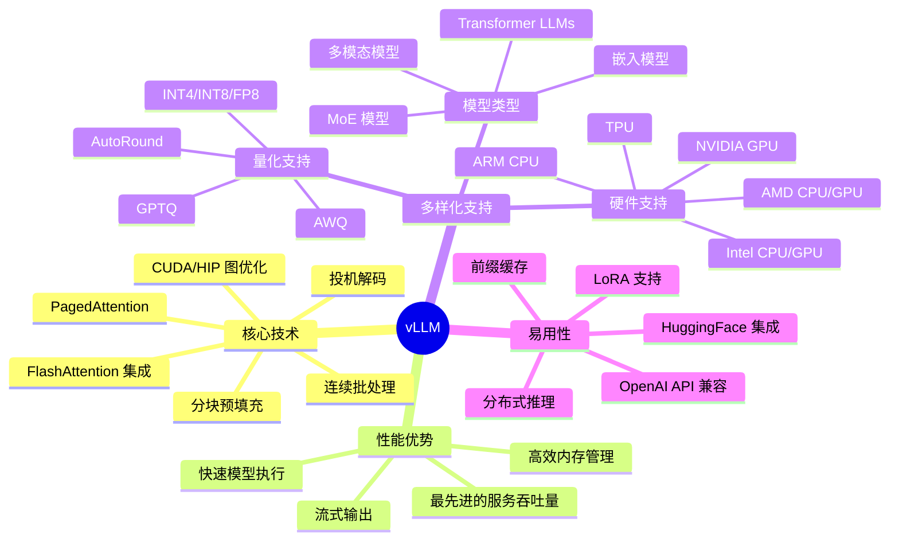

### 为什么选择 vLLM？

vLLM 解决了传统 LLM 推理服务的诸多痛点：

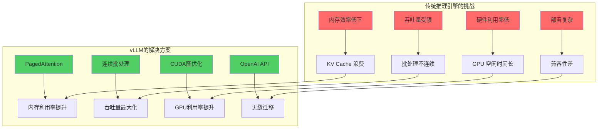

## 核心技术原理

### PagedAttention 机制

PagedAttention 是 vLLM 的核心创新，它借鉴了操作系统虚拟内存的思想，将 KV Cache 分页管理：

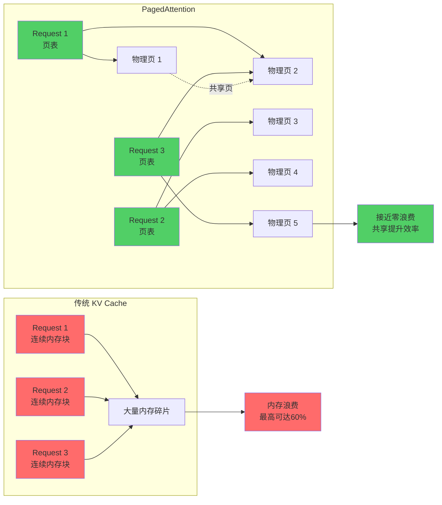

**PagedAttention 优势：**

- **内存效率**：将内存浪费从 60% 降低到接近 0%
- **共享机制**：相同前缀的请求可以共享内存页
- **动态分配**：按需分配和释放内存页
- **灵活性**：支持可变长度的序列

### 连续批处理架构

vLLM 实现了真正的连续批处理（Continuous Batching），无需等待整个批次完成：

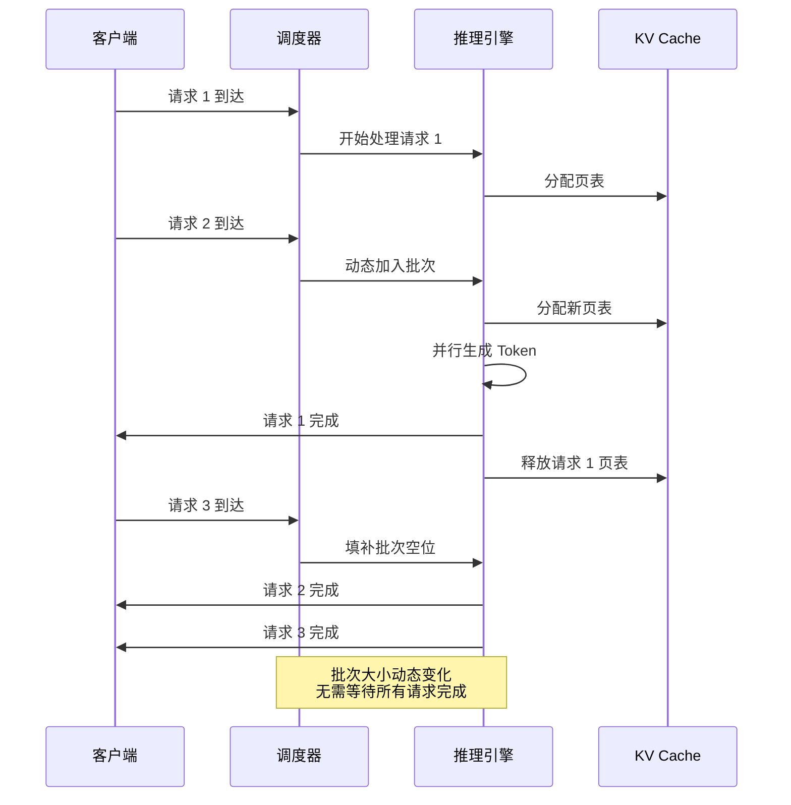

## 安装部署

### 环境要求

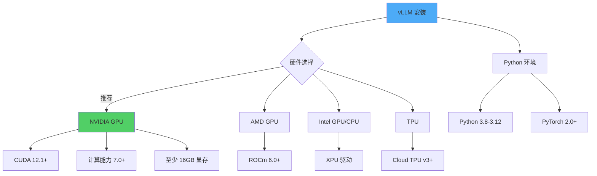

### 快速安装

**方法一：使用 pip 安装（推荐）**

```bash
# 基础安装
pip install vllm

# 指定 CUDA 版本
pip install vllm --extra-index-url https://download.pytorch.org/whl/cu121

# 从源码安装（获取最新功能）
pip install git+https://github.com/vllm-project/vllm.git
```

**方法二：使用 Docker**

```bash
# 拉取官方镜像
docker pull vllm/vllm-openai:latest

# 运行容器
docker run --runtime nvidia --gpus all \
    -v ~/.cache/huggingface:/root/.cache/huggingface \
    -p 8000:8000 \
    --ipc=host \
    vllm/vllm-openai:latest \
    --model meta-llama/Llama-2-7b-chat-hf
```

**方法三：使用 Conda**

```bash
# 创建环境
conda create -n vllm python=3.11 -y
conda activate vllm

# 安装依赖
conda install pytorch pytorch-cuda=12.1 -c pytorch -c nvidia
pip install vllm
```

### 验证安装

```python
import vllm
print(f"vLLM 版本: {vllm.__version__}")

# 检查 GPU 可用性
from vllm import LLM
print("vLLM 安装成功！")
```

## 快速开始

### 基础推理示例

**离线批量推理**

```python
from vllm import LLM, SamplingParams

# 初始化模型
llm = LLM(
    model="meta-llama/Llama-2-7b-chat-hf",
    trust_remote_code=True,
    tensor_parallel_size=1  # GPU 数量
)

# 设置采样参数
sampling_params = SamplingParams(
    temperature=0.7,
    top_p=0.95,
    top_k=50,
    max_tokens=256,
    stop=["</s>"]
)

# 准备提示词
prompts = [
    "什么是人工智能？",
    "解释一下机器学习和深度学习的区别。",
    "Python 的主要特点是什么？"
]

# 批量生成
outputs = llm.generate(prompts, sampling_params)

# 处理输出
for output in outputs:
    prompt = output.prompt
    generated_text = output.outputs[0].text
    print(f"提示词: {prompt}")
    print(f"生成: {generated_text}\n")
```

### 在线服务部署

**启动 OpenAI 兼容的 API 服务器**

```bash
# 基础启动
python -m vllm.entrypoints.openai.api_server \
    --model meta-llama/Llama-2-7b-chat-hf \
    --port 8000

# 高级配置
python -m vllm.entrypoints.openai.api_server \
    --model meta-llama/Llama-2-7b-chat-hf \
    --host 0.0.0.0 \
    --port 8000 \
    --tensor-parallel-size 2 \
    --dtype float16 \
    --max-model-len 4096 \
    --gpu-memory-utilization 0.9 \
    --enable-prefix-caching
```

**客户端调用示例**

```python
from openai import OpenAI

# 连接到 vLLM 服务器
client = OpenAI(
    api_key="EMPTY",  # vLLM 不需要 API key
    base_url="http://localhost:8000/v1"
)

# Chat Completions API
response = client.chat.completions.create(
    model="meta-llama/Llama-2-7b-chat-hf",
    messages=[
        {"role": "system", "content": "你是一个有帮助的AI助手。"},
        {"role": "user", "content": "请介绍一下 vLLM 的优势。"}
    ],
    temperature=0.7,
    max_tokens=512,
    stream=True  # 启用流式输出
)

# 处理流式响应
for chunk in response:
    if chunk.choices[0].delta.content:
        print(chunk.choices[0].delta.content, end="", flush=True)
```

### 流程示意图

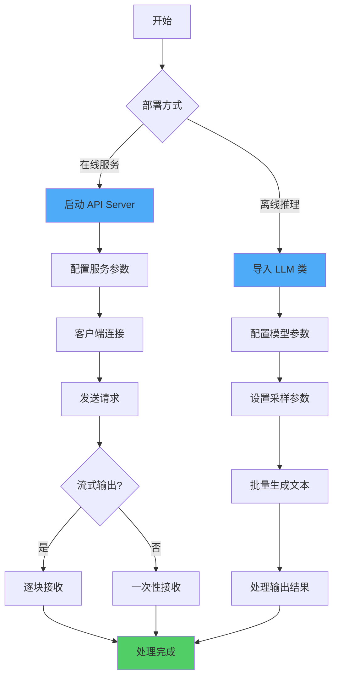

## 高级特性

### 1. 分布式推理

vLLM 支持多种并行策略，实现大模型的高效推理：

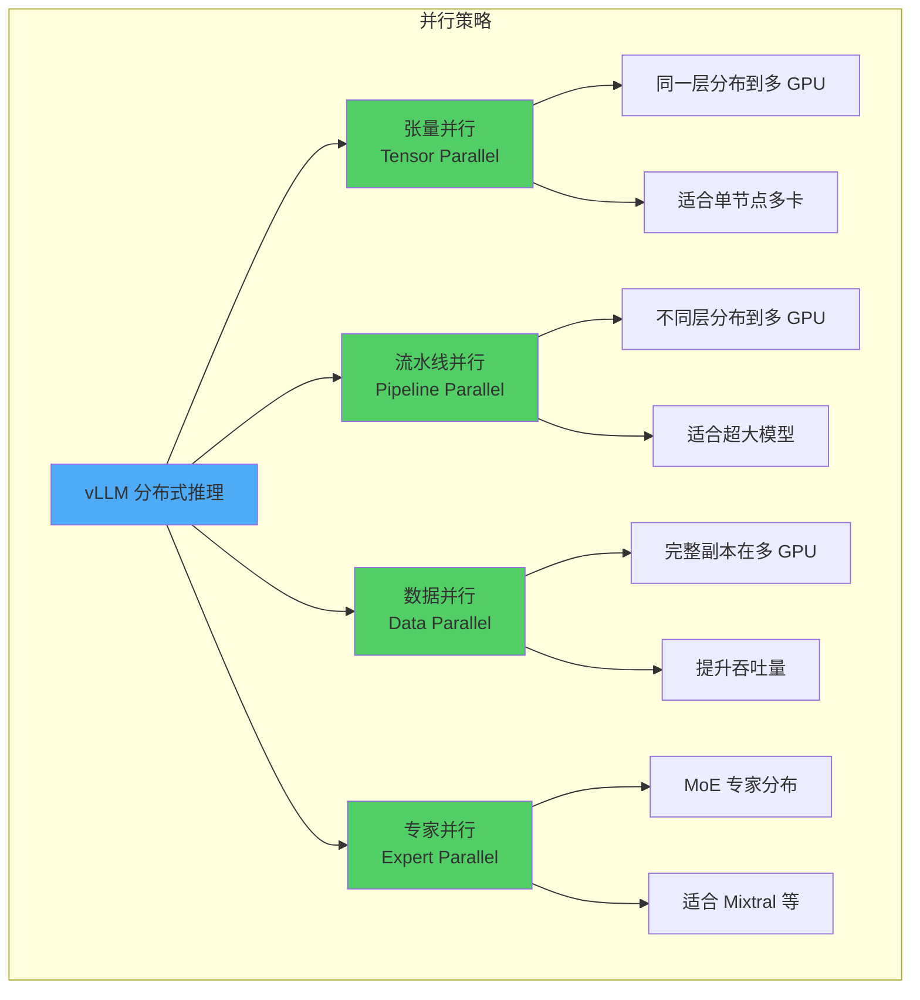

**张量并行示例**

```python
from vllm import LLM, SamplingParams

# 使用 4 个 GPU 进行张量并行
llm = LLM(
    model="meta-llama/Llama-2-70b-chat-hf",
    tensor_parallel_size=4,  # 4 路张量并行
    dtype="float16",
    max_model_len=4096
)

prompts = ["你的提示词"]
sampling_params = SamplingParams(temperature=0.7, max_tokens=256)
outputs = llm.generate(prompts, sampling_params)
```

**流水线并行示例**

```python
# 使用 8 个 GPU：2 路流水线 × 4 路张量并行
llm = LLM(
    model="meta-llama/Llama-2-70b-chat-hf",
    tensor_parallel_size=4,
    pipeline_parallel_size=2,  # 2 路流水线并行
    dtype="float16"
)
```

**API 服务器分布式部署**

```bash
# 启动分布式服务
python -m vllm.entrypoints.openai.api_server \
    --model meta-llama/Llama-2-70b-chat-hf \
    --tensor-parallel-size 4 \
    --pipeline-parallel-size 2 \
    --port 8000
```

### 2. 量化加速

vLLM 支持多种量化方法，减少显存占用并提升推理速度：

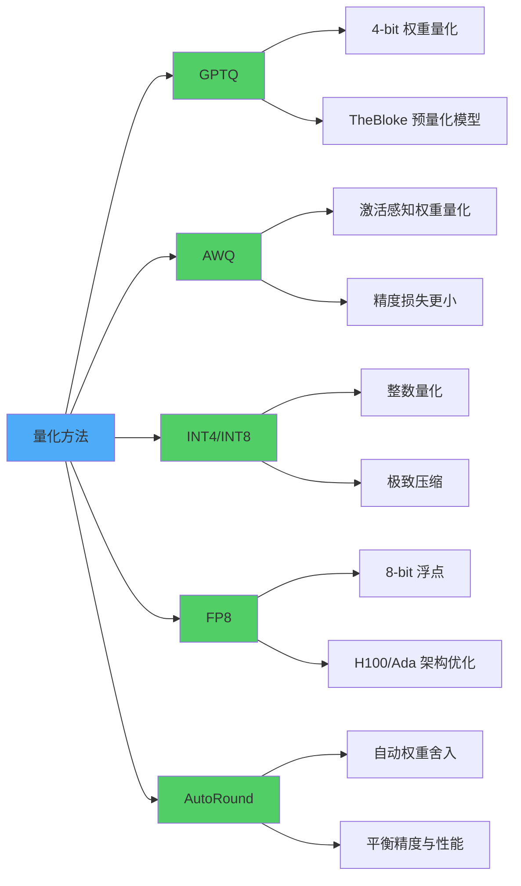

**GPTQ 量化示例**

```python
from vllm import LLM, SamplingParams

# 加载 GPTQ 量化模型
llm = LLM(
    model="TheBloke/Llama-2-70B-Chat-GPTQ",
    quantization="gptq",
    dtype="float16",
    gpu_memory_utilization=0.9
)

prompts = ["你的提示词"]
outputs = llm.generate(prompts, SamplingParams(temperature=0.7))
```

**AWQ 量化示例**

```python
# 加载 AWQ 量化模型
llm = LLM(
    model="TheBloke/Llama-2-70B-Chat-AWQ",
    quantization="awq",
    dtype="float16"
)
```

**FP8 量化示例**

```python
# 使用 FP8 量化（需要 H100 或 Ada 架构 GPU）
llm = LLM(
    model="meta-llama/Llama-2-70b-chat-hf",
    quantization="fp8",
    dtype="float16"
)
```

### 3. LoRA 适配器支持

vLLM 支持动态加载多个 LoRA 适配器，无需重启服务：

```python
from vllm import LLM, SamplingParams
from vllm.lora.request import LoRARequest

# 初始化基础模型
llm = LLM(
    model="meta-llama/Llama-2-7b-hf",
    enable_lora=True,
    max_lora_rank=64,
    max_loras=8  # 最多同时加载 8 个 LoRA
)

# 准备不同的 LoRA 适配器请求
lora_request_1 = LoRARequest(
    lora_name="chinese_adapter",
    lora_int_id=1,
    lora_local_path="/path/to/chinese_lora"
)

lora_request_2 = LoRARequest(
    lora_name="math_adapter",
    lora_int_id=2,
    lora_local_path="/path/to/math_lora"
)

# 使用不同的 LoRA 生成
outputs = llm.generate(
    ["你好，世界！"],
    SamplingParams(temperature=0.7),
    lora_request=lora_request_1
)
```

**LoRA API 服务器**

```bash
# 启动支持 LoRA 的服务器
python -m vllm.entrypoints.openai.api_server \
    --model meta-llama/Llama-2-7b-hf \
    --enable-lora \
    --lora-modules chinese=/path/to/chinese_lora \
                   math=/path/to/math_lora \
    --max-lora-rank 64
```

```python
# 客户端调用
from openai import OpenAI

client = OpenAI(base_url="http://localhost:8000/v1", api_key="EMPTY")

response = client.chat.completions.create(
    model="chinese",  # 使用 chinese LoRA
    messages=[{"role": "user", "content": "你好"}]
)
```

### 4. 前缀缓存

前缀缓存可以显著提升相同前缀请求的处理速度：

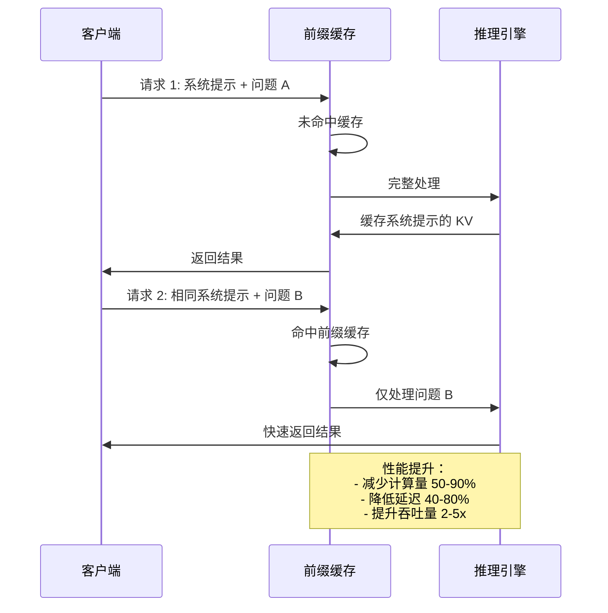

**启用前缀缓存**

```bash
# API 服务器启用前缀缓存
python -m vllm.entrypoints.openai.api_server \
    --model meta-llama/Llama-2-7b-chat-hf \
    --enable-prefix-caching \
    --port 8000
```

```python
# Python API 启用前缀缓存
llm = LLM(
    model="meta-llama/Llama-2-7b-chat-hf",
    enable_prefix_caching=True
)
```

### 5. 多模态模型支持

vLLM 支持视觉语言模型（VLM）：

```python
from vllm import LLM, SamplingParams

# 加载多模态模型（如 LLaVA）
llm = LLM(
    model="llava-hf/llava-1.5-7b-hf",
    trust_remote_code=True
)

# 准备图像和文本输入
prompts = [
    {
        "prompt": "USER: <image>\n这张图片里有什么？\nASSISTANT:",
        "multi_modal_data": {
            "image": "https://example.com/image.jpg"
        }
    }
]

outputs = llm.generate(prompts, SamplingParams(temperature=0.7, max_tokens=256))
for output in outputs:
    print(output.outputs[0].text)
```

### 6. 投机解码

投机解码（Speculative Decoding）通过小模型预测加速大模型生成：

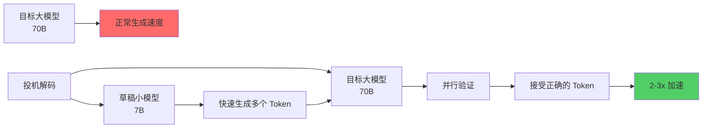

```python
# 使用投机解码
llm = LLM(
    model="meta-llama/Llama-2-70b-chat-hf",
    speculative_model="meta-llama/Llama-2-7b-chat-hf",  # 草稿模型
    num_speculative_tokens=5,  # 每次预测 5 个 token
    use_v2_block_manager=True
)
```

## 性能优化实践

### 参数调优指南

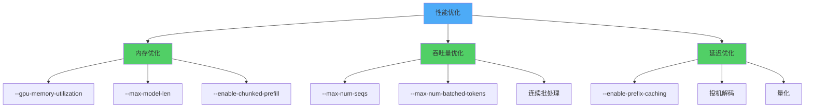

**关键参数说明**

```bash
python -m vllm.entrypoints.openai.api_server \
    --model meta-llama/Llama-2-70b-chat-hf \
    \
    # GPU 内存利用率（默认 0.9）
    --gpu-memory-utilization 0.95 \
    \
    # 最大模型长度（越小内存占用越少）
    --max-model-len 4096 \
    \
    # 最大并发序列数（影响吞吐量）
    --max-num-seqs 256 \
    \
    # 最大批次 token 数
    --max-num-batched-tokens 8192 \
    \
    # 启用前缀缓存
    --enable-prefix-caching \
    \
    # 启用分块预填充
    --enable-chunked-prefill \
    \
    # 张量并行
    --tensor-parallel-size 4 \
    \
    # 数据类型
    --dtype float16
```

### 性能基准测试

**吞吐量测试**

```python
import time
from vllm import LLM, SamplingParams

llm = LLM(model="meta-llama/Llama-2-7b-chat-hf")
sampling_params = SamplingParams(temperature=0.7, max_tokens=256)

# 准备大量请求
prompts = ["测试提示词 " + str(i) for i in range(1000)]

start_time = time.time()
outputs = llm.generate(prompts, sampling_params)
end_time = time.time()

total_tokens = sum(len(output.outputs[0].token_ids) for output in outputs)
throughput = total_tokens / (end_time - start_time)

print(f"吞吐量: {throughput:.2f} tokens/秒")
print(f"总耗时: {end_time - start_time:.2f} 秒")
```

**延迟测试**

```python
import time
from openai import OpenAI

client = OpenAI(base_url="http://localhost:8000/v1", api_key="EMPTY")

latencies = []
for i in range(100):
    start = time.time()
    response = client.chat.completions.create(
        model="meta-llama/Llama-2-7b-chat-hf",
        messages=[{"role": "user", "content": "你好"}],
        max_tokens=50
    )
    latency = time.time() - start
    latencies.append(latency)

print(f"平均延迟: {sum(latencies) / len(latencies):.3f} 秒")
print(f"P50 延迟: {sorted(latencies)[50]:.3f} 秒")
print(f"P99 延迟: {sorted(latencies)[99]:.3f} 秒")
```

### 监控与调试

**启用详细日志**

```bash
# 设置日志级别
export VLLM_LOGGING_LEVEL=DEBUG

# 启用性能分析
export VLLM_PROFILING_ENABLED=1

python -m vllm.entrypoints.openai.api_server \
    --model meta-llama/Llama-2-7b-chat-hf \
    --log-level debug
```

**监控指标**

```python
# 获取模型统计信息
from vllm import LLM

llm = LLM(model="meta-llama/Llama-2-7b-chat-hf")

# 查看 GPU 内存使用
import torch
print(f"GPU 内存已分配: {torch.cuda.memory_allocated() / 1024**3:.2f} GB")
print(f"GPU 内存缓存: {torch.cuda.memory_reserved() / 1024**3:.2f} GB")
```

## 实际应用场景

### 场景 1：聊天机器人服务

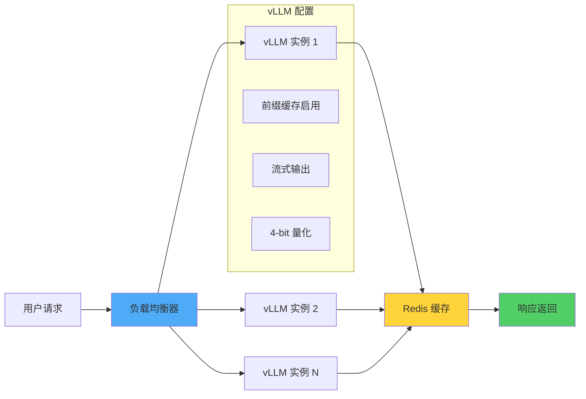

**部署配置**

```bash
# 启动聊天服务
python -m vllm.entrypoints.openai.api_server \
    --model meta-llama/Llama-2-13b-chat-hf \
    --host 0.0.0.0 \
    --port 8000 \
    --enable-prefix-caching \
    --quantization awq \
    --max-model-len 4096 \
    --max-num-seqs 128
```

### 场景 2：批量内容生成

```python
from vllm import LLM, SamplingParams
import json

# 加载模型
llm = LLM(
    model="meta-llama/Llama-2-70b-chat-hf",
    tensor_parallel_size=4,
    dtype="float16"
)

# 准备批量任务
with open("prompts.json", "r") as f:
    tasks = json.load(f)

# 批量生成
sampling_params = SamplingParams(
    temperature=0.8,
    top_p=0.95,
    max_tokens=512,
    stop=["</s>", "\n\n"]
)

outputs = llm.generate([task["prompt"] for task in tasks], sampling_params)

# 保存结果
results = []
for task, output in zip(tasks, outputs):
    results.append({
        "id": task["id"],
        "prompt": task["prompt"],
        "generated": output.outputs[0].text
    })

with open("results.json", "w") as f:
    json.dump(results, f, ensure_ascii=False, indent=2)
```

### 场景 3：多租户服务

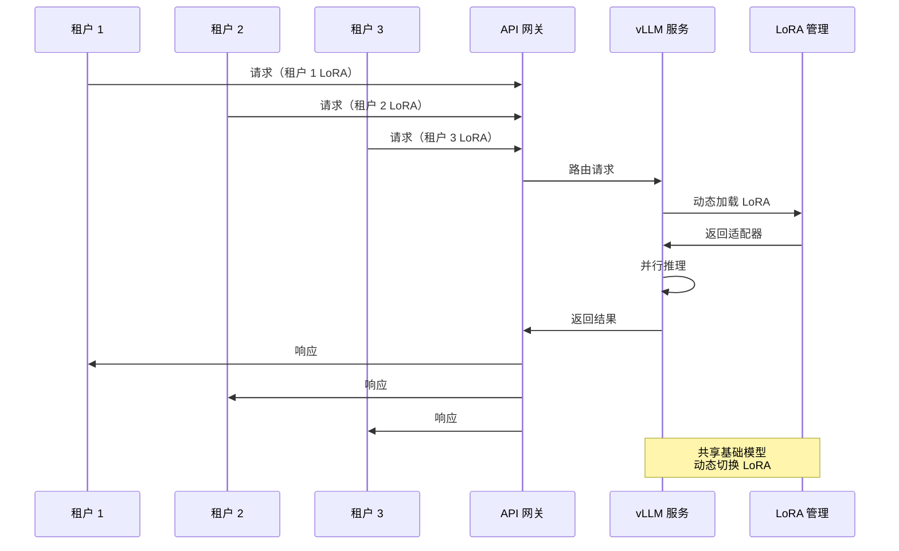

**多租户部署**

```bash
# 启动多 LoRA 服务
python -m vllm.entrypoints.openai.api_server \
    --model meta-llama/Llama-2-13b-hf \
    --enable-lora \
    --lora-modules \
        tenant1=/path/to/lora1 \
        tenant2=/path/to/lora2 \
        tenant3=/path/to/lora3 \
    --max-loras 10 \
    --max-lora-rank 64
```

### 场景 4：嵌入向量服务

```python
from vllm import LLM

# 加载嵌入模型
llm = LLM(
    model="intfloat/e5-mistral-7b-instruct",
    task="embed",  # 嵌入任务
    trust_remote_code=True
)

# 生成嵌入向量
texts = [
    "什么是机器学习？",
    "深度学习的应用领域",
    "自然语言处理技术"
]

outputs = llm.encode(texts)

# 输出嵌入向量
for text, output in zip(texts, outputs):
    embedding = output.outputs.embedding
    print(f"文本: {text}")
    print(f"向量维度: {len(embedding)}")
    print(f"向量: {embedding[:5]}...\n")
```

## 常见问题与解决方案

### Q1: 内存溢出（OOM）错误

**问题表现：**
```
torch.cuda.OutOfMemoryError: CUDA out of memory
```

**解决方案：**

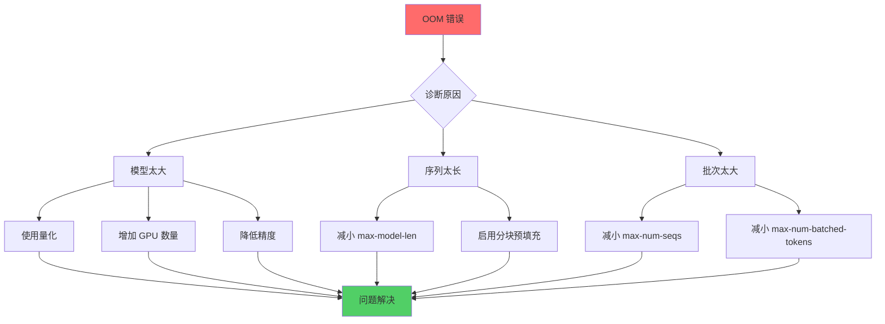

```bash
# 优化配置
python -m vllm.entrypoints.openai.api_server \
    --model meta-llama/Llama-2-70b-chat-hf \
    --quantization awq \  # 使用量化
    --gpu-memory-utilization 0.85 \  # 降低显存利用率
    --max-model-len 2048 \  # 减小最大长度
    --max-num-seqs 64 \  # 减小并发数
    --tensor-parallel-size 4  # 多卡分布
```

### Q2: 推理速度慢

**诊断工具：**

```python
# 启用性能分析
llm = LLM(
    model="meta-llama/Llama-2-7b-chat-hf",
    enforce_eager=False,  # 启用 CUDA 图优化
    enable_prefix_caching=True,
    enable_chunked_prefill=True
)
```

**优化检查清单：**

- ✅ 使用 `float16` 或 `bfloat16` 而非 `float32`
- ✅ 启用 CUDA 图（设置 `enforce_eager=False`）
- ✅ 启用前缀缓存（`enable_prefix_caching=True`）
- ✅ 使用适当的量化方法
- ✅ 调整 `max-num-batched-tokens`
- ✅ 考虑投机解码

### Q3: 模型加载失败

**常见错误：**

```python
# 错误：模型不支持
ValueError: Model architecture is not supported

# 解决：检查支持的模型列表
from vllm import ModelRegistry
print(ModelRegistry.get_supported_archs())
```

**模型配置问题：**

```python
# 使用 trust_remote_code
llm = LLM(
    model="your-custom-model",
    trust_remote_code=True,  # 允许执行自定义代码
    download_dir="/path/to/cache",  # 指定缓存目录
    tokenizer_mode="auto"  # 自动检测 tokenizer
)
```

### Q4: API 兼容性问题

**OpenAI SDK 版本冲突：**

```bash
# 安装兼容的 OpenAI SDK
pip install openai>=1.0.0
```

**自定义参数传递：**

```python
from openai import OpenAI

client = OpenAI(base_url="http://localhost:8000/v1", api_key="EMPTY")

# vLLM 特定参数
response = client.chat.completions.create(
    model="meta-llama/Llama-2-7b-chat-hf",
    messages=[{"role": "user", "content": "你好"}],
    temperature=0.7,
    max_tokens=256,
    extra_body={
        "repetition_penalty": 1.1,  # vLLM 扩展参数
        "top_k": 50,
        "min_p": 0.1
    }
)
```

### Q5: 分布式推理配置

**多 GPU 通信问题：**

```bash
# 检查 NCCL 环境
export NCCL_DEBUG=INFO
export NCCL_P2P_DISABLE=0

# Ray 配置（vLLM 使用 Ray 进行分布式）
export RAY_DEDUP_LOGS=0

python -m vllm.entrypoints.openai.api_server \
    --model meta-llama/Llama-2-70b-chat-hf \
    --tensor-parallel-size 4
```

## 与其他框架对比

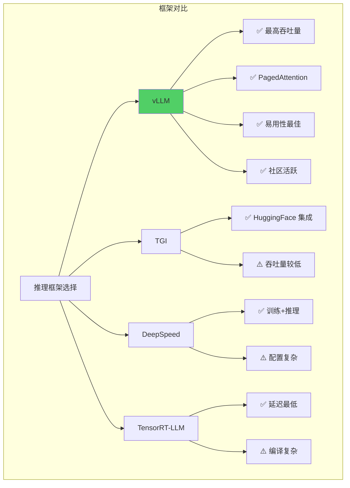

**性能对比（参考数据）：**

| 框架 | 吞吐量 | 延迟 | 易用性 | 内存效率 |
|------|--------|------|--------|----------|
| **vLLM** | ⭐⭐⭐⭐⭐ | ⭐⭐⭐⭐ | ⭐⭐⭐⭐⭐ | ⭐⭐⭐⭐⭐ |
| TGI | ⭐⭐⭐ | ⭐⭐⭐⭐ | ⭐⭐⭐⭐ | ⭐⭐⭐ |
| DeepSpeed | ⭐⭐⭐⭐ | ⭐⭐⭐ | ⭐⭐⭐ | ⭐⭐⭐⭐ |
| TensorRT-LLM | ⭐⭐⭐⭐ | ⭐⭐⭐⭐⭐ | ⭐⭐ | ⭐⭐⭐⭐ |

## 最佳实践总结

### 生产环境部署建议

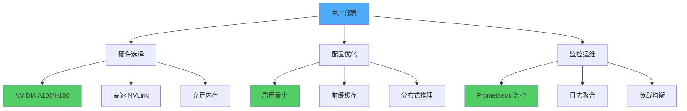

**推荐配置模板：**

```bash
# 生产环境启动脚本
#!/bin/bash

export CUDA_VISIBLE_DEVICES=0,1,2,3
export VLLM_LOGGING_LEVEL=INFO

python -m vllm.entrypoints.openai.api_server \
    --model meta-llama/Llama-2-70b-chat-hf \
    --host 0.0.0.0 \
    --port 8000 \
    --tensor-parallel-size 4 \
    --dtype float16 \
    --quantization awq \
    --max-model-len 4096 \
    --max-num-seqs 256 \
    --max-num-batched-tokens 8192 \
    --gpu-memory-utilization 0.90 \
    --enable-prefix-caching \
    --enable-chunked-prefill \
    --disable-log-requests \
    --served-model-name llama2-70b \
    2>&1 | tee -a vllm.log
```

### 性能调优清单

**内存优化：**
- [ ] 使用量化（AWQ/GPTQ）减少显存占用
- [ ] 调整 `--gpu-memory-utilization`（建议 0.85-0.95）
- [ ] 限制 `--max-model-len` 到实际需要的长度
- [ ] 启用 `--enable-chunked-prefill`

**吞吐量优化：**
- [ ] 增加 `--max-num-seqs`（根据显存调整）
- [ ] 调整 `--max-num-batched-tokens`
- [ ] 使用多 GPU 张量并行
- [ ] 启用连续批处理（默认开启）

**延迟优化：**
- [ ] 启用 `--enable-prefix-caching`
- [ ] 使用投机解码
- [ ] 减小 `--max-num-seqs`（牺牲吞吐量）
- [ ] 使用 CUDA 图（默认开启）

**稳定性优化：**
- [ ] 设置合理的超时时间
- [ ] 配置健康检查端点
- [ ] 启用请求限流
- [ ] 部署多实例负载均衡

## 资源链接

### 官方资源

- 📚 **官方文档**: [https://docs.vllm.ai](https://docs.vllm.ai)
- 💻 **GitHub 仓库**: [https://github.com/vllm-project/vllm](https://github.com/vllm-project/vllm)
- 🌐 **官方网站**: [https://vllm.ai](https://vllm.ai)
- 📝 **论文**: [Efficient Memory Management for Large Language Model Serving with PagedAttention](https://arxiv.org/abs/2309.06180)

### 社区资源

- 💬 **用户论坛**: [vLLM Forum](https://github.com/vllm-project/vllm/discussions)
- 🎯 **开发者 Slack**: [加入频道](https://join.slack.com/t/vllm-workspace)
- 🐛 **问题反馈**: [GitHub Issues](https://github.com/vllm-project/vllm/issues)
- 🔐 **安全报告**: [Security Advisories](https://github.com/vllm-project/vllm/security/advisories)

### 学习资源

- 📖 **DeepWiki**: [https://deepwiki.com/vllm-project/vllm](https://deepwiki.com/vllm-project/vllm)
- 🎬 **视频教程**: [vLLM Events](https://vllm.ai/events)
- 📰 **官方博客**: [vLLM Blog](https://blog.vllm.ai)
- 📦 **模型列表**: [支持的模型](https://docs.vllm.ai/en/latest/models/supported_models.html)

### 相关工具

- 🤗 **Hugging Face**: 模型下载与管理
- ⚡ **Ray**: 分布式计算框架
- 🔥 **FlashAttention**: 高效注意力机制
- 📊 **Prometheus**: 性能监控

## 总结

vLLM 通过创新的 PagedAttention 技术和连续批处理机制，为 LLM 推理服务树立了新的性能标杆。无论是小规模原型开发还是大规模生产部署，vLLM 都提供了简单易用且高效的解决方案。

**核心优势回顾：**

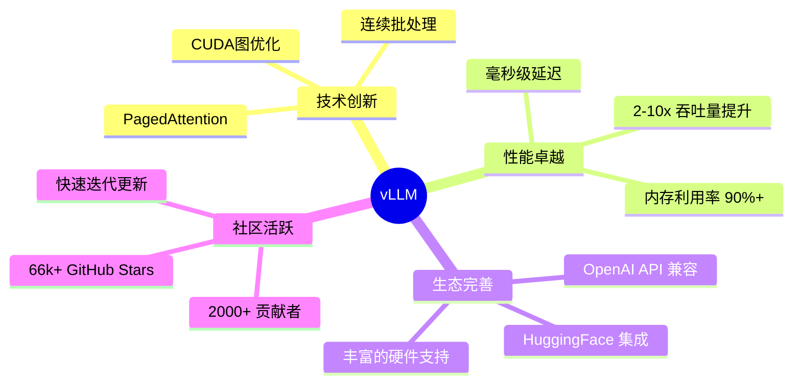

**选择 vLLM 的理由：**

1. 🚀 **性能领先**：业界最高的推理吞吐量
2. 💰 **成本优化**：更高的硬件利用率降低部署成本
3. 🔧 **易于使用**：简洁的 API 和完善的文档
4. 🌍 **广泛支持**：支持主流模型和硬件平台
5. 🔄 **持续创新**：活跃的社区和快速的功能迭代

开始使用 vLLM，让你的 LLM 应用运行得更快、更省、更强大！

---

**相关阅读：**
- [LangChain4j 完整指南]()
- [DeepLearning4j 完整指南]()
- [Apache OpenNLP 完整指南]()

