## 项目简介

**Agent Skills** 是一个开放的 AI 智能体技能生态系统，为 AI 编程助手提供可复用的能力模块。通过一行命令即可为你的智能体安装专业技能，从 React 最佳实践到网页设计指南，从 SEO 审计到测试驱动开发。

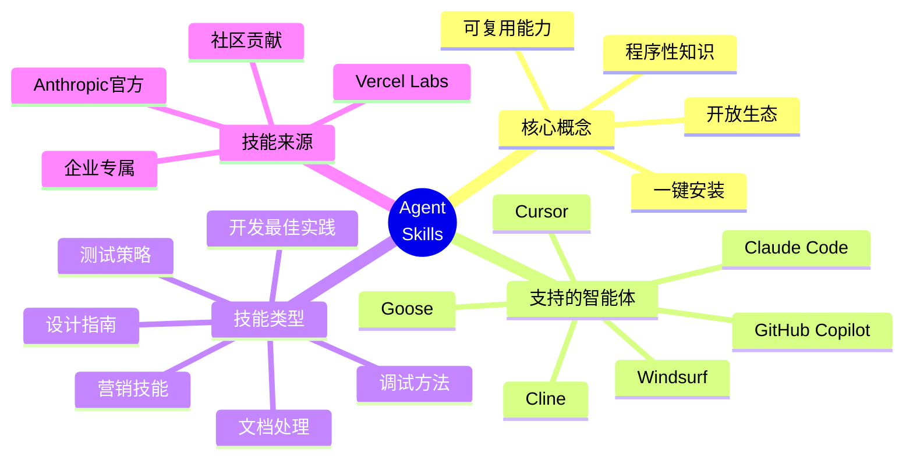

### 核心价值

- **🚀 一键安装**：使用 `npx skills add <owner/repo>` 即可安装任何技能
- **🌐 开放生态**：超过 200 个社区贡献的技能，累计安装超过 32 万次
- **🤖 广泛支持**：支持 Claude Code、Cursor、Cline、Windsurf 等主流 AI 编程助手
- **📚 知识传承**：将专业知识转化为可复用的程序性能力
- **🔄 持续更新**：社区持续贡献新技能，生态不断壮大

## Agent Skills 原理详解

### 1. 技能的本质

Agent Skills 的核心思想是将**程序性知识**（Procedural Knowledge）封装成可复用的能力模块。与传统的声明性知识不同，程序性知识关注"如何做"而非"是什么"。

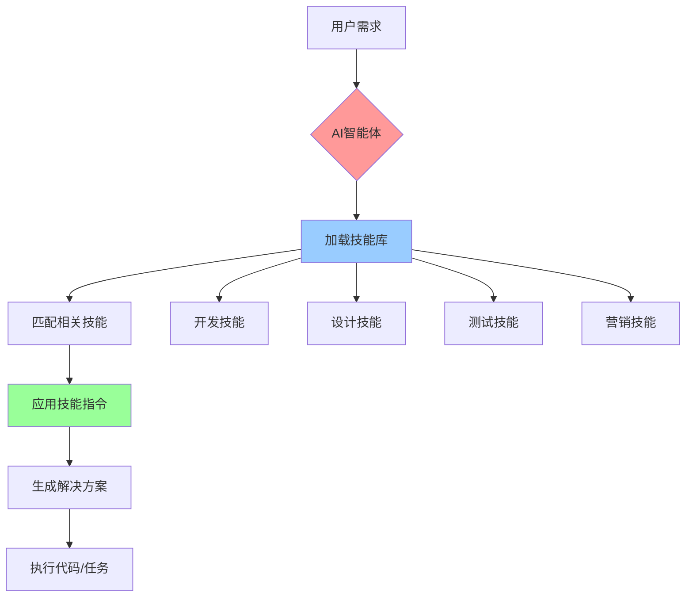

### 2. 技能的结构

每个 Agent Skill 都是一个标准的 Markdown 文件，包含 Frontmatter 元数据和技能内容：

```markdown
---
name: skill-name
description: 完整描述技能的功能和使用场景
---

## Instructions
具体的指令说明

## Examples
使用示例

## Guidelines
指导原则
```

#### 2.1 Frontmatter 必需字段

- **name**: 技能的唯一标识符（小写，使用连字符分隔单词）
- **description**: 完整描述技能的功能、适用场景和价值

#### 2.2 技能内容组成

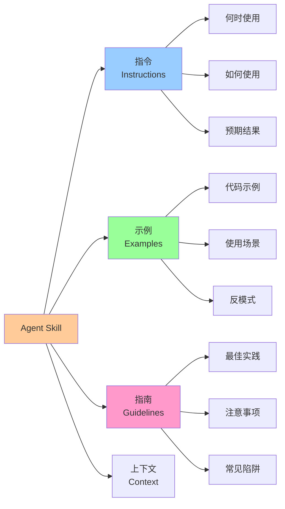

### 3. 技能的工作机制

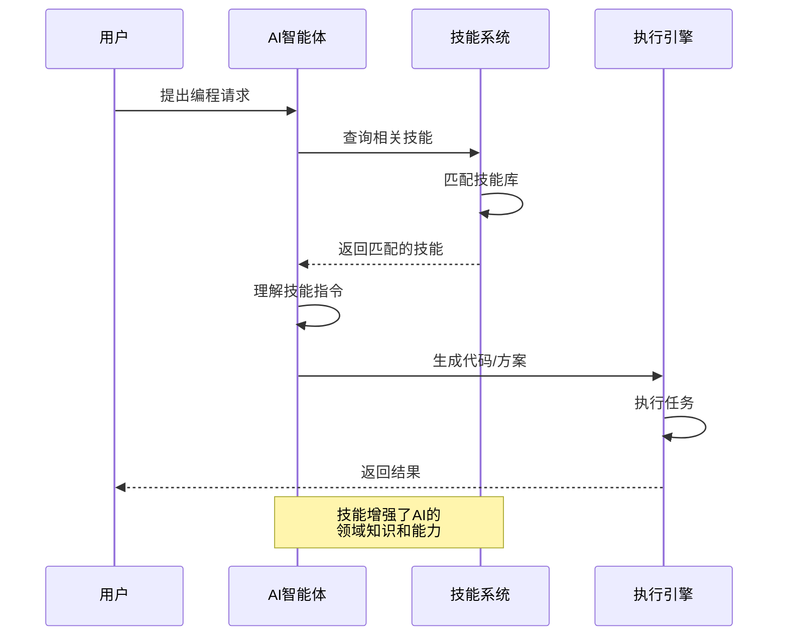

### 4. 安装与使用流程

#### 4.1 安装技能

```bash
# 安装单个技能
npx skills add vercel-labs/agent-skills/vercel-react-best-practices

# 安装整个技能集合
npx skills add anthropics/skills

# 查找技能
npx skills add vercel-labs/skills/find-skills
```

#### 4.2 技能生命周期

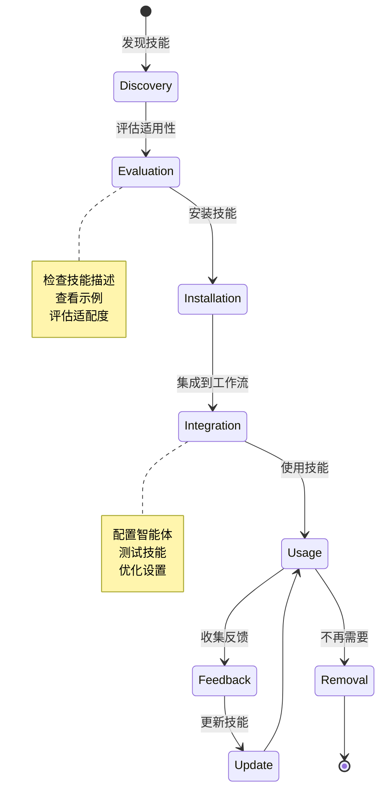

### 5. 技能的优势

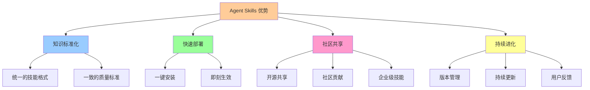

## Top 10 热门技能详解

基于 Skills.sh 排行榜（截至 2026 年 1 月，总安装量超过 32 万次），以下是最受欢迎的 10 个技能及其使用指南：

### 1. Vercel React 最佳实践 (65.6K 安装)

**技能标识**: `vercel-labs/agent-skills/vercel-react-best-practices`

#### 技能概述

这是使用最广泛的技能，由 Vercel Labs 维护，提供 React 开发的最佳实践和设计模式。

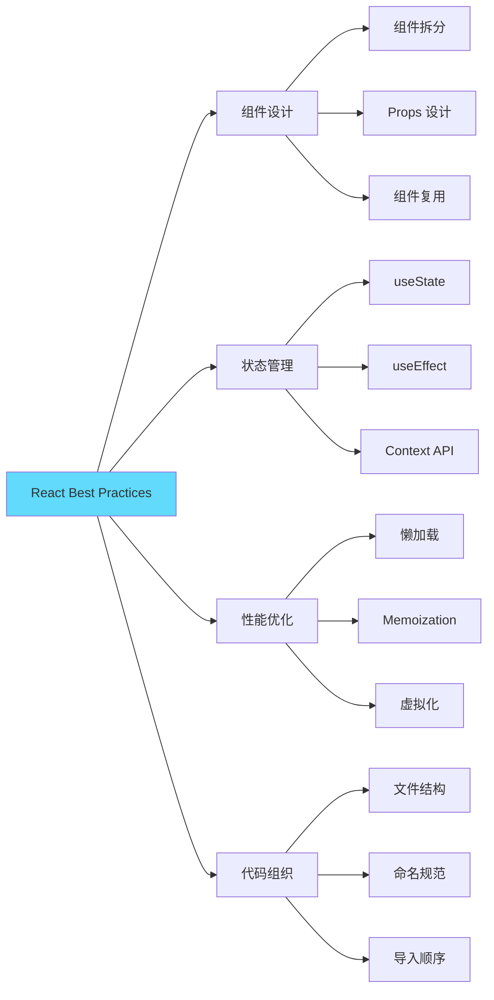

#### 安装方式

```bash
npx skills add vercel-labs/agent-skills/vercel-react-best-practices
```

#### 适用场景

- ✅ 构建新的 React 应用
- ✅ 重构现有 React 代码
- ✅ 代码审查和优化
- ✅ 团队代码规范统一

#### 核心指导

**组件设计原则**：
- 保持组件小而专注（单一职责原则）
- 优先使用函数组件和 Hooks
- Props 应该明确且类型安全
- 避免 Props Drilling，合理使用 Context

**状态管理**：
- 将状态提升到需要的最近公共祖先
- 使用 useReducer 管理复杂状态
- 考虑使用 Zustand 或 Jotai 替代 Context

**性能优化**：
- 使用 React.memo 避免不必要的重渲染
- 使用 useMemo 和 useCallback 缓存计算和函数
- 使用 lazy 和 Suspense 进行代码分割

#### 实践示例

```typescript
// ✅ 好的实践：小而专注的组件
interface UserCardProps {
  user: User;
  onEdit: (id: string) => void;
}

export const UserCard: React.FC<UserCardProps> = ({ user, onEdit }) => {
  const handleClick = useCallback(() => {
    onEdit(user.id);
  }, [user.id, onEdit]);

  return (
    <Card onClick={handleClick}>
      <Avatar src={user.avatar} />
      <Name>{user.name}</Name>
      <Email>{user.email}</Email>
    </Card>
  );
};

// ❌ 避免：组件过大，职责不清
export const UserManagement = () => {
  // 500 行代码混合了数据获取、状态管理、UI渲染...
};
```

### 2. Web 设计指南 (49.7K 安装)

**技能标识**: `vercel-labs/agent-skills/web-design-guidelines`

#### 技能概述

提供现代 Web 设计的全面指南，涵盖 UI/UX 设计原则、响应式设计、可访问性等。

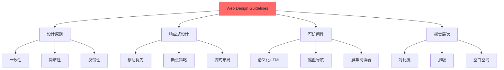

#### 安装方式

```bash
npx skills add vercel-labs/agent-skills/web-design-guidelines
```

#### 适用场景

- ✅ 设计新的 Web 应用界面
- ✅ 改进现有网站的用户体验
- ✅ 确保设计的可访问性
- ✅ 创建设计系统

#### 核心指导

**设计原则**：
- **一致性**：保持整个应用的视觉和交互一致
- **简洁性**：去除不必要的元素，专注核心功能
- **反馈性**：及时反馈用户操作的结果
- **容错性**：允许用户犯错并提供纠正机制

**响应式设计**：
- 采用移动优先策略
- 使用灵活的网格系统
- 断点：320px (mobile), 768px (tablet), 1024px (desktop), 1440px (wide)
- 使用相对单位（rem, em, %）而非绝对像素

**可访问性 (WCAG 2.1)**：
- 文本对比度至少 4.5:1
- 所有交互元素可通过键盘访问
- 使用语义化 HTML 标签
- 为图片提供 alt 文本

#### 实践示例

```css
/* ✅ 好的实践：响应式设计 */
.container {
  width: 100%;
  max-width: 1200px;
  margin: 0 auto;
  padding: 1rem;
}

@media (min-width: 768px) {
  .container {
    padding: 2rem;
  }
}

@media (min-width: 1024px) {
  .container {
    padding: 3rem;
  }
}

/* ✅ 好的实践：可访问的按钮 */
.button {
  min-height: 44px; /* 触摸目标至少 44x44px */
  padding: 0.75rem 1.5rem;
  font-size: 1rem;
  background: #0070f3;
  color: white;
  border: none;
  border-radius: 0.5rem;
  cursor: pointer;
  transition: background 0.2s;
}

.button:hover {
  background: #0051cc;
}

.button:focus-visible {
  outline: 2px solid #0070f3;
  outline-offset: 2px;
}
```

### 3. Remotion 最佳实践 (46.9K 安装)

**技能标识**: `remotion-dev/skills/remotion-best-practices`

#### 技能概述

Remotion 是用 React 创建视频的框架，该技能提供视频生成、动画和渲染的最佳实践。

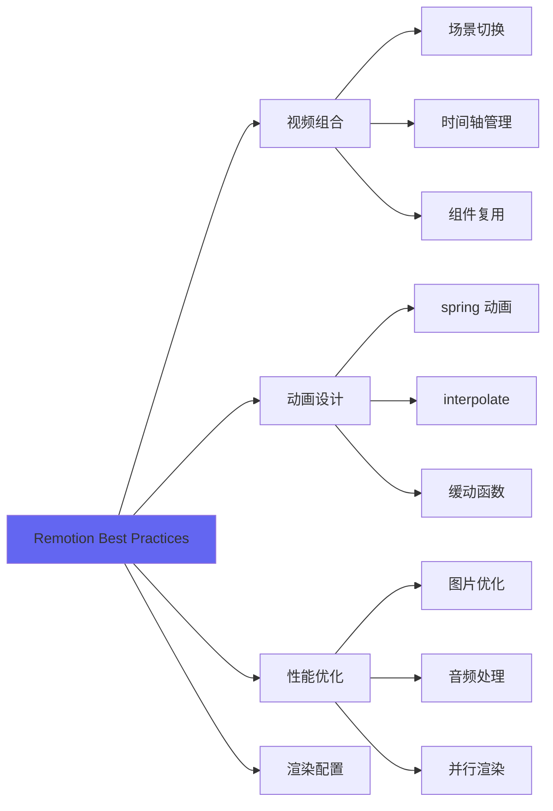

#### 安装方式

```bash
npx skills add remotion-dev/skills/remotion-best-practices
```

#### 适用场景

- ✅ 创建程序化视频
- ✅ 生成社交媒体内容
- ✅ 自动化视频制作
- ✅ 数据可视化视频

#### 核心指导

**组合设计**：
- 使用 `<Composition>` 定义视频模板
- 通过 Props 实现视频参数化
- 合理设置 FPS（通常 30fps）

**动画实现**：
- 使用 `spring()` 创建自然动画
- 使用 `interpolate()` 实现值映射
- 善用 `useCurrentFrame()` 获取当前帧

**性能优化**：
- 预加载图片和资源
- 使用 `@remotion/gif` 优化 GIF
- 启用并行渲染提升速度

#### 实践示例

```typescript
import { spring, useCurrentFrame, useVideoConfig } from 'remotion';

export const AnimatedTitle: React.FC<{ title: string }> = ({ title }) => {
  const frame = useCurrentFrame();
  const { fps } = useVideoConfig();

  // 使用 spring 创建自然动画
  const scale = spring({
    frame,
    fps,
    from: 0,
    to: 1,
    config: {
      damping: 200,
    },
  });

  // 使用 interpolate 实现渐入效果
  const opacity = interpolate(frame, [0, 20], [0, 1], {
    extrapolateRight: 'clamp',
  });

  return (
    <div
      style={{
        transform: `scale(${scale})`,
        opacity,
        fontSize: '4rem',
        fontWeight: 'bold',
      }}
    >
      {title}
    </div>
  );
};
```

### 4. Find Skills (38.1K 安装)

**技能标识**: `vercel-labs/skills/find-skills`

#### 技能概述

这是一个元技能，帮助 AI 智能体发现和推荐适合当前任务的技能。

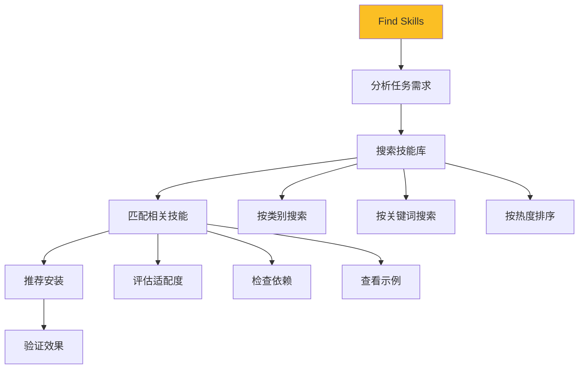

#### 安装方式

```bash
npx skills add vercel-labs/skills/find-skills
```

#### 适用场景

- ✅ 探索可用技能
- ✅ 为新项目选择技能
- ✅ 优化现有工作流
- ✅ 发现社区新技能

#### 核心功能

- 根据任务描述推荐技能
- 显示技能的安装量和热度
- 提供技能的详细说明
- 支持按类别筛选

### 5. Frontend Design (23.2K 安装)

**技能标识**: `anthropics/skills/frontend-design`

#### 技能概述

Anthropic 官方提供的前端设计技能，涵盖现代前端开发的设计模式和架构。

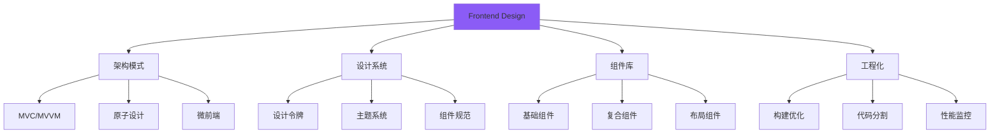

#### 安装方式

```bash
npx skills add anthropics/skills/frontend-design
```

#### 适用场景

- ✅ 设计前端架构
- ✅ 构建设计系统
- ✅ 组件库开发
- ✅ 大型应用架构

#### 核心指导

**架构模式**：
- **原子设计**：Atoms → Molecules → Organisms → Templates → Pages
- **特性切片**：按业务特性而非技术层面组织代码
- **关注点分离**：UI、逻辑、状态、数据分离

**设计系统**：
- 使用设计令牌（Design Tokens）管理样式变量
- 建立一致的组件 API
- 提供详细的组件文档和示例

**工程化**：
- 使用 Monorepo 管理多包项目
- 自动化测试和 CI/CD
- 性能预算和监控

#### 实践示例

```typescript
// ✅ 原子设计示例

// Atoms（原子）
export const Button: React.FC<ButtonProps> = ({ children, ...props }) => (
  <button className="btn" {...props}>
    {children}
  </button>
);

// Molecules（分子）
export const SearchInput: React.FC = () => (
  <div className="search-input">
    <Input placeholder="搜索..." />
    <Button>搜索</Button>
  </div>
);

// Organisms（有机体）
export const Header: React.FC = () => (
  <header className="header">
    <Logo />
    <SearchInput />
    <UserMenu />
  </header>
);

// Templates（模板）
export const DashboardTemplate: React.FC<{ children }> = ({ children }) => (
  <div className="dashboard">
    <Sidebar />
    <main>{children}</main>
  </div>
);
```

### 6. Agent Browser (13.1K 安装)

**技能标识**: `vercel-labs/agent-browser`

#### 技能概述

赋予 AI 智能体浏览器操作能力，可以自动化网页交互、数据抓取和测试。

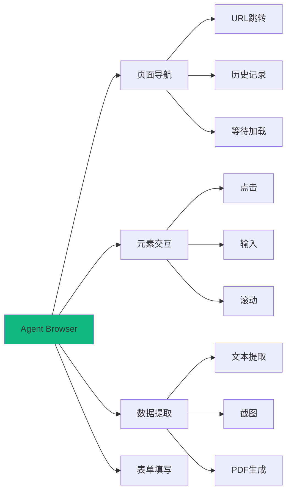

#### 安装方式

```bash
npx skills add vercel-labs/agent-browser
```

#### 适用场景

- ✅ Web 自动化测试
- ✅ 数据爬取和分析
- ✅ 表单自动填写
- ✅ UI 测试和验证

#### 核心功能

- 导航到指定 URL
- 查找和交互页面元素
- 提取文本和数据
- 截图和生成 PDF
- 等待元素加载完成

### 7. Skill Creator (11.3K 安装)

**技能标识**: `anthropics/skills/skill-creator`

#### 技能概述

帮助用户创建自定义技能的元技能，提供技能开发的模板和指导。

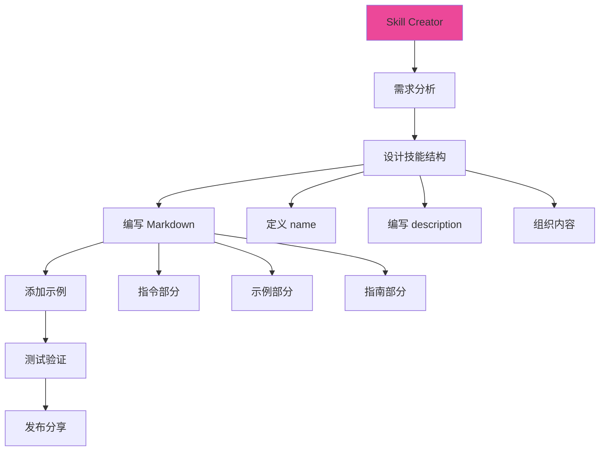

#### 安装方式

```bash
npx skills add anthropics/skills/skill-creator
```

#### 适用场景

- ✅ 创建团队专属技能
- ✅ 分享最佳实践
- ✅ 标准化工作流程
- ✅ 贡献社区技能

#### 创建技能的步骤

1. **确定技能范围**：明确技能要解决的问题
2. **编写元数据**：定义 name 和 description
3. **编写指令**：详细说明如何使用技能
4. **提供示例**：给出具体的使用场景
5. **添加指南**：列出注意事项和最佳实践
6. **测试验证**：在实际项目中测试技能效果

#### 技能模板

```markdown
---
name: my-custom-skill
description: 这个技能帮助开发者实现特定功能，适用于XX场景，提供YY价值
---

## Instructions

### 何时使用此技能
- 场景 1
- 场景 2

### 如何使用此技能
1. 步骤 1
2. 步骤 2

## Examples

### 示例 1：基础用法
\```typescript
// 代码示例
\```

### 示例 2：高级用法
\```typescript
// 代码示例
\```

## Guidelines

- ✅ 推荐做法
- ❌ 避免做法
- ⚠️ 注意事项
```

### 8. Vercel 组合模式 (7.3K 安装)

**技能标识**: `vercel-labs/agent-skills/vercel-composition-patterns`

#### 技能概述

Vercel 推荐的 React 组件组合模式，强调灵活性和复用性。

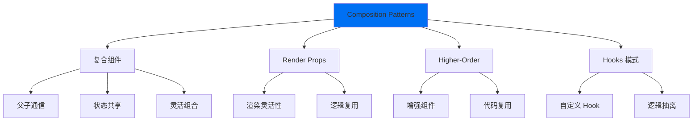

#### 安装方式

```bash
npx skills add vercel-labs/agent-skills/vercel-composition-patterns
```

#### 核心模式

**复合组件模式**：
```typescript
// 父组件管理状态，子组件灵活组合
<Select value={value} onChange={setValue}>
  <Select.Trigger>
    <Select.Value />
  </Select.Trigger>
  <Select.Content>
    <Select.Item value="1">选项 1</Select.Item>
    <Select.Item value="2">选项 2</Select.Item>
  </Select.Content>
</Select>
```

**自定义 Hook 模式**：
```typescript
// 抽离逻辑，提高复用性
function useToggle(initialValue = false) {
  const [value, setValue] = useState(initialValue);
  const toggle = useCallback(() => setValue(v => !v), []);
  return [value, toggle] as const;
}
```

### 9. Supabase Postgres 最佳实践 (6.7K 安装)

**技能标识**: `supabase/agent-skills/supabase-postgres-best-practices`

#### 技能概述

Supabase 官方提供的 PostgreSQL 数据库设计和优化最佳实践。

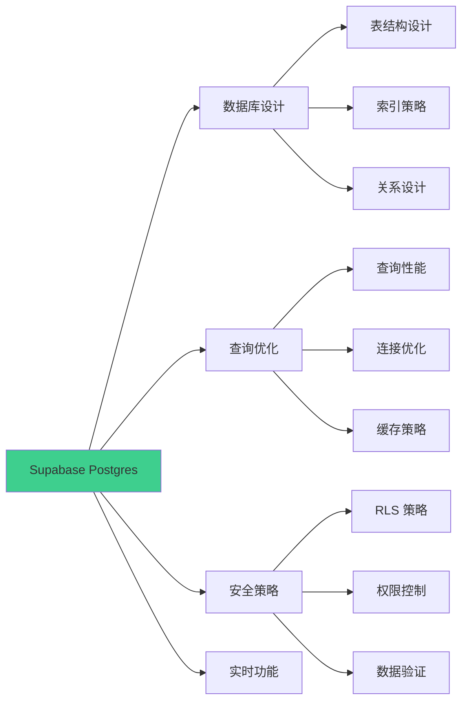

#### 安装方式

```bash
npx skills add supabase/agent-skills/supabase-postgres-best-practices
```

#### 核心指导

**数据库设计**：
- 使用 UUID 作为主键
- 为所有表添加 `created_at` 和 `updated_at`
- 使用适当的数据类型（jsonb, array, enum）
- 建立适当的外键约束

**Row Level Security (RLS)**：
```sql
-- 启用 RLS
ALTER TABLE posts ENABLE ROW LEVEL SECURITY;

-- 用户只能查看自己的帖子
CREATE POLICY "Users can view own posts"
ON posts FOR SELECT
USING (auth.uid() = user_id);

-- 用户只能更新自己的帖子
CREATE POLICY "Users can update own posts"
ON posts FOR UPDATE
USING (auth.uid() = user_id);
```

### 10. UI/UX Pro Max (6.0K 安装)

**技能标识**: `nextlevelbuilder/ui-ux-pro-max-skill`

#### 技能概述

高级 UI/UX 设计技能，涵盖现代设计趋势和用户体验优化。

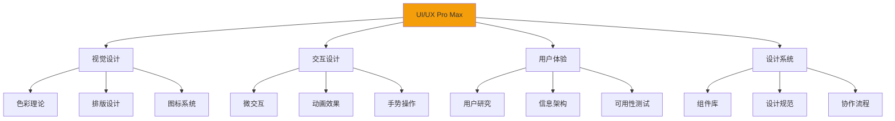

#### 安装方式

```bash
npx skills add nextlevelbuilder/ui-ux-pro-max-skill
```

#### 核心原则

**视觉层次**：
- 使用大小、颜色、对比度建立层次
- 重要信息应该最显眼
- 保持视觉平衡

**交互反馈**：
- 所有操作都应有即时反馈
- 使用微动画提升体验
- 加载状态要清晰

**一致性**：
- 统一的视觉语言
- 一致的交互模式
- 可预测的行为

## 技能生态系统

### 支持的 AI 智能体

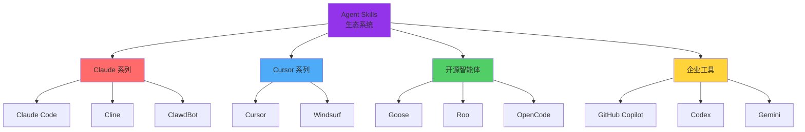

### 技能分类

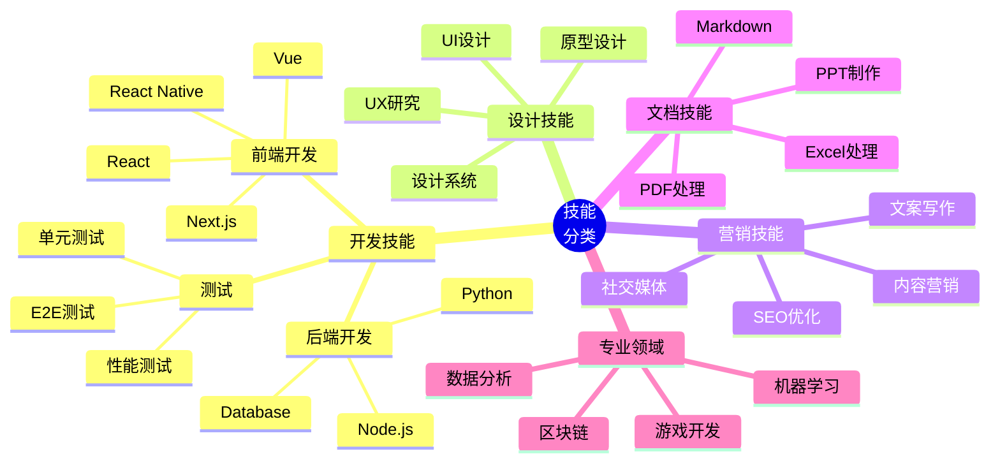

### 热门技能来源

1. **Anthropic 官方** (`anthropics/skills`)
   - frontend-design (23.2K)
   - skill-creator (11.3K)
   - pdf, pptx, xlsx 处理系列

2. **Vercel Labs** (`vercel-labs/agent-skills`)
   - vercel-react-best-practices (65.6K)
   - web-design-guidelines (49.7K)
   - vercel-composition-patterns (7.3K)

3. **社区贡献者**
   - remotion-dev: Remotion 视频生成
   - supabase: 数据库最佳实践
   - coreyhaines31: 营销技能系列
   - expo: React Native 开发

## 技能的高级用法

### 1. 组合多个技能

```bash
# 为 React 项目安装完整技能集
npx skills add vercel-labs/agent-skills/vercel-react-best-practices
npx skills add vercel-labs/agent-skills/web-design-guidelines
npx skills add anthropics/skills/frontend-design
npx skills add anthropics/skills/webapp-testing
```

### 2. 创建项目特定技能

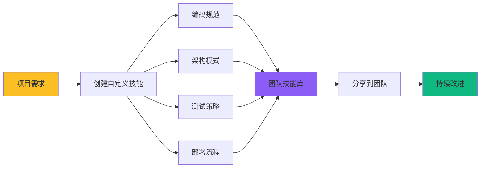

### 3. 技能版本管理

```bash
# 安装特定版本的技能
npx skills add vercel-labs/agent-skills/vercel-react-best-practices@v2.0.0

# 更新技能到最新版本
npx skills update vercel-labs/agent-skills/vercel-react-best-practices

# 查看已安装的技能
npx skills list
```

### 4. 技能的优先级和冲突处理

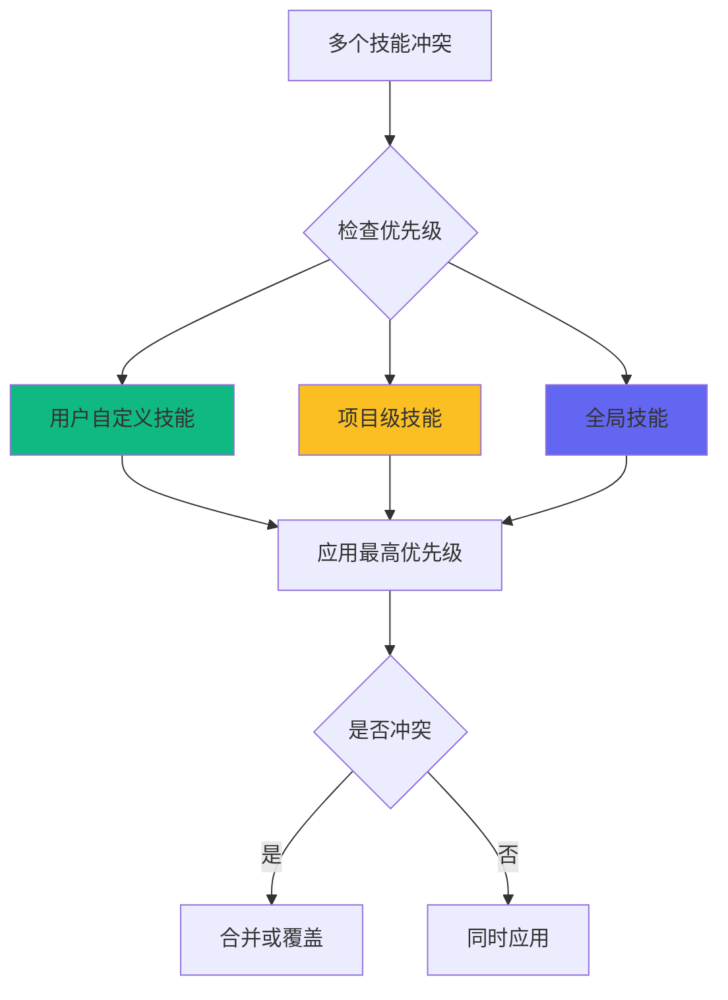

## 最佳实践

### 1. 选择合适的技能

```mermaid
flowchart TD
    A[开始新任务] --> B{是否有现成技能?}
    B -->|是| C[评估技能质量]
    B -->|否| D[是否需要创建?]
    
    C --> E{安装量和评分}
    E -->|高| F[直接使用]
    E -->|低| G[查看替代品]
    
    D -->|是| H[创建自定义技能]
    D -->|否| I[手动实现]
    
    F --> J[测试效果]
    G --> J
    H --> J
    
    J --> K{效果满意?}
    K -->|是| L[保留技能]
    K -->|否| M[调整或移除]
    
    style F fill:#10b981
    style H fill:#fbbf24
    style L fill:#8b5cf6
```

### 2. 技能管理策略

**保持技能库精简**：
- 只安装当前项目需要的技能
- 定期清理不再使用的技能
- 避免功能重叠的技能

**组织技能**：
- 按项目类型分组
- 为团队创建共享技能集
- 文档化技能的使用场景

**更新策略**：
- 关注技能的更新日志
- 测试新版本再推广到团队
- 保留稳定版本作为后备

### 3. 贡献社区技能

```mermaid
sequenceDiagram
    participant D as 开发者
    participant R as GitHub Repo
    participant S as Skills.sh
    participant C as 社区
    
    D->>D: 创建技能
    D->>D: 本地测试
    D->>R: 推送到 GitHub
    R->>S: 自动索引
    S->>C: 发布到排行榜
    C->>D: 反馈和建议
    D->>R: 迭代改进
    
    Note over D,C: 开放的贡献循环
```

### 4. 与 MCP 集成

Agent Skills 可以与 Model Context Protocol (MCP) 无缝集成：

```typescript
// 在 MCP 服务器中使用技能
import { loadSkill } from '@agent-skills/core';

const reactSkill = await loadSkill('vercel-labs/agent-skills/vercel-react-best-practices');

// 技能指令会自动注入到 Claude 的上下文中
```

## 实战案例

### 案例 1：构建 React 应用

```bash
# 安装必要技能
npx skills add vercel-labs/agent-skills/vercel-react-best-practices
npx skills add vercel-labs/agent-skills/web-design-guidelines
npx skills add anthropics/skills/frontend-design
npx skills add vercel-labs/next-skills/next-best-practices

# 现在 AI 助手将遵循这些技能的指导来生成代码
```

**效果**：
- ✅ 生成的组件符合最佳实践
- ✅ 代码结构清晰且可维护
- ✅ 自动应用性能优化
- ✅ 遵循设计规范

### 案例 2：SEO 审计和优化

```bash
# 安装 SEO 相关技能
npx skills add coreyhaines31/marketingskills/seo-audit
npx skills add coreyhaines31/marketingskills/schema-markup
npx skills add coreyhaines31/marketingskills/programmatic-seo
```

**AI 可以帮助**：
- 分析网站的 SEO 问题
- 生成优化建议
- 添加 Schema Markup
- 创建 SEO 友好的内容

### 案例 3：测试驱动开发

```bash
# 安装测试相关技能
npx skills add anthropics/skills/webapp-testing
npx skills add obra/superpowers/test-driven-development
npx skills add softaworks/agent-toolkit/qa-test-planner
```

**AI 将**：
- 先编写测试用例
- 实现功能代码
- 确保测试通过
- 提供测试覆盖率报告

### 案例 4：创建设计系统

```bash
# 安装设计系统相关技能
npx skills add anthropics/skills/frontend-design
npx skills add anthropics/skills/theme-factory
npx skills add wshobson/agents/design-system-patterns
npx skills add giuseppe-trisciuoglio/developer-kit/shadcn-ui
```

**构建完整设计系统**：
- 设计令牌和变量
- 基础组件库
- 组合模式
- 主题切换系统

## 未来展望

### 技能生态的发展趋势

```mermaid
timeline
    title Agent Skills 发展路线图
    2024 Q4 : 生态系统启动
            : 核心技能发布
            : 社区快速增长
    2025 Q1 : 突破 20 万安装
            : 支持更多智能体
            : 企业级技能出现
    2025 Q2 : 技能市场成熟
            : 付费技能出现
            : 质量认证体系
    2026 Q1 : 技能组合自动化
            : AI 推荐系统
            : 跨平台标准化
    2026 Q2 : 技能即服务
            : 云端技能库
            : 实时协作
```

### 创新方向

1. **智能技能推荐**
   - AI 自动分析项目需求
   - 推荐最优技能组合
   - 个性化技能定制

2. **技能市场**
   - 高质量付费技能
   - 技能认证和评级
   - 技能作者激励机制

3. **企业级功能**
   - 私有技能仓库
   - 团队技能管理
   - 审计和合规

4. **跨平台标准**
   - 统一的技能格式
   - 跨智能体兼容
   - 技能互操作性

## 总结

Agent Skills 代表了 AI 智能体能力扩展的新范式：

```mermaid
graph TB
    A[Agent Skills 价值] --> B[知识传承]
    A --> C[能力增强]
    A --> D[社区共建]
    A --> E[持续进化]
    
    B --> B1[专家经验]
    B --> B2[最佳实践]
    B --> B3[标准化]
    
    C --> C1[快速上手]
    C --> C2[质量保证]
    C --> C3[效率提升]
    
    D --> D1[开源共享]
    D --> D2[协作创新]
    D --> D3[生态繁荣]
    
    E --> E1[版本迭代]
    E --> E2[需求驱动]
    E --> E3[技术进步]
    
    style A fill:#9333ea
    style B fill:#10b981
    style C fill:#3b82f6
    style D fill:#f59e0b
    style E fill:#ec4899
```

### 关键要点

1. **简单易用**：一行命令即可安装，无需复杂配置
2. **开放生态**：社区驱动，持续增长，已超过 200 个技能
3. **即刻生效**：安装后立即增强 AI 智能体的能力
4. **质量保证**：热门技能经过大量用户验证
5. **持续演进**：技能随着最佳实践的变化而更新

### 开始使用

```bash
# 1. 安装 find-skills 技能
npx skills add vercel-labs/skills/find-skills

# 2. 让 AI 帮你找到合适的技能
# 直接向你的 AI 助手描述任务，它会推荐相关技能

# 3. 安装推荐的技能
npx skills add <skill-name>

# 4. 开始使用增强后的 AI 助手
```

### 参考资源

- **官方网站**: [skills.sh](https://skills.sh/)
- **GitHub 仓库**: [anthropics/skills](https://github.com/anthropics/skills)
- **技能排行榜**: [skills.sh/leaderboard](https://skills.sh/)
- **创建指南**: [How to create custom skills](https://github.com/anthropics/skills#how-to-create-custom-skills)

---

**Agent Skills 让 AI 智能体更智能，让开发者更高效。立即开始探索这个开放的技能生态系统吧！** 🚀

