## 项目简介

**火宝短剧（Huobao Drama）** 是一个基于 AI 的一站式短剧生成平台，能够实现"一句话生成完整短剧"的全自动化工作流程。从剧本创作到角色图像生成，从分镜脚本到最终视频合成，整个过程无缝衔接，大幅降低短剧制作门槛。

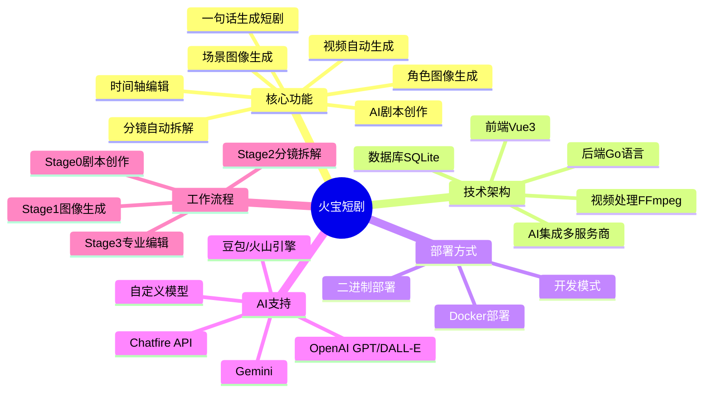

### 项目特色

✨ **全流程自动化**
- 从剧本到成片全部自动化处理
- AI 驱动的角色与场景提取
- 智能分镜脚本生成
- 批量图像与视频生成

🎨 **专业级制作工具**
- 可视化时间轴编辑器
- 支持分镜级别的精细调整
- 多种镜头类型与运动效果
- 视频转场与特效支持

🔌 **灵活的 AI 集成**
- 支持多种 AI 服务提供商
- 优先级机制实现自动故障转移
- 统一的配置管理界面
- 可自定义模型选择

📦 **开箱即用**
- Docker 一键部署
- 内置 SQLite 数据库
- 响应式 Web 界面
- 支持暗黑/明亮主题

## 系统架构

### 整体架构图

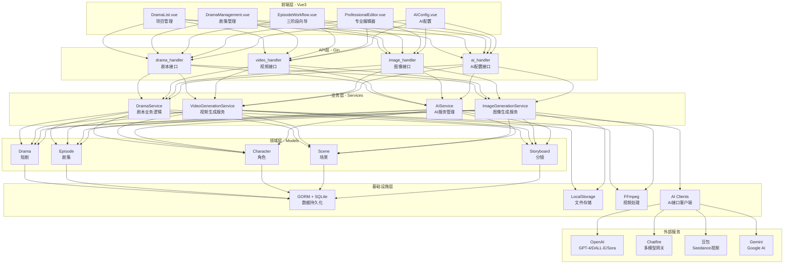

### 技术栈

#### 后端技术栈

| 组件 | 技术 | 版本 | 用途 |
|------|------|------|------|
| **语言** | Go | 1.23+ | 核心运行时 |
| **Web框架** | Gin | 1.9+ | REST API服务器 |
| **ORM** | GORM | 最新版 | 数据库抽象层 |
| **数据库** | SQLite | 3.x | 数据持久化 |
| **日志** | Zap | 最新版 | 结构化日志 |
| **视频处理** | FFmpeg | 4.0+ | 视频合并/剪辑 |

#### 前端技术栈

| 组件 | 技术 | 版本 | 用途 |
|------|------|------|------|
| **框架** | Vue | 3.4+ | 响应式UI |
| **语言** | TypeScript | 5+ | 类型安全 |
| **构建工具** | Vite | 5 | 开发服务器与打包 |
| **UI组件** | Element Plus | 最新版 | 组件库 |
| **CSS框架** | TailwindCSS | 最新版 | 样式工具 |
| **状态管理** | Pinia | 最新版 | 集中状态管理 |
| **路由** | Vue Router | 4 | 客户端路由 |

## 快速开始

### 前置要求

| 依赖项 | 版本 | 用途 | 必需性 |
|--------|------|------|--------|
| **FFmpeg** | 4.0+ | 视频处理与合并 | 所有部署方式 |
| **Docker** | 20.10+ | 容器运行时 | Docker部署 |
| **Go** | 1.23+ | 后端编译 | 源码编译 |
| **Node.js** | 18+ | 前端构建 | 源码编译 |

### Docker 快速部署（推荐）

Docker 是最快捷的部署方式，2分钟即可启动完整系统。

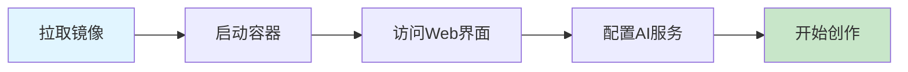

#### 1. 使用 docker-compose（最简单）

```bash
# 下载 docker-compose.yml
curl -O https://raw.githubusercontent.com/chatfire-AI/huobao-drama/master/docker-compose.yml

# 启动服务
docker-compose up -d

# 查看日志
docker-compose logs -f
```

#### 2. 使用 docker run

```bash
# 拉取并运行容器
docker run -d \
  --name huobao-drama \
  -p 5678:5678 \
  -v huobao-data:/app/data \
  --restart unless-stopped \
  huobao/huobao-drama:latest

# 查看运行状态
docker ps | grep huobao-drama

# 查看日志
docker logs -f huobao-drama
```

#### 3. 验证部署

```bash
# 检查健康状态
curl http://localhost:5678/health

# 检查API可用性
curl http://localhost:5678/api/v1/dramas
```

**预期输出：**
- Health 端点：`200 OK`
- Dramas 端点：`[]`（空数组，表示尚未创建项目）

#### 4. 访问 Web 界面

打开浏览器访问：`http://localhost:5678`

你将看到火宝短剧的主界面。

### 配置 AI 服务

在开始创作前，需要配置至少一个 AI 服务提供商。

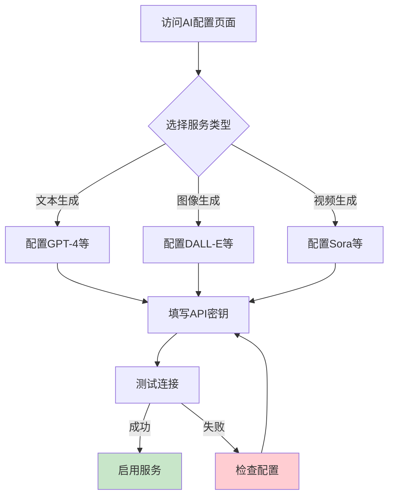

#### 配置步骤

1. **进入配置页面**
   - 点击页面右上角的"设置"按钮
   - 选择"AI服务配置"

2. **选择服务类型**
   - **文本生成**：用于剧本解析、角色提取、分镜拆解
   - **图像生成**：用于角色肖像和场景背景
   - **视频生成**：用于分镜视频生成

3. **添加配置**
   - 点击"添加配置"按钮
   - 选择提供商（OpenAI、Chatfire、豆包等）
   - 填写以下信息：

| 字段 | 说明 | 示例 |
|------|------|------|
| **提供商** | AI服务商名称 | `openai` |
| **模型** | 可用模型列表（JSON数组） | `["gpt-4", "gpt-4-turbo"]` |
| **API密钥** | 服务商提供的密钥 | `sk-...` |
| **Base URL** | API端点地址 | `https://api.openai.com/v1` |
| **优先级** | 数字越小优先级越高 | `1` |

4. **测试连接**
   - 点击"测试连接"按钮
   - 确认配置有效

5. **启用服务**
   - 切换"启用"开关
   - 保存配置

#### 最小配置要求

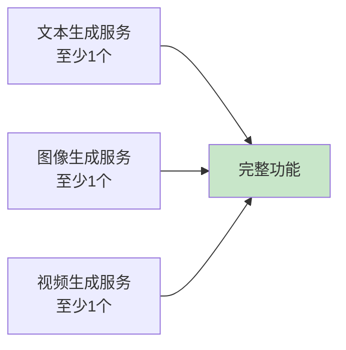

**推荐配置组合：**

- **文本生成**：OpenAI GPT-4 或 Chatfire（支持多模型）
- **图像生成**：OpenAI DALL-E-3 或 Midjourney
- **视频生成**：豆包 Seedance 或 OpenAI Sora

## 短剧制作工作流

火宝短剧采用四阶段线性工作流程，每个阶段必须完成后才能进入下一阶段，确保数据质量和一致性。

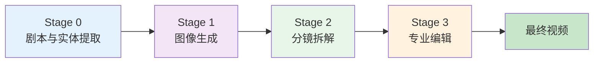

### Stage 0: 剧本与实体提取

这是创作的起点，支持 AI 生成或手动上传剧本。

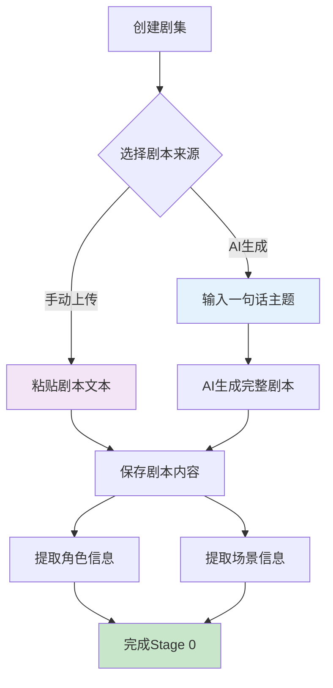

#### 操作步骤

1. **创建短剧项目**
   ```
   - 在主页点击"创建项目"
   - 填写短剧标题和描述
   - 点击"确认"
   ```

2. **创建剧集**
   ```
   - 进入短剧详情页
   - 在"剧集管理"标签页点击"创建剧集"
   - 选择剧集编号
   ```

3. **AI 生成剧本**
   ```
   - 选择"AI生成"选项
   - 输入主题，例如："一个程序员穿越到古代成为状元的故事"
   - 选择文本生成模型（如 GPT-4）
   - 点击"生成剧本"
   - 等待 AI 生成完整剧本内容
   ```

4. **或上传现有剧本**
   ```
   - 选择"上传剧本"选项
   - 在文本框中粘贴剧本内容
   - 点击"保存"
   ```

5. **提取角色与场景**
   ```
   - 点击"提取角色和场景"按钮
   - AI 会自动分析剧本
   - 提取出所有角色信息（姓名、描述、性别等）
   - 提取出所有场景信息（位置、时间、描述等）
   ```

#### 数据结构

提取后的数据包括：

**角色（Character）：**
- 姓名
- 角色描述
- 外貌特征
- 性别
- 年龄

**场景（Scene）：**
- 场景位置
- 时间（白天/夜晚）
- 场景描述
- 氛围

#### 状态验证

完成此阶段后，你将看到：
- ✅ 剧本内容已保存
- ✅ 角色列表已生成（如：主角、配角等）
- ✅ 场景列表已生成（如：皇宫大殿、书房等）

### Stage 1: 图像生成

为每个角色和场景生成视觉素材。

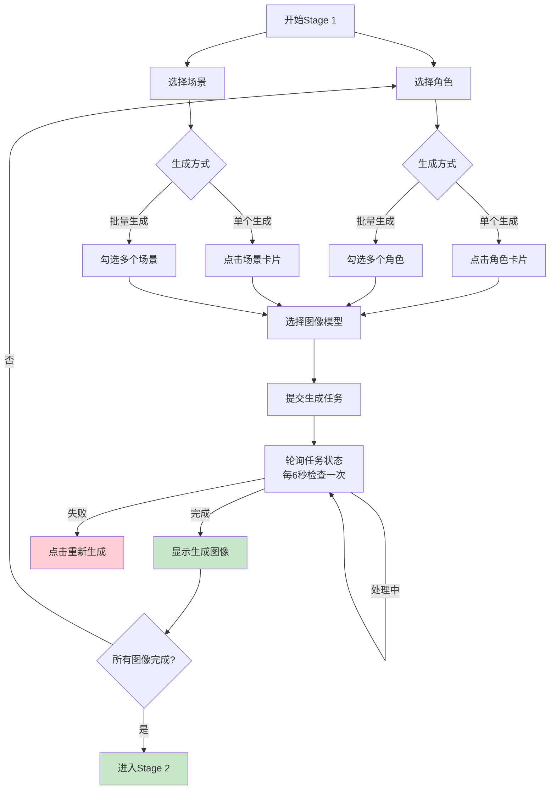

#### 操作步骤

1. **单个角色图像生成**
   ```
   - 在角色卡片上点击"生成图像"按钮
   - 选择图像生成模型（如 DALL-E-3）
   - 系统会自动根据角色描述生成 Prompt
   - 等待生成完成（通常 10-30 秒）
   ```

2. **批量角色图像生成**
   ```
   - 勾选多个角色的复选框
   - 或点击"全选"按钮
   - 点击"批量生成角色图像"按钮
   - 选择模型
   - 所有选中的角色将依次生成
   ```

3. **场景图像生成**
   ```
   - 操作与角色生成类似
   - 在"场景"区域选择场景
   - 单个或批量生成
   ```

#### 生成状态说明

| 状态 | 标识 | 说明 |
|------|------|------|
| **待生成** | 灰色占位符 | 尚未提交生成任务 |
| **排队中** | 橙色标签+旋转图标 | 任务已提交，等待处理 |
| **处理中** | 橙色标签+旋转图标 | AI 正在生成图像 |
| **已完成** | 显示图像 | 生成成功，图像可用 |
| **失败** | 红色错误图标 | 生成失败，可点击重试 |

#### 轮询机制

系统使用自动轮询机制检查任务状态：
- **轮询间隔**：6 秒
- **最大尝试次数**：100 次
- **超时时间**：10 分钟

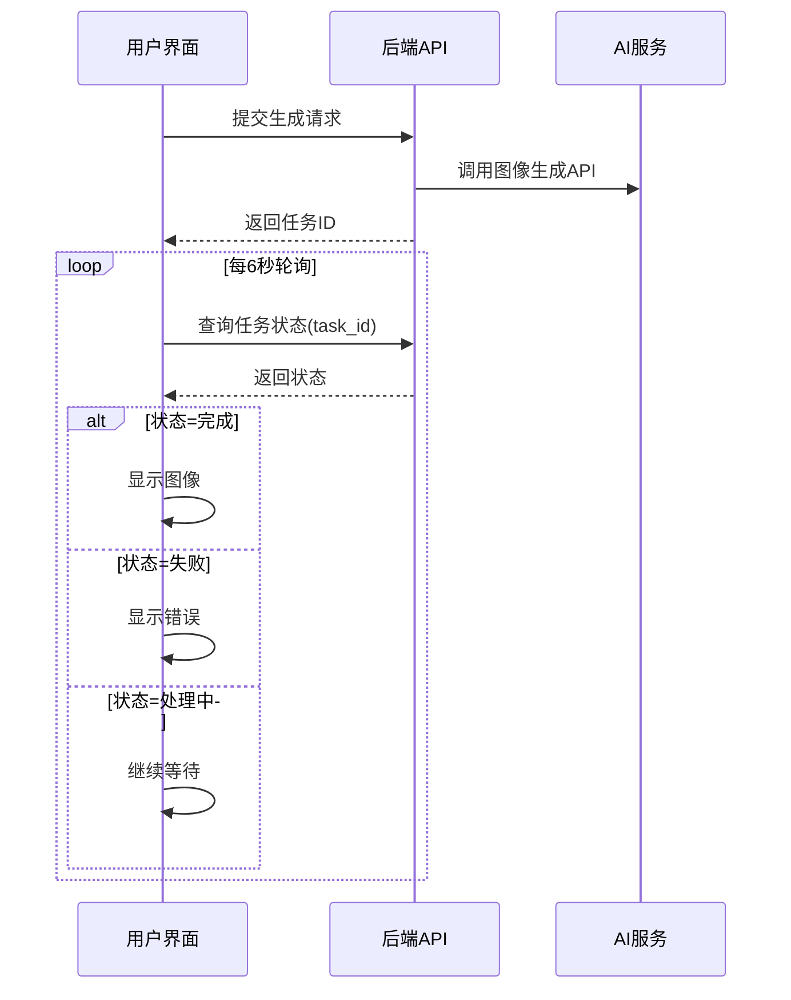

#### 注意事项

- ⚠️ 必须所有角色和场景都有图像才能进入下一阶段
- 💡 可以随时修改角色描述后重新生成
- 🔄 生成失败的图像可以点击卡片重试
- 📦 生成的图像会自动缓存到本地存储

### Stage 2: 分镜拆解

AI 自动将剧本拆解为详细的分镜脚本。

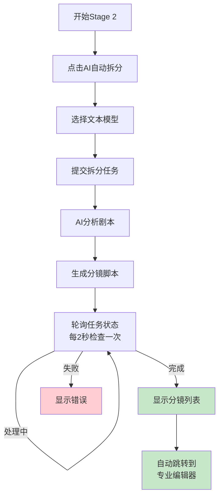

#### 操作步骤

1. **启动分镜拆解**
   ```
   - 在 Stage 2 页面点击"AI 自动拆分分镜"
   - 选择文本生成模型（推荐 GPT-4）
   - 点击"确认"
   ```

2. **等待 AI 处理**
   ```
   - AI 会分析剧本内容
   - 识别场景变化和对话节点
   - 生成完整的分镜脚本
   - 处理时间取决于剧本长度（通常 1-3 分钟）
   ```

3. **查看生成结果**
   ```
   - 任务完成后，系统会显示分镜总数
   - 点击"查看详情"可预览分镜列表
   ```

4. **自动跳转**
   ```
   - 拆解完成后会自动跳转到"专业编辑器"
   - 或手动点击"进入专业编辑器"按钮
   ```

#### 分镜数据结构

每个分镜（Storyboard）包含：

| 字段 | 说明 | 示例 |
|------|------|------|
| **sequence** | 镜头序号 | `1` |
| **shot_type** | 镜头类型 | `特写`、`全景`、`中景` |
| **movement** | 运镜方式 | `推进`、`拉远`、`固定` |
| **action** | 动作描述 | "李明打开房门，环顾四周" |
| **dialogue** | 对白内容 | "这里就是传说中的藏书阁？" |
| **duration** | 镜头时长（秒） | `5` |
| **image_prompt** | 图像生成提示词 | 自动生成 |
| **video_prompt** | 视频生成提示词 | 自动生成 |

#### 轮询机制

- **轮询间隔**：2 秒
- **无超时限制**：持续轮询直到完成
- **进度显示**：实时显示拆解进度

### Stage 3: 专业编辑器

这是最终的视频制作阶段，提供可视化的时间轴编辑器。

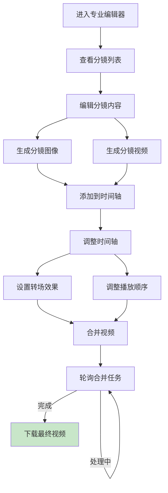

#### 界面布局

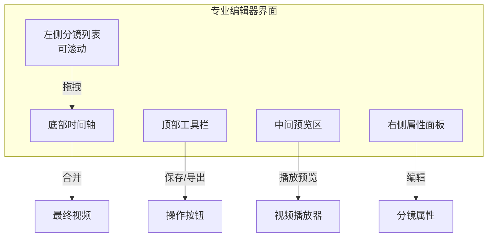

#### 操作步骤

##### 1. 编辑分镜

```
- 点击左侧分镜卡片
- 在右侧面板编辑内容：
  * 标题
  * 镜头类型（特写/中景/全景/远景）
  * 运镜方式（推进/拉远/摇移/固定）
  * 动作描述
  * 对白内容
  * 时长（秒）
  * 图像提示词
  * 视频提示词
- 点击"保存"按钮
```

##### 2. 生成分镜图像

```
分镜支持四种画面类型：
1. 起始帧：视频开始画面
2. 结束帧：视频结束画面
3. 参考图：用于视频生成的参考
4. 定格画面：视频的固定画面

操作：
- 选择画面类型
- 点击"生成图像"按钮
- 选择图像模型
- 等待生成完成
```

##### 3. 生成分镜视频

```
- 确保已有起始帧或参考图
- 点击"生成视频"按钮
- 选择视频生成模型
- 视频会根据提示词自动生成
- 轮询间隔：5秒
- 预计时长：5-15分钟（取决于服务商）
```

##### 4. 管理时间轴

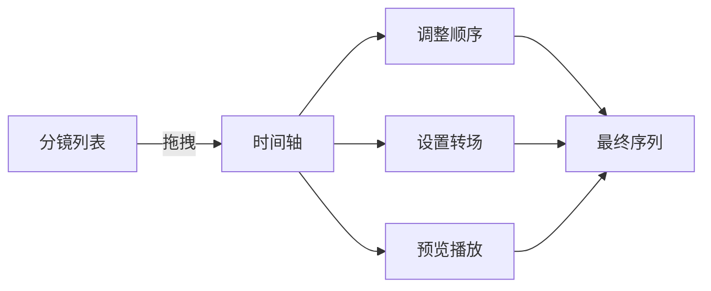

操作：
- **添加到时间轴**：拖拽分镜卡片到时间轴区域
- **调整顺序**：在时间轴内拖拽重新排序
- **设置转场**：点击时间轴片段间的连接点
  - 淡入淡出（Fade）
  - 切换（Cut）
  - 溶解（Dissolve）
- **预览播放**：点击播放按钮预览效果

##### 5. 合并最终视频

```
- 确认时间轴内所有片段就绪
- 点击"合并视频"按钮
- FFmpeg 会在后台合并所有片段
- 应用转场效果和音频
- 轮询合并状态（每3秒检查）
- 合并完成后显示下载按钮
```

#### 视频生成流程

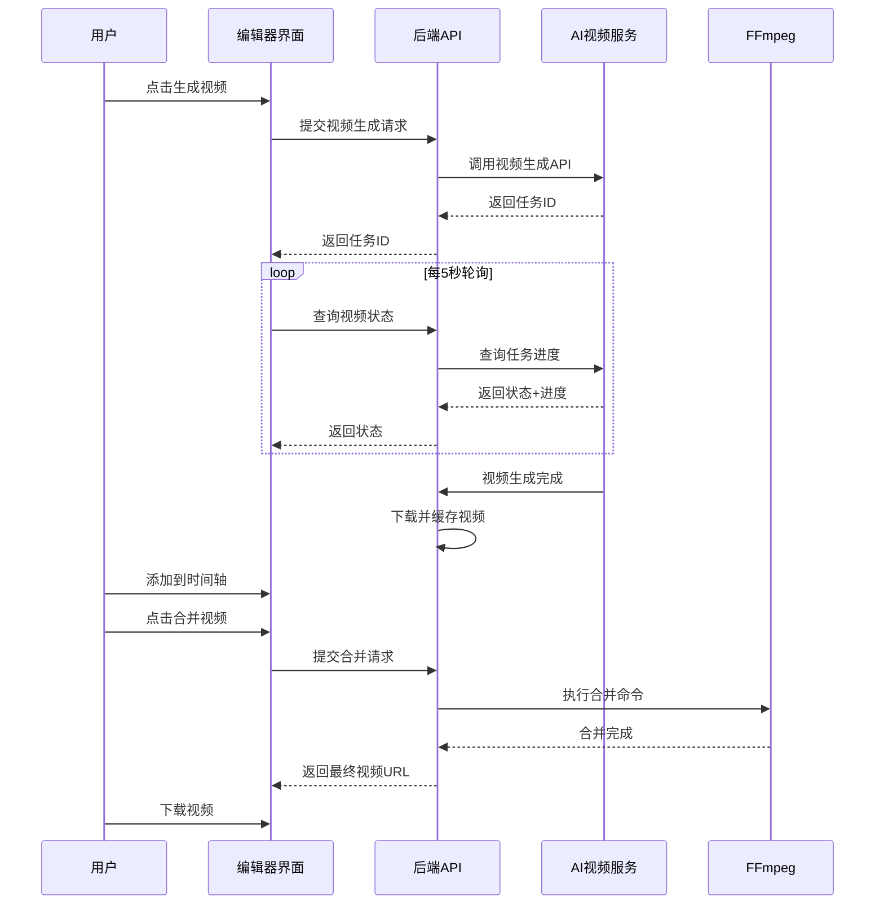

#### 高级功能

**批量生成视频**
```
- 勾选多个分镜
- 点击"批量生成视频"
- 所有选中分镜会依次生成
- 可在后台继续编辑
```

**参考图上传**
```
- 点击分镜卡片
- 选择"参考图"类型
- 点击"上传图像"
- 选择本地图片文件
- 该图片将用于视频生成参考
```

**视频库功能**
```
- 查看所有已生成的视频
- 按分镜筛选
- 重新使用已有视频
- 删除无用视频
```

## 数据模型关系

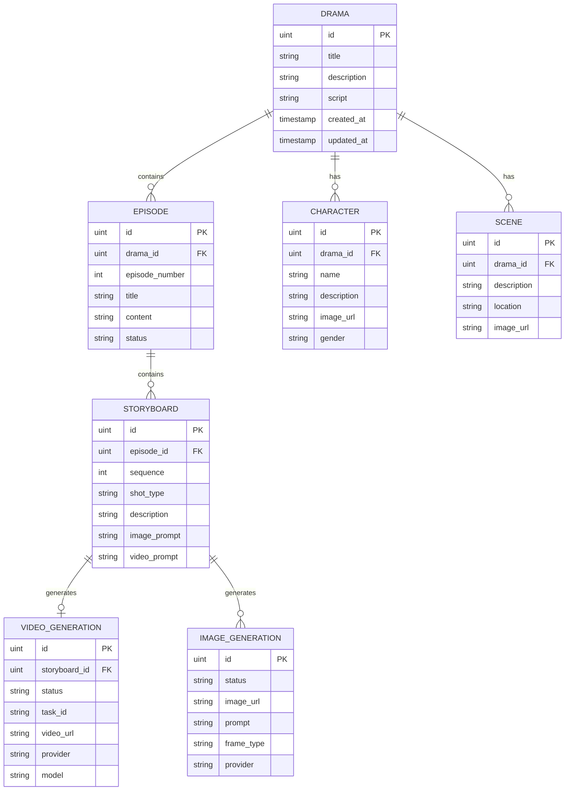

## 常见问题与解决方案

### 安装与部署

#### Q1: Docker 容器如何访问主机的 Ollama？

**问题**：使用 Docker 部署时，容器内无法访问主机上运行的 Ollama 服务。

**解决方案**：

```bash
# 1. 确保 Ollama 监听所有接口
export OLLAMA_HOST=0.0.0.0:11434 && ollama serve

# 2. 在容器内使用特殊域名
# Base URL 配置为：http://host.docker.internal:11434/v1

# 3. Linux 用户需要添加额外参数
docker run --add-host=host.docker.internal:host-gateway ...
```

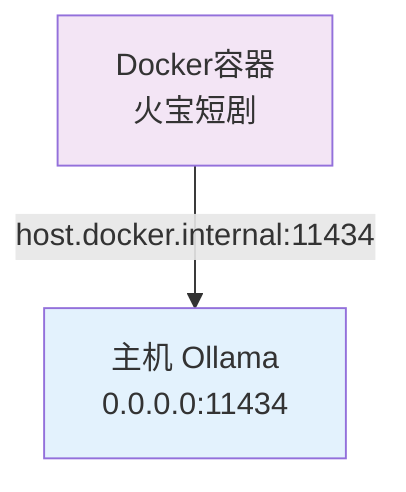

**AI 配置界面设置**：
- Base URL: `http://host.docker.internal:11434/v1`
- Provider: `openai`（Ollama 兼容 OpenAI API）
- Model: `qwen2.5:latest`（或其他已拉取的模型）

#### Q2: FFmpeg 未安装或找不到？

**问题**：启动时提示 `FFmpeg not found`。

**解决方案**：

```bash
# macOS
brew install ffmpeg

# Ubuntu/Debian
sudo apt update && sudo apt install ffmpeg

# 验证安装
ffmpeg -version
```

**Docker 用户无需手动安装**，镜像已包含 FFmpeg。

#### Q3: 前端无法连接后端 API？

**问题**：浏览器控制台显示 CORS 错误或连接拒绝。

**解决方案**：

1. **检查后端是否运行**
   ```bash
   curl http://localhost:5678/health
   ```

2. **检查端口是否正确**
   - 默认端口：`5678`
   - 修改配置：`configs/config.yaml` 中的 `server.port`

3. **开发模式代理配置**
   - 前端开发服务器：`http://localhost:3012`
   - 代理配置文件：`web/vite.config.ts`
   - 确保 `proxy` 目标指向 `http://localhost:5678`

#### Q4: SQLite 写入权限错误？

**问题**：日志显示 `attempt to write a readonly database`。

**原因**：数据库文件或目录权限不足。

**解决方案**：

```bash
# 1. 检查当前运行用户
sudo systemctl status huobao-drama | grep "Main PID"
ps aux | grep huobao-drama

# 2. 修复权限（将 YOUR_USER 替换为实际用户）
sudo chown -R YOUR_USER:YOUR_USER /opt/huobao-drama/data
sudo chmod -R 755 /opt/huobao-drama/data

# 3. 验证权限
ls -la /opt/huobao-drama/data

# 4. 重启服务
sudo systemctl restart huobao-drama
```

**Docker 部署自动处理权限**，无需手动设置。

### 使用问题

#### Q5: 图像生成一直显示"处理中"？

**可能原因**：
1. AI 服务配置错误
2. API 密钥无效
3. 余额不足
4. 网络连接问题

**排查步骤**：

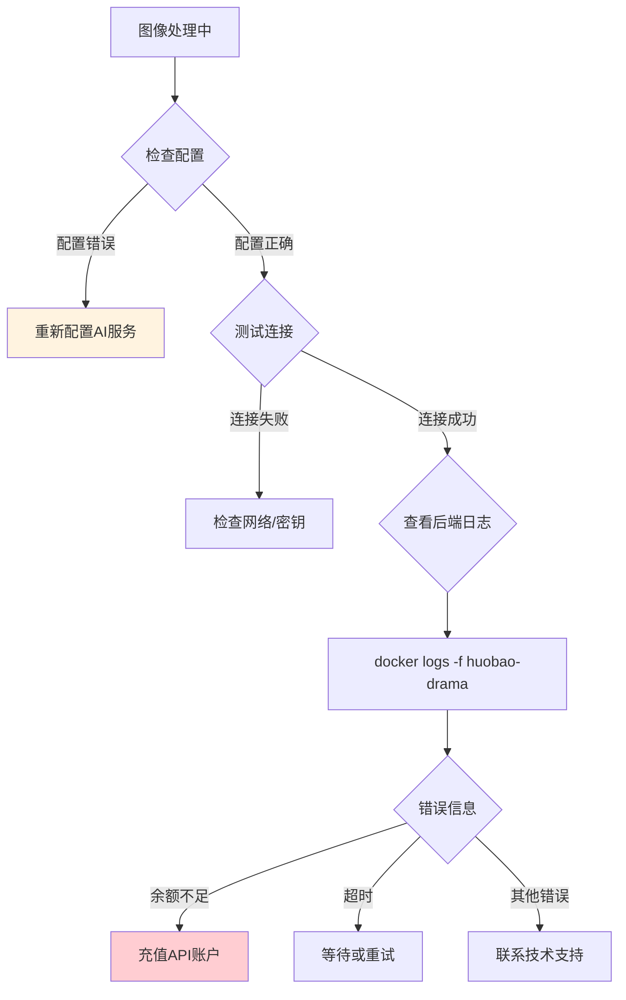

**操作**：
1. 进入 AI 配置页面
2. 点击"测试连接"按钮
3. 查看返回的错误信息
4. 根据错误信息调整配置

#### Q6: 视频合并失败？

**问题**：点击"合并视频"后任务失败。

**可能原因**：
1. FFmpeg 未正确安装
2. 视频文件损坏
3. 磁盘空间不足
4. 文件路径权限问题

**解决方案**：

```bash
# 1. 检查 FFmpeg
ffmpeg -version

# 2. 检查磁盘空间
df -h

# 3. 检查日志
# Docker:
docker logs huobao-drama | grep -i "error"

# 二进制:
tail -f logs/app.log | grep -i "error"

# 4. 手动测试 FFmpeg
ffmpeg -i test.mp4 -c copy output.mp4
```

#### Q7: 分镜拆解结果不理想？

**问题**：AI 拆解的分镜脚本不符合预期。

**优化建议**：

1. **优化剧本格式**
   ```
   ✅ 推荐格式：
   场景：皇宫大殿 - 白天
   人物：李明（穿着状元服）
   动作：李明跪拜皇帝，接过圣旨
   对白：李明："谢主隆恩！"
   
   ❌ 避免格式：
   李明来到皇宫见皇帝并接过圣旨说谢主隆恩
   ```

2. **调整 AI 模型**
   - 推荐使用 GPT-4 或更高级模型
   - 避免使用 GPT-3.5 等较弱模型

3. **手动调整**
   - 在专业编辑器中修改分镜内容
   - 添加或删除分镜
   - 调整镜头类型和时长

#### Q8: 如何备份数据？

**方法 1：Docker 数据卷备份**

```bash
# 查看数据卷位置
docker volume inspect huobao-data

# 创建备份
docker run --rm \
  -v huobao-data:/data \
  -v $(pwd):/backup \
  alpine tar czf /backup/huobao-backup-$(date +%Y%m%d).tar.gz /data

# 恢复备份
docker run --rm \
  -v huobao-data:/data \
  -v $(pwd):/backup \
  alpine sh -c "cd /data && tar xzf /backup/huobao-backup-YYYYMMDD.tar.gz --strip 1"
```

**方法 2：直接复制数据库**

```bash
# 备份
cp ./data/drama_generator.db ./backups/drama_generator.db.backup

# 恢复
cp ./backups/drama_generator.db.backup ./data/drama_generator.db
```

**备份内容包括**：
- SQLite 数据库（剧本、角色、场景、分镜等）
- 存储文件（生成的图像和视频）

**推荐备份频率**：每天或每周

## 高级配置

### 生产环境部署

#### 使用 Nginx 反向代理

```nginx
server {
    listen 80;
    server_name your-domain.com;

    # 主应用代理
    location / {
        proxy_pass http://localhost:5678;
        proxy_set_header Host $host;
        proxy_set_header X-Real-IP $remote_addr;
        proxy_set_header X-Forwarded-For $proxy_add_x_forwarded_for;
        proxy_set_header X-Forwarded-Proto $scheme;
        
        # WebSocket 支持（如需要）
        proxy_http_version 1.1;
        proxy_set_header Upgrade $http_upgrade;
        proxy_set_header Connection "upgrade";
    }

    # 静态文件直接访问
    location /static/ {
        alias /opt/huobao-drama/data/storage/;
        expires 30d;
        add_header Cache-Control "public, immutable";
    }

    # HTTPS 配置（推荐）
    # listen 443 ssl http2;
    # ssl_certificate /path/to/cert.pem;
    # ssl_certificate_key /path/to/key.pem;
}
```

#### systemd 服务配置

```ini
# /etc/systemd/system/huobao-drama.service
[Unit]
Description=Huobao Drama Service
After=network.target

[Service]
Type=simple
User=www-data
WorkingDirectory=/opt/huobao-drama
ExecStart=/opt/huobao-drama/huobao-drama
Restart=on-failure
RestartSec=10

# 环境变量
Environment="GIN_MODE=release"

# 资源限制
LimitNOFILE=65535

[Install]
WantedBy=multi-user.target
```

**启动服务**：

```bash
sudo systemctl daemon-reload
sudo systemctl enable huobao-drama
sudo systemctl start huobao-drama
sudo systemctl status huobao-drama
```

### 性能优化

#### 数据库优化

SQLite 默认配置已优化，但可根据需要调整：

```yaml
# configs/config.yaml
database:
  type: sqlite
  path: ./data/drama_generator.db
  max_idle: 10        # 最大空闲连接
  max_open: 100       # 最大打开连接
  conn_max_lifetime: 3600  # 连接最大生命周期（秒）
```

#### 存储优化

**本地存储配置**：

```yaml
storage:
  type: local
  local_path: ./data/storage
  base_url: http://your-domain.com/static
  max_file_size: 104857600  # 100MB
  allowed_types:
    - image/jpeg
    - image/png
    - video/mp4
```

**定期清理**：

```bash
# 清理失败的生成任务文件
find ./data/storage -type f -name "*.tmp" -mtime +7 -delete

# 清理孤立文件（数据库中不存在的文件）
# 需要自定义脚本
```

#### 视频处理优化

**FFmpeg 参数调优**：

- **硬件加速**（如有 GPU）：
  ```go
  // 在代码中启用硬件加速
  "-hwaccel", "cuda"  // NVIDIA GPU
  "-hwaccel", "videotoolbox"  // macOS
  ```

- **并发处理**：
  - 限制同时生成的视频数量
  - 避免 CPU 过载

### 监控与日志

#### 日志配置

```yaml
# configs/config.yaml
log:
  level: info        # debug, info, warn, error
  format: json       # json 或 text
  output: stdout     # stdout 或文件路径
  file_path: ./logs/app.log
  max_size: 100      # MB
  max_backups: 3     # 保留日志文件数
  max_age: 28        # 天
```

#### 健康检查

```bash
# 手动检查
curl http://localhost:5678/health

# 使用监控工具
# Prometheus + Grafana
# 可添加自定义指标
```

#### Docker 日志

```bash
# 查看实时日志
docker logs -f huobao-drama

# 查看最近 100 行
docker logs --tail 100 huobao-drama

# 导出日志
docker logs huobao-drama > huobao-drama.log 2>&1
```

## 最佳实践

### 剧本创作建议

1. **明确场景划分**
   - 每个场景独立段落
   - 标注时间和地点
   - 清晰的场景转换

2. **角色描述详细**
   - 外貌特征（发型、服装、年龄）
   - 性格特点
   - 关键道具

3. **对白简洁**
   - 每句对白独立一行
   - 避免过长独白
   - 标注说话人

### 图像生成技巧

1. **优化提示词**
   - 包含风格描述（如："动漫风格"、"写实风格"）
   - 指定光线（"柔和光线"、"戏剧性光影"）
   - 添加氛围词（"温馨的"、"紧张的"）

2. **一致性控制**
   - 为同一角色使用相似的提示词结构
   - 保持风格统一
   - 可使用参考图功能

3. **批量生成**
   - 同类型素材批量生成
   - 节省时间
   - 便于统一调整

### 视频制作流程

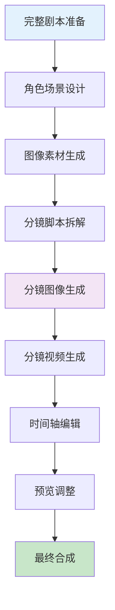

**推荐工作顺序**：
1. 先完成所有图像生成
2. 再进行分镜拆解
3. 批量生成分镜视频
4. 最后统一编辑时间轴

### 成本控制

1. **API 使用优化**
   - 使用缓存避免重复生成
   - 选择性价比高的模型
   - 批量生成降低单价

2. **存储管理**
   - 定期清理无用素材
   - 压缩存储历史项目
   - 使用对象存储（可选）

3. **模型选择**
   ```
   文本生成：
   - 预算充足：GPT-4
   - 性价比：GPT-3.5 Turbo
   - 本地化：Ollama + Qwen
   
   图像生成：
   - 高质量：DALL-E-3
   - 快速迭代：Stable Diffusion
   - 成本优先：Midjourney
   
   视频生成：
   - 商业级：OpenAI Sora
   - 稳定性：豆包 Seedance
   - 实验性：Runway Gen-2
   ```

## 社区与支持

### 官方资源

- 🏠 **GitHub 仓库**：[https://github.com/chatfire-AI/huobao-drama](https://github.com/chatfire-AI/huobao-drama)
- 📚 **技术文档**：[https://deepwiki.com/chatfire-AI/huobao-drama](https://deepwiki.com/chatfire-AI/huobao-drama)
- 📧 **联系邮箱**：18550175439@163.com

### 问题反馈

**提交 Issue 时请包含**：
1. 问题描述
2. 复现步骤
3. 系统环境（OS、Docker版本等）
4. 日志片段
5. 截图（如有）

### 贡献指南

欢迎贡献代码或提交 Pull Request：

1. Fork 项目
2. 创建功能分支（`git checkout -b feature/AmazingFeature`）
3. 提交更改（`git commit -m 'Add some AmazingFeature'`）
4. 推送到分支（`git push origin feature/AmazingFeature`）
5. 创建 Pull Request

## 更新日志

### v1.0.4 (2026-01-27)

#### 🚀 重大更新
- ✨ 引入本地存储策略，缓存生成内容，缓解外部资源链接过期风险
- 🖼️ 实现参考图 Base64 编码传输
- 🐛 修复切换分镜时镜头图像提示词状态未重置的问题
- 🐛 修复添加库视频时视频时长显示为 0 的问题
- ✨ 添加场景迁移到剧集功能

#### 历史数据迁移
- 📦 添加迁移脚本处理历史数据（详见 `MIGRATE_README.md`）

### v1.0.3 (2026-01-16)

#### 🚀 重大更新
- 🔧 纯 Go SQLite 驱动（`modernc.org/sqlite`），支持 `CGO_ENABLED=0` 跨平台编译
- ⚡ 优化并发性能（WAL 模式），解决"database is locked"错误
- 🐳 Docker 跨平台支持 `host.docker.internal` 访问主机服务
- 📝 精简文档和部署指南

### v1.0.2 (2026-01-14)

#### 🐛 Bug 修复 / 🔧 改进
- 🐛 修复视频生成 API 响应解析问题
- ✨ 添加 OpenAI Sora 视频端点配置
- 🔧 优化错误处理和日志记录

## 结语

火宝短剧通过 AI 技术极大地降低了短剧制作的门槛，让个人创作者也能快速产出专业级的短剧作品。无论你是内容创作者、营销人员，还是技术爱好者，都可以通过这个平台实现自己的创意想法。

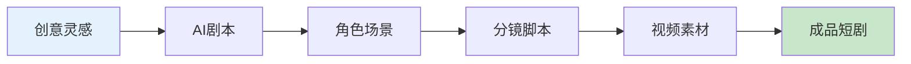

开始你的短剧创作之旅吧！🎬

---

**项目地址**：<https://github.com/chatfire-AI/huobao-drama>

**技术支持**：如有问题欢迎提交 Issue 或发送邮件至 18550175439@163.com

**⭐ 如果这个项目对你有帮助，请给它一个 Star！**

